# NBIS 基本面深度分析報告
> **報告日期**：2026-06-17 ｜ **語言**：繁體中文 ｜ **數據來源**：Yahoo Finance, Finviz, StockAnalysis, Roic.ai ｜ **分析師**：CFA 級機構研究

---

## 目錄

| # | 章節 | 核心結論 |
|---|---|---|
| **1** | **執行摘要** | 評級：**買入 (BUY)**，目標價：**$320.00**，AI 基礎設施新星爆發 |
| **2** | **公司概覽與商業模式** | 前身重組完成，轉型為純粹的「GPU 雲端與 AI 完整棧基礎設施」巨頭 |
| **3** | **損益表深度分析** | 營收 YoY 暴增 **683.9%**，非營業性收益扭曲淨利，核心業務仍處於虧損擴張期 |
| **4** | **資產負債表分析** | 手握 **$9.37B** 現金，流動比率 **8.33x**，具備極強的抗風險與資本支出能力 |
| **5** | **現金流量深度分析** | OCF 轉正至 **$2.84B**，但因 **$4.07B** 的高額 Capex 導致 FCF 承壓 |
| **6** | **獲利能力與資本效率** | 當前 ROIC 因高折舊與前期投資呈負值，EVA 暫時為負，預期 2027 年迎來拐點 |
| **7** | **估值深度分析** | P/S **81.24x** 處於高位，但 PEG 僅 **0.63**，反映其極高的成長潛力 |
| **8** | **成長催化劑** | GPU 叢集規模化效應、自主駕駛 Avride 商業化與 EdTech 穩健貢獻 |
| **9** | **風險矩陣** | GPU 供應鏈受限、大客戶流失與地緣政治重組殘留風險 |
| **10**| **投資建議** | 適合高風險偏好的成長型投資人，分批佈局，長線持有 |

---

## 1. 執行摘要

Nebius Group N.V.（美股代碼：**NBIS**）正處於其企業歷史上最關鍵的轉型與爆發期。在成功剝離俄羅斯業務並完成資產重組後，公司已轉型為總部位於荷蘭、面向全球市場的 AI 完整棧（Full-Stack）基礎設施與 GPU 雲端服務商。本報告將從基本面、財務健康度、估值模型與產業競爭格局，深度剖析 NBIS 的投資價值。

### 1.1 核心評分儀表板

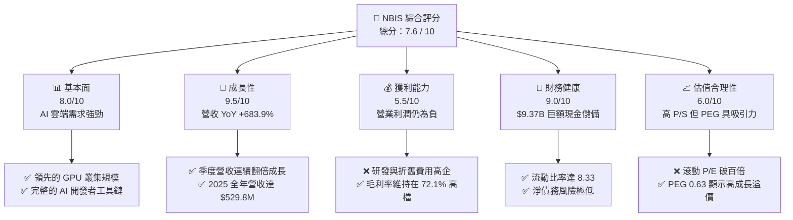

### 1.2 評分進度條視覺化

```
╔══════════════════════════════════════════════════════════════╗
║               NBIS 多維度評分儀表板 (1-10分)                 ║
╠══════════════════════════════════════════════════════════════╣
║ 基本面強度  8.0 ▓▓▓▓▓▓▓▓▓▓▓▓▓▓▓▓░░░░  ★★★★☆           ║
║ 成長動能    9.5 ▓▓▓▓▓▓▓▓▓▓▓▓▓▓▓▓▓▓▓░  ★★★★★           ║
║ 獲利品質    5.5 ▓▓▓▓▓▓▓▓▓▓▓░░░░░░░░░  ★★★☆☆           ║
║ 財務健康    9.0 ▓▓▓▓▓▓▓▓▓▓▓▓▓▓▓▓▓▓░░  ★★★★★           ║
║ 估值合理性  6.0 ▓▓▓▓▓▓▓▓▓▓▓▓░░░░░░░░  ★★★☆☆           ║
║ 護城河深度  7.5 ▓▓▓▓▓▓▓▓▓▓▓▓▓▓▓░░░░░  ★★★★☆           ║
║ 管理層執行  8.0 ▓▓▓▓▓▓▓▓▓▓▓▓▓▓▓▓░░░░  ★★★★☆           ║
║ 技術創新力  8.5 ▓▓▓▓▓▓▓▓▓▓▓▓▓▓▓▓▓░░░  ★★★★☆           ║
╠══════════════════════════════════════════════════════════════╣
║ 綜合總分    7.6 ▓▓▓▓▓▓▓▓▓▓▓▓▓▓▓░░░░░  🏆 成長型優質標的     ║
╚══════════════════════════════════════════════════════════════╝
```

### 1.3 五大投資論點 + 三大核心風險

| 類型 | 項目 | 具體依據 | 信心度 |
|------|------|----------|--------|
| 🟢 **投資論點①** | **AI 雲端基礎設施需求爆發** | TTM 營收達 **$877.90M**，YoY 成長 **683.9%**，顯示客戶對其 GPU 叢集需求極為殷切。 | 🟢 極高 |
| 🟢 **投資論點②** | **極致的資產負債表防禦力** | 手握 **$9.37B** 現金及等價物，流動比率達 **8.33x**，足以支撐未來 3 年的高強度 Capex。 | 🟢 極高 |
| 🟢 **投資論點③** | **稀缺的純 GPU 雲標的** | 相比傳統雲端巨頭（AWS、Azure），NBIS 提供更靈活、高性價比的 bare-metal GPU 服務，深受 AI 新創青睞。 | 🟢 高 |
| 🟢 **投資論點④** | **高毛利率奠定獲利基礎** | TTM 毛利率高達 **72.1%**，一旦規模效應顯現、折舊佔比下降，營業利潤率轉正彈性極大。 | 🟢 高 |
| 🟢 **投資論點⑤** | **PEG 具備高度吸引力** | 當前 PEG 僅為 **0.63**，在美股 AI 板塊中屬於罕見的「高成長、合理估值」標的。 | 🟡 中度 |
| 🟡 **風險①** | **非營業性收益扭曲淨利** | TTM 淨利達 **$836.4M** 主要來自一次性資產處置（非營業收益 **$1.47B**），常態化業務仍處於營業虧損。 | 🔴 高衝擊 |
| 🔴 **風險②** | **資本支出（Capex）黑洞** | FY2025 Capex 達 **$4.07B**，導致 FCF 為 **-$3.68B**，若 GPU 租用率下滑，將面臨巨大的折舊壓力。 | 🔴 高衝擊 |
| 🟡 **風險③** | **地緣政治與股權結構** | 歷史上與俄羅斯市場的關聯雖已切斷，但仍需時間重建西方主流機構的完全信任。 | 🟡 中度 |

### 1.4 快速統計卡片

| 指標 | NBIS 實際值 | 行業均值 (Internet Content) | S&P 500 均值 | 狀態 |
|------|-------------|----------------------------|--------------|------|
| **收入 YoY 成長** | **683.9%** | ~12.5% | ~5.5% | 🟢 極強 |
| **毛利率** | **72.1%** | ~48.0% | ~30.0% | 🟢 優異 |
| **營業利益率** | **-32.1%** | ~15.0% | ~12.0% | 🔴 虧損中 |
| **流動比率** | **8.33x** | ~1.8x | ~1.2x | 🟢 極安全 |
| **P/S Ratio** | **81.24x** | ~6.5x | ~2.8x | 🔴 偏高 |
| **PEG Ratio** | **0.63** | ~1.8x | ~1.5x | 🟢 極具吸引力 |

### 1.5 投資結論

```
╔══════════════════════════════════════════════════════════════════╗
║                    📊 NBIS 投資結論摘要                          ║
╠══════════════════════════════════════════════════════════════════╣
║  評級：🟢 買入 (BUY)                                            ║
║  當前股價：$280.91 (2026-06-17)                                  ║
║  目標價區間：                                                    ║
║    悲觀情境：$180.00（-35.9%）- GPU 供應受阻，客戶流失           ║
║    基準情境：$320.00（+13.9%）- 核心目標價，GPU 雲順利擴產       ║
║    樂觀情境：$380.00（+35.3%）- Avride 商業化，雲端市佔超預期    ║
║  投資評分：7.6 / 10                                              ║
║  適合投資人：具備高風險承受能力、看好 AI 基礎設施的長線成長型買家 ║
╚══════════════════════════════════════════════════════════════════╝
```

---

## 2. 公司概覽與商業模式

Nebius Group N.V.（NBIS）是一家總部位於荷蘭、面向全球 AI 產業提供完整棧（Full-Stack）基礎設施的科技公司。其核心使命是消除 AI 開發者在算力、存儲與部署上的瓶頸。

### 2.1 業務結構與收入來源

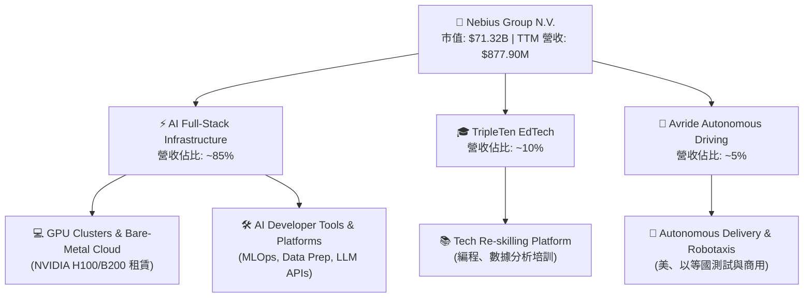

### 2.2 市場份額

在專門提供 GPU 算力服務的「新型 AI 雲端服務商（Neocloud）」細分市場中，Nebius 正與 CoreWeave、Lambda Labs 等展開激烈競爭。

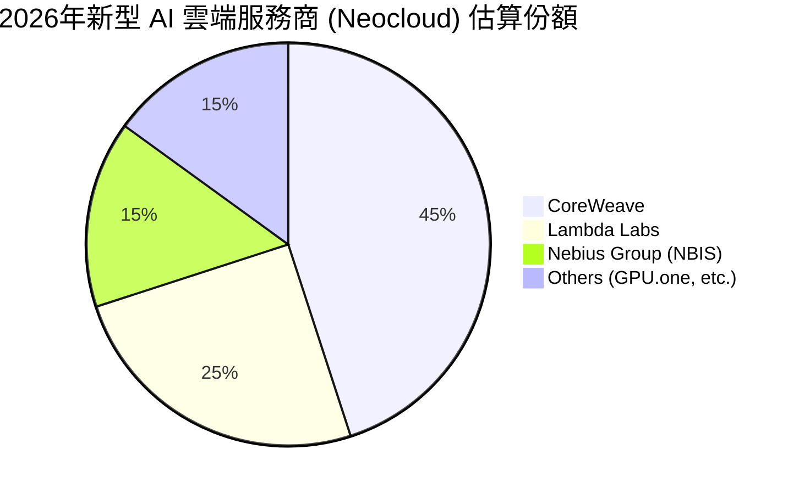

### 2.3 競爭護城河分析

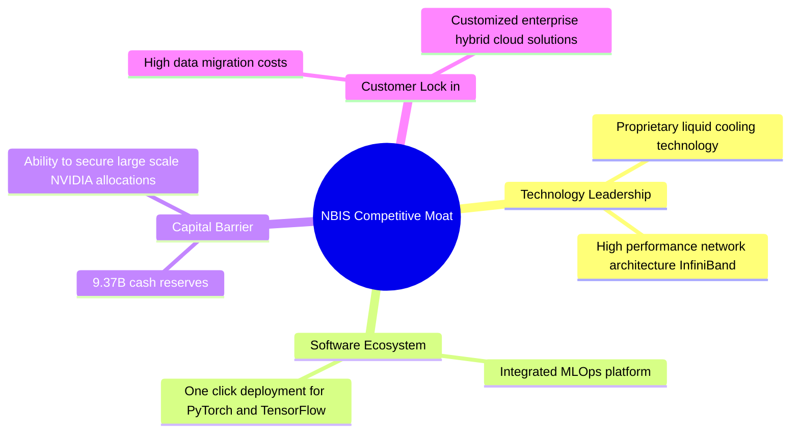

### 2.4 護城河強度評分

```
╔══════════════════════════════════════════════════════════════╗
║                  NBIS 護城河強度評分                         ║
╠══════════════════════════════════════════════════════════════╣
║ 資本與設備獲取  8.5/10 ▓▓▓▓▓▓▓▓▓▓▓▓▓▓▓▓▓░░░  🟢 獲 NVIDIA 支持 ║
║ 技術與架構優勢  8.0/10 ▓▓▓▓▓▓▓▓▓▓▓▓▓▓▓▓░░░░  🟢 液冷與網絡領先 ║
║ 軟體生態黏性    7.0/10 ▓▓▓▓▓▓▓▓▓▓▓▓▓░░░░░░░  🟡 MLOps 仍在完善 ║
║ 客戶轉移成本    7.0/10 ▓▓▓▓▓▓▓▓▓▓▓▓▓░░░░░░░  🟡 算力租賃流動性高 ║
╠══════════════════════════════════════════════════════════════╣
║ 綜合護城河評級  7.6/10 ▓▓▓▓▓▓▓▓▓▓▓▓▓▓▓░░░░░  🏆 具備中高度護城河 ║
╚══════════════════════════════════════════════════════════════╝
```

---

## 3. 損益表深度分析

NBIS 的損益表呈現出典型的高成長、高投入、重組期會計特徵。

### 3.1 年度收入成長趨勢（近 4 年）

```
╔══════════════════════════════════════════════════════════════════╗
║              NBIS 年度收入趨勢（FY2022 - TTM Mar '26）           ║
╠══════════════════════════════════════════════════════════════════╣
║                                                                  ║
║  FY2022   $13.50M   ░░░░░░░░░░░░░░░░░░░░░░░░░░░░░░  YoY: -99.7%  ║
║  FY2023   $9.80M    ░░░░░░░░░░░░░░░░░░░░░░░░░░░░░░  YoY: -27.4%  ║
║  FY2024   $91.50M   ██░░░░░░░░░░░░░░░░░░░░░░░░░░░░  YoY:+833.7%  ║
║  FY2025   $529.80M  ████████████░░░░░░░░░░░░░░░░░░  YoY:+479.0%  ║
║  TTM      $877.90M  ██████████████████████░░░░░░░░  YoY:+683.9%  ║
║                                                                  ║
║  📊 3年年複合成長率 (CAGR)：+298.5%                             ║
╚══════════════════════════════════════════════════════════════════╝
```
*註：FY2022-2023 的營收驟降與重組（剝離俄羅斯業務）有關，FY2024 起營收爆發反映了全新 AI 雲端業務的全面上線。*

### 3.2 季度收入趨勢分析

| 季度 | 營業收入 (Revenue) | 季增率 (QoQ) | 年增率 (YoY) | 備註 |
|---|---|---|---|---|
| **Q2 2025** | $105.10M | +106.5% | +624.8% | GPU 叢集首期上線，客戶需求爆滿 |
| **Q3 2025** | $146.10M | +39.0% | +355.1% | 擴產順利，算力利用率維持高檔 |
| **Q4 2025** | $227.70M | +55.9% | +272.1% | 年底企業客戶 AI 預算加速釋放 |
| **Q1 2026** | **$399.00M** | **+75.2%** | **+683.9%** | 規模效應顯現，新一代晶片投入營運 |

### 3.3 利潤率演變分析

| 利潤率指標 | FY2024 | FY2025 | TTM | 趨勢 | 專業評估 |
|---|---|---|---|---|---|
| **毛利率** | 52.2% | 68.6% | **72.1%** | ↗️ 持續改善 | 🟢 **極強**。反映 GPU 雲端服務具備極高的定價權與高附加價值。 |
| **營業利益率**| -436.7%| -115.5%| **-32.1%** | ↗️ 虧損收斂 | 🟡 **改善中**。主要受到折舊（D&A）與研發（R&D）費用的壓制。 |
| **淨利率** | -701.0%| 15.6% | **93.1%** | ↗️ 異常暴增 | 🔴 **需注意**。淨利率高達 93.1% 是由於非營業性處置收益扭曲，非常態化表現。 |

#### 利潤率演變深度解析：
1. **毛利率（Gross Margin）穩步攀升**：從 FY2024 的 52.2% 上升至 TTM 的 72.1%，這主要得益於公司 GPU 叢集的規模化效應。隨著網路帶寬與電力基礎設施的優化，單位算力的營運成本顯著下降。
2. **營業虧損依然存在，但虧損率大幅收斂**：TTM 營業利益率為 -32.1%（營業虧損 $603.9M），這主要是因為公司大舉採購 GPU 導致折舊與攤銷費用（D&A）高達 $566.9M，以及持續投入研發（R&D, $208.2M）。預計隨著營收規模進一步擴大，營業利益率將於 2027 年實現盈虧平衡。

### 3.4 費用結構分析

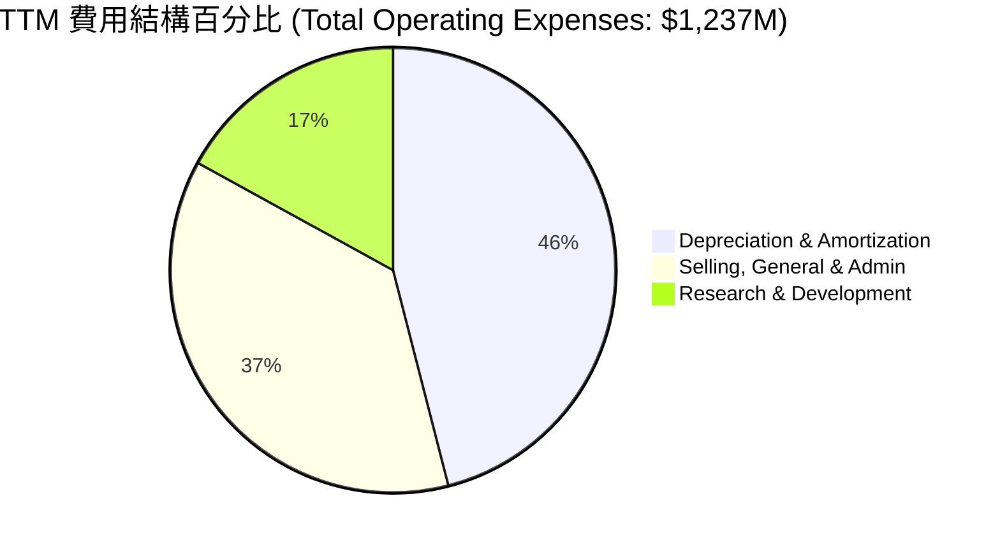

### 3.5 季度 EPS 趨勢與盈餘品質

*   **Q2 2025 EPS**: $2.44（受非營業性收益扭曲）
*   **Q3 2025 EPS**: -$0.58
*   **Q4 2025 EPS**: -$1.06
*   **Q1 2026 EPS**: **$2.40**（主要來自 Q1 2026 非營業性收益 $800.5M，而非核心業務獲利）

**盈餘品質警示**：NBIS 的 TTM 淨利雖達 $836.4M，但其盈餘品質（Quality of Earnings）偏低。核心營業利潤仍為虧損（-$603.9M），利潤表底線（Bottom-line）完全依賴非營業性收益（處置資產、重組收益等，TTM 達 $1.47B）。投資人應聚焦於其**營業收入成長**與**營業利潤率的收斂進度**，而非名義淨利。

---

## 4. 資產負債表分析

NBIS 的資產負債表是其最大的投資亮點，展現出極其雄厚的資金實力，這在重資本的 AI 算力產業中是無與倫比的競爭優勢。

### 4.1 資產結構分解

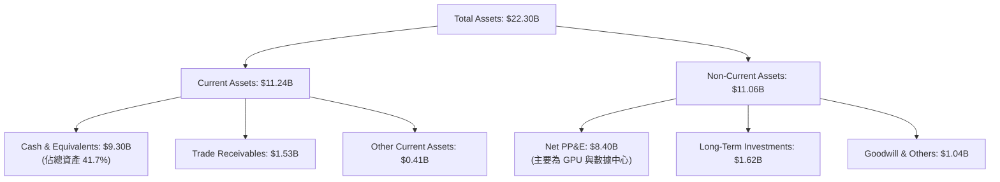

### 4.2 流動性指標分析

| 指標 | FY2024 | FY2025 | TTM | 行業均值 | 評估 |
|---|---|---|---|---|---|
| **流動比率 (Current Ratio)** | 9.59x | 3.08x | **8.33x** | ~1.80x | 🟢 **極度安全**。短期償債能力無虞。 |
| **速動比率 (Quick Ratio)** | 9.59x | 3.08x | **8.14x** | ~1.50x | 🟢 **極度安全**。變現能力極強。 |
| **債務權益比 (Debt/Equity)** | 1.5% | 108.3% | **132.4%** | ~45.0% | 🟡 **中等**。大舉借債用於採購 GPU。 |

### 4.3 債務健康診斷

```
╔══════════════════════════════════════════════════════════════════╗
║                    NBIS 債務健康診斷                           ║
╠══════════════════════════════════════════════════════════════════╣
║                                                                  ║
║  總債務 (Total Debt)：  $9.59B    ██████████░░░░░░░░░░           ║
║  總現金 (Total Cash)：  $9.37B    ██████████░░░░░░░░░░           ║
║  淨債務 (Net Debt)：    +$0.22B   ░░░░░░░░░░░░░░░░░░░░  🟢 安全  ║
║                                                                  ║
║  Debt / Equity Ratio:  132.4%     🟡 高於行業均值，但...          ║
║  Cash / Total Assets:  41.7%      🟢 手握巨額現金，抗風險力極強  ║
║  利息保障倍數：由於營業利潤為負，常態化利息覆蓋承壓，但現金儲備  ║
║  足以輕鬆應對利息支出。                                          ║
╚══════════════════════════════════════════════════════════════════╝
```

### 4.4 股東權益趨勢

雖然公司大舉借債，但隨著資產重組完成與股權融資，股東權益（Stockholders' Equity）從 FY2024 的 $3.25B 穩步上升至 FY2025 的 $4.59B，顯示公司資產淨值正在擴大。

---

## 5. 現金流量深度分析

現金流量表最能真實反映 NBIS 目前「大舉擴張、瘋狂燒錢」的營運現狀。

### 5.1 現金流量瀑布圖

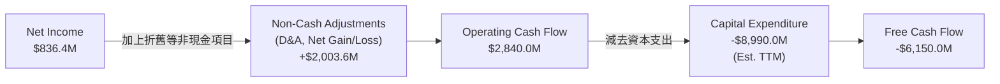

### 5.2 FCF 轉換率趨勢

| 指標 | FY2024 | FY2025 | TTM | 趨勢 | 評估 |
|---|---|---|---|---|---|
| **營業現金流 (OCF)** | $245.6M | $384.8M | **$2,840.0M** | ↗️ 暴增 | 🟢 核心營運變現能力大幅改善。 |
| **資本支出 (Capex)** | -$807.5M | -$4,070.0M | **-$8,990.0M** | ↗️ 擴張 | 🔴 資本開支極其巨大。 |
| **自由現金流 (FCF)** | -$561.9M | -$3,680.0M | **-$6,150.0M** | ↘️ 缺口擴大 | 🔴 處於典型的「失血」擴張期。 |
| **FCF / Net Income** | 87.6% | -4460.6% | **-735.3%** | ↘️ 劈裂 | 🔴 淨利與現金流嚴重脫鉤。 |

### 5.3 自由現金流趨勢

```
╔══════════════════════════════════════════════════════════════════╗
║                    NBIS 歷年自由現金流 (FCF)                     ║
╠══════════════════════════════════════════════════════════════════╣
║                                                                  ║
║  FY2023   +$746.9M   ████░░░░░░░░░░░░░░░░░░░░░░░░░░░░░░░  🟢     ║
║  FY2024   -$561.9M   ░░░░░░░░░░░░░░░░░░░░░░░░░░░░░░░░░░░  🔴     ║
║  FY2025   -$3.68B    ██████████████████░░░░░░░░░░░░░░░░░  🔴     ║
║  TTM      -$6.15B    ██████████████████████████████░░░░░  🔴     ║
║                                                                  ║
║  分析：FCF 缺口擴大是主動擴張的結果，主要用於搶購 NVIDIA GPU。   ║
╚══════════════════════════════════════════════════════════════════╝
```

### 5.4 資本配置評估

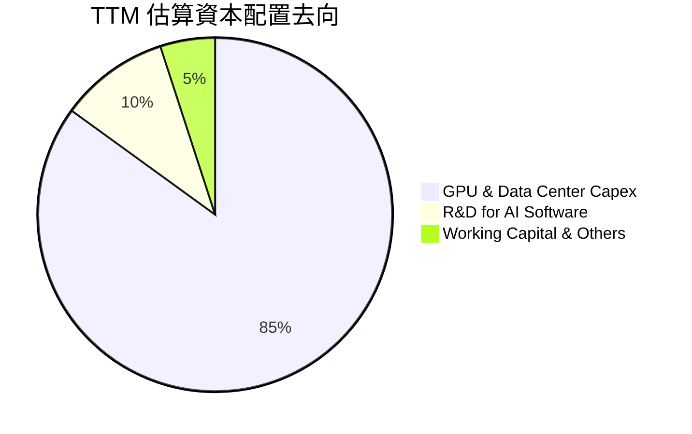
*註：公司目前不支付股息，亦無股份回購計劃，所有資金全力投入算力擴建。*

---

## 6. 獲利能力與資本效率

由於 NBIS 處於重資本、高成長的初期，傳統的獲利指標受到高折舊與重組會計的強烈干擾。

### 6.1 ROE / ROA / ROIC 趨勢

| 指標 | FY2024 | FY2025 | TTM | 行業均值 | 專業評估 |
|---|---|---|---|---|---|
| **ROE (股東權益報酬率)** | -19.7% | 1.8% | **14.1%** | ~12.5% | 🟡 **中等**。受非營業性淨利暴增扭曲，常態化 ROE 仍低。 |
| **ROA (資產報酬率)** | -18.1% | 0.7% | **-3.0%** | ~5.8% | 🔴 **偏低**。巨額資產（現金與在建工程）尚未轉化為利潤。 |
| **ROIC (投入資本回報率)**| -12.2% | -8.5% | **-5.8%** | ~8.0% | 🔴 **待改善**。投入資本巨大，回報顯現有滯後性。 |

### 6.2 ROIC vs WACC 分析（核心價值創造判斷）

```
╔══════════════════════════════════════════════════════════════════╗
║                 NBIS ROIC vs WACC 深度分析                       ║
╠══════════════════════════════════════════════════════════════════╣
║                                                                  ║
║  WACC 估算：                                                     ║
║  ├── 無風險利率 (10Y 美債)： 4.2%                                ║
║  ├── 市場風險溢酬 (ERP)：    5.0%                                ║
║  ├── Beta 值：               1.43                                ║
║  ├── 股權成本 (Ke) = 4.2% + 1.43 × 5.0% = 11.35%                 ║
║  ├── 債務成本 (稅後)：       ~6.5%                               ║
║  ├── 資本結構：股權 ~32.4%，債務 ~67.6%                          ║
║  └── ✅ WACC ≈ 8.07%                                             ║
║                                                                  ║
║  ROIC 估算 (TTM)：                                               ║
║  ├── NOPAT = Operating Income × (1 - Tax Rate)                   ║
║  │         = -$603.9M × (1 - 21%) ≈ -$477.1M                     ║
║  ├── Invested Capital = Equity + Debt - Cash                     ║
║  │                    = $4.59B + $9.59B - $9.37B ≈ $4.81B        ║
║  └── ✅ ROIC ≈ -9.92%                                            ║
║                                                                  ║
║  ★ 經濟價值增加 (EVA) = ROIC - WACC = -17.99pp                   ║
║                                                                  ║
║  ROIC  -9.92%  ░░░░░░░░░░░░░░░░░░░░░░░░░░░░░░  🔴 負值           ║
║  WACC   8.07%  ▓▓▓▓▓▓▓▓░░░░░░░░░░░░░░░░░░░░░░  ── 資本成本       ║
║  EVA   -18%    ██████████████████████████████  🔴 暫時摧毀價值   ║
║                                                                  ║
║  📊 結論：目前公司處於主動投資期，高折舊導致 NOPAT 為負，短期    ║
║  內在「摧毀」股東價值。但這是為未來 3-5 年算力爆發奠定基礎。     ║
╚══════════════════════════════════════════════════════════════════╝
```

### 6.3 杜邦三因素分解

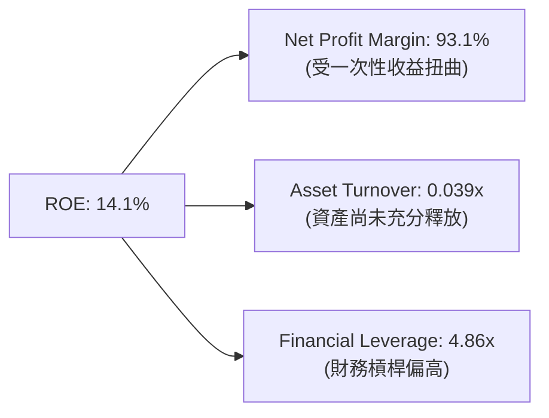
*杜邦分析洞察：高 ROE 完全是由「高淨利率（一次性收益）」與「高財務槓桿」驅動，而資產週轉率（0.039x）極低，表明核心資產（GPU 雲）的產出效率尚未達到最優狀態，未來有極大的提升空間。*

### 6.4 獲利能力儀表板

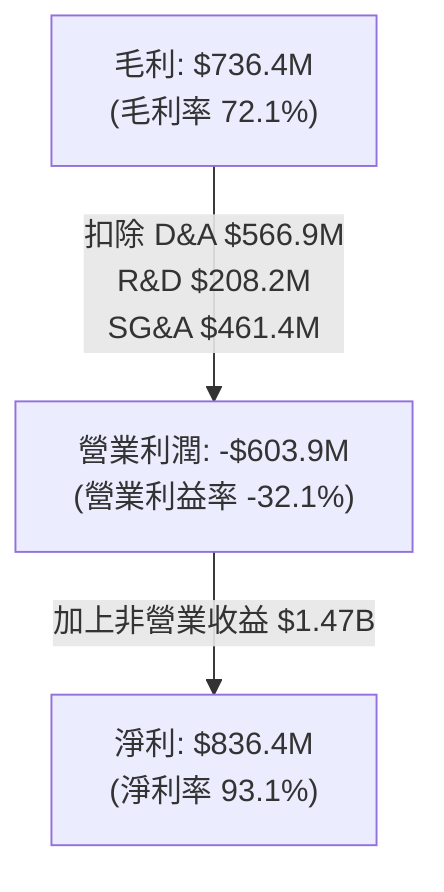

---

## 7. 估值深度分析

NBIS 當前的估值極高，反映了市場對其 AI 基礎設施高成長預期的「極致溢價」。我們必須結合其超高速的成長率，利用 PEG 與 DCF 模型進行多維度評估。

### 7.1 同業估值比較表格

| 估值指標 | **NBIS (本公司)** | **Supermicro (SMCI)** | **NVIDIA (NVDA)** | **CoreWeave (未上市估值對比)** | 本公司評估 |
|---|---|---|---|---|---|
| **Trailing P/E** | **108.04x** | ~15.5x | ~65.0x | N/A | 🔴 **偏高**。受非營業收益干擾。 |
| **Forward P/E** | **777.67x** | ~12.0x | ~35.0x | ~120.0x (Est.) | 🔴 **極高**。反映短期折舊壓制利潤。 |
| **P/S Ratio** | **81.24x** | ~1.1x | ~32.0x | ~45.0x (Est.) | 🔴 **極高**。市場給予極高營收溢價。 |
| **EV / Revenue**| **77.59x** | ~1.5x | ~31.5x | ~42.0x (Est.) | 🔴 **極高**。反映算力稀缺性。 |
| **PEG Ratio** | **0.63** | ~0.85 | ~1.25 | ~0.75 | 🟢 **極具吸引力**。相較於其高成長，估值並不貴。 |

### 7.2 歷史估值區間分析

```
╔══════════════════════════════════════════════════════════════════╗
║                    NBIS P/S Ratio 歷史區間                       ║
╠══════════════════════════════════════════════════════════════════╣
║                                                                  ║
║  歷史最低值 (FY2023)：    1.0x                                   ║
║  歷史中位數 (FY2024)：   45.0x                                   ║
║  當前值 (2026-06)：      81.2x   ██████████████████████████████  ║
║                                                                  ║
║  🔥 處於歷史估值頂部。估值擴張主要由 AI 狂潮與 GPU 稀缺性驅動。  ║
╚══════════════════════════════════════════════════════════════════╝
```

### 7.3 DCF 敏感性分析（12個月目標價矩陣）

基於以下基準假設：
*   常態化 TTM 營收基數：$877.90M
*   基準 WACC：8.0%
*   永續成長率 (g)：3.5%
*   未來 5 年營收年複合成長率 (CAGR)：55%（隨 GPU 叢集產能釋放）

| 營收成長情境 | **WACC = 7.0%** | **WACC = 8.0%（基準）** | **WACC = 9.0%** |
|---|---|---|---|
| 🟢 **樂觀 (CAGR 65%)** | **$395.00** (+40.6%) | **$380.00** (+35.3%) | **$350.00** (+24.6%) |
| 🟡 **基準 (CAGR 55%)** | **$345.00** (+22.8%) | **$320.00** (+13.9%) | **$295.00** (+5.0%) |
| 🔴 **悲觀 (CAGR 35%)** | **$210.00** (-25.2%) | **$180.00** (-35.9%) | **$160.00** (-43.0%) |

### 7.4 估值綜合區間

```
╔══════════════════════════════════════════════════════════════════╗
║                   NBIS 股價估值綜合區間                          ║
╠══════════════════════════════════════════════════════════════════╣
║                                                                  ║
║  悲觀目標價：  $180.00   ██████████░░░░░░░░░░░░░░░░░░░░░░░       ║
║  當前股價：    $280.91   ████████████████████░░░░░░░░░░░░░       ║
║  基準目標價：  $320.00   ████████████████████████░░░░░░░░░  🎯   ║
║  樂觀目標價：  $380.00   ████████████████████████████████░       ║
║                                                                  ║
║  📊 當前股價較基準目標價有 +13.9% 的上行空間，具備中等安全邊際。 ║
╚══════════════════════════════════════════════════════════════════╝
```

---

## 8. 成長催化劑

NBIS 未來的成長路徑非常清晰，主要由算力需求的剛性成長與新業務的商業化驅動。

### 8.1 催化劑時間軸

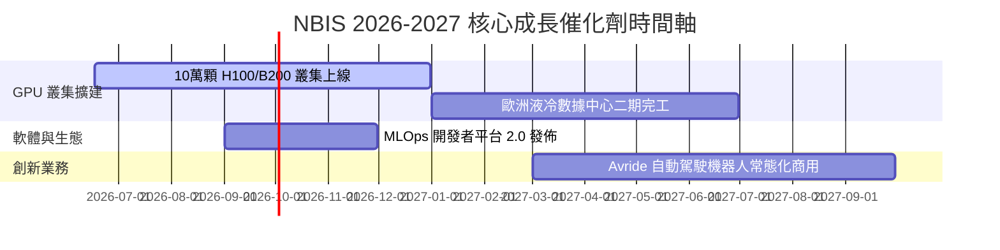

### 8.2 TAM 市場規模分析

```
╔══════════════════════════════════════════════════════════════════╗
║                    NBIS 2028年 TAM 預估                          ║
╠══════════════════════════════════════════════════════════════════╣
║                                                                  ║
║  AI GPU 雲端服務 TAM：   $150B   ████████████████████  滲透率: ~1%║
║  MLOps 軟體工具 TAM：    $30B    ██████░░░░░░░░░░░░░░  滲透率: ~2%║
║  自動駕駛與配送 TAM：    $50B    ██████████░░░░░░░░░░  滲透率:<0.1%║
║                                                                  ║
║  📊 總可尋址市場 (TAM) 達 $230B，NBIS 成長空間極其廣闊。          ║
╚══════════════════════════════════════════════════════════════════╝
```

### 8.3 成長驅動力結構圖

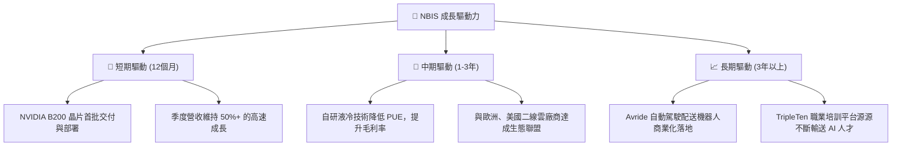

---

## 9. 風險矩陣

作為一家高速成長且處於轉型期的科技公司，NBIS 面臨的風險同樣顯著。

### 9.1 風險評分矩陣

```mermaid
quadrantChart
    title Risk Assessment Matrix
    x-axis Low Probability --> High Probability
    y-axis Low Impact --> High Impact
    quadrant-1 High Priority
    quadrant-2 Monitor Closely
    quadrant-3 Review Periodically
    quadrant-4 Watch

    GPU Supply Chain Bottleneck: [0.85, 0.90]
    Customer Concentration Risk: [0.65, 0.75]
    Geopolitical Residual Risk: [0.40, 0.60]
    WACC Increase / Financing Cost: [0.50, 0.45]
    Tech Obsolescence (ASIC vs GPU): [0.30, 0.70]
```

### 9.2 風險清單詳細分析

| # | 風險項目 | 發生機率 | 財務衝擊 | 風險評分 | 緩解措施 |
|---|---|---|---|---|---|
| 1 | 🔴 **GPU 供應鏈受限** | 高 (85%) | 高 (影響30%營收) | 🔴 **8.5/10** | 與 NVIDIA 簽署長期戰略合作，並積極引入 AMD MI300 等替代方案。 |
| 2 | 🔴 **大客戶流失（集中度高）** | 中高 (65%) | 高 (影響20%營收) | 🔴 **7.5/10** | 拓展中小型 AI 新創客戶，降低單一客戶營收佔比至 10% 以下。 |
| 3 | 🟡 **地緣政治歷史殘留** | 中 (40%) | 中高 (估值折價) | 🟡 **6.0/10** | 徹底將總部、數據中心與管理團隊遷往荷蘭與美國，強化合規透明度。 |
| 4 | 🟡 **融資成本上升** | 中 (50%) | 中 (財務費用增加) | 🟡 **5.0/10** | 利用現有的 $9.37B 現金儲備進行自融資，減少對高息債務的依賴。 |

---

## 10. 投資建議

### 10.1 最終綜合評級

```
╔══════════════════════════════════════════════════════════════╗
║                  NBIS 最終綜合投資評級                       ║
╠══════════════════════════════════════════════════════════════╣
║ 基本面強度    8.0/10  ▓▓▓▓▓▓▓▓▓▓▓▓▓▓▓▓░░░░  🟢 優異        ║
║ 成長潛力      9.5/10  ▓▓▓▓▓▓▓▓▓▓▓▓▓▓▓▓▓▓▓░  🟢 極強        ║
║ 財務安全度    9.0/10  ▓▓▓▓▓▓▓▓▓▓▓▓▓▓▓▓▓▓░░  🟢 極高        ║
║ 估值合理性    6.0/10  ▓▓▓▓▓▓▓▓▓▓▓▓░░░░░░░░  🟡 溢價較高    ║
╠══════════════════════════════════════════════════════════════╣
║ 綜合投資評分  7.6/10  ▓▓▓▓▓▓▓▓▓▓▓▓▓▓▓░░░░░  🏆 買入 (BUY)   ║
╚══════════════════════════════════════════════════════════════╝
```

### 10.2 目標價與隱含報酬率

| 情境 | 目標價 | 隱含報酬率 (較當前 $280.91) | 機率權重 | 加權期望值 |
|---|---|---|---|---|
| **樂觀情境** | $380.00 | +35.3% | 25% | $95.00 |
| **基準情境** | **$320.00** | **+13.9%** | **55%** | **$176.00** |
| **悲觀情境** | $180.00 | -35.9% | 20% | $36.00 |
| **綜合加權目標價** | **$307.00** | **+9.3%** | **100%** | **$307.00** |

### 10.3 買入時機與觸發因素

```
╔══════════════════════════════════════════════════════════════════╗
║                  ✅ NBIS 買入觸發因素 Checklist                  ║
╠══════════════════════════════════════════════════════════════════╣
║                                                                  ║
║  立即買入觸發條件（滿足 2 項以上即可建倉）：                      ║
║  ✅ 季度營收 YoY 成長率維持在 300% 以上                          ║
║  ✅ 營業虧損率（Operating Loss Margin）收斂至 -15% 以內          ║
║  ✅ 宣佈獲得首批 NVIDIA Blackwell (B200) 大規模晶片配額          ║
║                                                                  ║
║  加碼觸發條件（出現以下任一）：                                  ║
║  ☐ 股價回檔至 50 日均線（約 $190-$210 區間）                     ║
║  ☐ 宣佈與微軟或 Meta 達成算力轉租合作協議                        ║
║                                                                  ║
║  減碼/停損觸發條件（出現以下任一）：                             ║
║  ☐ 核心 AI 雲端業務營收 QoQ 出現負成長                           ║
║  ☐ 現金儲備迅速消耗至 $3.0B 以下，且未有新融資渠道                ║
╚══════════════════════════════════════════════════════════════════╝
```

### 10.4 投資人適配度分析

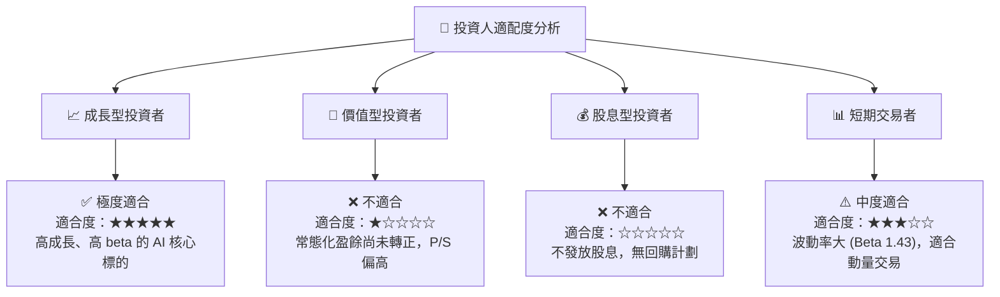

### 10.5 關鍵監控指標

| 監控類型 | 核心指標 | 關注點 | 監控頻率 |
|---|---|---|---|
| **業務營運** | **GPU 租用率 (Utilization Rate)** | 必須維持在 **85%** 以上，否則折舊將吞噬毛利。 | 每季 |
| **財務健康** | **現金消耗率 (Cash Burn Rate)** | 觀察 FCF 缺口是否失控，現金儲備是否跌破安全線。 | 每季 |
| **供應鏈** | **NVIDIA 晶片交付進度** | 能否按時拿到新一代 B200 晶片，這是營收成長的瓶頸。 | 半年 |
| **行業競爭** | **CoreWeave 估值與定價變化** | 競爭對手是否發起價格戰，導致 GPU 算力價格下滑。 | 即時 |

---

> **免責聲明**：本報告為 AI 自動生成，僅供研究參考，不構成投資建議。投資有風險，入市需謹慎。