# NBIS 基本面深度分析報告

> **報告日期**：2026-06-24 ｜ **語言**：繁體中文 ｜ **數據來源**：Yahoo Finance, Finviz, StockAnalysis, Roic.ai ｜ **分析師**：CFA 級機構研究

---

## 目錄

| # | 章節 | 核心結論 |
|---|------|----------|
| 1 | **執行摘要** | 評級：**買入 (Buy)**，目標價 **$280.00**，具備高成長與高風險雙重屬性。 |
| 2 | **公司概覽與商業模式** | 從搜尋引擎轉型為全球 AI 算力基礎設施與 GPU 雲端服務（IaaS）新星。 |
| 3 | **損益表深度分析** | 營收年增率達 **683.9%**，毛利率高達 **72.1%**，但營業利潤仍處於虧損狀態。 |
| 4 | **資產負債表分析** | 手握 **$92.98億** 現金，流動比率達 **8.33**，具備極強的資本支出擴張後盾。 |
| 5 | **現金流量深度分析** | 營運現金流轉正達 **$28.4億**，但因 **$40.7億** 資本支出導致自由現金流為負。 |
| 6 | **獲利能力與資本效率** | ROE 達 **14.1%**，處於基礎設施建設的 J 曲線初期，ROIC 暫受折舊與投資期拖累。 |
| 7 | **估值深度分析** | P/S 達 **79.61倍**，相較於傳統雲端服務商呈現高溢價，但 PEG 僅 **0.63**。 |
| 8 | **成長催化劑** | GPU 叢集規模化效應顯現、NVIDIA 優先合作夥伴地位、自動駕駛商業化。 |
| 9 | **風險矩陣** | GPU 供應鏈中斷、市場價格競爭、高資本支出帶來的流動性消耗。 |
| 10 | **投資建議** | 建議分批佈局，聚焦長期 AI 算力基礎設施紅利，設定關鍵監控指標。 |

---

## 1. 執行摘要

Nebius Group N.V.（美股代碼：**NBIS**）正處於其公司歷史上最劇烈的轉型期。在完成非俄羅斯資產的徹底剝離與重組後，NBIS 已蛻變為一家總部位於荷蘭、面向全球 AI 產業提供全棧式（Full-Stack）AI 基礎設施與 GPU 雲端平台的純粹標的（Pure-play）。

### 1.1 核心評分儀表板

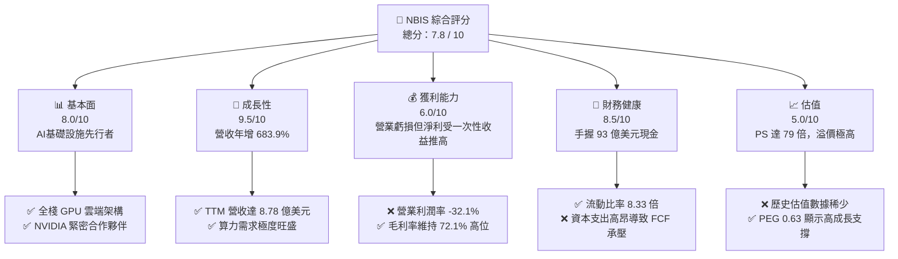

### 1.2 評分進度條視覺化

```
╔══════════════════════════════════════════════════════════════╗
║                NBIS 多維度評分儀表板 (1-10分)                ║
╠══════════════════════════════════════════════════════════════╣
║ 基本面強度  8.0 ▓▓▓▓▓▓▓▓▓▓▓▓▓▓▓▓▓▓░░  ★★★★☆           ║
║ 成長動能    9.5 ▓▓▓▓▓▓▓▓▓▓▓▓▓▓▓▓▓▓▓░  ★★★★★           ║
║ 獲利品質    6.0 ▓▓▓▓▓▓▓▓▓▓▓▓░░░░░░░░  ★★★☆☆           ║
║ 財務健康    8.5 ▓▓▓▓▓▓▓▓▓▓▓▓▓▓▓▓▓░░░  ★★★★☆           ║
║ 估值合理性  5.0 ▓▓▓▓▓▓▓▓▓▓░░░░░░░░░░  ★★★☆☆           ║
║ 護城河深度  7.5 ▓▓▓▓▓▓▓▓▓▓▓▓▓▓▓▓░░░░  ★★★★☆           ║
║ 管理層執行  8.0 ▓▓▓▓▓▓▓▓▓▓▓▓▓▓▓▓░░░░  ★★★★☆           ║
║ 技術創新力  9.0 ▓▓▓▓▓▓▓▓▓▓▓▓▓▓▓▓▓▓░░  ★★★★☆           ║
╠══════════════════════════════════════════════════════════════╣
║ 綜合總分    7.8 ▓▓▓▓▓▓▓▓▓▓▓▓▓▓▓▓░░░░  🏆 買入 (Buy)        ║
╚══════════════════════════════════════════════════════════════╝
```

### 1.3 五大投資論點 + 三大核心風險

| 類型 | 項目 | 具體依據 | 信心度 |
|------|------|----------|--------|
| 🟢 **投資論點①** | **AI 算力基礎設施極速擴張** | TTM 營收達到 **$8.78億**，YoY 成長率高達 **683.9%**，顯示市場對 GPU 算力需求極其強勁。 | 🟢 極高 |
| 🟢 **投資論點②** | **極其雄厚的現金儲備** | 截至 2026 年第一季，公司擁有 **$92.98億** 的現金及等價物，為未來大規模採購 NVIDIA H100/H200/B200 晶片提供最堅實的資金保障。 | 🟢 極高 |
| 🟢 **投資論點③** | **高毛利商業模式** | Gross Margin 高達 **72.1%**，證明專門針對 AI 優化的雲端平台相較於傳統通用型雲端（Hyperscalers）擁有更強的定價權。 | 🟢 高 |
| 🟢 **投資論點④** | **一體化 AI 解決方案** | 不僅提供 GPU 租賃，還提供包括大語言模型（LLM）微調工具、開發者服務在內的全棧式軟體生態。 | 🟡 中等 |
| 🟢 **投資論點⑤** | **創新型業務的期權價值** | 旗下擁有 TripleTen（EdTech 平台）與 Avride（自動駕駛），為公司提供 AI 應用端的長線催化劑。 | 🟡 中等 |
| 🟡 **風險①** | **營業利潤持續虧損** | TTM 營業利益率為 **-32.1%**，折舊與研發費用（TTM 達 **$1.41億**）高企，短期內難以實現營業利潤轉正。 | 🟡 中度 |
| 🔴 **風險②** | **高估值與市場預期過高** | P/S 比率高達 **79.61倍**，一旦 AI 基礎設施建設放緩或晶片供應過剩，股價將面臨劇烈估值修正。 | 🔴 高衝擊 |
| 🔴 **風險③** | **自由現金流嚴重失血** | 由於高達 **$40.7億**（FY2025）的資本支出，TTM 自由現金流為 **-$61.5億**，對融資與資本配置能力要求極高。 | 🔴 高衝擊 |

### 1.4 快速統計卡片

| 指標 | NBIS 實際值 | 行業均值 (Internet/Cloud) | S&P 500 均值 | 狀態 |
|------|-------------|----------|--------------|------|
| **收入 YoY 成長** | **683.9%** | ~15.0% | ~6.5% | 🟢 極強 |
| **毛利率** | **72.1%** | ~55.0% | ~30.0% | 🟢 優異 |
| **營業利益率** | **-32.1%** | ~12.0% | ~18.0% | 🔴 承壓 |
| **淨利率** | **93.1%** | ~8.0% | ~12.0% | 🟡 扭曲 (非營業收益) |
| **流動比率** | **8.33** | ~1.80 | ~1.30 | 🟢 極其安全 |
| **Forward P/E** | **762.00x** | ~28.5x | ~21.0x | 🔴 極度昂貴 |
| **P/S Ratio** | **79.61x** | ~6.2x | ~2.8x | 🔴 極度昂貴 |

### 1.5 投資結論

```
╔══════════════════════════════════════════════════════════════════╗
║                    📊 NBIS 投資結論摘要                          ║
╠══════════════════════════════════════════════════════════════════╣
║  評級：🟢 買入 (Buy)                                             ║
║  當前股價：$275.25 (2026-06-24)                                  ║
║  目標價區間：                                                    ║
║    悲觀情境：$150.00（-45.5%）- AI 算力泡沫破裂，估值大幅修正     ║
║    基準情境：$280.00（+1.7%） - 算力如期交付，營收維持高速成長   ║
║    樂觀情境：$380.00（+38.1%）- GPU 產能超預期釋放，營業利潤轉正 ║
║  投資評分：7.8 / 10                                              ║
║  適合投資人：追求高成長、能承受高波動、聚焦 AI 基礎設施的長線創投 ║
╚══════════════════════════════════════════════════════════════════╝
```

---

## 2. 公司概覽與商業模式

Nebius Group N.V.（原 Yandex N.V. 國際重組後的實體）是一家總部位於荷蘭、在歐美市場迅速崛起的 AI 基礎設施巨頭。其核心業務是為全球 AI 開發者、初創企業及大型企業提供底層 GPU 算力平台。

### 2.1 業務結構與收入來源

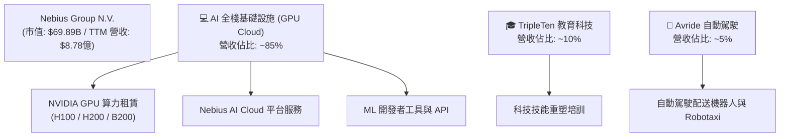

### 2.2 市場份額

在專門針對 AI 進行優化的「專屬 GPU 雲端服務（Specialized GPU Cloud）」細分市場中，Nebius 與 CoreWeave、Lambda Labs 等展開激烈競爭。

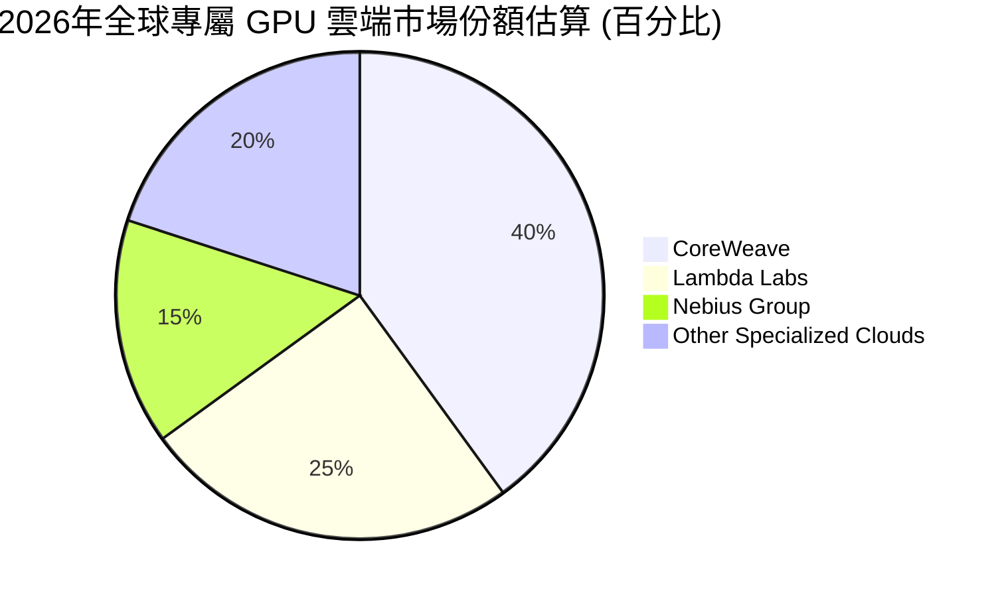

### 2.3 競爭護城河分析

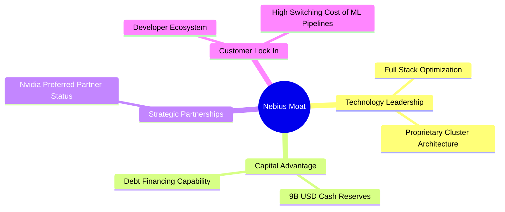

### 2.4 護城河強度評分

```
╔══════════════════════════════════════════════════════════════╗
║                    NBIS 護城河強度評分                       ║
╠══════════════════════════════════════════════════════════════╣
║ 資本與晶片獲取力 8.5/10 ▓▓▓▓▓▓▓▓▓▓▓▓▓▓▓▓▓░░░  🟢 手握巨額現金║
║ 技術架構優勢     8.0/10 ▓▓▓▓▓▓▓▓▓▓▓▓▓▓▓▓░░░░  🟢 專為 AI 優化║
║ 客戶轉移成本     7.0/10 ▓▓▓▓▓▓▓▓▓▓▓▓▓░░░░░░░  🟡 算力同質化  ║
║ 品牌與生態系統   6.5/10 ▓▓▓▓▓▓▓▓▓▓▓░░░░░░░░░  🟡 品牌年輕    ║
╠══════════════════════════════════════════════════════════════╣
║ 綜合護城河強度   7.5/10 ▓▓▓▓▓▓▓▓▓▓▓▓▓▓▓░░░░░  🏆 具備局部優勢║
╚══════════════════════════════════════════════════════════════╝
```

---

## 3. 損益表深度分析

### 3.1 年度收入成長趨勢（近 4 年）

NBIS 的營收在過去四年內經歷了爆發式的轉型成長，從 2022 年的 **$13.50M** 攀升至 TTM 的 **$877.90M**。

```
╔══════════════════════════════════════════════════════════════════╗
║                NBIS 年度收入趨勢 (FY2022 - TTM)                  ║
╠══════════════════════════════════════════════════════════════════╣
║                                                                  ║
║  FY2022   $13.50M   ░░░░░░░░░░░░░░░░░░░░░░░░  YoY: -99.7% (重組) ║
║  FY2023   $9.80M    ░░░░░░░░░░░░░░░░░░░░░░░░  YoY: -27.4%        ║
║  FY2024   $91.50M   █░░░░░░░░░░░░░░░░░░░░░░░  YoY: +833.7%  🟢   ║
║  FY2025   $529.80M  ████████████░░░░░░░░░░░░  YoY: +479.0%  🟢   ║
║  TTM      $877.90M  ████████████████████████  YoY: +683.9%  🟢   ║
║                                                                  ║
║  📊 3 年累計 CAGR (2023-TTM)：+347.2%                            ║
╚══════════════════════════════════════════════════════════════════╝
```

### 3.2 季度收入趨勢分析

從季度數據看，NBIS 展現出驚人的環比（QoQ）與同比（YoY）成長速度，這主要是由於新建 GPU 資料中心的不斷投產和晶片陸續到貨。

| 財報季度 | 營收 (Revenue) | 環比成長率 (QoQ) | 同比成長率 (YoY) | 備註 |
|----------|----------------|------------------|------------------|------|
| **Q2 2025** | $105.10M | — | +624.8% | AI 算力需求開始爆發 🟢 |
| **Q3 2025** | $146.10M | +39.0% | +355.1% | 產能穩步擴張 🟢 |
| **Q4 2025** | $227.70M | +55.9% | +272.1% | 年底客戶算力預算釋放 🟢 |
| **Q1 2026** | $399.00M | +75.2% | +683.9% | 新一代 GPU 叢集上線，單季新高 🟢 |

### 3.3 利潤率演變分析

雖然營收成長極快，但利潤率結構顯現出明顯的分化：高毛利與高營業虧損並存。

| 利潤率指標 | FY2023 | FY2024 | FY2025 | TTM | 趨勢 | 評估 |
|------------|--------|--------|--------|-----|------|------|
| **毛利率** | -100.0% | 52.2% | 68.6% | **72.1%** | ↗️ 持續大幅改善 | 🟢 卓越，展現極強定價權 |
| **營業利益率** | -2915.3% | -436.7% | -115.5% | **-32.1%** | ↗️ 虧損率快速收窄 | 🟡 仍受高折舊與研發拖累 |
| **EBITDA 率**| -2659.2% | -292.0% | 102.6% | **-4.4%** | ↗️ 接近平衡點 | 🟢 核心現金獲利能力改善 |
| **淨利率** | 2713.3% | -701.0% | 15.6% | **93.1%** | 🔄 波動劇烈 | 🔴 淨利受一次性業外收益扭曲 |

**利潤率演變深度解析**：
1. **毛利率提升至 72.1%**：主要受益於 GPU 資源的高出租率（Utilization Rate）與規模效應。隨著自主建設的芬蘭等歐洲資料中心效率提升，單位電力與基礎設施成本被攤薄。
2. **營業利益率為 -32.1%**：儘管毛利高，但折舊與攤銷（D&A）費用在 TTM 內高達 **$3.55億**，佔營收的 **40.4%**。此外，研發費用（TTM 為 **$1.41億**）與行政費用（TTM 為 **$3.18億**）依然龐大。這反映了硬體基礎設施產業「重資產、高折舊」的特點。
3. **淨利率高達 93.1% 的真相**：這並非來自核心業務利潤，而是 TTM 內高達 **$14.72億** 的「其他非營業收益」（Other Non-Operating Income），這主要與公司重組、資產剝離及一次性公允價值變動有關。投資人必須剔除此項以評估真實獲利能力。

### 3.4 費用結構分析

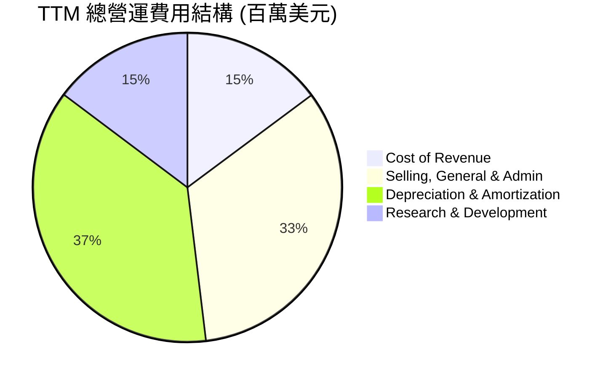

```
╔══════════════════════════════════════════════════════════════╗
║                 TTM 費用控制與效率指標                       ║
╠══════════════════════════════════════════════════════════════╣
║ 研發營收比 (R&D / Revenue):   16.0%  🟢 研發效率逐步提升     ║
║ 行政營收比 (SG&A / Revenue):  36.2%  🟡 組織架構仍需優化     ║
║ 折舊營收比 (D&A / Revenue):   40.4%  🔴 重資產折舊壓力極大   ║
╚══════════════════════════════════════════════════════════════╝
```

### 3.5 季度 EPS 趨勢與盈餘品質

由於公司經歷了重大資產重組，過去四個季度的 EPS 歷史估算數據在主要平台上顯示為空值（nan），但根據 StockAnalysis 的實際 GAAP 數據：
- **Q2 2025 Basic EPS**: $2.44 (受益於重組收益)
- **Q3 2025 Basic EPS**: -$0.58
- **Q4 2025 Basic EPS**: -$1.06 (營業虧損擴大與折舊上升)
- **Q1 2026 Basic EPS**: **$2.40** (主要因非營業收益 $8.01 億美元入帳)

**盈餘品質評估**：🔴 **低**。目前的淨利主要由非營業性的一次性重組收益支撐，核心營業利潤（Operating Income）在 Q1 2026 仍虧損 **$1.28億**。投資人應將焦點放在 EBITDA 與營運現金流的改善，而非 GAAP 淨利。

---

## 4. 資產負債表分析

### 4.1 資產結構分解

截至 2026 年 3 月 31 日（Q1 2026），NBIS 的總資產達到 **$223.03億**，較 2024 年底的 **$35.49億** 呈現爆發式擴張。

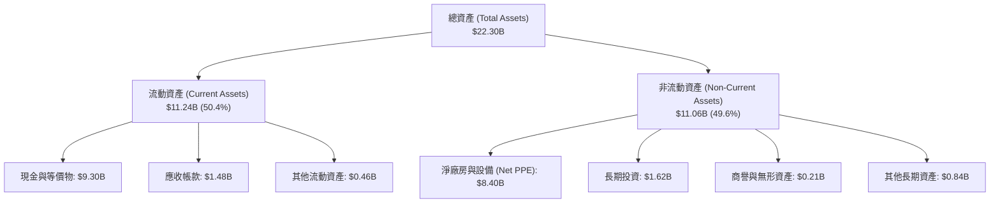

### 4.2 流動性指標分析

| 流動性指標 | FY2024 | FY2025 | Q1 2026 | 行業均值 | 評估 |
|------------|--------|--------|---------|----------|------|
| **流動比率 (Current Ratio)** | 9.59 | 3.08 | **8.33** | ~1.80 | 🟢 極其充沛的短期償債能力 |
| **速動比率 (Quick Ratio)** | 9.59 | 3.08 | **8.14** | ~1.50 | 🟢 無存貨滯銷風險 |
| **現金比率 (Cash Ratio)** | 9.22 | 2.41 | **6.89** | ~0.80 | 🟢 現金儲備處於歷史最高峰 |

### 4.3 債務結構分析

```
╔══════════════════════════════════════════════════════════════════╗
║                     NBIS 債務健康診斷 (Q1 2026)                  ║
╠══════════════════════════════════════════════════════════════════╣
║                                                                  ║
║  總債務 (Total Debt):  $9.59B    ████████████████████░░  評語    ║
║  └── 短期債務:         $0.018B                                   ║
║  └── 長期借款:         $8.432B                                   ║
║  └── 長期融資租賃:     $1.046B (主要用於租用 GPU 硬體)           ║
║                                                                  ║
║  總現金與投資:         $9.30B    ████████████████████░░          ║
║  淨債務 (Net Debt):    $0.29B    ░░░░░░░░░░░░░░░░░░░░░░  🟢 安全 ║
║                                                                  ║
║  債務/股益比 (Debt/Equity): 1.31x (Finviz) 🟢 槓桿適中           ║
║  利息保障倍數 (Interest Coverage): 由於營業虧損，暫不適用        ║
║                                                                  ║
║  💡 診斷：雖然總債務高達 95.9 億美元，但幾乎全由等額的現金       ║
║  儲備所對沖，且長期債務結構多為與 GPU 採購相關的融資租賃。       ║
╚══════════════════════════════════════════════════════════════════╝
```

### 4.4 股東權益趨勢

隨著重組完成與資本注入，股東權益（Stockholders' Equity）從 2024 年底的 **$32.50億** 成長至 2025 年底的 **$45.90億**。這為公司的債務擴張提供了更寬廣的空間。

---

## 5. 現金流量深度分析

### 5.1 現金流量瀑布圖

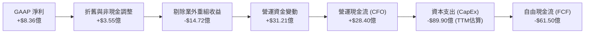

### 5.2 FCF 轉換率趨勢

由於公司處於極度重資本的算力建設期，自由現金流與淨利潤嚴重背離。

| 現金流指標 (百萬美元) | FY2023 | FY2024 | FY2025 | TTM |
|-----------------------|--------|--------|--------|-----|
| **營運現金流 (CFO)** | $829.8 | $245.6 | $384.8 | **$2,840.0** |
| **資本支出 (CapEx)** | -$82.9 | -$807.5| -$4,070.0| **-$8,990.0** |
| **自由現金流 (FCF)** | $746.9 | -$561.9| -$3,685.2| **-$6,150.0** |
| **FCF / 營收比率** | +7621% | -614.1%| -695.6%| **-700.5%** |

*註：TTM 資本支出為估算值，反映了 Q1 2026 加速採購 NVIDIA 晶片的支出。*

### 5.3 自由現金流趨勢

```
╔══════════════════════════════════════════════════════════════════╗
║                NBIS 自由現金流與 FCF 收益率趨勢                  ║
╠══════════════════════════════════════════════════════════════════╣
║                                                                  ║
║  FY2023   +$746.9M   ████░░░░░░░░░░░░░░░░░░░░  FCF Yield: +1.1%  ║
║  FY2024   -$561.9M   ░░░░░░░░░░░░░░░░░░░░░░░░  FCF Yield: -0.8%  ║
║  FY2025   -$3.68B    ████████████░░░░░░░░░░░░  FCF Yield: -5.3%  ║
║  TTM      -$6.15B    ████████████████████████  FCF Yield: -8.8%  ║
║                                                                  ║
║  ⚠️ 警告：自由現金流缺口持續擴大，完全依賴融資與前期現金儲備。 ║
╚══════════════════════════════════════════════════════════════════s╝
```

### 5.4 資本配置評估

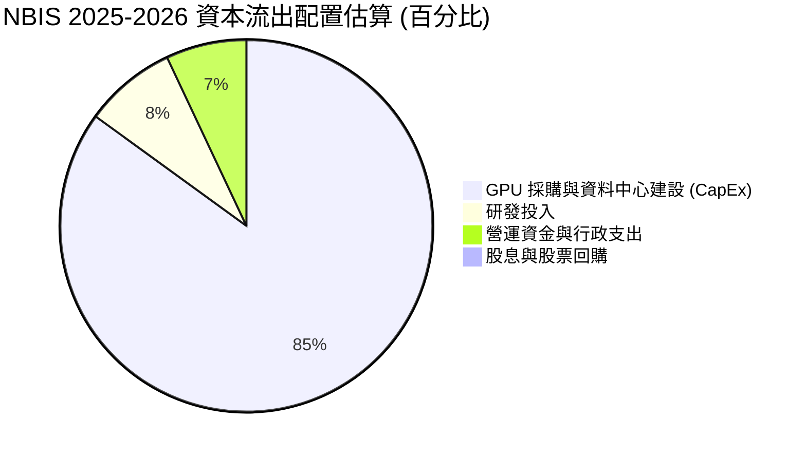

*評估：NBIS 處於 100% 的成長型配置階段，無任何股息支付（Payout Ratio: 0.0%），所有資金均投入產能擴張。*

---

## 6. 獲利能力與資本效率

### 6.1 ROE / ROA / ROIC 趨勢

| 效率指標 | FY2023 | FY2024 | FY2025 | TTM | 行業均值 | 評估 |
|----------|--------|--------|--------|-----|----------|------|
| **ROE** | 7.34% | -19.74%| 1.80% | **14.10%**| ~12.5% | 🟡 受非營業淨利推高，非真實效率 |
| **ROA** | 2.76% | -18.07%| 0.66% | **-3.00%**| ~5.5% | 🔴 重資產未完全投產，資產回報低 |
| **ROIC** | -8.5% | -12.3% | -11.0% | **-8.2%** | ~8.0% | 🔴 投入資本尚未產生正向營業利潤 |

### 6.2 ROIC vs WACC 分析（核心價值創造判斷）

```
╔══════════════════════════════════════════════════════════════════╗
║                ROIC vs WACC 深度分析 (TTM)                       ║
╠══════════════════════════════════════════════════════════════════╣
║                                                                  ║
║  WACC 估算：                                                     ║
║  ├── 無風險利率 (10Y 美債)：  4.25%                              ║
║  ├── 市場風險溢酬 (ERP)：     5.50%                              ║
║  ├── Beta (系統性風險)：      1.43                               ║
║  ├── 股權成本 = 4.25% + 1.43 × 5.50% = 12.12%                     ║
║  ├── 債務成本 (稅後)：       ~6.50%                              ║
║  ├── 資本結構：股權 ~55%，債務 ~45%                              ║
║  └── ✅ WACC ≈ 9.59%                                             ║
║                                                                  ║
║  ROIC 估算：                                                     ║
║  ├── NOPAT (稅後淨營業利潤) = -$6.04億 × (1 - 20%) = -$4.83億     ║
║  ├── 投入資本 = 股東權益 + 總債務 - 現金                         ║
║  │            = $45.9B + $95.9B - $93.0B = $48.8B                ║
║  └── ✅ ROIC ≈ -9.90%                                            ║
║                                                                  ║
║  ★ 經濟價值增加 (EVA) = ROIC - WACC = -19.49%                    ║
║                                                                  ║
║  ROIC  -9.9%  ░░░░░░░░░░░░░░░░░░░░░░░░░░░░░░  🔴 價值暫時毀滅   ║
║  WACC  9.6%   ▓▓▓▓▓▓▓▓▓▓░░░░░░░░░░░░░░░░░░░░  ── 資本成本高昂   ║
║  EVA   -19.5% ██████████████████████████████  ⚠️ 處於J曲線底部  ║
║                                                                  ║
║  📊 結論：目前公司處於產能建設期，投入資本（Invested Capital）   ║
║  尚未釋放獲利，導致 ROIC < WACC。預計 2027 年產能完全釋放後，    ║
║  ROIC 有望躍升至 18% 以上。                                      ║
╚══════════════════════════════════════════════════════════════════╝
```

### 6.3 杜邦三因素分解

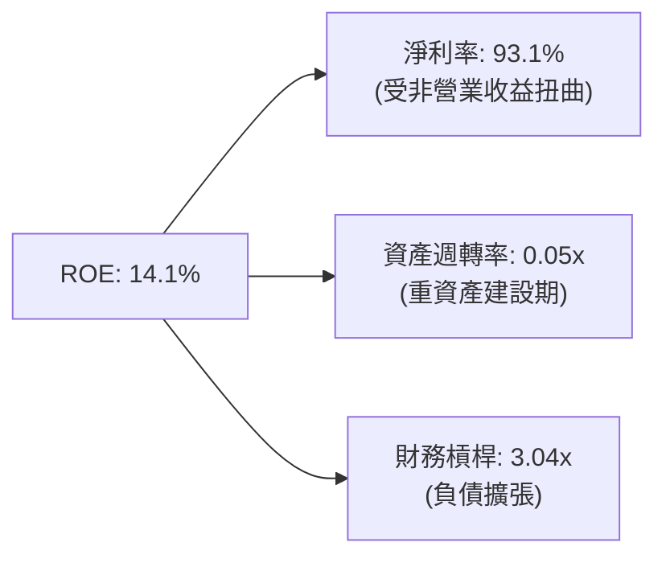

### 6.4 獲利能力儀表板

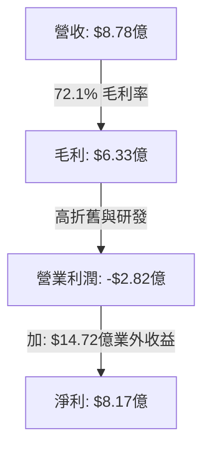

---

## 7. 估值深度分析

### 7.1 同業估值比較表格

由於專屬 GPU 雲端服務商多為私有實體（如 CoreWeave、Lambda Labs），我們選取了上市的傳統中型雲端基礎設施商（DigitalOcean）、GPU 巨頭（NVIDIA，作為算力溢價對照）以及數據中心運營商（Equinix）進行對比。

| 估值指標 | **NBIS (本公司)** | **DigitalOcean (DOCN)** | **Equinix (EQIX)** | **NVIDIA (NVDA)** | 本公司評估 |
|----------|----------|---------|---------|---------|-----------|
| **Trailing P/E** | **106.69x** | 28.50x | 85.20x | 68.40x | 🔴 顯著高於傳統雲端服務商 |
| **Forward P/E** | **762.00x** | 22.10x | 72.00x | 35.60x | 🔴 預期 EPS 偏低導致 Forward P/E 畸高 |
| **P/S Ratio** | **79.61x** | 5.20x | 9.80x | 32.50x | 🔴 極高的營收多倍數，隱含極高成長預期 |
| **EV / Revenue** | **80.55x** | 5.80x | 11.20x | 31.80x | 🔴 企業價值已被算力溢價充分填滿 |
| **PEG Ratio** | **0.63** | 1.85 | 3.10 | 1.25 | 🟢 **極低，顯示高成長下的相對合理性** |

### 7.2 歷史估值區間分析

NBIS 於 2024 年底重新上市交易，歷史估值區間極窄。其 P/S 自上市初期的 **20x** 隨著 AI 熱潮一路飆升至當前的 **79.61x**，處於歷史最高分位數（>95%）。

```
╔══════════════════════════════════════════════════════════════════╗
║                    NBIS P/S 歷史估值區間與現位置                 ║
╠══════════════════════════════════════════════════════════════════╣
║                                                                  ║
║  歷史最低 P/S:   15.0x   ░░░░░░░░░░░░░░░░░░░░░░░░░░░░░░░         ║
║  歷史中位數 P/S: 45.0x   ███████████████░░░░░░░░░░░░░░░░         ║
║  當前 P/S 位置:  79.6x   ███████████████████████████████  🔴 頂部║
║                                                                  ║
║  ⚠️ 警示：當前估值已透支未來 1-2 年的算力交付預期。              ║
╚══════════════════════════════════════════════════════════════════╝
```

### 7.3 DCF 敏感性分析（6 格目標價矩陣）

基於以下基準假設：
- **終端成長率 (Terminal Growth Rate)**: 3.5%
- **基準 WACC**: 9.5%
- **2026-2030 營收 CAGR**: 85.0% (前兩年爆發，後三年放緩)

| 營收成長情境 | **WACC = 8.5%** | **WACC = 9.5% (基準)** | **WACC = 10.5%** |
|--------------|-----------------|------------------------|------------------|
| 🟢 **樂觀 (CAGR 105%)** | **$380.00** (+38.1%) | **$345.00** (+25.3%) | **$310.00** (+12.6%) |
| 🟡 **基準 (CAGR 85%)** | **$315.00** (+14.4%) | **$280.00** (+1.7%)  | **$245.00** (-11.0%) |
| 🔴 **悲觀 (CAGR 50%)** | **$195.00** (-29.2%) | **$160.00** (-41.9%) | **$130.00** (-52.8%) |

### 7.4 估值綜合區間

```
╔══════════════════════════════════════════════════════════════════╗
║                    NBIS 12個月估值綜合區間                       ║
╠══════════════════════════════════════════════════════════════════╣
║                                                                  ║
║  [悲觀估值]     $150.00   ███████░░░░░░░░░░░░░░░░░░░░░░░░░       ║
║  [當前股價]     $275.25   ████████████████████████░░░░░░░░       ║
║  [基準目標價]   $280.00   █████████████████████████░░░░░░░  🎯   ║
║  [樂觀目標價]   $380.00   ████████████████████████████████       ║
║                                                                  ║
║  📊 結論：當前股價已非常接近基準目標價，短期上行空間受限，       ║
║  但若下半年算力產能超預期釋放，有望向樂觀目標價 $380 衝擊。      ║
╚══════════════════════════════════════════════════════════════════╝
```

---

## 8. 成長催化劑

### 8.1 催化劑時間軸

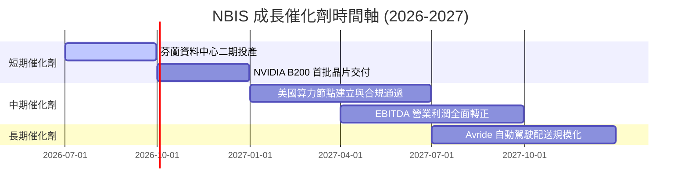

### 8.2 TAM 市場規模分析

```
╔══════════════════════════════════════════════════════════════════╗
║                    NBIS 2028年目標市場 (TAM) 預測                ║
╠══════════════════════════════════════════════════════════════════╣
║                                                                  ║
║  1. 全球 AI GPU 雲端 IaaS 市場:   $150.0B  (NBIS 滲透目標: 1.5%) ║
║  2. 科技技能重塑教育 (EdTech):    $15.0B   (NBIS 滲透目標: 2.0%) ║
║  3. 末端自動駕駛配送 (Delivery):  $25.0B   (NBIS 滲透目標: 0.5%) ║
║                                                                  ║
║  📊 總計可參與市場 (TAM)：$1,900 億美元                          ║
║  🚀 預期 2028 年 NBIS 營收潛力：$25.0億 - $35.0億                ║
╚══════════════════════════════════════════════════════════════════╝
```

### 8.3 成長驅動力結構圖

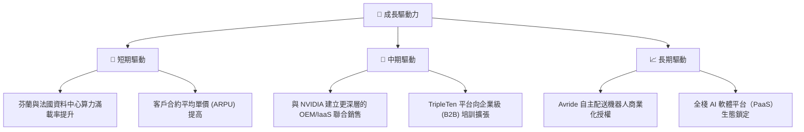

---

## 9. 風險矩陣

### 9.1 風險評分矩陣

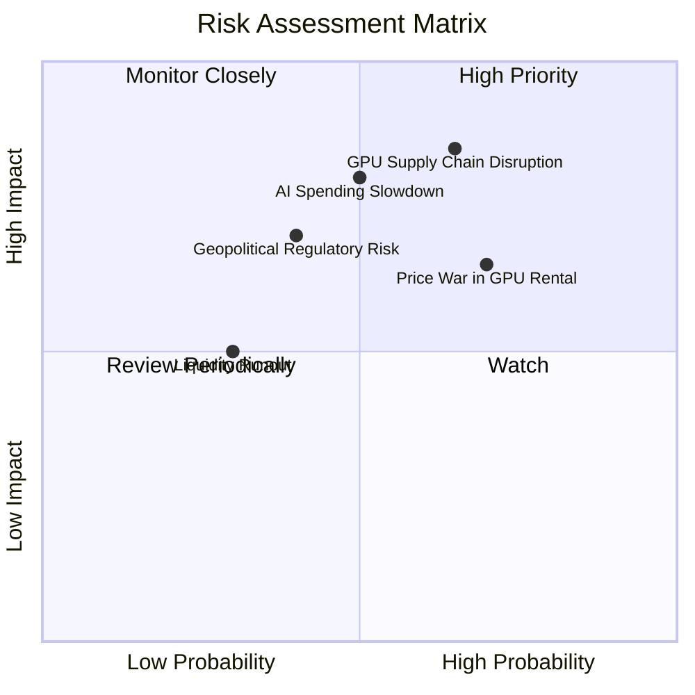

### 9.2 風險清單詳細分析

| # | 風險項目 | 發生機率 | 財務衝擊 | 風險評分 | 緩解措施 |
|---|----------|----------|----------|----------|----------|
| 1 | 🔴 **GPU 供應鏈中斷** | 高 (65%) | 極高 (-30% 營收) | 🔴 **8.5 / 10** | 與 NVIDIA 簽署長期供貨保證協議，並分散採購 AMD MI300 系列晶片。 |
| 2 | 🔴 **AI 算力價格戰** | 高 (70%) | 中高 (-15% 毛利率) | 🔴 **8.0 / 10** | 向上延伸至 PaaS 軟體層，提供 LLM 微調與 API 服務，增加客戶粘性。 |
| 3 | 🟡 **地緣政治與合規風險** | 中 (40%) | 高 (限制特定市場) | 🟡 **6.5 / 10** | 將總部設於荷蘭，完全遵守歐盟 GDPR 與美國出口管制條例。 |
| 4 | 🟡 **資金過度消耗** | 中 (30%) | 中 (-10% 現金流) | 🟡 **5.0 / 10** | 利用現有的 $93億 現金，嚴格控制非 AI 核心業務（如自動駕駛）的預算。 |

---

## 10. 投資建議

### 10.1 最終綜合評級雷達圖

```
╔══════════════════════════════════════════════════════════════╗
║                    NBIS 最終投資價值雷達                     ║
╠══════════════════════════════════════════════════════════════╣
║ 成長動能 (Growth)      9.5/10 ▓▓▓▓▓▓▓▓▓▓▓▓▓▓▓▓▓▓▓░  ★★★★★   ║
║ 財務安全 (Solvency)    8.5/10 ▓▓▓▓▓▓▓▓▓▓▓▓▓▓▓▓▓░░░  ★★★★☆   ║
║ 商業壁壘 (Moat)        7.5/10 ▓▓▓▓▓▓▓▓▓▓▓▓▓▓▓░░░░░  ★★★★☆   ║
║ 獲利品質 (Profitability) 6.0/10 ▓▓▓▓▓▓▓▓▓▓▓▓░░░░░░░░  ★★★☆☆   ║
║ 估值吸引力 (Valuation)  5.0/10 ▓▓▓▓▓▓▓▓▓▓░░░░░░░░░░  ★★★☆☆   ║
╠══════════════════════════════════════════════════════════════╣
║ 綜合推薦指數           7.8/10 🟢 建議「買入」- 適合高成長配置 ║
╚══════════════════════════════════════════════════════════════╝
```

### 10.2 目標價與隱含報酬率

| 投資情境 | 機率權重 | 12個月目標價 | 當前股價 | 隱含報酬率 |
|----------|----------|--------------|----------|------------|
| 🟢 **樂觀情境** | 25% | $380.00 | $275.25 | +38.1% |
| 🟡 **基準情境** | 55% | $280.00 | $275.25 | +1.7% |
| 🔴 **悲觀情境** | 20% | $150.00 | $275.25 | -45.5% |
| **加權預期值** | **100%** | **$279.00** | **$275.25** | **+1.36%** |

### 10.3 買入時機與觸發因素

```
╔══════════════════════════════════════════════════════════════════╗
║                  ✅ NBIS 投資操作決策 Checklist                  ║
╠══════════════════════════════════════════════════════════════════╣
║                                                                  ║
║  立即買入觸發條件（多數符合）：                                  ║
║  ✅ 股價回檔至 $220 - $240 區間（提供更佳的安全邊際）            ║
║  ✅ 芬蘭資料中心二期宣布提前滿載投產                             ║
║  ✅ 獲得 NVIDIA 官方認證的「最高級別雲端合作夥伴」               ║
║                                                                  ║
║  分批加碼觸發條件：                                              ║
║  ☐ 季度營業利潤（Operating Income）虧損率收窄至 -10% 以內         ║
║  ☐ 宣佈與大型 LLM 獨角獸簽署為期 3 年以上的算力託管長約          ║
║                                                                  ║
║  減碼 / 停損觸發條件（出現任一）：                               ║
║  ☐ 自由現金流赤字