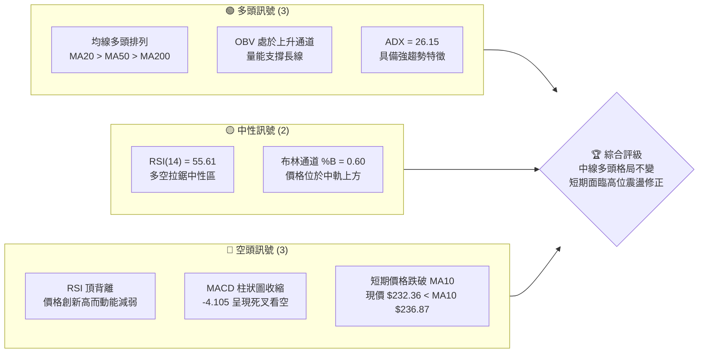
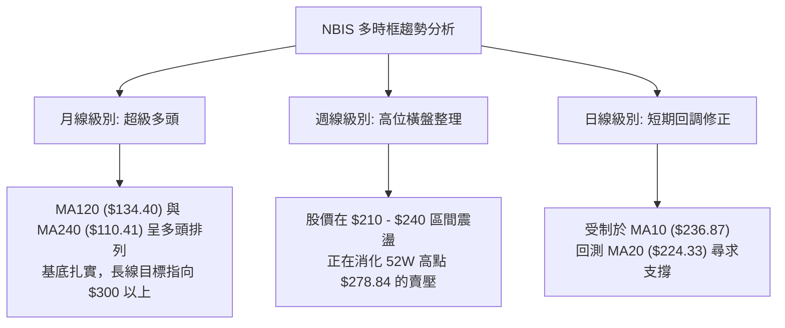
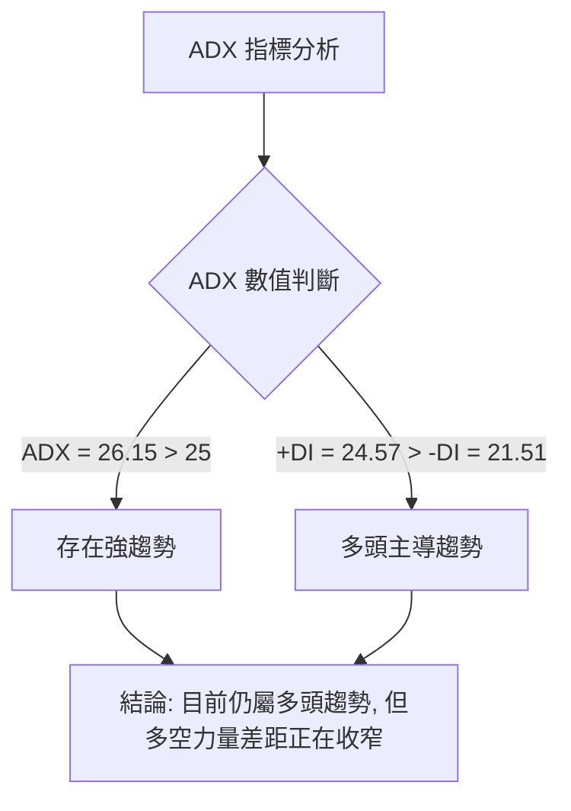
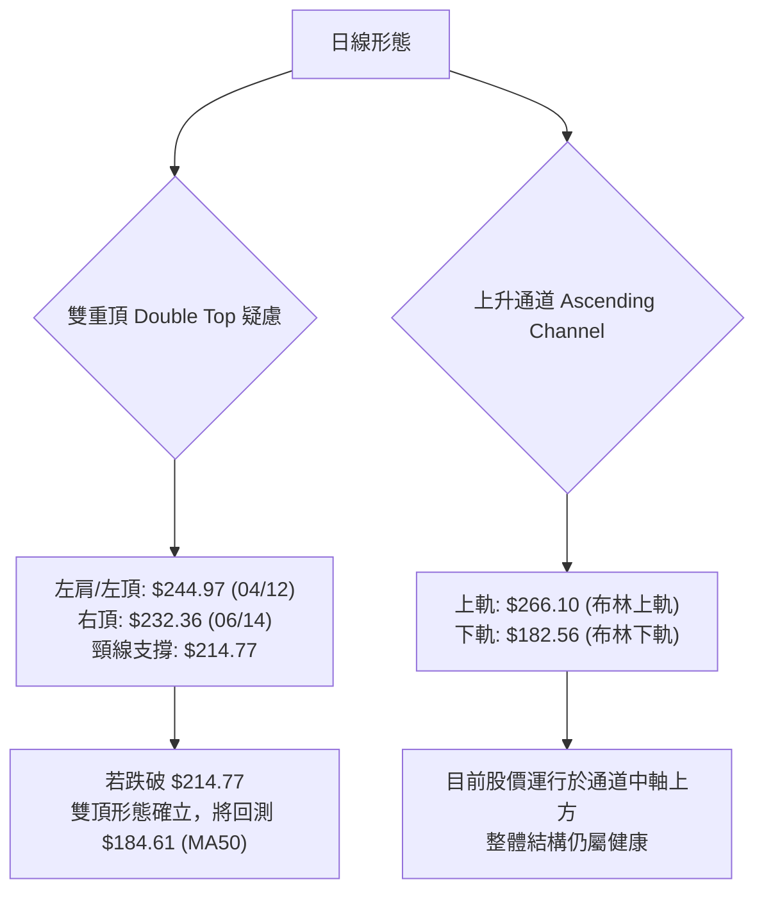
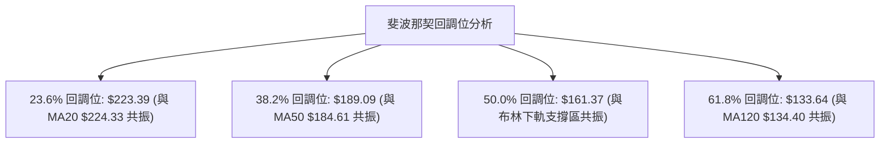
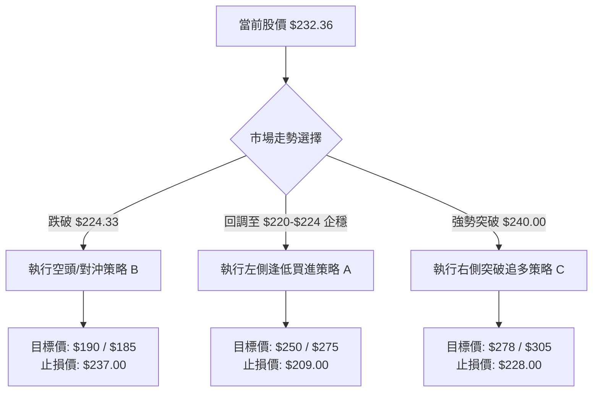
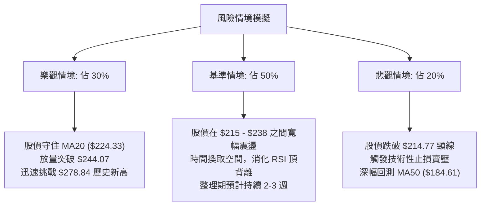

<details>
<summary>📊 靜態圖表 (點擊展開)</summary>

</details>

<html>
<head><meta charset="utf-8" /></head>
<body>
    <div style="height:500px; width:100%;">                        <script>window.PlotlyConfig = {MathJaxConfig: 'local'};</script>
        <script charset="utf-8" src="https://cdn.plot.ly/plotly-3.6.0.min.js" integrity="sha256-QaOVwtVY0T02VaHrr6pnoHLCwayMJp4O5n4YyaE3rJk=" crossorigin="anonymous"></script>                <div id="candlestick-chart" class="plotly-graph-div" style="height:100%; width:100%;"></div>            <script>                window.PLOTLYENV=window.PLOTLYENV || {};                                if (document.getElementById("candlestick-chart")) {                    Plotly.newPlot(                        "candlestick-chart",                        [{"close":{"dtype":"f8","bdata":"AAAAYGaGUUAAAABgjwJSQAAAAOB6FFFAAAAAgBRuUEAAAACgmWlQQAAAAIA9OlBAAAAAgBReUEAAAAAA1wNQQAAAAIAU7ldAAAAAwPVYV0AAAAAAKUxWQAAAAIA9mlZAAAAAoHC9VkAAAAAghVtWQAAAAMAehVdAAAAAIK6HV0AAAAAA19NYQAAAAGBmplpAAAAAQDPzWkAAAABguE5cQAAAAAAp\u002fFpAAAAAwMzsWkAAAACAFI5bQAAAAKBHEVxAAAAAQArnXEAAAAAgrndfQAAAAGC4\u002fl9AAAAAACk8X0AAAADAzGxdQAAAAAAAgF5AAAAA4HqUYEAAAABgjzJgQAAAAGC47mBAAAAAwMwEYEAAAADAHnVfQAAAAGCPwl5AAAAAAClcXEAAAAAAAEBbQAAAAIDrEVpAAAAAIK6nWEAAAACAPYpaQAAAAOCjUF1AAAAAIIVbX0AAAADAHnVeQAAAAGBmRl9AAAAAIIULX0AAAACAPVpgQAAAAIAUHl5AAAAAYI+iW0AAAAAAAEBdQAAAAAApXFtAAAAAgOvRW0AAAADAzHxbQAAAAIAUjllAAAAAQAqXV0AAAADgUShWQAAAAGCP4lRAAAAAYLh+VUAAAABgj6JWQAAAAOB6xFdAAAAAwPUoVUAAAADgo9BUQAAAAKCZ+VZAAAAA4FE4VkAAAAAAKaxXQAAAACCut1dAAAAAoJkJWUAAAADAzBxYQAAAAEDhulhAAAAAQDOzWUAAAABgj4JYQAAAAMAeFVlAAAAAgD0aWEAAAACAwmVXQAAAAIDrkVdAAAAAACnsVUAAAADA9UhUQAAAAMDMPFRAAAAAwMzcUkAAAACAwoVTQAAAAKBwXVZAAAAAYLhOV0AAAACA64FWQAAAAOBRyFZAAAAAgMLlVUAAAABgj4JVQAAAAEDhSlVAAAAAwB7tVEAAAADAzHxWQAAAAMAeNVdAAAAAIFwPWUAAAACgcA1YQAAAAEAzU1hAAAAAIIV7WEAAAADAHtVaQAAAACCFW1pAAAAAYLh+WUAAAADgo\u002fhZQAAAAGC4LltAAAAAYI\u002fSWEAAAAAgrrdYQAAAAGBmNlhAAAAAAACgV0AAAACgcN1WQAAAACCud1hAAAAAIIUbWUAAAACAPbpXQAAAAAApTFVAAAAAgD0KVkAAAADAzHxWQAAAAMD1mFRAAAAAIK53UkAAAABgZoZVQAAAAOBROFdAAAAAYI\u002fyVkAAAABACidWQAAAAGC4blZAAAAA4KOAWEAAAACgR2FYQAAAAEAzc1lAAAAAQArnWkAAAABA4XpYQAAAAEAKJ1lAAAAAwB6lWUAAAAAgrodaQAAAAOBROFpAAAAAACnMVkAAAADgo8BWQAAAAEAzs1VAAAAAgOtxWEAAAACgmelXQAAAAMAeVVZAAAAAACm8V0AAAAAghRtYQAAAACCu\u002f1tAAAAAYI8CW0AAAADAzDxcQAAAAEAzO2BAAAAAwB4VXUAAAAAA16NdQAAAAKBHYV5AAAAAIK5nXUAAAACgmYlcQAAAAIA9ulxAAAAAgMLFXEAAAACAFH5aQAAAAOB6NFlAAAAA4KMQV0AAAADgo\u002fBZQAAAAMDMfFlAAAAA4Ho0W0AAAABgjyJcQAAAAKCZWV1AAAAAAABAX0AAAABgjwphQAAAAEAKH2JAAAAAgOtRY0AAAACAFD5kQAAAAOCj2GRAAAAAQOGqZEAAAADgeqRjQAAAAMAe5WNAAAAAoJmRY0AAAADgeoRjQAAAAGCPomNAAAAAwB5lYkAAAABguB5iQAAAAOBR8GBAAAAAgBSmYUAAAAAgXEdhQAAAACCuT2NAAAAAoHANZkAAAACgcP1lQAAAAEDhYmhAAAAA4KMYZ0AAAACgmSFmQAAAAEAzQ2dAAAAAIIVjZkAAAADgo+hpQAAAAMDMpGtAAAAAgBR+a0AAAAAghftoQAAAACBct2hAAAAAgD36Z0AAAACAwn1rQAAAAOCj2GpAAAAAgOsBakAAAAAA1wtqQAAAAEDhSmxAAAAAQOHibEAAAAAAKYhwQAAAAKBHSXBAAAAAgMJ1b0AAAABguDpwQAAAAIDreWxAAAAAAABAa0AAAAAA14NrQAAAAIAUdmpAAAAAIK7Ha0AAAAAghQttQA=="},"high":{"dtype":"f8","bdata":"AAAAYBLzUUAAAAAAAGBSQAAAAAAp7FFAAAAAgEH4UEAAAAAAAMBQQAAAAAAAoFBAAAAAwPXYUEAAAADA9ahQQAAAACCFq1hAAAAA4KMgWUAAAAAgrndXQAAAAAAAAFdAAAAAQOGaV0AAAABAM9NWQAAAAAAAwFdAAAAAIIVrWEAAAABAM+NYQAAAAMAeJVtAAAAAYLh+W0AAAABgZrZcQAAAAMAehVxAAAAAIFx\u002fW0AAAACgRyFcQAAAAKCZaV1AAAAA4FH4XEAAAAAgXK9fQAAAAABUn2BAAAAA4FH4YEAAAADA9QhgQAAAAADXU19AAAAAgD2qYEAAAABAM6NhQAAAAMD1UGFAAAAAgBa5YEAAAAAgrn9gQAAAAEAKX2BAAAAAAKwkXkAAAACAFF5dQAAAACCFC1tAAAAAQDPzWkAAAAAgrqdaQAAAAMDMXF1AAAAAAACgX0AAAADA9SBgQAAAAMDMfF9AAAAAgBQOYEAAAADAzIRgQAAAAIDC3WBAAAAAgOsxXUAAAACgcI1dQAAAAAAAQF5AAAAAQDPTW0AAAAAgrpddQAAAAADXo1xAAAAAoJlpWkAAAABguN5WQAAAAAAAQFZAAAAAoJlpVkAAAAAAKWxXQAAAAIAULlhAAAAAACmsWUAAAAAgXC9WQAAAAAAAQFdAAAAAgOvRVkAAAACAk+hXQAAAAMAeRVhAAAAAYGZmWUAAAADAzLxZQAAAAADXw1hAAAAAgML1WUAAAABgZlZZQAAAAAAAIFlAAAAAIIM4WUAAAACAwkVYQAAAAMDM3FdAAAAAoJnpV0AAAAAgXA9WQAAAAADXY1RAAAAAQDMTVUAAAABgZhZUQAAAAGCPolZAAAAAoJn5V0AAAACAFD5XQAAAAEDh2lZAAAAAIK7nVkAAAABACidWQAAAAKBwvVVAAAAAgBSeVUAAAADgo7BWQAAAAAAp3FdAAAAAIIUrWUAAAABgZpZZQAAAAGCPollAAAAAgBQ+WkAAAAAghStbQAAAAMDM\u002fFpAAAAAwMysWkAAAADgUQhbQAAAAAAAoFtAAAAAgBQeWkAAAACgmZlZQAAAAGC4\u002fllAAAAA4KO4WEAAAADgUThZQAAAAGCP4lhAAAAAYGZ2WUAAAAAAANBYQAAAAGCPAldAAAAAAABQVkAAAADA9dhWQAAAAGCP6lVAAAAA4Ho0VEAAAACAPapVQAAAACCFa1dAAAAAAFTjV0AAAAAAALBXQAAAAOCjsFZAAAAA4HoUWUAAAABgj9JYQAAAAKCZGVpAAAAAYLj+WkAAAADgehRbQAAAAKBuSllAAAAAAADwWUAAAAAAKdxaQAAAAOB6FFtAAAAAQDPTWEAAAACgxNhWQAAAACCud1ZAAAAAYLieWEAAAAAAANBYQAAAAMDMvFdAAAAAwMzMV0AAAACgmZlYQAAAAMAehVxAAAAAYI\u002fCW0AAAADgeiRdQAAAAKCZiWBAAAAAAABgXkAAAABAibFeQAAAAEAzc15AAAAAAFbuXkAAAAAA11NeQAAAAEAzc11AAAAAQDOzXUAAAABAM1NcQAAAAOCjkFpAAAAAIFyPWUAAAADA9fhZQAAAACCu91pAAAAAoHA9W0AAAACAwnVcQAAAAKCZeV1AAAAAAADwX0AAAACgmRFhQAAAAIA9umJAAAAAAADwY0AAAABAM8NkQAAAAIDr2WRAAAAAYLgWZUAAAACA64FkQAAAAAAAOGRAAAAAAABoZEAAAACAwu1kQAAAAIDruWRAAAAAAACoZEAAAACgmZliQAAAAGC4rmFAAAAAYGb2YUAAAAAgXF9iQAAAAAAAgGNAAAAAwMxsZkAAAABguH5mQAAAACCuf2hAAAAA4Hq8aEAAAAAAAIhnQAAAAICXjmhAAAAAIIUzZ0AAAABA4SprQAAAACBcN21AAAAAoEeZbEAAAACAPUJrQAAAAIDrWWlAAAAAAACIaUAAAACA61lsQAAAAKBwvWtAAAAA4FGga0AAAADgejRqQAAAAOB6HG1AAAAAQDMzbUAAAACgxCxxQAAAAKBwbXFAAAAAIFy3cEAAAAAghYdwQAAAAAAAWG9AAAAAwMwMbkAAAADA9bRtQAAAACCu32xAAAAAIK6PbEAAAABA4XJuQA=="},"hovertemplate":"\u003cb\u003e%{x|%Y-%m-%d}\u003c\u002fb\u003e\u003cbr\u003e\u958b: $%{open:.2f}\u003cbr\u003e\u9ad8: $%{high:.2f}\u003cbr\u003e\u4f4e: $%{low:.2f}\u003cbr\u003e\u6536: $%{close:.2f}\u003cextra\u003e\u003c\u002fextra\u003e","low":{"dtype":"f8","bdata":"AAAAYLopUUAAAADAzIxRQAAAAGBm5lBAAAAAQAoHUEAAAAAgLzVQQAAAAIA9GlBAAAAAoEehT0AAAABgZuZPQAAAACCuh1VAAAAAAADAVkAAAABgjxpWQAAAAIDrsVVAAAAAgMI1VkAAAACgRwFWQAAAAMAeNVZAAAAAgOsBV0AAAAAAAFBXQAAAAKBHoVhAAAAAAAAQWkAAAABgZjZaQAAAAOBReFpAAAAAQDOzWUAAAADAHhVbQAAAAIA96ltAAAAA4KNwW0AAAADgeqRdQAAAAGBm5l5AAAAAIIU7X0AAAACAFO5cQAAAAAAAYF1AAAAAIK73XUAAAADgUQBgQAAAAMDMlGBAAAAAAABwX0AAAADAzIxeQAAAAKBHgV5AAAAA4FG4W0AAAADgo+BaQAAAAKCZWVlAAAAA4FGoV0AAAACgcN1YQAAAAOCjgFtAAAAAQAoHXkAAAACA6zFeQAAAAAAAYF1AAAAA4KNwXUAAAABAM5NfQAAAAAAA8F1AAAAAAABAW0AAAAAghdtbQAAAAIA9GltAAAAA4KNQWUAAAACAFC5bQAAAAMAe9VhAAAAAoHDtVkAAAAAAACBVQAAAAAAAgFRAAAAAgMLlVEAAAACgcG1UQAAAAEAz81ZAAAAAoHANVUAAAACgcI1TQAAAAKCZSVVAAAAA4CQuVUAAAADgo7BWQAAAAAApXFdAAAAA4KNAVkAAAAAA1wNYQAAAAAAAwFZAAAAAgBReWEAAAADAzAxYQAAAAEAz01dAAAAAYGYGWEAAAADAzAxXQAAAAMDMrFVAAAAAwMyMVUAAAACgGARUQAAAAOBROFNAAAAAAADQUkAAAADgo0BTQAAAAIA9ClRAAAAAYGbGVkAAAAAA1xNWQAAAAKCZKVZAAAAAIFyvVUAAAABgjxJVQAAAAADXI1VAAAAAoJm5VEAAAADgo4BVQAAAAMD1uFZAAAAAACm8VkAAAAAA1+NXQAAAACBYAVhAAAAAYGZGWEAAAABAMyNYQAAAAEDh+llAAAAAIIPYWEAAAABgZkZZQAAAAKBwLVlAAAAAgMKVWEAAAABgZkZXQAAAAAAAIFhAAAAAgOthV0AAAABACtdWQAAAAIDrYVdAAAAAACkcWEAAAACAPcpWQAAAACCuB1VAAAAAgBQOVUAAAAAAADBVQAAAAAApnFNAAAAAoEdhUkAAAAAgrkdTQAAAAADX81RAAAAAgD3qVkAAAADA9chVQAAAAAAp7FNAAAAAQAo3VkAAAAAAAGBXQAAAACDZNlhAAAAAIIUbWUAAAACA60FYQAAAAEAz01dAAAAAQN9vWEAAAABAM7NZQAAAAAAAgFlAAAAAoJkZVkAAAABAM7NVQAAAAIDr4VRAAAAAoJmJVkAAAAAgrudWQAAAAEAzM1ZAAAAAAACgVUAAAAAAAMBXQAAAACBcH1pAAAAAoEehWkAAAADA9YhbQAAAAGASG19AAAAAQApHXEAAAAAAAIBcQAAAAKBHsVxAAAAAgJMoXEAAAABAM2NcQAAAAOCjAFxAAAAAwB5VXEAAAACAPVpaQAAAAKBHEVlAAAAAwMppVkAAAABguO5XQAAAAGBmVllAAAAAACkMWEAAAADAzNxaQAAAAIDrkVtAAAAAYGbWXUAAAABAMyNfQAAAAOBR3GBAAAAAoJnJYUAAAADgo9BjQAAAAAAAkGNAAAAAQOECZEAAAAAgXFdjQAAAAKBHQWNAAAAAwMxsY0AAAABAM2tjQAAAAIA9QmNAAAAAgOs5YkAAAACA61FhQAAAAGBmlmBAAAAAQArHYEAAAAAAAOBgQAAAAAAAgGFAAAAAYGb2Y0AAAABguBZlQAAAACCF42VAAAAAAAAgZkAAAAAAABBmQAAAAKCZUWZAAAAAAACIZUAAAAAAAGBoQAAAAAAA+GlAAAAAoJl5akAAAABgj8JnQAAAAAAA4GZAAAAA4HrUZ0AAAACgmRlqQAAAACBcV2pAAAAAwB61aUAAAACA68loQAAAAOBRYGtAAAAAwMxMakAAAAAAAMBtQAAAAAAAPHBAAAAA4FHwbkAAAACAFFZtQAAAAIAUFmtAAAAAYGY2a0AAAACgmQlpQAAAAADXa2pAAAAAAACgaUAAAAAAAPBrQA=="},"name":"\u50f9\u683c","open":{"dtype":"f8","bdata":"AAAAAADgUUAAAAAghbtRQAAAAEDh4lFAAAAAoJl5UEAAAADgUbhQQAAAAOB6XFBAAAAAAACgUEAAAABA4SpQQAAAAMDMTFhAAAAAwPXoVkAAAABA4SpXQAAAAAApzFZAAAAAQAonV0AAAADAzMxWQAAAAEDh6lZAAAAAwMzEV0AAAADA9YhXQAAAAMDMfFlAAAAAYI8CW0AAAADgo0hbQAAAACCFA1tAAAAAIIV7W0AAAADgUVhbQAAAAOB6XFxAAAAAgMLtW0AAAACgR\u002fFeQAAAAEAKz19AAAAAwMyMYEAAAADAzPRfQAAAAMDMTF5AAAAAYLg+XkAAAABgZt5gQAAAAGC45mBAAAAAAACAYEAAAADAzHxgQAAAAEDhAmBAAAAAANeDXUAAAABgjzJdQAAAAOBR+FpAAAAAQDOrWkAAAADAHhVZQAAAAIA9yltAAAAAgD06XkAAAAAA15tfQAAAAIDrEV9AAAAAwMxMXkAAAADA9ahfQAAAAAAAwGBAAAAAYLgWXEAAAADA9WhcQAAAAEAz411AAAAAAAAgWkAAAAAghctcQAAAAOBRiFxAAAAAwMwMWkAAAADA9bhWQAAAAEAKl1RAAAAA4Hr0VEAAAACA6\u002fFUQAAAAOBRQFdAAAAAIIXbWEAAAABAM2NVQAAAAGC4jlVAAAAAYI9SVkAAAABgZnZXQAAAAEAzI1hAAAAAwMzcVkAAAABAChdZQAAAAKBHwVdAAAAA4HrEWEAAAACAwhVZQAAAAGCPUlhAAAAAgMKFWEAAAABguO5XQAAAAMDMTFZAAAAAANdTV0AAAABgZgZWQAAAAMDM5FNAAAAAgMIFVUAAAABAM8NTQAAAAKCZKVRAAAAAgBQ+V0AAAAAA15NWQAAAAGC4jlZAAAAA4KPgVkAAAADAzBxVQAAAAAAAmFVAAAAAIK5XVUAAAABACr9VQAAAAAAAwFdAAAAAgMLtV0AAAADgo8BYQAAAAGCPMlhAAAAAoEe5WEAAAADgepRYQAAAAMAe1VpAAAAAgOtxWkAAAAAghSNaQAAAACCuf1pAAAAAwB51WUAAAACAwkVZQAAAAOCjgFlAAAAAwMwsWEAAAACgcG1YQAAAAGBmlldAAAAAAAAAWUAAAABACpdYQAAAAKBD41ZAAAAAANdzVUAAAAAghXtWQAAAAAAAwFVAAAAAwPXIU0AAAABgZs5TQAAAAMDMHFVAAAAAYI86V0AAAABgjzpXQAAAAGBmBlVAAAAAQAp3VkAAAAAAAABYQAAAAGC47lhAAAAAIIUbWUAAAAAA06VaQAAAACCFE1hAAAAAIFzXWEAAAAAgXD9aQAAAAAAAgFpAAAAAwMysWEAAAAAAAABWQAAAAKCZiVVAAAAAoJmZVkAAAAAAADBYQAAAAEAzE1dAAAAAQArXVUAAAADA9chXQAAAAIA9SlpAAAAAgMJFW0AAAAAAKZxbQAAAAAAAMF9AAAAAgMIVXkAAAABAM7NcQAAAAOBR0FxAAAAAYGYeXkAAAACgcC1dQAAAAEAzC11AAAAAIK43XUAAAADgUVBcQAAAAMAedVpAAAAAIFyPWUAAAABguH5YQAAAAOB6fFpAAAAAgD0aWEAAAACAPSpbQAAAAAAAqFtAAAAA4FG4X0AAAAAAAEBfQAAAAOBR3GBAAAAAYGbWYUAAAABAMyNkQAAAAGA7B2RAAAAAAADgZEAAAADA9XhkQAAAAAAAoGNAAAAAQAonZEAAAAAghVtkQAAAAMDMfGNAAAAAoHB1ZEAAAADgeoxiQAAAAMDMTGFAAAAAQAqDYUAAAACA6yViQAAAAGCPqmFAAAAA4FEMZEAAAADAzHRlQAAAAEAKc2ZAAAAA4FHAZ0AAAABgZvZmQAAAAMDMfGZAAAAAoHCNZkAAAABACntpQAAAAAAArGpAAAAAIIUza0AAAABACi9rQAAAAAAA4GdAAAAAQAp\u002faUAAAAAgrndqQAAAAOBRaGtAAAAAoJmVa0AAAADAHvlpQAAAAAApzGxAAAAAIIV7bEAAAABA4YJuQAAAAKCZAXFAAAAAoHBDcEAAAAAgrvdtQAAAACCF225AAAAAwMwMbkAAAAAAAMBsQAAAAKDG72pAAAAA4HqsaUAAAADAzFRtQA=="},"x":["2025-08-27T00:00:00-04:00","2025-08-28T00:00:00-04:00","2025-08-29T00:00:00-04:00","2025-09-02T00:00:00-04:00","2025-09-03T00:00:00-04:00","2025-09-04T00:00:00-04:00","2025-09-05T00:00:00-04:00","2025-09-08T00:00:00-04:00","2025-09-09T00:00:00-04:00","2025-09-10T00:00:00-04:00","2025-09-11T00:00:00-04:00","2025-09-12T00:00:00-04:00","2025-09-15T00:00:00-04:00","2025-09-16T00:00:00-04:00","2025-09-17T00:00:00-04:00","2025-09-18T00:00:00-04:00","2025-09-19T00:00:00-04:00","2025-09-22T00:00:00-04:00","2025-09-23T00:00:00-04:00","2025-09-24T00:00:00-04:00","2025-09-25T00:00:00-04:00","2025-09-26T00:00:00-04:00","2025-09-29T00:00:00-04:00","2025-09-30T00:00:00-04:00","2025-10-01T00:00:00-04:00","2025-10-02T00:00:00-04:00","2025-10-03T00:00:00-04:00","2025-10-06T00:00:00-04:00","2025-10-07T00:00:00-04:00","2025-10-08T00:00:00-04:00","2025-10-09T00:00:00-04:00","2025-10-10T00:00:00-04:00","2025-10-13T00:00:00-04:00","2025-10-14T00:00:00-04:00","2025-10-15T00:00:00-04:00","2025-10-16T00:00:00-04:00","2025-10-17T00:00:00-04:00","2025-10-20T00:00:00-04:00","2025-10-21T00:00:00-04:00","2025-10-22T00:00:00-04:00","2025-10-23T00:00:00-04:00","2025-10-24T00:00:00-04:00","2025-10-27T00:00:00-04:00","2025-10-28T00:00:00-04:00","2025-10-29T00:00:00-04:00","2025-10-30T00:00:00-04:00","2025-10-31T00:00:00-04:00","2025-11-03T00:00:00-05:00","2025-11-04T00:00:00-05:00","2025-11-05T00:00:00-05:00","2025-11-06T00:00:00-05:00","2025-11-07T00:00:00-05:00","2025-11-10T00:00:00-05:00","2025-11-11T00:00:00-05:00","2025-11-12T00:00:00-05:00","2025-11-13T00:00:00-05:00","2025-11-14T00:00:00-05:00","2025-11-17T00:00:00-05:00","2025-11-18T00:00:00-05:00","2025-11-19T00:00:00-05:00","2025-11-20T00:00:00-05:00","2025-11-21T00:00:00-05:00","2025-11-24T00:00:00-05:00","2025-11-25T00:00:00-05:00","2025-11-26T00:00:00-05:00","2025-11-28T00:00:00-05:00","2025-12-01T00:00:00-05:00","2025-12-02T00:00:00-05:00","2025-12-03T00:00:00-05:00","2025-12-04T00:00:00-05:00","2025-12-05T00:00:00-05:00","2025-12-08T00:00:00-05:00","2025-12-09T00:00:00-05:00","2025-12-10T00:00:00-05:00","2025-12-11T00:00:00-05:00","2025-12-12T00:00:00-05:00","2025-12-15T00:00:00-05:00","2025-12-16T00:00:00-05:00","2025-12-17T00:00:00-05:00","2025-12-18T00:00:00-05:00","2025-12-19T00:00:00-05:00","2025-12-22T00:00:00-05:00","2025-12-23T00:00:00-05:00","2025-12-24T00:00:00-05:00","2025-12-26T00:00:00-05:00","2025-12-29T00:00:00-05:00","2025-12-30T00:00:00-05:00","2025-12-31T00:00:00-05:00","2026-01-02T00:00:00-05:00","2026-01-05T00:00:00-05:00","2026-01-06T00:00:00-05:00","2026-01-07T00:00:00-05:00","2026-01-08T00:00:00-05:00","2026-01-09T00:00:00-05:00","2026-01-12T00:00:00-05:00","2026-01-13T00:00:00-05:00","2026-01-14T00:00:00-05:00","2026-01-15T00:00:00-05:00","2026-01-16T00:00:00-05:00","2026-01-20T00:00:00-05:00","2026-01-21T00:00:00-05:00","2026-01-22T00:00:00-05:00","2026-01-23T00:00:00-05:00","2026-01-26T00:00:00-05:00","2026-01-27T00:00:00-05:00","2026-01-28T00:00:00-05:00","2026-01-29T00:00:00-05:00","2026-01-30T00:00:00-05:00","2026-02-02T00:00:00-05:00","2026-02-03T00:00:00-05:00","2026-02-04T00:00:00-05:00","2026-02-05T00:00:00-05:00","2026-02-06T00:00:00-05:00","2026-02-09T00:00:00-05:00","2026-02-10T00:00:00-05:00","2026-02-11T00:00:00-05:00","2026-02-12T00:00:00-05:00","2026-02-13T00:00:00-05:00","2026-02-17T00:00:00-05:00","2026-02-18T00:00:00-05:00","2026-02-19T00:00:00-05:00","2026-02-20T00:00:00-05:00","2026-02-23T00:00:00-05:00","2026-02-24T00:00:00-05:00","2026-02-25T00:00:00-05:00","2026-02-26T00:00:00-05:00","2026-02-27T00:00:00-05:00","2026-03-02T00:00:00-05:00","2026-03-03T00:00:00-05:00","2026-03-04T00:00:00-05:00","2026-03-05T00:00:00-05:00","2026-03-06T00:00:00-05:00","2026-03-09T00:00:00-04:00","2026-03-10T00:00:00-04:00","2026-03-11T00:00:00-04:00","2026-03-12T00:00:00-04:00","2026-03-13T00:00:00-04:00","2026-03-16T00:00:00-04:00","2026-03-17T00:00:00-04:00","2026-03-18T00:00:00-04:00","2026-03-19T00:00:00-04:00","2026-03-20T00:00:00-04:00","2026-03-23T00:00:00-04:00","2026-03-24T00:00:00-04:00","2026-03-25T00:00:00-04:00","2026-03-26T00:00:00-04:00","2026-03-27T00:00:00-04:00","2026-03-30T00:00:00-04:00","2026-03-31T00:00:00-04:00","2026-04-01T00:00:00-04:00","2026-04-02T00:00:00-04:00","2026-04-06T00:00:00-04:00","2026-04-07T00:00:00-04:00","2026-04-08T00:00:00-04:00","2026-04-09T00:00:00-04:00","2026-04-10T00:00:00-04:00","2026-04-13T00:00:00-04:00","2026-04-14T00:00:00-04:00","2026-04-15T00:00:00-04:00","2026-04-16T00:00:00-04:00","2026-04-17T00:00:00-04:00","2026-04-20T00:00:00-04:00","2026-04-21T00:00:00-04:00","2026-04-22T00:00:00-04:00","2026-04-23T00:00:00-04:00","2026-04-24T00:00:00-04:00","2026-04-27T00:00:00-04:00","2026-04-28T00:00:00-04:00","2026-04-29T00:00:00-04:00","2026-04-30T00:00:00-04:00","2026-05-01T00:00:00-04:00","2026-05-04T00:00:00-04:00","2026-05-05T00:00:00-04:00","2026-05-06T00:00:00-04:00","2026-05-07T00:00:00-04:00","2026-05-08T00:00:00-04:00","2026-05-11T00:00:00-04:00","2026-05-12T00:00:00-04:00","2026-05-13T00:00:00-04:00","2026-05-14T00:00:00-04:00","2026-05-15T00:00:00-04:00","2026-05-18T00:00:00-04:00","2026-05-19T00:00:00-04:00","2026-05-20T00:00:00-04:00","2026-05-21T00:00:00-04:00","2026-05-22T00:00:00-04:00","2026-05-26T00:00:00-04:00","2026-05-27T00:00:00-04:00","2026-05-28T00:00:00-04:00","2026-05-29T00:00:00-04:00","2026-06-01T00:00:00-04:00","2026-06-02T00:00:00-04:00","2026-06-03T00:00:00-04:00","2026-06-04T00:00:00-04:00","2026-06-05T00:00:00-04:00","2026-06-08T00:00:00-04:00","2026-06-09T00:00:00-04:00","2026-06-10T00:00:00-04:00","2026-06-11T00:00:00-04:00","2026-06-12T00:00:00-04:00"],"type":"candlestick"},{"hovertemplate":"MA30: $%{y:.2f}\u003cextra\u003e\u003c\u002fextra\u003e","line":{"color":"#2196F3","dash":"dash","width":2},"mode":"lines","name":"MA30","x":["2025-08-27T00:00:00-04:00","2025-08-28T00:00:00-04:00","2025-08-29T00:00:00-04:00","2025-09-02T00:00:00-04:00","2025-09-03T00:00:00-04:00","2025-09-04T00:00:00-04:00","2025-09-05T00:00:00-04:00","2025-09-08T00:00:00-04:00","2025-09-09T00:00:00-04:00","2025-09-10T00:00:00-04:00","2025-09-11T00:00:00-04:00","2025-09-12T00:00:00-04:00","2025-09-15T00:00:00-04:00","2025-09-16T00:00:00-04:00","2025-09-17T00:00:00-04:00","2025-09-18T00:00:00-04:00","2025-09-19T00:00:00-04:00","2025-09-22T00:00:00-04:00","2025-09-23T00:00:00-04:00","2025-09-24T00:00:00-04:00","2025-09-25T00:00:00-04:00","2025-09-26T00:00:00-04:00","2025-09-29T00:00:00-04:00","2025-09-30T00:00:00-04:00","2025-10-01T00:00:00-04:00","2025-10-02T00:00:00-04:00","2025-10-03T00:00:00-04:00","2025-10-06T00:00:00-04:00","2025-10-07T00:00:00-04:00","2025-10-08T00:00:00-04:00","2025-10-09T00:00:00-04:00","2025-10-10T00:00:00-04:00","2025-10-13T00:00:00-04:00","2025-10-14T00:00:00-04:00","2025-10-15T00:00:00-04:00","2025-10-16T00:00:00-04:00","2025-10-17T00:00:00-04:00","2025-10-20T00:00:00-04:00","2025-10-21T00:00:00-04:00","2025-10-22T00:00:00-04:00","2025-10-23T00:00:00-04:00","2025-10-24T00:00:00-04:00","2025-10-27T00:00:00-04:00","2025-10-28T00:00:00-04:00","2025-10-29T00:00:00-04:00","2025-10-30T00:00:00-04:00","2025-10-31T00:00:00-04:00","2025-11-03T00:00:00-05:00","2025-11-04T00:00:00-05:00","2025-11-05T00:00:00-05:00","2025-11-06T00:00:00-05:00","2025-11-07T00:00:00-05:00","2025-11-10T00:00:00-05:00","2025-11-11T00:00:00-05:00","2025-11-12T00:00:00-05:00","2025-11-13T00:00:00-05:00","2025-11-14T00:00:00-05:00","2025-11-17T00:00:00-05:00","2025-11-18T00:00:00-05:00","2025-11-19T00:00:00-05:00","2025-11-20T00:00:00-05:00","2025-11-21T00:00:00-05:00","2025-11-24T00:00:00-05:00","2025-11-25T00:00:00-05:00","2025-11-26T00:00:00-05:00","2025-11-28T00:00:00-05:00","2025-12-01T00:00:00-05:00","2025-12-02T00:00:00-05:00","2025-12-03T00:00:00-05:00","2025-12-04T00:00:00-05:00","2025-12-05T00:00:00-05:00","2025-12-08T00:00:00-05:00","2025-12-09T00:00:00-05:00","2025-12-10T00:00:00-05:00","2025-12-11T00:00:00-05:00","2025-12-12T00:00:00-05:00","2025-12-15T00:00:00-05:00","2025-12-16T00:00:00-05:00","2025-12-17T00:00:00-05:00","2025-12-18T00:00:00-05:00","2025-12-19T00:00:00-05:00","2025-12-22T00:00:00-05:00","2025-12-23T00:00:00-05:00","2025-12-24T00:00:00-05:00","2025-12-26T00:00:00-05:00","2025-12-29T00:00:00-05:00","2025-12-30T00:00:00-05:00","2025-12-31T00:00:00-05:00","2026-01-02T00:00:00-05:00","2026-01-05T00:00:00-05:00","2026-01-06T00:00:00-05:00","2026-01-07T00:00:00-05:00","2026-01-08T00:00:00-05:00","2026-01-09T00:00:00-05:00","2026-01-12T00:00:00-05:00","2026-01-13T00:00:00-05:00","2026-01-14T00:00:00-05:00","2026-01-15T00:00:00-05:00","2026-01-16T00:00:00-05:00","2026-01-20T00:00:00-05:00","2026-01-21T00:00:00-05:00","2026-01-22T00:00:00-05:00","2026-01-23T00:00:00-05:00","2026-01-26T00:00:00-05:00","2026-01-27T00:00:00-05:00","2026-01-28T00:00:00-05:00","2026-01-29T00:00:00-05:00","2026-01-30T00:00:00-05:00","2026-02-02T00:00:00-05:00","2026-02-03T00:00:00-05:00","2026-02-04T00:00:00-05:00","2026-02-05T00:00:00-05:00","2026-02-06T00:00:00-05:00","2026-02-09T00:00:00-05:00","2026-02-10T00:00:00-05:00","2026-02-11T00:00:00-05:00","2026-02-12T00:00:00-05:00","2026-02-13T00:00:00-05:00","2026-02-17T00:00:00-05:00","2026-02-18T00:00:00-05:00","2026-02-19T00:00:00-05:00","2026-02-20T00:00:00-05:00","2026-02-23T00:00:00-05:00","2026-02-24T00:00:00-05:00","2026-02-25T00:00:00-05:00","2026-02-26T00:00:00-05:00","2026-02-27T00:00:00-05:00","2026-03-02T00:00:00-05:00","2026-03-03T00:00:00-05:00","2026-03-04T00:00:00-05:00","2026-03-05T00:00:00-05:00","2026-03-06T00:00:00-05:00","2026-03-09T00:00:00-04:00","2026-03-10T00:00:00-04:00","2026-03-11T00:00:00-04:00","2026-03-12T00:00:00-04:00","2026-03-13T00:00:00-04:00","2026-03-16T00:00:00-04:00","2026-03-17T00:00:00-04:00","2026-03-18T00:00:00-04:00","2026-03-19T00:00:00-04:00","2026-03-20T00:00:00-04:00","2026-03-23T00:00:00-04:00","2026-03-24T00:00:00-04:00","2026-03-25T00:00:00-04:00","2026-03-26T00:00:00-04:00","2026-03-27T00:00:00-04:00","2026-03-30T00:00:00-04:00","2026-03-31T00:00:00-04:00","2026-04-01T00:00:00-04:00","2026-04-02T00:00:00-04:00","2026-04-06T00:00:00-04:00","2026-04-07T00:00:00-04:00","2026-04-08T00:00:00-04:00","2026-04-09T00:00:00-04:00","2026-04-10T00:00:00-04:00","2026-04-13T00:00:00-04:00","2026-04-14T00:00:00-04:00","2026-04-15T00:00:00-04:00","2026-04-16T00:00:00-04:00","2026-04-17T00:00:00-04:00","2026-04-20T00:00:00-04:00","2026-04-21T00:00:00-04:00","2026-04-22T00:00:00-04:00","2026-04-23T00:00:00-04:00","2026-04-24T00:00:00-04:00","2026-04-27T00:00:00-04:00","2026-04-28T00:00:00-04:00","2026-04-29T00:00:00-04:00","2026-04-30T00:00:00-04:00","2026-05-01T00:00:00-04:00","2026-05-04T00:00:00-04:00","2026-05-05T00:00:00-04:00","2026-05-06T00:00:00-04:00","2026-05-07T00:00:00-04:00","2026-05-08T00:00:00-04:00","2026-05-11T00:00:00-04:00","2026-05-12T00:00:00-04:00","2026-05-13T00:00:00-04:00","2026-05-14T00:00:00-04:00","2026-05-15T00:00:00-04:00","2026-05-18T00:00:00-04:00","2026-05-19T00:00:00-04:00","2026-05-20T00:00:00-04:00","2026-05-21T00:00:00-04:00","2026-05-22T00:00:00-04:00","2026-05-26T00:00:00-04:00","2026-05-27T00:00:00-04:00","2026-05-28T00:00:00-04:00","2026-05-29T00:00:00-04:00","2026-06-01T00:00:00-04:00","2026-06-02T00:00:00-04:00","2026-06-03T00:00:00-04:00","2026-06-04T00:00:00-04:00","2026-06-05T00:00:00-04:00","2026-06-08T00:00:00-04:00","2026-06-09T00:00:00-04:00","2026-06-10T00:00:00-04:00","2026-06-11T00:00:00-04:00","2026-06-12T00:00:00-04:00"],"y":{"dtype":"f8","bdata":"AAAAAAAA+H8AAAAAAAD4fwAAAAAAAPh\u002fAAAAAAAA+H8AAAAAAAD4fwAAAAAAAPh\u002fAAAAAAAA+H8AAAAAAAD4fwAAAAAAAPh\u002fAAAAAAAA+H8AAAAAAAD4fwAAAAAAAPh\u002fAAAAAAAA+H8AAAAAAAD4fwAAAAAAAPh\u002fAAAAAAAA+H8AAAAAAAD4fwAAAAAAAPh\u002fAAAAAAAA+H8AAAAAAAD4fwAAAAAAAPh\u002fAAAAAAAA+H8AAAAAAAD4fwAAAAAAAPh\u002fAAAAAAAA+H8AAAAAAAD4fwAAAAAAAPh\u002fAAAAAAAA+H8AAAAAAAD4f1VVVRWD8FdAMzMzQ+51WEBmZmbGrvBYQLy7uyvqf1lAVVVVRRkFWkAzMzOTe4VaQN7d3U1+AVtAIiIiUtRnW0De3d2Ns8dbQERERHT22VtAvLu7ux7lW0De3d2dUglcQLy7u0uaQlxAMzMzgyOMXEC8u7s7QtFcQJqZmUlvE11A3t3dDZBTXUCJiIi4yJZdQHd3d5dftF1A7+7u\u002fje6XUCrqqrqQsJdQN7d3R12xV1AZmZmRhnNXUARERHRhcxdQN7d3S0Vt11AiYiI2L+JXUBmZmbWTTpdQLy7u6t\u002f21xAERERUWKIXEBmZmZWcU5cQHd3d\u002ff9FFxAERERkZeuW0C8u7urxktbQJqZmRnZ7lpAIiIichKbWkCrqqrao1haQHd3d0eLHFpAq6qqKjEAWkARERExa+VZQKuqqur72VlAERERwebiWUBmZmYmlNFZQM3MzBx2rVlAMzMzU41vWUBERESETjNZQAAAALCO8VhAiYiISLajWEAAAABgujlYQO\u002fu7i5r5VdAzczMXI+aV0AAAABQjUdXQBEREZHtHFdAzczM3Gv2VkAzMzPj7MtWQEREREREtFZAERER8dKlVkBVVVV1TKBWQHd3d6fGo1ZAMzMzM+yeVkCrqqr6qZ1WQERERKTimFZAIiIiUiq6VkDv7u6+ytVWQN7d3d1P4VZAAAAAYJ70VkAAAACAlQ9XQKuqqqocJldAd3d3FwQqV0CJiIiY4DlXQKuqqirOTldAzczMPFFHV0B3d3eHFklXQLy7u\u002fupQVdA3t3d3ZY9V0CrqqqaCzlXQJqZmTm0QFdAZmZm9uFbV0CJiIg4QnlXQERERNRNgldAAAAAMGudV0BERERUuLZXQKuqqiqjp1dAZmZmBlZ+V0CJiIi483VXQERERHSveVdAd3d3N6WCV0B3d3fHIIhXQGZmZibbkVdAZmZmll+wV0ARERHRhcBXQCIiIqKo01dAMzMzo2HjV0BmZmaGB+dXQJqZmTkX7ldA7+7uvgL4V0DNzMzsbfVXQM3MzIxB9FdAVVVVxTzdV0De3d1NxcFXQJqZmZn8kldAAAAA8MOPV0AzMzNj5YhXQHd3d3faeFdARERExMp5V0DNzMwMZYRXQO\u002fu7i6HoldAIiIiQsOyV0AAAACAP9lXQBEREdGFOFhAREREZJ50WEBEREREp7FYQGZmZnYhBVlAvLu7y3ZiWUBmZmbWTZ5ZQImIiChNzVlAAAAAEAL\u002fWUAAAADwCiRaQN7d3Y2zO1pAmpmZSW8vWkCamZkpvzxaQERERBQRPVpAZmZm5qU\u002fWkDv7u5e1l5aQDMzM\u002fOnglpAIiIiQnyyWkAiIiLy7vJaQO\u002fu7m51SFtAZmZm5qXPW0AzMzMj92ZcQLy7u2uREV1AAAAAMLKhXUDNzMzs3yReQKuqqmrYuV5AERERsUc9X0AAAABQqbxfQN7d3d1rDmBAREREPCY4YEAiIiIaS1pgQAAAAKhUYGBAAAAAGNl6YECJiIhQ1I9gQDMzM1P\u002fsmBAzczMpLfxYECJiIj4mjNhQERERHQhiWFA3t3dvXTTYUAiIiJSRh9iQKuqqnI9emJAmpmZSeHWYkAzMzNrSkVjQO\u002fu7vZvxGNAIiIiIvc6ZECJiIhQG5hkQCIiIsLK7WRAMzMzExE1ZUAiIiJyPY5lQAAAAICx2GVAERERkcIRZkDNzMwMSUNmQBEREaHTgmZAMzMzw\u002fXIZkDv7u7ufDtnQJqZmVmrp2dA3t3dLSQNaEBmZmbGkntoQHd3d8cEx2hAIiIi0pQSaUAiIiKCwGJpQKuqqroCtGlAiYiIyHYKakDNzMyM3m5qQA=="},"type":"scatter"},{"hovertemplate":"MA60: $%{y:.2f}\u003cextra\u003e\u003c\u002fextra\u003e","line":{"color":"#9C27B0","dash":"dash","width":2},"mode":"lines","name":"MA60","x":["2025-08-27T00:00:00-04:00","2025-08-28T00:00:00-04:00","2025-08-29T00:00:00-04:00","2025-09-02T00:00:00-04:00","2025-09-03T00:00:00-04:00","2025-09-04T00:00:00-04:00","2025-09-05T00:00:00-04:00","2025-09-08T00:00:00-04:00","2025-09-09T00:00:00-04:00","2025-09-10T00:00:00-04:00","2025-09-11T00:00:00-04:00","2025-09-12T00:00:00-04:00","2025-09-15T00:00:00-04:00","2025-09-16T00:00:00-04:00","2025-09-17T00:00:00-04:00","2025-09-18T00:00:00-04:00","2025-09-19T00:00:00-04:00","2025-09-22T00:00:00-04:00","2025-09-23T00:00:00-04:00","2025-09-24T00:00:00-04:00","2025-09-25T00:00:00-04:00","2025-09-26T00:00:00-04:00","2025-09-29T00:00:00-04:00","2025-09-30T00:00:00-04:00","2025-10-01T00:00:00-04:00","2025-10-02T00:00:00-04:00","2025-10-03T00:00:00-04:00","2025-10-06T00:00:00-04:00","2025-10-07T00:00:00-04:00","2025-10-08T00:00:00-04:00","2025-10-09T00:00:00-04:00","2025-10-10T00:00:00-04:00","2025-10-13T00:00:00-04:00","2025-10-14T00:00:00-04:00","2025-10-15T00:00:00-04:00","2025-10-16T00:00:00-04:00","2025-10-17T00:00:00-04:00","2025-10-20T00:00:00-04:00","2025-10-21T00:00:00-04:00","2025-10-22T00:00:00-04:00","2025-10-23T00:00:00-04:00","2025-10-24T00:00:00-04:00","2025-10-27T00:00:00-04:00","2025-10-28T00:00:00-04:00","2025-10-29T00:00:00-04:00","2025-10-30T00:00:00-04:00","2025-10-31T00:00:00-04:00","2025-11-03T00:00:00-05:00","2025-11-04T00:00:00-05:00","2025-11-05T00:00:00-05:00","2025-11-06T00:00:00-05:00","2025-11-07T00:00:00-05:00","2025-11-10T00:00:00-05:00","2025-11-11T00:00:00-05:00","2025-11-12T00:00:00-05:00","2025-11-13T00:00:00-05:00","2025-11-14T00:00:00-05:00","2025-11-17T00:00:00-05:00","2025-11-18T00:00:00-05:00","2025-11-19T00:00:00-05:00","2025-11-20T00:00:00-05:00","2025-11-21T00:00:00-05:00","2025-11-24T00:00:00-05:00","2025-11-25T00:00:00-05:00","2025-11-26T00:00:00-05:00","2025-11-28T00:00:00-05:00","2025-12-01T00:00:00-05:00","2025-12-02T00:00:00-05:00","2025-12-03T00:00:00-05:00","2025-12-04T00:00:00-05:00","2025-12-05T00:00:00-05:00","2025-12-08T00:00:00-05:00","2025-12-09T00:00:00-05:00","2025-12-10T00:00:00-05:00","2025-12-11T00:00:00-05:00","2025-12-12T00:00:00-05:00","2025-12-15T00:00:00-05:00","2025-12-16T00:00:00-05:00","2025-12-17T00:00:00-05:00","2025-12-18T00:00:00-05:00","2025-12-19T00:00:00-05:00","2025-12-22T00:00:00-05:00","2025-12-23T00:00:00-05:00","2025-12-24T00:00:00-05:00","2025-12-26T00:00:00-05:00","2025-12-29T00:00:00-05:00","2025-12-30T00:00:00-05:00","2025-12-31T00:00:00-05:00","2026-01-02T00:00:00-05:00","2026-01-05T00:00:00-05:00","2026-01-06T00:00:00-05:00","2026-01-07T00:00:00-05:00","2026-01-08T00:00:00-05:00","2026-01-09T00:00:00-05:00","2026-01-12T00:00:00-05:00","2026-01-13T00:00:00-05:00","2026-01-14T00:00:00-05:00","2026-01-15T00:00:00-05:00","2026-01-16T00:00:00-05:00","2026-01-20T00:00:00-05:00","2026-01-21T00:00:00-05:00","2026-01-22T00:00:00-05:00","2026-01-23T00:00:00-05:00","2026-01-26T00:00:00-05:00","2026-01-27T00:00:00-05:00","2026-01-28T00:00:00-05:00","2026-01-29T00:00:00-05:00","2026-01-30T00:00:00-05:00","2026-02-02T00:00:00-05:00","2026-02-03T00:00:00-05:00","2026-02-04T00:00:00-05:00","2026-02-05T00:00:00-05:00","2026-02-06T00:00:00-05:00","2026-02-09T00:00:00-05:00","2026-02-10T00:00:00-05:00","2026-02-11T00:00:00-05:00","2026-02-12T00:00:00-05:00","2026-02-13T00:00:00-05:00","2026-02-17T00:00:00-05:00","2026-02-18T00:00:00-05:00","2026-02-19T00:00:00-05:00","2026-02-20T00:00:00-05:00","2026-02-23T00:00:00-05:00","2026-02-24T00:00:00-05:00","2026-02-25T00:00:00-05:00","2026-02-26T00:00:00-05:00","2026-02-27T00:00:00-05:00","2026-03-02T00:00:00-05:00","2026-03-03T00:00:00-05:00","2026-03-04T00:00:00-05:00","2026-03-05T00:00:00-05:00","2026-03-06T00:00:00-05:00","2026-03-09T00:00:00-04:00","2026-03-10T00:00:00-04:00","2026-03-11T00:00:00-04:00","2026-03-12T00:00:00-04:00","2026-03-13T00:00:00-04:00","2026-03-16T00:00:00-04:00","2026-03-17T00:00:00-04:00","2026-03-18T00:00:00-04:00","2026-03-19T00:00:00-04:00","2026-03-20T00:00:00-04:00","2026-03-23T00:00:00-04:00","2026-03-24T00:00:00-04:00","2026-03-25T00:00:00-04:00","2026-03-26T00:00:00-04:00","2026-03-27T00:00:00-04:00","2026-03-30T00:00:00-04:00","2026-03-31T00:00:00-04:00","2026-04-01T00:00:00-04:00","2026-04-02T00:00:00-04:00","2026-04-06T00:00:00-04:00","2026-04-07T00:00:00-04:00","2026-04-08T00:00:00-04:00","2026-04-09T00:00:00-04:00","2026-04-10T00:00:00-04:00","2026-04-13T00:00:00-04:00","2026-04-14T00:00:00-04:00","2026-04-15T00:00:00-04:00","2026-04-16T00:00:00-04:00","2026-04-17T00:00:00-04:00","2026-04-20T00:00:00-04:00","2026-04-21T00:00:00-04:00","2026-04-22T00:00:00-04:00","2026-04-23T00:00:00-04:00","2026-04-24T00:00:00-04:00","2026-04-27T00:00:00-04:00","2026-04-28T00:00:00-04:00","2026-04-29T00:00:00-04:00","2026-04-30T00:00:00-04:00","2026-05-01T00:00:00-04:00","2026-05-04T00:00:00-04:00","2026-05-05T00:00:00-04:00","2026-05-06T00:00:00-04:00","2026-05-07T00:00:00-04:00","2026-05-08T00:00:00-04:00","2026-05-11T00:00:00-04:00","2026-05-12T00:00:00-04:00","2026-05-13T00:00:00-04:00","2026-05-14T00:00:00-04:00","2026-05-15T00:00:00-04:00","2026-05-18T00:00:00-04:00","2026-05-19T00:00:00-04:00","2026-05-20T00:00:00-04:00","2026-05-21T00:00:00-04:00","2026-05-22T00:00:00-04:00","2026-05-26T00:00:00-04:00","2026-05-27T00:00:00-04:00","2026-05-28T00:00:00-04:00","2026-05-29T00:00:00-04:00","2026-06-01T00:00:00-04:00","2026-06-02T00:00:00-04:00","2026-06-03T00:00:00-04:00","2026-06-04T00:00:00-04:00","2026-06-05T00:00:00-04:00","2026-06-08T00:00:00-04:00","2026-06-09T00:00:00-04:00","2026-06-10T00:00:00-04:00","2026-06-11T00:00:00-04:00","2026-06-12T00:00:00-04:00"],"y":{"dtype":"f8","bdata":"AAAAAAAA+H8AAAAAAAD4fwAAAAAAAPh\u002fAAAAAAAA+H8AAAAAAAD4fwAAAAAAAPh\u002fAAAAAAAA+H8AAAAAAAD4fwAAAAAAAPh\u002fAAAAAAAA+H8AAAAAAAD4fwAAAAAAAPh\u002fAAAAAAAA+H8AAAAAAAD4fwAAAAAAAPh\u002fAAAAAAAA+H8AAAAAAAD4fwAAAAAAAPh\u002fAAAAAAAA+H8AAAAAAAD4fwAAAAAAAPh\u002fAAAAAAAA+H8AAAAAAAD4fwAAAAAAAPh\u002fAAAAAAAA+H8AAAAAAAD4fwAAAAAAAPh\u002fAAAAAAAA+H8AAAAAAAD4fwAAAAAAAPh\u002fAAAAAAAA+H8AAAAAAAD4fwAAAAAAAPh\u002fAAAAAAAA+H8AAAAAAAD4fwAAAAAAAPh\u002fAAAAAAAA+H8AAAAAAAD4fwAAAAAAAPh\u002fAAAAAAAA+H8AAAAAAAD4fwAAAAAAAPh\u002fAAAAAAAA+H8AAAAAAAD4fwAAAAAAAPh\u002fAAAAAAAA+H8AAAAAAAD4fwAAAAAAAPh\u002fAAAAAAAA+H8AAAAAAAD4fwAAAAAAAPh\u002fAAAAAAAA+H8AAAAAAAD4fwAAAAAAAPh\u002fAAAAAAAA+H8AAAAAAAD4fwAAAAAAAPh\u002fAAAAAAAA+H8AAAAAAAD4f2ZmZobAAlpAIiIi6kISWkARERG5Oh5aQKuqqqJhN1pAvLu72xVQWkDv7u62D29aQKuqqsoEj1pAZmZmvgK0WkB3d3dfj9ZaQHd3dy\u002f52VpAZmZmvgLkWkAiIiJic+1aQERERDQI+FpAMzMza9j9WkAAAABgSAJbQM3MzPx+AltAMzMzK6P7WkBERESMQehaQDMzM2PlzFpA3t3drWOqWkBVVVUd6IRaQHd3d9cxcVpAmpmZkcJhWkAiIiJaOUxaQBEREbmsNVpAzczMZMkXWkDe3d0lTe1ZQJqZmSmjv1lAIiIiQqeTWUCJiIioDXZZQN7d3U3wVllAmpmZ8WA0WUBVVVW1yBBZQLy7u3sU6FhAERERadjHWEBVVVWtHLRYQBEREflToVhAERERoRqVWEDNzMzkpY9YQKuqqgpllFhA7+7u\u002fhuVWEDv7u5WVY1YQERERAyQd1hAiYiIGJJWWEB3d3cPLTZYQM3MzHQhGVhAd3d3H8z\u002fV0BERERMftlXQJqZmYHcs1dAZmZmRv2bV0AiIiLSIn9XQN7d3V1IYldAmpmZ8WA6V0De3d1N8CBXQERERNz5FldAREREFDwUV0BmZmaeNhRXQO\u002fu7ubQGldAzczM5KUnV0De3d3lFy9XQDMzM6NFNldAq6qq+sVOV0CrqqoiaV5XQLy7u4uzZ1dAd3d3j1B2V0BmZma2gYJXQLy7uxsvjVdAZmZmbqCDV0AzMzPz0n1XQCIiImLlcFdAZmZmloprV0BVVVX1\u002fWhXQJqZmTlCXVdAERER0bBbV0C8u7tTuF5XQERERLSdcVdAREREnFKHV0BERETcQKlXQKuqqtJp3VdAIiIiygQJWEBERETMLzRYQImIiFBiVlhAERERaWZwWEB3d3fHIIpYQGZmZk5+o1hAvLu7o9PAWEC8u7vbFdZYQCIiIlrH5lhAAAAAcOfvWEBVVVV9ov5YQDMzM9tcCFlAzczMxIMRWUCrqqry7iJZQGZmZpZfOFlAiYiIgD9VWUB3d3dvLnRZQN7d3X1bnllA3t3dVXHWWUCJiIg4XhRaQKuqqgJHUlpAAAAAELuYWkAAAACo4tZaQBEREXFZGVtAq6qqOolbW0BmZmYuh6BbQFVVVXWv31tAVVVV3YcRXEAiIiLa6kZcQImIiJCXfFxAIiIiSii1XECrqqryp+hcQGZmZg6QNV1Aq6qqCvOiXUC8u7vjwQJeQImIiAjIb15A3t3dxfXSXkAiIiLKSzFfQJqZmTkXmF9AZmZm7pjuX0AAAAAA1TFgQImIiEB8cWBAq6qqCmWtYEAAAABAw+NgQN7d3V2PF2FAIiIimidHYUCamZl12oNhQLy7uxt2vmFAIiIiwsr8YUAzMzNPYjtiQHd3dyvOhWJAmpmZbefMYkCrqqpy9iZjQHd3d8dLgmNAMzMzA+TVY0AzMzO38yxkQKuqqlK4amRAMzMzh12lZEAiIiLOhd5kQFVVVbErCmVARERE8KdCZUCrqqpuWX9lQA=="},"type":"scatter"},{"hovertemplate":"MA200: $%{y:.2f}\u003cextra\u003e\u003c\u002fextra\u003e","line":{"color":"#FF6F00","dash":"solid","width":2},"mode":"lines","name":"MA200","x":["2025-08-27T00:00:00-04:00","2025-08-28T00:00:00-04:00","2025-08-29T00:00:00-04:00","2025-09-02T00:00:00-04:00","2025-09-03T00:00:00-04:00","2025-09-04T00:00:00-04:00","2025-09-05T00:00:00-04:00","2025-09-08T00:00:00-04:00","2025-09-09T00:00:00-04:00","2025-09-10T00:00:00-04:00","2025-09-11T00:00:00-04:00","2025-09-12T00:00:00-04:00","2025-09-15T00:00:00-04:00","2025-09-16T00:00:00-04:00","2025-09-17T00:00:00-04:00","2025-09-18T00:00:00-04:00","2025-09-19T00:00:00-04:00","2025-09-22T00:00:00-04:00","2025-09-23T00:00:00-04:00","2025-09-24T00:00:00-04:00","2025-09-25T00:00:00-04:00","2025-09-26T00:00:00-04:00","2025-09-29T00:00:00-04:00","2025-09-30T00:00:00-04:00","2025-10-01T00:00:00-04:00","2025-10-02T00:00:00-04:00","2025-10-03T00:00:00-04:00","2025-10-06T00:00:00-04:00","2025-10-07T00:00:00-04:00","2025-10-08T00:00:00-04:00","2025-10-09T00:00:00-04:00","2025-10-10T00:00:00-04:00","2025-10-13T00:00:00-04:00","2025-10-14T00:00:00-04:00","2025-10-15T00:00:00-04:00","2025-10-16T00:00:00-04:00","2025-10-17T00:00:00-04:00","2025-10-20T00:00:00-04:00","2025-10-21T00:00:00-04:00","2025-10-22T00:00:00-04:00","2025-10-23T00:00:00-04:00","2025-10-24T00:00:00-04:00","2025-10-27T00:00:00-04:00","2025-10-28T00:00:00-04:00","2025-10-29T00:00:00-04:00","2025-10-30T00:00:00-04:00","2025-10-31T00:00:00-04:00","2025-11-03T00:00:00-05:00","2025-11-04T00:00:00-05:00","2025-11-05T00:00:00-05:00","2025-11-06T00:00:00-05:00","2025-11-07T00:00:00-05:00","2025-11-10T00:00:00-05:00","2025-11-11T00:00:00-05:00","2025-11-12T00:00:00-05:00","2025-11-13T00:00:00-05:00","2025-11-14T00:00:00-05:00","2025-11-17T00:00:00-05:00","2025-11-18T00:00:00-05:00","2025-11-19T00:00:00-05:00","2025-11-20T00:00:00-05:00","2025-11-21T00:00:00-05:00","2025-11-24T00:00:00-05:00","2025-11-25T00:00:00-05:00","2025-11-26T00:00:00-05:00","2025-11-28T00:00:00-05:00","2025-12-01T00:00:00-05:00","2025-12-02T00:00:00-05:00","2025-12-03T00:00:00-05:00","2025-12-04T00:00:00-05:00","2025-12-05T00:00:00-05:00","2025-12-08T00:00:00-05:00","2025-12-09T00:00:00-05:00","2025-12-10T00:00:00-05:00","2025-12-11T00:00:00-05:00","2025-12-12T00:00:00-05:00","2025-12-15T00:00:00-05:00","2025-12-16T00:00:00-05:00","2025-12-17T00:00:00-05:00","2025-12-18T00:00:00-05:00","2025-12-19T00:00:00-05:00","2025-12-22T00:00:00-05:00","2025-12-23T00:00:00-05:00","2025-12-24T00:00:00-05:00","2025-12-26T00:00:00-05:00","2025-12-29T00:00:00-05:00","2025-12-30T00:00:00-05:00","2025-12-31T00:00:00-05:00","2026-01-02T00:00:00-05:00","2026-01-05T00:00:00-05:00","2026-01-06T00:00:00-05:00","2026-01-07T00:00:00-05:00","2026-01-08T00:00:00-05:00","2026-01-09T00:00:00-05:00","2026-01-12T00:00:00-05:00","2026-01-13T00:00:00-05:00","2026-01-14T00:00:00-05:00","2026-01-15T00:00:00-05:00","2026-01-16T00:00:00-05:00","2026-01-20T00:00:00-05:00","2026-01-21T00:00:00-05:00","2026-01-22T00:00:00-05:00","2026-01-23T00:00:00-05:00","2026-01-26T00:00:00-05:00","2026-01-27T00:00:00-05:00","2026-01-28T00:00:00-05:00","2026-01-29T00:00:00-05:00","2026-01-30T00:00:00-05:00","2026-02-02T00:00:00-05:00","2026-02-03T00:00:00-05:00","2026-02-04T00:00:00-05:00","2026-02-05T00:00:00-05:00","2026-02-06T00:00:00-05:00","2026-02-09T00:00:00-05:00","2026-02-10T00:00:00-05:00","2026-02-11T00:00:00-05:00","2026-02-12T00:00:00-05:00","2026-02-13T00:00:00-05:00","2026-02-17T00:00:00-05:00","2026-02-18T00:00:00-05:00","2026-02-19T00:00:00-05:00","2026-02-20T00:00:00-05:00","2026-02-23T00:00:00-05:00","2026-02-24T00:00:00-05:00","2026-02-25T00:00:00-05:00","2026-02-26T00:00:00-05:00","2026-02-27T00:00:00-05:00","2026-03-02T00:00:00-05:00","2026-03-03T00:00:00-05:00","2026-03-04T00:00:00-05:00","2026-03-05T00:00:00-05:00","2026-03-06T00:00:00-05:00","2026-03-09T00:00:00-04:00","2026-03-10T00:00:00-04:00","2026-03-11T00:00:00-04:00","2026-03-12T00:00:00-04:00","2026-03-13T00:00:00-04:00","2026-03-16T00:00:00-04:00","2026-03-17T00:00:00-04:00","2026-03-18T00:00:00-04:00","2026-03-19T00:00:00-04:00","2026-03-20T00:00:00-04:00","2026-03-23T00:00:00-04:00","2026-03-24T00:00:00-04:00","2026-03-25T00:00:00-04:00","2026-03-26T00:00:00-04:00","2026-03-27T00:00:00-04:00","2026-03-30T00:00:00-04:00","2026-03-31T00:00:00-04:00","2026-04-01T00:00:00-04:00","2026-04-02T00:00:00-04:00","2026-04-06T00:00:00-04:00","2026-04-07T00:00:00-04:00","2026-04-08T00:00:00-04:00","2026-04-09T00:00:00-04:00","2026-04-10T00:00:00-04:00","2026-04-13T00:00:00-04:00","2026-04-14T00:00:00-04:00","2026-04-15T00:00:00-04:00","2026-04-16T00:00:00-04:00","2026-04-17T00:00:00-04:00","2026-04-20T00:00:00-04:00","2026-04-21T00:00:00-04:00","2026-04-22T00:00:00-04:00","2026-04-23T00:00:00-04:00","2026-04-24T00:00:00-04:00","2026-04-27T00:00:00-04:00","2026-04-28T00:00:00-04:00","2026-04-29T00:00:00-04:00","2026-04-30T00:00:00-04:00","2026-05-01T00:00:00-04:00","2026-05-04T00:00:00-04:00","2026-05-05T00:00:00-04:00","2026-05-06T00:00:00-04:00","2026-05-07T00:00:00-04:00","2026-05-08T00:00:00-04:00","2026-05-11T00:00:00-04:00","2026-05-12T00:00:00-04:00","2026-05-13T00:00:00-04:00","2026-05-14T00:00:00-04:00","2026-05-15T00:00:00-04:00","2026-05-18T00:00:00-04:00","2026-05-19T00:00:00-04:00","2026-05-20T00:00:00-04:00","2026-05-21T00:00:00-04:00","2026-05-22T00:00:00-04:00","2026-05-26T00:00:00-04:00","2026-05-27T00:00:00-04:00","2026-05-28T00:00:00-04:00","2026-05-29T00:00:00-04:00","2026-06-01T00:00:00-04:00","2026-06-02T00:00:00-04:00","2026-06-03T00:00:00-04:00","2026-06-04T00:00:00-04:00","2026-06-05T00:00:00-04:00","2026-06-08T00:00:00-04:00","2026-06-09T00:00:00-04:00","2026-06-10T00:00:00-04:00","2026-06-11T00:00:00-04:00","2026-06-12T00:00:00-04:00"],"y":{"dtype":"f8","bdata":"AAAAAAAA+H8AAAAAAAD4fwAAAAAAAPh\u002fAAAAAAAA+H8AAAAAAAD4fwAAAAAAAPh\u002fAAAAAAAA+H8AAAAAAAD4fwAAAAAAAPh\u002fAAAAAAAA+H8AAAAAAAD4fwAAAAAAAPh\u002fAAAAAAAA+H8AAAAAAAD4fwAAAAAAAPh\u002fAAAAAAAA+H8AAAAAAAD4fwAAAAAAAPh\u002fAAAAAAAA+H8AAAAAAAD4fwAAAAAAAPh\u002fAAAAAAAA+H8AAAAAAAD4fwAAAAAAAPh\u002fAAAAAAAA+H8AAAAAAAD4fwAAAAAAAPh\u002fAAAAAAAA+H8AAAAAAAD4fwAAAAAAAPh\u002fAAAAAAAA+H8AAAAAAAD4fwAAAAAAAPh\u002fAAAAAAAA+H8AAAAAAAD4fwAAAAAAAPh\u002fAAAAAAAA+H8AAAAAAAD4fwAAAAAAAPh\u002fAAAAAAAA+H8AAAAAAAD4fwAAAAAAAPh\u002fAAAAAAAA+H8AAAAAAAD4fwAAAAAAAPh\u002fAAAAAAAA+H8AAAAAAAD4fwAAAAAAAPh\u002fAAAAAAAA+H8AAAAAAAD4fwAAAAAAAPh\u002fAAAAAAAA+H8AAAAAAAD4fwAAAAAAAPh\u002fAAAAAAAA+H8AAAAAAAD4fwAAAAAAAPh\u002fAAAAAAAA+H8AAAAAAAD4fwAAAAAAAPh\u002fAAAAAAAA+H8AAAAAAAD4fwAAAAAAAPh\u002fAAAAAAAA+H8AAAAAAAD4fwAAAAAAAPh\u002fAAAAAAAA+H8AAAAAAAD4fwAAAAAAAPh\u002fAAAAAAAA+H8AAAAAAAD4fwAAAAAAAPh\u002fAAAAAAAA+H8AAAAAAAD4fwAAAAAAAPh\u002fAAAAAAAA+H8AAAAAAAD4fwAAAAAAAPh\u002fAAAAAAAA+H8AAAAAAAD4fwAAAAAAAPh\u002fAAAAAAAA+H8AAAAAAAD4fwAAAAAAAPh\u002fAAAAAAAA+H8AAAAAAAD4fwAAAAAAAPh\u002fAAAAAAAA+H8AAAAAAAD4fwAAAAAAAPh\u002fAAAAAAAA+H8AAAAAAAD4fwAAAAAAAPh\u002fAAAAAAAA+H8AAAAAAAD4fwAAAAAAAPh\u002fAAAAAAAA+H8AAAAAAAD4fwAAAAAAAPh\u002fAAAAAAAA+H8AAAAAAAD4fwAAAAAAAPh\u002fAAAAAAAA+H8AAAAAAAD4fwAAAAAAAPh\u002fAAAAAAAA+H8AAAAAAAD4fwAAAAAAAPh\u002fAAAAAAAA+H8AAAAAAAD4fwAAAAAAAPh\u002fAAAAAAAA+H8AAAAAAAD4fwAAAAAAAPh\u002fAAAAAAAA+H8AAAAAAAD4fwAAAAAAAPh\u002fAAAAAAAA+H8AAAAAAAD4fwAAAAAAAPh\u002fAAAAAAAA+H8AAAAAAAD4fwAAAAAAAPh\u002fAAAAAAAA+H8AAAAAAAD4fwAAAAAAAPh\u002fAAAAAAAA+H8AAAAAAAD4fwAAAAAAAPh\u002fAAAAAAAA+H8AAAAAAAD4fwAAAAAAAPh\u002fAAAAAAAA+H8AAAAAAAD4fwAAAAAAAPh\u002fAAAAAAAA+H8AAAAAAAD4fwAAAAAAAPh\u002fAAAAAAAA+H8AAAAAAAD4fwAAAAAAAPh\u002fAAAAAAAA+H8AAAAAAAD4fwAAAAAAAPh\u002fAAAAAAAA+H8AAAAAAAD4fwAAAAAAAPh\u002fAAAAAAAA+H8AAAAAAAD4fwAAAAAAAPh\u002fAAAAAAAA+H8AAAAAAAD4fwAAAAAAAPh\u002fAAAAAAAA+H8AAAAAAAD4fwAAAAAAAPh\u002fAAAAAAAA+H8AAAAAAAD4fwAAAAAAAPh\u002fAAAAAAAA+H8AAAAAAAD4fwAAAAAAAPh\u002fAAAAAAAA+H8AAAAAAAD4fwAAAAAAAPh\u002fAAAAAAAA+H8AAAAAAAD4fwAAAAAAAPh\u002fAAAAAAAA+H8AAAAAAAD4fwAAAAAAAPh\u002fAAAAAAAA+H8AAAAAAAD4fwAAAAAAAPh\u002fAAAAAAAA+H8AAAAAAAD4fwAAAAAAAPh\u002fAAAAAAAA+H8AAAAAAAD4fwAAAAAAAPh\u002fAAAAAAAA+H8AAAAAAAD4fwAAAAAAAPh\u002fAAAAAAAA+H8AAAAAAAD4fwAAAAAAAPh\u002fAAAAAAAA+H8AAAAAAAD4fwAAAAAAAPh\u002fAAAAAAAA+H8AAAAAAAD4fwAAAAAAAPh\u002fAAAAAAAA+H8AAAAAAAD4fwAAAAAAAPh\u002fAAAAAAAA+H8AAAAAAAD4fwAAAAAAAPh\u002fAAAAAAAA+H8fhetpsz1eQA=="},"type":"scatter"}],                        {"template":{"data":{"barpolar":[{"marker":{"line":{"color":"rgb(17,17,17)","width":0.5},"pattern":{"fillmode":"overlay","size":10,"solidity":0.2}},"type":"barpolar"}],"bar":[{"error_x":{"color":"#f2f5fa"},"error_y":{"color":"#f2f5fa"},"marker":{"line":{"color":"rgb(17,17,17)","width":0.5},"pattern":{"fillmode":"overlay","size":10,"solidity":0.2}},"type":"bar"}],"carpet":[{"aaxis":{"endlinecolor":"#A2B1C6","gridcolor":"#506784","linecolor":"#506784","minorgridcolor":"#506784","startlinecolor":"#A2B1C6"},"baxis":{"endlinecolor":"#A2B1C6","gridcolor":"#506784","linecolor":"#506784","minorgridcolor":"#506784","startlinecolor":"#A2B1C6"},"type":"carpet"}],"choropleth":[{"colorbar":{"outlinewidth":0,"ticks":""},"type":"choropleth"}],"contourcarpet":[{"colorbar":{"outlinewidth":0,"ticks":""},"type":"contourcarpet"}],"contour":[{"colorbar":{"outlinewidth":0,"ticks":""},"colorscale":[[0.0,"#0d0887"],[0.1111111111111111,"#46039f"],[0.2222222222222222,"#7201a8"],[0.3333333333333333,"#9c179e"],[0.4444444444444444,"#bd3786"],[0.5555555555555556,"#d8576b"],[0.6666666666666666,"#ed7953"],[0.7777777777777778,"#fb9f3a"],[0.8888888888888888,"#fdca26"],[1.0,"#f0f921"]],"type":"contour"}],"heatmap":[{"colorbar":{"outlinewidth":0,"ticks":""},"colorscale":[[0.0,"#0d0887"],[0.1111111111111111,"#46039f"],[0.2222222222222222,"#7201a8"],[0.3333333333333333,"#9c179e"],[0.4444444444444444,"#bd3786"],[0.5555555555555556,"#d8576b"],[0.6666666666666666,"#ed7953"],[0.7777777777777778,"#fb9f3a"],[0.8888888888888888,"#fdca26"],[1.0,"#f0f921"]],"type":"heatmap"}],"histogram2dcontour":[{"colorbar":{"outlinewidth":0,"ticks":""},"colorscale":[[0.0,"#0d0887"],[0.1111111111111111,"#46039f"],[0.2222222222222222,"#7201a8"],[0.3333333333333333,"#9c179e"],[0.4444444444444444,"#bd3786"],[0.5555555555555556,"#d8576b"],[0.6666666666666666,"#ed7953"],[0.7777777777777778,"#fb9f3a"],[0.8888888888888888,"#fdca26"],[1.0,"#f0f921"]],"type":"histogram2dcontour"}],"histogram2d":[{"colorbar":{"outlinewidth":0,"ticks":""},"colorscale":[[0.0,"#0d0887"],[0.1111111111111111,"#46039f"],[0.2222222222222222,"#7201a8"],[0.3333333333333333,"#9c179e"],[0.4444444444444444,"#bd3786"],[0.5555555555555556,"#d8576b"],[0.6666666666666666,"#ed7953"],[0.7777777777777778,"#fb9f3a"],[0.8888888888888888,"#fdca26"],[1.0,"#f0f921"]],"type":"histogram2d"}],"histogram":[{"marker":{"pattern":{"fillmode":"overlay","size":10,"solidity":0.2}},"type":"histogram"}],"mesh3d":[{"colorbar":{"outlinewidth":0,"ticks":""},"type":"mesh3d"}],"parcoords":[{"line":{"colorbar":{"outlinewidth":0,"ticks":""}},"type":"parcoords"}],"pie":[{"automargin":true,"type":"pie"}],"scatter3d":[{"line":{"colorbar":{"outlinewidth":0,"ticks":""}},"marker":{"colorbar":{"outlinewidth":0,"ticks":""}},"type":"scatter3d"}],"scattercarpet":[{"marker":{"colorbar":{"outlinewidth":0,"ticks":""}},"type":"scattercarpet"}],"scattergeo":[{"marker":{"colorbar":{"outlinewidth":0,"ticks":""}},"type":"scattergeo"}],"scattergl":[{"marker":{"line":{"color":"#283442"}},"type":"scattergl"}],"scattermapbox":[{"marker":{"colorbar":{"outlinewidth":0,"ticks":""}},"type":"scattermapbox"}],"scattermap":[{"marker":{"colorbar":{"outlinewidth":0,"ticks":""}},"type":"scattermap"}],"scatterpolargl":[{"marker":{"colorbar":{"outlinewidth":0,"ticks":""}},"type":"scatterpolargl"}],"scatterpolar":[{"marker":{"colorbar":{"outlinewidth":0,"ticks":""}},"type":"scatterpolar"}],"scatter":[{"marker":{"line":{"color":"#283442"}},"type":"scatter"}],"scatterternary":[{"marker":{"colorbar":{"outlinewidth":0,"ticks":""}},"type":"scatterternary"}],"surface":[{"colorbar":{"outlinewidth":0,"ticks":""},"colorscale":[[0.0,"#0d0887"],[0.1111111111111111,"#46039f"],[0.2222222222222222,"#7201a8"],[0.3333333333333333,"#9c179e"],[0.4444444444444444,"#bd3786"],[0.5555555555555556,"#d8576b"],[0.6666666666666666,"#ed7953"],[0.7777777777777778,"#fb9f3a"],[0.8888888888888888,"#fdca26"],[1.0,"#f0f921"]],"type":"surface"}],"table":[{"cells":{"fill":{"color":"#506784"},"line":{"color":"rgb(17,17,17)"}},"header":{"fill":{"color":"#2a3f5f"},"line":{"color":"rgb(17,17,17)"}},"type":"table"}]},"layout":{"annotationdefaults":{"arrowcolor":"#f2f5fa","arrowhead":0,"arrowwidth":1},"autotypenumbers":"strict","coloraxis":{"colorbar":{"outlinewidth":0,"ticks":""}},"colorscale":{"diverging":[[0,"#8e0152"],[0.1,"#c51b7d"],[0.2,"#de77ae"],[0.3,"#f1b6da"],[0.4,"#fde0ef"],[0.5,"#f7f7f7"],[0.6,"#e6f5d0"],[0.7,"#b8e186"],[0.8,"#7fbc41"],[0.9,"#4d9221"],[1,"#276419"]],"sequential":[[0.0,"#0d0887"],[0.1111111111111111,"#46039f"],[0.2222222222222222,"#7201a8"],[0.3333333333333333,"#9c179e"],[0.4444444444444444,"#bd3786"],[0.5555555555555556,"#d8576b"],[0.6666666666666666,"#ed7953"],[0.7777777777777778,"#fb9f3a"],[0.8888888888888888,"#fdca26"],[1.0,"#f0f921"]],"sequentialminus":[[0.0,"#0d0887"],[0.1111111111111111,"#46039f"],[0.2222222222222222,"#7201a8"],[0.3333333333333333,"#9c179e"],[0.4444444444444444,"#bd3786"],[0.5555555555555556,"#d8576b"],[0.6666666666666666,"#ed7953"],[0.7777777777777778,"#fb9f3a"],[0.8888888888888888,"#fdca26"],[1.0,"#f0f921"]]},"colorway":["#636efa","#EF553B","#00cc96","#ab63fa","#FFA15A","#19d3f3","#FF6692","#B6E880","#FF97FF","#FECB52"],"font":{"color":"#f2f5fa"},"geo":{"bgcolor":"rgb(17,17,17)","lakecolor":"rgb(17,17,17)","landcolor":"rgb(17,17,17)","showlakes":true,"showland":true,"subunitcolor":"#506784"},"hoverlabel":{"align":"left"},"hovermode":"closest","mapbox":{"style":"dark"},"paper_bgcolor":"rgb(17,17,17)","plot_bgcolor":"rgb(17,17,17)","polar":{"angularaxis":{"gridcolor":"#506784","linecolor":"#506784","ticks":""},"bgcolor":"rgb(17,17,17)","radialaxis":{"gridcolor":"#506784","linecolor":"#506784","ticks":""}},"scene":{"xaxis":{"backgroundcolor":"rgb(17,17,17)","gridcolor":"#506784","gridwidth":2,"linecolor":"#506784","showbackground":true,"ticks":"","zerolinecolor":"#C8D4E3"},"yaxis":{"backgroundcolor":"rgb(17,17,17)","gridcolor":"#506784","gridwidth":2,"linecolor":"#506784","showbackground":true,"ticks":"","zerolinecolor":"#C8D4E3"},"zaxis":{"backgroundcolor":"rgb(17,17,17)","gridcolor":"#506784","gridwidth":2,"linecolor":"#506784","showbackground":true,"ticks":"","zerolinecolor":"#C8D4E3"}},"shapedefaults":{"line":{"color":"#f2f5fa"}},"sliderdefaults":{"bgcolor":"#C8D4E3","bordercolor":"rgb(17,17,17)","borderwidth":1,"tickwidth":0},"ternary":{"aaxis":{"gridcolor":"#506784","linecolor":"#506784","ticks":""},"baxis":{"gridcolor":"#506784","linecolor":"#506784","ticks":""},"bgcolor":"rgb(17,17,17)","caxis":{"gridcolor":"#506784","linecolor":"#506784","ticks":""}},"title":{"x":0.05},"updatemenudefaults":{"bgcolor":"#506784","borderwidth":0},"xaxis":{"automargin":true,"gridcolor":"#283442","linecolor":"#506784","ticks":"","title":{"standoff":15},"zerolinecolor":"#283442","zerolinewidth":2},"yaxis":{"automargin":true,"gridcolor":"#283442","linecolor":"#506784","ticks":"","title":{"standoff":15},"zerolinecolor":"#283442","zerolinewidth":2}}},"xaxis":{"rangeslider":{"visible":false},"title":{"text":"\u65e5\u671f"}},"font":{"size":11},"title":{"text":"NBIS  |  MA(30\u002f60\u002f200)  |  \u6700\u8fd1200\u4ea4\u6613\u65e5"},"yaxis":{"title":{"text":"\u80a1\u50f9 (USD)"}},"hovermode":"x unified","height":500},                        {"responsive": true}                    )                };            </script>        </div>
</body>
</html>

# NBIS 技術分析報告

> **報告日期**：2026-06-15 ｜ **語言**：繁體中文 ｜ **數據來源**：Yahoo Finance ｜ **當前價格**：$232.36

---

## 目錄

| 章節 | 內容 |
|------|------|
| [1. 技術面概覽](#1-技術面概覽) | 訊號儀表板、核心指標、評分卡 |
| [2. 趨勢分析](#2-趨勢分析) | 多時框趨勢、長中短期走勢 |
| [3. 圖表形態分析](#3-圖表形態分析) | 形態識別、K線組合、目標價 |
| [4. 支撐與阻力](#4-支撐與阻力) | 關鍵價位、斐波那契回調 |
| [5. 技術指標深度解讀](#5-技術指標深度解讀) | MA/RSI/MACD/布林/成交量 |
| [6. 動能與波動率](#6-動能與波動率) | 動能評估、ATR、Beta |
| [7. 多時框架總結](#7-多時框架總結) | 時框架評分矩陣 |
| [8. 交易策略建議](#8-交易策略建議) | 多空策略、風險報酬比 |
| [9. 風險提示與監控](#9-風險提示與監控) | 監控指標、風險場景 |
| [10. 📋 報告總結](#10--報告總結) | 核心結論與最優策略組合 |

---

## 1. 技術面概覽

### 🎯 技術訊號儀表板



### 📊 核心指標速覽表

| 指標類別 | 指標名稱 | 當前數值 | 訊號 | 解讀 |
|----------|----------|----------|------|------|
| **價格** | 當前收盤價 | $232.36 | 🟡 中性 | 位於 52 週高低區間的 80.2% 高位，短期有獲利回吐壓力。 |
| **均線** | MA10 | $236.87 | 🔴 看空 | 價格跌破短期 MA10，短期多頭動能受阻。 |
| **均線** | MA20 | $224.33 | 🟢 看多 | 價格維持在 MA20 上方，中期生命線支撐強勁。 |
| **均線** | MA50 | $184.61 | 🟢 看多 | 中期趨勢防守線，斜率向上，具備極強支撐。 |
| **均線** | MA200 | $120.96 | 🟢 看多 | 長期牛熊分界線，與現價乖離率較大，長期趨勢極度看多。 |
| **動能** | RSI(14) | 55.61 | 🟡 中性 | 數值落於中性區間，但出現顯著的**日線與週線級別頂背離**。 |
| **動能** | MACD | 12.667 | 🔴 看空 | MACD 低於訊號線（16.771），柱狀圖為 -4.105，空頭動能增強。 |
| **波動** | ATR(14) | $25.32 | 🟡 中性 | 佔股價 10.90%，波動率處於高位，適合波段操作。 |
| **資金** | OBV | OBV > MA | 🟢 看多 | 累計能量線高於其移動平均線，長期資金未出現恐慌性流出。 |

### 🏆 技術評分卡

```
技術評分卡 — NBIS (2026-06-15)
════════════════════════════════════════════════════
趨勢強度      █████████████░░░░░░░░░  65/100  🟡 中性偏強
動能指標      ████████░░░░░░░░░░░░░░  40/100  🔴 短期偏弱
支撐穩定度    ████████████████░░░░░░  80/100  🟢 強勁
成交量配合    ██████████████░░░░░░░░  70/100  🟢 良好
形態完整度    ████████████░░░░░░░░░░  60/100  🟡 整理形態
均線排列      ██████████████████░░░░  90/100  🟢 極佳
════════════════════════════════════════════════════
綜合評分      ██████████████░░░░░░░░  70/100  🟢 偏多整理
════════════════════════════════════════════════════
```

---

## 2. 趨勢分析

### 🌐 多時框趨勢分析



### 📈 長期趨勢 — 12個月走勢圖（Unicode）

```
NBIS 月線走勢圖（過去12個月）
價格軸 ($)
$240 ┤                                                     ● (現價 $232.36)
$220 ┤                                                 ●
$200 ┤
$180 ┤                                             ●
$160 ┤                                         ●
$140 ┤                                     ●
$120 ┤                             ●   ●
$100 ┤                         ●
$80  ┤                     ●
$60  ┤             ●   ●
$40  ┤         ●
$20  ┤     ●
     └────────────────────────────────────────────────────────────
          07  08  09  10  11  12  01  02  03  04  05  06 (月份)
         2025                                2026
```

#### 走勢特徵分析

| 階段 | 時間區間 | 價格區間 | 漲跌幅 | 走勢特徵與量能配合 |
|------|----------|----------|--------|--------------------|
| **第一階段** | 2025/07 - 2025/10 | $54.43 → $130.82 | +140.3% | **主升段起漲**：AI 基礎設施需求爆發，成交量顯著放大，呈現價量齊揚。 |
| **第二階段** | 2025/11 - 2025/12 | $130.82 → $83.71 | -36.0% | **中期健康回調**：面臨獲利回吐壓力，最低回測至 $83.71 後止跌，量能萎縮。 |
| **第三階段** | 2026/01 - 2026/03 | $85.19 → $103.76 | +21.8% | **築底蓄勢期**：在 $85-$100 區間進行箱型整理，為下一波上漲奠定基礎。 |
| **第四階段** | 2026/04 - 2026/06 | $138.23 → $232.36 | +68.1% | **第二波主升段**：股價快速拉升至歷史新高附近，近期在高位 $230 附近震盪。 |

### 📊 中期趨勢（週線分析）

中期週線圖呈現一個大型的**上升旗形 (Bull Flag)**。股價在 2026 年 5 月底創下高點後，近 4 週呈現高位橫盤：
*   **壓力區**：$236.87 - $244.07（分析師共識均價與週線高點阻力）
*   **支撐區**：$214.77 - $224.33（MA20 與 2026-05-24 當週低點）

```
週線支撐與壓力示意圖：
   [ $278.84 ] ═══════════════════════════════ (52W 歷史高點)
   [ $244.07 ] ------------------------------- (分析師共識目標價 / 密集壓力區)
   [ $232.36 ] ═══════════════════════════════ (目前最新收盤價)
   [ $224.33 ] ------------------------------- (MA20 關鍵生命線)
   [ $214.77 ] ═══════════════════════════════ (近期回調波段低點)
```

### ⚡ 趨勢強度評估（ADX 解讀）



#### ADX 趨勢強度對照表

| ADX 數值區間 | 趨勢強度 | NBIS 當前狀態 | 交易策略建議 |
|--------------|----------|---------------|--------------|
| < 20 | 無趨勢 / 盤整 | | 避免趨勢跟隨，採用網格或區間操作 |
| 20 - 25 | 趨勢形成中 | | 開始建立趨勢方向部位 |
| **25 - 50** | **強趨勢** | **✓ (26.15)** | **順勢操作，拉回找買點** |
| > 50 | 極強趨勢 | | 注意過度延伸，隨時準備獲利了結 |

---

## 3. 圖表形態分析

### 🔍 形態識別系統



### 🕯️ 重要K線形態分析

| 日期/月份 | 收盤價 | K線形態 | 解讀 | 訊號 |
|-----------|--------|---------|------|------|
| **2026-04-19** | $157.14 | 大陽線 (Marubozu) | 強勢突破前高，確認主升段開啟，量能放大。 | 🟢 強烈看多 |
| **2026-05-03** | $154.49 | 長下影線錘子線 (Hammer) | 股價回測 $147 後獲得強力支撐，買盤積極湧入。 | 🟢 買進訊號 |
| **2026-05-17** | $219.94 | 突破跳空大陽線 | 突破 $200 整數關卡，跳空缺口未被回補，展現強大動能。 | 🟢 強烈看多 |
| **2026-06-07** | $227.81 | 高位十字星 (Doji) | 多空雙方在 $230 附近出現分歧，上攻動能有所減弱。 | 🟡 警戒訊號 |
| **2026-06-14** | $232.36 | 吊人線 (Hanging Man) | 股價雖收高，但盤中曾出現深幅回吐，且伴隨 RSI 頂背離，暗示短線見頂風險增加。 | 🔴 看空警示 |

### 📉 ASCII 走勢形態示意圖

```
NBIS 日線雙重頂與上升通道潛在演變
$280 ┤              ● (52W 高點 $278.84)
$260 ┤             / \
$240 ┤            /   \       ● (右頂 $236.87)
$220 ┤           /     \     / \
$200 ┤          /       ●---●   \  ◄ 目前位置 ($232.36)
$180 ┤         /       (頸線 $214.77) \
$160 ┤        /                         ● (目標回測 MA50 $184.61)
     └──────────────────────────────────────────────
```

### 🎯 形態目標價計算

#### 1. 雙重頂形態（若跌破頸線）
*   **頂部高度**：右頂 $236.87 - 頸線 $214.77 = $22.10
*   **跌幅測量目標價**：$214.77 - $22.10 = **$192.67**（此價位極度接近 38.2% 斐波那契回調位 $189.09，具備極強技術共振支撐）。

#### 2. 上升旗形（若向上突破）
*   **旗竿高度**：$231.09 (05/31) - $154.49 (05/03) = $76.60
*   **突破整理區目標價**：$232.36 + $76.60 = **$308.96**。

---

## 4. 支撐與阻力

### 🗺️ 關鍵價位分布圖（Unicode）

```
NBIS 價位結構分布圖
═══════════════════════════════════════════════════
$278.84 ║████████████████████████║ 極強阻力 R3 (52W 歷史高點)
$244.07 ║████████████████████    ║ 強阻力 R2 (分析師平均目標價)
$236.87 ║████████████████████████║ 近期阻力 R1 (MA10 壓制線)
$232.36 ╠════════════════════════╣ ◄ 當前現價
$224.33 ║▓▓▓▓▓▓▓▓▓▓▓▓▓▓▓▓        ║ 近期支撐 S1 (MA20 支撐線 / 23.6% 斐氏位)
$214.77 ║████████████████████████║ 強支撐 S2 (雙頂頸線 / 波段低點)
$184.61 ║████████████████████████║ 極強支撐 S3 (MA50 / 38.2% 斐氏位)
═══════════════════════════════════════════════════
```

### 🚧 阻力位分析表

| 阻力級別 | 價位 | 形成原因 | 突破難度 | 重要性 |
|----------|------|----------|----------|--------|
| **R1** | **$236.87** | MA10 移動平均線壓制 | 🟡 中等 | 短期多空分水嶺，站穩此處方能重啟攻勢。 |
| **R2** | **$244.07** | 14位分析師共識平均目標價與近期波段高點 | 🔴 困難 | 密集套牢區，需要成交量放大至 2000 萬股以上方能突破。 |
| **R3** | **$278.84** | 52 週歷史最高價 | 🔴🔴 極難 | 歷史天花板，突破後將開啟無套牢盤的真空上漲區。 |

### 🛡️ 支撐位分析表

| 支撐級別 | 價位 | 形成原因 | 守住機率 | 重要性 |
|----------|------|----------|----------|--------|
| **S1** | **$224.33** | MA20 生命線與 23.6% 斐波那契回調位重合 | 🟢🟢 高 | 短期最強支撐，跌破則宣告短期進入深幅回調。 |
| **S2** | **$214.77** | 近期多個交易日低點與雙頂形態頸線 | 🟡 中等 | 中期多頭防線，一旦失守將引發技術性賣壓。 |
| **S3** | **$184.61** | MA50 移動平均線與 38.2% 斐波那契回調位重合 | 🟢🟢🟢 極高 | 長期多頭護城河，此價位具有極高投資價值，適合大資金建倉。 |

### 📐 斐波那契回調位分析

基於 52 週低點 **$43.89** 至 52 週高點 **$278.84**（波動振幅 $234.95）進行計算：



---

## 5. 技術指標深度解讀

### 🎛️ 指標訊號總覽

```mermaid
graph TD
    Price[股價 $232.36] --> MA[均線系統: 偏多]
    Price --> RSI[RSI(14): 55.61 頂背離]
    Price --> MACD[MACD: 死叉看空]
    Price --> BB[布林通道: 中軌震盪]
    
    MA -->|MA20>MA50>MA200| Bull[🟢 長線看多]
    RSI -->|動能衰退| Bear1[🔴 短線回調]
    MACD -->|柱狀圖 -4.105| Bear2[🔴 修正持續]
    BB -->|%B = 0.60| Neutral[🟡 區間震盪]
```

### 📈 移動平均線排列分析

目前均線系統呈現完美的**多頭排列（Golden Alignment）**：
$$\text{現價 } (\$232.36) > \text{MA20 } (\$224.33) > \text{MA50 } (\$184.61) > \text{MA200 } (\$120.96)$$

*   **短期動態**：雖然長中期均線極度看多，但短期 MA5 ($220.88) 與 MA10 ($236.87) 出現死亡交叉跡象，且現價低於 MA10。這表明**長期趨勢向上，但短期正在經歷技術性修正**。

### 📉 RSI(14) 分析與頂背離確認

*   **當前 RSI**：**55.61**（處於 30-70 的中性區間）。
*   **頂背離警告 (Bearish Divergence)**：
    *   **價格走勢**：2026-04-19 收盤價 $157.14 攀升至 2026-06-14 收盤價 $232.36，**高點持續抬高**。
    *   **RSI 走勢**：RSI(14) 從 2026-04-19 的 **79.2** 下降至 2026-06-14 的 **55.6**，**高點持續降低**。
    *   **技術結論**：這是一次**極為標準的二重頂背離**，表明推升股價的買盤動能已出現實質性衰退，股價隨時可能出現 10%-15% 的快速修正。

```
RSI 頂背離示意圖：
價格線：   $157.14 ↗↗↗↗↗↗↗↗↗ $232.36 (創新高)
RSI 線：     79.2  ↘↘↘↘↘↘↘↘↘  55.6   (創新低 - 動能背離 ⚠️)
```

### 📊 MACD 訊號解讀

*   **MACD 主線**：12.667
*   **Signal 訊號線**：16.771
*   **MACD 柱狀圖 (Histogram)**：**-4.105**
*   **深度解讀**：MACD 於高位形成死叉（Death Cross），且柱狀圖在零軸下方持續放大。這代表下行波段動能正在主導短期市場，空方力量占優，預示修正尚未結束。

### 📦 布林通道分析

*   **上軌**：$266.10
*   **中軌 (MA20)**：$224.33
*   **下軌**：$182.56
*   **%B 評估**：0.60。價格目前位於中軌與上軌之間，但正朝向中軌 $224.33 靠攏。
*   **通道寬度**：通道呈現收斂狀態（Squeeze），暗示在經歷了前期暴漲後，市場波動率正在降低，即將迎來方向性選擇。

### 💹 成交量分析（量價配合度）

*   **最新成交量**：17,131,300 股。
*   **20日均量**：17,451,720 股（量比 0.98x，屬於常態量）。
*   **OBV (On-Balance Volume)**：OBV 仍高於其移動平均線，這說明在近期股價回調過程中，並未出現主力資金集體出逃的「放量大跌」現象，屬於**價跌量縮**的健康調整。

---

## 6. 動能與波動率

### ⚡ 動能評估四象限

根據 NBIS 當前的技術特徵，我們將其分類於**第三象限：高動能、高波動**。

| 象限 | 動能強度 | 波動率 | 當前狀態 | 評估與操作建議 |
|------|----------|--------|----------|----------------|
| **Q1** | 強 | 低 | | 穩健上漲趨勢，適合持續抱股。 |
| **Q2** | 弱 | 低 | | 盤整格局，資金利用效率低。 |
| **Q3** | **強** | **高** | **✓ (NBIS)** | **AI 概念股特徵，高風險高收益。適合利用 ATR 進行波段操作，嚴格執行止損。** |
| **Q4** | 弱 | 高 | | 派發期或無序震盪，觀望為主。 |

### 📊 ATR 波動率與止損設置

*   **ATR(14)**：**$25.32**（佔股價 10.90%）。
*   **解讀**：NBIS 的單日平均波動幅度高達 25 美元，這意味著常規的 3% - 5% 止損極易被隨機波動（Noise）掃出場。
*   **專業止損距離建議**：
    *   **保守波段交易 (1.5x ATR)**：$1.5 \times \$25.32 = \$37.98$。
    *   **中線持有交易 (2.0x ATR)**：$2.0 \times \$25.32 = \$50.64$。
    *   **進場點與止損對照**：若於 $224.00 進場，中線止損應設於 $173.36（避開 MA50 支撐）。

### 📐 Beta 與市場相關性

*   **預估 Beta 值**：**1.95**（相較於標普500指數）。
*   **解讀**：NBIS 具備極高的科技成長股屬性。當大盤上漲 1% 時，該股預期上漲 1.95%；反之，大盤回調時其跌幅亦會加倍。操作時必須密切監控大盤（SPY/QQQ）的系統性風險。

---

## 7. 多時框架總結

### 📋 時框架評分表

| 時框架 | 趨勢方向 | 動能 (RSI/MACD) | 均線排列 | 形態識別 | 綜合評分 | 操作建議 |
|--------|----------|-----------------|----------|----------|----------|----------|
| **日線 (Daily)** | 🟡 橫盤整理 | 🔴 偏弱 (死叉) | 🟢 多頭排列 | 🟡 雙頂疑慮 | **60/100** | 觀望，等待回調至關鍵支撐。 |
| **週線 (Weekly)**| 🟢 多頭趨勢 | 🟡 中性 (背離) | 🟢 多頭排列 | 🟢 上升旗形 | **80/100** | 逢低分批布局，中線持有。 |
| **月線 (Monthly)**| 🟢 強烈多頭 | 🟢 極強 | 🟢 完美排列 | 🟢 主升段 | **95/100** | 長線核心配置，無視短期波動。 |

### 🔲 綜合訊號矩陣

```
 ════════════════════════════════════════════════════════════════
  指標維度     短期 (1-5天)      中期 (1-3週)      長期 (1-3個月)
 ════════════════════════════════════════════════════════════════
  價格趨勢       🔴 下行修正       🟡 區間震盪       🟢 強勢上漲
  均線支撐       🟡 MA20 考驗      🟢 MA50 強支撐    🟢 MA200 安全墊
  動能指標       🔴 MACD 死叉      🟡 RSI 頂背離     🟢 OBV 量能支持
  波動狀態       🔴 ATR 放大       🟡 寬幅震盪       🟢 趨勢擴張
 ════════════════════════════════════════════════════════════════
  綜合決策       ▼ 逢高減碼        ■ 區間操作        ▲ 逢低買進
 ════════════════════════════════════════════════════════════════
```

---

## 8. 交易策略建議

### 🗺️ 策略決策流程圖



### 🟢 多頭策略 A（左側交易 — 逢回調買進）

*   **適用場景**：股價回測 MA20 且 RSI 出現超賣反彈。

| 策略要素 | 具體參數設定 | 技術依據說明 |
|----------|--------------|--------------|
| **進場區間** | **$221.00 - $224.00** | MA20 移動平均線 ($224.33) 與 23.6% 斐氏回調位 ($223.39) 共振區。 |
| **止損價格** | **$209.00** | 跌破近期波段低點 $214.77，並預留 0.5x ATR 緩衝空間以防掃損。 |
| **第一目標價 (T1)** | **$250.00** | 整數心理關卡，接近分析師平均目標價。 |
| **第二目標價 (T2)** | **$275.00** | 52 週歷史高點 $278.84 下方的強阻力區。 |
| **風險報酬比 (R:R)**| **1 : 2.53** | 預期虧損 $15.00，預期獲利 $38.00（至 T2）。 |
| **建議倉位** | **15%** | 屬於左側接刀，不宜一次性重倉。 |

### 🟢 多頭策略 C（右側交易 — 突破追多）

*   **適用場景**：股價放量突破 MA10 阻力，宣告短期修正結束。

| 策略要素 | 具體參數設定 | 技術依據說明 |
|----------|--------------|--------------|
| **進場價格** | **$241.00** | 突破並站穩 MA10 ($236.87) 與近期橫盤上軌。 |
| **止損價格** | **$228.00** | 設於 MA20 ($224.33) 下方，確保突破失敗時快速離場。 |
| **第一目標價 (T1)** | **$275.00** | 挑戰前高阻力。 |
| **第二目標價 (T2)** | **$305.00** | 突破歷史新高後的上升旗形 1:1 擴展目標價。 |
| **風險報酬比 (R:R)**| **1 : 4.92** | 預期虧損 $13.00，預期獲利 $64.00（至 T2）。 |
| **建議倉位** | **25%** | 趨勢確認後的順勢加碼，勝率較高。 |

### 🔴 空頭策略 B（破位做空 / 持股對沖）

*   **適用場景**：股價跌破頸線 $214.77，雙頂形態確立。

| 策略要素 | 具體參數設定 | 技術依據說明 |
|----------|--------------|--------------|
| **進場價格** | **$213.50** | 確認跌破頸線 $214.77 之後的跟進做空。 |
| **止損價格** | **$226.50** | 重新站回 MA20 ($224.33) 上方，宣告破位失敗（假突破）。 |
| **第一目標價 (T1)** | **$190.00** | 38.2% 斐波那契回調位支撐。 |
| **第二目標價 (T2)** | **$183.00** | MA50 移動平均線 ($184.61) 支撐區。 |
| **風險報酬比 (R:R)**| **1 : 2.35** | 預期虧損 $13.00，預期獲利 $30.50（至 T2）。 |
| **建議倉位** | **10%** | 逆大勢（月線多頭）的短線操作，嚴控部位。 |

### ⭐ 整體訊號強度評星

```
做多訊號強度：★★★☆☆  (3.5/5星 - 中長線趨勢極佳，但受限於短期修正)
做空訊號強度：★★☆☆☆  (2.5/5星 - 僅限短線對沖，面臨強大均線買盤支撐)
整體可信度：  ★★★★☆  (4.0/5星 - 指標共振性高，支撐阻力界線清晰)
```

---

## 9. 風險提示與監控

### ✅ 關鍵監控指標 Checklist

```
 ╔══════════════════════════════════════════════════════════════════════╗
 ║ 🚨 每日交易前必檢監控清單 (Checklist)                                ║
 ╠══════════════════════════════════════════════════════════════════════╣
 ║ [ ] 價格是否跌破 $224.33 (MA20)？                                  ║
 ║     --> 若跌破，立即暫停一切買入計劃，準備啟動對沖機制。             ║
 ║ [ ] MACD 柱狀圖是否開始收縮 (由 -4.105 往 0 軸回升)？                ║
 ║     --> 若回升，代表短期修正動能衰竭，右側買點即將出現。             ║
 ║ [ ] 單日成交量是否突破 25,000,000 股？                              ║
 ║     --> 若放量下跌，代表主力出貨；若放量突破 $240，則是強烈買進訊號。║
 ║ [ ] RSI(14) 是否跌破 50 關卡？                                      ║
 ║     --> 若跌破，代表多頭市場結構轉為弱勢震盪。                       ║
 ╚══════════════════════════════════════════════════════════════════════╝
```

### ⚠️ 風險場景分析



### 🛡️ 風險管理重要提醒

1.  **波動率適應性**：由於 NBIS 的 ATR 高達 $25.32，操作時**務必將每筆交易的部位規模（Position Sizing）縮小**。不要使用過高的槓桿，以防被隨機波動震盪出場。
2.  **板塊聯動風險**：NBIS 屬於 AI 基礎設施板塊。必須高度關注同板塊龍頭（如 NVIDIA、SMCI 等）的走勢。若 AI 板塊出現集體獲利回吐，NBIS 將難以獨善其身。

---

## 10. 📋 報告總結

```
NBIS 技術分析報告總結
════════════════════════════════════════════════════════
報告日期：2026-06-15
當前價格：$232.36
分析評級：⚖️ 逢低買進 / 持有 (Accumulate on Pullbacks)

關鍵結論：
├─ 長期趨勢：🟢 強烈多頭 (均線多頭排列，長線牛市結構未被破壞)
├─ 中期趨勢：🟡 橫盤整理 (處於 $214 - $244 的高位箱型區間)
├─ 短期趨勢：🔴 下行修正 (受制於 MA10，MACD 死叉，RSI 出現頂背離)
├─ 關鍵支撐：$224.33 (MA20) ｜ $214.77 (頸線)
├─ 關鍵阻力：$236.87 (MA10) ｜ $244.07 (波段高點)
└─ 分析師目標：$244.07 (共識均價) ｜ $380.00 (最高看好價)

最優策略組合：
1. 🥇 最佳機會：等待股價回調至 $221 - $224 區間企穩時，進行「策略 A」
   分批布局做多，止損設於 $209.00，首要目標看 $250.00。
2. 🥈 備選機會：若股價未深幅回調，而是直接放量突破 $241.00，
   則啟動「策略 C」右側追多，目標看至 $305.00。
3. 🥉 避險選擇：一旦日線收盤價跌破 $214.77，多頭應立即減碼，
   並可適度利用「策略 B」進行空頭對沖，目標指向 $185.00。
════════════════════════════════════════════════════════
```

---

> ⚠️ **免責聲明**：本報告為 AI 基於客觀技術數據自動生成之技術分析，所有數據及估算均基於提供的歷史價格資訊。本報告**僅供研究與學術參考**，**不構成任何投資建議**。投資有風險，入市需謹慎。

---

*報告生成時間：2026-06-15 ｜ 數據來源：Yahoo Finance ｜ 分析框架：多時框技術分析*