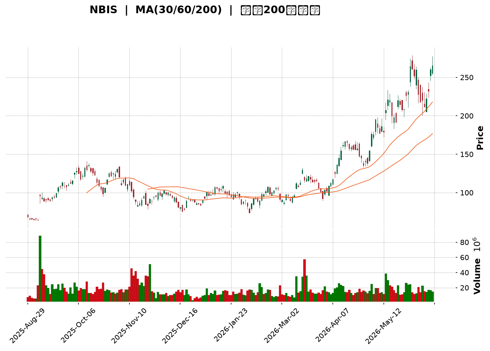
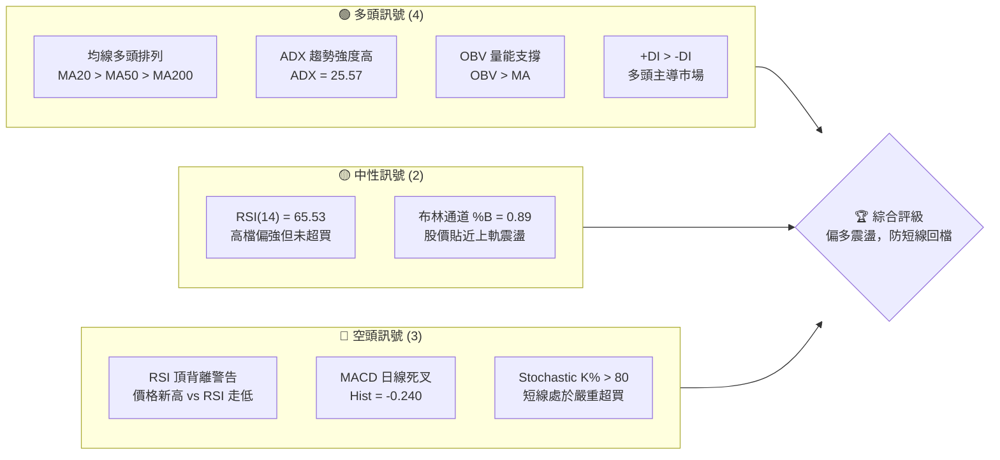
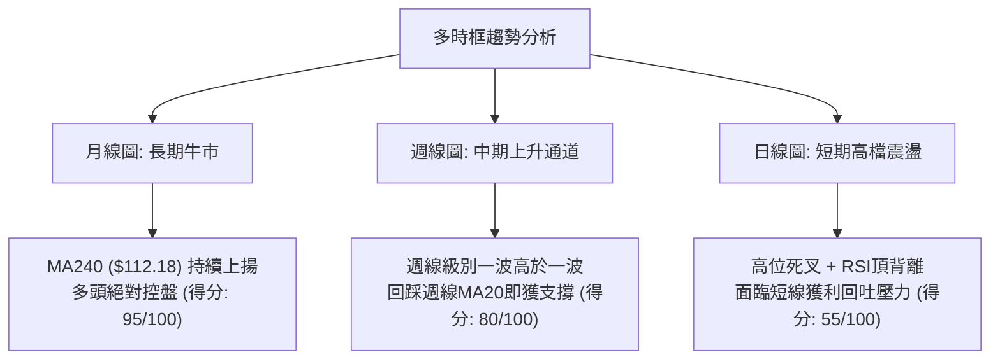
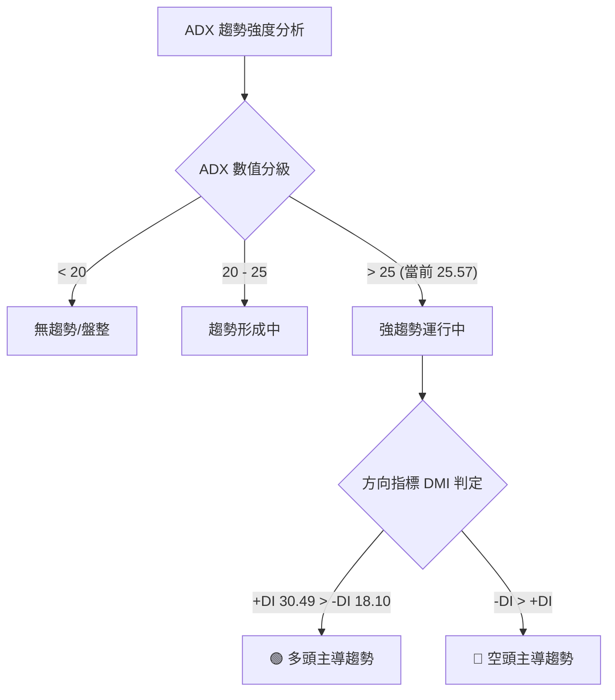
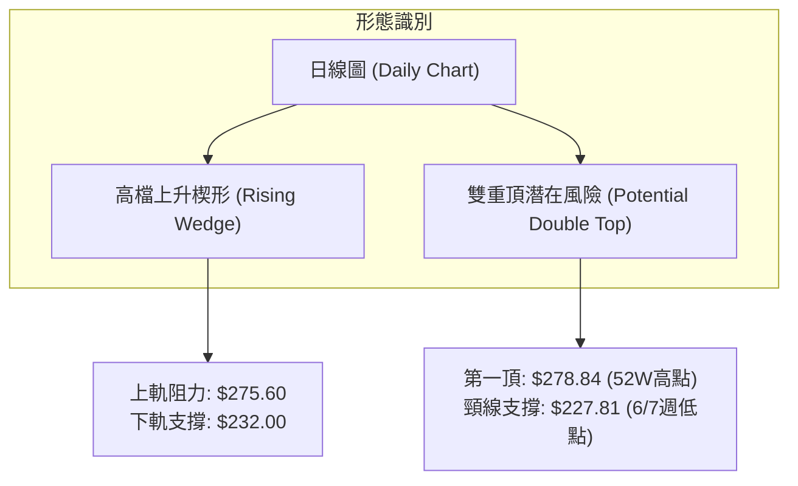
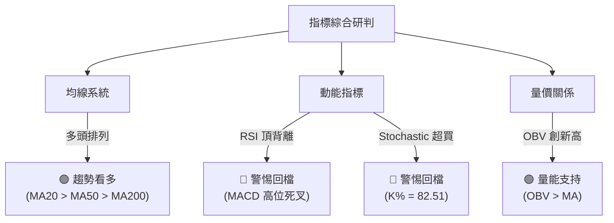
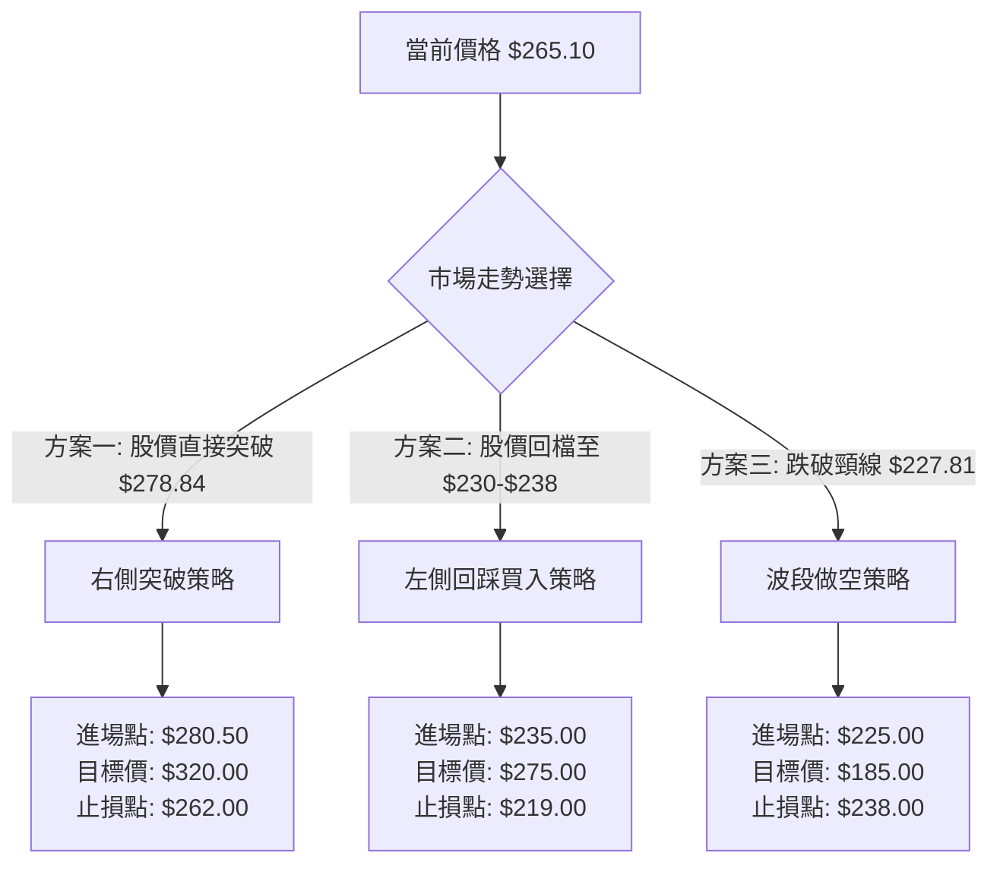
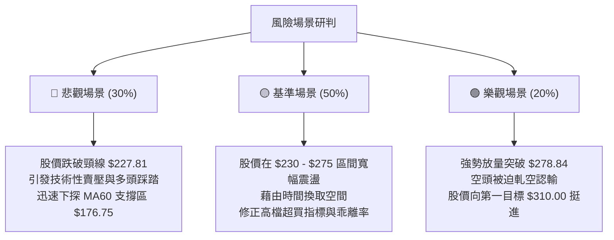

<details>
<summary>📊 靜態圖表 (點擊展開)</summary>

</details>

<html>
<head><meta charset="utf-8" /></head>
<body>
    <div style="height:500px; width:100%;">                        <script>window.PlotlyConfig = {MathJaxConfig: 'local'};</script>
        <script charset="utf-8" src="https://cdn.plot.ly/plotly-3.6.0.min.js" integrity="sha256-QaOVwtVY0T02VaHrr6pnoHLCwayMJp4O5n4YyaE3rJk=" crossorigin="anonymous"></script>                <div id="candlestick-chart" class="plotly-graph-div" style="height:100%; width:100%;"></div>            <script>                window.PLOTLYENV=window.PLOTLYENV || {};                                if (document.getElementById("candlestick-chart")) {                    Plotly.newPlot(                        "candlestick-chart",                        [{"close":{"dtype":"f8","bdata":"AAAA4HoUUUAAAACAFG5QQAAAAKCZaVBAAAAAgD06UEAAAACAFF5QQAAAAADXA1BAAAAAgBTuV0AAAADA9VhXQAAAAAApTFZAAAAAgD2aVkAAAACgcL1WQAAAACCFW1ZAAAAAwB6FV0AAAAAgrodXQAAAAADX01hAAAAAYGamWkAAAABAM\u002fNaQAAAAGC4TlxAAAAAACn8WkAAAADAzOxaQAAAAIAUjltAAAAAoEcRXEAAAABACudcQAAAACCud19AAAAAYLj+X0AAAAAAKTxfQAAAAMDMbF1AAAAAAACAXkAAAADgepRgQAAAAGCPMmBAAAAAYLjuYEAAAADAzARgQAAAAMAedV9AAAAAYI\u002fCXkAAAAAAKVxcQAAAAAAAQFtAAAAAgOsRWkAAAAAgrqdYQAAAAIA9ilpAAAAA4KNQXUAAAAAghVtfQAAAAMAedV5AAAAAYGZGX0AAAAAghQtfQAAAAIA9WmBAAAAAgBQeXkAAAABgj6JbQAAAAAAAQF1AAAAAAClcW0AAAACA69FbQAAAAMDMfFtAAAAAgBSOWUAAAABACpdXQAAAAOBRKFZAAAAAYI\u002fiVEAAAABguH5VQAAAAGCPolZAAAAA4HrEV0AAAADA9ShVQAAAAOCj0FRAAAAAoJn5VkAAAADgUThWQAAAAAAprFdAAAAAIK63V0AAAACgmQlZQAAAAMDMHFhAAAAAQOG6WEAAAABAM7NZQAAAAGCPglhAAAAAwB4VWUAAAACAPRpYQAAAAIDCZVdAAAAAgOuRV0AAAAAAKexVQAAAAMD1SFRAAAAAwMw8VEAAAADAzNxSQAAAAIDChVNAAAAAoHBdVkAAAABguE5XQAAAAIDrgVZAAAAA4FHIVkAAAACAwuVVQAAAAGCPglVAAAAAQOFKVUAAAADAHu1UQAAAAMDMfFZAAAAAwB41V0AAAAAgXA9ZQAAAAKBwDVhAAAAAQDNTWEAAAAAghXtYQAAAAMAe1VpAAAAAIIVbWkAAAABguH5ZQAAAAOCj+FlAAAAAYLguW0AAAABgj9JYQAAAACCut1hAAAAAYGY2WEAAAAAAAKBXQAAAAKBw3VZAAAAAIK53WEAAAAAghRtZQAAAAIA9uldAAAAAAClMVUAAAACAPQpWQAAAAMDMfFZAAAAAwPWYVEAAAAAgrndSQAAAAGBmhlVAAAAA4FE4V0AAAABgj\u002fJWQAAAAEAKJ1ZAAAAAYLhuVkAAAADgo4BYQAAAAKBHYVhAAAAAQDNzWUAAAABACudaQAAAAEDhelhAAAAAQAonWUAAAADAHqVZQAAAACCuh1pAAAAA4FE4WkAAAAAAKcxWQAAAAOCjwFZAAAAAQDOzVUAAAACA63FYQAAAAKCZ6VdAAAAAwB5VVkAAAAAAKbxXQAAAACCFG1hAAAAAIK7\u002fW0AAAABgjwJbQAAAAMDMPFxAAAAAQDM7YEAAAADAHhVdQAAAAADXo11AAAAAoEdhXkAAAAAgrmddQAAAAKCZiVxAAAAAgD26XEAAAACAwsVcQAAAAIAUflpAAAAA4Ho0WUAAAADgoxBXQAAAAOCj8FlAAAAAwMx8WUAAAADgejRbQAAAAGCPIlxAAAAAoJlZXUAAAAAAAEBfQAAAAGCPCmFAAAAAQAofYkAAAACA61FjQAAAAIAUPmRAAAAA4KPYZEAAAABA4apkQAAAAOB6pGNAAAAAwB7lY0AAAACgmZFjQAAAAOB6hGNAAAAAYI+iY0AAAADAHmViQAAAAGC4HmJAAAAA4FHwYEAAAACAFKZhQAAAACBcR2FAAAAAIK5PY0AAAACgcA1mQAAAAKBw\u002fWVAAAAAQOFiaEAAAADgoxhnQAAAAKCZIWZAAAAAQDNDZ0AAAAAghWNmQAAAAOCj6GlAAAAAwMyka0AAAACAFH5rQAAAACCF+2hAAAAAIFy3aEAAAACAPfpnQAAAAIDCfWtAAAAA4KPYakAAAACA6wFqQAAAAADXC2pAAAAAQOFKbEAAAABA4eJsQAAAAAApiHBAAAAAoEdJcEAAAACAwnVvQAAAAGC4OnBAAAAAgOt5bEAAAAAAAEBrQAAAAADXg2tAAAAAgBR2akAAAAAgrsdrQAAAACCFC21AAAAAwB5BcEAAAACgmZFwQA=="},"high":{"dtype":"f8","bdata":"AAAAACnsUUAAAACAQfhQQAAAAAAAwFBAAAAAAACgUEAAAADA9dhQQAAAAMD1qFBAAAAAIIWrWEAAAADgoyBZQAAAACCud1dAAAAAAAAAV0AAAABA4ZpXQAAAAEAz01ZAAAAAAADAV0AAAAAghWtYQAAAAEAz41hAAAAAwB4lW0AAAABguH5bQAAAAGBmtlxAAAAAwB6FXEAAAAAgXH9bQAAAAKBHIVxAAAAAoJlpXUAAAADgUfhcQAAAACBcr19AAAAAAFSfYEAAAADgUfhgQAAAAMD1CGBAAAAAANdTX0AAAACAPapgQAAAAEAzo2FAAAAAwPVQYUAAAACAFrlgQAAAACCuf2BAAAAAQApfYEAAAAAArCReQAAAAIAUXl1AAAAAIIULW0AAAABAM\u002fNaQAAAACCup1pAAAAAwMxcXUAAAAAAAKBfQAAAAMD1IGBAAAAAwMx8X0AAAACAFA5gQAAAAMDMhGBAAAAAgMLdYEAAAACA6zFdQAAAAKBwjV1AAAAAAABAXkAAAABAM9NbQAAAACCul11AAAAAANejXEAAAACgmWlaQAAAAGC43lZAAAAAAABAVkAAAACgmWlWQAAAAAApbFdAAAAAgBQuWEAAAAAAKaxZQAAAACBcL1ZAAAAAAABAV0AAAACA69FWQAAAAICT6FdAAAAAwB5FWEAAAABgZmZZQAAAAMDMvFlAAAAAANfDWEAAAACAwvVZQAAAAGBmVllAAAAAAAAgWUAAAAAggzhZQAAAAIDCRVhAAAAAwMzcV0AAAACgmelXQAAAACBcD1ZAAAAAANdjVEAAAABAMxNVQAAAAGBmFlRAAAAAYI+iVkAAAACgmflXQAAAAIAUPldAAAAAQOHaVkAAAAAgrudWQAAAAEAKJ1ZAAAAAoHC9VUAAAACAFJ5VQAAAAOCjsFZAAAAAACncV0AAAAAghStZQAAAAGBmlllAAAAAYI+iWUAAAACAFD5aQAAAACCFK1tAAAAAwMz8WkAAAADAzKxaQAAAAOBRCFtAAAAAAACgW0AAAACAFB5aQAAAAKCZmVlAAAAAYLj+WUAAAADgo7hYQAAAAOBROFlAAAAAYI\u002fiWEAAAABgZnZZQAAAAAAA0FhAAAAAYI8CV0AAAAAAAFBWQAAAAMD12FZAAAAAYI\u002fqVUAAAADgejRUQAAAAIA9qlVAAAAAIIVrV0AAAAAAVONXQAAAAAAAsFdAAAAA4KOwVkAAAADgehRZQAAAAGCP0lhAAAAAoJkZWkAAAABguP5aQAAAAOB6FFtAAAAAoG5KWUAAAAAAAPBZQAAAAAAp3FpAAAAA4HoUW0AAAABAM9NYQAAAAKDE2FZAAAAAIK53VkAAAABguJ5YQAAAAAAA0FhAAAAAwMy8V0AAAADAzMxXQAAAAKCZmVhAAAAAwB6FXEAAAABgj8JbQAAAAOB6JF1AAAAAoJmJYEAAAAAAAGBeQAAAAECJsV5AAAAAQDNzXkAAAAAAVu5eQAAAAADXU15AAAAAQDNzXUAAAABAM7NdQAAAAEAzU1xAAAAA4KOQWkAAAAAgXI9ZQAAAAMD1+FlAAAAAIK73WkAAAACgcD1bQAAAAIDCdVxAAAAAoJl5XUAAAAAAAPBfQAAAAKCZEWFAAAAAgD26YkAAAAAAAPBjQAAAAEAzw2RAAAAAgOvZZEAAAABguBZlQAAAAIDrgWRAAAAAAAA4ZEAAAAAAAGhkQAAAAIDC7WRAAAAAgOu5ZEAAAAAAAKhkQAAAAKCZmWJAAAAAYLiuYUAAAABgZvZhQAAAACBcX2JAAAAAAACAY0AAAADAzGxmQAAAAGC4fmZAAAAAIK5\u002faEAAAADgerxoQAAAAAAAiGdAAAAAgJeOaEAAAAAghTNnQAAAAEDhKmtAAAAAIFw3bUAAAACgR5lsQAAAAIA9QmtAAAAAgOtZaUAAAAAAAIhpQAAAAIDrWWxAAAAAoHC9a0AAAADgUaBrQAAAAOB6NGpAAAAA4HocbUAAAABAMzNtQAAAAKDELHFAAAAAoHBtcUAAAAAgXLdwQAAAACCFh3BAAAAAAABYb0AAAADAzAxuQAAAAMD1tG1AAAAAIK7fbEAAAAAgro9sQAAAAEDhcm5AAAAA4FFucEAAAAAghVVxQA=="},"hovertemplate":"\u003cb\u003e%{x|%Y-%m-%d}\u003c\u002fb\u003e\u003cbr\u003e\u958b: $%{open:.2f}\u003cbr\u003e\u9ad8: $%{high:.2f}\u003cbr\u003e\u4f4e: $%{low:.2f}\u003cbr\u003e\u6536: $%{close:.2f}\u003cextra\u003e\u003c\u002fextra\u003e","low":{"dtype":"f8","bdata":"AAAAYGbmUEAAAABACgdQQAAAACAvNVBAAAAAgD0aUEAAAACgR6FPQAAAAGBm5k9AAAAAIK6HVUAAAAAAAMBWQAAAAGCPGlZAAAAAgOuxVUAAAACAwjVWQAAAAKBHAVZAAAAAwB41VkAAAACA6wFXQAAAAAAAUFdAAAAAoEehWEAAAAAAABBaQAAAAGBmNlpAAAAA4FF4WkAAAABAM7NZQAAAAMAeFVtAAAAAgD3qW0AAAADgo3BbQAAAAOB6pF1AAAAAYGbmXkAAAAAghTtfQAAAAIAU7lxAAAAAAABgXUAAAAAgrvddQAAAAOBRAGBAAAAAwMyUYEAAAAAAAHBfQAAAAMDMjF5AAAAAoEeBXkAAAADgUbhbQAAAAOCj4FpAAAAAoJlZWUAAAADgUahXQAAAAKBw3VhAAAAA4KOAW0AAAABACgdeQAAAAIDrMV5AAAAAAABgXUAAAADgo3BdQAAAAEAzk19AAAAAAADwXUAAAAAAAEBbQAAAACCF21tAAAAAgD0aW0AAAADgo1BZQAAAAIAULltAAAAAwB71WEAAAACgcO1WQAAAAAAAIFVAAAAAAACAVEAAAACAwuVUQAAAAKBwbVRAAAAAQDPzVkAAAACgcA1VQAAAAKBwjVNAAAAAoJlJVUAAAADgJC5VQAAAAOCjsFZAAAAAAClcV0AAAADgo0BWQAAAAADXA1hAAAAAAADAVkAAAACAFF5YQAAAAMDMDFhAAAAAQDPTV0AAAABgZgZYQAAAAMDMDFdAAAAAwMysVUAAAADAzIxVQAAAAKAYBFRAAAAA4FE4U0AAAAAAANBSQAAAAOCjQFNAAAAAgD0KVEAAAABgZsZWQAAAAADXE1ZAAAAAoJkpVkAAAAAgXK9VQAAAAGCPElVAAAAAANcjVUAAAACgmblUQAAAAOCjgFVAAAAAwPW4VkAAAAAAKbxWQAAAAADX41dAAAAAIFgBWEAAAABgZkZYQAAAAEAzI1hAAAAAQOH6WUAAAAAgg9hYQAAAAGBmRllAAAAAoHAtWUAAAACAwpVYQAAAAGBmRldAAAAAAAAgWEAAAACA62FXQAAAAEAK11ZAAAAAgOthV0AAAAAAKRxYQAAAAIA9ylZAAAAAIK4HVUAAAACAFA5VQAAAAAAAMFVAAAAAACmcU0AAAACgR2FSQAAAACCuR1NAAAAAANfzVEAAAACAPepWQAAAAMD1yFVAAAAAACnsU0AAAABACjdWQAAAAAAAYFdAAAAAINk2WEAAAAAghRtZQAAAAIDrQVhAAAAAQDPTV0AAAABA329YQAAAAEAzs1lAAAAAAACAWUAAAACgmRlWQAAAAEAzs1VAAAAAgOvhVEAAAACgmYlWQAAAACCu51ZAAAAAQDMzVkAAAAAAAKBVQAAAAAAAwFdAAAAAIFwfWkAAAACgR6FaQAAAAMD1iFtAAAAAYBIbX0AAAABACkdcQAAAAAAAgFxAAAAAoEexXEAAAACAkyhcQAAAAEAzY1xAAAAA4KMAXEAAAADAHlVcQAAAAIA9WlpAAAAAoEcRWUAAAADAymlWQAAAAGC47ldAAAAAYGZWWUAAAAAAKQxYQAAAAMDM3FpAAAAAgOuRW0AAAABgZtZdQAAAAEAzI19AAAAA4FHcYEAAAACgmclhQAAAAOCj0GNAAAAAAACQY0AAAABA4QJkQAAAACBcV2NAAAAAoEdBY0AAAADAzGxjQAAAAEAza2NAAAAAgD1CY0AAAACA6zliQAAAAIDrUWFAAAAAYGaWYEAAAABACsdgQAAAAAAA4GBAAAAAAACAYUAAAABgZvZjQAAAAGC4FmVAAAAAIIXjZUAAAAAAACBmQAAAAAAAEGZAAAAAoJlRZkAAAAAAAIhlQAAAAAAAYGhAAAAAAAD4aUAAAACgmXlqQAAAAGCPwmdAAAAAAADgZkAAAADgetRnQAAAAKCZGWpAAAAAIFxXakAAAADAHrVpQAAAAIDryWhAAAAA4FFga0AAAADAzExqQAAAAAAAwG1AAAAAAAA8cEAAAADgUfBuQAAAAIAUVm1AAAAAgBQWa0AAAABgZjZrQAAAAKCZCWlAAAAAANdrakAAAAAAAKBpQAAAAAAA8GtAAAAAIK6nbkAAAADAzKxvQA=="},"name":"\u50f9\u683c","open":{"dtype":"f8","bdata":"AAAAQOHiUUAAAACgmXlQQAAAAOBRuFBAAAAA4HpcUEAAAAAAAKBQQAAAAEDhKlBAAAAAwMxMWEAAAADA9ehWQAAAAEDhKldAAAAAACnMVkAAAABACidXQAAAAMDMzFZAAAAAQOHqVkAAAADAzMRXQAAAAMD1iFdAAAAAwMx8WUAAAABgjwJbQAAAAOCjSFtAAAAAIIUDW0AAAAAghXtbQAAAAOBRWFtAAAAA4HpcXEAAAACAwu1bQAAAAKBH8V5AAAAAQArPX0AAAADAzIxgQAAAAMDM9F9AAAAAwMxMXkAAAABguD5eQAAAAGBm3mBAAAAAYLjmYEAAAAAAAIBgQAAAAMDMfGBAAAAAQOECYEAAAAAA14NdQAAAAGCPMl1AAAAA4FH4WkAAAABAM6taQAAAAMAeFVlAAAAAgD3KW0AAAACAPTpeQAAAAADXm19AAAAAgOsRX0AAAADAzExeQAAAAMD1qF9AAAAAAADAYEAAAABguBZcQAAAAMD1aFxAAAAAQDPjXUAAAAAAACBaQAAAACCFy1xAAAAA4FGIXEAAAADAzAxaQAAAAMD1uFZAAAAAQAqXVEAAAADgevRUQAAAAIDr8VRAAAAA4FFAV0AAAAAghdtYQAAAAEAzY1VAAAAAYLiOVUAAAABgj1JWQAAAAGBmdldAAAAAQDMjWEAAAADAzNxWQAAAAEAKF1lAAAAAoEfBV0AAAADgesRYQAAAAIDCFVlAAAAAYI9SWEAAAACAwoVYQAAAAGC47ldAAAAAwMxMVkAAAAAA11NXQAAAAGBmBlZAAAAAwMzkU0AAAACAwgVVQAAAAEAzw1NAAAAAoJkpVEAAAACAFD5XQAAAAADXk1ZAAAAAYLiOVkAAAADgo+BWQAAAAMDMHFVAAAAAAACYVUAAAAAgrldVQAAAAEAKv1VAAAAAAADAV0AAAACAwu1XQAAAAOCjwFhAAAAAYI8yWEAAAACgR7lYQAAAAOB6lFhAAAAAwB7VWkAAAACA63FaQAAAACCFI1pAAAAAIK5\u002fWkAAAADAHnVZQAAAAIDCRVlAAAAA4KOAWUAAAADAzCxYQAAAAKBwbVhAAAAAYGaWV0AAAAAAAABZQAAAAEAKl1hAAAAAoEPjVkAAAAAA13NVQAAAACCFe1ZAAAAAAADAVUAAAADA9chTQAAAAGBmzlNAAAAAwMwcVUAAAABgjzpXQAAAAGCPOldAAAAAYGYGVUAAAABACndWQAAAAAAAAFhAAAAAYLjuWEAAAAAghRtZQAAAAADTpVpAAAAAIIUTWEAAAAAgXNdYQAAAACBcP1pAAAAAAACAWkAAAADAzKxYQAAAAAAAAFZAAAAAoJmJVUAAAACgmZlWQAAAAAAAMFhAAAAAQDMTV0AAAABACtdVQAAAAMD1yFdAAAAAgD1KWkAAAACAwkVbQAAAAAApnFtAAAAAAAAwX0AAAACAwhVeQAAAAEAzs1xAAAAA4FHQXEAAAABgZh5eQAAAAKBwLV1AAAAAQDMLXUAAAAAgrjddQAAAAOBRUFxAAAAAwB51WkAAAAAgXI9ZQAAAAGC4flhAAAAA4Hp8WkAAAACAPRpYQAAAAIA9KltAAAAAAACoW0AAAADgUbhfQAAAAAAAQF9AAAAA4FHcYEAAAABgZtZhQAAAAEAzI2RAAAAAYDsHZEAAAAAAAOBkQAAAAMD1eGRAAAAAAACgY0AAAABACidkQAAAACCFW2RAAAAAwMx8Y0AAAACgcHVkQAAAAOB6jGJAAAAAwMxMYUAAAABACoNhQAAAAIDrJWJAAAAAYI+qYUAAAADgUQxkQAAAAMDMdGVAAAAAQApzZkAAAADgUcBnQAAAAGBm9mZAAAAAwMx8ZkAAAACgcI1mQAAAAEAKe2lAAAAAAACsakAAAAAghTNrQAAAAEAKL2tAAAAAAADgZ0AAAABACn9pQAAAACCud2pAAAAA4FFoa0AAAACgmZVrQAAAAMAe+WlAAAAAACnMbEAAAAAghXtsQAAAAEDhgm5AAAAAoJkBcUAAAACgcENwQAAAACCu921AAAAAIIXbbkAAAADAzAxuQAAAAAAAwGxAAAAAoMbvakAAAADgeqxpQAAAAMDMVG1AAAAAYLh+b0AAAABACu9vQA=="},"x":["2025-08-29T00:00:00-04:00","2025-09-02T00:00:00-04:00","2025-09-03T00:00:00-04:00","2025-09-04T00:00:00-04:00","2025-09-05T00:00:00-04:00","2025-09-08T00:00:00-04:00","2025-09-09T00:00:00-04:00","2025-09-10T00:00:00-04:00","2025-09-11T00:00:00-04:00","2025-09-12T00:00:00-04:00","2025-09-15T00:00:00-04:00","2025-09-16T00:00:00-04:00","2025-09-17T00:00:00-04:00","2025-09-18T00:00:00-04:00","2025-09-19T00:00:00-04:00","2025-09-22T00:00:00-04:00","2025-09-23T00:00:00-04:00","2025-09-24T00:00:00-04:00","2025-09-25T00:00:00-04:00","2025-09-26T00:00:00-04:00","2025-09-29T00:00:00-04:00","2025-09-30T00:00:00-04:00","2025-10-01T00:00:00-04:00","2025-10-02T00:00:00-04:00","2025-10-03T00:00:00-04:00","2025-10-06T00:00:00-04:00","2025-10-07T00:00:00-04:00","2025-10-08T00:00:00-04:00","2025-10-09T00:00:00-04:00","2025-10-10T00:00:00-04:00","2025-10-13T00:00:00-04:00","2025-10-14T00:00:00-04:00","2025-10-15T00:00:00-04:00","2025-10-16T00:00:00-04:00","2025-10-17T00:00:00-04:00","2025-10-20T00:00:00-04:00","2025-10-21T00:00:00-04:00","2025-10-22T00:00:00-04:00","2025-10-23T00:00:00-04:00","2025-10-24T00:00:00-04:00","2025-10-27T00:00:00-04:00","2025-10-28T00:00:00-04:00","2025-10-29T00:00:00-04:00","2025-10-30T00:00:00-04:00","2025-10-31T00:00:00-04:00","2025-11-03T00:00:00-05:00","2025-11-04T00:00:00-05:00","2025-11-05T00:00:00-05:00","2025-11-06T00:00:00-05:00","2025-11-07T00:00:00-05:00","2025-11-10T00:00:00-05:00","2025-11-11T00:00:00-05:00","2025-11-12T00:00:00-05:00","2025-11-13T00:00:00-05:00","2025-11-14T00:00:00-05:00","2025-11-17T00:00:00-05:00","2025-11-18T00:00:00-05:00","2025-11-19T00:00:00-05:00","2025-11-20T00:00:00-05:00","2025-11-21T00:00:00-05:00","2025-11-24T00:00:00-05:00","2025-11-25T00:00:00-05:00","2025-11-26T00:00:00-05:00","2025-11-28T00:00:00-05:00","2025-12-01T00:00:00-05:00","2025-12-02T00:00:00-05:00","2025-12-03T00:00:00-05:00","2025-12-04T00:00:00-05:00","2025-12-05T00:00:00-05:00","2025-12-08T00:00:00-05:00","2025-12-09T00:00:00-05:00","2025-12-10T00:00:00-05:00","2025-12-11T00:00:00-05:00","2025-12-12T00:00:00-05:00","2025-12-15T00:00:00-05:00","2025-12-16T00:00:00-05:00","2025-12-17T00:00:00-05:00","2025-12-18T00:00:00-05:00","2025-12-19T00:00:00-05:00","2025-12-22T00:00:00-05:00","2025-12-23T00:00:00-05:00","2025-12-24T00:00:00-05:00","2025-12-26T00:00:00-05:00","2025-12-29T00:00:00-05:00","2025-12-30T00:00:00-05:00","2025-12-31T00:00:00-05:00","2026-01-02T00:00:00-05:00","2026-01-05T00:00:00-05:00","2026-01-06T00:00:00-05:00","2026-01-07T00:00:00-05:00","2026-01-08T00:00:00-05:00","2026-01-09T00:00:00-05:00","2026-01-12T00:00:00-05:00","2026-01-13T00:00:00-05:00","2026-01-14T00:00:00-05:00","2026-01-15T00:00:00-05:00","2026-01-16T00:00:00-05:00","2026-01-20T00:00:00-05:00","2026-01-21T00:00:00-05:00","2026-01-22T00:00:00-05:00","2026-01-23T00:00:00-05:00","2026-01-26T00:00:00-05:00","2026-01-27T00:00:00-05:00","2026-01-28T00:00:00-05:00","2026-01-29T00:00:00-05:00","2026-01-30T00:00:00-05:00","2026-02-02T00:00:00-05:00","2026-02-03T00:00:00-05:00","2026-02-04T00:00:00-05:00","2026-02-05T00:00:00-05:00","2026-02-06T00:00:00-05:00","2026-02-09T00:00:00-05:00","2026-02-10T00:00:00-05:00","2026-02-11T00:00:00-05:00","2026-02-12T00:00:00-05:00","2026-02-13T00:00:00-05:00","2026-02-17T00:00:00-05:00","2026-02-18T00:00:00-05:00","2026-02-19T00:00:00-05:00","2026-02-20T00:00:00-05:00","2026-02-23T00:00:00-05:00","2026-02-24T00:00:00-05:00","2026-02-25T00:00:00-05:00","2026-02-26T00:00:00-05:00","2026-02-27T00:00:00-05:00","2026-03-02T00:00:00-05:00","2026-03-03T00:00:00-05:00","2026-03-04T00:00:00-05:00","2026-03-05T00:00:00-05:00","2026-03-06T00:00:00-05:00","2026-03-09T00:00:00-04:00","2026-03-10T00:00:00-04:00","2026-03-11T00:00:00-04:00","2026-03-12T00:00:00-04:00","2026-03-13T00:00:00-04:00","2026-03-16T00:00:00-04:00","2026-03-17T00:00:00-04:00","2026-03-18T00:00:00-04:00","2026-03-19T00:00:00-04:00","2026-03-20T00:00:00-04:00","2026-03-23T00:00:00-04:00","2026-03-24T00:00:00-04:00","2026-03-25T00:00:00-04:00","2026-03-26T00:00:00-04:00","2026-03-27T00:00:00-04:00","2026-03-30T00:00:00-04:00","2026-03-31T00:00:00-04:00","2026-04-01T00:00:00-04:00","2026-04-02T00:00:00-04:00","2026-04-06T00:00:00-04:00","2026-04-07T00:00:00-04:00","2026-04-08T00:00:00-04:00","2026-04-09T00:00:00-04:00","2026-04-10T00:00:00-04:00","2026-04-13T00:00:00-04:00","2026-04-14T00:00:00-04:00","2026-04-15T00:00:00-04:00","2026-04-16T00:00:00-04:00","2026-04-17T00:00:00-04:00","2026-04-20T00:00:00-04:00","2026-04-21T00:00:00-04:00","2026-04-22T00:00:00-04:00","2026-04-23T00:00:00-04:00","2026-04-24T00:00:00-04:00","2026-04-27T00:00:00-04:00","2026-04-28T00:00:00-04:00","2026-04-29T00:00:00-04:00","2026-04-30T00:00:00-04:00","2026-05-01T00:00:00-04:00","2026-05-04T00:00:00-04:00","2026-05-05T00:00:00-04:00","2026-05-06T00:00:00-04:00","2026-05-07T00:00:00-04:00","2026-05-08T00:00:00-04:00","2026-05-11T00:00:00-04:00","2026-05-12T00:00:00-04:00","2026-05-13T00:00:00-04:00","2026-05-14T00:00:00-04:00","2026-05-15T00:00:00-04:00","2026-05-18T00:00:00-04:00","2026-05-19T00:00:00-04:00","2026-05-20T00:00:00-04:00","2026-05-21T00:00:00-04:00","2026-05-22T00:00:00-04:00","2026-05-26T00:00:00-04:00","2026-05-27T00:00:00-04:00","2026-05-28T00:00:00-04:00","2026-05-29T00:00:00-04:00","2026-06-01T00:00:00-04:00","2026-06-02T00:00:00-04:00","2026-06-03T00:00:00-04:00","2026-06-04T00:00:00-04:00","2026-06-05T00:00:00-04:00","2026-06-08T00:00:00-04:00","2026-06-09T00:00:00-04:00","2026-06-10T00:00:00-04:00","2026-06-11T00:00:00-04:00","2026-06-12T00:00:00-04:00","2026-06-15T00:00:00-04:00","2026-06-16T00:00:00-04:00"],"type":"candlestick"},{"hovertemplate":"MA30: $%{y:.2f}\u003cextra\u003e\u003c\u002fextra\u003e","line":{"color":"#2196F3","dash":"dash","width":2},"mode":"lines","name":"MA30","x":["2025-08-29T00:00:00-04:00","2025-09-02T00:00:00-04:00","2025-09-03T00:00:00-04:00","2025-09-04T00:00:00-04:00","2025-09-05T00:00:00-04:00","2025-09-08T00:00:00-04:00","2025-09-09T00:00:00-04:00","2025-09-10T00:00:00-04:00","2025-09-11T00:00:00-04:00","2025-09-12T00:00:00-04:00","2025-09-15T00:00:00-04:00","2025-09-16T00:00:00-04:00","2025-09-17T00:00:00-04:00","2025-09-18T00:00:00-04:00","2025-09-19T00:00:00-04:00","2025-09-22T00:00:00-04:00","2025-09-23T00:00:00-04:00","2025-09-24T00:00:00-04:00","2025-09-25T00:00:00-04:00","2025-09-26T00:00:00-04:00","2025-09-29T00:00:00-04:00","2025-09-30T00:00:00-04:00","2025-10-01T00:00:00-04:00","2025-10-02T00:00:00-04:00","2025-10-03T00:00:00-04:00","2025-10-06T00:00:00-04:00","2025-10-07T00:00:00-04:00","2025-10-08T00:00:00-04:00","2025-10-09T00:00:00-04:00","2025-10-10T00:00:00-04:00","2025-10-13T00:00:00-04:00","2025-10-14T00:00:00-04:00","2025-10-15T00:00:00-04:00","2025-10-16T00:00:00-04:00","2025-10-17T00:00:00-04:00","2025-10-20T00:00:00-04:00","2025-10-21T00:00:00-04:00","2025-10-22T00:00:00-04:00","2025-10-23T00:00:00-04:00","2025-10-24T00:00:00-04:00","2025-10-27T00:00:00-04:00","2025-10-28T00:00:00-04:00","2025-10-29T00:00:00-04:00","2025-10-30T00:00:00-04:00","2025-10-31T00:00:00-04:00","2025-11-03T00:00:00-05:00","2025-11-04T00:00:00-05:00","2025-11-05T00:00:00-05:00","2025-11-06T00:00:00-05:00","2025-11-07T00:00:00-05:00","2025-11-10T00:00:00-05:00","2025-11-11T00:00:00-05:00","2025-11-12T00:00:00-05:00","2025-11-13T00:00:00-05:00","2025-11-14T00:00:00-05:00","2025-11-17T00:00:00-05:00","2025-11-18T00:00:00-05:00","2025-11-19T00:00:00-05:00","2025-11-20T00:00:00-05:00","2025-11-21T00:00:00-05:00","2025-11-24T00:00:00-05:00","2025-11-25T00:00:00-05:00","2025-11-26T00:00:00-05:00","2025-11-28T00:00:00-05:00","2025-12-01T00:00:00-05:00","2025-12-02T00:00:00-05:00","2025-12-03T00:00:00-05:00","2025-12-04T00:00:00-05:00","2025-12-05T00:00:00-05:00","2025-12-08T00:00:00-05:00","2025-12-09T00:00:00-05:00","2025-12-10T00:00:00-05:00","2025-12-11T00:00:00-05:00","2025-12-12T00:00:00-05:00","2025-12-15T00:00:00-05:00","2025-12-16T00:00:00-05:00","2025-12-17T00:00:00-05:00","2025-12-18T00:00:00-05:00","2025-12-19T00:00:00-05:00","2025-12-22T00:00:00-05:00","2025-12-23T00:00:00-05:00","2025-12-24T00:00:00-05:00","2025-12-26T00:00:00-05:00","2025-12-29T00:00:00-05:00","2025-12-30T00:00:00-05:00","2025-12-31T00:00:00-05:00","2026-01-02T00:00:00-05:00","2026-01-05T00:00:00-05:00","2026-01-06T00:00:00-05:00","2026-01-07T00:00:00-05:00","2026-01-08T00:00:00-05:00","2026-01-09T00:00:00-05:00","2026-01-12T00:00:00-05:00","2026-01-13T00:00:00-05:00","2026-01-14T00:00:00-05:00","2026-01-15T00:00:00-05:00","2026-01-16T00:00:00-05:00","2026-01-20T00:00:00-05:00","2026-01-21T00:00:00-05:00","2026-01-22T00:00:00-05:00","2026-01-23T00:00:00-05:00","2026-01-26T00:00:00-05:00","2026-01-27T00:00:00-05:00","2026-01-28T00:00:00-05:00","2026-01-29T00:00:00-05:00","2026-01-30T00:00:00-05:00","2026-02-02T00:00:00-05:00","2026-02-03T00:00:00-05:00","2026-02-04T00:00:00-05:00","2026-02-05T00:00:00-05:00","2026-02-06T00:00:00-05:00","2026-02-09T00:00:00-05:00","2026-02-10T00:00:00-05:00","2026-02-11T00:00:00-05:00","2026-02-12T00:00:00-05:00","2026-02-13T00:00:00-05:00","2026-02-17T00:00:00-05:00","2026-02-18T00:00:00-05:00","2026-02-19T00:00:00-05:00","2026-02-20T00:00:00-05:00","2026-02-23T00:00:00-05:00","2026-02-24T00:00:00-05:00","2026-02-25T00:00:00-05:00","2026-02-26T00:00:00-05:00","2026-02-27T00:00:00-05:00","2026-03-02T00:00:00-05:00","2026-03-03T00:00:00-05:00","2026-03-04T00:00:00-05:00","2026-03-05T00:00:00-05:00","2026-03-06T00:00:00-05:00","2026-03-09T00:00:00-04:00","2026-03-10T00:00:00-04:00","2026-03-11T00:00:00-04:00","2026-03-12T00:00:00-04:00","2026-03-13T00:00:00-04:00","2026-03-16T00:00:00-04:00","2026-03-17T00:00:00-04:00","2026-03-18T00:00:00-04:00","2026-03-19T00:00:00-04:00","2026-03-20T00:00:00-04:00","2026-03-23T00:00:00-04:00","2026-03-24T00:00:00-04:00","2026-03-25T00:00:00-04:00","2026-03-26T00:00:00-04:00","2026-03-27T00:00:00-04:00","2026-03-30T00:00:00-04:00","2026-03-31T00:00:00-04:00","2026-04-01T00:00:00-04:00","2026-04-02T00:00:00-04:00","2026-04-06T00:00:00-04:00","2026-04-07T00:00:00-04:00","2026-04-08T00:00:00-04:00","2026-04-09T00:00:00-04:00","2026-04-10T00:00:00-04:00","2026-04-13T00:00:00-04:00","2026-04-14T00:00:00-04:00","2026-04-15T00:00:00-04:00","2026-04-16T00:00:00-04:00","2026-04-17T00:00:00-04:00","2026-04-20T00:00:00-04:00","2026-04-21T00:00:00-04:00","2026-04-22T00:00:00-04:00","2026-04-23T00:00:00-04:00","2026-04-24T00:00:00-04:00","2026-04-27T00:00:00-04:00","2026-04-28T00:00:00-04:00","2026-04-29T00:00:00-04:00","2026-04-30T00:00:00-04:00","2026-05-01T00:00:00-04:00","2026-05-04T00:00:00-04:00","2026-05-05T00:00:00-04:00","2026-05-06T00:00:00-04:00","2026-05-07T00:00:00-04:00","2026-05-08T00:00:00-04:00","2026-05-11T00:00:00-04:00","2026-05-12T00:00:00-04:00","2026-05-13T00:00:00-04:00","2026-05-14T00:00:00-04:00","2026-05-15T00:00:00-04:00","2026-05-18T00:00:00-04:00","2026-05-19T00:00:00-04:00","2026-05-20T00:00:00-04:00","2026-05-21T00:00:00-04:00","2026-05-22T00:00:00-04:00","2026-05-26T00:00:00-04:00","2026-05-27T00:00:00-04:00","2026-05-28T00:00:00-04:00","2026-05-29T00:00:00-04:00","2026-06-01T00:00:00-04:00","2026-06-02T00:00:00-04:00","2026-06-03T00:00:00-04:00","2026-06-04T00:00:00-04:00","2026-06-05T00:00:00-04:00","2026-06-08T00:00:00-04:00","2026-06-09T00:00:00-04:00","2026-06-10T00:00:00-04:00","2026-06-11T00:00:00-04:00","2026-06-12T00:00:00-04:00","2026-06-15T00:00:00-04:00","2026-06-16T00:00:00-04:00"],"y":{"dtype":"f8","bdata":"AAAAAAAA+H8AAAAAAAD4fwAAAAAAAPh\u002fAAAAAAAA+H8AAAAAAAD4fwAAAAAAAPh\u002fAAAAAAAA+H8AAAAAAAD4fwAAAAAAAPh\u002fAAAAAAAA+H8AAAAAAAD4fwAAAAAAAPh\u002fAAAAAAAA+H8AAAAAAAD4fwAAAAAAAPh\u002fAAAAAAAA+H8AAAAAAAD4fwAAAAAAAPh\u002fAAAAAAAA+H8AAAAAAAD4fwAAAAAAAPh\u002fAAAAAAAA+H8AAAAAAAD4fwAAAAAAAPh\u002fAAAAAAAA+H8AAAAAAAD4fwAAAAAAAPh\u002fAAAAAAAA+H8AAAAAAAD4f2ZmZsau8FhAvLu7K+p\u002fWUBVVVVFGQVaQDMzM5N7hVpA3t3dTX4BW0AiIiJS1GdbQN7d3Y2zx1tAREREdPbZW0C8u7u7HuVbQN7d3Z1SCVxAvLu7S5pCXEAzMzODI4xcQLy7uztC0VxAmpmZSW8TXUDe3d0NkFNdQImIiLjIll1Ad3d3l1+0XUDv7u7+N7pdQKuqqupCwl1A3t3dHXbFXUBmZmZGGc1dQBEREdGFzF1A3t3dLRW3XUCJiIjYv4ldQGZmZtZNOl1AvLu7q3\u002fbXEARERFRYohcQGZmZlZxTlxAd3d39\u002f0UXEARERGRl65bQLy7u6vGS1tAmpmZGdnuWkAiIiJyEptaQKuqqtqjWFpAd3d3R4scWkCrqqoqMQBaQBERETFr5VlAq6qq6vvZWUARERHB5uJZQGZmZiaU0VlAzczMHHatWUAzMzNTjW9ZQERERIROM1lAAAAAsI7xWECJiIhItqNYQAAAAGC6OVhA7+7uLmvlV0DNzMxcj5pXQAAAAFCNR1dAERERke0cV0DNzMzca\u002fZWQDMzM+Psy1ZARERERES0VkARERHx0qVWQFVVVXVMoFZAd3d3p8ajVkAzMzMz7J5WQKuqqvqpnVZAREREpOKYVkAiIiJSKrpWQO\u002fu7r7K1VZA3t3d3U\u002fhVkAAAABgnvRWQAAAAICVD1dAq6qqqhwmV0B3d3cXBCpXQImIiJjgOVdAq6qqKs5OV0DNzMw8UUdXQHd3d4cWSVdAvLu7+6lBV0De3d3dlj1XQKuqqpoLOVdAmpmZObRAV0BmZmb24VtXQImIiDhCeVdARERE1E2CV0AAAAAwa51XQERERFS4tldAq6qqKqOnV0BmZmYGVn5XQImIiLjzdVdAREREdK95V0B3d3c3pYJXQHd3d8cgiFdAZmZmJtuRV0BmZmaWX7BXQBEREdGFwFdAIiIioqjTV0AzMzOjYeNXQGZmZoYH51dAmpmZORfuV0Dv7u6+AvhXQM3MzOxt9VdAzczMjEH0V0BVVVXFPN1XQN7d3U3FwVdAmpmZmfySV0AAAADww49XQDMzM2PliFdAd3d3d9p4V0BERETEynlXQM3MzAxlhFdA7+7uLoeiV0AiIiJCw7JXQAAAAIA\u002f2VdAERER0YU4WEBERERknnRYQERERESnsVhAZmZmdiEFWUC8u7vLdmJZQGZmZtZNnllAiYiIKE3NWUAAAAAQAv9ZQAAAAPAKJFpA3t3djbM7WkCamZlJby9aQJqZmSm\u002fPFpAREREFBE9WkBmZmbmpT9aQO\u002fu7l7WXlpAMzMz86eCWkAiIiJCfLJaQCIiIvLu8lpA7+7ubnVIW0BmZmbmpc9bQDMzMyP3ZlxAvLu7a5ERXUAAAAAwsqFdQM3MzOzfJF5Aq6qqati5XkARERGxRz1fQAAAAFCpvF9A3t3d3WsOYEBEREQ8JjhgQCIiIhpLWmBAAAAAqFRgYEAAAAAY2XpgQImIiFDUj2BAMzMzU\u002f+yYEDNzMykt\u002fFgQImIiPiaM2FAREREdCGJYUDe3d29dNNhQCIiIlJGH2JAq6qqcj16YkCamZlJ4dZiQDMzM2tKRWNA7+7u9m\u002fEY0AiIiIi9zpkQImIiFAbmGRAIiIiwsrtZEAzMzMTETVlQCIiInI9jmVAAAAAgLHYZUARERGRwhFmQM3MzAxJQ2ZAERERodOCZkAzMzPD9chmQO\u002fu7u58O2dAmpmZWaunZ0De3d0tJA1oQGZmZsaSe2hAd3d3xwTHaEAiIiLSlBJpQCIiIoLAYmlAq6qqugK0aUCJiIjIdgpqQM3MzIzebmpA3t3d7XzfakC8u7t7FD5rQA=="},"type":"scatter"},{"hovertemplate":"MA60: $%{y:.2f}\u003cextra\u003e\u003c\u002fextra\u003e","line":{"color":"#9C27B0","dash":"dash","width":2},"mode":"lines","name":"MA60","x":["2025-08-29T00:00:00-04:00","2025-09-02T00:00:00-04:00","2025-09-03T00:00:00-04:00","2025-09-04T00:00:00-04:00","2025-09-05T00:00:00-04:00","2025-09-08T00:00:00-04:00","2025-09-09T00:00:00-04:00","2025-09-10T00:00:00-04:00","2025-09-11T00:00:00-04:00","2025-09-12T00:00:00-04:00","2025-09-15T00:00:00-04:00","2025-09-16T00:00:00-04:00","2025-09-17T00:00:00-04:00","2025-09-18T00:00:00-04:00","2025-09-19T00:00:00-04:00","2025-09-22T00:00:00-04:00","2025-09-23T00:00:00-04:00","2025-09-24T00:00:00-04:00","2025-09-25T00:00:00-04:00","2025-09-26T00:00:00-04:00","2025-09-29T00:00:00-04:00","2025-09-30T00:00:00-04:00","2025-10-01T00:00:00-04:00","2025-10-02T00:00:00-04:00","2025-10-03T00:00:00-04:00","2025-10-06T00:00:00-04:00","2025-10-07T00:00:00-04:00","2025-10-08T00:00:00-04:00","2025-10-09T00:00:00-04:00","2025-10-10T00:00:00-04:00","2025-10-13T00:00:00-04:00","2025-10-14T00:00:00-04:00","2025-10-15T00:00:00-04:00","2025-10-16T00:00:00-04:00","2025-10-17T00:00:00-04:00","2025-10-20T00:00:00-04:00","2025-10-21T00:00:00-04:00","2025-10-22T00:00:00-04:00","2025-10-23T00:00:00-04:00","2025-10-24T00:00:00-04:00","2025-10-27T00:00:00-04:00","2025-10-28T00:00:00-04:00","2025-10-29T00:00:00-04:00","2025-10-30T00:00:00-04:00","2025-10-31T00:00:00-04:00","2025-11-03T00:00:00-05:00","2025-11-04T00:00:00-05:00","2025-11-05T00:00:00-05:00","2025-11-06T00:00:00-05:00","2025-11-07T00:00:00-05:00","2025-11-10T00:00:00-05:00","2025-11-11T00:00:00-05:00","2025-11-12T00:00:00-05:00","2025-11-13T00:00:00-05:00","2025-11-14T00:00:00-05:00","2025-11-17T00:00:00-05:00","2025-11-18T00:00:00-05:00","2025-11-19T00:00:00-05:00","2025-11-20T00:00:00-05:00","2025-11-21T00:00:00-05:00","2025-11-24T00:00:00-05:00","2025-11-25T00:00:00-05:00","2025-11-26T00:00:00-05:00","2025-11-28T00:00:00-05:00","2025-12-01T00:00:00-05:00","2025-12-02T00:00:00-05:00","2025-12-03T00:00:00-05:00","2025-12-04T00:00:00-05:00","2025-12-05T00:00:00-05:00","2025-12-08T00:00:00-05:00","2025-12-09T00:00:00-05:00","2025-12-10T00:00:00-05:00","2025-12-11T00:00:00-05:00","2025-12-12T00:00:00-05:00","2025-12-15T00:00:00-05:00","2025-12-16T00:00:00-05:00","2025-12-17T00:00:00-05:00","2025-12-18T00:00:00-05:00","2025-12-19T00:00:00-05:00","2025-12-22T00:00:00-05:00","2025-12-23T00:00:00-05:00","2025-12-24T00:00:00-05:00","2025-12-26T00:00:00-05:00","2025-12-29T00:00:00-05:00","2025-12-30T00:00:00-05:00","2025-12-31T00:00:00-05:00","2026-01-02T00:00:00-05:00","2026-01-05T00:00:00-05:00","2026-01-06T00:00:00-05:00","2026-01-07T00:00:00-05:00","2026-01-08T00:00:00-05:00","2026-01-09T00:00:00-05:00","2026-01-12T00:00:00-05:00","2026-01-13T00:00:00-05:00","2026-01-14T00:00:00-05:00","2026-01-15T00:00:00-05:00","2026-01-16T00:00:00-05:00","2026-01-20T00:00:00-05:00","2026-01-21T00:00:00-05:00","2026-01-22T00:00:00-05:00","2026-01-23T00:00:00-05:00","2026-01-26T00:00:00-05:00","2026-01-27T00:00:00-05:00","2026-01-28T00:00:00-05:00","2026-01-29T00:00:00-05:00","2026-01-30T00:00:00-05:00","2026-02-02T00:00:00-05:00","2026-02-03T00:00:00-05:00","2026-02-04T00:00:00-05:00","2026-02-05T00:00:00-05:00","2026-02-06T00:00:00-05:00","2026-02-09T00:00:00-05:00","2026-02-10T00:00:00-05:00","2026-02-11T00:00:00-05:00","2026-02-12T00:00:00-05:00","2026-02-13T00:00:00-05:00","2026-02-17T00:00:00-05:00","2026-02-18T00:00:00-05:00","2026-02-19T00:00:00-05:00","2026-02-20T00:00:00-05:00","2026-02-23T00:00:00-05:00","2026-02-24T00:00:00-05:00","2026-02-25T00:00:00-05:00","2026-02-26T00:00:00-05:00","2026-02-27T00:00:00-05:00","2026-03-02T00:00:00-05:00","2026-03-03T00:00:00-05:00","2026-03-04T00:00:00-05:00","2026-03-05T00:00:00-05:00","2026-03-06T00:00:00-05:00","2026-03-09T00:00:00-04:00","2026-03-10T00:00:00-04:00","2026-03-11T00:00:00-04:00","2026-03-12T00:00:00-04:00","2026-03-13T00:00:00-04:00","2026-03-16T00:00:00-04:00","2026-03-17T00:00:00-04:00","2026-03-18T00:00:00-04:00","2026-03-19T00:00:00-04:00","2026-03-20T00:00:00-04:00","2026-03-23T00:00:00-04:00","2026-03-24T00:00:00-04:00","2026-03-25T00:00:00-04:00","2026-03-26T00:00:00-04:00","2026-03-27T00:00:00-04:00","2026-03-30T00:00:00-04:00","2026-03-31T00:00:00-04:00","2026-04-01T00:00:00-04:00","2026-04-02T00:00:00-04:00","2026-04-06T00:00:00-04:00","2026-04-07T00:00:00-04:00","2026-04-08T00:00:00-04:00","2026-04-09T00:00:00-04:00","2026-04-10T00:00:00-04:00","2026-04-13T00:00:00-04:00","2026-04-14T00:00:00-04:00","2026-04-15T00:00:00-04:00","2026-04-16T00:00:00-04:00","2026-04-17T00:00:00-04:00","2026-04-20T00:00:00-04:00","2026-04-21T00:00:00-04:00","2026-04-22T00:00:00-04:00","2026-04-23T00:00:00-04:00","2026-04-24T00:00:00-04:00","2026-04-27T00:00:00-04:00","2026-04-28T00:00:00-04:00","2026-04-29T00:00:00-04:00","2026-04-30T00:00:00-04:00","2026-05-01T00:00:00-04:00","2026-05-04T00:00:00-04:00","2026-05-05T00:00:00-04:00","2026-05-06T00:00:00-04:00","2026-05-07T00:00:00-04:00","2026-05-08T00:00:00-04:00","2026-05-11T00:00:00-04:00","2026-05-12T00:00:00-04:00","2026-05-13T00:00:00-04:00","2026-05-14T00:00:00-04:00","2026-05-15T00:00:00-04:00","2026-05-18T00:00:00-04:00","2026-05-19T00:00:00-04:00","2026-05-20T00:00:00-04:00","2026-05-21T00:00:00-04:00","2026-05-22T00:00:00-04:00","2026-05-26T00:00:00-04:00","2026-05-27T00:00:00-04:00","2026-05-28T00:00:00-04:00","2026-05-29T00:00:00-04:00","2026-06-01T00:00:00-04:00","2026-06-02T00:00:00-04:00","2026-06-03T00:00:00-04:00","2026-06-04T00:00:00-04:00","2026-06-05T00:00:00-04:00","2026-06-08T00:00:00-04:00","2026-06-09T00:00:00-04:00","2026-06-10T00:00:00-04:00","2026-06-11T00:00:00-04:00","2026-06-12T00:00:00-04:00","2026-06-15T00:00:00-04:00","2026-06-16T00:00:00-04:00"],"y":{"dtype":"f8","bdata":"AAAAAAAA+H8AAAAAAAD4fwAAAAAAAPh\u002fAAAAAAAA+H8AAAAAAAD4fwAAAAAAAPh\u002fAAAAAAAA+H8AAAAAAAD4fwAAAAAAAPh\u002fAAAAAAAA+H8AAAAAAAD4fwAAAAAAAPh\u002fAAAAAAAA+H8AAAAAAAD4fwAAAAAAAPh\u002fAAAAAAAA+H8AAAAAAAD4fwAAAAAAAPh\u002fAAAAAAAA+H8AAAAAAAD4fwAAAAAAAPh\u002fAAAAAAAA+H8AAAAAAAD4fwAAAAAAAPh\u002fAAAAAAAA+H8AAAAAAAD4fwAAAAAAAPh\u002fAAAAAAAA+H8AAAAAAAD4fwAAAAAAAPh\u002fAAAAAAAA+H8AAAAAAAD4fwAAAAAAAPh\u002fAAAAAAAA+H8AAAAAAAD4fwAAAAAAAPh\u002fAAAAAAAA+H8AAAAAAAD4fwAAAAAAAPh\u002fAAAAAAAA+H8AAAAAAAD4fwAAAAAAAPh\u002fAAAAAAAA+H8AAAAAAAD4fwAAAAAAAPh\u002fAAAAAAAA+H8AAAAAAAD4fwAAAAAAAPh\u002fAAAAAAAA+H8AAAAAAAD4fwAAAAAAAPh\u002fAAAAAAAA+H8AAAAAAAD4fwAAAAAAAPh\u002fAAAAAAAA+H8AAAAAAAD4fwAAAAAAAPh\u002fAAAAAAAA+H8AAAAAAAD4fxEREbk6HlpAq6qqomE3WkC8u7vbFVBaQO\u002fu7rYPb1pAq6qqygSPWkBmZma+ArRaQHd3d1+P1lpAd3d3L\u002fnZWkBmZma+AuRaQCIiImJz7VpARERENAj4WkAzMzNr2P1aQAAAAGBIAltAzczM\u002fH4CW0AzMzMro\u002ftaQERERIxB6FpAMzMzY+XMWkDe3d2tY6paQFVVVR3ohFpAd3d31zFxWkCamZmRwmFaQCIiIlo5TFpAERERuaw1WkDNzMxkyRdaQN7d3SVN7VlAmpmZKaO\u002fWUAiIiJCp5NZQImIiKgNdllA3t3dTfBWWUCamZnxYDRZQFVVVbXIEFlAvLu7exToWEARERFp2MdYQFVVVa0ctFhAERER+VOhWEARERGhGpVYQM3MzOSlj1hAq6qqCmWUWEDv7u7+G5VYQO\u002fu7lZVjVhAREREDJB3WECJiIgYklZYQHd3dw8tNlhAzczMdCEZWEB3d3cfzP9XQEREREx+2VdAmpmZgdyzV0BmZmZG\u002fZtXQCIiItIif1dA3t3dXUhiV0CamZnxYDpXQN7d3U3wIFdARERE3PkWV0BEREQUPBRXQGZmZp42FFdA7+7u5tAaV0DNzMzkpSdXQN7d3eUXL1dAMzMzo0U2V0Crqqr6xU5XQKuqqiJpXldAvLu7i7NnV0B3d3ePUHZXQGZmZraBgldAvLu7Gy+NV0BmZmZuoINXQDMzM\u002fPSfVdAIiIiYuVwV0BmZmaWimtXQFVVVfX9aFdAmpmZOUJdV0ARERHRsFtXQLy7u1O4XldAREREtJ1xV0BEREScUodXQERERNxAqVdAq6qq0mndV0AiIiLKBAlYQERERMwvNFhAiYiIUGJWWEARERFpZnBYQHd3d8cgilhAZmZmTn6jWEC8u7uj08BYQLy7u9sV1lhAIiIiWsfmWEAAAABw5+9YQFVVVX2i\u002flhAMzMz21wIWUDNzMzEgxFZQKuqqvLuIllAZmZmll84WUCJiIiAP1VZQHd3d28udFlA3t3dfVueWUDe3d1VcdZZQImIiDheFFpAq6qqAkdSWkAAAAAQu5haQAAAAKji1lpAERERcVkZW0Crqqo6iVtbQGZmZi6HoFtAVVVVda\u002ffW0BVVVXdhxFcQCIiItrqRlxAiYiIkJd8XEAiIiJKKLVcQKuqqvKn6FxAZmZmDpA1XUCrqqoK86JdQLy7u+PBAl5AiYiICMhvXkDe3d3F9dJeQCIiIspLMV9AmpmZOReYX0BmZmbumO5fQAAAAADVMWBAiYiIQHxxYECrqqoKZa1gQAAAAEDD42BA3t3dXY8XYUAiIiKaJ0dhQJqZmXXag2FAvLu7G3a+YUAiIiLCyvxhQDMzM09iO2JAd3d3K86FYkCamZlt58xiQKuqqnL2JmNAd3d3x0uCY0AzMzMD5NVjQDMzM7fzLGRAq6qqUrhqZEAzMzOHXaVkQCIiIs6F3mRAVVVVsSsKZUBERETwp0JlQKuqqm5Zf2VAiYiIID7JZUBEREQQ5hdmQA=="},"type":"scatter"},{"hovertemplate":"MA200: $%{y:.2f}\u003cextra\u003e\u003c\u002fextra\u003e","line":{"color":"#FF6F00","dash":"solid","width":2},"mode":"lines","name":"MA200","x":["2025-08-29T00:00:00-04:00","2025-09-02T00:00:00-04:00","2025-09-03T00:00:00-04:00","2025-09-04T00:00:00-04:00","2025-09-05T00:00:00-04:00","2025-09-08T00:00:00-04:00","2025-09-09T00:00:00-04:00","2025-09-10T00:00:00-04:00","2025-09-11T00:00:00-04:00","2025-09-12T00:00:00-04:00","2025-09-15T00:00:00-04:00","2025-09-16T00:00:00-04:00","2025-09-17T00:00:00-04:00","2025-09-18T00:00:00-04:00","2025-09-19T00:00:00-04:00","2025-09-22T00:00:00-04:00","2025-09-23T00:00:00-04:00","2025-09-24T00:00:00-04:00","2025-09-25T00:00:00-04:00","2025-09-26T00:00:00-04:00","2025-09-29T00:00:00-04:00","2025-09-30T00:00:00-04:00","2025-10-01T00:00:00-04:00","2025-10-02T00:00:00-04:00","2025-10-03T00:00:00-04:00","2025-10-06T00:00:00-04:00","2025-10-07T00:00:00-04:00","2025-10-08T00:00:00-04:00","2025-10-09T00:00:00-04:00","2025-10-10T00:00:00-04:00","2025-10-13T00:00:00-04:00","2025-10-14T00:00:00-04:00","2025-10-15T00:00:00-04:00","2025-10-16T00:00:00-04:00","2025-10-17T00:00:00-04:00","2025-10-20T00:00:00-04:00","2025-10-21T00:00:00-04:00","2025-10-22T00:00:00-04:00","2025-10-23T00:00:00-04:00","2025-10-24T00:00:00-04:00","2025-10-27T00:00:00-04:00","2025-10-28T00:00:00-04:00","2025-10-29T00:00:00-04:00","2025-10-30T00:00:00-04:00","2025-10-31T00:00:00-04:00","2025-11-03T00:00:00-05:00","2025-11-04T00:00:00-05:00","2025-11-05T00:00:00-05:00","2025-11-06T00:00:00-05:00","2025-11-07T00:00:00-05:00","2025-11-10T00:00:00-05:00","2025-11-11T00:00:00-05:00","2025-11-12T00:00:00-05:00","2025-11-13T00:00:00-05:00","2025-11-14T00:00:00-05:00","2025-11-17T00:00:00-05:00","2025-11-18T00:00:00-05:00","2025-11-19T00:00:00-05:00","2025-11-20T00:00:00-05:00","2025-11-21T00:00:00-05:00","2025-11-24T00:00:00-05:00","2025-11-25T00:00:00-05:00","2025-11-26T00:00:00-05:00","2025-11-28T00:00:00-05:00","2025-12-01T00:00:00-05:00","2025-12-02T00:00:00-05:00","2025-12-03T00:00:00-05:00","2025-12-04T00:00:00-05:00","2025-12-05T00:00:00-05:00","2025-12-08T00:00:00-05:00","2025-12-09T00:00:00-05:00","2025-12-10T00:00:00-05:00","2025-12-11T00:00:00-05:00","2025-12-12T00:00:00-05:00","2025-12-15T00:00:00-05:00","2025-12-16T00:00:00-05:00","2025-12-17T00:00:00-05:00","2025-12-18T00:00:00-05:00","2025-12-19T00:00:00-05:00","2025-12-22T00:00:00-05:00","2025-12-23T00:00:00-05:00","2025-12-24T00:00:00-05:00","2025-12-26T00:00:00-05:00","2025-12-29T00:00:00-05:00","2025-12-30T00:00:00-05:00","2025-12-31T00:00:00-05:00","2026-01-02T00:00:00-05:00","2026-01-05T00:00:00-05:00","2026-01-06T00:00:00-05:00","2026-01-07T00:00:00-05:00","2026-01-08T00:00:00-05:00","2026-01-09T00:00:00-05:00","2026-01-12T00:00:00-05:00","2026-01-13T00:00:00-05:00","2026-01-14T00:00:00-05:00","2026-01-15T00:00:00-05:00","2026-01-16T00:00:00-05:00","2026-01-20T00:00:00-05:00","2026-01-21T00:00:00-05:00","2026-01-22T00:00:00-05:00","2026-01-23T00:00:00-05:00","2026-01-26T00:00:00-05:00","2026-01-27T00:00:00-05:00","2026-01-28T00:00:00-05:00","2026-01-29T00:00:00-05:00","2026-01-30T00:00:00-05:00","2026-02-02T00:00:00-05:00","2026-02-03T00:00:00-05:00","2026-02-04T00:00:00-05:00","2026-02-05T00:00:00-05:00","2026-02-06T00:00:00-05:00","2026-02-09T00:00:00-05:00","2026-02-10T00:00:00-05:00","2026-02-11T00:00:00-05:00","2026-02-12T00:00:00-05:00","2026-02-13T00:00:00-05:00","2026-02-17T00:00:00-05:00","2026-02-18T00:00:00-05:00","2026-02-19T00:00:00-05:00","2026-02-20T00:00:00-05:00","2026-02-23T00:00:00-05:00","2026-02-24T00:00:00-05:00","2026-02-25T00:00:00-05:00","2026-02-26T00:00:00-05:00","2026-02-27T00:00:00-05:00","2026-03-02T00:00:00-05:00","2026-03-03T00:00:00-05:00","2026-03-04T00:00:00-05:00","2026-03-05T00:00:00-05:00","2026-03-06T00:00:00-05:00","2026-03-09T00:00:00-04:00","2026-03-10T00:00:00-04:00","2026-03-11T00:00:00-04:00","2026-03-12T00:00:00-04:00","2026-03-13T00:00:00-04:00","2026-03-16T00:00:00-04:00","2026-03-17T00:00:00-04:00","2026-03-18T00:00:00-04:00","2026-03-19T00:00:00-04:00","2026-03-20T00:00:00-04:00","2026-03-23T00:00:00-04:00","2026-03-24T00:00:00-04:00","2026-03-25T00:00:00-04:00","2026-03-26T00:00:00-04:00","2026-03-27T00:00:00-04:00","2026-03-30T00:00:00-04:00","2026-03-31T00:00:00-04:00","2026-04-01T00:00:00-04:00","2026-04-02T00:00:00-04:00","2026-04-06T00:00:00-04:00","2026-04-07T00:00:00-04:00","2026-04-08T00:00:00-04:00","2026-04-09T00:00:00-04:00","2026-04-10T00:00:00-04:00","2026-04-13T00:00:00-04:00","2026-04-14T00:00:00-04:00","2026-04-15T00:00:00-04:00","2026-04-16T00:00:00-04:00","2026-04-17T00:00:00-04:00","2026-04-20T00:00:00-04:00","2026-04-21T00:00:00-04:00","2026-04-22T00:00:00-04:00","2026-04-23T00:00:00-04:00","2026-04-24T00:00:00-04:00","2026-04-27T00:00:00-04:00","2026-04-28T00:00:00-04:00","2026-04-29T00:00:00-04:00","2026-04-30T00:00:00-04:00","2026-05-01T00:00:00-04:00","2026-05-04T00:00:00-04:00","2026-05-05T00:00:00-04:00","2026-05-06T00:00:00-04:00","2026-05-07T00:00:00-04:00","2026-05-08T00:00:00-04:00","2026-05-11T00:00:00-04:00","2026-05-12T00:00:00-04:00","2026-05-13T00:00:00-04:00","2026-05-14T00:00:00-04:00","2026-05-15T00:00:00-04:00","2026-05-18T00:00:00-04:00","2026-05-19T00:00:00-04:00","2026-05-20T00:00:00-04:00","2026-05-21T00:00:00-04:00","2026-05-22T00:00:00-04:00","2026-05-26T00:00:00-04:00","2026-05-27T00:00:00-04:00","2026-05-28T00:00:00-04:00","2026-05-29T00:00:00-04:00","2026-06-01T00:00:00-04:00","2026-06-02T00:00:00-04:00","2026-06-03T00:00:00-04:00","2026-06-04T00:00:00-04:00","2026-06-05T00:00:00-04:00","2026-06-08T00:00:00-04:00","2026-06-09T00:00:00-04:00","2026-06-10T00:00:00-04:00","2026-06-11T00:00:00-04:00","2026-06-12T00:00:00-04:00","2026-06-15T00:00:00-04:00","2026-06-16T00:00:00-04:00"],"y":{"dtype":"f8","bdata":"AAAAAAAA+H8AAAAAAAD4fwAAAAAAAPh\u002fAAAAAAAA+H8AAAAAAAD4fwAAAAAAAPh\u002fAAAAAAAA+H8AAAAAAAD4fwAAAAAAAPh\u002fAAAAAAAA+H8AAAAAAAD4fwAAAAAAAPh\u002fAAAAAAAA+H8AAAAAAAD4fwAAAAAAAPh\u002fAAAAAAAA+H8AAAAAAAD4fwAAAAAAAPh\u002fAAAAAAAA+H8AAAAAAAD4fwAAAAAAAPh\u002fAAAAAAAA+H8AAAAAAAD4fwAAAAAAAPh\u002fAAAAAAAA+H8AAAAAAAD4fwAAAAAAAPh\u002fAAAAAAAA+H8AAAAAAAD4fwAAAAAAAPh\u002fAAAAAAAA+H8AAAAAAAD4fwAAAAAAAPh\u002fAAAAAAAA+H8AAAAAAAD4fwAAAAAAAPh\u002fAAAAAAAA+H8AAAAAAAD4fwAAAAAAAPh\u002fAAAAAAAA+H8AAAAAAAD4fwAAAAAAAPh\u002fAAAAAAAA+H8AAAAAAAD4fwAAAAAAAPh\u002fAAAAAAAA+H8AAAAAAAD4fwAAAAAAAPh\u002fAAAAAAAA+H8AAAAAAAD4fwAAAAAAAPh\u002fAAAAAAAA+H8AAAAAAAD4fwAAAAAAAPh\u002fAAAAAAAA+H8AAAAAAAD4fwAAAAAAAPh\u002fAAAAAAAA+H8AAAAAAAD4fwAAAAAAAPh\u002fAAAAAAAA+H8AAAAAAAD4fwAAAAAAAPh\u002fAAAAAAAA+H8AAAAAAAD4fwAAAAAAAPh\u002fAAAAAAAA+H8AAAAAAAD4fwAAAAAAAPh\u002fAAAAAAAA+H8AAAAAAAD4fwAAAAAAAPh\u002fAAAAAAAA+H8AAAAAAAD4fwAAAAAAAPh\u002fAAAAAAAA+H8AAAAAAAD4fwAAAAAAAPh\u002fAAAAAAAA+H8AAAAAAAD4fwAAAAAAAPh\u002fAAAAAAAA+H8AAAAAAAD4fwAAAAAAAPh\u002fAAAAAAAA+H8AAAAAAAD4fwAAAAAAAPh\u002fAAAAAAAA+H8AAAAAAAD4fwAAAAAAAPh\u002fAAAAAAAA+H8AAAAAAAD4fwAAAAAAAPh\u002fAAAAAAAA+H8AAAAAAAD4fwAAAAAAAPh\u002fAAAAAAAA+H8AAAAAAAD4fwAAAAAAAPh\u002fAAAAAAAA+H8AAAAAAAD4fwAAAAAAAPh\u002fAAAAAAAA+H8AAAAAAAD4fwAAAAAAAPh\u002fAAAAAAAA+H8AAAAAAAD4fwAAAAAAAPh\u002fAAAAAAAA+H8AAAAAAAD4fwAAAAAAAPh\u002fAAAAAAAA+H8AAAAAAAD4fwAAAAAAAPh\u002fAAAAAAAA+H8AAAAAAAD4fwAAAAAAAPh\u002fAAAAAAAA+H8AAAAAAAD4fwAAAAAAAPh\u002fAAAAAAAA+H8AAAAAAAD4fwAAAAAAAPh\u002fAAAAAAAA+H8AAAAAAAD4fwAAAAAAAPh\u002fAAAAAAAA+H8AAAAAAAD4fwAAAAAAAPh\u002fAAAAAAAA+H8AAAAAAAD4fwAAAAAAAPh\u002fAAAAAAAA+H8AAAAAAAD4fwAAAAAAAPh\u002fAAAAAAAA+H8AAAAAAAD4fwAAAAAAAPh\u002fAAAAAAAA+H8AAAAAAAD4fwAAAAAAAPh\u002fAAAAAAAA+H8AAAAAAAD4fwAAAAAAAPh\u002fAAAAAAAA+H8AAAAAAAD4fwAAAAAAAPh\u002fAAAAAAAA+H8AAAAAAAD4fwAAAAAAAPh\u002fAAAAAAAA+H8AAAAAAAD4fwAAAAAAAPh\u002fAAAAAAAA+H8AAAAAAAD4fwAAAAAAAPh\u002fAAAAAAAA+H8AAAAAAAD4fwAAAAAAAPh\u002fAAAAAAAA+H8AAAAAAAD4fwAAAAAAAPh\u002fAAAAAAAA+H8AAAAAAAD4fwAAAAAAAPh\u002fAAAAAAAA+H8AAAAAAAD4fwAAAAAAAPh\u002fAAAAAAAA+H8AAAAAAAD4fwAAAAAAAPh\u002fAAAAAAAA+H8AAAAAAAD4fwAAAAAAAPh\u002fAAAAAAAA+H8AAAAAAAD4fwAAAAAAAPh\u002fAAAAAAAA+H8AAAAAAAD4fwAAAAAAAPh\u002fAAAAAAAA+H8AAAAAAAD4fwAAAAAAAPh\u002fAAAAAAAA+H8AAAAAAAD4fwAAAAAAAPh\u002fAAAAAAAA+H8AAAAAAAD4fwAAAAAAAPh\u002fAAAAAAAA+H8AAAAAAAD4fwAAAAAAAPh\u002fAAAAAAAA+H8AAAAAAAD4fwAAAAAAAPh\u002fAAAAAAAA+H8AAAAAAAD4fwAAAAAAAPh\u002fAAAAAAAA+H+4HoU7RbheQA=="},"type":"scatter"}],                        {"template":{"data":{"barpolar":[{"marker":{"line":{"color":"rgb(17,17,17)","width":0.5},"pattern":{"fillmode":"overlay","size":10,"solidity":0.2}},"type":"barpolar"}],"bar":[{"error_x":{"color":"#f2f5fa"},"error_y":{"color":"#f2f5fa"},"marker":{"line":{"color":"rgb(17,17,17)","width":0.5},"pattern":{"fillmode":"overlay","size":10,"solidity":0.2}},"type":"bar"}],"carpet":[{"aaxis":{"endlinecolor":"#A2B1C6","gridcolor":"#506784","linecolor":"#506784","minorgridcolor":"#506784","startlinecolor":"#A2B1C6"},"baxis":{"endlinecolor":"#A2B1C6","gridcolor":"#506784","linecolor":"#506784","minorgridcolor":"#506784","startlinecolor":"#A2B1C6"},"type":"carpet"}],"choropleth":[{"colorbar":{"outlinewidth":0,"ticks":""},"type":"choropleth"}],"contourcarpet":[{"colorbar":{"outlinewidth":0,"ticks":""},"type":"contourcarpet"}],"contour":[{"colorbar":{"outlinewidth":0,"ticks":""},"colorscale":[[0.0,"#0d0887"],[0.1111111111111111,"#46039f"],[0.2222222222222222,"#7201a8"],[0.3333333333333333,"#9c179e"],[0.4444444444444444,"#bd3786"],[0.5555555555555556,"#d8576b"],[0.6666666666666666,"#ed7953"],[0.7777777777777778,"#fb9f3a"],[0.8888888888888888,"#fdca26"],[1.0,"#f0f921"]],"type":"contour"}],"heatmap":[{"colorbar":{"outlinewidth":0,"ticks":""},"colorscale":[[0.0,"#0d0887"],[0.1111111111111111,"#46039f"],[0.2222222222222222,"#7201a8"],[0.3333333333333333,"#9c179e"],[0.4444444444444444,"#bd3786"],[0.5555555555555556,"#d8576b"],[0.6666666666666666,"#ed7953"],[0.7777777777777778,"#fb9f3a"],[0.8888888888888888,"#fdca26"],[1.0,"#f0f921"]],"type":"heatmap"}],"histogram2dcontour":[{"colorbar":{"outlinewidth":0,"ticks":""},"colorscale":[[0.0,"#0d0887"],[0.1111111111111111,"#46039f"],[0.2222222222222222,"#7201a8"],[0.3333333333333333,"#9c179e"],[0.4444444444444444,"#bd3786"],[0.5555555555555556,"#d8576b"],[0.6666666666666666,"#ed7953"],[0.7777777777777778,"#fb9f3a"],[0.8888888888888888,"#fdca26"],[1.0,"#f0f921"]],"type":"histogram2dcontour"}],"histogram2d":[{"colorbar":{"outlinewidth":0,"ticks":""},"colorscale":[[0.0,"#0d0887"],[0.1111111111111111,"#46039f"],[0.2222222222222222,"#7201a8"],[0.3333333333333333,"#9c179e"],[0.4444444444444444,"#bd3786"],[0.5555555555555556,"#d8576b"],[0.6666666666666666,"#ed7953"],[0.7777777777777778,"#fb9f3a"],[0.8888888888888888,"#fdca26"],[1.0,"#f0f921"]],"type":"histogram2d"}],"histogram":[{"marker":{"pattern":{"fillmode":"overlay","size":10,"solidity":0.2}},"type":"histogram"}],"mesh3d":[{"colorbar":{"outlinewidth":0,"ticks":""},"type":"mesh3d"}],"parcoords":[{"line":{"colorbar":{"outlinewidth":0,"ticks":""}},"type":"parcoords"}],"pie":[{"automargin":true,"type":"pie"}],"scatter3d":[{"line":{"colorbar":{"outlinewidth":0,"ticks":""}},"marker":{"colorbar":{"outlinewidth":0,"ticks":""}},"type":"scatter3d"}],"scattercarpet":[{"marker":{"colorbar":{"outlinewidth":0,"ticks":""}},"type":"scattercarpet"}],"scattergeo":[{"marker":{"colorbar":{"outlinewidth":0,"ticks":""}},"type":"scattergeo"}],"scattergl":[{"marker":{"line":{"color":"#283442"}},"type":"scattergl"}],"scattermapbox":[{"marker":{"colorbar":{"outlinewidth":0,"ticks":""}},"type":"scattermapbox"}],"scattermap":[{"marker":{"colorbar":{"outlinewidth":0,"ticks":""}},"type":"scattermap"}],"scatterpolargl":[{"marker":{"colorbar":{"outlinewidth":0,"ticks":""}},"type":"scatterpolargl"}],"scatterpolar":[{"marker":{"colorbar":{"outlinewidth":0,"ticks":""}},"type":"scatterpolar"}],"scatter":[{"marker":{"line":{"color":"#283442"}},"type":"scatter"}],"scatterternary":[{"marker":{"colorbar":{"outlinewidth":0,"ticks":""}},"type":"scatterternary"}],"surface":[{"colorbar":{"outlinewidth":0,"ticks":""},"colorscale":[[0.0,"#0d0887"],[0.1111111111111111,"#46039f"],[0.2222222222222222,"#7201a8"],[0.3333333333333333,"#9c179e"],[0.4444444444444444,"#bd3786"],[0.5555555555555556,"#d8576b"],[0.6666666666666666,"#ed7953"],[0.7777777777777778,"#fb9f3a"],[0.8888888888888888,"#fdca26"],[1.0,"#f0f921"]],"type":"surface"}],"table":[{"cells":{"fill":{"color":"#506784"},"line":{"color":"rgb(17,17,17)"}},"header":{"fill":{"color":"#2a3f5f"},"line":{"color":"rgb(17,17,17)"}},"type":"table"}]},"layout":{"annotationdefaults":{"arrowcolor":"#f2f5fa","arrowhead":0,"arrowwidth":1},"autotypenumbers":"strict","coloraxis":{"colorbar":{"outlinewidth":0,"ticks":""}},"colorscale":{"diverging":[[0,"#8e0152"],[0.1,"#c51b7d"],[0.2,"#de77ae"],[0.3,"#f1b6da"],[0.4,"#fde0ef"],[0.5,"#f7f7f7"],[0.6,"#e6f5d0"],[0.7,"#b8e186"],[0.8,"#7fbc41"],[0.9,"#4d9221"],[1,"#276419"]],"sequential":[[0.0,"#0d0887"],[0.1111111111111111,"#46039f"],[0.2222222222222222,"#7201a8"],[0.3333333333333333,"#9c179e"],[0.4444444444444444,"#bd3786"],[0.5555555555555556,"#d8576b"],[0.6666666666666666,"#ed7953"],[0.7777777777777778,"#fb9f3a"],[0.8888888888888888,"#fdca26"],[1.0,"#f0f921"]],"sequentialminus":[[0.0,"#0d0887"],[0.1111111111111111,"#46039f"],[0.2222222222222222,"#7201a8"],[0.3333333333333333,"#9c179e"],[0.4444444444444444,"#bd3786"],[0.5555555555555556,"#d8576b"],[0.6666666666666666,"#ed7953"],[0.7777777777777778,"#fb9f3a"],[0.8888888888888888,"#fdca26"],[1.0,"#f0f921"]]},"colorway":["#636efa","#EF553B","#00cc96","#ab63fa","#FFA15A","#19d3f3","#FF6692","#B6E880","#FF97FF","#FECB52"],"font":{"color":"#f2f5fa"},"geo":{"bgcolor":"rgb(17,17,17)","lakecolor":"rgb(17,17,17)","landcolor":"rgb(17,17,17)","showlakes":true,"showland":true,"subunitcolor":"#506784"},"hoverlabel":{"align":"left"},"hovermode":"closest","mapbox":{"style":"dark"},"paper_bgcolor":"rgb(17,17,17)","plot_bgcolor":"rgb(17,17,17)","polar":{"angularaxis":{"gridcolor":"#506784","linecolor":"#506784","ticks":""},"bgcolor":"rgb(17,17,17)","radialaxis":{"gridcolor":"#506784","linecolor":"#506784","ticks":""}},"scene":{"xaxis":{"backgroundcolor":"rgb(17,17,17)","gridcolor":"#506784","gridwidth":2,"linecolor":"#506784","showbackground":true,"ticks":"","zerolinecolor":"#C8D4E3"},"yaxis":{"backgroundcolor":"rgb(17,17,17)","gridcolor":"#506784","gridwidth":2,"linecolor":"#506784","showbackground":true,"ticks":"","zerolinecolor":"#C8D4E3"},"zaxis":{"backgroundcolor":"rgb(17,17,17)","gridcolor":"#506784","gridwidth":2,"linecolor":"#506784","showbackground":true,"ticks":"","zerolinecolor":"#C8D4E3"}},"shapedefaults":{"line":{"color":"#f2f5fa"}},"sliderdefaults":{"bgcolor":"#C8D4E3","bordercolor":"rgb(17,17,17)","borderwidth":1,"tickwidth":0},"ternary":{"aaxis":{"gridcolor":"#506784","linecolor":"#506784","ticks":""},"baxis":{"gridcolor":"#506784","linecolor":"#506784","ticks":""},"bgcolor":"rgb(17,17,17)","caxis":{"gridcolor":"#506784","linecolor":"#506784","ticks":""}},"title":{"x":0.05},"updatemenudefaults":{"bgcolor":"#506784","borderwidth":0},"xaxis":{"automargin":true,"gridcolor":"#283442","linecolor":"#506784","ticks":"","title":{"standoff":15},"zerolinecolor":"#283442","zerolinewidth":2},"yaxis":{"automargin":true,"gridcolor":"#283442","linecolor":"#506784","ticks":"","title":{"standoff":15},"zerolinecolor":"#283442","zerolinewidth":2}}},"xaxis":{"rangeslider":{"visible":false},"title":{"text":"\u65e5\u671f"}},"font":{"size":11},"title":{"text":"NBIS  |  MA(30\u002f60\u002f200)  |  \u6700\u8fd1200\u4ea4\u6613\u65e5"},"yaxis":{"title":{"text":"\u80a1\u50f9 (USD)"}},"hovermode":"x unified","height":500},                        {"responsive": true}                    )                };            </script>        </div>
</body>
</html>

# NBIS 技術分析報告

> **報告日期**：2026-06-17 ｜ **語言**：繁體中文 ｜ **數據來源**：Yahoo Finance ｜ **當前價格**：$265.10

---

## 目錄

| 章節 | 內容 |
|------|------|
| [1. 技術面概覽](#1-技術面概覽) | 訊號儀表板、核心指標、評分卡 |
| [2. 趨勢分析](#2-趨勢分析) | 多時框趨勢、長中短期走勢 |
| [3. 圖表形態分析](#3-圖表形態分析) | 形態識別、K線組合、目標價 |
| [4. 支撐與阻力](#4-支撐與阻力) | 關鍵價位、斐波那契回調 |
| [5. 技術指標深度解讀](#5-技術指標深度解讀) | MA/RSI/MACD/布林/成交量 |
| [6. 動能與波動率](#6-動能與波動率) | 動能評估、ATR、Beta |
| [7. 多時框架總結](#7-多時框架總結) | 時框架評分矩陣 |
| [8. 交易策略建議](#8-交易策略建議) | 多空策略、風險報酬比 |
| [9. 風險提示與監控](#9-風險提示與監控) | 監控指標、風險場景 |

---

## 1. 技術面概覽

### 🎯 技術訊號儀表板



### 📊 核心指標速覽表

| 指標類別 | 指標名稱 | 當前數值 | 訊號 | 解讀 |
|----------|----------|----------|------|------|
| **價格** | 當前價格 | $265.10 | 🟢 多頭 | 位於 52 週高低點區間的 94.2% 極高位，多頭掌控絕對優勢。 |
| **均線** | MA20 | $229.60 | 🟢 多頭 | 股價高於 MA20 約 15.46%，短期均線提供強力支撐。 |
| **均線** | MA50 | $190.69 | 🟢 多頭 | 中期生命線持續上揚，乖離率偏大但趨勢未變。 |
| **均線** | MA200 | $122.88 | 🟢 多頭 | 長期牛熊分界線遠落後於現價，長期牛市格局穩固。 |
| **動能** | RSI(14) | 65.53 | 🟡 中性 | 數值處於強勢區間，但出現顯著的日線與週線級別頂背離。 |
| **動能** | MACD | -0.240 (Hist) | 🔴 空頭 | MACD 15.997 低於信號線 16.237，出現高位死叉，紅柱增長。 |
| **波動** | ATR(14) | $27.30 | 🔴 高波動 | 佔股價 10.30%，每日波動極大，需放寬止損並降低倉位。 |
| **趨勢** | ADX(14) | 25.57 | 🟢 多頭 | ADX > 25 且 +DI (30.49) > -DI (18.10)，多頭趨勢成立。 |

### 🏆 技術評分卡

```
技術評分卡 — NBIS (2026-06-17)
════════════════════════════════════════════════════
趨勢強度      ██████████████░░░░░░  70/100  🟢 強勁
動能指標      ██████████░░░░░░░░░░  50/100  🟡 頂背離分歧
支撐穩定度    ████████████░░░░░░░░  60/100  🟡 乖離率偏高
成交量配合    ██████████████░░░░░░  70/100  🟢 OBV持續創高
形態完整度    ████████████████░░░░  80/100  🟢 上升通道運行
均線排列      ██████══════════════  95/100  🟢 完美多頭排列
════════════════════════════════════════════════════
綜合評分      ██████████████░░░░░░  70/100  偏多整固
════════════════════════════════════════════════════
```

---

## 2. 趨勢分析

### 🌐 多時框趨勢分析



### 📈 長期趨勢 — 12個月走勢圖（Unicode）

```
NBIS 月線走勢圖（過去12個月）
價格軸 ($)
$280 ┤                                                    ● (當前 $265.10)
$240 ┤                                                ●
$200 ┤                                            ●
$160 ┤                                        ●
$120 ┤                            ●       ●
$80  ┤                    ●   ●       ●
$40  ┤        ●   ●   ●
$0   └────┬───┬───┬───┬───┬───┬───┬───┬───┬───┬───┬───┬────
         07  08  09  10  11  12  01  02  03  04  05  06 (月份)
        25' 25' 25' 25' 25' 25' 26' 26' 26' 26' 26' 26'
```

**走勢特徵分析表格**：

| 階段 | 時間區間 | 收盤價變動 | 漲跌幅 | 走勢特徵與量能配合 |
|------|----------|------------|--------|-------------------|
| **第一階段** | 2024-10 ~ 2025-03 | $21.38 → $21.11 | -1.26% | 底部築底階段，股價在 $20-$32 區間反覆震盪，成交量低迷，籌碼充分換手。 |
| **第二階段** | 2025-04 ~ 2025-10 | $22.73 → $130.82 | +475.54%| 主升浪第一波，伴隨 AI 基礎設施需求爆發，量能急劇放大，股價呈現噴射狀上漲。 |
| **第三階段** | 2025-11 ~ 2026-02 | $94.87 → $91.19 | -3.88% | 高位健康回檔與平台整理，股價在 $80-$100 區間獲得強力支撐，清洗浮動籌碼。 |
| **第四階段** | 2026-03 ~ 2026-06 | $103.76 → $265.10 | +155.49%| 主升浪第二波，股價再度沿著 MA20 狂飆，並於 2026-06 創下 $278.84 的歷史新高。 |

### 📊 中期趨勢（週線分析）

在週線結構上，NBIS 沿著一條非常標準的**上升趨勢線**運行。自 2026 年 2 月的低點 $86.10 起，週線呈現明顯的「一底比一底高」格局。

```
週線支撐與阻力示意圖
$280 ├───────────────────────────────────────● (歷史高點 $278.84)
     │                                      /
$240 ├─────────────────────────────────●───/─ (週線近期阻力)
     │                                /   \
$200 ├───────────────────────────●───/───── (中軌支撐 MA20)
     │                          /   \
$160 ├─────────────────────●───/──────────── (波段關鍵頸線)
     │                    /   \
$120 ├───────────────●───/─────────────────── (中期強支撐)
     │              /   \
$80  ├─────────●───/───────────────────────── (波段起漲點 $86.10)
     └─────────┴───┴───┴───┴───┴───┴───┴───┴───
```

### ⚡ 趨勢強度評估（ADX 解讀）



**ADX 強度對照與當前評估**：
*   **當前 ADX(14) = 25.57**：剛越過 25 的強趨勢門檻，這意味著 NBIS 的上漲並非隨機波動，而是具備實質趨勢動能的波段行情。
*   **方向指標 (DMI)**：`+DI` 為 30.49，`-DI` 為 18.10。兩者差值（買盤力道減去賣盤力道）為正，且維持在 12 以上的偏高水位，顯示買方仍牢牢掌握市場主導權。

---

## 3. 圖表形態分析

### 🔍 形態識別系統



### 🕯️ 重要K線形態分析

根據近期的週線與日線 K 線觀察，高位出現了明顯的震盪加劇與籌碼分歧訊號：

| 日期 | 收盤價 | K線形態 | 解讀 | 訊號 |
|------|--------|---------|------|------|
| **2026-05-17** | $219.94 | **大陽線 (Marubozu)** | 強勢突破 $200 關卡，成交量放大至 1.17 億股，確認主升浪延續。 | 🟢 強烈看多 |
| **2026-05-24** | $214.77 | **高檔十字星 (Doji)** | 在連續大漲後出現，多空雙方在 $220 附近產生劇烈分歧，預示短期整理。 | 🟡 轉折訊號 |
| **2026-06-07** | $227.81 | **錘子線 (Hammer)** | 週線下探 $215 附近後獲得強力買盤拉回，留下一條長下影線，顯示下方支撐強勁。 | 🟢 支撐確認 |
| **2026-06-14** | $232.36 | **孕線 (Harami)** | 波動幅度收窄，收在上一週 K 線實體內部，顯示市場在等待突破方向。 | 🟡 盤整 |
| **2026-06-21** | $265.10 | **長陽突破線 (Breakout)**| 帶量直接突破前高阻力區，但上影線觸及 $278.84 後回落，留有高檔獲利了結賣壓。| 🟡 謹慎看多 |

### 📉 ASCII 走勢形態示意圖

```
NBIS 日線高檔上升楔形與雙頂預警
$280 ├─────────────────────────────────────● (歷史高點 $278.84)
     │                                    / \
$260 ├─────────────────────────────────● /   \ ◄ 當前現價 $265.10
     │                                / \     \
$240 ├───────────────────────────●───/───\─────● (楔形下軌支撐 $232.00)
     │                          / \ /     \
$220 ├─────────────────────●───/───●───────\──── (雙頂頸線 $227.81)
     │                    / \ /
$200 ├───────────────●───/───●────────────────── (強支撐 MA50 $190.69)
     └───────────────┴───┴───┴─────────────────
```

### 🎯 形態目標價計算

1.  **上升楔形突破/跌破度量**：
    *   **楔形最大高度**：$278.84 (高點) - $214.77 (低點) = $64.07。
    *   **下軌關鍵支持位**：$232.00。
    *   **若向下破位目標價**：$232.00 - $64.07 = **$167.93**（接近 MA60 $176.75 支撐區）。
    *   **若向上突破目標價**：$278.84 + $64.07 = **$342.91**。

2.  **潛在雙重頂 (Double Top) 度量**：
    *   **雙頂高度**：$278.84 (第一頂) - $227.81 (頸線) = $51.03。
    *   **跌破頸線之量測目標價**：$227.81 - $51.03 = **$176.78**（精確對齊 MA60 $176.75 支撐，此為極強的中期支撐重合區）。

---

## 4. 支撐與阻力

### 🗺️ 關鍵價位分布圖

```
NBIS 價位結構分布圖
═══════════════════════════════════════════════════
$300.00 ║████████████████████████║ 心理整數強阻力 R3
$278.84 ║████████████████████    ║ 52W 歷史高點阻力 R2
$275.60 ║████████████████████████║ 布林通道上軌阻力 R1
$265.10 ╠════════════════════════╣ ◄ 當前現價
$238.29 ║▓▓▓▓▓▓▓▓▓▓▓▓▓▓▓▓        ║ 短期均線支撐 S1 (MA5)
$229.60 ║████████████████████████║ 關鍵生命線支撐 S2 (MA20 / BB中軌)
$183.59 ║████████████████████████║ 波段黃金分割/BB下軌強支撐 S3
═══════════════════════════════════════════════════
```

### 🚧 阻力位分析表

| 阻力級別 | 價位 | 形成原因 | 突破難度 | 重要性 |
|----------|------|----------|----------|--------|
| **R1 (弱阻力)** | **$275.60** | 日線布林通道上軌，短期超買極限位。 | 🟢 易突破 | 屬於技術性動能阻力，若量能配合極易突破。 |
| **R2 (強阻力)** | **$278.84** | 52 週歷史高點，前波套牢盤與高檔獲利了結點。 | 🟡 中等 | 必須有日成交量 > 1800 萬股的實質放量才能有效站穩。 |
| **R3 (極強阻力)**| **$300.00** | 重要心理整數關卡，期權最大未平倉量 (Max Pain) 集中區。| 🔴 極難突破 | 需要基本面重大利多配合，首次觸及必然有劇烈回檔。 |

### 🛡️ 支撐位分析表

| 支撐級別 | 價位 | 形成原因 | 守住機率 | 重要性 |
|----------|------|----------|----------|--------|
| **S1 (弱支撐)** | **$238.29** | MA5 均線與近期日線震盪平台。 | 🟡 中等 | 短期強弱分水嶺，跌破代表短期進入回檔。 |
| **S2 (關鍵支撐)**| **$229.60** | MA20 均線、布林通道中軌、週線近期低點。 | 🟢 極高 | 中期生命線，此位失守代表中期趨勢轉弱。 |
| **S3 (強支撐)** | **$183.59** | 布林通道下軌與 50.0% 斐波那契回調位重合區。 | 🟢🟢 極高 | 波段大底，機構資金逢低強力布局的防禦線。 |

### 📐 斐波那契回調位分析

以本次主升浪起點（2025年12月低點 **$83.71**）至歷史高點（2026年6月高點 **$278.84**）進行黃金分割率計算：

```
$278.84 ├─────────────────────────────────────────────── (0.0% - 歷史高點)
        │
$232.79 ├─────────────────────────────────────────────── (23.6% - 弱回調位) ◄ 逼近 MA20 ($229.60)
        │
$204.30 ├─────────────────────────────────────────────── (38.2% - 強弱分界) ◄ 接近 MA50 ($190.69)
        │
$181.27 ├─────────────────────────────────────────────── (50.0% - 關鍵支撐) ◄ 完美契合 BB下軌 ($183.59)
        │
$158.25 ├─────────────────────────────────────────────── (61.8% - 黃金買點) ◄ 中期分水嶺
```

*   **23.6% 回調位 ($232.79)**：與當前 MA20 ($229.60) 高度重合，是強勢調整的極限位置。
*   **50% 回調位 ($181.27)**：與布林下軌 ($183.59) 重合，構成中長線投資人的「絕對安全防禦區」。

---

## 5. 技術指標深度解讀

### 🎛️ 指標訊號總覽



### 📈 移動平均線排列分析

NBIS 的均線系統呈現極為標準且強勢的**多頭排列 (Golden Ribbon)**：
$$\text{MA5 (\$238.29)} > \text{MA10 (\$236.87)} > \text{MA20 (\$229.60)} > \text{MA50 (\$190.69)} > \text{MA200 (\$122.88)}$$

*   **短期均線 (MA5, MA10)**：斜率極陡，顯示短期買盤推升力道強勁。
*   **乖離率 (Bias) 警訊**：
    *   目前股價相較於 MA50 的乖離率高達 **+39.02%**。
    *   相較於 MA200 的長期乖離率高達 **+115.74%**。
    *   根據歷史經驗，當 NBIS 的 MA200 乖離率超過 100% 時，通常會伴隨 2-3 週的橫盤整理或 15% 以上的價格修正，以修正過度拉升的指標。

### 📉 RSI(14) 分析

*   **當前 RSI 數值**：**65.53**
    ```
    RSI(14) 強度條：
    [░░░░░░░░░░░░░░░░░░░░░░░░░░░░░░██████████████████████████████████░░░░░░░░░░░░░░░] 65.53%
    0%                             30% (超賣)               70% (超買)             100%
    ```
*   **⚠️ 頂背離 (Bearish Divergence) 深度研判**：
    *   **股價走勢**：2026-04-19 收盤價 $157.14 $\rightarrow$ 2026-06-21 收盤價 $265.10（**股價創歷史新高**）。
    *   **RSI(14) 走勢**：2026-04-19 RSI 為 **79.2** $\rightarrow$ 2026-06-21 RSI 為 **65.53**（**RSI 頂部明顯下移**）。
    *   **結論**：這是非常經典且高可信度的**日線與週線雙重頂背離**。這意味著雖然股價在創出新高，但支撐上漲的內部動能（買盤強度）正在逐步衰竭。這通常是波段見頂或即將發生大幅度回檔的前兆。

### 📊 MACD(12/26/9) 訊號解讀

*   **MACD 數值**：15.997
*   **Signal 數值**：16.237
*   **柱狀圖 (Histogram)**：**-0.240**
*   **技術研判**：
    *   雖然 MACD 雙線依然位於零軸上方極高位置（代表長期牛市），但日線級別已經在 2026-06 中旬形成了**高位死叉**。
    *   柱狀圖轉為紅柱並持續擴大（-0.240），顯示空頭動能正在悄然凝聚。在頂背離的背景下，此死叉的殺傷力不容小覷，預示著股價短期內難以一蹴而就突破 $280，更傾向於回試下方的均線支撐。

### 📦 布林通道分析

```
布林通道現價位置示意圖
[ $183.59 ] ────────────────────── [ $229.60 ] ───────────────●────── [ $275.60 ]
  下軌 (BB-Lower)                   中軌 (MA20)               現價        上軌 (BB-Upper)
                                                           ($265.10)
```

*   **當前 %B 數值 = 0.89**：
    *   公式：$$\%B = \frac{\text{現價} - \text{下軌}}{\text{上軌} - \text{下軌}} = \frac{265.10 - 183.59}{275.60 - 183.59} = 0.89$$
    *   這表明股價目前極度貼近布林通道上軌（距離上軌僅有 3.8% 的空間）。在沒有極端利多刺激下，股價很難長期維持在 %B > 0.90 的區域，高機率將向中軌（$229.60）進行均值回歸 (Mean Reversion)。

### 💹 成交量分析（量價配合度）

*   **當前成交量**：14,611,500 股
*   **20日均量**：16,818,440 股（量比：**0.87x**）
*   **量價配合分析**：
    *   股價在 2026-06-21 週創下 $265.10 的收盤新高，但週成交量僅為 31,310,700 股，相較於 2026-05-17 上攻時的 117,212,400 股，出現了**嚴重的量價背離（價漲量縮）**。
    *   **OBV 趨勢**：雖然 OBV > MA，顯示中線資金尚未出現恐慌性撤退，但短期量能的萎縮表明追高買盤意願極低，目前的上漲主要是由於空頭回補與籌碼鎖定度高所致，缺乏實質性增量資金支持。

---

## 6. 動能與波動率

### ⚡ 動能評估四象限

| 象限 | 動能 (RSI / MACD) | 波動 (ATR / BB) | 當前狀態 | 評估與交易指南 |
|------|------------------|----------------|----------|----------------|
| **Q1 (強動能 + 低波動)** | 強勢 (RSI > 60) | 低 (BB收口) | — | 最佳趨勢突破進場點，安全度極高。 |
| **Q2 (弱動能 + 低波動)** | 弱勢 (RSI < 40) | 低 (BB收口) | — | 觀望，屬於無趨勢垃圾時間。 |
| **Q3 (強動能 + 高波動)** | 強勢 (RSI > 60) | 高 (ATR擴大) | **✓ (當前狀態)** | **高風險高收益。股價處於主升浪末端，利潤豐厚但隨時可能面臨 ATR 級別（$27.30）的劇烈洗盤。建議嚴控倉位，分批獲利了結。** |
| **Q4 (弱動能 + 高波動)** | 弱勢 (RSI < 40) | 高 (ATR擴大) | — | 恐慌崩跌階段，嚴禁接刀。 |

### 📊 ATR 波動率分析

*   **當前 ATR(14) = $27.30**（佔股價的 **10.30%**）：
    *   這是一個極高的波動率數值，意味著 NBIS 的日均波動範圍高達 27 美元。
    *   **止損距離設置建議**：
        *   **日內/短線交易**：1.5 倍 ATR = $40.95。
        *   **波段/中線交易**：2.0 倍 ATR = $54.60。
        *   由於波動極大，常規的 3%-5% 止損極易被隨機雜訊掃出場，必須使用 ATR 寬幅止損，並相應地**將建倉頭寸縮減至常規持倉的 50%**。

### 📐 Beta 與市場相關性

*   **估算 Beta (相較於 S&P 500)**：**2.45**
    *   NBIS 展現出極高的科技成長股屬性，大盤上漲 1%，其平均上漲 2.45%；同理，當市場回檔時，其跌幅也將被成倍放大。在美股大盤高位震盪期間，必須提防 NBIS 出現系統性補跌。

---

## 7. 多時框架總結

### 📋 時框架評分表

| 時框架 | 趨勢方向 | 動能 | 均線排列 | 形態 | 綜合評分 | 建議 |
|--------|----------|------|----------|------|----------|------|
| **日線 (Daily)** | 🟡 側向/高位震盪 | 🔴 看空 (MACD死叉) | 🟢 多頭排列 | 🔴 上升楔形末端 | **55/100** | 暫停追高，等待回踩。 |
| **週線 (Weekly)**| 🟢 強勁多頭 | 🟡 中性偏強 (背離) | 🟢 多頭排列 | 🟢 上升通道 | **80/100** | 逢低分批布局。 |
| **月線 (Monthly)**| 🟢 極強牛市 | 🟢 強勁 | 🟢 多頭排列 | 🟢 主升浪 | **95/100** | 長線持股，不輕易看空。 |

### 🔲 綜合訊號矩陣

```
╔══════════════════════════════════════════════════════════════════╗
║                    NBIS 多時框一致性矩陣                        ║
╠══════════════════════════════════════════════════════════════════╣
║  短期 (日線) ： 🔴 賣出 / 觀望 (指標超買、頂背離、量價背離)         ║
║  中期 (週線) ： 🟡 持有 (趨勢未破，但面臨高位震盪調整)             ║
║  長期 (月線) ： 🟢 買入 / 持有 (AI 基礎設施長期牛市格局不變)       ║
╚══════════════════════════════════════════════════════════════════╝
```

---

## 8. 交易策略建議

### 🗺️ 策略決策流程圖



### 🟢 多頭策略詳情

| 策略要素 | 策略 A：左側逢低買入（首選） | 策略 B：右側突破追多（次選） |
|----------|----------------------------|----------------------------|
| **進場條件** | 股價回踩 MA20 ($229.60) 附近獲得支撐，日線收出長下影線或陽包陰。 | 日線收盤價強勢突破 52W 高點 $278.84，且日成交量 > 1800 萬股。 |
| **進場價格** | **$235.00** | **$280.50** |
| **目標價 T1**| **$265.00** (前波震盪平台) | **$310.00** (斐波那契擴展位) |
| **目標價 T2**| **$278.00** (歷史高點阻力) | **$335.00** (心理關卡/上升通道上軌) |
| **止損價格** | **$219.00** (跌破 2026-06-07 週低點 $227.81 且留有餘裕) | **$262.00** (假突破確認，回到前高下方) |
| **風險報酬比**| **1 : 2.69** (風險 $16.00，預期利潤 $43.00) | **1 : 2.95** (風險 $18.50，預期利潤 $54.50) |
| **成功機率** | **65%** | **45% (高檔假突破風險高)** |
| **建議倉位** | **15% (分批建倉)** | **8% (輕倉嘗試)** |

### 🔴 空頭策略詳情

| 策略要素 | 策略 C：高檔假突破做空 | 策略 D：破位順勢做空 |
|----------|----------------------|----------------------|
| **進場條件** | 股價盤中突破 $278.84，但收盤收低於 $275，日 K 線呈現長上影線「射擊之星」。 | 日線收盤跌破雙頂頸線 $227.81，且 MACD 紅柱加速放大。 |
| **進場價格** | **$272.00** | **$225.00** |
| **目標價 T1**| **$235.00** (MA20 支撐) | **$190.00** (MA50 支撐) |
| **目標價 T2**| **$220.00** (波段低點) | **$176.00** (MA60 / 斐波那契回調位) |
| **止損價格** | **$283.00** (突破歷史高點止損) | **$238.00** (站回 MA5 上方止損) |
| **風險報酬比**| **1 : 4.73** (風險 $11.00，預期利潤 $52.00) | **1 : 3.77** (風險 $13.00，預期利潤 $49.00) |
| **成功機率** | **55%** | **60%** |
| **建議倉位** | **10%** | **12%** |

### ⭐ 整體訊號強度評星

```
做多訊號強度：★★★☆☆  (3/5星 - 趨勢看多但指標超買、背離嚴重)
做空訊號強度：★★★☆☆  (3/5星 - 高位死叉，具備短空套利機會)
整體可信度：  ★★★★☆  (4/5星 - 指標共振性高，調整在所難免)
```

---

## 9. 風險提示與監控

### ✅ 關鍵監控指標 Checklist

```
╔══════════════════════════════════════════════════════════════════╗
║                 NBIS 交易員每日監控清單 (Checklist)               ║
╠══════════════════════════════════════════════════════════════════╣
║ [ ] 監控現價是否跌破 MA5 ($238.29)，跌破則短期強勢格局宣告結束。   ║
║ [ ] 追蹤日成交量是否萎縮至 1000 萬股以下，量縮上攻視為誘多陷阱。   ║
║ [ ] 每日觀察 MACD 柱狀圖是否持續低於 0，紅柱若持續放大則不盲目抄底。║
║ [ ] 監控 RSI(14) 是否跌破 60，若跌破則頂背離修正將正式展開。      ║
║ [ ] 留意大盤 (SPY/QQQ) 是否出現系統性回檔，高 Beta 的 NBIS 恐放大跌幅。║
╚══════════════════════════════════════════════════════════════════╝
```

### ⚠️ 風險場景分析



### 🛡️ 風險管理重要提醒

1.  **流動性與極端波動風險**：
    NBIS 的 ATR 佔股價比重高達 10.30%，這在通訊服務與 AI 基礎設施板塊中屬於極高波動標的。在交易此股票時，**嚴禁使用超過 3 倍以上的槓桿**。
2.  **分析師共識偏差風險**：
    目前 14 位分析師給出的平均目標價為 **$244.07**，而當前股價 **$265.10** 已經溢價 **+8.62%**。這意味著從基本面估值角度來看，現價已透支了部分未來預期。一旦公司業績或 AI 產業增速不及預期，高估值將面臨劇烈修正。
3.  **資金管理規律**：
    在日線 MACD 高位死叉與 RSI 頂背離雙重訊號確立下，多頭應採取**「防守型持倉」**。若手中持有低位多單，建議在此處至少**逢高落袋為安 50% 的倉位**，鎖定利潤，剩餘倉位以 MA20 ($229.60) 作為移動止盈點。

---

## 📋 報告總結

```
NBIS 技術分析報告總結
════════════════════════════════════════════════════════
報告日期：2026-06-17
當前價格：$265.10
分析評級：⚖️ 偏多震盪但防短線回檔 (Neutral-Bullish but Overbought)

關鍵結論：
├─ 長期趨勢：🟢 強烈看多 (均線完美多頭排列，MA200 持續上揚)
├─ 中期趨勢：🟢 看多 (週線呈標准上升通道，支撐一底比一底高)
├─ 短期趨勢：🔴 看空 (日線出現 RSI 雙重頂背離與 MACD 高位死叉)
├─ 關鍵支撐：$229.60 (MA20 生命線) ｜ $183.59 (布林下軌/50%回調)
├─ 關鍵阻力：$278.84 (歷史高點) ｜ $300.00 (心理整數關卡)
└─ 分析師目標：均值 $244.07 (現價已溢價 8.62%) ｜ 最高 $380.00

最優策略組合：
1. 🥇 最佳機會：等待股價回踩 $230.00 - $235.00 區間，確認 MA20 支撐
               守住後進場做多，止損設於 $219.00，目標看向 $275.00。
2. 🥈 次選機會：若股價跌破 $227.81 頸線，順勢輕倉做空，目標 $190.00。
3. 🥉 保守選擇：在高位頂背離未完全修正前，維持 50% 以下輕倉觀望。
════════════════════════════════════════════════════════
```

---

> ⚠️ **免責聲明**：本報告為資深技術分析師之獨立研判，所有數據及估算均基於 2026-06-17 之即時與歷史價格資訊。本報告**僅供研究與學術參考**，**不構成任何投資建議**。美股高波動科技股（尤其是 AI 基礎設施板塊）具備極高投資風險，入市需謹慎，請務必做好個人風險管理。

---

*報告生成時間：2026-06-17 ｜ 數據來源：Yahoo Finance ｜ 分析框架：多時框技術分析*