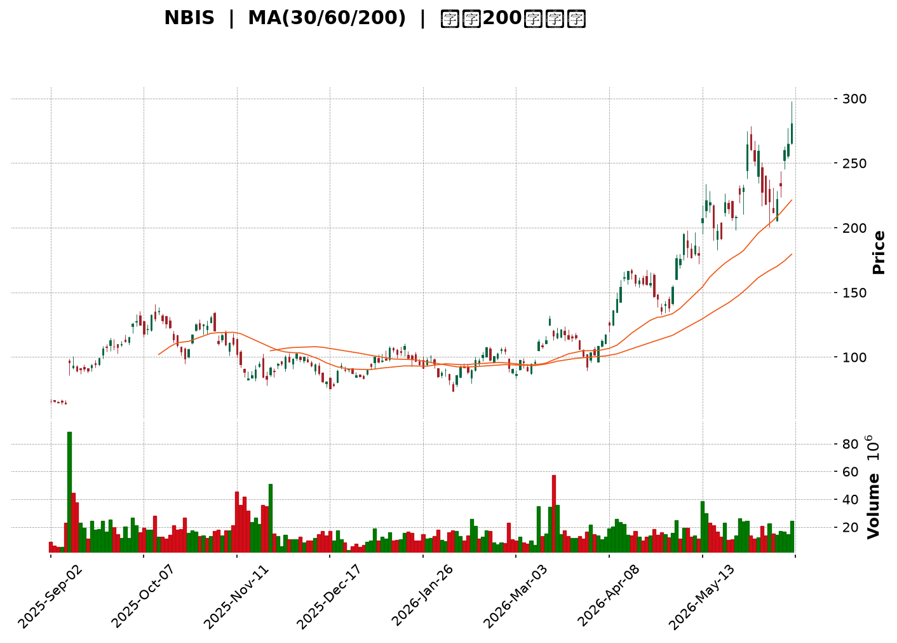
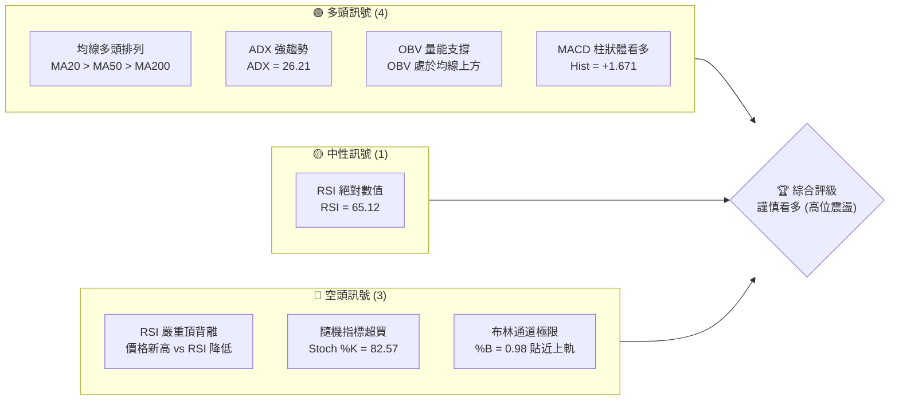
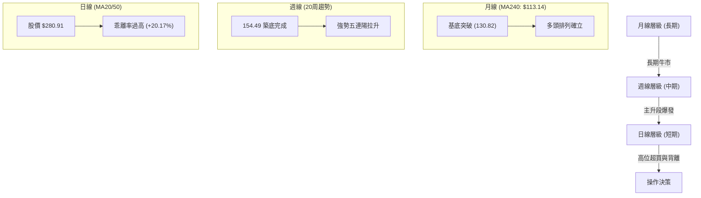
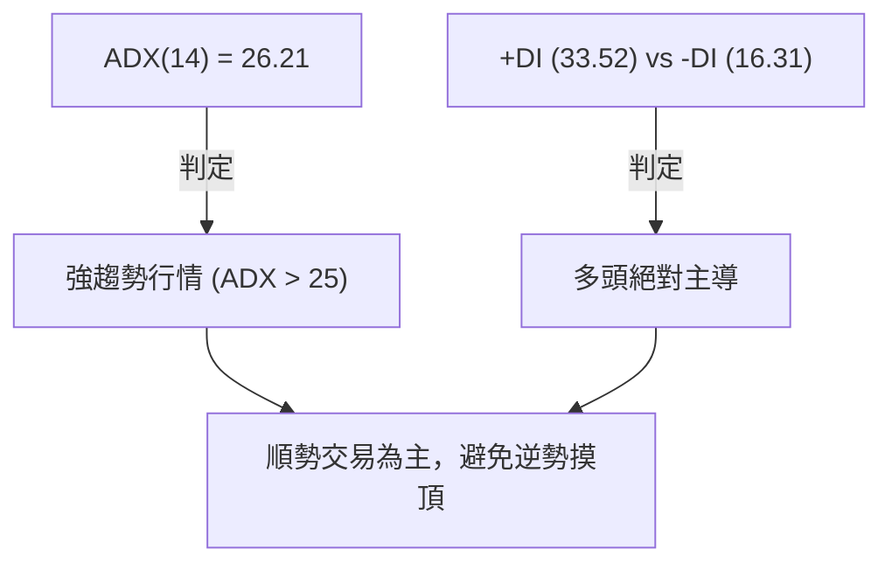
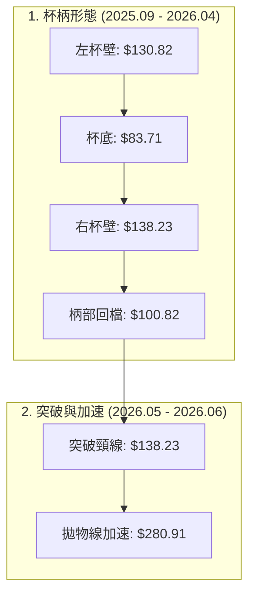
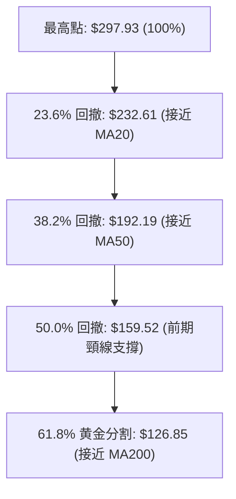
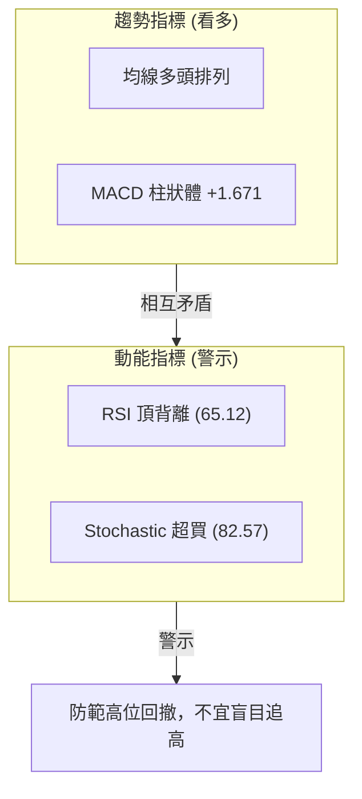
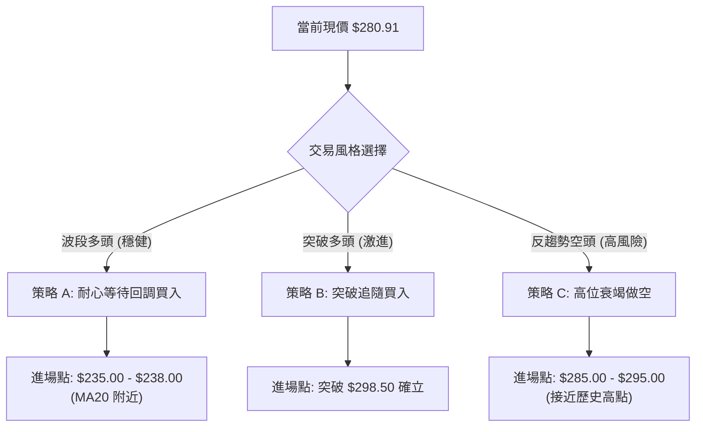
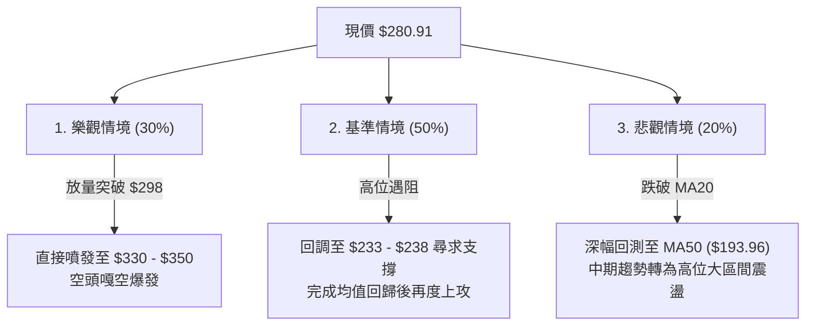

<details>
<summary>📊 靜態圖表 (點擊展開)</summary>

</details>

<html>
<head><meta charset="utf-8" /></head>
<body>
    <div style="height:500px; width:100%;">                        <script>window.PlotlyConfig = {MathJaxConfig: 'local'};</script>
        <script charset="utf-8" src="https://cdn.plot.ly/plotly-3.6.0.min.js" integrity="sha256-QaOVwtVY0T02VaHrr6pnoHLCwayMJp4O5n4YyaE3rJk=" crossorigin="anonymous"></script>                <div id="candlestick-chart" class="plotly-graph-div" style="height:100%; width:100%;"></div>            <script>                window.PLOTLYENV=window.PLOTLYENV || {};                                if (document.getElementById("candlestick-chart")) {                    Plotly.newPlot(                        "candlestick-chart",                        [{"close":{"dtype":"f8","bdata":"AAAAgBRuUEAAAACgmWlQQAAAAIA9OlBAAAAAgBReUEAAAAAA1wNQQAAAAIAU7ldAAAAAwPVYV0AAAAAAKUxWQAAAAIA9mlZAAAAAoHC9VkAAAAAghVtWQAAAAMAehVdAAAAAIK6HV0AAAAAA19NYQAAAAGBmplpAAAAAQDPzWkAAAABguE5cQAAAAAAp\u002fFpAAAAAwMzsWkAAAACAFI5bQAAAAKBHEVxAAAAAQArnXEAAAAAgrndfQAAAAGC4\u002fl9AAAAAACk8X0AAAADAzGxdQAAAAAAAgF5AAAAA4HqUYEAAAABgjzJgQAAAAGC47mBAAAAAwMwEYEAAAADAHnVfQAAAAGCPwl5AAAAAAClcXEAAAAAAAEBbQAAAAIDrEVpAAAAAIK6nWEAAAACAPYpaQAAAAOCjUF1AAAAAIIVbX0AAAADAHnVeQAAAAGBmRl9AAAAAIIULX0AAAACAPVpgQAAAAIAUHl5AAAAAYI+iW0AAAAAAAEBdQAAAAAApXFtAAAAAgOvRW0AAAADAzHxbQAAAAIAUjllAAAAAQAqXV0AAAADgUShWQAAAAGCP4lRAAAAAYLh+VUAAAABgj6JWQAAAAOB6xFdAAAAAwPUoVUAAAADgo9BUQAAAAKCZ+VZAAAAA4FE4VkAAAAAAKaxXQAAAACCut1dAAAAAoJkJWUAAAADAzBxYQAAAAEDhulhAAAAAQDOzWUAAAABgj4JYQAAAAMAeFVlAAAAAgD0aWEAAAACAwmVXQAAAAIDrkVdAAAAAACnsVUAAAADA9UhUQAAAAMDMPFRAAAAAwMzcUkAAAACAwoVTQAAAAKBwXVZAAAAAYLhOV0AAAACA64FWQAAAAOBRyFZAAAAAgMLlVUAAAABgj4JVQAAAAEDhSlVAAAAAwB7tVEAAAADAzHxWQAAAAMAeNVdAAAAAIFwPWUAAAACgcA1YQAAAAEAzU1hAAAAAIIV7WEAAAADAHtVaQAAAACCFW1pAAAAAYLh+WUAAAADgo\u002fhZQAAAAGC4LltAAAAAYI\u002fSWEAAAAAgrrdYQAAAAGBmNlhAAAAAAACgV0AAAACgcN1WQAAAACCud1hAAAAAIIUbWUAAAACAPbpXQAAAAAApTFVAAAAAgD0KVkAAAADAzHxWQAAAAMD1mFRAAAAAIK53UkAAAABgZoZVQAAAAOBROFdAAAAAYI\u002fyVkAAAABACidWQAAAAGC4blZAAAAA4KOAWEAAAACgR2FYQAAAAEAzc1lAAAAAQArnWkAAAABA4XpYQAAAAEAKJ1lAAAAAwB6lWUAAAAAgrodaQAAAAOBROFpAAAAAACnMVkAAAADgo8BWQAAAAEAzs1VAAAAAgOtxWEAAAACgmelXQAAAAMAeVVZAAAAAACm8V0AAAAAghRtYQAAAACCu\u002f1tAAAAAYI8CW0AAAADAzDxcQAAAAEAzO2BAAAAAwB4VXUAAAAAA16NdQAAAAKBHYV5AAAAAIK5nXUAAAACgmYlcQAAAAIA9ulxAAAAAgMLFXEAAAACAFH5aQAAAAOB6NFlAAAAA4KMQV0AAAADgo\u002fBZQAAAAMDMfFlAAAAA4Ho0W0AAAABgjyJcQAAAAKCZWV1AAAAAAABAX0AAAABgjwphQAAAAEAKH2JAAAAAgOtRY0AAAACAFD5kQAAAAOCj2GRAAAAAQOGqZEAAAADgeqRjQAAAAMAe5WNAAAAAoJmRY0AAAADgeoRjQAAAAGCPomNAAAAAwB5lYkAAAABguB5iQAAAAOBR8GBAAAAAgBSmYUAAAAAgXEdhQAAAACCuT2NAAAAAoHANZkAAAACgcP1lQAAAAEDhYmhAAAAA4KMYZ0AAAACgmSFmQAAAAEAzQ2dAAAAAIIVjZkAAAADgo+hpQAAAAMDMpGtAAAAAgBR+a0AAAAAghftoQAAAACBct2hAAAAAgD36Z0AAAACAwn1rQAAAAOCj2GpAAAAAgOsBakAAAAAA1wtqQAAAAEDhSmxAAAAAQOHibEAAAAAAKYhwQAAAAKBHSXBAAAAAgMJ1b0AAAABguDpwQAAAAIDreWxAAAAAAABAa0AAAAAA14NrQAAAAIAUdmpAAAAAIK7Ha0AAAAAghQttQAAAAMAeQXBAAAAAoJmRcEAAAABgj45xQA=="},"high":{"dtype":"f8","bdata":"AAAAgEH4UEAAAAAAAMBQQAAAAAAAoFBAAAAAwPXYUEAAAADA9ahQQAAAACCFq1hAAAAA4KMgWUAAAAAgrndXQAAAAAAAAFdAAAAAQOGaV0AAAABAM9NWQAAAAAAAwFdAAAAAIIVrWEAAAABAM+NYQAAAAMAeJVtAAAAAYLh+W0AAAABgZrZcQAAAAMAehVxAAAAAIFx\u002fW0AAAACgRyFcQAAAAKCZaV1AAAAA4FH4XEAAAAAgXK9fQAAAAABUn2BAAAAA4FH4YEAAAADA9QhgQAAAAADXU19AAAAAgD2qYEAAAABAM6NhQAAAAMD1UGFAAAAAgBa5YEAAAAAgrn9gQAAAAEAKX2BAAAAAAKwkXkAAAACAFF5dQAAAACCFC1tAAAAAQDPzWkAAAAAgrqdaQAAAAMDMXF1AAAAAAACgX0AAAADA9SBgQAAAAMDMfF9AAAAAgBQOYEAAAADAzIRgQAAAAIDC3WBAAAAAgOsxXUAAAACgcI1dQAAAAAAAQF5AAAAAQDPTW0AAAAAgrpddQAAAAADXo1xAAAAAoJlpWkAAAABguN5WQAAAAAAAQFZAAAAAoJlpVkAAAAAAKWxXQAAAAIAULlhAAAAAACmsWUAAAAAgXC9WQAAAAAAAQFdAAAAAgOvRVkAAAACAk+hXQAAAAMAeRVhAAAAAYGZmWUAAAADAzLxZQAAAAADXw1hAAAAAgML1WUAAAABgZlZZQAAAAAAAIFlAAAAAIIM4WUAAAACAwkVYQAAAAMDM3FdAAAAAoJnpV0AAAAAgXA9WQAAAAADXY1RAAAAAQDMTVUAAAABgZhZUQAAAAGCPolZAAAAAoJn5V0AAAACAFD5XQAAAAEDh2lZAAAAAIK7nVkAAAABACidWQAAAAKBwvVVAAAAAgBSeVUAAAADgo7BWQAAAAAAp3FdAAAAAIIUrWUAAAABgZpZZQAAAAGCPollAAAAAgBQ+WkAAAAAghStbQAAAAMDM\u002fFpAAAAAwMysWkAAAADgUQhbQAAAAAAAoFtAAAAAgBQeWkAAAACgmZlZQAAAAGC4\u002fllAAAAA4KO4WEAAAADgUThZQAAAAGCP4lhAAAAAYGZ2WUAAAAAAANBYQAAAAGCPAldAAAAAAABQVkAAAADA9dhWQAAAAGCP6lVAAAAA4Ho0VEAAAACAPapVQAAAACCFa1dAAAAAAFTjV0AAAAAAALBXQAAAAOCjsFZAAAAA4HoUWUAAAABgj9JYQAAAAKCZGVpAAAAAYLj+WkAAAADgehRbQAAAAKBuSllAAAAAAADwWUAAAAAAKdxaQAAAAOB6FFtAAAAAQDPTWEAAAACgxNhWQAAAACCud1ZAAAAAYLieWEAAAAAAANBYQAAAAMDMvFdAAAAAwMzMV0AAAACgmZlYQAAAAMAehVxAAAAAYI\u002fCW0AAAADgeiRdQAAAAKCZiWBAAAAAAABgXkAAAABAibFeQAAAAEAzc15AAAAAAFbuXkAAAAAA11NeQAAAAEAzc11AAAAAQDOzXUAAAABAM1NcQAAAAOCjkFpAAAAAIFyPWUAAAADA9fhZQAAAACCu91pAAAAAoHA9W0AAAACAwnVcQAAAAKCZeV1AAAAAAADwX0AAAACgmRFhQAAAAIA9umJAAAAAAADwY0AAAABAM8NkQAAAAIDr2WRAAAAAYLgWZUAAAACA64FkQAAAAAAAOGRAAAAAAABoZEAAAACAwu1kQAAAAIDruWRAAAAAAACoZEAAAACgmZliQAAAAGC4rmFAAAAAYGb2YUAAAAAgXF9iQAAAAAAAgGNAAAAAwMxsZkAAAABguH5mQAAAACCuf2hAAAAA4Hq8aEAAAAAAAIhnQAAAAICXjmhAAAAAIIUzZ0AAAABA4SprQAAAACBcN21AAAAAoEeZbEAAAACAPUJrQAAAAIDrWWlAAAAAAACIaUAAAACA61lsQAAAAKBwvWtAAAAA4FGga0AAAADgejRqQAAAAOB6HG1AAAAAQDMzbUAAAACgxCxxQAAAAKBwbXFAAAAAIFy3cEAAAAAghYdwQAAAAAAAWG9AAAAAwMwMbkAAAADA9bRtQAAAACCu32xAAAAAIK6PbEAAAABA4XJuQAAAAOBRbnBAAAAAIIVVcUAAAABA4Z5yQA=="},"hovertemplate":"\u003cb\u003e%{x|%Y-%m-%d}\u003c\u002fb\u003e\u003cbr\u003e\u958b: $%{open:.2f}\u003cbr\u003e\u9ad8: $%{high:.2f}\u003cbr\u003e\u4f4e: $%{low:.2f}\u003cbr\u003e\u6536: $%{close:.2f}\u003cextra\u003e\u003c\u002fextra\u003e","low":{"dtype":"f8","bdata":"AAAAQAoHUEAAAAAgLzVQQAAAAIA9GlBAAAAAoEehT0AAAABgZuZPQAAAACCuh1VAAAAAAADAVkAAAABgjxpWQAAAAIDrsVVAAAAAgMI1VkAAAACgRwFWQAAAAMAeNVZAAAAAgOsBV0AAAAAAAFBXQAAAAKBHoVhAAAAAAAAQWkAAAABgZjZaQAAAAOBReFpAAAAAQDOzWUAAAADAHhVbQAAAAIA96ltAAAAA4KNwW0AAAADgeqRdQAAAAGBm5l5AAAAAIIU7X0AAAACAFO5cQAAAAAAAYF1AAAAAIK73XUAAAADgUQBgQAAAAMDMlGBAAAAAAABwX0AAAADAzIxeQAAAAKBHgV5AAAAA4FG4W0AAAADgo+BaQAAAAKCZWVlAAAAA4FGoV0AAAACgcN1YQAAAAOCjgFtAAAAAQAoHXkAAAACA6zFeQAAAAAAAYF1AAAAA4KNwXUAAAABAM5NfQAAAAAAA8F1AAAAAAABAW0AAAAAghdtbQAAAAIA9GltAAAAA4KNQWUAAAACAFC5bQAAAAMAe9VhAAAAAoHDtVkAAAAAAACBVQAAAAAAAgFRAAAAAgMLlVEAAAACgcG1UQAAAAEAz81ZAAAAAoHANVUAAAACgcI1TQAAAAKCZSVVAAAAA4CQuVUAAAADgo7BWQAAAAAApXFdAAAAA4KNAVkAAAAAA1wNYQAAAAAAAwFZAAAAAgBReWEAAAADAzAxYQAAAAEAz01dAAAAAYGYGWEAAAADAzAxXQAAAAMDMrFVAAAAAwMyMVUAAAACgGARUQAAAAOBROFNAAAAAAADQUkAAAADgo0BTQAAAAIA9ClRAAAAAYGbGVkAAAAAA1xNWQAAAAKCZKVZAAAAAIFyvVUAAAABgjxJVQAAAAADXI1VAAAAAoJm5VEAAAADgo4BVQAAAAMD1uFZAAAAAACm8VkAAAAAA1+NXQAAAACBYAVhAAAAAYGZGWEAAAABAMyNYQAAAAEDh+llAAAAAIIPYWEAAAABgZkZZQAAAAKBwLVlAAAAAgMKVWEAAAABgZkZXQAAAAAAAIFhAAAAAgOthV0AAAABACtdWQAAAAIDrYVdAAAAAACkcWEAAAACAPcpWQAAAACCuB1VAAAAAgBQOVUAAAAAAADBVQAAAAAApnFNAAAAAoEdhUkAAAAAgrkdTQAAAAADX81RAAAAAgD3qVkAAAADA9chVQAAAAAAp7FNAAAAAQAo3VkAAAAAAAGBXQAAAACDZNlhAAAAAIIUbWUAAAACA60FYQAAAAEAz01dAAAAAQN9vWEAAAABAM7NZQAAAAAAAgFlAAAAAoJkZVkAAAABAM7NVQAAAAIDr4VRAAAAAoJmJVkAAAAAgrudWQAAAAEAzM1ZAAAAAAACgVUAAAAAAAMBXQAAAACBcH1pAAAAAoEehWkAAAADA9YhbQAAAAGASG19AAAAAQApHXEAAAAAAAIBcQAAAAKBHsVxAAAAAgJMoXEAAAABAM2NcQAAAAOCjAFxAAAAAwB5VXEAAAACAPVpaQAAAAKBHEVlAAAAAwMppVkAAAABguO5XQAAAAGBmVllAAAAAACkMWEAAAADAzNxaQAAAAIDrkVtAAAAAYGbWXUAAAABAMyNfQAAAAOBR3GBAAAAAoJnJYUAAAADgo9BjQAAAAAAAkGNAAAAAQOECZEAAAAAgXFdjQAAAAKBHQWNAAAAAwMxsY0AAAABAM2tjQAAAAIA9QmNAAAAAgOs5YkAAAACA61FhQAAAAGBmlmBAAAAAQArHYEAAAAAAAOBgQAAAAAAAgGFAAAAAYGb2Y0AAAABguBZlQAAAACCF42VAAAAAAAAgZkAAAAAAABBmQAAAAKCZUWZAAAAAAACIZUAAAAAAAGBoQAAAAAAA+GlAAAAAoJl5akAAAABgj8JnQAAAAAAA4GZAAAAA4HrUZ0AAAACgmRlqQAAAACBcV2pAAAAAwB61aUAAAACA68loQAAAAOBRYGtAAAAAwMxMakAAAAAAAMBtQAAAAAAAPHBAAAAA4FHwbkAAAACAFFZtQAAAAIAUFmtAAAAAYGY2a0AAAACgmQlpQAAAAADXa2pAAAAAAACgaUAAAAAAAPBrQAAAACCup25AAAAAwMysb0AAAADgo4RwQA=="},"name":"\u50f9\u683c","open":{"dtype":"f8","bdata":"AAAAoJl5UEAAAADgUbhQQAAAAOB6XFBAAAAAAACgUEAAAABA4SpQQAAAAMDMTFhAAAAAwPXoVkAAAABA4SpXQAAAAAApzFZAAAAAQAonV0AAAADAzMxWQAAAAEDh6lZAAAAAwMzEV0AAAADA9YhXQAAAAMDMfFlAAAAAYI8CW0AAAADgo0hbQAAAACCFA1tAAAAAIIV7W0AAAADgUVhbQAAAAOB6XFxAAAAAgMLtW0AAAACgR\u002fFeQAAAAEAKz19AAAAAwMyMYEAAAADAzPRfQAAAAMDMTF5AAAAAYLg+XkAAAABgZt5gQAAAAGC45mBAAAAAAACAYEAAAADAzHxgQAAAAEDhAmBAAAAAANeDXUAAAABgjzJdQAAAAOBR+FpAAAAAQDOrWkAAAADAHhVZQAAAAIA9yltAAAAAgD06XkAAAAAA15tfQAAAAIDrEV9AAAAAwMxMXkAAAADA9ahfQAAAAAAAwGBAAAAAYLgWXEAAAADA9WhcQAAAAEAz411AAAAAAAAgWkAAAAAghctcQAAAAOBRiFxAAAAAwMwMWkAAAADA9bhWQAAAAEAKl1RAAAAA4Hr0VEAAAACA6\u002fFUQAAAAOBRQFdAAAAAIIXbWEAAAABAM2NVQAAAAGC4jlVAAAAAYI9SVkAAAABgZnZXQAAAAEAzI1hAAAAAwMzcVkAAAABAChdZQAAAAKBHwVdAAAAA4HrEWEAAAACAwhVZQAAAAGCPUlhAAAAAgMKFWEAAAABguO5XQAAAAMDMTFZAAAAAANdTV0AAAABgZgZWQAAAAMDM5FNAAAAAgMIFVUAAAABAM8NTQAAAAKCZKVRAAAAAgBQ+V0AAAAAA15NWQAAAAGC4jlZAAAAA4KPgVkAAAADAzBxVQAAAAAAAmFVAAAAAIK5XVUAAAABACr9VQAAAAAAAwFdAAAAAgMLtV0AAAADgo8BYQAAAAGCPMlhAAAAAoEe5WEAAAADgepRYQAAAAMAe1VpAAAAAgOtxWkAAAAAghSNaQAAAACCuf1pAAAAAwB51WUAAAACAwkVZQAAAAOCjgFlAAAAAwMwsWEAAAACgcG1YQAAAAGBmlldAAAAAAAAAWUAAAABACpdYQAAAAKBD41ZAAAAAANdzVUAAAAAghXtWQAAAAAAAwFVAAAAAwPXIU0AAAABgZs5TQAAAAMDMHFVAAAAAYI86V0AAAABgjzpXQAAAAGBmBlVAAAAAQAp3VkAAAAAAAABYQAAAAGC47lhAAAAAIIUbWUAAAAAA06VaQAAAACCFE1hAAAAAIFzXWEAAAAAgXD9aQAAAAAAAgFpAAAAAwMysWEAAAAAAAABWQAAAAKCZiVVAAAAAoJmZVkAAAAAAADBYQAAAAEAzE1dAAAAAQArXVUAAAADA9chXQAAAAIA9SlpAAAAAgMJFW0AAAAAAKZxbQAAAAAAAMF9AAAAAgMIVXkAAAABAM7NcQAAAAOBR0FxAAAAAYGYeXkAAAACgcC1dQAAAAEAzC11AAAAAIK43XUAAAADgUVBcQAAAAMAedVpAAAAAIFyPWUAAAABguH5YQAAAAOB6fFpAAAAAgD0aWEAAAACAPSpbQAAAAAAAqFtAAAAA4FG4X0AAAAAAAEBfQAAAAOBR3GBAAAAAYGbWYUAAAABAMyNkQAAAAGA7B2RAAAAAAADgZEAAAADA9XhkQAAAAAAAoGNAAAAAQAonZEAAAAAghVtkQAAAAMDMfGNAAAAAoHB1ZEAAAADgeoxiQAAAAMDMTGFAAAAAQAqDYUAAAACA6yViQAAAAGCPqmFAAAAA4FEMZEAAAADAzHRlQAAAAEAKc2ZAAAAA4FHAZ0AAAABgZvZmQAAAAMDMfGZAAAAAoHCNZkAAAABACntpQAAAAAAArGpAAAAAIIUza0AAAABACi9rQAAAAAAA4GdAAAAAQAp\u002faUAAAAAgrndqQAAAAOBRaGtAAAAAoJmVa0AAAADAHvlpQAAAAAApzGxAAAAAIIV7bEAAAABA4YJuQAAAAKCZAXFAAAAAoHBDcEAAAAAgrvdtQAAAACCF225AAAAAwMwMbkAAAAAAAMBsQAAAAKDG72pAAAAA4HqsaUAAAADAzFRtQAAAAGC4fm9AAAAAQArvb0AAAABgZppwQA=="},"x":["2025-09-02T00:00:00-04:00","2025-09-03T00:00:00-04:00","2025-09-04T00:00:00-04:00","2025-09-05T00:00:00-04:00","2025-09-08T00:00:00-04:00","2025-09-09T00:00:00-04:00","2025-09-10T00:00:00-04:00","2025-09-11T00:00:00-04:00","2025-09-12T00:00:00-04:00","2025-09-15T00:00:00-04:00","2025-09-16T00:00:00-04:00","2025-09-17T00:00:00-04:00","2025-09-18T00:00:00-04:00","2025-09-19T00:00:00-04:00","2025-09-22T00:00:00-04:00","2025-09-23T00:00:00-04:00","2025-09-24T00:00:00-04:00","2025-09-25T00:00:00-04:00","2025-09-26T00:00:00-04:00","2025-09-29T00:00:00-04:00","2025-09-30T00:00:00-04:00","2025-10-01T00:00:00-04:00","2025-10-02T00:00:00-04:00","2025-10-03T00:00:00-04:00","2025-10-06T00:00:00-04:00","2025-10-07T00:00:00-04:00","2025-10-08T00:00:00-04:00","2025-10-09T00:00:00-04:00","2025-10-10T00:00:00-04:00","2025-10-13T00:00:00-04:00","2025-10-14T00:00:00-04:00","2025-10-15T00:00:00-04:00","2025-10-16T00:00:00-04:00","2025-10-17T00:00:00-04:00","2025-10-20T00:00:00-04:00","2025-10-21T00:00:00-04:00","2025-10-22T00:00:00-04:00","2025-10-23T00:00:00-04:00","2025-10-24T00:00:00-04:00","2025-10-27T00:00:00-04:00","2025-10-28T00:00:00-04:00","2025-10-29T00:00:00-04:00","2025-10-30T00:00:00-04:00","2025-10-31T00:00:00-04:00","2025-11-03T00:00:00-05:00","2025-11-04T00:00:00-05:00","2025-11-05T00:00:00-05:00","2025-11-06T00:00:00-05:00","2025-11-07T00:00:00-05:00","2025-11-10T00:00:00-05:00","2025-11-11T00:00:00-05:00","2025-11-12T00:00:00-05:00","2025-11-13T00:00:00-05:00","2025-11-14T00:00:00-05:00","2025-11-17T00:00:00-05:00","2025-11-18T00:00:00-05:00","2025-11-19T00:00:00-05:00","2025-11-20T00:00:00-05:00","2025-11-21T00:00:00-05:00","2025-11-24T00:00:00-05:00","2025-11-25T00:00:00-05:00","2025-11-26T00:00:00-05:00","2025-11-28T00:00:00-05:00","2025-12-01T00:00:00-05:00","2025-12-02T00:00:00-05:00","2025-12-03T00:00:00-05:00","2025-12-04T00:00:00-05:00","2025-12-05T00:00:00-05:00","2025-12-08T00:00:00-05:00","2025-12-09T00:00:00-05:00","2025-12-10T00:00:00-05:00","2025-12-11T00:00:00-05:00","2025-12-12T00:00:00-05:00","2025-12-15T00:00:00-05:00","2025-12-16T00:00:00-05:00","2025-12-17T00:00:00-05:00","2025-12-18T00:00:00-05:00","2025-12-19T00:00:00-05:00","2025-12-22T00:00:00-05:00","2025-12-23T00:00:00-05:00","2025-12-24T00:00:00-05:00","2025-12-26T00:00:00-05:00","2025-12-29T00:00:00-05:00","2025-12-30T00:00:00-05:00","2025-12-31T00:00:00-05:00","2026-01-02T00:00:00-05:00","2026-01-05T00:00:00-05:00","2026-01-06T00:00:00-05:00","2026-01-07T00:00:00-05:00","2026-01-08T00:00:00-05:00","2026-01-09T00:00:00-05:00","2026-01-12T00:00:00-05:00","2026-01-13T00:00:00-05:00","2026-01-14T00:00:00-05:00","2026-01-15T00:00:00-05:00","2026-01-16T00:00:00-05:00","2026-01-20T00:00:00-05:00","2026-01-21T00:00:00-05:00","2026-01-22T00:00:00-05:00","2026-01-23T00:00:00-05:00","2026-01-26T00:00:00-05:00","2026-01-27T00:00:00-05:00","2026-01-28T00:00:00-05:00","2026-01-29T00:00:00-05:00","2026-01-30T00:00:00-05:00","2026-02-02T00:00:00-05:00","2026-02-03T00:00:00-05:00","2026-02-04T00:00:00-05:00","2026-02-05T00:00:00-05:00","2026-02-06T00:00:00-05:00","2026-02-09T00:00:00-05:00","2026-02-10T00:00:00-05:00","2026-02-11T00:00:00-05:00","2026-02-12T00:00:00-05:00","2026-02-13T00:00:00-05:00","2026-02-17T00:00:00-05:00","2026-02-18T00:00:00-05:00","2026-02-19T00:00:00-05:00","2026-02-20T00:00:00-05:00","2026-02-23T00:00:00-05:00","2026-02-24T00:00:00-05:00","2026-02-25T00:00:00-05:00","2026-02-26T00:00:00-05:00","2026-02-27T00:00:00-05:00","2026-03-02T00:00:00-05:00","2026-03-03T00:00:00-05:00","2026-03-04T00:00:00-05:00","2026-03-05T00:00:00-05:00","2026-03-06T00:00:00-05:00","2026-03-09T00:00:00-04:00","2026-03-10T00:00:00-04:00","2026-03-11T00:00:00-04:00","2026-03-12T00:00:00-04:00","2026-03-13T00:00:00-04:00","2026-03-16T00:00:00-04:00","2026-03-17T00:00:00-04:00","2026-03-18T00:00:00-04:00","2026-03-19T00:00:00-04:00","2026-03-20T00:00:00-04:00","2026-03-23T00:00:00-04:00","2026-03-24T00:00:00-04:00","2026-03-25T00:00:00-04:00","2026-03-26T00:00:00-04:00","2026-03-27T00:00:00-04:00","2026-03-30T00:00:00-04:00","2026-03-31T00:00:00-04:00","2026-04-01T00:00:00-04:00","2026-04-02T00:00:00-04:00","2026-04-06T00:00:00-04:00","2026-04-07T00:00:00-04:00","2026-04-08T00:00:00-04:00","2026-04-09T00:00:00-04:00","2026-04-10T00:00:00-04:00","2026-04-13T00:00:00-04:00","2026-04-14T00:00:00-04:00","2026-04-15T00:00:00-04:00","2026-04-16T00:00:00-04:00","2026-04-17T00:00:00-04:00","2026-04-20T00:00:00-04:00","2026-04-21T00:00:00-04:00","2026-04-22T00:00:00-04:00","2026-04-23T00:00:00-04:00","2026-04-24T00:00:00-04:00","2026-04-27T00:00:00-04:00","2026-04-28T00:00:00-04:00","2026-04-29T00:00:00-04:00","2026-04-30T00:00:00-04:00","2026-05-01T00:00:00-04:00","2026-05-04T00:00:00-04:00","2026-05-05T00:00:00-04:00","2026-05-06T00:00:00-04:00","2026-05-07T00:00:00-04:00","2026-05-08T00:00:00-04:00","2026-05-11T00:00:00-04:00","2026-05-12T00:00:00-04:00","2026-05-13T00:00:00-04:00","2026-05-14T00:00:00-04:00","2026-05-15T00:00:00-04:00","2026-05-18T00:00:00-04:00","2026-05-19T00:00:00-04:00","2026-05-20T00:00:00-04:00","2026-05-21T00:00:00-04:00","2026-05-22T00:00:00-04:00","2026-05-26T00:00:00-04:00","2026-05-27T00:00:00-04:00","2026-05-28T00:00:00-04:00","2026-05-29T00:00:00-04:00","2026-06-01T00:00:00-04:00","2026-06-02T00:00:00-04:00","2026-06-03T00:00:00-04:00","2026-06-04T00:00:00-04:00","2026-06-05T00:00:00-04:00","2026-06-08T00:00:00-04:00","2026-06-09T00:00:00-04:00","2026-06-10T00:00:00-04:00","2026-06-11T00:00:00-04:00","2026-06-12T00:00:00-04:00","2026-06-15T00:00:00-04:00","2026-06-16T00:00:00-04:00","2026-06-17T00:00:00-04:00"],"type":"candlestick"},{"hovertemplate":"MA30: $%{y:.2f}\u003cextra\u003e\u003c\u002fextra\u003e","line":{"color":"#2196F3","dash":"dash","width":2},"mode":"lines","name":"MA30","x":["2025-09-02T00:00:00-04:00","2025-09-03T00:00:00-04:00","2025-09-04T00:00:00-04:00","2025-09-05T00:00:00-04:00","2025-09-08T00:00:00-04:00","2025-09-09T00:00:00-04:00","2025-09-10T00:00:00-04:00","2025-09-11T00:00:00-04:00","2025-09-12T00:00:00-04:00","2025-09-15T00:00:00-04:00","2025-09-16T00:00:00-04:00","2025-09-17T00:00:00-04:00","2025-09-18T00:00:00-04:00","2025-09-19T00:00:00-04:00","2025-09-22T00:00:00-04:00","2025-09-23T00:00:00-04:00","2025-09-24T00:00:00-04:00","2025-09-25T00:00:00-04:00","2025-09-26T00:00:00-04:00","2025-09-29T00:00:00-04:00","2025-09-30T00:00:00-04:00","2025-10-01T00:00:00-04:00","2025-10-02T00:00:00-04:00","2025-10-03T00:00:00-04:00","2025-10-06T00:00:00-04:00","2025-10-07T00:00:00-04:00","2025-10-08T00:00:00-04:00","2025-10-09T00:00:00-04:00","2025-10-10T00:00:00-04:00","2025-10-13T00:00:00-04:00","2025-10-14T00:00:00-04:00","2025-10-15T00:00:00-04:00","2025-10-16T00:00:00-04:00","2025-10-17T00:00:00-04:00","2025-10-20T00:00:00-04:00","2025-10-21T00:00:00-04:00","2025-10-22T00:00:00-04:00","2025-10-23T00:00:00-04:00","2025-10-24T00:00:00-04:00","2025-10-27T00:00:00-04:00","2025-10-28T00:00:00-04:00","2025-10-29T00:00:00-04:00","2025-10-30T00:00:00-04:00","2025-10-31T00:00:00-04:00","2025-11-03T00:00:00-05:00","2025-11-04T00:00:00-05:00","2025-11-05T00:00:00-05:00","2025-11-06T00:00:00-05:00","2025-11-07T00:00:00-05:00","2025-11-10T00:00:00-05:00","2025-11-11T00:00:00-05:00","2025-11-12T00:00:00-05:00","2025-11-13T00:00:00-05:00","2025-11-14T00:00:00-05:00","2025-11-17T00:00:00-05:00","2025-11-18T00:00:00-05:00","2025-11-19T00:00:00-05:00","2025-11-20T00:00:00-05:00","2025-11-21T00:00:00-05:00","2025-11-24T00:00:00-05:00","2025-11-25T00:00:00-05:00","2025-11-26T00:00:00-05:00","2025-11-28T00:00:00-05:00","2025-12-01T00:00:00-05:00","2025-12-02T00:00:00-05:00","2025-12-03T00:00:00-05:00","2025-12-04T00:00:00-05:00","2025-12-05T00:00:00-05:00","2025-12-08T00:00:00-05:00","2025-12-09T00:00:00-05:00","2025-12-10T00:00:00-05:00","2025-12-11T00:00:00-05:00","2025-12-12T00:00:00-05:00","2025-12-15T00:00:00-05:00","2025-12-16T00:00:00-05:00","2025-12-17T00:00:00-05:00","2025-12-18T00:00:00-05:00","2025-12-19T00:00:00-05:00","2025-12-22T00:00:00-05:00","2025-12-23T00:00:00-05:00","2025-12-24T00:00:00-05:00","2025-12-26T00:00:00-05:00","2025-12-29T00:00:00-05:00","2025-12-30T00:00:00-05:00","2025-12-31T00:00:00-05:00","2026-01-02T00:00:00-05:00","2026-01-05T00:00:00-05:00","2026-01-06T00:00:00-05:00","2026-01-07T00:00:00-05:00","2026-01-08T00:00:00-05:00","2026-01-09T00:00:00-05:00","2026-01-12T00:00:00-05:00","2026-01-13T00:00:00-05:00","2026-01-14T00:00:00-05:00","2026-01-15T00:00:00-05:00","2026-01-16T00:00:00-05:00","2026-01-20T00:00:00-05:00","2026-01-21T00:00:00-05:00","2026-01-22T00:00:00-05:00","2026-01-23T00:00:00-05:00","2026-01-26T00:00:00-05:00","2026-01-27T00:00:00-05:00","2026-01-28T00:00:00-05:00","2026-01-29T00:00:00-05:00","2026-01-30T00:00:00-05:00","2026-02-02T00:00:00-05:00","2026-02-03T00:00:00-05:00","2026-02-04T00:00:00-05:00","2026-02-05T00:00:00-05:00","2026-02-06T00:00:00-05:00","2026-02-09T00:00:00-05:00","2026-02-10T00:00:00-05:00","2026-02-11T00:00:00-05:00","2026-02-12T00:00:00-05:00","2026-02-13T00:00:00-05:00","2026-02-17T00:00:00-05:00","2026-02-18T00:00:00-05:00","2026-02-19T00:00:00-05:00","2026-02-20T00:00:00-05:00","2026-02-23T00:00:00-05:00","2026-02-24T00:00:00-05:00","2026-02-25T00:00:00-05:00","2026-02-26T00:00:00-05:00","2026-02-27T00:00:00-05:00","2026-03-02T00:00:00-05:00","2026-03-03T00:00:00-05:00","2026-03-04T00:00:00-05:00","2026-03-05T00:00:00-05:00","2026-03-06T00:00:00-05:00","2026-03-09T00:00:00-04:00","2026-03-10T00:00:00-04:00","2026-03-11T00:00:00-04:00","2026-03-12T00:00:00-04:00","2026-03-13T00:00:00-04:00","2026-03-16T00:00:00-04:00","2026-03-17T00:00:00-04:00","2026-03-18T00:00:00-04:00","2026-03-19T00:00:00-04:00","2026-03-20T00:00:00-04:00","2026-03-23T00:00:00-04:00","2026-03-24T00:00:00-04:00","2026-03-25T00:00:00-04:00","2026-03-26T00:00:00-04:00","2026-03-27T00:00:00-04:00","2026-03-30T00:00:00-04:00","2026-03-31T00:00:00-04:00","2026-04-01T00:00:00-04:00","2026-04-02T00:00:00-04:00","2026-04-06T00:00:00-04:00","2026-04-07T00:00:00-04:00","2026-04-08T00:00:00-04:00","2026-04-09T00:00:00-04:00","2026-04-10T00:00:00-04:00","2026-04-13T00:00:00-04:00","2026-04-14T00:00:00-04:00","2026-04-15T00:00:00-04:00","2026-04-16T00:00:00-04:00","2026-04-17T00:00:00-04:00","2026-04-20T00:00:00-04:00","2026-04-21T00:00:00-04:00","2026-04-22T00:00:00-04:00","2026-04-23T00:00:00-04:00","2026-04-24T00:00:00-04:00","2026-04-27T00:00:00-04:00","2026-04-28T00:00:00-04:00","2026-04-29T00:00:00-04:00","2026-04-30T00:00:00-04:00","2026-05-01T00:00:00-04:00","2026-05-04T00:00:00-04:00","2026-05-05T00:00:00-04:00","2026-05-06T00:00:00-04:00","2026-05-07T00:00:00-04:00","2026-05-08T00:00:00-04:00","2026-05-11T00:00:00-04:00","2026-05-12T00:00:00-04:00","2026-05-13T00:00:00-04:00","2026-05-14T00:00:00-04:00","2026-05-15T00:00:00-04:00","2026-05-18T00:00:00-04:00","2026-05-19T00:00:00-04:00","2026-05-20T00:00:00-04:00","2026-05-21T00:00:00-04:00","2026-05-22T00:00:00-04:00","2026-05-26T00:00:00-04:00","2026-05-27T00:00:00-04:00","2026-05-28T00:00:00-04:00","2026-05-29T00:00:00-04:00","2026-06-01T00:00:00-04:00","2026-06-02T00:00:00-04:00","2026-06-03T00:00:00-04:00","2026-06-04T00:00:00-04:00","2026-06-05T00:00:00-04:00","2026-06-08T00:00:00-04:00","2026-06-09T00:00:00-04:00","2026-06-10T00:00:00-04:00","2026-06-11T00:00:00-04:00","2026-06-12T00:00:00-04:00","2026-06-15T00:00:00-04:00","2026-06-16T00:00:00-04:00","2026-06-17T00:00:00-04:00"],"y":{"dtype":"f8","bdata":"AAAAAAAA+H8AAAAAAAD4fwAAAAAAAPh\u002fAAAAAAAA+H8AAAAAAAD4fwAAAAAAAPh\u002fAAAAAAAA+H8AAAAAAAD4fwAAAAAAAPh\u002fAAAAAAAA+H8AAAAAAAD4fwAAAAAAAPh\u002fAAAAAAAA+H8AAAAAAAD4fwAAAAAAAPh\u002fAAAAAAAA+H8AAAAAAAD4fwAAAAAAAPh\u002fAAAAAAAA+H8AAAAAAAD4fwAAAAAAAPh\u002fAAAAAAAA+H8AAAAAAAD4fwAAAAAAAPh\u002fAAAAAAAA+H8AAAAAAAD4fwAAAAAAAPh\u002fAAAAAAAA+H8AAAAAAAD4f7y7uyvqf1lAVVVVRRkFWkAzMzOTe4VaQN7d3U1+AVtAIiIiUtRnW0De3d2Ns8dbQERERHT22VtAvLu7ux7lW0De3d2dUglcQLy7u0uaQlxAMzMzgyOMXEC8u7s7QtFcQJqZmUlvE11A3t3dDZBTXUCJiIi4yJZdQHd3d5dftF1A7+7u\u002fje6XUCrqqrqQsJdQN7d3R12xV1AZmZmRhnNXUARERHRhcxdQN7d3S0Vt11AiYiI2L+JXUBmZmbWTTpdQLy7u6t\u002f21xAERERUWKIXEBmZmZWcU5cQHd3d\u002ff9FFxAERERkZeuW0C8u7urxktbQJqZmRnZ7lpAIiIichKbWkCrqqrao1haQHd3d0eLHFpAq6qqKjEAWkARERExa+VZQKuqqur72VlAERERwebiWUBmZmYmlNFZQM3MzBx2rVlAMzMzU41vWUBERESETjNZQAAAALCO8VhAiYiISLajWEAAAABgujlYQO\u002fu7i5r5VdAzczMXI+aV0AAAABQjUdXQBEREZHtHFdAzczM3Gv2VkAzMzPj7MtWQEREREREtFZAERER8dKlVkBVVVV1TKBWQHd3d6fGo1ZAMzMzM+yeVkCrqqr6qZ1WQERERKTimFZAIiIiUiq6VkDv7u6+ytVWQN7d3d1P4VZAAAAAYJ70VkAAAACAlQ9XQKuqqqocJldAd3d3FwQqV0CJiIiY4DlXQKuqqirOTldAzczMPFFHV0B3d3eHFklXQLy7u\u002fupQVdA3t3d3ZY9V0CrqqqaCzlXQJqZmTm0QFdAZmZm9uFbV0CJiIg4QnlXQERERNRNgldAAAAAMGudV0BERERUuLZXQKuqqiqjp1dAZmZmBlZ+V0CJiIi483VXQERERHSveVdAd3d3N6WCV0B3d3fHIIhXQGZmZibbkVdAZmZmll+wV0ARERHRhcBXQCIiIqKo01dAMzMzo2HjV0BmZmaGB+dXQJqZmTkX7ldA7+7uvgL4V0DNzMzsbfVXQM3MzIxB9FdAVVVVxTzdV0De3d1NxcFXQJqZmZn8kldAAAAA8MOPV0AzMzNj5YhXQHd3d3faeFdARERExMp5V0DNzMwMZYRXQO\u002fu7i6HoldAIiIiQsOyV0AAAACAP9lXQBEREdGFOFhAREREZJ50WEBEREREp7FYQGZmZnYhBVlAvLu7y3ZiWUBmZmbWTZ5ZQImIiChNzVlAAAAAEAL\u002fWUAAAADwCiRaQN7d3Y2zO1pAmpmZSW8vWkCamZkpvzxaQERERBQRPVpAZmZm5qU\u002fWkDv7u5e1l5aQDMzM\u002fOnglpAIiIiQnyyWkAiIiLy7vJaQO\u002fu7m51SFtAZmZm5qXPW0AzMzMj92ZcQLy7u2uREV1AAAAAMLKhXUDNzMzs3yReQKuqqmrYuV5AERERsUc9X0AAAABQqbxfQN7d3d1rDmBAREREPCY4YEAiIiIaS1pgQAAAAKhUYGBAAAAAGNl6YECJiIhQ1I9gQDMzM1P\u002fsmBAzczMpLfxYECJiIj4mjNhQERERHQhiWFA3t3dvXTTYUAiIiJSRh9iQKuqqnI9emJAmpmZSeHWYkAzMzNrSkVjQO\u002fu7vZvxGNAIiIiIvc6ZECJiIhQG5hkQCIiIsLK7WRAMzMzExE1ZUAiIiJyPY5lQAAAAICx2GVAERERkcIRZkDNzMwMSUNmQBEREaHTgmZAMzMzw\u002fXIZkDv7u7ufDtnQJqZmVmrp2dA3t3dLSQNaEBmZmbGkntoQHd3d8cEx2hAIiIi0pQSaUAiIiKCwGJpQKuqqroCtGlAiYiIyHYKakDNzMyM3m5qQN7d3e1832pAvLu7exQ+a0ARERHBEa5rQA=="},"type":"scatter"},{"hovertemplate":"MA60: $%{y:.2f}\u003cextra\u003e\u003c\u002fextra\u003e","line":{"color":"#9C27B0","dash":"dash","width":2},"mode":"lines","name":"MA60","x":["2025-09-02T00:00:00-04:00","2025-09-03T00:00:00-04:00","2025-09-04T00:00:00-04:00","2025-09-05T00:00:00-04:00","2025-09-08T00:00:00-04:00","2025-09-09T00:00:00-04:00","2025-09-10T00:00:00-04:00","2025-09-11T00:00:00-04:00","2025-09-12T00:00:00-04:00","2025-09-15T00:00:00-04:00","2025-09-16T00:00:00-04:00","2025-09-17T00:00:00-04:00","2025-09-18T00:00:00-04:00","2025-09-19T00:00:00-04:00","2025-09-22T00:00:00-04:00","2025-09-23T00:00:00-04:00","2025-09-24T00:00:00-04:00","2025-09-25T00:00:00-04:00","2025-09-26T00:00:00-04:00","2025-09-29T00:00:00-04:00","2025-09-30T00:00:00-04:00","2025-10-01T00:00:00-04:00","2025-10-02T00:00:00-04:00","2025-10-03T00:00:00-04:00","2025-10-06T00:00:00-04:00","2025-10-07T00:00:00-04:00","2025-10-08T00:00:00-04:00","2025-10-09T00:00:00-04:00","2025-10-10T00:00:00-04:00","2025-10-13T00:00:00-04:00","2025-10-14T00:00:00-04:00","2025-10-15T00:00:00-04:00","2025-10-16T00:00:00-04:00","2025-10-17T00:00:00-04:00","2025-10-20T00:00:00-04:00","2025-10-21T00:00:00-04:00","2025-10-22T00:00:00-04:00","2025-10-23T00:00:00-04:00","2025-10-24T00:00:00-04:00","2025-10-27T00:00:00-04:00","2025-10-28T00:00:00-04:00","2025-10-29T00:00:00-04:00","2025-10-30T00:00:00-04:00","2025-10-31T00:00:00-04:00","2025-11-03T00:00:00-05:00","2025-11-04T00:00:00-05:00","2025-11-05T00:00:00-05:00","2025-11-06T00:00:00-05:00","2025-11-07T00:00:00-05:00","2025-11-10T00:00:00-05:00","2025-11-11T00:00:00-05:00","2025-11-12T00:00:00-05:00","2025-11-13T00:00:00-05:00","2025-11-14T00:00:00-05:00","2025-11-17T00:00:00-05:00","2025-11-18T00:00:00-05:00","2025-11-19T00:00:00-05:00","2025-11-20T00:00:00-05:00","2025-11-21T00:00:00-05:00","2025-11-24T00:00:00-05:00","2025-11-25T00:00:00-05:00","2025-11-26T00:00:00-05:00","2025-11-28T00:00:00-05:00","2025-12-01T00:00:00-05:00","2025-12-02T00:00:00-05:00","2025-12-03T00:00:00-05:00","2025-12-04T00:00:00-05:00","2025-12-05T00:00:00-05:00","2025-12-08T00:00:00-05:00","2025-12-09T00:00:00-05:00","2025-12-10T00:00:00-05:00","2025-12-11T00:00:00-05:00","2025-12-12T00:00:00-05:00","2025-12-15T00:00:00-05:00","2025-12-16T00:00:00-05:00","2025-12-17T00:00:00-05:00","2025-12-18T00:00:00-05:00","2025-12-19T00:00:00-05:00","2025-12-22T00:00:00-05:00","2025-12-23T00:00:00-05:00","2025-12-24T00:00:00-05:00","2025-12-26T00:00:00-05:00","2025-12-29T00:00:00-05:00","2025-12-30T00:00:00-05:00","2025-12-31T00:00:00-05:00","2026-01-02T00:00:00-05:00","2026-01-05T00:00:00-05:00","2026-01-06T00:00:00-05:00","2026-01-07T00:00:00-05:00","2026-01-08T00:00:00-05:00","2026-01-09T00:00:00-05:00","2026-01-12T00:00:00-05:00","2026-01-13T00:00:00-05:00","2026-01-14T00:00:00-05:00","2026-01-15T00:00:00-05:00","2026-01-16T00:00:00-05:00","2026-01-20T00:00:00-05:00","2026-01-21T00:00:00-05:00","2026-01-22T00:00:00-05:00","2026-01-23T00:00:00-05:00","2026-01-26T00:00:00-05:00","2026-01-27T00:00:00-05:00","2026-01-28T00:00:00-05:00","2026-01-29T00:00:00-05:00","2026-01-30T00:00:00-05:00","2026-02-02T00:00:00-05:00","2026-02-03T00:00:00-05:00","2026-02-04T00:00:00-05:00","2026-02-05T00:00:00-05:00","2026-02-06T00:00:00-05:00","2026-02-09T00:00:00-05:00","2026-02-10T00:00:00-05:00","2026-02-11T00:00:00-05:00","2026-02-12T00:00:00-05:00","2026-02-13T00:00:00-05:00","2026-02-17T00:00:00-05:00","2026-02-18T00:00:00-05:00","2026-02-19T00:00:00-05:00","2026-02-20T00:00:00-05:00","2026-02-23T00:00:00-05:00","2026-02-24T00:00:00-05:00","2026-02-25T00:00:00-05:00","2026-02-26T00:00:00-05:00","2026-02-27T00:00:00-05:00","2026-03-02T00:00:00-05:00","2026-03-03T00:00:00-05:00","2026-03-04T00:00:00-05:00","2026-03-05T00:00:00-05:00","2026-03-06T00:00:00-05:00","2026-03-09T00:00:00-04:00","2026-03-10T00:00:00-04:00","2026-03-11T00:00:00-04:00","2026-03-12T00:00:00-04:00","2026-03-13T00:00:00-04:00","2026-03-16T00:00:00-04:00","2026-03-17T00:00:00-04:00","2026-03-18T00:00:00-04:00","2026-03-19T00:00:00-04:00","2026-03-20T00:00:00-04:00","2026-03-23T00:00:00-04:00","2026-03-24T00:00:00-04:00","2026-03-25T00:00:00-04:00","2026-03-26T00:00:00-04:00","2026-03-27T00:00:00-04:00","2026-03-30T00:00:00-04:00","2026-03-31T00:00:00-04:00","2026-04-01T00:00:00-04:00","2026-04-02T00:00:00-04:00","2026-04-06T00:00:00-04:00","2026-04-07T00:00:00-04:00","2026-04-08T00:00:00-04:00","2026-04-09T00:00:00-04:00","2026-04-10T00:00:00-04:00","2026-04-13T00:00:00-04:00","2026-04-14T00:00:00-04:00","2026-04-15T00:00:00-04:00","2026-04-16T00:00:00-04:00","2026-04-17T00:00:00-04:00","2026-04-20T00:00:00-04:00","2026-04-21T00:00:00-04:00","2026-04-22T00:00:00-04:00","2026-04-23T00:00:00-04:00","2026-04-24T00:00:00-04:00","2026-04-27T00:00:00-04:00","2026-04-28T00:00:00-04:00","2026-04-29T00:00:00-04:00","2026-04-30T00:00:00-04:00","2026-05-01T00:00:00-04:00","2026-05-04T00:00:00-04:00","2026-05-05T00:00:00-04:00","2026-05-06T00:00:00-04:00","2026-05-07T00:00:00-04:00","2026-05-08T00:00:00-04:00","2026-05-11T00:00:00-04:00","2026-05-12T00:00:00-04:00","2026-05-13T00:00:00-04:00","2026-05-14T00:00:00-04:00","2026-05-15T00:00:00-04:00","2026-05-18T00:00:00-04:00","2026-05-19T00:00:00-04:00","2026-05-20T00:00:00-04:00","2026-05-21T00:00:00-04:00","2026-05-22T00:00:00-04:00","2026-05-26T00:00:00-04:00","2026-05-27T00:00:00-04:00","2026-05-28T00:00:00-04:00","2026-05-29T00:00:00-04:00","2026-06-01T00:00:00-04:00","2026-06-02T00:00:00-04:00","2026-06-03T00:00:00-04:00","2026-06-04T00:00:00-04:00","2026-06-05T00:00:00-04:00","2026-06-08T00:00:00-04:00","2026-06-09T00:00:00-04:00","2026-06-10T00:00:00-04:00","2026-06-11T00:00:00-04:00","2026-06-12T00:00:00-04:00","2026-06-15T00:00:00-04:00","2026-06-16T00:00:00-04:00","2026-06-17T00:00:00-04:00"],"y":{"dtype":"f8","bdata":"AAAAAAAA+H8AAAAAAAD4fwAAAAAAAPh\u002fAAAAAAAA+H8AAAAAAAD4fwAAAAAAAPh\u002fAAAAAAAA+H8AAAAAAAD4fwAAAAAAAPh\u002fAAAAAAAA+H8AAAAAAAD4fwAAAAAAAPh\u002fAAAAAAAA+H8AAAAAAAD4fwAAAAAAAPh\u002fAAAAAAAA+H8AAAAAAAD4fwAAAAAAAPh\u002fAAAAAAAA+H8AAAAAAAD4fwAAAAAAAPh\u002fAAAAAAAA+H8AAAAAAAD4fwAAAAAAAPh\u002fAAAAAAAA+H8AAAAAAAD4fwAAAAAAAPh\u002fAAAAAAAA+H8AAAAAAAD4fwAAAAAAAPh\u002fAAAAAAAA+H8AAAAAAAD4fwAAAAAAAPh\u002fAAAAAAAA+H8AAAAAAAD4fwAAAAAAAPh\u002fAAAAAAAA+H8AAAAAAAD4fwAAAAAAAPh\u002fAAAAAAAA+H8AAAAAAAD4fwAAAAAAAPh\u002fAAAAAAAA+H8AAAAAAAD4fwAAAAAAAPh\u002fAAAAAAAA+H8AAAAAAAD4fwAAAAAAAPh\u002fAAAAAAAA+H8AAAAAAAD4fwAAAAAAAPh\u002fAAAAAAAA+H8AAAAAAAD4fwAAAAAAAPh\u002fAAAAAAAA+H8AAAAAAAD4fwAAAAAAAPh\u002fAAAAAAAA+H8AAAAAAAD4f6uqqqJhN1pAvLu72xVQWkDv7u62D29aQKuqqsoEj1pAZmZmvgK0WkB3d3dfj9ZaQHd3dy\u002f52VpAZmZmvgLkWkAiIiJic+1aQERERDQI+FpAMzMza9j9WkAAAABgSAJbQM3MzPx+AltAMzMzK6P7WkBERESMQehaQDMzM2PlzFpA3t3drWOqWkBVVVUd6IRaQHd3d9cxcVpAmpmZkcJhWkAiIiJaOUxaQBEREbmsNVpAzczMZMkXWkDe3d0lTe1ZQJqZmSmjv1lAIiIiQqeTWUCJiIioDXZZQN7d3U3wVllAmpmZ8WA0WUBVVVW1yBBZQLy7u3sU6FhAERERadjHWEBVVVWtHLRYQBEREflToVhAERERoRqVWEDNzMzkpY9YQKuqqgpllFhA7+7u\u002fhuVWEDv7u5WVY1YQERERAyQd1hAiYiIGJJWWEB3d3cPLTZYQM3MzHQhGVhAd3d3H8z\u002fV0BERERMftlXQJqZmYHcs1dAZmZmRv2bV0AiIiLSIn9XQN7d3V1IYldAmpmZ8WA6V0De3d1N8CBXQERERNz5FldAREREFDwUV0BmZmaeNhRXQO\u002fu7ubQGldAzczM5KUnV0De3d3lFy9XQDMzM6NFNldAq6qq+sVOV0CrqqoiaV5XQLy7u4uzZ1dAd3d3j1B2V0BmZma2gYJXQLy7uxsvjVdAZmZmbqCDV0AzMzPz0n1XQCIiImLlcFdAZmZmloprV0BVVVX1\u002fWhXQJqZmTlCXVdAERER0bBbV0C8u7tTuF5XQERERLSdcVdAREREnFKHV0BERETcQKlXQKuqqtJp3VdAIiIiygQJWEBERETMLzRYQImIiFBiVlhAERERaWZwWEB3d3fHIIpYQGZmZk5+o1hAvLu7o9PAWEC8u7vbFdZYQCIiIlrH5lhAAAAAcOfvWEBVVVV9ov5YQDMzM9tcCFlAzczMxIMRWUCrqqry7iJZQGZmZpZfOFlAiYiIgD9VWUB3d3dvLnRZQN7d3X1bnllA3t3dVXHWWUCJiIg4XhRaQKuqqgJHUlpAAAAAELuYWkAAAACo4tZaQBEREXFZGVtAq6qqOolbW0BmZmYuh6BbQFVVVXWv31tAVVVV3YcRXEAiIiLa6kZcQImIiJCXfFxAIiIiSii1XECrqqryp+hcQGZmZg6QNV1Aq6qqCvOiXUC8u7vjwQJeQImIiAjIb15A3t3dxfXSXkAiIiLKSzFfQJqZmTkXmF9AZmZm7pjuX0AAAAAA1TFgQImIiEB8cWBAq6qqCmWtYEAAAABAw+NgQN7d3V2PF2FAIiIimidHYUCamZl12oNhQLy7uxt2vmFAIiIiwsr8YUAzMzNPYjtiQHd3dyvOhWJAmpmZbefMYkCrqqpy9iZjQHd3d8dLgmNAMzMzA+TVY0AzMzO38yxkQKuqqlK4amRAMzMzh12lZEAiIiLOhd5kQFVVVbErCmVARERE8KdCZUCrqqpuWX9lQImIiCA+yWVAREREEOYXZkDNzMxc1nBmQA=="},"type":"scatter"},{"hovertemplate":"MA200: $%{y:.2f}\u003cextra\u003e\u003c\u002fextra\u003e","line":{"color":"#FF6F00","dash":"solid","width":2},"mode":"lines","name":"MA200","x":["2025-09-02T00:00:00-04:00","2025-09-03T00:00:00-04:00","2025-09-04T00:00:00-04:00","2025-09-05T00:00:00-04:00","2025-09-08T00:00:00-04:00","2025-09-09T00:00:00-04:00","2025-09-10T00:00:00-04:00","2025-09-11T00:00:00-04:00","2025-09-12T00:00:00-04:00","2025-09-15T00:00:00-04:00","2025-09-16T00:00:00-04:00","2025-09-17T00:00:00-04:00","2025-09-18T00:00:00-04:00","2025-09-19T00:00:00-04:00","2025-09-22T00:00:00-04:00","2025-09-23T00:00:00-04:00","2025-09-24T00:00:00-04:00","2025-09-25T00:00:00-04:00","2025-09-26T00:00:00-04:00","2025-09-29T00:00:00-04:00","2025-09-30T00:00:00-04:00","2025-10-01T00:00:00-04:00","2025-10-02T00:00:00-04:00","2025-10-03T00:00:00-04:00","2025-10-06T00:00:00-04:00","2025-10-07T00:00:00-04:00","2025-10-08T00:00:00-04:00","2025-10-09T00:00:00-04:00","2025-10-10T00:00:00-04:00","2025-10-13T00:00:00-04:00","2025-10-14T00:00:00-04:00","2025-10-15T00:00:00-04:00","2025-10-16T00:00:00-04:00","2025-10-17T00:00:00-04:00","2025-10-20T00:00:00-04:00","2025-10-21T00:00:00-04:00","2025-10-22T00:00:00-04:00","2025-10-23T00:00:00-04:00","2025-10-24T00:00:00-04:00","2025-10-27T00:00:00-04:00","2025-10-28T00:00:00-04:00","2025-10-29T00:00:00-04:00","2025-10-30T00:00:00-04:00","2025-10-31T00:00:00-04:00","2025-11-03T00:00:00-05:00","2025-11-04T00:00:00-05:00","2025-11-05T00:00:00-05:00","2025-11-06T00:00:00-05:00","2025-11-07T00:00:00-05:00","2025-11-10T00:00:00-05:00","2025-11-11T00:00:00-05:00","2025-11-12T00:00:00-05:00","2025-11-13T00:00:00-05:00","2025-11-14T00:00:00-05:00","2025-11-17T00:00:00-05:00","2025-11-18T00:00:00-05:00","2025-11-19T00:00:00-05:00","2025-11-20T00:00:00-05:00","2025-11-21T00:00:00-05:00","2025-11-24T00:00:00-05:00","2025-11-25T00:00:00-05:00","2025-11-26T00:00:00-05:00","2025-11-28T00:00:00-05:00","2025-12-01T00:00:00-05:00","2025-12-02T00:00:00-05:00","2025-12-03T00:00:00-05:00","2025-12-04T00:00:00-05:00","2025-12-05T00:00:00-05:00","2025-12-08T00:00:00-05:00","2025-12-09T00:00:00-05:00","2025-12-10T00:00:00-05:00","2025-12-11T00:00:00-05:00","2025-12-12T00:00:00-05:00","2025-12-15T00:00:00-05:00","2025-12-16T00:00:00-05:00","2025-12-17T00:00:00-05:00","2025-12-18T00:00:00-05:00","2025-12-19T00:00:00-05:00","2025-12-22T00:00:00-05:00","2025-12-23T00:00:00-05:00","2025-12-24T00:00:00-05:00","2025-12-26T00:00:00-05:00","2025-12-29T00:00:00-05:00","2025-12-30T00:00:00-05:00","2025-12-31T00:00:00-05:00","2026-01-02T00:00:00-05:00","2026-01-05T00:00:00-05:00","2026-01-06T00:00:00-05:00","2026-01-07T00:00:00-05:00","2026-01-08T00:00:00-05:00","2026-01-09T00:00:00-05:00","2026-01-12T00:00:00-05:00","2026-01-13T00:00:00-05:00","2026-01-14T00:00:00-05:00","2026-01-15T00:00:00-05:00","2026-01-16T00:00:00-05:00","2026-01-20T00:00:00-05:00","2026-01-21T00:00:00-05:00","2026-01-22T00:00:00-05:00","2026-01-23T00:00:00-05:00","2026-01-26T00:00:00-05:00","2026-01-27T00:00:00-05:00","2026-01-28T00:00:00-05:00","2026-01-29T00:00:00-05:00","2026-01-30T00:00:00-05:00","2026-02-02T00:00:00-05:00","2026-02-03T00:00:00-05:00","2026-02-04T00:00:00-05:00","2026-02-05T00:00:00-05:00","2026-02-06T00:00:00-05:00","2026-02-09T00:00:00-05:00","2026-02-10T00:00:00-05:00","2026-02-11T00:00:00-05:00","2026-02-12T00:00:00-05:00","2026-02-13T00:00:00-05:00","2026-02-17T00:00:00-05:00","2026-02-18T00:00:00-05:00","2026-02-19T00:00:00-05:00","2026-02-20T00:00:00-05:00","2026-02-23T00:00:00-05:00","2026-02-24T00:00:00-05:00","2026-02-25T00:00:00-05:00","2026-02-26T00:00:00-05:00","2026-02-27T00:00:00-05:00","2026-03-02T00:00:00-05:00","2026-03-03T00:00:00-05:00","2026-03-04T00:00:00-05:00","2026-03-05T00:00:00-05:00","2026-03-06T00:00:00-05:00","2026-03-09T00:00:00-04:00","2026-03-10T00:00:00-04:00","2026-03-11T00:00:00-04:00","2026-03-12T00:00:00-04:00","2026-03-13T00:00:00-04:00","2026-03-16T00:00:00-04:00","2026-03-17T00:00:00-04:00","2026-03-18T00:00:00-04:00","2026-03-19T00:00:00-04:00","2026-03-20T00:00:00-04:00","2026-03-23T00:00:00-04:00","2026-03-24T00:00:00-04:00","2026-03-25T00:00:00-04:00","2026-03-26T00:00:00-04:00","2026-03-27T00:00:00-04:00","2026-03-30T00:00:00-04:00","2026-03-31T00:00:00-04:00","2026-04-01T00:00:00-04:00","2026-04-02T00:00:00-04:00","2026-04-06T00:00:00-04:00","2026-04-07T00:00:00-04:00","2026-04-08T00:00:00-04:00","2026-04-09T00:00:00-04:00","2026-04-10T00:00:00-04:00","2026-04-13T00:00:00-04:00","2026-04-14T00:00:00-04:00","2026-04-15T00:00:00-04:00","2026-04-16T00:00:00-04:00","2026-04-17T00:00:00-04:00","2026-04-20T00:00:00-04:00","2026-04-21T00:00:00-04:00","2026-04-22T00:00:00-04:00","2026-04-23T00:00:00-04:00","2026-04-24T00:00:00-04:00","2026-04-27T00:00:00-04:00","2026-04-28T00:00:00-04:00","2026-04-29T00:00:00-04:00","2026-04-30T00:00:00-04:00","2026-05-01T00:00:00-04:00","2026-05-04T00:00:00-04:00","2026-05-05T00:00:00-04:00","2026-05-06T00:00:00-04:00","2026-05-07T00:00:00-04:00","2026-05-08T00:00:00-04:00","2026-05-11T00:00:00-04:00","2026-05-12T00:00:00-04:00","2026-05-13T00:00:00-04:00","2026-05-14T00:00:00-04:00","2026-05-15T00:00:00-04:00","2026-05-18T00:00:00-04:00","2026-05-19T00:00:00-04:00","2026-05-20T00:00:00-04:00","2026-05-21T00:00:00-04:00","2026-05-22T00:00:00-04:00","2026-05-26T00:00:00-04:00","2026-05-27T00:00:00-04:00","2026-05-28T00:00:00-04:00","2026-05-29T00:00:00-04:00","2026-06-01T00:00:00-04:00","2026-06-02T00:00:00-04:00","2026-06-03T00:00:00-04:00","2026-06-04T00:00:00-04:00","2026-06-05T00:00:00-04:00","2026-06-08T00:00:00-04:00","2026-06-09T00:00:00-04:00","2026-06-10T00:00:00-04:00","2026-06-11T00:00:00-04:00","2026-06-12T00:00:00-04:00","2026-06-15T00:00:00-04:00","2026-06-16T00:00:00-04:00","2026-06-17T00:00:00-04:00"],"y":{"dtype":"f8","bdata":"AAAAAAAA+H8AAAAAAAD4fwAAAAAAAPh\u002fAAAAAAAA+H8AAAAAAAD4fwAAAAAAAPh\u002fAAAAAAAA+H8AAAAAAAD4fwAAAAAAAPh\u002fAAAAAAAA+H8AAAAAAAD4fwAAAAAAAPh\u002fAAAAAAAA+H8AAAAAAAD4fwAAAAAAAPh\u002fAAAAAAAA+H8AAAAAAAD4fwAAAAAAAPh\u002fAAAAAAAA+H8AAAAAAAD4fwAAAAAAAPh\u002fAAAAAAAA+H8AAAAAAAD4fwAAAAAAAPh\u002fAAAAAAAA+H8AAAAAAAD4fwAAAAAAAPh\u002fAAAAAAAA+H8AAAAAAAD4fwAAAAAAAPh\u002fAAAAAAAA+H8AAAAAAAD4fwAAAAAAAPh\u002fAAAAAAAA+H8AAAAAAAD4fwAAAAAAAPh\u002fAAAAAAAA+H8AAAAAAAD4fwAAAAAAAPh\u002fAAAAAAAA+H8AAAAAAAD4fwAAAAAAAPh\u002fAAAAAAAA+H8AAAAAAAD4fwAAAAAAAPh\u002fAAAAAAAA+H8AAAAAAAD4fwAAAAAAAPh\u002fAAAAAAAA+H8AAAAAAAD4fwAAAAAAAPh\u002fAAAAAAAA+H8AAAAAAAD4fwAAAAAAAPh\u002fAAAAAAAA+H8AAAAAAAD4fwAAAAAAAPh\u002fAAAAAAAA+H8AAAAAAAD4fwAAAAAAAPh\u002fAAAAAAAA+H8AAAAAAAD4fwAAAAAAAPh\u002fAAAAAAAA+H8AAAAAAAD4fwAAAAAAAPh\u002fAAAAAAAA+H8AAAAAAAD4fwAAAAAAAPh\u002fAAAAAAAA+H8AAAAAAAD4fwAAAAAAAPh\u002fAAAAAAAA+H8AAAAAAAD4fwAAAAAAAPh\u002fAAAAAAAA+H8AAAAAAAD4fwAAAAAAAPh\u002fAAAAAAAA+H8AAAAAAAD4fwAAAAAAAPh\u002fAAAAAAAA+H8AAAAAAAD4fwAAAAAAAPh\u002fAAAAAAAA+H8AAAAAAAD4fwAAAAAAAPh\u002fAAAAAAAA+H8AAAAAAAD4fwAAAAAAAPh\u002fAAAAAAAA+H8AAAAAAAD4fwAAAAAAAPh\u002fAAAAAAAA+H8AAAAAAAD4fwAAAAAAAPh\u002fAAAAAAAA+H8AAAAAAAD4fwAAAAAAAPh\u002fAAAAAAAA+H8AAAAAAAD4fwAAAAAAAPh\u002fAAAAAAAA+H8AAAAAAAD4fwAAAAAAAPh\u002fAAAAAAAA+H8AAAAAAAD4fwAAAAAAAPh\u002fAAAAAAAA+H8AAAAAAAD4fwAAAAAAAPh\u002fAAAAAAAA+H8AAAAAAAD4fwAAAAAAAPh\u002fAAAAAAAA+H8AAAAAAAD4fwAAAAAAAPh\u002fAAAAAAAA+H8AAAAAAAD4fwAAAAAAAPh\u002fAAAAAAAA+H8AAAAAAAD4fwAAAAAAAPh\u002fAAAAAAAA+H8AAAAAAAD4fwAAAAAAAPh\u002fAAAAAAAA+H8AAAAAAAD4fwAAAAAAAPh\u002fAAAAAAAA+H8AAAAAAAD4fwAAAAAAAPh\u002fAAAAAAAA+H8AAAAAAAD4fwAAAAAAAPh\u002fAAAAAAAA+H8AAAAAAAD4fwAAAAAAAPh\u002fAAAAAAAA+H8AAAAAAAD4fwAAAAAAAPh\u002fAAAAAAAA+H8AAAAAAAD4fwAAAAAAAPh\u002fAAAAAAAA+H8AAAAAAAD4fwAAAAAAAPh\u002fAAAAAAAA+H8AAAAAAAD4fwAAAAAAAPh\u002fAAAAAAAA+H8AAAAAAAD4fwAAAAAAAPh\u002fAAAAAAAA+H8AAAAAAAD4fwAAAAAAAPh\u002fAAAAAAAA+H8AAAAAAAD4fwAAAAAAAPh\u002fAAAAAAAA+H8AAAAAAAD4fwAAAAAAAPh\u002fAAAAAAAA+H8AAAAAAAD4fwAAAAAAAPh\u002fAAAAAAAA+H8AAAAAAAD4fwAAAAAAAPh\u002fAAAAAAAA+H8AAAAAAAD4fwAAAAAAAPh\u002fAAAAAAAA+H8AAAAAAAD4fwAAAAAAAPh\u002fAAAAAAAA+H8AAAAAAAD4fwAAAAAAAPh\u002fAAAAAAAA+H8AAAAAAAD4fwAAAAAAAPh\u002fAAAAAAAA+H8AAAAAAAD4fwAAAAAAAPh\u002fAAAAAAAA+H8AAAAAAAD4fwAAAAAAAPh\u002fAAAAAAAA+H8AAAAAAAD4fwAAAAAAAPh\u002fAAAAAAAA+H8AAAAAAAD4fwAAAAAAAPh\u002fAAAAAAAA+H8AAAAAAAD4fwAAAAAAAPh\u002fAAAAAAAA+H8AAAAAAAD4fwAAAAAAAPh\u002fAAAAAAAA+H9xPQqbTPxeQA=="},"type":"scatter"}],                        {"template":{"data":{"barpolar":[{"marker":{"line":{"color":"rgb(17,17,17)","width":0.5},"pattern":{"fillmode":"overlay","size":10,"solidity":0.2}},"type":"barpolar"}],"bar":[{"error_x":{"color":"#f2f5fa"},"error_y":{"color":"#f2f5fa"},"marker":{"line":{"color":"rgb(17,17,17)","width":0.5},"pattern":{"fillmode":"overlay","size":10,"solidity":0.2}},"type":"bar"}],"carpet":[{"aaxis":{"endlinecolor":"#A2B1C6","gridcolor":"#506784","linecolor":"#506784","minorgridcolor":"#506784","startlinecolor":"#A2B1C6"},"baxis":{"endlinecolor":"#A2B1C6","gridcolor":"#506784","linecolor":"#506784","minorgridcolor":"#506784","startlinecolor":"#A2B1C6"},"type":"carpet"}],"choropleth":[{"colorbar":{"outlinewidth":0,"ticks":""},"type":"choropleth"}],"contourcarpet":[{"colorbar":{"outlinewidth":0,"ticks":""},"type":"contourcarpet"}],"contour":[{"colorbar":{"outlinewidth":0,"ticks":""},"colorscale":[[0.0,"#0d0887"],[0.1111111111111111,"#46039f"],[0.2222222222222222,"#7201a8"],[0.3333333333333333,"#9c179e"],[0.4444444444444444,"#bd3786"],[0.5555555555555556,"#d8576b"],[0.6666666666666666,"#ed7953"],[0.7777777777777778,"#fb9f3a"],[0.8888888888888888,"#fdca26"],[1.0,"#f0f921"]],"type":"contour"}],"heatmap":[{"colorbar":{"outlinewidth":0,"ticks":""},"colorscale":[[0.0,"#0d0887"],[0.1111111111111111,"#46039f"],[0.2222222222222222,"#7201a8"],[0.3333333333333333,"#9c179e"],[0.4444444444444444,"#bd3786"],[0.5555555555555556,"#d8576b"],[0.6666666666666666,"#ed7953"],[0.7777777777777778,"#fb9f3a"],[0.8888888888888888,"#fdca26"],[1.0,"#f0f921"]],"type":"heatmap"}],"histogram2dcontour":[{"colorbar":{"outlinewidth":0,"ticks":""},"colorscale":[[0.0,"#0d0887"],[0.1111111111111111,"#46039f"],[0.2222222222222222,"#7201a8"],[0.3333333333333333,"#9c179e"],[0.4444444444444444,"#bd3786"],[0.5555555555555556,"#d8576b"],[0.6666666666666666,"#ed7953"],[0.7777777777777778,"#fb9f3a"],[0.8888888888888888,"#fdca26"],[1.0,"#f0f921"]],"type":"histogram2dcontour"}],"histogram2d":[{"colorbar":{"outlinewidth":0,"ticks":""},"colorscale":[[0.0,"#0d0887"],[0.1111111111111111,"#46039f"],[0.2222222222222222,"#7201a8"],[0.3333333333333333,"#9c179e"],[0.4444444444444444,"#bd3786"],[0.5555555555555556,"#d8576b"],[0.6666666666666666,"#ed7953"],[0.7777777777777778,"#fb9f3a"],[0.8888888888888888,"#fdca26"],[1.0,"#f0f921"]],"type":"histogram2d"}],"histogram":[{"marker":{"pattern":{"fillmode":"overlay","size":10,"solidity":0.2}},"type":"histogram"}],"mesh3d":[{"colorbar":{"outlinewidth":0,"ticks":""},"type":"mesh3d"}],"parcoords":[{"line":{"colorbar":{"outlinewidth":0,"ticks":""}},"type":"parcoords"}],"pie":[{"automargin":true,"type":"pie"}],"scatter3d":[{"line":{"colorbar":{"outlinewidth":0,"ticks":""}},"marker":{"colorbar":{"outlinewidth":0,"ticks":""}},"type":"scatter3d"}],"scattercarpet":[{"marker":{"colorbar":{"outlinewidth":0,"ticks":""}},"type":"scattercarpet"}],"scattergeo":[{"marker":{"colorbar":{"outlinewidth":0,"ticks":""}},"type":"scattergeo"}],"scattergl":[{"marker":{"line":{"color":"#283442"}},"type":"scattergl"}],"scattermapbox":[{"marker":{"colorbar":{"outlinewidth":0,"ticks":""}},"type":"scattermapbox"}],"scattermap":[{"marker":{"colorbar":{"outlinewidth":0,"ticks":""}},"type":"scattermap"}],"scatterpolargl":[{"marker":{"colorbar":{"outlinewidth":0,"ticks":""}},"type":"scatterpolargl"}],"scatterpolar":[{"marker":{"colorbar":{"outlinewidth":0,"ticks":""}},"type":"scatterpolar"}],"scatter":[{"marker":{"line":{"color":"#283442"}},"type":"scatter"}],"scatterternary":[{"marker":{"colorbar":{"outlinewidth":0,"ticks":""}},"type":"scatterternary"}],"surface":[{"colorbar":{"outlinewidth":0,"ticks":""},"colorscale":[[0.0,"#0d0887"],[0.1111111111111111,"#46039f"],[0.2222222222222222,"#7201a8"],[0.3333333333333333,"#9c179e"],[0.4444444444444444,"#bd3786"],[0.5555555555555556,"#d8576b"],[0.6666666666666666,"#ed7953"],[0.7777777777777778,"#fb9f3a"],[0.8888888888888888,"#fdca26"],[1.0,"#f0f921"]],"type":"surface"}],"table":[{"cells":{"fill":{"color":"#506784"},"line":{"color":"rgb(17,17,17)"}},"header":{"fill":{"color":"#2a3f5f"},"line":{"color":"rgb(17,17,17)"}},"type":"table"}]},"layout":{"annotationdefaults":{"arrowcolor":"#f2f5fa","arrowhead":0,"arrowwidth":1},"autotypenumbers":"strict","coloraxis":{"colorbar":{"outlinewidth":0,"ticks":""}},"colorscale":{"diverging":[[0,"#8e0152"],[0.1,"#c51b7d"],[0.2,"#de77ae"],[0.3,"#f1b6da"],[0.4,"#fde0ef"],[0.5,"#f7f7f7"],[0.6,"#e6f5d0"],[0.7,"#b8e186"],[0.8,"#7fbc41"],[0.9,"#4d9221"],[1,"#276419"]],"sequential":[[0.0,"#0d0887"],[0.1111111111111111,"#46039f"],[0.2222222222222222,"#7201a8"],[0.3333333333333333,"#9c179e"],[0.4444444444444444,"#bd3786"],[0.5555555555555556,"#d8576b"],[0.6666666666666666,"#ed7953"],[0.7777777777777778,"#fb9f3a"],[0.8888888888888888,"#fdca26"],[1.0,"#f0f921"]],"sequentialminus":[[0.0,"#0d0887"],[0.1111111111111111,"#46039f"],[0.2222222222222222,"#7201a8"],[0.3333333333333333,"#9c179e"],[0.4444444444444444,"#bd3786"],[0.5555555555555556,"#d8576b"],[0.6666666666666666,"#ed7953"],[0.7777777777777778,"#fb9f3a"],[0.8888888888888888,"#fdca26"],[1.0,"#f0f921"]]},"colorway":["#636efa","#EF553B","#00cc96","#ab63fa","#FFA15A","#19d3f3","#FF6692","#B6E880","#FF97FF","#FECB52"],"font":{"color":"#f2f5fa"},"geo":{"bgcolor":"rgb(17,17,17)","lakecolor":"rgb(17,17,17)","landcolor":"rgb(17,17,17)","showlakes":true,"showland":true,"subunitcolor":"#506784"},"hoverlabel":{"align":"left"},"hovermode":"closest","mapbox":{"style":"dark"},"paper_bgcolor":"rgb(17,17,17)","plot_bgcolor":"rgb(17,17,17)","polar":{"angularaxis":{"gridcolor":"#506784","linecolor":"#506784","ticks":""},"bgcolor":"rgb(17,17,17)","radialaxis":{"gridcolor":"#506784","linecolor":"#506784","ticks":""}},"scene":{"xaxis":{"backgroundcolor":"rgb(17,17,17)","gridcolor":"#506784","gridwidth":2,"linecolor":"#506784","showbackground":true,"ticks":"","zerolinecolor":"#C8D4E3"},"yaxis":{"backgroundcolor":"rgb(17,17,17)","gridcolor":"#506784","gridwidth":2,"linecolor":"#506784","showbackground":true,"ticks":"","zerolinecolor":"#C8D4E3"},"zaxis":{"backgroundcolor":"rgb(17,17,17)","gridcolor":"#506784","gridwidth":2,"linecolor":"#506784","showbackground":true,"ticks":"","zerolinecolor":"#C8D4E3"}},"shapedefaults":{"line":{"color":"#f2f5fa"}},"sliderdefaults":{"bgcolor":"#C8D4E3","bordercolor":"rgb(17,17,17)","borderwidth":1,"tickwidth":0},"ternary":{"aaxis":{"gridcolor":"#506784","linecolor":"#506784","ticks":""},"baxis":{"gridcolor":"#506784","linecolor":"#506784","ticks":""},"bgcolor":"rgb(17,17,17)","caxis":{"gridcolor":"#506784","linecolor":"#506784","ticks":""}},"title":{"x":0.05},"updatemenudefaults":{"bgcolor":"#506784","borderwidth":0},"xaxis":{"automargin":true,"gridcolor":"#283442","linecolor":"#506784","ticks":"","title":{"standoff":15},"zerolinecolor":"#283442","zerolinewidth":2},"yaxis":{"automargin":true,"gridcolor":"#283442","linecolor":"#506784","ticks":"","title":{"standoff":15},"zerolinecolor":"#283442","zerolinewidth":2}}},"xaxis":{"rangeslider":{"visible":false},"title":{"text":"\u65e5\u671f"}},"font":{"size":11},"title":{"text":"NBIS  |  MA(30\u002f60\u002f200)  |  \u6700\u8fd1200\u4ea4\u6613\u65e5"},"yaxis":{"title":{"text":"\u80a1\u50f9 (USD)"}},"hovermode":"x unified","height":500},                        {"responsive": true}                    )                };            </script>        </div>
</body>
</html>

# NBIS 技術分析報告

> **報告日期**：2026-06-18 ｜ **語言**：繁體中文 ｜ **數據來源**：Yahoo Finance ｜ **當前價格**：$280.91

---

## 目錄

| 章節 | 內容 |
|------|------|
| [1. 技術面概覽](#1-技術面概覽) | 訊號儀表板、核心指標、評分卡 |
| [2. 趨勢分析](#2-趨勢分析) | 多時框趨勢、長中短期走勢 |
| [3. 圖表形態分析](#3-圖表形態分析) | 形態識別、K線組合、目標價 |
| [4. 支撐與阻力](#4-支撐與阻力) | 關鍵價位、斐波那契回調 |
| [5. 技術指標深度解讀](#5-技術指標深度解讀) | MA/RSI/MACD/布林/成交量 |
| [6. 動能與波動率](#6-動能與波動率) | 動能評估、ATR、Beta |
| [7. 多時框架總結](#7-多時框架總結) | 時框架評分矩陣 |
| [8. 交易策略建議](#8-交易策略建議) | 多空策略、風險報酬比 |
| [9. 風險提示與監控](#9-風險提示與監控) | 監控指標、風險場景 |
| [10. 📋 報告總結](#10--報告總結) | 核心結論與最佳策略組合 |

---

## 1. 技術面概覽

### 🎯 技術訊號儀表板

本儀表板整合了 NBIS 當前的多空技術訊號。目前市場呈現「極端價格強勢與動能背離並存」的複雜格局。



### 📊 核心指標速覽表

| 指標類別 | 指標名稱 | 當前數值 | 訊號 | 解讀 |
|----------|----------|----------|------|------|
| **價格** | 當前價格 | $280.91 | 🟢 多頭 | 位於 52 週高/低區間的 93.3% 極高位，展現極強的價格動能。 |
| **均線** | MA20 | $233.76 | 🟢 多頭 | 價格顯著高於 MA20（+20.17%），中期上升趨勢穩固，但乖離偏大。 |
| **均線** | MA50 | $193.96 | 🟢 多頭 | 價格高於 MA50（+44.83%），中期防線，提供極強支撐。 |
| **均線** | MA200 | $123.94 | 🟢 多頭 | 價格高於 MA200（+126.65%），長期牛市格局確立。 |
| **動能** | RSI(14) | 65.12 | 🟡 中性 | 絕對數值未進入 >70 極度超買區，但存在嚴重的「頂背離」隱憂。 |
| **動能** | MACD | 18.326 | 🟢 多頭 | MACD 位於信號線上方，柱狀體維持正值（+1.671），動能仍偏多。 |
| **波動** | ATR(14) | $27.95 | 🔴 高波動 | 佔股價 9.95%，每日波動範圍極大，需寬幅止損。 |
| **量能** | 量比 | 1.41x | 🟢 多頭 | 當前成交量 2,420 萬，大於 20 日均量，量價配合良好。 |

### 🏆 技術評分卡

```
技術評分卡 — NBIS (2026-06-18)
════════════════════════════════════════════════════
趨勢強度      ████████████████░░░░  80/100  🟢 強勁
動能指標      ██████████░░░░░░░░░░  50/100  🟡 頂背離壓制
支撐穩定度    ████████████░░░░░░░░  60/100  🟡 乖離過大
成交量配合    ████████████████░░░░  80/100  🟢 量增價揚
形態完整度    ██████████████░░░░░░  70/100  🟢 突破上升
均線排列      ████████████████████  100/100 🟢 完美多頭
════════════════════════════════════════════════════
綜合評分      ██████████████░░░░░░  72/100  ⚖️ 謹慎看多
════════════════════════════════════════════════════
```

---

## 2. 趨勢分析

### 🌐 多時框趨勢分析

技術分析的核心在於多時框架的共振。以下展示 NBIS 從月線、週線到日線的趨勢演變路徑：



### 📈 長期趨勢 — 12個月走勢圖（Unicode）

以下為 NBIS 過去 12 個月（2025-07 至 2026-06）的收盤價走勢圖，清晰展示了從橫盤整理到主升段噴發的完整歷程：

```
NBIS 月線走勢圖（過去12個月）
價格軸 ($)
$290 ┤                                                 ● (280.91)
$260 ┤                                             
$230 ┤                                         ● (231.09)
$200 ┤                                     
$170 ┤                                 
$140 ┤                   ● (130.82)        ● (138.23)
$110 ┤               ● (112.27)        
$80  ┤           ● (68.32)   └─● (94.87)───● (85.19)
$50  ┤   ● (54.43)
     └────────────────────────────────────────────────────────
        07/25   08/25   09/25   10/25   11/25   01/26   04/26   06/26  (月份)
```

**走勢特徵分析表格**：

| 階段 | 時間區間 | 價格區間 | 走勢特徵 | 技術面解讀 |
|------|----------|----------|----------|------------|
| **第一階段：初期拉升** | 2025-07 ~ 2025-10 | $54.43 → $130.82 | 爆發性上漲，突破前高 | 機構資金建倉，技術形態完成大底突破。 |
| **第二階段：健康回撤** | 2025-11 ~ 2026-01 | $130.82 → $85.19 | 縮量回踩，尋求支撐 | 股價回踩 MA120/MA240 尋求支撐，清洗浮動籌碼。 |
| **第三階段：主升段噴發**| 2026-02 ~ 2026-06 | $91.19 → $280.91 | 拋物線式拉升，量能激增 | AI 基礎設施需求爆發，進入拋物線瘋狂拉升期。 |

### 📊 中期趨勢（週線分析）

中期走勢（近 20 週）顯示，股價在 2026 年 5 月突破 $150 阻力後，走勢完全進入「無套牢盤」的藍天狂飆模式。

```
週線級別壓力與支撐結構：
 R2: $320.00 ═════════════════════════════════ (心理整數關卡)
 R1: $297.93 ═════════════════════════════════ (52週歷史高點)
 現價: $280.91 ─────────────────────────────── (目前位置)
 S1: $232.36 ═════════════════════════════════ (前週回踩低點/MA20共振)
 S2: $154.49 ═════════════════════════════════ (5月起漲點強支撐)
```

### ⚡ 趨勢強度評估（ADX 解讀）

目前 ADX(14) 數值為 **26.21**，高於強趨勢臨界點（25），顯示當前市場處於**強烈的趨勢行情**中，而非盤整行情。



**ADX 趨勢強度對照表**：

| ADX 區間 | 趨勢強度 | NBIS 當前位置 | 交易策略指導 |
|----------|----------|---------------|--------------|
| < 20 | 毫無趨勢 (盤整) | | 區間震盪，高拋低吸 |
| 20 - 25 | 趨勢初建 | | 尋找突破方向，輕倉試單 |
| **25 - 50** | **強勁趨勢** | **★ 26.21 (在此區間)** | **順勢加倉，持股待漲** |
| > 50 | 極端趨勢 | | 注意趨勢衰竭，分批獲利了結 |

---

## 3. 圖表形態分析

### 🔍 形態識別系統

NBIS 在日線與週線圖上，展現了極為標準的「杯柄形態（Cup and Handle）」大底突破，隨後演變為「上升通道（Ascending Channel）」並最終向上加速突破。



### 🕯️ 重要 K 線形態分析

觀察最近 5 週的 K 線組合，可以發現多頭力量的釋放與潛在的滯漲訊號：

| 週結算日期 | 收盤價 | K 線形態 | 技術解讀 | 訊號強度 |
|------------|--------|----------|----------|----------|
| 2026-05-17 | $219.94| 大陽線 (Marubozu) | 突破前高，買盤極其強勁，主升段確認。 | 🟢🟢🟢 極強 |
| 2026-05-24 | $214.77| 高位孕線 (Inside Bar) | 急漲後的短暫休整，成交量萎縮，屬於健康整理。 | 🟡 中性 |
| 2026-05-31 | $231.09| 中陽線 | 重新吞噬前週高點，多頭趨勢延續。 | 🟢 偏多 |
| 2026-06-07 | $227.81| 高位十字星 (Doji) | 多空雙方在 $230 附近產生分歧，高位出現滯漲訊號。 | 🟡 警戒 |
| 2026-06-21 | $280.91| 跳空長陽線 | 突破整理區間，再度向上瘋狂噴發，但量能未創歷史新高。 | 🟢🟡 伴隨背離 |

### 📉 ASCII 走勢形態示意圖

以下展示 NBIS 從「杯柄形態」頸線突破，到目前拋物線加速的幾何結構：

```
                    [現價 $280.91] ───►  ▲
                                       / 拋物線加速段
                                      /
                                     /
                      [頸線 $138.23] ◤ (突破點)
  $130.82 ──┐                       /  ▲
   (左杯壁)  \                     /   │
             \    [柄部]          /    │ 形態高度 (H = $54.52)
              \  ┌───┐           /     │
               \/     \         /      ▼
               (杯底)  └───────┘
               $83.71
```

### 🎯 形態目標價計算

根據標準杯柄形態的量化測幅公式：
*   **杯頂（頸線）** = $138.23
*   **杯底最低點** = $83.71
*   **形態高度 (H)** = $138.23 - $83.71 = $54.52
*   **第一階段最小理論目標價** = 頸線 + H = $138.23 + $54.52 = **$192.75** (已於 2025-05 完美達成並超越)
*   **第二階段翻倍擴展目標價** = 頸線 + 2H = $138.23 + $109.04 = **$247.27** (已於 2026-06 順利突破)
*   **拋物線極限目標價（1.618 斐波延展）** = 頸線 + (H * 2.618) = $138.23 + $142.73 = **$280.96** (當前股價 $280.91 正好精確受阻於此極限阻力區域！)

---

## 4. 支撐與阻力

### 🗺️ 關鍵價位分布圖

透過成交量密集區（Volume Profile）與歷史價格行為，我們繪製出以下完整的價位結構分布圖。這張圖是設定止損與止盈的核心依據。

```
NBIS 價位結構分布圖
═══════════════════════════════════════════════════
$380.00 ║░░░░░░░░░░░░░░░░░░░░░░░░║ 強阻力 R3 (分析師最高目標價)
$320.00 ║██████                  ║ 阻力 R2 (心理整數大關)
$297.93 ║████████████████████████║ 關鍵阻力 R1 (52W 歷史高點)
$280.91 ╠════════════════════════╣ ◄ 現價 (正考驗 1.618 斐波阻力)
$233.76 ║▓▓▓▓▓▓▓▓▓▓▓▓▓▓▓▓▓▓▓▓    ║ 近期支撐 S1 (MA20 與布林中軌共振)
$193.96 ║████████████████████████║ 強支撐 S2 (MA50 與 38.2% 回撤位)
$123.94 ║████████████████████████║ 終極鐵底 S3 (MA200 長期牛熊分界線)
═══════════════════════════════════════════════════
```

### 🚧 阻力位分析表

| 阻力級別 | 價位 | 形成原因 | 突破難度 | 交易策略意義 |
|----------|------|----------|----------|--------------|
| **R1 (關鍵阻力)** | **$297.93** | 52週歷史最高點，前期多頭獲利了結賣壓密集區。 | 🌟🌟🌟🌟 | 此處若無法放量突破，將形成雙頂結構，為極佳的波段止盈點。 |
| **R2 (心理阻力)** | **$320.00** | 整數關卡，期權行權價密集區。 | 🌟🌟🌟 | 突破 R1 後的下一個多頭推進目標。 |
| **R3 (強阻力)** | **$380.00** | 華爾街分析師最高目標價，估值上限。 | 🌟🌟🌟🌟🌟 | 本輪牛市的極限理論位置。 |

### 🛡️ 支撐位分析表

| 支撐級別 | 價位 | 形成原因 | 守住機率 | 交易策略意義 |
|----------|------|----------|----------|--------------|
| **S1 (近期支撐)** | **$233.76** | MA20 均線、布林通道中軌、23.6% 斐波那契回撤位三線合一。 | 🌟🌟🌟🌟 | 回踩此處不破是極佳的「逢低買入（Buy the Dip）」機會。 |
| **S2 (強支撐)** | **$193.96** | MA50 均線、38.2% 斐波那契回撤位。中期趨勢守門員。 | 🌟🌟🌟🌟🌟 | 多頭中期防線，一旦跌破宣告主升段結束，進入中期調整。 |
| **S3 (終極鐵底)** | **$123.94** | MA200 均線，牛熊分界點。 | 🌟🌟🌟🌟🌟 | 戰略級長線建倉區，正常回撤極難觸及。 |

### 📐 斐波那契回調位分析

以本輪主升段起漲點（2025-03 低點 $21.11）至 52 週最高點（$297.93）進行斐波那契回撤量化：



---

## 5. 技術指標深度解讀

### 🎛️ 指標訊號總覽

技術指標之間必須相互驗證。目前 NBIS 的指標系統出現了顯著的**「量價背離」**與**「動能衰竭」**訊號，這暗示雖然價格仍在創新高，但上漲動能正在減弱。



### 📈 移動平均線排列分析

均線系統目前呈現完美的**多頭排列（Golden Alignment）**：
$$\text{現價 } (\$280.91) > \text{MA20 } (\$233.76) > \text{MA50 } (\$193.96) > \text{MA200 } (\$123.94)$$
這表明中長期趨勢完全由多頭掌控。然而，短期均線（MA5 = $252.14）與中長期均線的乖離率已達到歷史極值，暗示短期有拉回修正、等待均線跟上的需求。

### 📉 RSI(14) 深度分析與頂背離判斷

RSI 目前數值為 **65.12**，雖然絕對數值未達 70 以上的極度超買區，但圖表上呈現了極為經典且危險的**「熊市頂背離（Bearish Divergence）」**：

```
價格走勢：  $219.94 (5/17)  ───►  $231.09 (5/31)  ───►  $280.91 (6/21) [持續創新高 ▲]
             /                     /                     /
RSI 走勢：   74.5 (5/17)   ───►    68.0 (5/31)   ───►    65.12 (6/21)   [持續走低 ▼]
```

> 🔴 **分析師結論**：這是一種高信賴度的波段見頂訊號。表明雖然買盤仍在推高股價，但推進的速度與資金強度正在急劇減弱，隨時可能引發獲利回吐的快速修正。

### 📊 MACD 訊號解讀

*   **MACD 主線**：18.326
*   **Signal 信號線**：16.655
*   **MACD 柱狀體 (Histogram)**：+1.671
*   **解讀**：MACD 仍維持在零軸之上的多頭區域，且柱狀體為正，顯示多頭仍具主導權。然而，若與 5 月中旬的柱狀體高度相比，目前的動能斜率已明顯放緩，與 RSI 的背離訊號相呼應。

### 📦 布林通道分析

*   **BB 上軌**：$282.58
*   **BB 中軌**：$233.76
*   **BB 下軌**：$184.93
*   **%B 數值**：0.98

```
布林通道現狀示意圖：
[ $282.58 ] ═══════════════════════════════════════ BB 上軌
  * 現價: $280.91 (極度貼近上軌，%B = 0.98)
[ $233.76 ] ─────────────────────────────── BB 中軌 (MA20)
[ $184.93 ] ═══════════════════════════════════════ BB 下軌
```

> 🟡 **分析師解讀**：股價觸及布林上軌通常代表短期超買。當 %B 接近 1.00（目前 0.98）時，股價極易出現向中軌（$233.76）回歸的「均值回歸」拉回。

### 💹 成交量分析（量價配合度）

*   **最新成交量**：24,201,400
*   **20日均量**：17,188,475（量比：1.41x）
*   **OBV 趨勢**：OBV 指標持續高於其移動平均線，量能整體支持上漲趨勢。
*   **量價關係**：2026-06-21 當週股價大漲，但週成交量為 5,554.4 萬，低於 5 月中旬大漲時的 1.17 億成交量。這種**「價增量縮」**的現象進一步確認了高位追高意願減弱的背離特徵。

---

## 6. 動能與波動率

### ⚡ 動能評估

透過「動能強度（RSI/MACD）」與「波動率（ATR）」雙維度分析，NBIS 目前處於**「高動能、高波動」**的第三象限，屬於典型的高風險、高收益階段。

| 象限 | 動能強度 | 波動率 | 當前狀態 | 交易策略指導 |
|------|----------|--------|----------|--------------|
| **Q1 (穩健上漲)** | 強 | 低 | | 適合大資金穩健持股。 |
| **Q2 (盤整蓄勢)** | 弱 | 低 | | 適合佈局期權或低吸。 |
| **Q3 (拋物線狂飆)**| **強** | **高** | **✓ (NBIS 當前)** | **獲利保護為主，嚴格執行移動止損，不宜重倉追漲。** |
| **Q4 (恐慌殺跌)** | 弱 | High | | 避開，等待止跌企穩。 |

### 📊 ATR 波動率分析

*   **ATR(14)**：$27.95
*   **價格佔比**：9.95%
*   **交易應用**：
    *   **每日安全波動範圍**：$280.91 ± $27.95。
    *   **止損設點參考**：為避免被隨機市場噪音掃出場，止損距離應至少設為 $1.5 \times \text{ATR} \approx \$42.00$。因此，若在現價進場，合理的技術止損點不應高於 $\$280.91 - \$42.00 = \$238.91$（正好與 MA20 支撐重合）。

### 📐 Beta 與市場相關性

*   **預估 Beta 值**：1.85
*   **解讀**：NBIS 作為 AI 基礎設施新興龍頭，其波動率高於大盤（S&P 500）85%。在大盤上漲時具備極強的超額收益（Alpha）獲取能力，但在大盤回檔時亦會面臨加倍的修正壓力。

---

## 7. 多時框架總結

### 📋 時框架評分表

| 時框架 | 趨勢方向 | 動能指標 | 均線排列 | 形態結構 | 綜合評分 | 核心交易建議 |
|--------|----------|----------|----------|----------|----------|--------------|
| **日線 (短期)** | 🟢 多頭 | 🔴 頂背離 | 🟢 多頭排列 | 🟡 高位滯漲 | 65/100 | 短期面臨回撤，不宜追高，等待回踩。 |
| **週線 (中期)** | 🟢 多頭 | 🟡 高位超買 | 🟢 多頭排列 | 🟢 杯柄突破 | 85/100 | 中期上升趨勢完好，回調即是買點。 |
| **月線 (長期)** | 🟢 多頭 | 🟢 強勁 | 🟢 多頭排列 | 🟢 底部反轉 | 90/100 | 長期牛市確立，適合底倉長線持有。 |

### 🔲 綜合訊號矩陣

```
╔══════════════════════════════════════════════════════════════════╗
║                   NBIS 多時框技術共振決策矩陣                    ║
╠══════════════════════════════════════════════════════════════════╣
║ ✦ 長期趨勢 (月線): 🟢 BULLISH (長線資金控盤，格局極強)            ║
║ ✦ 中期趨勢 (週線): 🟢 BULLISH (杯柄突破，支撐上移至 $233.76)      ║
║ ✦ 短期動能 (日線): 🔴 BEARISH DIVERGENCE (RSI 與價格嚴重背離)       ║
╠══════════════════════════════════════════════════════════════════╣
║ ⚖️ 結論: 中長期極度看好，但短期面臨「技術性回檔」壓力。             ║
║     目前絕非追高時機，波段交易者應等待回踩 $233-$238 區域再行買入。║
╚══════════════════════════════════════════════════════════════════╝
```

---

## 8. 交易策略建議

### 🗺️ 策略決策流程圖

根據多空訊號的博弈，我們為不同風險偏好的交易者制定了以下決策路徑：



### 🟢 多頭策略詳情

| 策略要素 | 策略 A（穩健型：回調買入） | 策略 B（激進型：高位突破） |
|----------|----------------------------|----------------------------|
| **進場條件** | 股價縮量回踩 MA20 且日線收陽線確認。 | 日線收盤價強勢突破 52W 高點 $297.93。 |
| **進場價格** | **$238.00** | **$298.50** |
| **目標價 T1** | **$280.00**（前高阻力） | **$330.00**（1.382 斐波延展） |
| **目標價 T2** | **$297.00**（歷史高點） | **$380.00**（分析師最高目標） |
| **止損價格** | **$218.00**（跌破前週低點與 MA50） | **$278.00**（假突破止損） |
| **風險報酬比** | **1 : 2.95**（極佳） | **1 : 3.98**（極佳） |
| **預估成功率** | **70%** | **55%** |
| **建議倉位** | **15% - 20%** | **5% - 10%（輕倉嘗試）** |

### 🔴 空頭策略詳情（基於頂背離的波段做空）

> ⚠️ **特別提示**：NBIS 處於強勢牛市中，做空屬於逆勢操作，必須嚴格執行止損，控制倉位。

| 策略要素 | 策略 C（反趨勢：高位衰竭做空） |
|----------|--------------------------------|
| **進場條件** | 股價衝擊 $290 - $297 區間受阻，且日線出現「射擊之星」或「吞噬陰線」。 |
| **進場價格** | **$292.00** |
| **目標價 T1** | **$252.00**（MA5 支撐） |
| **目標價 T2** | **$233.00**（MA20 與布林中軌） |
| **止損價格** | **$306.00**（突破歷史高點 3% 強制止損） |
| **風險報酬比** | **1 : 4.21**（極具吸引力） |
| **預估成功率** | **60%** |
| **建議倉位** | **5%（僅限對沖或高階交易者）** |

### ⭐ 整體訊號強度評星

```
做多訊號強度：★★★☆☆  (3/5星 - 長期極強但短期乖離過大)
做空訊號強度：★★★☆☆  (3/5星 - 頂背離提供高勝率波段做空機會)
整體可信度：  ★★★★☆  (4/5星 - 多指標共振背離，警示信號極高)
```

---

## 9. 風險提示與監控

### ✅ 關鍵監控指標 Checklist

交易者每日開盤應重點監控以下指標的變化，以動態調整策略：

```
╔══════════════════════════════════════════════════════════════════╗
║                     NBIS 每日交易監控清單                         ║
╠══════════════════════════════════════════════════════════════════╣
║ [ ] RSI(14) 是否跌破 60？(若跌破，確認短期頭部成形)              ║
║ [ ] 日線成交量是否萎縮至 15,000,000 以下？(無量上漲，警惕誘多)  ║
║ [ ] 股價是否跌破 MA5 ($252.14)？(跌破則確立向 MA20 尋求支撐)     ║
║ [ ] 52W 高點 $297.93 是否被放量突破？(突破則空單必須無條件止損)  ║
╚══════════════════════════════════════════════════════════════════╝
```

### ⚠️ 風險場景分析

未來兩週 NBIS 的走勢可能演變為以下三種情境：



### 🛡️ 風險管理重要提醒

1.  **波動率調整倉位（Volatility-Adjusted Sizing）**：NBIS 的 ATR 佔股價近 10%，屬於極高波動標的。建議其持倉總市值不應超過個人總投資組合的 **10%**，避免單一標的過度侵蝕淨值。
2.  **嚴格執行移動止損（Trailing Stop）**：對於持有多頭底倉的投資人，建議將移動止損點設於 **$232.00**（跌破 MA20 且退出布林通道中軌）。一旦觸發，應果斷鎖定利潤。

---

## 10. 📋 報告總結

```
NBIS 技術分析報告總結
════════════════════════════════════════════════════════
報告日期：2026-06-18
當前價格：$280.91
分析評級：⚖️ 謹慎看多 (短期面臨技術性回檔壓力)

關鍵結論：
├─ 長期趨勢 (月線)：🟢 極度看多。完美多頭排列，長期牛市格局。
├─ 中期趨勢 (週線)：🟢 看多。杯柄底突破，目標指向 $330。
├─ 短期趨勢 (日線)：🔴 警惕。RSI 嚴重頂背離，%B 達 0.98，面臨均值回歸。
├─ 關鍵支撐：$233.76 (MA20/布林中軌) ｜ $193.96 (MA50)
├─ 關鍵阻力：$297.93 (52W 歷史高點) ｜ $320.00 (心理關卡)
└─ 分析師目標價：均值 $244.07 (目前已溢價) ｜ 最高 $380.00

最優策略組合：
1. 🥇 最佳機會：耐心等待股價回調至 $235.00 - $238.00 區間，
                縮量企穩後買入，止損設於 $218.00，目標指向 $297.00。
2. 🥈 次選機會：若股價直接放量突破 $297.93，
                可輕倉追漲，止損設於 $278.00，目標指向 $330.00。
3. 🥉 避險選擇：若手中有持股，可在 $290 - $295 附近分批落袋為安，
                或買入 $290 Put 進行高位對沖。
════════════════════════════════════════════════════════
```

---

> ⚠️ **免責聲明**：本報告為 AI 自動生成之技術分析，所有數據及估算均基於提供的歷史價格資訊。本報告**僅供研究與學術參考**，**不構成任何投資建議**。投資有風險，入市需謹慎。

---

*報告生成時間：2026-06-18 ｜ 數據來源：Yahoo Finance ｜ 分析框架：多時框技術分析*