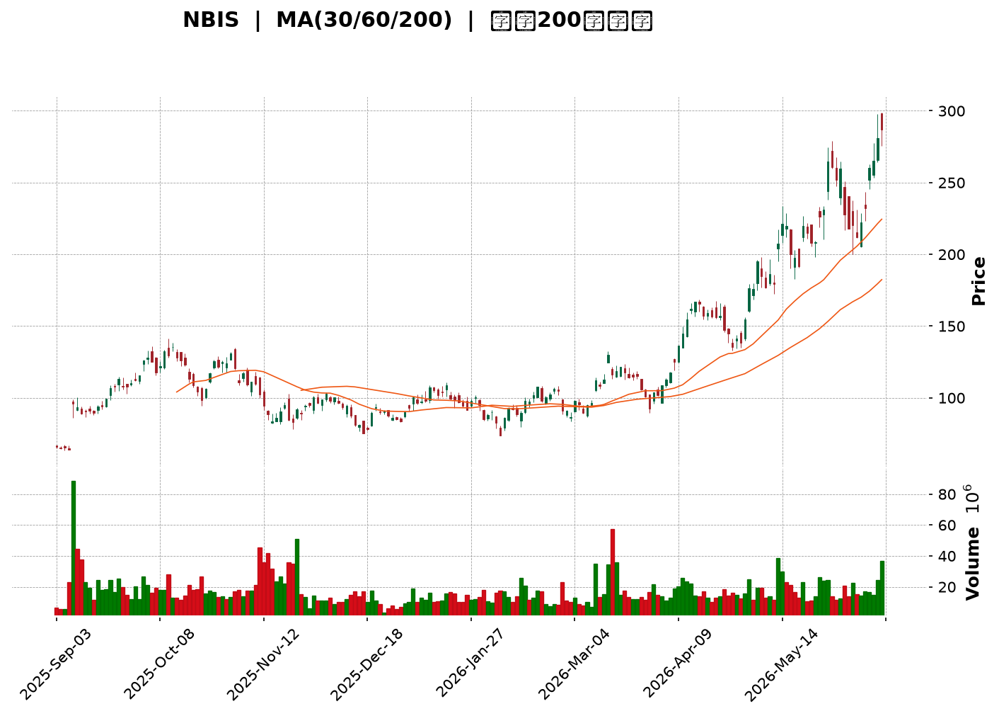
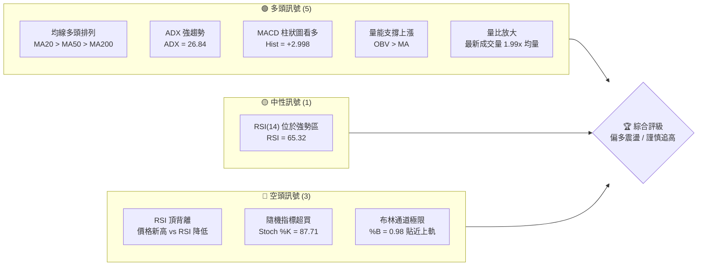
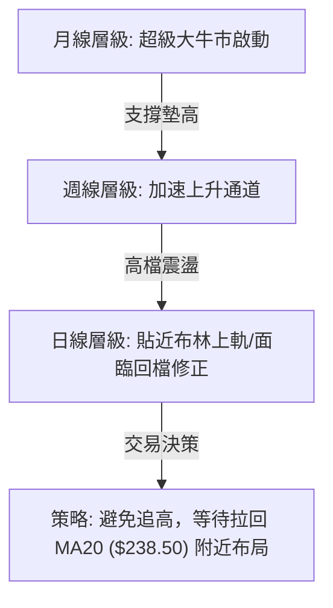
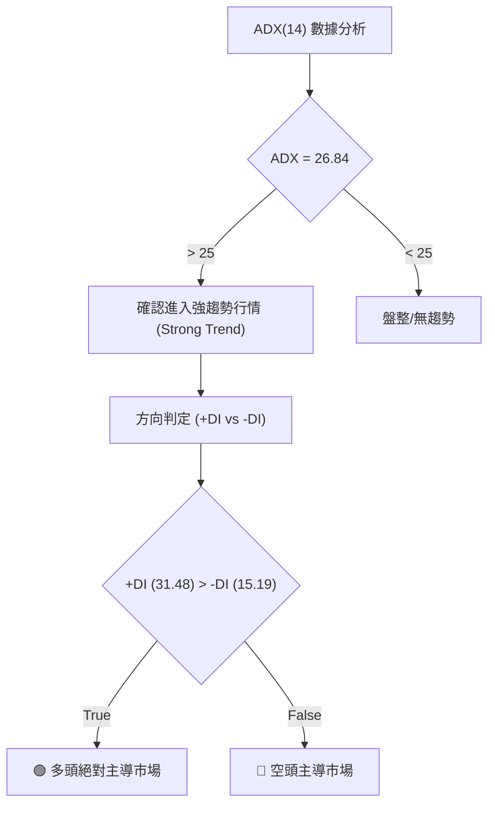
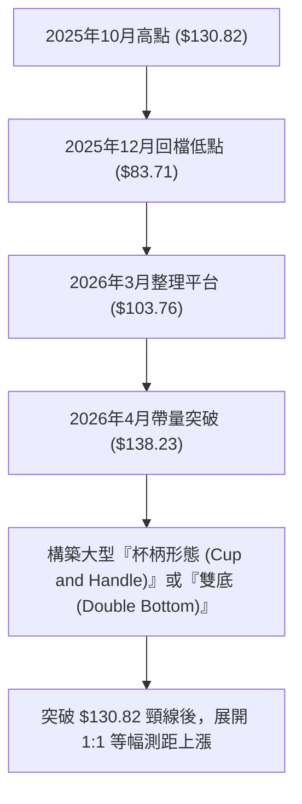
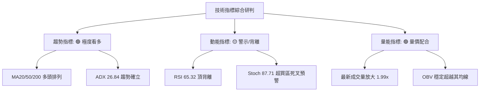
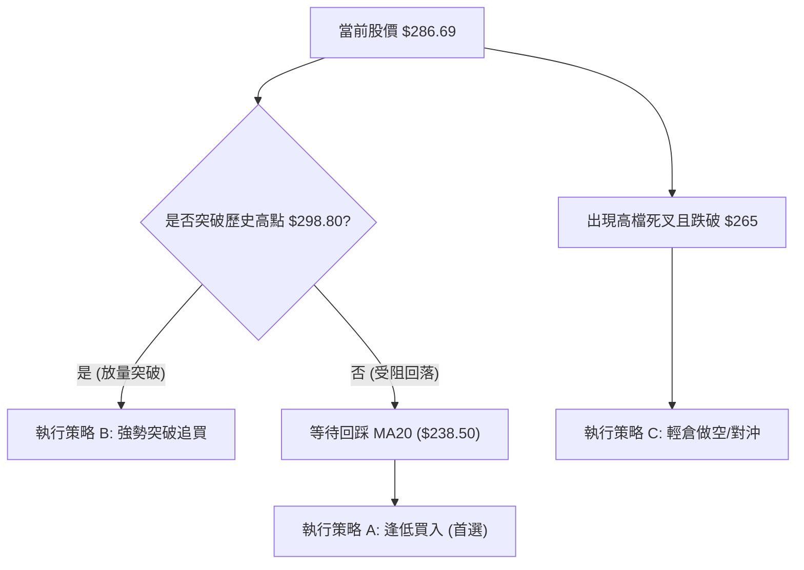
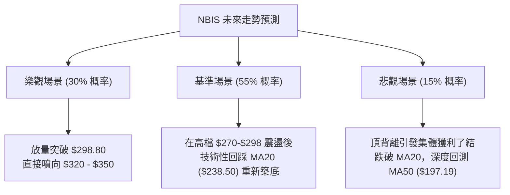

<details>
<summary>📊 靜態圖表 (點擊展開)</summary>

</details>

<html>
<head><meta charset="utf-8" /></head>
<body>
    <div style="height:500px; width:100%;">                        <script>window.PlotlyConfig = {MathJaxConfig: 'local'};</script>
        <script charset="utf-8" src="https://cdn.plot.ly/plotly-3.6.0.min.js" integrity="sha256-QaOVwtVY0T02VaHrr6pnoHLCwayMJp4O5n4YyaE3rJk=" crossorigin="anonymous"></script>                <div id="candlestick-chart" class="plotly-graph-div" style="height:100%; width:100%;"></div>            <script>                window.PLOTLYENV=window.PLOTLYENV || {};                                if (document.getElementById("candlestick-chart")) {                    Plotly.newPlot(                        "candlestick-chart",                        [{"close":{"dtype":"f8","bdata":"AAAAoJlpUEAAAACAPTpQQAAAAIAUXlBAAAAAANcDUEAAAACAFO5XQAAAAMD1WFdAAAAAAClMVkAAAACAPZpWQAAAAKBwvVZAAAAAIIVbVkAAAADAHoVXQAAAACCuh1dAAAAAANfTWEAAAABgZqZaQAAAAEAz81pAAAAAYLhOXEAAAAAAKfxaQAAAAMDM7FpAAAAAgBSOW0AAAACgRxFcQAAAAEAK51xAAAAAIK53X0AAAABguP5fQAAAAAApPF9AAAAAwMxsXUAAAAAAAIBeQAAAAOB6lGBAAAAAYI8yYEAAAABguO5gQAAAAMDMBGBAAAAAwB51X0AAAABgj8JeQAAAAAApXFxAAAAAAABAW0AAAACA6xFaQAAAACCup1hAAAAAgD2KWkAAAADgo1BdQAAAACCFW19AAAAAwB51XkAAAABgZkZfQAAAACCFC19AAAAAgD1aYEAAAACAFB5eQAAAAGCPoltAAAAAAABAXUAAAAAAKVxbQAAAAIDr0VtAAAAAwMx8W0AAAACAFI5ZQAAAAEAKl1dAAAAA4FEoVkAAAABgj+JUQAAAAGC4flVAAAAAYI+iVkAAAADgesRXQAAAAMD1KFVAAAAA4KPQVEAAAACgmflWQAAAAOBROFZAAAAAACmsV0AAAAAgrrdXQAAAAKCZCVlAAAAAwMwcWEAAAABA4bpYQAAAAEAzs1lAAAAAYI+CWEAAAADAHhVZQAAAAIA9GlhAAAAAgMJlV0AAAACA65FXQAAAAAAp7FVAAAAAwPVIVEAAAADAzDxUQAAAAMDM3FJAAAAAgMKFU0AAAACgcF1WQAAAAGC4TldAAAAAgOuBVkAAAADgUchWQAAAAIDC5VVAAAAAYI+CVUAAAABA4UpVQAAAAMAe7VRAAAAAwMx8VkAAAADAHjVXQAAAACBcD1lAAAAAoHANWEAAAABAM1NYQAAAACCFe1hAAAAAwB7VWkAAAAAghVtaQAAAAGC4fllAAAAA4KP4WUAAAABguC5bQAAAAGCP0lhAAAAAIK63WEAAAABgZjZYQAAAAAAAoFdAAAAAoHDdVkAAAAAgrndYQAAAACCFG1lAAAAAgD26V0AAAAAAKUxVQAAAAIA9ClZAAAAAwMx8VkAAAADA9ZhUQAAAACCud1JAAAAAYGaGVUAAAADgUThXQAAAAGCP8lZAAAAAQAonVkAAAABguG5WQAAAAOCjgFhAAAAAoEdhWEAAAABAM3NZQAAAAEAK51pAAAAAQOF6WEAAAABACidZQAAAAMAepVlAAAAAIK6HWkAAAADgUThaQAAAAAApzFZAAAAA4KPAVkAAAABAM7NVQAAAAIDrcVhAAAAAoJnpV0AAAADAHlVWQAAAAAApvFdAAAAAIIUbWEAAAAAgrv9bQAAAAGCPAltAAAAAwMw8XEAAAABAMztgQAAAAMAeFV1AAAAAANejXUAAAACgR2FeQAAAACCuZ11AAAAAoJmJXEAAAACAPbpcQAAAAIDCxVxAAAAAgBR+WkAAAADgejRZQAAAAOCjEFdAAAAA4KPwWUAAAADAzHxZQAAAAOB6NFtAAAAAYI8iXEAAAACgmVldQAAAAAAAQF9AAAAAYI8KYUAAAABACh9iQAAAAIDrUWNAAAAAgBQ+ZEAAAADgo9hkQAAAAEDhqmRAAAAA4HqkY0AAAADAHuVjQAAAAKCZkWNAAAAA4HqEY0AAAABgj6JjQAAAAMAeZWJAAAAAYLgeYkAAAADgUfBgQAAAAIAUpmFAAAAAIFxHYUAAAAAgrk9jQAAAAKBwDWZAAAAAoHD9ZUAAAABA4WJoQAAAAOCjGGdAAAAAoJkhZkAAAABAM0NnQAAAACCFY2ZAAAAA4KPoaUAAAADAzKRrQAAAAIAUfmtAAAAAIIX7aEAAAAAgXLdoQAAAAIA9+mdAAAAAgMJ9a0AAAADgo9hqQAAAAIDrAWpAAAAAANcLakAAAABA4UpsQAAAAEDh4mxAAAAAACmIcEAAAACgR0lwQAAAAIDCdW9AAAAAYLg6cEAAAACA63lsQAAAAAAAQGtAAAAAANeDa0AAAACAFHZqQAAAACCux2tAAAAAIIULbUAAAADAHkFwQAAAAKCZkXBAAAAAYI+OcUAAAABACutxQA=="},"high":{"dtype":"f8","bdata":"AAAAAADAUEAAAAAAAKBQQAAAAMD12FBAAAAAwPWoUEAAAAAghatYQAAAAOCjIFlAAAAAIK53V0AAAAAAAABXQAAAAEDhmldAAAAAQDPTVkAAAAAAAMBXQAAAACCFa1hAAAAAQDPjWEAAAADAHiVbQAAAAGC4fltAAAAAYGa2XEAAAADAHoVcQAAAACBcf1tAAAAAoEchXEAAAACgmWldQAAAAOBR+FxAAAAAIFyvX0AAAAAAVJ9gQAAAAOBR+GBAAAAAwPUIYEAAAAAA11NfQAAAAIA9qmBAAAAAQDOjYUAAAADA9VBhQAAAAIAWuWBAAAAAIK5\u002fYEAAAABACl9gQAAAAACsJF5AAAAAgBReXUAAAAAghQtbQAAAAEAz81pAAAAAIK6nWkAAAADAzFxdQAAAAAAAoF9AAAAAwPUgYEAAAADAzHxfQAAAAIAUDmBAAAAAwMyEYEAAAACAwt1gQAAAAIDrMV1AAAAAoHCNXUAAAAAAAEBeQAAAAEAz01tAAAAAIK6XXUAAAAAA16NcQAAAAKCZaVpAAAAAYLjeVkAAAAAAAEBWQAAAAKCZaVZAAAAAAClsV0AAAACAFC5YQAAAAAAprFlAAAAAIFwvVkAAAAAAAEBXQAAAAIDr0VZAAAAAgJPoV0AAAADAHkVYQAAAAGBmZllAAAAAwMy8WUAAAAAA18NYQAAAAIDC9VlAAAAAYGZWWUAAAAAAACBZQAAAACCDOFlAAAAAgMJFWEAAAADAzNxXQAAAAKCZ6VdAAAAAIFwPVkAAAAAA12NUQAAAAEAzE1VAAAAAYGYWVEAAAABgj6JWQAAAAKCZ+VdAAAAAgBQ+V0AAAABA4dpWQAAAACCu51ZAAAAAQAonVkAAAACgcL1VQAAAAIAUnlVAAAAA4KOwVkAAAAAAKdxXQAAAACCFK1lAAAAAYGaWWUAAAABgj6JZQAAAAIAUPlpAAAAAIIUrW0AAAADAzPxaQAAAAMDMrFpAAAAA4FEIW0AAAAAAAKBbQAAAAIAUHlpAAAAAoJmZWUAAAABguP5ZQAAAAOCjuFhAAAAA4FE4WUAAAABgj+JYQAAAAGBmdllAAAAAAADQWEAAAABgjwJXQAAAAAAAUFZAAAAAwPXYVkAAAABgj+pVQAAAAOB6NFRAAAAAgD2qVUAAAAAghWtXQAAAAABU41dAAAAAAACwV0AAAADgo7BWQAAAAOB6FFlAAAAAYI\u002fSWEAAAACgmRlaQAAAAGC4\u002flpAAAAA4HoUW0AAAACgbkpZQAAAAAAA8FlAAAAAACncWkAAAADgehRbQAAAAEAz01hAAAAAoMTYVkAAAAAgrndWQAAAAGC4nlhAAAAAAADQWEAAAADAzLxXQAAAAMDMzFdAAAAAoJmZWEAAAADAHoVcQAAAAGCPwltAAAAA4HokXUAAAACgmYlgQAAAAAAAYF5AAAAAQImxXkAAAABAM3NeQAAAAABW7l5AAAAAANdTXkAAAABAM3NdQAAAAEAzs11AAAAAQDNTXEAAAADgo5BaQAAAACBcj1lAAAAAwPX4WUAAAAAgrvdaQAAAAKBwPVtAAAAAgMJ1XEAAAACgmXldQAAAAAAA8F9AAAAAoJkRYUAAAACAPbpiQAAAAAAA8GNAAAAAQDPDZEAAAACA69lkQAAAAGC4FmVAAAAAgOuBZEAAAAAAADhkQAAAAAAAaGRAAAAAgMLtZEAAAACA67lkQAAAAAAAqGRAAAAAoJmZYkAAAABguK5hQAAAAGBm9mFAAAAAIFxfYkAAAAAAAIBjQAAAAMDMbGZAAAAAYLh+ZkAAAAAgrn9oQAAAAOB6vGhAAAAAAACIZ0AAAACAl45oQAAAACCFM2dAAAAAQOEqa0AAAAAgXDdtQAAAAKBHmWxAAAAAgD1Ca0AAAACA61lpQAAAAAAAiGlAAAAAgOtZbEAAAACgcL1rQAAAAOBRoGtAAAAA4Ho0akAAAADgehxtQAAAAEAzM21AAAAAoMQscUAAAACgcG1xQAAAACBct3BAAAAAIIWHcEAAAAAAAFhvQAAAAMDMDG5AAAAAwPW0bUAAAAAgrt9sQAAAACCuj2xAAAAAQOFybkAAAADgUW5wQAAAACCFVXFAAAAAQOGeckAAAADAzKxyQA=="},"hovertemplate":"\u003cb\u003e%{x|%Y-%m-%d}\u003c\u002fb\u003e\u003cbr\u003e\u958b: $%{open:.2f}\u003cbr\u003e\u9ad8: $%{high:.2f}\u003cbr\u003e\u4f4e: $%{low:.2f}\u003cbr\u003e\u6536: $%{close:.2f}\u003cextra\u003e\u003c\u002fextra\u003e","low":{"dtype":"f8","bdata":"AAAAIC81UEAAAACAPRpQQAAAAKBHoU9AAAAAYGbmT0AAAAAgrodVQAAAAAAAwFZAAAAAYI8aVkAAAACA67FVQAAAAIDCNVZAAAAAoEcBVkAAAADAHjVWQAAAAIDrAVdAAAAAAABQV0AAAACgR6FYQAAAAAAAEFpAAAAAYGY2WkAAAADgUXhaQAAAAEAzs1lAAAAAwB4VW0AAAACAPepbQAAAAOCjcFtAAAAA4HqkXUAAAABgZuZeQAAAACCFO19AAAAAgBTuXEAAAAAAAGBdQAAAACCu911AAAAA4FEAYEAAAADAzJRgQAAAAAAAcF9AAAAAwMyMXkAAAACgR4FeQAAAAOBRuFtAAAAA4KPgWkAAAACgmVlZQAAAAOBRqFdAAAAAoHDdWEAAAADgo4BbQAAAAEAKB15AAAAAgOsxXkAAAAAAAGBdQAAAAOCjcF1AAAAAQDOTX0AAAAAAAPBdQAAAAAAAQFtAAAAAIIXbW0AAAACAPRpbQAAAAOCjUFlAAAAAgBQuW0AAAADAHvVYQAAAAKBw7VZAAAAAAAAgVUAAAAAAAIBUQAAAAIDC5VRAAAAAoHBtVEAAAABAM\u002fNWQAAAAKBwDVVAAAAAoHCNU0AAAACgmUlVQAAAAOAkLlVAAAAA4KOwVkAAAAAAKVxXQAAAAOCjQFZAAAAAANcDWEAAAAAAAMBWQAAAAIAUXlhAAAAAwMwMWEAAAABAM9NXQAAAAGBmBlhAAAAAwMwMV0AAAADAzKxVQAAAAMDMjFVAAAAAoBgEVEAAAADgUThTQAAAAAAA0FJAAAAA4KNAU0AAAACAPQpUQAAAAGBmxlZAAAAAANcTVkAAAACgmSlWQAAAACBcr1VAAAAAYI8SVUAAAAAA1yNVQAAAAKCZuVRAAAAA4KOAVUAAAADA9bhWQAAAAAApvFZAAAAAANfjV0AAAAAgWAFYQAAAAGBmRlhAAAAAQDMjWEAAAABA4fpZQAAAACCD2FhAAAAAYGZGWUAAAACgcC1ZQAAAAIDClVhAAAAAYGZGV0AAAAAAACBYQAAAAIDrYVdAAAAAQArXVkAAAACA62FXQAAAAAApHFhAAAAAgD3KVkAAAAAgrgdVQAAAAIAUDlVAAAAAAAAwVUAAAAAAKZxTQAAAAKBHYVJAAAAAIK5HU0AAAAAA1\u002fNUQAAAAIA96lZAAAAAwPXIVUAAAAAAKexTQAAAAEAKN1ZAAAAAAABgV0AAAAAg2TZYQAAAACCFG1lAAAAAgOtBWEAAAABAM9NXQAAAAEDfb1hAAAAAQDOzWUAAAAAAAIBZQAAAAKCZGVZAAAAAQDOzVUAAAACA6+FUQAAAAKCZiVZAAAAAIK7nVkAAAABAMzNWQAAAAAAAoFVAAAAAAADAV0AAAAAgXB9aQAAAAKBHoVpAAAAAwPWIW0AAAABgEhtfQAAAAEAKR1xAAAAAAACAXEAAAACgR7FcQAAAAICTKFxAAAAAQDNjXEAAAADgowBcQAAAAMAeVVxAAAAAgD1aWkAAAACgRxFZQAAAAMDKaVZAAAAAYLjuV0AAAABgZlZZQAAAAAApDFhAAAAAwMzcWkAAAACA65FbQAAAAGBm1l1AAAAAQDMjX0AAAADgUdxgQAAAAKCZyWFAAAAA4KPQY0AAAAAAAJBjQAAAAEDhAmRAAAAAIFxXY0AAAACgR0FjQAAAAMDMbGNAAAAAQDNrY0AAAACAPUJjQAAAAIDrOWJAAAAAgOtRYUAAAABgZpZgQAAAAEAKx2BAAAAAAADgYEAAAAAAAIBhQAAAAGBm9mNAAAAAYLgWZUAAAAAgheNlQAAAAAAAIGZAAAAAAAAQZkAAAACgmVFmQAAAAAAAiGVAAAAAAABgaEAAAAAAAPhpQAAAAKCZeWpAAAAAYI\u002fCZ0AAAAAAAOBmQAAAAOB61GdAAAAAoJkZakAAAAAgXFdqQAAAAMAetWlAAAAAgOvJaEAAAADgUWBrQAAAAMDMTGpAAAAAAADAbUAAAAAAADxwQAAAAOBR8G5AAAAAgBRWbUAAAACAFBZrQAAAAGBmNmtAAAAAoJkJaUAAAAAA12tqQAAAAAAAoGlAAAAAAADwa0AAAAAgrqduQAAAAMDMrG9AAAAA4KOEcEAAAABAMzlxQA=="},"name":"\u50f9\u683c","open":{"dtype":"f8","bdata":"AAAA4FG4UEAAAADgelxQQAAAAAAAoFBAAAAAQOEqUEAAAADAzExYQAAAAMD16FZAAAAAQOEqV0AAAAAAKcxWQAAAAEAKJ1dAAAAAwMzMVkAAAABA4epWQAAAAMDMxFdAAAAAwPWIV0AAAADAzHxZQAAAAGCPAltAAAAA4KNIW0AAAAAghQNbQAAAACCFe1tAAAAA4FFYW0AAAADgelxcQAAAAIDC7VtAAAAAoEfxXkAAAABACs9fQAAAAMDMjGBAAAAAwMz0X0AAAADAzExeQAAAAGC4Pl5AAAAAYGbeYEAAAABguOZgQAAAAAAAgGBAAAAAwMx8YEAAAABA4QJgQAAAAADXg11AAAAAYI8yXUAAAADgUfhaQAAAAEAzq1pAAAAAwB4VWUAAAACAPcpbQAAAAIA9Ol5AAAAAANebX0AAAACA6xFfQAAAAMDMTF5AAAAAwPWoX0AAAAAAAMBgQAAAAGC4FlxAAAAAwPVoXEAAAABAM+NdQAAAAAAAIFpAAAAAIIXLXEAAAADgUYhcQAAAAMDMDFpAAAAAwPW4VkAAAABACpdUQAAAAOB69FRAAAAAgOvxVEAAAADgUUBXQAAAACCF21hAAAAAQDNjVUAAAABguI5VQAAAAGCPUlZAAAAAYGZ2V0AAAABAMyNYQAAAAMDM3FZAAAAAQAoXWUAAAACgR8FXQAAAAOB6xFhAAAAAgMIVWUAAAABgj1JYQAAAAIDChVhAAAAAYLjuV0AAAADAzExWQAAAAADXU1dAAAAAYGYGVkAAAADAzORTQAAAAIDCBVVAAAAAQDPDU0AAAACgmSlUQAAAAIAUPldAAAAAANeTVkAAAABguI5WQAAAAOCj4FZAAAAAwMwcVUAAAAAAAJhVQAAAACCuV1VAAAAAQAq\u002fVUAAAAAAAMBXQAAAAIDC7VdAAAAA4KPAWEAAAABgjzJYQAAAAKBHuVhAAAAA4HqUWEAAAADAHtVaQAAAAIDrcVpAAAAAIIUjWkAAAAAgrn9aQAAAAMAedVlAAAAAgMJFWUAAAADgo4BZQAAAAMDMLFhAAAAAoHBtWEAAAABgZpZXQAAAAAAAAFlAAAAAQAqXWEAAAACgQ+NWQAAAAADXc1VAAAAAIIV7VkAAAAAAAMBVQAAAAMD1yFNAAAAAYGbOU0AAAADAzBxVQAAAAGCPOldAAAAAYI86V0AAAABgZgZVQAAAAEAKd1ZAAAAAAAAAWEAAAABguO5YQAAAACCFG1lAAAAAANOlWkAAAAAghRNYQAAAACBc11hAAAAAIFw\u002fWkAAAAAAAIBaQAAAAMDMrFhAAAAAAAAAVkAAAACgmYlVQAAAAKCZmVZAAAAAAAAwWEAAAABAMxNXQAAAAEAK11VAAAAAwPXIV0AAAACAPUpaQAAAAIDCRVtAAAAAACmcW0AAAAAAADBfQAAAAIDCFV5AAAAAQDOzXEAAAADgUdBcQAAAAGBmHl5AAAAAoHAtXUAAAABAMwtdQAAAACCuN11AAAAA4FFQXEAAAADAHnVaQAAAACBcj1lAAAAAYLh+WEAAAADgenxaQAAAAIA9GlhAAAAAgD0qW0AAAAAAAKhbQAAAAOBRuF9AAAAAAABAX0AAAADgUdxgQAAAAGBm1mFAAAAAQDMjZEAAAABgOwdkQAAAAAAA4GRAAAAAwPV4ZEAAAAAAAKBjQAAAAEAKJ2RAAAAAIIVbZEAAAADAzHxjQAAAAKBwdWRAAAAA4HqMYkAAAADAzExhQAAAAEAKg2FAAAAAgOslYkAAAABgj6phQAAAAOBRDGRAAAAAwMx0ZUAAAABACnNmQAAAAOBRwGdAAAAAYGb2ZkAAAADAzHxmQAAAAKBwjWZAAAAAQAp7aUAAAAAAAKxqQAAAACCFM2tAAAAAQAova0AAAAAAAOBnQAAAAEAKf2lAAAAAIK53akAAAADgUWhrQAAAAKCZlWtAAAAAwB75aUAAAAAAKcxsQAAAACCFe2xAAAAAQOGCbkAAAACgmQFxQAAAAKBwQ3BAAAAAIK73bUAAAAAghdtuQAAAAMDMDG5AAAAAAADAbEAAAACgxu9qQAAAAOB6rGlAAAAAwMxUbUAAAABguH5vQAAAAEAK729AAAAAYGaacEAAAABAM6NyQA=="},"x":["2025-09-03T00:00:00-04:00","2025-09-04T00:00:00-04:00","2025-09-05T00:00:00-04:00","2025-09-08T00:00:00-04:00","2025-09-09T00:00:00-04:00","2025-09-10T00:00:00-04:00","2025-09-11T00:00:00-04:00","2025-09-12T00:00:00-04:00","2025-09-15T00:00:00-04:00","2025-09-16T00:00:00-04:00","2025-09-17T00:00:00-04:00","2025-09-18T00:00:00-04:00","2025-09-19T00:00:00-04:00","2025-09-22T00:00:00-04:00","2025-09-23T00:00:00-04:00","2025-09-24T00:00:00-04:00","2025-09-25T00:00:00-04:00","2025-09-26T00:00:00-04:00","2025-09-29T00:00:00-04:00","2025-09-30T00:00:00-04:00","2025-10-01T00:00:00-04:00","2025-10-02T00:00:00-04:00","2025-10-03T00:00:00-04:00","2025-10-06T00:00:00-04:00","2025-10-07T00:00:00-04:00","2025-10-08T00:00:00-04:00","2025-10-09T00:00:00-04:00","2025-10-10T00:00:00-04:00","2025-10-13T00:00:00-04:00","2025-10-14T00:00:00-04:00","2025-10-15T00:00:00-04:00","2025-10-16T00:00:00-04:00","2025-10-17T00:00:00-04:00","2025-10-20T00:00:00-04:00","2025-10-21T00:00:00-04:00","2025-10-22T00:00:00-04:00","2025-10-23T00:00:00-04:00","2025-10-24T00:00:00-04:00","2025-10-27T00:00:00-04:00","2025-10-28T00:00:00-04:00","2025-10-29T00:00:00-04:00","2025-10-30T00:00:00-04:00","2025-10-31T00:00:00-04:00","2025-11-03T00:00:00-05:00","2025-11-04T00:00:00-05:00","2025-11-05T00:00:00-05:00","2025-11-06T00:00:00-05:00","2025-11-07T00:00:00-05:00","2025-11-10T00:00:00-05:00","2025-11-11T00:00:00-05:00","2025-11-12T00:00:00-05:00","2025-11-13T00:00:00-05:00","2025-11-14T00:00:00-05:00","2025-11-17T00:00:00-05:00","2025-11-18T00:00:00-05:00","2025-11-19T00:00:00-05:00","2025-11-20T00:00:00-05:00","2025-11-21T00:00:00-05:00","2025-11-24T00:00:00-05:00","2025-11-25T00:00:00-05:00","2025-11-26T00:00:00-05:00","2025-11-28T00:00:00-05:00","2025-12-01T00:00:00-05:00","2025-12-02T00:00:00-05:00","2025-12-03T00:00:00-05:00","2025-12-04T00:00:00-05:00","2025-12-05T00:00:00-05:00","2025-12-08T00:00:00-05:00","2025-12-09T00:00:00-05:00","2025-12-10T00:00:00-05:00","2025-12-11T00:00:00-05:00","2025-12-12T00:00:00-05:00","2025-12-15T00:00:00-05:00","2025-12-16T00:00:00-05:00","2025-12-17T00:00:00-05:00","2025-12-18T00:00:00-05:00","2025-12-19T00:00:00-05:00","2025-12-22T00:00:00-05:00","2025-12-23T00:00:00-05:00","2025-12-24T00:00:00-05:00","2025-12-26T00:00:00-05:00","2025-12-29T00:00:00-05:00","2025-12-30T00:00:00-05:00","2025-12-31T00:00:00-05:00","2026-01-02T00:00:00-05:00","2026-01-05T00:00:00-05:00","2026-01-06T00:00:00-05:00","2026-01-07T00:00:00-05:00","2026-01-08T00:00:00-05:00","2026-01-09T00:00:00-05:00","2026-01-12T00:00:00-05:00","2026-01-13T00:00:00-05:00","2026-01-14T00:00:00-05:00","2026-01-15T00:00:00-05:00","2026-01-16T00:00:00-05:00","2026-01-20T00:00:00-05:00","2026-01-21T00:00:00-05:00","2026-01-22T00:00:00-05:00","2026-01-23T00:00:00-05:00","2026-01-26T00:00:00-05:00","2026-01-27T00:00:00-05:00","2026-01-28T00:00:00-05:00","2026-01-29T00:00:00-05:00","2026-01-30T00:00:00-05:00","2026-02-02T00:00:00-05:00","2026-02-03T00:00:00-05:00","2026-02-04T00:00:00-05:00","2026-02-05T00:00:00-05:00","2026-02-06T00:00:00-05:00","2026-02-09T00:00:00-05:00","2026-02-10T00:00:00-05:00","2026-02-11T00:00:00-05:00","2026-02-12T00:00:00-05:00","2026-02-13T00:00:00-05:00","2026-02-17T00:00:00-05:00","2026-02-18T00:00:00-05:00","2026-02-19T00:00:00-05:00","2026-02-20T00:00:00-05:00","2026-02-23T00:00:00-05:00","2026-02-24T00:00:00-05:00","2026-02-25T00:00:00-05:00","2026-02-26T00:00:00-05:00","2026-02-27T00:00:00-05:00","2026-03-02T00:00:00-05:00","2026-03-03T00:00:00-05:00","2026-03-04T00:00:00-05:00","2026-03-05T00:00:00-05:00","2026-03-06T00:00:00-05:00","2026-03-09T00:00:00-04:00","2026-03-10T00:00:00-04:00","2026-03-11T00:00:00-04:00","2026-03-12T00:00:00-04:00","2026-03-13T00:00:00-04:00","2026-03-16T00:00:00-04:00","2026-03-17T00:00:00-04:00","2026-03-18T00:00:00-04:00","2026-03-19T00:00:00-04:00","2026-03-20T00:00:00-04:00","2026-03-23T00:00:00-04:00","2026-03-24T00:00:00-04:00","2026-03-25T00:00:00-04:00","2026-03-26T00:00:00-04:00","2026-03-27T00:00:00-04:00","2026-03-30T00:00:00-04:00","2026-03-31T00:00:00-04:00","2026-04-01T00:00:00-04:00","2026-04-02T00:00:00-04:00","2026-04-06T00:00:00-04:00","2026-04-07T00:00:00-04:00","2026-04-08T00:00:00-04:00","2026-04-09T00:00:00-04:00","2026-04-10T00:00:00-04:00","2026-04-13T00:00:00-04:00","2026-04-14T00:00:00-04:00","2026-04-15T00:00:00-04:00","2026-04-16T00:00:00-04:00","2026-04-17T00:00:00-04:00","2026-04-20T00:00:00-04:00","2026-04-21T00:00:00-04:00","2026-04-22T00:00:00-04:00","2026-04-23T00:00:00-04:00","2026-04-24T00:00:00-04:00","2026-04-27T00:00:00-04:00","2026-04-28T00:00:00-04:00","2026-04-29T00:00:00-04:00","2026-04-30T00:00:00-04:00","2026-05-01T00:00:00-04:00","2026-05-04T00:00:00-04:00","2026-05-05T00:00:00-04:00","2026-05-06T00:00:00-04:00","2026-05-07T00:00:00-04:00","2026-05-08T00:00:00-04:00","2026-05-11T00:00:00-04:00","2026-05-12T00:00:00-04:00","2026-05-13T00:00:00-04:00","2026-05-14T00:00:00-04:00","2026-05-15T00:00:00-04:00","2026-05-18T00:00:00-04:00","2026-05-19T00:00:00-04:00","2026-05-20T00:00:00-04:00","2026-05-21T00:00:00-04:00","2026-05-22T00:00:00-04:00","2026-05-26T00:00:00-04:00","2026-05-27T00:00:00-04:00","2026-05-28T00:00:00-04:00","2026-05-29T00:00:00-04:00","2026-06-01T00:00:00-04:00","2026-06-02T00:00:00-04:00","2026-06-03T00:00:00-04:00","2026-06-04T00:00:00-04:00","2026-06-05T00:00:00-04:00","2026-06-08T00:00:00-04:00","2026-06-09T00:00:00-04:00","2026-06-10T00:00:00-04:00","2026-06-11T00:00:00-04:00","2026-06-12T00:00:00-04:00","2026-06-15T00:00:00-04:00","2026-06-16T00:00:00-04:00","2026-06-17T00:00:00-04:00","2026-06-18T00:00:00-04:00"],"type":"candlestick"},{"hovertemplate":"MA30: $%{y:.2f}\u003cextra\u003e\u003c\u002fextra\u003e","line":{"color":"#2196F3","dash":"dash","width":2},"mode":"lines","name":"MA30","x":["2025-09-03T00:00:00-04:00","2025-09-04T00:00:00-04:00","2025-09-05T00:00:00-04:00","2025-09-08T00:00:00-04:00","2025-09-09T00:00:00-04:00","2025-09-10T00:00:00-04:00","2025-09-11T00:00:00-04:00","2025-09-12T00:00:00-04:00","2025-09-15T00:00:00-04:00","2025-09-16T00:00:00-04:00","2025-09-17T00:00:00-04:00","2025-09-18T00:00:00-04:00","2025-09-19T00:00:00-04:00","2025-09-22T00:00:00-04:00","2025-09-23T00:00:00-04:00","2025-09-24T00:00:00-04:00","2025-09-25T00:00:00-04:00","2025-09-26T00:00:00-04:00","2025-09-29T00:00:00-04:00","2025-09-30T00:00:00-04:00","2025-10-01T00:00:00-04:00","2025-10-02T00:00:00-04:00","2025-10-03T00:00:00-04:00","2025-10-06T00:00:00-04:00","2025-10-07T00:00:00-04:00","2025-10-08T00:00:00-04:00","2025-10-09T00:00:00-04:00","2025-10-10T00:00:00-04:00","2025-10-13T00:00:00-04:00","2025-10-14T00:00:00-04:00","2025-10-15T00:00:00-04:00","2025-10-16T00:00:00-04:00","2025-10-17T00:00:00-04:00","2025-10-20T00:00:00-04:00","2025-10-21T00:00:00-04:00","2025-10-22T00:00:00-04:00","2025-10-23T00:00:00-04:00","2025-10-24T00:00:00-04:00","2025-10-27T00:00:00-04:00","2025-10-28T00:00:00-04:00","2025-10-29T00:00:00-04:00","2025-10-30T00:00:00-04:00","2025-10-31T00:00:00-04:00","2025-11-03T00:00:00-05:00","2025-11-04T00:00:00-05:00","2025-11-05T00:00:00-05:00","2025-11-06T00:00:00-05:00","2025-11-07T00:00:00-05:00","2025-11-10T00:00:00-05:00","2025-11-11T00:00:00-05:00","2025-11-12T00:00:00-05:00","2025-11-13T00:00:00-05:00","2025-11-14T00:00:00-05:00","2025-11-17T00:00:00-05:00","2025-11-18T00:00:00-05:00","2025-11-19T00:00:00-05:00","2025-11-20T00:00:00-05:00","2025-11-21T00:00:00-05:00","2025-11-24T00:00:00-05:00","2025-11-25T00:00:00-05:00","2025-11-26T00:00:00-05:00","2025-11-28T00:00:00-05:00","2025-12-01T00:00:00-05:00","2025-12-02T00:00:00-05:00","2025-12-03T00:00:00-05:00","2025-12-04T00:00:00-05:00","2025-12-05T00:00:00-05:00","2025-12-08T00:00:00-05:00","2025-12-09T00:00:00-05:00","2025-12-10T00:00:00-05:00","2025-12-11T00:00:00-05:00","2025-12-12T00:00:00-05:00","2025-12-15T00:00:00-05:00","2025-12-16T00:00:00-05:00","2025-12-17T00:00:00-05:00","2025-12-18T00:00:00-05:00","2025-12-19T00:00:00-05:00","2025-12-22T00:00:00-05:00","2025-12-23T00:00:00-05:00","2025-12-24T00:00:00-05:00","2025-12-26T00:00:00-05:00","2025-12-29T00:00:00-05:00","2025-12-30T00:00:00-05:00","2025-12-31T00:00:00-05:00","2026-01-02T00:00:00-05:00","2026-01-05T00:00:00-05:00","2026-01-06T00:00:00-05:00","2026-01-07T00:00:00-05:00","2026-01-08T00:00:00-05:00","2026-01-09T00:00:00-05:00","2026-01-12T00:00:00-05:00","2026-01-13T00:00:00-05:00","2026-01-14T00:00:00-05:00","2026-01-15T00:00:00-05:00","2026-01-16T00:00:00-05:00","2026-01-20T00:00:00-05:00","2026-01-21T00:00:00-05:00","2026-01-22T00:00:00-05:00","2026-01-23T00:00:00-05:00","2026-01-26T00:00:00-05:00","2026-01-27T00:00:00-05:00","2026-01-28T00:00:00-05:00","2026-01-29T00:00:00-05:00","2026-01-30T00:00:00-05:00","2026-02-02T00:00:00-05:00","2026-02-03T00:00:00-05:00","2026-02-04T00:00:00-05:00","2026-02-05T00:00:00-05:00","2026-02-06T00:00:00-05:00","2026-02-09T00:00:00-05:00","2026-02-10T00:00:00-05:00","2026-02-11T00:00:00-05:00","2026-02-12T00:00:00-05:00","2026-02-13T00:00:00-05:00","2026-02-17T00:00:00-05:00","2026-02-18T00:00:00-05:00","2026-02-19T00:00:00-05:00","2026-02-20T00:00:00-05:00","2026-02-23T00:00:00-05:00","2026-02-24T00:00:00-05:00","2026-02-25T00:00:00-05:00","2026-02-26T00:00:00-05:00","2026-02-27T00:00:00-05:00","2026-03-02T00:00:00-05:00","2026-03-03T00:00:00-05:00","2026-03-04T00:00:00-05:00","2026-03-05T00:00:00-05:00","2026-03-06T00:00:00-05:00","2026-03-09T00:00:00-04:00","2026-03-10T00:00:00-04:00","2026-03-11T00:00:00-04:00","2026-03-12T00:00:00-04:00","2026-03-13T00:00:00-04:00","2026-03-16T00:00:00-04:00","2026-03-17T00:00:00-04:00","2026-03-18T00:00:00-04:00","2026-03-19T00:00:00-04:00","2026-03-20T00:00:00-04:00","2026-03-23T00:00:00-04:00","2026-03-24T00:00:00-04:00","2026-03-25T00:00:00-04:00","2026-03-26T00:00:00-04:00","2026-03-27T00:00:00-04:00","2026-03-30T00:00:00-04:00","2026-03-31T00:00:00-04:00","2026-04-01T00:00:00-04:00","2026-04-02T00:00:00-04:00","2026-04-06T00:00:00-04:00","2026-04-07T00:00:00-04:00","2026-04-08T00:00:00-04:00","2026-04-09T00:00:00-04:00","2026-04-10T00:00:00-04:00","2026-04-13T00:00:00-04:00","2026-04-14T00:00:00-04:00","2026-04-15T00:00:00-04:00","2026-04-16T00:00:00-04:00","2026-04-17T00:00:00-04:00","2026-04-20T00:00:00-04:00","2026-04-21T00:00:00-04:00","2026-04-22T00:00:00-04:00","2026-04-23T00:00:00-04:00","2026-04-24T00:00:00-04:00","2026-04-27T00:00:00-04:00","2026-04-28T00:00:00-04:00","2026-04-29T00:00:00-04:00","2026-04-30T00:00:00-04:00","2026-05-01T00:00:00-04:00","2026-05-04T00:00:00-04:00","2026-05-05T00:00:00-04:00","2026-05-06T00:00:00-04:00","2026-05-07T00:00:00-04:00","2026-05-08T00:00:00-04:00","2026-05-11T00:00:00-04:00","2026-05-12T00:00:00-04:00","2026-05-13T00:00:00-04:00","2026-05-14T00:00:00-04:00","2026-05-15T00:00:00-04:00","2026-05-18T00:00:00-04:00","2026-05-19T00:00:00-04:00","2026-05-20T00:00:00-04:00","2026-05-21T00:00:00-04:00","2026-05-22T00:00:00-04:00","2026-05-26T00:00:00-04:00","2026-05-27T00:00:00-04:00","2026-05-28T00:00:00-04:00","2026-05-29T00:00:00-04:00","2026-06-01T00:00:00-04:00","2026-06-02T00:00:00-04:00","2026-06-03T00:00:00-04:00","2026-06-04T00:00:00-04:00","2026-06-05T00:00:00-04:00","2026-06-08T00:00:00-04:00","2026-06-09T00:00:00-04:00","2026-06-10T00:00:00-04:00","2026-06-11T00:00:00-04:00","2026-06-12T00:00:00-04:00","2026-06-15T00:00:00-04:00","2026-06-16T00:00:00-04:00","2026-06-17T00:00:00-04:00","2026-06-18T00:00:00-04:00"],"y":{"dtype":"f8","bdata":"AAAAAAAA+H8AAAAAAAD4fwAAAAAAAPh\u002fAAAAAAAA+H8AAAAAAAD4fwAAAAAAAPh\u002fAAAAAAAA+H8AAAAAAAD4fwAAAAAAAPh\u002fAAAAAAAA+H8AAAAAAAD4fwAAAAAAAPh\u002fAAAAAAAA+H8AAAAAAAD4fwAAAAAAAPh\u002fAAAAAAAA+H8AAAAAAAD4fwAAAAAAAPh\u002fAAAAAAAA+H8AAAAAAAD4fwAAAAAAAPh\u002fAAAAAAAA+H8AAAAAAAD4fwAAAAAAAPh\u002fAAAAAAAA+H8AAAAAAAD4fwAAAAAAAPh\u002fAAAAAAAA+H8AAAAAAAD4f1VVVUUZBVpAMzMzk3uFWkDe3d1NfgFbQCIiIlLUZ1tA3t3djbPHW0BERER09tlbQLy7u7se5VtA3t3dnVIJXEC8u7tLmkJcQDMzM4MjjFxAvLu7O0LRXECamZlJbxNdQN7d3Q2QU11AiYiIuMiWXUB3d3eXX7RdQO\u002fu7v43ul1Aq6qq6kLCXUDe3d0ddsVdQGZmZkYZzV1AERER0YXMXUDe3d0tFbddQImIiNi\u002fiV1AZmZm1k06XUC8u7urf9tcQBEREVFiiFxAZmZmVnFOXEB3d3f3\u002fRRcQBEREZGXrltAvLu7q8ZLW0CamZkZ2e5aQCIiInISm1pAq6qq2qNYWkB3d3dHixxaQKuqqioxAFpAERERMWvlWUCrqqrq+9lZQBEREcHm4llAZmZmJpTRWUDNzMwcdq1ZQDMzM1ONb1lAREREhE4zWUAAAACwjvFYQImIiEi2o1hAAAAAYLo5WEDv7u4ua+VXQM3MzFyPmldAAAAAUI1HV0ARERGR7RxXQM3MzNxr9lZAMzMz4+zLVkBERERERLRWQBEREfHSpVZAVVVVdUygVkB3d3enxqNWQDMzMzPsnlZAq6qq+qmdVkBERESk4phWQCIiIlIqulZA7+7uvsrVVkDe3d3dT+FWQAAAAGCe9FZAAAAAgJUPV0CrqqqqHCZXQHd3dxcEKldAiYiImOA5V0Crqqoqzk5XQM3MzDxRR1dAd3d3hxZJV0C8u7v7qUFXQN7d3d2WPVdAq6qqmgs5V0CamZk5tEBXQGZmZvbhW1dAiYiIOEJ5V0BERETUTYJXQAAAADBrnVdAREREVLi2V0Crqqoqo6dXQGZmZgZWfldAiYiIuPN1V0BERER0r3lXQHd3dzelgldAd3d3xyCIV0BmZmYm25FXQGZmZpZfsFdAERER0YXAV0AiIiKiqNNXQDMzM6Nh41dAZmZmhgfnV0CamZk5F+5XQO\u002fu7r4C+FdAzczM7G31V0DNzMyMQfRXQFVVVcU83VdA3t3dTcXBV0CamZmZ\u002fJJXQAAAAPDDj1dAMzMzY+WIV0B3d3d32nhXQERERMTKeVdAzczMDGWEV0Dv7u4uh6JXQCIiIkLDsldAAAAAgD\u002fZV0ARERHRhThYQERERGSedFhARERERKexWEBmZmZ2IQVZQLy7u8t2YllAZmZm1k2eWUCJiIgoTc1ZQAAAABAC\u002f1lAAAAA8AokWkDe3d2NsztaQJqZmUlvL1pAmpmZKb88WkBEREQUET1aQGZmZualP1pA7+7uXtZeWkAzMzPzp4JaQCIiIkJ8slpAIiIi8u7yWkDv7u5udUhbQGZmZualz1tAMzMzI\u002fdmXEC8u7trkRFdQAAAADCyoV1AzczM7N8kXkCrqqpq2LleQBEREbFHPV9AAAAAUKm8X0De3d3daw5gQERERDwmOGBAIiIiGktaYEAAAACoVGBgQAAAABjZemBAiYiIUNSPYEAzMzNT\u002f7JgQM3MzKS38WBAiYiI+JozYUBERER0IYlhQN7d3b1002FAIiIiUkYfYkCrqqpyPXpiQJqZmUnh1mJAMzMza0pFY0Dv7u72b8RjQCIiIiL3OmRAiYiIUBuYZEAiIiLCyu1kQDMzMxMRNWVAIiIicj2OZUAAAACAsdhlQBEREZHCEWZAzczMDElDZkARERGh04JmQDMzM8P1yGZA7+7u7nw7Z0CamZlZq6dnQN7d3S0kDWhAZmZmxpJ7aEB3d3fHBMdoQCIiItKUEmlAIiIigsBiaUCrqqq6ArRpQImIiMh2CmpAzczMjN5uakDe3d3tfN9qQLy7u3sUPmtAERERwRGua0CamZmpxg9sQA=="},"type":"scatter"},{"hovertemplate":"MA60: $%{y:.2f}\u003cextra\u003e\u003c\u002fextra\u003e","line":{"color":"#9C27B0","dash":"dash","width":2},"mode":"lines","name":"MA60","x":["2025-09-03T00:00:00-04:00","2025-09-04T00:00:00-04:00","2025-09-05T00:00:00-04:00","2025-09-08T00:00:00-04:00","2025-09-09T00:00:00-04:00","2025-09-10T00:00:00-04:00","2025-09-11T00:00:00-04:00","2025-09-12T00:00:00-04:00","2025-09-15T00:00:00-04:00","2025-09-16T00:00:00-04:00","2025-09-17T00:00:00-04:00","2025-09-18T00:00:00-04:00","2025-09-19T00:00:00-04:00","2025-09-22T00:00:00-04:00","2025-09-23T00:00:00-04:00","2025-09-24T00:00:00-04:00","2025-09-25T00:00:00-04:00","2025-09-26T00:00:00-04:00","2025-09-29T00:00:00-04:00","2025-09-30T00:00:00-04:00","2025-10-01T00:00:00-04:00","2025-10-02T00:00:00-04:00","2025-10-03T00:00:00-04:00","2025-10-06T00:00:00-04:00","2025-10-07T00:00:00-04:00","2025-10-08T00:00:00-04:00","2025-10-09T00:00:00-04:00","2025-10-10T00:00:00-04:00","2025-10-13T00:00:00-04:00","2025-10-14T00:00:00-04:00","2025-10-15T00:00:00-04:00","2025-10-16T00:00:00-04:00","2025-10-17T00:00:00-04:00","2025-10-20T00:00:00-04:00","2025-10-21T00:00:00-04:00","2025-10-22T00:00:00-04:00","2025-10-23T00:00:00-04:00","2025-10-24T00:00:00-04:00","2025-10-27T00:00:00-04:00","2025-10-28T00:00:00-04:00","2025-10-29T00:00:00-04:00","2025-10-30T00:00:00-04:00","2025-10-31T00:00:00-04:00","2025-11-03T00:00:00-05:00","2025-11-04T00:00:00-05:00","2025-11-05T00:00:00-05:00","2025-11-06T00:00:00-05:00","2025-11-07T00:00:00-05:00","2025-11-10T00:00:00-05:00","2025-11-11T00:00:00-05:00","2025-11-12T00:00:00-05:00","2025-11-13T00:00:00-05:00","2025-11-14T00:00:00-05:00","2025-11-17T00:00:00-05:00","2025-11-18T00:00:00-05:00","2025-11-19T00:00:00-05:00","2025-11-20T00:00:00-05:00","2025-11-21T00:00:00-05:00","2025-11-24T00:00:00-05:00","2025-11-25T00:00:00-05:00","2025-11-26T00:00:00-05:00","2025-11-28T00:00:00-05:00","2025-12-01T00:00:00-05:00","2025-12-02T00:00:00-05:00","2025-12-03T00:00:00-05:00","2025-12-04T00:00:00-05:00","2025-12-05T00:00:00-05:00","2025-12-08T00:00:00-05:00","2025-12-09T00:00:00-05:00","2025-12-10T00:00:00-05:00","2025-12-11T00:00:00-05:00","2025-12-12T00:00:00-05:00","2025-12-15T00:00:00-05:00","2025-12-16T00:00:00-05:00","2025-12-17T00:00:00-05:00","2025-12-18T00:00:00-05:00","2025-12-19T00:00:00-05:00","2025-12-22T00:00:00-05:00","2025-12-23T00:00:00-05:00","2025-12-24T00:00:00-05:00","2025-12-26T00:00:00-05:00","2025-12-29T00:00:00-05:00","2025-12-30T00:00:00-05:00","2025-12-31T00:00:00-05:00","2026-01-02T00:00:00-05:00","2026-01-05T00:00:00-05:00","2026-01-06T00:00:00-05:00","2026-01-07T00:00:00-05:00","2026-01-08T00:00:00-05:00","2026-01-09T00:00:00-05:00","2026-01-12T00:00:00-05:00","2026-01-13T00:00:00-05:00","2026-01-14T00:00:00-05:00","2026-01-15T00:00:00-05:00","2026-01-16T00:00:00-05:00","2026-01-20T00:00:00-05:00","2026-01-21T00:00:00-05:00","2026-01-22T00:00:00-05:00","2026-01-23T00:00:00-05:00","2026-01-26T00:00:00-05:00","2026-01-27T00:00:00-05:00","2026-01-28T00:00:00-05:00","2026-01-29T00:00:00-05:00","2026-01-30T00:00:00-05:00","2026-02-02T00:00:00-05:00","2026-02-03T00:00:00-05:00","2026-02-04T00:00:00-05:00","2026-02-05T00:00:00-05:00","2026-02-06T00:00:00-05:00","2026-02-09T00:00:00-05:00","2026-02-10T00:00:00-05:00","2026-02-11T00:00:00-05:00","2026-02-12T00:00:00-05:00","2026-02-13T00:00:00-05:00","2026-02-17T00:00:00-05:00","2026-02-18T00:00:00-05:00","2026-02-19T00:00:00-05:00","2026-02-20T00:00:00-05:00","2026-02-23T00:00:00-05:00","2026-02-24T00:00:00-05:00","2026-02-25T00:00:00-05:00","2026-02-26T00:00:00-05:00","2026-02-27T00:00:00-05:00","2026-03-02T00:00:00-05:00","2026-03-03T00:00:00-05:00","2026-03-04T00:00:00-05:00","2026-03-05T00:00:00-05:00","2026-03-06T00:00:00-05:00","2026-03-09T00:00:00-04:00","2026-03-10T00:00:00-04:00","2026-03-11T00:00:00-04:00","2026-03-12T00:00:00-04:00","2026-03-13T00:00:00-04:00","2026-03-16T00:00:00-04:00","2026-03-17T00:00:00-04:00","2026-03-18T00:00:00-04:00","2026-03-19T00:00:00-04:00","2026-03-20T00:00:00-04:00","2026-03-23T00:00:00-04:00","2026-03-24T00:00:00-04:00","2026-03-25T00:00:00-04:00","2026-03-26T00:00:00-04:00","2026-03-27T00:00:00-04:00","2026-03-30T00:00:00-04:00","2026-03-31T00:00:00-04:00","2026-04-01T00:00:00-04:00","2026-04-02T00:00:00-04:00","2026-04-06T00:00:00-04:00","2026-04-07T00:00:00-04:00","2026-04-08T00:00:00-04:00","2026-04-09T00:00:00-04:00","2026-04-10T00:00:00-04:00","2026-04-13T00:00:00-04:00","2026-04-14T00:00:00-04:00","2026-04-15T00:00:00-04:00","2026-04-16T00:00:00-04:00","2026-04-17T00:00:00-04:00","2026-04-20T00:00:00-04:00","2026-04-21T00:00:00-04:00","2026-04-22T00:00:00-04:00","2026-04-23T00:00:00-04:00","2026-04-24T00:00:00-04:00","2026-04-27T00:00:00-04:00","2026-04-28T00:00:00-04:00","2026-04-29T00:00:00-04:00","2026-04-30T00:00:00-04:00","2026-05-01T00:00:00-04:00","2026-05-04T00:00:00-04:00","2026-05-05T00:00:00-04:00","2026-05-06T00:00:00-04:00","2026-05-07T00:00:00-04:00","2026-05-08T00:00:00-04:00","2026-05-11T00:00:00-04:00","2026-05-12T00:00:00-04:00","2026-05-13T00:00:00-04:00","2026-05-14T00:00:00-04:00","2026-05-15T00:00:00-04:00","2026-05-18T00:00:00-04:00","2026-05-19T00:00:00-04:00","2026-05-20T00:00:00-04:00","2026-05-21T00:00:00-04:00","2026-05-22T00:00:00-04:00","2026-05-26T00:00:00-04:00","2026-05-27T00:00:00-04:00","2026-05-28T00:00:00-04:00","2026-05-29T00:00:00-04:00","2026-06-01T00:00:00-04:00","2026-06-02T00:00:00-04:00","2026-06-03T00:00:00-04:00","2026-06-04T00:00:00-04:00","2026-06-05T00:00:00-04:00","2026-06-08T00:00:00-04:00","2026-06-09T00:00:00-04:00","2026-06-10T00:00:00-04:00","2026-06-11T00:00:00-04:00","2026-06-12T00:00:00-04:00","2026-06-15T00:00:00-04:00","2026-06-16T00:00:00-04:00","2026-06-17T00:00:00-04:00","2026-06-18T00:00:00-04:00"],"y":{"dtype":"f8","bdata":"AAAAAAAA+H8AAAAAAAD4fwAAAAAAAPh\u002fAAAAAAAA+H8AAAAAAAD4fwAAAAAAAPh\u002fAAAAAAAA+H8AAAAAAAD4fwAAAAAAAPh\u002fAAAAAAAA+H8AAAAAAAD4fwAAAAAAAPh\u002fAAAAAAAA+H8AAAAAAAD4fwAAAAAAAPh\u002fAAAAAAAA+H8AAAAAAAD4fwAAAAAAAPh\u002fAAAAAAAA+H8AAAAAAAD4fwAAAAAAAPh\u002fAAAAAAAA+H8AAAAAAAD4fwAAAAAAAPh\u002fAAAAAAAA+H8AAAAAAAD4fwAAAAAAAPh\u002fAAAAAAAA+H8AAAAAAAD4fwAAAAAAAPh\u002fAAAAAAAA+H8AAAAAAAD4fwAAAAAAAPh\u002fAAAAAAAA+H8AAAAAAAD4fwAAAAAAAPh\u002fAAAAAAAA+H8AAAAAAAD4fwAAAAAAAPh\u002fAAAAAAAA+H8AAAAAAAD4fwAAAAAAAPh\u002fAAAAAAAA+H8AAAAAAAD4fwAAAAAAAPh\u002fAAAAAAAA+H8AAAAAAAD4fwAAAAAAAPh\u002fAAAAAAAA+H8AAAAAAAD4fwAAAAAAAPh\u002fAAAAAAAA+H8AAAAAAAD4fwAAAAAAAPh\u002fAAAAAAAA+H8AAAAAAAD4fwAAAAAAAPh\u002fAAAAAAAA+H8AAAAAAAD4f7y7u9sVUFpA7+7utg9vWkCrqqrKBI9aQGZmZr4CtFpAd3d3X4\u002fWWkB3d3cv+dlaQGZmZr4C5FpAIiIiYnPtWkBEREQ0CPhaQDMzM2vY\u002fVpAAAAAYEgCW0DNzMz8fgJbQDMzMyuj+1pAREREjEHoWkAzMzNj5cxaQN7d3a1jqlpAVVVVHeiEWkB3d3fXMXFaQJqZmZHCYVpAIiIiWjlMWkARERG5rDVaQM3MzGTJF1pA3t3dJU3tWUCamZkpo79ZQCIiIkKnk1lAiYiIqA12WUDe3d1N8FZZQJqZmfFgNFlAVVVVtcgQWUC8u7t7FOhYQBEREWnYx1hAVVVVrRy0WEARERH5U6FYQBEREaEalVhAzczM5KWPWECrqqoKZZRYQO\u002fu7v4blVhA7+7uVlWNWEBEREQMkHdYQImIiBiSVlhAd3d3Dy02WEDNzMx0IRlYQHd3dx\u002fM\u002f1dARERETH7ZV0CamZmB3LNXQGZmZkb9m1dAIiIi0iJ\u002fV0De3d1dSGJXQJqZmfFgOldA3t3dTfAgV0BERETc+RZXQERERBQ8FFdAZmZmnjYUV0Dv7u7m0BpXQM3MzOSlJ1dA3t3d5RcvV0AzMzOjRTZXQKuqqvrFTldAq6qqImleV0C8u7uLs2dXQHd3d49QdldAZmZmtoGCV0C8u7sbL41XQGZmZm6gg1dAMzMz89J9V0AiIiJi5XBXQGZmZpaKa1dAVVVV9f1oV0CamZk5Ql1XQBEREdGwW1dAvLu7U7heV0BERES0nXFXQERERJxSh1dARERE3ECpV0CrqqrSad1XQCIiIsoECVhAREREzC80WECJiIhQYlZYQBEREWlmcFhAd3d3xyCKWEBmZmZOfqNYQLy7u6PTwFhAvLu72xXWWEAiIiJax+ZYQAAAAHDn71hAVVVVfaL+WEAzMzPbXAhZQM3MzMSDEVlAq6qq8u4iWUBmZmaWXzhZQImIiIA\u002fVVlAd3d3by50WUDe3d19W55ZQN7d3VVx1llAiYiIOF4UWkCrqqoCR1JaQAAAABC7mFpAAAAAqOLWWkARERFxWRlbQKuqqjqJW1tAZmZmLoegW0BVVVV1r99bQFVVVd2HEVxAIiIi2upGXECJiIiQl3xcQCIiIkootVxAq6qq8qfoXEBmZmYOkDVdQKuqqgrzol1AvLu748ECXkCJiIgIyG9eQN7d3cX10l5AIiIiyksxX0CamZk5F5hfQGZmZu6Y7l9AAAAAANUxYECJiIhAfHFgQKuqqgplrWBAAAAAQMPjYEDe3d1djxdhQCIiIponR2FAmpmZddqDYUC8u7sbdr5hQCIiIsLK\u002fGFAMzMzT2I7YkB3d3crzoViQJqZmW3nzGJAq6qqcvYmY0B3d3fHS4JjQDMzMwPk1WNAMzMzt\u002fMsZECrqqpSuGpkQDMzM4ddpWRAIiIizoXeZEBVVVWxKwplQERERPCnQmVAq6qqbll\u002fZUCJiIggPsllQERERBDmF2ZAzczMXNZwZkDv7u4OdMxmQA=="},"type":"scatter"},{"hovertemplate":"MA200: $%{y:.2f}\u003cextra\u003e\u003c\u002fextra\u003e","line":{"color":"#FF6F00","dash":"solid","width":2},"mode":"lines","name":"MA200","x":["2025-09-03T00:00:00-04:00","2025-09-04T00:00:00-04:00","2025-09-05T00:00:00-04:00","2025-09-08T00:00:00-04:00","2025-09-09T00:00:00-04:00","2025-09-10T00:00:00-04:00","2025-09-11T00:00:00-04:00","2025-09-12T00:00:00-04:00","2025-09-15T00:00:00-04:00","2025-09-16T00:00:00-04:00","2025-09-17T00:00:00-04:00","2025-09-18T00:00:00-04:00","2025-09-19T00:00:00-04:00","2025-09-22T00:00:00-04:00","2025-09-23T00:00:00-04:00","2025-09-24T00:00:00-04:00","2025-09-25T00:00:00-04:00","2025-09-26T00:00:00-04:00","2025-09-29T00:00:00-04:00","2025-09-30T00:00:00-04:00","2025-10-01T00:00:00-04:00","2025-10-02T00:00:00-04:00","2025-10-03T00:00:00-04:00","2025-10-06T00:00:00-04:00","2025-10-07T00:00:00-04:00","2025-10-08T00:00:00-04:00","2025-10-09T00:00:00-04:00","2025-10-10T00:00:00-04:00","2025-10-13T00:00:00-04:00","2025-10-14T00:00:00-04:00","2025-10-15T00:00:00-04:00","2025-10-16T00:00:00-04:00","2025-10-17T00:00:00-04:00","2025-10-20T00:00:00-04:00","2025-10-21T00:00:00-04:00","2025-10-22T00:00:00-04:00","2025-10-23T00:00:00-04:00","2025-10-24T00:00:00-04:00","2025-10-27T00:00:00-04:00","2025-10-28T00:00:00-04:00","2025-10-29T00:00:00-04:00","2025-10-30T00:00:00-04:00","2025-10-31T00:00:00-04:00","2025-11-03T00:00:00-05:00","2025-11-04T00:00:00-05:00","2025-11-05T00:00:00-05:00","2025-11-06T00:00:00-05:00","2025-11-07T00:00:00-05:00","2025-11-10T00:00:00-05:00","2025-11-11T00:00:00-05:00","2025-11-12T00:00:00-05:00","2025-11-13T00:00:00-05:00","2025-11-14T00:00:00-05:00","2025-11-17T00:00:00-05:00","2025-11-18T00:00:00-05:00","2025-11-19T00:00:00-05:00","2025-11-20T00:00:00-05:00","2025-11-21T00:00:00-05:00","2025-11-24T00:00:00-05:00","2025-11-25T00:00:00-05:00","2025-11-26T00:00:00-05:00","2025-11-28T00:00:00-05:00","2025-12-01T00:00:00-05:00","2025-12-02T00:00:00-05:00","2025-12-03T00:00:00-05:00","2025-12-04T00:00:00-05:00","2025-12-05T00:00:00-05:00","2025-12-08T00:00:00-05:00","2025-12-09T00:00:00-05:00","2025-12-10T00:00:00-05:00","2025-12-11T00:00:00-05:00","2025-12-12T00:00:00-05:00","2025-12-15T00:00:00-05:00","2025-12-16T00:00:00-05:00","2025-12-17T00:00:00-05:00","2025-12-18T00:00:00-05:00","2025-12-19T00:00:00-05:00","2025-12-22T00:00:00-05:00","2025-12-23T00:00:00-05:00","2025-12-24T00:00:00-05:00","2025-12-26T00:00:00-05:00","2025-12-29T00:00:00-05:00","2025-12-30T00:00:00-05:00","2025-12-31T00:00:00-05:00","2026-01-02T00:00:00-05:00","2026-01-05T00:00:00-05:00","2026-01-06T00:00:00-05:00","2026-01-07T00:00:00-05:00","2026-01-08T00:00:00-05:00","2026-01-09T00:00:00-05:00","2026-01-12T00:00:00-05:00","2026-01-13T00:00:00-05:00","2026-01-14T00:00:00-05:00","2026-01-15T00:00:00-05:00","2026-01-16T00:00:00-05:00","2026-01-20T00:00:00-05:00","2026-01-21T00:00:00-05:00","2026-01-22T00:00:00-05:00","2026-01-23T00:00:00-05:00","2026-01-26T00:00:00-05:00","2026-01-27T00:00:00-05:00","2026-01-28T00:00:00-05:00","2026-01-29T00:00:00-05:00","2026-01-30T00:00:00-05:00","2026-02-02T00:00:00-05:00","2026-02-03T00:00:00-05:00","2026-02-04T00:00:00-05:00","2026-02-05T00:00:00-05:00","2026-02-06T00:00:00-05:00","2026-02-09T00:00:00-05:00","2026-02-10T00:00:00-05:00","2026-02-11T00:00:00-05:00","2026-02-12T00:00:00-05:00","2026-02-13T00:00:00-05:00","2026-02-17T00:00:00-05:00","2026-02-18T00:00:00-05:00","2026-02-19T00:00:00-05:00","2026-02-20T00:00:00-05:00","2026-02-23T00:00:00-05:00","2026-02-24T00:00:00-05:00","2026-02-25T00:00:00-05:00","2026-02-26T00:00:00-05:00","2026-02-27T00:00:00-05:00","2026-03-02T00:00:00-05:00","2026-03-03T00:00:00-05:00","2026-03-04T00:00:00-05:00","2026-03-05T00:00:00-05:00","2026-03-06T00:00:00-05:00","2026-03-09T00:00:00-04:00","2026-03-10T00:00:00-04:00","2026-03-11T00:00:00-04:00","2026-03-12T00:00:00-04:00","2026-03-13T00:00:00-04:00","2026-03-16T00:00:00-04:00","2026-03-17T00:00:00-04:00","2026-03-18T00:00:00-04:00","2026-03-19T00:00:00-04:00","2026-03-20T00:00:00-04:00","2026-03-23T00:00:00-04:00","2026-03-24T00:00:00-04:00","2026-03-25T00:00:00-04:00","2026-03-26T00:00:00-04:00","2026-03-27T00:00:00-04:00","2026-03-30T00:00:00-04:00","2026-03-31T00:00:00-04:00","2026-04-01T00:00:00-04:00","2026-04-02T00:00:00-04:00","2026-04-06T00:00:00-04:00","2026-04-07T00:00:00-04:00","2026-04-08T00:00:00-04:00","2026-04-09T00:00:00-04:00","2026-04-10T00:00:00-04:00","2026-04-13T00:00:00-04:00","2026-04-14T00:00:00-04:00","2026-04-15T00:00:00-04:00","2026-04-16T00:00:00-04:00","2026-04-17T00:00:00-04:00","2026-04-20T00:00:00-04:00","2026-04-21T00:00:00-04:00","2026-04-22T00:00:00-04:00","2026-04-23T00:00:00-04:00","2026-04-24T00:00:00-04:00","2026-04-27T00:00:00-04:00","2026-04-28T00:00:00-04:00","2026-04-29T00:00:00-04:00","2026-04-30T00:00:00-04:00","2026-05-01T00:00:00-04:00","2026-05-04T00:00:00-04:00","2026-05-05T00:00:00-04:00","2026-05-06T00:00:00-04:00","2026-05-07T00:00:00-04:00","2026-05-08T00:00:00-04:00","2026-05-11T00:00:00-04:00","2026-05-12T00:00:00-04:00","2026-05-13T00:00:00-04:00","2026-05-14T00:00:00-04:00","2026-05-15T00:00:00-04:00","2026-05-18T00:00:00-04:00","2026-05-19T00:00:00-04:00","2026-05-20T00:00:00-04:00","2026-05-21T00:00:00-04:00","2026-05-22T00:00:00-04:00","2026-05-26T00:00:00-04:00","2026-05-27T00:00:00-04:00","2026-05-28T00:00:00-04:00","2026-05-29T00:00:00-04:00","2026-06-01T00:00:00-04:00","2026-06-02T00:00:00-04:00","2026-06-03T00:00:00-04:00","2026-06-04T00:00:00-04:00","2026-06-05T00:00:00-04:00","2026-06-08T00:00:00-04:00","2026-06-09T00:00:00-04:00","2026-06-10T00:00:00-04:00","2026-06-11T00:00:00-04:00","2026-06-12T00:00:00-04:00","2026-06-15T00:00:00-04:00","2026-06-16T00:00:00-04:00","2026-06-17T00:00:00-04:00","2026-06-18T00:00:00-04:00"],"y":{"dtype":"f8","bdata":"AAAAAAAA+H8AAAAAAAD4fwAAAAAAAPh\u002fAAAAAAAA+H8AAAAAAAD4fwAAAAAAAPh\u002fAAAAAAAA+H8AAAAAAAD4fwAAAAAAAPh\u002fAAAAAAAA+H8AAAAAAAD4fwAAAAAAAPh\u002fAAAAAAAA+H8AAAAAAAD4fwAAAAAAAPh\u002fAAAAAAAA+H8AAAAAAAD4fwAAAAAAAPh\u002fAAAAAAAA+H8AAAAAAAD4fwAAAAAAAPh\u002fAAAAAAAA+H8AAAAAAAD4fwAAAAAAAPh\u002fAAAAAAAA+H8AAAAAAAD4fwAAAAAAAPh\u002fAAAAAAAA+H8AAAAAAAD4fwAAAAAAAPh\u002fAAAAAAAA+H8AAAAAAAD4fwAAAAAAAPh\u002fAAAAAAAA+H8AAAAAAAD4fwAAAAAAAPh\u002fAAAAAAAA+H8AAAAAAAD4fwAAAAAAAPh\u002fAAAAAAAA+H8AAAAAAAD4fwAAAAAAAPh\u002fAAAAAAAA+H8AAAAAAAD4fwAAAAAAAPh\u002fAAAAAAAA+H8AAAAAAAD4fwAAAAAAAPh\u002fAAAAAAAA+H8AAAAAAAD4fwAAAAAAAPh\u002fAAAAAAAA+H8AAAAAAAD4fwAAAAAAAPh\u002fAAAAAAAA+H8AAAAAAAD4fwAAAAAAAPh\u002fAAAAAAAA+H8AAAAAAAD4fwAAAAAAAPh\u002fAAAAAAAA+H8AAAAAAAD4fwAAAAAAAPh\u002fAAAAAAAA+H8AAAAAAAD4fwAAAAAAAPh\u002fAAAAAAAA+H8AAAAAAAD4fwAAAAAAAPh\u002fAAAAAAAA+H8AAAAAAAD4fwAAAAAAAPh\u002fAAAAAAAA+H8AAAAAAAD4fwAAAAAAAPh\u002fAAAAAAAA+H8AAAAAAAD4fwAAAAAAAPh\u002fAAAAAAAA+H8AAAAAAAD4fwAAAAAAAPh\u002fAAAAAAAA+H8AAAAAAAD4fwAAAAAAAPh\u002fAAAAAAAA+H8AAAAAAAD4fwAAAAAAAPh\u002fAAAAAAAA+H8AAAAAAAD4fwAAAAAAAPh\u002fAAAAAAAA+H8AAAAAAAD4fwAAAAAAAPh\u002fAAAAAAAA+H8AAAAAAAD4fwAAAAAAAPh\u002fAAAAAAAA+H8AAAAAAAD4fwAAAAAAAPh\u002fAAAAAAAA+H8AAAAAAAD4fwAAAAAAAPh\u002fAAAAAAAA+H8AAAAAAAD4fwAAAAAAAPh\u002fAAAAAAAA+H8AAAAAAAD4fwAAAAAAAPh\u002fAAAAAAAA+H8AAAAAAAD4fwAAAAAAAPh\u002fAAAAAAAA+H8AAAAAAAD4fwAAAAAAAPh\u002fAAAAAAAA+H8AAAAAAAD4fwAAAAAAAPh\u002fAAAAAAAA+H8AAAAAAAD4fwAAAAAAAPh\u002fAAAAAAAA+H8AAAAAAAD4fwAAAAAAAPh\u002fAAAAAAAA+H8AAAAAAAD4fwAAAAAAAPh\u002fAAAAAAAA+H8AAAAAAAD4fwAAAAAAAPh\u002fAAAAAAAA+H8AAAAAAAD4fwAAAAAAAPh\u002fAAAAAAAA+H8AAAAAAAD4fwAAAAAAAPh\u002fAAAAAAAA+H8AAAAAAAD4fwAAAAAAAPh\u002fAAAAAAAA+H8AAAAAAAD4fwAAAAAAAPh\u002fAAAAAAAA+H8AAAAAAAD4fwAAAAAAAPh\u002fAAAAAAAA+H8AAAAAAAD4fwAAAAAAAPh\u002fAAAAAAAA+H8AAAAAAAD4fwAAAAAAAPh\u002fAAAAAAAA+H8AAAAAAAD4fwAAAAAAAPh\u002fAAAAAAAA+H8AAAAAAAD4fwAAAAAAAPh\u002fAAAAAAAA+H8AAAAAAAD4fwAAAAAAAPh\u002fAAAAAAAA+H8AAAAAAAD4fwAAAAAAAPh\u002fAAAAAAAA+H8AAAAAAAD4fwAAAAAAAPh\u002fAAAAAAAA+H8AAAAAAAD4fwAAAAAAAPh\u002fAAAAAAAA+H8AAAAAAAD4fwAAAAAAAPh\u002fAAAAAAAA+H8AAAAAAAD4fwAAAAAAAPh\u002fAAAAAAAA+H8AAAAAAAD4fwAAAAAAAPh\u002fAAAAAAAA+H8AAAAAAAD4fwAAAAAAAPh\u002fAAAAAAAA+H8AAAAAAAD4fwAAAAAAAPh\u002fAAAAAAAA+H8AAAAAAAD4fwAAAAAAAPh\u002fAAAAAAAA+H8AAAAAAAD4fwAAAAAAAPh\u002fAAAAAAAA+H8AAAAAAAD4fwAAAAAAAPh\u002fAAAAAAAA+H8AAAAAAAD4fwAAAAAAAPh\u002fAAAAAAAA+H8AAAAAAAD4fwAAAAAAAPh\u002fAAAAAAAA+H89Ctd3AkNfQA=="},"type":"scatter"}],                        {"template":{"data":{"barpolar":[{"marker":{"line":{"color":"rgb(17,17,17)","width":0.5},"pattern":{"fillmode":"overlay","size":10,"solidity":0.2}},"type":"barpolar"}],"bar":[{"error_x":{"color":"#f2f5fa"},"error_y":{"color":"#f2f5fa"},"marker":{"line":{"color":"rgb(17,17,17)","width":0.5},"pattern":{"fillmode":"overlay","size":10,"solidity":0.2}},"type":"bar"}],"carpet":[{"aaxis":{"endlinecolor":"#A2B1C6","gridcolor":"#506784","linecolor":"#506784","minorgridcolor":"#506784","startlinecolor":"#A2B1C6"},"baxis":{"endlinecolor":"#A2B1C6","gridcolor":"#506784","linecolor":"#506784","minorgridcolor":"#506784","startlinecolor":"#A2B1C6"},"type":"carpet"}],"choropleth":[{"colorbar":{"outlinewidth":0,"ticks":""},"type":"choropleth"}],"contourcarpet":[{"colorbar":{"outlinewidth":0,"ticks":""},"type":"contourcarpet"}],"contour":[{"colorbar":{"outlinewidth":0,"ticks":""},"colorscale":[[0.0,"#0d0887"],[0.1111111111111111,"#46039f"],[0.2222222222222222,"#7201a8"],[0.3333333333333333,"#9c179e"],[0.4444444444444444,"#bd3786"],[0.5555555555555556,"#d8576b"],[0.6666666666666666,"#ed7953"],[0.7777777777777778,"#fb9f3a"],[0.8888888888888888,"#fdca26"],[1.0,"#f0f921"]],"type":"contour"}],"heatmap":[{"colorbar":{"outlinewidth":0,"ticks":""},"colorscale":[[0.0,"#0d0887"],[0.1111111111111111,"#46039f"],[0.2222222222222222,"#7201a8"],[0.3333333333333333,"#9c179e"],[0.4444444444444444,"#bd3786"],[0.5555555555555556,"#d8576b"],[0.6666666666666666,"#ed7953"],[0.7777777777777778,"#fb9f3a"],[0.8888888888888888,"#fdca26"],[1.0,"#f0f921"]],"type":"heatmap"}],"histogram2dcontour":[{"colorbar":{"outlinewidth":0,"ticks":""},"colorscale":[[0.0,"#0d0887"],[0.1111111111111111,"#46039f"],[0.2222222222222222,"#7201a8"],[0.3333333333333333,"#9c179e"],[0.4444444444444444,"#bd3786"],[0.5555555555555556,"#d8576b"],[0.6666666666666666,"#ed7953"],[0.7777777777777778,"#fb9f3a"],[0.8888888888888888,"#fdca26"],[1.0,"#f0f921"]],"type":"histogram2dcontour"}],"histogram2d":[{"colorbar":{"outlinewidth":0,"ticks":""},"colorscale":[[0.0,"#0d0887"],[0.1111111111111111,"#46039f"],[0.2222222222222222,"#7201a8"],[0.3333333333333333,"#9c179e"],[0.4444444444444444,"#bd3786"],[0.5555555555555556,"#d8576b"],[0.6666666666666666,"#ed7953"],[0.7777777777777778,"#fb9f3a"],[0.8888888888888888,"#fdca26"],[1.0,"#f0f921"]],"type":"histogram2d"}],"histogram":[{"marker":{"pattern":{"fillmode":"overlay","size":10,"solidity":0.2}},"type":"histogram"}],"mesh3d":[{"colorbar":{"outlinewidth":0,"ticks":""},"type":"mesh3d"}],"parcoords":[{"line":{"colorbar":{"outlinewidth":0,"ticks":""}},"type":"parcoords"}],"pie":[{"automargin":true,"type":"pie"}],"scatter3d":[{"line":{"colorbar":{"outlinewidth":0,"ticks":""}},"marker":{"colorbar":{"outlinewidth":0,"ticks":""}},"type":"scatter3d"}],"scattercarpet":[{"marker":{"colorbar":{"outlinewidth":0,"ticks":""}},"type":"scattercarpet"}],"scattergeo":[{"marker":{"colorbar":{"outlinewidth":0,"ticks":""}},"type":"scattergeo"}],"scattergl":[{"marker":{"line":{"color":"#283442"}},"type":"scattergl"}],"scattermapbox":[{"marker":{"colorbar":{"outlinewidth":0,"ticks":""}},"type":"scattermapbox"}],"scattermap":[{"marker":{"colorbar":{"outlinewidth":0,"ticks":""}},"type":"scattermap"}],"scatterpolargl":[{"marker":{"colorbar":{"outlinewidth":0,"ticks":""}},"type":"scatterpolargl"}],"scatterpolar":[{"marker":{"colorbar":{"outlinewidth":0,"ticks":""}},"type":"scatterpolar"}],"scatter":[{"marker":{"line":{"color":"#283442"}},"type":"scatter"}],"scatterternary":[{"marker":{"colorbar":{"outlinewidth":0,"ticks":""}},"type":"scatterternary"}],"surface":[{"colorbar":{"outlinewidth":0,"ticks":""},"colorscale":[[0.0,"#0d0887"],[0.1111111111111111,"#46039f"],[0.2222222222222222,"#7201a8"],[0.3333333333333333,"#9c179e"],[0.4444444444444444,"#bd3786"],[0.5555555555555556,"#d8576b"],[0.6666666666666666,"#ed7953"],[0.7777777777777778,"#fb9f3a"],[0.8888888888888888,"#fdca26"],[1.0,"#f0f921"]],"type":"surface"}],"table":[{"cells":{"fill":{"color":"#506784"},"line":{"color":"rgb(17,17,17)"}},"header":{"fill":{"color":"#2a3f5f"},"line":{"color":"rgb(17,17,17)"}},"type":"table"}]},"layout":{"annotationdefaults":{"arrowcolor":"#f2f5fa","arrowhead":0,"arrowwidth":1},"autotypenumbers":"strict","coloraxis":{"colorbar":{"outlinewidth":0,"ticks":""}},"colorscale":{"diverging":[[0,"#8e0152"],[0.1,"#c51b7d"],[0.2,"#de77ae"],[0.3,"#f1b6da"],[0.4,"#fde0ef"],[0.5,"#f7f7f7"],[0.6,"#e6f5d0"],[0.7,"#b8e186"],[0.8,"#7fbc41"],[0.9,"#4d9221"],[1,"#276419"]],"sequential":[[0.0,"#0d0887"],[0.1111111111111111,"#46039f"],[0.2222222222222222,"#7201a8"],[0.3333333333333333,"#9c179e"],[0.4444444444444444,"#bd3786"],[0.5555555555555556,"#d8576b"],[0.6666666666666666,"#ed7953"],[0.7777777777777778,"#fb9f3a"],[0.8888888888888888,"#fdca26"],[1.0,"#f0f921"]],"sequentialminus":[[0.0,"#0d0887"],[0.1111111111111111,"#46039f"],[0.2222222222222222,"#7201a8"],[0.3333333333333333,"#9c179e"],[0.4444444444444444,"#bd3786"],[0.5555555555555556,"#d8576b"],[0.6666666666666666,"#ed7953"],[0.7777777777777778,"#fb9f3a"],[0.8888888888888888,"#fdca26"],[1.0,"#f0f921"]]},"colorway":["#636efa","#EF553B","#00cc96","#ab63fa","#FFA15A","#19d3f3","#FF6692","#B6E880","#FF97FF","#FECB52"],"font":{"color":"#f2f5fa"},"geo":{"bgcolor":"rgb(17,17,17)","lakecolor":"rgb(17,17,17)","landcolor":"rgb(17,17,17)","showlakes":true,"showland":true,"subunitcolor":"#506784"},"hoverlabel":{"align":"left"},"hovermode":"closest","mapbox":{"style":"dark"},"paper_bgcolor":"rgb(17,17,17)","plot_bgcolor":"rgb(17,17,17)","polar":{"angularaxis":{"gridcolor":"#506784","linecolor":"#506784","ticks":""},"bgcolor":"rgb(17,17,17)","radialaxis":{"gridcolor":"#506784","linecolor":"#506784","ticks":""}},"scene":{"xaxis":{"backgroundcolor":"rgb(17,17,17)","gridcolor":"#506784","gridwidth":2,"linecolor":"#506784","showbackground":true,"ticks":"","zerolinecolor":"#C8D4E3"},"yaxis":{"backgroundcolor":"rgb(17,17,17)","gridcolor":"#506784","gridwidth":2,"linecolor":"#506784","showbackground":true,"ticks":"","zerolinecolor":"#C8D4E3"},"zaxis":{"backgroundcolor":"rgb(17,17,17)","gridcolor":"#506784","gridwidth":2,"linecolor":"#506784","showbackground":true,"ticks":"","zerolinecolor":"#C8D4E3"}},"shapedefaults":{"line":{"color":"#f2f5fa"}},"sliderdefaults":{"bgcolor":"#C8D4E3","bordercolor":"rgb(17,17,17)","borderwidth":1,"tickwidth":0},"ternary":{"aaxis":{"gridcolor":"#506784","linecolor":"#506784","ticks":""},"baxis":{"gridcolor":"#506784","linecolor":"#506784","ticks":""},"bgcolor":"rgb(17,17,17)","caxis":{"gridcolor":"#506784","linecolor":"#506784","ticks":""}},"title":{"x":0.05},"updatemenudefaults":{"bgcolor":"#506784","borderwidth":0},"xaxis":{"automargin":true,"gridcolor":"#283442","linecolor":"#506784","ticks":"","title":{"standoff":15},"zerolinecolor":"#283442","zerolinewidth":2},"yaxis":{"automargin":true,"gridcolor":"#283442","linecolor":"#506784","ticks":"","title":{"standoff":15},"zerolinecolor":"#283442","zerolinewidth":2}}},"xaxis":{"rangeslider":{"visible":false},"title":{"text":"\u65e5\u671f"}},"font":{"size":11},"title":{"text":"NBIS  |  MA(30\u002f60\u002f200)  |  \u6700\u8fd1200\u4ea4\u6613\u65e5"},"yaxis":{"title":{"text":"\u80a1\u50f9 (USD)"}},"hovermode":"x unified","height":500},                        {"responsive": true}                    )                };            </script>        </div>
</body>
</html>

# NBIS 技術分析報告

> **報告日期**：2026-06-20 ｜ **語言**：繁體中文 ｜ **數據來源**：Yahoo Finance ｜ **當前價格**：$286.69

---

## 目錄

| 章節 | 內容 |
|------|------|
| [1. 技術面概覽](#1-技術面概覽) | 訊號儀表板、核心指標、評分卡 |
| [2. 趨勢分析](#2-趨勢分析) | 多時框趨勢、長中短期走勢 |
| [3. 圖表形態分析](#3-圖表形態分析) | 形態識別、K線組合、目標價 |
| [4. 支撐與阻力](#4-支撐與阻力) | 關鍵價位、斐波那契回調 |
| [5. 技術指標深度解讀](#5-技術指標深度解讀) | MA/RSI/MACD/布林/成交量 |
| [6. 動能與波動率](#6-動能與波動率) | 動能評估、ATR、Beta |
| [7. 多時框架總結](#7-多時框架總結) | 時框架評分矩陣 |
| [8. 交易策略建議](#8-交易策略建議) | 多空策略、風險報酬比 |
| [9. 風險提示與監控](#9-風險提示與監控) | 監控指標、風險場景 |

---

## 1. 技術面概覽

### 🎯 技術訊號儀表板



### 📊 核心指標速覽表

| 指標類別 | 指標名稱 | 當前數值 | 訊號 | 解讀 |
|----------|----------|----------|------|------|
| **價格** | 當前收盤價 | $286.69 | 🟢 多頭 | 位於 52 週高低點區間的 95.2%，極度強勢 |
| **均線** | MA20 | $238.50 | 🟢 多頭 | 價格在 MA20 上方 20.21%，短期支撐強勁 |
| **均線** | MA50 | $197.19 | 🟢 多頭 | 價格在 MA50 上方 45.39%，中期趨勢完好 |
| **均線** | MA200 | $125.05 | 🟢 多頭 | 價格在 MA200 上方 129.26%，長期牛市格局 |
| **動能** | RSI(14) | 65.32 | 🟡 中性 | 處於多頭強勢區，但存在顯著的**日線級別頂背離** |
| **動能** | MACD | 20.403 | 🟢 多頭 | MACD 位於信號線上方，柱狀圖 +2.998 持續擴大 |
| **波動** | ATR(14) | $27.95 | 🔴 高波動 | 佔股價 9.75%，每日波動劇烈，需寬幅止損 |
| **籌碼** | 成交量比 | 1.99x | 🟢 多頭 | 當日成交量 36,625,500，顯著高於 20 日均量 |

### 🏆 技術評分卡

```
技術評分卡 — NBIS (2026-06-20)
════════════════════════════════════════════════════
趨勢強度      ████████████████░░░░  80/100  🟢 強勁多頭
動能指標      ████████████░░░░░░░░  60/100  🟡 頂背離隱憂
支撐穩定度    ██████████████░░░░░░  70/100  🟢 均線支撐墊高
成交量配合    ██████████████████░░  90/100  🟢 量增價揚
形態完整度    ██████████████░░░░░░  70/100  🟡 高檔噴發末端
均線排列      ████████████████████ 100/100  🟢 完美多頭排列
════════════════════════════════════════════════════
綜合評分      ████████████████░░░░  80/100  🟢 強勢買入(拉回)
════════════════════════════════════════════════════
```

---

## 2. 趨勢分析

### 🌐 多時框趨勢分析



### 📈 長期趨勢 — 12個月走勢圖（Unicode）

以下為 NBIS 過去 12 個月（2025-07 至 2026-06）的月線收盤價走勢圖，清晰展示了股價從 $50 附近一路上揚至逼近 $300 的壯麗主升段。

```
NBIS 月線走勢圖（過去12個月）
價格軸 ($)
$300 ┤                                                 ● (286.69)
$270 ┤                                             
$240 ┤                                         ● (231.09)
$210 ┤                                             
$180 ┤                                             
$150 ┤                                     ● (138.23)
$120 ┤                     ● (112.27)  ● (130.82)  
$ 90 ┤                 ● (68.32)       └─●─────●───● (85.19 - 103.76 築底)
$ 60 ┤         ● (54.43)                 (94.87)
$ 30 ┤                                           
     └────────────────────────────────────────────────────────
      Jul   Aug   Sep   Oct   Nov   Dec   Jan   Feb   Mar   Apr   May   Jun
      25    25    25    25    25    25    26    26    26    26    26    26
```

**走勢特徵分析表格**：

| 階段 | 時間區間 | 收盤價範圍 | 走勢特徵描述 |
|------|----------|------------|--------------|
| **第一波噴發** | 2025-07 ~ 2025-10 | $54.43 → $130.82 | AI 基礎設施需求爆發，股價在短短 4 個月內翻倍，呈現無阻力上漲。 |
| **中期健康回檔** | 2025-11 ~ 2025-12 | $130.82 → $83.71 | 獲利了結賣壓湧現，股價回測中期支撐，跌幅約 36%，完成籌碼換手。 |
| **平台整理築底** | 2026-01 ~ 2026-03 | $85.19 → $103.76 | 股價在 $85 - $100 區間進行窄幅箱型整理，成交量萎縮，為下一波行情蓄勢。 |
| **主升段加速** | 2026-04 ~ 2026-06 | $138.23 → $286.69 | 伴隨機構連續調升評等，股價呈現 90 度角噴射上漲，近月暴漲 24%，創歷史新高。 |

### 📊 中期趨勢（週線分析）

從近期 20 週的收盤走勢來看，NBIS 展現了極其強悍的波段特徵。

```
週線支撐與阻力結構示意圖：
$298.80 ─────────────────────────────────────────────── (52W 歷史高點 - 頂部壓力)
                                                     ▲
                                                    ╱ 
                                                   ╱  (5月至6月主升段)
                                                  ╱   
$214.77 ─────────────────────────────────────────● (5月回檔低點 - 中期強支撐)
                                               ╱
                                              ╱
                                             ╱
$144.97 ─────────────────────────●─────────── (4月突破平台 - 轉為極強支撐)
                               ╱ ╲         ╱
                              ╱   ╲       ╱
                             ╱     ▼     ╱
$100.82 ───────────────●────●       ●───● (2月至3月箱型整理區間)
                      ╱ ╲  ╱
                     ╱   ▼
$86.10  ──●─────────● (2月初波段起漲點)
```

### ⚡ 趨勢強度評估（ADX 解讀）



**ADX 趨勢強度對照表**：

| ADX 數值區間 | 趨勢強度 | NBIS 當前狀態 | 交易策略指引 |
|--------------|----------|---------------|--------------|
| 0 - 25 | 弱趨勢 / 盤整 | | 區間震盪高拋低吸，避免突破追單 |
| **25 - 50** | **強趨勢** | **✓ (26.84)** | **順勢操作，以均線支撐為防守點做多** |
| 50 - 75 | 極強趨勢 | | 進入極端單邊行情，注意隨時可能出現的竭盡缺口 |
| 75 - 100 | 竭盡趨勢 | | 極度超買/超賣，隨時面臨趨勢反轉 |

---

## 3. 圖表形態分析

### 🔍 形態識別系統



### 🕯️ 重要K線形態分析

根據近 20 週的 K 線與量能表現，我們識別出以下關鍵形態：

| 日期 | 收盤價 | 關鍵K線形態 | 解讀 | 訊號 |
|------|--------|-------------|------|------|
| **2026-03-22** | $117.62 | **帶量突破長陽線** | 週成交量爆發至 159,673,800（平日的 3 倍），一舉突破 $100-$112 箱型上軌，確立中期底部完成。 | 🟢 強烈買入 |
| **2026-04-26** | $147.16 | **高檔流星線 (Shooting Star)** | 股價創高後拉回，留下長上影線，顯示在 $157 附近存在獲利賣壓，隨後進行了為期兩週的健康修正。 | 🟡 獲利了結 |
| **2026-05-17** | $219.94 | **跳空缺口大陽線** | 伴隨成交量 117,212,400 再次放大，股價突破 $180 阻力，開啟主升段。 | 🟢 加碼買入 |
| **2026-06-21** | $286.69 | **高檔大陽線** | 股價單週暴漲並逼近歷史高點 $298.80，但 RSI 未能同步創高，需防範高檔動能竭盡。 | 🔴 謹慎追高 |

### 📉 ASCII 走勢形態示意圖

```
                    [52W 高點 $298.80]
                            │
                            ▼
                         ┌─●─┐  <-- 目前股價 ($286.69) 處於高檔噴發段
                         │   │
                        ╱     ╲
                       ╱       ▼
                      ╱       [5月回檔低點 $214.77]
                     ╱
                    ╱  <-- 突破頸線後的加速主升段
                   ╱
        ┌─────────●─────────┐  <-- 關鍵頸線突破位 ($130.82 - $138.23)
        │                   │
   ●────┘                   └────●  <-- 杯柄 (Handle) 整理區間 ($100.82)
  ╱ ╲                           ╱
 ╱   ▼                         ╱
▼   [2025-12 圓弧底最低點 $83.71]
```

### 🎯 形態目標價計算

1. **基本形態**：大型杯柄形態（Cup and Handle）。
2. **杯體深度計算**：
   - 杯頂（頸線）：$130.82
   - 杯底（最低點）：$83.71
   - 杯體高度 = $130.82 - $83.71 = $47.11
3. **第一目標價（等幅測距突破）**：
   - 目標價 1 = 頸線 $130.82 + 杯體高度 $47.11 = **$177.93**（已於 2026-05-10 完美達成）。
4. **第二目標價（波段黃金延展 1.618）**：
   - 目標價 2 = 頸線 $130.82 + ($47.11 × 1.618) = $130.82 + $76.22 = **$207.04**（已於 2026-05-17 達成）。
5. **第三目標價（波段黃金延展 2.618）**：
   - 目標價 3 = 頸線 $130.82 + ($47.11 × 3.618) = $130.82 + $170.44 = **$301.26**（當前股價 $286.69 正極度逼近此終極目標區間）。

---

## 4. 支撐與阻力

### 🗺️ 關鍵價位分布圖

```
NBIS 價位結構分布圖
═══════════════════════════════════════════════════
$320.00 ║░░░░░░░░░░░░░░░░░░░░░░░░║ 心理阻力 / 斐波那契延展 R3
$298.80 ║████████████████████████║ 52週歷史高點 R2
$288.59 ║████████████████████    ║ 布林通道上軌 R1
$286.69 ╠════════════════════════╣ ◄ 當前收盤價
$238.50 ║▓▓▓▓▓▓▓▓▓▓▓▓▓▓▓▓        ║ MA20 / BB中軌 / 23.6%回撤 S1 (極強支撐)
$197.19 ║████████████████████████║ MA50 / 38.2%回撤 S2 (中期防線)
$125.05 ║████████████████████████║ MA200 / 長期牛熊分界線 S3
═══════════════════════════════════════════════════
```

### 🚧 阻力位分析表

| 阻力級別 | 價位 | 形成原因 | 突破難度 | 重要性 |
|----------|------|----------|----------|--------|
| **R1** | **$288.59** | 布林通道上軌限制 | 🟡 中等 | 短期超買邊界，股價貼近此線通常伴隨日內震盪拉回。 |
| **R2** | **$298.80** | 52 週歷史最高點 | 🔴 極高 | 整數關卡與歷史套牢盤/獲利了結盤交會處，需放量才能突破。 |
| **R3** | **$320.00** | 斐波那契 3.618 延展位與心理關卡 | 🔴 極高 | 波段上升趨勢的潛在終極止盈目標區。 |

### 🛡️ 支撐位分析表

| 支撐級別 | 價位 | 形成原因 | 守住機率 | 重要性 |
|----------|------|----------|----------|--------|
| **S1** | **$238.50** | MA20 + 布林中軌 + 23.6% 回撤 | 🟢 高 (80%) | 短期多頭生命線。若跌破此處，代表短期強勢上漲告一段落，進入震盪。 |
| **S2** | **$197.19** | MA50 + 38.2% 斐波那契回撤 | 🟢 極高 (90%) | 中期趨勢分水嶺。此處為機構買盤強烈防守區，極具投資價值。 |
| **S3** | **$125.05** | MA200 年線 | 🟢 絕對守住 | 長期牛市底線。除非公司基本面發生毀滅性改變，否則此處為鐵底。 |

### 📐 斐波那契回調位分析

以 52 週低點 **$43.89** 至 52 週高點 **$298.80** 為完整波段進行黃金分割計算：

```
$298.80 (100.0% 歷史高點) ──────────────────────────────────
$238.64 (23.6% 回撤位)    ─── 完美重合 MA20 ($238.50)
$201.42 (38.2% 回撤位)    ─── 逼近 MA50 ($197.19)
$171.34 (50.0% 回撤位)    ─── 中期強弱過渡帶
$141.27 (61.8% 回撤位)    ─── 完美重合 MA120 ($140.47)
$43.89  (0.0% 起漲起點)   ──────────────────────────────────
```

---

## 5. 技術指標深度解讀

### 🎛️ 指標訊號總覽



### 📈 移動平均線排列分析

NBIS 當前展現了教科書般完美的**多頭排列（Bullish Alignment）**：

```
價格 ($286.69)  ────────────────────────── 🟢 處於所有均線上方
MA5 ($265.03)   ▲ (短期強勢噴發)
MA10 ($242.50)  ▲ (短期支撐)
MA20 ($238.50)  ▲ (多頭生命線)
MA50 ($197.19)  ▲ (中期趨勢線)
MA200 ($125.05) ▲ (長期牛市基石)
```

- **乖離率分析**：當前股價對 MA20 的乖離率高達 **+20.21%**，對 MA50 的乖離率更達 **+45.39%**。歷史經驗顯示，當乖離率過大時，股價有強烈向均線靠攏（均值回歸）的需求。

### 📉 RSI(14) 分析與頂背離警示

- **當前值**：**65.32**（處於多頭強勢區間 60-70）。
- **⚠️ 頂背離 (Bearish Divergence) 深度解析**：
  - **價格走勢**：2026-04-19 收盤價 $157.14 ➔ 2026-05-17 收盤價 $219.94 ➔ 2026-06-21 收盤價 $286.69（**一頂比一頂高**）。
  - **RSI 走勢**：2026-04-19 RSI 79.2 ➔ 2026-05-17 RSI 74.5 ➔ 2026-06-21 RSI 65.32（**一頂比一頂低**）。
  - **結論**：這是非常標準且嚴重的**日線與週線級別雙重頂背離**！表明雖然股價在創出歷史新高，但上漲的內在動能正在急劇衰竭。這通常是波段見頂或即將迎來劇烈回檔的前兆。

RSI 強度進度條：
```
RSI(14) 強度: [██████████████████░░░░░░░] 65.32% (多頭強勢但動能背離)
```

### 📊 MACD(12/26/9) 訊號解讀

- **MACD 主線**：20.403
- **Signal 信號線**：17.405
- **MACD 柱狀圖 (Histogram)**：+2.998
- **解讀**：MACD 與信號線維持黃金交叉，且柱狀圖持續呈現綠色增長狀態（+2.998），顯示短期多頭買盤依然強勁。然而，由於股價已處於極高位，須密切觀察柱狀圖何時開始收縮（即數值由大變小），那將是第一時間的減碼訊號。

### 📦 布林通道分析

```
$288.59 ────────────────────────────────────────── BB 上軌 (極度阻力位)
$286.69 ────────────────────────────────────────── ◄ 當前股價 (%B = 0.98)
                                                   
$238.50 ────────────────────────────────────────── BB 中軌 (MA20 強支撐)
                                                   
$188.41 ────────────────────────────────────────── BB 下軌
```

- **%B 指標解析**：當前 %B 為 **0.98**，意味著股價幾乎完全貼在布林通道上軌（$288.59）運行。
- **通道寬度**：(288.59 - 188.41) / 238.50 = **42.0%**。通道已大幅擴張（開口笑形態），表明市場波動率已達極限，股價極易在觸碰上軌後產生向中軌（$238.50）回踩的壓力。

### 💹 成交量分析（量價配合度）

- **量比驚人**：最新單日成交量 **36,625,500**，為 20 日均量（18,376,095）的 **1.99 倍**。
- **量價關係**：股價創歷史新高的同時伴隨成交量翻倍，屬於健康的「量增價揚」。
- **OBV (能量潮指標)**：OBV 穩定運行於其均線之上，顯示主力資金並未在高檔撤退，而是呈現持續淨流入狀態。這在一定程度上對沖了 RSI 頂背離的風險，暗示即使發生回檔，下方買盤依然會非常積極。

---

## 6. 動能與波動率

### ⚡ 動能評估四象限

根據 NBIS 的技術指標，我們將其定位於**「強動能、高波動」**的第三象限：

| 象限 | 動能強度 | 波動率水平 | 當前狀態 | 評估與操作指引 |
|------|----------|------------|----------|----------------|
| **Q1** | 強動能 | 低波動 | | 穩步上升趨勢，最安全持股區 |
| **Q2** | 弱動能 | 低波動 | | 橫盤整理，適合資金觀望 |
| **Q3** | **強動能** | **高波動** | **✓ (NBIS)** | **高風險高收益！極度考驗進場點，切忌追高，以回檔買入為主。** |
| **Q4** | 弱動能 | 高波動 | | 寬幅震盪或出貨階段，應避免參與 |

### 📊 ATR 波動率分析

- **ATR(14)**：**$27.95**。
- **波動比例**：佔當前股價的 **9.75%**。
- **止損與倉位管理應用**：
  - 由於 ATR 高達 $27.95，常規的 2% 或 3% 止損極易被市場隨機波動（雜訊）掃出場。
  - **建議技術止損寬度**：1.5 倍 ATR = **$41.93**。
  - **進場防守點**：若在 $286.69 進場，技術止損必須設在 $244.76 之下（剛好在 MA20 支撐下方）。

---

## 7. 多時框架總結

### 📋 時框架評分表

| 時框架 | 趨勢方向 | 動能 (RSI) | 均線排列 | 關鍵形態 | 綜合評分 | 交易建議 |
|--------|----------|------------|----------|----------|----------|----------|
| **日線** | 🟢 強勢多頭 | 🟡 頂背離 (65) | 🟢 完美多頭 | 貼近布林上軌 | **8.0 / 10** | 暫停追高，靜待回踩中軌 |
| **週線** | 🟢 加速上升 | 🟢 強勢區 (65) | 🟢 完美多頭 | 杯柄形態突破後 | **9.0 / 10** | 波段持有，逢回吐加碼 |
| **月線** | 🟢 長期牛市 | 🟢 偏多 (60) | 🟢 完美多頭 | 底部大雙底完成 | **9.5 / 10** | 長線鎖倉，忽略短期波動 |

### 🔲 綜合訊號矩陣

```
            短期 (日線)          中期 (週線)          長期 (月線)
        ┌───────────────────┬───────────────────┬───────────────────┐
趨勢    │  🟢 多頭 (MA20上) │  🟢 多頭 (MA50上) │  🟢 多頭 (MA200上)│
        ├───────────────────┼───────────────────┼───────────────────┤
動能    │  🔴 RSI頂背離     │  🟡 RSI超買邊緣   │  🟢 動能健康      │
        ├───────────────────┼───────────────────┼───────────────────┤
量能    │  🟢 量能爆發 1.99x│  🟢 OBV 持續創高  │  🟢 機構持續吸籌  │
        └───────────────────┴───────────────────┴───────────────────┘
```

---

## 8. 交易策略建議

### 🗺️ 策略決策流程圖



### 🟢 多頭策略詳情

| 策略要素 | 策略 A：逢低買入（首選，勝率高） | 策略 B：強勢突破追買（激進） |
|----------|----------------------------------|------------------------------|
| **進場條件** | 股價回踩 MA20 附近，且日線 K 線出現止跌訊號（如錘子線或吞噬線） | 股價帶量突破歷史高點 $298.80，且 15 分鐘 K 線站穩 30 分鐘以上 |
| **進場價格** | **$238.50 - $245.00** | **$300.00** |
| **第一目標價 T1**| **$286.00** (前高阻力區) | **$330.00** (斐波那契延展位) |
| **第二目標價 T2**| **$320.00** (終極波段目標) | **$350.00** (整數關卡) |
| **止損價格** | **$214.00** (跌破 5 月回檔低點 $214.77) | **$285.00** (假突破回落至前高下方) |
| **風險報酬比** | **1 : 2.5** (風險 $24.5, 預期利潤 $61.5) | **1 : 2.0** (風險 $15.0, 預期利潤 $30.0) |
| **成功機率** | **75%** | **55%** |
| **建議倉位** | **15% - 20%** | **5% - 10%** (嚴格控制) |

### 🔴 空頭策略詳情

*註：由於 NBIS 處於強勢多頭格局，做空屬於逆勢操作，僅限於極短期對沖或高階交易員短線參與。*

| 策略要素 | 策略 C：高檔受阻做空（逆勢、高風險） |
|----------|--------------------------------------|
| **進場條件** | 股價觸及 $298.80 歷史阻力無力突破，且日線收出流星線或烏雲蓋頂，伴隨 RSI 確證死叉 |
| **進場價格** | **$295.00** |
| **第一目標價 T1**| **$265.00** (MA5 支撐) |
| **第二目標價 T2**| **$238.50** (MA20 支撐) |
| **止損價格** | **$305.00** (突破歷史高點止損) |
| **風險報酬比** | **1 : 5.6** (風險 $10.0, 預期利潤 $56.5) |
| **成功機率** | **40%** (但盈虧比極佳) |
| **建議倉位** | **3% - 5%** (極輕倉) |

### ⭐ 整體訊號強度評星

```
做多訊號強度：★★★★☆  (4/5星 - 趨勢極佳，但需等待合適買點)
做空訊號強度：★★☆☆☆  (2/5星 - 僅限技術性回檔對沖)
整體可信度：  ★★★★☆  (4/5星 - 量價與均線高度一致，背離僅為警示)
```

---

## 9. 風險提示與監控

### ✅ 關鍵監控指標 Checklist

```
╔══════════════════════════════════════════════════════════════╗
║              每日交易前必看監控清單 (Checklist)               ║
╠══════════════════════════════════════════════════════════════╣
║ [ ] 監控一：日線收盤價是否跌破 $265.03 (MA5)？               ║
║     --> 若跌破，代表超強勢單邊上漲結束，轉為震盪。           ║
║ [ ] 監控二：RSI(14) 是否跌破 60？                           ║
║     --> 若跌破，頂背離正式確立，回檔幅度將擴大至 MA20。      ║
║ [ ] 監控三：成交量是否萎縮至 12,000,000 以下？               ║
║     --> 若量能急凍，說明高檔無人接盤，容易引發多殺多。       ║
║ [ ] 監控四：MACD 柱狀圖是否由正轉負？                        ║
║     --> 若出現死叉，必須無條件執行中線減碼。                 ║
╚══════════════════════════════════════════════════════════════╝
```

### ⚠️ 風險場景分析



### 🛡️ 風險管理重要提醒

1. **嚴防「流動性竭盡」與「高位套牢」**：NBIS 作為 AI 基礎設施新興股，近期漲幅巨大（24個月內從 $21 漲至 $286）。這種股票在暴漲後極易出現「無量空跌」或極端日內反轉。單筆交易虧損必須嚴格控制在總資金的 **1% - 2%** 以內。
2. **警惕機構分歧**：雖然近月 B of A、Citi 等大行給予 Buy 評等，但分析師平均目標價僅為 **$244.07**，當前股價（$286.69）已顯著溢價 **17.46%**。這意味著在當前價位，機構買盤可能會變得非常謹慎，散戶切勿盲目接盤。

---

## 📋 報告總結

```
NBIS 技術分析報告總結
════════════════════════════════════════════════════════
報告日期：2026-06-20
當前價格：$286.69
分析評級：⚖️ 偏多震盪（防範高檔技術性回檔）

關鍵結論：
├─ 長期趨勢：🟢 強烈多頭（MA200 向上，大雙底確立）
├─ 中期趨勢：🟢 多頭主導（週線維持加速通道）
├─ 短期趨勢：🟡 警惕超買（貼近布林上軌，RSI 出現嚴重頂背離）
├─ 關鍵支撐：$238.50 (MA20 生命線) ｜ $197.19 (MA50 中期防線)
├─ 關鍵阻力：$288.59 (布林上軌) ｜ $298.80 (52W 歷史高點)
└─ 分析師平均目標：$244.07 (目前價格已超額反映)

最優策略組合：
1. 🥇 最佳機會：等待股價拉回至 $238.50 - $245.00 區間企穩後做多，
               止損設於 $214.00，目標上看 $286.00 及 $320.00。
2. 🥈 次選機會：若股價直接放量突破 $298.80，可極輕倉順勢追買，
               止損設於 $285.00，目標 $330.00。
3. 🥉 保守選擇：多頭波段持股者，可於 $288.00 以上逢高分批減碼 30% 
               鎖定利潤，落袋為安，靜待拉回後重新買回。
════════════════════════════════════════════════════════
```

---

> ⚠️ **免責聲明**：本報告為 AI 自動生成之技術分析，所有數據及估算均基於提供的歷史價格資訊。本報告**僅供研究與學術參考**，**不構成任何投資建議**。投資有風險，入市需謹慎。

---

*報告生成時間：2026-06-20 ｜ 數據來源：Yahoo Finance ｜ 分析框架：多時框技術分析*