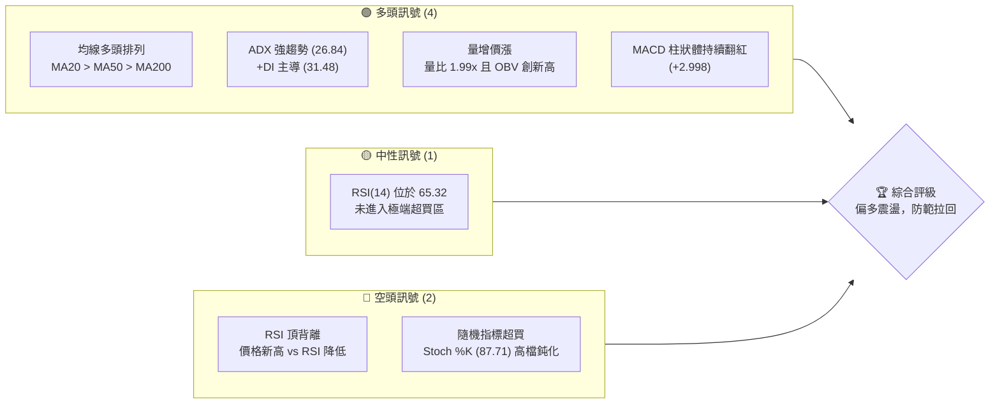
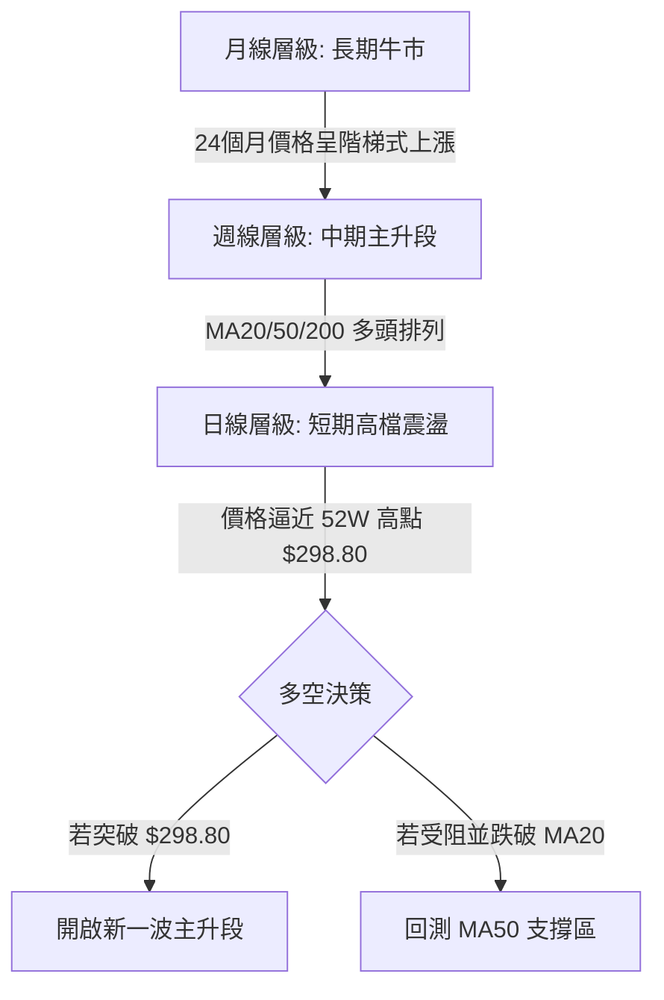
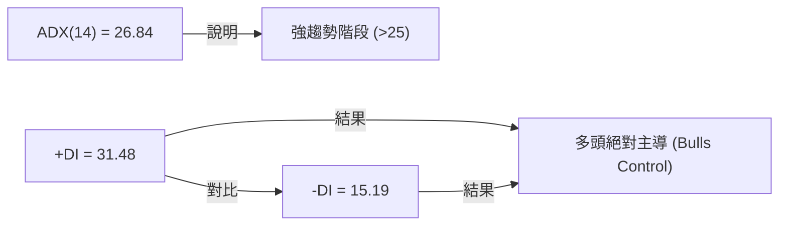
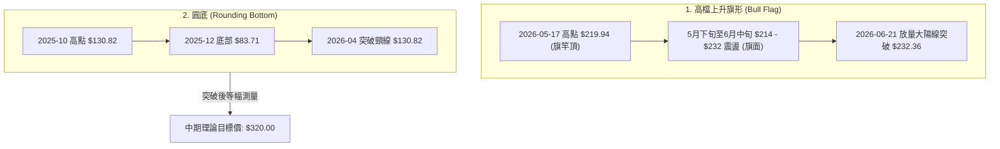
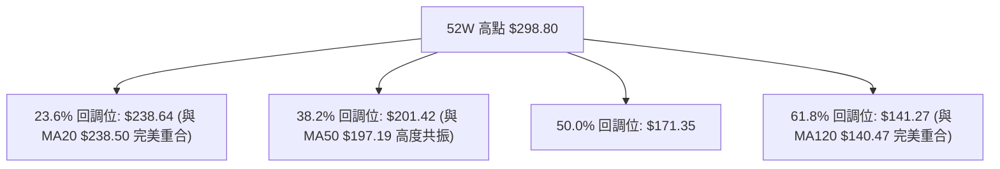
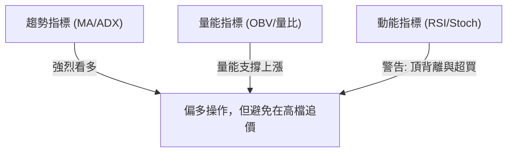
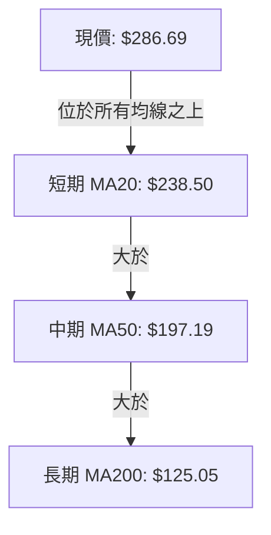
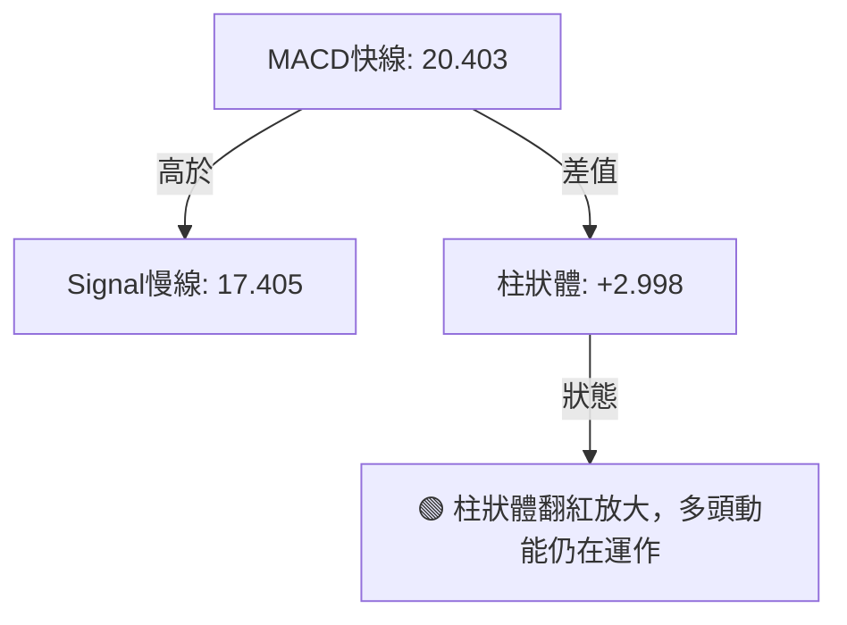
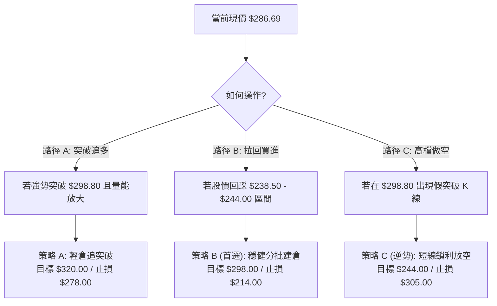
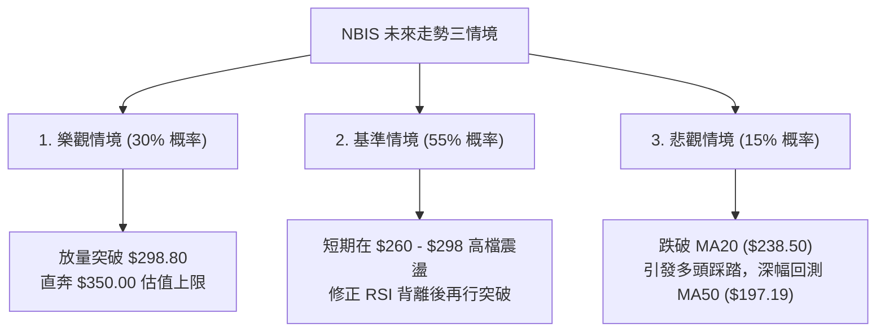

<details>
<summary>📊 靜態圖表 (點擊展開)</summary>

</details>

<html>
<head><meta charset="utf-8" /></head>
<body>
    <div style="height:500px; width:100%;">                        <script>window.PlotlyConfig = {MathJaxConfig: 'local'};</script>
        <script charset="utf-8" src="https://cdn.plot.ly/plotly-3.6.0.min.js" integrity="sha256-QaOVwtVY0T02VaHrr6pnoHLCwayMJp4O5n4YyaE3rJk=" crossorigin="anonymous"></script>                <div id="candlestick-chart" class="plotly-graph-div" style="height:100%; width:100%;"></div>            <script>                window.PLOTLYENV=window.PLOTLYENV || {};                                if (document.getElementById("candlestick-chart")) {                    Plotly.newPlot(                        "candlestick-chart",                        [{"close":{"dtype":"f8","bdata":"AAAAoJlpUEAAAACAPTpQQAAAAIAUXlBAAAAAANcDUEAAAACAFO5XQAAAAMD1WFdAAAAAAClMVkAAAACAPZpWQAAAAKBwvVZAAAAAIIVbVkAAAADAHoVXQAAAACCuh1dAAAAAANfTWEAAAABgZqZaQAAAAEAz81pAAAAAYLhOXEAAAAAAKfxaQAAAAMDM7FpAAAAAgBSOW0AAAACgRxFcQAAAAEAK51xAAAAAIK53X0AAAABguP5fQAAAAAApPF9AAAAAwMxsXUAAAAAAAIBeQAAAAOB6lGBAAAAAYI8yYEAAAABguO5gQAAAAMDMBGBAAAAAwB51X0AAAABgj8JeQAAAAAApXFxAAAAAAABAW0AAAACA6xFaQAAAACCup1hAAAAAgD2KWkAAAADgo1BdQAAAACCFW19AAAAAwB51XkAAAABgZkZfQAAAACCFC19AAAAAgD1aYEAAAACAFB5eQAAAAGCPoltAAAAAAABAXUAAAAAAKVxbQAAAAIDr0VtAAAAAwMx8W0AAAACAFI5ZQAAAAEAKl1dAAAAA4FEoVkAAAABgj+JUQAAAAGC4flVAAAAAYI+iVkAAAADgesRXQAAAAMD1KFVAAAAA4KPQVEAAAACgmflWQAAAAOBROFZAAAAAACmsV0AAAAAgrrdXQAAAAKCZCVlAAAAAwMwcWEAAAABA4bpYQAAAAEAzs1lAAAAAYI+CWEAAAADAHhVZQAAAAIA9GlhAAAAAgMJlV0AAAACA65FXQAAAAAAp7FVAAAAAwPVIVEAAAADAzDxUQAAAAMDM3FJAAAAAgMKFU0AAAACgcF1WQAAAAGC4TldAAAAAgOuBVkAAAADgUchWQAAAAIDC5VVAAAAAYI+CVUAAAABA4UpVQAAAAMAe7VRAAAAAwMx8VkAAAADAHjVXQAAAACBcD1lAAAAAoHANWEAAAABAM1NYQAAAACCFe1hAAAAAwB7VWkAAAAAghVtaQAAAAGC4fllAAAAA4KP4WUAAAABguC5bQAAAAGCP0lhAAAAAIK63WEAAAABgZjZYQAAAAAAAoFdAAAAAoHDdVkAAAAAgrndYQAAAACCFG1lAAAAAgD26V0AAAAAAKUxVQAAAAIA9ClZAAAAAwMx8VkAAAADA9ZhUQAAAACCud1JAAAAAYGaGVUAAAADgUThXQAAAAGCP8lZAAAAAQAonVkAAAABguG5WQAAAAOCjgFhAAAAAoEdhWEAAAABAM3NZQAAAAEAK51pAAAAAQOF6WEAAAABACidZQAAAAMAepVlAAAAAIK6HWkAAAADgUThaQAAAAAApzFZAAAAA4KPAVkAAAABAM7NVQAAAAIDrcVhAAAAAoJnpV0AAAADAHlVWQAAAAAApvFdAAAAAIIUbWEAAAAAgrv9bQAAAAGCPAltAAAAAwMw8XEAAAABAMztgQAAAAMAeFV1AAAAAANejXUAAAACgR2FeQAAAACCuZ11AAAAAoJmJXEAAAACAPbpcQAAAAIDCxVxAAAAAgBR+WkAAAADgejRZQAAAAOCjEFdAAAAA4KPwWUAAAADAzHxZQAAAAOB6NFtAAAAAYI8iXEAAAACgmVldQAAAAAAAQF9AAAAAYI8KYUAAAABACh9iQAAAAIDrUWNAAAAAgBQ+ZEAAAADgo9hkQAAAAEDhqmRAAAAA4HqkY0AAAADAHuVjQAAAAKCZkWNAAAAA4HqEY0AAAABgj6JjQAAAAMAeZWJAAAAAYLgeYkAAAADgUfBgQAAAAIAUpmFAAAAAIFxHYUAAAAAgrk9jQAAAAKBwDWZAAAAAoHD9ZUAAAABA4WJoQAAAAOCjGGdAAAAAoJkhZkAAAABAM0NnQAAAACCFY2ZAAAAA4KPoaUAAAADAzKRrQAAAAIAUfmtAAAAAIIX7aEAAAAAgXLdoQAAAAIA9+mdAAAAAgMJ9a0AAAADgo9hqQAAAAIDrAWpAAAAAANcLakAAAABA4UpsQAAAAEDh4mxAAAAAACmIcEAAAACgR0lwQAAAAIDCdW9AAAAAYLg6cEAAAACA63lsQAAAAAAAQGtAAAAAANeDa0AAAACAFHZqQAAAACCux2tAAAAAIIULbUAAAADAHkFwQAAAAKCZkXBAAAAAYI+OcUAAAABACutxQA=="},"high":{"dtype":"f8","bdata":"AAAAAADAUEAAAAAAAKBQQAAAAMD12FBAAAAAwPWoUEAAAAAghatYQAAAAOCjIFlAAAAAIK53V0AAAAAAAABXQAAAAEDhmldAAAAAQDPTVkAAAAAAAMBXQAAAACCFa1hAAAAAQDPjWEAAAADAHiVbQAAAAGC4fltAAAAAYGa2XEAAAADAHoVcQAAAACBcf1tAAAAAoEchXEAAAACgmWldQAAAAOBR+FxAAAAAIFyvX0AAAAAAVJ9gQAAAAOBR+GBAAAAAwPUIYEAAAAAA11NfQAAAAIA9qmBAAAAAQDOjYUAAAADA9VBhQAAAAIAWuWBAAAAAIK5\u002fYEAAAABACl9gQAAAAACsJF5AAAAAgBReXUAAAAAghQtbQAAAAEAz81pAAAAAIK6nWkAAAADAzFxdQAAAAAAAoF9AAAAAwPUgYEAAAADAzHxfQAAAAIAUDmBAAAAAwMyEYEAAAACAwt1gQAAAAIDrMV1AAAAAoHCNXUAAAAAAAEBeQAAAAEAz01tAAAAAIK6XXUAAAAAA16NcQAAAAKCZaVpAAAAAYLjeVkAAAAAAAEBWQAAAAKCZaVZAAAAAAClsV0AAAACAFC5YQAAAAAAprFlAAAAAIFwvVkAAAAAAAEBXQAAAAIDr0VZAAAAAgJPoV0AAAADAHkVYQAAAAGBmZllAAAAAwMy8WUAAAAAA18NYQAAAAIDC9VlAAAAAYGZWWUAAAAAAACBZQAAAACCDOFlAAAAAgMJFWEAAAADAzNxXQAAAAKCZ6VdAAAAAIFwPVkAAAAAA12NUQAAAAEAzE1VAAAAAYGYWVEAAAABgj6JWQAAAAKCZ+VdAAAAAgBQ+V0AAAABA4dpWQAAAACCu51ZAAAAAQAonVkAAAACgcL1VQAAAAIAUnlVAAAAA4KOwVkAAAAAAKdxXQAAAACCFK1lAAAAAYGaWWUAAAABgj6JZQAAAAIAUPlpAAAAAIIUrW0AAAADAzPxaQAAAAMDMrFpAAAAA4FEIW0AAAAAAAKBbQAAAAIAUHlpAAAAAoJmZWUAAAABguP5ZQAAAAOCjuFhAAAAA4FE4WUAAAABgj+JYQAAAAGBmdllAAAAAAADQWEAAAABgjwJXQAAAAAAAUFZAAAAAwPXYVkAAAABgj+pVQAAAAOB6NFRAAAAAgD2qVUAAAAAghWtXQAAAAABU41dAAAAAAACwV0AAAADgo7BWQAAAAOB6FFlAAAAAYI\u002fSWEAAAACgmRlaQAAAAGC4\u002flpAAAAA4HoUW0AAAACgbkpZQAAAAAAA8FlAAAAAACncWkAAAADgehRbQAAAAEAz01hAAAAAoMTYVkAAAAAgrndWQAAAAGC4nlhAAAAAAADQWEAAAADAzLxXQAAAAMDMzFdAAAAAoJmZWEAAAADAHoVcQAAAAGCPwltAAAAA4HokXUAAAACgmYlgQAAAAAAAYF5AAAAAQImxXkAAAABAM3NeQAAAAABW7l5AAAAAANdTXkAAAABAM3NdQAAAAEAzs11AAAAAQDNTXEAAAADgo5BaQAAAACBcj1lAAAAAwPX4WUAAAAAgrvdaQAAAAKBwPVtAAAAAgMJ1XEAAAACgmXldQAAAAAAA8F9AAAAAoJkRYUAAAACAPbpiQAAAAAAA8GNAAAAAQDPDZEAAAACA69lkQAAAAGC4FmVAAAAAgOuBZEAAAAAAADhkQAAAAAAAaGRAAAAAgMLtZEAAAACA67lkQAAAAAAAqGRAAAAAoJmZYkAAAABguK5hQAAAAGBm9mFAAAAAIFxfYkAAAAAAAIBjQAAAAMDMbGZAAAAAYLh+ZkAAAAAgrn9oQAAAAOB6vGhAAAAAAACIZ0AAAACAl45oQAAAACCFM2dAAAAAQOEqa0AAAAAgXDdtQAAAAKBHmWxAAAAAgD1Ca0AAAACA61lpQAAAAAAAiGlAAAAAgOtZbEAAAACgcL1rQAAAAOBRoGtAAAAA4Ho0akAAAADgehxtQAAAAEAzM21AAAAAoMQscUAAAACgcG1xQAAAACBct3BAAAAAIIWHcEAAAAAAAFhvQAAAAMDMDG5AAAAAwPW0bUAAAAAgrt9sQAAAACCuj2xAAAAAQOFybkAAAADgUW5wQAAAACCFVXFAAAAAQOGeckAAAADAzKxyQA=="},"hovertemplate":"\u003cb\u003e%{x|%Y-%m-%d}\u003c\u002fb\u003e\u003cbr\u003e\u958b: $%{open:.2f}\u003cbr\u003e\u9ad8: $%{high:.2f}\u003cbr\u003e\u4f4e: $%{low:.2f}\u003cbr\u003e\u6536: $%{close:.2f}\u003cextra\u003e\u003c\u002fextra\u003e","low":{"dtype":"f8","bdata":"AAAAIC81UEAAAACAPRpQQAAAAKBHoU9AAAAAYGbmT0AAAAAgrodVQAAAAAAAwFZAAAAAYI8aVkAAAACA67FVQAAAAIDCNVZAAAAAoEcBVkAAAADAHjVWQAAAAIDrAVdAAAAAAABQV0AAAACgR6FYQAAAAAAAEFpAAAAAYGY2WkAAAADgUXhaQAAAAEAzs1lAAAAAwB4VW0AAAACAPepbQAAAAOCjcFtAAAAA4HqkXUAAAABgZuZeQAAAACCFO19AAAAAgBTuXEAAAAAAAGBdQAAAACCu911AAAAA4FEAYEAAAADAzJRgQAAAAAAAcF9AAAAAwMyMXkAAAACgR4FeQAAAAOBRuFtAAAAA4KPgWkAAAACgmVlZQAAAAOBRqFdAAAAAoHDdWEAAAADgo4BbQAAAAEAKB15AAAAAgOsxXkAAAAAAAGBdQAAAAOCjcF1AAAAAQDOTX0AAAAAAAPBdQAAAAAAAQFtAAAAAIIXbW0AAAACAPRpbQAAAAOCjUFlAAAAAgBQuW0AAAADAHvVYQAAAAKBw7VZAAAAAAAAgVUAAAAAAAIBUQAAAAIDC5VRAAAAAoHBtVEAAAABAM\u002fNWQAAAAKBwDVVAAAAAoHCNU0AAAACgmUlVQAAAAOAkLlVAAAAA4KOwVkAAAAAAKVxXQAAAAOCjQFZAAAAAANcDWEAAAAAAAMBWQAAAAIAUXlhAAAAAwMwMWEAAAABAM9NXQAAAAGBmBlhAAAAAwMwMV0AAAADAzKxVQAAAAMDMjFVAAAAAoBgEVEAAAADgUThTQAAAAAAA0FJAAAAA4KNAU0AAAACAPQpUQAAAAGBmxlZAAAAAANcTVkAAAACgmSlWQAAAACBcr1VAAAAAYI8SVUAAAAAA1yNVQAAAAKCZuVRAAAAA4KOAVUAAAADA9bhWQAAAAAApvFZAAAAAANfjV0AAAAAgWAFYQAAAAGBmRlhAAAAAQDMjWEAAAABA4fpZQAAAACCD2FhAAAAAYGZGWUAAAACgcC1ZQAAAAIDClVhAAAAAYGZGV0AAAAAAACBYQAAAAIDrYVdAAAAAQArXVkAAAACA62FXQAAAAAApHFhAAAAAgD3KVkAAAAAgrgdVQAAAAIAUDlVAAAAAAAAwVUAAAAAAKZxTQAAAAKBHYVJAAAAAIK5HU0AAAAAA1\u002fNUQAAAAIA96lZAAAAAwPXIVUAAAAAAKexTQAAAAEAKN1ZAAAAAAABgV0AAAAAg2TZYQAAAACCFG1lAAAAAgOtBWEAAAABAM9NXQAAAAEDfb1hAAAAAQDOzWUAAAAAAAIBZQAAAAKCZGVZAAAAAQDOzVUAAAACA6+FUQAAAAKCZiVZAAAAAIK7nVkAAAABAMzNWQAAAAAAAoFVAAAAAAADAV0AAAAAgXB9aQAAAAKBHoVpAAAAAwPWIW0AAAABgEhtfQAAAAEAKR1xAAAAAAACAXEAAAACgR7FcQAAAAICTKFxAAAAAQDNjXEAAAADgowBcQAAAAMAeVVxAAAAAgD1aWkAAAACgRxFZQAAAAMDKaVZAAAAAYLjuV0AAAABgZlZZQAAAAAApDFhAAAAAwMzcWkAAAACA65FbQAAAAGBm1l1AAAAAQDMjX0AAAADgUdxgQAAAAKCZyWFAAAAA4KPQY0AAAAAAAJBjQAAAAEDhAmRAAAAAIFxXY0AAAACgR0FjQAAAAMDMbGNAAAAAQDNrY0AAAACAPUJjQAAAAIDrOWJAAAAAgOtRYUAAAABgZpZgQAAAAEAKx2BAAAAAAADgYEAAAAAAAIBhQAAAAGBm9mNAAAAAYLgWZUAAAAAgheNlQAAAAAAAIGZAAAAAAAAQZkAAAACgmVFmQAAAAAAAiGVAAAAAAABgaEAAAAAAAPhpQAAAAKCZeWpAAAAAYI\u002fCZ0AAAAAAAOBmQAAAAOB61GdAAAAAoJkZakAAAAAgXFdqQAAAAMAetWlAAAAAgOvJaEAAAADgUWBrQAAAAMDMTGpAAAAAAADAbUAAAAAAADxwQAAAAOBR8G5AAAAAgBRWbUAAAACAFBZrQAAAAGBmNmtAAAAAoJkJaUAAAAAA12tqQAAAAAAAoGlAAAAAAADwa0AAAAAgrqduQAAAAMDMrG9AAAAA4KOEcEAAAABAMzlxQA=="},"name":"\u50f9\u683c","open":{"dtype":"f8","bdata":"AAAA4FG4UEAAAADgelxQQAAAAAAAoFBAAAAAQOEqUEAAAADAzExYQAAAAMD16FZAAAAAQOEqV0AAAAAAKcxWQAAAAEAKJ1dAAAAAwMzMVkAAAABA4epWQAAAAMDMxFdAAAAAwPWIV0AAAADAzHxZQAAAAGCPAltAAAAA4KNIW0AAAAAghQNbQAAAACCFe1tAAAAA4FFYW0AAAADgelxcQAAAAIDC7VtAAAAAoEfxXkAAAABACs9fQAAAAMDMjGBAAAAAwMz0X0AAAADAzExeQAAAAGC4Pl5AAAAAYGbeYEAAAABguOZgQAAAAAAAgGBAAAAAwMx8YEAAAABA4QJgQAAAAADXg11AAAAAYI8yXUAAAADgUfhaQAAAAEAzq1pAAAAAwB4VWUAAAACAPcpbQAAAAIA9Ol5AAAAAANebX0AAAACA6xFfQAAAAMDMTF5AAAAAwPWoX0AAAAAAAMBgQAAAAGC4FlxAAAAAwPVoXEAAAABAM+NdQAAAAAAAIFpAAAAAIIXLXEAAAADgUYhcQAAAAMDMDFpAAAAAwPW4VkAAAABACpdUQAAAAOB69FRAAAAAgOvxVEAAAADgUUBXQAAAACCF21hAAAAAQDNjVUAAAABguI5VQAAAAGCPUlZAAAAAYGZ2V0AAAABAMyNYQAAAAMDM3FZAAAAAQAoXWUAAAACgR8FXQAAAAOB6xFhAAAAAgMIVWUAAAABgj1JYQAAAAIDChVhAAAAAYLjuV0AAAADAzExWQAAAAADXU1dAAAAAYGYGVkAAAADAzORTQAAAAIDCBVVAAAAAQDPDU0AAAACgmSlUQAAAAIAUPldAAAAAANeTVkAAAABguI5WQAAAAOCj4FZAAAAAwMwcVUAAAAAAAJhVQAAAACCuV1VAAAAAQAq\u002fVUAAAAAAAMBXQAAAAIDC7VdAAAAA4KPAWEAAAABgjzJYQAAAAKBHuVhAAAAA4HqUWEAAAADAHtVaQAAAAIDrcVpAAAAAIIUjWkAAAAAgrn9aQAAAAMAedVlAAAAAgMJFWUAAAADgo4BZQAAAAMDMLFhAAAAAoHBtWEAAAABgZpZXQAAAAAAAAFlAAAAAQAqXWEAAAACgQ+NWQAAAAADXc1VAAAAAIIV7VkAAAAAAAMBVQAAAAMD1yFNAAAAAYGbOU0AAAADAzBxVQAAAAGCPOldAAAAAYI86V0AAAABgZgZVQAAAAEAKd1ZAAAAAAAAAWEAAAABguO5YQAAAACCFG1lAAAAAANOlWkAAAAAghRNYQAAAACBc11hAAAAAIFw\u002fWkAAAAAAAIBaQAAAAMDMrFhAAAAAAAAAVkAAAACgmYlVQAAAAKCZmVZAAAAAAAAwWEAAAABAMxNXQAAAAEAK11VAAAAAwPXIV0AAAACAPUpaQAAAAIDCRVtAAAAAACmcW0AAAAAAADBfQAAAAIDCFV5AAAAAQDOzXEAAAADgUdBcQAAAAGBmHl5AAAAAoHAtXUAAAABAMwtdQAAAACCuN11AAAAA4FFQXEAAAADAHnVaQAAAACBcj1lAAAAAYLh+WEAAAADgenxaQAAAAIA9GlhAAAAAgD0qW0AAAAAAAKhbQAAAAOBRuF9AAAAAAABAX0AAAADgUdxgQAAAAGBm1mFAAAAAQDMjZEAAAABgOwdkQAAAAAAA4GRAAAAAwPV4ZEAAAAAAAKBjQAAAAEAKJ2RAAAAAIIVbZEAAAADAzHxjQAAAAKBwdWRAAAAA4HqMYkAAAADAzExhQAAAAEAKg2FAAAAAgOslYkAAAABgj6phQAAAAOBRDGRAAAAAwMx0ZUAAAABACnNmQAAAAOBRwGdAAAAAYGb2ZkAAAADAzHxmQAAAAKBwjWZAAAAAQAp7aUAAAAAAAKxqQAAAACCFM2tAAAAAQAova0AAAAAAAOBnQAAAAEAKf2lAAAAAIK53akAAAADgUWhrQAAAAKCZlWtAAAAAwB75aUAAAAAAKcxsQAAAACCFe2xAAAAAQOGCbkAAAACgmQFxQAAAAKBwQ3BAAAAAIK73bUAAAAAghdtuQAAAAMDMDG5AAAAAAADAbEAAAACgxu9qQAAAAOB6rGlAAAAAwMxUbUAAAABguH5vQAAAAEAK729AAAAAYGaacEAAAABAM6NyQA=="},"x":["2025-09-03T00:00:00-04:00","2025-09-04T00:00:00-04:00","2025-09-05T00:00:00-04:00","2025-09-08T00:00:00-04:00","2025-09-09T00:00:00-04:00","2025-09-10T00:00:00-04:00","2025-09-11T00:00:00-04:00","2025-09-12T00:00:00-04:00","2025-09-15T00:00:00-04:00","2025-09-16T00:00:00-04:00","2025-09-17T00:00:00-04:00","2025-09-18T00:00:00-04:00","2025-09-19T00:00:00-04:00","2025-09-22T00:00:00-04:00","2025-09-23T00:00:00-04:00","2025-09-24T00:00:00-04:00","2025-09-25T00:00:00-04:00","2025-09-26T00:00:00-04:00","2025-09-29T00:00:00-04:00","2025-09-30T00:00:00-04:00","2025-10-01T00:00:00-04:00","2025-10-02T00:00:00-04:00","2025-10-03T00:00:00-04:00","2025-10-06T00:00:00-04:00","2025-10-07T00:00:00-04:00","2025-10-08T00:00:00-04:00","2025-10-09T00:00:00-04:00","2025-10-10T00:00:00-04:00","2025-10-13T00:00:00-04:00","2025-10-14T00:00:00-04:00","2025-10-15T00:00:00-04:00","2025-10-16T00:00:00-04:00","2025-10-17T00:00:00-04:00","2025-10-20T00:00:00-04:00","2025-10-21T00:00:00-04:00","2025-10-22T00:00:00-04:00","2025-10-23T00:00:00-04:00","2025-10-24T00:00:00-04:00","2025-10-27T00:00:00-04:00","2025-10-28T00:00:00-04:00","2025-10-29T00:00:00-04:00","2025-10-30T00:00:00-04:00","2025-10-31T00:00:00-04:00","2025-11-03T00:00:00-05:00","2025-11-04T00:00:00-05:00","2025-11-05T00:00:00-05:00","2025-11-06T00:00:00-05:00","2025-11-07T00:00:00-05:00","2025-11-10T00:00:00-05:00","2025-11-11T00:00:00-05:00","2025-11-12T00:00:00-05:00","2025-11-13T00:00:00-05:00","2025-11-14T00:00:00-05:00","2025-11-17T00:00:00-05:00","2025-11-18T00:00:00-05:00","2025-11-19T00:00:00-05:00","2025-11-20T00:00:00-05:00","2025-11-21T00:00:00-05:00","2025-11-24T00:00:00-05:00","2025-11-25T00:00:00-05:00","2025-11-26T00:00:00-05:00","2025-11-28T00:00:00-05:00","2025-12-01T00:00:00-05:00","2025-12-02T00:00:00-05:00","2025-12-03T00:00:00-05:00","2025-12-04T00:00:00-05:00","2025-12-05T00:00:00-05:00","2025-12-08T00:00:00-05:00","2025-12-09T00:00:00-05:00","2025-12-10T00:00:00-05:00","2025-12-11T00:00:00-05:00","2025-12-12T00:00:00-05:00","2025-12-15T00:00:00-05:00","2025-12-16T00:00:00-05:00","2025-12-17T00:00:00-05:00","2025-12-18T00:00:00-05:00","2025-12-19T00:00:00-05:00","2025-12-22T00:00:00-05:00","2025-12-23T00:00:00-05:00","2025-12-24T00:00:00-05:00","2025-12-26T00:00:00-05:00","2025-12-29T00:00:00-05:00","2025-12-30T00:00:00-05:00","2025-12-31T00:00:00-05:00","2026-01-02T00:00:00-05:00","2026-01-05T00:00:00-05:00","2026-01-06T00:00:00-05:00","2026-01-07T00:00:00-05:00","2026-01-08T00:00:00-05:00","2026-01-09T00:00:00-05:00","2026-01-12T00:00:00-05:00","2026-01-13T00:00:00-05:00","2026-01-14T00:00:00-05:00","2026-01-15T00:00:00-05:00","2026-01-16T00:00:00-05:00","2026-01-20T00:00:00-05:00","2026-01-21T00:00:00-05:00","2026-01-22T00:00:00-05:00","2026-01-23T00:00:00-05:00","2026-01-26T00:00:00-05:00","2026-01-27T00:00:00-05:00","2026-01-28T00:00:00-05:00","2026-01-29T00:00:00-05:00","2026-01-30T00:00:00-05:00","2026-02-02T00:00:00-05:00","2026-02-03T00:00:00-05:00","2026-02-04T00:00:00-05:00","2026-02-05T00:00:00-05:00","2026-02-06T00:00:00-05:00","2026-02-09T00:00:00-05:00","2026-02-10T00:00:00-05:00","2026-02-11T00:00:00-05:00","2026-02-12T00:00:00-05:00","2026-02-13T00:00:00-05:00","2026-02-17T00:00:00-05:00","2026-02-18T00:00:00-05:00","2026-02-19T00:00:00-05:00","2026-02-20T00:00:00-05:00","2026-02-23T00:00:00-05:00","2026-02-24T00:00:00-05:00","2026-02-25T00:00:00-05:00","2026-02-26T00:00:00-05:00","2026-02-27T00:00:00-05:00","2026-03-02T00:00:00-05:00","2026-03-03T00:00:00-05:00","2026-03-04T00:00:00-05:00","2026-03-05T00:00:00-05:00","2026-03-06T00:00:00-05:00","2026-03-09T00:00:00-04:00","2026-03-10T00:00:00-04:00","2026-03-11T00:00:00-04:00","2026-03-12T00:00:00-04:00","2026-03-13T00:00:00-04:00","2026-03-16T00:00:00-04:00","2026-03-17T00:00:00-04:00","2026-03-18T00:00:00-04:00","2026-03-19T00:00:00-04:00","2026-03-20T00:00:00-04:00","2026-03-23T00:00:00-04:00","2026-03-24T00:00:00-04:00","2026-03-25T00:00:00-04:00","2026-03-26T00:00:00-04:00","2026-03-27T00:00:00-04:00","2026-03-30T00:00:00-04:00","2026-03-31T00:00:00-04:00","2026-04-01T00:00:00-04:00","2026-04-02T00:00:00-04:00","2026-04-06T00:00:00-04:00","2026-04-07T00:00:00-04:00","2026-04-08T00:00:00-04:00","2026-04-09T00:00:00-04:00","2026-04-10T00:00:00-04:00","2026-04-13T00:00:00-04:00","2026-04-14T00:00:00-04:00","2026-04-15T00:00:00-04:00","2026-04-16T00:00:00-04:00","2026-04-17T00:00:00-04:00","2026-04-20T00:00:00-04:00","2026-04-21T00:00:00-04:00","2026-04-22T00:00:00-04:00","2026-04-23T00:00:00-04:00","2026-04-24T00:00:00-04:00","2026-04-27T00:00:00-04:00","2026-04-28T00:00:00-04:00","2026-04-29T00:00:00-04:00","2026-04-30T00:00:00-04:00","2026-05-01T00:00:00-04:00","2026-05-04T00:00:00-04:00","2026-05-05T00:00:00-04:00","2026-05-06T00:00:00-04:00","2026-05-07T00:00:00-04:00","2026-05-08T00:00:00-04:00","2026-05-11T00:00:00-04:00","2026-05-12T00:00:00-04:00","2026-05-13T00:00:00-04:00","2026-05-14T00:00:00-04:00","2026-05-15T00:00:00-04:00","2026-05-18T00:00:00-04:00","2026-05-19T00:00:00-04:00","2026-05-20T00:00:00-04:00","2026-05-21T00:00:00-04:00","2026-05-22T00:00:00-04:00","2026-05-26T00:00:00-04:00","2026-05-27T00:00:00-04:00","2026-05-28T00:00:00-04:00","2026-05-29T00:00:00-04:00","2026-06-01T00:00:00-04:00","2026-06-02T00:00:00-04:00","2026-06-03T00:00:00-04:00","2026-06-04T00:00:00-04:00","2026-06-05T00:00:00-04:00","2026-06-08T00:00:00-04:00","2026-06-09T00:00:00-04:00","2026-06-10T00:00:00-04:00","2026-06-11T00:00:00-04:00","2026-06-12T00:00:00-04:00","2026-06-15T00:00:00-04:00","2026-06-16T00:00:00-04:00","2026-06-17T00:00:00-04:00","2026-06-18T00:00:00-04:00"],"type":"candlestick"},{"hovertemplate":"MA30: $%{y:.2f}\u003cextra\u003e\u003c\u002fextra\u003e","line":{"color":"#2196F3","dash":"dash","width":2},"mode":"lines","name":"MA30","x":["2025-09-03T00:00:00-04:00","2025-09-04T00:00:00-04:00","2025-09-05T00:00:00-04:00","2025-09-08T00:00:00-04:00","2025-09-09T00:00:00-04:00","2025-09-10T00:00:00-04:00","2025-09-11T00:00:00-04:00","2025-09-12T00:00:00-04:00","2025-09-15T00:00:00-04:00","2025-09-16T00:00:00-04:00","2025-09-17T00:00:00-04:00","2025-09-18T00:00:00-04:00","2025-09-19T00:00:00-04:00","2025-09-22T00:00:00-04:00","2025-09-23T00:00:00-04:00","2025-09-24T00:00:00-04:00","2025-09-25T00:00:00-04:00","2025-09-26T00:00:00-04:00","2025-09-29T00:00:00-04:00","2025-09-30T00:00:00-04:00","2025-10-01T00:00:00-04:00","2025-10-02T00:00:00-04:00","2025-10-03T00:00:00-04:00","2025-10-06T00:00:00-04:00","2025-10-07T00:00:00-04:00","2025-10-08T00:00:00-04:00","2025-10-09T00:00:00-04:00","2025-10-10T00:00:00-04:00","2025-10-13T00:00:00-04:00","2025-10-14T00:00:00-04:00","2025-10-15T00:00:00-04:00","2025-10-16T00:00:00-04:00","2025-10-17T00:00:00-04:00","2025-10-20T00:00:00-04:00","2025-10-21T00:00:00-04:00","2025-10-22T00:00:00-04:00","2025-10-23T00:00:00-04:00","2025-10-24T00:00:00-04:00","2025-10-27T00:00:00-04:00","2025-10-28T00:00:00-04:00","2025-10-29T00:00:00-04:00","2025-10-30T00:00:00-04:00","2025-10-31T00:00:00-04:00","2025-11-03T00:00:00-05:00","2025-11-04T00:00:00-05:00","2025-11-05T00:00:00-05:00","2025-11-06T00:00:00-05:00","2025-11-07T00:00:00-05:00","2025-11-10T00:00:00-05:00","2025-11-11T00:00:00-05:00","2025-11-12T00:00:00-05:00","2025-11-13T00:00:00-05:00","2025-11-14T00:00:00-05:00","2025-11-17T00:00:00-05:00","2025-11-18T00:00:00-05:00","2025-11-19T00:00:00-05:00","2025-11-20T00:00:00-05:00","2025-11-21T00:00:00-05:00","2025-11-24T00:00:00-05:00","2025-11-25T00:00:00-05:00","2025-11-26T00:00:00-05:00","2025-11-28T00:00:00-05:00","2025-12-01T00:00:00-05:00","2025-12-02T00:00:00-05:00","2025-12-03T00:00:00-05:00","2025-12-04T00:00:00-05:00","2025-12-05T00:00:00-05:00","2025-12-08T00:00:00-05:00","2025-12-09T00:00:00-05:00","2025-12-10T00:00:00-05:00","2025-12-11T00:00:00-05:00","2025-12-12T00:00:00-05:00","2025-12-15T00:00:00-05:00","2025-12-16T00:00:00-05:00","2025-12-17T00:00:00-05:00","2025-12-18T00:00:00-05:00","2025-12-19T00:00:00-05:00","2025-12-22T00:00:00-05:00","2025-12-23T00:00:00-05:00","2025-12-24T00:00:00-05:00","2025-12-26T00:00:00-05:00","2025-12-29T00:00:00-05:00","2025-12-30T00:00:00-05:00","2025-12-31T00:00:00-05:00","2026-01-02T00:00:00-05:00","2026-01-05T00:00:00-05:00","2026-01-06T00:00:00-05:00","2026-01-07T00:00:00-05:00","2026-01-08T00:00:00-05:00","2026-01-09T00:00:00-05:00","2026-01-12T00:00:00-05:00","2026-01-13T00:00:00-05:00","2026-01-14T00:00:00-05:00","2026-01-15T00:00:00-05:00","2026-01-16T00:00:00-05:00","2026-01-20T00:00:00-05:00","2026-01-21T00:00:00-05:00","2026-01-22T00:00:00-05:00","2026-01-23T00:00:00-05:00","2026-01-26T00:00:00-05:00","2026-01-27T00:00:00-05:00","2026-01-28T00:00:00-05:00","2026-01-29T00:00:00-05:00","2026-01-30T00:00:00-05:00","2026-02-02T00:00:00-05:00","2026-02-03T00:00:00-05:00","2026-02-04T00:00:00-05:00","2026-02-05T00:00:00-05:00","2026-02-06T00:00:00-05:00","2026-02-09T00:00:00-05:00","2026-02-10T00:00:00-05:00","2026-02-11T00:00:00-05:00","2026-02-12T00:00:00-05:00","2026-02-13T00:00:00-05:00","2026-02-17T00:00:00-05:00","2026-02-18T00:00:00-05:00","2026-02-19T00:00:00-05:00","2026-02-20T00:00:00-05:00","2026-02-23T00:00:00-05:00","2026-02-24T00:00:00-05:00","2026-02-25T00:00:00-05:00","2026-02-26T00:00:00-05:00","2026-02-27T00:00:00-05:00","2026-03-02T00:00:00-05:00","2026-03-03T00:00:00-05:00","2026-03-04T00:00:00-05:00","2026-03-05T00:00:00-05:00","2026-03-06T00:00:00-05:00","2026-03-09T00:00:00-04:00","2026-03-10T00:00:00-04:00","2026-03-11T00:00:00-04:00","2026-03-12T00:00:00-04:00","2026-03-13T00:00:00-04:00","2026-03-16T00:00:00-04:00","2026-03-17T00:00:00-04:00","2026-03-18T00:00:00-04:00","2026-03-19T00:00:00-04:00","2026-03-20T00:00:00-04:00","2026-03-23T00:00:00-04:00","2026-03-24T00:00:00-04:00","2026-03-25T00:00:00-04:00","2026-03-26T00:00:00-04:00","2026-03-27T00:00:00-04:00","2026-03-30T00:00:00-04:00","2026-03-31T00:00:00-04:00","2026-04-01T00:00:00-04:00","2026-04-02T00:00:00-04:00","2026-04-06T00:00:00-04:00","2026-04-07T00:00:00-04:00","2026-04-08T00:00:00-04:00","2026-04-09T00:00:00-04:00","2026-04-10T00:00:00-04:00","2026-04-13T00:00:00-04:00","2026-04-14T00:00:00-04:00","2026-04-15T00:00:00-04:00","2026-04-16T00:00:00-04:00","2026-04-17T00:00:00-04:00","2026-04-20T00:00:00-04:00","2026-04-21T00:00:00-04:00","2026-04-22T00:00:00-04:00","2026-04-23T00:00:00-04:00","2026-04-24T00:00:00-04:00","2026-04-27T00:00:00-04:00","2026-04-28T00:00:00-04:00","2026-04-29T00:00:00-04:00","2026-04-30T00:00:00-04:00","2026-05-01T00:00:00-04:00","2026-05-04T00:00:00-04:00","2026-05-05T00:00:00-04:00","2026-05-06T00:00:00-04:00","2026-05-07T00:00:00-04:00","2026-05-08T00:00:00-04:00","2026-05-11T00:00:00-04:00","2026-05-12T00:00:00-04:00","2026-05-13T00:00:00-04:00","2026-05-14T00:00:00-04:00","2026-05-15T00:00:00-04:00","2026-05-18T00:00:00-04:00","2026-05-19T00:00:00-04:00","2026-05-20T00:00:00-04:00","2026-05-21T00:00:00-04:00","2026-05-22T00:00:00-04:00","2026-05-26T00:00:00-04:00","2026-05-27T00:00:00-04:00","2026-05-28T00:00:00-04:00","2026-05-29T00:00:00-04:00","2026-06-01T00:00:00-04:00","2026-06-02T00:00:00-04:00","2026-06-03T00:00:00-04:00","2026-06-04T00:00:00-04:00","2026-06-05T00:00:00-04:00","2026-06-08T00:00:00-04:00","2026-06-09T00:00:00-04:00","2026-06-10T00:00:00-04:00","2026-06-11T00:00:00-04:00","2026-06-12T00:00:00-04:00","2026-06-15T00:00:00-04:00","2026-06-16T00:00:00-04:00","2026-06-17T00:00:00-04:00","2026-06-18T00:00:00-04:00"],"y":{"dtype":"f8","bdata":"AAAAAAAA+H8AAAAAAAD4fwAAAAAAAPh\u002fAAAAAAAA+H8AAAAAAAD4fwAAAAAAAPh\u002fAAAAAAAA+H8AAAAAAAD4fwAAAAAAAPh\u002fAAAAAAAA+H8AAAAAAAD4fwAAAAAAAPh\u002fAAAAAAAA+H8AAAAAAAD4fwAAAAAAAPh\u002fAAAAAAAA+H8AAAAAAAD4fwAAAAAAAPh\u002fAAAAAAAA+H8AAAAAAAD4fwAAAAAAAPh\u002fAAAAAAAA+H8AAAAAAAD4fwAAAAAAAPh\u002fAAAAAAAA+H8AAAAAAAD4fwAAAAAAAPh\u002fAAAAAAAA+H8AAAAAAAD4f1VVVUUZBVpAMzMzk3uFWkDe3d1NfgFbQCIiIlLUZ1tA3t3djbPHW0BERER09tlbQLy7u7se5VtA3t3dnVIJXEC8u7tLmkJcQDMzM4MjjFxAvLu7O0LRXECamZlJbxNdQN7d3Q2QU11AiYiIuMiWXUB3d3eXX7RdQO\u002fu7v43ul1Aq6qq6kLCXUDe3d0ddsVdQGZmZkYZzV1AERER0YXMXUDe3d0tFbddQImIiNi\u002fiV1AZmZm1k06XUC8u7urf9tcQBEREVFiiFxAZmZmVnFOXEB3d3f3\u002fRRcQBEREZGXrltAvLu7q8ZLW0CamZkZ2e5aQCIiInISm1pAq6qq2qNYWkB3d3dHixxaQKuqqioxAFpAERERMWvlWUCrqqrq+9lZQBEREcHm4llAZmZmJpTRWUDNzMwcdq1ZQDMzM1ONb1lAREREhE4zWUAAAACwjvFYQImIiEi2o1hAAAAAYLo5WEDv7u4ua+VXQM3MzFyPmldAAAAAUI1HV0ARERGR7RxXQM3MzNxr9lZAMzMz4+zLVkBERERERLRWQBEREfHSpVZAVVVVdUygVkB3d3enxqNWQDMzMzPsnlZAq6qq+qmdVkBERESk4phWQCIiIlIqulZA7+7uvsrVVkDe3d3dT+FWQAAAAGCe9FZAAAAAgJUPV0CrqqqqHCZXQHd3dxcEKldAiYiImOA5V0Crqqoqzk5XQM3MzDxRR1dAd3d3hxZJV0C8u7v7qUFXQN7d3d2WPVdAq6qqmgs5V0CamZk5tEBXQGZmZvbhW1dAiYiIOEJ5V0BERETUTYJXQAAAADBrnVdAREREVLi2V0Crqqoqo6dXQGZmZgZWfldAiYiIuPN1V0BERER0r3lXQHd3dzelgldAd3d3xyCIV0BmZmYm25FXQGZmZpZfsFdAERER0YXAV0AiIiKiqNNXQDMzM6Nh41dAZmZmhgfnV0CamZk5F+5XQO\u002fu7r4C+FdAzczM7G31V0DNzMyMQfRXQFVVVcU83VdA3t3dTcXBV0CamZmZ\u002fJJXQAAAAPDDj1dAMzMzY+WIV0B3d3d32nhXQERERMTKeVdAzczMDGWEV0Dv7u4uh6JXQCIiIkLDsldAAAAAgD\u002fZV0ARERHRhThYQERERGSedFhARERERKexWEBmZmZ2IQVZQLy7u8t2YllAZmZm1k2eWUCJiIgoTc1ZQAAAABAC\u002f1lAAAAA8AokWkDe3d2NsztaQJqZmUlvL1pAmpmZKb88WkBEREQUET1aQGZmZualP1pA7+7uXtZeWkAzMzPzp4JaQCIiIkJ8slpAIiIi8u7yWkDv7u5udUhbQGZmZualz1tAMzMzI\u002fdmXEC8u7trkRFdQAAAADCyoV1AzczM7N8kXkCrqqpq2LleQBEREbFHPV9AAAAAUKm8X0De3d3daw5gQERERDwmOGBAIiIiGktaYEAAAACoVGBgQAAAABjZemBAiYiIUNSPYEAzMzNT\u002f7JgQM3MzKS38WBAiYiI+JozYUBERER0IYlhQN7d3b1002FAIiIiUkYfYkCrqqpyPXpiQJqZmUnh1mJAMzMza0pFY0Dv7u72b8RjQCIiIiL3OmRAiYiIUBuYZEAiIiLCyu1kQDMzMxMRNWVAIiIicj2OZUAAAACAsdhlQBEREZHCEWZAzczMDElDZkARERGh04JmQDMzM8P1yGZA7+7u7nw7Z0CamZlZq6dnQN7d3S0kDWhAZmZmxpJ7aEB3d3fHBMdoQCIiItKUEmlAIiIigsBiaUCrqqq6ArRpQImIiMh2CmpAzczMjN5uakDe3d3tfN9qQLy7u3sUPmtAERERwRGua0CamZmpxg9sQA=="},"type":"scatter"},{"hovertemplate":"MA60: $%{y:.2f}\u003cextra\u003e\u003c\u002fextra\u003e","line":{"color":"#9C27B0","dash":"dash","width":2},"mode":"lines","name":"MA60","x":["2025-09-03T00:00:00-04:00","2025-09-04T00:00:00-04:00","2025-09-05T00:00:00-04:00","2025-09-08T00:00:00-04:00","2025-09-09T00:00:00-04:00","2025-09-10T00:00:00-04:00","2025-09-11T00:00:00-04:00","2025-09-12T00:00:00-04:00","2025-09-15T00:00:00-04:00","2025-09-16T00:00:00-04:00","2025-09-17T00:00:00-04:00","2025-09-18T00:00:00-04:00","2025-09-19T00:00:00-04:00","2025-09-22T00:00:00-04:00","2025-09-23T00:00:00-04:00","2025-09-24T00:00:00-04:00","2025-09-25T00:00:00-04:00","2025-09-26T00:00:00-04:00","2025-09-29T00:00:00-04:00","2025-09-30T00:00:00-04:00","2025-10-01T00:00:00-04:00","2025-10-02T00:00:00-04:00","2025-10-03T00:00:00-04:00","2025-10-06T00:00:00-04:00","2025-10-07T00:00:00-04:00","2025-10-08T00:00:00-04:00","2025-10-09T00:00:00-04:00","2025-10-10T00:00:00-04:00","2025-10-13T00:00:00-04:00","2025-10-14T00:00:00-04:00","2025-10-15T00:00:00-04:00","2025-10-16T00:00:00-04:00","2025-10-17T00:00:00-04:00","2025-10-20T00:00:00-04:00","2025-10-21T00:00:00-04:00","2025-10-22T00:00:00-04:00","2025-10-23T00:00:00-04:00","2025-10-24T00:00:00-04:00","2025-10-27T00:00:00-04:00","2025-10-28T00:00:00-04:00","2025-10-29T00:00:00-04:00","2025-10-30T00:00:00-04:00","2025-10-31T00:00:00-04:00","2025-11-03T00:00:00-05:00","2025-11-04T00:00:00-05:00","2025-11-05T00:00:00-05:00","2025-11-06T00:00:00-05:00","2025-11-07T00:00:00-05:00","2025-11-10T00:00:00-05:00","2025-11-11T00:00:00-05:00","2025-11-12T00:00:00-05:00","2025-11-13T00:00:00-05:00","2025-11-14T00:00:00-05:00","2025-11-17T00:00:00-05:00","2025-11-18T00:00:00-05:00","2025-11-19T00:00:00-05:00","2025-11-20T00:00:00-05:00","2025-11-21T00:00:00-05:00","2025-11-24T00:00:00-05:00","2025-11-25T00:00:00-05:00","2025-11-26T00:00:00-05:00","2025-11-28T00:00:00-05:00","2025-12-01T00:00:00-05:00","2025-12-02T00:00:00-05:00","2025-12-03T00:00:00-05:00","2025-12-04T00:00:00-05:00","2025-12-05T00:00:00-05:00","2025-12-08T00:00:00-05:00","2025-12-09T00:00:00-05:00","2025-12-10T00:00:00-05:00","2025-12-11T00:00:00-05:00","2025-12-12T00:00:00-05:00","2025-12-15T00:00:00-05:00","2025-12-16T00:00:00-05:00","2025-12-17T00:00:00-05:00","2025-12-18T00:00:00-05:00","2025-12-19T00:00:00-05:00","2025-12-22T00:00:00-05:00","2025-12-23T00:00:00-05:00","2025-12-24T00:00:00-05:00","2025-12-26T00:00:00-05:00","2025-12-29T00:00:00-05:00","2025-12-30T00:00:00-05:00","2025-12-31T00:00:00-05:00","2026-01-02T00:00:00-05:00","2026-01-05T00:00:00-05:00","2026-01-06T00:00:00-05:00","2026-01-07T00:00:00-05:00","2026-01-08T00:00:00-05:00","2026-01-09T00:00:00-05:00","2026-01-12T00:00:00-05:00","2026-01-13T00:00:00-05:00","2026-01-14T00:00:00-05:00","2026-01-15T00:00:00-05:00","2026-01-16T00:00:00-05:00","2026-01-20T00:00:00-05:00","2026-01-21T00:00:00-05:00","2026-01-22T00:00:00-05:00","2026-01-23T00:00:00-05:00","2026-01-26T00:00:00-05:00","2026-01-27T00:00:00-05:00","2026-01-28T00:00:00-05:00","2026-01-29T00:00:00-05:00","2026-01-30T00:00:00-05:00","2026-02-02T00:00:00-05:00","2026-02-03T00:00:00-05:00","2026-02-04T00:00:00-05:00","2026-02-05T00:00:00-05:00","2026-02-06T00:00:00-05:00","2026-02-09T00:00:00-05:00","2026-02-10T00:00:00-05:00","2026-02-11T00:00:00-05:00","2026-02-12T00:00:00-05:00","2026-02-13T00:00:00-05:00","2026-02-17T00:00:00-05:00","2026-02-18T00:00:00-05:00","2026-02-19T00:00:00-05:00","2026-02-20T00:00:00-05:00","2026-02-23T00:00:00-05:00","2026-02-24T00:00:00-05:00","2026-02-25T00:00:00-05:00","2026-02-26T00:00:00-05:00","2026-02-27T00:00:00-05:00","2026-03-02T00:00:00-05:00","2026-03-03T00:00:00-05:00","2026-03-04T00:00:00-05:00","2026-03-05T00:00:00-05:00","2026-03-06T00:00:00-05:00","2026-03-09T00:00:00-04:00","2026-03-10T00:00:00-04:00","2026-03-11T00:00:00-04:00","2026-03-12T00:00:00-04:00","2026-03-13T00:00:00-04:00","2026-03-16T00:00:00-04:00","2026-03-17T00:00:00-04:00","2026-03-18T00:00:00-04:00","2026-03-19T00:00:00-04:00","2026-03-20T00:00:00-04:00","2026-03-23T00:00:00-04:00","2026-03-24T00:00:00-04:00","2026-03-25T00:00:00-04:00","2026-03-26T00:00:00-04:00","2026-03-27T00:00:00-04:00","2026-03-30T00:00:00-04:00","2026-03-31T00:00:00-04:00","2026-04-01T00:00:00-04:00","2026-04-02T00:00:00-04:00","2026-04-06T00:00:00-04:00","2026-04-07T00:00:00-04:00","2026-04-08T00:00:00-04:00","2026-04-09T00:00:00-04:00","2026-04-10T00:00:00-04:00","2026-04-13T00:00:00-04:00","2026-04-14T00:00:00-04:00","2026-04-15T00:00:00-04:00","2026-04-16T00:00:00-04:00","2026-04-17T00:00:00-04:00","2026-04-20T00:00:00-04:00","2026-04-21T00:00:00-04:00","2026-04-22T00:00:00-04:00","2026-04-23T00:00:00-04:00","2026-04-24T00:00:00-04:00","2026-04-27T00:00:00-04:00","2026-04-28T00:00:00-04:00","2026-04-29T00:00:00-04:00","2026-04-30T00:00:00-04:00","2026-05-01T00:00:00-04:00","2026-05-04T00:00:00-04:00","2026-05-05T00:00:00-04:00","2026-05-06T00:00:00-04:00","2026-05-07T00:00:00-04:00","2026-05-08T00:00:00-04:00","2026-05-11T00:00:00-04:00","2026-05-12T00:00:00-04:00","2026-05-13T00:00:00-04:00","2026-05-14T00:00:00-04:00","2026-05-15T00:00:00-04:00","2026-05-18T00:00:00-04:00","2026-05-19T00:00:00-04:00","2026-05-20T00:00:00-04:00","2026-05-21T00:00:00-04:00","2026-05-22T00:00:00-04:00","2026-05-26T00:00:00-04:00","2026-05-27T00:00:00-04:00","2026-05-28T00:00:00-04:00","2026-05-29T00:00:00-04:00","2026-06-01T00:00:00-04:00","2026-06-02T00:00:00-04:00","2026-06-03T00:00:00-04:00","2026-06-04T00:00:00-04:00","2026-06-05T00:00:00-04:00","2026-06-08T00:00:00-04:00","2026-06-09T00:00:00-04:00","2026-06-10T00:00:00-04:00","2026-06-11T00:00:00-04:00","2026-06-12T00:00:00-04:00","2026-06-15T00:00:00-04:00","2026-06-16T00:00:00-04:00","2026-06-17T00:00:00-04:00","2026-06-18T00:00:00-04:00"],"y":{"dtype":"f8","bdata":"AAAAAAAA+H8AAAAAAAD4fwAAAAAAAPh\u002fAAAAAAAA+H8AAAAAAAD4fwAAAAAAAPh\u002fAAAAAAAA+H8AAAAAAAD4fwAAAAAAAPh\u002fAAAAAAAA+H8AAAAAAAD4fwAAAAAAAPh\u002fAAAAAAAA+H8AAAAAAAD4fwAAAAAAAPh\u002fAAAAAAAA+H8AAAAAAAD4fwAAAAAAAPh\u002fAAAAAAAA+H8AAAAAAAD4fwAAAAAAAPh\u002fAAAAAAAA+H8AAAAAAAD4fwAAAAAAAPh\u002fAAAAAAAA+H8AAAAAAAD4fwAAAAAAAPh\u002fAAAAAAAA+H8AAAAAAAD4fwAAAAAAAPh\u002fAAAAAAAA+H8AAAAAAAD4fwAAAAAAAPh\u002fAAAAAAAA+H8AAAAAAAD4fwAAAAAAAPh\u002fAAAAAAAA+H8AAAAAAAD4fwAAAAAAAPh\u002fAAAAAAAA+H8AAAAAAAD4fwAAAAAAAPh\u002fAAAAAAAA+H8AAAAAAAD4fwAAAAAAAPh\u002fAAAAAAAA+H8AAAAAAAD4fwAAAAAAAPh\u002fAAAAAAAA+H8AAAAAAAD4fwAAAAAAAPh\u002fAAAAAAAA+H8AAAAAAAD4fwAAAAAAAPh\u002fAAAAAAAA+H8AAAAAAAD4fwAAAAAAAPh\u002fAAAAAAAA+H8AAAAAAAD4f7y7u9sVUFpA7+7utg9vWkCrqqrKBI9aQGZmZr4CtFpAd3d3X4\u002fWWkB3d3cv+dlaQGZmZr4C5FpAIiIiYnPtWkBEREQ0CPhaQDMzM2vY\u002fVpAAAAAYEgCW0DNzMz8fgJbQDMzMyuj+1pAREREjEHoWkAzMzNj5cxaQN7d3a1jqlpAVVVVHeiEWkB3d3fXMXFaQJqZmZHCYVpAIiIiWjlMWkARERG5rDVaQM3MzGTJF1pA3t3dJU3tWUCamZkpo79ZQCIiIkKnk1lAiYiIqA12WUDe3d1N8FZZQJqZmfFgNFlAVVVVtcgQWUC8u7t7FOhYQBEREWnYx1hAVVVVrRy0WEARERH5U6FYQBEREaEalVhAzczM5KWPWECrqqoKZZRYQO\u002fu7v4blVhA7+7uVlWNWEBEREQMkHdYQImIiBiSVlhAd3d3Dy02WEDNzMx0IRlYQHd3dx\u002fM\u002f1dARERETH7ZV0CamZmB3LNXQGZmZkb9m1dAIiIi0iJ\u002fV0De3d1dSGJXQJqZmfFgOldA3t3dTfAgV0BERETc+RZXQERERBQ8FFdAZmZmnjYUV0Dv7u7m0BpXQM3MzOSlJ1dA3t3d5RcvV0AzMzOjRTZXQKuqqvrFTldAq6qqImleV0C8u7uLs2dXQHd3d49QdldAZmZmtoGCV0C8u7sbL41XQGZmZm6gg1dAMzMz89J9V0AiIiJi5XBXQGZmZpaKa1dAVVVV9f1oV0CamZk5Ql1XQBEREdGwW1dAvLu7U7heV0BERES0nXFXQERERJxSh1dARERE3ECpV0CrqqrSad1XQCIiIsoECVhAREREzC80WECJiIhQYlZYQBEREWlmcFhAd3d3xyCKWEBmZmZOfqNYQLy7u6PTwFhAvLu72xXWWEAiIiJax+ZYQAAAAHDn71hAVVVVfaL+WEAzMzPbXAhZQM3MzMSDEVlAq6qq8u4iWUBmZmaWXzhZQImIiIA\u002fVVlAd3d3by50WUDe3d19W55ZQN7d3VVx1llAiYiIOF4UWkCrqqoCR1JaQAAAABC7mFpAAAAAqOLWWkARERFxWRlbQKuqqjqJW1tAZmZmLoegW0BVVVV1r99bQFVVVd2HEVxAIiIi2upGXECJiIiQl3xcQCIiIkootVxAq6qq8qfoXEBmZmYOkDVdQKuqqgrzol1AvLu748ECXkCJiIgIyG9eQN7d3cX10l5AIiIiyksxX0CamZk5F5hfQGZmZu6Y7l9AAAAAANUxYECJiIhAfHFgQKuqqgplrWBAAAAAQMPjYEDe3d1djxdhQCIiIponR2FAmpmZddqDYUC8u7sbdr5hQCIiIsLK\u002fGFAMzMzT2I7YkB3d3crzoViQJqZmW3nzGJAq6qqcvYmY0B3d3fHS4JjQDMzMwPk1WNAMzMzt\u002fMsZECrqqpSuGpkQDMzM4ddpWRAIiIizoXeZEBVVVWxKwplQERERPCnQmVAq6qqbll\u002fZUCJiIggPsllQERERBDmF2ZAzczMXNZwZkDv7u4OdMxmQA=="},"type":"scatter"},{"hovertemplate":"MA200: $%{y:.2f}\u003cextra\u003e\u003c\u002fextra\u003e","line":{"color":"#FF6F00","dash":"solid","width":2},"mode":"lines","name":"MA200","x":["2025-09-03T00:00:00-04:00","2025-09-04T00:00:00-04:00","2025-09-05T00:00:00-04:00","2025-09-08T00:00:00-04:00","2025-09-09T00:00:00-04:00","2025-09-10T00:00:00-04:00","2025-09-11T00:00:00-04:00","2025-09-12T00:00:00-04:00","2025-09-15T00:00:00-04:00","2025-09-16T00:00:00-04:00","2025-09-17T00:00:00-04:00","2025-09-18T00:00:00-04:00","2025-09-19T00:00:00-04:00","2025-09-22T00:00:00-04:00","2025-09-23T00:00:00-04:00","2025-09-24T00:00:00-04:00","2025-09-25T00:00:00-04:00","2025-09-26T00:00:00-04:00","2025-09-29T00:00:00-04:00","2025-09-30T00:00:00-04:00","2025-10-01T00:00:00-04:00","2025-10-02T00:00:00-04:00","2025-10-03T00:00:00-04:00","2025-10-06T00:00:00-04:00","2025-10-07T00:00:00-04:00","2025-10-08T00:00:00-04:00","2025-10-09T00:00:00-04:00","2025-10-10T00:00:00-04:00","2025-10-13T00:00:00-04:00","2025-10-14T00:00:00-04:00","2025-10-15T00:00:00-04:00","2025-10-16T00:00:00-04:00","2025-10-17T00:00:00-04:00","2025-10-20T00:00:00-04:00","2025-10-21T00:00:00-04:00","2025-10-22T00:00:00-04:00","2025-10-23T00:00:00-04:00","2025-10-24T00:00:00-04:00","2025-10-27T00:00:00-04:00","2025-10-28T00:00:00-04:00","2025-10-29T00:00:00-04:00","2025-10-30T00:00:00-04:00","2025-10-31T00:00:00-04:00","2025-11-03T00:00:00-05:00","2025-11-04T00:00:00-05:00","2025-11-05T00:00:00-05:00","2025-11-06T00:00:00-05:00","2025-11-07T00:00:00-05:00","2025-11-10T00:00:00-05:00","2025-11-11T00:00:00-05:00","2025-11-12T00:00:00-05:00","2025-11-13T00:00:00-05:00","2025-11-14T00:00:00-05:00","2025-11-17T00:00:00-05:00","2025-11-18T00:00:00-05:00","2025-11-19T00:00:00-05:00","2025-11-20T00:00:00-05:00","2025-11-21T00:00:00-05:00","2025-11-24T00:00:00-05:00","2025-11-25T00:00:00-05:00","2025-11-26T00:00:00-05:00","2025-11-28T00:00:00-05:00","2025-12-01T00:00:00-05:00","2025-12-02T00:00:00-05:00","2025-12-03T00:00:00-05:00","2025-12-04T00:00:00-05:00","2025-12-05T00:00:00-05:00","2025-12-08T00:00:00-05:00","2025-12-09T00:00:00-05:00","2025-12-10T00:00:00-05:00","2025-12-11T00:00:00-05:00","2025-12-12T00:00:00-05:00","2025-12-15T00:00:00-05:00","2025-12-16T00:00:00-05:00","2025-12-17T00:00:00-05:00","2025-12-18T00:00:00-05:00","2025-12-19T00:00:00-05:00","2025-12-22T00:00:00-05:00","2025-12-23T00:00:00-05:00","2025-12-24T00:00:00-05:00","2025-12-26T00:00:00-05:00","2025-12-29T00:00:00-05:00","2025-12-30T00:00:00-05:00","2025-12-31T00:00:00-05:00","2026-01-02T00:00:00-05:00","2026-01-05T00:00:00-05:00","2026-01-06T00:00:00-05:00","2026-01-07T00:00:00-05:00","2026-01-08T00:00:00-05:00","2026-01-09T00:00:00-05:00","2026-01-12T00:00:00-05:00","2026-01-13T00:00:00-05:00","2026-01-14T00:00:00-05:00","2026-01-15T00:00:00-05:00","2026-01-16T00:00:00-05:00","2026-01-20T00:00:00-05:00","2026-01-21T00:00:00-05:00","2026-01-22T00:00:00-05:00","2026-01-23T00:00:00-05:00","2026-01-26T00:00:00-05:00","2026-01-27T00:00:00-05:00","2026-01-28T00:00:00-05:00","2026-01-29T00:00:00-05:00","2026-01-30T00:00:00-05:00","2026-02-02T00:00:00-05:00","2026-02-03T00:00:00-05:00","2026-02-04T00:00:00-05:00","2026-02-05T00:00:00-05:00","2026-02-06T00:00:00-05:00","2026-02-09T00:00:00-05:00","2026-02-10T00:00:00-05:00","2026-02-11T00:00:00-05:00","2026-02-12T00:00:00-05:00","2026-02-13T00:00:00-05:00","2026-02-17T00:00:00-05:00","2026-02-18T00:00:00-05:00","2026-02-19T00:00:00-05:00","2026-02-20T00:00:00-05:00","2026-02-23T00:00:00-05:00","2026-02-24T00:00:00-05:00","2026-02-25T00:00:00-05:00","2026-02-26T00:00:00-05:00","2026-02-27T00:00:00-05:00","2026-03-02T00:00:00-05:00","2026-03-03T00:00:00-05:00","2026-03-04T00:00:00-05:00","2026-03-05T00:00:00-05:00","2026-03-06T00:00:00-05:00","2026-03-09T00:00:00-04:00","2026-03-10T00:00:00-04:00","2026-03-11T00:00:00-04:00","2026-03-12T00:00:00-04:00","2026-03-13T00:00:00-04:00","2026-03-16T00:00:00-04:00","2026-03-17T00:00:00-04:00","2026-03-18T00:00:00-04:00","2026-03-19T00:00:00-04:00","2026-03-20T00:00:00-04:00","2026-03-23T00:00:00-04:00","2026-03-24T00:00:00-04:00","2026-03-25T00:00:00-04:00","2026-03-26T00:00:00-04:00","2026-03-27T00:00:00-04:00","2026-03-30T00:00:00-04:00","2026-03-31T00:00:00-04:00","2026-04-01T00:00:00-04:00","2026-04-02T00:00:00-04:00","2026-04-06T00:00:00-04:00","2026-04-07T00:00:00-04:00","2026-04-08T00:00:00-04:00","2026-04-09T00:00:00-04:00","2026-04-10T00:00:00-04:00","2026-04-13T00:00:00-04:00","2026-04-14T00:00:00-04:00","2026-04-15T00:00:00-04:00","2026-04-16T00:00:00-04:00","2026-04-17T00:00:00-04:00","2026-04-20T00:00:00-04:00","2026-04-21T00:00:00-04:00","2026-04-22T00:00:00-04:00","2026-04-23T00:00:00-04:00","2026-04-24T00:00:00-04:00","2026-04-27T00:00:00-04:00","2026-04-28T00:00:00-04:00","2026-04-29T00:00:00-04:00","2026-04-30T00:00:00-04:00","2026-05-01T00:00:00-04:00","2026-05-04T00:00:00-04:00","2026-05-05T00:00:00-04:00","2026-05-06T00:00:00-04:00","2026-05-07T00:00:00-04:00","2026-05-08T00:00:00-04:00","2026-05-11T00:00:00-04:00","2026-05-12T00:00:00-04:00","2026-05-13T00:00:00-04:00","2026-05-14T00:00:00-04:00","2026-05-15T00:00:00-04:00","2026-05-18T00:00:00-04:00","2026-05-19T00:00:00-04:00","2026-05-20T00:00:00-04:00","2026-05-21T00:00:00-04:00","2026-05-22T00:00:00-04:00","2026-05-26T00:00:00-04:00","2026-05-27T00:00:00-04:00","2026-05-28T00:00:00-04:00","2026-05-29T00:00:00-04:00","2026-06-01T00:00:00-04:00","2026-06-02T00:00:00-04:00","2026-06-03T00:00:00-04:00","2026-06-04T00:00:00-04:00","2026-06-05T00:00:00-04:00","2026-06-08T00:00:00-04:00","2026-06-09T00:00:00-04:00","2026-06-10T00:00:00-04:00","2026-06-11T00:00:00-04:00","2026-06-12T00:00:00-04:00","2026-06-15T00:00:00-04:00","2026-06-16T00:00:00-04:00","2026-06-17T00:00:00-04:00","2026-06-18T00:00:00-04:00"],"y":{"dtype":"f8","bdata":"AAAAAAAA+H8AAAAAAAD4fwAAAAAAAPh\u002fAAAAAAAA+H8AAAAAAAD4fwAAAAAAAPh\u002fAAAAAAAA+H8AAAAAAAD4fwAAAAAAAPh\u002fAAAAAAAA+H8AAAAAAAD4fwAAAAAAAPh\u002fAAAAAAAA+H8AAAAAAAD4fwAAAAAAAPh\u002fAAAAAAAA+H8AAAAAAAD4fwAAAAAAAPh\u002fAAAAAAAA+H8AAAAAAAD4fwAAAAAAAPh\u002fAAAAAAAA+H8AAAAAAAD4fwAAAAAAAPh\u002fAAAAAAAA+H8AAAAAAAD4fwAAAAAAAPh\u002fAAAAAAAA+H8AAAAAAAD4fwAAAAAAAPh\u002fAAAAAAAA+H8AAAAAAAD4fwAAAAAAAPh\u002fAAAAAAAA+H8AAAAAAAD4fwAAAAAAAPh\u002fAAAAAAAA+H8AAAAAAAD4fwAAAAAAAPh\u002fAAAAAAAA+H8AAAAAAAD4fwAAAAAAAPh\u002fAAAAAAAA+H8AAAAAAAD4fwAAAAAAAPh\u002fAAAAAAAA+H8AAAAAAAD4fwAAAAAAAPh\u002fAAAAAAAA+H8AAAAAAAD4fwAAAAAAAPh\u002fAAAAAAAA+H8AAAAAAAD4fwAAAAAAAPh\u002fAAAAAAAA+H8AAAAAAAD4fwAAAAAAAPh\u002fAAAAAAAA+H8AAAAAAAD4fwAAAAAAAPh\u002fAAAAAAAA+H8AAAAAAAD4fwAAAAAAAPh\u002fAAAAAAAA+H8AAAAAAAD4fwAAAAAAAPh\u002fAAAAAAAA+H8AAAAAAAD4fwAAAAAAAPh\u002fAAAAAAAA+H8AAAAAAAD4fwAAAAAAAPh\u002fAAAAAAAA+H8AAAAAAAD4fwAAAAAAAPh\u002fAAAAAAAA+H8AAAAAAAD4fwAAAAAAAPh\u002fAAAAAAAA+H8AAAAAAAD4fwAAAAAAAPh\u002fAAAAAAAA+H8AAAAAAAD4fwAAAAAAAPh\u002fAAAAAAAA+H8AAAAAAAD4fwAAAAAAAPh\u002fAAAAAAAA+H8AAAAAAAD4fwAAAAAAAPh\u002fAAAAAAAA+H8AAAAAAAD4fwAAAAAAAPh\u002fAAAAAAAA+H8AAAAAAAD4fwAAAAAAAPh\u002fAAAAAAAA+H8AAAAAAAD4fwAAAAAAAPh\u002fAAAAAAAA+H8AAAAAAAD4fwAAAAAAAPh\u002fAAAAAAAA+H8AAAAAAAD4fwAAAAAAAPh\u002fAAAAAAAA+H8AAAAAAAD4fwAAAAAAAPh\u002fAAAAAAAA+H8AAAAAAAD4fwAAAAAAAPh\u002fAAAAAAAA+H8AAAAAAAD4fwAAAAAAAPh\u002fAAAAAAAA+H8AAAAAAAD4fwAAAAAAAPh\u002fAAAAAAAA+H8AAAAAAAD4fwAAAAAAAPh\u002fAAAAAAAA+H8AAAAAAAD4fwAAAAAAAPh\u002fAAAAAAAA+H8AAAAAAAD4fwAAAAAAAPh\u002fAAAAAAAA+H8AAAAAAAD4fwAAAAAAAPh\u002fAAAAAAAA+H8AAAAAAAD4fwAAAAAAAPh\u002fAAAAAAAA+H8AAAAAAAD4fwAAAAAAAPh\u002fAAAAAAAA+H8AAAAAAAD4fwAAAAAAAPh\u002fAAAAAAAA+H8AAAAAAAD4fwAAAAAAAPh\u002fAAAAAAAA+H8AAAAAAAD4fwAAAAAAAPh\u002fAAAAAAAA+H8AAAAAAAD4fwAAAAAAAPh\u002fAAAAAAAA+H8AAAAAAAD4fwAAAAAAAPh\u002fAAAAAAAA+H8AAAAAAAD4fwAAAAAAAPh\u002fAAAAAAAA+H8AAAAAAAD4fwAAAAAAAPh\u002fAAAAAAAA+H8AAAAAAAD4fwAAAAAAAPh\u002fAAAAAAAA+H8AAAAAAAD4fwAAAAAAAPh\u002fAAAAAAAA+H8AAAAAAAD4fwAAAAAAAPh\u002fAAAAAAAA+H8AAAAAAAD4fwAAAAAAAPh\u002fAAAAAAAA+H8AAAAAAAD4fwAAAAAAAPh\u002fAAAAAAAA+H8AAAAAAAD4fwAAAAAAAPh\u002fAAAAAAAA+H8AAAAAAAD4fwAAAAAAAPh\u002fAAAAAAAA+H8AAAAAAAD4fwAAAAAAAPh\u002fAAAAAAAA+H8AAAAAAAD4fwAAAAAAAPh\u002fAAAAAAAA+H8AAAAAAAD4fwAAAAAAAPh\u002fAAAAAAAA+H8AAAAAAAD4fwAAAAAAAPh\u002fAAAAAAAA+H8AAAAAAAD4fwAAAAAAAPh\u002fAAAAAAAA+H8AAAAAAAD4fwAAAAAAAPh\u002fAAAAAAAA+H8AAAAAAAD4fwAAAAAAAPh\u002fAAAAAAAA+H89Ctd3AkNfQA=="},"type":"scatter"}],                        {"template":{"data":{"barpolar":[{"marker":{"line":{"color":"rgb(17,17,17)","width":0.5},"pattern":{"fillmode":"overlay","size":10,"solidity":0.2}},"type":"barpolar"}],"bar":[{"error_x":{"color":"#f2f5fa"},"error_y":{"color":"#f2f5fa"},"marker":{"line":{"color":"rgb(17,17,17)","width":0.5},"pattern":{"fillmode":"overlay","size":10,"solidity":0.2}},"type":"bar"}],"carpet":[{"aaxis":{"endlinecolor":"#A2B1C6","gridcolor":"#506784","linecolor":"#506784","minorgridcolor":"#506784","startlinecolor":"#A2B1C6"},"baxis":{"endlinecolor":"#A2B1C6","gridcolor":"#506784","linecolor":"#506784","minorgridcolor":"#506784","startlinecolor":"#A2B1C6"},"type":"carpet"}],"choropleth":[{"colorbar":{"outlinewidth":0,"ticks":""},"type":"choropleth"}],"contourcarpet":[{"colorbar":{"outlinewidth":0,"ticks":""},"type":"contourcarpet"}],"contour":[{"colorbar":{"outlinewidth":0,"ticks":""},"colorscale":[[0.0,"#0d0887"],[0.1111111111111111,"#46039f"],[0.2222222222222222,"#7201a8"],[0.3333333333333333,"#9c179e"],[0.4444444444444444,"#bd3786"],[0.5555555555555556,"#d8576b"],[0.6666666666666666,"#ed7953"],[0.7777777777777778,"#fb9f3a"],[0.8888888888888888,"#fdca26"],[1.0,"#f0f921"]],"type":"contour"}],"heatmap":[{"colorbar":{"outlinewidth":0,"ticks":""},"colorscale":[[0.0,"#0d0887"],[0.1111111111111111,"#46039f"],[0.2222222222222222,"#7201a8"],[0.3333333333333333,"#9c179e"],[0.4444444444444444,"#bd3786"],[0.5555555555555556,"#d8576b"],[0.6666666666666666,"#ed7953"],[0.7777777777777778,"#fb9f3a"],[0.8888888888888888,"#fdca26"],[1.0,"#f0f921"]],"type":"heatmap"}],"histogram2dcontour":[{"colorbar":{"outlinewidth":0,"ticks":""},"colorscale":[[0.0,"#0d0887"],[0.1111111111111111,"#46039f"],[0.2222222222222222,"#7201a8"],[0.3333333333333333,"#9c179e"],[0.4444444444444444,"#bd3786"],[0.5555555555555556,"#d8576b"],[0.6666666666666666,"#ed7953"],[0.7777777777777778,"#fb9f3a"],[0.8888888888888888,"#fdca26"],[1.0,"#f0f921"]],"type":"histogram2dcontour"}],"histogram2d":[{"colorbar":{"outlinewidth":0,"ticks":""},"colorscale":[[0.0,"#0d0887"],[0.1111111111111111,"#46039f"],[0.2222222222222222,"#7201a8"],[0.3333333333333333,"#9c179e"],[0.4444444444444444,"#bd3786"],[0.5555555555555556,"#d8576b"],[0.6666666666666666,"#ed7953"],[0.7777777777777778,"#fb9f3a"],[0.8888888888888888,"#fdca26"],[1.0,"#f0f921"]],"type":"histogram2d"}],"histogram":[{"marker":{"pattern":{"fillmode":"overlay","size":10,"solidity":0.2}},"type":"histogram"}],"mesh3d":[{"colorbar":{"outlinewidth":0,"ticks":""},"type":"mesh3d"}],"parcoords":[{"line":{"colorbar":{"outlinewidth":0,"ticks":""}},"type":"parcoords"}],"pie":[{"automargin":true,"type":"pie"}],"scatter3d":[{"line":{"colorbar":{"outlinewidth":0,"ticks":""}},"marker":{"colorbar":{"outlinewidth":0,"ticks":""}},"type":"scatter3d"}],"scattercarpet":[{"marker":{"colorbar":{"outlinewidth":0,"ticks":""}},"type":"scattercarpet"}],"scattergeo":[{"marker":{"colorbar":{"outlinewidth":0,"ticks":""}},"type":"scattergeo"}],"scattergl":[{"marker":{"line":{"color":"#283442"}},"type":"scattergl"}],"scattermapbox":[{"marker":{"colorbar":{"outlinewidth":0,"ticks":""}},"type":"scattermapbox"}],"scattermap":[{"marker":{"colorbar":{"outlinewidth":0,"ticks":""}},"type":"scattermap"}],"scatterpolargl":[{"marker":{"colorbar":{"outlinewidth":0,"ticks":""}},"type":"scatterpolargl"}],"scatterpolar":[{"marker":{"colorbar":{"outlinewidth":0,"ticks":""}},"type":"scatterpolar"}],"scatter":[{"marker":{"line":{"color":"#283442"}},"type":"scatter"}],"scatterternary":[{"marker":{"colorbar":{"outlinewidth":0,"ticks":""}},"type":"scatterternary"}],"surface":[{"colorbar":{"outlinewidth":0,"ticks":""},"colorscale":[[0.0,"#0d0887"],[0.1111111111111111,"#46039f"],[0.2222222222222222,"#7201a8"],[0.3333333333333333,"#9c179e"],[0.4444444444444444,"#bd3786"],[0.5555555555555556,"#d8576b"],[0.6666666666666666,"#ed7953"],[0.7777777777777778,"#fb9f3a"],[0.8888888888888888,"#fdca26"],[1.0,"#f0f921"]],"type":"surface"}],"table":[{"cells":{"fill":{"color":"#506784"},"line":{"color":"rgb(17,17,17)"}},"header":{"fill":{"color":"#2a3f5f"},"line":{"color":"rgb(17,17,17)"}},"type":"table"}]},"layout":{"annotationdefaults":{"arrowcolor":"#f2f5fa","arrowhead":0,"arrowwidth":1},"autotypenumbers":"strict","coloraxis":{"colorbar":{"outlinewidth":0,"ticks":""}},"colorscale":{"diverging":[[0,"#8e0152"],[0.1,"#c51b7d"],[0.2,"#de77ae"],[0.3,"#f1b6da"],[0.4,"#fde0ef"],[0.5,"#f7f7f7"],[0.6,"#e6f5d0"],[0.7,"#b8e186"],[0.8,"#7fbc41"],[0.9,"#4d9221"],[1,"#276419"]],"sequential":[[0.0,"#0d0887"],[0.1111111111111111,"#46039f"],[0.2222222222222222,"#7201a8"],[0.3333333333333333,"#9c179e"],[0.4444444444444444,"#bd3786"],[0.5555555555555556,"#d8576b"],[0.6666666666666666,"#ed7953"],[0.7777777777777778,"#fb9f3a"],[0.8888888888888888,"#fdca26"],[1.0,"#f0f921"]],"sequentialminus":[[0.0,"#0d0887"],[0.1111111111111111,"#46039f"],[0.2222222222222222,"#7201a8"],[0.3333333333333333,"#9c179e"],[0.4444444444444444,"#bd3786"],[0.5555555555555556,"#d8576b"],[0.6666666666666666,"#ed7953"],[0.7777777777777778,"#fb9f3a"],[0.8888888888888888,"#fdca26"],[1.0,"#f0f921"]]},"colorway":["#636efa","#EF553B","#00cc96","#ab63fa","#FFA15A","#19d3f3","#FF6692","#B6E880","#FF97FF","#FECB52"],"font":{"color":"#f2f5fa"},"geo":{"bgcolor":"rgb(17,17,17)","lakecolor":"rgb(17,17,17)","landcolor":"rgb(17,17,17)","showlakes":true,"showland":true,"subunitcolor":"#506784"},"hoverlabel":{"align":"left"},"hovermode":"closest","mapbox":{"style":"dark"},"paper_bgcolor":"rgb(17,17,17)","plot_bgcolor":"rgb(17,17,17)","polar":{"angularaxis":{"gridcolor":"#506784","linecolor":"#506784","ticks":""},"bgcolor":"rgb(17,17,17)","radialaxis":{"gridcolor":"#506784","linecolor":"#506784","ticks":""}},"scene":{"xaxis":{"backgroundcolor":"rgb(17,17,17)","gridcolor":"#506784","gridwidth":2,"linecolor":"#506784","showbackground":true,"ticks":"","zerolinecolor":"#C8D4E3"},"yaxis":{"backgroundcolor":"rgb(17,17,17)","gridcolor":"#506784","gridwidth":2,"linecolor":"#506784","showbackground":true,"ticks":"","zerolinecolor":"#C8D4E3"},"zaxis":{"backgroundcolor":"rgb(17,17,17)","gridcolor":"#506784","gridwidth":2,"linecolor":"#506784","showbackground":true,"ticks":"","zerolinecolor":"#C8D4E3"}},"shapedefaults":{"line":{"color":"#f2f5fa"}},"sliderdefaults":{"bgcolor":"#C8D4E3","bordercolor":"rgb(17,17,17)","borderwidth":1,"tickwidth":0},"ternary":{"aaxis":{"gridcolor":"#506784","linecolor":"#506784","ticks":""},"baxis":{"gridcolor":"#506784","linecolor":"#506784","ticks":""},"bgcolor":"rgb(17,17,17)","caxis":{"gridcolor":"#506784","linecolor":"#506784","ticks":""}},"title":{"x":0.05},"updatemenudefaults":{"bgcolor":"#506784","borderwidth":0},"xaxis":{"automargin":true,"gridcolor":"#283442","linecolor":"#506784","ticks":"","title":{"standoff":15},"zerolinecolor":"#283442","zerolinewidth":2},"yaxis":{"automargin":true,"gridcolor":"#283442","linecolor":"#506784","ticks":"","title":{"standoff":15},"zerolinecolor":"#283442","zerolinewidth":2}}},"xaxis":{"rangeslider":{"visible":false},"title":{"text":"\u65e5\u671f"}},"font":{"size":11},"title":{"text":"NBIS  |  MA(30\u002f60\u002f200)  |  \u6700\u8fd1200\u4ea4\u6613\u65e5"},"yaxis":{"title":{"text":"\u80a1\u50f9 (USD)"}},"hovermode":"x unified","height":500},                        {"responsive": true}                    )                };            </script>        </div>
</body>
</html>

# NBIS 技術分析報告

> **報告日期**：2026-06-21 ｜ **語言**：繁體中文 ｜ **數據來源**：Yahoo Finance ｜ **當前價格**：$286.69

---

## 目錄

| 章節 | 內容 |
|------|------|
| [1. 技術面概覽](#1-技術面概覽) | 訊號儀表板、核心指標、評分卡 |
| [2. 趨勢分析](#2-趨勢分析) | 多時框趨勢、長中短期走勢 |
| [3. 圖表形態分析](#3-圖表形態分析) | 形態識別、K線組合、目標價 |
| [4. 支撐與阻力](#4-支撐與阻力) | 關鍵價位、斐波那契回調 |
| [5. 技術指標深度解讀](#5-技術指標深度解讀) | MA/RSI/MACD/布林/成交量 |
| [6. 動能與波動率](#6-動能與波動率) | 動能評估、ATR、Beta |
| [7. 多時框架總結](#7-多時框架總結) | 時框架評分矩陣 |
| [8. 交易策略建議](#8-交易策略建議) | 多空策略、風險報酬比 |
| [9. 風險提示與監控](#9-風險提示與監控) | 監控指標、風險場景 |
| [10. 📋 報告總結](#10-報告總結) | 核心結論與最優策略組合 |

---

## 1. 技術面概覽

### 🎯 技術訊號儀表板

本儀表板整合了當前 NBIS 的多空技術訊號。目前市場呈現「極端多頭趨勢中的高檔震盪與背離預警」狀態。



### 📊 核心指標速覽表

| 指標類別 | 指標名稱 | 當前數值 | 訊號 | 解讀 |
|----------|----------|----------|------|------|
| **價格** | 當前價格 | $286.69 | 🟢 多頭 | 位於 52 週高/低區間的 95.2%，極強勢，逼近歷史高點 $298.80。 |
| **均線** | MA20 | $238.50 | 🟢 多頭 | 價格在 MA20 上方 +20.21%，短期強烈支撐。 |
| **均線** | MA50 | $197.19 | 🟢 多頭 | 價格在 MA50 上方 +45.39%，中期趨勢健康向上。 |
| **均線** | MA200 | $125.05 | 🟢 多頭 | 價格在 MA200 上方 +129.26%，長期牛市格局確立。 |
| **動能** | RSI(14) | 65.32 | 🟡 中性 | 雖屬強勢偏多，但與先前高點相比出現顯著的**頂背離**訊號。 |
| **動能** | MACD | +20.403 | 🟢 多頭 | MACD 位於信號線上方，柱狀體 +2.998 顯示多頭動能仍在。 |
| **動能** | Stoch %K | 87.71 | 🔴 超買 | 隨機指標進入超買區（%K=87.71, %D=84.26），短期有回檔壓力。 |
| **波動** | ATR(14) | $27.95 | 🟡 中性 | 佔股價 9.75%，波動極高，適合波段操作，需放大止損空間。 |
| **趨勢** | ADX(14) | 26.84 | 🟢 多頭 | ADX > 25 且 +DI (31.48) 遠高於 -DI (15.19)，趨勢由多頭強勢主導。 |
| **量能** | 量比 | 1.99x | 🟢 多頭 | 今日成交量達 36.62M，為 20 日均量的 1.99 倍，量增價揚結構。 |

### 🏆 技術評分卡

```
技術評分卡 — NBIS (2026-06-21)
════════════════════════════════════════════════════
趨勢強度      ████████████████░░░░  80/100  🟢 強烈看多
動能指標      ████████████░░░░░░░░  60/100  🟡 頂部背離
支撐穩定度    ██████████████░░░░░░  70/100  🟢 均線支撐強
成交量配合    ██████████████████░░  90/100  🟢 量增價漲
形態完整度    ██████████████░░░░░░  70/100  🟡 高檔旗形
均線排列      ████████████████████  100/100 🟢 完美多頭
════════════════════════════════════════════════════
綜合評分      ████████████████░░░░  78/100  偏多震盪 (Buy on Pullback)
════════════════════════════════════════════════════
```

---

## 2. 趨勢分析

### 🌐 多時框趨勢分析

技術分析的精髓在於多時框架的共振。以下展示 NBIS 從月線至日線的趨勢演鎖邏輯：



### 📈 長期趨勢 — 12個月走勢圖（Unicode）

以下為 NBIS 過去 12 個月（2025-07 至 2026-06）的月線收盤價走勢圖，清晰展示了其從百元以下一路飆升至接近 $300 的壯麗主升段。

```
NBIS 月線走勢圖（過去12個月）
價格軸 ($)
$300 ┤                                                    ● $286.69 (現在)
$270 ┤                                                
$240 ┤                                            ● $231.09
$210 ┤
$180 ┤
$150 ┤                                    ● $138.23
$120 ┤                        ● $130.82
$ 90 ┤                    ● $94.87    ● $83.71 ● $85.19 ● $91.19 ● $103.76
$ 60 ┤  ● $54.43  ● $68.32
$ 30 ┤
     └───────────────────────────────────────────────────────────────────
       07/25  08/25  09/25  10/25  11/25  12/25  01/26  02/26  03/26  04/26  05/26  06/26 (月份)
```

**走勢特徵分析表格**：

| 階段 | 時間區間 | 收盤價變動 | 漲跌幅 | 走勢特徵與技術解讀 |
|------|----------|------------|--------|-------------------|
| **第一階段** | 2025-07 ~ 2025-10 | $54.43 → $130.82 | +140.35% | **初次爆發期**：伴隨 AI 基礎設施需求爆發，股價突破百元大關，成交量急遽放大。 |
| **第二階段** | 2025-10 ~ 2025-12 | $130.82 → $83.71 | -36.01% | **健康回檔期**：高檔獲利了結壓力沉重，回測下方 MA120/MA240 支撐，形成中期底部。 |
| **第三階段** | 2025-12 ~ 2026-03 | $83.71 → $103.76 | +23.95% | **築底蓄勢期**：在 $85-$100 區間進行窄幅整理，籌碼充分換手，MA 均線開始收斂。 |
| **第四階段** | 2026-03 ~ 2026-06 | $103.76 → $286.69 | +176.30% | **主升段噴發**：股價呈現噴射式上漲，連續突破多個整數關卡，目前正處於加速趕頂階段。 |

### 📊 中期趨勢（週線分析）

從週線數據來看，NBIS 展現出極強的韌性。在 2026-05-17 當週創下 $219.94 的高點後，隨後兩週進行了短暫的回檔整理（最低回測 $214.77），但均未跌破關鍵的週線 MA10 支撐。

2026-06-21 當週，股價再度爆發，單週收在 $286.69，並伴隨著 92,360,700 股的龐大週成交量。這顯示中期買盤依然極為強勁，且屬於**突破型放量**。

```
週線支撐與阻力示意圖：
[阻力位] ══════════════════════════════════════ $298.80 (52W 歷史高點)
              ▲ (目前價格 $286.69 正向此發起衝擊)
[現  價] ────────────────────────────────────── $286.69
              ▼ (回檔第一防線)
[支撐 A] -------------------------------------- $238.50 (日線 MA20 / 週線 MA5)
              ▼ (中期多空分水嶺)
[支撐 B] ══════════════════════════════════════ $197.19 (日線 MA50)
```

### ⚡ 趨勢強度評估（ADX 解讀）

我們使用 ADX (平均趨向指標) 來量化當前的趨勢強度。



**ADX 趨勢強度對照與 NBIS 定位分析**：

*   **ADX < 20**：無趨勢/盤整行情。
*   **20 < ADX < 25**：趨勢開始形成。
*   **25 < ADX < 50**：**強趨勢行情（NBIS 目前處於 26.84，剛進入此區間，顯示上漲趨勢仍具備延續性）**。
*   **ADX > 50**：極強趨勢，隨時可能面臨竭盡。

**結論**：+DI 遠大於 -DI，且 ADX 突破 25，確認當前並非無序的盤整震盪，而是**貨真價實的多頭趨勢行情**。任何短線的回檔，在技術面上皆應視為拉回買進（Buy on dips）的機會。

---

## 3. 圖表形態分析

### 🔍 形態識別系統

通過對 NBIS 近半年的日線與週線圖表進行幾何形態學分析，我們識別出兩個極具預測價值的經典形態：



### 🕯️ 重要K線形態分析

近期 K 線展現了強烈的多頭吞噬與突破特徵：

| 日期/週 | 收盤價 | K線形態 | 解讀 | 訊號 |
|------|--------|---------|------|------|
| **2026-05-17** | $219.94 | **放量長陽線** | 突破 $200 整數關卡，確立中期上行空間。 | 🟢 強烈看多 |
| **2026-06-07** | $227.81 | **高檔十字星 (Doji)** | 在連續上漲後出現，顯示多空雙方在 $220-$230 進行短暫勢力均衡。 | 🟡 警示/整固 |
| **2026-06-14** | $232.36 | **縮量孕線 (Inside Bar)** | 波動率收斂，市場等待方向突破，為典型蓄勢形態。 | 🟡 觀望 |
| **2026-06-21** | $286.69 | **放量突破長紅棒** | 一舉突破前週高點，並以單日 36.6M 巨量收在接近最高點，完成「上升旗形」突破。 | 🟢 強烈看多 |

### 📉 ASCII 走勢形態示意圖

以下展示 NBIS 近期由「上升旗形」向上突破的經典形態：

```
       (突破旗形，加速上行) ──►  ● $286.69
                               /
                             / 
                           /   
                         ● $232.36 (旗角突破點)
                        / \     /
                       /   \   /  (旗面整理區)
                      /     ●─● $214.77
                     /
                    /
                   /  (強勁旗竿)
                  /
                 /
                /
               ● $154.49 (起漲點)
```

### 🎯 形態目標價計算

根據**上升旗形 (Bull Flag)** 的測量法則：
1.  **旗竿高度**：$219.94 (5/17 高點) - $154.49 (5/03 低點) = $65.45
2.  **突破點**：$232.36 (6/14 收盤價/旗面突破邊界)
3.  **形態目標價 (T1)**：突破點 + 旗竿高度 = $232.36 + $65.45 = **$297.81**（已基本達成，最高觸及 $298.80）
4.  **等幅波段測量目標價 (T2)**：若將此視為第三波主升段，以 $214.77 為新起點，等幅向上測量：$214.77 + $100 (前波波段幅度估算) = **$314.77**，進一步看至 **$320.00**。

---

## 4. 支撐與阻力

### 🗺️ 關鍵價位分布圖

通過成交量密集區（VPVR）與歷史高低點分析，NBIS 的價位結構呈現明顯的階梯狀分布：

```
NBIS 價位結構分布圖
═══════════════════════════════════════════════════
$380.00 ║                                        ║ 極端看多目標 R3
$320.00 ║████████████                            ║ 形態阻力 R2
$298.80 ║████████████████████████                ║ 歷史高點阻力 R1
$286.69 ╠════════════════════════════════════════╣ ◄ 當前現價
$238.50 ║▓▓▓▓▓▓▓▓▓▓▓▓▓▓▓▓▓▓                      ║ MA20 & 23.6% 回調支撐 S1
$197.19 ║████████████████████████████            ║ MA50 & 38.2% 回調強支撐 S2
$140.47 ║████████████████████████████████████████║ 長期價值支撐 S3 (MA120)
═══════════════════════════════════════════════════
```

### 🚧 阻力位分析表

| 阻力級別 | 價位 | 形成原因 | 突破難度 | 重要性 |
|----------|------|----------|----------|--------|
| **R1 (關鍵阻力)** | **$298.80** | 52週歷史高點，高檔解套與心理關卡。 | 🟡 中等 | ★★★★☆ |
| **R2 (中期阻力)** | **$320.00** | 整數心理關卡、高檔上升通道上軌。 | 🔴 較高 | ★★★☆☆ |
| **R3 (強阻力)** | **$380.00** | 外資分析師給出的最樂觀目標價。 | 🔴 極高 | ★★☆☆☆ |

### 🛡️ 支撐位分析表

| 支撐級別 | 價位 | 形成原因 | 守住機率 | 重要性 |
|----------|------|----------|----------|--------|
| **S1 (近期支撐)** | **$238.50** | 日線 MA20 均線、布林通道中軌。 | 🟢 高 | ★★★★☆ |
| **S2 (強支撐)** | **$197.19** | 日線 MA50 均線、前波平台整理區。 | 🟢 極高 | ★★★★★ |
| **S3 (深幅支撐)** | **$140.47** | MA120 均線、長期趨勢多空分水嶺。 | 🟢 極高 | ★★★☆☆ |

### 📐 斐波那契回調位分析

以 52 週最低點 **$43.89** 至 52 週最高點 **$298.80** 為基準進行黃金分割回調計算，發現其與均線系統產生了驚人的技術共振：



這項共振證實：
1.  **$238.50 - $238.64** 是極具技術意義的「第一買點」，此處為強烈支撐。
2.  **$197.19 - $201.42** 是中期多頭的「終極防線」，一旦回測此處，將是極具性價比的長線佈局點。

---

## 5. 技術指標深度解讀

### 🎛️ 指標訊號總覽

技術指標並非孤立存在，必須通過多重確認。目前，趨勢指標與量能指標均支持看多，但**動能指標發出超買與背離警訊**。



### 📈 移動平均線排列分析

NBIS 當前均線呈現標準的**多頭排列（Bullish Alignment）**，顯示長期、中期、短期趨勢方向完全一致。



*   **乖離率 (BIAS) 評估**：當前價格相較於 MA20 乖離率為 **+20.21%**，相較於 MA50 乖離率為 **+45.39%**。歷史經驗顯示，當乖離率過大時，股價往往會以「橫盤震盪」或「快速修正」的方式向均線靠攏。因此，不建議在現階段進行大倉位追高。

### 📉 RSI(14) 分析

*   **當前數值**：**65.32**（處於 30-70 的偏多區間，尚未進入 >70 的極端超買區）。
*   **⚠️ RSI 頂背離警訊**：
    *   **價格走勢**：2026-04-19 價格 $157.14 ──► 2026-05-17 價格 $219.94 ──► 2026-06-21 價格 $286.69（**一頂比一頂高**）。
    *   **RSI 走勢**：2026-04-19 RSI **79.2** ──► 2026-05-17 RSI **74.5** ──► 2026-06-21 RSI **65.3**（**一頂比一頂低**）。
    *   **技術解讀**：這是一個極為典型的**三段式熊市頂背離（Bearish Divergence）**。這意味著雖然股價在創出新高，但推升股價的內在動能正在逐步衰竭。這通常是波段見頂或即將展開深幅調整的前兆。

### 📊 MACD(12/26/9) 訊號解讀



雖然日線級別 MACD 仍維持金叉且柱狀體為正，但若與前幾波高點相比，MACD 的絕對高度並未同步創下新高，同樣存在潛在的動能背離跡象。

### 📦 布林通道分析

*   **BB 上軌**：$288.59
*   **BB 中軌**：$238.50
*   **BB 下軌**：$188.41
*   **%B 指標**：**0.98**（極度逼近上軌，顯示股價已處於布林通道的極端超買邊界）。

```
布林通道現狀示意圖：
[上軌] ════════════════════════════════════════ $288.59
              ● (現價 $286.69，緊貼上軌運行，有承壓回吐風險)
[中軌] ---------------------------------------- $238.50 (MA20)
[下軌] ════════════════════════════════════════ $188.41
```

**解讀**：股價貼著上軌運行（俗稱「帶軌上漲」），這在極強勢股中常見。但由於 %B 達 0.98，短期內股價若無法持續放量強渡關山，極易出現向中軌（$238.50）回踩的均值回歸需求。

### 💹 成交量分析（量價配合度）

*   **最新成交量**：36,625,500
*   **20日均量**：18,376,095（**量比達 1.99x**，極為健康的倍量突破）。
*   **OBV (能量潮指標)**：OBV 趨勢持續高於其移動平均線，且與股價同步創下新高。
*   **結論**：量能方面並未與價格產生背離，這表明目前的上漲是由實質性的資金流入所推動，並非無量空漲。這在一定程度上緩解了 RSI 頂背離的威脅，暗示即使發生回檔，下方承接力道也會非常強勁。

---

## 6. 動能與波動率

### ⚡ 動能評估四象限

為了更精準地定位 NBIS 目前在市場中的波動與動能狀態，我們採用動能評估模型：

| 象限 | 動能 (Momentum) | 波動率 (Volatility) | NBIS 定位 | 技術評估與操作策略 |
|------|------|------|----------|------|
| **Q1** | 強 (High) | 低 (Low) | | 穩健單邊趨勢，最安全的操作區間。 |
| **Q2** | 弱 (Low) | 低 (Low) | | 無趨勢盤整，資金效率低，應觀望。 |
| **Q3** | 強 (High) | 高 (High) | **★ NBIS (目前定位)** | **高風險高收益。趨勢極強但伴隨高波動（ATR 達 9.75%），適合高拋低吸或嚴格控制倉位的突破交易。** |
| **Q4** | 弱 (Low) | 高 (High) | | 震盪洗盤，容易兩面挨打，避免進場。 |

### 📊 ATR 波動率分析

*   **ATR(14)**：**$27.95**
*   **ATR佔比**：**9.75%**（屬於極高波動度標的）。
*   **交易應用說明**：
    *   **短線止損距離**：建議使用 1.5 倍 ATR = $27.95 × 1.5 = **$41.93**。
    *   **波段止損距離**：建議使用 2 倍 ATR = $27.95 × 2 = **$55.90**。
    *   由於 ATR 高達近 $28，任何低於 $15 的窄幅止損在 NBIS 的日常波動中極易被無情掃出場。投資人必須**降低單筆交易倉位，並放大止損空間**。

### 📐 Beta 與市場相關性

*   **Beta 係數**：預估為 **1.85**（相對於標普 500 指數）。
*   **解讀**：NBIS 具有極高的科技成長股屬性，大盤上漲時其具備 1.85 倍的彈性，但大盤一旦回檔，其修正幅度亦會顯著大於市場平均。操作時必須密切監控 Nasdaq 100 指數及半導體/AI 板塊的整體走勢。

---

## 7. 多時框架總結

### 📋 時框架評分表

| 時框架 | 趨勢方向 | 動能 | 均線排列 | 形態 | 綜合評分 | 建議 |
|--------|----------|------|----------|------|----------|------|
| **日線 (Daily)** | 🟢 強多 | 🟡 頂背離 | 🟢 多頭排列 | 🟡 高檔旗形突破 | **75/100** | 暫勿追高，等待拉回 MA20 附近佈局。 |
| **週線 (Weekly)** | 🟢 強多 | 🟢 強勁 | 🟢 多頭排列 | 🟢 大圓底突破 | **90/100** | 中期趨勢極度健康，持股待漲。 |
| **月線 (Monthly)** | 🟢 強多 | 🟢 極強 | 🟢 多頭排列 | 🟢 階梯式牛市 | **95/100** | 長期牛市確立，適合長線資金分批配置。 |

### 🔲 綜合訊號矩陣

```
  ┌────────────────────────────────────────────────────────┐
  │  [短期: 震盪偏多但防拉回] ──► [中期: 週線大圓底主升段]   │
  │            ▲                             ▲             │
  │            │ (指標確認)                   │ (趨勢共振)  │
  │  [OBV 創新高: 資金支持] ───► [RSI 頂背離: 限制追高空間] │
  └────────────────────────────────────────────────────────┘
```

**結論**：長、中期趨勢無疑處於強烈牛市中，但短期由於日線 RSI 頂背離與布林通道上軌壓制，存在「技術性回檔」以修正乖離率的需求。最理想的策略是**不盲目追高，耐心等待價格回踩關鍵支撐位時再行介入**。

---

## 8. 交易策略建議

### 🗺️ 策略決策流程圖



### 🟢 多頭策略詳情

| 策略要素 | 策略 A（突破型 - 適合積極交易者） | 策略 B（拉回型 - 適合穩健投資人） |
|----------|----------------------------------|----------------------------------|
| **進場條件** | 日線收盤價突破歷史高點 **$298.80**，且當日成交量大於 20M。 | 股價回踩日線 MA20 與 23.6% 斐波那契重合區。 |
| **進場價格** | **$300.00** | **$240.00**（可於 $238.50 - $244.00 區間分批進場） |
| **目標價 T1** | **$320.00**（上升通道上軌） | **$280.00**（前波高點附近） |
| **目標價 T2** | **$350.00**（整數心理關卡） | **$298.00**（挑戰歷史新高） |
| **止損價格** | **$278.00**（跌回突破平台下方，虧損約 7.3%） | **$214.00**（跌破前波週線低點，虧損約 10.8%） |
| **風險報酬比** | 1 : 2.27 | 1 : 2.23 |
| **成功機率** | 55% | **70%** |
| **建議倉位** | 5% (輕倉嘗試) | **15% (標準倉位)** |

### 🔴 空頭策略詳情

*注意：由於 NBIS 處於強烈多頭排列中，做空屬於逆勢交易，必須嚴格執行止損，且僅限短線操作。*

| 策略要素 | 策略 C（逆勢高檔做空 - 均值回歸） |
|----------|----------------------------------|
| **進場條件** | 股價盤中突破 **$298.80**，但收盤留長上影線（假突破），且日線 RSI 頂背離確立。 |
| **進場價格** | **$295.00** |
| **目標價 T1** | **$250.00**（回測布林中軌） |
| **目標價 T2** | **$238.50**（回測日線 MA20） |
| **止損價格** | **$305.50**（突破歷史新高並站穩，必須無條件止損，虧損約 3.5%） |
| **風險報酬比** | 1 : 4.88（風報比極佳，但勝率較低） |
| **成功機率** | 40% |
| **建議倉位** | 3% (極輕倉) |

### ⭐ 整體訊號強度評星

```
做多訊號強度：★★★★☆  (4.0/5星 - 均線與量能極佳，唯獨乖離過大)
做空訊號強度：★★☆☆☆  (2.0/5星 - 逆勢交易，僅限技術性假突破確立時)
整體可信度：  ★★★★☆  (4.0/5星 - 多時框趨勢共振度高)
```

---

## 9. 風險提示與監控

### ✅ 關鍵監控指標 Checklist

╔══════════════════════════════════════════════════════════════╗
║                    每日盤後交易監控清單                      ║
╠══════════════════════════════════════════════════════════════╣
║ [ ] 價格是否跌破 MA20 ($238.50)？（跌破視為短期趨勢轉弱）   ║
║ [ ] RSI(14) 是否跌破 50 中值？（跌破意味著多頭動能徹底喪失）║
║ [ ] 當日成交量是否萎縮至 10M 以下？（無量上漲暗示買盤枯竭）  ║
║ [ ] 52W 歷史高點 $298.80 是否出現放量假突破？                ║
║ [ ] MACD 柱狀體是否在零軸上方出現「死亡交叉」？               ║
╚══════════════════════════════════════════════════════════════╝

### ⚠️ 風險場景分析



### 🛡️ 風險管理重要提醒

1.  **高波動性風險 (High Volatility)**：NBIS 的 ATR 佔比高達 9.75%，這意味著單日波動 10% 屬於正常範圍。交易者**絕對不可使用高倍槓桿**，否則極易在正常的盤中洗盤中被強制平倉。
2.  **估值與分析師預期差**：目前現價 ($286.69) 已顯著超越分析師平均目標價 ($244.07)。雖然市場情緒亢奮，但當股價遠離基本面共識時，技術面一旦出現反轉訊號，跌幅往往會非常劇烈。
3.  **板塊聯動風險**：作為 AI 基礎設施板塊的一員，NBIS 與 NVIDIA (NVDA) 及其他 AI 龍頭股高度相關。操作 NBIS 時，必須同時監控 AI 板塊的資金流向。

---

## 10. 📋 報告總結

```
NBIS 技術分析報告總結
════════════════════════════════════════════════════════
報告日期：2026-06-21
當前價格：$286.69
分析評級：⚖️ 偏多震盪，防範拉回 (Accumulate on Dips)

關鍵結論：
├─ 長期趨勢：🟢 強烈看多。月線與週線呈現完美多頭排列，牛市格局堅固。
├─ 中期趨勢：🟢 強烈看多。週線「大圓底」與「上升旗形」雙重突破。
├─ 短期趨勢：🟡 偏多震盪。股價貼近布林上軌，且 RSI 出現顯著「頂背離」，有回檔修正乖離之需求。
├─ 關鍵支撐：$238.50 (MA20 與 23.6% 斐波那契共振區)
├─ 關鍵阻力：$298.80 (52W 歷史高點)
└─ 分析師目標：平均 $244.07 ｜ 最高 $380.00

最優策略組合：
1. 🥇 最佳機會（策略 B）：
   等待股價拉回至 $238.50 - $244.00 區間時分批低吸，止損設於 $214.00，
   第一目標看 $280.00，第二目標看 $298.00。此策略兼具高勝率與優質風報比。
2. 🥈 次選機會（策略 A）：
   若股價不回頭，直接放量站穩 $298.80，則以輕倉追隨突破，
   目標看 $320.00，止損嚴格設於 $278.00。
════════════════════════════════════════════════════════
```

---

> ⚠️ **免責聲明**：本報告為基於量化技術指標與圖表形態之客觀分析，所有數據及估算均基於提供的歷史價格資訊。本報告**僅供研究與學術參考**，**不構成任何投資建議**。投資有風險，入市需謹慎。

---
*報告生成時間：2026-06-21 ｜ 數據來源：Yahoo Finance ｜ 分析框架：多時框技術分析*