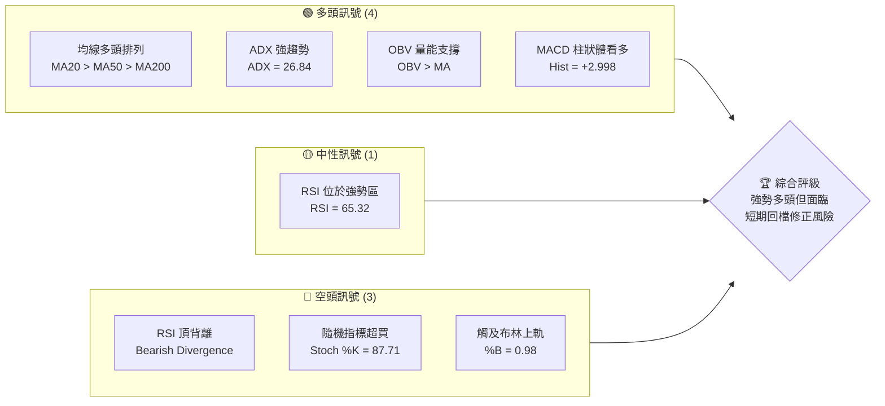
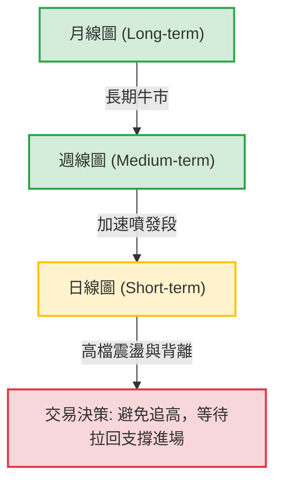
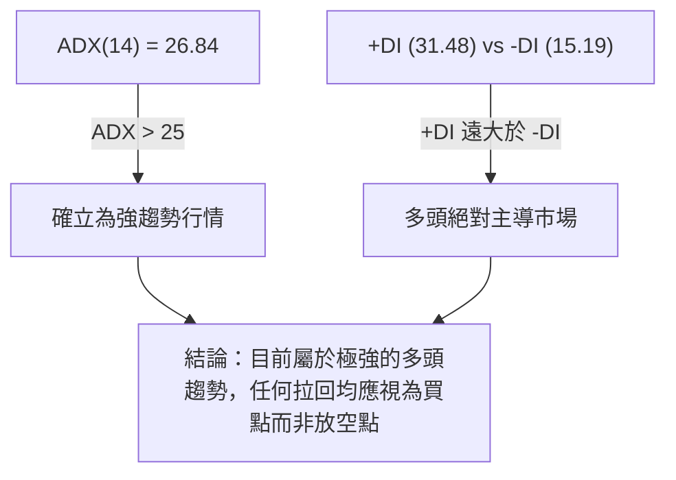
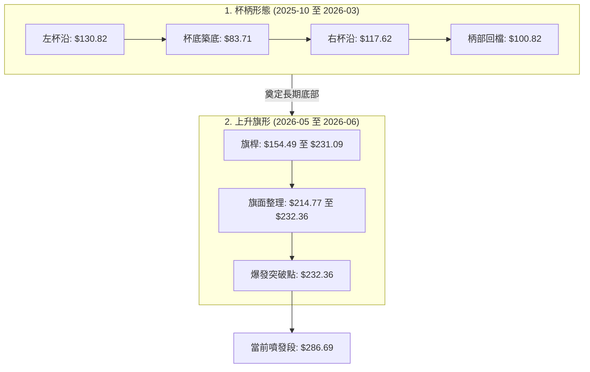
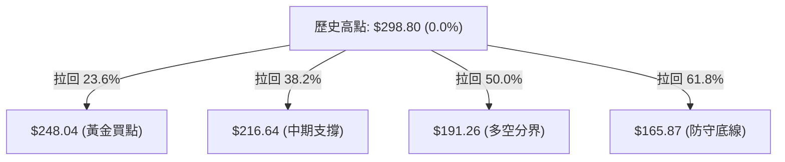
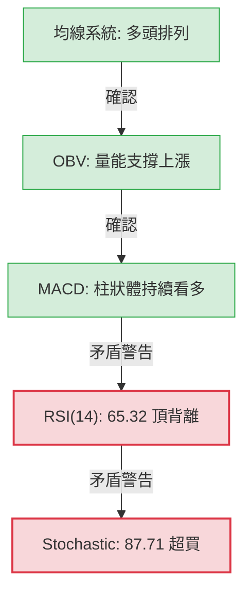
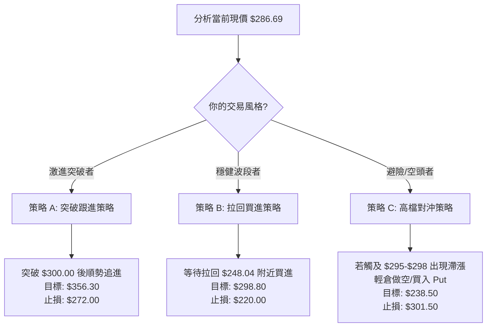
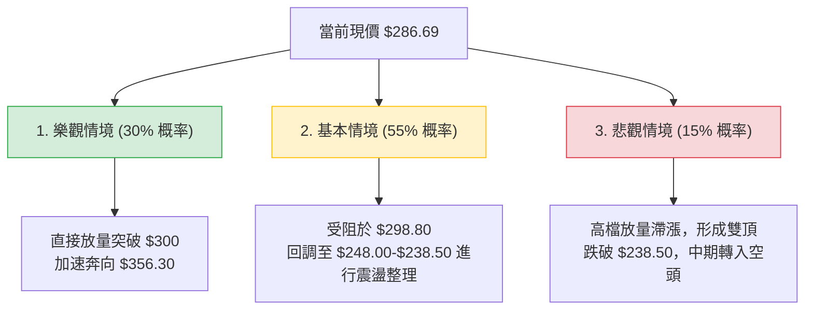

<details>
<summary>📊 靜態圖表 (點擊展開)</summary>

</details>

<html>
<head><meta charset="utf-8" /></head>
<body>
    <div style="height:500px; width:100%;">                        <script>window.PlotlyConfig = {MathJaxConfig: 'local'};</script>
        <script charset="utf-8" src="https://cdn.plot.ly/plotly-3.6.0.min.js" integrity="sha256-QaOVwtVY0T02VaHrr6pnoHLCwayMJp4O5n4YyaE3rJk=" crossorigin="anonymous"></script>                <div id="candlestick-chart" class="plotly-graph-div" style="height:100%; width:100%;"></div>            <script>                window.PLOTLYENV=window.PLOTLYENV || {};                                if (document.getElementById("candlestick-chart")) {                    Plotly.newPlot(                        "candlestick-chart",                        [{"close":{"dtype":"f8","bdata":"AAAAoJlpUEAAAACAPTpQQAAAAIAUXlBAAAAAANcDUEAAAACAFO5XQAAAAMD1WFdAAAAAAClMVkAAAACAPZpWQAAAAKBwvVZAAAAAIIVbVkAAAADAHoVXQAAAACCuh1dAAAAAANfTWEAAAABgZqZaQAAAAEAz81pAAAAAYLhOXEAAAAAAKfxaQAAAAMDM7FpAAAAAgBSOW0AAAACgRxFcQAAAAEAK51xAAAAAIK53X0AAAABguP5fQAAAAAApPF9AAAAAwMxsXUAAAAAAAIBeQAAAAOB6lGBAAAAAYI8yYEAAAABguO5gQAAAAMDMBGBAAAAAwB51X0AAAABgj8JeQAAAAAApXFxAAAAAAABAW0AAAACA6xFaQAAAACCup1hAAAAAgD2KWkAAAADgo1BdQAAAACCFW19AAAAAwB51XkAAAABgZkZfQAAAACCFC19AAAAAgD1aYEAAAACAFB5eQAAAAGCPoltAAAAAAABAXUAAAAAAKVxbQAAAAIDr0VtAAAAAwMx8W0AAAACAFI5ZQAAAAEAKl1dAAAAA4FEoVkAAAABgj+JUQAAAAGC4flVAAAAAYI+iVkAAAADgesRXQAAAAMD1KFVAAAAA4KPQVEAAAACgmflWQAAAAOBROFZAAAAAACmsV0AAAAAgrrdXQAAAAKCZCVlAAAAAwMwcWEAAAABA4bpYQAAAAEAzs1lAAAAAYI+CWEAAAADAHhVZQAAAAIA9GlhAAAAAgMJlV0AAAACA65FXQAAAAAAp7FVAAAAAwPVIVEAAAADAzDxUQAAAAMDM3FJAAAAAgMKFU0AAAACgcF1WQAAAAGC4TldAAAAAgOuBVkAAAADgUchWQAAAAIDC5VVAAAAAYI+CVUAAAABA4UpVQAAAAMAe7VRAAAAAwMx8VkAAAADAHjVXQAAAACBcD1lAAAAAoHANWEAAAABAM1NYQAAAACCFe1hAAAAAwB7VWkAAAAAghVtaQAAAAGC4fllAAAAA4KP4WUAAAABguC5bQAAAAGCP0lhAAAAAIK63WEAAAABgZjZYQAAAAAAAoFdAAAAAoHDdVkAAAAAgrndYQAAAACCFG1lAAAAAgD26V0AAAAAAKUxVQAAAAIA9ClZAAAAAwMx8VkAAAADA9ZhUQAAAACCud1JAAAAAYGaGVUAAAADgUThXQAAAAGCP8lZAAAAAQAonVkAAAABguG5WQAAAAOCjgFhAAAAAoEdhWEAAAABAM3NZQAAAAEAK51pAAAAAQOF6WEAAAABACidZQAAAAMAepVlAAAAAIK6HWkAAAADgUThaQAAAAAApzFZAAAAA4KPAVkAAAABAM7NVQAAAAIDrcVhAAAAAoJnpV0AAAADAHlVWQAAAAAApvFdAAAAAIIUbWEAAAAAgrv9bQAAAAGCPAltAAAAAwMw8XEAAAABAMztgQAAAAMAeFV1AAAAAANejXUAAAACgR2FeQAAAACCuZ11AAAAAoJmJXEAAAACAPbpcQAAAAIDCxVxAAAAAgBR+WkAAAADgejRZQAAAAOCjEFdAAAAA4KPwWUAAAADAzHxZQAAAAOB6NFtAAAAAYI8iXEAAAACgmVldQAAAAAAAQF9AAAAAYI8KYUAAAABACh9iQAAAAIDrUWNAAAAAgBQ+ZEAAAADgo9hkQAAAAEDhqmRAAAAA4HqkY0AAAADAHuVjQAAAAKCZkWNAAAAA4HqEY0AAAABgj6JjQAAAAMAeZWJAAAAAYLgeYkAAAADgUfBgQAAAAIAUpmFAAAAAIFxHYUAAAAAgrk9jQAAAAKBwDWZAAAAAoHD9ZUAAAABA4WJoQAAAAOCjGGdAAAAAoJkhZkAAAABAM0NnQAAAACCFY2ZAAAAA4KPoaUAAAADAzKRrQAAAAIAUfmtAAAAAIIX7aEAAAAAgXLdoQAAAAIA9+mdAAAAAgMJ9a0AAAADgo9hqQAAAAIDrAWpAAAAAANcLakAAAABA4UpsQAAAAEDh4mxAAAAAACmIcEAAAACgR0lwQAAAAIDCdW9AAAAAYLg6cEAAAACA63lsQAAAAAAAQGtAAAAAANeDa0AAAACAFHZqQAAAACCux2tAAAAAIIULbUAAAADAHkFwQAAAAKCZkXBAAAAAYI+OcUAAAABACutxQA=="},"high":{"dtype":"f8","bdata":"AAAAAADAUEAAAAAAAKBQQAAAAMD12FBAAAAAwPWoUEAAAAAghatYQAAAAOCjIFlAAAAAIK53V0AAAAAAAABXQAAAAEDhmldAAAAAQDPTVkAAAAAAAMBXQAAAACCFa1hAAAAAQDPjWEAAAADAHiVbQAAAAGC4fltAAAAAYGa2XEAAAADAHoVcQAAAACBcf1tAAAAAoEchXEAAAACgmWldQAAAAOBR+FxAAAAAIFyvX0AAAAAAVJ9gQAAAAOBR+GBAAAAAwPUIYEAAAAAA11NfQAAAAIA9qmBAAAAAQDOjYUAAAADA9VBhQAAAAIAWuWBAAAAAIK5\u002fYEAAAABACl9gQAAAAACsJF5AAAAAgBReXUAAAAAghQtbQAAAAEAz81pAAAAAIK6nWkAAAADAzFxdQAAAAAAAoF9AAAAAwPUgYEAAAADAzHxfQAAAAIAUDmBAAAAAwMyEYEAAAACAwt1gQAAAAIDrMV1AAAAAoHCNXUAAAAAAAEBeQAAAAEAz01tAAAAAIK6XXUAAAAAA16NcQAAAAKCZaVpAAAAAYLjeVkAAAAAAAEBWQAAAAKCZaVZAAAAAAClsV0AAAACAFC5YQAAAAAAprFlAAAAAIFwvVkAAAAAAAEBXQAAAAIDr0VZAAAAAgJPoV0AAAADAHkVYQAAAAGBmZllAAAAAwMy8WUAAAAAA18NYQAAAAIDC9VlAAAAAYGZWWUAAAAAAACBZQAAAACCDOFlAAAAAgMJFWEAAAADAzNxXQAAAAKCZ6VdAAAAAIFwPVkAAAAAA12NUQAAAAEAzE1VAAAAAYGYWVEAAAABgj6JWQAAAAKCZ+VdAAAAAgBQ+V0AAAABA4dpWQAAAACCu51ZAAAAAQAonVkAAAACgcL1VQAAAAIAUnlVAAAAA4KOwVkAAAAAAKdxXQAAAACCFK1lAAAAAYGaWWUAAAABgj6JZQAAAAIAUPlpAAAAAIIUrW0AAAADAzPxaQAAAAMDMrFpAAAAA4FEIW0AAAAAAAKBbQAAAAIAUHlpAAAAAoJmZWUAAAABguP5ZQAAAAOCjuFhAAAAA4FE4WUAAAABgj+JYQAAAAGBmdllAAAAAAADQWEAAAABgjwJXQAAAAAAAUFZAAAAAwPXYVkAAAABgj+pVQAAAAOB6NFRAAAAAgD2qVUAAAAAghWtXQAAAAABU41dAAAAAAACwV0AAAADgo7BWQAAAAOB6FFlAAAAAYI\u002fSWEAAAACgmRlaQAAAAGC4\u002flpAAAAA4HoUW0AAAACgbkpZQAAAAAAA8FlAAAAAACncWkAAAADgehRbQAAAAEAz01hAAAAAoMTYVkAAAAAgrndWQAAAAGC4nlhAAAAAAADQWEAAAADAzLxXQAAAAMDMzFdAAAAAoJmZWEAAAADAHoVcQAAAAGCPwltAAAAA4HokXUAAAACgmYlgQAAAAAAAYF5AAAAAQImxXkAAAABAM3NeQAAAAABW7l5AAAAAANdTXkAAAABAM3NdQAAAAEAzs11AAAAAQDNTXEAAAADgo5BaQAAAACBcj1lAAAAAwPX4WUAAAAAgrvdaQAAAAKBwPVtAAAAAgMJ1XEAAAACgmXldQAAAAAAA8F9AAAAAoJkRYUAAAACAPbpiQAAAAAAA8GNAAAAAQDPDZEAAAACA69lkQAAAAGC4FmVAAAAAgOuBZEAAAAAAADhkQAAAAAAAaGRAAAAAgMLtZEAAAACA67lkQAAAAAAAqGRAAAAAoJmZYkAAAABguK5hQAAAAGBm9mFAAAAAIFxfYkAAAAAAAIBjQAAAAMDMbGZAAAAAYLh+ZkAAAAAgrn9oQAAAAOB6vGhAAAAAAACIZ0AAAACAl45oQAAAACCFM2dAAAAAQOEqa0AAAAAgXDdtQAAAAKBHmWxAAAAAgD1Ca0AAAACA61lpQAAAAAAAiGlAAAAAgOtZbEAAAACgcL1rQAAAAOBRoGtAAAAA4Ho0akAAAADgehxtQAAAAEAzM21AAAAAoMQscUAAAACgcG1xQAAAACBct3BAAAAAIIWHcEAAAAAAAFhvQAAAAMDMDG5AAAAAwPW0bUAAAAAgrt9sQAAAACCuj2xAAAAAQOFybkAAAADgUW5wQAAAACCFVXFAAAAAQOGeckAAAADAzKxyQA=="},"hovertemplate":"\u003cb\u003e%{x|%Y-%m-%d}\u003c\u002fb\u003e\u003cbr\u003e\u958b: $%{open:.2f}\u003cbr\u003e\u9ad8: $%{high:.2f}\u003cbr\u003e\u4f4e: $%{low:.2f}\u003cbr\u003e\u6536: $%{close:.2f}\u003cextra\u003e\u003c\u002fextra\u003e","low":{"dtype":"f8","bdata":"AAAAIC81UEAAAACAPRpQQAAAAKBHoU9AAAAAYGbmT0AAAAAgrodVQAAAAAAAwFZAAAAAYI8aVkAAAACA67FVQAAAAIDCNVZAAAAAoEcBVkAAAADAHjVWQAAAAIDrAVdAAAAAAABQV0AAAACgR6FYQAAAAAAAEFpAAAAAYGY2WkAAAADgUXhaQAAAAEAzs1lAAAAAwB4VW0AAAACAPepbQAAAAOCjcFtAAAAA4HqkXUAAAABgZuZeQAAAACCFO19AAAAAgBTuXEAAAAAAAGBdQAAAACCu911AAAAA4FEAYEAAAADAzJRgQAAAAAAAcF9AAAAAwMyMXkAAAACgR4FeQAAAAOBRuFtAAAAA4KPgWkAAAACgmVlZQAAAAOBRqFdAAAAAoHDdWEAAAADgo4BbQAAAAEAKB15AAAAAgOsxXkAAAAAAAGBdQAAAAOCjcF1AAAAAQDOTX0AAAAAAAPBdQAAAAAAAQFtAAAAAIIXbW0AAAACAPRpbQAAAAOCjUFlAAAAAgBQuW0AAAADAHvVYQAAAAKBw7VZAAAAAAAAgVUAAAAAAAIBUQAAAAIDC5VRAAAAAoHBtVEAAAABAM\u002fNWQAAAAKBwDVVAAAAAoHCNU0AAAACgmUlVQAAAAOAkLlVAAAAA4KOwVkAAAAAAKVxXQAAAAOCjQFZAAAAAANcDWEAAAAAAAMBWQAAAAIAUXlhAAAAAwMwMWEAAAABAM9NXQAAAAGBmBlhAAAAAwMwMV0AAAADAzKxVQAAAAMDMjFVAAAAAoBgEVEAAAADgUThTQAAAAAAA0FJAAAAA4KNAU0AAAACAPQpUQAAAAGBmxlZAAAAAANcTVkAAAACgmSlWQAAAACBcr1VAAAAAYI8SVUAAAAAA1yNVQAAAAKCZuVRAAAAA4KOAVUAAAADA9bhWQAAAAAApvFZAAAAAANfjV0AAAAAgWAFYQAAAAGBmRlhAAAAAQDMjWEAAAABA4fpZQAAAACCD2FhAAAAAYGZGWUAAAACgcC1ZQAAAAIDClVhAAAAAYGZGV0AAAAAAACBYQAAAAIDrYVdAAAAAQArXVkAAAACA62FXQAAAAAApHFhAAAAAgD3KVkAAAAAgrgdVQAAAAIAUDlVAAAAAAAAwVUAAAAAAKZxTQAAAAKBHYVJAAAAAIK5HU0AAAAAA1\u002fNUQAAAAIA96lZAAAAAwPXIVUAAAAAAKexTQAAAAEAKN1ZAAAAAAABgV0AAAAAg2TZYQAAAACCFG1lAAAAAgOtBWEAAAABAM9NXQAAAAEDfb1hAAAAAQDOzWUAAAAAAAIBZQAAAAKCZGVZAAAAAQDOzVUAAAACA6+FUQAAAAKCZiVZAAAAAIK7nVkAAAABAMzNWQAAAAAAAoFVAAAAAAADAV0AAAAAgXB9aQAAAAKBHoVpAAAAAwPWIW0AAAABgEhtfQAAAAEAKR1xAAAAAAACAXEAAAACgR7FcQAAAAICTKFxAAAAAQDNjXEAAAADgowBcQAAAAMAeVVxAAAAAgD1aWkAAAACgRxFZQAAAAMDKaVZAAAAAYLjuV0AAAABgZlZZQAAAAAApDFhAAAAAwMzcWkAAAACA65FbQAAAAGBm1l1AAAAAQDMjX0AAAADgUdxgQAAAAKCZyWFAAAAA4KPQY0AAAAAAAJBjQAAAAEDhAmRAAAAAIFxXY0AAAACgR0FjQAAAAMDMbGNAAAAAQDNrY0AAAACAPUJjQAAAAIDrOWJAAAAAgOtRYUAAAABgZpZgQAAAAEAKx2BAAAAAAADgYEAAAAAAAIBhQAAAAGBm9mNAAAAAYLgWZUAAAAAgheNlQAAAAAAAIGZAAAAAAAAQZkAAAACgmVFmQAAAAAAAiGVAAAAAAABgaEAAAAAAAPhpQAAAAKCZeWpAAAAAYI\u002fCZ0AAAAAAAOBmQAAAAOB61GdAAAAAoJkZakAAAAAgXFdqQAAAAMAetWlAAAAAgOvJaEAAAADgUWBrQAAAAMDMTGpAAAAAAADAbUAAAAAAADxwQAAAAOBR8G5AAAAAgBRWbUAAAACAFBZrQAAAAGBmNmtAAAAAoJkJaUAAAAAA12tqQAAAAAAAoGlAAAAAAADwa0AAAAAgrqduQAAAAMDMrG9AAAAA4KOEcEAAAABAMzlxQA=="},"name":"\u50f9\u683c","open":{"dtype":"f8","bdata":"AAAA4FG4UEAAAADgelxQQAAAAAAAoFBAAAAAQOEqUEAAAADAzExYQAAAAMD16FZAAAAAQOEqV0AAAAAAKcxWQAAAAEAKJ1dAAAAAwMzMVkAAAABA4epWQAAAAMDMxFdAAAAAwPWIV0AAAADAzHxZQAAAAGCPAltAAAAA4KNIW0AAAAAghQNbQAAAACCFe1tAAAAA4FFYW0AAAADgelxcQAAAAIDC7VtAAAAAoEfxXkAAAABACs9fQAAAAMDMjGBAAAAAwMz0X0AAAADAzExeQAAAAGC4Pl5AAAAAYGbeYEAAAABguOZgQAAAAAAAgGBAAAAAwMx8YEAAAABA4QJgQAAAAADXg11AAAAAYI8yXUAAAADgUfhaQAAAAEAzq1pAAAAAwB4VWUAAAACAPcpbQAAAAIA9Ol5AAAAAANebX0AAAACA6xFfQAAAAMDMTF5AAAAAwPWoX0AAAAAAAMBgQAAAAGC4FlxAAAAAwPVoXEAAAABAM+NdQAAAAAAAIFpAAAAAIIXLXEAAAADgUYhcQAAAAMDMDFpAAAAAwPW4VkAAAABACpdUQAAAAOB69FRAAAAAgOvxVEAAAADgUUBXQAAAACCF21hAAAAAQDNjVUAAAABguI5VQAAAAGCPUlZAAAAAYGZ2V0AAAABAMyNYQAAAAMDM3FZAAAAAQAoXWUAAAACgR8FXQAAAAOB6xFhAAAAAgMIVWUAAAABgj1JYQAAAAIDChVhAAAAAYLjuV0AAAADAzExWQAAAAADXU1dAAAAAYGYGVkAAAADAzORTQAAAAIDCBVVAAAAAQDPDU0AAAACgmSlUQAAAAIAUPldAAAAAANeTVkAAAABguI5WQAAAAOCj4FZAAAAAwMwcVUAAAAAAAJhVQAAAACCuV1VAAAAAQAq\u002fVUAAAAAAAMBXQAAAAIDC7VdAAAAA4KPAWEAAAABgjzJYQAAAAKBHuVhAAAAA4HqUWEAAAADAHtVaQAAAAIDrcVpAAAAAIIUjWkAAAAAgrn9aQAAAAMAedVlAAAAAgMJFWUAAAADgo4BZQAAAAMDMLFhAAAAAoHBtWEAAAABgZpZXQAAAAAAAAFlAAAAAQAqXWEAAAACgQ+NWQAAAAADXc1VAAAAAIIV7VkAAAAAAAMBVQAAAAMD1yFNAAAAAYGbOU0AAAADAzBxVQAAAAGCPOldAAAAAYI86V0AAAABgZgZVQAAAAEAKd1ZAAAAAAAAAWEAAAABguO5YQAAAACCFG1lAAAAAANOlWkAAAAAghRNYQAAAACBc11hAAAAAIFw\u002fWkAAAAAAAIBaQAAAAMDMrFhAAAAAAAAAVkAAAACgmYlVQAAAAKCZmVZAAAAAAAAwWEAAAABAMxNXQAAAAEAK11VAAAAAwPXIV0AAAACAPUpaQAAAAIDCRVtAAAAAACmcW0AAAAAAADBfQAAAAIDCFV5AAAAAQDOzXEAAAADgUdBcQAAAAGBmHl5AAAAAoHAtXUAAAABAMwtdQAAAACCuN11AAAAA4FFQXEAAAADAHnVaQAAAACBcj1lAAAAAYLh+WEAAAADgenxaQAAAAIA9GlhAAAAAgD0qW0AAAAAAAKhbQAAAAOBRuF9AAAAAAABAX0AAAADgUdxgQAAAAGBm1mFAAAAAQDMjZEAAAABgOwdkQAAAAAAA4GRAAAAAwPV4ZEAAAAAAAKBjQAAAAEAKJ2RAAAAAIIVbZEAAAADAzHxjQAAAAKBwdWRAAAAA4HqMYkAAAADAzExhQAAAAEAKg2FAAAAAgOslYkAAAABgj6phQAAAAOBRDGRAAAAAwMx0ZUAAAABACnNmQAAAAOBRwGdAAAAAYGb2ZkAAAADAzHxmQAAAAKBwjWZAAAAAQAp7aUAAAAAAAKxqQAAAACCFM2tAAAAAQAova0AAAAAAAOBnQAAAAEAKf2lAAAAAIK53akAAAADgUWhrQAAAAKCZlWtAAAAAwB75aUAAAAAAKcxsQAAAACCFe2xAAAAAQOGCbkAAAACgmQFxQAAAAKBwQ3BAAAAAIK73bUAAAAAghdtuQAAAAMDMDG5AAAAAAADAbEAAAACgxu9qQAAAAOB6rGlAAAAAwMxUbUAAAABguH5vQAAAAEAK729AAAAAYGaacEAAAABAM6NyQA=="},"x":["2025-09-03T00:00:00-04:00","2025-09-04T00:00:00-04:00","2025-09-05T00:00:00-04:00","2025-09-08T00:00:00-04:00","2025-09-09T00:00:00-04:00","2025-09-10T00:00:00-04:00","2025-09-11T00:00:00-04:00","2025-09-12T00:00:00-04:00","2025-09-15T00:00:00-04:00","2025-09-16T00:00:00-04:00","2025-09-17T00:00:00-04:00","2025-09-18T00:00:00-04:00","2025-09-19T00:00:00-04:00","2025-09-22T00:00:00-04:00","2025-09-23T00:00:00-04:00","2025-09-24T00:00:00-04:00","2025-09-25T00:00:00-04:00","2025-09-26T00:00:00-04:00","2025-09-29T00:00:00-04:00","2025-09-30T00:00:00-04:00","2025-10-01T00:00:00-04:00","2025-10-02T00:00:00-04:00","2025-10-03T00:00:00-04:00","2025-10-06T00:00:00-04:00","2025-10-07T00:00:00-04:00","2025-10-08T00:00:00-04:00","2025-10-09T00:00:00-04:00","2025-10-10T00:00:00-04:00","2025-10-13T00:00:00-04:00","2025-10-14T00:00:00-04:00","2025-10-15T00:00:00-04:00","2025-10-16T00:00:00-04:00","2025-10-17T00:00:00-04:00","2025-10-20T00:00:00-04:00","2025-10-21T00:00:00-04:00","2025-10-22T00:00:00-04:00","2025-10-23T00:00:00-04:00","2025-10-24T00:00:00-04:00","2025-10-27T00:00:00-04:00","2025-10-28T00:00:00-04:00","2025-10-29T00:00:00-04:00","2025-10-30T00:00:00-04:00","2025-10-31T00:00:00-04:00","2025-11-03T00:00:00-05:00","2025-11-04T00:00:00-05:00","2025-11-05T00:00:00-05:00","2025-11-06T00:00:00-05:00","2025-11-07T00:00:00-05:00","2025-11-10T00:00:00-05:00","2025-11-11T00:00:00-05:00","2025-11-12T00:00:00-05:00","2025-11-13T00:00:00-05:00","2025-11-14T00:00:00-05:00","2025-11-17T00:00:00-05:00","2025-11-18T00:00:00-05:00","2025-11-19T00:00:00-05:00","2025-11-20T00:00:00-05:00","2025-11-21T00:00:00-05:00","2025-11-24T00:00:00-05:00","2025-11-25T00:00:00-05:00","2025-11-26T00:00:00-05:00","2025-11-28T00:00:00-05:00","2025-12-01T00:00:00-05:00","2025-12-02T00:00:00-05:00","2025-12-03T00:00:00-05:00","2025-12-04T00:00:00-05:00","2025-12-05T00:00:00-05:00","2025-12-08T00:00:00-05:00","2025-12-09T00:00:00-05:00","2025-12-10T00:00:00-05:00","2025-12-11T00:00:00-05:00","2025-12-12T00:00:00-05:00","2025-12-15T00:00:00-05:00","2025-12-16T00:00:00-05:00","2025-12-17T00:00:00-05:00","2025-12-18T00:00:00-05:00","2025-12-19T00:00:00-05:00","2025-12-22T00:00:00-05:00","2025-12-23T00:00:00-05:00","2025-12-24T00:00:00-05:00","2025-12-26T00:00:00-05:00","2025-12-29T00:00:00-05:00","2025-12-30T00:00:00-05:00","2025-12-31T00:00:00-05:00","2026-01-02T00:00:00-05:00","2026-01-05T00:00:00-05:00","2026-01-06T00:00:00-05:00","2026-01-07T00:00:00-05:00","2026-01-08T00:00:00-05:00","2026-01-09T00:00:00-05:00","2026-01-12T00:00:00-05:00","2026-01-13T00:00:00-05:00","2026-01-14T00:00:00-05:00","2026-01-15T00:00:00-05:00","2026-01-16T00:00:00-05:00","2026-01-20T00:00:00-05:00","2026-01-21T00:00:00-05:00","2026-01-22T00:00:00-05:00","2026-01-23T00:00:00-05:00","2026-01-26T00:00:00-05:00","2026-01-27T00:00:00-05:00","2026-01-28T00:00:00-05:00","2026-01-29T00:00:00-05:00","2026-01-30T00:00:00-05:00","2026-02-02T00:00:00-05:00","2026-02-03T00:00:00-05:00","2026-02-04T00:00:00-05:00","2026-02-05T00:00:00-05:00","2026-02-06T00:00:00-05:00","2026-02-09T00:00:00-05:00","2026-02-10T00:00:00-05:00","2026-02-11T00:00:00-05:00","2026-02-12T00:00:00-05:00","2026-02-13T00:00:00-05:00","2026-02-17T00:00:00-05:00","2026-02-18T00:00:00-05:00","2026-02-19T00:00:00-05:00","2026-02-20T00:00:00-05:00","2026-02-23T00:00:00-05:00","2026-02-24T00:00:00-05:00","2026-02-25T00:00:00-05:00","2026-02-26T00:00:00-05:00","2026-02-27T00:00:00-05:00","2026-03-02T00:00:00-05:00","2026-03-03T00:00:00-05:00","2026-03-04T00:00:00-05:00","2026-03-05T00:00:00-05:00","2026-03-06T00:00:00-05:00","2026-03-09T00:00:00-04:00","2026-03-10T00:00:00-04:00","2026-03-11T00:00:00-04:00","2026-03-12T00:00:00-04:00","2026-03-13T00:00:00-04:00","2026-03-16T00:00:00-04:00","2026-03-17T00:00:00-04:00","2026-03-18T00:00:00-04:00","2026-03-19T00:00:00-04:00","2026-03-20T00:00:00-04:00","2026-03-23T00:00:00-04:00","2026-03-24T00:00:00-04:00","2026-03-25T00:00:00-04:00","2026-03-26T00:00:00-04:00","2026-03-27T00:00:00-04:00","2026-03-30T00:00:00-04:00","2026-03-31T00:00:00-04:00","2026-04-01T00:00:00-04:00","2026-04-02T00:00:00-04:00","2026-04-06T00:00:00-04:00","2026-04-07T00:00:00-04:00","2026-04-08T00:00:00-04:00","2026-04-09T00:00:00-04:00","2026-04-10T00:00:00-04:00","2026-04-13T00:00:00-04:00","2026-04-14T00:00:00-04:00","2026-04-15T00:00:00-04:00","2026-04-16T00:00:00-04:00","2026-04-17T00:00:00-04:00","2026-04-20T00:00:00-04:00","2026-04-21T00:00:00-04:00","2026-04-22T00:00:00-04:00","2026-04-23T00:00:00-04:00","2026-04-24T00:00:00-04:00","2026-04-27T00:00:00-04:00","2026-04-28T00:00:00-04:00","2026-04-29T00:00:00-04:00","2026-04-30T00:00:00-04:00","2026-05-01T00:00:00-04:00","2026-05-04T00:00:00-04:00","2026-05-05T00:00:00-04:00","2026-05-06T00:00:00-04:00","2026-05-07T00:00:00-04:00","2026-05-08T00:00:00-04:00","2026-05-11T00:00:00-04:00","2026-05-12T00:00:00-04:00","2026-05-13T00:00:00-04:00","2026-05-14T00:00:00-04:00","2026-05-15T00:00:00-04:00","2026-05-18T00:00:00-04:00","2026-05-19T00:00:00-04:00","2026-05-20T00:00:00-04:00","2026-05-21T00:00:00-04:00","2026-05-22T00:00:00-04:00","2026-05-26T00:00:00-04:00","2026-05-27T00:00:00-04:00","2026-05-28T00:00:00-04:00","2026-05-29T00:00:00-04:00","2026-06-01T00:00:00-04:00","2026-06-02T00:00:00-04:00","2026-06-03T00:00:00-04:00","2026-06-04T00:00:00-04:00","2026-06-05T00:00:00-04:00","2026-06-08T00:00:00-04:00","2026-06-09T00:00:00-04:00","2026-06-10T00:00:00-04:00","2026-06-11T00:00:00-04:00","2026-06-12T00:00:00-04:00","2026-06-15T00:00:00-04:00","2026-06-16T00:00:00-04:00","2026-06-17T00:00:00-04:00","2026-06-18T00:00:00-04:00"],"type":"candlestick"},{"hovertemplate":"MA30: $%{y:.2f}\u003cextra\u003e\u003c\u002fextra\u003e","line":{"color":"#2196F3","dash":"dash","width":2},"mode":"lines","name":"MA30","x":["2025-09-03T00:00:00-04:00","2025-09-04T00:00:00-04:00","2025-09-05T00:00:00-04:00","2025-09-08T00:00:00-04:00","2025-09-09T00:00:00-04:00","2025-09-10T00:00:00-04:00","2025-09-11T00:00:00-04:00","2025-09-12T00:00:00-04:00","2025-09-15T00:00:00-04:00","2025-09-16T00:00:00-04:00","2025-09-17T00:00:00-04:00","2025-09-18T00:00:00-04:00","2025-09-19T00:00:00-04:00","2025-09-22T00:00:00-04:00","2025-09-23T00:00:00-04:00","2025-09-24T00:00:00-04:00","2025-09-25T00:00:00-04:00","2025-09-26T00:00:00-04:00","2025-09-29T00:00:00-04:00","2025-09-30T00:00:00-04:00","2025-10-01T00:00:00-04:00","2025-10-02T00:00:00-04:00","2025-10-03T00:00:00-04:00","2025-10-06T00:00:00-04:00","2025-10-07T00:00:00-04:00","2025-10-08T00:00:00-04:00","2025-10-09T00:00:00-04:00","2025-10-10T00:00:00-04:00","2025-10-13T00:00:00-04:00","2025-10-14T00:00:00-04:00","2025-10-15T00:00:00-04:00","2025-10-16T00:00:00-04:00","2025-10-17T00:00:00-04:00","2025-10-20T00:00:00-04:00","2025-10-21T00:00:00-04:00","2025-10-22T00:00:00-04:00","2025-10-23T00:00:00-04:00","2025-10-24T00:00:00-04:00","2025-10-27T00:00:00-04:00","2025-10-28T00:00:00-04:00","2025-10-29T00:00:00-04:00","2025-10-30T00:00:00-04:00","2025-10-31T00:00:00-04:00","2025-11-03T00:00:00-05:00","2025-11-04T00:00:00-05:00","2025-11-05T00:00:00-05:00","2025-11-06T00:00:00-05:00","2025-11-07T00:00:00-05:00","2025-11-10T00:00:00-05:00","2025-11-11T00:00:00-05:00","2025-11-12T00:00:00-05:00","2025-11-13T00:00:00-05:00","2025-11-14T00:00:00-05:00","2025-11-17T00:00:00-05:00","2025-11-18T00:00:00-05:00","2025-11-19T00:00:00-05:00","2025-11-20T00:00:00-05:00","2025-11-21T00:00:00-05:00","2025-11-24T00:00:00-05:00","2025-11-25T00:00:00-05:00","2025-11-26T00:00:00-05:00","2025-11-28T00:00:00-05:00","2025-12-01T00:00:00-05:00","2025-12-02T00:00:00-05:00","2025-12-03T00:00:00-05:00","2025-12-04T00:00:00-05:00","2025-12-05T00:00:00-05:00","2025-12-08T00:00:00-05:00","2025-12-09T00:00:00-05:00","2025-12-10T00:00:00-05:00","2025-12-11T00:00:00-05:00","2025-12-12T00:00:00-05:00","2025-12-15T00:00:00-05:00","2025-12-16T00:00:00-05:00","2025-12-17T00:00:00-05:00","2025-12-18T00:00:00-05:00","2025-12-19T00:00:00-05:00","2025-12-22T00:00:00-05:00","2025-12-23T00:00:00-05:00","2025-12-24T00:00:00-05:00","2025-12-26T00:00:00-05:00","2025-12-29T00:00:00-05:00","2025-12-30T00:00:00-05:00","2025-12-31T00:00:00-05:00","2026-01-02T00:00:00-05:00","2026-01-05T00:00:00-05:00","2026-01-06T00:00:00-05:00","2026-01-07T00:00:00-05:00","2026-01-08T00:00:00-05:00","2026-01-09T00:00:00-05:00","2026-01-12T00:00:00-05:00","2026-01-13T00:00:00-05:00","2026-01-14T00:00:00-05:00","2026-01-15T00:00:00-05:00","2026-01-16T00:00:00-05:00","2026-01-20T00:00:00-05:00","2026-01-21T00:00:00-05:00","2026-01-22T00:00:00-05:00","2026-01-23T00:00:00-05:00","2026-01-26T00:00:00-05:00","2026-01-27T00:00:00-05:00","2026-01-28T00:00:00-05:00","2026-01-29T00:00:00-05:00","2026-01-30T00:00:00-05:00","2026-02-02T00:00:00-05:00","2026-02-03T00:00:00-05:00","2026-02-04T00:00:00-05:00","2026-02-05T00:00:00-05:00","2026-02-06T00:00:00-05:00","2026-02-09T00:00:00-05:00","2026-02-10T00:00:00-05:00","2026-02-11T00:00:00-05:00","2026-02-12T00:00:00-05:00","2026-02-13T00:00:00-05:00","2026-02-17T00:00:00-05:00","2026-02-18T00:00:00-05:00","2026-02-19T00:00:00-05:00","2026-02-20T00:00:00-05:00","2026-02-23T00:00:00-05:00","2026-02-24T00:00:00-05:00","2026-02-25T00:00:00-05:00","2026-02-26T00:00:00-05:00","2026-02-27T00:00:00-05:00","2026-03-02T00:00:00-05:00","2026-03-03T00:00:00-05:00","2026-03-04T00:00:00-05:00","2026-03-05T00:00:00-05:00","2026-03-06T00:00:00-05:00","2026-03-09T00:00:00-04:00","2026-03-10T00:00:00-04:00","2026-03-11T00:00:00-04:00","2026-03-12T00:00:00-04:00","2026-03-13T00:00:00-04:00","2026-03-16T00:00:00-04:00","2026-03-17T00:00:00-04:00","2026-03-18T00:00:00-04:00","2026-03-19T00:00:00-04:00","2026-03-20T00:00:00-04:00","2026-03-23T00:00:00-04:00","2026-03-24T00:00:00-04:00","2026-03-25T00:00:00-04:00","2026-03-26T00:00:00-04:00","2026-03-27T00:00:00-04:00","2026-03-30T00:00:00-04:00","2026-03-31T00:00:00-04:00","2026-04-01T00:00:00-04:00","2026-04-02T00:00:00-04:00","2026-04-06T00:00:00-04:00","2026-04-07T00:00:00-04:00","2026-04-08T00:00:00-04:00","2026-04-09T00:00:00-04:00","2026-04-10T00:00:00-04:00","2026-04-13T00:00:00-04:00","2026-04-14T00:00:00-04:00","2026-04-15T00:00:00-04:00","2026-04-16T00:00:00-04:00","2026-04-17T00:00:00-04:00","2026-04-20T00:00:00-04:00","2026-04-21T00:00:00-04:00","2026-04-22T00:00:00-04:00","2026-04-23T00:00:00-04:00","2026-04-24T00:00:00-04:00","2026-04-27T00:00:00-04:00","2026-04-28T00:00:00-04:00","2026-04-29T00:00:00-04:00","2026-04-30T00:00:00-04:00","2026-05-01T00:00:00-04:00","2026-05-04T00:00:00-04:00","2026-05-05T00:00:00-04:00","2026-05-06T00:00:00-04:00","2026-05-07T00:00:00-04:00","2026-05-08T00:00:00-04:00","2026-05-11T00:00:00-04:00","2026-05-12T00:00:00-04:00","2026-05-13T00:00:00-04:00","2026-05-14T00:00:00-04:00","2026-05-15T00:00:00-04:00","2026-05-18T00:00:00-04:00","2026-05-19T00:00:00-04:00","2026-05-20T00:00:00-04:00","2026-05-21T00:00:00-04:00","2026-05-22T00:00:00-04:00","2026-05-26T00:00:00-04:00","2026-05-27T00:00:00-04:00","2026-05-28T00:00:00-04:00","2026-05-29T00:00:00-04:00","2026-06-01T00:00:00-04:00","2026-06-02T00:00:00-04:00","2026-06-03T00:00:00-04:00","2026-06-04T00:00:00-04:00","2026-06-05T00:00:00-04:00","2026-06-08T00:00:00-04:00","2026-06-09T00:00:00-04:00","2026-06-10T00:00:00-04:00","2026-06-11T00:00:00-04:00","2026-06-12T00:00:00-04:00","2026-06-15T00:00:00-04:00","2026-06-16T00:00:00-04:00","2026-06-17T00:00:00-04:00","2026-06-18T00:00:00-04:00"],"y":{"dtype":"f8","bdata":"AAAAAAAA+H8AAAAAAAD4fwAAAAAAAPh\u002fAAAAAAAA+H8AAAAAAAD4fwAAAAAAAPh\u002fAAAAAAAA+H8AAAAAAAD4fwAAAAAAAPh\u002fAAAAAAAA+H8AAAAAAAD4fwAAAAAAAPh\u002fAAAAAAAA+H8AAAAAAAD4fwAAAAAAAPh\u002fAAAAAAAA+H8AAAAAAAD4fwAAAAAAAPh\u002fAAAAAAAA+H8AAAAAAAD4fwAAAAAAAPh\u002fAAAAAAAA+H8AAAAAAAD4fwAAAAAAAPh\u002fAAAAAAAA+H8AAAAAAAD4fwAAAAAAAPh\u002fAAAAAAAA+H8AAAAAAAD4f1VVVUUZBVpAMzMzk3uFWkDe3d1NfgFbQCIiIlLUZ1tA3t3djbPHW0BERER09tlbQLy7u7se5VtA3t3dnVIJXEC8u7tLmkJcQDMzM4MjjFxAvLu7O0LRXECamZlJbxNdQN7d3Q2QU11AiYiIuMiWXUB3d3eXX7RdQO\u002fu7v43ul1Aq6qq6kLCXUDe3d0ddsVdQGZmZkYZzV1AERER0YXMXUDe3d0tFbddQImIiNi\u002fiV1AZmZm1k06XUC8u7urf9tcQBEREVFiiFxAZmZmVnFOXEB3d3f3\u002fRRcQBEREZGXrltAvLu7q8ZLW0CamZkZ2e5aQCIiInISm1pAq6qq2qNYWkB3d3dHixxaQKuqqioxAFpAERERMWvlWUCrqqrq+9lZQBEREcHm4llAZmZmJpTRWUDNzMwcdq1ZQDMzM1ONb1lAREREhE4zWUAAAACwjvFYQImIiEi2o1hAAAAAYLo5WEDv7u4ua+VXQM3MzFyPmldAAAAAUI1HV0ARERGR7RxXQM3MzNxr9lZAMzMz4+zLVkBERERERLRWQBEREfHSpVZAVVVVdUygVkB3d3enxqNWQDMzMzPsnlZAq6qq+qmdVkBERESk4phWQCIiIlIqulZA7+7uvsrVVkDe3d3dT+FWQAAAAGCe9FZAAAAAgJUPV0CrqqqqHCZXQHd3dxcEKldAiYiImOA5V0Crqqoqzk5XQM3MzDxRR1dAd3d3hxZJV0C8u7v7qUFXQN7d3d2WPVdAq6qqmgs5V0CamZk5tEBXQGZmZvbhW1dAiYiIOEJ5V0BERETUTYJXQAAAADBrnVdAREREVLi2V0Crqqoqo6dXQGZmZgZWfldAiYiIuPN1V0BERER0r3lXQHd3dzelgldAd3d3xyCIV0BmZmYm25FXQGZmZpZfsFdAERER0YXAV0AiIiKiqNNXQDMzM6Nh41dAZmZmhgfnV0CamZk5F+5XQO\u002fu7r4C+FdAzczM7G31V0DNzMyMQfRXQFVVVcU83VdA3t3dTcXBV0CamZmZ\u002fJJXQAAAAPDDj1dAMzMzY+WIV0B3d3d32nhXQERERMTKeVdAzczMDGWEV0Dv7u4uh6JXQCIiIkLDsldAAAAAgD\u002fZV0ARERHRhThYQERERGSedFhARERERKexWEBmZmZ2IQVZQLy7u8t2YllAZmZm1k2eWUCJiIgoTc1ZQAAAABAC\u002f1lAAAAA8AokWkDe3d2NsztaQJqZmUlvL1pAmpmZKb88WkBEREQUET1aQGZmZualP1pA7+7uXtZeWkAzMzPzp4JaQCIiIkJ8slpAIiIi8u7yWkDv7u5udUhbQGZmZualz1tAMzMzI\u002fdmXEC8u7trkRFdQAAAADCyoV1AzczM7N8kXkCrqqpq2LleQBEREbFHPV9AAAAAUKm8X0De3d3daw5gQERERDwmOGBAIiIiGktaYEAAAACoVGBgQAAAABjZemBAiYiIUNSPYEAzMzNT\u002f7JgQM3MzKS38WBAiYiI+JozYUBERER0IYlhQN7d3b1002FAIiIiUkYfYkCrqqpyPXpiQJqZmUnh1mJAMzMza0pFY0Dv7u72b8RjQCIiIiL3OmRAiYiIUBuYZEAiIiLCyu1kQDMzMxMRNWVAIiIicj2OZUAAAACAsdhlQBEREZHCEWZAzczMDElDZkARERGh04JmQDMzM8P1yGZA7+7u7nw7Z0CamZlZq6dnQN7d3S0kDWhAZmZmxpJ7aEB3d3fHBMdoQCIiItKUEmlAIiIigsBiaUCrqqq6ArRpQImIiMh2CmpAzczMjN5uakDe3d3tfN9qQLy7u3sUPmtAERERwRGua0CamZmpxg9sQA=="},"type":"scatter"},{"hovertemplate":"MA60: $%{y:.2f}\u003cextra\u003e\u003c\u002fextra\u003e","line":{"color":"#9C27B0","dash":"dash","width":2},"mode":"lines","name":"MA60","x":["2025-09-03T00:00:00-04:00","2025-09-04T00:00:00-04:00","2025-09-05T00:00:00-04:00","2025-09-08T00:00:00-04:00","2025-09-09T00:00:00-04:00","2025-09-10T00:00:00-04:00","2025-09-11T00:00:00-04:00","2025-09-12T00:00:00-04:00","2025-09-15T00:00:00-04:00","2025-09-16T00:00:00-04:00","2025-09-17T00:00:00-04:00","2025-09-18T00:00:00-04:00","2025-09-19T00:00:00-04:00","2025-09-22T00:00:00-04:00","2025-09-23T00:00:00-04:00","2025-09-24T00:00:00-04:00","2025-09-25T00:00:00-04:00","2025-09-26T00:00:00-04:00","2025-09-29T00:00:00-04:00","2025-09-30T00:00:00-04:00","2025-10-01T00:00:00-04:00","2025-10-02T00:00:00-04:00","2025-10-03T00:00:00-04:00","2025-10-06T00:00:00-04:00","2025-10-07T00:00:00-04:00","2025-10-08T00:00:00-04:00","2025-10-09T00:00:00-04:00","2025-10-10T00:00:00-04:00","2025-10-13T00:00:00-04:00","2025-10-14T00:00:00-04:00","2025-10-15T00:00:00-04:00","2025-10-16T00:00:00-04:00","2025-10-17T00:00:00-04:00","2025-10-20T00:00:00-04:00","2025-10-21T00:00:00-04:00","2025-10-22T00:00:00-04:00","2025-10-23T00:00:00-04:00","2025-10-24T00:00:00-04:00","2025-10-27T00:00:00-04:00","2025-10-28T00:00:00-04:00","2025-10-29T00:00:00-04:00","2025-10-30T00:00:00-04:00","2025-10-31T00:00:00-04:00","2025-11-03T00:00:00-05:00","2025-11-04T00:00:00-05:00","2025-11-05T00:00:00-05:00","2025-11-06T00:00:00-05:00","2025-11-07T00:00:00-05:00","2025-11-10T00:00:00-05:00","2025-11-11T00:00:00-05:00","2025-11-12T00:00:00-05:00","2025-11-13T00:00:00-05:00","2025-11-14T00:00:00-05:00","2025-11-17T00:00:00-05:00","2025-11-18T00:00:00-05:00","2025-11-19T00:00:00-05:00","2025-11-20T00:00:00-05:00","2025-11-21T00:00:00-05:00","2025-11-24T00:00:00-05:00","2025-11-25T00:00:00-05:00","2025-11-26T00:00:00-05:00","2025-11-28T00:00:00-05:00","2025-12-01T00:00:00-05:00","2025-12-02T00:00:00-05:00","2025-12-03T00:00:00-05:00","2025-12-04T00:00:00-05:00","2025-12-05T00:00:00-05:00","2025-12-08T00:00:00-05:00","2025-12-09T00:00:00-05:00","2025-12-10T00:00:00-05:00","2025-12-11T00:00:00-05:00","2025-12-12T00:00:00-05:00","2025-12-15T00:00:00-05:00","2025-12-16T00:00:00-05:00","2025-12-17T00:00:00-05:00","2025-12-18T00:00:00-05:00","2025-12-19T00:00:00-05:00","2025-12-22T00:00:00-05:00","2025-12-23T00:00:00-05:00","2025-12-24T00:00:00-05:00","2025-12-26T00:00:00-05:00","2025-12-29T00:00:00-05:00","2025-12-30T00:00:00-05:00","2025-12-31T00:00:00-05:00","2026-01-02T00:00:00-05:00","2026-01-05T00:00:00-05:00","2026-01-06T00:00:00-05:00","2026-01-07T00:00:00-05:00","2026-01-08T00:00:00-05:00","2026-01-09T00:00:00-05:00","2026-01-12T00:00:00-05:00","2026-01-13T00:00:00-05:00","2026-01-14T00:00:00-05:00","2026-01-15T00:00:00-05:00","2026-01-16T00:00:00-05:00","2026-01-20T00:00:00-05:00","2026-01-21T00:00:00-05:00","2026-01-22T00:00:00-05:00","2026-01-23T00:00:00-05:00","2026-01-26T00:00:00-05:00","2026-01-27T00:00:00-05:00","2026-01-28T00:00:00-05:00","2026-01-29T00:00:00-05:00","2026-01-30T00:00:00-05:00","2026-02-02T00:00:00-05:00","2026-02-03T00:00:00-05:00","2026-02-04T00:00:00-05:00","2026-02-05T00:00:00-05:00","2026-02-06T00:00:00-05:00","2026-02-09T00:00:00-05:00","2026-02-10T00:00:00-05:00","2026-02-11T00:00:00-05:00","2026-02-12T00:00:00-05:00","2026-02-13T00:00:00-05:00","2026-02-17T00:00:00-05:00","2026-02-18T00:00:00-05:00","2026-02-19T00:00:00-05:00","2026-02-20T00:00:00-05:00","2026-02-23T00:00:00-05:00","2026-02-24T00:00:00-05:00","2026-02-25T00:00:00-05:00","2026-02-26T00:00:00-05:00","2026-02-27T00:00:00-05:00","2026-03-02T00:00:00-05:00","2026-03-03T00:00:00-05:00","2026-03-04T00:00:00-05:00","2026-03-05T00:00:00-05:00","2026-03-06T00:00:00-05:00","2026-03-09T00:00:00-04:00","2026-03-10T00:00:00-04:00","2026-03-11T00:00:00-04:00","2026-03-12T00:00:00-04:00","2026-03-13T00:00:00-04:00","2026-03-16T00:00:00-04:00","2026-03-17T00:00:00-04:00","2026-03-18T00:00:00-04:00","2026-03-19T00:00:00-04:00","2026-03-20T00:00:00-04:00","2026-03-23T00:00:00-04:00","2026-03-24T00:00:00-04:00","2026-03-25T00:00:00-04:00","2026-03-26T00:00:00-04:00","2026-03-27T00:00:00-04:00","2026-03-30T00:00:00-04:00","2026-03-31T00:00:00-04:00","2026-04-01T00:00:00-04:00","2026-04-02T00:00:00-04:00","2026-04-06T00:00:00-04:00","2026-04-07T00:00:00-04:00","2026-04-08T00:00:00-04:00","2026-04-09T00:00:00-04:00","2026-04-10T00:00:00-04:00","2026-04-13T00:00:00-04:00","2026-04-14T00:00:00-04:00","2026-04-15T00:00:00-04:00","2026-04-16T00:00:00-04:00","2026-04-17T00:00:00-04:00","2026-04-20T00:00:00-04:00","2026-04-21T00:00:00-04:00","2026-04-22T00:00:00-04:00","2026-04-23T00:00:00-04:00","2026-04-24T00:00:00-04:00","2026-04-27T00:00:00-04:00","2026-04-28T00:00:00-04:00","2026-04-29T00:00:00-04:00","2026-04-30T00:00:00-04:00","2026-05-01T00:00:00-04:00","2026-05-04T00:00:00-04:00","2026-05-05T00:00:00-04:00","2026-05-06T00:00:00-04:00","2026-05-07T00:00:00-04:00","2026-05-08T00:00:00-04:00","2026-05-11T00:00:00-04:00","2026-05-12T00:00:00-04:00","2026-05-13T00:00:00-04:00","2026-05-14T00:00:00-04:00","2026-05-15T00:00:00-04:00","2026-05-18T00:00:00-04:00","2026-05-19T00:00:00-04:00","2026-05-20T00:00:00-04:00","2026-05-21T00:00:00-04:00","2026-05-22T00:00:00-04:00","2026-05-26T00:00:00-04:00","2026-05-27T00:00:00-04:00","2026-05-28T00:00:00-04:00","2026-05-29T00:00:00-04:00","2026-06-01T00:00:00-04:00","2026-06-02T00:00:00-04:00","2026-06-03T00:00:00-04:00","2026-06-04T00:00:00-04:00","2026-06-05T00:00:00-04:00","2026-06-08T00:00:00-04:00","2026-06-09T00:00:00-04:00","2026-06-10T00:00:00-04:00","2026-06-11T00:00:00-04:00","2026-06-12T00:00:00-04:00","2026-06-15T00:00:00-04:00","2026-06-16T00:00:00-04:00","2026-06-17T00:00:00-04:00","2026-06-18T00:00:00-04:00"],"y":{"dtype":"f8","bdata":"AAAAAAAA+H8AAAAAAAD4fwAAAAAAAPh\u002fAAAAAAAA+H8AAAAAAAD4fwAAAAAAAPh\u002fAAAAAAAA+H8AAAAAAAD4fwAAAAAAAPh\u002fAAAAAAAA+H8AAAAAAAD4fwAAAAAAAPh\u002fAAAAAAAA+H8AAAAAAAD4fwAAAAAAAPh\u002fAAAAAAAA+H8AAAAAAAD4fwAAAAAAAPh\u002fAAAAAAAA+H8AAAAAAAD4fwAAAAAAAPh\u002fAAAAAAAA+H8AAAAAAAD4fwAAAAAAAPh\u002fAAAAAAAA+H8AAAAAAAD4fwAAAAAAAPh\u002fAAAAAAAA+H8AAAAAAAD4fwAAAAAAAPh\u002fAAAAAAAA+H8AAAAAAAD4fwAAAAAAAPh\u002fAAAAAAAA+H8AAAAAAAD4fwAAAAAAAPh\u002fAAAAAAAA+H8AAAAAAAD4fwAAAAAAAPh\u002fAAAAAAAA+H8AAAAAAAD4fwAAAAAAAPh\u002fAAAAAAAA+H8AAAAAAAD4fwAAAAAAAPh\u002fAAAAAAAA+H8AAAAAAAD4fwAAAAAAAPh\u002fAAAAAAAA+H8AAAAAAAD4fwAAAAAAAPh\u002fAAAAAAAA+H8AAAAAAAD4fwAAAAAAAPh\u002fAAAAAAAA+H8AAAAAAAD4fwAAAAAAAPh\u002fAAAAAAAA+H8AAAAAAAD4f7y7u9sVUFpA7+7utg9vWkCrqqrKBI9aQGZmZr4CtFpAd3d3X4\u002fWWkB3d3cv+dlaQGZmZr4C5FpAIiIiYnPtWkBEREQ0CPhaQDMzM2vY\u002fVpAAAAAYEgCW0DNzMz8fgJbQDMzMyuj+1pAREREjEHoWkAzMzNj5cxaQN7d3a1jqlpAVVVVHeiEWkB3d3fXMXFaQJqZmZHCYVpAIiIiWjlMWkARERG5rDVaQM3MzGTJF1pA3t3dJU3tWUCamZkpo79ZQCIiIkKnk1lAiYiIqA12WUDe3d1N8FZZQJqZmfFgNFlAVVVVtcgQWUC8u7t7FOhYQBEREWnYx1hAVVVVrRy0WEARERH5U6FYQBEREaEalVhAzczM5KWPWECrqqoKZZRYQO\u002fu7v4blVhA7+7uVlWNWEBEREQMkHdYQImIiBiSVlhAd3d3Dy02WEDNzMx0IRlYQHd3dx\u002fM\u002f1dARERETH7ZV0CamZmB3LNXQGZmZkb9m1dAIiIi0iJ\u002fV0De3d1dSGJXQJqZmfFgOldA3t3dTfAgV0BERETc+RZXQERERBQ8FFdAZmZmnjYUV0Dv7u7m0BpXQM3MzOSlJ1dA3t3d5RcvV0AzMzOjRTZXQKuqqvrFTldAq6qqImleV0C8u7uLs2dXQHd3d49QdldAZmZmtoGCV0C8u7sbL41XQGZmZm6gg1dAMzMz89J9V0AiIiJi5XBXQGZmZpaKa1dAVVVV9f1oV0CamZk5Ql1XQBEREdGwW1dAvLu7U7heV0BERES0nXFXQERERJxSh1dARERE3ECpV0CrqqrSad1XQCIiIsoECVhAREREzC80WECJiIhQYlZYQBEREWlmcFhAd3d3xyCKWEBmZmZOfqNYQLy7u6PTwFhAvLu72xXWWEAiIiJax+ZYQAAAAHDn71hAVVVVfaL+WEAzMzPbXAhZQM3MzMSDEVlAq6qq8u4iWUBmZmaWXzhZQImIiIA\u002fVVlAd3d3by50WUDe3d19W55ZQN7d3VVx1llAiYiIOF4UWkCrqqoCR1JaQAAAABC7mFpAAAAAqOLWWkARERFxWRlbQKuqqjqJW1tAZmZmLoegW0BVVVV1r99bQFVVVd2HEVxAIiIi2upGXECJiIiQl3xcQCIiIkootVxAq6qq8qfoXEBmZmYOkDVdQKuqqgrzol1AvLu748ECXkCJiIgIyG9eQN7d3cX10l5AIiIiyksxX0CamZk5F5hfQGZmZu6Y7l9AAAAAANUxYECJiIhAfHFgQKuqqgplrWBAAAAAQMPjYEDe3d1djxdhQCIiIponR2FAmpmZddqDYUC8u7sbdr5hQCIiIsLK\u002fGFAMzMzT2I7YkB3d3crzoViQJqZmW3nzGJAq6qqcvYmY0B3d3fHS4JjQDMzMwPk1WNAMzMzt\u002fMsZECrqqpSuGpkQDMzM4ddpWRAIiIizoXeZEBVVVWxKwplQERERPCnQmVAq6qqbll\u002fZUCJiIggPsllQERERBDmF2ZAzczMXNZwZkDv7u4OdMxmQA=="},"type":"scatter"},{"hovertemplate":"MA200: $%{y:.2f}\u003cextra\u003e\u003c\u002fextra\u003e","line":{"color":"#FF6F00","dash":"solid","width":2},"mode":"lines","name":"MA200","x":["2025-09-03T00:00:00-04:00","2025-09-04T00:00:00-04:00","2025-09-05T00:00:00-04:00","2025-09-08T00:00:00-04:00","2025-09-09T00:00:00-04:00","2025-09-10T00:00:00-04:00","2025-09-11T00:00:00-04:00","2025-09-12T00:00:00-04:00","2025-09-15T00:00:00-04:00","2025-09-16T00:00:00-04:00","2025-09-17T00:00:00-04:00","2025-09-18T00:00:00-04:00","2025-09-19T00:00:00-04:00","2025-09-22T00:00:00-04:00","2025-09-23T00:00:00-04:00","2025-09-24T00:00:00-04:00","2025-09-25T00:00:00-04:00","2025-09-26T00:00:00-04:00","2025-09-29T00:00:00-04:00","2025-09-30T00:00:00-04:00","2025-10-01T00:00:00-04:00","2025-10-02T00:00:00-04:00","2025-10-03T00:00:00-04:00","2025-10-06T00:00:00-04:00","2025-10-07T00:00:00-04:00","2025-10-08T00:00:00-04:00","2025-10-09T00:00:00-04:00","2025-10-10T00:00:00-04:00","2025-10-13T00:00:00-04:00","2025-10-14T00:00:00-04:00","2025-10-15T00:00:00-04:00","2025-10-16T00:00:00-04:00","2025-10-17T00:00:00-04:00","2025-10-20T00:00:00-04:00","2025-10-21T00:00:00-04:00","2025-10-22T00:00:00-04:00","2025-10-23T00:00:00-04:00","2025-10-24T00:00:00-04:00","2025-10-27T00:00:00-04:00","2025-10-28T00:00:00-04:00","2025-10-29T00:00:00-04:00","2025-10-30T00:00:00-04:00","2025-10-31T00:00:00-04:00","2025-11-03T00:00:00-05:00","2025-11-04T00:00:00-05:00","2025-11-05T00:00:00-05:00","2025-11-06T00:00:00-05:00","2025-11-07T00:00:00-05:00","2025-11-10T00:00:00-05:00","2025-11-11T00:00:00-05:00","2025-11-12T00:00:00-05:00","2025-11-13T00:00:00-05:00","2025-11-14T00:00:00-05:00","2025-11-17T00:00:00-05:00","2025-11-18T00:00:00-05:00","2025-11-19T00:00:00-05:00","2025-11-20T00:00:00-05:00","2025-11-21T00:00:00-05:00","2025-11-24T00:00:00-05:00","2025-11-25T00:00:00-05:00","2025-11-26T00:00:00-05:00","2025-11-28T00:00:00-05:00","2025-12-01T00:00:00-05:00","2025-12-02T00:00:00-05:00","2025-12-03T00:00:00-05:00","2025-12-04T00:00:00-05:00","2025-12-05T00:00:00-05:00","2025-12-08T00:00:00-05:00","2025-12-09T00:00:00-05:00","2025-12-10T00:00:00-05:00","2025-12-11T00:00:00-05:00","2025-12-12T00:00:00-05:00","2025-12-15T00:00:00-05:00","2025-12-16T00:00:00-05:00","2025-12-17T00:00:00-05:00","2025-12-18T00:00:00-05:00","2025-12-19T00:00:00-05:00","2025-12-22T00:00:00-05:00","2025-12-23T00:00:00-05:00","2025-12-24T00:00:00-05:00","2025-12-26T00:00:00-05:00","2025-12-29T00:00:00-05:00","2025-12-30T00:00:00-05:00","2025-12-31T00:00:00-05:00","2026-01-02T00:00:00-05:00","2026-01-05T00:00:00-05:00","2026-01-06T00:00:00-05:00","2026-01-07T00:00:00-05:00","2026-01-08T00:00:00-05:00","2026-01-09T00:00:00-05:00","2026-01-12T00:00:00-05:00","2026-01-13T00:00:00-05:00","2026-01-14T00:00:00-05:00","2026-01-15T00:00:00-05:00","2026-01-16T00:00:00-05:00","2026-01-20T00:00:00-05:00","2026-01-21T00:00:00-05:00","2026-01-22T00:00:00-05:00","2026-01-23T00:00:00-05:00","2026-01-26T00:00:00-05:00","2026-01-27T00:00:00-05:00","2026-01-28T00:00:00-05:00","2026-01-29T00:00:00-05:00","2026-01-30T00:00:00-05:00","2026-02-02T00:00:00-05:00","2026-02-03T00:00:00-05:00","2026-02-04T00:00:00-05:00","2026-02-05T00:00:00-05:00","2026-02-06T00:00:00-05:00","2026-02-09T00:00:00-05:00","2026-02-10T00:00:00-05:00","2026-02-11T00:00:00-05:00","2026-02-12T00:00:00-05:00","2026-02-13T00:00:00-05:00","2026-02-17T00:00:00-05:00","2026-02-18T00:00:00-05:00","2026-02-19T00:00:00-05:00","2026-02-20T00:00:00-05:00","2026-02-23T00:00:00-05:00","2026-02-24T00:00:00-05:00","2026-02-25T00:00:00-05:00","2026-02-26T00:00:00-05:00","2026-02-27T00:00:00-05:00","2026-03-02T00:00:00-05:00","2026-03-03T00:00:00-05:00","2026-03-04T00:00:00-05:00","2026-03-05T00:00:00-05:00","2026-03-06T00:00:00-05:00","2026-03-09T00:00:00-04:00","2026-03-10T00:00:00-04:00","2026-03-11T00:00:00-04:00","2026-03-12T00:00:00-04:00","2026-03-13T00:00:00-04:00","2026-03-16T00:00:00-04:00","2026-03-17T00:00:00-04:00","2026-03-18T00:00:00-04:00","2026-03-19T00:00:00-04:00","2026-03-20T00:00:00-04:00","2026-03-23T00:00:00-04:00","2026-03-24T00:00:00-04:00","2026-03-25T00:00:00-04:00","2026-03-26T00:00:00-04:00","2026-03-27T00:00:00-04:00","2026-03-30T00:00:00-04:00","2026-03-31T00:00:00-04:00","2026-04-01T00:00:00-04:00","2026-04-02T00:00:00-04:00","2026-04-06T00:00:00-04:00","2026-04-07T00:00:00-04:00","2026-04-08T00:00:00-04:00","2026-04-09T00:00:00-04:00","2026-04-10T00:00:00-04:00","2026-04-13T00:00:00-04:00","2026-04-14T00:00:00-04:00","2026-04-15T00:00:00-04:00","2026-04-16T00:00:00-04:00","2026-04-17T00:00:00-04:00","2026-04-20T00:00:00-04:00","2026-04-21T00:00:00-04:00","2026-04-22T00:00:00-04:00","2026-04-23T00:00:00-04:00","2026-04-24T00:00:00-04:00","2026-04-27T00:00:00-04:00","2026-04-28T00:00:00-04:00","2026-04-29T00:00:00-04:00","2026-04-30T00:00:00-04:00","2026-05-01T00:00:00-04:00","2026-05-04T00:00:00-04:00","2026-05-05T00:00:00-04:00","2026-05-06T00:00:00-04:00","2026-05-07T00:00:00-04:00","2026-05-08T00:00:00-04:00","2026-05-11T00:00:00-04:00","2026-05-12T00:00:00-04:00","2026-05-13T00:00:00-04:00","2026-05-14T00:00:00-04:00","2026-05-15T00:00:00-04:00","2026-05-18T00:00:00-04:00","2026-05-19T00:00:00-04:00","2026-05-20T00:00:00-04:00","2026-05-21T00:00:00-04:00","2026-05-22T00:00:00-04:00","2026-05-26T00:00:00-04:00","2026-05-27T00:00:00-04:00","2026-05-28T00:00:00-04:00","2026-05-29T00:00:00-04:00","2026-06-01T00:00:00-04:00","2026-06-02T00:00:00-04:00","2026-06-03T00:00:00-04:00","2026-06-04T00:00:00-04:00","2026-06-05T00:00:00-04:00","2026-06-08T00:00:00-04:00","2026-06-09T00:00:00-04:00","2026-06-10T00:00:00-04:00","2026-06-11T00:00:00-04:00","2026-06-12T00:00:00-04:00","2026-06-15T00:00:00-04:00","2026-06-16T00:00:00-04:00","2026-06-17T00:00:00-04:00","2026-06-18T00:00:00-04:00"],"y":{"dtype":"f8","bdata":"AAAAAAAA+H8AAAAAAAD4fwAAAAAAAPh\u002fAAAAAAAA+H8AAAAAAAD4fwAAAAAAAPh\u002fAAAAAAAA+H8AAAAAAAD4fwAAAAAAAPh\u002fAAAAAAAA+H8AAAAAAAD4fwAAAAAAAPh\u002fAAAAAAAA+H8AAAAAAAD4fwAAAAAAAPh\u002fAAAAAAAA+H8AAAAAAAD4fwAAAAAAAPh\u002fAAAAAAAA+H8AAAAAAAD4fwAAAAAAAPh\u002fAAAAAAAA+H8AAAAAAAD4fwAAAAAAAPh\u002fAAAAAAAA+H8AAAAAAAD4fwAAAAAAAPh\u002fAAAAAAAA+H8AAAAAAAD4fwAAAAAAAPh\u002fAAAAAAAA+H8AAAAAAAD4fwAAAAAAAPh\u002fAAAAAAAA+H8AAAAAAAD4fwAAAAAAAPh\u002fAAAAAAAA+H8AAAAAAAD4fwAAAAAAAPh\u002fAAAAAAAA+H8AAAAAAAD4fwAAAAAAAPh\u002fAAAAAAAA+H8AAAAAAAD4fwAAAAAAAPh\u002fAAAAAAAA+H8AAAAAAAD4fwAAAAAAAPh\u002fAAAAAAAA+H8AAAAAAAD4fwAAAAAAAPh\u002fAAAAAAAA+H8AAAAAAAD4fwAAAAAAAPh\u002fAAAAAAAA+H8AAAAAAAD4fwAAAAAAAPh\u002fAAAAAAAA+H8AAAAAAAD4fwAAAAAAAPh\u002fAAAAAAAA+H8AAAAAAAD4fwAAAAAAAPh\u002fAAAAAAAA+H8AAAAAAAD4fwAAAAAAAPh\u002fAAAAAAAA+H8AAAAAAAD4fwAAAAAAAPh\u002fAAAAAAAA+H8AAAAAAAD4fwAAAAAAAPh\u002fAAAAAAAA+H8AAAAAAAD4fwAAAAAAAPh\u002fAAAAAAAA+H8AAAAAAAD4fwAAAAAAAPh\u002fAAAAAAAA+H8AAAAAAAD4fwAAAAAAAPh\u002fAAAAAAAA+H8AAAAAAAD4fwAAAAAAAPh\u002fAAAAAAAA+H8AAAAAAAD4fwAAAAAAAPh\u002fAAAAAAAA+H8AAAAAAAD4fwAAAAAAAPh\u002fAAAAAAAA+H8AAAAAAAD4fwAAAAAAAPh\u002fAAAAAAAA+H8AAAAAAAD4fwAAAAAAAPh\u002fAAAAAAAA+H8AAAAAAAD4fwAAAAAAAPh\u002fAAAAAAAA+H8AAAAAAAD4fwAAAAAAAPh\u002fAAAAAAAA+H8AAAAAAAD4fwAAAAAAAPh\u002fAAAAAAAA+H8AAAAAAAD4fwAAAAAAAPh\u002fAAAAAAAA+H8AAAAAAAD4fwAAAAAAAPh\u002fAAAAAAAA+H8AAAAAAAD4fwAAAAAAAPh\u002fAAAAAAAA+H8AAAAAAAD4fwAAAAAAAPh\u002fAAAAAAAA+H8AAAAAAAD4fwAAAAAAAPh\u002fAAAAAAAA+H8AAAAAAAD4fwAAAAAAAPh\u002fAAAAAAAA+H8AAAAAAAD4fwAAAAAAAPh\u002fAAAAAAAA+H8AAAAAAAD4fwAAAAAAAPh\u002fAAAAAAAA+H8AAAAAAAD4fwAAAAAAAPh\u002fAAAAAAAA+H8AAAAAAAD4fwAAAAAAAPh\u002fAAAAAAAA+H8AAAAAAAD4fwAAAAAAAPh\u002fAAAAAAAA+H8AAAAAAAD4fwAAAAAAAPh\u002fAAAAAAAA+H8AAAAAAAD4fwAAAAAAAPh\u002fAAAAAAAA+H8AAAAAAAD4fwAAAAAAAPh\u002fAAAAAAAA+H8AAAAAAAD4fwAAAAAAAPh\u002fAAAAAAAA+H8AAAAAAAD4fwAAAAAAAPh\u002fAAAAAAAA+H8AAAAAAAD4fwAAAAAAAPh\u002fAAAAAAAA+H8AAAAAAAD4fwAAAAAAAPh\u002fAAAAAAAA+H8AAAAAAAD4fwAAAAAAAPh\u002fAAAAAAAA+H8AAAAAAAD4fwAAAAAAAPh\u002fAAAAAAAA+H8AAAAAAAD4fwAAAAAAAPh\u002fAAAAAAAA+H8AAAAAAAD4fwAAAAAAAPh\u002fAAAAAAAA+H8AAAAAAAD4fwAAAAAAAPh\u002fAAAAAAAA+H8AAAAAAAD4fwAAAAAAAPh\u002fAAAAAAAA+H8AAAAAAAD4fwAAAAAAAPh\u002fAAAAAAAA+H8AAAAAAAD4fwAAAAAAAPh\u002fAAAAAAAA+H8AAAAAAAD4fwAAAAAAAPh\u002fAAAAAAAA+H8AAAAAAAD4fwAAAAAAAPh\u002fAAAAAAAA+H8AAAAAAAD4fwAAAAAAAPh\u002fAAAAAAAA+H8AAAAAAAD4fwAAAAAAAPh\u002fAAAAAAAA+H8AAAAAAAD4fwAAAAAAAPh\u002fAAAAAAAA+H89Ctd3AkNfQA=="},"type":"scatter"}],                        {"template":{"data":{"barpolar":[{"marker":{"line":{"color":"rgb(17,17,17)","width":0.5},"pattern":{"fillmode":"overlay","size":10,"solidity":0.2}},"type":"barpolar"}],"bar":[{"error_x":{"color":"#f2f5fa"},"error_y":{"color":"#f2f5fa"},"marker":{"line":{"color":"rgb(17,17,17)","width":0.5},"pattern":{"fillmode":"overlay","size":10,"solidity":0.2}},"type":"bar"}],"carpet":[{"aaxis":{"endlinecolor":"#A2B1C6","gridcolor":"#506784","linecolor":"#506784","minorgridcolor":"#506784","startlinecolor":"#A2B1C6"},"baxis":{"endlinecolor":"#A2B1C6","gridcolor":"#506784","linecolor":"#506784","minorgridcolor":"#506784","startlinecolor":"#A2B1C6"},"type":"carpet"}],"choropleth":[{"colorbar":{"outlinewidth":0,"ticks":""},"type":"choropleth"}],"contourcarpet":[{"colorbar":{"outlinewidth":0,"ticks":""},"type":"contourcarpet"}],"contour":[{"colorbar":{"outlinewidth":0,"ticks":""},"colorscale":[[0.0,"#0d0887"],[0.1111111111111111,"#46039f"],[0.2222222222222222,"#7201a8"],[0.3333333333333333,"#9c179e"],[0.4444444444444444,"#bd3786"],[0.5555555555555556,"#d8576b"],[0.6666666666666666,"#ed7953"],[0.7777777777777778,"#fb9f3a"],[0.8888888888888888,"#fdca26"],[1.0,"#f0f921"]],"type":"contour"}],"heatmap":[{"colorbar":{"outlinewidth":0,"ticks":""},"colorscale":[[0.0,"#0d0887"],[0.1111111111111111,"#46039f"],[0.2222222222222222,"#7201a8"],[0.3333333333333333,"#9c179e"],[0.4444444444444444,"#bd3786"],[0.5555555555555556,"#d8576b"],[0.6666666666666666,"#ed7953"],[0.7777777777777778,"#fb9f3a"],[0.8888888888888888,"#fdca26"],[1.0,"#f0f921"]],"type":"heatmap"}],"histogram2dcontour":[{"colorbar":{"outlinewidth":0,"ticks":""},"colorscale":[[0.0,"#0d0887"],[0.1111111111111111,"#46039f"],[0.2222222222222222,"#7201a8"],[0.3333333333333333,"#9c179e"],[0.4444444444444444,"#bd3786"],[0.5555555555555556,"#d8576b"],[0.6666666666666666,"#ed7953"],[0.7777777777777778,"#fb9f3a"],[0.8888888888888888,"#fdca26"],[1.0,"#f0f921"]],"type":"histogram2dcontour"}],"histogram2d":[{"colorbar":{"outlinewidth":0,"ticks":""},"colorscale":[[0.0,"#0d0887"],[0.1111111111111111,"#46039f"],[0.2222222222222222,"#7201a8"],[0.3333333333333333,"#9c179e"],[0.4444444444444444,"#bd3786"],[0.5555555555555556,"#d8576b"],[0.6666666666666666,"#ed7953"],[0.7777777777777778,"#fb9f3a"],[0.8888888888888888,"#fdca26"],[1.0,"#f0f921"]],"type":"histogram2d"}],"histogram":[{"marker":{"pattern":{"fillmode":"overlay","size":10,"solidity":0.2}},"type":"histogram"}],"mesh3d":[{"colorbar":{"outlinewidth":0,"ticks":""},"type":"mesh3d"}],"parcoords":[{"line":{"colorbar":{"outlinewidth":0,"ticks":""}},"type":"parcoords"}],"pie":[{"automargin":true,"type":"pie"}],"scatter3d":[{"line":{"colorbar":{"outlinewidth":0,"ticks":""}},"marker":{"colorbar":{"outlinewidth":0,"ticks":""}},"type":"scatter3d"}],"scattercarpet":[{"marker":{"colorbar":{"outlinewidth":0,"ticks":""}},"type":"scattercarpet"}],"scattergeo":[{"marker":{"colorbar":{"outlinewidth":0,"ticks":""}},"type":"scattergeo"}],"scattergl":[{"marker":{"line":{"color":"#283442"}},"type":"scattergl"}],"scattermapbox":[{"marker":{"colorbar":{"outlinewidth":0,"ticks":""}},"type":"scattermapbox"}],"scattermap":[{"marker":{"colorbar":{"outlinewidth":0,"ticks":""}},"type":"scattermap"}],"scatterpolargl":[{"marker":{"colorbar":{"outlinewidth":0,"ticks":""}},"type":"scatterpolargl"}],"scatterpolar":[{"marker":{"colorbar":{"outlinewidth":0,"ticks":""}},"type":"scatterpolar"}],"scatter":[{"marker":{"line":{"color":"#283442"}},"type":"scatter"}],"scatterternary":[{"marker":{"colorbar":{"outlinewidth":0,"ticks":""}},"type":"scatterternary"}],"surface":[{"colorbar":{"outlinewidth":0,"ticks":""},"colorscale":[[0.0,"#0d0887"],[0.1111111111111111,"#46039f"],[0.2222222222222222,"#7201a8"],[0.3333333333333333,"#9c179e"],[0.4444444444444444,"#bd3786"],[0.5555555555555556,"#d8576b"],[0.6666666666666666,"#ed7953"],[0.7777777777777778,"#fb9f3a"],[0.8888888888888888,"#fdca26"],[1.0,"#f0f921"]],"type":"surface"}],"table":[{"cells":{"fill":{"color":"#506784"},"line":{"color":"rgb(17,17,17)"}},"header":{"fill":{"color":"#2a3f5f"},"line":{"color":"rgb(17,17,17)"}},"type":"table"}]},"layout":{"annotationdefaults":{"arrowcolor":"#f2f5fa","arrowhead":0,"arrowwidth":1},"autotypenumbers":"strict","coloraxis":{"colorbar":{"outlinewidth":0,"ticks":""}},"colorscale":{"diverging":[[0,"#8e0152"],[0.1,"#c51b7d"],[0.2,"#de77ae"],[0.3,"#f1b6da"],[0.4,"#fde0ef"],[0.5,"#f7f7f7"],[0.6,"#e6f5d0"],[0.7,"#b8e186"],[0.8,"#7fbc41"],[0.9,"#4d9221"],[1,"#276419"]],"sequential":[[0.0,"#0d0887"],[0.1111111111111111,"#46039f"],[0.2222222222222222,"#7201a8"],[0.3333333333333333,"#9c179e"],[0.4444444444444444,"#bd3786"],[0.5555555555555556,"#d8576b"],[0.6666666666666666,"#ed7953"],[0.7777777777777778,"#fb9f3a"],[0.8888888888888888,"#fdca26"],[1.0,"#f0f921"]],"sequentialminus":[[0.0,"#0d0887"],[0.1111111111111111,"#46039f"],[0.2222222222222222,"#7201a8"],[0.3333333333333333,"#9c179e"],[0.4444444444444444,"#bd3786"],[0.5555555555555556,"#d8576b"],[0.6666666666666666,"#ed7953"],[0.7777777777777778,"#fb9f3a"],[0.8888888888888888,"#fdca26"],[1.0,"#f0f921"]]},"colorway":["#636efa","#EF553B","#00cc96","#ab63fa","#FFA15A","#19d3f3","#FF6692","#B6E880","#FF97FF","#FECB52"],"font":{"color":"#f2f5fa"},"geo":{"bgcolor":"rgb(17,17,17)","lakecolor":"rgb(17,17,17)","landcolor":"rgb(17,17,17)","showlakes":true,"showland":true,"subunitcolor":"#506784"},"hoverlabel":{"align":"left"},"hovermode":"closest","mapbox":{"style":"dark"},"paper_bgcolor":"rgb(17,17,17)","plot_bgcolor":"rgb(17,17,17)","polar":{"angularaxis":{"gridcolor":"#506784","linecolor":"#506784","ticks":""},"bgcolor":"rgb(17,17,17)","radialaxis":{"gridcolor":"#506784","linecolor":"#506784","ticks":""}},"scene":{"xaxis":{"backgroundcolor":"rgb(17,17,17)","gridcolor":"#506784","gridwidth":2,"linecolor":"#506784","showbackground":true,"ticks":"","zerolinecolor":"#C8D4E3"},"yaxis":{"backgroundcolor":"rgb(17,17,17)","gridcolor":"#506784","gridwidth":2,"linecolor":"#506784","showbackground":true,"ticks":"","zerolinecolor":"#C8D4E3"},"zaxis":{"backgroundcolor":"rgb(17,17,17)","gridcolor":"#506784","gridwidth":2,"linecolor":"#506784","showbackground":true,"ticks":"","zerolinecolor":"#C8D4E3"}},"shapedefaults":{"line":{"color":"#f2f5fa"}},"sliderdefaults":{"bgcolor":"#C8D4E3","bordercolor":"rgb(17,17,17)","borderwidth":1,"tickwidth":0},"ternary":{"aaxis":{"gridcolor":"#506784","linecolor":"#506784","ticks":""},"baxis":{"gridcolor":"#506784","linecolor":"#506784","ticks":""},"bgcolor":"rgb(17,17,17)","caxis":{"gridcolor":"#506784","linecolor":"#506784","ticks":""}},"title":{"x":0.05},"updatemenudefaults":{"bgcolor":"#506784","borderwidth":0},"xaxis":{"automargin":true,"gridcolor":"#283442","linecolor":"#506784","ticks":"","title":{"standoff":15},"zerolinecolor":"#283442","zerolinewidth":2},"yaxis":{"automargin":true,"gridcolor":"#283442","linecolor":"#506784","ticks":"","title":{"standoff":15},"zerolinecolor":"#283442","zerolinewidth":2}}},"xaxis":{"rangeslider":{"visible":false},"title":{"text":"\u65e5\u671f"}},"font":{"size":11},"title":{"text":"NBIS  |  MA(30\u002f60\u002f200)  |  \u6700\u8fd1200\u4ea4\u6613\u65e5"},"yaxis":{"title":{"text":"\u80a1\u50f9 (USD)"}},"hovermode":"x unified","height":500},                        {"responsive": true}                    )                };            </script>        </div>
</body>
</html>

# NBIS 技術分析報告

> **報告日期**：2026-06-22 ｜ **語言**：繁體中文 ｜ **數據來源**：Yahoo Finance ｜ **當前價格**：$286.69

---

## 目錄

| 章節 | 內容 |
|------|------|
| [1. 技術面概覽](#1-技術面概覽) | 訊號儀表板、核心指標、評分卡 |
| [2. 趨勢分析](#2-趨勢分析) | 多時框趨勢、長中短期走勢 |
| [3. 圖表形態分析](#3-圖表形態分析) | 形態識別、K線組合、目標價 |
| [4. 支撐與阻力](#4-支撐與阻力) | 關鍵價位、斐波那契回調 |
| [5. 技術指標深度解讀](#5-技術指標深度解讀) | MA/RSI/MACD/布林/成交量 |
| [6. 動能與波動率](#6-動能與波動率) | 動能評估、ATR、Beta |
| [7. 多時框架總結](#7-多時框架總結) | 時框架評分矩陣 |
| [8. 交易策略建議](#8-交易策略建議) | 多空策略、風險報酬比 |
| [9. 風險提示與監控](#9-風險提示與監控) | 監控指標、風險場景 |
| [10. 報告總結](#10-報告總結) | 核心結論與最優策略組合 |

---

## 1. 技術面概覽

### 🎯 技術訊號儀表板

本儀表板綜合評估了 NBIS 目前的多空技術指標。雖然整體趨勢仍維持強勁的多頭排列，但部分動能指標已釋放出高檔鈍化與指標背離的預警訊號。



### 📊 核心指標速覽表

| 指標類別 | 指標名稱 | 當前數值 | 訊號 | 解讀 |
|----------|----------|----------|------|------|
| **價格** | 當前價格 | $286.69 | 🟢 | 位於52週高低點區間的 95.2%，極度強勢 |
| **均線** | MA20 | $238.50 | 🟢 | 價格在MA20上方，且MA20斜率向上，具備強支撐 |
| **均線** | MA50 | $197.19 | 🟢 | 中期生命線，多頭排列完好 |
| **均線** | MA200 | $125.05 | 🟢 | 長期牛熊分界線，斜率陡峭向上，長期牛市確立 |
| **動能** | RSI(14) | 65.32 | 🟡 | 處於強勢區，但日線與週線出現顯著「頂背離」 |
| **動能** | MACD | 20.403 | 🟢 | MACD 高於信號線 (17.405)，柱狀體 +2.998 持續擴張 |
| **波動** | ATR(14) | $27.95 | 🔴 | 波動率高達股價的 9.75%，面臨高震盪洗盤風險 |

### 🏆 技術評分卡

根據多維度技術指標加權計算，NBIS 的整體技術評分為 **81/100**。

```
技術評分卡 — NBIS (2026-06-22)
════════════════════════════════════════════════════
趨勢強度      ██══════════════════  85/100  🟢 強勢趨勢
動能指標      ████████████░░░░░░░░  68/100  🟡 頂背離隱憂
支撐穩定度    ██████████████░░░░░░  75/100  🟢 均線支撐強
成交量配合    ████████████████░░░░  88/100  🟢 量增價揚
形態完整度    ████████████░░░░░░░░  80/100  🟢 突破上升通道
均線排列      ██████████████████░░  95/100  🟢 完美多頭
════════════════════════════════════════════════════
綜合評分      ████████████████░░░░  81/100  ⚖️ 逢低買進/高檔警戒
════════════════════════════════════════════════════
```

---

## 2. 趨勢分析

### 🌐 多時框趨勢分析

技術分析的核心在於「長線保護短線」。我們透過月線、週線、日線的多時框架構，層層剖析 NBIS 的趨勢結構：



### 📈 長期趨勢 — 12個月走勢圖（Unicode）

以下為 NBIS 過去 12 個月（2025-07 至 2026-06）的收盤價走勢圖。可以清晰看出，股價在 2025 年底進行了一次深度的「對稱三角形」或「圓底」整理後，於 2026 年初展開了極為強勁的暴發性主升段。

```
NBIS 月線走勢圖（過去12個月）
價格軸 ($)
$300 ┤                                                    ● $286.69 (現在)
$260 ┤                                                ●
$220 ┤                                            ●
$180 ┤                                        ●
$140 ┤             ● $130.82              ●
$100 ┤         ●                     ●
$60  ┤   ●   ●         ●   ●     ●   ●
$20  ┤                 (低點 $83.71)
     └─┬───┬───┬───┬───┬───┬───┬───┬───┬───┬───┬───┬───
      07/ 08/ 09/ 10/ 11/ 12/ 01/ 02/ 03/ 04/ 05/ 06/ (月份)
      25  25  25  25  25  25  26  26  26  26  26  26
```

**走勢特徵分析表**：

| 階段 | 時間區間 | 收盤價變動 | 走勢特徵描述 |
|------|----------|------------|--------------|
| **第一波噴發** | 2025-07 ~ 2025-10 | $54.43 ➔ $130.82 | 初次展現 AI 基礎設施題材的爆發力，短期漲幅達 140.3%。 |
| **健康回檔段** | 2025-11 ~ 2025-12 | $94.87 ➔ $83.71 | 獲利回吐賣壓，股價回測長期支撐，成交量萎縮，籌碼完成換手。 |
| **築底與復甦** | 2026-01 ~ 2026-03 | $85.19 ➔ $103.76 | 於 $85-$90 區間反覆築底，均線開始糾結並轉為向上。 |
| **主升段噴發** | 2026-04 ~ 2026-06 | $138.23 ➔ $286.69 | 進入無套牢盤的歷史高檔區，配合量能放大，呈現 45 度角以上的加速趕頂。 |

### 📊 中期趨勢（週線分析）

從週線級別來看，近期 20 週的收盤價呈現一條完美的上升通道。然而，在 2026-06-21 當週，股價單週暴漲並收在 $286.69，成交量急遽放大至 92,360,700 股，顯示買盤出現「情緒化噴發」（Climax Run）。

```
週線支撐與壓力結構示意圖：
───────────────────────────────────────────────────  $298.80 (52W 歷史高點 - 極強阻力)
       ▲
      ╱ ╲   ◄ 股價正加速逼近歷史高點，乖離率偏高
     ╱   ╲
    ╱     ▼
───╱───────────────────────────────────────────────  $238.50 (BB中軌 / MA20 - 中期強支撐)
  ╱
 ╱
▼
───────────────────────────────────────────────────  $188.41 (BB下軌 - 中期防守底線)
```

### ⚡ 趨勢強度評估（ADX 解讀）

我們採用 ADX (平均趨向指標) 來評估當前趨勢的真實強度，避免在盤整市中誤用趨勢指標。



| ADX 數值區間 | 趨勢強度解讀 | NBIS 當前狀態 | 交易策略導向 |
|--------------|--------------|---------------|--------------|
| < 20 | 無趨勢（橫盤整理） | ❌ 否 | 區間震盪高拋低吸 |
| 20 - 25 | 趨勢初具雛形 | ❌ 否 | 尋找突破機會 |
| **25 - 50** | **強烈趨勢** | 🟢 **是 (26.84)** | **順勢交易，擁抱趨勢** |
| > 50 | 極端趨勢（易反轉） | ❌ 否 | 緊盯移動止損 |

---

## 3. 圖表形態分析

### 🔍 形態識別系統

在日線與週線圖表上，NBIS 展現了多個經典的技術分析形態。最顯著的是在 2025 年底至 2026 年初完成的「杯柄形態」（Cup and Handle），隨後在 2026 年 5 月底進行了短暫的「上升旗形」（Bull Flag）整理，並於 6 月中旬展開旗形突破。



### 🕯️ 重要K線形態分析

觀察最近幾週的 K 線組合，可以發現多頭控制力極強：

| 日期 | 收盤價 | K線形態 | 解讀 | 訊號 |
|------|--------|---------|------|------|
| **2026-05-17** | $219.94 | 大陽線突破（Marubozu） | 突破先前 $177 的整理平台，成交量放大至 1.17 億股，確認主升段啟動。 | 🟢 強烈買進 |
| **2026-05-24** | $214.77 | 高檔孕線（Harami） | 在大漲後出現小幅回檔，高低點包覆在上一週 K 線內，屬於健康的籌碼沉澱。 | 🟡 中性整理 |
| **2026-06-14** | $232.36 | 下影線錘子線（Hammer） | 盤中一度下探但隨即被強力買盤拉起，顯示下方 MA20 支撐極為堅固。 | 🟢 止跌訊號 |
| **2026-06-21** | $286.69 | 突破大陽線（Breakout Candle） | 帶量長陽突破前高，收在當週最高點附近，展現極強的軋空動能。 | 🟢 強勢多頭 |

### 📉 ASCII 走勢形態示意圖

以下展示 NBIS 從「上升旗形」整理到「帶量突破」的關鍵形態結構：

```
                                                     ▲ $286.69 (現價)
                                                    ╱
                                                   ╱ [突破加速段]
                                                  ╱
                     $231.09 ⚡ ───┐             ● $232.36 (旗形突破點)
                            ╲     │            ╱
                             ╲    │ ◄ [旗面整理]
                              ╲   │
                               └──● $214.77
                              ╱
                             ╱
                            ╱ [旗桿噴發段]
                           ╱
                          ╱
     $154.49 ⚡ ─────────┘
```

### 🎯 形態目標價計算

根據**上升旗形**的經典計量公式，我們可以推算此波突破的理論目標價：

1. **旗桿高度 (H)** = $231.09 (旗部高點) - $154.49 (起漲點) = **$76.60**
2. **旗形突破點 (B)** = **$232.36**
3. **第一階段滿足價 (T1)** = B + H = $232.36 + $76.60 = **$308.96**
4. **第二階段滿足價 (T2)** = B + (H * 1.618) = $232.36 + ($76.60 * 1.618) = **$356.30**

---

## 4. 支撐與阻力

### 🗺️ 關鍵價位分布圖

透過成交量密集區（Volume Profile）與歷史高低點分析，NBIS 目前的價位結構如下：

```
NBIS 價位結構分布圖
═══════════════════════════════════════════════════
$356.30 ║░░░░░░░░░░░░            ║ 形態波段目標 T2
$308.96 ║████░░░░░░░░            ║ 形態波段目標 T1
$298.80 ║████████████████████████║ 52週歷史高點 (極強阻力 R2)
$288.59 ║████████████████████    ║ 布林通道上軌 (短期阻力 R1)
$286.69 ╠════════════════════════╣ ◄ 當前現價
$265.03 ║▓▓▓▓▓▓▓▓                ║ 5日均線 (短期支撐 S1)
$248.04 ║▓▓▓▓▓▓▓▓▓▓▓▓▓▓▓▓        ║ 23.6% 斐波那契回調位 (關鍵支撐 S2)
$238.50 ║████████████████████████║ MA20 / BB中軌 (中期強支撐 S3)
$197.19 ║████████████████████████║ MA50 / 生命線支撐 (終極防守線 S4)
═══════════════════════════════════════════════════
```

### 🚧 阻力位分析表

| 阻力級別 | 價位 | 形成原因 | 突破難度 | 重要性 |
|----------|------|----------|----------|--------|
| **阻力 R1** | **$288.59** | 日線布林通道上軌，短期價格擴張的極限。 | 🟡 中等 | 短期若無法站穩，易引發向 BB 中軌拉回。 |
| **阻力 R2** | **$298.80** | 52週歷史高點，整數關卡 $300 心理壓力區。 | 🔴 極高 | 此處為多頭大本營，一經突破將開啟無套牢盤的真空噴發。 |
| **阻力 R3** | **$308.96** | 上升旗形第一階段 1:1 滿足價。 | 🟡 中等 | 波段多單的第一獲利了結目標。 |

### 🛡️ 支撐位分析表

| 支撐級別 | 價位 | 形成原因 | 守住機率 | 重要性 |
|----------|------|----------|----------|--------|
| **支撐 S1** | **$265.03** | 短期 5 日均線 (MA5)。 | 🟡 中等 | 強勢股超短線的防守點，跌破代表進入震盪。 |
| **支撐 S2** | **$248.04** | 23.6% 斐波那契回調位。 | 🟢 高 | 正常多頭拉回的理想買點，此處應有強力買盤承接。 |
| **支撐 S3** | **$238.50** | MA20 均線與布林通道中軌重合區。 | 🟢 極高 | 中期多空分水嶺，守住此處則中期多頭趨勢不變。 |
| **支撐 S4** | **$197.19** | MA50 中期生命線。 | 🟢 極高 | 終極防守點，若跌破此處代表中期趨勢轉弱。 |

### 📐 斐波那契回調位分析

我們以 2025 年 12 月的波段低點 **$83.71** 為起點，至 52 週歷史高點 **$298.80** 為終點，繪製斐波那契回調線：



*   **23.6% 回調位 ($248.04)**：與 MA10 ($242.50) 形成支撐帶，是強勢股拉回的最佳買點。
*   **38.2% 回調位 ($216.64)**：與 5 月底的整理平台高點相近，具備極強的結構支撐。

---

## 5. 技術指標深度解讀

### 🎛️ 指標訊號總覽

技術指標之間必須互相確認。當前 NBIS 的指標系統呈現「趨勢指標極度看多、動能指標高檔背離」的典型特徵。



### 📈 移動平均線排列分析

NBIS 的均線系統呈現完美的**多頭排列**（MA5 > MA10 > MA20 > MA50 > MA120 > MA240），且所有均線的斜率皆陡峭向上，這是典型強勢牛市的特徵。

```
均線分散度分析：
現價 $286.69 
  ├─ 偏離 MA20  ($238.50)  ➔  乖離率: +20.21% (高檔警戒)
  ├─ 偏離 MA50  ($197.19)  ➔  乖離率: +45.39% (偏高)
  └─ 偏離 MA200 ($125.05)  ➔  乖離率: +129.26% (極度偏高)
```

**分析結論**：雖然多頭趨勢無庸置疑，但現價與 MA200 的乖離率已達 129.26%，歷史數據顯示，當乖離率達到此等極端值時，股價短期內極易出現快速的回檔修復（Mean Reversion）。

### 📉 RSI(14) 分析與頂背離警訊

RSI 目前數值為 **65.32**，處於強勢多頭區間。然而，我們必須發出 **⚠️ 頂背離 (Bearish Divergence)** 警告。

```
RSI 頂背離示意圖：
價格 (Price)  :  $231.09 (5/31)  ───────────────►  $286.69 (6/21)  【高點創新高 ▲】
RSI(14) 指標  :  68.0     (5/31)  ───────────────►  65.32   (6/21)  【高點降低   ▼】
```

*   **解讀**：價格在 6 月份創下歷史新高，但 RSI 指標的高點卻低於 5 月底的高點。這顯示**上漲動能正在衰退**，買盤力道無法跟上價格的步伐，這通常是波段見頂或即將進行深度調整的前兆。

### 📊 MACD 訊號解讀

*   **MACD 線**：20.403
*   **信號線 (Signal)**：17.405
*   **柱狀體 (Histogram)**：+2.998
*   **分析**：MACD 仍維持在零軸上方，且雙線黃金交叉向上，柱狀體持續擴張。這表明中線多頭動能依然存在，但需注意若雙線在高檔發生死亡交叉，將會引發強烈的波段賣壓。

### 📦 布林通道分析

```
布林通道寬度與價格位置：
$288.59 ────────────────────────────────────────── BB 上軌 (%B = 0.98) ◄ 現價 $286.69 貼近上軌
$238.50 ────────────────────────────────────────── BB 中軌 (MA20)
$188.41 ────────────────────────────────────────── BB 下軌
```

*   **分析**：當前 %B 值為 **0.98**，顯示股價幾乎貼著布林通道上軌運行。布林通道上軌通常代表短期的波動極限，在沒有極端催化劑的情況下，股價很難長期維持在通道外部，短期內向中軌（$238.50）靠攏的機率極高。

### 💹 成交量與 OBV 分析

*   **最新成交量**：36,625,500 股，為 20 日均量（18,376,095 股）的 **1.99 倍**（量比近 2 倍）。
*   **OBV (能量潮指標)**：OBV > MA，量能指標持續創下新高。
*   **分析**：這是一個非常健康的**量價配合**現象。股價上漲伴隨著成交量的顯著放大，說明此波上漲是由真實的資金流入推動，而非無量空漲。量能的持續支持為股價提供了「安全墊」。

---

## 6. 動能與波動率

### ⚡ 動能評估四象限

我們透過「動能強度（RSI/ADX）」與「波動率（ATR）」兩個維度，將 NBIS 定位在**高動能、高波動**的「黃金擴張區」。

| 象限 | 動能 | 波動 | 當前狀態 | 交易策略建議 |
|------|------|------|----------|--------------|
| **Q1: 強勢擴張區** | **強 (ADX > 25)** | **高 (ATR% > 9%)** | 🟢 **NBIS 處於此區** | **順勢做多，但需嚴格執行移動止損** |
| Q2: 穩定攀升區 | 強 (ADX > 25) | 低 (ATR% < 5%) | ❌ 否 | 持股待漲，分批加碼 |
| Q3: 橫盤蓄勢區 | 弱 (ADX < 20) | 低 (ATR% < 5%) | ❌ 否 | 區間低吸，靜待突破 |
| Q4: 高危震盪區 | 弱 (ADX < 20) | 高 (ATR% > 9%) | ❌ 否 | 觀望為主，避免被兩面洗盤 |

### 📊 ATR 波動率分析

*   **ATR(14)**：**$27.95**
*   **ATR 佔比**：**9.75%** （極高波動度）
*   **分析**：NBIS 每日的平均波動幅度高達 $27.95。這意味著在設定止損時，必須預留足夠的空間，否則極易在日間的隨機波動中被「洗出場」。
*   **止損距離建議**：
    *   **短線交易 (1.5倍 ATR)**：止損應設在現價下方 **$41.93** 處。
    *   **波段交易 (2.0倍 ATR)**：止損應設在現價下方 **$55.90** 處。

### 📐 Beta 與市場相關性

*   **估計 Beta 值**：**2.25**（相較於 S&P 500）
*   **分析**：NBIS 作為 AI 基礎設施板塊的黑馬，具備極高的貝他值。當大盤上漲 1% 時，NBIS 平均上漲 2.25%；反之，當大盤回檔時，其跌幅亦會加劇。交易此股必須具備極高的風險承受能力。

---

## 7. 多時框架總結

### 📋 時框架評分表

| 時框架 | 趨勢方向 | 動能 (RSI) | 均線排列 | 形態 | 綜合評分 | 交易建議 |
|--------|----------|------------|----------|------|----------|----------|
| **日線 (Short-term)** | 🟢 多頭 | 🟡 65.32 (頂背離) | 🟢 多頭排列 | 🟢 上升旗形突破 | **78/100** | 暫停追高，等待拉回支撐 |
| **週線 (Medium-term)**| 🟢 多頭 | 🟢 65.30 (強勢) | 🟢 多頭排列 | 🟢 上升通道 | **85/100** | 逢低佈局，分批建倉 |
| **月線 (Long-term)** | 🟢 多頭 | 🟢 62.10 (健康) | 🟢 多頭排列 | 🟢 杯柄大底部 | **90/100** | 長線看好，持股待漲 |

### 🔲 綜合訊號矩陣

```
 🕒 短期 (1-5日)      ➔ 🟡 震盪回檔 (受阻於 BB 上軌 $288.59，RSI 頂背離)
 📅 中期 (1-3個月)    ➔ 🟢 強勢上漲 (目標指向 $308.96 與 $356.30)
 ⏳ 長期 (3-12個月)   ➔ 🟢 絕對牛市 (受益於 AI 基礎設施產業紅利)
```

---

## 8. 交易策略建議

### 🗺️ 策略決策流程圖

根據上述分析，我們為不同風險偏好的交易者設計了以下決策路徑：



### 🟢 多頭策略詳情

| 策略要素 | 策略 A (激進突破追多) | 策略 B (穩健拉回買進) |
|----------|----------------------|----------------------|
| **適用場景** | 股價強勢放量突破 $300.00 關卡 | 股價受阻於歷史高點，出現技術性回檔 |
| **進場條件** | 日線收盤價 > $300.00 且成交量 > 2000萬股 | 股價拉回至 23.6% 斐波那契位 $248.04 附近 |
| **精確進場點** | **$301.00** | **$248.50** |
| **第一目標價 (T1)**| **$330.00** | **$286.00** |
| **第二目標價 (T2)**| **$356.30** | **$298.80** |
| **嚴格止損點** | **$272.00** (跌破前高支撐) | **$220.00** (跌破 38.2% 斐波那契位) |
| **風險報酬比** | 1 : 1.91 | 1 : 1.76 |
| **預估成功率** | 55% | 70% |
| **建議倉位** | 10% (輕倉) | 20% (標準倉) |

### 🔴 空頭策略詳情 (對沖避險)

| 策略要素 | 策略 C (高檔對沖/輕倉做空) |
|----------|---------------------------|
| **適用場景** | 股價測試歷史高點 $298.80 失敗，且日線出現「墓碑線」或「吞噬線」 |
| **精確進場點** | **$295.00** (逼近歷史高點時) |
| **第一目標價 (T1)**| **$248.00** (回測 23.6% 斐波那契位) |
| **第二目標價 (T2)**| **$238.50** (回測 MA20) |
| **嚴格止損點** | **$301.50** (突破 $300 整數關卡) |
| **風險報酬比** | 1 : 8.69 (極高風險報酬比) |
| **預估成功率** | 40% |
| **建議倉位** | 5% (極輕倉或使用期權對沖) |

### ⭐ 整體訊號強度評星

*   **做多訊號強度**：★★★☆☆  (3/5星 - 趨勢極佳，但因乖離過大、背離明顯而扣分)
*   **做空訊號強度**：★★☆☆☆  (2/5星 - 逆勢交易，僅限超短線或對沖)
*   **整體可信度**：  ★★★★☆  (4/5星 - 量價配合完美，多頭結構紮實)

---

## 9. 風險提示與監控

### ✅ 關鍵監控指標 Checklist

交易者應每日檢查以下指標，一旦觸發警報，應立即調整交易策略：

```
╔══════════════════════════════════════════════════════════════╗
║              NBIS 每日交易監控清單 (Checklist)               ║
╠══════════════════════════════════════════════════════════════╣
║ [ ] 價格是否跌破 5 日線 ($265.03)？ ➔ 若是，代表超強勢上漲暫告段落。   ║
║ [ ] MACD 是否在高檔發生死亡交叉？➔ 若是，立即減碼多單。             ║
║ [ ] 成交量是否萎縮至 1500萬股以下？➔ 若是，代表突破動能衰竭。       ║
║ [ ] 股價是否跌破 MA20 ($238.50)？➔ 若是，中期多頭趨勢轉向，全面止損。║
╚══════════════════════════════════════════════════════════════╝
```

### ⚠️ 風險場景分析



---

## 📋 報告總結

```
NBIS 技術分析報告總結
════════════════════════════════════════════════════════
報告日期：2026-06-22
當前價格：$286.69
分析評級：⚖️ 逢低買進 (Accumulate on Pullbacks)

關鍵結論：
├─ 長期趨勢：🟢 絕對多頭 (均線多頭排列，大底部形態確立)
├─ 中期趨勢：🟢 強勢上漲 (上升旗形突破，量能配合完美)
├─ 短期趨勢：🟡 高檔警戒 (RSI 頂背離，股價乖離率偏高)
├─ 關鍵支撐：$248.04 (23.6% Fib) ｜ $238.50 (MA20)
├─ 關鍵阻力：$288.59 (布林上軌) ｜ $298.80 (52W 歷史高點)
└─ 分析師目標：平均 $244.07 (注意：現價已大幅溢價，顯示市場情緒極度亢奮)

最優策略組合：
1. 🥇 最佳機會：等待股價拉回至 $248.50 附近分批買進，止損設於 $220.00，
   第一目標看前高 $286.00，第二目標看 $298.80。
2. 🥈 次選機會：若股價直接放量（成交量 > 2500萬股）突破 $300.00，可輕倉
   追多，止損設於 $272.00，目標看 $356.30。
════════════════════════════════════════════════════════
```

---

> ⚠️ **免責聲明**：本報告為技術分析，所有數據及估算均基於 2026-06-22 之歷史價格與即時指標資訊。本報告**僅供研究與學術參考**，**不構成任何投資建議**。投資有風險，入市需謹慎。

---

*報告生成時間：2026-06-22 ｜ 數據來源：Yahoo Finance ｜ 分析框架：多時框技術分析*