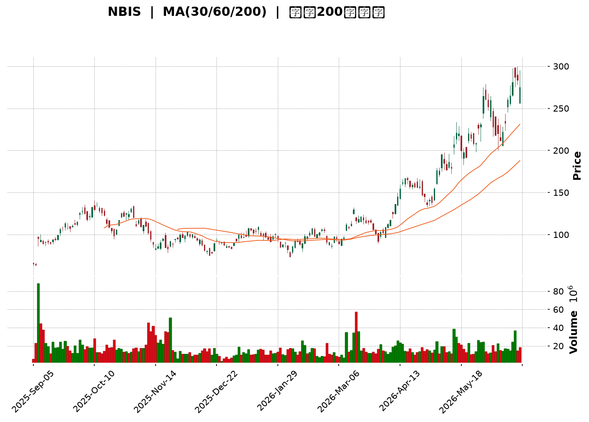
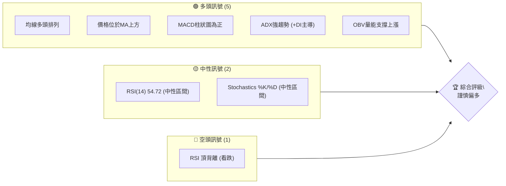
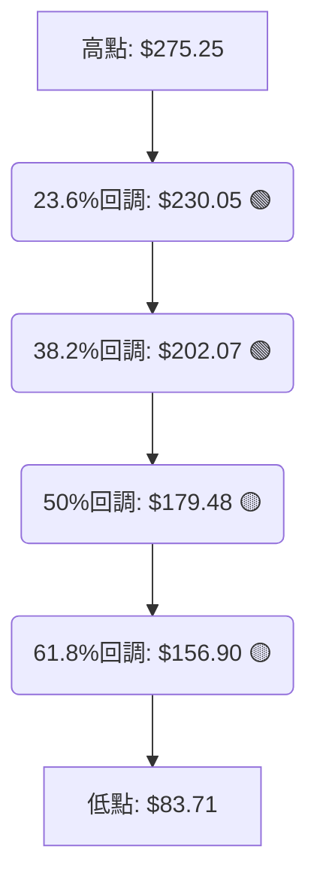
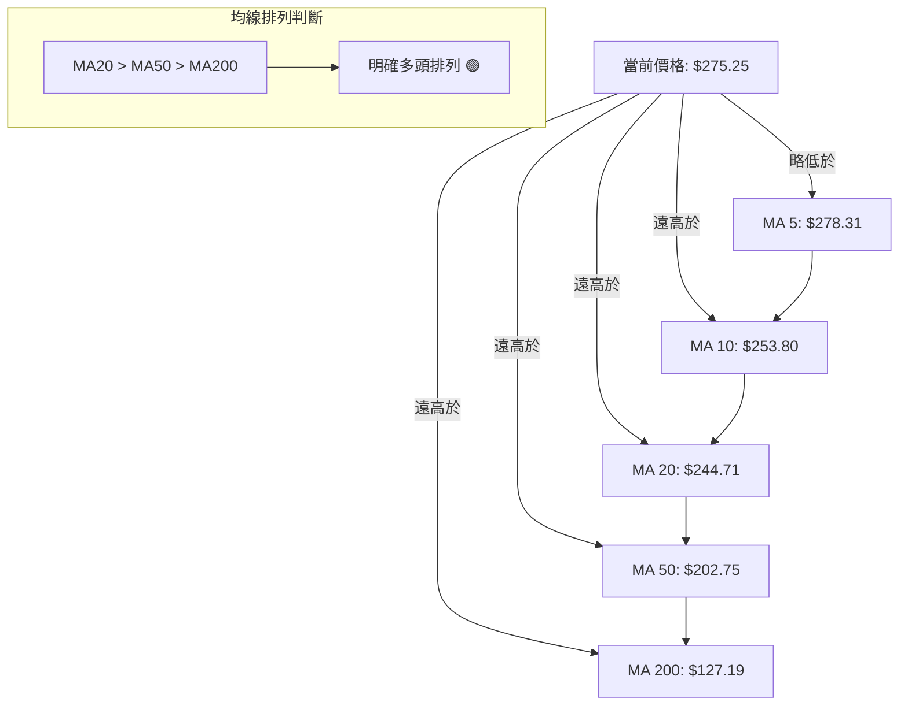
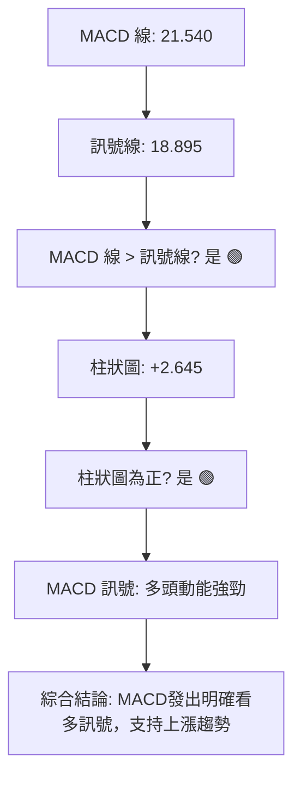

<details>
<summary>📊 靜態圖表 (點擊展開)</summary>

</details>

<html>
<head><meta charset="utf-8" /></head>
<body>
    <div style="height:500px; width:100%;">                        <script>window.PlotlyConfig = {MathJaxConfig: 'local'};</script>
        <script charset="utf-8" src="https://cdn.plot.ly/plotly-3.6.0.min.js" integrity="sha256-QaOVwtVY0T02VaHrr6pnoHLCwayMJp4O5n4YyaE3rJk=" crossorigin="anonymous"></script>                <div id="candlestick-chart" class="plotly-graph-div" style="height:100%; width:100%;"></div>            <script>                window.PLOTLYENV=window.PLOTLYENV || {};                                if (document.getElementById("candlestick-chart")) {                    Plotly.newPlot(                        "candlestick-chart",                        [{"close":{"dtype":"f8","bdata":"AAAAgBReUEAAAAAA1wNQQAAAAIAU7ldAAAAAwPVYV0AAAAAAKUxWQAAAAIA9mlZAAAAAoHC9VkAAAAAghVtWQAAAAMAehVdAAAAAIK6HV0AAAAAA19NYQAAAAGBmplpAAAAAQDPzWkAAAABguE5cQAAAAAAp\u002fFpAAAAAwMzsWkAAAACAFI5bQAAAAKBHEVxAAAAAQArnXEAAAAAgrndfQAAAAGC4\u002fl9AAAAAACk8X0AAAADAzGxdQAAAAAAAgF5AAAAA4HqUYEAAAABgjzJgQAAAAGC47mBAAAAAwMwEYEAAAADAHnVfQAAAAGCPwl5AAAAAAClcXEAAAAAAAEBbQAAAAIDrEVpAAAAAIK6nWEAAAACAPYpaQAAAAOCjUF1AAAAAIIVbX0AAAADAHnVeQAAAAGBmRl9AAAAAIIULX0AAAACAPVpgQAAAAIAUHl5AAAAAYI+iW0AAAAAAAEBdQAAAAAApXFtAAAAAgOvRW0AAAADAzHxbQAAAAIAUjllAAAAAQAqXV0AAAADgUShWQAAAAGCP4lRAAAAAYLh+VUAAAABgj6JWQAAAAOB6xFdAAAAAwPUoVUAAAADgo9BUQAAAAKCZ+VZAAAAA4FE4VkAAAAAAKaxXQAAAACCut1dAAAAAoJkJWUAAAADAzBxYQAAAAEDhulhAAAAAQDOzWUAAAABgj4JYQAAAAMAeFVlAAAAAgD0aWEAAAACAwmVXQAAAAIDrkVdAAAAAACnsVUAAAADA9UhUQAAAAMDMPFRAAAAAwMzcUkAAAACAwoVTQAAAAKBwXVZAAAAAYLhOV0AAAACA64FWQAAAAOBRyFZAAAAAgMLlVUAAAABgj4JVQAAAAEDhSlVAAAAAwB7tVEAAAADAzHxWQAAAAMAeNVdAAAAAIFwPWUAAAACgcA1YQAAAAEAzU1hAAAAAIIV7WEAAAADAHtVaQAAAACCFW1pAAAAAYLh+WUAAAADgo\u002fhZQAAAAGC4LltAAAAAYI\u002fSWEAAAAAgrrdYQAAAAGBmNlhAAAAAAACgV0AAAACgcN1WQAAAACCud1hAAAAAIIUbWUAAAACAPbpXQAAAAAApTFVAAAAAgD0KVkAAAADAzHxWQAAAAMD1mFRAAAAAIK53UkAAAABgZoZVQAAAAOBROFdAAAAAYI\u002fyVkAAAABACidWQAAAAGC4blZAAAAA4KOAWEAAAACgR2FYQAAAAEAzc1lAAAAAQArnWkAAAABA4XpYQAAAAEAKJ1lAAAAAwB6lWUAAAAAgrodaQAAAAOBROFpAAAAAACnMVkAAAADgo8BWQAAAAEAzs1VAAAAAgOtxWEAAAACgmelXQAAAAMAeVVZAAAAAACm8V0AAAAAghRtYQAAAACCu\u002f1tAAAAAYI8CW0AAAADAzDxcQAAAAEAzO2BAAAAAwB4VXUAAAAAA16NdQAAAAKBHYV5AAAAAIK5nXUAAAACgmYlcQAAAAIA9ulxAAAAAgMLFXEAAAACAFH5aQAAAAOB6NFlAAAAA4KMQV0AAAADgo\u002fBZQAAAAMDMfFlAAAAA4Ho0W0AAAABgjyJcQAAAAKCZWV1AAAAAAABAX0AAAABgjwphQAAAAEAKH2JAAAAAgOtRY0AAAACAFD5kQAAAAOCj2GRAAAAAQOGqZEAAAADgeqRjQAAAAMAe5WNAAAAAoJmRY0AAAADgeoRjQAAAAGCPomNAAAAAwB5lYkAAAABguB5iQAAAAOBR8GBAAAAAgBSmYUAAAAAgXEdhQAAAACCuT2NAAAAAoHANZkAAAACgcP1lQAAAAEDhYmhAAAAA4KMYZ0AAAACgmSFmQAAAAEAzQ2dAAAAAIIVjZkAAAADgo+hpQAAAAMDMpGtAAAAAgBR+a0AAAAAghftoQAAAACBct2hAAAAAgD36Z0AAAACAwn1rQAAAAOCj2GpAAAAAgOsBakAAAAAA1wtqQAAAAEDhSmxAAAAAQOHibEAAAAAAKYhwQAAAAKBHSXBAAAAAgMJ1b0AAAABguDpwQAAAAIDreWxAAAAAAABAa0AAAAAA14NrQAAAAIAUdmpAAAAAIK7Ha0AAAAAghQttQAAAAMAeQXBAAAAAoJmRcEAAAABgj45xQAAAAEAK63FAAAAAgMK5cUAAAAAAADRxQA=="},"high":{"dtype":"f8","bdata":"AAAAwPXYUEAAAADA9ahQQAAAACCFq1hAAAAA4KMgWUAAAAAgrndXQAAAAAAAAFdAAAAAQOGaV0AAAABAM9NWQAAAAAAAwFdAAAAAIIVrWEAAAABAM+NYQAAAAMAeJVtAAAAAYLh+W0AAAABgZrZcQAAAAMAehVxAAAAAIFx\u002fW0AAAACgRyFcQAAAAKCZaV1AAAAA4FH4XEAAAAAgXK9fQAAAAABUn2BAAAAA4FH4YEAAAADA9QhgQAAAAADXU19AAAAAgD2qYEAAAABAM6NhQAAAAMD1UGFAAAAAgBa5YEAAAAAgrn9gQAAAAEAKX2BAAAAAAKwkXkAAAACAFF5dQAAAACCFC1tAAAAAQDPzWkAAAAAgrqdaQAAAAMDMXF1AAAAAAACgX0AAAADA9SBgQAAAAMDMfF9AAAAAgBQOYEAAAADAzIRgQAAAAIDC3WBAAAAAgOsxXUAAAACgcI1dQAAAAAAAQF5AAAAAQDPTW0AAAAAgrpddQAAAAADXo1xAAAAAoJlpWkAAAABguN5WQAAAAAAAQFZAAAAAoJlpVkAAAAAAKWxXQAAAAIAULlhAAAAAACmsWUAAAAAgXC9WQAAAAAAAQFdAAAAAgOvRVkAAAACAk+hXQAAAAMAeRVhAAAAAYGZmWUAAAADAzLxZQAAAAADXw1hAAAAAgML1WUAAAABgZlZZQAAAAAAAIFlAAAAAIIM4WUAAAACAwkVYQAAAAMDM3FdAAAAAoJnpV0AAAAAgXA9WQAAAAADXY1RAAAAAQDMTVUAAAABgZhZUQAAAAGCPolZAAAAAoJn5V0AAAACAFD5XQAAAAEDh2lZAAAAAIK7nVkAAAABACidWQAAAAKBwvVVAAAAAgBSeVUAAAADgo7BWQAAAAAAp3FdAAAAAIIUrWUAAAABgZpZZQAAAAGCPollAAAAAgBQ+WkAAAAAghStbQAAAAMDM\u002fFpAAAAAwMysWkAAAADgUQhbQAAAAAAAoFtAAAAAgBQeWkAAAACgmZlZQAAAAGC4\u002fllAAAAA4KO4WEAAAADgUThZQAAAAGCP4lhAAAAAYGZ2WUAAAAAAANBYQAAAAGCPAldAAAAAAABQVkAAAADA9dhWQAAAAGCP6lVAAAAA4Ho0VEAAAACAPapVQAAAACCFa1dAAAAAAFTjV0AAAAAAALBXQAAAAOCjsFZAAAAA4HoUWUAAAABgj9JYQAAAAKCZGVpAAAAAYLj+WkAAAADgehRbQAAAAKBuSllAAAAAAADwWUAAAAAAKdxaQAAAAOB6FFtAAAAAQDPTWEAAAACgxNhWQAAAACCud1ZAAAAAYLieWEAAAAAAANBYQAAAAMDMvFdAAAAAwMzMV0AAAACgmZlYQAAAAMAehVxAAAAAYI\u002fCW0AAAADgeiRdQAAAAKCZiWBAAAAAAABgXkAAAABAibFeQAAAAEAzc15AAAAAAFbuXkAAAAAA11NeQAAAAEAzc11AAAAAQDOzXUAAAABAM1NcQAAAAOCjkFpAAAAAIFyPWUAAAADA9fhZQAAAACCu91pAAAAAoHA9W0AAAACAwnVcQAAAAKCZeV1AAAAAAADwX0AAAACgmRFhQAAAAIA9umJAAAAAAADwY0AAAABAM8NkQAAAAIDr2WRAAAAAYLgWZUAAAACA64FkQAAAAAAAOGRAAAAAAABoZEAAAACAwu1kQAAAAIDruWRAAAAAAACoZEAAAACgmZliQAAAAGC4rmFAAAAAYGb2YUAAAAAgXF9iQAAAAAAAgGNAAAAAwMxsZkAAAABguH5mQAAAACCuf2hAAAAA4Hq8aEAAAAAAAIhnQAAAAICXjmhAAAAAIIUzZ0AAAABA4SprQAAAACBcN21AAAAAoEeZbEAAAACAPUJrQAAAAIDrWWlAAAAAAACIaUAAAACA61lsQAAAAKBwvWtAAAAA4FGga0AAAADgejRqQAAAAOB6HG1AAAAAQDMzbUAAAACgxCxxQAAAAKBwbXFAAAAAIFy3cEAAAAAghYdwQAAAAAAAWG9AAAAAwMwMbkAAAADA9bRtQAAAACCu32xAAAAAIK6PbEAAAABA4XJuQAAAAOBRbnBAAAAAIIVVcUAAAABA4Z5yQAAAAMDMrHJAAAAAgMK9ckAAAAAgrnNyQA=="},"hovertemplate":"\u003cb\u003e%{x|%Y-%m-%d}\u003c\u002fb\u003e\u003cbr\u003e\u958b: $%{open:.2f}\u003cbr\u003e\u9ad8: $%{high:.2f}\u003cbr\u003e\u4f4e: $%{low:.2f}\u003cbr\u003e\u6536: $%{close:.2f}\u003cextra\u003e\u003c\u002fextra\u003e","low":{"dtype":"f8","bdata":"AAAAoEehT0AAAABgZuZPQAAAACCuh1VAAAAAAADAVkAAAABgjxpWQAAAAIDrsVVAAAAAgMI1VkAAAACgRwFWQAAAAMAeNVZAAAAAgOsBV0AAAAAAAFBXQAAAAKBHoVhAAAAAAAAQWkAAAABgZjZaQAAAAOBReFpAAAAAQDOzWUAAAADAHhVbQAAAAIA96ltAAAAA4KNwW0AAAADgeqRdQAAAAGBm5l5AAAAAIIU7X0AAAACAFO5cQAAAAAAAYF1AAAAAIK73XUAAAADgUQBgQAAAAMDMlGBAAAAAAABwX0AAAADAzIxeQAAAAKBHgV5AAAAA4FG4W0AAAADgo+BaQAAAAKCZWVlAAAAA4FGoV0AAAACgcN1YQAAAAOCjgFtAAAAAQAoHXkAAAACA6zFeQAAAAAAAYF1AAAAA4KNwXUAAAABAM5NfQAAAAAAA8F1AAAAAAABAW0AAAAAghdtbQAAAAIA9GltAAAAA4KNQWUAAAACAFC5bQAAAAMAe9VhAAAAAoHDtVkAAAAAAACBVQAAAAAAAgFRAAAAAgMLlVEAAAACgcG1UQAAAAEAz81ZAAAAAoHANVUAAAACgcI1TQAAAAKCZSVVAAAAA4CQuVUAAAADgo7BWQAAAAAApXFdAAAAA4KNAVkAAAAAA1wNYQAAAAAAAwFZAAAAAgBReWEAAAADAzAxYQAAAAEAz01dAAAAAYGYGWEAAAADAzAxXQAAAAMDMrFVAAAAAwMyMVUAAAACgGARUQAAAAOBROFNAAAAAAADQUkAAAADgo0BTQAAAAIA9ClRAAAAAYGbGVkAAAAAA1xNWQAAAAKCZKVZAAAAAIFyvVUAAAABgjxJVQAAAAADXI1VAAAAAoJm5VEAAAADgo4BVQAAAAMD1uFZAAAAAACm8VkAAAAAA1+NXQAAAACBYAVhAAAAAYGZGWEAAAABAMyNYQAAAAEDh+llAAAAAIIPYWEAAAABgZkZZQAAAAKBwLVlAAAAAgMKVWEAAAABgZkZXQAAAAAAAIFhAAAAAgOthV0AAAABACtdWQAAAAIDrYVdAAAAAACkcWEAAAACAPcpWQAAAACCuB1VAAAAAgBQOVUAAAAAAADBVQAAAAAApnFNAAAAAoEdhUkAAAAAgrkdTQAAAAADX81RAAAAAgD3qVkAAAADA9chVQAAAAAAp7FNAAAAAQAo3VkAAAAAAAGBXQAAAACDZNlhAAAAAIIUbWUAAAACA60FYQAAAAEAz01dAAAAAQN9vWEAAAABAM7NZQAAAAAAAgFlAAAAAoJkZVkAAAABAM7NVQAAAAIDr4VRAAAAAoJmJVkAAAAAgrudWQAAAAEAzM1ZAAAAAAACgVUAAAAAAAMBXQAAAACBcH1pAAAAAoEehWkAAAADA9YhbQAAAAGASG19AAAAAQApHXEAAAAAAAIBcQAAAAKBHsVxAAAAAgJMoXEAAAABAM2NcQAAAAOCjAFxAAAAAwB5VXEAAAACAPVpaQAAAAKBHEVlAAAAAwMppVkAAAABguO5XQAAAAGBmVllAAAAAACkMWEAAAADAzNxaQAAAAIDrkVtAAAAAYGbWXUAAAABAMyNfQAAAAOBR3GBAAAAAoJnJYUAAAADgo9BjQAAAAAAAkGNAAAAAQOECZEAAAAAgXFdjQAAAAKBHQWNAAAAAwMxsY0AAAABAM2tjQAAAAIA9QmNAAAAAgOs5YkAAAACA61FhQAAAAGBmlmBAAAAAQArHYEAAAAAAAOBgQAAAAAAAgGFAAAAAYGb2Y0AAAABguBZlQAAAACCF42VAAAAAAAAgZkAAAAAAABBmQAAAAKCZUWZAAAAAAACIZUAAAAAAAGBoQAAAAAAA+GlAAAAAoJl5akAAAABgj8JnQAAAAAAA4GZAAAAA4HrUZ0AAAACgmRlqQAAAACBcV2pAAAAAwB61aUAAAACA68loQAAAAOBRYGtAAAAAwMxMakAAAAAAAMBtQAAAAAAAPHBAAAAA4FHwbkAAAACAFFZtQAAAAIAUFmtAAAAAYGY2a0AAAACgmQlpQAAAAADXa2pAAAAAAACgaUAAAAAAAPBrQAAAACCup25AAAAAwMysb0AAAADgo4RwQAAAAEAzOXFAAAAAAABgcUAAAACgmfFvQA=="},"name":"\u50f9\u683c","open":{"dtype":"f8","bdata":"AAAAAACgUEAAAABA4SpQQAAAAMDMTFhAAAAAwPXoVkAAAABA4SpXQAAAAAApzFZAAAAAQAonV0AAAADAzMxWQAAAAEDh6lZAAAAAwMzEV0AAAADA9YhXQAAAAMDMfFlAAAAAYI8CW0AAAADgo0hbQAAAACCFA1tAAAAAIIV7W0AAAADgUVhbQAAAAOB6XFxAAAAAgMLtW0AAAACgR\u002fFeQAAAAEAKz19AAAAAwMyMYEAAAADAzPRfQAAAAMDMTF5AAAAAYLg+XkAAAABgZt5gQAAAAGC45mBAAAAAAACAYEAAAADAzHxgQAAAAEDhAmBAAAAAANeDXUAAAABgjzJdQAAAAOBR+FpAAAAAQDOrWkAAAADAHhVZQAAAAIA9yltAAAAAgD06XkAAAAAA15tfQAAAAIDrEV9AAAAAwMxMXkAAAADA9ahfQAAAAAAAwGBAAAAAYLgWXEAAAADA9WhcQAAAAEAz411AAAAAAAAgWkAAAAAghctcQAAAAOBRiFxAAAAAwMwMWkAAAADA9bhWQAAAAEAKl1RAAAAA4Hr0VEAAAACA6\u002fFUQAAAAOBRQFdAAAAAIIXbWEAAAABAM2NVQAAAAGC4jlVAAAAAYI9SVkAAAABgZnZXQAAAAEAzI1hAAAAAwMzcVkAAAABAChdZQAAAAKBHwVdAAAAA4HrEWEAAAACAwhVZQAAAAGCPUlhAAAAAgMKFWEAAAABguO5XQAAAAMDMTFZAAAAAANdTV0AAAABgZgZWQAAAAMDM5FNAAAAAgMIFVUAAAABAM8NTQAAAAKCZKVRAAAAAgBQ+V0AAAAAA15NWQAAAAGC4jlZAAAAA4KPgVkAAAADAzBxVQAAAAAAAmFVAAAAAIK5XVUAAAABACr9VQAAAAAAAwFdAAAAAgMLtV0AAAADgo8BYQAAAAGCPMlhAAAAAoEe5WEAAAADgepRYQAAAAMAe1VpAAAAAgOtxWkAAAAAghSNaQAAAACCuf1pAAAAAwB51WUAAAACAwkVZQAAAAOCjgFlAAAAAwMwsWEAAAACgcG1YQAAAAGBmlldAAAAAAAAAWUAAAABACpdYQAAAAKBD41ZAAAAAANdzVUAAAAAghXtWQAAAAAAAwFVAAAAAwPXIU0AAAABgZs5TQAAAAMDMHFVAAAAAYI86V0AAAABgjzpXQAAAAGBmBlVAAAAAQAp3VkAAAAAAAABYQAAAAGC47lhAAAAAIIUbWUAAAAAA06VaQAAAACCFE1hAAAAAIFzXWEAAAAAgXD9aQAAAAAAAgFpAAAAAwMysWEAAAAAAAABWQAAAAKCZiVVAAAAAoJmZVkAAAAAAADBYQAAAAEAzE1dAAAAAQArXVUAAAADA9chXQAAAAIA9SlpAAAAAgMJFW0AAAAAAKZxbQAAAAAAAMF9AAAAAgMIVXkAAAABAM7NcQAAAAOBR0FxAAAAAYGYeXkAAAACgcC1dQAAAAEAzC11AAAAAIK43XUAAAADgUVBcQAAAAMAedVpAAAAAIFyPWUAAAABguH5YQAAAAOB6fFpAAAAAgD0aWEAAAACAPSpbQAAAAAAAqFtAAAAA4FG4X0AAAAAAAEBfQAAAAOBR3GBAAAAAYGbWYUAAAABAMyNkQAAAAGA7B2RAAAAAAADgZEAAAADA9XhkQAAAAAAAoGNAAAAAQAonZEAAAAAghVtkQAAAAMDMfGNAAAAAoHB1ZEAAAADgeoxiQAAAAMDMTGFAAAAAQAqDYUAAAACA6yViQAAAAGCPqmFAAAAA4FEMZEAAAADAzHRlQAAAAEAKc2ZAAAAA4FHAZ0AAAABgZvZmQAAAAMDMfGZAAAAAoHCNZkAAAABACntpQAAAAAAArGpAAAAAIIUza0AAAABACi9rQAAAAAAA4GdAAAAAQAp\u002faUAAAAAgrndqQAAAAOBRaGtAAAAAoJmVa0AAAADAHvlpQAAAAAApzGxAAAAAIIV7bEAAAABA4YJuQAAAAKCZAXFAAAAAoHBDcEAAAAAgrvdtQAAAACCF225AAAAAwMwMbkAAAAAAAMBsQAAAAKDG72pAAAAA4HqsaUAAAADAzFRtQAAAAGC4fm9AAAAAQArvb0AAAABgZppwQAAAAEAzo3JAAAAAIFwfckAAAACAPQZwQA=="},"x":["2025-09-05T00:00:00-04:00","2025-09-08T00:00:00-04:00","2025-09-09T00:00:00-04:00","2025-09-10T00:00:00-04:00","2025-09-11T00:00:00-04:00","2025-09-12T00:00:00-04:00","2025-09-15T00:00:00-04:00","2025-09-16T00:00:00-04:00","2025-09-17T00:00:00-04:00","2025-09-18T00:00:00-04:00","2025-09-19T00:00:00-04:00","2025-09-22T00:00:00-04:00","2025-09-23T00:00:00-04:00","2025-09-24T00:00:00-04:00","2025-09-25T00:00:00-04:00","2025-09-26T00:00:00-04:00","2025-09-29T00:00:00-04:00","2025-09-30T00:00:00-04:00","2025-10-01T00:00:00-04:00","2025-10-02T00:00:00-04:00","2025-10-03T00:00:00-04:00","2025-10-06T00:00:00-04:00","2025-10-07T00:00:00-04:00","2025-10-08T00:00:00-04:00","2025-10-09T00:00:00-04:00","2025-10-10T00:00:00-04:00","2025-10-13T00:00:00-04:00","2025-10-14T00:00:00-04:00","2025-10-15T00:00:00-04:00","2025-10-16T00:00:00-04:00","2025-10-17T00:00:00-04:00","2025-10-20T00:00:00-04:00","2025-10-21T00:00:00-04:00","2025-10-22T00:00:00-04:00","2025-10-23T00:00:00-04:00","2025-10-24T00:00:00-04:00","2025-10-27T00:00:00-04:00","2025-10-28T00:00:00-04:00","2025-10-29T00:00:00-04:00","2025-10-30T00:00:00-04:00","2025-10-31T00:00:00-04:00","2025-11-03T00:00:00-05:00","2025-11-04T00:00:00-05:00","2025-11-05T00:00:00-05:00","2025-11-06T00:00:00-05:00","2025-11-07T00:00:00-05:00","2025-11-10T00:00:00-05:00","2025-11-11T00:00:00-05:00","2025-11-12T00:00:00-05:00","2025-11-13T00:00:00-05:00","2025-11-14T00:00:00-05:00","2025-11-17T00:00:00-05:00","2025-11-18T00:00:00-05:00","2025-11-19T00:00:00-05:00","2025-11-20T00:00:00-05:00","2025-11-21T00:00:00-05:00","2025-11-24T00:00:00-05:00","2025-11-25T00:00:00-05:00","2025-11-26T00:00:00-05:00","2025-11-28T00:00:00-05:00","2025-12-01T00:00:00-05:00","2025-12-02T00:00:00-05:00","2025-12-03T00:00:00-05:00","2025-12-04T00:00:00-05:00","2025-12-05T00:00:00-05:00","2025-12-08T00:00:00-05:00","2025-12-09T00:00:00-05:00","2025-12-10T00:00:00-05:00","2025-12-11T00:00:00-05:00","2025-12-12T00:00:00-05:00","2025-12-15T00:00:00-05:00","2025-12-16T00:00:00-05:00","2025-12-17T00:00:00-05:00","2025-12-18T00:00:00-05:00","2025-12-19T00:00:00-05:00","2025-12-22T00:00:00-05:00","2025-12-23T00:00:00-05:00","2025-12-24T00:00:00-05:00","2025-12-26T00:00:00-05:00","2025-12-29T00:00:00-05:00","2025-12-30T00:00:00-05:00","2025-12-31T00:00:00-05:00","2026-01-02T00:00:00-05:00","2026-01-05T00:00:00-05:00","2026-01-06T00:00:00-05:00","2026-01-07T00:00:00-05:00","2026-01-08T00:00:00-05:00","2026-01-09T00:00:00-05:00","2026-01-12T00:00:00-05:00","2026-01-13T00:00:00-05:00","2026-01-14T00:00:00-05:00","2026-01-15T00:00:00-05:00","2026-01-16T00:00:00-05:00","2026-01-20T00:00:00-05:00","2026-01-21T00:00:00-05:00","2026-01-22T00:00:00-05:00","2026-01-23T00:00:00-05:00","2026-01-26T00:00:00-05:00","2026-01-27T00:00:00-05:00","2026-01-28T00:00:00-05:00","2026-01-29T00:00:00-05:00","2026-01-30T00:00:00-05:00","2026-02-02T00:00:00-05:00","2026-02-03T00:00:00-05:00","2026-02-04T00:00:00-05:00","2026-02-05T00:00:00-05:00","2026-02-06T00:00:00-05:00","2026-02-09T00:00:00-05:00","2026-02-10T00:00:00-05:00","2026-02-11T00:00:00-05:00","2026-02-12T00:00:00-05:00","2026-02-13T00:00:00-05:00","2026-02-17T00:00:00-05:00","2026-02-18T00:00:00-05:00","2026-02-19T00:00:00-05:00","2026-02-20T00:00:00-05:00","2026-02-23T00:00:00-05:00","2026-02-24T00:00:00-05:00","2026-02-25T00:00:00-05:00","2026-02-26T00:00:00-05:00","2026-02-27T00:00:00-05:00","2026-03-02T00:00:00-05:00","2026-03-03T00:00:00-05:00","2026-03-04T00:00:00-05:00","2026-03-05T00:00:00-05:00","2026-03-06T00:00:00-05:00","2026-03-09T00:00:00-04:00","2026-03-10T00:00:00-04:00","2026-03-11T00:00:00-04:00","2026-03-12T00:00:00-04:00","2026-03-13T00:00:00-04:00","2026-03-16T00:00:00-04:00","2026-03-17T00:00:00-04:00","2026-03-18T00:00:00-04:00","2026-03-19T00:00:00-04:00","2026-03-20T00:00:00-04:00","2026-03-23T00:00:00-04:00","2026-03-24T00:00:00-04:00","2026-03-25T00:00:00-04:00","2026-03-26T00:00:00-04:00","2026-03-27T00:00:00-04:00","2026-03-30T00:00:00-04:00","2026-03-31T00:00:00-04:00","2026-04-01T00:00:00-04:00","2026-04-02T00:00:00-04:00","2026-04-06T00:00:00-04:00","2026-04-07T00:00:00-04:00","2026-04-08T00:00:00-04:00","2026-04-09T00:00:00-04:00","2026-04-10T00:00:00-04:00","2026-04-13T00:00:00-04:00","2026-04-14T00:00:00-04:00","2026-04-15T00:00:00-04:00","2026-04-16T00:00:00-04:00","2026-04-17T00:00:00-04:00","2026-04-20T00:00:00-04:00","2026-04-21T00:00:00-04:00","2026-04-22T00:00:00-04:00","2026-04-23T00:00:00-04:00","2026-04-24T00:00:00-04:00","2026-04-27T00:00:00-04:00","2026-04-28T00:00:00-04:00","2026-04-29T00:00:00-04:00","2026-04-30T00:00:00-04:00","2026-05-01T00:00:00-04:00","2026-05-04T00:00:00-04:00","2026-05-05T00:00:00-04:00","2026-05-06T00:00:00-04:00","2026-05-07T00:00:00-04:00","2026-05-08T00:00:00-04:00","2026-05-11T00:00:00-04:00","2026-05-12T00:00:00-04:00","2026-05-13T00:00:00-04:00","2026-05-14T00:00:00-04:00","2026-05-15T00:00:00-04:00","2026-05-18T00:00:00-04:00","2026-05-19T00:00:00-04:00","2026-05-20T00:00:00-04:00","2026-05-21T00:00:00-04:00","2026-05-22T00:00:00-04:00","2026-05-26T00:00:00-04:00","2026-05-27T00:00:00-04:00","2026-05-28T00:00:00-04:00","2026-05-29T00:00:00-04:00","2026-06-01T00:00:00-04:00","2026-06-02T00:00:00-04:00","2026-06-03T00:00:00-04:00","2026-06-04T00:00:00-04:00","2026-06-05T00:00:00-04:00","2026-06-08T00:00:00-04:00","2026-06-09T00:00:00-04:00","2026-06-10T00:00:00-04:00","2026-06-11T00:00:00-04:00","2026-06-12T00:00:00-04:00","2026-06-15T00:00:00-04:00","2026-06-16T00:00:00-04:00","2026-06-17T00:00:00-04:00","2026-06-18T00:00:00-04:00","2026-06-22T00:00:00-04:00","2026-06-23T00:00:00-04:00"],"type":"candlestick"},{"hovertemplate":"MA30: $%{y:.2f}\u003cextra\u003e\u003c\u002fextra\u003e","line":{"color":"#2196F3","dash":"dash","width":2},"mode":"lines","name":"MA30","x":["2025-09-05T00:00:00-04:00","2025-09-08T00:00:00-04:00","2025-09-09T00:00:00-04:00","2025-09-10T00:00:00-04:00","2025-09-11T00:00:00-04:00","2025-09-12T00:00:00-04:00","2025-09-15T00:00:00-04:00","2025-09-16T00:00:00-04:00","2025-09-17T00:00:00-04:00","2025-09-18T00:00:00-04:00","2025-09-19T00:00:00-04:00","2025-09-22T00:00:00-04:00","2025-09-23T00:00:00-04:00","2025-09-24T00:00:00-04:00","2025-09-25T00:00:00-04:00","2025-09-26T00:00:00-04:00","2025-09-29T00:00:00-04:00","2025-09-30T00:00:00-04:00","2025-10-01T00:00:00-04:00","2025-10-02T00:00:00-04:00","2025-10-03T00:00:00-04:00","2025-10-06T00:00:00-04:00","2025-10-07T00:00:00-04:00","2025-10-08T00:00:00-04:00","2025-10-09T00:00:00-04:00","2025-10-10T00:00:00-04:00","2025-10-13T00:00:00-04:00","2025-10-14T00:00:00-04:00","2025-10-15T00:00:00-04:00","2025-10-16T00:00:00-04:00","2025-10-17T00:00:00-04:00","2025-10-20T00:00:00-04:00","2025-10-21T00:00:00-04:00","2025-10-22T00:00:00-04:00","2025-10-23T00:00:00-04:00","2025-10-24T00:00:00-04:00","2025-10-27T00:00:00-04:00","2025-10-28T00:00:00-04:00","2025-10-29T00:00:00-04:00","2025-10-30T00:00:00-04:00","2025-10-31T00:00:00-04:00","2025-11-03T00:00:00-05:00","2025-11-04T00:00:00-05:00","2025-11-05T00:00:00-05:00","2025-11-06T00:00:00-05:00","2025-11-07T00:00:00-05:00","2025-11-10T00:00:00-05:00","2025-11-11T00:00:00-05:00","2025-11-12T00:00:00-05:00","2025-11-13T00:00:00-05:00","2025-11-14T00:00:00-05:00","2025-11-17T00:00:00-05:00","2025-11-18T00:00:00-05:00","2025-11-19T00:00:00-05:00","2025-11-20T00:00:00-05:00","2025-11-21T00:00:00-05:00","2025-11-24T00:00:00-05:00","2025-11-25T00:00:00-05:00","2025-11-26T00:00:00-05:00","2025-11-28T00:00:00-05:00","2025-12-01T00:00:00-05:00","2025-12-02T00:00:00-05:00","2025-12-03T00:00:00-05:00","2025-12-04T00:00:00-05:00","2025-12-05T00:00:00-05:00","2025-12-08T00:00:00-05:00","2025-12-09T00:00:00-05:00","2025-12-10T00:00:00-05:00","2025-12-11T00:00:00-05:00","2025-12-12T00:00:00-05:00","2025-12-15T00:00:00-05:00","2025-12-16T00:00:00-05:00","2025-12-17T00:00:00-05:00","2025-12-18T00:00:00-05:00","2025-12-19T00:00:00-05:00","2025-12-22T00:00:00-05:00","2025-12-23T00:00:00-05:00","2025-12-24T00:00:00-05:00","2025-12-26T00:00:00-05:00","2025-12-29T00:00:00-05:00","2025-12-30T00:00:00-05:00","2025-12-31T00:00:00-05:00","2026-01-02T00:00:00-05:00","2026-01-05T00:00:00-05:00","2026-01-06T00:00:00-05:00","2026-01-07T00:00:00-05:00","2026-01-08T00:00:00-05:00","2026-01-09T00:00:00-05:00","2026-01-12T00:00:00-05:00","2026-01-13T00:00:00-05:00","2026-01-14T00:00:00-05:00","2026-01-15T00:00:00-05:00","2026-01-16T00:00:00-05:00","2026-01-20T00:00:00-05:00","2026-01-21T00:00:00-05:00","2026-01-22T00:00:00-05:00","2026-01-23T00:00:00-05:00","2026-01-26T00:00:00-05:00","2026-01-27T00:00:00-05:00","2026-01-28T00:00:00-05:00","2026-01-29T00:00:00-05:00","2026-01-30T00:00:00-05:00","2026-02-02T00:00:00-05:00","2026-02-03T00:00:00-05:00","2026-02-04T00:00:00-05:00","2026-02-05T00:00:00-05:00","2026-02-06T00:00:00-05:00","2026-02-09T00:00:00-05:00","2026-02-10T00:00:00-05:00","2026-02-11T00:00:00-05:00","2026-02-12T00:00:00-05:00","2026-02-13T00:00:00-05:00","2026-02-17T00:00:00-05:00","2026-02-18T00:00:00-05:00","2026-02-19T00:00:00-05:00","2026-02-20T00:00:00-05:00","2026-02-23T00:00:00-05:00","2026-02-24T00:00:00-05:00","2026-02-25T00:00:00-05:00","2026-02-26T00:00:00-05:00","2026-02-27T00:00:00-05:00","2026-03-02T00:00:00-05:00","2026-03-03T00:00:00-05:00","2026-03-04T00:00:00-05:00","2026-03-05T00:00:00-05:00","2026-03-06T00:00:00-05:00","2026-03-09T00:00:00-04:00","2026-03-10T00:00:00-04:00","2026-03-11T00:00:00-04:00","2026-03-12T00:00:00-04:00","2026-03-13T00:00:00-04:00","2026-03-16T00:00:00-04:00","2026-03-17T00:00:00-04:00","2026-03-18T00:00:00-04:00","2026-03-19T00:00:00-04:00","2026-03-20T00:00:00-04:00","2026-03-23T00:00:00-04:00","2026-03-24T00:00:00-04:00","2026-03-25T00:00:00-04:00","2026-03-26T00:00:00-04:00","2026-03-27T00:00:00-04:00","2026-03-30T00:00:00-04:00","2026-03-31T00:00:00-04:00","2026-04-01T00:00:00-04:00","2026-04-02T00:00:00-04:00","2026-04-06T00:00:00-04:00","2026-04-07T00:00:00-04:00","2026-04-08T00:00:00-04:00","2026-04-09T00:00:00-04:00","2026-04-10T00:00:00-04:00","2026-04-13T00:00:00-04:00","2026-04-14T00:00:00-04:00","2026-04-15T00:00:00-04:00","2026-04-16T00:00:00-04:00","2026-04-17T00:00:00-04:00","2026-04-20T00:00:00-04:00","2026-04-21T00:00:00-04:00","2026-04-22T00:00:00-04:00","2026-04-23T00:00:00-04:00","2026-04-24T00:00:00-04:00","2026-04-27T00:00:00-04:00","2026-04-28T00:00:00-04:00","2026-04-29T00:00:00-04:00","2026-04-30T00:00:00-04:00","2026-05-01T00:00:00-04:00","2026-05-04T00:00:00-04:00","2026-05-05T00:00:00-04:00","2026-05-06T00:00:00-04:00","2026-05-07T00:00:00-04:00","2026-05-08T00:00:00-04:00","2026-05-11T00:00:00-04:00","2026-05-12T00:00:00-04:00","2026-05-13T00:00:00-04:00","2026-05-14T00:00:00-04:00","2026-05-15T00:00:00-04:00","2026-05-18T00:00:00-04:00","2026-05-19T00:00:00-04:00","2026-05-20T00:00:00-04:00","2026-05-21T00:00:00-04:00","2026-05-22T00:00:00-04:00","2026-05-26T00:00:00-04:00","2026-05-27T00:00:00-04:00","2026-05-28T00:00:00-04:00","2026-05-29T00:00:00-04:00","2026-06-01T00:00:00-04:00","2026-06-02T00:00:00-04:00","2026-06-03T00:00:00-04:00","2026-06-04T00:00:00-04:00","2026-06-05T00:00:00-04:00","2026-06-08T00:00:00-04:00","2026-06-09T00:00:00-04:00","2026-06-10T00:00:00-04:00","2026-06-11T00:00:00-04:00","2026-06-12T00:00:00-04:00","2026-06-15T00:00:00-04:00","2026-06-16T00:00:00-04:00","2026-06-17T00:00:00-04:00","2026-06-18T00:00:00-04:00","2026-06-22T00:00:00-04:00","2026-06-23T00:00:00-04:00"],"y":{"dtype":"f8","bdata":"AAAAAAAA+H8AAAAAAAD4fwAAAAAAAPh\u002fAAAAAAAA+H8AAAAAAAD4fwAAAAAAAPh\u002fAAAAAAAA+H8AAAAAAAD4fwAAAAAAAPh\u002fAAAAAAAA+H8AAAAAAAD4fwAAAAAAAPh\u002fAAAAAAAA+H8AAAAAAAD4fwAAAAAAAPh\u002fAAAAAAAA+H8AAAAAAAD4fwAAAAAAAPh\u002fAAAAAAAA+H8AAAAAAAD4fwAAAAAAAPh\u002fAAAAAAAA+H8AAAAAAAD4fwAAAAAAAPh\u002fAAAAAAAA+H8AAAAAAAD4fwAAAAAAAPh\u002fAAAAAAAA+H8AAAAAAAD4f97d3U1+AVtAIiIiUtRnW0De3d2Ns8dbQERERHT22VtAvLu7ux7lW0De3d2dUglcQLy7u0uaQlxAMzMzgyOMXEC8u7s7QtFcQJqZmUlvE11A3t3dDZBTXUCJiIi4yJZdQHd3d5dftF1A7+7u\u002fje6XUCrqqrqQsJdQN7d3R12xV1AZmZmRhnNXUARERHRhcxdQN7d3S0Vt11AiYiI2L+JXUBmZmbWTTpdQLy7u6t\u002f21xAERERUWKIXEBmZmZWcU5cQHd3d\u002ff9FFxAERERkZeuW0C8u7urxktbQJqZmRnZ7lpAIiIichKbWkCrqqrao1haQHd3d0eLHFpAq6qqKjEAWkARERExa+VZQKuqqur72VlAERERwebiWUBmZmYmlNFZQM3MzBx2rVlAMzMzU41vWUBERESETjNZQAAAALCO8VhAiYiISLajWEAAAABgujlYQO\u002fu7i5r5VdAzczMXI+aV0AAAABQjUdXQBEREZHtHFdAzczM3Gv2VkAzMzPj7MtWQEREREREtFZAERER8dKlVkBVVVV1TKBWQHd3d6fGo1ZAMzMzM+yeVkCrqqr6qZ1WQERERKTimFZAIiIiUiq6VkDv7u6+ytVWQN7d3d1P4VZAAAAAYJ70VkAAAACAlQ9XQKuqqqocJldAd3d3FwQqV0CJiIiY4DlXQKuqqirOTldAzczMPFFHV0B3d3eHFklXQLy7u\u002fupQVdA3t3d3ZY9V0CrqqqaCzlXQJqZmTm0QFdAZmZm9uFbV0CJiIg4QnlXQERERNRNgldAAAAAMGudV0BERERUuLZXQKuqqiqjp1dAZmZmBlZ+V0CJiIi483VXQERERHSveVdAd3d3N6WCV0B3d3fHIIhXQGZmZibbkVdAZmZmll+wV0ARERHRhcBXQCIiIqKo01dAMzMzo2HjV0BmZmaGB+dXQJqZmTkX7ldA7+7uvgL4V0DNzMzsbfVXQM3MzIxB9FdAVVVVxTzdV0De3d1NxcFXQJqZmZn8kldAAAAA8MOPV0AzMzNj5YhXQHd3d3faeFdARERExMp5V0DNzMwMZYRXQO\u002fu7i6HoldAIiIiQsOyV0AAAACAP9lXQBEREdGFOFhAREREZJ50WEBEREREp7FYQGZmZnYhBVlAvLu7y3ZiWUBmZmbWTZ5ZQImIiChNzVlAAAAAEAL\u002fWUAAAADwCiRaQN7d3Y2zO1pAmpmZSW8vWkCamZkpvzxaQERERBQRPVpAZmZm5qU\u002fWkDv7u5e1l5aQDMzM\u002fOnglpAIiIiQnyyWkAiIiLy7vJaQO\u002fu7m51SFtAZmZm5qXPW0AzMzMj92ZcQLy7u2uREV1AAAAAMLKhXUDNzMzs3yReQKuqqmrYuV5AERERsUc9X0AAAABQqbxfQN7d3d1rDmBAREREPCY4YEAiIiIaS1pgQAAAAKhUYGBAAAAAGNl6YECJiIhQ1I9gQDMzM1P\u002fsmBAzczMpLfxYECJiIj4mjNhQERERHQhiWFA3t3dvXTTYUAiIiJSRh9iQKuqqnI9emJAmpmZSeHWYkAzMzNrSkVjQO\u002fu7vZvxGNAIiIiIvc6ZECJiIhQG5hkQCIiIsLK7WRAMzMzExE1ZUAiIiJyPY5lQAAAAICx2GVAERERkcIRZkDNzMwMSUNmQBEREaHTgmZAMzMzw\u002fXIZkDv7u7ufDtnQJqZmVmrp2dA3t3dLSQNaEBmZmbGkntoQHd3d8cEx2hAIiIi0pQSaUAiIiKCwGJpQKuqqroCtGlAiYiIyHYKakDNzMyM3m5qQN7d3e1832pAvLu7exQ+a0ARERHBEa5rQJqZmanGD2xAERERkTR5bEBmZma28+FsQA=="},"type":"scatter"},{"hovertemplate":"MA60: $%{y:.2f}\u003cextra\u003e\u003c\u002fextra\u003e","line":{"color":"#9C27B0","dash":"dash","width":2},"mode":"lines","name":"MA60","x":["2025-09-05T00:00:00-04:00","2025-09-08T00:00:00-04:00","2025-09-09T00:00:00-04:00","2025-09-10T00:00:00-04:00","2025-09-11T00:00:00-04:00","2025-09-12T00:00:00-04:00","2025-09-15T00:00:00-04:00","2025-09-16T00:00:00-04:00","2025-09-17T00:00:00-04:00","2025-09-18T00:00:00-04:00","2025-09-19T00:00:00-04:00","2025-09-22T00:00:00-04:00","2025-09-23T00:00:00-04:00","2025-09-24T00:00:00-04:00","2025-09-25T00:00:00-04:00","2025-09-26T00:00:00-04:00","2025-09-29T00:00:00-04:00","2025-09-30T00:00:00-04:00","2025-10-01T00:00:00-04:00","2025-10-02T00:00:00-04:00","2025-10-03T00:00:00-04:00","2025-10-06T00:00:00-04:00","2025-10-07T00:00:00-04:00","2025-10-08T00:00:00-04:00","2025-10-09T00:00:00-04:00","2025-10-10T00:00:00-04:00","2025-10-13T00:00:00-04:00","2025-10-14T00:00:00-04:00","2025-10-15T00:00:00-04:00","2025-10-16T00:00:00-04:00","2025-10-17T00:00:00-04:00","2025-10-20T00:00:00-04:00","2025-10-21T00:00:00-04:00","2025-10-22T00:00:00-04:00","2025-10-23T00:00:00-04:00","2025-10-24T00:00:00-04:00","2025-10-27T00:00:00-04:00","2025-10-28T00:00:00-04:00","2025-10-29T00:00:00-04:00","2025-10-30T00:00:00-04:00","2025-10-31T00:00:00-04:00","2025-11-03T00:00:00-05:00","2025-11-04T00:00:00-05:00","2025-11-05T00:00:00-05:00","2025-11-06T00:00:00-05:00","2025-11-07T00:00:00-05:00","2025-11-10T00:00:00-05:00","2025-11-11T00:00:00-05:00","2025-11-12T00:00:00-05:00","2025-11-13T00:00:00-05:00","2025-11-14T00:00:00-05:00","2025-11-17T00:00:00-05:00","2025-11-18T00:00:00-05:00","2025-11-19T00:00:00-05:00","2025-11-20T00:00:00-05:00","2025-11-21T00:00:00-05:00","2025-11-24T00:00:00-05:00","2025-11-25T00:00:00-05:00","2025-11-26T00:00:00-05:00","2025-11-28T00:00:00-05:00","2025-12-01T00:00:00-05:00","2025-12-02T00:00:00-05:00","2025-12-03T00:00:00-05:00","2025-12-04T00:00:00-05:00","2025-12-05T00:00:00-05:00","2025-12-08T00:00:00-05:00","2025-12-09T00:00:00-05:00","2025-12-10T00:00:00-05:00","2025-12-11T00:00:00-05:00","2025-12-12T00:00:00-05:00","2025-12-15T00:00:00-05:00","2025-12-16T00:00:00-05:00","2025-12-17T00:00:00-05:00","2025-12-18T00:00:00-05:00","2025-12-19T00:00:00-05:00","2025-12-22T00:00:00-05:00","2025-12-23T00:00:00-05:00","2025-12-24T00:00:00-05:00","2025-12-26T00:00:00-05:00","2025-12-29T00:00:00-05:00","2025-12-30T00:00:00-05:00","2025-12-31T00:00:00-05:00","2026-01-02T00:00:00-05:00","2026-01-05T00:00:00-05:00","2026-01-06T00:00:00-05:00","2026-01-07T00:00:00-05:00","2026-01-08T00:00:00-05:00","2026-01-09T00:00:00-05:00","2026-01-12T00:00:00-05:00","2026-01-13T00:00:00-05:00","2026-01-14T00:00:00-05:00","2026-01-15T00:00:00-05:00","2026-01-16T00:00:00-05:00","2026-01-20T00:00:00-05:00","2026-01-21T00:00:00-05:00","2026-01-22T00:00:00-05:00","2026-01-23T00:00:00-05:00","2026-01-26T00:00:00-05:00","2026-01-27T00:00:00-05:00","2026-01-28T00:00:00-05:00","2026-01-29T00:00:00-05:00","2026-01-30T00:00:00-05:00","2026-02-02T00:00:00-05:00","2026-02-03T00:00:00-05:00","2026-02-04T00:00:00-05:00","2026-02-05T00:00:00-05:00","2026-02-06T00:00:00-05:00","2026-02-09T00:00:00-05:00","2026-02-10T00:00:00-05:00","2026-02-11T00:00:00-05:00","2026-02-12T00:00:00-05:00","2026-02-13T00:00:00-05:00","2026-02-17T00:00:00-05:00","2026-02-18T00:00:00-05:00","2026-02-19T00:00:00-05:00","2026-02-20T00:00:00-05:00","2026-02-23T00:00:00-05:00","2026-02-24T00:00:00-05:00","2026-02-25T00:00:00-05:00","2026-02-26T00:00:00-05:00","2026-02-27T00:00:00-05:00","2026-03-02T00:00:00-05:00","2026-03-03T00:00:00-05:00","2026-03-04T00:00:00-05:00","2026-03-05T00:00:00-05:00","2026-03-06T00:00:00-05:00","2026-03-09T00:00:00-04:00","2026-03-10T00:00:00-04:00","2026-03-11T00:00:00-04:00","2026-03-12T00:00:00-04:00","2026-03-13T00:00:00-04:00","2026-03-16T00:00:00-04:00","2026-03-17T00:00:00-04:00","2026-03-18T00:00:00-04:00","2026-03-19T00:00:00-04:00","2026-03-20T00:00:00-04:00","2026-03-23T00:00:00-04:00","2026-03-24T00:00:00-04:00","2026-03-25T00:00:00-04:00","2026-03-26T00:00:00-04:00","2026-03-27T00:00:00-04:00","2026-03-30T00:00:00-04:00","2026-03-31T00:00:00-04:00","2026-04-01T00:00:00-04:00","2026-04-02T00:00:00-04:00","2026-04-06T00:00:00-04:00","2026-04-07T00:00:00-04:00","2026-04-08T00:00:00-04:00","2026-04-09T00:00:00-04:00","2026-04-10T00:00:00-04:00","2026-04-13T00:00:00-04:00","2026-04-14T00:00:00-04:00","2026-04-15T00:00:00-04:00","2026-04-16T00:00:00-04:00","2026-04-17T00:00:00-04:00","2026-04-20T00:00:00-04:00","2026-04-21T00:00:00-04:00","2026-04-22T00:00:00-04:00","2026-04-23T00:00:00-04:00","2026-04-24T00:00:00-04:00","2026-04-27T00:00:00-04:00","2026-04-28T00:00:00-04:00","2026-04-29T00:00:00-04:00","2026-04-30T00:00:00-04:00","2026-05-01T00:00:00-04:00","2026-05-04T00:00:00-04:00","2026-05-05T00:00:00-04:00","2026-05-06T00:00:00-04:00","2026-05-07T00:00:00-04:00","2026-05-08T00:00:00-04:00","2026-05-11T00:00:00-04:00","2026-05-12T00:00:00-04:00","2026-05-13T00:00:00-04:00","2026-05-14T00:00:00-04:00","2026-05-15T00:00:00-04:00","2026-05-18T00:00:00-04:00","2026-05-19T00:00:00-04:00","2026-05-20T00:00:00-04:00","2026-05-21T00:00:00-04:00","2026-05-22T00:00:00-04:00","2026-05-26T00:00:00-04:00","2026-05-27T00:00:00-04:00","2026-05-28T00:00:00-04:00","2026-05-29T00:00:00-04:00","2026-06-01T00:00:00-04:00","2026-06-02T00:00:00-04:00","2026-06-03T00:00:00-04:00","2026-06-04T00:00:00-04:00","2026-06-05T00:00:00-04:00","2026-06-08T00:00:00-04:00","2026-06-09T00:00:00-04:00","2026-06-10T00:00:00-04:00","2026-06-11T00:00:00-04:00","2026-06-12T00:00:00-04:00","2026-06-15T00:00:00-04:00","2026-06-16T00:00:00-04:00","2026-06-17T00:00:00-04:00","2026-06-18T00:00:00-04:00","2026-06-22T00:00:00-04:00","2026-06-23T00:00:00-04:00"],"y":{"dtype":"f8","bdata":"AAAAAAAA+H8AAAAAAAD4fwAAAAAAAPh\u002fAAAAAAAA+H8AAAAAAAD4fwAAAAAAAPh\u002fAAAAAAAA+H8AAAAAAAD4fwAAAAAAAPh\u002fAAAAAAAA+H8AAAAAAAD4fwAAAAAAAPh\u002fAAAAAAAA+H8AAAAAAAD4fwAAAAAAAPh\u002fAAAAAAAA+H8AAAAAAAD4fwAAAAAAAPh\u002fAAAAAAAA+H8AAAAAAAD4fwAAAAAAAPh\u002fAAAAAAAA+H8AAAAAAAD4fwAAAAAAAPh\u002fAAAAAAAA+H8AAAAAAAD4fwAAAAAAAPh\u002fAAAAAAAA+H8AAAAAAAD4fwAAAAAAAPh\u002fAAAAAAAA+H8AAAAAAAD4fwAAAAAAAPh\u002fAAAAAAAA+H8AAAAAAAD4fwAAAAAAAPh\u002fAAAAAAAA+H8AAAAAAAD4fwAAAAAAAPh\u002fAAAAAAAA+H8AAAAAAAD4fwAAAAAAAPh\u002fAAAAAAAA+H8AAAAAAAD4fwAAAAAAAPh\u002fAAAAAAAA+H8AAAAAAAD4fwAAAAAAAPh\u002fAAAAAAAA+H8AAAAAAAD4fwAAAAAAAPh\u002fAAAAAAAA+H8AAAAAAAD4fwAAAAAAAPh\u002fAAAAAAAA+H8AAAAAAAD4fwAAAAAAAPh\u002fAAAAAAAA+H8AAAAAAAD4f6uqqsoEj1pAZmZmvgK0WkB3d3dfj9ZaQHd3dy\u002f52VpAZmZmvgLkWkAiIiJic+1aQERERDQI+FpAMzMza9j9WkAAAABgSAJbQM3MzPx+AltAMzMzK6P7WkBERESMQehaQDMzM2PlzFpA3t3drWOqWkBVVVUd6IRaQHd3d9cxcVpAmpmZkcJhWkAiIiJaOUxaQBEREbmsNVpAzczMZMkXWkDe3d0lTe1ZQJqZmSmjv1lAIiIiQqeTWUCJiIioDXZZQN7d3U3wVllAmpmZ8WA0WUBVVVW1yBBZQLy7u3sU6FhAERERadjHWEBVVVWtHLRYQBEREflToVhAERERoRqVWEDNzMzkpY9YQKuqqgpllFhA7+7u\u002fhuVWEDv7u5WVY1YQERERAyQd1hAiYiIGJJWWEB3d3cPLTZYQM3MzHQhGVhAd3d3H8z\u002fV0BERERMftlXQJqZmYHcs1dAZmZmRv2bV0AiIiLSIn9XQN7d3V1IYldAmpmZ8WA6V0De3d1N8CBXQERERNz5FldAREREFDwUV0BmZmaeNhRXQO\u002fu7ubQGldAzczM5KUnV0De3d3lFy9XQDMzM6NFNldAq6qq+sVOV0CrqqoiaV5XQLy7u4uzZ1dAd3d3j1B2V0BmZma2gYJXQLy7uxsvjVdAZmZmbqCDV0AzMzPz0n1XQCIiImLlcFdAZmZmloprV0BVVVX1\u002fWhXQJqZmTlCXVdAERER0bBbV0C8u7tTuF5XQERERLSdcVdAREREnFKHV0BERETcQKlXQKuqqtJp3VdAIiIiygQJWEBERETMLzRYQImIiFBiVlhAERERaWZwWEB3d3fHIIpYQGZmZk5+o1hAvLu7o9PAWEC8u7vbFdZYQCIiIlrH5lhAAAAAcOfvWEBVVVV9ov5YQDMzM9tcCFlAzczMxIMRWUCrqqry7iJZQGZmZpZfOFlAiYiIgD9VWUB3d3dvLnRZQN7d3X1bnllA3t3dVXHWWUCJiIg4XhRaQKuqqgJHUlpAAAAAELuYWkAAAACo4tZaQBEREXFZGVtAq6qqOolbW0BmZmYuh6BbQFVVVXWv31tAVVVV3YcRXEAiIiLa6kZcQImIiJCXfFxAIiIiSii1XECrqqryp+hcQGZmZg6QNV1Aq6qqCvOiXUC8u7vjwQJeQImIiAjIb15A3t3dxfXSXkAiIiLKSzFfQJqZmTkXmF9AZmZm7pjuX0AAAAAA1TFgQImIiEB8cWBAq6qqCmWtYEAAAABAw+NgQN7d3V2PF2FAIiIimidHYUCamZl12oNhQLy7uxt2vmFAIiIiwsr8YUAzMzNPYjtiQHd3dyvOhWJAmpmZbefMYkCrqqpy9iZjQHd3d8dLgmNAMzMzA+TVY0AzMzO38yxkQKuqqlK4amRAMzMzh12lZEAiIiLOhd5kQFVVVbErCmVARERE8KdCZUCrqqpuWX9lQImIiCA+yWVAREREEOYXZkDNzMxc1nBmQO\u002fu7g50zGZAd3d3p1QmZ0BEREQEnYBnQA=="},"type":"scatter"},{"hovertemplate":"MA200: $%{y:.2f}\u003cextra\u003e\u003c\u002fextra\u003e","line":{"color":"#FF6F00","dash":"solid","width":2},"mode":"lines","name":"MA200","x":["2025-09-05T00:00:00-04:00","2025-09-08T00:00:00-04:00","2025-09-09T00:00:00-04:00","2025-09-10T00:00:00-04:00","2025-09-11T00:00:00-04:00","2025-09-12T00:00:00-04:00","2025-09-15T00:00:00-04:00","2025-09-16T00:00:00-04:00","2025-09-17T00:00:00-04:00","2025-09-18T00:00:00-04:00","2025-09-19T00:00:00-04:00","2025-09-22T00:00:00-04:00","2025-09-23T00:00:00-04:00","2025-09-24T00:00:00-04:00","2025-09-25T00:00:00-04:00","2025-09-26T00:00:00-04:00","2025-09-29T00:00:00-04:00","2025-09-30T00:00:00-04:00","2025-10-01T00:00:00-04:00","2025-10-02T00:00:00-04:00","2025-10-03T00:00:00-04:00","2025-10-06T00:00:00-04:00","2025-10-07T00:00:00-04:00","2025-10-08T00:00:00-04:00","2025-10-09T00:00:00-04:00","2025-10-10T00:00:00-04:00","2025-10-13T00:00:00-04:00","2025-10-14T00:00:00-04:00","2025-10-15T00:00:00-04:00","2025-10-16T00:00:00-04:00","2025-10-17T00:00:00-04:00","2025-10-20T00:00:00-04:00","2025-10-21T00:00:00-04:00","2025-10-22T00:00:00-04:00","2025-10-23T00:00:00-04:00","2025-10-24T00:00:00-04:00","2025-10-27T00:00:00-04:00","2025-10-28T00:00:00-04:00","2025-10-29T00:00:00-04:00","2025-10-30T00:00:00-04:00","2025-10-31T00:00:00-04:00","2025-11-03T00:00:00-05:00","2025-11-04T00:00:00-05:00","2025-11-05T00:00:00-05:00","2025-11-06T00:00:00-05:00","2025-11-07T00:00:00-05:00","2025-11-10T00:00:00-05:00","2025-11-11T00:00:00-05:00","2025-11-12T00:00:00-05:00","2025-11-13T00:00:00-05:00","2025-11-14T00:00:00-05:00","2025-11-17T00:00:00-05:00","2025-11-18T00:00:00-05:00","2025-11-19T00:00:00-05:00","2025-11-20T00:00:00-05:00","2025-11-21T00:00:00-05:00","2025-11-24T00:00:00-05:00","2025-11-25T00:00:00-05:00","2025-11-26T00:00:00-05:00","2025-11-28T00:00:00-05:00","2025-12-01T00:00:00-05:00","2025-12-02T00:00:00-05:00","2025-12-03T00:00:00-05:00","2025-12-04T00:00:00-05:00","2025-12-05T00:00:00-05:00","2025-12-08T00:00:00-05:00","2025-12-09T00:00:00-05:00","2025-12-10T00:00:00-05:00","2025-12-11T00:00:00-05:00","2025-12-12T00:00:00-05:00","2025-12-15T00:00:00-05:00","2025-12-16T00:00:00-05:00","2025-12-17T00:00:00-05:00","2025-12-18T00:00:00-05:00","2025-12-19T00:00:00-05:00","2025-12-22T00:00:00-05:00","2025-12-23T00:00:00-05:00","2025-12-24T00:00:00-05:00","2025-12-26T00:00:00-05:00","2025-12-29T00:00:00-05:00","2025-12-30T00:00:00-05:00","2025-12-31T00:00:00-05:00","2026-01-02T00:00:00-05:00","2026-01-05T00:00:00-05:00","2026-01-06T00:00:00-05:00","2026-01-07T00:00:00-05:00","2026-01-08T00:00:00-05:00","2026-01-09T00:00:00-05:00","2026-01-12T00:00:00-05:00","2026-01-13T00:00:00-05:00","2026-01-14T00:00:00-05:00","2026-01-15T00:00:00-05:00","2026-01-16T00:00:00-05:00","2026-01-20T00:00:00-05:00","2026-01-21T00:00:00-05:00","2026-01-22T00:00:00-05:00","2026-01-23T00:00:00-05:00","2026-01-26T00:00:00-05:00","2026-01-27T00:00:00-05:00","2026-01-28T00:00:00-05:00","2026-01-29T00:00:00-05:00","2026-01-30T00:00:00-05:00","2026-02-02T00:00:00-05:00","2026-02-03T00:00:00-05:00","2026-02-04T00:00:00-05:00","2026-02-05T00:00:00-05:00","2026-02-06T00:00:00-05:00","2026-02-09T00:00:00-05:00","2026-02-10T00:00:00-05:00","2026-02-11T00:00:00-05:00","2026-02-12T00:00:00-05:00","2026-02-13T00:00:00-05:00","2026-02-17T00:00:00-05:00","2026-02-18T00:00:00-05:00","2026-02-19T00:00:00-05:00","2026-02-20T00:00:00-05:00","2026-02-23T00:00:00-05:00","2026-02-24T00:00:00-05:00","2026-02-25T00:00:00-05:00","2026-02-26T00:00:00-05:00","2026-02-27T00:00:00-05:00","2026-03-02T00:00:00-05:00","2026-03-03T00:00:00-05:00","2026-03-04T00:00:00-05:00","2026-03-05T00:00:00-05:00","2026-03-06T00:00:00-05:00","2026-03-09T00:00:00-04:00","2026-03-10T00:00:00-04:00","2026-03-11T00:00:00-04:00","2026-03-12T00:00:00-04:00","2026-03-13T00:00:00-04:00","2026-03-16T00:00:00-04:00","2026-03-17T00:00:00-04:00","2026-03-18T00:00:00-04:00","2026-03-19T00:00:00-04:00","2026-03-20T00:00:00-04:00","2026-03-23T00:00:00-04:00","2026-03-24T00:00:00-04:00","2026-03-25T00:00:00-04:00","2026-03-26T00:00:00-04:00","2026-03-27T00:00:00-04:00","2026-03-30T00:00:00-04:00","2026-03-31T00:00:00-04:00","2026-04-01T00:00:00-04:00","2026-04-02T00:00:00-04:00","2026-04-06T00:00:00-04:00","2026-04-07T00:00:00-04:00","2026-04-08T00:00:00-04:00","2026-04-09T00:00:00-04:00","2026-04-10T00:00:00-04:00","2026-04-13T00:00:00-04:00","2026-04-14T00:00:00-04:00","2026-04-15T00:00:00-04:00","2026-04-16T00:00:00-04:00","2026-04-17T00:00:00-04:00","2026-04-20T00:00:00-04:00","2026-04-21T00:00:00-04:00","2026-04-22T00:00:00-04:00","2026-04-23T00:00:00-04:00","2026-04-24T00:00:00-04:00","2026-04-27T00:00:00-04:00","2026-04-28T00:00:00-04:00","2026-04-29T00:00:00-04:00","2026-04-30T00:00:00-04:00","2026-05-01T00:00:00-04:00","2026-05-04T00:00:00-04:00","2026-05-05T00:00:00-04:00","2026-05-06T00:00:00-04:00","2026-05-07T00:00:00-04:00","2026-05-08T00:00:00-04:00","2026-05-11T00:00:00-04:00","2026-05-12T00:00:00-04:00","2026-05-13T00:00:00-04:00","2026-05-14T00:00:00-04:00","2026-05-15T00:00:00-04:00","2026-05-18T00:00:00-04:00","2026-05-19T00:00:00-04:00","2026-05-20T00:00:00-04:00","2026-05-21T00:00:00-04:00","2026-05-22T00:00:00-04:00","2026-05-26T00:00:00-04:00","2026-05-27T00:00:00-04:00","2026-05-28T00:00:00-04:00","2026-05-29T00:00:00-04:00","2026-06-01T00:00:00-04:00","2026-06-02T00:00:00-04:00","2026-06-03T00:00:00-04:00","2026-06-04T00:00:00-04:00","2026-06-05T00:00:00-04:00","2026-06-08T00:00:00-04:00","2026-06-09T00:00:00-04:00","2026-06-10T00:00:00-04:00","2026-06-11T00:00:00-04:00","2026-06-12T00:00:00-04:00","2026-06-15T00:00:00-04:00","2026-06-16T00:00:00-04:00","2026-06-17T00:00:00-04:00","2026-06-18T00:00:00-04:00","2026-06-22T00:00:00-04:00","2026-06-23T00:00:00-04:00"],"y":{"dtype":"f8","bdata":"AAAAAAAA+H8AAAAAAAD4fwAAAAAAAPh\u002fAAAAAAAA+H8AAAAAAAD4fwAAAAAAAPh\u002fAAAAAAAA+H8AAAAAAAD4fwAAAAAAAPh\u002fAAAAAAAA+H8AAAAAAAD4fwAAAAAAAPh\u002fAAAAAAAA+H8AAAAAAAD4fwAAAAAAAPh\u002fAAAAAAAA+H8AAAAAAAD4fwAAAAAAAPh\u002fAAAAAAAA+H8AAAAAAAD4fwAAAAAAAPh\u002fAAAAAAAA+H8AAAAAAAD4fwAAAAAAAPh\u002fAAAAAAAA+H8AAAAAAAD4fwAAAAAAAPh\u002fAAAAAAAA+H8AAAAAAAD4fwAAAAAAAPh\u002fAAAAAAAA+H8AAAAAAAD4fwAAAAAAAPh\u002fAAAAAAAA+H8AAAAAAAD4fwAAAAAAAPh\u002fAAAAAAAA+H8AAAAAAAD4fwAAAAAAAPh\u002fAAAAAAAA+H8AAAAAAAD4fwAAAAAAAPh\u002fAAAAAAAA+H8AAAAAAAD4fwAAAAAAAPh\u002fAAAAAAAA+H8AAAAAAAD4fwAAAAAAAPh\u002fAAAAAAAA+H8AAAAAAAD4fwAAAAAAAPh\u002fAAAAAAAA+H8AAAAAAAD4fwAAAAAAAPh\u002fAAAAAAAA+H8AAAAAAAD4fwAAAAAAAPh\u002fAAAAAAAA+H8AAAAAAAD4fwAAAAAAAPh\u002fAAAAAAAA+H8AAAAAAAD4fwAAAAAAAPh\u002fAAAAAAAA+H8AAAAAAAD4fwAAAAAAAPh\u002fAAAAAAAA+H8AAAAAAAD4fwAAAAAAAPh\u002fAAAAAAAA+H8AAAAAAAD4fwAAAAAAAPh\u002fAAAAAAAA+H8AAAAAAAD4fwAAAAAAAPh\u002fAAAAAAAA+H8AAAAAAAD4fwAAAAAAAPh\u002fAAAAAAAA+H8AAAAAAAD4fwAAAAAAAPh\u002fAAAAAAAA+H8AAAAAAAD4fwAAAAAAAPh\u002fAAAAAAAA+H8AAAAAAAD4fwAAAAAAAPh\u002fAAAAAAAA+H8AAAAAAAD4fwAAAAAAAPh\u002fAAAAAAAA+H8AAAAAAAD4fwAAAAAAAPh\u002fAAAAAAAA+H8AAAAAAAD4fwAAAAAAAPh\u002fAAAAAAAA+H8AAAAAAAD4fwAAAAAAAPh\u002fAAAAAAAA+H8AAAAAAAD4fwAAAAAAAPh\u002fAAAAAAAA+H8AAAAAAAD4fwAAAAAAAPh\u002fAAAAAAAA+H8AAAAAAAD4fwAAAAAAAPh\u002fAAAAAAAA+H8AAAAAAAD4fwAAAAAAAPh\u002fAAAAAAAA+H8AAAAAAAD4fwAAAAAAAPh\u002fAAAAAAAA+H8AAAAAAAD4fwAAAAAAAPh\u002fAAAAAAAA+H8AAAAAAAD4fwAAAAAAAPh\u002fAAAAAAAA+H8AAAAAAAD4fwAAAAAAAPh\u002fAAAAAAAA+H8AAAAAAAD4fwAAAAAAAPh\u002fAAAAAAAA+H8AAAAAAAD4fwAAAAAAAPh\u002fAAAAAAAA+H8AAAAAAAD4fwAAAAAAAPh\u002fAAAAAAAA+H8AAAAAAAD4fwAAAAAAAPh\u002fAAAAAAAA+H8AAAAAAAD4fwAAAAAAAPh\u002fAAAAAAAA+H8AAAAAAAD4fwAAAAAAAPh\u002fAAAAAAAA+H8AAAAAAAD4fwAAAAAAAPh\u002fAAAAAAAA+H8AAAAAAAD4fwAAAAAAAPh\u002fAAAAAAAA+H8AAAAAAAD4fwAAAAAAAPh\u002fAAAAAAAA+H8AAAAAAAD4fwAAAAAAAPh\u002fAAAAAAAA+H8AAAAAAAD4fwAAAAAAAPh\u002fAAAAAAAA+H8AAAAAAAD4fwAAAAAAAPh\u002fAAAAAAAA+H8AAAAAAAD4fwAAAAAAAPh\u002fAAAAAAAA+H8AAAAAAAD4fwAAAAAAAPh\u002fAAAAAAAA+H8AAAAAAAD4fwAAAAAAAPh\u002fAAAAAAAA+H8AAAAAAAD4fwAAAAAAAPh\u002fAAAAAAAA+H8AAAAAAAD4fwAAAAAAAPh\u002fAAAAAAAA+H8AAAAAAAD4fwAAAAAAAPh\u002fAAAAAAAA+H8AAAAAAAD4fwAAAAAAAPh\u002fAAAAAAAA+H8AAAAAAAD4fwAAAAAAAPh\u002fAAAAAAAA+H8AAAAAAAD4fwAAAAAAAPh\u002fAAAAAAAA+H8AAAAAAAD4fwAAAAAAAPh\u002fAAAAAAAA+H8AAAAAAAD4fwAAAAAAAPh\u002fAAAAAAAA+H8AAAAAAAD4fwAAAAAAAPh\u002fAAAAAAAA+H8AAAAAAAD4fwAAAAAAAPh\u002fAAAAAAAA+H\u002fXo3DNEMxfQA=="},"type":"scatter"}],                        {"template":{"data":{"barpolar":[{"marker":{"line":{"color":"rgb(17,17,17)","width":0.5},"pattern":{"fillmode":"overlay","size":10,"solidity":0.2}},"type":"barpolar"}],"bar":[{"error_x":{"color":"#f2f5fa"},"error_y":{"color":"#f2f5fa"},"marker":{"line":{"color":"rgb(17,17,17)","width":0.5},"pattern":{"fillmode":"overlay","size":10,"solidity":0.2}},"type":"bar"}],"carpet":[{"aaxis":{"endlinecolor":"#A2B1C6","gridcolor":"#506784","linecolor":"#506784","minorgridcolor":"#506784","startlinecolor":"#A2B1C6"},"baxis":{"endlinecolor":"#A2B1C6","gridcolor":"#506784","linecolor":"#506784","minorgridcolor":"#506784","startlinecolor":"#A2B1C6"},"type":"carpet"}],"choropleth":[{"colorbar":{"outlinewidth":0,"ticks":""},"type":"choropleth"}],"contourcarpet":[{"colorbar":{"outlinewidth":0,"ticks":""},"type":"contourcarpet"}],"contour":[{"colorbar":{"outlinewidth":0,"ticks":""},"colorscale":[[0.0,"#0d0887"],[0.1111111111111111,"#46039f"],[0.2222222222222222,"#7201a8"],[0.3333333333333333,"#9c179e"],[0.4444444444444444,"#bd3786"],[0.5555555555555556,"#d8576b"],[0.6666666666666666,"#ed7953"],[0.7777777777777778,"#fb9f3a"],[0.8888888888888888,"#fdca26"],[1.0,"#f0f921"]],"type":"contour"}],"heatmap":[{"colorbar":{"outlinewidth":0,"ticks":""},"colorscale":[[0.0,"#0d0887"],[0.1111111111111111,"#46039f"],[0.2222222222222222,"#7201a8"],[0.3333333333333333,"#9c179e"],[0.4444444444444444,"#bd3786"],[0.5555555555555556,"#d8576b"],[0.6666666666666666,"#ed7953"],[0.7777777777777778,"#fb9f3a"],[0.8888888888888888,"#fdca26"],[1.0,"#f0f921"]],"type":"heatmap"}],"histogram2dcontour":[{"colorbar":{"outlinewidth":0,"ticks":""},"colorscale":[[0.0,"#0d0887"],[0.1111111111111111,"#46039f"],[0.2222222222222222,"#7201a8"],[0.3333333333333333,"#9c179e"],[0.4444444444444444,"#bd3786"],[0.5555555555555556,"#d8576b"],[0.6666666666666666,"#ed7953"],[0.7777777777777778,"#fb9f3a"],[0.8888888888888888,"#fdca26"],[1.0,"#f0f921"]],"type":"histogram2dcontour"}],"histogram2d":[{"colorbar":{"outlinewidth":0,"ticks":""},"colorscale":[[0.0,"#0d0887"],[0.1111111111111111,"#46039f"],[0.2222222222222222,"#7201a8"],[0.3333333333333333,"#9c179e"],[0.4444444444444444,"#bd3786"],[0.5555555555555556,"#d8576b"],[0.6666666666666666,"#ed7953"],[0.7777777777777778,"#fb9f3a"],[0.8888888888888888,"#fdca26"],[1.0,"#f0f921"]],"type":"histogram2d"}],"histogram":[{"marker":{"pattern":{"fillmode":"overlay","size":10,"solidity":0.2}},"type":"histogram"}],"mesh3d":[{"colorbar":{"outlinewidth":0,"ticks":""},"type":"mesh3d"}],"parcoords":[{"line":{"colorbar":{"outlinewidth":0,"ticks":""}},"type":"parcoords"}],"pie":[{"automargin":true,"type":"pie"}],"scatter3d":[{"line":{"colorbar":{"outlinewidth":0,"ticks":""}},"marker":{"colorbar":{"outlinewidth":0,"ticks":""}},"type":"scatter3d"}],"scattercarpet":[{"marker":{"colorbar":{"outlinewidth":0,"ticks":""}},"type":"scattercarpet"}],"scattergeo":[{"marker":{"colorbar":{"outlinewidth":0,"ticks":""}},"type":"scattergeo"}],"scattergl":[{"marker":{"line":{"color":"#283442"}},"type":"scattergl"}],"scattermapbox":[{"marker":{"colorbar":{"outlinewidth":0,"ticks":""}},"type":"scattermapbox"}],"scattermap":[{"marker":{"colorbar":{"outlinewidth":0,"ticks":""}},"type":"scattermap"}],"scatterpolargl":[{"marker":{"colorbar":{"outlinewidth":0,"ticks":""}},"type":"scatterpolargl"}],"scatterpolar":[{"marker":{"colorbar":{"outlinewidth":0,"ticks":""}},"type":"scatterpolar"}],"scatter":[{"marker":{"line":{"color":"#283442"}},"type":"scatter"}],"scatterternary":[{"marker":{"colorbar":{"outlinewidth":0,"ticks":""}},"type":"scatterternary"}],"surface":[{"colorbar":{"outlinewidth":0,"ticks":""},"colorscale":[[0.0,"#0d0887"],[0.1111111111111111,"#46039f"],[0.2222222222222222,"#7201a8"],[0.3333333333333333,"#9c179e"],[0.4444444444444444,"#bd3786"],[0.5555555555555556,"#d8576b"],[0.6666666666666666,"#ed7953"],[0.7777777777777778,"#fb9f3a"],[0.8888888888888888,"#fdca26"],[1.0,"#f0f921"]],"type":"surface"}],"table":[{"cells":{"fill":{"color":"#506784"},"line":{"color":"rgb(17,17,17)"}},"header":{"fill":{"color":"#2a3f5f"},"line":{"color":"rgb(17,17,17)"}},"type":"table"}]},"layout":{"annotationdefaults":{"arrowcolor":"#f2f5fa","arrowhead":0,"arrowwidth":1},"autotypenumbers":"strict","coloraxis":{"colorbar":{"outlinewidth":0,"ticks":""}},"colorscale":{"diverging":[[0,"#8e0152"],[0.1,"#c51b7d"],[0.2,"#de77ae"],[0.3,"#f1b6da"],[0.4,"#fde0ef"],[0.5,"#f7f7f7"],[0.6,"#e6f5d0"],[0.7,"#b8e186"],[0.8,"#7fbc41"],[0.9,"#4d9221"],[1,"#276419"]],"sequential":[[0.0,"#0d0887"],[0.1111111111111111,"#46039f"],[0.2222222222222222,"#7201a8"],[0.3333333333333333,"#9c179e"],[0.4444444444444444,"#bd3786"],[0.5555555555555556,"#d8576b"],[0.6666666666666666,"#ed7953"],[0.7777777777777778,"#fb9f3a"],[0.8888888888888888,"#fdca26"],[1.0,"#f0f921"]],"sequentialminus":[[0.0,"#0d0887"],[0.1111111111111111,"#46039f"],[0.2222222222222222,"#7201a8"],[0.3333333333333333,"#9c179e"],[0.4444444444444444,"#bd3786"],[0.5555555555555556,"#d8576b"],[0.6666666666666666,"#ed7953"],[0.7777777777777778,"#fb9f3a"],[0.8888888888888888,"#fdca26"],[1.0,"#f0f921"]]},"colorway":["#636efa","#EF553B","#00cc96","#ab63fa","#FFA15A","#19d3f3","#FF6692","#B6E880","#FF97FF","#FECB52"],"font":{"color":"#f2f5fa"},"geo":{"bgcolor":"rgb(17,17,17)","lakecolor":"rgb(17,17,17)","landcolor":"rgb(17,17,17)","showlakes":true,"showland":true,"subunitcolor":"#506784"},"hoverlabel":{"align":"left"},"hovermode":"closest","mapbox":{"style":"dark"},"paper_bgcolor":"rgb(17,17,17)","plot_bgcolor":"rgb(17,17,17)","polar":{"angularaxis":{"gridcolor":"#506784","linecolor":"#506784","ticks":""},"bgcolor":"rgb(17,17,17)","radialaxis":{"gridcolor":"#506784","linecolor":"#506784","ticks":""}},"scene":{"xaxis":{"backgroundcolor":"rgb(17,17,17)","gridcolor":"#506784","gridwidth":2,"linecolor":"#506784","showbackground":true,"ticks":"","zerolinecolor":"#C8D4E3"},"yaxis":{"backgroundcolor":"rgb(17,17,17)","gridcolor":"#506784","gridwidth":2,"linecolor":"#506784","showbackground":true,"ticks":"","zerolinecolor":"#C8D4E3"},"zaxis":{"backgroundcolor":"rgb(17,17,17)","gridcolor":"#506784","gridwidth":2,"linecolor":"#506784","showbackground":true,"ticks":"","zerolinecolor":"#C8D4E3"}},"shapedefaults":{"line":{"color":"#f2f5fa"}},"sliderdefaults":{"bgcolor":"#C8D4E3","bordercolor":"rgb(17,17,17)","borderwidth":1,"tickwidth":0},"ternary":{"aaxis":{"gridcolor":"#506784","linecolor":"#506784","ticks":""},"baxis":{"gridcolor":"#506784","linecolor":"#506784","ticks":""},"bgcolor":"rgb(17,17,17)","caxis":{"gridcolor":"#506784","linecolor":"#506784","ticks":""}},"title":{"x":0.05},"updatemenudefaults":{"bgcolor":"#506784","borderwidth":0},"xaxis":{"automargin":true,"gridcolor":"#283442","linecolor":"#506784","ticks":"","title":{"standoff":15},"zerolinecolor":"#283442","zerolinewidth":2},"yaxis":{"automargin":true,"gridcolor":"#283442","linecolor":"#506784","ticks":"","title":{"standoff":15},"zerolinecolor":"#283442","zerolinewidth":2}}},"xaxis":{"rangeslider":{"visible":false},"title":{"text":"\u65e5\u671f"}},"font":{"size":11},"title":{"text":"NBIS  |  MA(30\u002f60\u002f200)  |  \u6700\u8fd1200\u4ea4\u6613\u65e5"},"yaxis":{"title":{"text":"\u80a1\u50f9 (USD)"}},"hovermode":"x unified","height":500},                        {"responsive": true}                    )                };            </script>        </div>
</body>
</html>

# NBIS 技術分析報告

> **報告日期**：2026-06-24 ｜ **語言**：繁體中文 ｜ **數據來源**：Yahoo Finance ｜ **當前價格**：$275.25

---

## 目錄

| 章節 | 內容 |
|------|------|
| [1. 技術面概覽](#1-技術面概覽) | 訊號儀表板、核心指標、評分卡 |
| [2. 趨勢分析](#2-趨勢分析) | 多時框趨勢、長中短期走勢 |
| [3. 圖表形態分析](#3-圖表形態分析) | 形態識別、K線組合、目標價 |
| [4. 支撐與阻力](#4-支撐與阻力) | 關鍵價位、斐波那契回調 |
| [5. 技術指標深度解讀](#5-技術指標深度解讀) | MA/RSI/MACD/布林/成交量 |
| [6. 動能與波動率](#6-動能與波動率) | 動能評估、ATR、Beta |
| [7. 多時框架總結](#7-多時框架總結) | 時框架評分矩陣 |
| [8. 交易策略建議](#8-交易策略建議) | 多空策略、風險報酬比 |
| [9. 風險提示與監控](#9-風險提示與監控) | 監控指標、風險場景 |

---

## 1. 技術面概覽

NBIS (Nebius Group N.V.) 目前正處於強勁的多頭趨勢中，股價位於52週高點的90.4%位置，顯示市場對其AI基礎設施業務抱有高度期待。然而，部分動能指標已開始出現預警訊號，尤其RSI的頂背離現象，提示投資者需警惕潛在的回調風險。

### 🎯 技術訊號儀表板

以下儀表板匯總了當前NBIS的主要技術訊號，提供快速的市場情緒概覽。



### 📊 核心指標速覽表

本表列出了NBIS當前關鍵技術指標的數值與初步解讀。

| 指標類別 | 指標名稱 | 當前數值 | 訊號 | 解讀 |
|----------|----------|----------|------|------|
| **價格** | 當前收盤價 | $275.25 | 🟢 | 接近52週高點，處於上升趨勢 |
| **均線** | MA20 | $244.71 | 🟢 | 價格位於MA20上方，短期支撐強勁 |
| **均線** | MA50 | $202.75 | 🟢 | 價格位於MA50上方，中期趨勢向上 |
| **均線** | MA200 | $127.19 | 🟢 | 價格位於MA200上方，長期趨勢強勁 |
| **動能** | RSI(14) | 54.72 | 🟡 | 位於中性區間，但存在頂背離預警 |
| **動能** | MACD | +2.645 (柱狀圖) | 🟢 | MACD線在訊號線上，柱狀圖為正，動能偏多 |
| **趨勢** | ADX(14) | 26.65 | 🟢 | 趨勢強度較強，多頭主導 (+DI > -DI) |
| **波動** | ATR(14) | $27.86 | 🔴 | 相對於股價10.12%，波動性較高 |
| **量能** | OBV趨勢 | OBV > MA | 🟢 | 成交量配合價格上漲，量能健康 |

### 🏆 技術評分卡

綜合多維度指標，NBIS的技術面表現被評為「謹慎偏多」，主要受強勁趨勢支撐，但動能指標的背離是主要風險。

```
技術評分卡 — NBIS (2026-06-24)
════════════════════════════════════════════════════
趨勢強度      ████████████████░░░░  80/100  🟢
動能指標      ██████████░░░░░░░░░░  50/100  🟡 (RSI背離為主要扣分點)
支撐穩定度    ██████████████░░░░░░  70/100  🟢
成交量配合    ██████████████░░░░░░  70/100  🟢
形態完整度    ████████░░░░░░░░░░░░  40/100  🟡 (無明確經典形態，但有潛在頂部跡象)
均線排列      ██████████████████░░  90/100  🟢
════════════════════════════════════════════════════
綜合評分      ████████████░░░░░░░░  67/100  🟡 謹慎偏多
════════════════════════════════════════════════════
```

---

## 2. 趨勢分析

NBIS的股價在過去12個月中展現了顯著的上升趨勢，尤其在近幾個月加速上漲，顯示出強勁的市場信心。

### 🌐 多時框趨勢分析

從長期到短期，NBIS的趨勢判斷如下：

```mermaid
graph TD
    A[長期趨勢 (月線)] --> B{強勁上升趨勢 🟢}
    B --> C[中期趨勢 (週線)]
    C --> D{加速上漲，但有動能背離跡象 🟡}
    D --> E[短期趨勢 (日線)]
    E --> F{高位震盪，面臨前期高點阻力 🟡}
    F --> G[綜合判斷]
    G --> H{整體趨勢強勁，但短期需警惕回調風險 🟡}
```

### 📈 長期趨勢 — 12個月走勢圖（Unicode）

NBIS在過去12個月的股價走勢呈現出一個明顯的、持續的上升通道。從2025年7月的低點$54.43，一路震盪走高，至2026年6月達到$275.25，漲幅驚人。

```
NBIS 月線走勢圖（過去12個月）
價格軸 ($)
$300 ┤                                        ●(275.25)
$275 ┤                                      ●
$250 ┤
$225 ┤                                    ●(231.09)
$200 ┤
$175 ┤
$150 ┤                                  ●(138.23)
$125 ┤                    ●(130.82)
$100 ┤          ●(112.27)         ●(103.76)
$ 75 ┤    ●(68.32)       ●(94.87) ●(91.19)
$ 50 ┤●(54.43)            ●(83.71) ●(85.19)
     └─────────────────────────────────────────────
      25/07 25/08 25/09 25/10 25/11 25/12 26/01 26/02 26/03 26/04 26/05 26/06
```

**走勢特徵分析表格**：

| 階段 | 時間區間 | 價格區間 | 漲跌幅 | 走勢特徵 |
|------|----------|----------|--------|----------|
| **啟動期** | 2025/07 - 2025/09 | $54.43 - $112.27 | +106.26% | 快速脫離底部，呈現強勁上升勢頭 |
| **調整期** | 2025/10 - 2025/12 | $130.82 - $83.71 | -36.01% | 達到階段高點後進行健康回調，測試支撐 |
| **盤整蓄勢** | 2026/01 - 2026/03 | $83.71 - $103.76 | +23.95% | 在低位區間震盪整理，為後續上漲積蓄動能 |
| **加速上漲** | 2026/04 - 2026/06 | $138.23 - $275.25 | +99.12% | 突破盤整區間後加速上漲，創下新高 |

### 📊 中期趨勢（週線分析）

從20週的週線數據來看，NBIS在2026年4月擺脫了$80-$120的盤整區間，隨後進入了快速拉升階段。最近一週 (2026-06-28) 收盤價為$275.25，較前一週的$286.69有所回落，顯示短線動能有所減弱，且面臨$299.86的52週高點壓力。

```
NBIS 近期壓力與支撐示意圖 (週線視角)
═════════════════════════════════════════════════════════
$299.86 ┤                     ▲  52週高點 (強阻力)
        │                     │
$286.69 ┤                     ●  前週高點 (短期阻力)
$275.25 ├─────────────────────●  當前價格
        │                     │
$244.71 ┤───────────────────  ─  MA20 (短期支撐)
        │                     │
$231.09 ┤───────────●───────  ─  前高點/盤整區上沿 (關鍵支撐)
$202.75 ┤───────────────────  ─  MA50 (中期支撐)
        │                     │
$188.02 ┤───────────────────  ─  MA60 (中期支撐)
═════════════════════════════════════════════════════════
```

### ⚡ 趨勢強度評估（ADX 解讀）

ADX指標用於衡量趨勢的強度，而非方向。當ADX值高於25時，表示趨勢強度較強；+DI線和-DI線則指示趨勢方向。

```mermaid
graph TD
    A[ADX(14)值: 26.65] --> B{ADX > 25? 是}
    B --> C[趨勢強度: 強勁 🟢]
    C --> D[+DI: 26.40, -DI: 18.98]
    D --> E{+DI > -DI? 是}
    E --> F[趨勢方向: 多頭主導 🟢]
    F --> G[綜合結論: NBIS處於一個強勁的多頭趨勢中]
```

**ADX強度對照表**：

| ADX 數值範圍 | 趨勢強度 | 解讀 |
|--------------|----------|------|
| 0 - 20       | 無趨勢或弱趨勢 | 股價盤整，方向不明 |
| 20 - 25      | 趨勢形成或中等強度 | 趨勢正在發展，可關注 |
| **25 - 50**  | **強趨勢**     | **趨勢明確，可尋找順勢交易機會** |
| 50 - 75      | 超強趨勢     | 趨勢非常強勁，可能接近極端 |
| 75 - 100     | 極端趨勢     | 趨勢過於強勁，可能面臨調整 |

NBIS的ADX值為26.65，明確指示當前處於強勁的趨勢行情中。同時，+DI (26.40) 高於 -DI (18.98)，進一步確認了多頭力量佔據主導地位。這意味著即使RSI出現頂背離，市場的整體上升慣性仍然強大，短期內趨勢反轉的可能性相對較低，更可能出現高位震盪或溫和回調。

---

## 3. 圖表形態分析

NBIS在過去一年的走勢呈現出一個強勁的上升通道，然而，近期在高位區間的震盪以及RSI的頂背離訊號，提示我們需警惕潛在的圖表形態變化。

### 🔍 形態識別系統

目前NBIS的價格走勢並未形成經典的頭肩頂、雙頂等反轉形態。但在連續上漲後，近期的價格波動可能正在構建一個較為複雜的頂部結構或旗形整理形態。

```mermaid
graph TD
    A[NBIS 價格走勢] --> B{強勁上升通道}
    B --> C[近期價格行為]
    C --> D{高位震盪 & 回落}
    D --> E{RSI 頂背離}
    E --> F[潛在形態]
    F --> G1[上升旗形/楔形整理 (若守住支撐)]
    F --> G2[潛在雙頂/M頭 (若跌破關鍵支撐並確認反轉)]
    G1 --> H[看漲延續 (突破旗形上沿)]
    G2 --> I[看跌反轉 (跌破頸線)]
```

### 🕯️ 重要K線形態分析

根據近20週的週線收盤價數據，我們可以觀察到一些關鍵的K線形態：

| 月份 | 收盤價 | K線形態 | 解讀 | 訊號 |
|------|--------|---------|------|------|
| 2026-03-15 | $112.95 | 長陽線 | 結束盤整，開啟上漲趨勢 | 🟢 |
| 2026-04-19 | $157.14 | 長陽線 | 強勁上漲動能，RSI進入超買區 | 🟢 |
| 2026-04-26 | $147.16 | 陰線 | 高位回調，但未破壞上升趨勢 | 🟡 |
| 2026-05-17 | $219.94 | 長陽線 | 加速上漲，突破前期高點 | 🟢 |
| 2026-05-24 | $214.77 | 陰線 | 高位震盪，短期獲利了結 | 🟡 |
| 2026-06-21 | $286.69 | 長陽線 | 再次強勁拉升，接近52週高點 | 🟢 |
| 2026-06-28 | $275.25 | 陰線 | 本週收陰，高位回落，顯示上方壓力，需警惕 | 🔴 |

最近一週 (2026-06-28) 的陰線收盤價$275.25，相較前一週的$286.69下跌，這在連續強勁上漲之後是一個值得關注的訊號。若此陰線伴隨較大成交量，且未能迅速收復，可能形成如「烏雲蓋頂」或「看跌吞噬」等反轉形態，特別是在RSI頂背離的背景下，增加了短期回調的可能性。

### 📉 ASCII 走勢形態示意圖

目前的價格走勢雖然強勁，但由於RSI頂背離，我們需要警惕潛在的「上升楔形」或「擴散頂」形態。以下示意圖描繪了可能的走勢。

```
NBIS 潛在形態示意圖 (上升楔形/擴散頂)
═════════════════════════════════════════════════════════
$299.86 ┤                      ▲ (52W高點 - 阻力)
        │                     ╱  ╲
$275.25 ├────────────────────●    ╲ (當前價格)
        │                   ╱      ╲
$250    ┤                  ╱        ╲
        │                 ╱          ╲
$225    ┤                ╱            ╲
        │               ╱              ╲
$200    ┤              ╱                ╲
        │             ╱                  ╲
$175    ┤            ╱                    ╲
        │           ╱                      ╲
$150    ┤          ● (157.14)               ╲
        │         ╱                          ╲
$125    ┤        ╱                            ╲
        │       ╱                              ╲
$100    ┤      ● (112.27)                       ╲
        │     ╱                                  ╲
$ 75    ┤    ● (83.71)                             ╲
        │   ╱                                      ╲
$ 50    ┤  ● (54.43)                                 ╲
     └─────────────────────────────────────────────────────
     時間軸 (從底部至當前)

解讀：
- 價格持續走高，但上漲斜率可能逐漸收斂 (楔形) 或波動幅度加大 (擴散頂)。
- RSI頂背離表示上漲動能減弱，即使價格創新高，力量已不如從前。
- 若跌破楔形下邊線或關鍵支撐，則可能確認形態反轉。
```

### 🎯 形態目標價計算

由於目前並未形成明確且可計算的經典反轉或延續形態，因此難以給出具體的形態目標價。但若未來形成：

1.  **上升楔形反轉**：若確認跌破楔形下邊線（例如在$240-$250區間），其潛在下跌目標通常為楔形啟動點或回調至形態高度的61.8%或100%。保守目標可能指向$200-$220區間。
2.  **雙頂形態**：若股價在$299.86附近形成兩個高點，並跌破兩高點之間的頸線（例如$231.09），則下跌目標價可計算為：頸線價 - (高點價 - 頸線價)。
    - 若以$299.86為高點，$231.09為頸線：$231.09 - ($299.86 - $231.09) = $231.09 - $68.77 = $162.32。
    - **目前此形態尚未確立，僅為潛在預警。**

綜合來看，在沒有明確形態確立之前，我們更多地依賴於支撐阻力位和指標訊號來判斷走勢。

---

## 4. 支撐與阻力

識別關鍵的支撐與阻力位對於制定交易策略至關重要。NBIS目前正處於接近52週高點的位置，上方阻力顯而易見，下方則有多重移動平均線和斐波那契回調位提供支撐。

### 🗺️ 關鍵價位分布圖（Unicode）

以下是NBIS當前價位結構的分布圖，標示了重要的阻力與支撐區間。

```
NBIS 價位結構分布圖
═══════════════════════════════════════════════════
$380.00 ║████████████████████████║ 🎯 分析師高目標價 (R4)
$299.86 ║████████████████████████║ 強阻力 R3 (52週高點)
$298.26 ║████████████████████    ║ 阻力 R2 (布林通道上軌)
$286.69 ║████████████████████████║ 關鍵阻力 R1 (前週高點)
$275.25 ╠════════════════════════╣ ◄ 現價
$244.71 ║▓▓▓▓▓▓▓▓▓▓▓▓▓▓▓▓        ║ 近期支撐 S1 (MA20 / 布林中軌)
$231.09 ║████████████████████████║ 強支撐 S2 (前期高點 / 斐波那契38.2%回調)
$202.75 ║▓▓▓▓▓▓▓▓▓▓▓▓▓▓▓▓▓▓▓▓▓▓▓▓║ 中期支撐 S3 (MA50 / 斐波那契38.2%回調)
$191.15 ║████████████████████████║ 強支撐 S4 (布林通道下軌)
$127.19 ║▓▓▓▓▓▓▓▓▓▓▓▓▓▓▓▓▓▓▓▓▓▓▓▓║ 長期支撐 S5 (MA200)
═══════════════════════════════════════════════════
```

### 🚧 阻力位分析表

NBIS上方阻力層層疊疊，突破需要強勁的買盤動能。

| 阻力級別 | 價位 | 形成原因 | 突破難度 | 重要性 |
|----------|------|----------|----------|--------|
| **R1**   | $286.69 | 前一週收盤高點，短期賣壓 | 中等 | 🟢 需突破以延續漲勢 |
| **R2**   | $298.26 | 布林通道上軌，短期技術壓力 | 中等 | 🟡 突破代表股價強勢 |
| **R3**   | $299.86 | **52週高點，歷史高位壓力** | 高 | 🔴 **突破將創歷史新高，意義重大** |
| **R4**   | $327.34 | 斐波那契1.272擴展目標 | 中高 | 🟡 突破R3後的潛在目標 |
| **R5**   | $380.00 | 分析師共識高目標價 | 高 | 🔴 長期潛在目標，需基本面配合 |

### 🛡️ 支撐位分析表

NBIS下方支撐較為穩固，尤其多條移動平均線和斐波那契回調位構成強大支撐帶。

| 支撐級別 | 價位 | 形成原因 | 守住機率 | 重要性 |
|----------|------|----------|----------|--------|
| **S1**   | $244.71 | MA20 / 布林通道中軌 | 高 | 🟢 短期上升趨勢的關鍵防線 |
| **S2**   | $231.09 | 前期高點 / 斐波那契38.2%回調 | 高 | 🟢 若回調此處並企穩，是良好買點 |
| **S3**   | $202.75 | MA50 / 斐波那契38.2%回調 | 較高 | 🟡 中期趨勢的關鍵支撐，跌破則趨勢轉弱 |
| **S4**   | $191.15 | 布林通道下軌 | 較高 | 🟡 極端回調的潛在支撐，跌破則可能加速下跌 |
| **S5**   | $127.19 | MA200 | 極高 | 🔴 長期牛市的最後防線，跌破意味長期趨勢反轉 |

### 📐 斐波那契回調位分析

我們以最近一波主要上漲行情，即從2025年12月的階段低點$83.71到2026年6月當前高點$275.25作為斐波那契回調的計算區間。

-   **斐波那契回調基準**：
    -   低點 (100%): $83.71 (2025-12)
    -   高點 (0%): $275.25 (2026-06)
    -   波動區間: $275.25 - $83.71 = $191.54

-   **關鍵回調位計算**：
    -   **23.6% 回調位**：$275.25 - ($191.54 * 0.236) = $275.25 - $45.20 = **$230.05** (接近前期高點$231.09，形成強支撐)
    -   **38.2% 回調位**：$275.25 - ($191.54 * 0.382) = $275.25 - $73.18 = **$202.07** (與MA50的$202.75高度重合，形成極強支撐帶)
    -   **50% 回調位**：$275.25 - ($191.54 * 0.50) = $275.25 - $95.77 = **$179.48**
    -   **61.8% 回調位**：$275.25 - ($191.54 * 0.618) = $275.25 - $118.35 = **$156.90** (接近MA120)



**分析**：
斐波那契23.6%回調位 ($230.05) 與MA20 ($244.71) 和近期高點 ($231.09) 構成了一個重要的短期支撐區間。若股價回調至此區間並獲得支撐，則多頭趨勢仍有望延續。
而38.2%回調位 ($202.07) 與MA50 ($202.75) 的匯合，則形成了更為堅固的中期支撐帶。若股價跌破此處，則中期趨勢可能面臨較大考驗。

---

## 5. 技術指標深度解讀

本節將對NBIS的關鍵技術指標進行深入分析，評估其各自發出的訊號，並探討它們之間的相互印證或矛盾之處。

### 🎛️ 指標訊號總覽

以下Mermaid圖展示了各主要技術指標的當前狀態及其發出的多空訊號。

```mermaid
graph TD
    A[NBIS 指標訊號總覽] --> B{價格行為}
    B --> B1[收盤價 $275.25]
    B1 --> B2[52W區間 90.4%]

    A --> C{趨勢指標}
    C --> C1[MA20 ($244.71) 🟢]
    C --> C2[MA50 ($202.75) 🟢]
    C --> C3[MA200 ($127.19) 🟢]
    C --> C4[均線多頭排列 🟢]
    C --> C5[ADX(14) 26.65 (強趨勢) 🟢]
    C5 --> C6[+DI > -DI (多頭主導) 🟢]

    A --> D{動能指標}
    D --> D1[RSI(14) 54.72 (中性) 🟡]
    D1 --> D2[RSI 頂背離 (看跌預警) 🔴]
    D --> D3[MACD 21.540 (看多) 🟢]
    D3 --> D4[MACD Signal 18.895 (看多) 🟢]
    D3 --> D5[MACD Hist +2.645 (看多) 🟢]
    D --> D6[Stoch %K 75.28 / %D 82.22 (中性偏高) 🟡]

    A --> E{波動率與量能}
    E --> E1[ATR(14) $27.86 (高波動) 🔴]
    E --> E2[BB上軌 $298.26 🟡]
    E2 --> E3[BB中軌 $244.71 🟢]
    E2 --> E4[BB下軌 $191.15 🟢]
    E2 --> E5[BB %B 0.79 (近上軌) 🟡]
    E --> E6[成交量比 1.00x (正常) 🟡]
    E --> E7[OBV趨勢 (量能支撐上漲) 🟢]
```

### 📈 移動平均線排列分析

NBIS的移動平均線系統呈現出經典的多頭排列，這是強勁上升趨勢的明確訊號。



**分析**：
-   **均線多頭排列 (MA20 > MA50 > MA200)**：這是最為強勁的多頭趨勢訊號，表示各週期買方力量均佔優勢。
-   **價格位於所有均線之上**：目前股價$275.25顯著高於所有主要移動平均線，表明上漲動能充足，且均線構成堅實的層層支撐。
-   **短期均線走勢**：MA5 ($278.31) 略高於當前價格，且MA5的趨勢線顯示近期有小幅回落跡象。MA10 ($253.80) 和MA20 ($244.71) 仍在穩步上升，為短期支撐。
-   **中期/長期均線走勢**：MA60 ($188.02), MA120 ($143.68), MA240 ($116.07) 均呈現強勁的上升趨勢，且距離當前價格較遠，提供了非常穩固的長期支撐。

總體而言，均線系統發出了非常強烈的看多訊號，顯示NBIS的長期和中期上升趨勢非常健康。

### 📉 RSI(14) 分析

RSI (相對強弱指標) 用於衡量價格變動的速度和變化，判斷資產的超買或超賣狀態。

-   **RSI 數值進度條**：
    RSI(14): 54.72 ▓▓▓▓▓▓▓▓▓▓▓▓░░░░░░░░ 54.72% 🟡
    -   位於30-70的中性區間，表明當前市場既非超買也非超賣，但數值偏中上，仍有上漲空間。

-   **超買超賣區間分析**：
    -   RSI < 30: 超賣區，可能反彈
    -   RSI > 70: 超買區，可能回調
    -   當前RSI 54.72，位於中性區間。但從20週數據看，RSI在4月19日達到79.2，5月17日達到74.5，都曾進入超買區，隨後價格有所回調，顯示RSI的超買訊號具有一定的預警作用。

-   **背離判斷**：
    -   **⚠️ 頂背離 (Bearish Divergence)**：數據明確指出存在RSI頂背離。這是一個重要的看跌預警訊號。
    -   **解讀**：頂背離通常發生在股價創出更高的高點（或接近更高的高點），但RSI未能同步創出更高的高點，反而走低。這表明儘管價格仍在上升，但上漲的動能已經減弱，買盤力量開始衰竭，預示著潛在的趨勢反轉或至少是較大幅度的回調。
    -   **影響**：在強勁的多頭趨勢中，RSI頂背離可能不會立即導致趨勢反轉，但通常會引發一段時間的盤整、回調或上漲速度放緩。投資者應對此保持高度警惕。

### 📊 MACD(12/26/9) 訊號解讀

MACD (移動平均聚散指標) 用於識別趨勢的方向、強度、動能和持續時間。



**分析**：
-   **MACD線 (21.540) 高於訊號線 (18.895)**：這是MACD最基本的買入訊號，表明短期動能強於中期動能，趨勢向上。
-   **MACD柱狀圖 (+2.645) 為正**：柱狀圖為正且數值較大，進一步確認了多頭動能的存在。
-   **趨勢配合**：MACD的看多訊號與移動平均線的多頭排列相符，共同確認了當前市場的上升趨勢。
-   **與RSI背離的矛盾**：MACD目前仍顯示多頭動能，而RSI已出現頂背離。這種情況表明市場可能處於一個「動能遲滯」階段。MACD作為趨勢追蹤指標，其反應相對滯後；而RSI作為震盪指標，可能更早地捕捉到動能的變化。因此，雖然MACD目前仍偏多，但RSI的預警不容忽視。這提示我們，強勁的上升趨勢可能正在失去其內在的爆發力。

### 📦 布林通道分析

布林通道 (Bollinger Bands) 由中軌 (通常是MA20)、上軌和下軌組成，用於衡量股價的波動範圍和相對高低。

```
NBIS 布林通道示意圖
═════════════════════════════════════════════════════════
$298.26 ┤                 ▲ 上軌 (BB Upper)
        │                ╱
$275.25 ├────────────────● 現價 ($275.25)
        │               ╱
$244.71 ┤──────────────── 中軌 (MA20)
        │              ╱
$219.94 ┤             ● (前高點)
        │            ╱
$191.15 ┤──────────── 下軌 (BB Lower)
        │           ╱
$150    ┤          ╱
     └─────────────────────────────────────────────────────
     時間軸 (近期)
```

**分析**：
-   **布林通道軌道**：
    -   上軌: $298.26
    -   中軌 (MA20): $244.71
    -   下軌: $191.15
-   **股價位置**：當前價格$275.25位於布林通道中軌和上軌之間，且更接近上軌。
-   **%B 值**：0.79。%B值在0.5-1之間，表示股價在中軌和上軌之間運行，且靠近上軌。這表明股價處於相對強勢區域，但並未觸及或突破上軌，因此尚未進入極端超買狀態。
-   **通道開口**：數據未直接提供布林通道寬度，但從軌道數值看，通道有一定寬度，顯示波動性存在。
-   **潛在壓力**：上軌$298.26與52週高點$299.86非常接近，共同構成了短期內的強勁阻力區。若股價能有效突破此區，則有望進一步上漲；若在此受阻回落，則可能向中軌靠攏。

### 💹 成交量分析（量價配合度）

成交量是確認價格走勢的重要輔助指標，OBV (On Balance Volume) 則通過累計成交量來判斷資金流向。

-   **最新成交量**：18,422,605
-   **20日均量**：18,350,385 (量比: 1.00x)
-   **50日均量**：17,793,304
-   **OBV趨勢**：OBV > MA → 量能支撐上漲 🟢

**分析**：
-   **量比接近1.00x**：當前成交量與20日均量大致持平，表明市場活躍度正常，沒有出現異常的放量或縮量。這在一個強勁趨勢中是健康的表現，沒有過度炒作的跡象。
-   **OBV趨勢看多**：OBV線高於其移動平均線，這是一個看漲訊號。它表明在股價上漲時的成交量大於下跌時的成交量，資金持續流入，量能對價格的上漲構成有力支撐。
-   **量價配合**：整體而言，成交量與價格走勢配合良好，OBV確認了多頭趨勢的量能基礎。然而，在RSI頂背離的背景下，如果股價在高位震盪或回落時出現放量，則需警惕資金流出的風險。目前未見此類訊號，但需持續監控。

---

## 6. 動能與波動率

NBIS的股價在強勁趨勢中展現出較高的波動性，動能指標雖有看多訊號，但也伴隨著RSI頂背離的預警。

### ⚡ 動能評估四象限

我們將從「動能強度」和「波動率」兩個維度來評估NBIS的當前狀態。

| 象限 | 動能 (RSI, MACD, Stoch) | 波動 (ATR) | 當前狀態 | 評估 |
|------|--------------------------|------------|----------|------|
| Q1   | 強勁                     | 低         | -        | 最佳機會 (穩定上漲) |
| Q2   | 弱                       | 低         | -        | 謹慎觀望 (盤整蓄勢) |
| **Q3** | **強勁 (但有背離預警)**  | **高 ($27.86)** | **✓**    | **高風險高收益 (快速上漲/下跌)** |
| Q4   | 弱                       | 高         | -        | 避免進場 (混亂震盪) |

**分析**：
NBIS目前處於Q3象限：**強勁動能但伴隨高波動率**。
-   **動能方面**：MACD和ADX顯示強勁的多頭動能，但RSI的頂背離是一個重要警訊，表明動能可能正在減弱或面臨壓力。Stochastics位於中性偏高區間，也未給出明確的超買訊號。綜合來看，動能仍偏強，但需警惕其持續性。
-   **波動率方面**：ATR(14)為$27.86，佔當前股價$275.25的10.12%。這是一個相當高的波動率，意味著NBIS股價每日的漲跌幅度較大，潛在的收益和風險都較高。

**綜合評估**：NBIS目前仍處於多頭市場，但高波動性和RSI頂背離暗示著其走勢可能不再那麼平穩，未來可能伴隨更劇烈的價格波動或潛在的回調。投資者在參與時需有更高的風險承受能力，並嚴格控制倉位和止損。

### 📊 ATR 波動率分析

ATR (Average True Range) 是衡量資產價格波動性的一個指標，它反映了在給定時間段內價格的平均波動幅度。

-   **ATR(14) 數值**：$27.86
-   **ATR佔股價百分比**：$27.86 / $