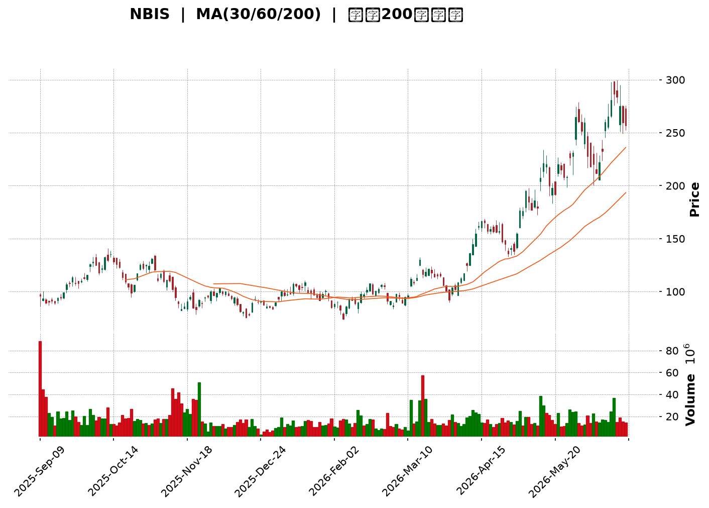
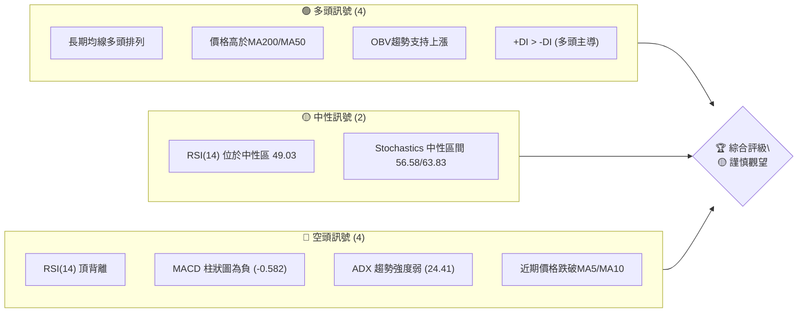
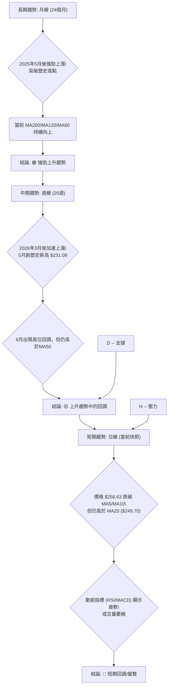
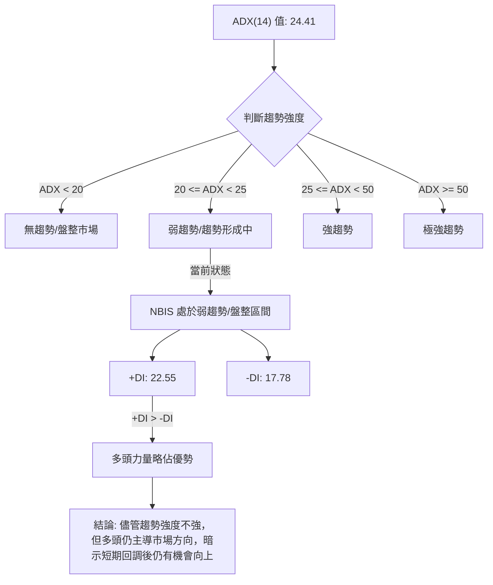
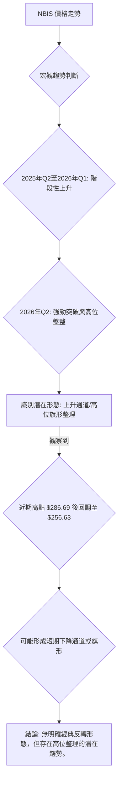
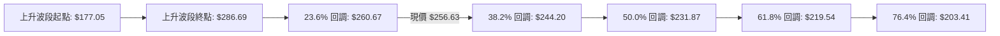

<details>
<summary>📊 靜態圖表 (點擊展開)</summary>

</details>

<html>
<head><meta charset="utf-8" /></head>
<body>
    <div style="height:500px; width:100%;">                        <script>window.PlotlyConfig = {MathJaxConfig: 'local'};</script>
        <script charset="utf-8" src="https://cdn.plot.ly/plotly-3.6.0.min.js" integrity="sha256-QaOVwtVY0T02VaHrr6pnoHLCwayMJp4O5n4YyaE3rJk=" crossorigin="anonymous"></script>                <div id="candlestick-chart" class="plotly-graph-div" style="height:100%; width:100%;"></div>            <script>                window.PLOTLYENV=window.PLOTLYENV || {};                                if (document.getElementById("candlestick-chart")) {                    Plotly.newPlot(                        "candlestick-chart",                        [{"close":{"dtype":"f8","bdata":"AAAAgBTuV0AAAADA9VhXQAAAAAApTFZAAAAAgD2aVkAAAACgcL1WQAAAACCFW1ZAAAAAwB6FV0AAAAAgrodXQAAAAADX01hAAAAAYGamWkAAAABAM\u002fNaQAAAAGC4TlxAAAAAACn8WkAAAADAzOxaQAAAAIAUjltAAAAAoEcRXEAAAABACudcQAAAACCud19AAAAAYLj+X0AAAAAAKTxfQAAAAMDMbF1AAAAAAACAXkAAAADgepRgQAAAAGCPMmBAAAAAYLjuYEAAAADAzARgQAAAAMAedV9AAAAAYI\u002fCXkAAAAAAKVxcQAAAAAAAQFtAAAAAgOsRWkAAAAAgrqdYQAAAAIA9ilpAAAAA4KNQXUAAAAAghVtfQAAAAMAedV5AAAAAYGZGX0AAAAAghQtfQAAAAIA9WmBAAAAAgBQeXkAAAABgj6JbQAAAAAAAQF1AAAAAAClcW0AAAACA69FbQAAAAMDMfFtAAAAAgBSOWUAAAABACpdXQAAAAOBRKFZAAAAAYI\u002fiVEAAAABguH5VQAAAAGCPolZAAAAA4HrEV0AAAADA9ShVQAAAAOCj0FRAAAAAoJn5VkAAAADgUThWQAAAAAAprFdAAAAAIK63V0AAAACgmQlZQAAAAMDMHFhAAAAAQOG6WEAAAABAM7NZQAAAAGCPglhAAAAAwB4VWUAAAACAPRpYQAAAAIDCZVdAAAAAgOuRV0AAAAAAKexVQAAAAMD1SFRAAAAAwMw8VEAAAADAzNxSQAAAAIDChVNAAAAAoHBdVkAAAABguE5XQAAAAIDrgVZAAAAA4FHIVkAAAACAwuVVQAAAAGCPglVAAAAAQOFKVUAAAADAHu1UQAAAAMDMfFZAAAAAwB41V0AAAAAgXA9ZQAAAAKBwDVhAAAAAQDNTWEAAAAAghXtYQAAAAMAe1VpAAAAAIIVbWkAAAABguH5ZQAAAAOCj+FlAAAAAYLguW0AAAABgj9JYQAAAACCut1hAAAAAYGY2WEAAAAAAAKBXQAAAAKBw3VZAAAAAIK53WEAAAAAghRtZQAAAAIA9uldAAAAAAClMVUAAAACAPQpWQAAAAMDMfFZAAAAAwPWYVEAAAAAgrndSQAAAAGBmhlVAAAAA4FE4V0AAAABgj\u002fJWQAAAAEAKJ1ZAAAAAYLhuVkAAAADgo4BYQAAAAKBHYVhAAAAAQDNzWUAAAABACudaQAAAAEDhelhAAAAAQAonWUAAAADAHqVZQAAAACCuh1pAAAAA4FE4WkAAAAAAKcxWQAAAAOCjwFZAAAAAQDOzVUAAAACA63FYQAAAAKCZ6VdAAAAAwB5VVkAAAAAAKbxXQAAAACCFG1hAAAAAIK7\u002fW0AAAABgjwJbQAAAAMDMPFxAAAAAQDM7YEAAAADAHhVdQAAAAADXo11AAAAAoEdhXkAAAAAgrmddQAAAAKCZiVxAAAAAgD26XEAAAACAwsVcQAAAAIAUflpAAAAA4Ho0WUAAAADgoxBXQAAAAOCj8FlAAAAAwMx8WUAAAADgejRbQAAAAGCPIlxAAAAAoJlZXUAAAAAAAEBfQAAAAGCPCmFAAAAAQAofYkAAAACA61FjQAAAAIAUPmRAAAAA4KPYZEAAAABA4apkQAAAAOB6pGNAAAAAwB7lY0AAAACgmZFjQAAAAOB6hGNAAAAAYI+iY0AAAADAHmViQAAAAGC4HmJAAAAA4FHwYEAAAACAFKZhQAAAACBcR2FAAAAAIK5PY0AAAACgcA1mQAAAAKBw\u002fWVAAAAAQOFiaEAAAADgoxhnQAAAAKCZIWZAAAAAQDNDZ0AAAAAghWNmQAAAAOCj6GlAAAAAwMyka0AAAACAFH5rQAAAACCF+2hAAAAAIFy3aEAAAACAPfpnQAAAAIDCfWtAAAAA4KPYakAAAACA6wFqQAAAAADXC2pAAAAAQOFKbEAAAABA4eJsQAAAAAApiHBAAAAAoEdJcEAAAACAwnVvQAAAAGC4OnBAAAAAgOt5bEAAAAAAAEBrQAAAAADXg2tAAAAAgBR2akAAAAAgrsdrQAAAACCFC21AAAAAwB5BcEAAAACgmZFwQAAAAGCPjnFAAAAAQArrcUAAAACAwrlxQAAAAAAANHFAAAAAYI86cEAAAACAFApwQA=="},"high":{"dtype":"f8","bdata":"AAAAIIWrWEAAAADgoyBZQAAAACCud1dAAAAAAAAAV0AAAABA4ZpXQAAAAEAz01ZAAAAAAADAV0AAAAAghWtYQAAAAEAz41hAAAAAwB4lW0AAAABguH5bQAAAAGBmtlxAAAAAwB6FXEAAAAAgXH9bQAAAAKBHIVxAAAAAoJlpXUAAAADgUfhcQAAAACBcr19AAAAAAFSfYEAAAADgUfhgQAAAAMD1CGBAAAAAANdTX0AAAACAPapgQAAAAEAzo2FAAAAAwPVQYUAAAACAFrlgQAAAACCuf2BAAAAAQApfYEAAAAAArCReQAAAAIAUXl1AAAAAIIULW0AAAABAM\u002fNaQAAAACCup1pAAAAAwMxcXUAAAAAAAKBfQAAAAMD1IGBAAAAAwMx8X0AAAACAFA5gQAAAAMDMhGBAAAAAgMLdYEAAAACA6zFdQAAAAKBwjV1AAAAAAABAXkAAAABAM9NbQAAAACCul11AAAAAANejXEAAAACgmWlaQAAAAGC43lZAAAAAAABAVkAAAACgmWlWQAAAAAApbFdAAAAAgBQuWEAAAAAAKaxZQAAAACBcL1ZAAAAAAABAV0AAAACA69FWQAAAAICT6FdAAAAAwB5FWEAAAABgZmZZQAAAAMDMvFlAAAAAANfDWEAAAACAwvVZQAAAAGBmVllAAAAAAAAgWUAAAAAggzhZQAAAAIDCRVhAAAAAwMzcV0AAAACgmelXQAAAACBcD1ZAAAAAANdjVEAAAABAMxNVQAAAAGBmFlRAAAAAYI+iVkAAAACgmflXQAAAAIAUPldAAAAAQOHaVkAAAAAgrudWQAAAAEAKJ1ZAAAAAoHC9VUAAAACAFJ5VQAAAAOCjsFZAAAAAACncV0AAAAAghStZQAAAAGBmlllAAAAAYI+iWUAAAACAFD5aQAAAACCFK1tAAAAAwMz8WkAAAADAzKxaQAAAAOBRCFtAAAAAAACgW0AAAACAFB5aQAAAAKCZmVlAAAAAYLj+WUAAAADgo7hYQAAAAOBROFlAAAAAYI\u002fiWEAAAABgZnZZQAAAAAAA0FhAAAAAYI8CV0AAAAAAAFBWQAAAAMD12FZAAAAAYI\u002fqVUAAAADgejRUQAAAAIA9qlVAAAAAIIVrV0AAAAAAVONXQAAAAAAAsFdAAAAA4KOwVkAAAADgehRZQAAAAGCP0lhAAAAAoJkZWkAAAABguP5aQAAAAOB6FFtAAAAAoG5KWUAAAAAAAPBZQAAAAAAp3FpAAAAA4HoUW0AAAABAM9NYQAAAAKDE2FZAAAAAIK53VkAAAABguJ5YQAAAAAAA0FhAAAAAwMy8V0AAAADAzMxXQAAAAKCZmVhAAAAAwB6FXEAAAABgj8JbQAAAAOB6JF1AAAAAoJmJYEAAAAAAAGBeQAAAAECJsV5AAAAAQDNzXkAAAAAAVu5eQAAAAADXU15AAAAAQDNzXUAAAABAM7NdQAAAAEAzU1xAAAAA4KOQWkAAAAAgXI9ZQAAAAMD1+FlAAAAAIK73WkAAAACgcD1bQAAAAIDCdVxAAAAAoJl5XUAAAAAAAPBfQAAAAKCZEWFAAAAAgD26YkAAAAAAAPBjQAAAAEAzw2RAAAAAgOvZZEAAAABguBZlQAAAAIDrgWRAAAAAAAA4ZEAAAAAAAGhkQAAAAIDC7WRAAAAAgOu5ZEAAAAAAAKhkQAAAAKCZmWJAAAAAYLiuYUAAAABgZvZhQAAAACBcX2JAAAAAAACAY0AAAADAzGxmQAAAAGC4fmZAAAAAIK5\u002faEAAAADgerxoQAAAAAAAiGdAAAAAgJeOaEAAAAAghTNnQAAAAEDhKmtAAAAAIFw3bUAAAACgR5lsQAAAAIA9QmtAAAAAgOtZaUAAAAAAAIhpQAAAAIDrWWxAAAAAoHC9a0AAAADgUaBrQAAAAOB6NGpAAAAA4HocbUAAAABAMzNtQAAAAKDELHFAAAAAoHBtcUAAAAAgXLdwQAAAACCFh3BAAAAAAABYb0AAAADAzAxuQAAAAMD1tG1AAAAAIK7fbEAAAAAgro9sQAAAAEDhcm5AAAAA4FFucEAAAAAghVVxQAAAAEDhnnJAAAAAwMysckAAAACAwr1yQAAAACCuc3JAAAAAoG5CcUAAAADgUThxQA=="},"hovertemplate":"\u003cb\u003e%{x|%Y-%m-%d}\u003c\u002fb\u003e\u003cbr\u003e\u958b: $%{open:.2f}\u003cbr\u003e\u9ad8: $%{high:.2f}\u003cbr\u003e\u4f4e: $%{low:.2f}\u003cbr\u003e\u6536: $%{close:.2f}\u003cextra\u003e\u003c\u002fextra\u003e","low":{"dtype":"f8","bdata":"AAAAIK6HVUAAAAAAAMBWQAAAAGCPGlZAAAAAgOuxVUAAAACAwjVWQAAAAKBHAVZAAAAAwB41VkAAAACA6wFXQAAAAAAAUFdAAAAAoEehWEAAAAAAABBaQAAAAGBmNlpAAAAA4FF4WkAAAABAM7NZQAAAAMAeFVtAAAAAgD3qW0AAAADgo3BbQAAAAOB6pF1AAAAAYGbmXkAAAAAghTtfQAAAAIAU7lxAAAAAAABgXUAAAAAgrvddQAAAAOBRAGBAAAAAwMyUYEAAAAAAAHBfQAAAAMDMjF5AAAAAoEeBXkAAAADgUbhbQAAAAOCj4FpAAAAAoJlZWUAAAADgUahXQAAAAKBw3VhAAAAA4KOAW0AAAABACgdeQAAAAIDrMV5AAAAAAABgXUAAAADgo3BdQAAAAEAzk19AAAAAAADwXUAAAAAAAEBbQAAAACCF21tAAAAAgD0aW0AAAADgo1BZQAAAAIAULltAAAAAwB71WEAAAACgcO1WQAAAAAAAIFVAAAAAAACAVEAAAACAwuVUQAAAAKBwbVRAAAAAQDPzVkAAAACgcA1VQAAAAKBwjVNAAAAAoJlJVUAAAADgJC5VQAAAAOCjsFZAAAAAAClcV0AAAADgo0BWQAAAAADXA1hAAAAAAADAVkAAAACAFF5YQAAAAMDMDFhAAAAAQDPTV0AAAABgZgZYQAAAAMDMDFdAAAAAwMysVUAAAADAzIxVQAAAAKAYBFRAAAAA4FE4U0AAAAAAANBSQAAAAOCjQFNAAAAAgD0KVEAAAABgZsZWQAAAAADXE1ZAAAAAoJkpVkAAAAAgXK9VQAAAAGCPElVAAAAAANcjVUAAAACgmblUQAAAAOCjgFVAAAAAwPW4VkAAAAAAKbxWQAAAAADX41dAAAAAIFgBWEAAAABgZkZYQAAAAEAzI1hAAAAAQOH6WUAAAAAgg9hYQAAAAGBmRllAAAAAoHAtWUAAAACAwpVYQAAAAGBmRldAAAAAAAAgWEAAAACA62FXQAAAAEAK11ZAAAAAgOthV0AAAAAAKRxYQAAAAIA9ylZAAAAAIK4HVUAAAACAFA5VQAAAAAAAMFVAAAAAACmcU0AAAACgR2FSQAAAACCuR1NAAAAAANfzVEAAAACAPepWQAAAAMD1yFVAAAAAACnsU0AAAABACjdWQAAAAAAAYFdAAAAAINk2WEAAAAAghRtZQAAAAIDrQVhAAAAAQDPTV0AAAABA329YQAAAAEAzs1lAAAAAAACAWUAAAACgmRlWQAAAAEAzs1VAAAAAgOvhVEAAAACgmYlWQAAAACCu51ZAAAAAQDMzVkAAAAAAAKBVQAAAAAAAwFdAAAAAIFwfWkAAAACgR6FaQAAAAMD1iFtAAAAAYBIbX0AAAABACkdcQAAAAAAAgFxAAAAAoEexXEAAAACAkyhcQAAAAEAzY1xAAAAA4KMAXEAAAADAHlVcQAAAAIA9WlpAAAAAoEcRWUAAAADAymlWQAAAAGC47ldAAAAAYGZWWUAAAAAAKQxYQAAAAMDM3FpAAAAAgOuRW0AAAABgZtZdQAAAAEAzI19AAAAA4FHcYEAAAACgmclhQAAAAOCj0GNAAAAAAACQY0AAAABA4QJkQAAAACBcV2NAAAAAoEdBY0AAAADAzGxjQAAAAEAza2NAAAAAgD1CY0AAAACA6zliQAAAAIDrUWFAAAAAYGaWYEAAAABACsdgQAAAAAAA4GBAAAAAAACAYUAAAABgZvZjQAAAAGC4FmVAAAAAIIXjZUAAAAAAACBmQAAAAAAAEGZAAAAAoJlRZkAAAAAAAIhlQAAAAAAAYGhAAAAAAAD4aUAAAACgmXlqQAAAAGCPwmdAAAAAAADgZkAAAADgetRnQAAAAKCZGWpAAAAAIFxXakAAAADAHrVpQAAAAIDryWhAAAAA4FFga0AAAADAzExqQAAAAAAAwG1AAAAAAAA8cEAAAADgUfBuQAAAAIAUVm1AAAAAgBQWa0AAAABgZjZrQAAAAKCZCWlAAAAAANdrakAAAAAAAKBpQAAAAAAA8GtAAAAAIK6nbkAAAADAzKxvQAAAAOCjhHBAAAAAQDM5cUAAAAAAAGBxQAAAAAAAYG9AAAAAYLgmb0AAAACA65FvQA=="},"name":"\u50f9\u683c","open":{"dtype":"f8","bdata":"AAAAwMxMWEAAAADA9ehWQAAAAEDhKldAAAAAACnMVkAAAABACidXQAAAAMDMzFZAAAAAQOHqVkAAAADAzMRXQAAAAMD1iFdAAAAAwMx8WUAAAABgjwJbQAAAAOCjSFtAAAAAIIUDW0AAAAAghXtbQAAAAOBRWFtAAAAA4HpcXEAAAACAwu1bQAAAAKBH8V5AAAAAQArPX0AAAADAzIxgQAAAAMDM9F9AAAAAwMxMXkAAAABguD5eQAAAAGBm3mBAAAAAYLjmYEAAAAAAAIBgQAAAAMDMfGBAAAAAQOECYEAAAAAA14NdQAAAAGCPMl1AAAAA4FH4WkAAAABAM6taQAAAAMAeFVlAAAAAgD3KW0AAAACAPTpeQAAAAADXm19AAAAAgOsRX0AAAADAzExeQAAAAMD1qF9AAAAAAADAYEAAAABguBZcQAAAAMD1aFxAAAAAQDPjXUAAAAAAACBaQAAAACCFy1xAAAAA4FGIXEAAAADAzAxaQAAAAMD1uFZAAAAAQAqXVEAAAADgevRUQAAAAIDr8VRAAAAA4FFAV0AAAAAghdtYQAAAAEAzY1VAAAAAYLiOVUAAAABgj1JWQAAAAGBmdldAAAAAQDMjWEAAAADAzNxWQAAAAEAKF1lAAAAAoEfBV0AAAADgesRYQAAAAIDCFVlAAAAAYI9SWEAAAACAwoVYQAAAAGC47ldAAAAAwMxMVkAAAAAA11NXQAAAAGBmBlZAAAAAwMzkU0AAAACAwgVVQAAAAEAzw1NAAAAAoJkpVEAAAACAFD5XQAAAAADXk1ZAAAAAYLiOVkAAAADgo+BWQAAAAMDMHFVAAAAAAACYVUAAAAAgrldVQAAAAEAKv1VAAAAAAADAV0AAAACAwu1XQAAAAOCjwFhAAAAAYI8yWEAAAACgR7lYQAAAAOB6lFhAAAAAwB7VWkAAAACA63FaQAAAACCFI1pAAAAAIK5\u002fWkAAAADAHnVZQAAAAIDCRVlAAAAA4KOAWUAAAADAzCxYQAAAAKBwbVhAAAAAYGaWV0AAAAAAAABZQAAAAEAKl1hAAAAAoEPjVkAAAAAA13NVQAAAACCFe1ZAAAAAAADAVUAAAADA9chTQAAAAGBmzlNAAAAAwMwcVUAAAABgjzpXQAAAAGCPOldAAAAAYGYGVUAAAABACndWQAAAAAAAAFhAAAAAYLjuWEAAAAAghRtZQAAAAADTpVpAAAAAIIUTWEAAAAAgXNdYQAAAACBcP1pAAAAAAACAWkAAAADAzKxYQAAAAAAAAFZAAAAAoJmJVUAAAACgmZlWQAAAAAAAMFhAAAAAQDMTV0AAAABACtdVQAAAAMD1yFdAAAAAgD1KWkAAAACAwkVbQAAAAAApnFtAAAAAAAAwX0AAAACAwhVeQAAAAEAzs1xAAAAA4FHQXEAAAABgZh5eQAAAAKBwLV1AAAAAQDMLXUAAAAAgrjddQAAAAOBRUFxAAAAAwB51WkAAAAAgXI9ZQAAAAGC4flhAAAAA4Hp8WkAAAACAPRpYQAAAAIA9KltAAAAAAACoW0AAAADgUbhfQAAAAAAAQF9AAAAA4FHcYEAAAABgZtZhQAAAAEAzI2RAAAAAYDsHZEAAAAAAAOBkQAAAAMD1eGRAAAAAAACgY0AAAABACidkQAAAACCFW2RAAAAAwMx8Y0AAAACgcHVkQAAAAOB6jGJAAAAAwMxMYUAAAABACoNhQAAAAIDrJWJAAAAAYI+qYUAAAADgUQxkQAAAAMDMdGVAAAAAQApzZkAAAADgUcBnQAAAAGBm9mZAAAAAwMx8ZkAAAACgcI1mQAAAAEAKe2lAAAAAAACsakAAAAAghTNrQAAAAEAKL2tAAAAAAADgZ0AAAABACn9pQAAAACCud2pAAAAA4FFoa0AAAACgmZVrQAAAAMAe+WlAAAAAACnMbEAAAAAghXtsQAAAAEDhgm5AAAAAoJkBcUAAAACgcENwQAAAACCu921AAAAAIIXbbkAAAADAzAxuQAAAAAAAwGxAAAAAoMbvakAAAADgeqxpQAAAAMDMVG1AAAAAYLh+b0AAAABACu9vQAAAAGBmmnBAAAAAQDOjckAAAAAgXB9yQAAAAAAAHHBAAAAAoJkxcUAAAADAHglxQA=="},"x":["2025-09-09T00:00:00-04:00","2025-09-10T00:00:00-04:00","2025-09-11T00:00:00-04:00","2025-09-12T00:00:00-04:00","2025-09-15T00:00:00-04:00","2025-09-16T00:00:00-04:00","2025-09-17T00:00:00-04:00","2025-09-18T00:00:00-04:00","2025-09-19T00:00:00-04:00","2025-09-22T00:00:00-04:00","2025-09-23T00:00:00-04:00","2025-09-24T00:00:00-04:00","2025-09-25T00:00:00-04:00","2025-09-26T00:00:00-04:00","2025-09-29T00:00:00-04:00","2025-09-30T00:00:00-04:00","2025-10-01T00:00:00-04:00","2025-10-02T00:00:00-04:00","2025-10-03T00:00:00-04:00","2025-10-06T00:00:00-04:00","2025-10-07T00:00:00-04:00","2025-10-08T00:00:00-04:00","2025-10-09T00:00:00-04:00","2025-10-10T00:00:00-04:00","2025-10-13T00:00:00-04:00","2025-10-14T00:00:00-04:00","2025-10-15T00:00:00-04:00","2025-10-16T00:00:00-04:00","2025-10-17T00:00:00-04:00","2025-10-20T00:00:00-04:00","2025-10-21T00:00:00-04:00","2025-10-22T00:00:00-04:00","2025-10-23T00:00:00-04:00","2025-10-24T00:00:00-04:00","2025-10-27T00:00:00-04:00","2025-10-28T00:00:00-04:00","2025-10-29T00:00:00-04:00","2025-10-30T00:00:00-04:00","2025-10-31T00:00:00-04:00","2025-11-03T00:00:00-05:00","2025-11-04T00:00:00-05:00","2025-11-05T00:00:00-05:00","2025-11-06T00:00:00-05:00","2025-11-07T00:00:00-05:00","2025-11-10T00:00:00-05:00","2025-11-11T00:00:00-05:00","2025-11-12T00:00:00-05:00","2025-11-13T00:00:00-05:00","2025-11-14T00:00:00-05:00","2025-11-17T00:00:00-05:00","2025-11-18T00:00:00-05:00","2025-11-19T00:00:00-05:00","2025-11-20T00:00:00-05:00","2025-11-21T00:00:00-05:00","2025-11-24T00:00:00-05:00","2025-11-25T00:00:00-05:00","2025-11-26T00:00:00-05:00","2025-11-28T00:00:00-05:00","2025-12-01T00:00:00-05:00","2025-12-02T00:00:00-05:00","2025-12-03T00:00:00-05:00","2025-12-04T00:00:00-05:00","2025-12-05T00:00:00-05:00","2025-12-08T00:00:00-05:00","2025-12-09T00:00:00-05:00","2025-12-10T00:00:00-05:00","2025-12-11T00:00:00-05:00","2025-12-12T00:00:00-05:00","2025-12-15T00:00:00-05:00","2025-12-16T00:00:00-05:00","2025-12-17T00:00:00-05:00","2025-12-18T00:00:00-05:00","2025-12-19T00:00:00-05:00","2025-12-22T00:00:00-05:00","2025-12-23T00:00:00-05:00","2025-12-24T00:00:00-05:00","2025-12-26T00:00:00-05:00","2025-12-29T00:00:00-05:00","2025-12-30T00:00:00-05:00","2025-12-31T00:00:00-05:00","2026-01-02T00:00:00-05:00","2026-01-05T00:00:00-05:00","2026-01-06T00:00:00-05:00","2026-01-07T00:00:00-05:00","2026-01-08T00:00:00-05:00","2026-01-09T00:00:00-05:00","2026-01-12T00:00:00-05:00","2026-01-13T00:00:00-05:00","2026-01-14T00:00:00-05:00","2026-01-15T00:00:00-05:00","2026-01-16T00:00:00-05:00","2026-01-20T00:00:00-05:00","2026-01-21T00:00:00-05:00","2026-01-22T00:00:00-05:00","2026-01-23T00:00:00-05:00","2026-01-26T00:00:00-05:00","2026-01-27T00:00:00-05:00","2026-01-28T00:00:00-05:00","2026-01-29T00:00:00-05:00","2026-01-30T00:00:00-05:00","2026-02-02T00:00:00-05:00","2026-02-03T00:00:00-05:00","2026-02-04T00:00:00-05:00","2026-02-05T00:00:00-05:00","2026-02-06T00:00:00-05:00","2026-02-09T00:00:00-05:00","2026-02-10T00:00:00-05:00","2026-02-11T00:00:00-05:00","2026-02-12T00:00:00-05:00","2026-02-13T00:00:00-05:00","2026-02-17T00:00:00-05:00","2026-02-18T00:00:00-05:00","2026-02-19T00:00:00-05:00","2026-02-20T00:00:00-05:00","2026-02-23T00:00:00-05:00","2026-02-24T00:00:00-05:00","2026-02-25T00:00:00-05:00","2026-02-26T00:00:00-05:00","2026-02-27T00:00:00-05:00","2026-03-02T00:00:00-05:00","2026-03-03T00:00:00-05:00","2026-03-04T00:00:00-05:00","2026-03-05T00:00:00-05:00","2026-03-06T00:00:00-05:00","2026-03-09T00:00:00-04:00","2026-03-10T00:00:00-04:00","2026-03-11T00:00:00-04:00","2026-03-12T00:00:00-04:00","2026-03-13T00:00:00-04:00","2026-03-16T00:00:00-04:00","2026-03-17T00:00:00-04:00","2026-03-18T00:00:00-04:00","2026-03-19T00:00:00-04:00","2026-03-20T00:00:00-04:00","2026-03-23T00:00:00-04:00","2026-03-24T00:00:00-04:00","2026-03-25T00:00:00-04:00","2026-03-26T00:00:00-04:00","2026-03-27T00:00:00-04:00","2026-03-30T00:00:00-04:00","2026-03-31T00:00:00-04:00","2026-04-01T00:00:00-04:00","2026-04-02T00:00:00-04:00","2026-04-06T00:00:00-04:00","2026-04-07T00:00:00-04:00","2026-04-08T00:00:00-04:00","2026-04-09T00:00:00-04:00","2026-04-10T00:00:00-04:00","2026-04-13T00:00:00-04:00","2026-04-14T00:00:00-04:00","2026-04-15T00:00:00-04:00","2026-04-16T00:00:00-04:00","2026-04-17T00:00:00-04:00","2026-04-20T00:00:00-04:00","2026-04-21T00:00:00-04:00","2026-04-22T00:00:00-04:00","2026-04-23T00:00:00-04:00","2026-04-24T00:00:00-04:00","2026-04-27T00:00:00-04:00","2026-04-28T00:00:00-04:00","2026-04-29T00:00:00-04:00","2026-04-30T00:00:00-04:00","2026-05-01T00:00:00-04:00","2026-05-04T00:00:00-04:00","2026-05-05T00:00:00-04:00","2026-05-06T00:00:00-04:00","2026-05-07T00:00:00-04:00","2026-05-08T00:00:00-04:00","2026-05-11T00:00:00-04:00","2026-05-12T00:00:00-04:00","2026-05-13T00:00:00-04:00","2026-05-14T00:00:00-04:00","2026-05-15T00:00:00-04:00","2026-05-18T00:00:00-04:00","2026-05-19T00:00:00-04:00","2026-05-20T00:00:00-04:00","2026-05-21T00:00:00-04:00","2026-05-22T00:00:00-04:00","2026-05-26T00:00:00-04:00","2026-05-27T00:00:00-04:00","2026-05-28T00:00:00-04:00","2026-05-29T00:00:00-04:00","2026-06-01T00:00:00-04:00","2026-06-02T00:00:00-04:00","2026-06-03T00:00:00-04:00","2026-06-04T00:00:00-04:00","2026-06-05T00:00:00-04:00","2026-06-08T00:00:00-04:00","2026-06-09T00:00:00-04:00","2026-06-10T00:00:00-04:00","2026-06-11T00:00:00-04:00","2026-06-12T00:00:00-04:00","2026-06-15T00:00:00-04:00","2026-06-16T00:00:00-04:00","2026-06-17T00:00:00-04:00","2026-06-18T00:00:00-04:00","2026-06-22T00:00:00-04:00","2026-06-23T00:00:00-04:00","2026-06-24T00:00:00-04:00","2026-06-25T00:00:00-04:00"],"type":"candlestick"},{"hovertemplate":"MA30: $%{y:.2f}\u003cextra\u003e\u003c\u002fextra\u003e","line":{"color":"#2196F3","dash":"dash","width":2},"mode":"lines","name":"MA30","x":["2025-09-09T00:00:00-04:00","2025-09-10T00:00:00-04:00","2025-09-11T00:00:00-04:00","2025-09-12T00:00:00-04:00","2025-09-15T00:00:00-04:00","2025-09-16T00:00:00-04:00","2025-09-17T00:00:00-04:00","2025-09-18T00:00:00-04:00","2025-09-19T00:00:00-04:00","2025-09-22T00:00:00-04:00","2025-09-23T00:00:00-04:00","2025-09-24T00:00:00-04:00","2025-09-25T00:00:00-04:00","2025-09-26T00:00:00-04:00","2025-09-29T00:00:00-04:00","2025-09-30T00:00:00-04:00","2025-10-01T00:00:00-04:00","2025-10-02T00:00:00-04:00","2025-10-03T00:00:00-04:00","2025-10-06T00:00:00-04:00","2025-10-07T00:00:00-04:00","2025-10-08T00:00:00-04:00","2025-10-09T00:00:00-04:00","2025-10-10T00:00:00-04:00","2025-10-13T00:00:00-04:00","2025-10-14T00:00:00-04:00","2025-10-15T00:00:00-04:00","2025-10-16T00:00:00-04:00","2025-10-17T00:00:00-04:00","2025-10-20T00:00:00-04:00","2025-10-21T00:00:00-04:00","2025-10-22T00:00:00-04:00","2025-10-23T00:00:00-04:00","2025-10-24T00:00:00-04:00","2025-10-27T00:00:00-04:00","2025-10-28T00:00:00-04:00","2025-10-29T00:00:00-04:00","2025-10-30T00:00:00-04:00","2025-10-31T00:00:00-04:00","2025-11-03T00:00:00-05:00","2025-11-04T00:00:00-05:00","2025-11-05T00:00:00-05:00","2025-11-06T00:00:00-05:00","2025-11-07T00:00:00-05:00","2025-11-10T00:00:00-05:00","2025-11-11T00:00:00-05:00","2025-11-12T00:00:00-05:00","2025-11-13T00:00:00-05:00","2025-11-14T00:00:00-05:00","2025-11-17T00:00:00-05:00","2025-11-18T00:00:00-05:00","2025-11-19T00:00:00-05:00","2025-11-20T00:00:00-05:00","2025-11-21T00:00:00-05:00","2025-11-24T00:00:00-05:00","2025-11-25T00:00:00-05:00","2025-11-26T00:00:00-05:00","2025-11-28T00:00:00-05:00","2025-12-01T00:00:00-05:00","2025-12-02T00:00:00-05:00","2025-12-03T00:00:00-05:00","2025-12-04T00:00:00-05:00","2025-12-05T00:00:00-05:00","2025-12-08T00:00:00-05:00","2025-12-09T00:00:00-05:00","2025-12-10T00:00:00-05:00","2025-12-11T00:00:00-05:00","2025-12-12T00:00:00-05:00","2025-12-15T00:00:00-05:00","2025-12-16T00:00:00-05:00","2025-12-17T00:00:00-05:00","2025-12-18T00:00:00-05:00","2025-12-19T00:00:00-05:00","2025-12-22T00:00:00-05:00","2025-12-23T00:00:00-05:00","2025-12-24T00:00:00-05:00","2025-12-26T00:00:00-05:00","2025-12-29T00:00:00-05:00","2025-12-30T00:00:00-05:00","2025-12-31T00:00:00-05:00","2026-01-02T00:00:00-05:00","2026-01-05T00:00:00-05:00","2026-01-06T00:00:00-05:00","2026-01-07T00:00:00-05:00","2026-01-08T00:00:00-05:00","2026-01-09T00:00:00-05:00","2026-01-12T00:00:00-05:00","2026-01-13T00:00:00-05:00","2026-01-14T00:00:00-05:00","2026-01-15T00:00:00-05:00","2026-01-16T00:00:00-05:00","2026-01-20T00:00:00-05:00","2026-01-21T00:00:00-05:00","2026-01-22T00:00:00-05:00","2026-01-23T00:00:00-05:00","2026-01-26T00:00:00-05:00","2026-01-27T00:00:00-05:00","2026-01-28T00:00:00-05:00","2026-01-29T00:00:00-05:00","2026-01-30T00:00:00-05:00","2026-02-02T00:00:00-05:00","2026-02-03T00:00:00-05:00","2026-02-04T00:00:00-05:00","2026-02-05T00:00:00-05:00","2026-02-06T00:00:00-05:00","2026-02-09T00:00:00-05:00","2026-02-10T00:00:00-05:00","2026-02-11T00:00:00-05:00","2026-02-12T00:00:00-05:00","2026-02-13T00:00:00-05:00","2026-02-17T00:00:00-05:00","2026-02-18T00:00:00-05:00","2026-02-19T00:00:00-05:00","2026-02-20T00:00:00-05:00","2026-02-23T00:00:00-05:00","2026-02-24T00:00:00-05:00","2026-02-25T00:00:00-05:00","2026-02-26T00:00:00-05:00","2026-02-27T00:00:00-05:00","2026-03-02T00:00:00-05:00","2026-03-03T00:00:00-05:00","2026-03-04T00:00:00-05:00","2026-03-05T00:00:00-05:00","2026-03-06T00:00:00-05:00","2026-03-09T00:00:00-04:00","2026-03-10T00:00:00-04:00","2026-03-11T00:00:00-04:00","2026-03-12T00:00:00-04:00","2026-03-13T00:00:00-04:00","2026-03-16T00:00:00-04:00","2026-03-17T00:00:00-04:00","2026-03-18T00:00:00-04:00","2026-03-19T00:00:00-04:00","2026-03-20T00:00:00-04:00","2026-03-23T00:00:00-04:00","2026-03-24T00:00:00-04:00","2026-03-25T00:00:00-04:00","2026-03-26T00:00:00-04:00","2026-03-27T00:00:00-04:00","2026-03-30T00:00:00-04:00","2026-03-31T00:00:00-04:00","2026-04-01T00:00:00-04:00","2026-04-02T00:00:00-04:00","2026-04-06T00:00:00-04:00","2026-04-07T00:00:00-04:00","2026-04-08T00:00:00-04:00","2026-04-09T00:00:00-04:00","2026-04-10T00:00:00-04:00","2026-04-13T00:00:00-04:00","2026-04-14T00:00:00-04:00","2026-04-15T00:00:00-04:00","2026-04-16T00:00:00-04:00","2026-04-17T00:00:00-04:00","2026-04-20T00:00:00-04:00","2026-04-21T00:00:00-04:00","2026-04-22T00:00:00-04:00","2026-04-23T00:00:00-04:00","2026-04-24T00:00:00-04:00","2026-04-27T00:00:00-04:00","2026-04-28T00:00:00-04:00","2026-04-29T00:00:00-04:00","2026-04-30T00:00:00-04:00","2026-05-01T00:00:00-04:00","2026-05-04T00:00:00-04:00","2026-05-05T00:00:00-04:00","2026-05-06T00:00:00-04:00","2026-05-07T00:00:00-04:00","2026-05-08T00:00:00-04:00","2026-05-11T00:00:00-04:00","2026-05-12T00:00:00-04:00","2026-05-13T00:00:00-04:00","2026-05-14T00:00:00-04:00","2026-05-15T00:00:00-04:00","2026-05-18T00:00:00-04:00","2026-05-19T00:00:00-04:00","2026-05-20T00:00:00-04:00","2026-05-21T00:00:00-04:00","2026-05-22T00:00:00-04:00","2026-05-26T00:00:00-04:00","2026-05-27T00:00:00-04:00","2026-05-28T00:00:00-04:00","2026-05-29T00:00:00-04:00","2026-06-01T00:00:00-04:00","2026-06-02T00:00:00-04:00","2026-06-03T00:00:00-04:00","2026-06-04T00:00:00-04:00","2026-06-05T00:00:00-04:00","2026-06-08T00:00:00-04:00","2026-06-09T00:00:00-04:00","2026-06-10T00:00:00-04:00","2026-06-11T00:00:00-04:00","2026-06-12T00:00:00-04:00","2026-06-15T00:00:00-04:00","2026-06-16T00:00:00-04:00","2026-06-17T00:00:00-04:00","2026-06-18T00:00:00-04:00","2026-06-22T00:00:00-04:00","2026-06-23T00:00:00-04:00","2026-06-24T00:00:00-04:00","2026-06-25T00:00:00-04:00"],"y":{"dtype":"f8","bdata":"AAAAAAAA+H8AAAAAAAD4fwAAAAAAAPh\u002fAAAAAAAA+H8AAAAAAAD4fwAAAAAAAPh\u002fAAAAAAAA+H8AAAAAAAD4fwAAAAAAAPh\u002fAAAAAAAA+H8AAAAAAAD4fwAAAAAAAPh\u002fAAAAAAAA+H8AAAAAAAD4fwAAAAAAAPh\u002fAAAAAAAA+H8AAAAAAAD4fwAAAAAAAPh\u002fAAAAAAAA+H8AAAAAAAD4fwAAAAAAAPh\u002fAAAAAAAA+H8AAAAAAAD4fwAAAAAAAPh\u002fAAAAAAAA+H8AAAAAAAD4fwAAAAAAAPh\u002fAAAAAAAA+H8AAAAAAAD4f97d3Y2zx1tAREREdPbZW0C8u7u7HuVbQN7d3Z1SCVxAvLu7S5pCXEAzMzODI4xcQLy7uztC0VxAmpmZSW8TXUDe3d0NkFNdQImIiLjIll1Ad3d3l1+0XUDv7u7+N7pdQKuqqupCwl1A3t3dHXbFXUBmZmZGGc1dQBEREdGFzF1A3t3dLRW3XUCJiIjYv4ldQGZmZtZNOl1AvLu7q3\u002fbXEARERFRYohcQGZmZlZxTlxAd3d39\u002f0UXEARERGRl65bQLy7u6vGS1tAmpmZGdnuWkAiIiJyEptaQKuqqtqjWFpAd3d3R4scWkCrqqoqMQBaQBERETFr5VlAq6qq6vvZWUARERHB5uJZQGZmZiaU0VlAzczMHHatWUAzMzNTjW9ZQERERIROM1lAAAAAsI7xWECJiIhItqNYQAAAAGC6OVhA7+7uLmvlV0DNzMxcj5pXQAAAAFCNR1dAERERke0cV0DNzMzca\u002fZWQDMzM+Psy1ZARERERES0VkARERHx0qVWQFVVVXVMoFZAd3d3p8ajVkAzMzMz7J5WQKuqqvqpnVZAREREpOKYVkAiIiJSKrpWQO\u002fu7r7K1VZA3t3d3U\u002fhVkAAAABgnvRWQAAAAICVD1dAq6qqqhwmV0B3d3cXBCpXQImIiJjgOVdAq6qqKs5OV0DNzMw8UUdXQHd3d4cWSVdAvLu7+6lBV0De3d3dlj1XQKuqqpoLOVdAmpmZObRAV0BmZmb24VtXQImIiDhCeVdARERE1E2CV0AAAAAwa51XQERERFS4tldAq6qqKqOnV0BmZmYGVn5XQImIiLjzdVdAREREdK95V0B3d3c3pYJXQHd3d8cgiFdAZmZmJtuRV0BmZmaWX7BXQBEREdGFwFdAIiIioqjTV0AzMzOjYeNXQGZmZoYH51dAmpmZORfuV0Dv7u6+AvhXQM3MzOxt9VdAzczMjEH0V0BVVVXFPN1XQN7d3U3FwVdAmpmZmfySV0AAAADww49XQDMzM2PliFdAd3d3d9p4V0BERETEynlXQM3MzAxlhFdA7+7uLoeiV0AiIiJCw7JXQAAAAIA\u002f2VdAERER0YU4WEBERERknnRYQERERESnsVhAZmZmdiEFWUC8u7vLdmJZQGZmZtZNnllAiYiIKE3NWUAAAAAQAv9ZQAAAAPAKJFpA3t3djbM7WkCamZlJby9aQJqZmSm\u002fPFpAREREFBE9WkBmZmbmpT9aQO\u002fu7l7WXlpAMzMz86eCWkAiIiJCfLJaQCIiIvLu8lpA7+7ubnVIW0BmZmbmpc9bQDMzMyP3ZlxAvLu7a5ERXUAAAAAwsqFdQM3MzOzfJF5Aq6qqati5XkARERGxRz1fQAAAAFCpvF9A3t3d3WsOYEBEREQ8JjhgQCIiIhpLWmBAAAAAqFRgYEAAAAAY2XpgQImIiFDUj2BAMzMzU\u002f+yYEDNzMykt\u002fFgQImIiPiaM2FAREREdCGJYUDe3d29dNNhQCIiIlJGH2JAq6qqcj16YkCamZlJ4dZiQDMzM2tKRWNA7+7u9m\u002fEY0AiIiIi9zpkQImIiFAbmGRAIiIiwsrtZEAzMzMTETVlQCIiInI9jmVAAAAAgLHYZUARERGRwhFmQM3MzAxJQ2ZAERERodOCZkAzMzPD9chmQO\u002fu7u58O2dAmpmZWaunZ0De3d0tJA1oQGZmZsaSe2hAd3d3xwTHaEAiIiLSlBJpQCIiIoLAYmlAq6qqugK0aUCJiIjIdgpqQM3MzIzebmpA3t3d7XzfakC8u7t7FD5rQBEREcERrmtAmpmZqcYPbEARERGRNHlsQGZmZrbz4WxA7+7ufmowbUAAAACgGoNtQA=="},"type":"scatter"},{"hovertemplate":"MA60: $%{y:.2f}\u003cextra\u003e\u003c\u002fextra\u003e","line":{"color":"#9C27B0","dash":"dash","width":2},"mode":"lines","name":"MA60","x":["2025-09-09T00:00:00-04:00","2025-09-10T00:00:00-04:00","2025-09-11T00:00:00-04:00","2025-09-12T00:00:00-04:00","2025-09-15T00:00:00-04:00","2025-09-16T00:00:00-04:00","2025-09-17T00:00:00-04:00","2025-09-18T00:00:00-04:00","2025-09-19T00:00:00-04:00","2025-09-22T00:00:00-04:00","2025-09-23T00:00:00-04:00","2025-09-24T00:00:00-04:00","2025-09-25T00:00:00-04:00","2025-09-26T00:00:00-04:00","2025-09-29T00:00:00-04:00","2025-09-30T00:00:00-04:00","2025-10-01T00:00:00-04:00","2025-10-02T00:00:00-04:00","2025-10-03T00:00:00-04:00","2025-10-06T00:00:00-04:00","2025-10-07T00:00:00-04:00","2025-10-08T00:00:00-04:00","2025-10-09T00:00:00-04:00","2025-10-10T00:00:00-04:00","2025-10-13T00:00:00-04:00","2025-10-14T00:00:00-04:00","2025-10-15T00:00:00-04:00","2025-10-16T00:00:00-04:00","2025-10-17T00:00:00-04:00","2025-10-20T00:00:00-04:00","2025-10-21T00:00:00-04:00","2025-10-22T00:00:00-04:00","2025-10-23T00:00:00-04:00","2025-10-24T00:00:00-04:00","2025-10-27T00:00:00-04:00","2025-10-28T00:00:00-04:00","2025-10-29T00:00:00-04:00","2025-10-30T00:00:00-04:00","2025-10-31T00:00:00-04:00","2025-11-03T00:00:00-05:00","2025-11-04T00:00:00-05:00","2025-11-05T00:00:00-05:00","2025-11-06T00:00:00-05:00","2025-11-07T00:00:00-05:00","2025-11-10T00:00:00-05:00","2025-11-11T00:00:00-05:00","2025-11-12T00:00:00-05:00","2025-11-13T00:00:00-05:00","2025-11-14T00:00:00-05:00","2025-11-17T00:00:00-05:00","2025-11-18T00:00:00-05:00","2025-11-19T00:00:00-05:00","2025-11-20T00:00:00-05:00","2025-11-21T00:00:00-05:00","2025-11-24T00:00:00-05:00","2025-11-25T00:00:00-05:00","2025-11-26T00:00:00-05:00","2025-11-28T00:00:00-05:00","2025-12-01T00:00:00-05:00","2025-12-02T00:00:00-05:00","2025-12-03T00:00:00-05:00","2025-12-04T00:00:00-05:00","2025-12-05T00:00:00-05:00","2025-12-08T00:00:00-05:00","2025-12-09T00:00:00-05:00","2025-12-10T00:00:00-05:00","2025-12-11T00:00:00-05:00","2025-12-12T00:00:00-05:00","2025-12-15T00:00:00-05:00","2025-12-16T00:00:00-05:00","2025-12-17T00:00:00-05:00","2025-12-18T00:00:00-05:00","2025-12-19T00:00:00-05:00","2025-12-22T00:00:00-05:00","2025-12-23T00:00:00-05:00","2025-12-24T00:00:00-05:00","2025-12-26T00:00:00-05:00","2025-12-29T00:00:00-05:00","2025-12-30T00:00:00-05:00","2025-12-31T00:00:00-05:00","2026-01-02T00:00:00-05:00","2026-01-05T00:00:00-05:00","2026-01-06T00:00:00-05:00","2026-01-07T00:00:00-05:00","2026-01-08T00:00:00-05:00","2026-01-09T00:00:00-05:00","2026-01-12T00:00:00-05:00","2026-01-13T00:00:00-05:00","2026-01-14T00:00:00-05:00","2026-01-15T00:00:00-05:00","2026-01-16T00:00:00-05:00","2026-01-20T00:00:00-05:00","2026-01-21T00:00:00-05:00","2026-01-22T00:00:00-05:00","2026-01-23T00:00:00-05:00","2026-01-26T00:00:00-05:00","2026-01-27T00:00:00-05:00","2026-01-28T00:00:00-05:00","2026-01-29T00:00:00-05:00","2026-01-30T00:00:00-05:00","2026-02-02T00:00:00-05:00","2026-02-03T00:00:00-05:00","2026-02-04T00:00:00-05:00","2026-02-05T00:00:00-05:00","2026-02-06T00:00:00-05:00","2026-02-09T00:00:00-05:00","2026-02-10T00:00:00-05:00","2026-02-11T00:00:00-05:00","2026-02-12T00:00:00-05:00","2026-02-13T00:00:00-05:00","2026-02-17T00:00:00-05:00","2026-02-18T00:00:00-05:00","2026-02-19T00:00:00-05:00","2026-02-20T00:00:00-05:00","2026-02-23T00:00:00-05:00","2026-02-24T00:00:00-05:00","2026-02-25T00:00:00-05:00","2026-02-26T00:00:00-05:00","2026-02-27T00:00:00-05:00","2026-03-02T00:00:00-05:00","2026-03-03T00:00:00-05:00","2026-03-04T00:00:00-05:00","2026-03-05T00:00:00-05:00","2026-03-06T00:00:00-05:00","2026-03-09T00:00:00-04:00","2026-03-10T00:00:00-04:00","2026-03-11T00:00:00-04:00","2026-03-12T00:00:00-04:00","2026-03-13T00:00:00-04:00","2026-03-16T00:00:00-04:00","2026-03-17T00:00:00-04:00","2026-03-18T00:00:00-04:00","2026-03-19T00:00:00-04:00","2026-03-20T00:00:00-04:00","2026-03-23T00:00:00-04:00","2026-03-24T00:00:00-04:00","2026-03-25T00:00:00-04:00","2026-03-26T00:00:00-04:00","2026-03-27T00:00:00-04:00","2026-03-30T00:00:00-04:00","2026-03-31T00:00:00-04:00","2026-04-01T00:00:00-04:00","2026-04-02T00:00:00-04:00","2026-04-06T00:00:00-04:00","2026-04-07T00:00:00-04:00","2026-04-08T00:00:00-04:00","2026-04-09T00:00:00-04:00","2026-04-10T00:00:00-04:00","2026-04-13T00:00:00-04:00","2026-04-14T00:00:00-04:00","2026-04-15T00:00:00-04:00","2026-04-16T00:00:00-04:00","2026-04-17T00:00:00-04:00","2026-04-20T00:00:00-04:00","2026-04-21T00:00:00-04:00","2026-04-22T00:00:00-04:00","2026-04-23T00:00:00-04:00","2026-04-24T00:00:00-04:00","2026-04-27T00:00:00-04:00","2026-04-28T00:00:00-04:00","2026-04-29T00:00:00-04:00","2026-04-30T00:00:00-04:00","2026-05-01T00:00:00-04:00","2026-05-04T00:00:00-04:00","2026-05-05T00:00:00-04:00","2026-05-06T00:00:00-04:00","2026-05-07T00:00:00-04:00","2026-05-08T00:00:00-04:00","2026-05-11T00:00:00-04:00","2026-05-12T00:00:00-04:00","2026-05-13T00:00:00-04:00","2026-05-14T00:00:00-04:00","2026-05-15T00:00:00-04:00","2026-05-18T00:00:00-04:00","2026-05-19T00:00:00-04:00","2026-05-20T00:00:00-04:00","2026-05-21T00:00:00-04:00","2026-05-22T00:00:00-04:00","2026-05-26T00:00:00-04:00","2026-05-27T00:00:00-04:00","2026-05-28T00:00:00-04:00","2026-05-29T00:00:00-04:00","2026-06-01T00:00:00-04:00","2026-06-02T00:00:00-04:00","2026-06-03T00:00:00-04:00","2026-06-04T00:00:00-04:00","2026-06-05T00:00:00-04:00","2026-06-08T00:00:00-04:00","2026-06-09T00:00:00-04:00","2026-06-10T00:00:00-04:00","2026-06-11T00:00:00-04:00","2026-06-12T00:00:00-04:00","2026-06-15T00:00:00-04:00","2026-06-16T00:00:00-04:00","2026-06-17T00:00:00-04:00","2026-06-18T00:00:00-04:00","2026-06-22T00:00:00-04:00","2026-06-23T00:00:00-04:00","2026-06-24T00:00:00-04:00","2026-06-25T00:00:00-04:00"],"y":{"dtype":"f8","bdata":"AAAAAAAA+H8AAAAAAAD4fwAAAAAAAPh\u002fAAAAAAAA+H8AAAAAAAD4fwAAAAAAAPh\u002fAAAAAAAA+H8AAAAAAAD4fwAAAAAAAPh\u002fAAAAAAAA+H8AAAAAAAD4fwAAAAAAAPh\u002fAAAAAAAA+H8AAAAAAAD4fwAAAAAAAPh\u002fAAAAAAAA+H8AAAAAAAD4fwAAAAAAAPh\u002fAAAAAAAA+H8AAAAAAAD4fwAAAAAAAPh\u002fAAAAAAAA+H8AAAAAAAD4fwAAAAAAAPh\u002fAAAAAAAA+H8AAAAAAAD4fwAAAAAAAPh\u002fAAAAAAAA+H8AAAAAAAD4fwAAAAAAAPh\u002fAAAAAAAA+H8AAAAAAAD4fwAAAAAAAPh\u002fAAAAAAAA+H8AAAAAAAD4fwAAAAAAAPh\u002fAAAAAAAA+H8AAAAAAAD4fwAAAAAAAPh\u002fAAAAAAAA+H8AAAAAAAD4fwAAAAAAAPh\u002fAAAAAAAA+H8AAAAAAAD4fwAAAAAAAPh\u002fAAAAAAAA+H8AAAAAAAD4fwAAAAAAAPh\u002fAAAAAAAA+H8AAAAAAAD4fwAAAAAAAPh\u002fAAAAAAAA+H8AAAAAAAD4fwAAAAAAAPh\u002fAAAAAAAA+H8AAAAAAAD4fwAAAAAAAPh\u002fAAAAAAAA+H8AAAAAAAD4f3d3d1+P1lpAd3d3L\u002fnZWkBmZma+AuRaQCIiImJz7VpARERENAj4WkAzMzNr2P1aQAAAAGBIAltAzczM\u002fH4CW0AzMzMro\u002ftaQERERIxB6FpAMzMzY+XMWkDe3d2tY6paQFVVVR3ohFpAd3d31zFxWkCamZmRwmFaQCIiIlo5TFpAERERuaw1WkDNzMxkyRdaQN7d3SVN7VlAmpmZKaO\u002fWUAiIiJCp5NZQImIiKgNdllA3t3dTfBWWUCamZnxYDRZQFVVVbXIEFlAvLu7exToWEARERFp2MdYQFVVVa0ctFhAERER+VOhWEARERGhGpVYQM3MzOSlj1hAq6qqCmWUWEDv7u7+G5VYQO\u002fu7lZVjVhAREREDJB3WECJiIgYklZYQHd3dw8tNlhAzczMdCEZWEB3d3cfzP9XQEREREx+2VdAmpmZgdyzV0BmZmZG\u002fZtXQCIiItIif1dA3t3dXUhiV0CamZnxYDpXQN7d3U3wIFdARERE3PkWV0BEREQUPBRXQGZmZp42FFdA7+7u5tAaV0DNzMzkpSdXQN7d3eUXL1dAMzMzo0U2V0Crqqr6xU5XQKuqqiJpXldAvLu7i7NnV0B3d3ePUHZXQGZmZraBgldAvLu7Gy+NV0BmZmZuoINXQDMzM\u002fPSfVdAIiIiYuVwV0BmZmaWimtXQFVVVfX9aFdAmpmZOUJdV0ARERHRsFtXQLy7u1O4XldAREREtJ1xV0BEREScUodXQERERNxAqVdAq6qq0mndV0AiIiLKBAlYQERERMwvNFhAiYiIUGJWWEARERFpZnBYQHd3d8cgilhAZmZmTn6jWEC8u7uj08BYQLy7u9sV1lhAIiIiWsfmWEAAAABw5+9YQFVVVX2i\u002flhAMzMz21wIWUDNzMzEgxFZQKuqqvLuIllAZmZmll84WUCJiIiAP1VZQHd3d28udFlA3t3dfVueWUDe3d1VcdZZQImIiDheFFpAq6qqAkdSWkAAAAAQu5haQAAAAKji1lpAERERcVkZW0Crqqo6iVtbQGZmZi6HoFtAVVVVda\u002ffW0BVVVXdhxFcQCIiItrqRlxAiYiIkJd8XEAiIiJKKLVcQKuqqvKn6FxAZmZmDpA1XUCrqqoK86JdQLy7u+PBAl5AiYiICMhvXkDe3d3F9dJeQCIiIspLMV9AmpmZOReYX0BmZmbumO5fQAAAAADVMWBAiYiIQHxxYECrqqoKZa1gQAAAAEDD42BA3t3dXY8XYUAiIiKaJ0dhQJqZmXXag2FAvLu7G3a+YUAiIiLCyvxhQDMzM09iO2JAd3d3K86FYkCamZlt58xiQKuqqnL2JmNAd3d3x0uCY0AzMzMD5NVjQDMzM7fzLGRAq6qqUrhqZEAzMzOHXaVkQCIiIs6F3mRAVVVVsSsKZUBERETwp0JlQKuqqm5Zf2VAiYiIID7JZUBEREQQ5hdmQM3MzFzWcGZA7+7uDnTMZkB3d3enVCZnQERERASdgGdAzczM+FPVZ0DNzMz0\u002fSxoQA=="},"type":"scatter"},{"hovertemplate":"MA200: $%{y:.2f}\u003cextra\u003e\u003c\u002fextra\u003e","line":{"color":"#FF6F00","dash":"solid","width":2},"mode":"lines","name":"MA200","x":["2025-09-09T00:00:00-04:00","2025-09-10T00:00:00-04:00","2025-09-11T00:00:00-04:00","2025-09-12T00:00:00-04:00","2025-09-15T00:00:00-04:00","2025-09-16T00:00:00-04:00","2025-09-17T00:00:00-04:00","2025-09-18T00:00:00-04:00","2025-09-19T00:00:00-04:00","2025-09-22T00:00:00-04:00","2025-09-23T00:00:00-04:00","2025-09-24T00:00:00-04:00","2025-09-25T00:00:00-04:00","2025-09-26T00:00:00-04:00","2025-09-29T00:00:00-04:00","2025-09-30T00:00:00-04:00","2025-10-01T00:00:00-04:00","2025-10-02T00:00:00-04:00","2025-10-03T00:00:00-04:00","2025-10-06T00:00:00-04:00","2025-10-07T00:00:00-04:00","2025-10-08T00:00:00-04:00","2025-10-09T00:00:00-04:00","2025-10-10T00:00:00-04:00","2025-10-13T00:00:00-04:00","2025-10-14T00:00:00-04:00","2025-10-15T00:00:00-04:00","2025-10-16T00:00:00-04:00","2025-10-17T00:00:00-04:00","2025-10-20T00:00:00-04:00","2025-10-21T00:00:00-04:00","2025-10-22T00:00:00-04:00","2025-10-23T00:00:00-04:00","2025-10-24T00:00:00-04:00","2025-10-27T00:00:00-04:00","2025-10-28T00:00:00-04:00","2025-10-29T00:00:00-04:00","2025-10-30T00:00:00-04:00","2025-10-31T00:00:00-04:00","2025-11-03T00:00:00-05:00","2025-11-04T00:00:00-05:00","2025-11-05T00:00:00-05:00","2025-11-06T00:00:00-05:00","2025-11-07T00:00:00-05:00","2025-11-10T00:00:00-05:00","2025-11-11T00:00:00-05:00","2025-11-12T00:00:00-05:00","2025-11-13T00:00:00-05:00","2025-11-14T00:00:00-05:00","2025-11-17T00:00:00-05:00","2025-11-18T00:00:00-05:00","2025-11-19T00:00:00-05:00","2025-11-20T00:00:00-05:00","2025-11-21T00:00:00-05:00","2025-11-24T00:00:00-05:00","2025-11-25T00:00:00-05:00","2025-11-26T00:00:00-05:00","2025-11-28T00:00:00-05:00","2025-12-01T00:00:00-05:00","2025-12-02T00:00:00-05:00","2025-12-03T00:00:00-05:00","2025-12-04T00:00:00-05:00","2025-12-05T00:00:00-05:00","2025-12-08T00:00:00-05:00","2025-12-09T00:00:00-05:00","2025-12-10T00:00:00-05:00","2025-12-11T00:00:00-05:00","2025-12-12T00:00:00-05:00","2025-12-15T00:00:00-05:00","2025-12-16T00:00:00-05:00","2025-12-17T00:00:00-05:00","2025-12-18T00:00:00-05:00","2025-12-19T00:00:00-05:00","2025-12-22T00:00:00-05:00","2025-12-23T00:00:00-05:00","2025-12-24T00:00:00-05:00","2025-12-26T00:00:00-05:00","2025-12-29T00:00:00-05:00","2025-12-30T00:00:00-05:00","2025-12-31T00:00:00-05:00","2026-01-02T00:00:00-05:00","2026-01-05T00:00:00-05:00","2026-01-06T00:00:00-05:00","2026-01-07T00:00:00-05:00","2026-01-08T00:00:00-05:00","2026-01-09T00:00:00-05:00","2026-01-12T00:00:00-05:00","2026-01-13T00:00:00-05:00","2026-01-14T00:00:00-05:00","2026-01-15T00:00:00-05:00","2026-01-16T00:00:00-05:00","2026-01-20T00:00:00-05:00","2026-01-21T00:00:00-05:00","2026-01-22T00:00:00-05:00","2026-01-23T00:00:00-05:00","2026-01-26T00:00:00-05:00","2026-01-27T00:00:00-05:00","2026-01-28T00:00:00-05:00","2026-01-29T00:00:00-05:00","2026-01-30T00:00:00-05:00","2026-02-02T00:00:00-05:00","2026-02-03T00:00:00-05:00","2026-02-04T00:00:00-05:00","2026-02-05T00:00:00-05:00","2026-02-06T00:00:00-05:00","2026-02-09T00:00:00-05:00","2026-02-10T00:00:00-05:00","2026-02-11T00:00:00-05:00","2026-02-12T00:00:00-05:00","2026-02-13T00:00:00-05:00","2026-02-17T00:00:00-05:00","2026-02-18T00:00:00-05:00","2026-02-19T00:00:00-05:00","2026-02-20T00:00:00-05:00","2026-02-23T00:00:00-05:00","2026-02-24T00:00:00-05:00","2026-02-25T00:00:00-05:00","2026-02-26T00:00:00-05:00","2026-02-27T00:00:00-05:00","2026-03-02T00:00:00-05:00","2026-03-03T00:00:00-05:00","2026-03-04T00:00:00-05:00","2026-03-05T00:00:00-05:00","2026-03-06T00:00:00-05:00","2026-03-09T00:00:00-04:00","2026-03-10T00:00:00-04:00","2026-03-11T00:00:00-04:00","2026-03-12T00:00:00-04:00","2026-03-13T00:00:00-04:00","2026-03-16T00:00:00-04:00","2026-03-17T00:00:00-04:00","2026-03-18T00:00:00-04:00","2026-03-19T00:00:00-04:00","2026-03-20T00:00:00-04:00","2026-03-23T00:00:00-04:00","2026-03-24T00:00:00-04:00","2026-03-25T00:00:00-04:00","2026-03-26T00:00:00-04:00","2026-03-27T00:00:00-04:00","2026-03-30T00:00:00-04:00","2026-03-31T00:00:00-04:00","2026-04-01T00:00:00-04:00","2026-04-02T00:00:00-04:00","2026-04-06T00:00:00-04:00","2026-04-07T00:00:00-04:00","2026-04-08T00:00:00-04:00","2026-04-09T00:00:00-04:00","2026-04-10T00:00:00-04:00","2026-04-13T00:00:00-04:00","2026-04-14T00:00:00-04:00","2026-04-15T00:00:00-04:00","2026-04-16T00:00:00-04:00","2026-04-17T00:00:00-04:00","2026-04-20T00:00:00-04:00","2026-04-21T00:00:00-04:00","2026-04-22T00:00:00-04:00","2026-04-23T00:00:00-04:00","2026-04-24T00:00:00-04:00","2026-04-27T00:00:00-04:00","2026-04-28T00:00:00-04:00","2026-04-29T00:00:00-04:00","2026-04-30T00:00:00-04:00","2026-05-01T00:00:00-04:00","2026-05-04T00:00:00-04:00","2026-05-05T00:00:00-04:00","2026-05-06T00:00:00-04:00","2026-05-07T00:00:00-04:00","2026-05-08T00:00:00-04:00","2026-05-11T00:00:00-04:00","2026-05-12T00:00:00-04:00","2026-05-13T00:00:00-04:00","2026-05-14T00:00:00-04:00","2026-05-15T00:00:00-04:00","2026-05-18T00:00:00-04:00","2026-05-19T00:00:00-04:00","2026-05-20T00:00:00-04:00","2026-05-21T00:00:00-04:00","2026-05-22T00:00:00-04:00","2026-05-26T00:00:00-04:00","2026-05-27T00:00:00-04:00","2026-05-28T00:00:00-04:00","2026-05-29T00:00:00-04:00","2026-06-01T00:00:00-04:00","2026-06-02T00:00:00-04:00","2026-06-03T00:00:00-04:00","2026-06-04T00:00:00-04:00","2026-06-05T00:00:00-04:00","2026-06-08T00:00:00-04:00","2026-06-09T00:00:00-04:00","2026-06-10T00:00:00-04:00","2026-06-11T00:00:00-04:00","2026-06-12T00:00:00-04:00","2026-06-15T00:00:00-04:00","2026-06-16T00:00:00-04:00","2026-06-17T00:00:00-04:00","2026-06-18T00:00:00-04:00","2026-06-22T00:00:00-04:00","2026-06-23T00:00:00-04:00","2026-06-24T00:00:00-04:00","2026-06-25T00:00:00-04:00"],"y":{"dtype":"f8","bdata":"AAAAAAAA+H8AAAAAAAD4fwAAAAAAAPh\u002fAAAAAAAA+H8AAAAAAAD4fwAAAAAAAPh\u002fAAAAAAAA+H8AAAAAAAD4fwAAAAAAAPh\u002fAAAAAAAA+H8AAAAAAAD4fwAAAAAAAPh\u002fAAAAAAAA+H8AAAAAAAD4fwAAAAAAAPh\u002fAAAAAAAA+H8AAAAAAAD4fwAAAAAAAPh\u002fAAAAAAAA+H8AAAAAAAD4fwAAAAAAAPh\u002fAAAAAAAA+H8AAAAAAAD4fwAAAAAAAPh\u002fAAAAAAAA+H8AAAAAAAD4fwAAAAAAAPh\u002fAAAAAAAA+H8AAAAAAAD4fwAAAAAAAPh\u002fAAAAAAAA+H8AAAAAAAD4fwAAAAAAAPh\u002fAAAAAAAA+H8AAAAAAAD4fwAAAAAAAPh\u002fAAAAAAAA+H8AAAAAAAD4fwAAAAAAAPh\u002fAAAAAAAA+H8AAAAAAAD4fwAAAAAAAPh\u002fAAAAAAAA+H8AAAAAAAD4fwAAAAAAAPh\u002fAAAAAAAA+H8AAAAAAAD4fwAAAAAAAPh\u002fAAAAAAAA+H8AAAAAAAD4fwAAAAAAAPh\u002fAAAAAAAA+H8AAAAAAAD4fwAAAAAAAPh\u002fAAAAAAAA+H8AAAAAAAD4fwAAAAAAAPh\u002fAAAAAAAA+H8AAAAAAAD4fwAAAAAAAPh\u002fAAAAAAAA+H8AAAAAAAD4fwAAAAAAAPh\u002fAAAAAAAA+H8AAAAAAAD4fwAAAAAAAPh\u002fAAAAAAAA+H8AAAAAAAD4fwAAAAAAAPh\u002fAAAAAAAA+H8AAAAAAAD4fwAAAAAAAPh\u002fAAAAAAAA+H8AAAAAAAD4fwAAAAAAAPh\u002fAAAAAAAA+H8AAAAAAAD4fwAAAAAAAPh\u002fAAAAAAAA+H8AAAAAAAD4fwAAAAAAAPh\u002fAAAAAAAA+H8AAAAAAAD4fwAAAAAAAPh\u002fAAAAAAAA+H8AAAAAAAD4fwAAAAAAAPh\u002fAAAAAAAA+H8AAAAAAAD4fwAAAAAAAPh\u002fAAAAAAAA+H8AAAAAAAD4fwAAAAAAAPh\u002fAAAAAAAA+H8AAAAAAAD4fwAAAAAAAPh\u002fAAAAAAAA+H8AAAAAAAD4fwAAAAAAAPh\u002fAAAAAAAA+H8AAAAAAAD4fwAAAAAAAPh\u002fAAAAAAAA+H8AAAAAAAD4fwAAAAAAAPh\u002fAAAAAAAA+H8AAAAAAAD4fwAAAAAAAPh\u002fAAAAAAAA+H8AAAAAAAD4fwAAAAAAAPh\u002fAAAAAAAA+H8AAAAAAAD4fwAAAAAAAPh\u002fAAAAAAAA+H8AAAAAAAD4fwAAAAAAAPh\u002fAAAAAAAA+H8AAAAAAAD4fwAAAAAAAPh\u002fAAAAAAAA+H8AAAAAAAD4fwAAAAAAAPh\u002fAAAAAAAA+H8AAAAAAAD4fwAAAAAAAPh\u002fAAAAAAAA+H8AAAAAAAD4fwAAAAAAAPh\u002fAAAAAAAA+H8AAAAAAAD4fwAAAAAAAPh\u002fAAAAAAAA+H8AAAAAAAD4fwAAAAAAAPh\u002fAAAAAAAA+H8AAAAAAAD4fwAAAAAAAPh\u002fAAAAAAAA+H8AAAAAAAD4fwAAAAAAAPh\u002fAAAAAAAA+H8AAAAAAAD4fwAAAAAAAPh\u002fAAAAAAAA+H8AAAAAAAD4fwAAAAAAAPh\u002fAAAAAAAA+H8AAAAAAAD4fwAAAAAAAPh\u002fAAAAAAAA+H8AAAAAAAD4fwAAAAAAAPh\u002fAAAAAAAA+H8AAAAAAAD4fwAAAAAAAPh\u002fAAAAAAAA+H8AAAAAAAD4fwAAAAAAAPh\u002fAAAAAAAA+H8AAAAAAAD4fwAAAAAAAPh\u002fAAAAAAAA+H8AAAAAAAD4fwAAAAAAAPh\u002fAAAAAAAA+H8AAAAAAAD4fwAAAAAAAPh\u002fAAAAAAAA+H8AAAAAAAD4fwAAAAAAAPh\u002fAAAAAAAA+H8AAAAAAAD4fwAAAAAAAPh\u002fAAAAAAAA+H8AAAAAAAD4fwAAAAAAAPh\u002fAAAAAAAA+H8AAAAAAAD4fwAAAAAAAPh\u002fAAAAAAAA+H8AAAAAAAD4fwAAAAAAAPh\u002fAAAAAAAA+H8AAAAAAAD4fwAAAAAAAPh\u002fAAAAAAAA+H8AAAAAAAD4fwAAAAAAAPh\u002fAAAAAAAA+H8AAAAAAAD4fwAAAAAAAPh\u002fAAAAAAAA+H8AAAAAAAD4fwAAAAAAAPh\u002fAAAAAAAA+H8AAAAAAAD4fwAAAAAAAPh\u002fAAAAAAAA+H\u002f2KFwX6iNgQA=="},"type":"scatter"}],                        {"template":{"data":{"barpolar":[{"marker":{"line":{"color":"rgb(17,17,17)","width":0.5},"pattern":{"fillmode":"overlay","size":10,"solidity":0.2}},"type":"barpolar"}],"bar":[{"error_x":{"color":"#f2f5fa"},"error_y":{"color":"#f2f5fa"},"marker":{"line":{"color":"rgb(17,17,17)","width":0.5},"pattern":{"fillmode":"overlay","size":10,"solidity":0.2}},"type":"bar"}],"carpet":[{"aaxis":{"endlinecolor":"#A2B1C6","gridcolor":"#506784","linecolor":"#506784","minorgridcolor":"#506784","startlinecolor":"#A2B1C6"},"baxis":{"endlinecolor":"#A2B1C6","gridcolor":"#506784","linecolor":"#506784","minorgridcolor":"#506784","startlinecolor":"#A2B1C6"},"type":"carpet"}],"choropleth":[{"colorbar":{"outlinewidth":0,"ticks":""},"type":"choropleth"}],"contourcarpet":[{"colorbar":{"outlinewidth":0,"ticks":""},"type":"contourcarpet"}],"contour":[{"colorbar":{"outlinewidth":0,"ticks":""},"colorscale":[[0.0,"#0d0887"],[0.1111111111111111,"#46039f"],[0.2222222222222222,"#7201a8"],[0.3333333333333333,"#9c179e"],[0.4444444444444444,"#bd3786"],[0.5555555555555556,"#d8576b"],[0.6666666666666666,"#ed7953"],[0.7777777777777778,"#fb9f3a"],[0.8888888888888888,"#fdca26"],[1.0,"#f0f921"]],"type":"contour"}],"heatmap":[{"colorbar":{"outlinewidth":0,"ticks":""},"colorscale":[[0.0,"#0d0887"],[0.1111111111111111,"#46039f"],[0.2222222222222222,"#7201a8"],[0.3333333333333333,"#9c179e"],[0.4444444444444444,"#bd3786"],[0.5555555555555556,"#d8576b"],[0.6666666666666666,"#ed7953"],[0.7777777777777778,"#fb9f3a"],[0.8888888888888888,"#fdca26"],[1.0,"#f0f921"]],"type":"heatmap"}],"histogram2dcontour":[{"colorbar":{"outlinewidth":0,"ticks":""},"colorscale":[[0.0,"#0d0887"],[0.1111111111111111,"#46039f"],[0.2222222222222222,"#7201a8"],[0.3333333333333333,"#9c179e"],[0.4444444444444444,"#bd3786"],[0.5555555555555556,"#d8576b"],[0.6666666666666666,"#ed7953"],[0.7777777777777778,"#fb9f3a"],[0.8888888888888888,"#fdca26"],[1.0,"#f0f921"]],"type":"histogram2dcontour"}],"histogram2d":[{"colorbar":{"outlinewidth":0,"ticks":""},"colorscale":[[0.0,"#0d0887"],[0.1111111111111111,"#46039f"],[0.2222222222222222,"#7201a8"],[0.3333333333333333,"#9c179e"],[0.4444444444444444,"#bd3786"],[0.5555555555555556,"#d8576b"],[0.6666666666666666,"#ed7953"],[0.7777777777777778,"#fb9f3a"],[0.8888888888888888,"#fdca26"],[1.0,"#f0f921"]],"type":"histogram2d"}],"histogram":[{"marker":{"pattern":{"fillmode":"overlay","size":10,"solidity":0.2}},"type":"histogram"}],"mesh3d":[{"colorbar":{"outlinewidth":0,"ticks":""},"type":"mesh3d"}],"parcoords":[{"line":{"colorbar":{"outlinewidth":0,"ticks":""}},"type":"parcoords"}],"pie":[{"automargin":true,"type":"pie"}],"scatter3d":[{"line":{"colorbar":{"outlinewidth":0,"ticks":""}},"marker":{"colorbar":{"outlinewidth":0,"ticks":""}},"type":"scatter3d"}],"scattercarpet":[{"marker":{"colorbar":{"outlinewidth":0,"ticks":""}},"type":"scattercarpet"}],"scattergeo":[{"marker":{"colorbar":{"outlinewidth":0,"ticks":""}},"type":"scattergeo"}],"scattergl":[{"marker":{"line":{"color":"#283442"}},"type":"scattergl"}],"scattermapbox":[{"marker":{"colorbar":{"outlinewidth":0,"ticks":""}},"type":"scattermapbox"}],"scattermap":[{"marker":{"colorbar":{"outlinewidth":0,"ticks":""}},"type":"scattermap"}],"scatterpolargl":[{"marker":{"colorbar":{"outlinewidth":0,"ticks":""}},"type":"scatterpolargl"}],"scatterpolar":[{"marker":{"colorbar":{"outlinewidth":0,"ticks":""}},"type":"scatterpolar"}],"scatter":[{"marker":{"line":{"color":"#283442"}},"type":"scatter"}],"scatterternary":[{"marker":{"colorbar":{"outlinewidth":0,"ticks":""}},"type":"scatterternary"}],"surface":[{"colorbar":{"outlinewidth":0,"ticks":""},"colorscale":[[0.0,"#0d0887"],[0.1111111111111111,"#46039f"],[0.2222222222222222,"#7201a8"],[0.3333333333333333,"#9c179e"],[0.4444444444444444,"#bd3786"],[0.5555555555555556,"#d8576b"],[0.6666666666666666,"#ed7953"],[0.7777777777777778,"#fb9f3a"],[0.8888888888888888,"#fdca26"],[1.0,"#f0f921"]],"type":"surface"}],"table":[{"cells":{"fill":{"color":"#506784"},"line":{"color":"rgb(17,17,17)"}},"header":{"fill":{"color":"#2a3f5f"},"line":{"color":"rgb(17,17,17)"}},"type":"table"}]},"layout":{"annotationdefaults":{"arrowcolor":"#f2f5fa","arrowhead":0,"arrowwidth":1},"autotypenumbers":"strict","coloraxis":{"colorbar":{"outlinewidth":0,"ticks":""}},"colorscale":{"diverging":[[0,"#8e0152"],[0.1,"#c51b7d"],[0.2,"#de77ae"],[0.3,"#f1b6da"],[0.4,"#fde0ef"],[0.5,"#f7f7f7"],[0.6,"#e6f5d0"],[0.7,"#b8e186"],[0.8,"#7fbc41"],[0.9,"#4d9221"],[1,"#276419"]],"sequential":[[0.0,"#0d0887"],[0.1111111111111111,"#46039f"],[0.2222222222222222,"#7201a8"],[0.3333333333333333,"#9c179e"],[0.4444444444444444,"#bd3786"],[0.5555555555555556,"#d8576b"],[0.6666666666666666,"#ed7953"],[0.7777777777777778,"#fb9f3a"],[0.8888888888888888,"#fdca26"],[1.0,"#f0f921"]],"sequentialminus":[[0.0,"#0d0887"],[0.1111111111111111,"#46039f"],[0.2222222222222222,"#7201a8"],[0.3333333333333333,"#9c179e"],[0.4444444444444444,"#bd3786"],[0.5555555555555556,"#d8576b"],[0.6666666666666666,"#ed7953"],[0.7777777777777778,"#fb9f3a"],[0.8888888888888888,"#fdca26"],[1.0,"#f0f921"]]},"colorway":["#636efa","#EF553B","#00cc96","#ab63fa","#FFA15A","#19d3f3","#FF6692","#B6E880","#FF97FF","#FECB52"],"font":{"color":"#f2f5fa"},"geo":{"bgcolor":"rgb(17,17,17)","lakecolor":"rgb(17,17,17)","landcolor":"rgb(17,17,17)","showlakes":true,"showland":true,"subunitcolor":"#506784"},"hoverlabel":{"align":"left"},"hovermode":"closest","mapbox":{"style":"dark"},"paper_bgcolor":"rgb(17,17,17)","plot_bgcolor":"rgb(17,17,17)","polar":{"angularaxis":{"gridcolor":"#506784","linecolor":"#506784","ticks":""},"bgcolor":"rgb(17,17,17)","radialaxis":{"gridcolor":"#506784","linecolor":"#506784","ticks":""}},"scene":{"xaxis":{"backgroundcolor":"rgb(17,17,17)","gridcolor":"#506784","gridwidth":2,"linecolor":"#506784","showbackground":true,"ticks":"","zerolinecolor":"#C8D4E3"},"yaxis":{"backgroundcolor":"rgb(17,17,17)","gridcolor":"#506784","gridwidth":2,"linecolor":"#506784","showbackground":true,"ticks":"","zerolinecolor":"#C8D4E3"},"zaxis":{"backgroundcolor":"rgb(17,17,17)","gridcolor":"#506784","gridwidth":2,"linecolor":"#506784","showbackground":true,"ticks":"","zerolinecolor":"#C8D4E3"}},"shapedefaults":{"line":{"color":"#f2f5fa"}},"sliderdefaults":{"bgcolor":"#C8D4E3","bordercolor":"rgb(17,17,17)","borderwidth":1,"tickwidth":0},"ternary":{"aaxis":{"gridcolor":"#506784","linecolor":"#506784","ticks":""},"baxis":{"gridcolor":"#506784","linecolor":"#506784","ticks":""},"bgcolor":"rgb(17,17,17)","caxis":{"gridcolor":"#506784","linecolor":"#506784","ticks":""}},"title":{"x":0.05},"updatemenudefaults":{"bgcolor":"#506784","borderwidth":0},"xaxis":{"automargin":true,"gridcolor":"#283442","linecolor":"#506784","ticks":"","title":{"standoff":15},"zerolinecolor":"#283442","zerolinewidth":2},"yaxis":{"automargin":true,"gridcolor":"#283442","linecolor":"#506784","ticks":"","title":{"standoff":15},"zerolinecolor":"#283442","zerolinewidth":2}}},"xaxis":{"rangeslider":{"visible":false},"title":{"text":"\u65e5\u671f"}},"font":{"size":11},"title":{"text":"NBIS  |  MA(30\u002f60\u002f200)  |  \u6700\u8fd1200\u4ea4\u6613\u65e5"},"yaxis":{"title":{"text":"\u80a1\u50f9 (USD)"}},"hovermode":"x unified","height":500},                        {"responsive": true}                    )                };            </script>        </div>
</body>
</html>

# NBIS 技術分析報告

> **報告日期**：2026-06-26 ｜ **語言**：繁體中文 ｜ **數據來源**：提供數據 ｜ **當前價格**：$256.63

---

## 目錄

| 章節 | 內容 |
|------|------|
| [1. 技術面概覽](#1-技術面概覽) | 訊號儀表板、核心指標、評分卡 |
| [2. 趨勢分析](#2-趨勢分析) | 多時框趨勢、長中短期走勢 |
| [3. 圖表形態分析](#3-圖表形態分析) | 形態識別、K線組合、目標價 |
| [4. 支撐與阻力](#4-支撐與阻力) | 關鍵價位、斐波那契回調 |
| [5. 技術指標深度解讀](#5-技術指標深度解讀) | MA/RSI/MACD/布林/成交量 |
| [6. 動能與波動率](#6-動能與波動率) | 動能評估、ATR、Beta |
| [7. 多時框架總結](#7-多時框架總結) | 時框架評分矩陣 |
| [8. 交易策略建議](#8-交易策略建議) | 多空策略、風險報酬比 |
| [9. 風險提示與監控](#9-風險提示與監控) | 監控指標、風險場景 |
| [📋 報告總結](#-報告總結) | 綜合評級與建議 |

---

## 1. 技術面概覽

本章節提供 NBIS 當前技術狀況的快速總覽，透過儀表板、核心指標速覽及技術評分卡，讓投資者對其多空訊號有初步認識。

### 🎯 技術訊號儀表板

NBIS 當前技術訊號呈現多空交織的複雜局面。雖然長期均線維持多頭排列，但短期價格回調，動能指標顯示疲軟，且已出現RSI頂背離警訊。



### 📊 核心指標速覽表

下表彙整 NBIS 當前關鍵技術指標的數值與解讀。

| 指標類別 | 指標名稱 | 當前數值 | 訊號 | 解讀 |
|----------|----------|----------|------|------|
| **價格** | 當前價格 | $256.63 | 🟡 | 位於52週高點下方，但仍處於歷史高位區間 |
| **均線** | 價格與MA20 | $249.70 | 🟢 | 當前價格 ($256.63) 高於 MA20 ($249.70)，短期仍有支撐 |
| **均線** | 均線排列 | MA20>MA50>MA200 | 🟢 | 經典多頭排列，顯示長期上漲趨勢穩固 |
| **動能** | RSI(14) | 49.03 | 🟡 | 位於中性區間，無明顯超買或超賣，但存在頂背離風險 |
| **動能** | MACD柱狀圖 | -0.582 | 🔴 | MACD線已跌破訊號線，柱狀圖轉負，顯示短期動能轉弱 |
| **波動** | ATR(14) | $28.20 | 🟡 | 波動性較高，佔股價約 10.99%，需注意風險管理 |
| **趨勢** | ADX(14) | 24.41 | 🟡 | 趨勢強度偏弱，市場可能處於盤整或趨勢轉換期 |
| **成交量** | 量比(20日) | 0.78x | 🔴 | 當前成交量低於20日均量，顯示上漲動能不足或觀望情緒濃厚 |

### 🏆 技術評分卡

綜合各項技術指標，對 NBIS 當前技術面進行評分。

```
技術評分卡 — NBIS (2026-06-26)
════════════════════════════════════════════════════
趨勢強度      ████████░░░░░░░░░░░░  40/100  🟡 (ADX指示弱趨勢，但均線排列仍多頭)
動能指標      ██████░░░░░░░░░░░░░░  30/100  🔴 (RSI頂背離，MACD轉負，動能減弱)
支撐穩定度    ████████████░░░░░░░░  60/100  🟡 (MA20/MA50提供支撐，但短期有回調壓力)
成交量配合    ████░░░░░░░░░░░░░░░░  20/100  🔴 (量能萎縮，未能有效配合價格上漲)
形態完整度    ████████░░░░░░░░░░░░  40/100  🟡 (無明確牛市或熊市反轉形態，處於高位盤整回調)
均線排列      ██████████████████░░  90/100  🟢 (MA20>MA50>MA200，長期多頭趨勢不變)
════════════════════════════════════════════════════
綜合評分      ██████░░░░░░░░░░░░░░  48/100  🟡 謹慎觀望
════════════════════════════════════════════════════
```
**評級理由**：NBIS 長期均線呈現穩固多頭排列，顯示其基本面支撐的長期上漲趨勢依然存在。然而，短期動能指標（RSI、MACD）已發出疲軟和頂背離的警訊，成交量萎縮，且 ADX 指示趨勢強度減弱，暗示股價可能進入盤整或短期回調階段。儘管價格仍位於多條短期均線上方，但面臨短期壓力。綜合來看，當前市場情緒偏向謹慎，建議投資者觀望，等待更明確的入場訊號。

---

## 2. 趨勢分析

本章節將透過多時框架分析，深入探討 NBIS 的長期、中期與短期價格走勢，並利用 ADX 指標評估當前趨勢的強度。

### 🌐 多時框趨勢分析

NBIS 的多時框趨勢分析顯示，儘管短期面臨回調壓力，但其中長期趨勢依然強勁。



### 📈 長期趨勢 — 12個月走勢圖（Unicode）

NBIS 在過去12個月中展現了顯著的成長，特別是在2025年下半年至2026年上半年。

```
NBIS 月線走勢圖（過去12個月：2025-06 至 2026-06）
價格軸 ($)
$256.63 ┤                                        ● (2026-06)
$231.09 ┤                                      ●
$138.23 ┤                                   ●
$130.82 ┤                             ●
$112.27 ┤                           ●
$ 94.87 ┤                                 ●
$ 83.71 ┤                                   ●
$ 68.32 ┤                   ●
$ 55.33 ┤           ●
$ 54.43 ┤             ●
     └───────────────────────────────────────────────────────
      2025-06 2025-07 2025-08 2025-09 2025-10 2025-11 2025-12 2026-01 2026-02 2026-03 2026-04 2026-05 2026-06
                                                              ↑
                                                         現在 $256.63
關鍵高點: $256.63 (2026-06), $231.09 (2026-05), $138.23 (2026-04)
關鍵低點: $55.33 (2025-06)
```

**走勢特徵分析表格**：

| 階段 | 時間區間 | 價格區間 | 漲跌幅 | 走勢特徵 | 評估 |
|------|------------|------------|--------|----------|------|
| **強勁上漲** | 2025-06 至 2025-10 | $55.33 → $130.82 | +136.42% | 股價經歷一波快速拉升，創下階段性高點，量能配合良好。 | 🟢 |
| **高位盤整** | 2025-11 至 2026-03 | $94.87 → $117.62 | 波動 | 股價在相對高位進行震盪整理，消化前期漲幅，為後續上漲積蓄動能。 | 🟡 |
| **再度飆升** | 2026-04 至 2026-06 | $138.23 → $256.63 | +85.65% | 股價再次啟動強勁漲勢，突破整理區間，屢創新高，顯示多頭力量強大。 | 🟢 |
| **近期回調** | 2026-06 | $286.69 → $256.63 | -10.5% | 最新一週出現較大幅度回調，但仍維持在較高水平，需關注是否為健康回調。 | 🟡 |

### 📊 中期趨勢（週線分析）

從近20週的週線數據來看，NBIS 在經歷了2026年3月的回調後，於4月和5月再次爆發強勁漲勢，創下歷史新高。然而，最近兩週出現明顯回調，但仍守住部分漲幅。

```
NBIS 近期週線壓力與支撐示意圖
═══════════════════════════════════════════════════════
$299.86 ║███████████████████████████████████████████████║ 歷史高點 / 強阻力 R3
$286.69 ║███████████████████████████████████████████████║ 近期高點 / 阻力 R2
$272.37 ║███████████████████████████████████████████████║ 短期阻力 (MA5)
$256.63 ╠═══════════════════════════════════════════════╣ ◄ 現價
$249.70 ║▓▓▓▓▓▓▓▓▓▓▓▓▓▓▓▓▓▓▓▓▓▓▓▓▓▓▓▓▓▓▓▓▓▓▓▓▓▓▓▓▓▓▓▓▓▓▓║ 關鍵支撐 (MA20)
$231.09 ║▓▓▓▓▓▓▓▓▓▓▓▓▓▓▓▓▓▓▓▓▓▓▓▓▓▓▓▓▓▓▓▓▓▓▓▓▓▓▓▓▓▓▓▓▓▓▓║ 前期高點 / 支撐 S1
$206.74 ║███████████████████████████████████████████████║ 中期支撐 (MA50)
$177.05 ║███████████████████████████████████████████████║ 強支撐 S2 (5月低點)
═══════════════════════════════════════════════════════
```
**分析**：
*   **近期高點與回調**：NBIS 在2026年6月21日達到週線收盤高點 $286.69，隨後迅速回調至 $256.63。這表明在接近歷史高點 $299.86 附近存在較強的獲利了結壓力。
*   **MA5/MA10 跌破**：當前價格 $256.63 已跌破 MA5 ($272.37) 和 MA10 ($262.25)，顯示短期趨勢轉弱。
*   **MA20 支撐**：MA20 ($249.70) 成為當前重要的短期支撐位。若能守住此位，則回調可能只是健康整理。
*   **MA50 支撐**：中期而言，MA50 ($206.74) 仍提供強勁支撐，只要價格維持在 MA50 之上，中期上升趨勢不變。

### ⚡ 趨勢強度評估（ADX 解讀）

ADX 指標用於衡量趨勢的強度，而非方向。NBIS 的 ADX 數值為 24.41，位於 20-25 區間，表明當前趨勢強度偏弱，市場可能處於盤整或趨勢轉換的臨界點。



**ADX 強度對照表**：

| ADX 區間 | 趨勢強度 | 市場解讀 | NBIS 評估 |
|----------|----------|----------|-----------|
| 0-20     | 無趨勢   | 橫盤整理 | - |
| **20-25**| **弱趨勢** | **趨勢形成中或盤整** | **當前 NBIS 處於此區間，趨勢不明顯，可能在積蓄動能或等待方向。** |
| 25-50    | 強趨勢   | 趨勢明確 | - |
| 50-75    | 極強趨勢 | 趨勢非常強 | - |
| 75-100   | 超強趨勢 | 趨勢極端強 | - |

**綜合 ADX 解讀**：ADX 值 24.41 顯示當前 NBIS 不處於強勢趨勢中，更可能是在高位進行盤整或經歷短期回調。然而，+DI (22.55) 仍高於 -DI (17.78)，表明多頭力量在市場中仍佔據主導地位，只是其推動價格的能力暫時減弱。這與短期回調但長期均線仍保持多頭排列的觀察一致。

---

## 3. 圖表形態分析

本章節將嘗試從 NBIS 的價格走勢中識別潛在的圖表形態，並分析近期 K 線組合，以預測可能的價格行為和計算形態目標價。由於數據僅提供月度及週度收盤價，形態識別將更側重於宏觀趨勢和較大型的價格結構。

### 🔍 形態識別系統

根據過去24個月的月線和20週的週線數據，NBIS 尚未形成明確的經典反轉或持續形態（如頭肩頂、雙頂/底、三角形整理）。然而，我們可以觀察到一種「上升通道」或「旗形整理」的宏觀趨勢，特別是在最近的強勁上漲後，可能會進入高位盤整。



### 🕯️ 重要K線形態分析

由於僅提供週收盤價，我們將分析近期的週線價格行為，而非傳統的單根K線形態。

| 月份/日期 | 收盤價 | K線形態解讀 (週線) | 訊號 |
|-----------|--------|----------------------|------|
| 2026-04-19 | $157.14 | **強勁上漲，高位震盪**：RSI 達到 79.2，顯示超買，但價格仍在創新高。 | 🟢 |
| 2026-04-26 | $147.16 | **回調確認**：從高位回落，RSI 降至 71.7，顯示獲利了結壓力。 | 🟡 |
| 2026-05-17 | $219.94 | **突破性上漲**：RSI 再次達到 74.5，價格突破前高，顯示強勁多頭動能。 | 🟢 |
| 2026-05-24 | $214.77 | **高位盤整/小幅回調**：RSI 降至 62.1，價格小幅回落，但守住大部分漲幅。 | 🟡 |
| 2026-05-31 | $231.09 | **高位震盪上行**：RSI 68.0，價格再次走高，接近前高，顯示多頭試圖進攻。 | 🟢 |
| 2026-06-07 | $227.81 | **小幅回調**：RSI 52.2，價格小幅回落，可能形成短期高點。 | 🟡 |
| 2026-06-14 | $232.36 | **反彈無力**：RSI 55.6，價格輕微反彈後再次承壓，MACD 柱狀圖大幅轉負 (-4.105)。 | 🔴 |
| 2026-06-21 | $286.69 | **爆量突破，虛假突破風險**：價格創近期新高，RSI 65.3，MACD 柱狀圖轉正 (+2.998)，但隨後迅速回落。 | 🟢 (短期), 🟡 (警惕) |
| 2026-06-28 | $256.63 | **大幅回調，動能轉弱**：RSI 降至 49.03，MACD 柱狀圖再次轉負 (-0.582)，成交量萎縮。這可能是一個「烏雲罩頂」或「看跌吞噬」的週線組合，預示短期下跌動能。 | 🔴 |

### 📉 ASCII 走勢形態示意圖

基於近期週線走勢，可以觀察到一個潛在的「高位回調」或「短期下降通道」形態。

```
NBIS 近期高位回調示意圖 (週線)
價格軸 ($)
$299.86 ┤                      ● (52W 高點)
$286.69 ┤                    ● (近期高點)
$270.00 ┤                  ／
$256.63 ┤                ● (現價)
$240.00 ┤              ／
$231.09 ┤            ● (前期高點)
$220.00 ┤          ／
$210.00 ┤        ／
$200.00 ┤      ● (近期低點)
     └───────────────────────────────────
       W1   W2   W3   W4   W5   W6   W7
       (回調前)              (回調中)

形態解讀：
股價在達到近期高點 $286.69 後，未能有效突破歷史高點 $299.86，隨後出現快速回調。
這可能形成一個短期的小型下降通道或旗形整理，若通道下沿被跌破，則可能進一步下跌。
目前現價 $256.63 位於近期高點回調後的相對低位，需關注能否在關鍵支撐位 $249.70 (MA20) 獲得支撐。
```

### 🎯 形態目標價計算

由於沒有明確的經典圖表形態，我們將基於最近一次大幅上漲後的潛在回調形態來估算目標價。假設 NBIS 從 $177.05 (2026-05-10) 上漲至 $286.69 (2026-06-21) 構成一個上升波段。

1.  **斐波那契回調目標 (基於 $177.05 至 $286.69 的波段):**
    *   23.6% 回調：$286.69 - ($286.69 - $177.05) * 0.236 = $260.67
    *   38.2% 回調：$286.69 - ($286.69 - $177.05) * 0.382 = $244.20
    *   50.0% 回調：$286.69 - ($286.69 - $177.05) * 0.500 = $231.87
    *   61.8% 回調：$286.69 - ($286.69 - $177.05) * 0.618 = $219.54
    *   **當前價格 $256.63 位於 23.6% 和 38.2% 回調位之間。**

2.  **高位旗形整理目標價**：
    *   如果將 $286.69 作為旗形頂部，並假設旗形整理後繼續上漲，則測量旗杆高度 (例如從 $177.05 到 $286.69，高度約 $109.64)。突破旗形後的目標價將是 $286.69 + $109.64 = $396.33。
    *   然而，目前股價處於回調階段，若向下突破，則目標價可能是旗形下沿的跌幅。
    *   **由於目前處於回調，且未確認旗形，此目標價僅作為潛在上漲空間參考。**

**結論**：目前沒有明確的圖表反轉形態，但近期的高位回調需要警惕。如果回調持續，斐波那契 38.2% 回調位 $244.20 將是一個重要的支撐目標。若能在此處企穩並反彈，則之前的強勁上漲趨勢可能得以延續。若跌破，則可能測試更深的斐波那契回調位。

---

## 4. 支撐與阻力

支撐與阻力位是技術分析的核心，它們標誌著價格可能逆轉或暫停的關鍵區域。本章將詳細分析 NBIS 的主要支撐與阻力位。

### 🗺️ 關鍵價位分布圖（Unicode）

```
NBIS 價位結構分布圖 (2026-06-26)
═══════════════════════════════════════════════════
$380.00 ║█████████████████████████████████████████████║ 強阻力 R4 (分析師高標)
$299.86 ║█████████████████████████████████████████████║ 強阻力 R3 (52週高點)
$2286.69 ║█████████████████████████████████████████████║ 阻力 R2 (近期高點)
$272.37 ║█████████████████████████████████████████████║ 關鍵阻力 R1 (MA5)
$256.63 ╠═════════════════════════════════════════════╣ ◄ 現價
$249.70 ║▓▓▓▓▓▓▓▓▓▓▓▓▓▓▓▓▓▓▓▓▓▓▓▓▓▓▓▓▓▓▓▓▓▓▓▓▓▓▓▓▓▓▓▓▓▓║ 近期支撐 S1 (MA20)
$244.20 ║▓▓▓▓▓▓▓▓▓▓▓▓▓▓▓▓▓▓▓▓▓▓▓▓▓▓▓▓▓▓▓▓▓▓▓▓▓▓▓▓▓▓▓▓▓▓║ 斐波那契 38.2% 回調
$206.74 ║█████████████████████████████████████████████║ 強支撐 S2 (MA50)
$201.95 ║█████████████████████████████████████████████║ 布林下軌
$129.12 ║█████████████████████████████████████████████║ 極強支撐 S3 (MA200)
$120.00 ║█████████████████████████████████████████████║ 分析師低標
═══════════════════════════════════════════════════
```

### 🚧 阻力位分析表

| 阻力級別 | 價位 | 形成原因 | 突破難度 | 重要性 |
|----------|------|----------|----------|--------|
| **R1**   | $272.37 | 短期移動平均線 (MA5)，近期回調後反彈的第一道阻力。 | 中 | 🟢 短期趨勢能否恢復的關鍵點。 |
| **R2**   | $286.69 | 2026-06-21 週線收盤高點，也是近期回調的起點。 | 高 | 🟡 若能突破此位，可能重新挑戰歷史高點。 |
| **R3**   | $299.86 | 52週高點，歷史高點區域，心理與技術雙重阻力。 | 極高 | 🔴 突破此位將開啟新的上漲空間。 |
| **R4**   | $380.00 | 分析師目標價高標，代表市場對未來潛力的最高預期。 | 極高 | 🟡 遠期潛在目標，短期內難以觸及。 |

### 🛡️ 支撐位分析表

| 支撐級別 | 價位 | 形成原因 | 守住機率 | 重要性 |
|----------|------|----------|----------|--------|
| **S1**   | $249.70 | 短期移動平均線 (MA20)，同時為布林通道中軌，具備較強的技術支撐。 | 中 | 🟢 短期回調能否止跌企穩的關鍵。 |
| **S2**   | $244.20 | 斐波那契 38.2% 回調位 (基於 $177.05 - $286.69 波段)，技術共振區。 | 中 | 🟡 若 MA20 跌破，此位是下一個重要考驗。 |
| **S3**   | $206.74 | 中期移動平均線 (MA50)，代表中期趨勢的生命線。 | 高 | 🟢 若回調至此位，應有較強買盤承接，中期趨勢仍保持樂觀。 |
| **S4**   | $201.95 | 布林通道下軌，極端回調的潛在底部，通常在此處會獲得強勁反彈。 | 高 | 🟢 若觸及此位，可能出現超賣反彈。 |
| **S5**   | $129.12 | 長期移動平均線 (MA200)，牛市的最後防線，極少會跌破。 | 極高 | 🟢 代表長期趨勢的強勁支撐。 |

### 📐 斐波那契回調位分析

我們以 NBIS 最近一個主要上升波段，即從 2026-05-10 的低點 $177.05 到 2026-06-21 的高點 $286.69 來計算斐波那契回調位。



**斐波那契回調位詳細計算與分析**：

| 回調比例 | 價位 | 當前狀態 | 解讀 |
|----------|------|----------|------|
| **23.6%**| $260.67 | **已跌破** | 當前價格 $256.63 已跌破此位，顯示短期回調力度較強。 |
| **38.2%**| $244.20 | **潛在支撐** | 這是回調中最常見的支撐位之一，若股價能在此企穩，則上升趨勢仍有機會延續。此位與 MA20 ($249.70) 接近，形成共振支撐區。 |
| **50.0%**| $231.87 | **重要支撐** | 若 38.2% 回調位未能守住，50% 回調位將是下一個重要考驗，這通常代表趨勢的健康回調。 |
| **61.8%**| $219.54 | **黃金分割支撐** | 重要的黃金分割位，若回調至此，表示前期漲勢可能過於激進，但通常在此處會獲得強勁反彈。 |
| **76.4%**| $203.41 | **深度回調** | 若回調至此，則前期的上漲動能可能已大幅削弱，甚至有趨勢反轉的風險。此位接近布林下軌 $201.95。 |

**結論**：當前價格 $256.63 位於 23.6% 回調位下方，暗示回調仍可能持續。接下來需密切關注 $244.20 (38.2% 回調位) 和 $249.70 (MA20) 形成的支撐區。若此區間能有效承接賣壓，則回調將是買入機會；若跌破，則需警惕更深的回調風險。

---

## 5. 技術指標深度解讀

本章節將對 NBIS 的核心技術指標進行深入分析，包括移動平均線、RSI、MACD、布林通道和成交量，並探討它們之間的相互確認或矛盾。

### 🎛️ 指標訊號總覽

當前 NBIS 的技術指標訊號呈現多空交織的複雜局面。長期趨勢指標偏多，但短期動能和成交量指標則發出警訊。

```mermaid
graph TD
    A["NBIS 技術指標分析"] --> B{"趨勢指標"}
    A --> C{"動能指標"}
    A --> D{"波動與量能"}

    B --> B1["MA系統: 多頭排列"]:::🟢
    B --> B2["ADX: 弱趨勢/盤整"]:::🟡
    B --> B3["價格與MA: 價格跌破MA5/MA10，但高於MA20/MA50/MA200"]:::🟡

    C --> C1["RSI(14): 49.03 中性"]:::🟡
    C --> C2["RSI 背離: 頂背離"]:::🔴
    C --> C3["MACD 柱狀圖: -0.582 🔴 看空"]:::🔴
    C --> C4["Stochastics: 中性"]:::🟡

    D --> D1["布林通道: %B 0.57 中性偏上"]:::🟡
    D --> D2["ATR: $28.20 高波動"]:::🟡
    D --> D3["成交量: 0.78x 20日均量 🔴 萎縮"]:::🔴
    D --> D4["OBV: OBV > MA 🟢 支撐上漲"]:::🟢

    B1 & B3 & D4 --> E["🟢 長期趨勢樂觀，但短期動能受挫"]
    B2 & C1 & C4 & D1 & D2 --> F["🟡 市場處於盤整或趨勢轉換期，波動較大"]
    C2 & C3 & D3 --> G["🔴 短期動能不足，存在回調風險"]

    E & F & G --> H["結論: 🟡 謹慎觀望，等待短期動能恢復或明確支撐確認"]
```

### 📈 移動平均線排列分析

NBIS 的移動平均線系統呈現典型的多頭排列，但短期均線已開始向下彎曲，顯示短期壓力。

```mermaid
graph TD
    A["NBIS 均線系統"] --> B{"MA20: $249.70"}
    A --> C{"MA50: $206.74"}
    A --> D{"MA200: $129.12"}

    B -- > C
    C -- > D
    style B fill:#e0ffe0,stroke:#3c3
    style C fill:#e0ffe0,stroke:#3c3
    style D fill:#e0ffe0,stroke:#3c3

    E["當前價格: $256.63"] --> F{"價格位於MA20上方"}:::🟢
    nb1["B -- 價格上方"] --> F

    F --> G["MA20 > MA50 > MA200"]:::🟢
    G --> H["結論: 長期趨勢強勁，但短期面臨回調壓力。"]

    H --> I["MA5: $272.37"]
    H --> J["MA10: $262.25"]
    I -- 價格下方 --> K["價格跌破MA5/MA10"]:::🔴
    nb2["J -- 價格下方"] --> K
```
**均線排列分析**：
*   **多頭排列**：MA20 ($249.70) > MA50 ($206.74) > MA200 ($129.12)。這是經典的多頭排列，表明 NBIS 的長期和中期上升趨勢非常穩固。這是一個強烈的多頭訊號 🟢。
*   **短期均線壓力**：當前價格 $256.63 位於 MA5 ($272.37) 和 MA10 ($262.25) 之下，且 MA5 和 MA10 正在向下彎曲。這表明短期內存在賣壓，股價正在經歷一個短期回調。
*   **關鍵支撐**：價格仍位於 MA20 ($249.70) 之上。MA20 作為短期趨勢線，其支撐作用至關重要。若能守住 MA20，則回調可能是健康調整。

### 📉 RSI(14) 分析

RSI 指數為 49.03，位於中性區間 (30-70)。然而，數據中明確指出存在「頂背離 (Bearish Divergence)」，這是一個重要的看空訊號。

**RSI 數值進度條**：
RSI 強度 (49.03): ▓▓▓▓▓▓▓▓▓▓░░░░░░░░░░ 49% 🟡

**RSI 分析**：
*   **中性區間**：RSI 49.03 顯示股票既不超買也不超賣，理論上還有移動空間。
*   **頂背離確認**：數據明確指出存在頂背離。頂背離發生在股價創出新高（或更高的高點），而 RSI 卻未能創出新高（或創出較低的高點）。這通常預示著上漲動能減弱，可能預示著價格即將反轉下跌。
    *   **根據週線數據推斷**：在 2026-06-21 價格達到 $286.69 的高點時，RSI 值為 65.3。而此前的價格高點 $231.09 (2026-05-31) 時，RSI 值為 68.0。雖然 $286.69 高於 $231.09，但對應的 RSI (65.3) 低於前一個高點的 RSI (68.0)，這即是頂背離的表現 🔴。
*   **訊號整合**：RSI 頂背離與 MACD 柱狀圖轉負、成交量萎縮的訊號相互確認，共同指向短期內股價面臨下行壓力。

### 📊 MACD(12/26/9) 訊號解讀

MACD (Moving Average Convergence Divergence) 指標用於判斷趨勢的動能和方向。

```mermaid
graph TD
    A["MACD 指標分析"] --> B{"MACD 線: 18.397"}
    A --> C{"訊號線: 18.979"}
    A --> D{"MACD 柱狀圖: -0.582"}

    B -- MACD < 訊號線 --> E["MACD 死叉形成"]:::🔴
    D -- 柱狀圖為負 --> F["空頭動能增強"]:::🔴

    E & F --> G["結論: 短期動能轉弱，看空訊號。"]
```
**MACD 分析**：
*   **MACD 線與訊號線**：MACD 線 (18.397) 已跌破訊號線 (18.979)，形成「死叉」。這是一個短期看跌訊號，表明股價的短期上漲動能正在減弱或反轉。
*   **MACD 柱狀圖**：MACD 柱狀圖為負值 (-0.582)，且從正值轉為負值，這進一步確認了空頭動能的增強。
*   **訊號整合**：MACD 的死叉和負柱狀圖與 RSI 的頂背離互相印證，共同發出強烈的短期看跌警訊。這表示近期股價下跌的可能性較大 🔴。

### 📦 布林通道分析

布林通道 (Bollinger Bands) 用於衡量價格波動的範圍和判斷超買超賣情況。

```
NBIS 布林通道示意圖 (現價 $256.63)
═══════════════════════════════════════════════════════════════════
$297.45 ║██████████████████████████████████████████████████████████████████████████████████████████████████████████████████████████████████████████████████████████████████████████████████████████████████████████████████████████████████████████████████████████████████████████████████████████████████████████████████████████████████████████████████████████████████████████████████████████████████████████████████████████████████████████████████████████████████████████████████████████████████████████████████████████████████████████████████████████████████████████████████████████████████████████████████████████████████████████████████████████████████████████████████████████████████████████████████████████████████████████████████████████████████████████████████████████████████████████████████████████████████████████████████████████████████████████████████████████████████████████████████████████████████████████████████████████████████████████████████████████████████████████████████████████████████████████████████████████████████████████████████████████████████████████████████████████████████████████████████████████████████████████████████████████████████████████████████████████████████████████████████████████████████████████████████████████████████████████████████████████████████████████████████████████████████████████████████████████████████████████████████████████████████████████████████████████████████████████████████████████████████████████████████████████████████████████████████████████████████████████████████████████████████████████████████████████████████████████████████████████████████████████████████████████████████████████████████████████████████████████████████████████████████████████████████████████████████████████████████████████████████████████████████████████████████████████████████████████████████████████████████████████████████████████████████████████████████████████████████████████████████████████████████████████████████████████████████████████████████████████████████████████████████████████████████████████████████████████████████████████████████████████████████████████████████████████████████████████████████████████████████████████████████████████████████████████████████████████████████████████████████████████████████████████████████████████████████████████████████████████████████████████████████████████████████████████████████████████████████████████████████████████████████████████████████████████████████████████████████████████████████████████████████████████████████████████████████████████████████████████████████████████████████████████████████████████████████████████████████████████████████████████████████████████████████████████████████████████████████████████████████████████████████████████████████████████████████████████████████████████████████████████████████████████████████████████████████████████████████████████████████████████████████████████████████████████████████████████████████████████████████████████████████████████████████████████████████████████████████████████████████████████████████████████████████████████████████████████████████████████████████████████████████████████████████████████████████████████████████████████████████████████████████████████████████████████████████████████████████████████████████████████████████████████████████████████████████████████████████████████████████████████████████████████████████████████████████████████████████████████████████████████████████████████████████████████████████████████████████████████████████████████████████████████████████████████████████████████████████████████████████████████████████████████████████████████████████████████████████████████████████████████████████████████████████████████████████████████████████████████████████████████████████████████████████████████████████████████████████████████████████████████████████████████████████████████████████████████████████████████████████████████████████████████████████████████████████████████████████████████████████████████████████████████████████████████████████████████████████████████████████████████████████████████████████████████████████████████████████████████████████████████████████████████████████████████████████████████████████████████████████████████████════════════════════════════██████████████████████████████████████████████████████████████████████████████████████████████████████████████████████████████████════════════════════════════════════════════════════════════════════════════════════════════════════════════════════════════════════════════════════════════════════════════════════════════════════════════════════════════════════════════════════════════════════════════════════════════════════════════════════════════════════════════════════════════════════════════════════════════════════════════════════════════════════════════════════════════════════════════════════════════════════════════════════════════════════════════════════════════════════════════════════════════════════════════════════════════════════════════════════════════════════════════════════════════════════════════════════════════════════════════════════════════════════════════════════════════════════════════════════════════════════════════════════════════════════════════════════════════════════════════════════════════════════════════════════════════════════════════════════════════════════════════════════════════════════════════════════════════════════════════════════════════════════════════════════════════════════════════════════════════════════════════════════════════════════════════════════════════════════════════════════════════════════════════════════════════════════════════════════════════════════════════════════════════════════════════════════════════════════════════════════════════════════════════════════════════════════════════════════════════════════════════════════════════════════════════════════════════════════════════════════════════════════════════════════════════════════════════════════════════════════════════════════════════════════════════════════════════════════════════════════════════════════════════════════════════════════════════════════════════════════════════════════════════════════════════════════════════════════════════════════════════════════════════════════════════════════════════════════════════════════════════════════════════════════════════════════════════════════════════════════════════════════════════════════════════════════════════════════════════════════════════════════════════════════════════════════════════════════════════════════════════════════════════════════════════════════════════════════════════════════════════════════════════════════════════════════════════════════════════════════════════════════════════════════════════════════════════════════════════════════════════════════════════════════════════════════════════════════════════════════════════════════════════════════════════════════════════════════════════════════════════════════════════════════════════════════════════════════════════════════════════════════════════════════════════════════════════════════════════════════════════════════════════════════════════════════════════════════════════════════════════════════════════════════════════════════════════════════════════════════════════════════════════════════════════════════════════════════════════════════════════════════════════════════════════════════════════════════════════════════════════════════════════════════════════════════════════════════════════════════════════════════════════════════════════════════════════════════════════════════════════════════════════════════════════════════════════════════════════════════════════════════════════════════════════════════════════════════════════════════════════════════════════════════════════════════════════════════════════════════════════════════════════════════════════════════════════════════════════════════════════════════════════════════════════════════════════════════════════════════════════════════════════════════════════════════════════════════════════════════════════════════════════════════════════════════════════════════════════════════════════════════════════════════════════════════════════════════════════════════════════════════════════════════════════════════════════════════════════════════════════════════════════════════════════════════════════════════════════════════════════════════════════════════════════════════════════════════════════════════════════════════════════════════════════════════════════════════════════════════════════════════════════════════════════════════════════════════════════════════════════════════════════════════════════════════════════════════════════════════════════════════════════════════════════════════════════════════════════════════════════════════════════════════════════════════════════════════════════════════════════════════════════════════════════════════════════════════════════════════════════════════════════════════════════════════════════════════════════════════════════════════════════════════════════════════════════════════════════════════════════════════════════════════════════════════════════════════════════════════════════════════════════════════════════════════════════════════════════════════════════════════════════════════════════════════════════════════════════════════════════════════════════════════════════════════════════════════════════════════════════════════════════════════════════════════════════════════════════════════════════════════════════