<details>
<summary>📊 靜態圖表 (點擊展開)</summary>
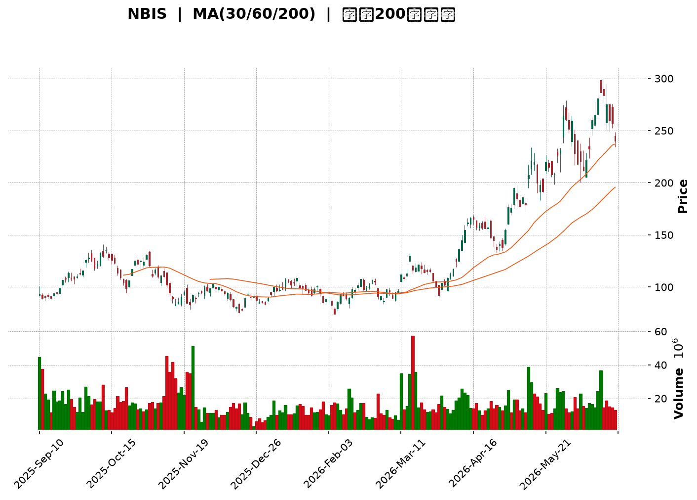
</details>

<html>
<head><meta charset="utf-8" /></head>
<body>
    <div style="height:500px; width:100%;">                        <script>window.PlotlyConfig = {MathJaxConfig: 'local'};</script>
        <script charset="utf-8" src="https://cdn.plot.ly/plotly-3.6.0.min.js" integrity="sha256-QaOVwtVY0T02VaHrr6pnoHLCwayMJp4O5n4YyaE3rJk=" crossorigin="anonymous"></script>                <div id="candlestick-chart" class="plotly-graph-div" style="height:100%; width:100%;"></div>            <script>                window.PLOTLYENV=window.PLOTLYENV || {};                                if (document.getElementById("candlestick-chart")) {                    Plotly.newPlot(                        "candlestick-chart",                        [{"close":{"dtype":"f8","bdata":"AAAAwPVYV0AAAAAAKUxWQAAAAIA9mlZAAAAAoHC9VkAAAAAghVtWQAAAAMAehVdAAAAAIK6HV0AAAAAA19NYQAAAAGBmplpAAAAAQDPzWkAAAABguE5cQAAAAAAp\u002fFpAAAAAwMzsWkAAAACAFI5bQAAAAKBHEVxAAAAAQArnXEAAAAAgrndfQAAAAGC4\u002fl9AAAAAACk8X0AAAADAzGxdQAAAAAAAgF5AAAAA4HqUYEAAAABgjzJgQAAAAGC47mBAAAAAwMwEYEAAAADAHnVfQAAAAGCPwl5AAAAAAClcXEAAAAAAAEBbQAAAAIDrEVpAAAAAIK6nWEAAAACAPYpaQAAAAOCjUF1AAAAAIIVbX0AAAADAHnVeQAAAAGBmRl9AAAAAIIULX0AAAACAPVpgQAAAAIAUHl5AAAAAYI+iW0AAAAAAAEBdQAAAAAApXFtAAAAAgOvRW0AAAADAzHxbQAAAAIAUjllAAAAAQAqXV0AAAADgUShWQAAAAGCP4lRAAAAAYLh+VUAAAABgj6JWQAAAAOB6xFdAAAAAwPUoVUAAAADgo9BUQAAAAKCZ+VZAAAAA4FE4VkAAAAAAKaxXQAAAACCut1dAAAAAoJkJWUAAAADAzBxYQAAAAEDhulhAAAAAQDOzWUAAAABgj4JYQAAAAMAeFVlAAAAAgD0aWEAAAACAwmVXQAAAAIDrkVdAAAAAACnsVUAAAADA9UhUQAAAAMDMPFRAAAAAwMzcUkAAAACAwoVTQAAAAKBwXVZAAAAAYLhOV0AAAACA64FWQAAAAOBRyFZAAAAAgMLlVUAAAABgj4JVQAAAAEDhSlVAAAAAwB7tVEAAAADAzHxWQAAAAMAeNVdAAAAAIFwPWUAAAACgcA1YQAAAAEAzU1hAAAAAIIV7WEAAAADAHtVaQAAAACCFW1pAAAAAYLh+WUAAAADgo\u002fhZQAAAAGC4LltAAAAAYI\u002fSWEAAAAAgrrdYQAAAAGBmNlhAAAAAAACgV0AAAACgcN1WQAAAACCud1hAAAAAIIUbWUAAAACAPbpXQAAAAAApTFVAAAAAgD0KVkAAAADAzHxWQAAAAMD1mFRAAAAAIK53UkAAAABgZoZVQAAAAOBROFdAAAAAYI\u002fyVkAAAABACidWQAAAAGC4blZAAAAA4KOAWEAAAACgR2FYQAAAAEAzc1lAAAAAQArnWkAAAABA4XpYQAAAAEAKJ1lAAAAAwB6lWUAAAAAgrodaQAAAAOBROFpAAAAAACnMVkAAAADgo8BWQAAAAEAzs1VAAAAAgOtxWEAAAACgmelXQAAAAMAeVVZAAAAAACm8V0AAAAAghRtYQAAAACCu\u002f1tAAAAAYI8CW0AAAADAzDxcQAAAAEAzO2BAAAAAwB4VXUAAAAAA16NdQAAAAKBHYV5AAAAAIK5nXUAAAACgmYlcQAAAAIA9ulxAAAAAgMLFXEAAAACAFH5aQAAAAOB6NFlAAAAA4KMQV0AAAADgo\u002fBZQAAAAMDMfFlAAAAA4Ho0W0AAAABgjyJcQAAAAKCZWV1AAAAAAABAX0AAAABgjwphQAAAAEAKH2JAAAAAgOtRY0AAAACAFD5kQAAAAOCj2GRAAAAAQOGqZEAAAADgeqRjQAAAAMAe5WNAAAAAoJmRY0AAAADgeoRjQAAAAGCPomNAAAAAwB5lYkAAAABguB5iQAAAAOBR8GBAAAAAgBSmYUAAAAAgXEdhQAAAACCuT2NAAAAAoHANZkAAAACgcP1lQAAAAEDhYmhAAAAA4KMYZ0AAAACgmSFmQAAAAEAzQ2dAAAAAIIVjZkAAAADgo+hpQAAAAMDMpGtAAAAAgBR+a0AAAAAghftoQAAAACBct2hAAAAAgD36Z0AAAACAwn1rQAAAAOCj2GpAAAAAgOsBakAAAAAA1wtqQAAAAEDhSmxAAAAAQOHibEAAAAAAKYhwQAAAAKBHSXBAAAAAgMJ1b0AAAABguDpwQAAAAIDreWxAAAAAAABAa0AAAAAA14NrQAAAAIAUdmpAAAAAIK7Ha0AAAAAghQttQAAAAMAeQXBAAAAAoJmRcEAAAABgj45xQAAAAEAK63FAAAAAgMK5cUAAAAAAADRxQAAAAGCPOnBAAAAAgBQKcEAAAACgmQluQA=="},"high":{"dtype":"f8","bdata":"AAAA4KMgWUAAAAAgrndXQAAAAAAAAFdAAAAAQOGaV0AAAABAM9NWQAAAAAAAwFdAAAAAIIVrWEAAAABAM+NYQAAAAMAeJVtAAAAAYLh+W0AAAABgZrZcQAAAAMAehVxAAAAAIFx\u002fW0AAAACgRyFcQAAAAKCZaV1AAAAA4FH4XEAAAAAgXK9fQAAAAABUn2BAAAAA4FH4YEAAAADA9QhgQAAAAADXU19AAAAAgD2qYEAAAABAM6NhQAAAAMD1UGFAAAAAgBa5YEAAAAAgrn9gQAAAAEAKX2BAAAAAAKwkXkAAAACAFF5dQAAAACCFC1tAAAAAQDPzWkAAAAAgrqdaQAAAAMDMXF1AAAAAAACgX0AAAADA9SBgQAAAAMDMfF9AAAAAgBQOYEAAAADAzIRgQAAAAIDC3WBAAAAAgOsxXUAAAACgcI1dQAAAAAAAQF5AAAAAQDPTW0AAAAAgrpddQAAAAADXo1xAAAAAoJlpWkAAAABguN5WQAAAAAAAQFZAAAAAoJlpVkAAAAAAKWxXQAAAAIAULlhAAAAAACmsWUAAAAAgXC9WQAAAAAAAQFdAAAAAgOvRVkAAAACAk+hXQAAAAMAeRVhAAAAAYGZmWUAAAADAzLxZQAAAAADXw1hAAAAAgML1WUAAAABgZlZZQAAAAAAAIFlAAAAAIIM4WUAAAACAwkVYQAAAAMDM3FdAAAAAoJnpV0AAAAAgXA9WQAAAAADXY1RAAAAAQDMTVUAAAABgZhZUQAAAAGCPolZAAAAAoJn5V0AAAACAFD5XQAAAAEDh2lZAAAAAIK7nVkAAAABACidWQAAAAKBwvVVAAAAAgBSeVUAAAADgo7BWQAAAAAAp3FdAAAAAIIUrWUAAAABgZpZZQAAAAGCPollAAAAAgBQ+WkAAAAAghStbQAAAAMDM\u002fFpAAAAAwMysWkAAAADgUQhbQAAAAAAAoFtAAAAAgBQeWkAAAACgmZlZQAAAAGC4\u002fllAAAAA4KO4WEAAAADgUThZQAAAAGCP4lhAAAAAYGZ2WUAAAAAAANBYQAAAAGCPAldAAAAAAABQVkAAAADA9dhWQAAAAGCP6lVAAAAA4Ho0VEAAAACAPapVQAAAACCFa1dAAAAAAFTjV0AAAAAAALBXQAAAAOCjsFZAAAAA4HoUWUAAAABgj9JYQAAAAKCZGVpAAAAAYLj+WkAAAADgehRbQAAAAKBuSllAAAAAAADwWUAAAAAAKdxaQAAAAOB6FFtAAAAAQDPTWEAAAACgxNhWQAAAACCud1ZAAAAAYLieWEAAAAAAANBYQAAAAMDMvFdAAAAAwMzMV0AAAACgmZlYQAAAAMAehVxAAAAAYI\u002fCW0AAAADgeiRdQAAAAKCZiWBAAAAAAABgXkAAAABAibFeQAAAAEAzc15AAAAAAFbuXkAAAAAA11NeQAAAAEAzc11AAAAAQDOzXUAAAABAM1NcQAAAAOCjkFpAAAAAIFyPWUAAAADA9fhZQAAAACCu91pAAAAAoHA9W0AAAACAwnVcQAAAAKCZeV1AAAAAAADwX0AAAACgmRFhQAAAAIA9umJAAAAAAADwY0AAAABAM8NkQAAAAIDr2WRAAAAAYLgWZUAAAACA64FkQAAAAAAAOGRAAAAAAABoZEAAAACAwu1kQAAAAIDruWRAAAAAAACoZEAAAACgmZliQAAAAGC4rmFAAAAAYGb2YUAAAAAgXF9iQAAAAAAAgGNAAAAAwMxsZkAAAABguH5mQAAAACCuf2hAAAAA4Hq8aEAAAAAAAIhnQAAAAICXjmhAAAAAIIUzZ0AAAABA4SprQAAAACBcN21AAAAAoEeZbEAAAACAPUJrQAAAAIDrWWlAAAAAAACIaUAAAACA61lsQAAAAKBwvWtAAAAA4FGga0AAAADgejRqQAAAAOB6HG1AAAAAQDMzbUAAAACgxCxxQAAAAKBwbXFAAAAAIFy3cEAAAAAghYdwQAAAAAAAWG9AAAAAwMwMbkAAAADA9bRtQAAAACCu32xAAAAAIK6PbEAAAABA4XJuQAAAAOBRbnBAAAAAIIVVcUAAAABA4Z5yQAAAAMDMrHJAAAAAgMK9ckAAAAAgrnNyQAAAAKBuQnFAAAAA4FE4cUAAAACgmRlvQA=="},"hovertemplate":"\u003cb\u003e%{x|%Y-%m-%d}\u003c\u002fb\u003e\u003cbr\u003e\u958b: $%{open:.2f}\u003cbr\u003e\u9ad8: $%{high:.2f}\u003cbr\u003e\u4f4e: $%{low:.2f}\u003cbr\u003e\u6536: $%{close:.2f}\u003cextra\u003e\u003c\u002fextra\u003e","low":{"dtype":"f8","bdata":"AAAAAADAVkAAAABgjxpWQAAAAIDrsVVAAAAAgMI1VkAAAACgRwFWQAAAAMAeNVZAAAAAgOsBV0AAAAAAAFBXQAAAAKBHoVhAAAAAAAAQWkAAAABgZjZaQAAAAOBReFpAAAAAQDOzWUAAAADAHhVbQAAAAIA96ltAAAAA4KNwW0AAAADgeqRdQAAAAGBm5l5AAAAAIIU7X0AAAACAFO5cQAAAAAAAYF1AAAAAIK73XUAAAADgUQBgQAAAAMDMlGBAAAAAAABwX0AAAADAzIxeQAAAAKBHgV5AAAAA4FG4W0AAAADgo+BaQAAAAKCZWVlAAAAA4FGoV0AAAACgcN1YQAAAAOCjgFtAAAAAQAoHXkAAAACA6zFeQAAAAAAAYF1AAAAA4KNwXUAAAABAM5NfQAAAAAAA8F1AAAAAAABAW0AAAAAghdtbQAAAAIA9GltAAAAA4KNQWUAAAACAFC5bQAAAAMAe9VhAAAAAoHDtVkAAAAAAACBVQAAAAAAAgFRAAAAAgMLlVEAAAACgcG1UQAAAAEAz81ZAAAAAoHANVUAAAACgcI1TQAAAAKCZSVVAAAAA4CQuVUAAAADgo7BWQAAAAAApXFdAAAAA4KNAVkAAAAAA1wNYQAAAAAAAwFZAAAAAgBReWEAAAADAzAxYQAAAAEAz01dAAAAAYGYGWEAAAADAzAxXQAAAAMDMrFVAAAAAwMyMVUAAAACgGARUQAAAAOBROFNAAAAAAADQUkAAAADgo0BTQAAAAIA9ClRAAAAAYGbGVkAAAAAA1xNWQAAAAKCZKVZAAAAAIFyvVUAAAABgjxJVQAAAAADXI1VAAAAAoJm5VEAAAADgo4BVQAAAAMD1uFZAAAAAACm8VkAAAAAA1+NXQAAAACBYAVhAAAAAYGZGWEAAAABAMyNYQAAAAEDh+llAAAAAIIPYWEAAAABgZkZZQAAAAKBwLVlAAAAAgMKVWEAAAABgZkZXQAAAAAAAIFhAAAAAgOthV0AAAABACtdWQAAAAIDrYVdAAAAAACkcWEAAAACAPcpWQAAAACCuB1VAAAAAgBQOVUAAAAAAADBVQAAAAAApnFNAAAAAoEdhUkAAAAAgrkdTQAAAAADX81RAAAAAgD3qVkAAAADA9chVQAAAAAAp7FNAAAAAQAo3VkAAAAAAAGBXQAAAACDZNlhAAAAAIIUbWUAAAACA60FYQAAAAEAz01dAAAAAQN9vWEAAAABAM7NZQAAAAAAAgFlAAAAAoJkZVkAAAABAM7NVQAAAAIDr4VRAAAAAoJmJVkAAAAAgrudWQAAAAEAzM1ZAAAAAAACgVUAAAAAAAMBXQAAAACBcH1pAAAAAoEehWkAAAADA9YhbQAAAAGASG19AAAAAQApHXEAAAAAAAIBcQAAAAKBHsVxAAAAAgJMoXEAAAABAM2NcQAAAAOCjAFxAAAAAwB5VXEAAAACAPVpaQAAAAKBHEVlAAAAAwMppVkAAAABguO5XQAAAAGBmVllAAAAAACkMWEAAAADAzNxaQAAAAIDrkVtAAAAAYGbWXUAAAABAMyNfQAAAAOBR3GBAAAAAoJnJYUAAAADgo9BjQAAAAAAAkGNAAAAAQOECZEAAAAAgXFdjQAAAAKBHQWNAAAAAwMxsY0AAAABAM2tjQAAAAIA9QmNAAAAAgOs5YkAAAACA61FhQAAAAGBmlmBAAAAAQArHYEAAAAAAAOBgQAAAAAAAgGFAAAAAYGb2Y0AAAABguBZlQAAAACCF42VAAAAAAAAgZkAAAAAAABBmQAAAAKCZUWZAAAAAAACIZUAAAAAAAGBoQAAAAAAA+GlAAAAAoJl5akAAAABgj8JnQAAAAAAA4GZAAAAA4HrUZ0AAAACgmRlqQAAAACBcV2pAAAAAwB61aUAAAACA68loQAAAAOBRYGtAAAAAwMxMakAAAAAAAMBtQAAAAAAAPHBAAAAA4FHwbkAAAACAFFZtQAAAAIAUFmtAAAAAYGY2a0AAAACgmQlpQAAAAADXa2pAAAAAAACgaUAAAAAAAPBrQAAAACCup25AAAAAwMysb0AAAADgo4RwQAAAAEAzOXFAAAAAAABgcUAAAAAAAGBvQAAAAGC4Jm9AAAAAgOuRb0AAAADAzExtQA=="},"name":"\u50f9\u683c","open":{"dtype":"f8","bdata":"AAAAwPXoVkAAAABA4SpXQAAAAAApzFZAAAAAQAonV0AAAADAzMxWQAAAAEDh6lZAAAAAwMzEV0AAAADA9YhXQAAAAMDMfFlAAAAAYI8CW0AAAADgo0hbQAAAACCFA1tAAAAAIIV7W0AAAADgUVhbQAAAAOB6XFxAAAAAgMLtW0AAAACgR\u002fFeQAAAAEAKz19AAAAAwMyMYEAAAADAzPRfQAAAAMDMTF5AAAAAYLg+XkAAAABgZt5gQAAAAGC45mBAAAAAAACAYEAAAADAzHxgQAAAAEDhAmBAAAAAANeDXUAAAABgjzJdQAAAAOBR+FpAAAAAQDOrWkAAAADAHhVZQAAAAIA9yltAAAAAgD06XkAAAAAA15tfQAAAAIDrEV9AAAAAwMxMXkAAAADA9ahfQAAAAAAAwGBAAAAAYLgWXEAAAADA9WhcQAAAAEAz411AAAAAAAAgWkAAAAAghctcQAAAAOBRiFxAAAAAwMwMWkAAAADA9bhWQAAAAEAKl1RAAAAA4Hr0VEAAAACA6\u002fFUQAAAAOBRQFdAAAAAIIXbWEAAAABAM2NVQAAAAGC4jlVAAAAAYI9SVkAAAABgZnZXQAAAAEAzI1hAAAAAwMzcVkAAAABAChdZQAAAAKBHwVdAAAAA4HrEWEAAAACAwhVZQAAAAGCPUlhAAAAAgMKFWEAAAABguO5XQAAAAMDMTFZAAAAAANdTV0AAAABgZgZWQAAAAMDM5FNAAAAAgMIFVUAAAABAM8NTQAAAAKCZKVRAAAAAgBQ+V0AAAAAA15NWQAAAAGC4jlZAAAAA4KPgVkAAAADAzBxVQAAAAAAAmFVAAAAAIK5XVUAAAABACr9VQAAAAAAAwFdAAAAAgMLtV0AAAADgo8BYQAAAAGCPMlhAAAAAoEe5WEAAAADgepRYQAAAAMAe1VpAAAAAgOtxWkAAAAAghSNaQAAAACCuf1pAAAAAwB51WUAAAACAwkVZQAAAAOCjgFlAAAAAwMwsWEAAAACgcG1YQAAAAGBmlldAAAAAAAAAWUAAAABACpdYQAAAAKBD41ZAAAAAANdzVUAAAAAghXtWQAAAAAAAwFVAAAAAwPXIU0AAAABgZs5TQAAAAMDMHFVAAAAAYI86V0AAAABgjzpXQAAAAGBmBlVAAAAAQAp3VkAAAAAAAABYQAAAAGC47lhAAAAAIIUbWUAAAAAA06VaQAAAACCFE1hAAAAAIFzXWEAAAAAgXD9aQAAAAAAAgFpAAAAAwMysWEAAAAAAAABWQAAAAKCZiVVAAAAAoJmZVkAAAAAAADBYQAAAAEAzE1dAAAAAQArXVUAAAADA9chXQAAAAIA9SlpAAAAAgMJFW0AAAAAAKZxbQAAAAAAAMF9AAAAAgMIVXkAAAABAM7NcQAAAAOBR0FxAAAAAYGYeXkAAAACgcC1dQAAAAEAzC11AAAAAIK43XUAAAADgUVBcQAAAAMAedVpAAAAAIFyPWUAAAABguH5YQAAAAOB6fFpAAAAAgD0aWEAAAACAPSpbQAAAAAAAqFtAAAAA4FG4X0AAAAAAAEBfQAAAAOBR3GBAAAAAYGbWYUAAAABAMyNkQAAAAGA7B2RAAAAAAADgZEAAAADA9XhkQAAAAAAAoGNAAAAAQAonZEAAAAAghVtkQAAAAMDMfGNAAAAAoHB1ZEAAAADgeoxiQAAAAMDMTGFAAAAAQAqDYUAAAACA6yViQAAAAGCPqmFAAAAA4FEMZEAAAADAzHRlQAAAAEAKc2ZAAAAA4FHAZ0AAAABgZvZmQAAAAMDMfGZAAAAAoHCNZkAAAABACntpQAAAAAAArGpAAAAAIIUza0AAAABACi9rQAAAAAAA4GdAAAAAQAp\u002faUAAAAAgrndqQAAAAOBRaGtAAAAAoJmVa0AAAADAHvlpQAAAAAApzGxAAAAAIIV7bEAAAABA4YJuQAAAAKCZAXFAAAAAoHBDcEAAAAAgrvdtQAAAACCF225AAAAAwMwMbkAAAAAAAMBsQAAAAKDG72pAAAAA4HqsaUAAAADAzFRtQAAAAGC4fm9AAAAAQArvb0AAAABgZppwQAAAAEAzo3JAAAAAIFwfckAAAAAAABxwQAAAAKCZMXFAAAAAwB4JcUAAAABAM5tuQA=="},"x":["2025-09-10T00:00:00-04:00","2025-09-11T00:00:00-04:00","2025-09-12T00:00:00-04:00","2025-09-15T00:00:00-04:00","2025-09-16T00:00:00-04:00","2025-09-17T00:00:00-04:00","2025-09-18T00:00:00-04:00","2025-09-19T00:00:00-04:00","2025-09-22T00:00:00-04:00","2025-09-23T00:00:00-04:00","2025-09-24T00:00:00-04:00","2025-09-25T00:00:00-04:00","2025-09-26T00:00:00-04:00","2025-09-29T00:00:00-04:00","2025-09-30T00:00:00-04:00","2025-10-01T00:00:00-04:00","2025-10-02T00:00:00-04:00","2025-10-03T00:00:00-04:00","2025-10-06T00:00:00-04:00","2025-10-07T00:00:00-04:00","2025-10-08T00:00:00-04:00","2025-10-09T00:00:00-04:00","2025-10-10T00:00:00-04:00","2025-10-13T00:00:00-04:00","2025-10-14T00:00:00-04:00","2025-10-15T00:00:00-04:00","2025-10-16T00:00:00-04:00","2025-10-17T00:00:00-04:00","2025-10-20T00:00:00-04:00","2025-10-21T00:00:00-04:00","2025-10-22T00:00:00-04:00","2025-10-23T00:00:00-04:00","2025-10-24T00:00:00-04:00","2025-10-27T00:00:00-04:00","2025-10-28T00:00:00-04:00","2025-10-29T00:00:00-04:00","2025-10-30T00:00:00-04:00","2025-10-31T00:00:00-04:00","2025-11-03T00:00:00-05:00","2025-11-04T00:00:00-05:00","2025-11-05T00:00:00-05:00","2025-11-06T00:00:00-05:00","2025-11-07T00:00:00-05:00","2025-11-10T00:00:00-05:00","2025-11-11T00:00:00-05:00","2025-11-12T00:00:00-05:00","2025-11-13T00:00:00-05:00","2025-11-14T00:00:00-05:00","2025-11-17T00:00:00-05:00","2025-11-18T00:00:00-05:00","2025-11-19T00:00:00-05:00","2025-11-20T00:00:00-05:00","2025-11-21T00:00:00-05:00","2025-11-24T00:00:00-05:00","2025-11-25T00:00:00-05:00","2025-11-26T00:00:00-05:00","2025-11-28T00:00:00-05:00","2025-12-01T00:00:00-05:00","2025-12-02T00:00:00-05:00","2025-12-03T00:00:00-05:00","2025-12-04T00:00:00-05:00","2025-12-05T00:00:00-05:00","2025-12-08T00:00:00-05:00","2025-12-09T00:00:00-05:00","2025-12-10T00:00:00-05:00","2025-12-11T00:00:00-05:00","2025-12-12T00:00:00-05:00","2025-12-15T00:00:00-05:00","2025-12-16T00:00:00-05:00","2025-12-17T00:00:00-05:00","2025-12-18T00:00:00-05:00","2025-12-19T00:00:00-05:00","2025-12-22T00:00:00-05:00","2025-12-23T00:00:00-05:00","2025-12-24T00:00:00-05:00","2025-12-26T00:00:00-05:00","2025-12-29T00:00:00-05:00","2025-12-30T00:00:00-05:00","2025-12-31T00:00:00-05:00","2026-01-02T00:00:00-05:00","2026-01-05T00:00:00-05:00","2026-01-06T00:00:00-05:00","2026-01-07T00:00:00-05:00","2026-01-08T00:00:00-05:00","2026-01-09T00:00:00-05:00","2026-01-12T00:00:00-05:00","2026-01-13T00:00:00-05:00","2026-01-14T00:00:00-05:00","2026-01-15T00:00:00-05:00","2026-01-16T00:00:00-05:00","2026-01-20T00:00:00-05:00","2026-01-21T00:00:00-05:00","2026-01-22T00:00:00-05:00","2026-01-23T00:00:00-05:00","2026-01-26T00:00:00-05:00","2026-01-27T00:00:00-05:00","2026-01-28T00:00:00-05:00","2026-01-29T00:00:00-05:00","2026-01-30T00:00:00-05:00","2026-02-02T00:00:00-05:00","2026-02-03T00:00:00-05:00","2026-02-04T00:00:00-05:00","2026-02-05T00:00:00-05:00","2026-02-06T00:00:00-05:00","2026-02-09T00:00:00-05:00","2026-02-10T00:00:00-05:00","2026-02-11T00:00:00-05:00","2026-02-12T00:00:00-05:00","2026-02-13T00:00:00-05:00","2026-02-17T00:00:00-05:00","2026-02-18T00:00:00-05:00","2026-02-19T00:00:00-05:00","2026-02-20T00:00:00-05:00","2026-02-23T00:00:00-05:00","2026-02-24T00:00:00-05:00","2026-02-25T00:00:00-05:00","2026-02-26T00:00:00-05:00","2026-02-27T00:00:00-05:00","2026-03-02T00:00:00-05:00","2026-03-03T00:00:00-05:00","2026-03-04T00:00:00-05:00","2026-03-05T00:00:00-05:00","2026-03-06T00:00:00-05:00","2026-03-09T00:00:00-04:00","2026-03-10T00:00:00-04:00","2026-03-11T00:00:00-04:00","2026-03-12T00:00:00-04:00","2026-03-13T00:00:00-04:00","2026-03-16T00:00:00-04:00","2026-03-17T00:00:00-04:00","2026-03-18T00:00:00-04:00","2026-03-19T00:00:00-04:00","2026-03-20T00:00:00-04:00","2026-03-23T00:00:00-04:00","2026-03-24T00:00:00-04:00","2026-03-25T00:00:00-04:00","2026-03-26T00:00:00-04:00","2026-03-27T00:00:00-04:00","2026-03-30T00:00:00-04:00","2026-03-31T00:00:00-04:00","2026-04-01T00:00:00-04:00","2026-04-02T00:00:00-04:00","2026-04-06T00:00:00-04:00","2026-04-07T00:00:00-04:00","2026-04-08T00:00:00-04:00","2026-04-09T00:00:00-04:00","2026-04-10T00:00:00-04:00","2026-04-13T00:00:00-04:00","2026-04-14T00:00:00-04:00","2026-04-15T00:00:00-04:00","2026-04-16T00:00:00-04:00","2026-04-17T00:00:00-04:00","2026-04-20T00:00:00-04:00","2026-04-21T00:00:00-04:00","2026-04-22T00:00:00-04:00","2026-04-23T00:00:00-04:00","2026-04-24T00:00:00-04:00","2026-04-27T00:00:00-04:00","2026-04-28T00:00:00-04:00","2026-04-29T00:00:00-04:00","2026-04-30T00:00:00-04:00","2026-05-01T00:00:00-04:00","2026-05-04T00:00:00-04:00","2026-05-05T00:00:00-04:00","2026-05-06T00:00:00-04:00","2026-05-07T00:00:00-04:00","2026-05-08T00:00:00-04:00","2026-05-11T00:00:00-04:00","2026-05-12T00:00:00-04:00","2026-05-13T00:00:00-04:00","2026-05-14T00:00:00-04:00","2026-05-15T00:00:00-04:00","2026-05-18T00:00:00-04:00","2026-05-19T00:00:00-04:00","2026-05-20T00:00:00-04:00","2026-05-21T00:00:00-04:00","2026-05-22T00:00:00-04:00","2026-05-26T00:00:00-04:00","2026-05-27T00:00:00-04:00","2026-05-28T00:00:00-04:00","2026-05-29T00:00:00-04:00","2026-06-01T00:00:00-04:00","2026-06-02T00:00:00-04:00","2026-06-03T00:00:00-04:00","2026-06-04T00:00:00-04:00","2026-06-05T00:00:00-04:00","2026-06-08T00:00:00-04:00","2026-06-09T00:00:00-04:00","2026-06-10T00:00:00-04:00","2026-06-11T00:00:00-04:00","2026-06-12T00:00:00-04:00","2026-06-15T00:00:00-04:00","2026-06-16T00:00:00-04:00","2026-06-17T00:00:00-04:00","2026-06-18T00:00:00-04:00","2026-06-22T00:00:00-04:00","2026-06-23T00:00:00-04:00","2026-06-24T00:00:00-04:00","2026-06-25T00:00:00-04:00","2026-06-26T00:00:00-04:00"],"type":"candlestick"},{"hovertemplate":"MA30: $%{y:.2f}\u003cextra\u003e\u003c\u002fextra\u003e","line":{"color":"#2196F3","dash":"dash","width":2},"mode":"lines","name":"MA30","x":["2025-09-10T00:00:00-04:00","2025-09-11T00:00:00-04:00","2025-09-12T00:00:00-04:00","2025-09-15T00:00:00-04:00","2025-09-16T00:00:00-04:00","2025-09-17T00:00:00-04:00","2025-09-18T00:00:00-04:00","2025-09-19T00:00:00-04:00","2025-09-22T00:00:00-04:00","2025-09-23T00:00:00-04:00","2025-09-24T00:00:00-04:00","2025-09-25T00:00:00-04:00","2025-09-26T00:00:00-04:00","2025-09-29T00:00:00-04:00","2025-09-30T00:00:00-04:00","2025-10-01T00:00:00-04:00","2025-10-02T00:00:00-04:00","2025-10-03T00:00:00-04:00","2025-10-06T00:00:00-04:00","2025-10-07T00:00:00-04:00","2025-10-08T00:00:00-04:00","2025-10-09T00:00:00-04:00","2025-10-10T00:00:00-04:00","2025-10-13T00:00:00-04:00","2025-10-14T00:00:00-04:00","2025-10-15T00:00:00-04:00","2025-10-16T00:00:00-04:00","2025-10-17T00:00:00-04:00","2025-10-20T00:00:00-04:00","2025-10-21T00:00:00-04:00","2025-10-22T00:00:00-04:00","2025-10-23T00:00:00-04:00","2025-10-24T00:00:00-04:00","2025-10-27T00:00:00-04:00","2025-10-28T00:00:00-04:00","2025-10-29T00:00:00-04:00","2025-10-30T00:00:00-04:00","2025-10-31T00:00:00-04:00","2025-11-03T00:00:00-05:00","2025-11-04T00:00:00-05:00","2025-11-05T00:00:00-05:00","2025-11-06T00:00:00-05:00","2025-11-07T00:00:00-05:00","2025-11-10T00:00:00-05:00","2025-11-11T00:00:00-05:00","2025-11-12T00:00:00-05:00","2025-11-13T00:00:00-05:00","2025-11-14T00:00:00-05:00","2025-11-17T00:00:00-05:00","2025-11-18T00:00:00-05:00","2025-11-19T00:00:00-05:00","2025-11-20T00:00:00-05:00","2025-11-21T00:00:00-05:00","2025-11-24T00:00:00-05:00","2025-11-25T00:00:00-05:00","2025-11-26T00:00:00-05:00","2025-11-28T00:00:00-05:00","2025-12-01T00:00:00-05:00","2025-12-02T00:00:00-05:00","2025-12-03T00:00:00-05:00","2025-12-04T00:00:00-05:00","2025-12-05T00:00:00-05:00","2025-12-08T00:00:00-05:00","2025-12-09T00:00:00-05:00","2025-12-10T00:00:00-05:00","2025-12-11T00:00:00-05:00","2025-12-12T00:00:00-05:00","2025-12-15T00:00:00-05:00","2025-12-16T00:00:00-05:00","2025-12-17T00:00:00-05:00","2025-12-18T00:00:00-05:00","2025-12-19T00:00:00-05:00","2025-12-22T00:00:00-05:00","2025-12-23T00:00:00-05:00","2025-12-24T00:00:00-05:00","2025-12-26T00:00:00-05:00","2025-12-29T00:00:00-05:00","2025-12-30T00:00:00-05:00","2025-12-31T00:00:00-05:00","2026-01-02T00:00:00-05:00","2026-01-05T00:00:00-05:00","2026-01-06T00:00:00-05:00","2026-01-07T00:00:00-05:00","2026-01-08T00:00:00-05:00","2026-01-09T00:00:00-05:00","2026-01-12T00:00:00-05:00","2026-01-13T00:00:00-05:00","2026-01-14T00:00:00-05:00","2026-01-15T00:00:00-05:00","2026-01-16T00:00:00-05:00","2026-01-20T00:00:00-05:00","2026-01-21T00:00:00-05:00","2026-01-22T00:00:00-05:00","2026-01-23T00:00:00-05:00","2026-01-26T00:00:00-05:00","2026-01-27T00:00:00-05:00","2026-01-28T00:00:00-05:00","2026-01-29T00:00:00-05:00","2026-01-30T00:00:00-05:00","2026-02-02T00:00:00-05:00","2026-02-03T00:00:00-05:00","2026-02-04T00:00:00-05:00","2026-02-05T00:00:00-05:00","2026-02-06T00:00:00-05:00","2026-02-09T00:00:00-05:00","2026-02-10T00:00:00-05:00","2026-02-11T00:00:00-05:00","2026-02-12T00:00:00-05:00","2026-02-13T00:00:00-05:00","2026-02-17T00:00:00-05:00","2026-02-18T00:00:00-05:00","2026-02-19T00:00:00-05:00","2026-02-20T00:00:00-05:00","2026-02-23T00:00:00-05:00","2026-02-24T00:00:00-05:00","2026-02-25T00:00:00-05:00","2026-02-26T00:00:00-05:00","2026-02-27T00:00:00-05:00","2026-03-02T00:00:00-05:00","2026-03-03T00:00:00-05:00","2026-03-04T00:00:00-05:00","2026-03-05T00:00:00-05:00","2026-03-06T00:00:00-05:00","2026-03-09T00:00:00-04:00","2026-03-10T00:00:00-04:00","2026-03-11T00:00:00-04:00","2026-03-12T00:00:00-04:00","2026-03-13T00:00:00-04:00","2026-03-16T00:00:00-04:00","2026-03-17T00:00:00-04:00","2026-03-18T00:00:00-04:00","2026-03-19T00:00:00-04:00","2026-03-20T00:00:00-04:00","2026-03-23T00:00:00-04:00","2026-03-24T00:00:00-04:00","2026-03-25T00:00:00-04:00","2026-03-26T00:00:00-04:00","2026-03-27T00:00:00-04:00","2026-03-30T00:00:00-04:00","2026-03-31T00:00:00-04:00","2026-04-01T00:00:00-04:00","2026-04-02T00:00:00-04:00","2026-04-06T00:00:00-04:00","2026-04-07T00:00:00-04:00","2026-04-08T00:00:00-04:00","2026-04-09T00:00:00-04:00","2026-04-10T00:00:00-04:00","2026-04-13T00:00:00-04:00","2026-04-14T00:00:00-04:00","2026-04-15T00:00:00-04:00","2026-04-16T00:00:00-04:00","2026-04-17T00:00:00-04:00","2026-04-20T00:00:00-04:00","2026-04-21T00:00:00-04:00","2026-04-22T00:00:00-04:00","2026-04-23T00:00:00-04:00","2026-04-24T00:00:00-04:00","2026-04-27T00:00:00-04:00","2026-04-28T00:00:00-04:00","2026-04-29T00:00:00-04:00","2026-04-30T00:00:00-04:00","2026-05-01T00:00:00-04:00","2026-05-04T00:00:00-04:00","2026-05-05T00:00:00-04:00","2026-05-06T00:00:00-04:00","2026-05-07T00:00:00-04:00","2026-05-08T00:00:00-04:00","2026-05-11T00:00:00-04:00","2026-05-12T00:00:00-04:00","2026-05-13T00:00:00-04:00","2026-05-14T00:00:00-04:00","2026-05-15T00:00:00-04:00","2026-05-18T00:00:00-04:00","2026-05-19T00:00:00-04:00","2026-05-20T00:00:00-04:00","2026-05-21T00:00:00-04:00","2026-05-22T00:00:00-04:00","2026-05-26T00:00:00-04:00","2026-05-27T00:00:00-04:00","2026-05-28T00:00:00-04:00","2026-05-29T00:00:00-04:00","2026-06-01T00:00:00-04:00","2026-06-02T00:00:00-04:00","2026-06-03T00:00:00-04:00","2026-06-04T00:00:00-04:00","2026-06-05T00:00:00-04:00","2026-06-08T00:00:00-04:00","2026-06-09T00:00:00-04:00","2026-06-10T00:00:00-04:00","2026-06-11T00:00:00-04:00","2026-06-12T00:00:00-04:00","2026-06-15T00:00:00-04:00","2026-06-16T00:00:00-04:00","2026-06-17T00:00:00-04:00","2026-06-18T00:00:00-04:00","2026-06-22T00:00:00-04:00","2026-06-23T00:00:00-04:00","2026-06-24T00:00:00-04:00","2026-06-25T00:00:00-04:00","2026-06-26T00:00:00-04:00"],"y":{"dtype":"f8","bdata":"AAAAAAAA+H8AAAAAAAD4fwAAAAAAAPh\u002fAAAAAAAA+H8AAAAAAAD4fwAAAAAAAPh\u002fAAAAAAAA+H8AAAAAAAD4fwAAAAAAAPh\u002fAAAAAAAA+H8AAAAAAAD4fwAAAAAAAPh\u002fAAAAAAAA+H8AAAAAAAD4fwAAAAAAAPh\u002fAAAAAAAA+H8AAAAAAAD4fwAAAAAAAPh\u002fAAAAAAAA+H8AAAAAAAD4fwAAAAAAAPh\u002fAAAAAAAA+H8AAAAAAAD4fwAAAAAAAPh\u002fAAAAAAAA+H8AAAAAAAD4fwAAAAAAAPh\u002fAAAAAAAA+H8AAAAAAAD4f0RERHT22VtAvLu7ux7lW0De3d2dUglcQLy7u0uaQlxAMzMzgyOMXEC8u7s7QtFcQJqZmUlvE11A3t3dDZBTXUCJiIi4yJZdQHd3d5dftF1A7+7u\u002fje6XUCrqqrqQsJdQN7d3R12xV1AZmZmRhnNXUARERHRhcxdQN7d3S0Vt11AiYiI2L+JXUBmZmbWTTpdQLy7u6t\u002f21xAERERUWKIXEBmZmZWcU5cQHd3d\u002ff9FFxAERERkZeuW0C8u7urxktbQJqZmRnZ7lpAIiIichKbWkCrqqrao1haQHd3d0eLHFpAq6qqKjEAWkARERExa+VZQKuqqur72VlAERERwebiWUBmZmYmlNFZQM3MzBx2rVlAMzMzU41vWUBERESETjNZQAAAALCO8VhAiYiISLajWEAAAABgujlYQO\u002fu7i5r5VdAzczMXI+aV0AAAABQjUdXQBEREZHtHFdAzczM3Gv2VkAzMzPj7MtWQEREREREtFZAERER8dKlVkBVVVV1TKBWQHd3d6fGo1ZAMzMzM+yeVkCrqqr6qZ1WQERERKTimFZAIiIiUiq6VkDv7u6+ytVWQN7d3d1P4VZAAAAAYJ70VkAAAACAlQ9XQKuqqqocJldAd3d3FwQqV0CJiIiY4DlXQKuqqirOTldAzczMPFFHV0B3d3eHFklXQLy7u\u002fupQVdA3t3d3ZY9V0CrqqqaCzlXQJqZmTm0QFdAZmZm9uFbV0CJiIg4QnlXQERERNRNgldAAAAAMGudV0BERERUuLZXQKuqqiqjp1dAZmZmBlZ+V0CJiIi483VXQERERHSveVdAd3d3N6WCV0B3d3fHIIhXQGZmZibbkVdAZmZmll+wV0ARERHRhcBXQCIiIqKo01dAMzMzo2HjV0BmZmaGB+dXQJqZmTkX7ldA7+7uvgL4V0DNzMzsbfVXQM3MzIxB9FdAVVVVxTzdV0De3d1NxcFXQJqZmZn8kldAAAAA8MOPV0AzMzNj5YhXQHd3d3faeFdARERExMp5V0DNzMwMZYRXQO\u002fu7i6HoldAIiIiQsOyV0AAAACAP9lXQBEREdGFOFhAREREZJ50WEBEREREp7FYQGZmZnYhBVlAvLu7y3ZiWUBmZmbWTZ5ZQImIiChNzVlAAAAAEAL\u002fWUAAAADwCiRaQN7d3Y2zO1pAmpmZSW8vWkCamZkpvzxaQERERBQRPVpAZmZm5qU\u002fWkDv7u5e1l5aQDMzM\u002fOnglpAIiIiQnyyWkAiIiLy7vJaQO\u002fu7m51SFtAZmZm5qXPW0AzMzMj92ZcQLy7u2uREV1AAAAAMLKhXUDNzMzs3yReQKuqqmrYuV5AERERsUc9X0AAAABQqbxfQN7d3d1rDmBAREREPCY4YEAiIiIaS1pgQAAAAKhUYGBAAAAAGNl6YECJiIhQ1I9gQDMzM1P\u002fsmBAzczMpLfxYECJiIj4mjNhQERERHQhiWFA3t3dvXTTYUAiIiJSRh9iQKuqqnI9emJAmpmZSeHWYkAzMzNrSkVjQO\u002fu7vZvxGNAIiIiIvc6ZECJiIhQG5hkQCIiIsLK7WRAMzMzExE1ZUAiIiJyPY5lQAAAAICx2GVAERERkcIRZkDNzMwMSUNmQBEREaHTgmZAMzMzw\u002fXIZkDv7u7ufDtnQJqZmVmrp2dA3t3dLSQNaEBmZmbGkntoQHd3d8cEx2hAIiIi0pQSaUAiIiKCwGJpQKuqqroCtGlAiYiIyHYKakDNzMyM3m5qQN7d3e1832pAvLu7exQ+a0ARERHBEa5rQJqZmanGD2xAERERkTR5bEBmZma28+FsQO\u002fu7n5qMG1AAAAAoBqDbUBEREQEVqZtQA=="},"type":"scatter"},{"hovertemplate":"MA60: $%{y:.2f}\u003cextra\u003e\u003c\u002fextra\u003e","line":{"color":"#9C27B0","dash":"dash","width":2},"mode":"lines","name":"MA60","x":["2025-09-10T00:00:00-04:00","2025-09-11T00:00:00-04:00","2025-09-12T00:00:00-04:00","2025-09-15T00:00:00-04:00","2025-09-16T00:00:00-04:00","2025-09-17T00:00:00-04:00","2025-09-18T00:00:00-04:00","2025-09-19T00:00:00-04:00","2025-09-22T00:00:00-04:00","2025-09-23T00:00:00-04:00","2025-09-24T00:00:00-04:00","2025-09-25T00:00:00-04:00","2025-09-26T00:00:00-04:00","2025-09-29T00:00:00-04:00","2025-09-30T00:00:00-04:00","2025-10-01T00:00:00-04:00","2025-10-02T00:00:00-04:00","2025-10-03T00:00:00-04:00","2025-10-06T00:00:00-04:00","2025-10-07T00:00:00-04:00","2025-10-08T00:00:00-04:00","2025-10-09T00:00:00-04:00","2025-10-10T00:00:00-04:00","2025-10-13T00:00:00-04:00","2025-10-14T00:00:00-04:00","2025-10-15T00:00:00-04:00","2025-10-16T00:00:00-04:00","2025-10-17T00:00:00-04:00","2025-10-20T00:00:00-04:00","2025-10-21T00:00:00-04:00","2025-10-22T00:00:00-04:00","2025-10-23T00:00:00-04:00","2025-10-24T00:00:00-04:00","2025-10-27T00:00:00-04:00","2025-10-28T00:00:00-04:00","2025-10-29T00:00:00-04:00","2025-10-30T00:00:00-04:00","2025-10-31T00:00:00-04:00","2025-11-03T00:00:00-05:00","2025-11-04T00:00:00-05:00","2025-11-05T00:00:00-05:00","2025-11-06T00:00:00-05:00","2025-11-07T00:00:00-05:00","2025-11-10T00:00:00-05:00","2025-11-11T00:00:00-05:00","2025-11-12T00:00:00-05:00","2025-11-13T00:00:00-05:00","2025-11-14T00:00:00-05:00","2025-11-17T00:00:00-05:00","2025-11-18T00:00:00-05:00","2025-11-19T00:00:00-05:00","2025-11-20T00:00:00-05:00","2025-11-21T00:00:00-05:00","2025-11-24T00:00:00-05:00","2025-11-25T00:00:00-05:00","2025-11-26T00:00:00-05:00","2025-11-28T00:00:00-05:00","2025-12-01T00:00:00-05:00","2025-12-02T00:00:00-05:00","2025-12-03T00:00:00-05:00","2025-12-04T00:00:00-05:00","2025-12-05T00:00:00-05:00","2025-12-08T00:00:00-05:00","2025-12-09T00:00:00-05:00","2025-12-10T00:00:00-05:00","2025-12-11T00:00:00-05:00","2025-12-12T00:00:00-05:00","2025-12-15T00:00:00-05:00","2025-12-16T00:00:00-05:00","2025-12-17T00:00:00-05:00","2025-12-18T00:00:00-05:00","2025-12-19T00:00:00-05:00","2025-12-22T00:00:00-05:00","2025-12-23T00:00:00-05:00","2025-12-24T00:00:00-05:00","2025-12-26T00:00:00-05:00","2025-12-29T00:00:00-05:00","2025-12-30T00:00:00-05:00","2025-12-31T00:00:00-05:00","2026-01-02T00:00:00-05:00","2026-01-05T00:00:00-05:00","2026-01-06T00:00:00-05:00","2026-01-07T00:00:00-05:00","2026-01-08T00:00:00-05:00","2026-01-09T00:00:00-05:00","2026-01-12T00:00:00-05:00","2026-01-13T00:00:00-05:00","2026-01-14T00:00:00-05:00","2026-01-15T00:00:00-05:00","2026-01-16T00:00:00-05:00","2026-01-20T00:00:00-05:00","2026-01-21T00:00:00-05:00","2026-01-22T00:00:00-05:00","2026-01-23T00:00:00-05:00","2026-01-26T00:00:00-05:00","2026-01-27T00:00:00-05:00","2026-01-28T00:00:00-05:00","2026-01-29T00:00:00-05:00","2026-01-30T00:00:00-05:00","2026-02-02T00:00:00-05:00","2026-02-03T00:00:00-05:00","2026-02-04T00:00:00-05:00","2026-02-05T00:00:00-05:00","2026-02-06T00:00:00-05:00","2026-02-09T00:00:00-05:00","2026-02-10T00:00:00-05:00","2026-02-11T00:00:00-05:00","2026-02-12T00:00:00-05:00","2026-02-13T00:00:00-05:00","2026-02-17T00:00:00-05:00","2026-02-18T00:00:00-05:00","2026-02-19T00:00:00-05:00","2026-02-20T00:00:00-05:00","2026-02-23T00:00:00-05:00","2026-02-24T00:00:00-05:00","2026-02-25T00:00:00-05:00","2026-02-26T00:00:00-05:00","2026-02-27T00:00:00-05:00","2026-03-02T00:00:00-05:00","2026-03-03T00:00:00-05:00","2026-03-04T00:00:00-05:00","2026-03-05T00:00:00-05:00","2026-03-06T00:00:00-05:00","2026-03-09T00:00:00-04:00","2026-03-10T00:00:00-04:00","2026-03-11T00:00:00-04:00","2026-03-12T00:00:00-04:00","2026-03-13T00:00:00-04:00","2026-03-16T00:00:00-04:00","2026-03-17T00:00:00-04:00","2026-03-18T00:00:00-04:00","2026-03-19T00:00:00-04:00","2026-03-20T00:00:00-04:00","2026-03-23T00:00:00-04:00","2026-03-24T00:00:00-04:00","2026-03-25T00:00:00-04:00","2026-03-26T00:00:00-04:00","2026-03-27T00:00:00-04:00","2026-03-30T00:00:00-04:00","2026-03-31T00:00:00-04:00","2026-04-01T00:00:00-04:00","2026-04-02T00:00:00-04:00","2026-04-06T00:00:00-04:00","2026-04-07T00:00:00-04:00","2026-04-08T00:00:00-04:00","2026-04-09T00:00:00-04:00","2026-04-10T00:00:00-04:00","2026-04-13T00:00:00-04:00","2026-04-14T00:00:00-04:00","2026-04-15T00:00:00-04:00","2026-04-16T00:00:00-04:00","2026-04-17T00:00:00-04:00","2026-04-20T00:00:00-04:00","2026-04-21T00:00:00-04:00","2026-04-22T00:00:00-04:00","2026-04-23T00:00:00-04:00","2026-04-24T00:00:00-04:00","2026-04-27T00:00:00-04:00","2026-04-28T00:00:00-04:00","2026-04-29T00:00:00-04:00","2026-04-30T00:00:00-04:00","2026-05-01T00:00:00-04:00","2026-05-04T00:00:00-04:00","2026-05-05T00:00:00-04:00","2026-05-06T00:00:00-04:00","2026-05-07T00:00:00-04:00","2026-05-08T00:00:00-04:00","2026-05-11T00:00:00-04:00","2026-05-12T00:00:00-04:00","2026-05-13T00:00:00-04:00","2026-05-14T00:00:00-04:00","2026-05-15T00:00:00-04:00","2026-05-18T00:00:00-04:00","2026-05-19T00:00:00-04:00","2026-05-20T00:00:00-04:00","2026-05-21T00:00:00-04:00","2026-05-22T00:00:00-04:00","2026-05-26T00:00:00-04:00","2026-05-27T00:00:00-04:00","2026-05-28T00:00:00-04:00","2026-05-29T00:00:00-04:00","2026-06-01T00:00:00-04:00","2026-06-02T00:00:00-04:00","2026-06-03T00:00:00-04:00","2026-06-04T00:00:00-04:00","2026-06-05T00:00:00-04:00","2026-06-08T00:00:00-04:00","2026-06-09T00:00:00-04:00","2026-06-10T00:00:00-04:00","2026-06-11T00:00:00-04:00","2026-06-12T00:00:00-04:00","2026-06-15T00:00:00-04:00","2026-06-16T00:00:00-04:00","2026-06-17T00:00:00-04:00","2026-06-18T00:00:00-04:00","2026-06-22T00:00:00-04:00","2026-06-23T00:00:00-04:00","2026-06-24T00:00:00-04:00","2026-06-25T00:00:00-04:00","2026-06-26T00:00:00-04:00"],"y":{"dtype":"f8","bdata":"AAAAAAAA+H8AAAAAAAD4fwAAAAAAAPh\u002fAAAAAAAA+H8AAAAAAAD4fwAAAAAAAPh\u002fAAAAAAAA+H8AAAAAAAD4fwAAAAAAAPh\u002fAAAAAAAA+H8AAAAAAAD4fwAAAAAAAPh\u002fAAAAAAAA+H8AAAAAAAD4fwAAAAAAAPh\u002fAAAAAAAA+H8AAAAAAAD4fwAAAAAAAPh\u002fAAAAAAAA+H8AAAAAAAD4fwAAAAAAAPh\u002fAAAAAAAA+H8AAAAAAAD4fwAAAAAAAPh\u002fAAAAAAAA+H8AAAAAAAD4fwAAAAAAAPh\u002fAAAAAAAA+H8AAAAAAAD4fwAAAAAAAPh\u002fAAAAAAAA+H8AAAAAAAD4fwAAAAAAAPh\u002fAAAAAAAA+H8AAAAAAAD4fwAAAAAAAPh\u002fAAAAAAAA+H8AAAAAAAD4fwAAAAAAAPh\u002fAAAAAAAA+H8AAAAAAAD4fwAAAAAAAPh\u002fAAAAAAAA+H8AAAAAAAD4fwAAAAAAAPh\u002fAAAAAAAA+H8AAAAAAAD4fwAAAAAAAPh\u002fAAAAAAAA+H8AAAAAAAD4fwAAAAAAAPh\u002fAAAAAAAA+H8AAAAAAAD4fwAAAAAAAPh\u002fAAAAAAAA+H8AAAAAAAD4fwAAAAAAAPh\u002fAAAAAAAA+H8AAAAAAAD4f3d3dy\u002f52VpAZmZmvgLkWkAiIiJic+1aQERERDQI+FpAMzMza9j9WkAAAABgSAJbQM3MzPx+AltAMzMzK6P7WkBERESMQehaQDMzM2PlzFpA3t3drWOqWkBVVVUd6IRaQHd3d9cxcVpAmpmZkcJhWkAiIiJaOUxaQBEREbmsNVpAzczMZMkXWkDe3d0lTe1ZQJqZmSmjv1lAIiIiQqeTWUCJiIioDXZZQN7d3U3wVllAmpmZ8WA0WUBVVVW1yBBZQLy7u3sU6FhAERERadjHWEBVVVWtHLRYQBEREflToVhAERERoRqVWEDNzMzkpY9YQKuqqgpllFhA7+7u\u002fhuVWEDv7u5WVY1YQERERAyQd1hAiYiIGJJWWEB3d3cPLTZYQM3MzHQhGVhAd3d3H8z\u002fV0BERERMftlXQJqZmYHcs1dAZmZmRv2bV0AiIiLSIn9XQN7d3V1IYldAmpmZ8WA6V0De3d1N8CBXQERERNz5FldAREREFDwUV0BmZmaeNhRXQO\u002fu7ubQGldAzczM5KUnV0De3d3lFy9XQDMzM6NFNldAq6qq+sVOV0CrqqoiaV5XQLy7u4uzZ1dAd3d3j1B2V0BmZma2gYJXQLy7uxsvjVdAZmZmbqCDV0AzMzPz0n1XQCIiImLlcFdAZmZmloprV0BVVVX1\u002fWhXQJqZmTlCXVdAERER0bBbV0C8u7tTuF5XQERERLSdcVdAREREnFKHV0BERETcQKlXQKuqqtJp3VdAIiIiygQJWEBERETMLzRYQImIiFBiVlhAERERaWZwWEB3d3fHIIpYQGZmZk5+o1hAvLu7o9PAWEC8u7vbFdZYQCIiIlrH5lhAAAAAcOfvWEBVVVV9ov5YQDMzM9tcCFlAzczMxIMRWUCrqqry7iJZQGZmZpZfOFlAiYiIgD9VWUB3d3dvLnRZQN7d3X1bnllA3t3dVXHWWUCJiIg4XhRaQKuqqgJHUlpAAAAAELuYWkAAAACo4tZaQBEREXFZGVtAq6qqOolbW0BmZmYuh6BbQFVVVXWv31tAVVVV3YcRXEAiIiLa6kZcQImIiJCXfFxAIiIiSii1XECrqqryp+hcQGZmZg6QNV1Aq6qqCvOiXUC8u7vjwQJeQImIiAjIb15A3t3dxfXSXkAiIiLKSzFfQJqZmTkXmF9AZmZm7pjuX0AAAAAA1TFgQImIiEB8cWBAq6qqCmWtYEAAAABAw+NgQN7d3V2PF2FAIiIimidHYUCamZl12oNhQLy7uxt2vmFAIiIiwsr8YUAzMzNPYjtiQHd3dyvOhWJAmpmZbefMYkCrqqpy9iZjQHd3d8dLgmNAMzMzA+TVY0AzMzO38yxkQKuqqlK4amRAMzMzh12lZEAiIiLOhd5kQFVVVbErCmVARERE8KdCZUCrqqpuWX9lQImIiCA+yWVAREREEOYXZkDNzMxc1nBmQO\u002fu7g50zGZAd3d3p1QmZ0BEREQEnYBnQM3MzPhT1WdAzczM9P0saEC8u7s30HVoQA=="},"type":"scatter"},{"hovertemplate":"MA200: $%{y:.2f}\u003cextra\u003e\u003c\u002fextra\u003e","line":{"color":"#FF6F00","dash":"solid","width":2},"mode":"lines","name":"MA200","x":["2025-09-10T00:00:00-04:00","2025-09-11T00:00:00-04:00","2025-09-12T00:00:00-04:00","2025-09-15T00:00:00-04:00","2025-09-16T00:00:00-04:00","2025-09-17T00:00:00-04:00","2025-09-18T00:00:00-04:00","2025-09-19T00:00:00-04:00","2025-09-22T00:00:00-04:00","2025-09-23T00:00:00-04:00","2025-09-24T00:00:00-04:00","2025-09-25T00:00:00-04:00","2025-09-26T00:00:00-04:00","2025-09-29T00:00:00-04:00","2025-09-30T00:00:00-04:00","2025-10-01T00:00:00-04:00","2025-10-02T00:00:00-04:00","2025-10-03T00:00:00-04:00","2025-10-06T00:00:00-04:00","2025-10-07T00:00:00-04:00","2025-10-08T00:00:00-04:00","2025-10-09T00:00:00-04:00","2025-10-10T00:00:00-04:00","2025-10-13T00:00:00-04:00","2025-10-14T00:00:00-04:00","2025-10-15T00:00:00-04:00","2025-10-16T00:00:00-04:00","2025-10-17T00:00:00-04:00","2025-10-20T00:00:00-04:00","2025-10-21T00:00:00-04:00","2025-10-22T00:00:00-04:00","2025-10-23T00:00:00-04:00","2025-10-24T00:00:00-04:00","2025-10-27T00:00:00-04:00","2025-10-28T00:00:00-04:00","2025-10-29T00:00:00-04:00","2025-10-30T00:00:00-04:00","2025-10-31T00:00:00-04:00","2025-11-03T00:00:00-05:00","2025-11-04T00:00:00-05:00","2025-11-05T00:00:00-05:00","2025-11-06T00:00:00-05:00","2025-11-07T00:00:00-05:00","2025-11-10T00:00:00-05:00","2025-11-11T00:00:00-05:00","2025-11-12T00:00:00-05:00","2025-11-13T00:00:00-05:00","2025-11-14T00:00:00-05:00","2025-11-17T00:00:00-05:00","2025-11-18T00:00:00-05:00","2025-11-19T00:00:00-05:00","2025-11-20T00:00:00-05:00","2025-11-21T00:00:00-05:00","2025-11-24T00:00:00-05:00","2025-11-25T00:00:00-05:00","2025-11-26T00:00:00-05:00","2025-11-28T00:00:00-05:00","2025-12-01T00:00:00-05:00","2025-12-02T00:00:00-05:00","2025-12-03T00:00:00-05:00","2025-12-04T00:00:00-05:00","2025-12-05T00:00:00-05:00","2025-12-08T00:00:00-05:00","2025-12-09T00:00:00-05:00","2025-12-10T00:00:00-05:00","2025-12-11T00:00:00-05:00","2025-12-12T00:00:00-05:00","2025-12-15T00:00:00-05:00","2025-12-16T00:00:00-05:00","2025-12-17T00:00:00-05:00","2025-12-18T00:00:00-05:00","2025-12-19T00:00:00-05:00","2025-12-22T00:00:00-05:00","2025-12-23T00:00:00-05:00","2025-12-24T00:00:00-05:00","2025-12-26T00:00:00-05:00","2025-12-29T00:00:00-05:00","2025-12-30T00:00:00-05:00","2025-12-31T00:00:00-05:00","2026-01-02T00:00:00-05:00","2026-01-05T00:00:00-05:00","2026-01-06T00:00:00-05:00","2026-01-07T00:00:00-05:00","2026-01-08T00:00:00-05:00","2026-01-09T00:00:00-05:00","2026-01-12T00:00:00-05:00","2026-01-13T00:00:00-05:00","2026-01-14T00:00:00-05:00","2026-01-15T00:00:00-05:00","2026-01-16T00:00:00-05:00","2026-01-20T00:00:00-05:00","2026-01-21T00:00:00-05:00","2026-01-22T00:00:00-05:00","2026-01-23T00:00:00-05:00","2026-01-26T00:00:00-05:00","2026-01-27T00:00:00-05:00","2026-01-28T00:00:00-05:00","2026-01-29T00:00:00-05:00","2026-01-30T00:00:00-05:00","2026-02-02T00:00:00-05:00","2026-02-03T00:00:00-05:00","2026-02-04T00:00:00-05:00","2026-02-05T00:00:00-05:00","2026-02-06T00:00:00-05:00","2026-02-09T00:00:00-05:00","2026-02-10T00:00:00-05:00","2026-02-11T00:00:00-05:00","2026-02-12T00:00:00-05:00","2026-02-13T00:00:00-05:00","2026-02-17T00:00:00-05:00","2026-02-18T00:00:00-05:00","2026-02-19T00:00:00-05:00","2026-02-20T00:00:00-05:00","2026-02-23T00:00:00-05:00","2026-02-24T00:00:00-05:00","2026-02-25T00:00:00-05:00","2026-02-26T00:00:00-05:00","2026-02-27T00:00:00-05:00","2026-03-02T00:00:00-05:00","2026-03-03T00:00:00-05:00","2026-03-04T00:00:00-05:00","2026-03-05T00:00:00-05:00","2026-03-06T00:00:00-05:00","2026-03-09T00:00:00-04:00","2026-03-10T00:00:00-04:00","2026-03-11T00:00:00-04:00","2026-03-12T00:00:00-04:00","2026-03-13T00:00:00-04:00","2026-03-16T00:00:00-04:00","2026-03-17T00:00:00-04:00","2026-03-18T00:00:00-04:00","2026-03-19T00:00:00-04:00","2026-03-20T00:00:00-04:00","2026-03-23T00:00:00-04:00","2026-03-24T00:00:00-04:00","2026-03-25T00:00:00-04:00","2026-03-26T00:00:00-04:00","2026-03-27T00:00:00-04:00","2026-03-30T00:00:00-04:00","2026-03-31T00:00:00-04:00","2026-04-01T00:00:00-04:00","2026-04-02T00:00:00-04:00","2026-04-06T00:00:00-04:00","2026-04-07T00:00:00-04:00","2026-04-08T00:00:00-04:00","2026-04-09T00:00:00-04:00","2026-04-10T00:00:00-04:00","2026-04-13T00:00:00-04:00","2026-04-14T00:00:00-04:00","2026-04-15T00:00:00-04:00","2026-04-16T00:00:00-04:00","2026-04-17T00:00:00-04:00","2026-04-20T00:00:00-04:00","2026-04-21T00:00:00-04:00","2026-04-22T00:00:00-04:00","2026-04-23T00:00:00-04:00","2026-04-24T00:00:00-04:00","2026-04-27T00:00:00-04:00","2026-04-28T00:00:00-04:00","2026-04-29T00:00:00-04:00","2026-04-30T00:00:00-04:00","2026-05-01T00:00:00-04:00","2026-05-04T00:00:00-04:00","2026-05-05T00:00:00-04:00","2026-05-06T00:00:00-04:00","2026-05-07T00:00:00-04:00","2026-05-08T00:00:00-04:00","2026-05-11T00:00:00-04:00","2026-05-12T00:00:00-04:00","2026-05-13T00:00:00-04:00","2026-05-14T00:00:00-04:00","2026-05-15T00:00:00-04:00","2026-05-18T00:00:00-04:00","2026-05-19T00:00:00-04:00","2026-05-20T00:00:00-04:00","2026-05-21T00:00:00-04:00","2026-05-22T00:00:00-04:00","2026-05-26T00:00:00-04:00","2026-05-27T00:00:00-04:00","2026-05-28T00:00:00-04:00","2026-05-29T00:00:00-04:00","2026-06-01T00:00:00-04:00","2026-06-02T00:00:00-04:00","2026-06-03T00:00:00-04:00","2026-06-04T00:00:00-04:00","2026-06-05T00:00:00-04:00","2026-06-08T00:00:00-04:00","2026-06-09T00:00:00-04:00","2026-06-10T00:00:00-04:00","2026-06-11T00:00:00-04:00","2026-06-12T00:00:00-04:00","2026-06-15T00:00:00-04:00","2026-06-16T00:00:00-04:00","2026-06-17T00:00:00-04:00","2026-06-18T00:00:00-04:00","2026-06-22T00:00:00-04:00","2026-06-23T00:00:00-04:00","2026-06-24T00:00:00-04:00","2026-06-25T00:00:00-04:00","2026-06-26T00:00:00-04:00"],"y":{"dtype":"f8","bdata":"AAAAAAAA+H8AAAAAAAD4fwAAAAAAAPh\u002fAAAAAAAA+H8AAAAAAAD4fwAAAAAAAPh\u002fAAAAAAAA+H8AAAAAAAD4fwAAAAAAAPh\u002fAAAAAAAA+H8AAAAAAAD4fwAAAAAAAPh\u002fAAAAAAAA+H8AAAAAAAD4fwAAAAAAAPh\u002fAAAAAAAA+H8AAAAAAAD4fwAAAAAAAPh\u002fAAAAAAAA+H8AAAAAAAD4fwAAAAAAAPh\u002fAAAAAAAA+H8AAAAAAAD4fwAAAAAAAPh\u002fAAAAAAAA+H8AAAAAAAD4fwAAAAAAAPh\u002fAAAAAAAA+H8AAAAAAAD4fwAAAAAAAPh\u002fAAAAAAAA+H8AAAAAAAD4fwAAAAAAAPh\u002fAAAAAAAA+H8AAAAAAAD4fwAAAAAAAPh\u002fAAAAAAAA+H8AAAAAAAD4fwAAAAAAAPh\u002fAAAAAAAA+H8AAAAAAAD4fwAAAAAAAPh\u002fAAAAAAAA+H8AAAAAAAD4fwAAAAAAAPh\u002fAAAAAAAA+H8AAAAAAAD4fwAAAAAAAPh\u002fAAAAAAAA+H8AAAAAAAD4fwAAAAAAAPh\u002fAAAAAAAA+H8AAAAAAAD4fwAAAAAAAPh\u002fAAAAAAAA+H8AAAAAAAD4fwAAAAAAAPh\u002fAAAAAAAA+H8AAAAAAAD4fwAAAAAAAPh\u002fAAAAAAAA+H8AAAAAAAD4fwAAAAAAAPh\u002fAAAAAAAA+H8AAAAAAAD4fwAAAAAAAPh\u002fAAAAAAAA+H8AAAAAAAD4fwAAAAAAAPh\u002fAAAAAAAA+H8AAAAAAAD4fwAAAAAAAPh\u002fAAAAAAAA+H8AAAAAAAD4fwAAAAAAAPh\u002fAAAAAAAA+H8AAAAAAAD4fwAAAAAAAPh\u002fAAAAAAAA+H8AAAAAAAD4fwAAAAAAAPh\u002fAAAAAAAA+H8AAAAAAAD4fwAAAAAAAPh\u002fAAAAAAAA+H8AAAAAAAD4fwAAAAAAAPh\u002fAAAAAAAA+H8AAAAAAAD4fwAAAAAAAPh\u002fAAAAAAAA+H8AAAAAAAD4fwAAAAAAAPh\u002fAAAAAAAA+H8AAAAAAAD4fwAAAAAAAPh\u002fAAAAAAAA+H8AAAAAAAD4fwAAAAAAAPh\u002fAAAAAAAA+H8AAAAAAAD4fwAAAAAAAPh\u002fAAAAAAAA+H8AAAAAAAD4fwAAAAAAAPh\u002fAAAAAAAA+H8AAAAAAAD4fwAAAAAAAPh\u002fAAAAAAAA+H8AAAAAAAD4fwAAAAAAAPh\u002fAAAAAAAA+H8AAAAAAAD4fwAAAAAAAPh\u002fAAAAAAAA+H8AAAAAAAD4fwAAAAAAAPh\u002fAAAAAAAA+H8AAAAAAAD4fwAAAAAAAPh\u002fAAAAAAAA+H8AAAAAAAD4fwAAAAAAAPh\u002fAAAAAAAA+H8AAAAAAAD4fwAAAAAAAPh\u002fAAAAAAAA+H8AAAAAAAD4fwAAAAAAAPh\u002fAAAAAAAA+H8AAAAAAAD4fwAAAAAAAPh\u002fAAAAAAAA+H8AAAAAAAD4fwAAAAAAAPh\u002fAAAAAAAA+H8AAAAAAAD4fwAAAAAAAPh\u002fAAAAAAAA+H8AAAAAAAD4fwAAAAAAAPh\u002fAAAAAAAA+H8AAAAAAAD4fwAAAAAAAPh\u002fAAAAAAAA+H8AAAAAAAD4fwAAAAAAAPh\u002fAAAAAAAA+H8AAAAAAAD4fwAAAAAAAPh\u002fAAAAAAAA+H8AAAAAAAD4fwAAAAAAAPh\u002fAAAAAAAA+H8AAAAAAAD4fwAAAAAAAPh\u002fAAAAAAAA+H8AAAAAAAD4fwAAAAAAAPh\u002fAAAAAAAA+H8AAAAAAAD4fwAAAAAAAPh\u002fAAAAAAAA+H8AAAAAAAD4fwAAAAAAAPh\u002fAAAAAAAA+H8AAAAAAAD4fwAAAAAAAPh\u002fAAAAAAAA+H8AAAAAAAD4fwAAAAAAAPh\u002fAAAAAAAA+H8AAAAAAAD4fwAAAAAAAPh\u002fAAAAAAAA+H8AAAAAAAD4fwAAAAAAAPh\u002fAAAAAAAA+H8AAAAAAAD4fwAAAAAAAPh\u002fAAAAAAAA+H8AAAAAAAD4fwAAAAAAAPh\u002fAAAAAAAA+H8AAAAAAAD4fwAAAAAAAPh\u002fAAAAAAAA+H8AAAAAAAD4fwAAAAAAAPh\u002fAAAAAAAA+H8AAAAAAAD4fwAAAAAAAPh\u002fAAAAAAAA+H8AAAAAAAD4fwAAAAAAAPh\u002fAAAAAAAA+H8AAAAAAAD4fwAAAAAAAPh\u002fAAAAAAAA+H8pXI8WDDtgQA=="},"type":"scatter"}],                        {"template":{"data":{"barpolar":[{"marker":{"line":{"color":"rgb(17,17,17)","width":0.5},"pattern":{"fillmode":"overlay","size":10,"solidity":0.2}},"type":"barpolar"}],"bar":[{"error_x":{"color":"#f2f5fa"},"error_y":{"color":"#f2f5fa"},"marker":{"line":{"color":"rgb(17,17,17)","width":0.5},"pattern":{"fillmode":"overlay","size":10,"solidity":0.2}},"type":"bar"}],"carpet":[{"aaxis":{"endlinecolor":"#A2B1C6","gridcolor":"#506784","linecolor":"#506784","minorgridcolor":"#506784","startlinecolor":"#A2B1C6"},"baxis":{"endlinecolor":"#A2B1C6","gridcolor":"#506784","linecolor":"#506784","minorgridcolor":"#506784","startlinecolor":"#A2B1C6"},"type":"carpet"}],"choropleth":[{"colorbar":{"outlinewidth":0,"ticks":""},"type":"choropleth"}],"contourcarpet":[{"colorbar":{"outlinewidth":0,"ticks":""},"type":"contourcarpet"}],"contour":[{"colorbar":{"outlinewidth":0,"ticks":""},"colorscale":[[0.0,"#0d0887"],[0.1111111111111111,"#46039f"],[0.2222222222222222,"#7201a8"],[0.3333333333333333,"#9c179e"],[0.4444444444444444,"#bd3786"],[0.5555555555555556,"#d8576b"],[0.6666666666666666,"#ed7953"],[0.7777777777777778,"#fb9f3a"],[0.8888888888888888,"#fdca26"],[1.0,"#f0f921"]],"type":"contour"}],"heatmap":[{"colorbar":{"outlinewidth":0,"ticks":""},"colorscale":[[0.0,"#0d0887"],[0.1111111111111111,"#46039f"],[0.2222222222222222,"#7201a8"],[0.3333333333333333,"#9c179e"],[0.4444444444444444,"#bd3786"],[0.5555555555555556,"#d8576b"],[0.6666666666666666,"#ed7953"],[0.7777777777777778,"#fb9f3a"],[0.8888888888888888,"#fdca26"],[1.0,"#f0f921"]],"type":"heatmap"}],"histogram2dcontour":[{"colorbar":{"outlinewidth":0,"ticks":""},"colorscale":[[0.0,"#0d0887"],[0.1111111111111111,"#46039f"],[0.2222222222222222,"#7201a8"],[0.3333333333333333,"#9c179e"],[0.4444444444444444,"#bd3786"],[0.5555555555555556,"#d8576b"],[0.6666666666666666,"#ed7953"],[0.7777777777777778,"#fb9f3a"],[0.8888888888888888,"#fdca26"],[1.0,"#f0f921"]],"type":"histogram2dcontour"}],"histogram2d":[{"colorbar":{"outlinewidth":0,"ticks":""},"colorscale":[[0.0,"#0d0887"],[0.1111111111111111,"#46039f"],[0.2222222222222222,"#7201a8"],[0.3333333333333333,"#9c179e"],[0.4444444444444444,"#bd3786"],[0.5555555555555556,"#d8576b"],[0.6666666666666666,"#ed7953"],[0.7777777777777778,"#fb9f3a"],[0.8888888888888888,"#fdca26"],[1.0,"#f0f921"]],"type":"histogram2d"}],"histogram":[{"marker":{"pattern":{"fillmode":"overlay","size":10,"solidity":0.2}},"type":"histogram"}],"mesh3d":[{"colorbar":{"outlinewidth":0,"ticks":""},"type":"mesh3d"}],"parcoords":[{"line":{"colorbar":{"outlinewidth":0,"ticks":""}},"type":"parcoords"}],"pie":[{"automargin":true,"type":"pie"}],"scatter3d":[{"line":{"colorbar":{"outlinewidth":0,"ticks":""}},"marker":{"colorbar":{"outlinewidth":0,"ticks":""}},"type":"scatter3d"}],"scattercarpet":[{"marker":{"colorbar":{"outlinewidth":0,"ticks":""}},"type":"scattercarpet"}],"scattergeo":[{"marker":{"colorbar":{"outlinewidth":0,"ticks":""}},"type":"scattergeo"}],"scattergl":[{"marker":{"line":{"color":"#283442"}},"type":"scattergl"}],"scattermapbox":[{"marker":{"colorbar":{"outlinewidth":0,"ticks":""}},"type":"scattermapbox"}],"scattermap":[{"marker":{"colorbar":{"outlinewidth":0,"ticks":""}},"type":"scattermap"}],"scatterpolargl":[{"marker":{"colorbar":{"outlinewidth":0,"ticks":""}},"type":"scatterpolargl"}],"scatterpolar":[{"marker":{"colorbar":{"outlinewidth":0,"ticks":""}},"type":"scatterpolar"}],"scatter":[{"marker":{"line":{"color":"#283442"}},"type":"scatter"}],"scatterternary":[{"marker":{"colorbar":{"outlinewidth":0,"ticks":""}},"type":"scatterternary"}],"surface":[{"colorbar":{"outlinewidth":0,"ticks":""},"colorscale":[[0.0,"#0d0887"],[0.1111111111111111,"#46039f"],[0.2222222222222222,"#7201a8"],[0.3333333333333333,"#9c179e"],[0.4444444444444444,"#bd3786"],[0.5555555555555556,"#d8576b"],[0.6666666666666666,"#ed7953"],[0.7777777777777778,"#fb9f3a"],[0.8888888888888888,"#fdca26"],[1.0,"#f0f921"]],"type":"surface"}],"table":[{"cells":{"fill":{"color":"#506784"},"line":{"color":"rgb(17,17,17)"}},"header":{"fill":{"color":"#2a3f5f"},"line":{"color":"rgb(17,17,17)"}},"type":"table"}]},"layout":{"annotationdefaults":{"arrowcolor":"#f2f5fa","arrowhead":0,"arrowwidth":1},"autotypenumbers":"strict","coloraxis":{"colorbar":{"outlinewidth":0,"ticks":""}},"colorscale":{"diverging":[[0,"#8e0152"],[0.1,"#c51b7d"],[0.2,"#de77ae"],[0.3,"#f1b6da"],[0.4,"#fde0ef"],[0.5,"#f7f7f7"],[0.6,"#e6f5d0"],[0.7,"#b8e186"],[0.8,"#7fbc41"],[0.9,"#4d9221"],[1,"#276419"]],"sequential":[[0.0,"#0d0887"],[0.1111111111111111,"#46039f"],[0.2222222222222222,"#7201a8"],[0.3333333333333333,"#9c179e"],[0.4444444444444444,"#bd3786"],[0.5555555555555556,"#d8576b"],[0.6666666666666666,"#ed7953"],[0.7777777777777778,"#fb9f3a"],[0.8888888888888888,"#fdca26"],[1.0,"#f0f921"]],"sequentialminus":[[0.0,"#0d0887"],[0.1111111111111111,"#46039f"],[0.2222222222222222,"#7201a8"],[0.3333333333333333,"#9c179e"],[0.4444444444444444,"#bd3786"],[0.5555555555555556,"#d8576b"],[0.6666666666666666,"#ed7953"],[0.7777777777777778,"#fb9f3a"],[0.8888888888888888,"#fdca26"],[1.0,"#f0f921"]]},"colorway":["#636efa","#EF553B","#00cc96","#ab63fa","#FFA15A","#19d3f3","#FF6692","#B6E880","#FF97FF","#FECB52"],"font":{"color":"#f2f5fa"},"geo":{"bgcolor":"rgb(17,17,17)","lakecolor":"rgb(17,17,17)","landcolor":"rgb(17,17,17)","showlakes":true,"showland":true,"subunitcolor":"#506784"},"hoverlabel":{"align":"left"},"hovermode":"closest","mapbox":{"style":"dark"},"paper_bgcolor":"rgb(17,17,17)","plot_bgcolor":"rgb(17,17,17)","polar":{"angularaxis":{"gridcolor":"#506784","linecolor":"#506784","ticks":""},"bgcolor":"rgb(17,17,17)","radialaxis":{"gridcolor":"#506784","linecolor":"#506784","ticks":""}},"scene":{"xaxis":{"backgroundcolor":"rgb(17,17,17)","gridcolor":"#506784","gridwidth":2,"linecolor":"#506784","showbackground":true,"ticks":"","zerolinecolor":"#C8D4E3"},"yaxis":{"backgroundcolor":"rgb(17,17,17)","gridcolor":"#506784","gridwidth":2,"linecolor":"#506784","showbackground":true,"ticks":"","zerolinecolor":"#C8D4E3"},"zaxis":{"backgroundcolor":"rgb(17,17,17)","gridcolor":"#506784","gridwidth":2,"linecolor":"#506784","showbackground":true,"ticks":"","zerolinecolor":"#C8D4E3"}},"shapedefaults":{"line":{"color":"#f2f5fa"}},"sliderdefaults":{"bgcolor":"#C8D4E3","bordercolor":"rgb(17,17,17)","borderwidth":1,"tickwidth":0},"ternary":{"aaxis":{"gridcolor":"#506784","linecolor":"#506784","ticks":""},"baxis":{"gridcolor":"#506784","linecolor":"#506784","ticks":""},"bgcolor":"rgb(17,17,17)","caxis":{"gridcolor":"#506784","linecolor":"#506784","ticks":""}},"title":{"x":0.05},"updatemenudefaults":{"bgcolor":"#506784","borderwidth":0},"xaxis":{"automargin":true,"gridcolor":"#283442","linecolor":"#506784","ticks":"","title":{"standoff":15},"zerolinecolor":"#283442","zerolinewidth":2},"yaxis":{"automargin":true,"gridcolor":"#283442","linecolor":"#506784","ticks":"","title":{"standoff":15},"zerolinecolor":"#283442","zerolinewidth":2}}},"xaxis":{"rangeslider":{"visible":false},"title":{"text":"\u65e5\u671f"}},"font":{"size":11},"title":{"text":"NBIS  |  MA(30\u002f60\u002f200)  |  \u6700\u8fd1200\u4ea4\u6613\u65e5"},"yaxis":{"title":{"text":"\u80a1\u50f9 (USD)"}},"hovermode":"x unified","height":500},                        {"responsive": true}                    )                };            </script>        </div>
</body>
</html>

# NBIS 技術分析報告

> **報告日期**：2026-06-28 ｜ **語言**：繁體中文 ｜ **數據來源**：Yahoo Finance ｜ **當前價格**：$240.30

---

## 目錄

| 章節 | 內容 |
|------|------|
| [1. 技術面概覽](#1-技術面概覽) | 訊號儀表板、核心指標、評分卡 |
| [2. 趨勢分析](#2-趨勢分析) | 多時框趨勢、長中短期走勢 |
| [3. 圖表形態分析](#3-圖表形態分析) | 形態識別、K線組合、目標價 |
| [4. 支撐與阻力](#4-支撐與阻力) | 關鍵價位、斐波那契回調 |
| [5. 技術指標深度解讀](#5-技術指標深度解讀) | MA/RSI/MACD/布林/成交量 |
| [6. 動能與波動率](#6-動能與波動率) | 動能評估、ATR、Beta |
| [7. 多時框架總結](#7-多時框架總結) | 時框架評分矩陣 |
| [8. 交易策略建議](#8-交易策略建議) | 多空策略、風險報酬比 |
| [9. 風險提示與監控](#9-風險提示與監控) | 監控指標、風險場景 |

---

## 1. 技術面概覽

NBIS (N/A) 目前股價為 $240.30，正處於一個關鍵的轉折點。長期均線呈現多頭排列，顯示長期上漲趨勢依然穩固，但短期內股價已跌破20日均線，且動能指標如MACD柱狀圖轉為負值，RSI也出現頂背離訊號，預示短期修正壓力較大。趨勢強度ADX顯示目前市場處於弱勢趨勢或盤整階段，空頭力量略佔上風。

### 🎯 技術訊號儀表板

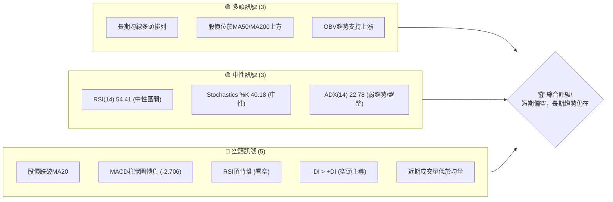

**訊號解讀**：
*   **多頭訊號**：長期均線的良好排列和OBV的累積趨勢表明NBIS的長期基本面和市場共識仍偏向多頭。股價雖然短期回落，但仍遠高於中期和長期均線，顯示長期上升趨勢的韌性。
*   **中性訊號**：RSI和Stochastics處於中性區間，表示市場尚未進入極端超買或超賣狀態，但缺乏明確的方向性。ADX的低值則確認了當前市場缺乏強勁的單邊趨勢，可能處於盤整或修正階段。
*   **空頭訊號**：短期價格行為和動能指標發出明確的看空警示。股價跌破關鍵的MA20，MACD柱狀圖由正轉負，以及RSI的頂背離，都暗示短期內賣壓增加，可能進一步回調。空頭主導的DI指標和低於平均的成交量也支持這一判斷。

**綜合評級**：儘管長期趨勢依然看好，但短期內NBIS面臨顯著的修正壓力。多個短期動能指標的看空訊號，尤其是RSI頂背離，值得投資者高度警惕。目前建議採取謹慎觀望態度，等待短期賣壓釋放和底部形態確認。

### 📊 核心指標速覽表

| 指標類別 | 指標名稱 | 當前數值 | 訊號 | 解讀 |
|----------|----------|----------|------|------|
| **價格** | 當前價格 | $240.30 | 🟡 | 位於52週高點區間76.7%，但近期明顯回調。 |
| **均線** | MA20 | $250.40 | 🔴 | 股價位於MA20下方，短期趨勢轉弱。 |
| **均線** | MA50 | $208.21 | 🟢 | 股價位於MA50上方，中期趨勢仍強。 |
| **均線** | MA200 | $129.85 | 🟢 | 股價位於MA200上方，長期趨勢強勁。 |
| **動能** | RSI(14) | 54.41 | 🟡 | 中性區間，但存在頂背離，暗示上漲動能減弱。 |
| **動能** | MACD | 15.596 | 🔴 | MACD線仍高於訊號線，但MACD柱狀圖轉負，動能減弱。 |
| **波動** | ATR(14) | $26.72 | 🟡 | 佔股價11.12%，波動性中等偏高，需注意風險。 |

### 🏆 技術評分卡

```
╔══════════════════════════════════════════════════════════════╗
║             技術評分卡 — NBIS (2026-06-28)                     ║
╠══════════════════════════════════════════════════════════════╣
║趨勢強度      █████░░░░░░░░░░░░░░░  50/100  🟡 (ADX弱勢，但長期均線多頭)║
║動能指標      ███░░░░░░░░░░░░░░░░░  30/100  🔴 (MACD柱負，RSI頂背離)   ║
║支撐穩定度    ████████░░░░░░░░░░░░  80/100  🟢 (MA50/MA200提供強支撐)   ║
║成交量配合    ████░░░░░░░░░░░░░░░░  40/100  🔴 (近期量縮價跌，不利多頭)║
║形態完整度    ████░░░░░░░░░░░░░░░░  40/100  🔴 (潛在M頭形態，頂背離)   ║
║均線排列      ██████████░░░░░░░░░░  80/100  🟢 (MA20>MA50>MA200，但價格破MA20)║
╠══════════════════════════════════════════════════════════════╣
║綜合評分      ████░░░░░░░░░░░░░░░░  53/100  🟡 謹慎觀望              ║
╚══════════════════════════════════════════════════════════════╝
```
**評分理由**：
*   **趨勢強度 (50/100, 🟡)**：ADX顯示趨勢強度不足25，處於弱勢或盤整。但長期均線（MA50, MA200）仍保持多頭排列，且股價高於它們，暗示雖短期疲軟，長期上升趨勢未變。
*   **動能指標 (30/100, 🔴)**：RSI出現頂背離，MACD柱狀圖轉負，Stochastics也從高位回落，均顯示短期上漲動能顯著減弱，空頭力量開始佔據主導。
*   **支撐穩定度 (80/100, 🟢)**：股價下方有MA50 ($208.21) 和MA200 ($129.85) 等重要長期均線提供強大支撐，這些價位在過去的修正中多次被證明有效。
*   **成交量配合 (40/100, 🔴)**：近期股價回調伴隨著成交量低於20日均量，這雖然表明賣壓可能不至於失控，但也反映出買盤的觀望情緒濃重，缺乏積極的承接。
*   **形態完整度 (40/100, 🔴)**：近期價格從 $286.69 高點快速回落，且伴隨RSI頂背離，潛在形成M頭或雙頂形態的風險增高，對多頭不利。
*   **均線排列 (80/100, 🟢)**：MA20 ($250.40) > MA50 ($208.21) > MA200 ($129.85) 構成經典的多頭排列，這從大局上支持上漲趨勢。然而，股價跌破MA20，意味著短期修正已經開始。

**綜合評分 (53/100, 🟡)**：NBIS的長期上漲趨勢依然健在，得到長期均線的良好支持。然而，短期動能顯著減弱，價格跌破短期均線，且存在頂背離和MACD空頭訊號，暗示短期內有較大的回調風險。投資者應保持謹慎，等待更明確的底部訊號。

---

## 2. 趨勢分析

### 🌐 多時框趨勢分析

NBIS在不同時間框架下呈現出複雜的趨勢結構。長期來看，其處於強勁的上升通道中；中期則經歷了一波顯著的漲勢後進入修正；短期則表現出明顯的疲軟。

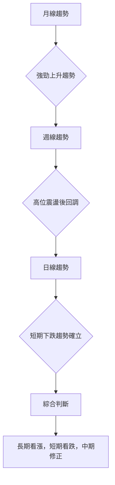

**分析說明**：
*   **月線趨勢 (長期)**：從過去12個月的數據來看，NBIS股價從 $54.43 (2025-07) 一路攀升至 $240.30 (2026-06)，漲幅巨大。儘管中間有過幾次回調，但每次都能創出新高，顯示出強勁的長期上升趨勢。MA200位於 $129.85，股價遠高於此，進一步確認了長期多頭格局。
*   **週線趨勢 (中期)**：近期週線圖顯示，NBIS在2026年5月至6月經歷了一波急劇拉升，從 $177.05 (2026-05-10) 飆升至 $286.69 (2026-06-21) 的週內高點。隨後在2026-06-28收盤於 $240.30，形成一根帶有長上影線的陰線，顯示上方壓力沉重，中期動能開始減弱，進入修正階段。MA50 ($208.21) 仍然是重要的中期支撐。
*   **日線趨勢 (短期)**：當前價格 $240.30 已跌破短期MA20 ($250.40)，MACD柱狀圖轉負，RSI頂背離，這些都明確指出NBIS短期內已從上升趨勢轉為下跌或盤整趨勢，空頭力量佔優。

### 📈 長期趨勢 — 12個月走勢圖（Unicode）

NBIS在過去12個月展現了極其強勁的增長勢頭，從2025年7月的 $54.43 增長到2026年6月的 $240.30，累積漲幅高達341.48%。

```
NBIS 月線走勢圖（過去12個月）
價格軸 ($)
$240.30 ┤                                        ●(2026-06)
$220.00 ┤                                      ●(2026-05)
$200.00 ┤
$180.00 ┤
$160.00 ┤
$140.00 ┤                        ●(2026-04)
$120.00 ┤              ●(2025-10)
$100.00 ┤            ●(2025-09)  ●(2026-03)
$ 80.00 ┤          ●(2025-12)●(2026-01)●(2026-02)
$ 60.00 ┤●(2025-07) ●(2025-08)
$ 40.00 ┤
       └───────────────────────────────────────────
        25Jul 25Aug 25Sep 25Oct 25Nov 25Dec 26Jan 26Feb 26Mar 26Apr 26May 26Jun
```
**關鍵高低點**：
*   12個月最低收盤價：$54.43 (2025-07)
*   12個月最高收盤價：$240.30 (2026-06)
*   中間重要高點：$130.82 (2025-10)
*   中間重要低點：$83.71 (2025-12)

**走勢特徵分析表格**：

| 時間區間 | 起始價 | 結束價 | 漲跌幅 | 走勢特徵 |
|----------|--------|--------|--------|----------|
| 2025-07 ~ 2025-10 | $54.43 | $130.82 | +140.34% | 強勁上升，動能十足，創出階段新高。 |
| 2025-10 ~ 2025-12 | $130.82 | $83.71 | -36.01% | 快速回調，釋放前期漲幅，但未跌破關鍵長期支撐。 |
| 2025-12 ~ 2026-02 | $83.71 | $91.19 | +8.93% | 底部震盪築底，為後續上漲積蓄動能。 |
| 2026-02 ~ 2026-06 | $91.19 | $240.30 | +163.51% | 第二波主升浪，漲勢更加凌厲，屢創新高。 |
| 2026-06 (近期) | $286.69 (週高) | $240.30 (週收) | -16.27% | 週線級別的快速回調，顯示短期壓力巨大。 |

### 📊 中期趨勢（週線分析）

近20週的週線數據顯示，NBIS在2026年3月經歷一波下跌後，於4月和5月展開了強勁的反彈，並在5月下旬至6月中旬達到高潮。然而，最近一周（2026-06-28）的收盤價 $240.30 較前一周的 $286.69 出現大幅回落，形成了明確的看跌K線形態，表明中期上漲動能已顯著衰竭。

**近期壓力與支撐示意圖**：
```
NBIS 週線壓力與支撐示意圖
═══════════════════════════════════════════════════════
$299.86 ║████████████████████████║ 52週高點 / 強阻力 R3
$286.69 ║████████████████████    ║ 近期週高點 / 阻力 R2
$250.40 ║████████████████████████║ MA20 / 關鍵阻力 R1
$240.30 ╠════════════════════════╣ ◄ 現價
$208.21 ║▓▓▓▓▓▓▓▓▓▓▓▓▓▓▓▓        ║ MA50 / 近期支撐 S1
$203.69 ║████████████████████████║ 布林下軌 / 支撐 S2
$177.05 ║████████████████████████║ 5月10日週收盤價 / 支撐 S3
═══════════════════════════════════════════════════════
```
**中期趨勢判斷**：
*   **回調確認**：從週線圖來看，2026-06-28這一周的 $240.30 收盤價，相對於前一周的 $286.69 高點，形成了顯著的下跌，且伴隨RSI頂背離，確立了中期回調的趨勢。
*   **關鍵支撐位**：MA50 ($208.21) 是中期趨勢的重要防線。若跌破此處，可能引發更深度的修正。
*   **成交量配合**：雖然近期成交量有所萎縮，但前幾周的放量上漲顯示市場曾有積極參與。目前量縮回調，需觀察在支撐位能否放量止跌。

### ⚡ 趨勢強度評估（ADX 解讀）

ADX (Average Directional Index) 指標用於衡量趨勢的強度，而非方向。+DI 和 -DI 則指示趨勢的方向。

```mermaid
graph TD
    A["ADX(14) 值: 22.78"] --> B{"ADX < 25?"}
    B -- 是 --> C["趨勢弱勢或盤整"]
    B -- 否 --> D["趨勢強勁"]
    C --> E["比較 +DI 與 -DI"]
    E -- +DI("21.13") < -DI("21.81") --> F["空頭力量略佔主導"]
    E -- +DI > -DI --> G["多頭力量主導"]
    F --> H["綜合判斷: 弱勢盤整中空頭略佔優勢"]
```
**ADX 強度對照表**：

| ADX 數值範圍 | 趨勢強度 | 市場狀況 |
|--------------|----------|----------|
| 0 - 20       | 無趨勢/極弱 | 橫盤整理，缺乏方向 |
| 20 - 25      | 弱趨勢/盤整 | 趨勢初形成或轉折，方向不明 |
| 25 - 50      | 中等趨勢   | 明確趨勢，動能較強 |
| 50 - 75      | 強趨勢     | 強勁趨勢，動能持續 |
| 75 - 100     | 極強趨勢   | 極端趨勢，可能過熱 |

**NBIS ADX 解讀**：
*   **ADX(14) 值為 22.78**：此數值位於 20-25 區間，表明目前NBIS市場處於**弱勢趨勢或盤整**狀態。這與股價近期從高點回落，缺乏明確單邊走勢的觀察一致。市場方向感不強，容易出現震盪。
*   **+DI (21.13) 與 -DI (21.81)**：-DI 略高於 +DI，這表明在當前的弱勢趨勢中，**空頭力量略微佔據主導地位**。雖然差距不大，但結合MACD柱狀圖轉負和RSI頂背離，進一步確認了短期內下行壓力較大。
*   **綜合結論**：NBIS目前市場缺乏強勁的單邊趨勢，處於修正或盤整階段。空頭力量略佔優勢，投資者應避免追高，等待趨勢重新確立。

---

## 3. 圖表形態分析

### 🔍 形態識別系統

根據近期價格走勢和技術指標，NBIS存在潛在的看跌圖表形態。最顯著的是在2026年5月下旬至6月下旬形成的**潛在雙頂 (Double Top)** 或 **M頭形態**，並由RSI頂背離所確認。

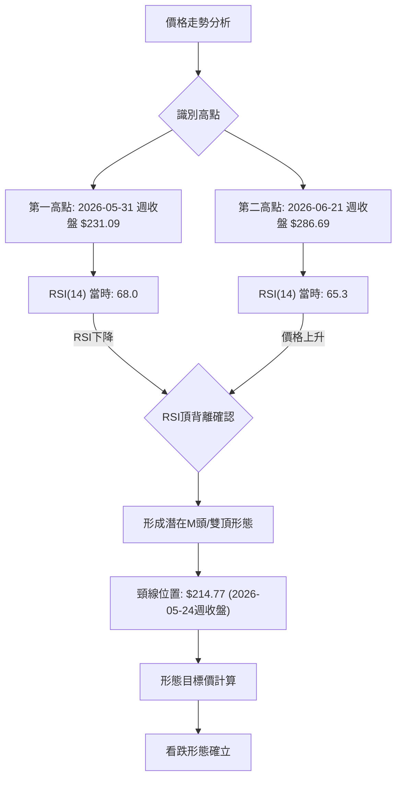
**形態描述**：
*   **第一頂**：發生在2026年5月31日當週，收盤價達到 $231.09。當時RSI(14) 為 68.0。
*   **第二頂**：發生在2026年6月21日當週，收盤價達到 $286.69。此時股價創下新高，但RSI(14) 卻僅為 65.3，低於第一頂時的RSI值，形成了明顯的**RSI頂背離**。
*   **頸線**：潛在的頸線可以參考兩頂之間的回調低點。觀察週線數據，2026年5月24日收盤價 $214.77 可能是頸線的參考點。
*   **當前狀態**：股價目前 $240.30 已經從第二頂大幅回落，並逼近頸線位置。若有效跌破頸線，則雙頂或M頭形態將被確認。

### 🕯️ 重要K線形態分析

最近幾週的K線形態提供了重要的看跌訊號。

| 月份 | 收盤價 | K線形態 | 解讀 | 訊號 |
|------|--------|---------|------|------|
| 2026-05-31 | $231.09 | 長陽線 | 強勁上漲，多頭佔優。 | 🟢 |
| 2026-06-07 | $227.81 | 小陰線/十字星 | 高位震盪，上漲動能減弱，多空膠著。 | 🟡 |
| 2026-06-14 | $232.36 | 小陽線 | 嘗試反彈，但力度有限，MACD柱狀圖轉負。 | 🟡 |
| 2026-06-21 | $286.69 | 長陽線 | 強勢拉升，創出新高，但RSI已顯示頂背離。 | 🟡 |
| 2026-06-28 | $240.30 | 長陰線（週線） | 從高點大幅回落，吞噬前幾週漲幅，賣壓沉重。 | 🔴 |

**K線形態解讀**：
*   **2026-06-28 的長陰線**：這是最關鍵的K線形態。股價從 $286.69 的高點回落至 $240.30，形成一根大陰線，幾乎吞噬了前兩週的漲幅，且收盤價低於MA20 ($250.40)。這是一個強烈的看跌訊號，表明多頭力量在高位遭遇強勁阻力，大量獲利盤湧出。

### 📉 ASCII 走勢形態示意圖

以下示意圖展示了NBIS潛在的M頭/雙頂形態，以及頸線位置。

```
NBIS 潛在M頭/雙頂形態示意圖
═══════════════════════════════════════════════════════
$290.00 ┤                                    ▲ (第二頂 $286.69)
$280.00 ┤                                   / \
$270.00 ┤                                  /   \
$260.00 ┤                                 /     \
$250.00 ┤                                /       \
$240.00 ┤─────────────────────────────────────────────────▲ (現價 $240.30)
$230.00 ┤              ▲ (第一頂 $231.09)  
$220.00 ┤             / \             
$210.00 ┤────────────*───*─────────────────────────────  (頸線 $214.77)
$200.00 ┤
       └───────────────────────────────────────────
        時間軸
```
**形態確認條件**：
*   若股價有效跌破頸線 $214.77，則M頭形態將被確認，並可能引發更大幅度的下跌。
*   「有效跌破」通常指跌破後連續兩日收盤價低於頸線，或伴隨巨量跌破。

### 🎯 形態目標價計算

若M頭/雙頂形態被確認，其目標價的計算方法是將形態的高度從頸線位置向下投射。
*   **形態高度**：取兩頂中較高的 $286.69 (週內高點) 與頸線 $214.77 之間的垂直距離。
    *   形態高度 = $286.69 - $214.77 = $71.92
*   **形態目標價**：從頸線位置向下減去形態高度。
    *   目標價 = 頸線 $214.77 - 形態高度 $71.92 = $142.85

**形態目標價**：$142.85
**解讀**：這個目標價顯示如果M頭形態成立並被確認，NBIS有潛力回調到 $142.85 附近。這是一個相當深度的回調，將跌破MA50和MA200，但仍高於52週低點 $43.89。投資者應密切關注 $214.77 頸線的支撐作用。

---

## 4. 支撐與阻力

識別關鍵的支撐和阻力位對於制定交易策略至關重要。NBIS目前正處於從高位回落的過程中，多個阻力位和支撐位將在未來扮演關鍵角色。

### 🗺️ 關鍵價位分布圖（Unicode）

以下圖表展示了NBIS當前價格附近的關鍵支撐與阻力位。

```
NBIS 價位結構分布圖
═══════════════════════════════════════════════════
$299.86 ║████████████████████████║ 強阻力 R4 (52週高點)
$297.10 ║████████████████████    ║ 阻力 R3 (布林上軌)
$286.69 ║████████████████████████║ 阻力 R2 (近期週高點)
$250.40 ║████████████████████████║ 關鍵阻力 R1 (MA20)
$240.30 ╠════════════════════════╣ ◄ 現價
$214.77 ║▓▓▓▓▓▓▓▓▓▓▓▓▓▓▓▓        ║ 近期支撐 S1 (潛在M頭頸線)
$208.21 ║████████████████████████║ 強支撐 S2 (MA50)
$203.69 ║████████████████████████║ 強支撐 S3 (布林下軌)
$188.01 ║████████████████████████║ 強支撐 S4 (斐波那契50%回調)
═══════════════════════════════════════════════════
```

### 🚧 阻力位分析表

| 阻力級別 | 價位 | 形成原因 | 突破難度 | 重要性 |
|----------|------|----------|----------|--------|
| **R1 (關鍵)** | $250.40 | 20日移動平均線 (MA20)。股價跌破後，MA20轉為短期阻力。 | 中等 | 高。短期反彈的第一個考驗。 |
| **R2 (強)** | $286.69 | 2026年6月21日週收盤高點。大量獲利盤和套牢盤集中區。 | 高 | 極高。突破此處意味著回調結束並可能創出新高。 |
| **R3 (強)** | $297.10 | 布林通道上軌。動態阻力，通常代表價格波動的上沿。 | 中等 | 中。若突破R2，可能測試此處。 |
| **R4 (極強)** | $299.86 | 52週高點。歷史最高價，心理阻力極強。 | 極高 | 極高。突破此處將打開新的上漲空間。 |

**阻力位解讀**：當前股價 $240.30 位於所有短期和中期阻力位下方，顯示短期上升動能不足。MA20 ($250.40) 是近期反彈的首要障礙，若無法有效站穩其上，則下行壓力將持續。

### 🛡️ 支撐位分析表

| 支撐級別 | 價位 | 形成原因 | 守住機率 | 重要性 |
|----------|------|----------|----------|--------|
| **S1 (關鍵)** | $214.77 | 潛在M頭形態的頸線。也是5月24日週收盤價。 | 中等 | 極高。決定M頭形態是否成立的關鍵。 |
| **S2 (強)** | $208.21 | 50日移動平均線 (MA50)。中期趨勢的重要支撐。 | 高 | 極高。若跌破，中期趨勢將轉弱。 |
| **S3 (強)** | $203.69 | 布林通道下軌。動態支撐，通常代表價格波動的下沿。 | 中等 | 中。與MA50接近，形成雙重支撐。 |
| **S4 (較強)** | $188.01 | 斐波那契50%回調位。重要的心理和技術回調水平。 | 中等 | 高。若S1-S3失守，此處將提供強勁支撐。 |
| **S5 (強)** | $164.67 | 斐波那契61.8%回調位。黃金分割點，極為重要的支撐。 | 高 | 極高。此處通常會吸引大量買盤。 |

**支撐位解讀**：NBIS下方有多重強勁支撐。$214.77 的頸線是近期最關鍵的防線，其後是MA50 ($208.21) 和布林下軌 ($203.69)。斐波那契回調位 $188.01 和 $164.67 則提供了更深層次的回調支撐。若股價能夠在這些支撐位附近企穩並出現反彈訊號，將是多頭重新入場的機會。

### 📐 斐波那契回調位分析

我們以2026年3月8日週收盤價 $89.33 作為近期上升波段的起點，以2026年6月21日週收盤價 $286.69 作為高點，計算斐波那契回調位。

*   **起點 (Low)**: $89.33 (2026-03-08 週收盤價)
*   **高點 (High)**: $286.69 (2026-06-21 週收盤價)
*   **總漲幅**: $286.69 - $89.33 = $197.36

**斐波那契回調位計算**：
*   **23.6% 回調**：$286.69 - ($197.36 * 0.236) = $286.69 - $46.58 = **$240.11**
    *   **解讀**：當前股價 $240.30 與此回調位極為接近，表明股價已完成初步回調。若此處能企穩，則回調深度有限。
*   **38.2% 回調**：$286.69 - ($197.36 * 0.382) = $286.69 - $75.39 = **$211.30**
    *   **解讀**：此價位非常接近潛在M頭的頸線 $214.77 和MA50 $208.21。這是一個極為重要的支撐區域，若跌破可能預示更深度的修正。
*   **50% 回調**：$286.69 - ($197.36 * 0.50) = $286.69 - $98.68 = **$188.01**
    *   **解讀**：若38.2%回調位失守，50%回調位將是下一個重要心理和技術支撐。
*   **61.8% 回調**：$286.69 - ($197.36 * 0.618) = $286.69 - $122.02 = **$164.67**
    *   **解讀**：這是黃金分割點，通常被視為強勁的反轉支撐位。若回調至此，往往會吸引大量長線買盤。

**視覺化斐波那契回調**：
```
NBIS 斐波那契回調示意圖 (從 $89.33 到 $286.69)
═══════════════════════════════════════════════════
$286.69 ┤████████████████████████║ 100% (高點)
$240.11 ┤▓▓▓▓▓▓▓▓▓▓▓▓▓▓▓▓        ║ 23.6% 回調 (現價附近)
$211.30 ┤████████████████████████║ 38.2% 回調 (關鍵支撐區)
$188.01 ┤████████████████████████║ 50.0% 回調
$164.67 ┤████████████████████████║ 61.8% 回調 (黃金分割)
$ 89.33 ┤████████████████████████║ 0% (低點)
═══════════════════════════════════════════════════
```
**結論**：斐波那契回調分析顯示NBIS目前位於23.6%回調位附近，這是一個潛在的短期反彈點。然而，下方 $211.30 (38.2%回調位，與MA50及頸線重合) 是更為關鍵的支撐區域。投資者應密切關注股價在這些回調位的表現。

---

## 5. 技術指標深度解讀

本節將對各項關鍵技術指標進行詳細分析，並探討它們之間的相互關係和訊號一致性。

### 🎛️ 指標訊號總覽

以下Mermaid圖表展示了各技術指標當前發出的訊號及其相互關係。

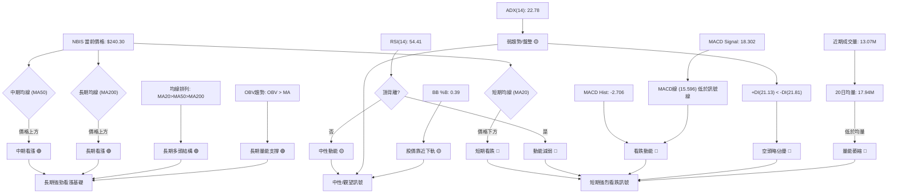
**訊號整合解讀**：
*   **短期趨勢**：MA20、RSI頂背離、MACD柱狀圖轉負、-DI佔優以及近期量能萎縮，均指向明確的短期看跌訊號。多個指標的共振增強了短期回調的可能性。
*   **中期趨勢**：股價仍位於MA50上方，但已跌破MA20。中期趨勢從強勁上漲轉為修正。
*   **長期趨勢**：MA50和MA200保持多頭排列，且股價遠高於MA200，OBV也維持上漲趨勢，表明NBIS的長期上升結構依然健康，目前的下跌更傾向於回調而非趨勢反轉。
*   **矛盾與協同**：短期指標的看跌與長期指標的看漲形成矛盾。這表明NBIS正處於一個從強勢上漲到短期修正的過渡期。短期內應警惕風險，但長期投資者可關注回調後的低吸機會。

### 📈 移動平均線排列分析

NBIS的移動平均線系統顯示出長期多頭格局中的短期疲軟。

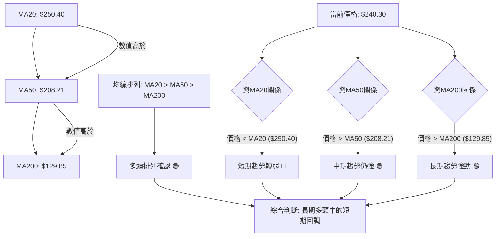
**均線排列狀態**：
*   **多頭排列**：MA20 ($250.40) > MA50 ($208.21) > MA200 ($129.85)。這是一個經典的**多頭排列**，表明股票的長期、中期和短期趨勢都向上，是強勢市場的標誌。
*   **價格與均線關係**：
    *   **價格低於MA20**：當前價格 $240.30 低於MA20 $250.40，這是一個**短期看跌訊號**。表示短期上漲動能已耗盡，股價進入回調或盤整。
    *   **價格高於MA50和MA200**：儘管短期走弱，但股價仍遠高於MA50 $208.21 和MA200 $129.85。這表明**中期和長期上升趨勢依然穩固**。MA50將是股價回調時的重要支撐位。

**綜合結論**：NBIS的均線系統描繪了一幅「長期牛市，短期修正」的圖景。多頭排列提供了堅實的長期基礎，但股價跌破MA20預示著短期內將面臨壓力，可能向MA50尋求支撐。

### 📉 RSI(14) 分析

RSI (Relative Strength Index) 衡量價格變動的速度和變化，用於判斷超買超賣區域及動能變化。

**RSI 數值進度條**：
RSI(14): 54.41  ▓▓▓▓▓▓▓▓▓▓▓▓░░░░░░░░ 54.41%

**超買超賣區間分析**：
*   **RSI 值為 54.41**：位於 30-70 的中性區間。這表示NBIS目前既不處於超買狀態（>70），也不處於超賣狀態（<30）。單從數值看，市場情緒相對平衡。
*   **RSI 趨勢**：從前一周的 65.3 快速回落至 54.41，顯示短期內買盤力量迅速減弱，賣盤力量增強。

**背離判斷 (頂背離)**：
*   **存在頂背離 (Bearish Divergence) 🔴**：
    *   **第一次高點**：2026年5月31日週收盤價 $231.09，對應RSI(14) 值為 68.0。
    *   **第二次高點**：2026年6月21日週收盤價 $286.69，股價創出新高，但對應RSI(14) 值僅為 65.3。
    *   **結論**：價格創出更高的高點，但RSI未能創出更高的高點，反而有所下降。這是一個經典的**頂背離訊號**，預示著上漲動能正在衰竭，股價很可能面臨反轉或深度回調。這個訊號的可靠性較高，應引起高度重視。

**綜合結論**：儘管RSI數值處於中性區間，但其近期快速回落和明確的頂背離訊號是強烈的看跌警示。這表明當前股價的回調並非簡單的技術性調整，而是動能衰竭的結果，短期內下行壓力較大。

### 📊 MACD(12/26/9) 訊號解讀

MACD (Moving Average Convergence Divergence) 指標用於識別趨勢的變化、方向和動能。

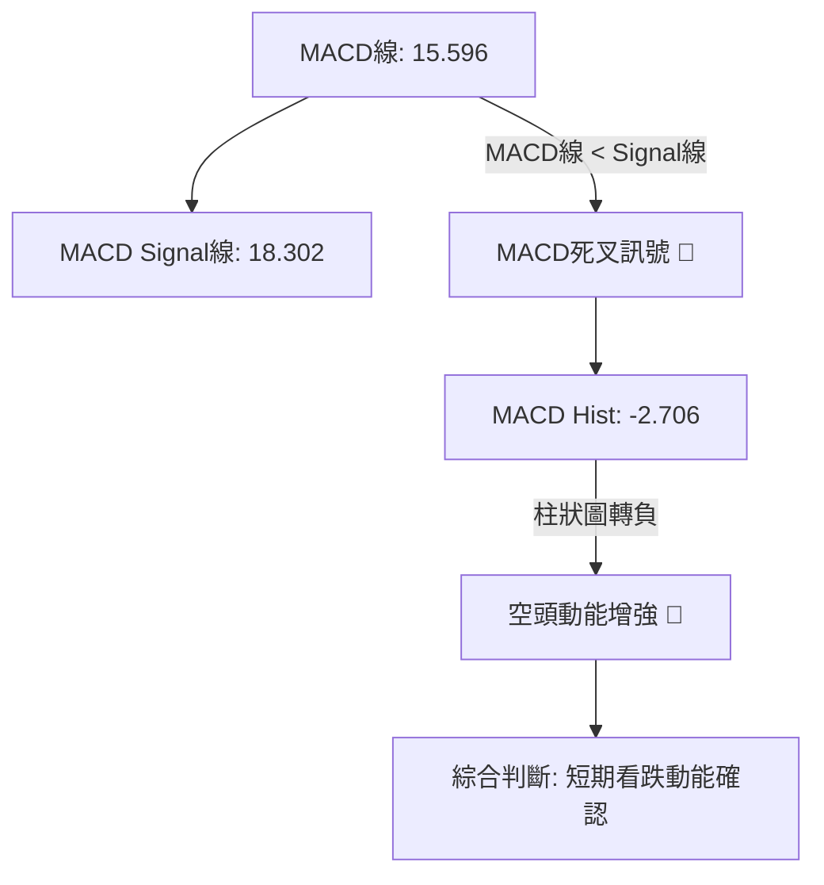
**MACD 訊號解讀**：
*   **MACD 線 (15.596) 與訊號線 (18.302)**：MACD 線已跌破訊號線，形成了**死叉 (Bearish Crossover) 🔴**。這是一個明確的看跌訊號，表明短期內股價的下跌動能正在加速。
*   **MACD 柱狀圖 (-2.706)**：柱狀圖已從正值轉為負值，並持續擴大負值，這進一步確認了**空頭動能的增強 🔴**。柱狀圖的負值越大，代表下跌動能越強。

**綜合結論**：MACD指標發出強烈的看跌訊號，死叉和負值柱狀圖均表明短期內NBIS的下行壓力巨大，動能偏空。這與RSI頂背離的訊號相互確認，增強了短期看跌的判斷。

### 📦 布林通道分析

布林通道 (Bollinger Bands) 用於衡量股價的波動範圍和相對高低點。

**布林通道參數**：
*   BB上軌: $297.10
*   BB中軌(MA20): $250.40
*   BB下軌: $203.69
*   BB %B: 0.39 (0=下軌, 0.5=中軌, 1=上軌)

**ASCII 布林通道示意圖**：
```
NBIS 布林通道示意圖
═══════════════════════════════════════════════════
$297.10 ║████████████████████████║ 上軌 (阻力)
$270.00 ┤
$250.40 ║────────────────────────║ 中軌 (MA20，關鍵阻力)
$240.30 ╠════════════════════════╣ ◄ 現價
$230.00 ┤
$203.69 ║████████████████████████║ 下軌 (支撐)
═══════════════════════════════════════════════════
```
**布林通道解讀**：
*   **價格位置**：當前股價 $240.30 位於布林通道中軌 ($250.40) 和下軌 ($203.69) 之間，且更靠近下軌 (BB %B 為 0.39)。這表明股價正處於短期弱勢區域，並向通道下沿回歸。
*   **通道寬度**：從數據無法直接判斷通道寬度變化，但近期高點的回落顯示波動性可能在增加。ATR ($26.72) 較高也印證了這一點。
*   **中軌作為阻力**：中軌 (MA20) 已轉為短期阻力 $250.40。若股價無法有效站穩中軌上方，則下行壓力將持續。
*   **下軌作為支撐**：布林下軌 $203.69 將提供動態支撐。若股價跌至此處，可能會出現技術性反彈。

**綜合結論**：布林通道顯示NBIS目前處於通道的下半部分，短期壓力較大。中軌是短期反彈的關鍵阻力，下軌則提供潛在支撐。

### 💹 成交量分析（量價配合度）

成交量是判斷價格走勢可靠性的重要輔助指標。

*   **最新成交量**：13,071,500
*   **20日均量**：17,946,065
*   **50日均量**：17,461,690
*   **量比 (最新/20日均量)**：0.73x

**量價配合情況**：
*   **近期成交量萎縮 🔴**：最新成交量 (13.07M) 明顯低於20日均量 (17.94M) 和50日均量 (17.46M)。這表明在股價從高點回落的過程中，市場的交投活躍度下降。
    *   **價跌量縮**：如果股價下跌而成交量萎縮，這可能表明賣壓並非極度恐慌，部分多頭選擇觀望而非割肉，可能為未來止跌反彈提供條件。然而，如果反彈時量能不足，則反彈難以持續。
    *   **量能不足**：當前量能不足，反映出市場對NBIS短期走勢的信心不足，買盤缺乏積極性。
*   **OBV趨勢 (OBV > MA) 🟢**：數據顯示OBV (On-Balance Volume) 趨勢高於其移動平均線，這是一個**多頭訊號**。OBV作為累積性指標，反映了資金的累積流向。即使近期日成交量萎縮，但OBV仍能維持在MA上方，這暗示從較長期的角度看，NBIS的資金流向依然偏向買方，或至少沒有出現大規模的資金撤離。這與短期量價配合的看空訊號形成對比，表明短期修正可能不會改變長期資金流入的格局。

**綜合結論**：短期內，成交量萎縮伴隨著股價下跌，對多頭不利，暗示買盤意願不高。然而，OBV的長期趨勢仍維持向上，這為NBIS的長期前景提供了一定的支撐，也暗示當前的回調可能是健康的調整，而非趨勢反轉。投資者應關注股價在關鍵支撐位能否放量止跌。

---

## 6. 動能與波動率

本節將從動能和波動率兩個維度深入評估NBIS的當前狀態，為風險管理和策略選擇提供依據。

### ⚡ 動能評估四象限

動能評估四象限分析，根據動能強度和波動率將股票分為不同類別，以指導投資決策。由於避免使用 quadrantChart，我們將使用表格形式進行分析。

**NBIS 當前狀態評估**：
*   **動能強度**：
    *   RSI(14): 54.41 (中性，但有頂背離，動能減弱)
    *   MACD Hist: -2.706 (負值，空頭動能增強)
    *   ADX(14): 22.78 (弱趨勢)
    *   **結論**：短期動能顯著減弱，甚至轉為負向。評定為**弱動能**。
*   **波動率**：
    *   ATR(14): $26.72 (佔股價11.12%)
    *   **結論**：ATR佔股價比重超過10%，屬於**高波動**。

| 象限 | 動能 | 波動 | 當前狀態 | 評估 |
|------|------|------|----------|------|
| Q1 | 強 | 低 | - | 最佳機會 (趨勢明確，風險較低) |
| Q2 | 弱 | 低 | - | 謹慎觀望 (缺乏方向，但風險可控) |
| Q3 | 強 | 高 | - | 高風險高收益 (趨勢明確，但波動劇烈) |
| Q4 | 弱 | 高 | ✓ | 避免進場 (方向不明，風險高) |

**NBIS 動能評估**：
NBIS目前處於**弱動能、高波動**的狀態，對應**Q4象限**。

**Mermaid 動能評估流程圖**：
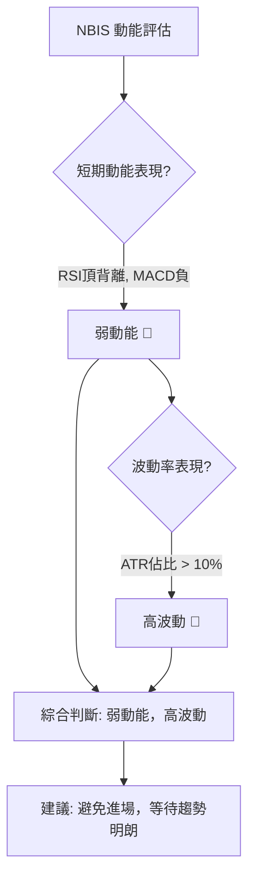
**綜合結論**：NBIS目前處於弱動能和高波動的組合。這是一個極具挑戰性的市場環境，缺乏明確的趨勢方向，但價格波動劇烈，容易造成交易損失。對於大多數投資者而言，在這種情況下應**避免進場**，保持觀望，等待動能重新積聚並趨勢明朗化。

### 📊 ATR 波動率分析

ATR (Average True Range) 衡量市場的波動幅度，它反映了價格在一段時間內的平均波動範圍。

*   **ATR(14) 值**：$26.72
*   **佔當前價格比重**：$26.72 / $240.30 = 11.12%

**ATR 解讀**：
*   **高波動性**：ATR佔股價的11.12%，這是一個相對較高的百分比，表明NBIS的每日價格波動幅度較大。對於交易者而言，這意味著潛在的利潤空間較大，但同時也伴隨著較高的風險。
*   **止損距離建議**：由於波動性較高，在設置止損時需要給予足夠的空間，以避免被市場的正常波動「洗出」。
    *   **保守止損**：可考慮將止損設置在1.5倍ATR之外，即 $240.30 - (1.5 * $26.72) = $240.30 - $40.08 = $200.22。
    *   **激進止損**：可考慮將止損設置在1倍ATR之外，即 $240.30 - $26.72 = $213.58。
    *   **實際應用**：結合關鍵支撐位，例如若在 $214.77 (頸線) 附近進場，止損可設置在 $214.77 - $26.72 = $188.05 附近，或略低於斐波那契38.2%回調位 $211.30。

**綜合結論**：NBIS的高波動性要求投資者在制定交易策略時必須嚴格控制倉位，並設置合理的止損位。過於緊密的止損可能會導致頻繁被止損出場。

### 📐 Beta 與市場相關性

Beta 值衡量單一證券相對於整個市場的波動性。數據中未直接提供NBIS的Beta值。

**假設與行業分析**：
*   **行業特性**：NBIS屬於「Communication Services」行業下的「Internet Content & Information」，並且業務涉及「AI產業基礎設施」及「自動駕駛」等高科技領域。通常而言，此類成長型科技股的Beta值會**高於1**。
*   **高Beta的影響**：
    *   **放大市場波動**：如果NBIS的Beta值高於1 (例如1.5或2)，則意味著當大盤上漲1%時，NBIS可能上漲1.5%或2%；但當大盤下跌1%時，NBIS也可能下跌1.5%或2%。
    *   **風險與報酬**：高Beta股票通常具有更高的潛在報酬，但也伴隨著更高的市場風險。在市場下跌期間，高Beta股票的回調幅度往往更大。

**綜合結論**：儘管缺乏具體Beta數據，但根據NBIS所處的行業和業務性質判斷，其Beta值很可能偏高。這意味著NBIS的股價走勢將在很大程度上受大盤情緒的影響，且波動幅度可能大於市場平均水平。投資者在考慮NBIS時，應同步關注整體市場（如納斯達克指數或標普500指數）的走勢，並準備好應對較大的價格波動。

---

## 7. 多時框架總結

多時框架分析是技術分析的核心，通過綜合不同時間維度的訊號，可以更全面地理解股票的當前狀態和未來潛在走勢。

### 📋 時框架評分表

| 時框架 | 趨勢方向 | 動能 | 均線排列 | 形態 | 綜合評分 (1-10) | 建議 |
|--------|----------|------|----------|------|-----------------|------|
| **短期 (日線)** | 🔴 下跌 | 🔴 弱/負 | 🔴 價格破MA20 | 🔴 潛在M頭 | 3/10 | 警惕/觀望 |
| **中期 (週線)** | 🟡 修正 | 🟡 減弱 | 🟢 價格高於MA50 | 🔴 頂背離 | 5/10 | 謹慎/等待 |
| **長期 (月線)** | 🟢 上升 | 🟢 強 | 🟢 多頭排列 | 🟢 強勁趨勢 | 8/10 | 持有/逢低吸納 |

**評分理由**：
*   **短期 (3/10)**：價格跌破MA20，MACD死叉且柱狀圖轉負，RSI頂背離，ADX顯示弱勢且空頭佔優，成交量萎縮。所有短期指標均指向看跌。
*   **中期 (5/10)**：股價仍位於MA50上方，中期趨勢基礎尚存，但週線級別的快速回調和RSI頂背離顯示中期上漲動能已顯著減弱，進入修正階段。
*   **長期 (8/10)**：MA20>MA50>MA200的多頭排列依然穩固，股價遠高於MA200，OBV趨勢也支持上漲。儘管短期回調，長期上升趨勢未變。

### 🔲 綜合訊號矩陣

本矩陣旨在展示短期、中期和長期訊號之間的一致性或矛盾。

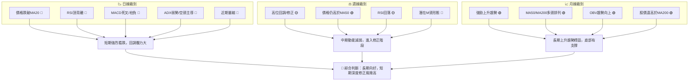
**一致性分析**：
*   **短期與中期的一致性**：短期日線級別的看跌訊號，與中期週線級別的回調和動能減弱相吻合。RSI頂背離和潛在M頭形態是導致短期下跌並影響中期走勢的關鍵因素。
*   **長期與短/中期的矛盾**：長期月線級別的強勁上升趨勢和均線多頭排列，與短中期調整形成矛盾。這表明目前的下跌是長期牛市中的一次較深度的回調，而非趨勢反轉。長期資金流向（OBV）依然健康，也支持這一判斷。

**綜合結論**：NBIS目前面臨短期和中期回調的壓力，但其長期上升趨勢的基礎依然穩固。對於不同時框架的投資者而言：短期交易者應避免入場或考慮做空；中期投資者應保持謹慎，等待修正結束並確認底部；長期投資者則可關注在關鍵支撐位（如MA50或斐波那契回調位）出現的逢低吸納機會。

---

## 8. 交易策略建議

基於NBIS的多時框架技術分析，目前市場處於長期上升趨勢中的短期深度修正階段。短期內空頭訊號佔優，但長期支撐位將提供潛在的反彈機會。

### 🗺️ 策略決策流程圖

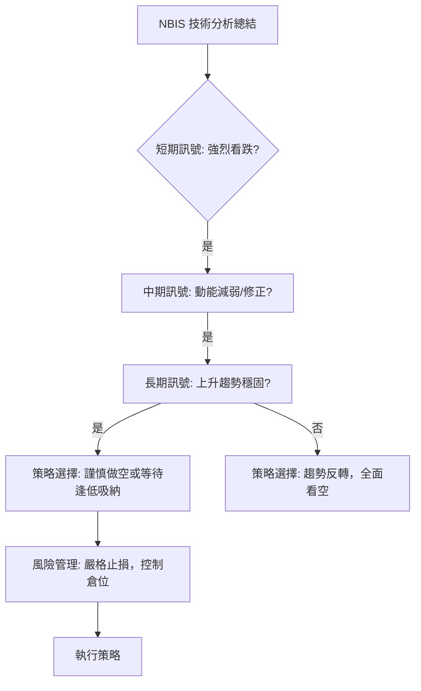

### 🟢 多頭策略詳情 (逢低吸納/反彈)

鑑於長期趨勢仍為上漲，且股價已從高點大幅回落，若能在關鍵支撐位獲得支撐，則存在逢低吸納或捕捉反彈的機會。

| 策略要素 | 策略 A：保守反彈（基於斐波那契38.2%回調） | 策略 B：激進反彈（基於MA50/布林下軌） |
|----------|------------------------------------------|------------------------------------------|
| **進場條件** | 股價在 $211.30 (斐波那契38.2%) 附近出現放量止跌K線（如錘子線、啟明星），且MACD柱狀圖止跌回升。 | 股價在 $208.21 (MA50) 或 $203.69 (布林下軌) 附近企穩，並伴隨RSI從超賣區回升。 |
| **進場價格** | $211.30 ~ $215.00 區間 | $203.69 ~ $208.21 區間 |
| **目標價 T1** | $230.00 (回補部分跌幅，接近MA20) | $220.00 (回補部分跌幅) |
| **目標價 T2** | $250.40 (MA20，短期阻力) | $250.40 (MA20，短期阻力) |
| **止損價格** | $200.00 (略低於斐波那契50%回調 $188.01) | $185.00 (略低於斐波那契50%回調 $188.01) |
| **風險報酬比** | (以進場 $213.00, T1 $230.00, 止損 $200.00 計算) <br> 報酬: $17.00 / 風險: $13.00 = **1.3:1** | (以進場 $206.00, T1 $220.00, 止損 $185.00 計算) <br> 報酬: $14.00 / 風險: $21.00 = **0.67:1** |
| **成功機率** | 60% (基於強支撐位反彈) | 50% (下跌空間較大，風險較高) |
| **建議倉位** | 5-10% (輕倉) | 3-5% (極輕倉) |

**多頭策略分析**：
*   **策略A**：基於斐波那契38.2%回調位，此處與潛在M頭頸線及MA50接近，形成強勁支撐區。若能有效止跌，反彈潛力較大。風險報酬比尚可。
*   **策略B**：若市場情緒更為悲觀，股價可能進一步測試MA50或布林下軌。此策略風險較高，需更嚴格的資金管理。

### 🔴 空頭策略詳情 (順勢追空/反彈做空)

鑑於短期內動能指標看跌，RSI頂背離和MACD死叉，且股價跌破MA20，存在順勢做空或反彈做空的機會。

| 策略要素 | 策略 A：順勢追空（跌破頸線） | 策略 B：反彈做空（測試MA20阻力） |
|----------|------------------------------------------|------------------------------------------|
| **進場條件** | 股價有效跌破 $214.77 (潛在M頭頸線)，並伴隨放量。 | 股價反彈至 $250.40 (MA20) 附近受阻，出現看跌K線或MACD柱狀圖未能轉正。 |
| **進場價格** | $210.00 ~ $214.00 區間 (跌破後確認) | $248.00 ~ $252.00 區間 |
| **目標價 T1** | $188.01 (斐波那契50%回調) | $220.00 (近期低點附近) |
| **目標價 T2** | $164.67 (斐波那契61.8%回調) | $210.00 (斐波那契38.2%回調) |
| **止損價格** | $225.00 (略高於頸線，防止假突破) | $260.00 (略高於MA20和反彈高點) |
| **風險報酬比** | (以進場 $212.00, T1 $188.01, 止損 $225.00 計算) <br> 報酬: $23.99 / 風險: $13.00 = **1.8:1** | (以進場 $250.00, T1 $220.00, 止損 $260.00 計算) <br> 報酬: $30.00 / 風險: $10.00 = **3.0:1** |
| **成功機率** | 65% (形態確認後，下行空間大) | 70% (MA20阻力較強，動能偏空) |
| **建議倉位** | 5-10% (中等倉位) | 5-10% (中等倉位) |

**空頭策略分析**：
*   **策略A**：等待M頭形態的確認，一旦頸線跌破，下行空間將被打開，風險報酬比優良。
*   **策略B**：若股價短期反彈但未能站穩MA20，則MA20將成為強勁阻力，可考慮在此處做空。此策略的風險報酬比非常吸引人。

### ⭐ 整體訊號強度評星

```
做多訊號強度：★★☆☆☆  (2/5星)
做空訊號強度：★★★★☆  (4/5星)
整體可信度：  ★★★☆☆  (3/5星)
```
**評星理由**：目前NBIS的短期和中期訊號強烈偏空，做空機會的可信度和風險報酬比相對較高。做多策略則需等待股價在強支撐位企穩的明確訊號，且目前僅限於反彈，整體風險較大。整體市場環境處於弱勢趨勢，交易難度較高。

---

## 9. 風險提示與監控

NBIS目前處於長期牛市中的短期修正階段，這意味著雖然長期前景看好，但短期內仍需警惕大幅回調的風險。嚴格的風險管理和持續的市場監控至關重要。

### ✅ 關鍵監控指標 Checklist

以下清單列出了投資者應密切關注的關鍵技術指標和價位，以應對NBIS的潛在波動。

```
╔══════════════════════════════════════════════════════════════╗
║               NBIS 關鍵監控指標 Checklist                      ║
╠══════════════════════════════════════════════════════════════╣
║ [ ] 股價是否能站穩MA20 ($250.40) 上方？                      ║
║ [ ] 股價是否有效跌破潛在M頭頸線 ($214.77)？                  ║
║ [ ] 股價是否跌破MA50 ($208.21)？                             ║
║ [ ] RSI(14) 是否跌破50中軸線，或進入超賣區 (<30)？           ║
║ [ ] MACD死叉是否持續，柱狀圖負值是否繼續擴大？               ║
║ [ ] ADX是否開始上升 (>25)，且+DI/-DI方向是否明確？           ║
║ [ ] 成交量在下跌時是否放大，在反彈時是否萎縮？               ║
║ [ ] 布林通道是否持續擴張或收縮？                             ║
║ [ ] 是否有任何重大利好/利空消息影響股價？                    ║
╚══════════════════════════════════════════════════════════════╝
```

### ⚠️ 風險場景分析

基於當前技術面，我們構建三種可能的情境：

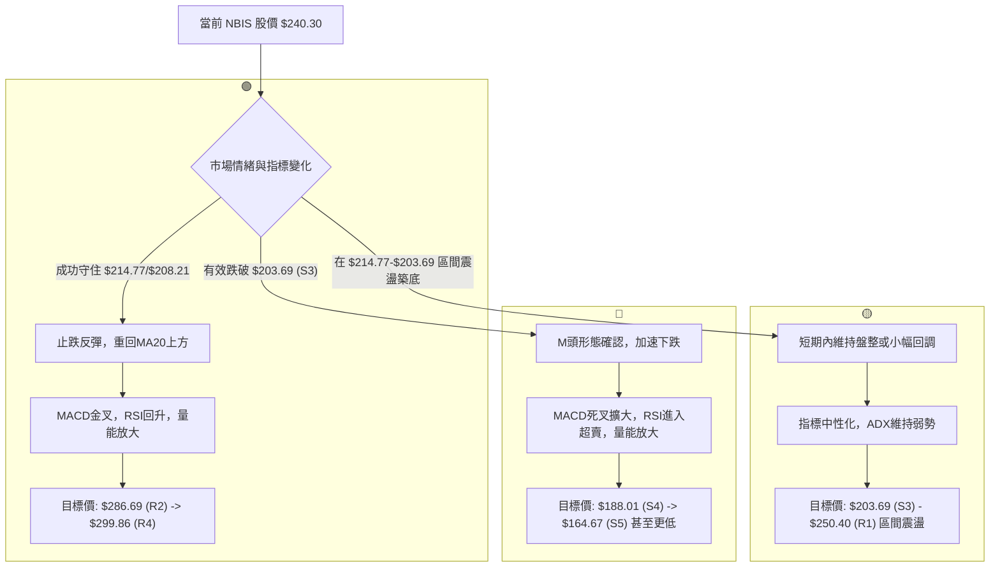
**情境解讀**：
*   **樂觀情境 (發生機率 20%)**：NBIS在當前斐波那契23.6%回調位 $240.11 或更深的38.2%回調位 $211.30 獲得強勁支撐，並在MA50 $208.21 附近形成強勢反轉。MACD金叉，RSI回升，伴隨成交量放大，股價迅速收復失地，重新站穩MA20。
*   **基本情境 (發生機率 50%)**：在 $214.77 (頸線) 至 $203.69 (布林下軌) 的強支撐區間內，股價止跌，但由於動能不足，將進入一段時間的震盪盤整。市場等待新的催化劑或更明確的方向。
*   **悲觀情境 (發生機率 30%)**：股價未能守住所有關鍵支撐位，尤其有效跌破MA50 $208.21 和布林下軌 $203.69。M頭形態被確認，引發恐慌性拋售，股價加速下跌至斐波那契50%或61.8%回調位，甚至更低。

### 🛡️ 風險管理重要提醒

1.  **倉位控制**：在當前弱勢且高波動的市場環境下，務必採取輕倉或極輕倉策略。切忌重倉交易，以防範突發風險。
2.  **嚴格止損**：無論採取何種交易策略，都必須預設明確的止損點並嚴格執行。ATR ($26.72) 顯示NBIS波動較大，止損空間需合理設置。
3.  **分批操作**：避免一次性全倉買入或賣出。考慮分批建倉或減倉，以平攤成本，降低單次操作的風險。
4.  **關注大盤**：NBIS作為成長型科技股，其走勢與整體市場情緒高度相關。密切關注主要股指（如納斯達克指數）的動態，若大盤走弱，NBIS可能承受更大壓力。
5.  **耐心等待**：在趨勢不明或處於修正階段時，耐心是最好的策略。等待明確的底部訊號或趨勢反轉確認後再行動，可顯著提高交易成功率。
6.  **避免追漲殺跌**：在波動劇烈的市場中，追漲殺跌往往導致損失。堅守交易紀律，按計劃行事。

---

## 📋 報告總結

```
╔══════════════════════════════════════════════════════════════╗
║                 NBIS 技術分析報告總結                          ║
╠══════════════════════════════════════════════════════════════╣
║報告日期：2026-06-28                                            ║
║當前價格：$240.30                                               ║
║分析評級：⚖️ 短期偏空，長期趨勢仍在 (短期面臨深度修正風險，但長期上升趨勢基礎穩固)║
║                                                              ║
║關鍵結論：                                                    ║
║├─ 長期趨勢：🟢 強勁上升趨勢，均線多頭排列，OBV支持。        ║
║├─ 中期趨勢：🟡 動能減弱，高位修正，股價仍高於MA50。         ║
║├─ 短期趨勢：🔴 強烈看跌，價格跌破MA20，RSI頂背離，MACD死叉。║
║├─ 關鍵支撐：$214.77 (M頭頸線/斐波那契38.2%)，$208.21 (MA50)。║
║└─ 關鍵阻力：$250.40 (MA20)，$286.69 (近期週高點)。           ║
║                                                              ║
║最優策略組合：                                                ║
║1. 🥇 最佳機會：**等待做空機會**。若股價反彈至MA20 ($250.40) 附近受阻，或有效跌破M頭頸線 ($214.77)，可考慮做空，目標斐波那契 $188.01。║
║2. 🥈 次選機會：**謹慎逢低吸納**。若股價在 $211.30 (斐波那契38.2%) 或 $208.21 (MA50) 附近放量止跌，出現明確反轉訊號，可輕倉嘗試多頭反彈。║
║3. 🥉 保守選擇：**保持觀望**。在當前弱動能、高波動且趨勢不明朗的環境下，不參與交易，等待市場趨勢明朗化或出現更明確的底部訊號。             ║
╚══════════════════════════════════════════════════════════════╝
```

---

> ⚠️ **免責聲明**：本報告為 AI 自動生成之技術分析，所有數據及估算均基於提供的歷史價格資訊。本報告**僅供研究與學術參考**，**不構成任何投資建議**。投資有風險，入市需謹慎。

---

*報告生成時間：2026-06-28 ｜ 數據來源：Yahoo Finance ｜ 分析框架：多時框技術分析*