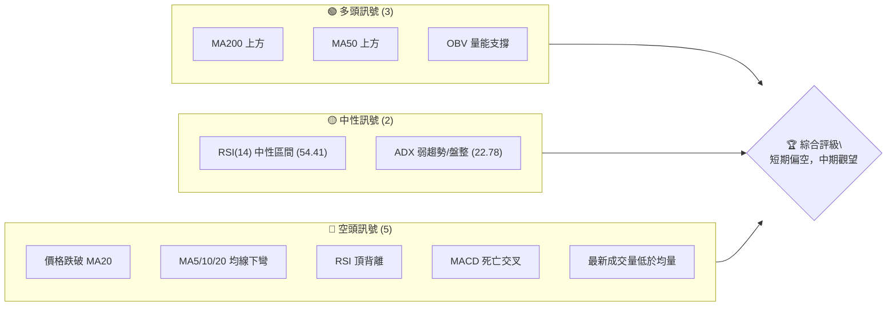
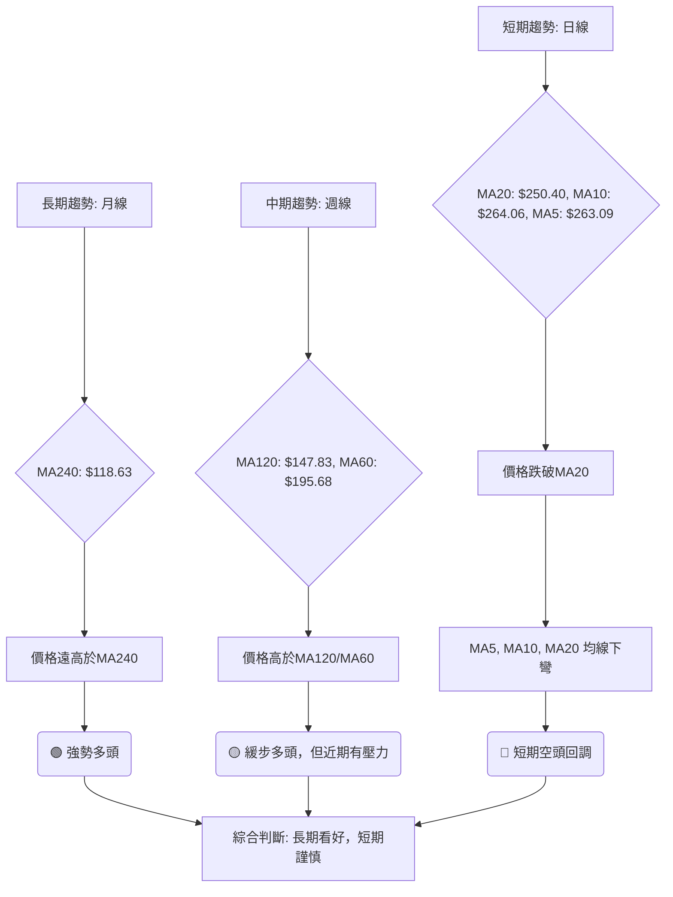
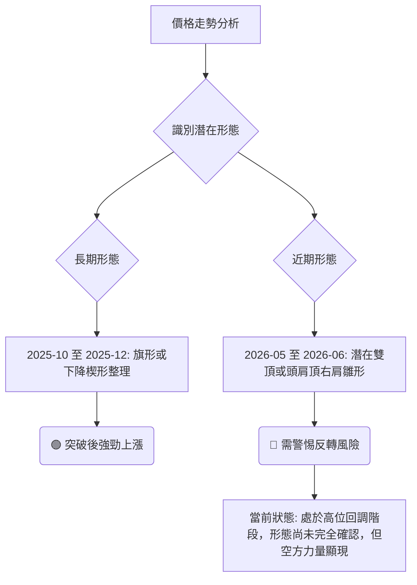
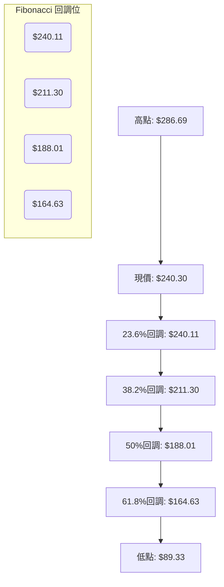
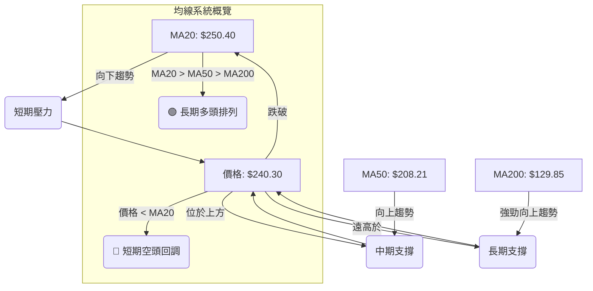
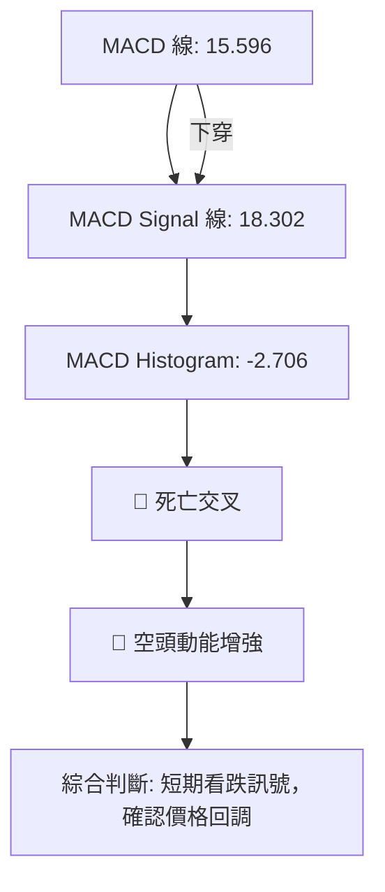

<details>
<summary>📊 靜態圖表 (點擊展開)</summary>

</details>

<html>
<head><meta charset="utf-8" /></head>
<body>
    <div style="height:500px; width:100%;">                        <script>window.PlotlyConfig = {MathJaxConfig: 'local'};</script>
        <script charset="utf-8" src="https://cdn.plot.ly/plotly-3.6.0.min.js" integrity="sha256-QaOVwtVY0T02VaHrr6pnoHLCwayMJp4O5n4YyaE3rJk=" crossorigin="anonymous"></script>                <div id="candlestick-chart" class="plotly-graph-div" style="height:100%; width:100%;"></div>            <script>                window.PLOTLYENV=window.PLOTLYENV || {};                                if (document.getElementById("candlestick-chart")) {                    Plotly.newPlot(                        "candlestick-chart",                        [{"close":{"dtype":"f8","bdata":"AAAAwPVYV0AAAAAAKUxWQAAAAIA9mlZAAAAAoHC9VkAAAAAghVtWQAAAAMAehVdAAAAAIK6HV0AAAAAA19NYQAAAAGBmplpAAAAAQDPzWkAAAABguE5cQAAAAAAp\u002fFpAAAAAwMzsWkAAAACAFI5bQAAAAKBHEVxAAAAAQArnXEAAAAAgrndfQAAAAGC4\u002fl9AAAAAACk8X0AAAADAzGxdQAAAAAAAgF5AAAAA4HqUYEAAAABgjzJgQAAAAGC47mBAAAAAwMwEYEAAAADAHnVfQAAAAGCPwl5AAAAAAClcXEAAAAAAAEBbQAAAAIDrEVpAAAAAIK6nWEAAAACAPYpaQAAAAOCjUF1AAAAAIIVbX0AAAADAHnVeQAAAAGBmRl9AAAAAIIULX0AAAACAPVpgQAAAAIAUHl5AAAAAYI+iW0AAAAAAAEBdQAAAAAApXFtAAAAAgOvRW0AAAADAzHxbQAAAAIAUjllAAAAAQAqXV0AAAADgUShWQAAAAGCP4lRAAAAAYLh+VUAAAABgj6JWQAAAAOB6xFdAAAAAwPUoVUAAAADgo9BUQAAAAKCZ+VZAAAAA4FE4VkAAAAAAKaxXQAAAACCut1dAAAAAoJkJWUAAAADAzBxYQAAAAEDhulhAAAAAQDOzWUAAAABgj4JYQAAAAMAeFVlAAAAAgD0aWEAAAACAwmVXQAAAAIDrkVdAAAAAACnsVUAAAADA9UhUQAAAAMDMPFRAAAAAwMzcUkAAAACAwoVTQAAAAKBwXVZAAAAAYLhOV0AAAACA64FWQAAAAOBRyFZAAAAAgMLlVUAAAABgj4JVQAAAAEDhSlVAAAAAwB7tVEAAAADAzHxWQAAAAMAeNVdAAAAAIFwPWUAAAACgcA1YQAAAAEAzU1hAAAAAIIV7WEAAAADAHtVaQAAAACCFW1pAAAAAYLh+WUAAAADgo\u002fhZQAAAAGC4LltAAAAAYI\u002fSWEAAAAAgrrdYQAAAAGBmNlhAAAAAAACgV0AAAACgcN1WQAAAACCud1hAAAAAIIUbWUAAAACAPbpXQAAAAAApTFVAAAAAgD0KVkAAAADAzHxWQAAAAMD1mFRAAAAAIK53UkAAAABgZoZVQAAAAOBROFdAAAAAYI\u002fyVkAAAABACidWQAAAAGC4blZAAAAA4KOAWEAAAACgR2FYQAAAAEAzc1lAAAAAQArnWkAAAABA4XpYQAAAAEAKJ1lAAAAAwB6lWUAAAAAgrodaQAAAAOBROFpAAAAAACnMVkAAAADgo8BWQAAAAEAzs1VAAAAAgOtxWEAAAACgmelXQAAAAMAeVVZAAAAAACm8V0AAAAAghRtYQAAAACCu\u002f1tAAAAAYI8CW0AAAADAzDxcQAAAAEAzO2BAAAAAwB4VXUAAAAAA16NdQAAAAKBHYV5AAAAAIK5nXUAAAACgmYlcQAAAAIA9ulxAAAAAgMLFXEAAAACAFH5aQAAAAOB6NFlAAAAA4KMQV0AAAADgo\u002fBZQAAAAMDMfFlAAAAA4Ho0W0AAAABgjyJcQAAAAKCZWV1AAAAAAABAX0AAAABgjwphQAAAAEAKH2JAAAAAgOtRY0AAAACAFD5kQAAAAOCj2GRAAAAAQOGqZEAAAADgeqRjQAAAAMAe5WNAAAAAoJmRY0AAAADgeoRjQAAAAGCPomNAAAAAwB5lYkAAAABguB5iQAAAAOBR8GBAAAAAgBSmYUAAAAAgXEdhQAAAACCuT2NAAAAAoHANZkAAAACgcP1lQAAAAEDhYmhAAAAA4KMYZ0AAAACgmSFmQAAAAEAzQ2dAAAAAIIVjZkAAAADgo+hpQAAAAMDMpGtAAAAAgBR+a0AAAAAghftoQAAAACBct2hAAAAAgD36Z0AAAACAwn1rQAAAAOCj2GpAAAAAgOsBakAAAAAA1wtqQAAAAEDhSmxAAAAAQOHibEAAAAAAKYhwQAAAAKBHSXBAAAAAgMJ1b0AAAABguDpwQAAAAIDreWxAAAAAAABAa0AAAAAA14NrQAAAAIAUdmpAAAAAIK7Ha0AAAAAghQttQAAAAMAeQXBAAAAAoJmRcEAAAABgj45xQAAAAEAK63FAAAAAgMK5cUAAAAAAADRxQAAAAGCPOnBAAAAAgBQKcEAAAACgmQluQA=="},"high":{"dtype":"f8","bdata":"AAAA4KMgWUAAAAAgrndXQAAAAAAAAFdAAAAAQOGaV0AAAABAM9NWQAAAAAAAwFdAAAAAIIVrWEAAAABAM+NYQAAAAMAeJVtAAAAAYLh+W0AAAABgZrZcQAAAAMAehVxAAAAAIFx\u002fW0AAAACgRyFcQAAAAKCZaV1AAAAA4FH4XEAAAAAgXK9fQAAAAABUn2BAAAAA4FH4YEAAAADA9QhgQAAAAADXU19AAAAAgD2qYEAAAABAM6NhQAAAAMD1UGFAAAAAgBa5YEAAAAAgrn9gQAAAAEAKX2BAAAAAAKwkXkAAAACAFF5dQAAAACCFC1tAAAAAQDPzWkAAAAAgrqdaQAAAAMDMXF1AAAAAAACgX0AAAADA9SBgQAAAAMDMfF9AAAAAgBQOYEAAAADAzIRgQAAAAIDC3WBAAAAAgOsxXUAAAACgcI1dQAAAAAAAQF5AAAAAQDPTW0AAAAAgrpddQAAAAADXo1xAAAAAoJlpWkAAAABguN5WQAAAAAAAQFZAAAAAoJlpVkAAAAAAKWxXQAAAAIAULlhAAAAAACmsWUAAAAAgXC9WQAAAAAAAQFdAAAAAgOvRVkAAAACAk+hXQAAAAMAeRVhAAAAAYGZmWUAAAADAzLxZQAAAAADXw1hAAAAAgML1WUAAAABgZlZZQAAAAAAAIFlAAAAAIIM4WUAAAACAwkVYQAAAAMDM3FdAAAAAoJnpV0AAAAAgXA9WQAAAAADXY1RAAAAAQDMTVUAAAABgZhZUQAAAAGCPolZAAAAAoJn5V0AAAACAFD5XQAAAAEDh2lZAAAAAIK7nVkAAAABACidWQAAAAKBwvVVAAAAAgBSeVUAAAADgo7BWQAAAAAAp3FdAAAAAIIUrWUAAAABgZpZZQAAAAGCPollAAAAAgBQ+WkAAAAAghStbQAAAAMDM\u002fFpAAAAAwMysWkAAAADgUQhbQAAAAAAAoFtAAAAAgBQeWkAAAACgmZlZQAAAAGC4\u002fllAAAAA4KO4WEAAAADgUThZQAAAAGCP4lhAAAAAYGZ2WUAAAAAAANBYQAAAAGCPAldAAAAAAABQVkAAAADA9dhWQAAAAGCP6lVAAAAA4Ho0VEAAAACAPapVQAAAACCFa1dAAAAAAFTjV0AAAAAAALBXQAAAAOCjsFZAAAAA4HoUWUAAAABgj9JYQAAAAKCZGVpAAAAAYLj+WkAAAADgehRbQAAAAKBuSllAAAAAAADwWUAAAAAAKdxaQAAAAOB6FFtAAAAAQDPTWEAAAACgxNhWQAAAACCud1ZAAAAAYLieWEAAAAAAANBYQAAAAMDMvFdAAAAAwMzMV0AAAACgmZlYQAAAAMAehVxAAAAAYI\u002fCW0AAAADgeiRdQAAAAKCZiWBAAAAAAABgXkAAAABAibFeQAAAAEAzc15AAAAAAFbuXkAAAAAA11NeQAAAAEAzc11AAAAAQDOzXUAAAABAM1NcQAAAAOCjkFpAAAAAIFyPWUAAAADA9fhZQAAAACCu91pAAAAAoHA9W0AAAACAwnVcQAAAAKCZeV1AAAAAAADwX0AAAACgmRFhQAAAAIA9umJAAAAAAADwY0AAAABAM8NkQAAAAIDr2WRAAAAAYLgWZUAAAACA64FkQAAAAAAAOGRAAAAAAABoZEAAAACAwu1kQAAAAIDruWRAAAAAAACoZEAAAACgmZliQAAAAGC4rmFAAAAAYGb2YUAAAAAgXF9iQAAAAAAAgGNAAAAAwMxsZkAAAABguH5mQAAAACCuf2hAAAAA4Hq8aEAAAAAAAIhnQAAAAICXjmhAAAAAIIUzZ0AAAABA4SprQAAAACBcN21AAAAAoEeZbEAAAACAPUJrQAAAAIDrWWlAAAAAAACIaUAAAACA61lsQAAAAKBwvWtAAAAA4FGga0AAAADgejRqQAAAAOB6HG1AAAAAQDMzbUAAAACgxCxxQAAAAKBwbXFAAAAAIFy3cEAAAAAghYdwQAAAAAAAWG9AAAAAwMwMbkAAAADA9bRtQAAAACCu32xAAAAAIK6PbEAAAABA4XJuQAAAAOBRbnBAAAAAIIVVcUAAAABA4Z5yQAAAAMDMrHJAAAAAgMK9ckAAAAAgrnNyQAAAAKBuQnFAAAAA4FE4cUAAAACgmRlvQA=="},"hovertemplate":"\u003cb\u003e%{x|%Y-%m-%d}\u003c\u002fb\u003e\u003cbr\u003e\u958b: $%{open:.2f}\u003cbr\u003e\u9ad8: $%{high:.2f}\u003cbr\u003e\u4f4e: $%{low:.2f}\u003cbr\u003e\u6536: $%{close:.2f}\u003cextra\u003e\u003c\u002fextra\u003e","low":{"dtype":"f8","bdata":"AAAAAADAVkAAAABgjxpWQAAAAIDrsVVAAAAAgMI1VkAAAACgRwFWQAAAAMAeNVZAAAAAgOsBV0AAAAAAAFBXQAAAAKBHoVhAAAAAAAAQWkAAAABgZjZaQAAAAOBReFpAAAAAQDOzWUAAAADAHhVbQAAAAIA96ltAAAAA4KNwW0AAAADgeqRdQAAAAGBm5l5AAAAAIIU7X0AAAACAFO5cQAAAAAAAYF1AAAAAIK73XUAAAADgUQBgQAAAAMDMlGBAAAAAAABwX0AAAADAzIxeQAAAAKBHgV5AAAAA4FG4W0AAAADgo+BaQAAAAKCZWVlAAAAA4FGoV0AAAACgcN1YQAAAAOCjgFtAAAAAQAoHXkAAAACA6zFeQAAAAAAAYF1AAAAA4KNwXUAAAABAM5NfQAAAAAAA8F1AAAAAAABAW0AAAAAghdtbQAAAAIA9GltAAAAA4KNQWUAAAACAFC5bQAAAAMAe9VhAAAAAoHDtVkAAAAAAACBVQAAAAAAAgFRAAAAAgMLlVEAAAACgcG1UQAAAAEAz81ZAAAAAoHANVUAAAACgcI1TQAAAAKCZSVVAAAAA4CQuVUAAAADgo7BWQAAAAAApXFdAAAAA4KNAVkAAAAAA1wNYQAAAAAAAwFZAAAAAgBReWEAAAADAzAxYQAAAAEAz01dAAAAAYGYGWEAAAADAzAxXQAAAAMDMrFVAAAAAwMyMVUAAAACgGARUQAAAAOBROFNAAAAAAADQUkAAAADgo0BTQAAAAIA9ClRAAAAAYGbGVkAAAAAA1xNWQAAAAKCZKVZAAAAAIFyvVUAAAABgjxJVQAAAAADXI1VAAAAAoJm5VEAAAADgo4BVQAAAAMD1uFZAAAAAACm8VkAAAAAA1+NXQAAAACBYAVhAAAAAYGZGWEAAAABAMyNYQAAAAEDh+llAAAAAIIPYWEAAAABgZkZZQAAAAKBwLVlAAAAAgMKVWEAAAABgZkZXQAAAAAAAIFhAAAAAgOthV0AAAABACtdWQAAAAIDrYVdAAAAAACkcWEAAAACAPcpWQAAAACCuB1VAAAAAgBQOVUAAAAAAADBVQAAAAAApnFNAAAAAoEdhUkAAAAAgrkdTQAAAAADX81RAAAAAgD3qVkAAAADA9chVQAAAAAAp7FNAAAAAQAo3VkAAAAAAAGBXQAAAACDZNlhAAAAAIIUbWUAAAACA60FYQAAAAEAz01dAAAAAQN9vWEAAAABAM7NZQAAAAAAAgFlAAAAAoJkZVkAAAABAM7NVQAAAAIDr4VRAAAAAoJmJVkAAAAAgrudWQAAAAEAzM1ZAAAAAAACgVUAAAAAAAMBXQAAAACBcH1pAAAAAoEehWkAAAADA9YhbQAAAAGASG19AAAAAQApHXEAAAAAAAIBcQAAAAKBHsVxAAAAAgJMoXEAAAABAM2NcQAAAAOCjAFxAAAAAwB5VXEAAAACAPVpaQAAAAKBHEVlAAAAAwMppVkAAAABguO5XQAAAAGBmVllAAAAAACkMWEAAAADAzNxaQAAAAIDrkVtAAAAAYGbWXUAAAABAMyNfQAAAAOBR3GBAAAAAoJnJYUAAAADgo9BjQAAAAAAAkGNAAAAAQOECZEAAAAAgXFdjQAAAAKBHQWNAAAAAwMxsY0AAAABAM2tjQAAAAIA9QmNAAAAAgOs5YkAAAACA61FhQAAAAGBmlmBAAAAAQArHYEAAAAAAAOBgQAAAAAAAgGFAAAAAYGb2Y0AAAABguBZlQAAAACCF42VAAAAAAAAgZkAAAAAAABBmQAAAAKCZUWZAAAAAAACIZUAAAAAAAGBoQAAAAAAA+GlAAAAAoJl5akAAAABgj8JnQAAAAAAA4GZAAAAA4HrUZ0AAAACgmRlqQAAAACBcV2pAAAAAwB61aUAAAACA68loQAAAAOBRYGtAAAAAwMxMakAAAAAAAMBtQAAAAAAAPHBAAAAA4FHwbkAAAACAFFZtQAAAAIAUFmtAAAAAYGY2a0AAAACgmQlpQAAAAADXa2pAAAAAAACgaUAAAAAAAPBrQAAAACCup25AAAAAwMysb0AAAADgo4RwQAAAAEAzOXFAAAAAAABgcUAAAAAAAGBvQAAAAGC4Jm9AAAAAgOuRb0AAAADAzExtQA=="},"name":"\u50f9\u683c","open":{"dtype":"f8","bdata":"AAAAwPXoVkAAAABA4SpXQAAAAAApzFZAAAAAQAonV0AAAADAzMxWQAAAAEDh6lZAAAAAwMzEV0AAAADA9YhXQAAAAMDMfFlAAAAAYI8CW0AAAADgo0hbQAAAACCFA1tAAAAAIIV7W0AAAADgUVhbQAAAAOB6XFxAAAAAgMLtW0AAAACgR\u002fFeQAAAAEAKz19AAAAAwMyMYEAAAADAzPRfQAAAAMDMTF5AAAAAYLg+XkAAAABgZt5gQAAAAGC45mBAAAAAAACAYEAAAADAzHxgQAAAAEDhAmBAAAAAANeDXUAAAABgjzJdQAAAAOBR+FpAAAAAQDOrWkAAAADAHhVZQAAAAIA9yltAAAAAgD06XkAAAAAA15tfQAAAAIDrEV9AAAAAwMxMXkAAAADA9ahfQAAAAAAAwGBAAAAAYLgWXEAAAADA9WhcQAAAAEAz411AAAAAAAAgWkAAAAAghctcQAAAAOBRiFxAAAAAwMwMWkAAAADA9bhWQAAAAEAKl1RAAAAA4Hr0VEAAAACA6\u002fFUQAAAAOBRQFdAAAAAIIXbWEAAAABAM2NVQAAAAGC4jlVAAAAAYI9SVkAAAABgZnZXQAAAAEAzI1hAAAAAwMzcVkAAAABAChdZQAAAAKBHwVdAAAAA4HrEWEAAAACAwhVZQAAAAGCPUlhAAAAAgMKFWEAAAABguO5XQAAAAMDMTFZAAAAAANdTV0AAAABgZgZWQAAAAMDM5FNAAAAAgMIFVUAAAABAM8NTQAAAAKCZKVRAAAAAgBQ+V0AAAAAA15NWQAAAAGC4jlZAAAAA4KPgVkAAAADAzBxVQAAAAAAAmFVAAAAAIK5XVUAAAABACr9VQAAAAAAAwFdAAAAAgMLtV0AAAADgo8BYQAAAAGCPMlhAAAAAoEe5WEAAAADgepRYQAAAAMAe1VpAAAAAgOtxWkAAAAAghSNaQAAAACCuf1pAAAAAwB51WUAAAACAwkVZQAAAAOCjgFlAAAAAwMwsWEAAAACgcG1YQAAAAGBmlldAAAAAAAAAWUAAAABACpdYQAAAAKBD41ZAAAAAANdzVUAAAAAghXtWQAAAAAAAwFVAAAAAwPXIU0AAAABgZs5TQAAAAMDMHFVAAAAAYI86V0AAAABgjzpXQAAAAGBmBlVAAAAAQAp3VkAAAAAAAABYQAAAAGC47lhAAAAAIIUbWUAAAAAA06VaQAAAACCFE1hAAAAAIFzXWEAAAAAgXD9aQAAAAAAAgFpAAAAAwMysWEAAAAAAAABWQAAAAKCZiVVAAAAAoJmZVkAAAAAAADBYQAAAAEAzE1dAAAAAQArXVUAAAADA9chXQAAAAIA9SlpAAAAAgMJFW0AAAAAAKZxbQAAAAAAAMF9AAAAAgMIVXkAAAABAM7NcQAAAAOBR0FxAAAAAYGYeXkAAAACgcC1dQAAAAEAzC11AAAAAIK43XUAAAADgUVBcQAAAAMAedVpAAAAAIFyPWUAAAABguH5YQAAAAOB6fFpAAAAAgD0aWEAAAACAPSpbQAAAAAAAqFtAAAAA4FG4X0AAAAAAAEBfQAAAAOBR3GBAAAAAYGbWYUAAAABAMyNkQAAAAGA7B2RAAAAAAADgZEAAAADA9XhkQAAAAAAAoGNAAAAAQAonZEAAAAAghVtkQAAAAMDMfGNAAAAAoHB1ZEAAAADgeoxiQAAAAMDMTGFAAAAAQAqDYUAAAACA6yViQAAAAGCPqmFAAAAA4FEMZEAAAADAzHRlQAAAAEAKc2ZAAAAA4FHAZ0AAAABgZvZmQAAAAMDMfGZAAAAAoHCNZkAAAABACntpQAAAAAAArGpAAAAAIIUza0AAAABACi9rQAAAAAAA4GdAAAAAQAp\u002faUAAAAAgrndqQAAAAOBRaGtAAAAAoJmVa0AAAADAHvlpQAAAAAApzGxAAAAAIIV7bEAAAABA4YJuQAAAAKCZAXFAAAAAoHBDcEAAAAAgrvdtQAAAACCF225AAAAAwMwMbkAAAAAAAMBsQAAAAKDG72pAAAAA4HqsaUAAAADAzFRtQAAAAGC4fm9AAAAAQArvb0AAAABgZppwQAAAAEAzo3JAAAAAIFwfckAAAAAAABxwQAAAAKCZMXFAAAAAwB4JcUAAAABAM5tuQA=="},"x":["2025-09-10T00:00:00-04:00","2025-09-11T00:00:00-04:00","2025-09-12T00:00:00-04:00","2025-09-15T00:00:00-04:00","2025-09-16T00:00:00-04:00","2025-09-17T00:00:00-04:00","2025-09-18T00:00:00-04:00","2025-09-19T00:00:00-04:00","2025-09-22T00:00:00-04:00","2025-09-23T00:00:00-04:00","2025-09-24T00:00:00-04:00","2025-09-25T00:00:00-04:00","2025-09-26T00:00:00-04:00","2025-09-29T00:00:00-04:00","2025-09-30T00:00:00-04:00","2025-10-01T00:00:00-04:00","2025-10-02T00:00:00-04:00","2025-10-03T00:00:00-04:00","2025-10-06T00:00:00-04:00","2025-10-07T00:00:00-04:00","2025-10-08T00:00:00-04:00","2025-10-09T00:00:00-04:00","2025-10-10T00:00:00-04:00","2025-10-13T00:00:00-04:00","2025-10-14T00:00:00-04:00","2025-10-15T00:00:00-04:00","2025-10-16T00:00:00-04:00","2025-10-17T00:00:00-04:00","2025-10-20T00:00:00-04:00","2025-10-21T00:00:00-04:00","2025-10-22T00:00:00-04:00","2025-10-23T00:00:00-04:00","2025-10-24T00:00:00-04:00","2025-10-27T00:00:00-04:00","2025-10-28T00:00:00-04:00","2025-10-29T00:00:00-04:00","2025-10-30T00:00:00-04:00","2025-10-31T00:00:00-04:00","2025-11-03T00:00:00-05:00","2025-11-04T00:00:00-05:00","2025-11-05T00:00:00-05:00","2025-11-06T00:00:00-05:00","2025-11-07T00:00:00-05:00","2025-11-10T00:00:00-05:00","2025-11-11T00:00:00-05:00","2025-11-12T00:00:00-05:00","2025-11-13T00:00:00-05:00","2025-11-14T00:00:00-05:00","2025-11-17T00:00:00-05:00","2025-11-18T00:00:00-05:00","2025-11-19T00:00:00-05:00","2025-11-20T00:00:00-05:00","2025-11-21T00:00:00-05:00","2025-11-24T00:00:00-05:00","2025-11-25T00:00:00-05:00","2025-11-26T00:00:00-05:00","2025-11-28T00:00:00-05:00","2025-12-01T00:00:00-05:00","2025-12-02T00:00:00-05:00","2025-12-03T00:00:00-05:00","2025-12-04T00:00:00-05:00","2025-12-05T00:00:00-05:00","2025-12-08T00:00:00-05:00","2025-12-09T00:00:00-05:00","2025-12-10T00:00:00-05:00","2025-12-11T00:00:00-05:00","2025-12-12T00:00:00-05:00","2025-12-15T00:00:00-05:00","2025-12-16T00:00:00-05:00","2025-12-17T00:00:00-05:00","2025-12-18T00:00:00-05:00","2025-12-19T00:00:00-05:00","2025-12-22T00:00:00-05:00","2025-12-23T00:00:00-05:00","2025-12-24T00:00:00-05:00","2025-12-26T00:00:00-05:00","2025-12-29T00:00:00-05:00","2025-12-30T00:00:00-05:00","2025-12-31T00:00:00-05:00","2026-01-02T00:00:00-05:00","2026-01-05T00:00:00-05:00","2026-01-06T00:00:00-05:00","2026-01-07T00:00:00-05:00","2026-01-08T00:00:00-05:00","2026-01-09T00:00:00-05:00","2026-01-12T00:00:00-05:00","2026-01-13T00:00:00-05:00","2026-01-14T00:00:00-05:00","2026-01-15T00:00:00-05:00","2026-01-16T00:00:00-05:00","2026-01-20T00:00:00-05:00","2026-01-21T00:00:00-05:00","2026-01-22T00:00:00-05:00","2026-01-23T00:00:00-05:00","2026-01-26T00:00:00-05:00","2026-01-27T00:00:00-05:00","2026-01-28T00:00:00-05:00","2026-01-29T00:00:00-05:00","2026-01-30T00:00:00-05:00","2026-02-02T00:00:00-05:00","2026-02-03T00:00:00-05:00","2026-02-04T00:00:00-05:00","2026-02-05T00:00:00-05:00","2026-02-06T00:00:00-05:00","2026-02-09T00:00:00-05:00","2026-02-10T00:00:00-05:00","2026-02-11T00:00:00-05:00","2026-02-12T00:00:00-05:00","2026-02-13T00:00:00-05:00","2026-02-17T00:00:00-05:00","2026-02-18T00:00:00-05:00","2026-02-19T00:00:00-05:00","2026-02-20T00:00:00-05:00","2026-02-23T00:00:00-05:00","2026-02-24T00:00:00-05:00","2026-02-25T00:00:00-05:00","2026-02-26T00:00:00-05:00","2026-02-27T00:00:00-05:00","2026-03-02T00:00:00-05:00","2026-03-03T00:00:00-05:00","2026-03-04T00:00:00-05:00","2026-03-05T00:00:00-05:00","2026-03-06T00:00:00-05:00","2026-03-09T00:00:00-04:00","2026-03-10T00:00:00-04:00","2026-03-11T00:00:00-04:00","2026-03-12T00:00:00-04:00","2026-03-13T00:00:00-04:00","2026-03-16T00:00:00-04:00","2026-03-17T00:00:00-04:00","2026-03-18T00:00:00-04:00","2026-03-19T00:00:00-04:00","2026-03-20T00:00:00-04:00","2026-03-23T00:00:00-04:00","2026-03-24T00:00:00-04:00","2026-03-25T00:00:00-04:00","2026-03-26T00:00:00-04:00","2026-03-27T00:00:00-04:00","2026-03-30T00:00:00-04:00","2026-03-31T00:00:00-04:00","2026-04-01T00:00:00-04:00","2026-04-02T00:00:00-04:00","2026-04-06T00:00:00-04:00","2026-04-07T00:00:00-04:00","2026-04-08T00:00:00-04:00","2026-04-09T00:00:00-04:00","2026-04-10T00:00:00-04:00","2026-04-13T00:00:00-04:00","2026-04-14T00:00:00-04:00","2026-04-15T00:00:00-04:00","2026-04-16T00:00:00-04:00","2026-04-17T00:00:00-04:00","2026-04-20T00:00:00-04:00","2026-04-21T00:00:00-04:00","2026-04-22T00:00:00-04:00","2026-04-23T00:00:00-04:00","2026-04-24T00:00:00-04:00","2026-04-27T00:00:00-04:00","2026-04-28T00:00:00-04:00","2026-04-29T00:00:00-04:00","2026-04-30T00:00:00-04:00","2026-05-01T00:00:00-04:00","2026-05-04T00:00:00-04:00","2026-05-05T00:00:00-04:00","2026-05-06T00:00:00-04:00","2026-05-07T00:00:00-04:00","2026-05-08T00:00:00-04:00","2026-05-11T00:00:00-04:00","2026-05-12T00:00:00-04:00","2026-05-13T00:00:00-04:00","2026-05-14T00:00:00-04:00","2026-05-15T00:00:00-04:00","2026-05-18T00:00:00-04:00","2026-05-19T00:00:00-04:00","2026-05-20T00:00:00-04:00","2026-05-21T00:00:00-04:00","2026-05-22T00:00:00-04:00","2026-05-26T00:00:00-04:00","2026-05-27T00:00:00-04:00","2026-05-28T00:00:00-04:00","2026-05-29T00:00:00-04:00","2026-06-01T00:00:00-04:00","2026-06-02T00:00:00-04:00","2026-06-03T00:00:00-04:00","2026-06-04T00:00:00-04:00","2026-06-05T00:00:00-04:00","2026-06-08T00:00:00-04:00","2026-06-09T00:00:00-04:00","2026-06-10T00:00:00-04:00","2026-06-11T00:00:00-04:00","2026-06-12T00:00:00-04:00","2026-06-15T00:00:00-04:00","2026-06-16T00:00:00-04:00","2026-06-17T00:00:00-04:00","2026-06-18T00:00:00-04:00","2026-06-22T00:00:00-04:00","2026-06-23T00:00:00-04:00","2026-06-24T00:00:00-04:00","2026-06-25T00:00:00-04:00","2026-06-26T00:00:00-04:00"],"type":"candlestick"},{"hovertemplate":"MA30: $%{y:.2f}\u003cextra\u003e\u003c\u002fextra\u003e","line":{"color":"#2196F3","dash":"dash","width":2},"mode":"lines","name":"MA30","x":["2025-09-10T00:00:00-04:00","2025-09-11T00:00:00-04:00","2025-09-12T00:00:00-04:00","2025-09-15T00:00:00-04:00","2025-09-16T00:00:00-04:00","2025-09-17T00:00:00-04:00","2025-09-18T00:00:00-04:00","2025-09-19T00:00:00-04:00","2025-09-22T00:00:00-04:00","2025-09-23T00:00:00-04:00","2025-09-24T00:00:00-04:00","2025-09-25T00:00:00-04:00","2025-09-26T00:00:00-04:00","2025-09-29T00:00:00-04:00","2025-09-30T00:00:00-04:00","2025-10-01T00:00:00-04:00","2025-10-02T00:00:00-04:00","2025-10-03T00:00:00-04:00","2025-10-06T00:00:00-04:00","2025-10-07T00:00:00-04:00","2025-10-08T00:00:00-04:00","2025-10-09T00:00:00-04:00","2025-10-10T00:00:00-04:00","2025-10-13T00:00:00-04:00","2025-10-14T00:00:00-04:00","2025-10-15T00:00:00-04:00","2025-10-16T00:00:00-04:00","2025-10-17T00:00:00-04:00","2025-10-20T00:00:00-04:00","2025-10-21T00:00:00-04:00","2025-10-22T00:00:00-04:00","2025-10-23T00:00:00-04:00","2025-10-24T00:00:00-04:00","2025-10-27T00:00:00-04:00","2025-10-28T00:00:00-04:00","2025-10-29T00:00:00-04:00","2025-10-30T00:00:00-04:00","2025-10-31T00:00:00-04:00","2025-11-03T00:00:00-05:00","2025-11-04T00:00:00-05:00","2025-11-05T00:00:00-05:00","2025-11-06T00:00:00-05:00","2025-11-07T00:00:00-05:00","2025-11-10T00:00:00-05:00","2025-11-11T00:00:00-05:00","2025-11-12T00:00:00-05:00","2025-11-13T00:00:00-05:00","2025-11-14T00:00:00-05:00","2025-11-17T00:00:00-05:00","2025-11-18T00:00:00-05:00","2025-11-19T00:00:00-05:00","2025-11-20T00:00:00-05:00","2025-11-21T00:00:00-05:00","2025-11-24T00:00:00-05:00","2025-11-25T00:00:00-05:00","2025-11-26T00:00:00-05:00","2025-11-28T00:00:00-05:00","2025-12-01T00:00:00-05:00","2025-12-02T00:00:00-05:00","2025-12-03T00:00:00-05:00","2025-12-04T00:00:00-05:00","2025-12-05T00:00:00-05:00","2025-12-08T00:00:00-05:00","2025-12-09T00:00:00-05:00","2025-12-10T00:00:00-05:00","2025-12-11T00:00:00-05:00","2025-12-12T00:00:00-05:00","2025-12-15T00:00:00-05:00","2025-12-16T00:00:00-05:00","2025-12-17T00:00:00-05:00","2025-12-18T00:00:00-05:00","2025-12-19T00:00:00-05:00","2025-12-22T00:00:00-05:00","2025-12-23T00:00:00-05:00","2025-12-24T00:00:00-05:00","2025-12-26T00:00:00-05:00","2025-12-29T00:00:00-05:00","2025-12-30T00:00:00-05:00","2025-12-31T00:00:00-05:00","2026-01-02T00:00:00-05:00","2026-01-05T00:00:00-05:00","2026-01-06T00:00:00-05:00","2026-01-07T00:00:00-05:00","2026-01-08T00:00:00-05:00","2026-01-09T00:00:00-05:00","2026-01-12T00:00:00-05:00","2026-01-13T00:00:00-05:00","2026-01-14T00:00:00-05:00","2026-01-15T00:00:00-05:00","2026-01-16T00:00:00-05:00","2026-01-20T00:00:00-05:00","2026-01-21T00:00:00-05:00","2026-01-22T00:00:00-05:00","2026-01-23T00:00:00-05:00","2026-01-26T00:00:00-05:00","2026-01-27T00:00:00-05:00","2026-01-28T00:00:00-05:00","2026-01-29T00:00:00-05:00","2026-01-30T00:00:00-05:00","2026-02-02T00:00:00-05:00","2026-02-03T00:00:00-05:00","2026-02-04T00:00:00-05:00","2026-02-05T00:00:00-05:00","2026-02-06T00:00:00-05:00","2026-02-09T00:00:00-05:00","2026-02-10T00:00:00-05:00","2026-02-11T00:00:00-05:00","2026-02-12T00:00:00-05:00","2026-02-13T00:00:00-05:00","2026-02-17T00:00:00-05:00","2026-02-18T00:00:00-05:00","2026-02-19T00:00:00-05:00","2026-02-20T00:00:00-05:00","2026-02-23T00:00:00-05:00","2026-02-24T00:00:00-05:00","2026-02-25T00:00:00-05:00","2026-02-26T00:00:00-05:00","2026-02-27T00:00:00-05:00","2026-03-02T00:00:00-05:00","2026-03-03T00:00:00-05:00","2026-03-04T00:00:00-05:00","2026-03-05T00:00:00-05:00","2026-03-06T00:00:00-05:00","2026-03-09T00:00:00-04:00","2026-03-10T00:00:00-04:00","2026-03-11T00:00:00-04:00","2026-03-12T00:00:00-04:00","2026-03-13T00:00:00-04:00","2026-03-16T00:00:00-04:00","2026-03-17T00:00:00-04:00","2026-03-18T00:00:00-04:00","2026-03-19T00:00:00-04:00","2026-03-20T00:00:00-04:00","2026-03-23T00:00:00-04:00","2026-03-24T00:00:00-04:00","2026-03-25T00:00:00-04:00","2026-03-26T00:00:00-04:00","2026-03-27T00:00:00-04:00","2026-03-30T00:00:00-04:00","2026-03-31T00:00:00-04:00","2026-04-01T00:00:00-04:00","2026-04-02T00:00:00-04:00","2026-04-06T00:00:00-04:00","2026-04-07T00:00:00-04:00","2026-04-08T00:00:00-04:00","2026-04-09T00:00:00-04:00","2026-04-10T00:00:00-04:00","2026-04-13T00:00:00-04:00","2026-04-14T00:00:00-04:00","2026-04-15T00:00:00-04:00","2026-04-16T00:00:00-04:00","2026-04-17T00:00:00-04:00","2026-04-20T00:00:00-04:00","2026-04-21T00:00:00-04:00","2026-04-22T00:00:00-04:00","2026-04-23T00:00:00-04:00","2026-04-24T00:00:00-04:00","2026-04-27T00:00:00-04:00","2026-04-28T00:00:00-04:00","2026-04-29T00:00:00-04:00","2026-04-30T00:00:00-04:00","2026-05-01T00:00:00-04:00","2026-05-04T00:00:00-04:00","2026-05-05T00:00:00-04:00","2026-05-06T00:00:00-04:00","2026-05-07T00:00:00-04:00","2026-05-08T00:00:00-04:00","2026-05-11T00:00:00-04:00","2026-05-12T00:00:00-04:00","2026-05-13T00:00:00-04:00","2026-05-14T00:00:00-04:00","2026-05-15T00:00:00-04:00","2026-05-18T00:00:00-04:00","2026-05-19T00:00:00-04:00","2026-05-20T00:00:00-04:00","2026-05-21T00:00:00-04:00","2026-05-22T00:00:00-04:00","2026-05-26T00:00:00-04:00","2026-05-27T00:00:00-04:00","2026-05-28T00:00:00-04:00","2026-05-29T00:00:00-04:00","2026-06-01T00:00:00-04:00","2026-06-02T00:00:00-04:00","2026-06-03T00:00:00-04:00","2026-06-04T00:00:00-04:00","2026-06-05T00:00:00-04:00","2026-06-08T00:00:00-04:00","2026-06-09T00:00:00-04:00","2026-06-10T00:00:00-04:00","2026-06-11T00:00:00-04:00","2026-06-12T00:00:00-04:00","2026-06-15T00:00:00-04:00","2026-06-16T00:00:00-04:00","2026-06-17T00:00:00-04:00","2026-06-18T00:00:00-04:00","2026-06-22T00:00:00-04:00","2026-06-23T00:00:00-04:00","2026-06-24T00:00:00-04:00","2026-06-25T00:00:00-04:00","2026-06-26T00:00:00-04:00"],"y":{"dtype":"f8","bdata":"AAAAAAAA+H8AAAAAAAD4fwAAAAAAAPh\u002fAAAAAAAA+H8AAAAAAAD4fwAAAAAAAPh\u002fAAAAAAAA+H8AAAAAAAD4fwAAAAAAAPh\u002fAAAAAAAA+H8AAAAAAAD4fwAAAAAAAPh\u002fAAAAAAAA+H8AAAAAAAD4fwAAAAAAAPh\u002fAAAAAAAA+H8AAAAAAAD4fwAAAAAAAPh\u002fAAAAAAAA+H8AAAAAAAD4fwAAAAAAAPh\u002fAAAAAAAA+H8AAAAAAAD4fwAAAAAAAPh\u002fAAAAAAAA+H8AAAAAAAD4fwAAAAAAAPh\u002fAAAAAAAA+H8AAAAAAAD4f0RERHT22VtAvLu7ux7lW0De3d2dUglcQLy7u0uaQlxAMzMzgyOMXEC8u7s7QtFcQJqZmUlvE11A3t3dDZBTXUCJiIi4yJZdQHd3d5dftF1A7+7u\u002fje6XUCrqqrqQsJdQN7d3R12xV1AZmZmRhnNXUARERHRhcxdQN7d3S0Vt11AiYiI2L+JXUBmZmbWTTpdQLy7u6t\u002f21xAERERUWKIXEBmZmZWcU5cQHd3d\u002ff9FFxAERERkZeuW0C8u7urxktbQJqZmRnZ7lpAIiIichKbWkCrqqrao1haQHd3d0eLHFpAq6qqKjEAWkARERExa+VZQKuqqur72VlAERERwebiWUBmZmYmlNFZQM3MzBx2rVlAMzMzU41vWUBERESETjNZQAAAALCO8VhAiYiISLajWEAAAABgujlYQO\u002fu7i5r5VdAzczMXI+aV0AAAABQjUdXQBEREZHtHFdAzczM3Gv2VkAzMzPj7MtWQEREREREtFZAERER8dKlVkBVVVV1TKBWQHd3d6fGo1ZAMzMzM+yeVkCrqqr6qZ1WQERERKTimFZAIiIiUiq6VkDv7u6+ytVWQN7d3d1P4VZAAAAAYJ70VkAAAACAlQ9XQKuqqqocJldAd3d3FwQqV0CJiIiY4DlXQKuqqirOTldAzczMPFFHV0B3d3eHFklXQLy7u\u002fupQVdA3t3d3ZY9V0CrqqqaCzlXQJqZmTm0QFdAZmZm9uFbV0CJiIg4QnlXQERERNRNgldAAAAAMGudV0BERERUuLZXQKuqqiqjp1dAZmZmBlZ+V0CJiIi483VXQERERHSveVdAd3d3N6WCV0B3d3fHIIhXQGZmZibbkVdAZmZmll+wV0ARERHRhcBXQCIiIqKo01dAMzMzo2HjV0BmZmaGB+dXQJqZmTkX7ldA7+7uvgL4V0DNzMzsbfVXQM3MzIxB9FdAVVVVxTzdV0De3d1NxcFXQJqZmZn8kldAAAAA8MOPV0AzMzNj5YhXQHd3d3faeFdARERExMp5V0DNzMwMZYRXQO\u002fu7i6HoldAIiIiQsOyV0AAAACAP9lXQBEREdGFOFhAREREZJ50WEBEREREp7FYQGZmZnYhBVlAvLu7y3ZiWUBmZmbWTZ5ZQImIiChNzVlAAAAAEAL\u002fWUAAAADwCiRaQN7d3Y2zO1pAmpmZSW8vWkCamZkpvzxaQERERBQRPVpAZmZm5qU\u002fWkDv7u5e1l5aQDMzM\u002fOnglpAIiIiQnyyWkAiIiLy7vJaQO\u002fu7m51SFtAZmZm5qXPW0AzMzMj92ZcQLy7u2uREV1AAAAAMLKhXUDNzMzs3yReQKuqqmrYuV5AERERsUc9X0AAAABQqbxfQN7d3d1rDmBAREREPCY4YEAiIiIaS1pgQAAAAKhUYGBAAAAAGNl6YECJiIhQ1I9gQDMzM1P\u002fsmBAzczMpLfxYECJiIj4mjNhQERERHQhiWFA3t3dvXTTYUAiIiJSRh9iQKuqqnI9emJAmpmZSeHWYkAzMzNrSkVjQO\u002fu7vZvxGNAIiIiIvc6ZECJiIhQG5hkQCIiIsLK7WRAMzMzExE1ZUAiIiJyPY5lQAAAAICx2GVAERERkcIRZkDNzMwMSUNmQBEREaHTgmZAMzMzw\u002fXIZkDv7u7ufDtnQJqZmVmrp2dA3t3dLSQNaEBmZmbGkntoQHd3d8cEx2hAIiIi0pQSaUAiIiKCwGJpQKuqqroCtGlAiYiIyHYKakDNzMyM3m5qQN7d3e1832pAvLu7exQ+a0ARERHBEa5rQJqZmanGD2xAERERkTR5bEBmZma28+FsQO\u002fu7n5qMG1AAAAAoBqDbUBEREQEVqZtQA=="},"type":"scatter"},{"hovertemplate":"MA60: $%{y:.2f}\u003cextra\u003e\u003c\u002fextra\u003e","line":{"color":"#9C27B0","dash":"dash","width":2},"mode":"lines","name":"MA60","x":["2025-09-10T00:00:00-04:00","2025-09-11T00:00:00-04:00","2025-09-12T00:00:00-04:00","2025-09-15T00:00:00-04:00","2025-09-16T00:00:00-04:00","2025-09-17T00:00:00-04:00","2025-09-18T00:00:00-04:00","2025-09-19T00:00:00-04:00","2025-09-22T00:00:00-04:00","2025-09-23T00:00:00-04:00","2025-09-24T00:00:00-04:00","2025-09-25T00:00:00-04:00","2025-09-26T00:00:00-04:00","2025-09-29T00:00:00-04:00","2025-09-30T00:00:00-04:00","2025-10-01T00:00:00-04:00","2025-10-02T00:00:00-04:00","2025-10-03T00:00:00-04:00","2025-10-06T00:00:00-04:00","2025-10-07T00:00:00-04:00","2025-10-08T00:00:00-04:00","2025-10-09T00:00:00-04:00","2025-10-10T00:00:00-04:00","2025-10-13T00:00:00-04:00","2025-10-14T00:00:00-04:00","2025-10-15T00:00:00-04:00","2025-10-16T00:00:00-04:00","2025-10-17T00:00:00-04:00","2025-10-20T00:00:00-04:00","2025-10-21T00:00:00-04:00","2025-10-22T00:00:00-04:00","2025-10-23T00:00:00-04:00","2025-10-24T00:00:00-04:00","2025-10-27T00:00:00-04:00","2025-10-28T00:00:00-04:00","2025-10-29T00:00:00-04:00","2025-10-30T00:00:00-04:00","2025-10-31T00:00:00-04:00","2025-11-03T00:00:00-05:00","2025-11-04T00:00:00-05:00","2025-11-05T00:00:00-05:00","2025-11-06T00:00:00-05:00","2025-11-07T00:00:00-05:00","2025-11-10T00:00:00-05:00","2025-11-11T00:00:00-05:00","2025-11-12T00:00:00-05:00","2025-11-13T00:00:00-05:00","2025-11-14T00:00:00-05:00","2025-11-17T00:00:00-05:00","2025-11-18T00:00:00-05:00","2025-11-19T00:00:00-05:00","2025-11-20T00:00:00-05:00","2025-11-21T00:00:00-05:00","2025-11-24T00:00:00-05:00","2025-11-25T00:00:00-05:00","2025-11-26T00:00:00-05:00","2025-11-28T00:00:00-05:00","2025-12-01T00:00:00-05:00","2025-12-02T00:00:00-05:00","2025-12-03T00:00:00-05:00","2025-12-04T00:00:00-05:00","2025-12-05T00:00:00-05:00","2025-12-08T00:00:00-05:00","2025-12-09T00:00:00-05:00","2025-12-10T00:00:00-05:00","2025-12-11T00:00:00-05:00","2025-12-12T00:00:00-05:00","2025-12-15T00:00:00-05:00","2025-12-16T00:00:00-05:00","2025-12-17T00:00:00-05:00","2025-12-18T00:00:00-05:00","2025-12-19T00:00:00-05:00","2025-12-22T00:00:00-05:00","2025-12-23T00:00:00-05:00","2025-12-24T00:00:00-05:00","2025-12-26T00:00:00-05:00","2025-12-29T00:00:00-05:00","2025-12-30T00:00:00-05:00","2025-12-31T00:00:00-05:00","2026-01-02T00:00:00-05:00","2026-01-05T00:00:00-05:00","2026-01-06T00:00:00-05:00","2026-01-07T00:00:00-05:00","2026-01-08T00:00:00-05:00","2026-01-09T00:00:00-05:00","2026-01-12T00:00:00-05:00","2026-01-13T00:00:00-05:00","2026-01-14T00:00:00-05:00","2026-01-15T00:00:00-05:00","2026-01-16T00:00:00-05:00","2026-01-20T00:00:00-05:00","2026-01-21T00:00:00-05:00","2026-01-22T00:00:00-05:00","2026-01-23T00:00:00-05:00","2026-01-26T00:00:00-05:00","2026-01-27T00:00:00-05:00","2026-01-28T00:00:00-05:00","2026-01-29T00:00:00-05:00","2026-01-30T00:00:00-05:00","2026-02-02T00:00:00-05:00","2026-02-03T00:00:00-05:00","2026-02-04T00:00:00-05:00","2026-02-05T00:00:00-05:00","2026-02-06T00:00:00-05:00","2026-02-09T00:00:00-05:00","2026-02-10T00:00:00-05:00","2026-02-11T00:00:00-05:00","2026-02-12T00:00:00-05:00","2026-02-13T00:00:00-05:00","2026-02-17T00:00:00-05:00","2026-02-18T00:00:00-05:00","2026-02-19T00:00:00-05:00","2026-02-20T00:00:00-05:00","2026-02-23T00:00:00-05:00","2026-02-24T00:00:00-05:00","2026-02-25T00:00:00-05:00","2026-02-26T00:00:00-05:00","2026-02-27T00:00:00-05:00","2026-03-02T00:00:00-05:00","2026-03-03T00:00:00-05:00","2026-03-04T00:00:00-05:00","2026-03-05T00:00:00-05:00","2026-03-06T00:00:00-05:00","2026-03-09T00:00:00-04:00","2026-03-10T00:00:00-04:00","2026-03-11T00:00:00-04:00","2026-03-12T00:00:00-04:00","2026-03-13T00:00:00-04:00","2026-03-16T00:00:00-04:00","2026-03-17T00:00:00-04:00","2026-03-18T00:00:00-04:00","2026-03-19T00:00:00-04:00","2026-03-20T00:00:00-04:00","2026-03-23T00:00:00-04:00","2026-03-24T00:00:00-04:00","2026-03-25T00:00:00-04:00","2026-03-26T00:00:00-04:00","2026-03-27T00:00:00-04:00","2026-03-30T00:00:00-04:00","2026-03-31T00:00:00-04:00","2026-04-01T00:00:00-04:00","2026-04-02T00:00:00-04:00","2026-04-06T00:00:00-04:00","2026-04-07T00:00:00-04:00","2026-04-08T00:00:00-04:00","2026-04-09T00:00:00-04:00","2026-04-10T00:00:00-04:00","2026-04-13T00:00:00-04:00","2026-04-14T00:00:00-04:00","2026-04-15T00:00:00-04:00","2026-04-16T00:00:00-04:00","2026-04-17T00:00:00-04:00","2026-04-20T00:00:00-04:00","2026-04-21T00:00:00-04:00","2026-04-22T00:00:00-04:00","2026-04-23T00:00:00-04:00","2026-04-24T00:00:00-04:00","2026-04-27T00:00:00-04:00","2026-04-28T00:00:00-04:00","2026-04-29T00:00:00-04:00","2026-04-30T00:00:00-04:00","2026-05-01T00:00:00-04:00","2026-05-04T00:00:00-04:00","2026-05-05T00:00:00-04:00","2026-05-06T00:00:00-04:00","2026-05-07T00:00:00-04:00","2026-05-08T00:00:00-04:00","2026-05-11T00:00:00-04:00","2026-05-12T00:00:00-04:00","2026-05-13T00:00:00-04:00","2026-05-14T00:00:00-04:00","2026-05-15T00:00:00-04:00","2026-05-18T00:00:00-04:00","2026-05-19T00:00:00-04:00","2026-05-20T00:00:00-04:00","2026-05-21T00:00:00-04:00","2026-05-22T00:00:00-04:00","2026-05-26T00:00:00-04:00","2026-05-27T00:00:00-04:00","2026-05-28T00:00:00-04:00","2026-05-29T00:00:00-04:00","2026-06-01T00:00:00-04:00","2026-06-02T00:00:00-04:00","2026-06-03T00:00:00-04:00","2026-06-04T00:00:00-04:00","2026-06-05T00:00:00-04:00","2026-06-08T00:00:00-04:00","2026-06-09T00:00:00-04:00","2026-06-10T00:00:00-04:00","2026-06-11T00:00:00-04:00","2026-06-12T00:00:00-04:00","2026-06-15T00:00:00-04:00","2026-06-16T00:00:00-04:00","2026-06-17T00:00:00-04:00","2026-06-18T00:00:00-04:00","2026-06-22T00:00:00-04:00","2026-06-23T00:00:00-04:00","2026-06-24T00:00:00-04:00","2026-06-25T00:00:00-04:00","2026-06-26T00:00:00-04:00"],"y":{"dtype":"f8","bdata":"AAAAAAAA+H8AAAAAAAD4fwAAAAAAAPh\u002fAAAAAAAA+H8AAAAAAAD4fwAAAAAAAPh\u002fAAAAAAAA+H8AAAAAAAD4fwAAAAAAAPh\u002fAAAAAAAA+H8AAAAAAAD4fwAAAAAAAPh\u002fAAAAAAAA+H8AAAAAAAD4fwAAAAAAAPh\u002fAAAAAAAA+H8AAAAAAAD4fwAAAAAAAPh\u002fAAAAAAAA+H8AAAAAAAD4fwAAAAAAAPh\u002fAAAAAAAA+H8AAAAAAAD4fwAAAAAAAPh\u002fAAAAAAAA+H8AAAAAAAD4fwAAAAAAAPh\u002fAAAAAAAA+H8AAAAAAAD4fwAAAAAAAPh\u002fAAAAAAAA+H8AAAAAAAD4fwAAAAAAAPh\u002fAAAAAAAA+H8AAAAAAAD4fwAAAAAAAPh\u002fAAAAAAAA+H8AAAAAAAD4fwAAAAAAAPh\u002fAAAAAAAA+H8AAAAAAAD4fwAAAAAAAPh\u002fAAAAAAAA+H8AAAAAAAD4fwAAAAAAAPh\u002fAAAAAAAA+H8AAAAAAAD4fwAAAAAAAPh\u002fAAAAAAAA+H8AAAAAAAD4fwAAAAAAAPh\u002fAAAAAAAA+H8AAAAAAAD4fwAAAAAAAPh\u002fAAAAAAAA+H8AAAAAAAD4fwAAAAAAAPh\u002fAAAAAAAA+H8AAAAAAAD4f3d3dy\u002f52VpAZmZmvgLkWkAiIiJic+1aQERERDQI+FpAMzMza9j9WkAAAABgSAJbQM3MzPx+AltAMzMzK6P7WkBERESMQehaQDMzM2PlzFpA3t3drWOqWkBVVVUd6IRaQHd3d9cxcVpAmpmZkcJhWkAiIiJaOUxaQBEREbmsNVpAzczMZMkXWkDe3d0lTe1ZQJqZmSmjv1lAIiIiQqeTWUCJiIioDXZZQN7d3U3wVllAmpmZ8WA0WUBVVVW1yBBZQLy7u3sU6FhAERERadjHWEBVVVWtHLRYQBEREflToVhAERERoRqVWEDNzMzkpY9YQKuqqgpllFhA7+7u\u002fhuVWEDv7u5WVY1YQERERAyQd1hAiYiIGJJWWEB3d3cPLTZYQM3MzHQhGVhAd3d3H8z\u002fV0BERERMftlXQJqZmYHcs1dAZmZmRv2bV0AiIiLSIn9XQN7d3V1IYldAmpmZ8WA6V0De3d1N8CBXQERERNz5FldAREREFDwUV0BmZmaeNhRXQO\u002fu7ubQGldAzczM5KUnV0De3d3lFy9XQDMzM6NFNldAq6qq+sVOV0CrqqoiaV5XQLy7u4uzZ1dAd3d3j1B2V0BmZma2gYJXQLy7uxsvjVdAZmZmbqCDV0AzMzPz0n1XQCIiImLlcFdAZmZmloprV0BVVVX1\u002fWhXQJqZmTlCXVdAERER0bBbV0C8u7tTuF5XQERERLSdcVdAREREnFKHV0BERETcQKlXQKuqqtJp3VdAIiIiygQJWEBERETMLzRYQImIiFBiVlhAERERaWZwWEB3d3fHIIpYQGZmZk5+o1hAvLu7o9PAWEC8u7vbFdZYQCIiIlrH5lhAAAAAcOfvWEBVVVV9ov5YQDMzM9tcCFlAzczMxIMRWUCrqqry7iJZQGZmZpZfOFlAiYiIgD9VWUB3d3dvLnRZQN7d3X1bnllA3t3dVXHWWUCJiIg4XhRaQKuqqgJHUlpAAAAAELuYWkAAAACo4tZaQBEREXFZGVtAq6qqOolbW0BmZmYuh6BbQFVVVXWv31tAVVVV3YcRXEAiIiLa6kZcQImIiJCXfFxAIiIiSii1XECrqqryp+hcQGZmZg6QNV1Aq6qqCvOiXUC8u7vjwQJeQImIiAjIb15A3t3dxfXSXkAiIiLKSzFfQJqZmTkXmF9AZmZm7pjuX0AAAAAA1TFgQImIiEB8cWBAq6qqCmWtYEAAAABAw+NgQN7d3V2PF2FAIiIimidHYUCamZl12oNhQLy7uxt2vmFAIiIiwsr8YUAzMzNPYjtiQHd3dyvOhWJAmpmZbefMYkCrqqpy9iZjQHd3d8dLgmNAMzMzA+TVY0AzMzO38yxkQKuqqlK4amRAMzMzh12lZEAiIiLOhd5kQFVVVbErCmVARERE8KdCZUCrqqpuWX9lQImIiCA+yWVAREREEOYXZkDNzMxc1nBmQO\u002fu7g50zGZAd3d3p1QmZ0BEREQEnYBnQM3MzPhT1WdAzczM9P0saEC8u7s30HVoQA=="},"type":"scatter"},{"hovertemplate":"MA200: $%{y:.2f}\u003cextra\u003e\u003c\u002fextra\u003e","line":{"color":"#FF6F00","dash":"solid","width":2},"mode":"lines","name":"MA200","x":["2025-09-10T00:00:00-04:00","2025-09-11T00:00:00-04:00","2025-09-12T00:00:00-04:00","2025-09-15T00:00:00-04:00","2025-09-16T00:00:00-04:00","2025-09-17T00:00:00-04:00","2025-09-18T00:00:00-04:00","2025-09-19T00:00:00-04:00","2025-09-22T00:00:00-04:00","2025-09-23T00:00:00-04:00","2025-09-24T00:00:00-04:00","2025-09-25T00:00:00-04:00","2025-09-26T00:00:00-04:00","2025-09-29T00:00:00-04:00","2025-09-30T00:00:00-04:00","2025-10-01T00:00:00-04:00","2025-10-02T00:00:00-04:00","2025-10-03T00:00:00-04:00","2025-10-06T00:00:00-04:00","2025-10-07T00:00:00-04:00","2025-10-08T00:00:00-04:00","2025-10-09T00:00:00-04:00","2025-10-10T00:00:00-04:00","2025-10-13T00:00:00-04:00","2025-10-14T00:00:00-04:00","2025-10-15T00:00:00-04:00","2025-10-16T00:00:00-04:00","2025-10-17T00:00:00-04:00","2025-10-20T00:00:00-04:00","2025-10-21T00:00:00-04:00","2025-10-22T00:00:00-04:00","2025-10-23T00:00:00-04:00","2025-10-24T00:00:00-04:00","2025-10-27T00:00:00-04:00","2025-10-28T00:00:00-04:00","2025-10-29T00:00:00-04:00","2025-10-30T00:00:00-04:00","2025-10-31T00:00:00-04:00","2025-11-03T00:00:00-05:00","2025-11-04T00:00:00-05:00","2025-11-05T00:00:00-05:00","2025-11-06T00:00:00-05:00","2025-11-07T00:00:00-05:00","2025-11-10T00:00:00-05:00","2025-11-11T00:00:00-05:00","2025-11-12T00:00:00-05:00","2025-11-13T00:00:00-05:00","2025-11-14T00:00:00-05:00","2025-11-17T00:00:00-05:00","2025-11-18T00:00:00-05:00","2025-11-19T00:00:00-05:00","2025-11-20T00:00:00-05:00","2025-11-21T00:00:00-05:00","2025-11-24T00:00:00-05:00","2025-11-25T00:00:00-05:00","2025-11-26T00:00:00-05:00","2025-11-28T00:00:00-05:00","2025-12-01T00:00:00-05:00","2025-12-02T00:00:00-05:00","2025-12-03T00:00:00-05:00","2025-12-04T00:00:00-05:00","2025-12-05T00:00:00-05:00","2025-12-08T00:00:00-05:00","2025-12-09T00:00:00-05:00","2025-12-10T00:00:00-05:00","2025-12-11T00:00:00-05:00","2025-12-12T00:00:00-05:00","2025-12-15T00:00:00-05:00","2025-12-16T00:00:00-05:00","2025-12-17T00:00:00-05:00","2025-12-18T00:00:00-05:00","2025-12-19T00:00:00-05:00","2025-12-22T00:00:00-05:00","2025-12-23T00:00:00-05:00","2025-12-24T00:00:00-05:00","2025-12-26T00:00:00-05:00","2025-12-29T00:00:00-05:00","2025-12-30T00:00:00-05:00","2025-12-31T00:00:00-05:00","2026-01-02T00:00:00-05:00","2026-01-05T00:00:00-05:00","2026-01-06T00:00:00-05:00","2026-01-07T00:00:00-05:00","2026-01-08T00:00:00-05:00","2026-01-09T00:00:00-05:00","2026-01-12T00:00:00-05:00","2026-01-13T00:00:00-05:00","2026-01-14T00:00:00-05:00","2026-01-15T00:00:00-05:00","2026-01-16T00:00:00-05:00","2026-01-20T00:00:00-05:00","2026-01-21T00:00:00-05:00","2026-01-22T00:00:00-05:00","2026-01-23T00:00:00-05:00","2026-01-26T00:00:00-05:00","2026-01-27T00:00:00-05:00","2026-01-28T00:00:00-05:00","2026-01-29T00:00:00-05:00","2026-01-30T00:00:00-05:00","2026-02-02T00:00:00-05:00","2026-02-03T00:00:00-05:00","2026-02-04T00:00:00-05:00","2026-02-05T00:00:00-05:00","2026-02-06T00:00:00-05:00","2026-02-09T00:00:00-05:00","2026-02-10T00:00:00-05:00","2026-02-11T00:00:00-05:00","2026-02-12T00:00:00-05:00","2026-02-13T00:00:00-05:00","2026-02-17T00:00:00-05:00","2026-02-18T00:00:00-05:00","2026-02-19T00:00:00-05:00","2026-02-20T00:00:00-05:00","2026-02-23T00:00:00-05:00","2026-02-24T00:00:00-05:00","2026-02-25T00:00:00-05:00","2026-02-26T00:00:00-05:00","2026-02-27T00:00:00-05:00","2026-03-02T00:00:00-05:00","2026-03-03T00:00:00-05:00","2026-03-04T00:00:00-05:00","2026-03-05T00:00:00-05:00","2026-03-06T00:00:00-05:00","2026-03-09T00:00:00-04:00","2026-03-10T00:00:00-04:00","2026-03-11T00:00:00-04:00","2026-03-12T00:00:00-04:00","2026-03-13T00:00:00-04:00","2026-03-16T00:00:00-04:00","2026-03-17T00:00:00-04:00","2026-03-18T00:00:00-04:00","2026-03-19T00:00:00-04:00","2026-03-20T00:00:00-04:00","2026-03-23T00:00:00-04:00","2026-03-24T00:00:00-04:00","2026-03-25T00:00:00-04:00","2026-03-26T00:00:00-04:00","2026-03-27T00:00:00-04:00","2026-03-30T00:00:00-04:00","2026-03-31T00:00:00-04:00","2026-04-01T00:00:00-04:00","2026-04-02T00:00:00-04:00","2026-04-06T00:00:00-04:00","2026-04-07T00:00:00-04:00","2026-04-08T00:00:00-04:00","2026-04-09T00:00:00-04:00","2026-04-10T00:00:00-04:00","2026-04-13T00:00:00-04:00","2026-04-14T00:00:00-04:00","2026-04-15T00:00:00-04:00","2026-04-16T00:00:00-04:00","2026-04-17T00:00:00-04:00","2026-04-20T00:00:00-04:00","2026-04-21T00:00:00-04:00","2026-04-22T00:00:00-04:00","2026-04-23T00:00:00-04:00","2026-04-24T00:00:00-04:00","2026-04-27T00:00:00-04:00","2026-04-28T00:00:00-04:00","2026-04-29T00:00:00-04:00","2026-04-30T00:00:00-04:00","2026-05-01T00:00:00-04:00","2026-05-04T00:00:00-04:00","2026-05-05T00:00:00-04:00","2026-05-06T00:00:00-04:00","2026-05-07T00:00:00-04:00","2026-05-08T00:00:00-04:00","2026-05-11T00:00:00-04:00","2026-05-12T00:00:00-04:00","2026-05-13T00:00:00-04:00","2026-05-14T00:00:00-04:00","2026-05-15T00:00:00-04:00","2026-05-18T00:00:00-04:00","2026-05-19T00:00:00-04:00","2026-05-20T00:00:00-04:00","2026-05-21T00:00:00-04:00","2026-05-22T00:00:00-04:00","2026-05-26T00:00:00-04:00","2026-05-27T00:00:00-04:00","2026-05-28T00:00:00-04:00","2026-05-29T00:00:00-04:00","2026-06-01T00:00:00-04:00","2026-06-02T00:00:00-04:00","2026-06-03T00:00:00-04:00","2026-06-04T00:00:00-04:00","2026-06-05T00:00:00-04:00","2026-06-08T00:00:00-04:00","2026-06-09T00:00:00-04:00","2026-06-10T00:00:00-04:00","2026-06-11T00:00:00-04:00","2026-06-12T00:00:00-04:00","2026-06-15T00:00:00-04:00","2026-06-16T00:00:00-04:00","2026-06-17T00:00:00-04:00","2026-06-18T00:00:00-04:00","2026-06-22T00:00:00-04:00","2026-06-23T00:00:00-04:00","2026-06-24T00:00:00-04:00","2026-06-25T00:00:00-04:00","2026-06-26T00:00:00-04:00"],"y":{"dtype":"f8","bdata":"AAAAAAAA+H8AAAAAAAD4fwAAAAAAAPh\u002fAAAAAAAA+H8AAAAAAAD4fwAAAAAAAPh\u002fAAAAAAAA+H8AAAAAAAD4fwAAAAAAAPh\u002fAAAAAAAA+H8AAAAAAAD4fwAAAAAAAPh\u002fAAAAAAAA+H8AAAAAAAD4fwAAAAAAAPh\u002fAAAAAAAA+H8AAAAAAAD4fwAAAAAAAPh\u002fAAAAAAAA+H8AAAAAAAD4fwAAAAAAAPh\u002fAAAAAAAA+H8AAAAAAAD4fwAAAAAAAPh\u002fAAAAAAAA+H8AAAAAAAD4fwAAAAAAAPh\u002fAAAAAAAA+H8AAAAAAAD4fwAAAAAAAPh\u002fAAAAAAAA+H8AAAAAAAD4fwAAAAAAAPh\u002fAAAAAAAA+H8AAAAAAAD4fwAAAAAAAPh\u002fAAAAAAAA+H8AAAAAAAD4fwAAAAAAAPh\u002fAAAAAAAA+H8AAAAAAAD4fwAAAAAAAPh\u002fAAAAAAAA+H8AAAAAAAD4fwAAAAAAAPh\u002fAAAAAAAA+H8AAAAAAAD4fwAAAAAAAPh\u002fAAAAAAAA+H8AAAAAAAD4fwAAAAAAAPh\u002fAAAAAAAA+H8AAAAAAAD4fwAAAAAAAPh\u002fAAAAAAAA+H8AAAAAAAD4fwAAAAAAAPh\u002fAAAAAAAA+H8AAAAAAAD4fwAAAAAAAPh\u002fAAAAAAAA+H8AAAAAAAD4fwAAAAAAAPh\u002fAAAAAAAA+H8AAAAAAAD4fwAAAAAAAPh\u002fAAAAAAAA+H8AAAAAAAD4fwAAAAAAAPh\u002fAAAAAAAA+H8AAAAAAAD4fwAAAAAAAPh\u002fAAAAAAAA+H8AAAAAAAD4fwAAAAAAAPh\u002fAAAAAAAA+H8AAAAAAAD4fwAAAAAAAPh\u002fAAAAAAAA+H8AAAAAAAD4fwAAAAAAAPh\u002fAAAAAAAA+H8AAAAAAAD4fwAAAAAAAPh\u002fAAAAAAAA+H8AAAAAAAD4fwAAAAAAAPh\u002fAAAAAAAA+H8AAAAAAAD4fwAAAAAAAPh\u002fAAAAAAAA+H8AAAAAAAD4fwAAAAAAAPh\u002fAAAAAAAA+H8AAAAAAAD4fwAAAAAAAPh\u002fAAAAAAAA+H8AAAAAAAD4fwAAAAAAAPh\u002fAAAAAAAA+H8AAAAAAAD4fwAAAAAAAPh\u002fAAAAAAAA+H8AAAAAAAD4fwAAAAAAAPh\u002fAAAAAAAA+H8AAAAAAAD4fwAAAAAAAPh\u002fAAAAAAAA+H8AAAAAAAD4fwAAAAAAAPh\u002fAAAAAAAA+H8AAAAAAAD4fwAAAAAAAPh\u002fAAAAAAAA+H8AAAAAAAD4fwAAAAAAAPh\u002fAAAAAAAA+H8AAAAAAAD4fwAAAAAAAPh\u002fAAAAAAAA+H8AAAAAAAD4fwAAAAAAAPh\u002fAAAAAAAA+H8AAAAAAAD4fwAAAAAAAPh\u002fAAAAAAAA+H8AAAAAAAD4fwAAAAAAAPh\u002fAAAAAAAA+H8AAAAAAAD4fwAAAAAAAPh\u002fAAAAAAAA+H8AAAAAAAD4fwAAAAAAAPh\u002fAAAAAAAA+H8AAAAAAAD4fwAAAAAAAPh\u002fAAAAAAAA+H8AAAAAAAD4fwAAAAAAAPh\u002fAAAAAAAA+H8AAAAAAAD4fwAAAAAAAPh\u002fAAAAAAAA+H8AAAAAAAD4fwAAAAAAAPh\u002fAAAAAAAA+H8AAAAAAAD4fwAAAAAAAPh\u002fAAAAAAAA+H8AAAAAAAD4fwAAAAAAAPh\u002fAAAAAAAA+H8AAAAAAAD4fwAAAAAAAPh\u002fAAAAAAAA+H8AAAAAAAD4fwAAAAAAAPh\u002fAAAAAAAA+H8AAAAAAAD4fwAAAAAAAPh\u002fAAAAAAAA+H8AAAAAAAD4fwAAAAAAAPh\u002fAAAAAAAA+H8AAAAAAAD4fwAAAAAAAPh\u002fAAAAAAAA+H8AAAAAAAD4fwAAAAAAAPh\u002fAAAAAAAA+H8AAAAAAAD4fwAAAAAAAPh\u002fAAAAAAAA+H8AAAAAAAD4fwAAAAAAAPh\u002fAAAAAAAA+H8AAAAAAAD4fwAAAAAAAPh\u002fAAAAAAAA+H8AAAAAAAD4fwAAAAAAAPh\u002fAAAAAAAA+H8AAAAAAAD4fwAAAAAAAPh\u002fAAAAAAAA+H8AAAAAAAD4fwAAAAAAAPh\u002fAAAAAAAA+H8AAAAAAAD4fwAAAAAAAPh\u002fAAAAAAAA+H8AAAAAAAD4fwAAAAAAAPh\u002fAAAAAAAA+H8AAAAAAAD4fwAAAAAAAPh\u002fAAAAAAAA+H8pXI8WDDtgQA=="},"type":"scatter"}],                        {"template":{"data":{"barpolar":[{"marker":{"line":{"color":"rgb(17,17,17)","width":0.5},"pattern":{"fillmode":"overlay","size":10,"solidity":0.2}},"type":"barpolar"}],"bar":[{"error_x":{"color":"#f2f5fa"},"error_y":{"color":"#f2f5fa"},"marker":{"line":{"color":"rgb(17,17,17)","width":0.5},"pattern":{"fillmode":"overlay","size":10,"solidity":0.2}},"type":"bar"}],"carpet":[{"aaxis":{"endlinecolor":"#A2B1C6","gridcolor":"#506784","linecolor":"#506784","minorgridcolor":"#506784","startlinecolor":"#A2B1C6"},"baxis":{"endlinecolor":"#A2B1C6","gridcolor":"#506784","linecolor":"#506784","minorgridcolor":"#506784","startlinecolor":"#A2B1C6"},"type":"carpet"}],"choropleth":[{"colorbar":{"outlinewidth":0,"ticks":""},"type":"choropleth"}],"contourcarpet":[{"colorbar":{"outlinewidth":0,"ticks":""},"type":"contourcarpet"}],"contour":[{"colorbar":{"outlinewidth":0,"ticks":""},"colorscale":[[0.0,"#0d0887"],[0.1111111111111111,"#46039f"],[0.2222222222222222,"#7201a8"],[0.3333333333333333,"#9c179e"],[0.4444444444444444,"#bd3786"],[0.5555555555555556,"#d8576b"],[0.6666666666666666,"#ed7953"],[0.7777777777777778,"#fb9f3a"],[0.8888888888888888,"#fdca26"],[1.0,"#f0f921"]],"type":"contour"}],"heatmap":[{"colorbar":{"outlinewidth":0,"ticks":""},"colorscale":[[0.0,"#0d0887"],[0.1111111111111111,"#46039f"],[0.2222222222222222,"#7201a8"],[0.3333333333333333,"#9c179e"],[0.4444444444444444,"#bd3786"],[0.5555555555555556,"#d8576b"],[0.6666666666666666,"#ed7953"],[0.7777777777777778,"#fb9f3a"],[0.8888888888888888,"#fdca26"],[1.0,"#f0f921"]],"type":"heatmap"}],"histogram2dcontour":[{"colorbar":{"outlinewidth":0,"ticks":""},"colorscale":[[0.0,"#0d0887"],[0.1111111111111111,"#46039f"],[0.2222222222222222,"#7201a8"],[0.3333333333333333,"#9c179e"],[0.4444444444444444,"#bd3786"],[0.5555555555555556,"#d8576b"],[0.6666666666666666,"#ed7953"],[0.7777777777777778,"#fb9f3a"],[0.8888888888888888,"#fdca26"],[1.0,"#f0f921"]],"type":"histogram2dcontour"}],"histogram2d":[{"colorbar":{"outlinewidth":0,"ticks":""},"colorscale":[[0.0,"#0d0887"],[0.1111111111111111,"#46039f"],[0.2222222222222222,"#7201a8"],[0.3333333333333333,"#9c179e"],[0.4444444444444444,"#bd3786"],[0.5555555555555556,"#d8576b"],[0.6666666666666666,"#ed7953"],[0.7777777777777778,"#fb9f3a"],[0.8888888888888888,"#fdca26"],[1.0,"#f0f921"]],"type":"histogram2d"}],"histogram":[{"marker":{"pattern":{"fillmode":"overlay","size":10,"solidity":0.2}},"type":"histogram"}],"mesh3d":[{"colorbar":{"outlinewidth":0,"ticks":""},"type":"mesh3d"}],"parcoords":[{"line":{"colorbar":{"outlinewidth":0,"ticks":""}},"type":"parcoords"}],"pie":[{"automargin":true,"type":"pie"}],"scatter3d":[{"line":{"colorbar":{"outlinewidth":0,"ticks":""}},"marker":{"colorbar":{"outlinewidth":0,"ticks":""}},"type":"scatter3d"}],"scattercarpet":[{"marker":{"colorbar":{"outlinewidth":0,"ticks":""}},"type":"scattercarpet"}],"scattergeo":[{"marker":{"colorbar":{"outlinewidth":0,"ticks":""}},"type":"scattergeo"}],"scattergl":[{"marker":{"line":{"color":"#283442"}},"type":"scattergl"}],"scattermapbox":[{"marker":{"colorbar":{"outlinewidth":0,"ticks":""}},"type":"scattermapbox"}],"scattermap":[{"marker":{"colorbar":{"outlinewidth":0,"ticks":""}},"type":"scattermap"}],"scatterpolargl":[{"marker":{"colorbar":{"outlinewidth":0,"ticks":""}},"type":"scatterpolargl"}],"scatterpolar":[{"marker":{"colorbar":{"outlinewidth":0,"ticks":""}},"type":"scatterpolar"}],"scatter":[{"marker":{"line":{"color":"#283442"}},"type":"scatter"}],"scatterternary":[{"marker":{"colorbar":{"outlinewidth":0,"ticks":""}},"type":"scatterternary"}],"surface":[{"colorbar":{"outlinewidth":0,"ticks":""},"colorscale":[[0.0,"#0d0887"],[0.1111111111111111,"#46039f"],[0.2222222222222222,"#7201a8"],[0.3333333333333333,"#9c179e"],[0.4444444444444444,"#bd3786"],[0.5555555555555556,"#d8576b"],[0.6666666666666666,"#ed7953"],[0.7777777777777778,"#fb9f3a"],[0.8888888888888888,"#fdca26"],[1.0,"#f0f921"]],"type":"surface"}],"table":[{"cells":{"fill":{"color":"#506784"},"line":{"color":"rgb(17,17,17)"}},"header":{"fill":{"color":"#2a3f5f"},"line":{"color":"rgb(17,17,17)"}},"type":"table"}]},"layout":{"annotationdefaults":{"arrowcolor":"#f2f5fa","arrowhead":0,"arrowwidth":1},"autotypenumbers":"strict","coloraxis":{"colorbar":{"outlinewidth":0,"ticks":""}},"colorscale":{"diverging":[[0,"#8e0152"],[0.1,"#c51b7d"],[0.2,"#de77ae"],[0.3,"#f1b6da"],[0.4,"#fde0ef"],[0.5,"#f7f7f7"],[0.6,"#e6f5d0"],[0.7,"#b8e186"],[0.8,"#7fbc41"],[0.9,"#4d9221"],[1,"#276419"]],"sequential":[[0.0,"#0d0887"],[0.1111111111111111,"#46039f"],[0.2222222222222222,"#7201a8"],[0.3333333333333333,"#9c179e"],[0.4444444444444444,"#bd3786"],[0.5555555555555556,"#d8576b"],[0.6666666666666666,"#ed7953"],[0.7777777777777778,"#fb9f3a"],[0.8888888888888888,"#fdca26"],[1.0,"#f0f921"]],"sequentialminus":[[0.0,"#0d0887"],[0.1111111111111111,"#46039f"],[0.2222222222222222,"#7201a8"],[0.3333333333333333,"#9c179e"],[0.4444444444444444,"#bd3786"],[0.5555555555555556,"#d8576b"],[0.6666666666666666,"#ed7953"],[0.7777777777777778,"#fb9f3a"],[0.8888888888888888,"#fdca26"],[1.0,"#f0f921"]]},"colorway":["#636efa","#EF553B","#00cc96","#ab63fa","#FFA15A","#19d3f3","#FF6692","#B6E880","#FF97FF","#FECB52"],"font":{"color":"#f2f5fa"},"geo":{"bgcolor":"rgb(17,17,17)","lakecolor":"rgb(17,17,17)","landcolor":"rgb(17,17,17)","showlakes":true,"showland":true,"subunitcolor":"#506784"},"hoverlabel":{"align":"left"},"hovermode":"closest","mapbox":{"style":"dark"},"paper_bgcolor":"rgb(17,17,17)","plot_bgcolor":"rgb(17,17,17)","polar":{"angularaxis":{"gridcolor":"#506784","linecolor":"#506784","ticks":""},"bgcolor":"rgb(17,17,17)","radialaxis":{"gridcolor":"#506784","linecolor":"#506784","ticks":""}},"scene":{"xaxis":{"backgroundcolor":"rgb(17,17,17)","gridcolor":"#506784","gridwidth":2,"linecolor":"#506784","showbackground":true,"ticks":"","zerolinecolor":"#C8D4E3"},"yaxis":{"backgroundcolor":"rgb(17,17,17)","gridcolor":"#506784","gridwidth":2,"linecolor":"#506784","showbackground":true,"ticks":"","zerolinecolor":"#C8D4E3"},"zaxis":{"backgroundcolor":"rgb(17,17,17)","gridcolor":"#506784","gridwidth":2,"linecolor":"#506784","showbackground":true,"ticks":"","zerolinecolor":"#C8D4E3"}},"shapedefaults":{"line":{"color":"#f2f5fa"}},"sliderdefaults":{"bgcolor":"#C8D4E3","bordercolor":"rgb(17,17,17)","borderwidth":1,"tickwidth":0},"ternary":{"aaxis":{"gridcolor":"#506784","linecolor":"#506784","ticks":""},"baxis":{"gridcolor":"#506784","linecolor":"#506784","ticks":""},"bgcolor":"rgb(17,17,17)","caxis":{"gridcolor":"#506784","linecolor":"#506784","ticks":""}},"title":{"x":0.05},"updatemenudefaults":{"bgcolor":"#506784","borderwidth":0},"xaxis":{"automargin":true,"gridcolor":"#283442","linecolor":"#506784","ticks":"","title":{"standoff":15},"zerolinecolor":"#283442","zerolinewidth":2},"yaxis":{"automargin":true,"gridcolor":"#283442","linecolor":"#506784","ticks":"","title":{"standoff":15},"zerolinecolor":"#283442","zerolinewidth":2}}},"xaxis":{"rangeslider":{"visible":false},"title":{"text":"\u65e5\u671f"}},"font":{"size":11},"title":{"text":"NBIS  |  MA(30\u002f60\u002f200)  |  \u6700\u8fd1200\u4ea4\u6613\u65e5"},"yaxis":{"title":{"text":"\u80a1\u50f9 (USD)"}},"hovermode":"x unified","height":500},                        {"responsive": true}                    )                };            </script>        </div>
</body>
</html>

# NBIS 技術分析報告

> **報告日期**：2026-06-29 ｜ **語言**：繁體中文 ｜ **數據來源**：Yahoo Finance ｜ **當前價格**：$240.30

---

## 目錄

| 章節 | 內容 |
|------|------|
| [1. 技術面概覽](#1-技術面概覽) | 訊號儀表板、核心指標、評分卡 |
| [2. 趨勢分析](#2-趨勢分析) | 多時框趨勢、長中短期走勢 |
| [3. 圖表形態分析](#3-圖表形態分析) | 形態識別、K線組合、目標價 |
| [4. 支撐與阻力](#4-支撐與阻力) | 關鍵價位、斐波那契回調 |
| [5. 技術指標深度解讀](#5-技術指標深度解讀) | MA/RSI/MACD/布林/成交量 |
| [6. 動能與波動率](#6-動能與波動率) | 動能評估、ATR、Beta |
| [7. 多時框架總結](#7-多時框架總結) | 時框架評分矩陣 |
| [8. 交易策略建議](#8-交易策略建議) | 多空策略、風險報酬比 |
| [9. 風險提示與監控](#9-風險提示與監控) | 監控指標、風險場景 |

---

## 1. 技術面概覽

本章節提供 NBIS 技術面狀況的快速總覽，透過整合性的儀表板和評分卡，讓投資者能迅速掌握其多空訊號及整體健康度。

### 🎯 技術訊號儀表板

當前 NBIS 的技術訊號呈現短期偏空，中期謹慎，但長期趨勢仍維持多頭的複雜局面。最值得警惕的是 RSI 的頂背離和 MACD 的死亡交叉，這暗示了近期上漲動能的衰竭和潛在的回調風險。



### 📊 核心指標速覽表

下表列出 NBIS 的關鍵技術指標及其當前狀態和初步解讀。

| 指標類別 | 指標名稱 | 當前數值 | 訊號 | 解讀 |
|----------|----------|----------|------|------|
| **價格** | 當前價格 | $240.30 | 🔴 | 較前一週大幅回落，跌破短期均線 |
| **均線** | MA20 | $250.40 | 🔴 | 價格位於 MA20 下方，且 MA20 趨勢向下 |
| **均線** | MA50 | $208.21 | 🟢 | 價格位於 MA50 上方，中期趨勢仍偏多 |
| **均線** | MA200 | $129.85 | 🟢 | 價格遠高於 MA200，長期多頭趨勢不變 |
| **動能** | RSI(14) | 54.41 | 🟡 | 處於中性區間，但存在頂背離風險 |
| **動能** | MACD | 15.596 | 🔴 | MACD 線下穿訊號線，形成死亡交叉 |
| **波動** | ATR(14) | $26.72 | 🟡 | 波動性高，佔股價 11.12% |
| **趨勢** | ADX(14) | 22.78 | 🟡 | 趨勢強度不足，進入盤整或弱勢行情 |
| **成交量** | 量比(vs 20D) | 0.73x | 🔴 | 成交量萎縮，未能支撐價格 |

### 🏆 技術評分卡

綜合各項技術指標，NBIS 的整體技術評分偏向中性偏空，尤其在動能和短期趨勢上表現不佳。

```
╔══════════════════════════════════════════════════════════════╗
║              技術評分卡 — NBIS (2026-06-29)                  ║
╠══════════════════════════════════════════════════════════════╣
║ 趨勢強度      ████████░░░░░░░░░░░░  40/100  🟡 (ADX弱趨勢)    ║
║ 動能指標      ████░░░░░░░░░░░░░░░░  20/100  🔴 (RSI背離, MACD死叉) ║
║ 支撐穩定度    ████████████░░░░░░░░  60/100  🟡 (接近多重支撐) ║
║ 成交量配合    ████░░░░░░░░░░░░░░░░  20/100  🔴 (量縮價跌)    ║
║ 形態完整度    ██████░░░░░░░░░░░░░░  30/100  🟡 (無明確形態)  ║
║ 均線排列      ████████░░░░░░░░░░░░  40/100  🟡 (短期空頭,長期多頭) ║
╠══════════════════════════════════════════════════════════════╣
║ 綜合評分      ██████░░░░░░░░░░░░░░  38/100  評級: ⚖️ 中性偏空  ║
╚══════════════════════════════════════════════════════════════╝
```

---

## 2. 趨勢分析

對 NBIS 進行多時框趨勢分析，可以揭示其在不同時間尺度下的市場行為，有助於制定更全面的交易策略。

### 🌐 多時框趨勢分析

NBIS 在長期、中期、短期呈現不同的趨勢狀態，需要綜合考量。長期來看，其成長趨勢非常強勁，但近期出現了顯著的回調。



### 📈 長期趨勢 — 12個月走勢圖（Unicode）

NBIS 在過去一年中展現出驚人的成長動能，從 2025 年 6 月的 $55.33 一路上漲，在 2026 年 5 月達到 $231.09，並在 6 月初觸及 $286.69 的高點，隨後出現較大幅度的回調。

```
NBIS 月線走勢圖（過去12個月）
價格軸 ($)
$300 ┤                                           ●(286.69)
$250 ┤                                        ●
$200 ┤                                    ●
$150 ┤                           ●     ●
$100 ┤             ●        ●
$50  ┤ ●━━━━━━━━━━━━━━━━━━━━━━━━━━━━━━━━━━━━━━━━━━━━●←現在(240.30)
     └─────────────────────────────────────────────────────
      2025-06  07  08  09  10  11  12  2026-01  02  03  04  05  06
```

**走勢特徵分析表格**

| 期間 | 起始價 | 結束價 | 漲跌幅 | 走勢特徵 | 評估 |
|------|--------|--------|--------|----------|------|
| 2025-06 至 2025-10 | $55.33 | $130.82 | +136.43% | 強勁上漲，動能充沛，創年內新高 | 🟢 多頭 |
| 2025-10 至 2025-12 | $130.82 | $83.71 | -36.01% | 快速回調，跌破部分短期均線 | 🔴 空頭 |
| 2025-12 至 2026-05 | $83.71 | $231.09 | +176.06% | 恢復上漲趨勢，突破前高，動能再次爆發 | 🟢 強勢多頭 |
| 2026-05 至 2026-06 | $231.09 | $240.30 | +4.00% | 創歷史新高後，近期快速回落，短期壓力大 | 🟡 中性偏空 |
| 2026-06-21 至 2026-06-28 | $286.69 | $240.30 | -16.18% | 短期急劇下跌，顯示多頭力量衰竭 | 🔴 短期急跌 |

### 📊 中期趨勢（週線分析）

中期來看，NBIS 股價在經過 5 月份的強勁上漲後，於 6 月份觸及高點 $286.69，隨後快速回調至 $240.30。儘管價格仍位於 MA50 ($208.21) 和 MA120 ($147.83) 上方，但短期 MA20 ($250.40) 已被跌破，且近期 K 線顯示出較大的下跌實體，表明中期上漲動能正在減弱。

```
NBIS 近期壓力與支撐示意圖
價格軸 ($)
$300 ┤                                 R2 (299.86) - 52W高點
     │
$280 ┤                                 R1 (286.69) - 近期高點
     │
$260 ┤             ┌────────┐         MA10 (264.06)
     │             │        │         MA5  (263.09)
$240 ┤             │  現價  │ (240.30) ◄─────
     │             │        │         MA20 (250.40) - 跌破
$220 ┤             └────────┘
     │
$200 ┤                                 S1 (208.21) - MA50
     │
$180 ┤
     └───────────────────────────────────────────────────
```

### ⚡ 趨勢強度評估（ADX 解讀）

ADX 指標用於衡量趨勢的強度，而非方向。當前 NBIS 的 ADX(14) 值為 22.78，低於 25 的閾值，這表明市場處於弱趨勢或盤整階段。

```mermaid
graph TD
    A[ADX(14) = 22.78] --> B{趨勢強度評估}
    B --> C{ADX < 25?}
    C -- 是 --> D[弱趨勢 或 盤整行情]
    C -- 否 --> E[強趨勢行情]

    F[+DI = 21.13] --> G{多頭力量}
    H[-DI = 21.81] --> I{空頭力量}

    G --> J{+DI < -DI?}
    J -- 是 --> K[🔴 空頭主導]
    J -- 否 --> L[🟢 多頭主導]

    D --> M[綜合判斷: 市場缺乏明確方向，空頭力量略強於多頭]
    K --> M
```

**ADX 強度對照表**

| ADX 值 | 趨勢強度 | 市場狀態 |
|--------|----------|----------|
| 0-25   | 弱       | 盤整或無明顯趨勢 |
| 25-50  | 中等     | 明顯趨勢 |
| 50-75  | 強       | 強勁趨勢 |
| 75-100 | 非常強   | 極強趨勢 |

當前 NBIS 的 ADX 值為 22.78，屬於弱趨勢或盤整區間。同時，-DI (21.81) 略高於 +DI (21.13)，這表明在當前的弱勢格局中，空頭力量略佔上風。這與價格跌破短期均線的表現相符，提示投資者需警惕市場可能進入一段震盪或下跌的行情。

---

## 3. 圖表形態分析

圖表形態分析有助於識別價格走勢中的潛在模式，並預測未來的價格方向和目標。

### 🔍 形態識別系統

根據過去一年的價格走勢，NBIS 在 2025 年 10 月至 12 月之間經歷了一次較大幅度的回調，形成了一個潛在的「旗形或下降楔形」整理，隨後在 2026 年 1 月至 5 月間強勁突破並創下新高。近期（2026 年 6 月）的快速回調，從高點 $286.69 跌至 $240.30，並跌破短期均線，可能正在形成一個「短期頭肩頂」的右肩雛形，或至少是一個「雙頂」結構的回調確認。



### 🕯️ 重要K線形態分析

根據近 20 週的週收盤數據，我們可以觀察到以下重要的 K 線形態：

| 月份 | 收盤價 | K線形態 | 解讀 | 訊號 |
|------|--------|---------|------|------|
| 2026-04-19 | $157.14 | 長陽線 | 強勁上漲動能，多頭主導市場 | 🟢 多頭 |
| 2026-04-26 | $147.16 | 長陰線 | 價格回落，但量能配合不足，可能為獲利回吐 | 🟡 中性偏空 |
| 2026-05-17 | $219.94 | 長陽線 | 強勢突破，多頭力量再次佔優 | 🟢 多頭 |
| 2026-05-24 | $214.77 | 帶上影線陰線 | 上漲動能減弱，上方賣壓顯現 | 🟡 中性偏空 |
| 2026-06-21 | $286.69 | 長陽線 | 創歷史新高，但RSI已顯示頂背離 | 🟡 假突破/潛在反轉 |
| 2026-06-28 | $240.30 | 長陰線 | 伴隨較大跌幅，確認短期回調，空方力量強勁 | 🔴 空頭 |

最近一週 (2026-06-28) 的長陰線，從 $286.69 大幅回落至 $240.30，且成交量雖低於均量，但仍有一定規模，這是一個強烈的短期看跌信號，確認了上方壓力沉重和短期趨勢的反轉。

### 📉 ASCII 走勢形態示意圖

基於近期從 $231.09 (2026-05-31) 上漲至 $286.69 (2026-06-21) 再回落至 $240.30 (2026-06-28) 的走勢，我們可以繪製一個潛在的雙頂形態雛形。

```
NBIS 潛在雙頂形態示意圖 (短期)
價格軸 ($)
$290 ┤           ┌───R1(286.69)
     │          ╱    ╲
$270 ┤         ╱      ╲
     │        ╱        ╲
$250 ┤       ╱          ╲  現價(240.30)
     │      ╱            ╲
$230 ┤     S1(231.09)───────●───────
     │
$210 ┤
     └───────────────────────────────────
      時間軸 (近期)
```
**形態分析**:
*   **左頂**: 2026-05-31 的週收盤價 $231.09 是一個重要支撐。
*   **高點**: 2026-06-21 的週收盤價 $286.69 創下新高。
*   **回落**: 隨後一週價格大幅回落至 $240.30，形成一個潛在的「右肩」或「第二個頂」。
*   **頸線**: 若以 2026-05-31 的 $231.09 作為潛在頸線，則當前價格 $240.30 仍在其上方。但如果價格繼續跌破 $231.09，將確認雙頂形態。

### 🎯 形態目標價計算

由於雙頂形態尚未完全確認（價格尚未跌破頸線），我們暫時不給出明確的形態目標價。但若未來價格跌破 $231.09 的頸線，則可預期下跌目標價：

*   **形態高度**：高點 $286.69 - 頸線 $231.09 = $55.60
*   **目標價**：頸線 $231.09 - 形態高度 $55.60 = $175.49

在此之前，應將 $231.09 視為關鍵的心理和技術支撐位。

---

## 4. 支撐與阻力

識別關鍵的支撐與阻力位對於制定交易策略至關重要，它們代表了市場供需力量的轉折點。

### 🗺️ 關鍵價位分布圖（Unicode）

NBIS 當前價格 $240.30 位於多個關鍵支撐與阻力位之間，特別是近期跌破了短期均線，面臨較大的短期壓力。

```
NBIS 價位結構分布圖
═══════════════════════════════════════════════════
$299.86 ║████████████████████████║ 強阻力 R3 (52W 高點)
$286.69 ║████████████████████    ║ 阻力 R2 (近期高點)
$264.06 ║████████████████████████║ 關鍵阻力 R1 (MA10, MA5)
$250.40 ║████████████████████████║ 關鍵阻力 (MA20)
$240.30 ╠════════════════════════╣ ◄ 現價
$231.09 ║▓▓▓▓▓▓▓▓▓▓▓▓▓▓▓▓        ║ 近期支撐 S1 (潛在雙頂頸線)
$208.21 ║████████████████████████║ 強支撐 S2 (MA50)
$203.69 ║████████████████████████║ 強支撐 (布林下軌)
$129.85 ║████████████████████████║ 極強支撐 S3 (MA200)
═══════════════════════════════════════════════════
```

### 🚧 阻力位分析表

NBIS 面臨的短期阻力較為密集，突破這些阻力需要較大的買盤動能。

| 阻力級別 | 價位 | 形成原因 | 突破難度 | 重要性 |
|----------|------|----------|----------|--------|
| **R1**   | $250.40 | MA20，短期多空分界線，價格剛跌破 | 中等 | 高 |
| **R1'**  | $263.09 | MA5，近期賣壓顯現的關鍵價格 | 中等 | 中 |
| **R1''** | $264.06 | MA10，短期趨勢線，與 MA5 接近 | 中等 | 中 |
| **R2**   | $286.69 | 近期高點，大量獲利盤與解套盤壓力 | 高 | 高 |
| **R3**   | $299.86 | 52 週高點，歷史阻力位，突破難度極高 | 極高 | 極高 |

### 🛡️ 支撐位分析表

NBIS 在下方擁有較為堅實的支撐，尤其在中長期均線處。

| 支撐級別 | 價位 | 形成原因 | 守住機率 | 重要性 |
|----------|------|----------|----------|--------|
| **S1**   | $231.09 | 潛在雙頂頸線，2026-05-31 週收盤價 | 中等 | 高 |
| **S1'**  | $208.21 | MA50，中期多空分界線，強勁支撐 | 高 | 極高 |
| **S1''** | $203.69 | 布林通道下軌，極端超賣區間下緣 | 高 | 高 |
| **S2**   | $195.68 | MA60，中期支撐 | 中高 | 中 |
| **S3**   | $147.83 | MA120，長期支撐 | 極高 | 高 |
| **S4**   | $129.85 | MA200，長期牛市生命線，極強支撐 | 極高 | 極高 |

### 📐 斐波那契回調位分析

我們以 2026 年 3 月低點 $89.33 (假設為近期上升趨勢的起點，或更保守取 2026-04-05 的 $108.82) 到 2026 年 6 月高點 $286.69 為主要波段，計算其回調位。
由於數據中提供了 2026-03-08 的 $89.33，而 2026-04-05 為 $108.82，我們選擇更低的 $89.33 作為波段起點，以涵蓋更廣泛的回調潛力。

**上升波段起點**：$89.33 (2026-03-08)
**上升波段高點**：$286.69 (2026-06-21)
**波段漲幅**：$286.69 - $89.33 = $197.36

*   **23.6% 回調**：$286.69 - ($197.36 * 0.236) = $286.69 - $46.58 = **$240.11** 🟢 (現價 $240.30 就在此附近，顯示短期回調已觸及初步支撐)
*   **38.2% 回調**：$286.69 - ($197.36 * 0.382) = $286.69 - $75.39 = **$211.30** 🟡 (接近 MA50 和布林下軌)
*   **50% 回調**：$286.69 - ($197.36 * 0.500) = $286.69 - $98.68 = **$188.01** 🟡 (接近 MA60)
*   **61.8% 回調**：$286.69 - ($197.36 * 0.618) = $286.69 - $122.06 = **$164.63** 🔴 (接近 MA120)


**分析**：當前價格 $240.30 恰好位於 23.6% 斐波那契回調位 $240.11 附近，這是一個重要的短期支撐位。如果該支撐未能守住，下一級別的強支撐將是 38.2% 回調位 $211.30，這與 MA50 ($208.21) 和布林下軌 ($203.69) 形成共振，構成一個非常強大的支撐區間。

---

## 5. 技術指標深度解讀

本章節將對 NBIS 的核心技術指標進行詳盡分析，探討它們之間的相互確認或矛盾，以形成更全面的市場判斷。

### 🎛️ 指標訊號總覽

當前 NBIS 的各項指標顯示出短期動能的顯著減弱，甚至出現反轉訊號，但長期趨勢仍由移動平均線維持多頭。

```mermaid
graph TD
    A[當前價格: $240.30] --> B[跌破MA20: 🔴]
    A --> C[RSI: 54.41 🟡]
    A --> D[MACD Hist: -2.706 🔴]
    A --> E[ADX: 22.78 🟡 (弱趨勢)]
    A --> F[成交量: 0.73x 🔴 (量縮)]

    B --> G[短期趨勢: 🔴 空頭回調]
    C --> H[RSI 頂背離: 🔴]
    D --> I[MACD 死亡交叉: 🔴]
    E --> J[市場缺乏方向]
    F --> K[下跌缺乏量能支撐]

    L[MA50: $208.21] --> M[價格高於MA50: 🟢]
    N[MA200: $129.85] --> O[價格高於MA200: 🟢]

    M --> P[中期趨勢: 🟡 謹慎多頭]
    O --> Q[長期趨勢: 🟢 強勢多頭]

    G & H & I & J & K & P & Q --> R{綜合判斷: 短期回調風險高，中期謹慎，長期趨勢未變}
```

### 📈 移動平均線排列分析

NBIS 的均線系統呈現出一個複雜的局面：長期均線仍保持多頭排列，但短期均線已出現下彎和被價格跌破的訊號。

**均線排列狀態**：
- **MA20 ($250.40) > MA50 ($208.21) > MA200 ($129.85)**：從均線數值來看，確實呈現多頭排列，顯示長期趨勢依然強勁。
- **當前價格 ($240.30) 位於 MA20 ($250.40) 之下**：這是一個重要的短期看跌訊號，表明短期上漲動能已受阻，價格正處於回調階段。
- **短期均線趨勢**：MA5 ($263.09) 和 MA10 ($264.06) 均高於現價且呈現顯著的向下趨勢，MA20 也開始下彎，這確認了短期內空頭力量的強勢。


**綜合分析**：雖然長期均線（MA200, MA120, MA60）仍向上運行，且價格位於其上方，維持了長期多頭格局，但短期均線（MA5, MA10, MA20）已轉為空頭排列並下彎，且價格已跌破 MA20。這表明 NBIS 正經歷一個強勁的短期回調，可能會向中期均線尋求支撐。若價格能迅速收復 MA20，則回調可能結束；否則，可能會進一步下探 MA50 甚至更低。

### 📉 RSI(14) 分析

RSI(14) 當前數值為 54.41，位於 30-70 的中性區間，表面上看起來沒有超買或超賣。然而，數據明確指出存在「⚠️ 頂背離 (Bearish Divergence)」。

**RSI 數值進度條**：
RSI(14): ▓▓▓▓▓▓▓▓▓▓▓▓▓▓▓▓▓▓▓▓▓▓▓▓▓▓▓▓▓▓▓▓▓▓▓▓▓▓▓▓▓▓▓▓▓▓▓▓▓▓░░░░░░░░░░░░░░░░░░░░░░░░░░░░░░░░░░░░░░░░ 54.41 (中性)

**超買超賣區間分析**：
- **超買區 (RSI > 70)**：在 2026-04-19 (RSI 79.2) 和 2026-05-17 (RSI 74.5) 曾進入超買區，隨後價格均有回調。
- **超賣區 (RSI < 30)**：過去一年未曾進入超賣區，表明整體趨勢仍偏強。
- **中性區 (30 < RSI < 70)**：當前 RSI 位於此區間，但這並不意味著沒有風險。

**背離判斷 (頂背離)**：
- **RSI 頂背離**：這是當前 NBIS 最重要的看跌訊號之一。從提供的週數據來看：
    - 2026-05-17，收盤價 $219.94，RSI 74.5。
    - 2026-05-31，收盤價 $231.09 (價格更高)，RSI 68.0 (RSI 更低)。
    - 2026-06-21，收盤價 $286.69 (價格再次創更高點)，RSI 65.3 (RSI 進一步走低)。
    - 價格在持續創出新高時，RSI 卻未能同步創出新高，反而呈現下降趨勢。這種「價格創新高，RSI 不創新高」的現象是經典的頂背離，預示著上漲動能衰竭，可能伴隨價格反轉下跌。
- **結論**：RSI 頂背離訊號非常明確且強度較高，預示著短期內股價面臨較大的回調壓力，甚至可能形成中期頂部。

### 📊 MACD(12/26/9) 訊號解讀

MACD 指標也發出了明確的看跌訊號。

- **MACD 線 (15.596)**：已下穿訊號線 (18.302)。
- **MACD Signal 線 (18.302)**：
- **MACD Histogram 柱狀圖 (-2.706)**：由正轉負，顯示空頭動能正在增強。


**背離判斷 (MACD 頂背離)**：
- 雖然數據沒有直接指出 MACD 頂背離，但結合 RSI 的頂背離和 MACD 柱狀圖從高點回落至負值，通常也暗示了動能的背離。在價格創出新高 ($286.69) 的時候，MACD 線和柱狀圖並未創出相應的新高，這也間接支持了動能衰竭的判斷，與 RSI 頂背離相互印證，增強了看跌訊號的可靠性。

**結論**：MACD 的死亡交叉和柱狀圖轉負，配合 RSI 的頂背離，共同發出強烈的短期看跌訊號，表明 NBIS 的回調可能仍在進行中。

### 📦 布林通道分析

布林通道能顯示價格的波動範圍和相對位置。

- **BB上軌**：$297.10
- **BB中軌 (MA20)**：$250.40
- **BB下軌**：$203.69
- **當前收盤價**：$240.30
- **BB %B**：0.39 (這表示價格位於布林通道的下半部分，靠近下軌，但尚未觸及)

```
NBIS 布林通道示意圖
┌──────────────────────────┐
│      BB上軌 ($297.10)    │
│                          │
│                          │
│      BB中軌 ($250.40)    │
│                          │
│     ● 現價 ($240.30)     │
│                          │
│                          │
│      BB下軌 ($203.69)    │
└──────────────────────────┘
```
**分析**：價格已跌破布林通道中軌 (MA20)，並向通道下軌運行。BB %B 為 0.39，表明價格已進入通道下半區，顯示短期偏弱。如果價格繼續跌向布林下軌 $203.69，則可能在該處獲得支撐，但一旦跌破下軌，則可能預示更深的回調。布林通道的開口大小 (上軌-下軌) 為 $93.41，相對較寬，表示波動性較高，這與 ATR 指標的提示一致。

### 💹 成交量分析（量價配合度）

成交量是判斷價格走勢可靠性的重要依據。

- **最新成交量**：13,071,500
- **20日均量**：17,946,065
- **50日均量**：17,461,690
- **量比 (vs 20日均量)**：0.73x

- **OBV 趨勢**：OBV > MA → 量能支撐上漲 (這是一個總體趨勢判斷，可能基於較長期的 OBV 均線。然而，需要結合當前情況分析。)

**量價配合度分析**：
- **近期價格下跌，成交量萎縮 (量比 0.73x)**：最新的成交量遠低於 20 日和 50 日均量。在價格下跌時，如果成交量萎縮，這可能表明賣壓並非極度恐慌，或僅為短期獲利了結，但同時也顯示市場買盤意願不足，未能提供有效支撐。
- **OBV 與當前走勢的矛盾**：雖然數據顯示 "OBV > MA → 量能支撐上漲"，這可能反映了 NBIS 在過去一段時間的整體量能是支持上漲的。但就當前而言，價格從高點回落，且伴隨著成交量萎縮，這與 OBV 的長期看漲訊號形成短期矛盾。在短期回調中，理想情況是量能放大以確認下跌動能，或量能極度萎縮以暗示賣壓枯竭。當前量能萎縮伴隨價格下跌，顯示買盤觀望，空頭小幅釋放壓力，並非強勢下跌但缺乏買方承接。

**結論**：短期成交量萎縮，未能支撐價格，且與價格下跌形成「量縮價跌」的格局，這是一個偏空的訊號。儘管 OBV 的長期趨勢可能仍支持上漲，但短期量價配合不佳，增加了回調的風險。

---

## 6. 動能與波動率

本章節分析 NBIS 的動能和波動率，以評估其當前的交易機會和風險水平。

### ⚡ 動能評估四象限

動能評估四象限分析 NBIS 在「動能強度」與「波動率」兩個維度的位置。

| 象限 | 動能 (RSI, MACD) | 波動 (ATR) | 當前狀態 | 評估 |
|------|--------------------|--------------|----------|------|
| Q1   | 強                 | 低           | -        | 最佳機會 (趨勢明確，風險可控) |
| Q2   | 弱                 | 低           | -        | 謹慎觀望 (缺乏動能，等待方向) |
| Q3   | 強                 | 高           | -        | 高風險高收益 (趨勢不明，波動劇烈) |
| Q4   | 弱                 | 高           | ✓        | 避免進場 / 謹慎短線 (動能不足，波動性高，風險難控) |

**NBIS 當前評估**：
- **動能**：RSI 處於中性區間但有頂背離，MACD 死亡交叉且柱狀圖轉負。綜合判斷為 **弱動能**。
- **波動**：ATR 為 $26.72，佔股價 11.12%，屬於 **高波動**。

**結論**：NBIS 目前處於 **Q4 象限** (弱動能，高波動)。這意味著市場缺乏明確的短期方向，但價格波動劇烈，交易風險較高。對於趨勢交易者而言，應避免在這種情況下建立主要倉位，而短線交易者則需極度謹慎，嚴格控制風險。

```mermaid
graph TD
    A[動能評估] --> B{RSI & MACD}
    B --> B1[RSI頂背離 & MACD死叉]
    B1 --> B2(弱動能)

    C[波動率評估] --> D{ATR (11.12%)}
    D --> D1[ATR高於10%股價]
    D1 --> D2(高波動)

    B2 & D2 --> E[綜合判斷: 處於「弱動能、高波動」象限]
    E --> F[🔴 建議: 避免進場或極度謹慎短線操作，嚴格風險控制]
```

### 📊 ATR 波動率分析

ATR (Average True Range) 指標衡量資產的平均真實波動範圍，反映市場的波動性。

- **ATR(14)**：$26.72
- **佔股價比例**：$26.72 / $240.30 = 11.12%

**分析**：
NBIS 的 ATR 數值高達 $26.72，佔其當前股價的 11.12%。這是一個相對較高的波動性，表明 NBIS 的每日價格波動幅度較大。高波動性意味著潛在的利潤空間較大，但也伴隨著更高的風險。

**止損距離建議**：
鑑於其高波動性，建議將止損距離設置為 1.5 倍至 2 倍的 ATR，以避免被日常波動過早止損。
- **1.5x ATR**：$26.72 * 1.5 = $40.08
- **2.0x ATR**：$26.72 * 2.0 = $53.44

因此，如果考慮做多，止損點應設置在遠離入場價 $40.08 - $53.44 的位置；如果做空，則止損點應設置在遠離入場價向上 $40.08 - $53.44 的位置。例如，若進場價為 $240.30，則做多的止損點可能在 $200.22 左右，這也接近 MA50 支撐。

### 📐 Beta 與市場相關性

報告中未提供 NBIS 的 Beta 值。
**分析**：由於 NBIS 是一家在 AI 基礎設施領域的科技公司，通常這類公司在市場上具有較高的成長潛力，但也伴隨著較高的波動性和與大盤的相關性（通常 Beta 值會大於 1）。在缺乏具體 Beta 數據的情況下，投資者應假定其波動性可能高於市場平均水平，且在市場下跌時，其跌幅可能更大。未來分析應納入此數據以更精確評估其系統性風險。

---

## 7. 多時框架總結

本章節綜合短期、中期、長期趨勢的分析結果，提供一個全面的評估矩陣，幫助投資者理解 NBIS 在不同時間尺度下的表現。

### 📋 時框架評分表

| 時框架 | 趨勢方向 | 動能 | 均線排列 | 形態 | 綜合評分 (1-10) | 建議 |
|--------|----------|------|----------|------|-----------------|------|
| **短期** | 🔴 空頭回調 | 🔴 弱動能 (RSI背離, MACD死叉) | 🔴 價格跌破MA20, 短期均線下彎 | 🟡 潛在雙頂雛形 | 3/10 | 🚩 謹慎，觀望 |
| **中期** | 🟡 謹慎多頭 | 🟡 中性偏弱 | 🟡 價格高於MA50/60，但MA20下彎 | 🟡 缺乏明確形態 | 5/10 | ⚖️ 觀望，等待企穩 |
| **長期** | 🟢 強勢多頭 | 🟢 趨勢強勁 (歷史表現) | 🟢 MA200/120/60 多頭排列 | 🟢 突破性上漲 | 8/10 | ✅ 逢低布局 |

### 🔲 綜合訊號矩陣

此矩陣展示了不同時間框架下各個技術維度的訊號一致性。

```mermaid
graph TD
    subgraph 短期 (日線)
        A[價格走勢: 🔴]
        B[動能指標: 🔴]
        C[均線系統: 🔴]
        D[成交量: 🔴]
    end

    subgraph 中期 (週線)
        E[價格走勢: 🟡]
        F[動能指標: 🟡]
        G[均線系統: 🟢]
        H[成交量: 🟡]
    end

    subgraph 長期 (月線)
        I[價格走勢: 🟢]
        J[動能指標: 🟢]
        K[均線系統: 🟢]
        L[成交量: 🟢]
    end

    A --> M[短期一致性: 🔴 偏空]
    B --> M
    C --> M
    D --> M

    E --> N[中期一致性: 🟡 觀望]
    F --> N
    G --> N
    H --> N

    I --> O[長期一致性: 🟢 強多]
    J --> O
    K --> O
    L --> O

    M & N & O --> P{整體結論: 長期看好，短期深度回調，中期觀望風險}
```

**分析**：
- **短期來看**，NBIS 的各項指標幾乎都指向空頭，包括價格跌破短期均線、MACD 死亡交叉、RSI 頂背離以及成交量萎縮。這是一個非常清晰的短期看跌訊號，表明股價將繼續回調或至少進入盤整。
- **中期來看**，價格仍在 MA50 之上，顯示中期趨勢尚未完全轉壞，但動能指標的疲軟和短期趨勢的惡化使得中期前景變得謹慎。
- **長期來看**，NBIS 的股價遠高於長期均線，且長期均線呈現健康的多頭排列，歷史走勢圖也顯示了強勁的成長。這表明其長期基本面可能仍然穩健，當前回調可能只是牛市中的一次深度調整。

**綜合結論**：NBIS 面臨嚴峻的短期回調壓力，動能指標發出強烈預警。投資者應避免在短期內盲目進場。然而，其長期上漲趨勢依然穩固，這意味著當前或未來的深度回調可能為長期投資者提供逢低吸納的機會，但前提是價格必須在關鍵中期支撐位企穩。

---

## 8. 交易策略建議

基於上述多維度技術分析，NBIS 目前處於短期回調階段，長期趨勢仍為多頭。因此，建議採取謹慎的觀望或逢低吸納策略，並嚴格控制風險。

### 🗺️ 策略決策流程圖

```mermaid
graph TD
    A[當前 NBIS 狀態] --> B{短期: 🔴 空頭回調}
    B --> C{中期: 🟡 謹慎多頭}
    C --> D{長期: 🟢 強勢多頭}

    D --> E{是否已觸及關鍵支撐?}
    E -- 否 --> F[🔴 繼續觀望，等待更深回調]
    E -- 是 --> G{動能指標是否企穩?}
    G -- 否 --> F
    G -- 是 --> H[🟡 考慮逢低分批建倉]

    B --> I{是否可考慮做空?}
    I -- 是 (激進策略) --> J[🔴 短期高點做空]
    I -- 否 (保守策略) --> K[🟡 避免做空，等待多頭訊號]

    H --> L[🟢 多頭策略 (逢低吸納)]
    J --> M[🔴 空頭策略 (短期回調)]
```

### 🟢 多頭策略詳情 (逢低吸納)

鑑於 NBIS 的長期多頭趨勢，當前回調可能提供逢低買入機會。此策略適用於中長期投資者，需耐心等待價格在關鍵支撐位企穩並出現反轉訊號。

| 策略要素 | 策略 A (保守分批建倉) | 策略 B (激進反彈) |
|----------|------------------------|--------------------|
| 進場條件 | 價格在 $211.30 (38.2%斐波那契/MA50共振) 附近企穩，出現止跌K線或MACD金叉。 | 價格突破短期壓力 $250.40 (MA20)，伴隨成交量放大。 |
| 進場價格 | **$211.30 - $215.00** | **$251.00 - $255.00** |
| 目標價 T1 | **$264.00** (MA10/近期高點前阻力) | **$286.00** (近期高點) |
| 目標價 T2 | **$299.00** (52W 高點/布林上軌) | **$320.00** (歷史新高區間，基於分析師平均目標 $244.07 和高目標 $380.00 的推測) |
| 止損價格 | **$195.00** (MA60下方，約 0.7x ATR) | **$235.00** (近期低點下方，約 0.5x ATR) |
| 風險報酬比 | T1: (264-215)/(215-195) = 2.45:1<br>T2: (299-215)/(215-195) = 4.2:1 | T1: (286-255)/(255-235) = 1.55:1<br>T2: (320-255)/(255-235) = 3.25:1 |
| 成功機率 | 60% | 40% |
| 建議倉位 | 10-15% | 5-10% |

### 🔴 空頭策略詳情 (短期回調)

此策略適用於短線交易者，利用當前明確的短期看跌訊號進行操作。風險較高，需嚴格止損。

| 策略要素 | 策略 A (反彈做空) | 策略 B (跌破關鍵支撐) |
|----------|--------------------|------------------------|
| 進場條件 | 價格反彈至 MA20 ($250.40) 或 MA10 ($264.06) 附近受阻，出現看跌K線。 | 價格跌破 $231.09 (潛在雙頂頸線)，伴隨成交量放大。 |
| 進場價格 | **$250.00 - $260.00** | **$230.00 - $230.50** |
| 目標價 T1 | **$231.00** (潛在雙頂頸線) | **$211.50** (38.2%斐波那契/MA50共振) |
| 目標價 T2 | **$211.50** (38.2%斐波那契/MA50共振) | **$188.00** (50%斐波那契) |
| 止損價格 | **$270.00** (MA10上方，約 0.7x ATR) | **$245.00** (MA20下方，約 0.5x ATR) |
| 風險報酬比 | T1: (255-231)/(270-255) = 1.6:1<br>T2: (255-211)/(270-255) = 2.93:1 | T1: (230-211)/(245-230) = 1.26:1<br>T2: (230-188)/(245-230) = 2.8:1 |
| 成功機率 | 55% | 65% |
| 建議倉位 | 5-10% | 5-10% |

### ⭐ 整體訊號強度評星

綜合考量，NBIS 的短期回調風險高，但長期成長趨勢不變。

```
做多訊號強度：★★☆☆☆  (2/5星) (短期風險高，需等待確認)
做空訊號強度：★★★☆☆  (3/5星) (短期回調訊號明確)
整體可信度：  ★★★☆☆  (3/5星) (短期趨勢較為明確，長期仍需觀察)
```

---

## 9. 風險提示與監控

在 NBIS 這種高波動且短期面臨回調壓力的股票上進行投資，風險管理至關重要。

### ✅ 關鍵監控指標 Checklist

以下是交易 NBIS 時需要持續監控的關鍵指標清單：

```
╔══════════════════════════════════════════════════════════════╗
║              NBIS 關鍵監控指標 Checklist                     ║
╠══════════════════════════════════════════════════════════════╣
║ [ ] 價格是否能迅速收復 MA20 ($250.40) ?                      ║
║ [ ] 價格是否跌破斐波那契 23.6% 回調位 ($240.11) ?            ║
║ [ ] 價格是否跌破潛在雙頂頸線 ($231.09) ?                     ║
║ [ ] RSI 是否從中性區間 (54.41) 繼續下跌至超賣區 (RSI < 30) ? ║
║ [ ] MACD 是否形成金叉，或 MACD 柱狀圖是否由負轉正?           ║
║ [ ] ADX 是否上升並確認新的趨勢方向 (+DI 或 -DI 顯著增強) ?   ║
║ [ ] 成交量在下跌時是否放大，或在企穩時是否放大?              ║
║ [ ] 布林通道是否持續收窄或擴張，價格是否跌破下軌 ($203.69) ? ║
║ [ ] 企業是否有新的基本面消息 (如財報、合作、產品發布)?       ║
╚══════════════════════════════════════════════════════════════╝
```

### ⚠️ 風險場景分析

NBIS 當前處於一個關鍵的技術轉折點，可能出現以下三種情境：

```mermaid
graph TD
    A[當前狀態: 短期回調，RSI頂背離，MACD死叉] --> B{市場情境分析}

    B --> C[樂觀情境 (低機率)]
    C --> C1[價格迅速收復MA20 ($250.40)]
    C1 --> C2[RSI回升，MACD金叉]
    C2 --> C3[成交量放大突破近期高點 $286.69]
    C3 --> C4[🟢 恢復強勢上漲，創歷史新高]

    B --> D[基本情境 (中機率)]
    D --> D1[價格在$231.09 (頸線) 或 $211.30 (MA50/38.2%斐波那契) 獲得支撐]
    D1 --> D2[底部震盪盤整，消化賣壓]
    D2 --> D3[動能指標逐漸修復，ADX保持弱勢]
    D3 --> D4[🟡 築底後緩慢企穩回升]

    B --> E[悲觀情境 (中高機率)]
    E --> E1[價格跌破 $231.09 (頸線) 和 $211.30 (MA50/38.2%斐波那契)]
    E1 --> E2[確認雙頂形態或更深的回調]
    E2 --> E3[RSI持續下跌至超賣區，MACD負柱狀圖擴大]
    E3 --> E4[🔴 進一步下探 $188.00 (50%斐波那契) 甚至更低]
```

### 🛡️ 風險管理重要提醒

1.  **嚴格止損**：鑑於 NBIS 的高波動性以及當前的短期看跌訊號，任何交易都必須設置明確且嚴格的止損點。一旦觸及止損，應堅決離場，避免虧損擴大。
2.  **倉位管理**：避免重倉單一股票，尤其是在市場不確定性較高時。對於 NBIS，建議採用分批建倉或輕倉試探的策略，控制單筆交易的風險敞口。
3.  **等待確認**：在短期空頭訊號明確的情況下，不建議盲目抄底。應耐心等待價格在關鍵支撐位企穩，並出現明確的反轉K線形態（如錘子線、啟明星）或動能指標（如 MACD 金叉、RSI 回升）的買入訊號後再考慮進場。
4.  **關注基本面**：儘管本報告專注於技術分析，但長期投資仍需結合基本面。NBIS 作為 AI 基礎設施公司，其產業前景廣闊，但宏觀經濟變化、競爭格局、公司業績等都可能影響股價。
5.  **不追漲殺跌**：在股價快速上漲或下跌時，往往容易情緒化交易。應堅持預設的交易計劃，避免追高或恐慌性拋售。

---

## 📋 報告總結

```
╔══════════════════════════════════════════════════════════════╗
║                  NBIS 技術分析報告總結                       ║
╠══════════════════════════════════════════════════════════════╣
║ 報告日期：2026-06-29                                         ║
║ 當前價格：$240.30                                            ║
║ 分析評級：⚖️ 中性偏空 (短期回調風險高，長期趨勢仍在)          ║
║                                                              ║
║ 關鍵結論：                                                   ║
║ ├─ 長期趨勢：🟢 強勢多頭 (價格遠高於MA200，均線多頭排列)      ║
║ ├─ 中期趨勢：🟡 謹慎多頭 (價格仍高於MA50，但短期動能減弱)      ║
║ ├─ 短期趨勢：🔴 空頭回調 (價格跌破MA20，RSI頂背離，MACD死叉) ║
║ ├─ 關鍵支撐：$240.11 (23.6%斐波那契), $231.09 (潛在雙頂頸線), ║
║ ├─           $211.30 (38.2%斐波那契/MA50共振), $203.69 (布林下軌)║
║ ├─ 關鍵阻力：$250.40 (MA20), $264.06 (MA10), $286.69 (近期高點)║
║ └─ 分析師目標：均價 $244.07 (當前價格已接近此目標，但偏向分析師低目標 $120.00 至高目標 $380.00 的中間偏下區間) ║
║                                                              ║
║ 最優策略組合：                                               ║
║ 1. 🥇 **最佳機會**：等待價格在 $211.30 - $215.00 區間企穩，出現明確止跌反轉訊號後，考慮輕倉逢低吸納。止損設於 $195.00。               ║
║ 2. 🥈 **次選機會**：若價格反彈至 $250.40 (MA20) 或 $264.06 (MA10) 附近受阻，且動能指標未改善，可考慮短期做空至 $231.00 - $211.50。止損設於 $270.00。 ║
║ 3. 🥉 **保守選擇**：在當前市場不確定性較高時，維持觀望態度，等待短期趨勢明朗化或出現更強烈的買入訊號。                               ║
╚══════════════════════════════════════════════════════════════╝
```

---

> ⚠️ **免責聲明**：本報告為 AI 自動生成之技術分析，所有數據及估算均基於提供的歷史價格資訊。本報告**僅供研究與學術參考**，**不構成任何投資建議**。投資有風險，入市需謹慎。

---

*報告生成時間：2026-06-29 ｜ 數據來源：Yahoo Finance ｜ 分析框架：多時框技術分析*