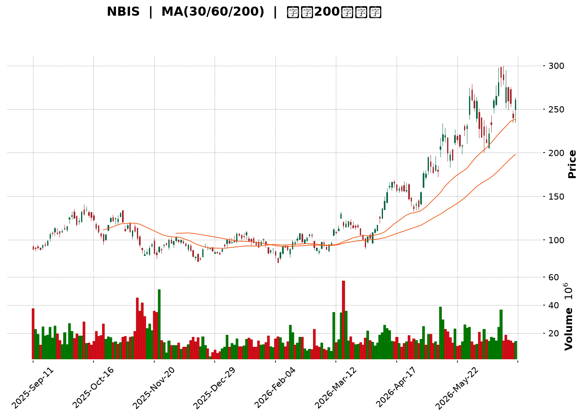
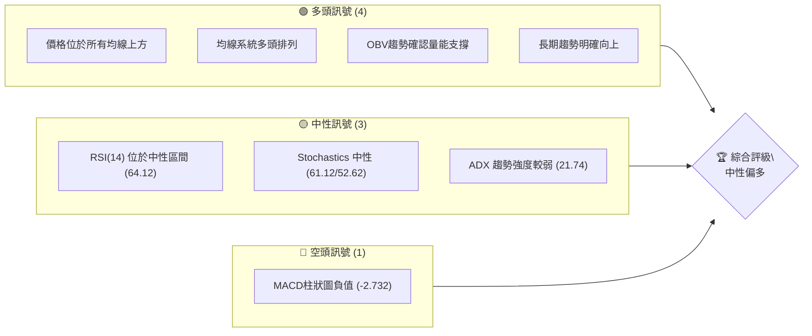
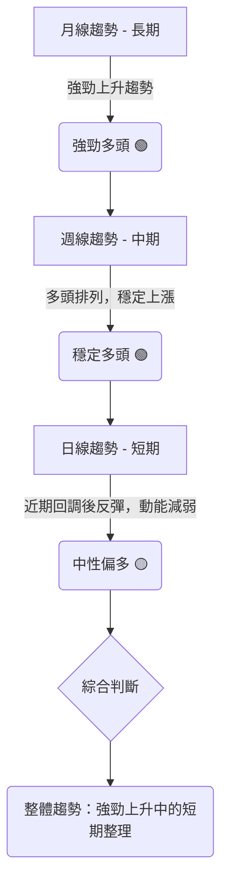
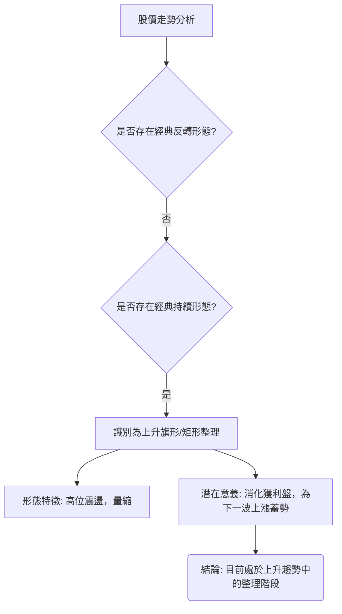
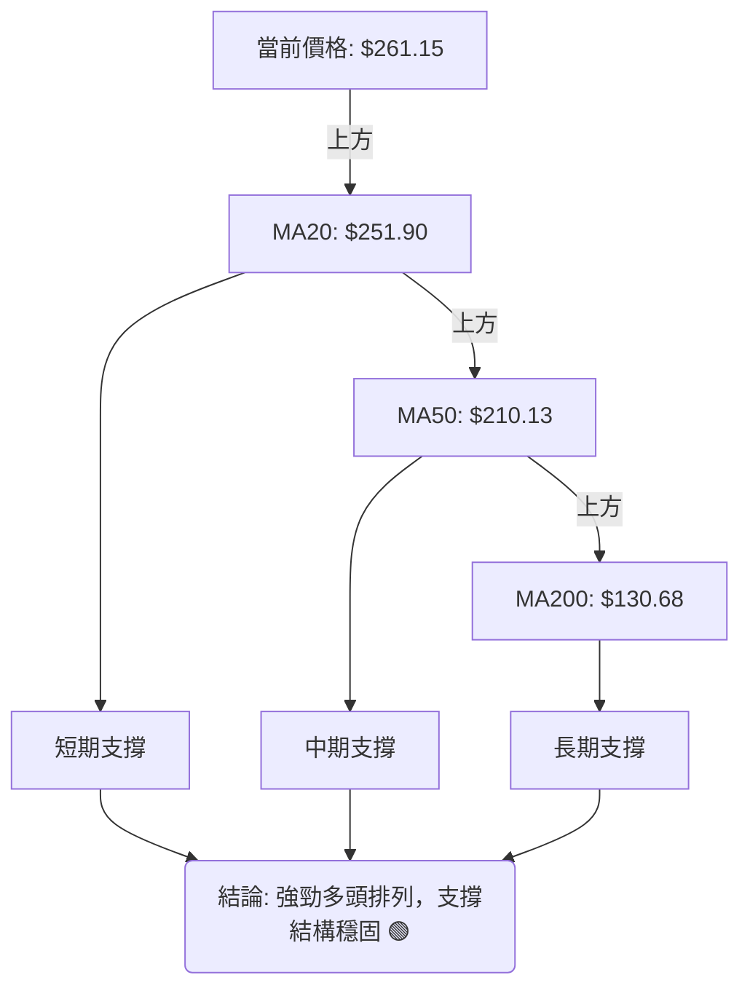
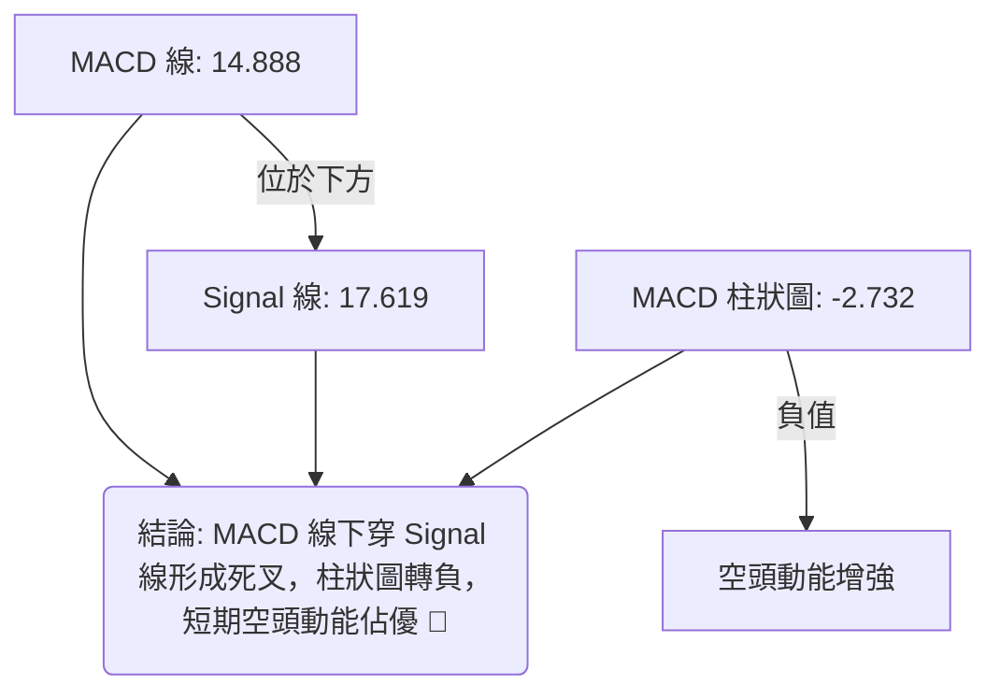
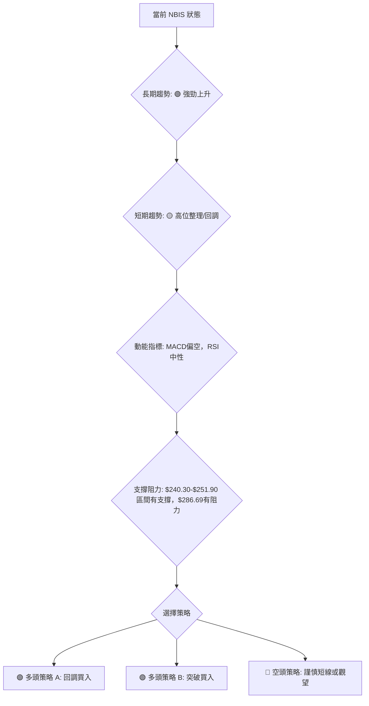

<details>
<summary>📊 靜態圖表 (點擊展開)</summary>

</details>

<html>
<head><meta charset="utf-8" /></head>
<body>
    <div style="height:500px; width:100%;">                        <script>window.PlotlyConfig = {MathJaxConfig: 'local'};</script>
        <script charset="utf-8" src="https://cdn.plot.ly/plotly-3.6.0.min.js" integrity="sha256-QaOVwtVY0T02VaHrr6pnoHLCwayMJp4O5n4YyaE3rJk=" crossorigin="anonymous"></script>                <div id="candlestick-chart" class="plotly-graph-div" style="height:100%; width:100%;"></div>            <script>                window.PLOTLYENV=window.PLOTLYENV || {};                                if (document.getElementById("candlestick-chart")) {                    Plotly.newPlot(                        "candlestick-chart",                        [{"close":{"dtype":"f8","bdata":"AAAAAClMVkAAAACAPZpWQAAAAKBwvVZAAAAAIIVbVkAAAADAHoVXQAAAACCuh1dAAAAAANfTWEAAAABgZqZaQAAAAEAz81pAAAAAYLhOXEAAAAAAKfxaQAAAAMDM7FpAAAAAgBSOW0AAAACgRxFcQAAAAEAK51xAAAAAIK53X0AAAABguP5fQAAAAAApPF9AAAAAwMxsXUAAAAAAAIBeQAAAAOB6lGBAAAAAYI8yYEAAAABguO5gQAAAAMDMBGBAAAAAwB51X0AAAABgj8JeQAAAAAApXFxAAAAAAABAW0AAAACA6xFaQAAAACCup1hAAAAAgD2KWkAAAADgo1BdQAAAACCFW19AAAAAwB51XkAAAABgZkZfQAAAACCFC19AAAAAgD1aYEAAAACAFB5eQAAAAGCPoltAAAAAAABAXUAAAAAAKVxbQAAAAIDr0VtAAAAAwMx8W0AAAACAFI5ZQAAAAEAKl1dAAAAA4FEoVkAAAABgj+JUQAAAAGC4flVAAAAAYI+iVkAAAADgesRXQAAAAMD1KFVAAAAA4KPQVEAAAACgmflWQAAAAOBROFZAAAAAACmsV0AAAAAgrrdXQAAAAKCZCVlAAAAAwMwcWEAAAABA4bpYQAAAAEAzs1lAAAAAYI+CWEAAAADAHhVZQAAAAIA9GlhAAAAAgMJlV0AAAACA65FXQAAAAAAp7FVAAAAAwPVIVEAAAADAzDxUQAAAAMDM3FJAAAAAgMKFU0AAAACgcF1WQAAAAGC4TldAAAAAgOuBVkAAAADgUchWQAAAAIDC5VVAAAAAYI+CVUAAAABA4UpVQAAAAMAe7VRAAAAAwMx8VkAAAADAHjVXQAAAACBcD1lAAAAAoHANWEAAAABAM1NYQAAAACCFe1hAAAAAwB7VWkAAAAAghVtaQAAAAGC4fllAAAAA4KP4WUAAAABguC5bQAAAAGCP0lhAAAAAIK63WEAAAABgZjZYQAAAAAAAoFdAAAAAoHDdVkAAAAAgrndYQAAAACCFG1lAAAAAgD26V0AAAAAAKUxVQAAAAIA9ClZAAAAAwMx8VkAAAADA9ZhUQAAAACCud1JAAAAAYGaGVUAAAADgUThXQAAAAGCP8lZAAAAAQAonVkAAAABguG5WQAAAAOCjgFhAAAAAoEdhWEAAAABAM3NZQAAAAEAK51pAAAAAQOF6WEAAAABACidZQAAAAMAepVlAAAAAIK6HWkAAAADgUThaQAAAAAApzFZAAAAA4KPAVkAAAABAM7NVQAAAAIDrcVhAAAAAoJnpV0AAAADAHlVWQAAAAAApvFdAAAAAIIUbWEAAAAAgrv9bQAAAAGCPAltAAAAAwMw8XEAAAABAMztgQAAAAMAeFV1AAAAAANejXUAAAACgR2FeQAAAACCuZ11AAAAAoJmJXEAAAACAPbpcQAAAAIDCxVxAAAAAgBR+WkAAAADgejRZQAAAAOCjEFdAAAAA4KPwWUAAAADAzHxZQAAAAOB6NFtAAAAAYI8iXEAAAACgmVldQAAAAAAAQF9AAAAAYI8KYUAAAABACh9iQAAAAIDrUWNAAAAAgBQ+ZEAAAADgo9hkQAAAAEDhqmRAAAAA4HqkY0AAAADAHuVjQAAAAKCZkWNAAAAA4HqEY0AAAABgj6JjQAAAAMAeZWJAAAAAYLgeYkAAAADgUfBgQAAAAIAUpmFAAAAAIFxHYUAAAAAgrk9jQAAAAKBwDWZAAAAAoHD9ZUAAAABA4WJoQAAAAOCjGGdAAAAAoJkhZkAAAABAM0NnQAAAACCFY2ZAAAAA4KPoaUAAAADAzKRrQAAAAIAUfmtAAAAAIIX7aEAAAAAgXLdoQAAAAIA9+mdAAAAAgMJ9a0AAAADgo9hqQAAAAIDrAWpAAAAAANcLakAAAABA4UpsQAAAAEDh4mxAAAAAACmIcEAAAACgR0lwQAAAAIDCdW9AAAAAYLg6cEAAAACA63lsQAAAAAAAQGtAAAAAANeDa0AAAACAFHZqQAAAACCux2tAAAAAIIULbUAAAADAHkFwQAAAAKCZkXBAAAAAYI+OcUAAAABACutxQAAAAIDCuXFAAAAAAAA0cUAAAABgjzpwQAAAAIAUCnBAAAAAoJkJbkAAAABgZlJwQA=="},"high":{"dtype":"f8","bdata":"AAAAIK53V0AAAAAAAABXQAAAAEDhmldAAAAAQDPTVkAAAAAAAMBXQAAAACCFa1hAAAAAQDPjWEAAAADAHiVbQAAAAGC4fltAAAAAYGa2XEAAAADAHoVcQAAAACBcf1tAAAAAoEchXEAAAACgmWldQAAAAOBR+FxAAAAAIFyvX0AAAAAAVJ9gQAAAAOBR+GBAAAAAwPUIYEAAAAAA11NfQAAAAIA9qmBAAAAAQDOjYUAAAADA9VBhQAAAAIAWuWBAAAAAIK5\u002fYEAAAABACl9gQAAAAACsJF5AAAAAgBReXUAAAAAghQtbQAAAAEAz81pAAAAAIK6nWkAAAADAzFxdQAAAAAAAoF9AAAAAwPUgYEAAAADAzHxfQAAAAIAUDmBAAAAAwMyEYEAAAACAwt1gQAAAAIDrMV1AAAAAoHCNXUAAAAAAAEBeQAAAAEAz01tAAAAAIK6XXUAAAAAA16NcQAAAAKCZaVpAAAAAYLjeVkAAAAAAAEBWQAAAAKCZaVZAAAAAAClsV0AAAACAFC5YQAAAAAAprFlAAAAAIFwvVkAAAAAAAEBXQAAAAIDr0VZAAAAAgJPoV0AAAADAHkVYQAAAAGBmZllAAAAAwMy8WUAAAAAA18NYQAAAAIDC9VlAAAAAYGZWWUAAAAAAACBZQAAAACCDOFlAAAAAgMJFWEAAAADAzNxXQAAAAKCZ6VdAAAAAIFwPVkAAAAAA12NUQAAAAEAzE1VAAAAAYGYWVEAAAABgj6JWQAAAAKCZ+VdAAAAAgBQ+V0AAAABA4dpWQAAAACCu51ZAAAAAQAonVkAAAACgcL1VQAAAAIAUnlVAAAAA4KOwVkAAAAAAKdxXQAAAACCFK1lAAAAAYGaWWUAAAABgj6JZQAAAAIAUPlpAAAAAIIUrW0AAAADAzPxaQAAAAMDMrFpAAAAA4FEIW0AAAAAAAKBbQAAAAIAUHlpAAAAAoJmZWUAAAABguP5ZQAAAAOCjuFhAAAAA4FE4WUAAAABgj+JYQAAAAGBmdllAAAAAAADQWEAAAABgjwJXQAAAAAAAUFZAAAAAwPXYVkAAAABgj+pVQAAAAOB6NFRAAAAAgD2qVUAAAAAghWtXQAAAAABU41dAAAAAAACwV0AAAADgo7BWQAAAAOB6FFlAAAAAYI\u002fSWEAAAACgmRlaQAAAAGC4\u002flpAAAAA4HoUW0AAAACgbkpZQAAAAAAA8FlAAAAAACncWkAAAADgehRbQAAAAEAz01hAAAAAoMTYVkAAAAAgrndWQAAAAGC4nlhAAAAAAADQWEAAAADAzLxXQAAAAMDMzFdAAAAAoJmZWEAAAADAHoVcQAAAAGCPwltAAAAA4HokXUAAAACgmYlgQAAAAAAAYF5AAAAAQImxXkAAAABAM3NeQAAAAABW7l5AAAAAANdTXkAAAABAM3NdQAAAAEAzs11AAAAAQDNTXEAAAADgo5BaQAAAACBcj1lAAAAAwPX4WUAAAAAgrvdaQAAAAKBwPVtAAAAAgMJ1XEAAAACgmXldQAAAAAAA8F9AAAAAoJkRYUAAAACAPbpiQAAAAAAA8GNAAAAAQDPDZEAAAACA69lkQAAAAGC4FmVAAAAAgOuBZEAAAAAAADhkQAAAAAAAaGRAAAAAgMLtZEAAAACA67lkQAAAAAAAqGRAAAAAoJmZYkAAAABguK5hQAAAAGBm9mFAAAAAIFxfYkAAAAAAAIBjQAAAAMDMbGZAAAAAYLh+ZkAAAAAgrn9oQAAAAOB6vGhAAAAAAACIZ0AAAACAl45oQAAAACCFM2dAAAAAQOEqa0AAAAAgXDdtQAAAAKBHmWxAAAAAgD1Ca0AAAACA61lpQAAAAAAAiGlAAAAAgOtZbEAAAACgcL1rQAAAAOBRoGtAAAAA4Ho0akAAAADgehxtQAAAAEAzM21AAAAAoMQscUAAAACgcG1xQAAAACBct3BAAAAAIIWHcEAAAAAAAFhvQAAAAMDMDG5AAAAAwPW0bUAAAAAgrt9sQAAAACCuj2xAAAAAQOFybkAAAADgUW5wQAAAACCFVXFAAAAAQOGeckAAAADAzKxyQAAAAIDCvXJAAAAAIK5zckAAAACgbkJxQAAAAOBROHFAAAAAoJkZb0AAAADAzHxwQA=="},"hovertemplate":"\u003cb\u003e%{x|%Y-%m-%d}\u003c\u002fb\u003e\u003cbr\u003e\u958b: $%{open:.2f}\u003cbr\u003e\u9ad8: $%{high:.2f}\u003cbr\u003e\u4f4e: $%{low:.2f}\u003cbr\u003e\u6536: $%{close:.2f}\u003cextra\u003e\u003c\u002fextra\u003e","low":{"dtype":"f8","bdata":"AAAAYI8aVkAAAACA67FVQAAAAIDCNVZAAAAAoEcBVkAAAADAHjVWQAAAAIDrAVdAAAAAAABQV0AAAACgR6FYQAAAAAAAEFpAAAAAYGY2WkAAAADgUXhaQAAAAEAzs1lAAAAAwB4VW0AAAACAPepbQAAAAOCjcFtAAAAA4HqkXUAAAABgZuZeQAAAACCFO19AAAAAgBTuXEAAAAAAAGBdQAAAACCu911AAAAA4FEAYEAAAADAzJRgQAAAAAAAcF9AAAAAwMyMXkAAAACgR4FeQAAAAOBRuFtAAAAA4KPgWkAAAACgmVlZQAAAAOBRqFdAAAAAoHDdWEAAAADgo4BbQAAAAEAKB15AAAAAgOsxXkAAAAAAAGBdQAAAAOCjcF1AAAAAQDOTX0AAAAAAAPBdQAAAAAAAQFtAAAAAIIXbW0AAAACAPRpbQAAAAOCjUFlAAAAAgBQuW0AAAADAHvVYQAAAAKBw7VZAAAAAAAAgVUAAAAAAAIBUQAAAAIDC5VRAAAAAoHBtVEAAAABAM\u002fNWQAAAAKBwDVVAAAAAoHCNU0AAAACgmUlVQAAAAOAkLlVAAAAA4KOwVkAAAAAAKVxXQAAAAOCjQFZAAAAAANcDWEAAAAAAAMBWQAAAAIAUXlhAAAAAwMwMWEAAAABAM9NXQAAAAGBmBlhAAAAAwMwMV0AAAADAzKxVQAAAAMDMjFVAAAAAoBgEVEAAAADgUThTQAAAAAAA0FJAAAAA4KNAU0AAAACAPQpUQAAAAGBmxlZAAAAAANcTVkAAAACgmSlWQAAAACBcr1VAAAAAYI8SVUAAAAAA1yNVQAAAAKCZuVRAAAAA4KOAVUAAAADA9bhWQAAAAAApvFZAAAAAANfjV0AAAAAgWAFYQAAAAGBmRlhAAAAAQDMjWEAAAABA4fpZQAAAACCD2FhAAAAAYGZGWUAAAACgcC1ZQAAAAIDClVhAAAAAYGZGV0AAAAAAACBYQAAAAIDrYVdAAAAAQArXVkAAAACA62FXQAAAAAApHFhAAAAAgD3KVkAAAAAgrgdVQAAAAIAUDlVAAAAAAAAwVUAAAAAAKZxTQAAAAKBHYVJAAAAAIK5HU0AAAAAA1\u002fNUQAAAAIA96lZAAAAAwPXIVUAAAAAAKexTQAAAAEAKN1ZAAAAAAABgV0AAAAAg2TZYQAAAACCFG1lAAAAAgOtBWEAAAABAM9NXQAAAAEDfb1hAAAAAQDOzWUAAAAAAAIBZQAAAAKCZGVZAAAAAQDOzVUAAAACA6+FUQAAAAKCZiVZAAAAAIK7nVkAAAABAMzNWQAAAAAAAoFVAAAAAAADAV0AAAAAgXB9aQAAAAKBHoVpAAAAAwPWIW0AAAABgEhtfQAAAAEAKR1xAAAAAAACAXEAAAACgR7FcQAAAAICTKFxAAAAAQDNjXEAAAADgowBcQAAAAMAeVVxAAAAAgD1aWkAAAACgRxFZQAAAAMDKaVZAAAAAYLjuV0AAAABgZlZZQAAAAAApDFhAAAAAwMzcWkAAAACA65FbQAAAAGBm1l1AAAAAQDMjX0AAAADgUdxgQAAAAKCZyWFAAAAA4KPQY0AAAAAAAJBjQAAAAEDhAmRAAAAAIFxXY0AAAACgR0FjQAAAAMDMbGNAAAAAQDNrY0AAAACAPUJjQAAAAIDrOWJAAAAAgOtRYUAAAABgZpZgQAAAAEAKx2BAAAAAAADgYEAAAAAAAIBhQAAAAGBm9mNAAAAAYLgWZUAAAAAgheNlQAAAAAAAIGZAAAAAAAAQZkAAAACgmVFmQAAAAAAAiGVAAAAAAABgaEAAAAAAAPhpQAAAAKCZeWpAAAAAYI\u002fCZ0AAAAAAAOBmQAAAAOB61GdAAAAAoJkZakAAAAAgXFdqQAAAAMAetWlAAAAAgOvJaEAAAADgUWBrQAAAAMDMTGpAAAAAAADAbUAAAAAAADxwQAAAAOBR8G5AAAAAgBRWbUAAAACAFBZrQAAAAGBmNmtAAAAAoJkJaUAAAAAA12tqQAAAAAAAoGlAAAAAAADwa0AAAAAgrqduQAAAAMDMrG9AAAAA4KOEcEAAAABAMzlxQAAAAAAAYHFAAAAAAABgb0AAAABguCZvQAAAAIDrkW9AAAAAwMxMbUAAAAAAAFBtQA=="},"name":"\u50f9\u683c","open":{"dtype":"f8","bdata":"AAAAQOEqV0AAAAAAKcxWQAAAAEAKJ1dAAAAAwMzMVkAAAABA4epWQAAAAMDMxFdAAAAAwPWIV0AAAADAzHxZQAAAAGCPAltAAAAA4KNIW0AAAAAghQNbQAAAACCFe1tAAAAA4FFYW0AAAADgelxcQAAAAIDC7VtAAAAAoEfxXkAAAABACs9fQAAAAMDMjGBAAAAAwMz0X0AAAADAzExeQAAAAGC4Pl5AAAAAYGbeYEAAAABguOZgQAAAAAAAgGBAAAAAwMx8YEAAAABA4QJgQAAAAADXg11AAAAAYI8yXUAAAADgUfhaQAAAAEAzq1pAAAAAwB4VWUAAAACAPcpbQAAAAIA9Ol5AAAAAANebX0AAAACA6xFfQAAAAMDMTF5AAAAAwPWoX0AAAAAAAMBgQAAAAGC4FlxAAAAAwPVoXEAAAABAM+NdQAAAAAAAIFpAAAAAIIXLXEAAAADgUYhcQAAAAMDMDFpAAAAAwPW4VkAAAABACpdUQAAAAOB69FRAAAAAgOvxVEAAAADgUUBXQAAAACCF21hAAAAAQDNjVUAAAABguI5VQAAAAGCPUlZAAAAAYGZ2V0AAAABAMyNYQAAAAMDM3FZAAAAAQAoXWUAAAACgR8FXQAAAAOB6xFhAAAAAgMIVWUAAAABgj1JYQAAAAIDChVhAAAAAYLjuV0AAAADAzExWQAAAAADXU1dAAAAAYGYGVkAAAADAzORTQAAAAIDCBVVAAAAAQDPDU0AAAACgmSlUQAAAAIAUPldAAAAAANeTVkAAAABguI5WQAAAAOCj4FZAAAAAwMwcVUAAAAAAAJhVQAAAACCuV1VAAAAAQAq\u002fVUAAAAAAAMBXQAAAAIDC7VdAAAAA4KPAWEAAAABgjzJYQAAAAKBHuVhAAAAA4HqUWEAAAADAHtVaQAAAAIDrcVpAAAAAIIUjWkAAAAAgrn9aQAAAAMAedVlAAAAAgMJFWUAAAADgo4BZQAAAAMDMLFhAAAAAoHBtWEAAAABgZpZXQAAAAAAAAFlAAAAAQAqXWEAAAACgQ+NWQAAAAADXc1VAAAAAIIV7VkAAAAAAAMBVQAAAAMD1yFNAAAAAYGbOU0AAAADAzBxVQAAAAGCPOldAAAAAYI86V0AAAABgZgZVQAAAAEAKd1ZAAAAAAAAAWEAAAABguO5YQAAAACCFG1lAAAAAANOlWkAAAAAghRNYQAAAACBc11hAAAAAIFw\u002fWkAAAAAAAIBaQAAAAMDMrFhAAAAAAAAAVkAAAACgmYlVQAAAAKCZmVZAAAAAAAAwWEAAAABAMxNXQAAAAEAK11VAAAAAwPXIV0AAAACAPUpaQAAAAIDCRVtAAAAAACmcW0AAAAAAADBfQAAAAIDCFV5AAAAAQDOzXEAAAADgUdBcQAAAAGBmHl5AAAAAoHAtXUAAAABAMwtdQAAAACCuN11AAAAA4FFQXEAAAADAHnVaQAAAACBcj1lAAAAAYLh+WEAAAADgenxaQAAAAIA9GlhAAAAAgD0qW0AAAAAAAKhbQAAAAOBRuF9AAAAAAABAX0AAAADgUdxgQAAAAGBm1mFAAAAAQDMjZEAAAABgOwdkQAAAAAAA4GRAAAAAwPV4ZEAAAAAAAKBjQAAAAEAKJ2RAAAAAIIVbZEAAAADAzHxjQAAAAKBwdWRAAAAA4HqMYkAAAADAzExhQAAAAEAKg2FAAAAAgOslYkAAAABgj6phQAAAAOBRDGRAAAAAwMx0ZUAAAABACnNmQAAAAOBRwGdAAAAAYGb2ZkAAAADAzHxmQAAAAKBwjWZAAAAAQAp7aUAAAAAAAKxqQAAAACCFM2tAAAAAQAova0AAAAAAAOBnQAAAAEAKf2lAAAAAIK53akAAAADgUWhrQAAAAKCZlWtAAAAAwB75aUAAAAAAKcxsQAAAACCFe2xAAAAAQOGCbkAAAACgmQFxQAAAAKBwQ3BAAAAAIK73bUAAAAAghdtuQAAAAMDMDG5AAAAAAADAbEAAAACgxu9qQAAAAOB6rGlAAAAAwMxUbUAAAABguH5vQAAAAEAK729AAAAAYGaacEAAAABAM6NyQAAAACBcH3JAAAAAAAAccEAAAACgmTFxQAAAAMAeCXFAAAAAQDObbkAAAAAAACxvQA=="},"x":["2025-09-11T00:00:00-04:00","2025-09-12T00:00:00-04:00","2025-09-15T00:00:00-04:00","2025-09-16T00:00:00-04:00","2025-09-17T00:00:00-04:00","2025-09-18T00:00:00-04:00","2025-09-19T00:00:00-04:00","2025-09-22T00:00:00-04:00","2025-09-23T00:00:00-04:00","2025-09-24T00:00:00-04:00","2025-09-25T00:00:00-04:00","2025-09-26T00:00:00-04:00","2025-09-29T00:00:00-04:00","2025-09-30T00:00:00-04:00","2025-10-01T00:00:00-04:00","2025-10-02T00:00:00-04:00","2025-10-03T00:00:00-04:00","2025-10-06T00:00:00-04:00","2025-10-07T00:00:00-04:00","2025-10-08T00:00:00-04:00","2025-10-09T00:00:00-04:00","2025-10-10T00:00:00-04:00","2025-10-13T00:00:00-04:00","2025-10-14T00:00:00-04:00","2025-10-15T00:00:00-04:00","2025-10-16T00:00:00-04:00","2025-10-17T00:00:00-04:00","2025-10-20T00:00:00-04:00","2025-10-21T00:00:00-04:00","2025-10-22T00:00:00-04:00","2025-10-23T00:00:00-04:00","2025-10-24T00:00:00-04:00","2025-10-27T00:00:00-04:00","2025-10-28T00:00:00-04:00","2025-10-29T00:00:00-04:00","2025-10-30T00:00:00-04:00","2025-10-31T00:00:00-04:00","2025-11-03T00:00:00-05:00","2025-11-04T00:00:00-05:00","2025-11-05T00:00:00-05:00","2025-11-06T00:00:00-05:00","2025-11-07T00:00:00-05:00","2025-11-10T00:00:00-05:00","2025-11-11T00:00:00-05:00","2025-11-12T00:00:00-05:00","2025-11-13T00:00:00-05:00","2025-11-14T00:00:00-05:00","2025-11-17T00:00:00-05:00","2025-11-18T00:00:00-05:00","2025-11-19T00:00:00-05:00","2025-11-20T00:00:00-05:00","2025-11-21T00:00:00-05:00","2025-11-24T00:00:00-05:00","2025-11-25T00:00:00-05:00","2025-11-26T00:00:00-05:00","2025-11-28T00:00:00-05:00","2025-12-01T00:00:00-05:00","2025-12-02T00:00:00-05:00","2025-12-03T00:00:00-05:00","2025-12-04T00:00:00-05:00","2025-12-05T00:00:00-05:00","2025-12-08T00:00:00-05:00","2025-12-09T00:00:00-05:00","2025-12-10T00:00:00-05:00","2025-12-11T00:00:00-05:00","2025-12-12T00:00:00-05:00","2025-12-15T00:00:00-05:00","2025-12-16T00:00:00-05:00","2025-12-17T00:00:00-05:00","2025-12-18T00:00:00-05:00","2025-12-19T00:00:00-05:00","2025-12-22T00:00:00-05:00","2025-12-23T00:00:00-05:00","2025-12-24T00:00:00-05:00","2025-12-26T00:00:00-05:00","2025-12-29T00:00:00-05:00","2025-12-30T00:00:00-05:00","2025-12-31T00:00:00-05:00","2026-01-02T00:00:00-05:00","2026-01-05T00:00:00-05:00","2026-01-06T00:00:00-05:00","2026-01-07T00:00:00-05:00","2026-01-08T00:00:00-05:00","2026-01-09T00:00:00-05:00","2026-01-12T00:00:00-05:00","2026-01-13T00:00:00-05:00","2026-01-14T00:00:00-05:00","2026-01-15T00:00:00-05:00","2026-01-16T00:00:00-05:00","2026-01-20T00:00:00-05:00","2026-01-21T00:00:00-05:00","2026-01-22T00:00:00-05:00","2026-01-23T00:00:00-05:00","2026-01-26T00:00:00-05:00","2026-01-27T00:00:00-05:00","2026-01-28T00:00:00-05:00","2026-01-29T00:00:00-05:00","2026-01-30T00:00:00-05:00","2026-02-02T00:00:00-05:00","2026-02-03T00:00:00-05:00","2026-02-04T00:00:00-05:00","2026-02-05T00:00:00-05:00","2026-02-06T00:00:00-05:00","2026-02-09T00:00:00-05:00","2026-02-10T00:00:00-05:00","2026-02-11T00:00:00-05:00","2026-02-12T00:00:00-05:00","2026-02-13T00:00:00-05:00","2026-02-17T00:00:00-05:00","2026-02-18T00:00:00-05:00","2026-02-19T00:00:00-05:00","2026-02-20T00:00:00-05:00","2026-02-23T00:00:00-05:00","2026-02-24T00:00:00-05:00","2026-02-25T00:00:00-05:00","2026-02-26T00:00:00-05:00","2026-02-27T00:00:00-05:00","2026-03-02T00:00:00-05:00","2026-03-03T00:00:00-05:00","2026-03-04T00:00:00-05:00","2026-03-05T00:00:00-05:00","2026-03-06T00:00:00-05:00","2026-03-09T00:00:00-04:00","2026-03-10T00:00:00-04:00","2026-03-11T00:00:00-04:00","2026-03-12T00:00:00-04:00","2026-03-13T00:00:00-04:00","2026-03-16T00:00:00-04:00","2026-03-17T00:00:00-04:00","2026-03-18T00:00:00-04:00","2026-03-19T00:00:00-04:00","2026-03-20T00:00:00-04:00","2026-03-23T00:00:00-04:00","2026-03-24T00:00:00-04:00","2026-03-25T00:00:00-04:00","2026-03-26T00:00:00-04:00","2026-03-27T00:00:00-04:00","2026-03-30T00:00:00-04:00","2026-03-31T00:00:00-04:00","2026-04-01T00:00:00-04:00","2026-04-02T00:00:00-04:00","2026-04-06T00:00:00-04:00","2026-04-07T00:00:00-04:00","2026-04-08T00:00:00-04:00","2026-04-09T00:00:00-04:00","2026-04-10T00:00:00-04:00","2026-04-13T00:00:00-04:00","2026-04-14T00:00:00-04:00","2026-04-15T00:00:00-04:00","2026-04-16T00:00:00-04:00","2026-04-17T00:00:00-04:00","2026-04-20T00:00:00-04:00","2026-04-21T00:00:00-04:00","2026-04-22T00:00:00-04:00","2026-04-23T00:00:00-04:00","2026-04-24T00:00:00-04:00","2026-04-27T00:00:00-04:00","2026-04-28T00:00:00-04:00","2026-04-29T00:00:00-04:00","2026-04-30T00:00:00-04:00","2026-05-01T00:00:00-04:00","2026-05-04T00:00:00-04:00","2026-05-05T00:00:00-04:00","2026-05-06T00:00:00-04:00","2026-05-07T00:00:00-04:00","2026-05-08T00:00:00-04:00","2026-05-11T00:00:00-04:00","2026-05-12T00:00:00-04:00","2026-05-13T00:00:00-04:00","2026-05-14T00:00:00-04:00","2026-05-15T00:00:00-04:00","2026-05-18T00:00:00-04:00","2026-05-19T00:00:00-04:00","2026-05-20T00:00:00-04:00","2026-05-21T00:00:00-04:00","2026-05-22T00:00:00-04:00","2026-05-26T00:00:00-04:00","2026-05-27T00:00:00-04:00","2026-05-28T00:00:00-04:00","2026-05-29T00:00:00-04:00","2026-06-01T00:00:00-04:00","2026-06-02T00:00:00-04:00","2026-06-03T00:00:00-04:00","2026-06-04T00:00:00-04:00","2026-06-05T00:00:00-04:00","2026-06-08T00:00:00-04:00","2026-06-09T00:00:00-04:00","2026-06-10T00:00:00-04:00","2026-06-11T00:00:00-04:00","2026-06-12T00:00:00-04:00","2026-06-15T00:00:00-04:00","2026-06-16T00:00:00-04:00","2026-06-17T00:00:00-04:00","2026-06-18T00:00:00-04:00","2026-06-22T00:00:00-04:00","2026-06-23T00:00:00-04:00","2026-06-24T00:00:00-04:00","2026-06-25T00:00:00-04:00","2026-06-26T00:00:00-04:00","2026-06-29T00:00:00-04:00"],"type":"candlestick"},{"hovertemplate":"MA30: $%{y:.2f}\u003cextra\u003e\u003c\u002fextra\u003e","line":{"color":"#2196F3","dash":"dash","width":2},"mode":"lines","name":"MA30","x":["2025-09-11T00:00:00-04:00","2025-09-12T00:00:00-04:00","2025-09-15T00:00:00-04:00","2025-09-16T00:00:00-04:00","2025-09-17T00:00:00-04:00","2025-09-18T00:00:00-04:00","2025-09-19T00:00:00-04:00","2025-09-22T00:00:00-04:00","2025-09-23T00:00:00-04:00","2025-09-24T00:00:00-04:00","2025-09-25T00:00:00-04:00","2025-09-26T00:00:00-04:00","2025-09-29T00:00:00-04:00","2025-09-30T00:00:00-04:00","2025-10-01T00:00:00-04:00","2025-10-02T00:00:00-04:00","2025-10-03T00:00:00-04:00","2025-10-06T00:00:00-04:00","2025-10-07T00:00:00-04:00","2025-10-08T00:00:00-04:00","2025-10-09T00:00:00-04:00","2025-10-10T00:00:00-04:00","2025-10-13T00:00:00-04:00","2025-10-14T00:00:00-04:00","2025-10-15T00:00:00-04:00","2025-10-16T00:00:00-04:00","2025-10-17T00:00:00-04:00","2025-10-20T00:00:00-04:00","2025-10-21T00:00:00-04:00","2025-10-22T00:00:00-04:00","2025-10-23T00:00:00-04:00","2025-10-24T00:00:00-04:00","2025-10-27T00:00:00-04:00","2025-10-28T00:00:00-04:00","2025-10-29T00:00:00-04:00","2025-10-30T00:00:00-04:00","2025-10-31T00:00:00-04:00","2025-11-03T00:00:00-05:00","2025-11-04T00:00:00-05:00","2025-11-05T00:00:00-05:00","2025-11-06T00:00:00-05:00","2025-11-07T00:00:00-05:00","2025-11-10T00:00:00-05:00","2025-11-11T00:00:00-05:00","2025-11-12T00:00:00-05:00","2025-11-13T00:00:00-05:00","2025-11-14T00:00:00-05:00","2025-11-17T00:00:00-05:00","2025-11-18T00:00:00-05:00","2025-11-19T00:00:00-05:00","2025-11-20T00:00:00-05:00","2025-11-21T00:00:00-05:00","2025-11-24T00:00:00-05:00","2025-11-25T00:00:00-05:00","2025-11-26T00:00:00-05:00","2025-11-28T00:00:00-05:00","2025-12-01T00:00:00-05:00","2025-12-02T00:00:00-05:00","2025-12-03T00:00:00-05:00","2025-12-04T00:00:00-05:00","2025-12-05T00:00:00-05:00","2025-12-08T00:00:00-05:00","2025-12-09T00:00:00-05:00","2025-12-10T00:00:00-05:00","2025-12-11T00:00:00-05:00","2025-12-12T00:00:00-05:00","2025-12-15T00:00:00-05:00","2025-12-16T00:00:00-05:00","2025-12-17T00:00:00-05:00","2025-12-18T00:00:00-05:00","2025-12-19T00:00:00-05:00","2025-12-22T00:00:00-05:00","2025-12-23T00:00:00-05:00","2025-12-24T00:00:00-05:00","2025-12-26T00:00:00-05:00","2025-12-29T00:00:00-05:00","2025-12-30T00:00:00-05:00","2025-12-31T00:00:00-05:00","2026-01-02T00:00:00-05:00","2026-01-05T00:00:00-05:00","2026-01-06T00:00:00-05:00","2026-01-07T00:00:00-05:00","2026-01-08T00:00:00-05:00","2026-01-09T00:00:00-05:00","2026-01-12T00:00:00-05:00","2026-01-13T00:00:00-05:00","2026-01-14T00:00:00-05:00","2026-01-15T00:00:00-05:00","2026-01-16T00:00:00-05:00","2026-01-20T00:00:00-05:00","2026-01-21T00:00:00-05:00","2026-01-22T00:00:00-05:00","2026-01-23T00:00:00-05:00","2026-01-26T00:00:00-05:00","2026-01-27T00:00:00-05:00","2026-01-28T00:00:00-05:00","2026-01-29T00:00:00-05:00","2026-01-30T00:00:00-05:00","2026-02-02T00:00:00-05:00","2026-02-03T00:00:00-05:00","2026-02-04T00:00:00-05:00","2026-02-05T00:00:00-05:00","2026-02-06T00:00:00-05:00","2026-02-09T00:00:00-05:00","2026-02-10T00:00:00-05:00","2026-02-11T00:00:00-05:00","2026-02-12T00:00:00-05:00","2026-02-13T00:00:00-05:00","2026-02-17T00:00:00-05:00","2026-02-18T00:00:00-05:00","2026-02-19T00:00:00-05:00","2026-02-20T00:00:00-05:00","2026-02-23T00:00:00-05:00","2026-02-24T00:00:00-05:00","2026-02-25T00:00:00-05:00","2026-02-26T00:00:00-05:00","2026-02-27T00:00:00-05:00","2026-03-02T00:00:00-05:00","2026-03-03T00:00:00-05:00","2026-03-04T00:00:00-05:00","2026-03-05T00:00:00-05:00","2026-03-06T00:00:00-05:00","2026-03-09T00:00:00-04:00","2026-03-10T00:00:00-04:00","2026-03-11T00:00:00-04:00","2026-03-12T00:00:00-04:00","2026-03-13T00:00:00-04:00","2026-03-16T00:00:00-04:00","2026-03-17T00:00:00-04:00","2026-03-18T00:00:00-04:00","2026-03-19T00:00:00-04:00","2026-03-20T00:00:00-04:00","2026-03-23T00:00:00-04:00","2026-03-24T00:00:00-04:00","2026-03-25T00:00:00-04:00","2026-03-26T00:00:00-04:00","2026-03-27T00:00:00-04:00","2026-03-30T00:00:00-04:00","2026-03-31T00:00:00-04:00","2026-04-01T00:00:00-04:00","2026-04-02T00:00:00-04:00","2026-04-06T00:00:00-04:00","2026-04-07T00:00:00-04:00","2026-04-08T00:00:00-04:00","2026-04-09T00:00:00-04:00","2026-04-10T00:00:00-04:00","2026-04-13T00:00:00-04:00","2026-04-14T00:00:00-04:00","2026-04-15T00:00:00-04:00","2026-04-16T00:00:00-04:00","2026-04-17T00:00:00-04:00","2026-04-20T00:00:00-04:00","2026-04-21T00:00:00-04:00","2026-04-22T00:00:00-04:00","2026-04-23T00:00:00-04:00","2026-04-24T00:00:00-04:00","2026-04-27T00:00:00-04:00","2026-04-28T00:00:00-04:00","2026-04-29T00:00:00-04:00","2026-04-30T00:00:00-04:00","2026-05-01T00:00:00-04:00","2026-05-04T00:00:00-04:00","2026-05-05T00:00:00-04:00","2026-05-06T00:00:00-04:00","2026-05-07T00:00:00-04:00","2026-05-08T00:00:00-04:00","2026-05-11T00:00:00-04:00","2026-05-12T00:00:00-04:00","2026-05-13T00:00:00-04:00","2026-05-14T00:00:00-04:00","2026-05-15T00:00:00-04:00","2026-05-18T00:00:00-04:00","2026-05-19T00:00:00-04:00","2026-05-20T00:00:00-04:00","2026-05-21T00:00:00-04:00","2026-05-22T00:00:00-04:00","2026-05-26T00:00:00-04:00","2026-05-27T00:00:00-04:00","2026-05-28T00:00:00-04:00","2026-05-29T00:00:00-04:00","2026-06-01T00:00:00-04:00","2026-06-02T00:00:00-04:00","2026-06-03T00:00:00-04:00","2026-06-04T00:00:00-04:00","2026-06-05T00:00:00-04:00","2026-06-08T00:00:00-04:00","2026-06-09T00:00:00-04:00","2026-06-10T00:00:00-04:00","2026-06-11T00:00:00-04:00","2026-06-12T00:00:00-04:00","2026-06-15T00:00:00-04:00","2026-06-16T00:00:00-04:00","2026-06-17T00:00:00-04:00","2026-06-18T00:00:00-04:00","2026-06-22T00:00:00-04:00","2026-06-23T00:00:00-04:00","2026-06-24T00:00:00-04:00","2026-06-25T00:00:00-04:00","2026-06-26T00:00:00-04:00","2026-06-29T00:00:00-04:00"],"y":{"dtype":"f8","bdata":"AAAAAAAA+H8AAAAAAAD4fwAAAAAAAPh\u002fAAAAAAAA+H8AAAAAAAD4fwAAAAAAAPh\u002fAAAAAAAA+H8AAAAAAAD4fwAAAAAAAPh\u002fAAAAAAAA+H8AAAAAAAD4fwAAAAAAAPh\u002fAAAAAAAA+H8AAAAAAAD4fwAAAAAAAPh\u002fAAAAAAAA+H8AAAAAAAD4fwAAAAAAAPh\u002fAAAAAAAA+H8AAAAAAAD4fwAAAAAAAPh\u002fAAAAAAAA+H8AAAAAAAD4fwAAAAAAAPh\u002fAAAAAAAA+H8AAAAAAAD4fwAAAAAAAPh\u002fAAAAAAAA+H8AAAAAAAD4f7y7u7se5VtA3t3dnVIJXEC8u7tLmkJcQDMzM4MjjFxAvLu7O0LRXECamZlJbxNdQN7d3Q2QU11AiYiIuMiWXUB3d3eXX7RdQO\u002fu7v43ul1Aq6qq6kLCXUDe3d0ddsVdQGZmZkYZzV1AERER0YXMXUDe3d0tFbddQImIiNi\u002fiV1AZmZm1k06XUC8u7urf9tcQBEREVFiiFxAZmZmVnFOXEB3d3f3\u002fRRcQBEREZGXrltAvLu7q8ZLW0CamZkZ2e5aQCIiInISm1pAq6qq2qNYWkB3d3dHixxaQKuqqioxAFpAERERMWvlWUCrqqrq+9lZQBEREcHm4llAZmZmJpTRWUDNzMwcdq1ZQDMzM1ONb1lAREREhE4zWUAAAACwjvFYQImIiEi2o1hAAAAAYLo5WEDv7u4ua+VXQM3MzFyPmldAAAAAUI1HV0ARERGR7RxXQM3MzNxr9lZAMzMz4+zLVkBERERERLRWQBEREfHSpVZAVVVVdUygVkB3d3enxqNWQDMzMzPsnlZAq6qq+qmdVkBERESk4phWQCIiIlIqulZA7+7uvsrVVkDe3d3dT+FWQAAAAGCe9FZAAAAAgJUPV0CrqqqqHCZXQHd3dxcEKldAiYiImOA5V0Crqqoqzk5XQM3MzDxRR1dAd3d3hxZJV0C8u7v7qUFXQN7d3d2WPVdAq6qqmgs5V0CamZk5tEBXQGZmZvbhW1dAiYiIOEJ5V0BERETUTYJXQAAAADBrnVdAREREVLi2V0Crqqoqo6dXQGZmZgZWfldAiYiIuPN1V0BERER0r3lXQHd3dzelgldAd3d3xyCIV0BmZmYm25FXQGZmZpZfsFdAERER0YXAV0AiIiKiqNNXQDMzM6Nh41dAZmZmhgfnV0CamZk5F+5XQO\u002fu7r4C+FdAzczM7G31V0DNzMyMQfRXQFVVVcU83VdA3t3dTcXBV0CamZmZ\u002fJJXQAAAAPDDj1dAMzMzY+WIV0B3d3d32nhXQERERMTKeVdAzczMDGWEV0Dv7u4uh6JXQCIiIkLDsldAAAAAgD\u002fZV0ARERHRhThYQERERGSedFhARERERKexWEBmZmZ2IQVZQLy7u8t2YllAZmZm1k2eWUCJiIgoTc1ZQAAAABAC\u002f1lAAAAA8AokWkDe3d2NsztaQJqZmUlvL1pAmpmZKb88WkBEREQUET1aQGZmZualP1pA7+7uXtZeWkAzMzPzp4JaQCIiIkJ8slpAIiIi8u7yWkDv7u5udUhbQGZmZualz1tAMzMzI\u002fdmXEC8u7trkRFdQAAAADCyoV1AzczM7N8kXkCrqqpq2LleQBEREbFHPV9AAAAAUKm8X0De3d3daw5gQERERDwmOGBAIiIiGktaYEAAAACoVGBgQAAAABjZemBAiYiIUNSPYEAzMzNT\u002f7JgQM3MzKS38WBAiYiI+JozYUBERER0IYlhQN7d3b1002FAIiIiUkYfYkCrqqpyPXpiQJqZmUnh1mJAMzMza0pFY0Dv7u72b8RjQCIiIiL3OmRAiYiIUBuYZEAiIiLCyu1kQDMzMxMRNWVAIiIicj2OZUAAAACAsdhlQBEREZHCEWZAzczMDElDZkARERGh04JmQDMzM8P1yGZA7+7u7nw7Z0CamZlZq6dnQN7d3S0kDWhAZmZmxpJ7aEB3d3fHBMdoQCIiItKUEmlAIiIigsBiaUCrqqq6ArRpQImIiMh2CmpAzczMjN5uakDe3d3tfN9qQLy7u3sUPmtAERERwRGua0CamZmpxg9sQBEREZE0eWxAZmZmtvPhbEDv7u5+ajBtQAAAAKAag21AREREBFambUDv7u6uANFtQA=="},"type":"scatter"},{"hovertemplate":"MA60: $%{y:.2f}\u003cextra\u003e\u003c\u002fextra\u003e","line":{"color":"#9C27B0","dash":"dash","width":2},"mode":"lines","name":"MA60","x":["2025-09-11T00:00:00-04:00","2025-09-12T00:00:00-04:00","2025-09-15T00:00:00-04:00","2025-09-16T00:00:00-04:00","2025-09-17T00:00:00-04:00","2025-09-18T00:00:00-04:00","2025-09-19T00:00:00-04:00","2025-09-22T00:00:00-04:00","2025-09-23T00:00:00-04:00","2025-09-24T00:00:00-04:00","2025-09-25T00:00:00-04:00","2025-09-26T00:00:00-04:00","2025-09-29T00:00:00-04:00","2025-09-30T00:00:00-04:00","2025-10-01T00:00:00-04:00","2025-10-02T00:00:00-04:00","2025-10-03T00:00:00-04:00","2025-10-06T00:00:00-04:00","2025-10-07T00:00:00-04:00","2025-10-08T00:00:00-04:00","2025-10-09T00:00:00-04:00","2025-10-10T00:00:00-04:00","2025-10-13T00:00:00-04:00","2025-10-14T00:00:00-04:00","2025-10-15T00:00:00-04:00","2025-10-16T00:00:00-04:00","2025-10-17T00:00:00-04:00","2025-10-20T00:00:00-04:00","2025-10-21T00:00:00-04:00","2025-10-22T00:00:00-04:00","2025-10-23T00:00:00-04:00","2025-10-24T00:00:00-04:00","2025-10-27T00:00:00-04:00","2025-10-28T00:00:00-04:00","2025-10-29T00:00:00-04:00","2025-10-30T00:00:00-04:00","2025-10-31T00:00:00-04:00","2025-11-03T00:00:00-05:00","2025-11-04T00:00:00-05:00","2025-11-05T00:00:00-05:00","2025-11-06T00:00:00-05:00","2025-11-07T00:00:00-05:00","2025-11-10T00:00:00-05:00","2025-11-11T00:00:00-05:00","2025-11-12T00:00:00-05:00","2025-11-13T00:00:00-05:00","2025-11-14T00:00:00-05:00","2025-11-17T00:00:00-05:00","2025-11-18T00:00:00-05:00","2025-11-19T00:00:00-05:00","2025-11-20T00:00:00-05:00","2025-11-21T00:00:00-05:00","2025-11-24T00:00:00-05:00","2025-11-25T00:00:00-05:00","2025-11-26T00:00:00-05:00","2025-11-28T00:00:00-05:00","2025-12-01T00:00:00-05:00","2025-12-02T00:00:00-05:00","2025-12-03T00:00:00-05:00","2025-12-04T00:00:00-05:00","2025-12-05T00:00:00-05:00","2025-12-08T00:00:00-05:00","2025-12-09T00:00:00-05:00","2025-12-10T00:00:00-05:00","2025-12-11T00:00:00-05:00","2025-12-12T00:00:00-05:00","2025-12-15T00:00:00-05:00","2025-12-16T00:00:00-05:00","2025-12-17T00:00:00-05:00","2025-12-18T00:00:00-05:00","2025-12-19T00:00:00-05:00","2025-12-22T00:00:00-05:00","2025-12-23T00:00:00-05:00","2025-12-24T00:00:00-05:00","2025-12-26T00:00:00-05:00","2025-12-29T00:00:00-05:00","2025-12-30T00:00:00-05:00","2025-12-31T00:00:00-05:00","2026-01-02T00:00:00-05:00","2026-01-05T00:00:00-05:00","2026-01-06T00:00:00-05:00","2026-01-07T00:00:00-05:00","2026-01-08T00:00:00-05:00","2026-01-09T00:00:00-05:00","2026-01-12T00:00:00-05:00","2026-01-13T00:00:00-05:00","2026-01-14T00:00:00-05:00","2026-01-15T00:00:00-05:00","2026-01-16T00:00:00-05:00","2026-01-20T00:00:00-05:00","2026-01-21T00:00:00-05:00","2026-01-22T00:00:00-05:00","2026-01-23T00:00:00-05:00","2026-01-26T00:00:00-05:00","2026-01-27T00:00:00-05:00","2026-01-28T00:00:00-05:00","2026-01-29T00:00:00-05:00","2026-01-30T00:00:00-05:00","2026-02-02T00:00:00-05:00","2026-02-03T00:00:00-05:00","2026-02-04T00:00:00-05:00","2026-02-05T00:00:00-05:00","2026-02-06T00:00:00-05:00","2026-02-09T00:00:00-05:00","2026-02-10T00:00:00-05:00","2026-02-11T00:00:00-05:00","2026-02-12T00:00:00-05:00","2026-02-13T00:00:00-05:00","2026-02-17T00:00:00-05:00","2026-02-18T00:00:00-05:00","2026-02-19T00:00:00-05:00","2026-02-20T00:00:00-05:00","2026-02-23T00:00:00-05:00","2026-02-24T00:00:00-05:00","2026-02-25T00:00:00-05:00","2026-02-26T00:00:00-05:00","2026-02-27T00:00:00-05:00","2026-03-02T00:00:00-05:00","2026-03-03T00:00:00-05:00","2026-03-04T00:00:00-05:00","2026-03-05T00:00:00-05:00","2026-03-06T00:00:00-05:00","2026-03-09T00:00:00-04:00","2026-03-10T00:00:00-04:00","2026-03-11T00:00:00-04:00","2026-03-12T00:00:00-04:00","2026-03-13T00:00:00-04:00","2026-03-16T00:00:00-04:00","2026-03-17T00:00:00-04:00","2026-03-18T00:00:00-04:00","2026-03-19T00:00:00-04:00","2026-03-20T00:00:00-04:00","2026-03-23T00:00:00-04:00","2026-03-24T00:00:00-04:00","2026-03-25T00:00:00-04:00","2026-03-26T00:00:00-04:00","2026-03-27T00:00:00-04:00","2026-03-30T00:00:00-04:00","2026-03-31T00:00:00-04:00","2026-04-01T00:00:00-04:00","2026-04-02T00:00:00-04:00","2026-04-06T00:00:00-04:00","2026-04-07T00:00:00-04:00","2026-04-08T00:00:00-04:00","2026-04-09T00:00:00-04:00","2026-04-10T00:00:00-04:00","2026-04-13T00:00:00-04:00","2026-04-14T00:00:00-04:00","2026-04-15T00:00:00-04:00","2026-04-16T00:00:00-04:00","2026-04-17T00:00:00-04:00","2026-04-20T00:00:00-04:00","2026-04-21T00:00:00-04:00","2026-04-22T00:00:00-04:00","2026-04-23T00:00:00-04:00","2026-04-24T00:00:00-04:00","2026-04-27T00:00:00-04:00","2026-04-28T00:00:00-04:00","2026-04-29T00:00:00-04:00","2026-04-30T00:00:00-04:00","2026-05-01T00:00:00-04:00","2026-05-04T00:00:00-04:00","2026-05-05T00:00:00-04:00","2026-05-06T00:00:00-04:00","2026-05-07T00:00:00-04:00","2026-05-08T00:00:00-04:00","2026-05-11T00:00:00-04:00","2026-05-12T00:00:00-04:00","2026-05-13T00:00:00-04:00","2026-05-14T00:00:00-04:00","2026-05-15T00:00:00-04:00","2026-05-18T00:00:00-04:00","2026-05-19T00:00:00-04:00","2026-05-20T00:00:00-04:00","2026-05-21T00:00:00-04:00","2026-05-22T00:00:00-04:00","2026-05-26T00:00:00-04:00","2026-05-27T00:00:00-04:00","2026-05-28T00:00:00-04:00","2026-05-29T00:00:00-04:00","2026-06-01T00:00:00-04:00","2026-06-02T00:00:00-04:00","2026-06-03T00:00:00-04:00","2026-06-04T00:00:00-04:00","2026-06-05T00:00:00-04:00","2026-06-08T00:00:00-04:00","2026-06-09T00:00:00-04:00","2026-06-10T00:00:00-04:00","2026-06-11T00:00:00-04:00","2026-06-12T00:00:00-04:00","2026-06-15T00:00:00-04:00","2026-06-16T00:00:00-04:00","2026-06-17T00:00:00-04:00","2026-06-18T00:00:00-04:00","2026-06-22T00:00:00-04:00","2026-06-23T00:00:00-04:00","2026-06-24T00:00:00-04:00","2026-06-25T00:00:00-04:00","2026-06-26T00:00:00-04:00","2026-06-29T00:00:00-04:00"],"y":{"dtype":"f8","bdata":"AAAAAAAA+H8AAAAAAAD4fwAAAAAAAPh\u002fAAAAAAAA+H8AAAAAAAD4fwAAAAAAAPh\u002fAAAAAAAA+H8AAAAAAAD4fwAAAAAAAPh\u002fAAAAAAAA+H8AAAAAAAD4fwAAAAAAAPh\u002fAAAAAAAA+H8AAAAAAAD4fwAAAAAAAPh\u002fAAAAAAAA+H8AAAAAAAD4fwAAAAAAAPh\u002fAAAAAAAA+H8AAAAAAAD4fwAAAAAAAPh\u002fAAAAAAAA+H8AAAAAAAD4fwAAAAAAAPh\u002fAAAAAAAA+H8AAAAAAAD4fwAAAAAAAPh\u002fAAAAAAAA+H8AAAAAAAD4fwAAAAAAAPh\u002fAAAAAAAA+H8AAAAAAAD4fwAAAAAAAPh\u002fAAAAAAAA+H8AAAAAAAD4fwAAAAAAAPh\u002fAAAAAAAA+H8AAAAAAAD4fwAAAAAAAPh\u002fAAAAAAAA+H8AAAAAAAD4fwAAAAAAAPh\u002fAAAAAAAA+H8AAAAAAAD4fwAAAAAAAPh\u002fAAAAAAAA+H8AAAAAAAD4fwAAAAAAAPh\u002fAAAAAAAA+H8AAAAAAAD4fwAAAAAAAPh\u002fAAAAAAAA+H8AAAAAAAD4fwAAAAAAAPh\u002fAAAAAAAA+H8AAAAAAAD4fwAAAAAAAPh\u002fAAAAAAAA+H8AAAAAAAD4f2ZmZr4C5FpAIiIiYnPtWkBEREQ0CPhaQDMzM2vY\u002fVpAAAAAYEgCW0DNzMz8fgJbQDMzMyuj+1pAREREjEHoWkAzMzNj5cxaQN7d3a1jqlpAVVVVHeiEWkB3d3fXMXFaQJqZmZHCYVpAIiIiWjlMWkARERG5rDVaQM3MzGTJF1pA3t3dJU3tWUCamZkpo79ZQCIiIkKnk1lAiYiIqA12WUDe3d1N8FZZQJqZmfFgNFlAVVVVtcgQWUC8u7t7FOhYQBEREWnYx1hAVVVVrRy0WEARERH5U6FYQBEREaEalVhAzczM5KWPWECrqqoKZZRYQO\u002fu7v4blVhA7+7uVlWNWEBEREQMkHdYQImIiBiSVlhAd3d3Dy02WEDNzMx0IRlYQHd3dx\u002fM\u002f1dARERETH7ZV0CamZmB3LNXQGZmZkb9m1dAIiIi0iJ\u002fV0De3d1dSGJXQJqZmfFgOldA3t3dTfAgV0BERETc+RZXQERERBQ8FFdAZmZmnjYUV0Dv7u7m0BpXQM3MzOSlJ1dA3t3d5RcvV0AzMzOjRTZXQKuqqvrFTldAq6qqImleV0C8u7uLs2dXQHd3d49QdldAZmZmtoGCV0C8u7sbL41XQGZmZm6gg1dAMzMz89J9V0AiIiJi5XBXQGZmZpaKa1dAVVVV9f1oV0CamZk5Ql1XQBEREdGwW1dAvLu7U7heV0BERES0nXFXQERERJxSh1dARERE3ECpV0CrqqrSad1XQCIiIsoECVhAREREzC80WECJiIhQYlZYQBEREWlmcFhAd3d3xyCKWEBmZmZOfqNYQLy7u6PTwFhAvLu72xXWWEAiIiJax+ZYQAAAAHDn71hAVVVVfaL+WEAzMzPbXAhZQM3MzMSDEVlAq6qq8u4iWUBmZmaWXzhZQImIiIA\u002fVVlAd3d3by50WUDe3d19W55ZQN7d3VVx1llAiYiIOF4UWkCrqqoCR1JaQAAAABC7mFpAAAAAqOLWWkARERFxWRlbQKuqqjqJW1tAZmZmLoegW0BVVVV1r99bQFVVVd2HEVxAIiIi2upGXECJiIiQl3xcQCIiIkootVxAq6qq8qfoXEBmZmYOkDVdQKuqqgrzol1AvLu748ECXkCJiIgIyG9eQN7d3cX10l5AIiIiyksxX0CamZk5F5hfQGZmZu6Y7l9AAAAAANUxYECJiIhAfHFgQKuqqgplrWBAAAAAQMPjYEDe3d1djxdhQCIiIponR2FAmpmZddqDYUC8u7sbdr5hQCIiIsLK\u002fGFAMzMzT2I7YkB3d3crzoViQJqZmW3nzGJAq6qqcvYmY0B3d3fHS4JjQDMzMwPk1WNAMzMzt\u002fMsZECrqqpSuGpkQDMzM4ddpWRAIiIizoXeZEBVVVWxKwplQERERPCnQmVAq6qqbll\u002fZUCJiIggPsllQERERBDmF2ZAzczMXNZwZkDv7u4OdMxmQHd3d6dUJmdAREREBJ2AZ0DNzMz4U9VnQM3MzPT9LGhAvLu7N9B1aEDv7u5SuMpoQA=="},"type":"scatter"},{"hovertemplate":"MA200: $%{y:.2f}\u003cextra\u003e\u003c\u002fextra\u003e","line":{"color":"#FF6F00","dash":"solid","width":2},"mode":"lines","name":"MA200","x":["2025-09-11T00:00:00-04:00","2025-09-12T00:00:00-04:00","2025-09-15T00:00:00-04:00","2025-09-16T00:00:00-04:00","2025-09-17T00:00:00-04:00","2025-09-18T00:00:00-04:00","2025-09-19T00:00:00-04:00","2025-09-22T00:00:00-04:00","2025-09-23T00:00:00-04:00","2025-09-24T00:00:00-04:00","2025-09-25T00:00:00-04:00","2025-09-26T00:00:00-04:00","2025-09-29T00:00:00-04:00","2025-09-30T00:00:00-04:00","2025-10-01T00:00:00-04:00","2025-10-02T00:00:00-04:00","2025-10-03T00:00:00-04:00","2025-10-06T00:00:00-04:00","2025-10-07T00:00:00-04:00","2025-10-08T00:00:00-04:00","2025-10-09T00:00:00-04:00","2025-10-10T00:00:00-04:00","2025-10-13T00:00:00-04:00","2025-10-14T00:00:00-04:00","2025-10-15T00:00:00-04:00","2025-10-16T00:00:00-04:00","2025-10-17T00:00:00-04:00","2025-10-20T00:00:00-04:00","2025-10-21T00:00:00-04:00","2025-10-22T00:00:00-04:00","2025-10-23T00:00:00-04:00","2025-10-24T00:00:00-04:00","2025-10-27T00:00:00-04:00","2025-10-28T00:00:00-04:00","2025-10-29T00:00:00-04:00","2025-10-30T00:00:00-04:00","2025-10-31T00:00:00-04:00","2025-11-03T00:00:00-05:00","2025-11-04T00:00:00-05:00","2025-11-05T00:00:00-05:00","2025-11-06T00:00:00-05:00","2025-11-07T00:00:00-05:00","2025-11-10T00:00:00-05:00","2025-11-11T00:00:00-05:00","2025-11-12T00:00:00-05:00","2025-11-13T00:00:00-05:00","2025-11-14T00:00:00-05:00","2025-11-17T00:00:00-05:00","2025-11-18T00:00:00-05:00","2025-11-19T00:00:00-05:00","2025-11-20T00:00:00-05:00","2025-11-21T00:00:00-05:00","2025-11-24T00:00:00-05:00","2025-11-25T00:00:00-05:00","2025-11-26T00:00:00-05:00","2025-11-28T00:00:00-05:00","2025-12-01T00:00:00-05:00","2025-12-02T00:00:00-05:00","2025-12-03T00:00:00-05:00","2025-12-04T00:00:00-05:00","2025-12-05T00:00:00-05:00","2025-12-08T00:00:00-05:00","2025-12-09T00:00:00-05:00","2025-12-10T00:00:00-05:00","2025-12-11T00:00:00-05:00","2025-12-12T00:00:00-05:00","2025-12-15T00:00:00-05:00","2025-12-16T00:00:00-05:00","2025-12-17T00:00:00-05:00","2025-12-18T00:00:00-05:00","2025-12-19T00:00:00-05:00","2025-12-22T00:00:00-05:00","2025-12-23T00:00:00-05:00","2025-12-24T00:00:00-05:00","2025-12-26T00:00:00-05:00","2025-12-29T00:00:00-05:00","2025-12-30T00:00:00-05:00","2025-12-31T00:00:00-05:00","2026-01-02T00:00:00-05:00","2026-01-05T00:00:00-05:00","2026-01-06T00:00:00-05:00","2026-01-07T00:00:00-05:00","2026-01-08T00:00:00-05:00","2026-01-09T00:00:00-05:00","2026-01-12T00:00:00-05:00","2026-01-13T00:00:00-05:00","2026-01-14T00:00:00-05:00","2026-01-15T00:00:00-05:00","2026-01-16T00:00:00-05:00","2026-01-20T00:00:00-05:00","2026-01-21T00:00:00-05:00","2026-01-22T00:00:00-05:00","2026-01-23T00:00:00-05:00","2026-01-26T00:00:00-05:00","2026-01-27T00:00:00-05:00","2026-01-28T00:00:00-05:00","2026-01-29T00:00:00-05:00","2026-01-30T00:00:00-05:00","2026-02-02T00:00:00-05:00","2026-02-03T00:00:00-05:00","2026-02-04T00:00:00-05:00","2026-02-05T00:00:00-05:00","2026-02-06T00:00:00-05:00","2026-02-09T00:00:00-05:00","2026-02-10T00:00:00-05:00","2026-02-11T00:00:00-05:00","2026-02-12T00:00:00-05:00","2026-02-13T00:00:00-05:00","2026-02-17T00:00:00-05:00","2026-02-18T00:00:00-05:00","2026-02-19T00:00:00-05:00","2026-02-20T00:00:00-05:00","2026-02-23T00:00:00-05:00","2026-02-24T00:00:00-05:00","2026-02-25T00:00:00-05:00","2026-02-26T00:00:00-05:00","2026-02-27T00:00:00-05:00","2026-03-02T00:00:00-05:00","2026-03-03T00:00:00-05:00","2026-03-04T00:00:00-05:00","2026-03-05T00:00:00-05:00","2026-03-06T00:00:00-05:00","2026-03-09T00:00:00-04:00","2026-03-10T00:00:00-04:00","2026-03-11T00:00:00-04:00","2026-03-12T00:00:00-04:00","2026-03-13T00:00:00-04:00","2026-03-16T00:00:00-04:00","2026-03-17T00:00:00-04:00","2026-03-18T00:00:00-04:00","2026-03-19T00:00:00-04:00","2026-03-20T00:00:00-04:00","2026-03-23T00:00:00-04:00","2026-03-24T00:00:00-04:00","2026-03-25T00:00:00-04:00","2026-03-26T00:00:00-04:00","2026-03-27T00:00:00-04:00","2026-03-30T00:00:00-04:00","2026-03-31T00:00:00-04:00","2026-04-01T00:00:00-04:00","2026-04-02T00:00:00-04:00","2026-04-06T00:00:00-04:00","2026-04-07T00:00:00-04:00","2026-04-08T00:00:00-04:00","2026-04-09T00:00:00-04:00","2026-04-10T00:00:00-04:00","2026-04-13T00:00:00-04:00","2026-04-14T00:00:00-04:00","2026-04-15T00:00:00-04:00","2026-04-16T00:00:00-04:00","2026-04-17T00:00:00-04:00","2026-04-20T00:00:00-04:00","2026-04-21T00:00:00-04:00","2026-04-22T00:00:00-04:00","2026-04-23T00:00:00-04:00","2026-04-24T00:00:00-04:00","2026-04-27T00:00:00-04:00","2026-04-28T00:00:00-04:00","2026-04-29T00:00:00-04:00","2026-04-30T00:00:00-04:00","2026-05-01T00:00:00-04:00","2026-05-04T00:00:00-04:00","2026-05-05T00:00:00-04:00","2026-05-06T00:00:00-04:00","2026-05-07T00:00:00-04:00","2026-05-08T00:00:00-04:00","2026-05-11T00:00:00-04:00","2026-05-12T00:00:00-04:00","2026-05-13T00:00:00-04:00","2026-05-14T00:00:00-04:00","2026-05-15T00:00:00-04:00","2026-05-18T00:00:00-04:00","2026-05-19T00:00:00-04:00","2026-05-20T00:00:00-04:00","2026-05-21T00:00:00-04:00","2026-05-22T00:00:00-04:00","2026-05-26T00:00:00-04:00","2026-05-27T00:00:00-04:00","2026-05-28T00:00:00-04:00","2026-05-29T00:00:00-04:00","2026-06-01T00:00:00-04:00","2026-06-02T00:00:00-04:00","2026-06-03T00:00:00-04:00","2026-06-04T00:00:00-04:00","2026-06-05T00:00:00-04:00","2026-06-08T00:00:00-04:00","2026-06-09T00:00:00-04:00","2026-06-10T00:00:00-04:00","2026-06-11T00:00:00-04:00","2026-06-12T00:00:00-04:00","2026-06-15T00:00:00-04:00","2026-06-16T00:00:00-04:00","2026-06-17T00:00:00-04:00","2026-06-18T00:00:00-04:00","2026-06-22T00:00:00-04:00","2026-06-23T00:00:00-04:00","2026-06-24T00:00:00-04:00","2026-06-25T00:00:00-04:00","2026-06-26T00:00:00-04:00","2026-06-29T00:00:00-04:00"],"y":{"dtype":"f8","bdata":"AAAAAAAA+H8AAAAAAAD4fwAAAAAAAPh\u002fAAAAAAAA+H8AAAAAAAD4fwAAAAAAAPh\u002fAAAAAAAA+H8AAAAAAAD4fwAAAAAAAPh\u002fAAAAAAAA+H8AAAAAAAD4fwAAAAAAAPh\u002fAAAAAAAA+H8AAAAAAAD4fwAAAAAAAPh\u002fAAAAAAAA+H8AAAAAAAD4fwAAAAAAAPh\u002fAAAAAAAA+H8AAAAAAAD4fwAAAAAAAPh\u002fAAAAAAAA+H8AAAAAAAD4fwAAAAAAAPh\u002fAAAAAAAA+H8AAAAAAAD4fwAAAAAAAPh\u002fAAAAAAAA+H8AAAAAAAD4fwAAAAAAAPh\u002fAAAAAAAA+H8AAAAAAAD4fwAAAAAAAPh\u002fAAAAAAAA+H8AAAAAAAD4fwAAAAAAAPh\u002fAAAAAAAA+H8AAAAAAAD4fwAAAAAAAPh\u002fAAAAAAAA+H8AAAAAAAD4fwAAAAAAAPh\u002fAAAAAAAA+H8AAAAAAAD4fwAAAAAAAPh\u002fAAAAAAAA+H8AAAAAAAD4fwAAAAAAAPh\u002fAAAAAAAA+H8AAAAAAAD4fwAAAAAAAPh\u002fAAAAAAAA+H8AAAAAAAD4fwAAAAAAAPh\u002fAAAAAAAA+H8AAAAAAAD4fwAAAAAAAPh\u002fAAAAAAAA+H8AAAAAAAD4fwAAAAAAAPh\u002fAAAAAAAA+H8AAAAAAAD4fwAAAAAAAPh\u002fAAAAAAAA+H8AAAAAAAD4fwAAAAAAAPh\u002fAAAAAAAA+H8AAAAAAAD4fwAAAAAAAPh\u002fAAAAAAAA+H8AAAAAAAD4fwAAAAAAAPh\u002fAAAAAAAA+H8AAAAAAAD4fwAAAAAAAPh\u002fAAAAAAAA+H8AAAAAAAD4fwAAAAAAAPh\u002fAAAAAAAA+H8AAAAAAAD4fwAAAAAAAPh\u002fAAAAAAAA+H8AAAAAAAD4fwAAAAAAAPh\u002fAAAAAAAA+H8AAAAAAAD4fwAAAAAAAPh\u002fAAAAAAAA+H8AAAAAAAD4fwAAAAAAAPh\u002fAAAAAAAA+H8AAAAAAAD4fwAAAAAAAPh\u002fAAAAAAAA+H8AAAAAAAD4fwAAAAAAAPh\u002fAAAAAAAA+H8AAAAAAAD4fwAAAAAAAPh\u002fAAAAAAAA+H8AAAAAAAD4fwAAAAAAAPh\u002fAAAAAAAA+H8AAAAAAAD4fwAAAAAAAPh\u002fAAAAAAAA+H8AAAAAAAD4fwAAAAAAAPh\u002fAAAAAAAA+H8AAAAAAAD4fwAAAAAAAPh\u002fAAAAAAAA+H8AAAAAAAD4fwAAAAAAAPh\u002fAAAAAAAA+H8AAAAAAAD4fwAAAAAAAPh\u002fAAAAAAAA+H8AAAAAAAD4fwAAAAAAAPh\u002fAAAAAAAA+H8AAAAAAAD4fwAAAAAAAPh\u002fAAAAAAAA+H8AAAAAAAD4fwAAAAAAAPh\u002fAAAAAAAA+H8AAAAAAAD4fwAAAAAAAPh\u002fAAAAAAAA+H8AAAAAAAD4fwAAAAAAAPh\u002fAAAAAAAA+H8AAAAAAAD4fwAAAAAAAPh\u002fAAAAAAAA+H8AAAAAAAD4fwAAAAAAAPh\u002fAAAAAAAA+H8AAAAAAAD4fwAAAAAAAPh\u002fAAAAAAAA+H8AAAAAAAD4fwAAAAAAAPh\u002fAAAAAAAA+H8AAAAAAAD4fwAAAAAAAPh\u002fAAAAAAAA+H8AAAAAAAD4fwAAAAAAAPh\u002fAAAAAAAA+H8AAAAAAAD4fwAAAAAAAPh\u002fAAAAAAAA+H8AAAAAAAD4fwAAAAAAAPh\u002fAAAAAAAA+H8AAAAAAAD4fwAAAAAAAPh\u002fAAAAAAAA+H8AAAAAAAD4fwAAAAAAAPh\u002fAAAAAAAA+H8AAAAAAAD4fwAAAAAAAPh\u002fAAAAAAAA+H8AAAAAAAD4fwAAAAAAAPh\u002fAAAAAAAA+H8AAAAAAAD4fwAAAAAAAPh\u002fAAAAAAAA+H8AAAAAAAD4fwAAAAAAAPh\u002fAAAAAAAA+H8AAAAAAAD4fwAAAAAAAPh\u002fAAAAAAAA+H8AAAAAAAD4fwAAAAAAAPh\u002fAAAAAAAA+H8AAAAAAAD4fwAAAAAAAPh\u002fAAAAAAAA+H8AAAAAAAD4fwAAAAAAAPh\u002fAAAAAAAA+H8AAAAAAAD4fwAAAAAAAPh\u002fAAAAAAAA+H8AAAAAAAD4fwAAAAAAAPh\u002fAAAAAAAA+H8AAAAAAAD4fwAAAAAAAPh\u002fAAAAAAAA+H8AAAAAAAD4fwAAAAAAAPh\u002fAAAAAAAA+H+amZmJ41VgQA=="},"type":"scatter"}],                        {"template":{"data":{"barpolar":[{"marker":{"line":{"color":"rgb(17,17,17)","width":0.5},"pattern":{"fillmode":"overlay","size":10,"solidity":0.2}},"type":"barpolar"}],"bar":[{"error_x":{"color":"#f2f5fa"},"error_y":{"color":"#f2f5fa"},"marker":{"line":{"color":"rgb(17,17,17)","width":0.5},"pattern":{"fillmode":"overlay","size":10,"solidity":0.2}},"type":"bar"}],"carpet":[{"aaxis":{"endlinecolor":"#A2B1C6","gridcolor":"#506784","linecolor":"#506784","minorgridcolor":"#506784","startlinecolor":"#A2B1C6"},"baxis":{"endlinecolor":"#A2B1C6","gridcolor":"#506784","linecolor":"#506784","minorgridcolor":"#506784","startlinecolor":"#A2B1C6"},"type":"carpet"}],"choropleth":[{"colorbar":{"outlinewidth":0,"ticks":""},"type":"choropleth"}],"contourcarpet":[{"colorbar":{"outlinewidth":0,"ticks":""},"type":"contourcarpet"}],"contour":[{"colorbar":{"outlinewidth":0,"ticks":""},"colorscale":[[0.0,"#0d0887"],[0.1111111111111111,"#46039f"],[0.2222222222222222,"#7201a8"],[0.3333333333333333,"#9c179e"],[0.4444444444444444,"#bd3786"],[0.5555555555555556,"#d8576b"],[0.6666666666666666,"#ed7953"],[0.7777777777777778,"#fb9f3a"],[0.8888888888888888,"#fdca26"],[1.0,"#f0f921"]],"type":"contour"}],"heatmap":[{"colorbar":{"outlinewidth":0,"ticks":""},"colorscale":[[0.0,"#0d0887"],[0.1111111111111111,"#46039f"],[0.2222222222222222,"#7201a8"],[0.3333333333333333,"#9c179e"],[0.4444444444444444,"#bd3786"],[0.5555555555555556,"#d8576b"],[0.6666666666666666,"#ed7953"],[0.7777777777777778,"#fb9f3a"],[0.8888888888888888,"#fdca26"],[1.0,"#f0f921"]],"type":"heatmap"}],"histogram2dcontour":[{"colorbar":{"outlinewidth":0,"ticks":""},"colorscale":[[0.0,"#0d0887"],[0.1111111111111111,"#46039f"],[0.2222222222222222,"#7201a8"],[0.3333333333333333,"#9c179e"],[0.4444444444444444,"#bd3786"],[0.5555555555555556,"#d8576b"],[0.6666666666666666,"#ed7953"],[0.7777777777777778,"#fb9f3a"],[0.8888888888888888,"#fdca26"],[1.0,"#f0f921"]],"type":"histogram2dcontour"}],"histogram2d":[{"colorbar":{"outlinewidth":0,"ticks":""},"colorscale":[[0.0,"#0d0887"],[0.1111111111111111,"#46039f"],[0.2222222222222222,"#7201a8"],[0.3333333333333333,"#9c179e"],[0.4444444444444444,"#bd3786"],[0.5555555555555556,"#d8576b"],[0.6666666666666666,"#ed7953"],[0.7777777777777778,"#fb9f3a"],[0.8888888888888888,"#fdca26"],[1.0,"#f0f921"]],"type":"histogram2d"}],"histogram":[{"marker":{"pattern":{"fillmode":"overlay","size":10,"solidity":0.2}},"type":"histogram"}],"mesh3d":[{"colorbar":{"outlinewidth":0,"ticks":""},"type":"mesh3d"}],"parcoords":[{"line":{"colorbar":{"outlinewidth":0,"ticks":""}},"type":"parcoords"}],"pie":[{"automargin":true,"type":"pie"}],"scatter3d":[{"line":{"colorbar":{"outlinewidth":0,"ticks":""}},"marker":{"colorbar":{"outlinewidth":0,"ticks":""}},"type":"scatter3d"}],"scattercarpet":[{"marker":{"colorbar":{"outlinewidth":0,"ticks":""}},"type":"scattercarpet"}],"scattergeo":[{"marker":{"colorbar":{"outlinewidth":0,"ticks":""}},"type":"scattergeo"}],"scattergl":[{"marker":{"line":{"color":"#283442"}},"type":"scattergl"}],"scattermapbox":[{"marker":{"colorbar":{"outlinewidth":0,"ticks":""}},"type":"scattermapbox"}],"scattermap":[{"marker":{"colorbar":{"outlinewidth":0,"ticks":""}},"type":"scattermap"}],"scatterpolargl":[{"marker":{"colorbar":{"outlinewidth":0,"ticks":""}},"type":"scatterpolargl"}],"scatterpolar":[{"marker":{"colorbar":{"outlinewidth":0,"ticks":""}},"type":"scatterpolar"}],"scatter":[{"marker":{"line":{"color":"#283442"}},"type":"scatter"}],"scatterternary":[{"marker":{"colorbar":{"outlinewidth":0,"ticks":""}},"type":"scatterternary"}],"surface":[{"colorbar":{"outlinewidth":0,"ticks":""},"colorscale":[[0.0,"#0d0887"],[0.1111111111111111,"#46039f"],[0.2222222222222222,"#7201a8"],[0.3333333333333333,"#9c179e"],[0.4444444444444444,"#bd3786"],[0.5555555555555556,"#d8576b"],[0.6666666666666666,"#ed7953"],[0.7777777777777778,"#fb9f3a"],[0.8888888888888888,"#fdca26"],[1.0,"#f0f921"]],"type":"surface"}],"table":[{"cells":{"fill":{"color":"#506784"},"line":{"color":"rgb(17,17,17)"}},"header":{"fill":{"color":"#2a3f5f"},"line":{"color":"rgb(17,17,17)"}},"type":"table"}]},"layout":{"annotationdefaults":{"arrowcolor":"#f2f5fa","arrowhead":0,"arrowwidth":1},"autotypenumbers":"strict","coloraxis":{"colorbar":{"outlinewidth":0,"ticks":""}},"colorscale":{"diverging":[[0,"#8e0152"],[0.1,"#c51b7d"],[0.2,"#de77ae"],[0.3,"#f1b6da"],[0.4,"#fde0ef"],[0.5,"#f7f7f7"],[0.6,"#e6f5d0"],[0.7,"#b8e186"],[0.8,"#7fbc41"],[0.9,"#4d9221"],[1,"#276419"]],"sequential":[[0.0,"#0d0887"],[0.1111111111111111,"#46039f"],[0.2222222222222222,"#7201a8"],[0.3333333333333333,"#9c179e"],[0.4444444444444444,"#bd3786"],[0.5555555555555556,"#d8576b"],[0.6666666666666666,"#ed7953"],[0.7777777777777778,"#fb9f3a"],[0.8888888888888888,"#fdca26"],[1.0,"#f0f921"]],"sequentialminus":[[0.0,"#0d0887"],[0.1111111111111111,"#46039f"],[0.2222222222222222,"#7201a8"],[0.3333333333333333,"#9c179e"],[0.4444444444444444,"#bd3786"],[0.5555555555555556,"#d8576b"],[0.6666666666666666,"#ed7953"],[0.7777777777777778,"#fb9f3a"],[0.8888888888888888,"#fdca26"],[1.0,"#f0f921"]]},"colorway":["#636efa","#EF553B","#00cc96","#ab63fa","#FFA15A","#19d3f3","#FF6692","#B6E880","#FF97FF","#FECB52"],"font":{"color":"#f2f5fa"},"geo":{"bgcolor":"rgb(17,17,17)","lakecolor":"rgb(17,17,17)","landcolor":"rgb(17,17,17)","showlakes":true,"showland":true,"subunitcolor":"#506784"},"hoverlabel":{"align":"left"},"hovermode":"closest","mapbox":{"style":"dark"},"paper_bgcolor":"rgb(17,17,17)","plot_bgcolor":"rgb(17,17,17)","polar":{"angularaxis":{"gridcolor":"#506784","linecolor":"#506784","ticks":""},"bgcolor":"rgb(17,17,17)","radialaxis":{"gridcolor":"#506784","linecolor":"#506784","ticks":""}},"scene":{"xaxis":{"backgroundcolor":"rgb(17,17,17)","gridcolor":"#506784","gridwidth":2,"linecolor":"#506784","showbackground":true,"ticks":"","zerolinecolor":"#C8D4E3"},"yaxis":{"backgroundcolor":"rgb(17,17,17)","gridcolor":"#506784","gridwidth":2,"linecolor":"#506784","showbackground":true,"ticks":"","zerolinecolor":"#C8D4E3"},"zaxis":{"backgroundcolor":"rgb(17,17,17)","gridcolor":"#506784","gridwidth":2,"linecolor":"#506784","showbackground":true,"ticks":"","zerolinecolor":"#C8D4E3"}},"shapedefaults":{"line":{"color":"#f2f5fa"}},"sliderdefaults":{"bgcolor":"#C8D4E3","bordercolor":"rgb(17,17,17)","borderwidth":1,"tickwidth":0},"ternary":{"aaxis":{"gridcolor":"#506784","linecolor":"#506784","ticks":""},"baxis":{"gridcolor":"#506784","linecolor":"#506784","ticks":""},"bgcolor":"rgb(17,17,17)","caxis":{"gridcolor":"#506784","linecolor":"#506784","ticks":""}},"title":{"x":0.05},"updatemenudefaults":{"bgcolor":"#506784","borderwidth":0},"xaxis":{"automargin":true,"gridcolor":"#283442","linecolor":"#506784","ticks":"","title":{"standoff":15},"zerolinecolor":"#283442","zerolinewidth":2},"yaxis":{"automargin":true,"gridcolor":"#283442","linecolor":"#506784","ticks":"","title":{"standoff":15},"zerolinecolor":"#283442","zerolinewidth":2}}},"xaxis":{"rangeslider":{"visible":false},"title":{"text":"\u65e5\u671f"}},"font":{"size":11},"title":{"text":"NBIS  |  MA(30\u002f60\u002f200)  |  \u6700\u8fd1200\u4ea4\u6613\u65e5"},"yaxis":{"title":{"text":"\u80a1\u50f9 (USD)"}},"hovermode":"x unified","height":500},                        {"responsive": true}                    )                };            </script>        </div>
</body>
</html>

# NBIS 技術分析報告

> **報告日期**：2026-06-30 ｜ **語言**：繁體中文 ｜ **數據來源**：提供數據 ｜ **當前價格**：$261.15

---

## 目錄

| 章節 | 內容 |
|------|------|
| [1. 技術面概覽](#1-技術面概覽) | 訊號儀表板、核心指標、評分卡 |
| [2. 趨勢分析](#2-趨勢分析) | 多時框趨勢、長中短期走勢 |
| [3. 圖表形態分析](#3-圖表形態分析) | 形態識別、K線組合、目標價 |
| [4. 支撐與阻力](#4-支撐與阻力) | 關鍵價位、斐波那契回調 |
| [5. 技術指標深度解讀](#5-技術指標深度解讀) | MA/RSI/MACD/布林/成交量 |
| [6. 動能與波動率](#6-動能與波動率) | 動能評估、ATR、Beta |
| [7. 多時框架總結](#7-多時框架總結) | 時框架評分矩陣 |
| [8. 交易策略建議](#8-交易策略建議) | 多空策略、風險報酬比 |
| [9. 風險提示與監控](#9-風險提示與監控) | 監控指標、風險場景 |

---

## 1. 技術面概覽

NBIS 股票在過去一年中展現了強勁的上升趨勢，尤其在2026年4月和5月加速上漲。儘管短期內出現了從高點回調的現象，但整體技術結構仍維持多頭主導。以下是當前技術面概覽：

### 🎯 技術訊號儀表板

當前 NBIS 的技術訊號呈現多空交織的局面，但整體而言多頭訊號仍佔優勢，尤其體現在長期趨勢的穩固性上。短期動能指標則顯示出一定的修正壓力。



### 📊 核心指標速覽表

下表彙整了 NBIS 當前關鍵技術指標的數值與初步解讀：

| 指標類別 | 指標名稱 | 當前數值 | 訊號 | 解讀 |
|----------|----------|----------|------|------|
| **價格** | 當前價格 | $261.15 | 🟢 | 位於所有主要移動平均線上方，顯示強勁支撐。 |
| **均線** | MA20 | $251.90 | 🟢 | 價格位於20日均線上方，短期趨勢偏多。 |
| **均線** | MA50 | $210.13 | 🟢 | 價格位於50日均線上方，中期趨勢強勁。 |
| **均線** | MA200 | $130.68 | 🟢 | 價格遠高於200日均線，長期上升趨勢穩固。 |
| **動能** | RSI(14) | 64.12 | 🟡 | 處於中性區間，未達超買或超賣，潛在動能充足。 |
| **動能** | MACD Hist | -2.732 | 🔴 | MACD柱狀圖為負值，顯示短期空頭動能略佔上風。 |
| **波動** | ATR(14) | $27.19 | 🟡 | 佔股價10.41%，屬於中高波動，交易需注意風險。 |
| **趨勢** | ADX(14) | 21.74 | 🟡 | ADX值低於25，表示目前趨勢強度較弱，可能處於盤整或趨勢轉換期。 |
| **成交量** | 量比 (最新/20日均) | 0.82x | 🔴 | 最新成交量低於20日均量，短期買盤力道減弱。 |

### 🏆 技術評分卡

綜合考量各項技術指標，NBIS 的技術面評分如下：

╔══════════════════════════════════════════════════════════════╗
║                    技術評分卡 — NBIS (2026-06-30)                    ║
╠══════════════════════════════════════════════════════════════╣
║ 趨勢強度      ██████████░░░░░░░░░░░░  60/100  🟡 (長期多頭，短期盤整) ║
║ 動能指標      ████████░░░░░░░░░░░░░░  45/100  🟡 (RSI中性，MACD偏空) ║
║ 支撐穩定度    █████████████████░░░░░  85/100  🟢 (價格遠高於主要均線) ║
║ 成交量配合    ██████████░░░░░░░░░░░░  55/100  🟡 (OBV確認，但近期量縮) ║
║ 形態完整度    ██████████░░░░░░░░░░░░  50/100  🟡 (處於上升趨勢中的整理) ║
║ 均線排列      ███████████████████░░░  95/100  🟢 (標準多頭排列)       ║
╠══════════════════════════════════════════════════════════════╣
║ 綜合評分      ████████████░░░░░░░░░░  65/100  ⚖️ 中性偏多             ║
╚══════════════════════════════════════════════════════════════╝

**評級說明**：NBIS 的長期和中期趨勢非常強勁，均線系統呈現完美的多頭排列，價格也穩固地運行在所有主要均線之上，顯示出強大的結構性支撐。然而，短期動能指標如 MACD 柱狀圖轉負，且 ADX 顯示趨勢強度減弱，加上近期成交量萎縮，暗示當前股價正處於一個高位整理或短期回調的階段。儘管如此，鑒於其強勁的長期背景，任何顯著的回調都可能被視為買入機會。

---

## 2. 趨勢分析

### 🌐 多時框趨勢分析

對 NBIS 進行多時框趨勢分析，可以幫助我們全面理解其股價走勢的結構和方向。從長期來看，NBIS 呈現出強勁的上升趨勢；中期也保持多頭格局；短期則在強勁上漲後進入整理階段。



**分析詳述**：
*   **長期趨勢 (月線)**：過去一年 NBIS 從 $54.43 (2025-07) 一路飆升至 $261.15 (2026-06)，漲幅驚人。價格遠高於 MA200，且 MA200 呈現陡峭的上升角度，表明長期趨勢極為強勁，多頭動能充沛。
*   **中期趨勢 (週線)**：週線圖上，股價運行在 MA50 上方，並且 MA50 也保持著良好的上升斜率。近20週數據顯示，雖然有幾次較深的回調（如2026年3月從 $117.62 回調至 $100.82，或2026年6月從 $286.69 回調至 $240.30），但每次都能迅速反彈並創出新高，顯示中期買盤支撐強勁。
*   **短期趨勢 (日線)**：短期來看，NBIS 在2026年5月從 $154.49 快速拉升至 $231.09，並在6月達到 $286.69 的高點。隨後經歷了一次顯著的回調至 $240.30，目前反彈至 $261.15。短期均線 MA5 和 MA10 走勢顯示股價正在尋求方向，MA10 略微向下，MA5 略微向上，短期波動較大，但仍位於 MA20 上方，顯示短期回調後有企穩跡象。

### 📈 長期趨勢 — 12個月走勢圖（Unicode）

以下是 NBIS 過去12個月的月線收盤價走勢圖，清晰展示了其長期強勁的上升趨勢：

```
NBIS 月線走勢圖（過去12個月）
價格軸 ($)
$299.86 ┤                                  ●(52W高點)
$261.15 ┤                                    ●←現在
$230.00 ┤                                 ●
$200.00 ┤                               
$170.00 ┤                           ●
$140.00 ┤                     ●
$110.00 ┤           ●
$ 80.00 ┤       ● ●
$ 50.00 ┤●   ●
        └────────────────────────────────────────────
          25-07 25-08 25-09 25-10 25-11 25-12 26-01 26-02 26-03 26-04 26-05 26-06

關鍵高低點：
  最高收盤價 (近12月): $261.15 (2026-06)
  最低收盤價 (近12月): $54.43 (2025-07)
  52週最高價: $299.86
  52週最低價: $43.89
```

**走勢特徵分析表格**：

| 時間段 | 起始價 | 結束價 | 漲跌幅 | 走勢特徵 | 評估 |
|--------|--------|--------|--------|----------|------|
| 2025-07 至 2025-10 | $54.43 | $130.82 | +140.35% | 快速拉升階段，量價齊升。 | 🟢 強勁上升 |
| 2025-11 至 2026-01 | $130.82 | $85.19 | -34.88% | 首次較大幅度回調，消化獲利盤。 | 🟡 震盪整理 |
| 2026-02 至 2026-06 | $91.19 | $261.15 | +186.37% | 第二波強勁拉升，創歷史新高。 | 🟢 極度強勁 |
| 2026-06 (週線) | $286.69 (高點) | $240.30 (低點) | -16.20% | 短期劇烈回調，後有反彈。 | 🔴 短期修正 |

### 📊 中期趨勢（週線分析）

中期趨勢方面，NBIS 的週線走勢顯示出在強勁上升通道中，伴隨著健康的整理和回調。儘管近期從高點 $286.69 回落至 $240.30，但隨即反彈至 $261.15，顯示下方買盤依然活躍。

以下是近期中期走勢的壓力與支撐示意圖：

```
NBIS 近期壓力與支撐示意圖 (週線)
價格 ($)
$299.86 ┤------------------------------------ 52W高點 / 強阻力 R2
$286.69 ┤---------------------●-------------- 近期週線高點 / 關鍵阻力 R1
$261.15 ┤               現在價格 (2026-06-30)
$251.90 ┤------------------------------------ MA20 / 短期支撐 S1
$240.30 ┤---------------------●-------------- 近期週線低點 / 關鍵支撐 S2
$210.13 ┤------------------------------------ MA50 / 中期支撐 S3
$205.88 ┤------------------------------------ 布林下軌 / 強支撐 S4
```

**分析**：
*   **關鍵阻力**：近期週線高點 $286.69 是強勁的短期阻力，而 $299.86 的52週高點則是中期上漲的最終挑戰。
*   **關鍵支撐**：MA20 ($251.90) 和近期週線低點 $240.30 構成當前股價的即時支撐區。若此區間失守，MA50 ($210.13) 和布林下軌 ($205.88) 將提供更強的中期支撐。

### ⚡ 趨勢強度評估（ADX 解讀）

ADX (Average Directional Index) 用於衡量趨勢的強度，而非方向。NBIS 的 ADX(14) 為 21.74。

```mermaid
graph TD
    A[ADX 值判斷] --> B{ADX(14) = 21.74}
    B --> |ADX < 25| C(趨勢強度較弱 🟡)
    C --> D[市場狀態]
    D --> E(可能處於盤整或趨勢轉換期)
    E --> F{同時分析 +DI 和 -DI}
    F --> G[+DI (23.60) > -DI (20.02)]
    G --> H(多頭力量略佔優勢 🟢)
    H --> I(結論: 股價目前處於弱勢盤整，但多頭仍有微弱主導權)
```

**ADX 強度對照表**：

| ADX 數值範圍 | 趨勢強度 | 市場解讀 |
|--------------|----------|----------|
| 0-25         | 弱趨勢/盤整 | 市場缺乏明確方向，價格波動可能較小或處於整理區間。 |
| 25-50        | 中等趨勢 | 存在明確趨勢，但強度一般。 |
| 50-75        | 強趨勢   | 趨勢非常明確且強勁，動能充足。 |
| 75-100       | 極強趨勢 | 趨勢極度強勁，可能出現超買或超賣。 |

**NBIS ADX 解讀**：
當前 NBIS 的 ADX(14) 為 21.74，位於 0-25 區間，這表明目前的趨勢強度較弱，市場可能處於盤整或橫向整理階段。這與其在經歷大幅上漲後出現短期回調和波動的現狀相符。

然而，我們還需觀察 +DI 和 -DI 的關係。NBIS 的 +DI 為 23.60，-DI 為 20.02。由於 +DI 略高於 -DI，這暗示在當前的弱勢盤整中，多頭力量仍然稍微佔據上風，儘管這種主導性並不強烈。這意味著股價在整理後，更有可能延續其原有（上升）趨勢，而非轉為下跌。投資者應密切關注 ADX 是否能再次上升突破 25，以確認新的趨勢形成。

---

## 3. 圖表形態分析

NBIS 在過去一年中經歷了顯著的上升趨勢，期間並未形成經典的頭肩頂/底或雙頂/底等大型反轉形態。目前，股價在經歷了2026年4月至6月的加速上漲後，進入了一個高位整理階段。

### 🔍 形態識別系統

在強勁的上升趨勢中，整理形態比反轉形態更為常見。NBIS 的近期走勢更符合上升趨勢中的「旗形整理」或「矩形整理」特性。



**形態分析**：
*   **上升趨勢的延續**：從2025年7月至今，NBIS 股價呈現出明確的長期上升通道。
*   **近期高位整理**：在2026年5月至6月達到高點後，股價從 $286.69 (2026-06-21) 回調至 $240.30 (2026-06-28)，隨後反彈至 $261.15。這種快速上漲後的震盪回調，同時伴隨著成交量萎縮（近期量比 0.82x），非常符合「上升旗形」或「矩形整理」的特徵。
*   **潛在意義**：這類形態通常被視為多頭趨勢中的健康調整，旨在消化前期的獲利盤，並為未來的進一步上漲積蓄動能。

### 🕯️ 重要K線形態分析

分析近期的週K線走勢，可以觀察到一些短期多空力量的對峙：

| 日期 | 收盤價 | K線形態 | 解讀 | 訊號 |
|------|--------|---------|------|------|
| 2026-05-17 | $219.94 | 大陽線 | 強勁上漲，多頭佔據主導。 | 🟢 |
| 2026-05-24 | $214.77 | 小陰線 | 上漲動能減弱，買盤猶豫。 | 🟡 |
| 2026-05-31 | $231.09 | 中陽線 | 再次嘗試突破，但量能未顯著放大。 | 🟢 |
| 2026-06-07 | $227.81 | 小陰線 | 高位震盪，多空力量平衡。 | 🟡 |
| 2026-06-14 | $232.36 | 小陽線 | 嘗試上攻，但壓力顯現。 | 🟡 |
| 2026-06-21 | $286.69 | 長陽線 | 強勢突破，創近期新高，多頭力量極強。 | 🟢 |
| 2026-06-28 | $240.30 | 實體大陰線 | 強勢回調，空頭力量短期佔優，吞噬前週部分漲幅。 | 🔴 |
| 2026-07-05 | $261.15 | 中陽線 | 回調後反彈，顯示下方有承接買盤。 | 🟢 |

**分析**：2026年6月21日的長陽線顯示出強勁的爆發力，但隨後一周的實體大陰線則顯示出巨大的獲利回吐壓力。最新的週K線（2026-07-05的 $261.15）為中陽線，收復了前週部分跌幅，表明市場在經歷快速下跌後開始出現企穩和反彈，下方支撐有效。

### 📉 ASCII 走勢形態示意圖

以下是 NBIS 近期走勢的形態示意圖，展示了從強勢上漲到高位整理的過程：

```
NBIS 近期走勢形態示意圖 (高位整理)
價格 ($)
$290 ┤                            ● (近期高點 $286.69)
$280 ┤                            /
$270 ┤                           /
$261 ┤                      ●   /
$250 ┤                     /   /
$240 ┤                    /   ● (近期低點 $240.30)
$230 ┤                   /
$220 ┤                  ●
$210 ┤                 /
$200 ┤                /
     └───────────────────────────────────
      May 2026                       June 2026

形態特徵：
- 強勁的「旗桿」：從五月初的低點快速拉升。
- 「旗形」整理：六月中下旬在高點附近形成震盪區間，價格在 $240.30 - $286.69 之間波動。
- 量能變化：整理區間內成交量相對萎縮 (量比 0.82x)。

```

### 🎯 形態目標價計算

由於當前形態更傾向於「上升旗形」或「矩形整理」，其主要意義是趨勢的延續。若該整理形態最終向上突破，其目標價可通過以下方式粗略估計：

1.  **旗桿高度法 (若突破旗形)**：
    *   旗桿底部 (約 2026-05-03 週收盤價): $154.49
    *   旗桿頂部 (約 2026-06-21 週收盤價): $286.69
    *   旗桿高度: $286.69 - $154.49 = $132.20
    *   突破點 (假設突破 $286.69): $286.69
    *   **形態目標價** = 突破點 + 旗桿高度 = $286.69 + $132.20 = **$418.89**
    *   *註*：此目標價較為激進，實際操作需結合市場環境。

2.  **矩形整理突破法 (若視為矩形整理)**：
    *   整理區間上沿: $286.69 (阻力)
    *   整理區間下沿: $240.30 (支撐)
    *   形態高度: $286.69 - $240.30 = $46.39
    *   突破點 (假設突破 $286.69): $286.69
    *   **形態目標價** = 突破點 + 形態高度 = $286.69 + $46.39 = **$333.08**

**結論**：綜合來看，若 NBIS 能成功向上突破其近期的高位整理區間 $286.69，則其潛在的短期目標價區間為 $333.08 至 $418.89。然而，在突破前，股價可能繼續在 $240.30 - $286.69 之間震盪。

---

## 4. 支撐與阻力

精確識別支撐與阻力位對於制定交易策略至關重要。NBIS 目前的價位結構清晰，存在多重支撐，但上方也面臨挑戰。

### 🗺️ 關鍵價位分布圖（Unicode）

以下是 NBIS 當前關鍵支撐與阻力位的分布示意圖：

```
NBIS 價位結構分布圖 (2026-06-30)
═══════════════════════════════════════════════════
$380.00 ║████████████████████████║ 分析師高位目標 / 極強阻力 R4
$299.86 ║████████████████████    ║ 52週高點 / 強阻力 R3
$297.92 ║████████████████████████║ 布林上軌 / 強阻力 R2
$286.69 ║████████████████████████║ 近期週線高點 / 關鍵阻力 R1
$261.15 ╠════════════════════════╣ ◄ 現價
$251.90 ║▓▓▓▓▓▓▓▓▓▓▓▓▓▓▓▓        ║ MA20 / 布林中軌 / 近期支撐 S1
$244.07 ║▓▓▓▓▓▓▓▓▓▓▓▓▓▓▓▓        ║ 分析師平均目標 / 潛在支撐 S2
$240.30 ║████████████████████████║ 近期週線低點 / 關鍵支撐 S3
$216.03 ║████████████████████████║ 斐波那契38.2%回調 / 強支撐 S4
$210.13 ║████████████████████████║ MA50 / 強支撐 S5
$205.88 ║████████████████████████║ 布林下軌 / 強支撐 S6
$130.68 ║████████████████████████║ MA200 / 極強支撐 S7
═══════════════════════════════════════════════════
```

### 🚧 阻力位分析表

| 阻力級別 | 價位 | 形成原因 | 突破難度 | 重要性 |
|----------|------|----------|----------|--------|
| **R1 (關鍵阻力)** | $286.69 | 近期週線高點 (2026-06-21)，獲利盤壓力集中。 | 中等偏高 | ★★★★☆ |
| **R2 (強阻力)** | $297.92 | 布林通道上軌，通常代表短期價格上限。 | 中等 | ★★★☆☆ |
| **R3 (強阻力)** | $299.86 | 52週高點，心理關卡，突破意味著新一輪上漲。 | 較高 | ★★★★☆ |
| **R4 (極強阻力)** | $380.00 | 分析師最高目標價，長期上漲的潛在極限。 | 極高 | ★★★☆☆ |

**分析**：NBIS 上方的阻力主要集中在 $286.69 (近期高點) 到 $299.86 (52週高點) 之間。突破這一區間將確認強勁的多頭趨勢延續，並可能打開向更高目標價 $333.08 (形態目標) 甚至 $380.00 (分析師高位目標) 的空間。

### 🛡️ 支撐位分析表

| 支撐級別 | 價位 | 形成原因 | 守住機率 | 重要性 |
|----------|------|----------|----------|--------|
| **S1 (近期支撐)** | $251.90 | MA20 (20日移動平均線) 和布林通道中軌，短期趨勢線。 | 中等 | ★★★★☆ |
| **S2 (潛在支撐)** | $244.07 | 分析師平均目標價，具有心理支持作用。 | 中等 | ★★★☆☆ |
| **S3 (關鍵支撐)** | $240.30 | 近期週線低點 (2026-06-28)，若跌破可能引發進一步回調。 | 較高 | ★★★★☆ |
| **S4 (強支撐)** | $216.03 | 斐波那契38.2%回調位，重要回調位。 | 較高 | ★★★★☆ |
| **S5 (強支撐)** | $210.13 | MA50 (50日移動平均線)，中期趨勢線，強勁支撐。 | 極高 | ★★★★★ |
| **S6 (強支撐)** | $205.88 | 布林通道下軌，通常代表短期價格下限。 | 極高 | ★★★★☆ |
| **S7 (極強支撐)** | $130.68 | MA200 (200日移動平均線)，長期趨勢線，極為強勁的支撐。 | 極高 | ★★★★★ |

**分析**：NBIS 在 $240.30 至 $251.90 之間存在一個重要的短期支撐區間。MA50 ($210.13) 和斐波那契38.2%回調位 ($216.03) 則構成了更為堅實的中期支撐。由於股價遠高於 MA200，其長期支撐極為穩固。

### 📐 斐波那契回調位分析

我們選擇 2026年3月29日的週收盤價 $100.82 作為近期主要上漲波段的起點（Swing Low），以及 2026年6月21日的週收盤價 $286.69 作為該波段的終點（Swing High）。

**斐波那契回調位計算**：
*   **高點 (H)**: $286.69
*   **低點 (L)**: $100.82
*   **回調幅度**: H - L = $185.87

1.  **38.2% 回調位**：$286.69 - ($185.87 * 0.382) = **$216.03**
2.  **50% 回調位**：$286.69 - ($185.87 * 0.50) = **$193.75**
3.  **61.8% 回調位**：$286.69 - ($185.87 * 0.618) = **$171.47**
4.  **76.4% 回調位**：$286.69 - ($185.87 * 0.764) = **$143.89**

**視覺化斐波那契回調**：

```mermaid
graph TD
    A[Swing High: $286.69 (2026-06-21)]
    B[Swing Low: $100.82 (2026-03-29)]
    A --> C{"斐波那契回調分析"}
    C --> D(38.2% 回調: $216.03)
    C --> E(50% 回調: $193.75)
    C --> F(61.8% 回調: $171.47)
    C --> G(76.4% 回調: $143.89)
    style A fill:#FFDDDD,stroke:#FF0000,stroke-width:2px
    style B fill:#DDFFDD,stroke:#00AA00,stroke-width:2px
    style D fill:#FFFFCC,stroke:#AAAA00,stroke-width:1px
    style E fill:#FFFFCC,stroke:#AAAA00,stroke-width:1px
    style F fill:#FFFFCC,stroke:#AAAA00,stroke-width:1px
    style G fill:#FFFFCC,stroke:#AAAA00,stroke-width:1px
```

**分析**：當前股價 $261.15 位於 38.2% 回調位 $216.03 之上，這表明最近的回調仍在健康範圍內，尚未觸及關鍵的中期支撐位。若股價進一步回調，斐波那契 $216.03 將與 MA50 ($210.13) 和布林下軌 ($205.88) 形成一個強大的支撐區間。這是中長期投資者尋找買入機會的關鍵區域。

---

## 5. 技術指標深度解讀

本章將深入分析 NBIS 的主要技術指標，並探討它們之間的相互關係和訊號確認或矛盾。

### 🎛️ 指標訊號總覽

以下 Mermaid 圖表展示了各主要技術指標當前的訊號方向：

```mermaid
graph TD
    A[當前價格: $261.15] --> B{趨勢指標}
    B --> B1[MA系統: 多頭排列 🟢]
    B --> B2[ADX: 弱趨勢 🟡]
    B --> C{動能指標}
    C --> C1[RSI(14): 64.12 中性 🟡]
    C --> C2[MACD Hist: -2.732 偏空 🔴]
    C --> C3[Stochastics: 61.12/52.62 中性 🟡]
    B --> D{波動率指標}
    D --> D1[ATR(14): $27.19 高波動 🟡]
    B --> E{成交量指標}
    E --> E1[OBV趨勢: 上漲確認 🟢]
    E --> E2[最新成交量: 低於均量 🔴]
    F[綜合分析]
    B1 & B2 & C1 & C2 & C3 & D1 & E1 & E2 --> F
    F --> G(結論: 長期趨勢強勁，短期動能減弱，處於高位整理)
```

### 📈 移動平均線排列分析

NBIS 的移動平均線系統呈現出經典的多頭排列，這是強勁上升趨勢的明確訊號。

**當前均線排列狀態**：
*   MA20 ($251.90) > MA50 ($210.13) > MA200 ($130.68)
*   當前價格 $261.15 位於所有均線上方。



**分析**：這種「多頭排列」是技術分析中最強烈的看漲訊號之一。它表明短期、中期、長期投資者的平均成本都在不斷上升，且當前股價高於所有這些平均成本，顯示出市場對該股票的強烈買入意願和信心。儘管短期內股價可能在 MA20 附近震盪，但只要不跌破 MA50，中期趨勢依然看好。MA200 作為長期牛熊分界線，其陡峭的上升角度和與股價的巨大距離，進一步確認了 NBIS 的長期強勢。

### 📉 RSI(14) 分析

RSI (Relative Strength Index) 是一種動量震盪指標，用於衡量價格變動的速度和變化。

**RSI(14) 數值**：64.12

**RSI 強度進度條**：
RSI(14): ▓▓▓▓▓▓▓▓▓▓▓▓▓▓░░░░░░ 64.12% (中性偏強)

**超買超賣區間分析**：
*   **超買區 (RSI > 70)**：股價可能過度上漲，存在回調風險。
*   **超賣區 (RSI < 30)**：股價可能過度下跌，存在反彈機會。
*   **中性區 (RSI 30-70)**：股價動能均衡，市場情緒穩定。

**NBIS RSI 解讀**：
當前 NBIS 的 RSI(14) 數值為 64.12，位於中性區間 (30-70) 的偏高位置。這表明股價在經歷大幅上漲後，動能有所放緩，但尚未達到傳統意義上的超買區。這與 ADX 顯示的弱趨勢相符，暗示股價目前處於一個健康的高位整理階段，多頭動能充足但並不過熱。

**背離判斷 (頂背離/底背離)**：
根據提供的數據，NBIS 在2026年6月21日創下週高點 $286.69，而當前的 RSI 64.12 雖然較高，但未見明顯的頂背離跡象（即價格創新高但 RSI 未能創新高）。由於缺乏歷史 RSI 數據點的詳細對比，無法做出明確的頂背離或底背離判斷。然而，在經歷高位回調後，RSI 從高點回落至中性區間，這通常是健康的調整，而非反轉訊號。

### 📊 MACD(12/26/9) 訊號解讀

MACD (Moving Average Convergence Divergence) 是一種趨勢跟蹤動量指標，由 MACD 線、訊號線和柱狀圖組成。

**當前 MACD 數值**：
*   MACD 線: 14.888
*   MACD Signal 線: 17.619
*   MACD 柱狀圖 (Hist): -2.732 🔴



**分析**：
*   **MACD 線下穿 Signal 線**：當 MACD 線 (14.888) 低於 Signal 線 (17.619) 時，形成一個「死叉」(Death Cross) 的賣出訊號。這表明短期動能正在減弱並可能轉向空頭，是短期看空的訊號。
*   **MACD 柱狀圖為負值**：MACD 柱狀圖是 MACD 線與 Signal 線的差值。當其為負值 (-2.732) 時，進一步確認了 MACD 死叉的看空訊號，表示短期空頭動能正在增強。

**指標整合**：MACD 的偏空訊號與 RSI 的中性、ADX 的弱趨勢相吻合，共同暗示 NBIS 目前正處於一個高位整理或短期回調的階段，短期內多頭力量受到壓制。然而，這與均線系統的強勁多頭排列形成了一定程度的矛盾，表明 MACD 訊號可能更多是反映了短期內的修正，而非長期趨勢的反轉。在強勁的長期趨勢中，MACD 短期死叉往往是回調而非徹底反轉的訊號。

### 📦 布林通道分析

布林通道 (Bollinger Bands) 由中軌 (MA20)、上軌和下軌組成，用於衡量價格的波動範圍和相對高低。

**當前布林通道數值**：
*   BB上軌: $297.92
*   BB中軌 (MA20): $251.90
*   BB下軌: $205.88
*   當前收盤價: $261.15
*   BB %B: 0.60 (位於中軌上方，但未觸及上軌)

**ASCII 布林通道示意圖**：

```
NBIS 布林通道示意圖 (2026-06-30)
價格 ($)
$300 ┤              ╔═════════════════════╗ ← BB上軌 ($297.92)
$290 ┤              ║                     ║
$280 ┤              ║                     ║
$270 ┤              ║                     ║
$260 ┤              ║       ●             ║ ← 現價 ($261.15)
$250 ┤              ╠═════════════════════╣ ← BB中軌 (MA20: $251.90)
$240 ┤              ║                     ║
$230 ┤              ║                     ║
$220 ┤              ║                     ║
$210 ┤              ╚═════════════════════╝ ← BB下軌 ($205.88)
$200 ┤
     └───────────────────────────────────────
```

**分析**：
*   **價格位置**：NBIS 的當前價格 $261.15 位於布林通道中軌 ($251.90) 和上軌 ($297.92) 之間，且 %B 值為 0.60，表示股價在中軌上方運行，但距離上軌仍有一定空間。這通常被解讀為趨勢偏強但未處於極端超買狀態。
*   **通道寬度**：從 $297.92 (上軌) 到 $205.88 (下軌)，通道寬度約 $92.04，相對較寬，反映出 NBIS 較高的波動性 (ATR $27.19)。
*   **訊號**：價格在中軌上方運行，支持多頭觀點。中軌 ($251.90) 將提供即時支撐。如果股價跌破中軌，可能預示短期趨勢轉弱，並可能測試下軌支撐。

### 💹 成交量分析（量價配合度）

成交量是價格走勢的重要確認指標。

**當前成交量數據**：
*   最新成交量: 14,262,500
*   20日均量: 17,475,930
*   50日均量: 17,470,364
*   量比 (最新/20日均): 0.82x 🔴
*   OBV趨勢: OBV > MA → 量能支撐上漲 🟢

**分析**：
*   **OBV趨勢確認**：OBV (On-Balance Volume) 趨勢高於其移動平均線，這是一個積極的訊號。它表明儘管近期價格有所波動，但總體而言，累積的買盤壓力仍在推動 OBV 上升，確認了價格的上升趨勢。這是一個重要的長期多頭確認訊號。
*   **近期成交量萎縮**：然而，最新的成交量 14,262,500 顯著低於 20日均量 17,475,930 (量比 0.82x)。在股價處於高位整理或回調時，量能萎縮通常被視為健康的調整，表明賣壓並未大幅增加，市場在等待新的催化劑或方向。但如果價格突破阻力時未能伴隨放大的成交量，則突破的可靠性會降低。
*   **量價配合度**：當前量價配合度呈現矛盾：OBV 趨勢顯示長期量能支持上漲，但短期成交量萎縮則顯示買盤興趣暫時減弱。這支持了 NBIS 處於高位整理的判斷。若股價要恢復強勁上漲，必須伴隨成交量的顯著放大。

---

## 6. 動能與波動率

### ⚡ 動能評估四象限

動能和波動率是衡量股票表現的兩個關鍵維度。NBIS 目前的表現可歸類為「弱動能、高波動」。

| 象限 | 動能 | 波動 | 當前狀態 (NBIS) | 評估 |
|------|------|------|-----------------|------|
| Q1   | 強   | 低   | -               | 最佳機會：趨勢明確且穩定，風險較低。 |
| Q2   | 弱   | 低   | -               | 謹慎觀望：趨勢不明顯，等待機會。 |
| Q3   | 強   | 高   | -               | 高風險高收益：趨勢強勁但波動大，適合激進型。 |
| Q4   | 弱   | 高   | ✓               | 避免進場/謹慎操作：趨勢不明確且波動大，風險高。 |

**NBIS 動能與波動率分析**：
*   **動能評估**：
    *   RSI(14) 64.12 處於中性偏強區間，顯示仍有潛在動能。
    *   MACD 柱狀圖為負值 -2.732，MACD 線下穿 Signal 線，顯示短期動能偏空。
    *   綜合來看，近期股價從高點回調，動能指標顯示短期多頭力量減弱，評估為 **中等偏弱動能**。
*   **波動率評估**：
    *   ATR(14) 為 $27.19，佔當前股價 $261.15 的 10.41%。這是一個相對較高的百分比，表明 NBIS 的每日價格波動較大。
    *   布林通道寬度也相對較大，從 $205.88 到 $297.92，進一步確認其高波動特性。
    *   評估為 **高波動**。

**結論**：NBIS 目前處於「弱動能、高波動」的象限。這意味著股價在短期內缺乏明確的趨勢方向，但價格波動劇烈。對於交易者而言，這可能帶來頻繁的日內或短線交易機會，但同時也伴隨著較高的風險。對於中長期投資者，則需耐心等待動能重新積聚並確認新的趨勢方向。

### 📊 ATR 波動率分析

ATR (Average True Range) 衡量股票的平均每日價格波動範圍，是評估風險和設定止損點的重要工具。

**ATR(14)**：$27.19 (佔當前價格 $261.15 的 10.41%)

```mermaid
graph TD
    A[ATR(14) 值: $27.19] --> B{波動率評估}
    B --> C(高波動性 🟡)
    C --> D[對交易的影響]
    D --> D1(日內波動幅度大，潛在收益與風險並存)
    D --> D2(止損點設置應考慮 ATR，避免過早被洗出)
    D --> D3(建議止損距離: 1-2倍 ATR)
```

**詳細分析**：
*   **波動性判斷**：NBIS 的 ATR 達到 $27.19，佔股價的 10.41%。這顯示 NBIS 是一支波動性較大的股票，每日價格波動幅度較大。高波動性意味著潛在的快速獲利機會，但也伴隨著更高的風險。
*   **止損距離建議**：由於波動性較大，傳統的固定百分比止損可能過於狹窄，容易在正常波動中被觸發。建議根據 ATR 設定止損點：
    *   **保守止損**：在進場價位下方設置 1.5 倍 ATR 的距離。例如，若進場價為 $261.15，則止損點為 $261.15 - (1.5 * $27.19) = $261.15 - $40.785 = **$220.365**。
    *   **激進止損**：在進場價位下方設置 1 倍 ATR 的距離。例如，若進場價為 $261.15，則止損點為 $261.15 - (1 * $27.19) = **$233.96**。
    *   止損點的選擇應綜合考慮交易策略和風險承受能力。

### 📐 Beta 與市場相關性

提供的數據中沒有直接給出 NBIS 的 Beta 值。然而，根據其所屬的「Communication Services」板塊和「Internet Content & Information」行業，以及其業務摘要中提及的「building full-stack infrastructure to service the global AI industry」，我們可以推斷 NBIS 是一支典型的科技成長股。

**推斷與分析**：
*   **高 Beta 潛力**：科技成長股通常具有較高的 Beta 值 (Beta > 1)。這意味著 NBIS 的股價波動性可能大於整體市場。當市場上漲時，NBIS 可能漲得更多；當市場下跌時，NBIS 也可能跌得更多。
*   **市場敏感性**：作為一家服務 AI 行業的科技公司，其股價表現將高度受宏觀經濟環境、利率政策、科技行業情緒以及 AI 產業發展前景的影響。
*   **風險提示**：若市場出現系統性風險或整體科技股遭遇拋售，NBIS 的股價可能會受到較大的衝擊。投資者在配置 NBIS 時，應將其視為投資組合中波動較大、與市場相關性較高的部分。

---

## 7. 多時框架總結

綜合以上對 NBIS 的技術分析，我們可以從短期、中期、長期三個時框架來總結其當前狀態。

### 📋 時框架評分表

| 時框架 | 趨勢方向 | 動能 | 均線排列 | 形態 | 綜合評分 | 建議 |
|--------|----------|------|----------|------|----------|------|
| **短期** | 震盪偏空 🔴 | 減弱 🔴 | 偏多 🟡 | 整理 🟡 | 5.5/10 🟡 | 觀望或短線交易 |
| **中期** | 強勁多頭 🟢 | 中性 🟡 | 多頭 🟢 | 上升旗形 🟢 | 8.0/10 🟢 | 逢低買入 |
| **長期** | 極度強勁 🟢 | 強勁 🟢 | 多頭 🟢 | 上升通道 🟢 | 9.0/10 🟢 | 長期持有 |

**評分說明**：
*   **短期 (日線)**：儘管價格仍在 MA20 上方，但 MACD 死叉且柱狀圖為負，成交量萎縮，ADX 顯示弱趨勢，表明短期動能偏弱，處於高位震盪整理階段。
*   **中期 (週線)**：價格穩固運行在 MA50 上方，均線排列良好，RSI 處於健康中性區，儘管有短期回調，但整體仍是強勁的多頭趨勢，並可能形成上升旗形。
*   **長期 (月線)**：價格遠高於 MA200，MA200 呈陡峭上升，是典型的極度強勁的多頭趨勢，其基本面可能正在經歷爆發性成長。

### 🔲 綜合訊號矩陣

以下 Mermaid 圖表展示了 NBIS 在不同時框架下各維度訊號的一致性分析：

```mermaid
graph TD
    subgraph 短期訊號 [Short-Term Signals]
        ST1[價格: 震盪反彈 🟡]
        ST2[動能 (RSI/MACD): 偏空 🔴]
        ST3[均線 (MA5/MA10): 糾結 🟡]
        ST4[成交量: 萎縮 🔴]
    end

    subgraph 中期訊號 [Medium-Term Signals]
        MT1[價格: 穩定上漲 🟢]
        MT2[動能 (RSI/Stoch): 中性 🟡]
        MT3[均線 (MA20/MA50): 多頭排列 🟢]
        MT4[形態: 上升旗形 🟢]
    end

    subgraph 長期訊號 [Long-Term Signals]
        LT1[價格: 極強上升 🟢]
        LT2[均線 (MA200): 陡峭上升 🟢]
        LT3[OBV: 確認上漲 🟢]
    end

    ST1 --> CONSOLIDATION{"短期整理/回調"}
    ST2 --> CONSOLIDATION
    ST3 --> CONSOLIDATION
    ST4 --> CONSOLIDATION

    MT1 --> UPTREND{"中期多頭"}
    MT2 --> UPTREND
    MT3 --> UPTREND
    MT4 --> UPTREND

    LT1 --> STRONG_UPTREND{"長期強勁上升"}
    LT2 --> STRONG_UPTREND
    LT3 --> STRONG_UPTREND

    CONSOLIDATION --> OVERALL[("📊 綜合結論\\n長期強勁上升中的短期整理")]
    UPTREND --> OVERALL
    STRONG_UPTREND --> OVERALL
```

**綜合結論**：NBIS 的長期和中期技術面非常樂觀，顯示出強勁的上升趨勢和穩固的支撐結構。然而，短期內股價經歷了快速上漲後的回調，動能指標有所減弱，成交量萎縮，暗示市場正在進行健康的整理。這種多時框架的分析表明，NBIS 具有長期投資價值，但短期內可能面臨波動和盤整。投資者應利用短期回調尋找中長期佈局的機會，或等待整理結束並確認突破後再行介入。

---

## 8. 交易策略建議

基於上述詳盡的技術分析，NBIS 目前處於長期強勁上升趨勢中的短期整理階段。以下提供兩種主要交易策略，並附帶精確的進場、止損和目標價位。

### 🗺️ 策略決策流程圖



### 🟢 多頭策略詳情

考慮到 NBIS 的長期強勁趨勢，多頭策略是主要推薦方向。

| 策略要素 | 策略 A：回調買入 (Buy on Dips) | 策略 B：突破買入 (Breakout) |
|----------|-------------------------------|-----------------------------|
| **進場條件** | 股價回調至關鍵支撐區並企穩，K線出現看漲訊號。 | 股價帶量突破關鍵阻力位 $286.69。 |
| **進場價格** | **$240.30 - $251.90** (近期低點/MA20區間) | **$287.00** (突破 $286.69 後確認) |
| **目標價 T1** | **$286.69** (近期高點/關鍵阻力) | **$299.86** (52週高點/強阻力) |
| **目標價 T2** | **$299.86** (52週高點/強阻力) | **$333.08** (矩形形態目標價) |
| **止損價格** | **$205.88** (布林下軌/MA50下方，防止趨勢反轉) | **$270.00** (突破後約 1.5倍ATR 距離) |
| **風險報酬比** | 假設進場 $245.00：<br>目標T1: ($286.69-$245.00)/($245.00-$205.88) = **1.06:1**<br>目標T2: ($299.86-$245.00)/($245.00-$205.88) = **1.40:1** | 假設進場 $287.00：<br>目標T1: ($299.86-$287.00)/($287.00-$270.00) = **0.76:1**<br>目標T2: ($333.08-$287.00)/($287.00-$270.00) = **2.71:1** |
| **成功機率** | 65% | 60% |
| **建議倉位** | 5-10% (適合穩健型) | 3-7% (適合激進型) |

### 🔴 空頭策略詳情

鑒於 NBIS 的長期強勁上升趨勢，積極的空頭策略風險極高，不建議普通投資者參與。以下僅為極端情況下的短線反向交易參考。

| 策略要素 | 策略 C：短期回調做空 (Counter-Trend Short) |
|----------|----------------------------------------|
| **進場條件** | 股價跌破 MA50 支撐，且 MACD 柱狀圖持續放大負值，確認短期轉弱。 |
| **進場價格** | **$209.00** (跌破 MA50 $210.13 後確認) |
| **目標價 T1** | **$193.75** (斐波那契50%回調位) |
| **目標價 T2** | **$171.47** (斐波那契61.8%回調位) |
| **止損價格** | **$220.00** (回升至 MA50 上方) |
| **風險報酬比** | 假設進場 $209.00：<br>目標T1: ($209.00-$193.75)/($220.00-$209.00) = **1.39:1**<br>目標T2: ($209.00-$171.47)/($220.00-$209.00) = **3.41:1** |
| **成功機率** | 30% (逆勢交易風險高) |
| **建議倉位** | 0-2% (極低倉位，僅限高頻交易者) |

### ⭐ 整體訊號強度評星

綜合考量所有技術指標和多時框架分析：

```
做多訊號強度：★★★★☆  (4/5星 - 長期趨勢強勁，短期整理後有望繼續上漲)
做空訊號強度：★☆☆☆☆  (1/5星 - 逆勢交易風險極高，不推薦)
整體可信度：  ★★★☆☆  (3/5星 - 趨勢明確但短期波動大，策略選擇需謹慎)
```

**結論**：NBIS 的長期上升趨勢依然穩固，是其最大的優勢。雖然短期內面臨整理和動能減弱的壓力，但這為中長期佈局提供了潛在的「買入回調」機會。激進的投資者也可關注突破策略，但需嚴格控制風險。空頭交易則應極力避免。

---

## 9. 風險提示與監控

NBIS 股票雖然具有強勁的上升潛力，但高波動性和短期動能的減弱也帶來了不可忽視的風險。有效的風險管理和持續監控是成功交易的關鍵。

### ✅ 關鍵監控指標 Checklist

以下是交易 NBIS 時需要密切關注的關鍵技術指標和價位：

╔══════════════════════════════════════════════════════════════╗
║                    NBIS 交易監控清單 (2026-06-30)                    ║
╠══════════════════════════════════════════════════════════════╣
║ [ ] 價格是否守穩 MA20 ($251.90) 和 $240.30 支撐區間？             ║
║ [ ] RSI(14) 是否跌破 50 或重回 70 以上？                       ║
║ [ ] MACD 線是否重新上穿 Signal 線，柱狀圖轉正？                  ║
║ [ ] 成交量是否在價格上漲時放大，下跌時萎縮？                     ║
║ [ ] ADX 是否重新上升突破 25，且 +DI 保持在 -DI 上方？            ║
║ [ ] 布林通道是否收窄後擴張，價格是否突破上軌或跌破下軌？         ║
║ [ ] 是否出現任何新的圖表形態 (如反轉形態)？                     ║
║ [ ] 52週高點 $299.86 和近期高點 $286.69 是否被有效突破？         ║
║ [ ] 52週低點 $43.89 是否有被測試的風險 (極端情況)？              ║
║ [ ] 任何可能影響 AI 行業或科技股的宏觀經濟新聞/政策變化。         ║
╚══════════════════════════════════════════════════════════════╝

### ⚠️ 風險場景分析

針對 NBIS 的當前狀況，我們構建以下三種情境：

```mermaid
graph TD
    A[當前 NBIS 股價: $261.15] --> B{樂觀情境 (Bull Case)}
    A --> C{基本情境 (Base Case)}
    A --> D{悲觀情境 (Bear Case)}

    B --> B1[短期整理結束，帶量突破 $286.69]
    B1 --> B2[MACD 轉為金叉，RSI 進入強勢區]
    B2 --> B3[目標價: $299.86 (52W高點) -> $333.08 (形態目標)]
    B3 --> B4[潛在漲幅: ~27%]

    C --> C1[股價在 $240.30 - $286.69 區間內繼續震盪整理]
    C1 --> C2[動能指標保持中性，成交量維持低迷]
    C2 --> C3[等待市場催化劑或時間換空間]
    C3 --> C4[目標價: 無明顯方向，維持區間操作]

    D --> D1[跌破 $240.30 關鍵支撐，進一步跌破 MA50 ($210.13)]
    D1 --> D2[MACD 死叉持續，RSI 跌破 50]
    D2 --> D3[目標價: $193.75 (Fib 50%) -> $171.47 (Fib 61.8%)]
    D3 --> D4[潛在跌幅: ~34%]
```

### 🛡️ 風險管理重要提醒

1.  **嚴格執行止損**：由於 NBIS 波動性較高 (ATR $27.19)，務必在進場前設定並嚴格執行止損點。一旦達到止損價位，應果斷離場，避免虧損擴大。
2.  **倉位管理**：即使看好長期趨勢，也應根據個人風險承受能力控制倉位。在整理期或波動較大時，建議降低倉位，避免單一股票風險過度集中。
3.  **分批建倉/減倉**：可以採用分批建倉策略，在不同的支撐位或突破確認後逐步增加倉位。同理，達到目標價位後也可分批減倉，鎖定部分利潤。
4.  **關注成交量**：成交量是確認價格走勢的重要指標。在突破阻力時，必須伴隨放大的成交量才能視為有效突破；在下跌時，如果成交量放大，則下跌趨勢可能加速。
5.  **宏觀風險**：NBIS 作為科技股，容易受到宏觀經濟、利率政策、AI 產業政策及競爭格局變化的影響。需持續關注相關新聞和行業動態。
6.  **情緒管理**：避免在市場情緒高漲時盲目追高，或在恐慌性拋售時割肉。保持理性分析，堅持自己的交易計劃。
7.  **指標矛盾處理**：當短期指標與長期指標出現矛盾時 (如 NBIS 的 MACD 短期偏空與長期均線多頭排列)，應優先服從長期趨勢的判斷，短期指標多用於尋找進場/出場時機或管理短期風險。

---

## 📋 報告總結

╔════════════════════════════════════════════════════════════════════════════════════════╗
║                                  NBIS 技術分析報告總結                                     ║
╠════════════════════════════════════════════════════════════════════════════════════════╣
║ 報告日期：2026-06-30                                                                       ║
║ 當前價格：$261.15                                                                        ║
║ 分析評級：⚖️ 中性偏多 (NBIS 處於長期強勁上升趨勢中的短期高位整理階段，多頭力量仍佔主導。) ║
║                                                                                            ║
║ 關鍵結論：                                                                                 ║
║ ├─ 長期趨勢：🟢 極度強勁上升，均線系統呈完美多頭排列，OBV趨勢確認。                           ║
║ ├─ 中期趨勢：🟢 強勁多頭，價格運行在 MA50 上方，支撐穩固，有望形成上升旗形。                   ║
║ ├─ 短期趨勢：🟡 震盪回調後反彈，動能指標 (MACD) 顯示短期偏空，成交量萎縮，ADX 趨勢強度較弱。  ║
║ ├─ 關鍵支撐：$240.30 (近期週線低點) 及 $251.90 (MA20/布林中軌)。                             ║
║ ├─ 關鍵阻力：$286.69 (近期週線高點) 及 $299.86 (52週高點)。                                 ║
║ └─ 分析師目標 (均值)：$244.07 (需注意此目標低於現價，可能為回調目標或分析師更新不及時)          ║
║                                                                                            ║
║ 最優策略組合：                                                                             ║
║ 1. 🥇 最佳機會：**回調買入策略 (Buy on Dips)**。在股價回調至關鍵支撐區間 **$240.30 - $251.90** 並企穩時考慮進場，止損設於 **$205.88**。目標價為 **$286.69** 及 **$299.86**。此策略風險報酬比相對較優，且符合長期趨勢。                                          ║
║ 2. 🥈 次選機會：**突破買入策略 (Breakout)**。若股價能帶量有效突破 **$286.69** 的近期阻力位，可在 **$287.00** 確認進場。止損設於 **$270.00**。目標價為 **$299.86** 及 **$333.08**。此策略適合激進型交易者，需密切關注突破的有效性。                                             ║
║ 3. 🥉 保守選擇：**觀望**。在短期動能不明確、高位整理期間，保守型投資者可選擇觀望，等待股價確認突破阻力或在更深層次支撐位 (如斐波那契38.2%回調位 $216.03) 企穩後再行考慮。                                                                                       ║
╚════════════════════════════════════════════════════════════════════════════════════════╝

---

> ⚠️ **免責聲明**：本報告為 AI 自動生成之技術分析，所有數據及估算均基於提供的歷史價格資訊。本報告**僅供研究與學術參考**，**不構成任何投資建議**。投資有風險，入市需謹慎。

---

*報告生成時間：2026-06-30 ｜ 數據來源：提供數據 ｜ 分析框架：多時框技術分析*