<details>
<summary>📊 靜態圖表 (點擊展開)</summary>
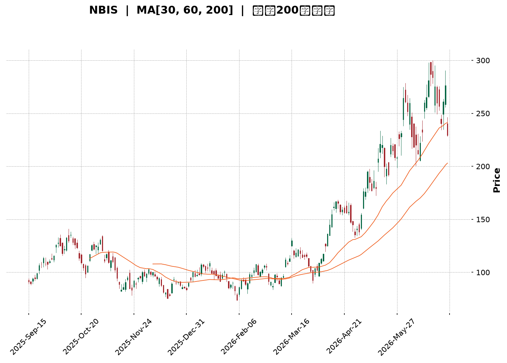
</details>

<html>
<head><meta charset="utf-8" /></head>
<body>
    <div style="height:500px; width:100%;">                        <script>window.PlotlyConfig = {MathJaxConfig: 'local'};</script>
        <script charset="utf-8" src="https://cdn.plot.ly/plotly-3.6.0.min.js" integrity="sha256-QaOVwtVY0T02VaHrr6pnoHLCwayMJp4O5n4YyaE3rJk=" crossorigin="anonymous"></script>                <div id="candlestick-chart" class="plotly-graph-div" style="height:100%; width:100%;"></div>            <script>                window.PLOTLYENV=window.PLOTLYENV || {};                                if (document.getElementById("candlestick-chart")) {                    Plotly.newPlot(                        "candlestick-chart",                        [{"close":{"dtype":"f8","bdata":"AAAAoHC9VkAAAAAghVtWQAAAAMAehVdAAAAAIK6HV0AAAAAA19NYQAAAAGBmplpAAAAAQDPzWkAAAABguE5cQAAAAAAp\u002fFpAAAAAwMzsWkAAAACAFI5bQAAAAKBHEVxAAAAAQArnXEAAAAAgrndfQAAAAGC4\u002fl9AAAAAACk8X0AAAADAzGxdQAAAAAAAgF5AAAAA4HqUYEAAAABgjzJgQAAAAGC47mBAAAAAwMwEYEAAAADAHnVfQAAAAGCPwl5AAAAAAClcXEAAAAAAAEBbQAAAAIDrEVpAAAAAIK6nWEAAAACAPYpaQAAAAOCjUF1AAAAAIIVbX0AAAADAHnVeQAAAAGBmRl9AAAAAIIULX0AAAACAPVpgQAAAAIAUHl5AAAAAYI+iW0AAAAAAAEBdQAAAAAApXFtAAAAAgOvRW0AAAADAzHxbQAAAAIAUjllAAAAAQAqXV0AAAADgUShWQAAAAGCP4lRAAAAAYLh+VUAAAABgj6JWQAAAAOB6xFdAAAAAwPUoVUAAAADgo9BUQAAAAKCZ+VZAAAAA4FE4VkAAAAAAKaxXQAAAACCut1dAAAAAoJkJWUAAAADAzBxYQAAAAEDhulhAAAAAQDOzWUAAAABgj4JYQAAAAMAeFVlAAAAAgD0aWEAAAACAwmVXQAAAAIDrkVdAAAAAACnsVUAAAADA9UhUQAAAAMDMPFRAAAAAwMzcUkAAAACAwoVTQAAAAKBwXVZAAAAAYLhOV0AAAACA64FWQAAAAOBRyFZAAAAAgMLlVUAAAABgj4JVQAAAAEDhSlVAAAAAwB7tVEAAAADAzHxWQAAAAMAeNVdAAAAAIFwPWUAAAACgcA1YQAAAAEAzU1hAAAAAIIV7WEAAAADAHtVaQAAAACCFW1pAAAAAYLh+WUAAAADgo\u002fhZQAAAAGC4LltAAAAAYI\u002fSWEAAAAAgrrdYQAAAAGBmNlhAAAAAAACgV0AAAACgcN1WQAAAACCud1hAAAAAIIUbWUAAAACAPbpXQAAAAAApTFVAAAAAgD0KVkAAAADAzHxWQAAAAMD1mFRAAAAAIK53UkAAAABgZoZVQAAAAOBROFdAAAAAYI\u002fyVkAAAABACidWQAAAAGC4blZAAAAA4KOAWEAAAACgR2FYQAAAAEAzc1lAAAAAQArnWkAAAABA4XpYQAAAAEAKJ1lAAAAAwB6lWUAAAAAgrodaQAAAAOBROFpAAAAAACnMVkAAAADgo8BWQAAAAEAzs1VAAAAAgOtxWEAAAACgmelXQAAAAMAeVVZAAAAAACm8V0AAAAAghRtYQAAAACCu\u002f1tAAAAAYI8CW0AAAADAzDxcQAAAAEAzO2BAAAAAwB4VXUAAAAAA16NdQAAAAKBHYV5AAAAAIK5nXUAAAACgmYlcQAAAAIA9ulxAAAAAgMLFXEAAAACAFH5aQAAAAOB6NFlAAAAA4KMQV0AAAADgo\u002fBZQAAAAMDMfFlAAAAA4Ho0W0AAAABgjyJcQAAAAKCZWV1AAAAAAABAX0AAAABgjwphQAAAAEAKH2JAAAAAgOtRY0AAAACAFD5kQAAAAOCj2GRAAAAAQOGqZEAAAADgeqRjQAAAAMAe5WNAAAAAoJmRY0AAAADgeoRjQAAAAGCPomNAAAAAwB5lYkAAAABguB5iQAAAAOBR8GBAAAAAgBSmYUAAAAAgXEdhQAAAACCuT2NAAAAAoHANZkAAAACgcP1lQAAAAEDhYmhAAAAA4KMYZ0AAAACgmSFmQAAAAEAzQ2dAAAAAIIVjZkAAAADgo+hpQAAAAMDMpGtAAAAAgBR+a0AAAAAghftoQAAAACBct2hAAAAAgD36Z0AAAACAwn1rQAAAAOCj2GpAAAAAgOsBakAAAAAA1wtqQAAAAEDhSmxAAAAAQOHibEAAAAAAKYhwQAAAAKBHSXBAAAAAgMJ1b0AAAABguDpwQAAAAIDreWxAAAAAAABAa0AAAAAA14NrQAAAAIAUdmpAAAAAIK7Ha0AAAAAghQttQAAAAMAeQXBAAAAAoJmRcEAAAABgj45xQAAAAEAK63FAAAAAgMK5cUAAAAAAADRxQAAAAGCPOnBAAAAAgBQKcEAAAACgmQluQAAAAGBmUnBAAAAAYLhCcUAAAACAwqVsQA=="},"high":{"dtype":"f8","bdata":"AAAAQOGaV0AAAABAM9NWQAAAAAAAwFdAAAAAIIVrWEAAAABAM+NYQAAAAMAeJVtAAAAAYLh+W0AAAABgZrZcQAAAAMAehVxAAAAAIFx\u002fW0AAAACgRyFcQAAAAKCZaV1AAAAA4FH4XEAAAAAgXK9fQAAAAABUn2BAAAAA4FH4YEAAAADA9QhgQAAAAADXU19AAAAAgD2qYEAAAABAM6NhQAAAAMD1UGFAAAAAgBa5YEAAAAAgrn9gQAAAAEAKX2BAAAAAAKwkXkAAAACAFF5dQAAAACCFC1tAAAAAQDPzWkAAAAAgrqdaQAAAAMDMXF1AAAAAAACgX0AAAADA9SBgQAAAAMDMfF9AAAAAgBQOYEAAAADAzIRgQAAAAIDC3WBAAAAAgOsxXUAAAACgcI1dQAAAAAAAQF5AAAAAQDPTW0AAAAAgrpddQAAAAADXo1xAAAAAoJlpWkAAAABguN5WQAAAAAAAQFZAAAAAoJlpVkAAAAAAKWxXQAAAAIAULlhAAAAAACmsWUAAAAAgXC9WQAAAAAAAQFdAAAAAgOvRVkAAAACAk+hXQAAAAMAeRVhAAAAAYGZmWUAAAADAzLxZQAAAAADXw1hAAAAAgML1WUAAAABgZlZZQAAAAAAAIFlAAAAAIIM4WUAAAACAwkVYQAAAAMDM3FdAAAAAoJnpV0AAAAAgXA9WQAAAAADXY1RAAAAAQDMTVUAAAABgZhZUQAAAAGCPolZAAAAAoJn5V0AAAACAFD5XQAAAAEDh2lZAAAAAIK7nVkAAAABACidWQAAAAKBwvVVAAAAAgBSeVUAAAADgo7BWQAAAAAAp3FdAAAAAIIUrWUAAAABgZpZZQAAAAGCPollAAAAAgBQ+WkAAAAAghStbQAAAAMDM\u002fFpAAAAAwMysWkAAAADgUQhbQAAAAAAAoFtAAAAAgBQeWkAAAACgmZlZQAAAAGC4\u002fllAAAAA4KO4WEAAAADgUThZQAAAAGCP4lhAAAAAYGZ2WUAAAAAAANBYQAAAAGCPAldAAAAAAABQVkAAAADA9dhWQAAAAGCP6lVAAAAA4Ho0VEAAAACAPapVQAAAACCFa1dAAAAAAFTjV0AAAAAAALBXQAAAAOCjsFZAAAAA4HoUWUAAAABgj9JYQAAAAKCZGVpAAAAAYLj+WkAAAADgehRbQAAAAKBuSllAAAAAAADwWUAAAAAAKdxaQAAAAOB6FFtAAAAAQDPTWEAAAACgxNhWQAAAACCud1ZAAAAAYLieWEAAAAAAANBYQAAAAMDMvFdAAAAAwMzMV0AAAACgmZlYQAAAAMAehVxAAAAAYI\u002fCW0AAAADgeiRdQAAAAKCZiWBAAAAAAABgXkAAAABAibFeQAAAAEAzc15AAAAAAFbuXkAAAAAA11NeQAAAAEAzc11AAAAAQDOzXUAAAABAM1NcQAAAAOCjkFpAAAAAIFyPWUAAAADA9fhZQAAAACCu91pAAAAAoHA9W0AAAACAwnVcQAAAAKCZeV1AAAAAAADwX0AAAACgmRFhQAAAAIA9umJAAAAAAADwY0AAAABAM8NkQAAAAIDr2WRAAAAAYLgWZUAAAACA64FkQAAAAAAAOGRAAAAAAABoZEAAAACAwu1kQAAAAIDruWRAAAAAAACoZEAAAACgmZliQAAAAGC4rmFAAAAAYGb2YUAAAAAgXF9iQAAAAAAAgGNAAAAAwMxsZkAAAABguH5mQAAAACCuf2hAAAAA4Hq8aEAAAAAAAIhnQAAAAICXjmhAAAAAIIUzZ0AAAABA4SprQAAAACBcN21AAAAAoEeZbEAAAACAPUJrQAAAAIDrWWlAAAAAAACIaUAAAACA61lsQAAAAKBwvWtAAAAA4FGga0AAAADgejRqQAAAAOB6HG1AAAAAQDMzbUAAAACgxCxxQAAAAKBwbXFAAAAAIFy3cEAAAAAghYdwQAAAAAAAWG9AAAAAwMwMbkAAAADA9bRtQAAAACCu32xAAAAAIK6PbEAAAABA4XJuQAAAAOBRbnBAAAAAIIVVcUAAAABA4Z5yQAAAAMDMrHJAAAAAgMK9ckAAAAAgrnNyQAAAAKBuQnFAAAAA4FE4cUAAAACgmRlvQAAAAMDMfHBAAAAAoJkpckAAAAAgrs9uQA=="},"hovertemplate":"\u003cb\u003e%{x|%Y-%m-%d}\u003c\u002fb\u003e\u003cbr\u003e\u958b: $%{open:.2f}\u003cbr\u003e\u9ad8: $%{high:.2f}\u003cbr\u003e\u4f4e: $%{low:.2f}\u003cbr\u003e\u6536: $%{close:.2f}\u003cextra\u003e\u003c\u002fextra\u003e","low":{"dtype":"f8","bdata":"AAAAgMI1VkAAAACgRwFWQAAAAMAeNVZAAAAAgOsBV0AAAAAAAFBXQAAAAKBHoVhAAAAAAAAQWkAAAABgZjZaQAAAAOBReFpAAAAAQDOzWUAAAADAHhVbQAAAAIA96ltAAAAA4KNwW0AAAADgeqRdQAAAAGBm5l5AAAAAIIU7X0AAAACAFO5cQAAAAAAAYF1AAAAAIK73XUAAAADgUQBgQAAAAMDMlGBAAAAAAABwX0AAAADAzIxeQAAAAKBHgV5AAAAA4FG4W0AAAADgo+BaQAAAAKCZWVlAAAAA4FGoV0AAAACgcN1YQAAAAOCjgFtAAAAAQAoHXkAAAACA6zFeQAAAAAAAYF1AAAAA4KNwXUAAAABAM5NfQAAAAAAA8F1AAAAAAABAW0AAAAAghdtbQAAAAIA9GltAAAAA4KNQWUAAAACAFC5bQAAAAMAe9VhAAAAAoHDtVkAAAAAAACBVQAAAAAAAgFRAAAAAgMLlVEAAAACgcG1UQAAAAEAz81ZAAAAAoHANVUAAAACgcI1TQAAAAKCZSVVAAAAA4CQuVUAAAADgo7BWQAAAAAApXFdAAAAA4KNAVkAAAAAA1wNYQAAAAAAAwFZAAAAAgBReWEAAAADAzAxYQAAAAEAz01dAAAAAYGYGWEAAAADAzAxXQAAAAMDMrFVAAAAAwMyMVUAAAACgGARUQAAAAOBROFNAAAAAAADQUkAAAADgo0BTQAAAAIA9ClRAAAAAYGbGVkAAAAAA1xNWQAAAAKCZKVZAAAAAIFyvVUAAAABgjxJVQAAAAADXI1VAAAAAoJm5VEAAAADgo4BVQAAAAMD1uFZAAAAAACm8VkAAAAAA1+NXQAAAACBYAVhAAAAAYGZGWEAAAABAMyNYQAAAAEDh+llAAAAAIIPYWEAAAABgZkZZQAAAAKBwLVlAAAAAgMKVWEAAAABgZkZXQAAAAAAAIFhAAAAAgOthV0AAAABACtdWQAAAAIDrYVdAAAAAACkcWEAAAACAPcpWQAAAACCuB1VAAAAAgBQOVUAAAAAAADBVQAAAAAApnFNAAAAAoEdhUkAAAAAgrkdTQAAAAADX81RAAAAAgD3qVkAAAADA9chVQAAAAAAp7FNAAAAAQAo3VkAAAAAAAGBXQAAAACDZNlhAAAAAIIUbWUAAAACA60FYQAAAAEAz01dAAAAAQN9vWEAAAABAM7NZQAAAAAAAgFlAAAAAoJkZVkAAAABAM7NVQAAAAIDr4VRAAAAAoJmJVkAAAAAgrudWQAAAAEAzM1ZAAAAAAACgVUAAAAAAAMBXQAAAACBcH1pAAAAAoEehWkAAAADA9YhbQAAAAGASG19AAAAAQApHXEAAAAAAAIBcQAAAAKBHsVxAAAAAgJMoXEAAAABAM2NcQAAAAOCjAFxAAAAAwB5VXEAAAACAPVpaQAAAAKBHEVlAAAAAwMppVkAAAABguO5XQAAAAGBmVllAAAAAACkMWEAAAADAzNxaQAAAAIDrkVtAAAAAYGbWXUAAAABAMyNfQAAAAOBR3GBAAAAAoJnJYUAAAADgo9BjQAAAAAAAkGNAAAAAQOECZEAAAAAgXFdjQAAAAKBHQWNAAAAAwMxsY0AAAABAM2tjQAAAAIA9QmNAAAAAgOs5YkAAAACA61FhQAAAAGBmlmBAAAAAQArHYEAAAAAAAOBgQAAAAAAAgGFAAAAAYGb2Y0AAAABguBZlQAAAACCF42VAAAAAAAAgZkAAAAAAABBmQAAAAKCZUWZAAAAAAACIZUAAAAAAAGBoQAAAAAAA+GlAAAAAoJl5akAAAABgj8JnQAAAAAAA4GZAAAAA4HrUZ0AAAACgmRlqQAAAACBcV2pAAAAAwB61aUAAAACA68loQAAAAOBRYGtAAAAAwMxMakAAAAAAAMBtQAAAAAAAPHBAAAAA4FHwbkAAAACAFFZtQAAAAIAUFmtAAAAAYGY2a0AAAACgmQlpQAAAAADXa2pAAAAAAACgaUAAAAAAAPBrQAAAACCup25AAAAAwMysb0AAAADgo4RwQAAAAEAzOXFAAAAAAABgcUAAAAAAAGBvQAAAAGC4Jm9AAAAAgOuRb0AAAADAzExtQAAAAAAAUG1AAAAAoJn5b0AAAACgcIVsQA=="},"name":"\u50f9\u683c","open":{"dtype":"f8","bdata":"AAAAQAonV0AAAADAzMxWQAAAAEDh6lZAAAAAwMzEV0AAAADA9YhXQAAAAMDMfFlAAAAAYI8CW0AAAADgo0hbQAAAACCFA1tAAAAAIIV7W0AAAADgUVhbQAAAAOB6XFxAAAAAgMLtW0AAAACgR\u002fFeQAAAAEAKz19AAAAAwMyMYEAAAADAzPRfQAAAAMDMTF5AAAAAYLg+XkAAAABgZt5gQAAAAGC45mBAAAAAAACAYEAAAADAzHxgQAAAAEDhAmBAAAAAANeDXUAAAABgjzJdQAAAAOBR+FpAAAAAQDOrWkAAAADAHhVZQAAAAIA9yltAAAAAgD06XkAAAAAA15tfQAAAAIDrEV9AAAAAwMxMXkAAAADA9ahfQAAAAAAAwGBAAAAAYLgWXEAAAADA9WhcQAAAAEAz411AAAAAAAAgWkAAAAAghctcQAAAAOBRiFxAAAAAwMwMWkAAAADA9bhWQAAAAEAKl1RAAAAA4Hr0VEAAAACA6\u002fFUQAAAAOBRQFdAAAAAIIXbWEAAAABAM2NVQAAAAGC4jlVAAAAAYI9SVkAAAABgZnZXQAAAAEAzI1hAAAAAwMzcVkAAAABAChdZQAAAAKBHwVdAAAAA4HrEWEAAAACAwhVZQAAAAGCPUlhAAAAAgMKFWEAAAABguO5XQAAAAMDMTFZAAAAAANdTV0AAAABgZgZWQAAAAMDM5FNAAAAAgMIFVUAAAABAM8NTQAAAAKCZKVRAAAAAgBQ+V0AAAAAA15NWQAAAAGC4jlZAAAAA4KPgVkAAAADAzBxVQAAAAAAAmFVAAAAAIK5XVUAAAABACr9VQAAAAAAAwFdAAAAAgMLtV0AAAADgo8BYQAAAAGCPMlhAAAAAoEe5WEAAAADgepRYQAAAAMAe1VpAAAAAgOtxWkAAAAAghSNaQAAAACCuf1pAAAAAwB51WUAAAACAwkVZQAAAAOCjgFlAAAAAwMwsWEAAAACgcG1YQAAAAGBmlldAAAAAAAAAWUAAAABACpdYQAAAAKBD41ZAAAAAANdzVUAAAAAghXtWQAAAAAAAwFVAAAAAwPXIU0AAAABgZs5TQAAAAMDMHFVAAAAAYI86V0AAAABgjzpXQAAAAGBmBlVAAAAAQAp3VkAAAAAAAABYQAAAAGC47lhAAAAAIIUbWUAAAAAA06VaQAAAACCFE1hAAAAAIFzXWEAAAAAgXD9aQAAAAAAAgFpAAAAAwMysWEAAAAAAAABWQAAAAKCZiVVAAAAAoJmZVkAAAAAAADBYQAAAAEAzE1dAAAAAQArXVUAAAADA9chXQAAAAIA9SlpAAAAAgMJFW0AAAAAAKZxbQAAAAAAAMF9AAAAAgMIVXkAAAABAM7NcQAAAAOBR0FxAAAAAYGYeXkAAAACgcC1dQAAAAEAzC11AAAAAIK43XUAAAADgUVBcQAAAAMAedVpAAAAAIFyPWUAAAABguH5YQAAAAOB6fFpAAAAAgD0aWEAAAACAPSpbQAAAAAAAqFtAAAAA4FG4X0AAAAAAAEBfQAAAAOBR3GBAAAAAYGbWYUAAAABAMyNkQAAAAGA7B2RAAAAAAADgZEAAAADA9XhkQAAAAAAAoGNAAAAAQAonZEAAAAAghVtkQAAAAMDMfGNAAAAAoHB1ZEAAAADgeoxiQAAAAMDMTGFAAAAAQAqDYUAAAACA6yViQAAAAGCPqmFAAAAA4FEMZEAAAADAzHRlQAAAAEAKc2ZAAAAA4FHAZ0AAAABgZvZmQAAAAMDMfGZAAAAAoHCNZkAAAABACntpQAAAAAAArGpAAAAAIIUza0AAAABACi9rQAAAAAAA4GdAAAAAQAp\u002faUAAAAAgrndqQAAAAOBRaGtAAAAAoJmVa0AAAADAHvlpQAAAAAApzGxAAAAAIIV7bEAAAABA4YJuQAAAAKCZAXFAAAAAoHBDcEAAAAAgrvdtQAAAACCF225AAAAAwMwMbkAAAAAAAMBsQAAAAKDG72pAAAAA4HqsaUAAAADAzFRtQAAAAGC4fm9AAAAAQArvb0AAAABgZppwQAAAAEAzo3JAAAAAIFwfckAAAAAAABxwQAAAAKCZMXFAAAAAwB4JcUAAAABAM5tuQAAAAAAALG9AAAAAACkkcEAAAACgxAhuQA=="},"x":["2025-09-15T00:00:00-04:00","2025-09-16T00:00:00-04:00","2025-09-17T00:00:00-04:00","2025-09-18T00:00:00-04:00","2025-09-19T00:00:00-04:00","2025-09-22T00:00:00-04:00","2025-09-23T00:00:00-04:00","2025-09-24T00:00:00-04:00","2025-09-25T00:00:00-04:00","2025-09-26T00:00:00-04:00","2025-09-29T00:00:00-04:00","2025-09-30T00:00:00-04:00","2025-10-01T00:00:00-04:00","2025-10-02T00:00:00-04:00","2025-10-03T00:00:00-04:00","2025-10-06T00:00:00-04:00","2025-10-07T00:00:00-04:00","2025-10-08T00:00:00-04:00","2025-10-09T00:00:00-04:00","2025-10-10T00:00:00-04:00","2025-10-13T00:00:00-04:00","2025-10-14T00:00:00-04:00","2025-10-15T00:00:00-04:00","2025-10-16T00:00:00-04:00","2025-10-17T00:00:00-04:00","2025-10-20T00:00:00-04:00","2025-10-21T00:00:00-04:00","2025-10-22T00:00:00-04:00","2025-10-23T00:00:00-04:00","2025-10-24T00:00:00-04:00","2025-10-27T00:00:00-04:00","2025-10-28T00:00:00-04:00","2025-10-29T00:00:00-04:00","2025-10-30T00:00:00-04:00","2025-10-31T00:00:00-04:00","2025-11-03T00:00:00-05:00","2025-11-04T00:00:00-05:00","2025-11-05T00:00:00-05:00","2025-11-06T00:00:00-05:00","2025-11-07T00:00:00-05:00","2025-11-10T00:00:00-05:00","2025-11-11T00:00:00-05:00","2025-11-12T00:00:00-05:00","2025-11-13T00:00:00-05:00","2025-11-14T00:00:00-05:00","2025-11-17T00:00:00-05:00","2025-11-18T00:00:00-05:00","2025-11-19T00:00:00-05:00","2025-11-20T00:00:00-05:00","2025-11-21T00:00:00-05:00","2025-11-24T00:00:00-05:00","2025-11-25T00:00:00-05:00","2025-11-26T00:00:00-05:00","2025-11-28T00:00:00-05:00","2025-12-01T00:00:00-05:00","2025-12-02T00:00:00-05:00","2025-12-03T00:00:00-05:00","2025-12-04T00:00:00-05:00","2025-12-05T00:00:00-05:00","2025-12-08T00:00:00-05:00","2025-12-09T00:00:00-05:00","2025-12-10T00:00:00-05:00","2025-12-11T00:00:00-05:00","2025-12-12T00:00:00-05:00","2025-12-15T00:00:00-05:00","2025-12-16T00:00:00-05:00","2025-12-17T00:00:00-05:00","2025-12-18T00:00:00-05:00","2025-12-19T00:00:00-05:00","2025-12-22T00:00:00-05:00","2025-12-23T00:00:00-05:00","2025-12-24T00:00:00-05:00","2025-12-26T00:00:00-05:00","2025-12-29T00:00:00-05:00","2025-12-30T00:00:00-05:00","2025-12-31T00:00:00-05:00","2026-01-02T00:00:00-05:00","2026-01-05T00:00:00-05:00","2026-01-06T00:00:00-05:00","2026-01-07T00:00:00-05:00","2026-01-08T00:00:00-05:00","2026-01-09T00:00:00-05:00","2026-01-12T00:00:00-05:00","2026-01-13T00:00:00-05:00","2026-01-14T00:00:00-05:00","2026-01-15T00:00:00-05:00","2026-01-16T00:00:00-05:00","2026-01-20T00:00:00-05:00","2026-01-21T00:00:00-05:00","2026-01-22T00:00:00-05:00","2026-01-23T00:00:00-05:00","2026-01-26T00:00:00-05:00","2026-01-27T00:00:00-05:00","2026-01-28T00:00:00-05:00","2026-01-29T00:00:00-05:00","2026-01-30T00:00:00-05:00","2026-02-02T00:00:00-05:00","2026-02-03T00:00:00-05:00","2026-02-04T00:00:00-05:00","2026-02-05T00:00:00-05:00","2026-02-06T00:00:00-05:00","2026-02-09T00:00:00-05:00","2026-02-10T00:00:00-05:00","2026-02-11T00:00:00-05:00","2026-02-12T00:00:00-05:00","2026-02-13T00:00:00-05:00","2026-02-17T00:00:00-05:00","2026-02-18T00:00:00-05:00","2026-02-19T00:00:00-05:00","2026-02-20T00:00:00-05:00","2026-02-23T00:00:00-05:00","2026-02-24T00:00:00-05:00","2026-02-25T00:00:00-05:00","2026-02-26T00:00:00-05:00","2026-02-27T00:00:00-05:00","2026-03-02T00:00:00-05:00","2026-03-03T00:00:00-05:00","2026-03-04T00:00:00-05:00","2026-03-05T00:00:00-05:00","2026-03-06T00:00:00-05:00","2026-03-09T00:00:00-04:00","2026-03-10T00:00:00-04:00","2026-03-11T00:00:00-04:00","2026-03-12T00:00:00-04:00","2026-03-13T00:00:00-04:00","2026-03-16T00:00:00-04:00","2026-03-17T00:00:00-04:00","2026-03-18T00:00:00-04:00","2026-03-19T00:00:00-04:00","2026-03-20T00:00:00-04:00","2026-03-23T00:00:00-04:00","2026-03-24T00:00:00-04:00","2026-03-25T00:00:00-04:00","2026-03-26T00:00:00-04:00","2026-03-27T00:00:00-04:00","2026-03-30T00:00:00-04:00","2026-03-31T00:00:00-04:00","2026-04-01T00:00:00-04:00","2026-04-02T00:00:00-04:00","2026-04-06T00:00:00-04:00","2026-04-07T00:00:00-04:00","2026-04-08T00:00:00-04:00","2026-04-09T00:00:00-04:00","2026-04-10T00:00:00-04:00","2026-04-13T00:00:00-04:00","2026-04-14T00:00:00-04:00","2026-04-15T00:00:00-04:00","2026-04-16T00:00:00-04:00","2026-04-17T00:00:00-04:00","2026-04-20T00:00:00-04:00","2026-04-21T00:00:00-04:00","2026-04-22T00:00:00-04:00","2026-04-23T00:00:00-04:00","2026-04-24T00:00:00-04:00","2026-04-27T00:00:00-04:00","2026-04-28T00:00:00-04:00","2026-04-29T00:00:00-04:00","2026-04-30T00:00:00-04:00","2026-05-01T00:00:00-04:00","2026-05-04T00:00:00-04:00","2026-05-05T00:00:00-04:00","2026-05-06T00:00:00-04:00","2026-05-07T00:00:00-04:00","2026-05-08T00:00:00-04:00","2026-05-11T00:00:00-04:00","2026-05-12T00:00:00-04:00","2026-05-13T00:00:00-04:00","2026-05-14T00:00:00-04:00","2026-05-15T00:00:00-04:00","2026-05-18T00:00:00-04:00","2026-05-19T00:00:00-04:00","2026-05-20T00:00:00-04:00","2026-05-21T00:00:00-04:00","2026-05-22T00:00:00-04:00","2026-05-26T00:00:00-04:00","2026-05-27T00:00:00-04:00","2026-05-28T00:00:00-04:00","2026-05-29T00:00:00-04:00","2026-06-01T00:00:00-04:00","2026-06-02T00:00:00-04:00","2026-06-03T00:00:00-04:00","2026-06-04T00:00:00-04:00","2026-06-05T00:00:00-04:00","2026-06-08T00:00:00-04:00","2026-06-09T00:00:00-04:00","2026-06-10T00:00:00-04:00","2026-06-11T00:00:00-04:00","2026-06-12T00:00:00-04:00","2026-06-15T00:00:00-04:00","2026-06-16T00:00:00-04:00","2026-06-17T00:00:00-04:00","2026-06-18T00:00:00-04:00","2026-06-22T00:00:00-04:00","2026-06-23T00:00:00-04:00","2026-06-24T00:00:00-04:00","2026-06-25T00:00:00-04:00","2026-06-26T00:00:00-04:00","2026-06-29T00:00:00-04:00","2026-06-30T00:00:00-04:00","2026-07-01T00:00:00-04:00"],"type":"candlestick"},{"hovertemplate":"MA30: $%{y:.2f}\u003cextra\u003e\u003c\u002fextra\u003e","line":{"color":"#2196F3","dash":"dash","width":2},"mode":"lines","name":"MA30","x":["2025-09-15T00:00:00-04:00","2025-09-16T00:00:00-04:00","2025-09-17T00:00:00-04:00","2025-09-18T00:00:00-04:00","2025-09-19T00:00:00-04:00","2025-09-22T00:00:00-04:00","2025-09-23T00:00:00-04:00","2025-09-24T00:00:00-04:00","2025-09-25T00:00:00-04:00","2025-09-26T00:00:00-04:00","2025-09-29T00:00:00-04:00","2025-09-30T00:00:00-04:00","2025-10-01T00:00:00-04:00","2025-10-02T00:00:00-04:00","2025-10-03T00:00:00-04:00","2025-10-06T00:00:00-04:00","2025-10-07T00:00:00-04:00","2025-10-08T00:00:00-04:00","2025-10-09T00:00:00-04:00","2025-10-10T00:00:00-04:00","2025-10-13T00:00:00-04:00","2025-10-14T00:00:00-04:00","2025-10-15T00:00:00-04:00","2025-10-16T00:00:00-04:00","2025-10-17T00:00:00-04:00","2025-10-20T00:00:00-04:00","2025-10-21T00:00:00-04:00","2025-10-22T00:00:00-04:00","2025-10-23T00:00:00-04:00","2025-10-24T00:00:00-04:00","2025-10-27T00:00:00-04:00","2025-10-28T00:00:00-04:00","2025-10-29T00:00:00-04:00","2025-10-30T00:00:00-04:00","2025-10-31T00:00:00-04:00","2025-11-03T00:00:00-05:00","2025-11-04T00:00:00-05:00","2025-11-05T00:00:00-05:00","2025-11-06T00:00:00-05:00","2025-11-07T00:00:00-05:00","2025-11-10T00:00:00-05:00","2025-11-11T00:00:00-05:00","2025-11-12T00:00:00-05:00","2025-11-13T00:00:00-05:00","2025-11-14T00:00:00-05:00","2025-11-17T00:00:00-05:00","2025-11-18T00:00:00-05:00","2025-11-19T00:00:00-05:00","2025-11-20T00:00:00-05:00","2025-11-21T00:00:00-05:00","2025-11-24T00:00:00-05:00","2025-11-25T00:00:00-05:00","2025-11-26T00:00:00-05:00","2025-11-28T00:00:00-05:00","2025-12-01T00:00:00-05:00","2025-12-02T00:00:00-05:00","2025-12-03T00:00:00-05:00","2025-12-04T00:00:00-05:00","2025-12-05T00:00:00-05:00","2025-12-08T00:00:00-05:00","2025-12-09T00:00:00-05:00","2025-12-10T00:00:00-05:00","2025-12-11T00:00:00-05:00","2025-12-12T00:00:00-05:00","2025-12-15T00:00:00-05:00","2025-12-16T00:00:00-05:00","2025-12-17T00:00:00-05:00","2025-12-18T00:00:00-05:00","2025-12-19T00:00:00-05:00","2025-12-22T00:00:00-05:00","2025-12-23T00:00:00-05:00","2025-12-24T00:00:00-05:00","2025-12-26T00:00:00-05:00","2025-12-29T00:00:00-05:00","2025-12-30T00:00:00-05:00","2025-12-31T00:00:00-05:00","2026-01-02T00:00:00-05:00","2026-01-05T00:00:00-05:00","2026-01-06T00:00:00-05:00","2026-01-07T00:00:00-05:00","2026-01-08T00:00:00-05:00","2026-01-09T00:00:00-05:00","2026-01-12T00:00:00-05:00","2026-01-13T00:00:00-05:00","2026-01-14T00:00:00-05:00","2026-01-15T00:00:00-05:00","2026-01-16T00:00:00-05:00","2026-01-20T00:00:00-05:00","2026-01-21T00:00:00-05:00","2026-01-22T00:00:00-05:00","2026-01-23T00:00:00-05:00","2026-01-26T00:00:00-05:00","2026-01-27T00:00:00-05:00","2026-01-28T00:00:00-05:00","2026-01-29T00:00:00-05:00","2026-01-30T00:00:00-05:00","2026-02-02T00:00:00-05:00","2026-02-03T00:00:00-05:00","2026-02-04T00:00:00-05:00","2026-02-05T00:00:00-05:00","2026-02-06T00:00:00-05:00","2026-02-09T00:00:00-05:00","2026-02-10T00:00:00-05:00","2026-02-11T00:00:00-05:00","2026-02-12T00:00:00-05:00","2026-02-13T00:00:00-05:00","2026-02-17T00:00:00-05:00","2026-02-18T00:00:00-05:00","2026-02-19T00:00:00-05:00","2026-02-20T00:00:00-05:00","2026-02-23T00:00:00-05:00","2026-02-24T00:00:00-05:00","2026-02-25T00:00:00-05:00","2026-02-26T00:00:00-05:00","2026-02-27T00:00:00-05:00","2026-03-02T00:00:00-05:00","2026-03-03T00:00:00-05:00","2026-03-04T00:00:00-05:00","2026-03-05T00:00:00-05:00","2026-03-06T00:00:00-05:00","2026-03-09T00:00:00-04:00","2026-03-10T00:00:00-04:00","2026-03-11T00:00:00-04:00","2026-03-12T00:00:00-04:00","2026-03-13T00:00:00-04:00","2026-03-16T00:00:00-04:00","2026-03-17T00:00:00-04:00","2026-03-18T00:00:00-04:00","2026-03-19T00:00:00-04:00","2026-03-20T00:00:00-04:00","2026-03-23T00:00:00-04:00","2026-03-24T00:00:00-04:00","2026-03-25T00:00:00-04:00","2026-03-26T00:00:00-04:00","2026-03-27T00:00:00-04:00","2026-03-30T00:00:00-04:00","2026-03-31T00:00:00-04:00","2026-04-01T00:00:00-04:00","2026-04-02T00:00:00-04:00","2026-04-06T00:00:00-04:00","2026-04-07T00:00:00-04:00","2026-04-08T00:00:00-04:00","2026-04-09T00:00:00-04:00","2026-04-10T00:00:00-04:00","2026-04-13T00:00:00-04:00","2026-04-14T00:00:00-04:00","2026-04-15T00:00:00-04:00","2026-04-16T00:00:00-04:00","2026-04-17T00:00:00-04:00","2026-04-20T00:00:00-04:00","2026-04-21T00:00:00-04:00","2026-04-22T00:00:00-04:00","2026-04-23T00:00:00-04:00","2026-04-24T00:00:00-04:00","2026-04-27T00:00:00-04:00","2026-04-28T00:00:00-04:00","2026-04-29T00:00:00-04:00","2026-04-30T00:00:00-04:00","2026-05-01T00:00:00-04:00","2026-05-04T00:00:00-04:00","2026-05-05T00:00:00-04:00","2026-05-06T00:00:00-04:00","2026-05-07T00:00:00-04:00","2026-05-08T00:00:00-04:00","2026-05-11T00:00:00-04:00","2026-05-12T00:00:00-04:00","2026-05-13T00:00:00-04:00","2026-05-14T00:00:00-04:00","2026-05-15T00:00:00-04:00","2026-05-18T00:00:00-04:00","2026-05-19T00:00:00-04:00","2026-05-20T00:00:00-04:00","2026-05-21T00:00:00-04:00","2026-05-22T00:00:00-04:00","2026-05-26T00:00:00-04:00","2026-05-27T00:00:00-04:00","2026-05-28T00:00:00-04:00","2026-05-29T00:00:00-04:00","2026-06-01T00:00:00-04:00","2026-06-02T00:00:00-04:00","2026-06-03T00:00:00-04:00","2026-06-04T00:00:00-04:00","2026-06-05T00:00:00-04:00","2026-06-08T00:00:00-04:00","2026-06-09T00:00:00-04:00","2026-06-10T00:00:00-04:00","2026-06-11T00:00:00-04:00","2026-06-12T00:00:00-04:00","2026-06-15T00:00:00-04:00","2026-06-16T00:00:00-04:00","2026-06-17T00:00:00-04:00","2026-06-18T00:00:00-04:00","2026-06-22T00:00:00-04:00","2026-06-23T00:00:00-04:00","2026-06-24T00:00:00-04:00","2026-06-25T00:00:00-04:00","2026-06-26T00:00:00-04:00","2026-06-29T00:00:00-04:00","2026-06-30T00:00:00-04:00","2026-07-01T00:00:00-04:00"],"y":{"dtype":"f8","bdata":"AAAAAAAA+H8AAAAAAAD4fwAAAAAAAPh\u002fAAAAAAAA+H8AAAAAAAD4fwAAAAAAAPh\u002fAAAAAAAA+H8AAAAAAAD4fwAAAAAAAPh\u002fAAAAAAAA+H8AAAAAAAD4fwAAAAAAAPh\u002fAAAAAAAA+H8AAAAAAAD4fwAAAAAAAPh\u002fAAAAAAAA+H8AAAAAAAD4fwAAAAAAAPh\u002fAAAAAAAA+H8AAAAAAAD4fwAAAAAAAPh\u002fAAAAAAAA+H8AAAAAAAD4fwAAAAAAAPh\u002fAAAAAAAA+H8AAAAAAAD4fwAAAAAAAPh\u002fAAAAAAAA+H8AAAAAAAD4f7y7u0uaQlxAMzMzgyOMXEC8u7s7QtFcQJqZmUlvE11A3t3dDZBTXUCJiIi4yJZdQHd3d5dftF1A7+7u\u002fje6XUCrqqrqQsJdQN7d3R12xV1AZmZmRhnNXUARERHRhcxdQN7d3S0Vt11AiYiI2L+JXUBmZmbWTTpdQLy7u6t\u002f21xAERERUWKIXEBmZmZWcU5cQHd3d\u002ff9FFxAERERkZeuW0C8u7urxktbQJqZmRnZ7lpAIiIichKbWkCrqqrao1haQHd3d0eLHFpAq6qqKjEAWkARERExa+VZQKuqqur72VlAERERwebiWUBmZmYmlNFZQM3MzBx2rVlAMzMzU41vWUBERESETjNZQAAAALCO8VhAiYiISLajWEAAAABgujlYQO\u002fu7i5r5VdAzczMXI+aV0AAAABQjUdXQBEREZHtHFdAzczM3Gv2VkAzMzPj7MtWQEREREREtFZAERER8dKlVkBVVVV1TKBWQHd3d6fGo1ZAMzMzM+yeVkCrqqr6qZ1WQERERKTimFZAIiIiUiq6VkDv7u6+ytVWQN7d3d1P4VZAAAAAYJ70VkAAAACAlQ9XQKuqqqocJldAd3d3FwQqV0CJiIiY4DlXQKuqqirOTldAzczMPFFHV0B3d3eHFklXQLy7u\u002fupQVdA3t3d3ZY9V0CrqqqaCzlXQJqZmTm0QFdAZmZm9uFbV0CJiIg4QnlXQERERNRNgldAAAAAMGudV0BERERUuLZXQKuqqiqjp1dAZmZmBlZ+V0CJiIi483VXQERERHSveVdAd3d3N6WCV0B3d3fHIIhXQGZmZibbkVdAZmZmll+wV0ARERHRhcBXQCIiIqKo01dAMzMzo2HjV0BmZmaGB+dXQJqZmTkX7ldA7+7uvgL4V0DNzMzsbfVXQM3MzIxB9FdAVVVVxTzdV0De3d1NxcFXQJqZmZn8kldAAAAA8MOPV0AzMzNj5YhXQHd3d3faeFdARERExMp5V0DNzMwMZYRXQO\u002fu7i6HoldAIiIiQsOyV0AAAACAP9lXQBEREdGFOFhAREREZJ50WEBEREREp7FYQGZmZnYhBVlAvLu7y3ZiWUBmZmbWTZ5ZQImIiChNzVlAAAAAEAL\u002fWUAAAADwCiRaQN7d3Y2zO1pAmpmZSW8vWkCamZkpvzxaQERERBQRPVpAZmZm5qU\u002fWkDv7u5e1l5aQDMzM\u002fOnglpAIiIiQnyyWkAiIiLy7vJaQO\u002fu7m51SFtAZmZm5qXPW0AzMzMj92ZcQLy7u2uREV1AAAAAMLKhXUDNzMzs3yReQKuqqmrYuV5AERERsUc9X0AAAABQqbxfQN7d3d1rDmBAREREPCY4YEAiIiIaS1pgQAAAAKhUYGBAAAAAGNl6YECJiIhQ1I9gQDMzM1P\u002fsmBAzczMpLfxYECJiIj4mjNhQERERHQhiWFA3t3dvXTTYUAiIiJSRh9iQKuqqnI9emJAmpmZSeHWYkAzMzNrSkVjQO\u002fu7vZvxGNAIiIiIvc6ZECJiIhQG5hkQCIiIsLK7WRAMzMzExE1ZUAiIiJyPY5lQAAAAICx2GVAERERkcIRZkDNzMwMSUNmQBEREaHTgmZAMzMzw\u002fXIZkDv7u7ufDtnQJqZmVmrp2dA3t3dLSQNaEBmZmbGkntoQHd3d8cEx2hAIiIi0pQSaUAiIiKCwGJpQKuqqroCtGlAiYiIyHYKakDNzMyM3m5qQN7d3e1832pAvLu7exQ+a0ARERHBEa5rQJqZmanGD2xAERERkTR5bEBmZma28+FsQO\u002fu7n5qMG1AAAAAoBqDbUBEREQEVqZtQO\u002fu7q4A0W1AmpmZOfsMbkCamZmJQSxuQA=="},"type":"scatter"},{"hovertemplate":"MA60: $%{y:.2f}\u003cextra\u003e\u003c\u002fextra\u003e","line":{"color":"#9C27B0","dash":"dash","width":2},"mode":"lines","name":"MA60","x":["2025-09-15T00:00:00-04:00","2025-09-16T00:00:00-04:00","2025-09-17T00:00:00-04:00","2025-09-18T00:00:00-04:00","2025-09-19T00:00:00-04:00","2025-09-22T00:00:00-04:00","2025-09-23T00:00:00-04:00","2025-09-24T00:00:00-04:00","2025-09-25T00:00:00-04:00","2025-09-26T00:00:00-04:00","2025-09-29T00:00:00-04:00","2025-09-30T00:00:00-04:00","2025-10-01T00:00:00-04:00","2025-10-02T00:00:00-04:00","2025-10-03T00:00:00-04:00","2025-10-06T00:00:00-04:00","2025-10-07T00:00:00-04:00","2025-10-08T00:00:00-04:00","2025-10-09T00:00:00-04:00","2025-10-10T00:00:00-04:00","2025-10-13T00:00:00-04:00","2025-10-14T00:00:00-04:00","2025-10-15T00:00:00-04:00","2025-10-16T00:00:00-04:00","2025-10-17T00:00:00-04:00","2025-10-20T00:00:00-04:00","2025-10-21T00:00:00-04:00","2025-10-22T00:00:00-04:00","2025-10-23T00:00:00-04:00","2025-10-24T00:00:00-04:00","2025-10-27T00:00:00-04:00","2025-10-28T00:00:00-04:00","2025-10-29T00:00:00-04:00","2025-10-30T00:00:00-04:00","2025-10-31T00:00:00-04:00","2025-11-03T00:00:00-05:00","2025-11-04T00:00:00-05:00","2025-11-05T00:00:00-05:00","2025-11-06T00:00:00-05:00","2025-11-07T00:00:00-05:00","2025-11-10T00:00:00-05:00","2025-11-11T00:00:00-05:00","2025-11-12T00:00:00-05:00","2025-11-13T00:00:00-05:00","2025-11-14T00:00:00-05:00","2025-11-17T00:00:00-05:00","2025-11-18T00:00:00-05:00","2025-11-19T00:00:00-05:00","2025-11-20T00:00:00-05:00","2025-11-21T00:00:00-05:00","2025-11-24T00:00:00-05:00","2025-11-25T00:00:00-05:00","2025-11-26T00:00:00-05:00","2025-11-28T00:00:00-05:00","2025-12-01T00:00:00-05:00","2025-12-02T00:00:00-05:00","2025-12-03T00:00:00-05:00","2025-12-04T00:00:00-05:00","2025-12-05T00:00:00-05:00","2025-12-08T00:00:00-05:00","2025-12-09T00:00:00-05:00","2025-12-10T00:00:00-05:00","2025-12-11T00:00:00-05:00","2025-12-12T00:00:00-05:00","2025-12-15T00:00:00-05:00","2025-12-16T00:00:00-05:00","2025-12-17T00:00:00-05:00","2025-12-18T00:00:00-05:00","2025-12-19T00:00:00-05:00","2025-12-22T00:00:00-05:00","2025-12-23T00:00:00-05:00","2025-12-24T00:00:00-05:00","2025-12-26T00:00:00-05:00","2025-12-29T00:00:00-05:00","2025-12-30T00:00:00-05:00","2025-12-31T00:00:00-05:00","2026-01-02T00:00:00-05:00","2026-01-05T00:00:00-05:00","2026-01-06T00:00:00-05:00","2026-01-07T00:00:00-05:00","2026-01-08T00:00:00-05:00","2026-01-09T00:00:00-05:00","2026-01-12T00:00:00-05:00","2026-01-13T00:00:00-05:00","2026-01-14T00:00:00-05:00","2026-01-15T00:00:00-05:00","2026-01-16T00:00:00-05:00","2026-01-20T00:00:00-05:00","2026-01-21T00:00:00-05:00","2026-01-22T00:00:00-05:00","2026-01-23T00:00:00-05:00","2026-01-26T00:00:00-05:00","2026-01-27T00:00:00-05:00","2026-01-28T00:00:00-05:00","2026-01-29T00:00:00-05:00","2026-01-30T00:00:00-05:00","2026-02-02T00:00:00-05:00","2026-02-03T00:00:00-05:00","2026-02-04T00:00:00-05:00","2026-02-05T00:00:00-05:00","2026-02-06T00:00:00-05:00","2026-02-09T00:00:00-05:00","2026-02-10T00:00:00-05:00","2026-02-11T00:00:00-05:00","2026-02-12T00:00:00-05:00","2026-02-13T00:00:00-05:00","2026-02-17T00:00:00-05:00","2026-02-18T00:00:00-05:00","2026-02-19T00:00:00-05:00","2026-02-20T00:00:00-05:00","2026-02-23T00:00:00-05:00","2026-02-24T00:00:00-05:00","2026-02-25T00:00:00-05:00","2026-02-26T00:00:00-05:00","2026-02-27T00:00:00-05:00","2026-03-02T00:00:00-05:00","2026-03-03T00:00:00-05:00","2026-03-04T00:00:00-05:00","2026-03-05T00:00:00-05:00","2026-03-06T00:00:00-05:00","2026-03-09T00:00:00-04:00","2026-03-10T00:00:00-04:00","2026-03-11T00:00:00-04:00","2026-03-12T00:00:00-04:00","2026-03-13T00:00:00-04:00","2026-03-16T00:00:00-04:00","2026-03-17T00:00:00-04:00","2026-03-18T00:00:00-04:00","2026-03-19T00:00:00-04:00","2026-03-20T00:00:00-04:00","2026-03-23T00:00:00-04:00","2026-03-24T00:00:00-04:00","2026-03-25T00:00:00-04:00","2026-03-26T00:00:00-04:00","2026-03-27T00:00:00-04:00","2026-03-30T00:00:00-04:00","2026-03-31T00:00:00-04:00","2026-04-01T00:00:00-04:00","2026-04-02T00:00:00-04:00","2026-04-06T00:00:00-04:00","2026-04-07T00:00:00-04:00","2026-04-08T00:00:00-04:00","2026-04-09T00:00:00-04:00","2026-04-10T00:00:00-04:00","2026-04-13T00:00:00-04:00","2026-04-14T00:00:00-04:00","2026-04-15T00:00:00-04:00","2026-04-16T00:00:00-04:00","2026-04-17T00:00:00-04:00","2026-04-20T00:00:00-04:00","2026-04-21T00:00:00-04:00","2026-04-22T00:00:00-04:00","2026-04-23T00:00:00-04:00","2026-04-24T00:00:00-04:00","2026-04-27T00:00:00-04:00","2026-04-28T00:00:00-04:00","2026-04-29T00:00:00-04:00","2026-04-30T00:00:00-04:00","2026-05-01T00:00:00-04:00","2026-05-04T00:00:00-04:00","2026-05-05T00:00:00-04:00","2026-05-06T00:00:00-04:00","2026-05-07T00:00:00-04:00","2026-05-08T00:00:00-04:00","2026-05-11T00:00:00-04:00","2026-05-12T00:00:00-04:00","2026-05-13T00:00:00-04:00","2026-05-14T00:00:00-04:00","2026-05-15T00:00:00-04:00","2026-05-18T00:00:00-04:00","2026-05-19T00:00:00-04:00","2026-05-20T00:00:00-04:00","2026-05-21T00:00:00-04:00","2026-05-22T00:00:00-04:00","2026-05-26T00:00:00-04:00","2026-05-27T00:00:00-04:00","2026-05-28T00:00:00-04:00","2026-05-29T00:00:00-04:00","2026-06-01T00:00:00-04:00","2026-06-02T00:00:00-04:00","2026-06-03T00:00:00-04:00","2026-06-04T00:00:00-04:00","2026-06-05T00:00:00-04:00","2026-06-08T00:00:00-04:00","2026-06-09T00:00:00-04:00","2026-06-10T00:00:00-04:00","2026-06-11T00:00:00-04:00","2026-06-12T00:00:00-04:00","2026-06-15T00:00:00-04:00","2026-06-16T00:00:00-04:00","2026-06-17T00:00:00-04:00","2026-06-18T00:00:00-04:00","2026-06-22T00:00:00-04:00","2026-06-23T00:00:00-04:00","2026-06-24T00:00:00-04:00","2026-06-25T00:00:00-04:00","2026-06-26T00:00:00-04:00","2026-06-29T00:00:00-04:00","2026-06-30T00:00:00-04:00","2026-07-01T00:00:00-04:00"],"y":{"dtype":"f8","bdata":"AAAAAAAA+H8AAAAAAAD4fwAAAAAAAPh\u002fAAAAAAAA+H8AAAAAAAD4fwAAAAAAAPh\u002fAAAAAAAA+H8AAAAAAAD4fwAAAAAAAPh\u002fAAAAAAAA+H8AAAAAAAD4fwAAAAAAAPh\u002fAAAAAAAA+H8AAAAAAAD4fwAAAAAAAPh\u002fAAAAAAAA+H8AAAAAAAD4fwAAAAAAAPh\u002fAAAAAAAA+H8AAAAAAAD4fwAAAAAAAPh\u002fAAAAAAAA+H8AAAAAAAD4fwAAAAAAAPh\u002fAAAAAAAA+H8AAAAAAAD4fwAAAAAAAPh\u002fAAAAAAAA+H8AAAAAAAD4fwAAAAAAAPh\u002fAAAAAAAA+H8AAAAAAAD4fwAAAAAAAPh\u002fAAAAAAAA+H8AAAAAAAD4fwAAAAAAAPh\u002fAAAAAAAA+H8AAAAAAAD4fwAAAAAAAPh\u002fAAAAAAAA+H8AAAAAAAD4fwAAAAAAAPh\u002fAAAAAAAA+H8AAAAAAAD4fwAAAAAAAPh\u002fAAAAAAAA+H8AAAAAAAD4fwAAAAAAAPh\u002fAAAAAAAA+H8AAAAAAAD4fwAAAAAAAPh\u002fAAAAAAAA+H8AAAAAAAD4fwAAAAAAAPh\u002fAAAAAAAA+H8AAAAAAAD4fwAAAAAAAPh\u002fAAAAAAAA+H8AAAAAAAD4f0RERDQI+FpAMzMza9j9WkAAAABgSAJbQM3MzPx+AltAMzMzK6P7WkBERESMQehaQDMzM2PlzFpA3t3drWOqWkBVVVUd6IRaQHd3d9cxcVpAmpmZkcJhWkAiIiJaOUxaQBEREbmsNVpAzczMZMkXWkDe3d0lTe1ZQJqZmSmjv1lAIiIiQqeTWUCJiIioDXZZQN7d3U3wVllAmpmZ8WA0WUBVVVW1yBBZQLy7u3sU6FhAERERadjHWEBVVVWtHLRYQBEREflToVhAERERoRqVWEDNzMzkpY9YQKuqqgpllFhA7+7u\u002fhuVWEDv7u5WVY1YQERERAyQd1hAiYiIGJJWWEB3d3cPLTZYQM3MzHQhGVhAd3d3H8z\u002fV0BERERMftlXQJqZmYHcs1dAZmZmRv2bV0AiIiLSIn9XQN7d3V1IYldAmpmZ8WA6V0De3d1N8CBXQERERNz5FldAREREFDwUV0BmZmaeNhRXQO\u002fu7ubQGldAzczM5KUnV0De3d3lFy9XQDMzM6NFNldAq6qq+sVOV0CrqqoiaV5XQLy7u4uzZ1dAd3d3j1B2V0BmZma2gYJXQLy7uxsvjVdAZmZmbqCDV0AzMzPz0n1XQCIiImLlcFdAZmZmloprV0BVVVX1\u002fWhXQJqZmTlCXVdAERER0bBbV0C8u7tTuF5XQERERLSdcVdAREREnFKHV0BERETcQKlXQKuqqtJp3VdAIiIiygQJWEBERETMLzRYQImIiFBiVlhAERERaWZwWEB3d3fHIIpYQGZmZk5+o1hAvLu7o9PAWEC8u7vbFdZYQCIiIlrH5lhAAAAAcOfvWEBVVVV9ov5YQDMzM9tcCFlAzczMxIMRWUCrqqry7iJZQGZmZpZfOFlAiYiIgD9VWUB3d3dvLnRZQN7d3X1bnllA3t3dVXHWWUCJiIg4XhRaQKuqqgJHUlpAAAAAELuYWkAAAACo4tZaQBEREXFZGVtAq6qqOolbW0BmZmYuh6BbQFVVVXWv31tAVVVV3YcRXEAiIiLa6kZcQImIiJCXfFxAIiIiSii1XECrqqryp+hcQGZmZg6QNV1Aq6qqCvOiXUC8u7vjwQJeQImIiAjIb15A3t3dxfXSXkAiIiLKSzFfQJqZmTkXmF9AZmZm7pjuX0AAAAAA1TFgQImIiEB8cWBAq6qqCmWtYEAAAABAw+NgQN7d3V2PF2FAIiIimidHYUCamZl12oNhQLy7uxt2vmFAIiIiwsr8YUAzMzNPYjtiQHd3dyvOhWJAmpmZbefMYkCrqqpy9iZjQHd3d8dLgmNAMzMzA+TVY0AzMzO38yxkQKuqqlK4amRAMzMzh12lZEAiIiLOhd5kQFVVVbErCmVARERE8KdCZUCrqqpuWX9lQImIiCA+yWVAREREEOYXZkDNzMxc1nBmQO\u002fu7g50zGZAd3d3p1QmZ0BEREQEnYBnQM3MzPhT1WdAzczM9P0saEC8u7s30HVoQO\u002fu7lK4ymhA3t3dLfkjaUARERFtLmJpQA=="},"type":"scatter"},{"hovertemplate":"MA200: $%{y:.2f}\u003cextra\u003e\u003c\u002fextra\u003e","line":{"color":"#FF6F00","dash":"solid","width":2},"mode":"lines","name":"MA200","x":["2025-09-15T00:00:00-04:00","2025-09-16T00:00:00-04:00","2025-09-17T00:00:00-04:00","2025-09-18T00:00:00-04:00","2025-09-19T00:00:00-04:00","2025-09-22T00:00:00-04:00","2025-09-23T00:00:00-04:00","2025-09-24T00:00:00-04:00","2025-09-25T00:00:00-04:00","2025-09-26T00:00:00-04:00","2025-09-29T00:00:00-04:00","2025-09-30T00:00:00-04:00","2025-10-01T00:00:00-04:00","2025-10-02T00:00:00-04:00","2025-10-03T00:00:00-04:00","2025-10-06T00:00:00-04:00","2025-10-07T00:00:00-04:00","2025-10-08T00:00:00-04:00","2025-10-09T00:00:00-04:00","2025-10-10T00:00:00-04:00","2025-10-13T00:00:00-04:00","2025-10-14T00:00:00-04:00","2025-10-15T00:00:00-04:00","2025-10-16T00:00:00-04:00","2025-10-17T00:00:00-04:00","2025-10-20T00:00:00-04:00","2025-10-21T00:00:00-04:00","2025-10-22T00:00:00-04:00","2025-10-23T00:00:00-04:00","2025-10-24T00:00:00-04:00","2025-10-27T00:00:00-04:00","2025-10-28T00:00:00-04:00","2025-10-29T00:00:00-04:00","2025-10-30T00:00:00-04:00","2025-10-31T00:00:00-04:00","2025-11-03T00:00:00-05:00","2025-11-04T00:00:00-05:00","2025-11-05T00:00:00-05:00","2025-11-06T00:00:00-05:00","2025-11-07T00:00:00-05:00","2025-11-10T00:00:00-05:00","2025-11-11T00:00:00-05:00","2025-11-12T00:00:00-05:00","2025-11-13T00:00:00-05:00","2025-11-14T00:00:00-05:00","2025-11-17T00:00:00-05:00","2025-11-18T00:00:00-05:00","2025-11-19T00:00:00-05:00","2025-11-20T00:00:00-05:00","2025-11-21T00:00:00-05:00","2025-11-24T00:00:00-05:00","2025-11-25T00:00:00-05:00","2025-11-26T00:00:00-05:00","2025-11-28T00:00:00-05:00","2025-12-01T00:00:00-05:00","2025-12-02T00:00:00-05:00","2025-12-03T00:00:00-05:00","2025-12-04T00:00:00-05:00","2025-12-05T00:00:00-05:00","2025-12-08T00:00:00-05:00","2025-12-09T00:00:00-05:00","2025-12-10T00:00:00-05:00","2025-12-11T00:00:00-05:00","2025-12-12T00:00:00-05:00","2025-12-15T00:00:00-05:00","2025-12-16T00:00:00-05:00","2025-12-17T00:00:00-05:00","2025-12-18T00:00:00-05:00","2025-12-19T00:00:00-05:00","2025-12-22T00:00:00-05:00","2025-12-23T00:00:00-05:00","2025-12-24T00:00:00-05:00","2025-12-26T00:00:00-05:00","2025-12-29T00:00:00-05:00","2025-12-30T00:00:00-05:00","2025-12-31T00:00:00-05:00","2026-01-02T00:00:00-05:00","2026-01-05T00:00:00-05:00","2026-01-06T00:00:00-05:00","2026-01-07T00:00:00-05:00","2026-01-08T00:00:00-05:00","2026-01-09T00:00:00-05:00","2026-01-12T00:00:00-05:00","2026-01-13T00:00:00-05:00","2026-01-14T00:00:00-05:00","2026-01-15T00:00:00-05:00","2026-01-16T00:00:00-05:00","2026-01-20T00:00:00-05:00","2026-01-21T00:00:00-05:00","2026-01-22T00:00:00-05:00","2026-01-23T00:00:00-05:00","2026-01-26T00:00:00-05:00","2026-01-27T00:00:00-05:00","2026-01-28T00:00:00-05:00","2026-01-29T00:00:00-05:00","2026-01-30T00:00:00-05:00","2026-02-02T00:00:00-05:00","2026-02-03T00:00:00-05:00","2026-02-04T00:00:00-05:00","2026-02-05T00:00:00-05:00","2026-02-06T00:00:00-05:00","2026-02-09T00:00:00-05:00","2026-02-10T00:00:00-05:00","2026-02-11T00:00:00-05:00","2026-02-12T00:00:00-05:00","2026-02-13T00:00:00-05:00","2026-02-17T00:00:00-05:00","2026-02-18T00:00:00-05:00","2026-02-19T00:00:00-05:00","2026-02-20T00:00:00-05:00","2026-02-23T00:00:00-05:00","2026-02-24T00:00:00-05:00","2026-02-25T00:00:00-05:00","2026-02-26T00:00:00-05:00","2026-02-27T00:00:00-05:00","2026-03-02T00:00:00-05:00","2026-03-03T00:00:00-05:00","2026-03-04T00:00:00-05:00","2026-03-05T00:00:00-05:00","2026-03-06T00:00:00-05:00","2026-03-09T00:00:00-04:00","2026-03-10T00:00:00-04:00","2026-03-11T00:00:00-04:00","2026-03-12T00:00:00-04:00","2026-03-13T00:00:00-04:00","2026-03-16T00:00:00-04:00","2026-03-17T00:00:00-04:00","2026-03-18T00:00:00-04:00","2026-03-19T00:00:00-04:00","2026-03-20T00:00:00-04:00","2026-03-23T00:00:00-04:00","2026-03-24T00:00:00-04:00","2026-03-25T00:00:00-04:00","2026-03-26T00:00:00-04:00","2026-03-27T00:00:00-04:00","2026-03-30T00:00:00-04:00","2026-03-31T00:00:00-04:00","2026-04-01T00:00:00-04:00","2026-04-02T00:00:00-04:00","2026-04-06T00:00:00-04:00","2026-04-07T00:00:00-04:00","2026-04-08T00:00:00-04:00","2026-04-09T00:00:00-04:00","2026-04-10T00:00:00-04:00","2026-04-13T00:00:00-04:00","2026-04-14T00:00:00-04:00","2026-04-15T00:00:00-04:00","2026-04-16T00:00:00-04:00","2026-04-17T00:00:00-04:00","2026-04-20T00:00:00-04:00","2026-04-21T00:00:00-04:00","2026-04-22T00:00:00-04:00","2026-04-23T00:00:00-04:00","2026-04-24T00:00:00-04:00","2026-04-27T00:00:00-04:00","2026-04-28T00:00:00-04:00","2026-04-29T00:00:00-04:00","2026-04-30T00:00:00-04:00","2026-05-01T00:00:00-04:00","2026-05-04T00:00:00-04:00","2026-05-05T00:00:00-04:00","2026-05-06T00:00:00-04:00","2026-05-07T00:00:00-04:00","2026-05-08T00:00:00-04:00","2026-05-11T00:00:00-04:00","2026-05-12T00:00:00-04:00","2026-05-13T00:00:00-04:00","2026-05-14T00:00:00-04:00","2026-05-15T00:00:00-04:00","2026-05-18T00:00:00-04:00","2026-05-19T00:00:00-04:00","2026-05-20T00:00:00-04:00","2026-05-21T00:00:00-04:00","2026-05-22T00:00:00-04:00","2026-05-26T00:00:00-04:00","2026-05-27T00:00:00-04:00","2026-05-28T00:00:00-04:00","2026-05-29T00:00:00-04:00","2026-06-01T00:00:00-04:00","2026-06-02T00:00:00-04:00","2026-06-03T00:00:00-04:00","2026-06-04T00:00:00-04:00","2026-06-05T00:00:00-04:00","2026-06-08T00:00:00-04:00","2026-06-09T00:00:00-04:00","2026-06-10T00:00:00-04:00","2026-06-11T00:00:00-04:00","2026-06-12T00:00:00-04:00","2026-06-15T00:00:00-04:00","2026-06-16T00:00:00-04:00","2026-06-17T00:00:00-04:00","2026-06-18T00:00:00-04:00","2026-06-22T00:00:00-04:00","2026-06-23T00:00:00-04:00","2026-06-24T00:00:00-04:00","2026-06-25T00:00:00-04:00","2026-06-26T00:00:00-04:00","2026-06-29T00:00:00-04:00","2026-06-30T00:00:00-04:00","2026-07-01T00:00:00-04:00"],"y":{"dtype":"f8","bdata":"AAAAAAAA+H8AAAAAAAD4fwAAAAAAAPh\u002fAAAAAAAA+H8AAAAAAAD4fwAAAAAAAPh\u002fAAAAAAAA+H8AAAAAAAD4fwAAAAAAAPh\u002fAAAAAAAA+H8AAAAAAAD4fwAAAAAAAPh\u002fAAAAAAAA+H8AAAAAAAD4fwAAAAAAAPh\u002fAAAAAAAA+H8AAAAAAAD4fwAAAAAAAPh\u002fAAAAAAAA+H8AAAAAAAD4fwAAAAAAAPh\u002fAAAAAAAA+H8AAAAAAAD4fwAAAAAAAPh\u002fAAAAAAAA+H8AAAAAAAD4fwAAAAAAAPh\u002fAAAAAAAA+H8AAAAAAAD4fwAAAAAAAPh\u002fAAAAAAAA+H8AAAAAAAD4fwAAAAAAAPh\u002fAAAAAAAA+H8AAAAAAAD4fwAAAAAAAPh\u002fAAAAAAAA+H8AAAAAAAD4fwAAAAAAAPh\u002fAAAAAAAA+H8AAAAAAAD4fwAAAAAAAPh\u002fAAAAAAAA+H8AAAAAAAD4fwAAAAAAAPh\u002fAAAAAAAA+H8AAAAAAAD4fwAAAAAAAPh\u002fAAAAAAAA+H8AAAAAAAD4fwAAAAAAAPh\u002fAAAAAAAA+H8AAAAAAAD4fwAAAAAAAPh\u002fAAAAAAAA+H8AAAAAAAD4fwAAAAAAAPh\u002fAAAAAAAA+H8AAAAAAAD4fwAAAAAAAPh\u002fAAAAAAAA+H8AAAAAAAD4fwAAAAAAAPh\u002fAAAAAAAA+H8AAAAAAAD4fwAAAAAAAPh\u002fAAAAAAAA+H8AAAAAAAD4fwAAAAAAAPh\u002fAAAAAAAA+H8AAAAAAAD4fwAAAAAAAPh\u002fAAAAAAAA+H8AAAAAAAD4fwAAAAAAAPh\u002fAAAAAAAA+H8AAAAAAAD4fwAAAAAAAPh\u002fAAAAAAAA+H8AAAAAAAD4fwAAAAAAAPh\u002fAAAAAAAA+H8AAAAAAAD4fwAAAAAAAPh\u002fAAAAAAAA+H8AAAAAAAD4fwAAAAAAAPh\u002fAAAAAAAA+H8AAAAAAAD4fwAAAAAAAPh\u002fAAAAAAAA+H8AAAAAAAD4fwAAAAAAAPh\u002fAAAAAAAA+H8AAAAAAAD4fwAAAAAAAPh\u002fAAAAAAAA+H8AAAAAAAD4fwAAAAAAAPh\u002fAAAAAAAA+H8AAAAAAAD4fwAAAAAAAPh\u002fAAAAAAAA+H8AAAAAAAD4fwAAAAAAAPh\u002fAAAAAAAA+H8AAAAAAAD4fwAAAAAAAPh\u002fAAAAAAAA+H8AAAAAAAD4fwAAAAAAAPh\u002fAAAAAAAA+H8AAAAAAAD4fwAAAAAAAPh\u002fAAAAAAAA+H8AAAAAAAD4fwAAAAAAAPh\u002fAAAAAAAA+H8AAAAAAAD4fwAAAAAAAPh\u002fAAAAAAAA+H8AAAAAAAD4fwAAAAAAAPh\u002fAAAAAAAA+H8AAAAAAAD4fwAAAAAAAPh\u002fAAAAAAAA+H8AAAAAAAD4fwAAAAAAAPh\u002fAAAAAAAA+H8AAAAAAAD4fwAAAAAAAPh\u002fAAAAAAAA+H8AAAAAAAD4fwAAAAAAAPh\u002fAAAAAAAA+H8AAAAAAAD4fwAAAAAAAPh\u002fAAAAAAAA+H8AAAAAAAD4fwAAAAAAAPh\u002fAAAAAAAA+H8AAAAAAAD4fwAAAAAAAPh\u002fAAAAAAAA+H8AAAAAAAD4fwAAAAAAAPh\u002fAAAAAAAA+H8AAAAAAAD4fwAAAAAAAPh\u002fAAAAAAAA+H8AAAAAAAD4fwAAAAAAAPh\u002fAAAAAAAA+H8AAAAAAAD4fwAAAAAAAPh\u002fAAAAAAAA+H8AAAAAAAD4fwAAAAAAAPh\u002fAAAAAAAA+H8AAAAAAAD4fwAAAAAAAPh\u002fAAAAAAAA+H8AAAAAAAD4fwAAAAAAAPh\u002fAAAAAAAA+H8AAAAAAAD4fwAAAAAAAPh\u002fAAAAAAAA+H8AAAAAAAD4fwAAAAAAAPh\u002fAAAAAAAA+H8AAAAAAAD4fwAAAAAAAPh\u002fAAAAAAAA+H8AAAAAAAD4fwAAAAAAAPh\u002fAAAAAAAA+H8AAAAAAAD4fwAAAAAAAPh\u002fAAAAAAAA+H8AAAAAAAD4fwAAAAAAAPh\u002fAAAAAAAA+H8AAAAAAAD4fwAAAAAAAPh\u002fAAAAAAAA+H8AAAAAAAD4fwAAAAAAAPh\u002fAAAAAAAA+H8AAAAAAAD4fwAAAAAAAPh\u002fAAAAAAAA+H8AAAAAAAD4fwAAAAAAAPh\u002fAAAAAAAA+H8AAAAAAAD4fwAAAAAAAPh\u002fAAAAAAAA+H8fhetBAopgQA=="},"type":"scatter"}],                        {"template":{"data":{"barpolar":[{"marker":{"line":{"color":"rgb(17,17,17)","width":0.5},"pattern":{"fillmode":"overlay","size":10,"solidity":0.2}},"type":"barpolar"}],"bar":[{"error_x":{"color":"#f2f5fa"},"error_y":{"color":"#f2f5fa"},"marker":{"line":{"color":"rgb(17,17,17)","width":0.5},"pattern":{"fillmode":"overlay","size":10,"solidity":0.2}},"type":"bar"}],"carpet":[{"aaxis":{"endlinecolor":"#A2B1C6","gridcolor":"#506784","linecolor":"#506784","minorgridcolor":"#506784","startlinecolor":"#A2B1C6"},"baxis":{"endlinecolor":"#A2B1C6","gridcolor":"#506784","linecolor":"#506784","minorgridcolor":"#506784","startlinecolor":"#A2B1C6"},"type":"carpet"}],"choropleth":[{"colorbar":{"outlinewidth":0,"ticks":""},"type":"choropleth"}],"contourcarpet":[{"colorbar":{"outlinewidth":0,"ticks":""},"type":"contourcarpet"}],"contour":[{"colorbar":{"outlinewidth":0,"ticks":""},"colorscale":[[0.0,"#0d0887"],[0.1111111111111111,"#46039f"],[0.2222222222222222,"#7201a8"],[0.3333333333333333,"#9c179e"],[0.4444444444444444,"#bd3786"],[0.5555555555555556,"#d8576b"],[0.6666666666666666,"#ed7953"],[0.7777777777777778,"#fb9f3a"],[0.8888888888888888,"#fdca26"],[1.0,"#f0f921"]],"type":"contour"}],"heatmap":[{"colorbar":{"outlinewidth":0,"ticks":""},"colorscale":[[0.0,"#0d0887"],[0.1111111111111111,"#46039f"],[0.2222222222222222,"#7201a8"],[0.3333333333333333,"#9c179e"],[0.4444444444444444,"#bd3786"],[0.5555555555555556,"#d8576b"],[0.6666666666666666,"#ed7953"],[0.7777777777777778,"#fb9f3a"],[0.8888888888888888,"#fdca26"],[1.0,"#f0f921"]],"type":"heatmap"}],"histogram2dcontour":[{"colorbar":{"outlinewidth":0,"ticks":""},"colorscale":[[0.0,"#0d0887"],[0.1111111111111111,"#46039f"],[0.2222222222222222,"#7201a8"],[0.3333333333333333,"#9c179e"],[0.4444444444444444,"#bd3786"],[0.5555555555555556,"#d8576b"],[0.6666666666666666,"#ed7953"],[0.7777777777777778,"#fb9f3a"],[0.8888888888888888,"#fdca26"],[1.0,"#f0f921"]],"type":"histogram2dcontour"}],"histogram2d":[{"colorbar":{"outlinewidth":0,"ticks":""},"colorscale":[[0.0,"#0d0887"],[0.1111111111111111,"#46039f"],[0.2222222222222222,"#7201a8"],[0.3333333333333333,"#9c179e"],[0.4444444444444444,"#bd3786"],[0.5555555555555556,"#d8576b"],[0.6666666666666666,"#ed7953"],[0.7777777777777778,"#fb9f3a"],[0.8888888888888888,"#fdca26"],[1.0,"#f0f921"]],"type":"histogram2d"}],"histogram":[{"marker":{"pattern":{"fillmode":"overlay","size":10,"solidity":0.2}},"type":"histogram"}],"mesh3d":[{"colorbar":{"outlinewidth":0,"ticks":""},"type":"mesh3d"}],"parcoords":[{"line":{"colorbar":{"outlinewidth":0,"ticks":""}},"type":"parcoords"}],"pie":[{"automargin":true,"type":"pie"}],"scatter3d":[{"line":{"colorbar":{"outlinewidth":0,"ticks":""}},"marker":{"colorbar":{"outlinewidth":0,"ticks":""}},"type":"scatter3d"}],"scattercarpet":[{"marker":{"colorbar":{"outlinewidth":0,"ticks":""}},"type":"scattercarpet"}],"scattergeo":[{"marker":{"colorbar":{"outlinewidth":0,"ticks":""}},"type":"scattergeo"}],"scattergl":[{"marker":{"line":{"color":"#283442"}},"type":"scattergl"}],"scattermapbox":[{"marker":{"colorbar":{"outlinewidth":0,"ticks":""}},"type":"scattermapbox"}],"scattermap":[{"marker":{"colorbar":{"outlinewidth":0,"ticks":""}},"type":"scattermap"}],"scatterpolargl":[{"marker":{"colorbar":{"outlinewidth":0,"ticks":""}},"type":"scatterpolargl"}],"scatterpolar":[{"marker":{"colorbar":{"outlinewidth":0,"ticks":""}},"type":"scatterpolar"}],"scatter":[{"marker":{"line":{"color":"#283442"}},"type":"scatter"}],"scatterternary":[{"marker":{"colorbar":{"outlinewidth":0,"ticks":""}},"type":"scatterternary"}],"surface":[{"colorbar":{"outlinewidth":0,"ticks":""},"colorscale":[[0.0,"#0d0887"],[0.1111111111111111,"#46039f"],[0.2222222222222222,"#7201a8"],[0.3333333333333333,"#9c179e"],[0.4444444444444444,"#bd3786"],[0.5555555555555556,"#d8576b"],[0.6666666666666666,"#ed7953"],[0.7777777777777778,"#fb9f3a"],[0.8888888888888888,"#fdca26"],[1.0,"#f0f921"]],"type":"surface"}],"table":[{"cells":{"fill":{"color":"#506784"},"line":{"color":"rgb(17,17,17)"}},"header":{"fill":{"color":"#2a3f5f"},"line":{"color":"rgb(17,17,17)"}},"type":"table"}]},"layout":{"annotationdefaults":{"arrowcolor":"#f2f5fa","arrowhead":0,"arrowwidth":1},"autotypenumbers":"strict","coloraxis":{"colorbar":{"outlinewidth":0,"ticks":""}},"colorscale":{"diverging":[[0,"#8e0152"],[0.1,"#c51b7d"],[0.2,"#de77ae"],[0.3,"#f1b6da"],[0.4,"#fde0ef"],[0.5,"#f7f7f7"],[0.6,"#e6f5d0"],[0.7,"#b8e186"],[0.8,"#7fbc41"],[0.9,"#4d9221"],[1,"#276419"]],"sequential":[[0.0,"#0d0887"],[0.1111111111111111,"#46039f"],[0.2222222222222222,"#7201a8"],[0.3333333333333333,"#9c179e"],[0.4444444444444444,"#bd3786"],[0.5555555555555556,"#d8576b"],[0.6666666666666666,"#ed7953"],[0.7777777777777778,"#fb9f3a"],[0.8888888888888888,"#fdca26"],[1.0,"#f0f921"]],"sequentialminus":[[0.0,"#0d0887"],[0.1111111111111111,"#46039f"],[0.2222222222222222,"#7201a8"],[0.3333333333333333,"#9c179e"],[0.4444444444444444,"#bd3786"],[0.5555555555555556,"#d8576b"],[0.6666666666666666,"#ed7953"],[0.7777777777777778,"#fb9f3a"],[0.8888888888888888,"#fdca26"],[1.0,"#f0f921"]]},"colorway":["#636efa","#EF553B","#00cc96","#ab63fa","#FFA15A","#19d3f3","#FF6692","#B6E880","#FF97FF","#FECB52"],"font":{"color":"#f2f5fa"},"geo":{"bgcolor":"rgb(17,17,17)","lakecolor":"rgb(17,17,17)","landcolor":"rgb(17,17,17)","showlakes":true,"showland":true,"subunitcolor":"#506784"},"hoverlabel":{"align":"left"},"hovermode":"closest","mapbox":{"style":"dark"},"paper_bgcolor":"rgb(17,17,17)","plot_bgcolor":"rgb(17,17,17)","polar":{"angularaxis":{"gridcolor":"#506784","linecolor":"#506784","ticks":""},"bgcolor":"rgb(17,17,17)","radialaxis":{"gridcolor":"#506784","linecolor":"#506784","ticks":""}},"scene":{"xaxis":{"backgroundcolor":"rgb(17,17,17)","gridcolor":"#506784","gridwidth":2,"linecolor":"#506784","showbackground":true,"ticks":"","zerolinecolor":"#C8D4E3"},"yaxis":{"backgroundcolor":"rgb(17,17,17)","gridcolor":"#506784","gridwidth":2,"linecolor":"#506784","showbackground":true,"ticks":"","zerolinecolor":"#C8D4E3"},"zaxis":{"backgroundcolor":"rgb(17,17,17)","gridcolor":"#506784","gridwidth":2,"linecolor":"#506784","showbackground":true,"ticks":"","zerolinecolor":"#C8D4E3"}},"shapedefaults":{"line":{"color":"#f2f5fa"}},"sliderdefaults":{"bgcolor":"#C8D4E3","bordercolor":"rgb(17,17,17)","borderwidth":1,"tickwidth":0},"ternary":{"aaxis":{"gridcolor":"#506784","linecolor":"#506784","ticks":""},"baxis":{"gridcolor":"#506784","linecolor":"#506784","ticks":""},"bgcolor":"rgb(17,17,17)","caxis":{"gridcolor":"#506784","linecolor":"#506784","ticks":""}},"title":{"x":0.05},"updatemenudefaults":{"bgcolor":"#506784","borderwidth":0},"xaxis":{"automargin":true,"gridcolor":"#283442","linecolor":"#506784","ticks":"","title":{"standoff":15},"zerolinecolor":"#283442","zerolinewidth":2},"yaxis":{"automargin":true,"gridcolor":"#283442","linecolor":"#506784","ticks":"","title":{"standoff":15},"zerolinecolor":"#283442","zerolinewidth":2}}},"xaxis":{"rangeslider":{"visible":false},"title":{"text":"\u65e5\u671f"}},"font":{"size":11},"title":{"text":"NBIS  |  MA(30\u002f60\u002f200)  |  \u6700\u8fd1200\u4ea4\u6613\u65e5"},"yaxis":{"title":{"text":"\u80a1\u50f9 (USD)"}},"hovermode":"x unified","height":500},                        {"responsive": true}                    )                };            </script>        </div>
</body>
</html>

# NBIS 技術分析報告

> **報告日期**：2026-07-02 ｜ **語言**：繁體中文 ｜ **數據來源**：Yahoo Finance ｜ **當前價格**：$229.18

---

## 目錄

| 章節 | 內容 |
|------|------|
| [1. 技術面概覽](#1-技術面概覽) | 訊號儀表板、核心指標、評分卡 |
| [2. 趨勢分析](#2-趨勢分析) | 多時框趨勢、長中短期走勢 |
| [3. 圖表形態分析](#3-圖表形態分析) | 形態識別、K線組合、目標價 |
| [4. 支撐與阻力](#4-支撐與阻力) | 關鍵價位、斐波那契回調 |
| [5. 技術指標深度解讀](#5-技術指標深度解讀) | MA/RSI/MACD/布林/成交量 |
| [6. 動能與波動率](#6-動能與波動率) | 動能評估、ATR、Beta |
| [7. 多時框架總結](#7-多時框架總結) | 時框架評分矩陣 |
| [8. 交易策略建議](#8-交易策略建議) | 多空策略、風險報酬比 |
| [9. 風險提示與監控](#9-風險提示與監控) | 監控指標、風險場景 |
| [📋 報告總結](#-報告總結) | 綜合評級與關鍵結論 |

---

## 1. 技術面概覽

### 🎯 技術訊號儀表板

本儀表板綜合評估 NBIS 當前各項技術指標所發出的多空訊號，提供宏觀視角。

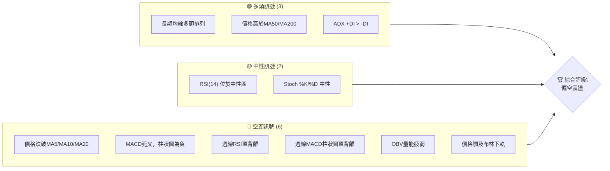

**解讀**：目前空頭訊號數量明顯多於多頭訊號，尤其短期趨勢指標和動能指標呈現強烈賣壓。儘管長期均線仍維持多頭排列，但價格已跌破短期關鍵均線，且週線出現明顯的頂背離形態，預示著潛在的趨勢反轉或深度調整。

### 📊 核心指標速覽表

| 指標類別 | 指標名稱 | 當前數值 | 訊號 | 解讀 |
|----------|----------|----------|------|------|
| **價格** | 當前價格 | $229.18 | 🔴 | 較52週高點下跌23.6% |
| **均線** | MA20 | $250.91 | 🔴 | 價格位於MA20下方，短期趨勢轉弱 |
| **均線** | MA50 | $213.91 | 🟢 | 價格位於MA50上方，中期支撐尚存 |
| **均線** | MA200 | $132.31 | 🟢 | 價格位於MA200上方，長期趨勢強勁 |
| **動能** | RSI(14) | 54.28 | 🟡 | 位於中性區，但近期呈下降趨勢 |
| **動能** | MACD | 11.808 | 🔴 | MACD線下穿訊號線形成死叉，看空 |
| **波動** | ATR(14) | $29.04 | 🔴 | 波動性高 (佔股價12.67%) |
| **趨勢** | ADX(14) | 20.56 | 🟡 | 趨勢強度較弱，可能處於盤整或弱勢調整 |
| **量能** | OBV趨勢 | OBV < MA | 🔴 | 量能疲弱，未能確認價格上漲動能 |
| **布林** | BB %B | 0.27 | 🔴 | 價格接近布林通道下軌，賣壓沉重 |

### 🏆 技術評分卡

```
技術評分卡 — NBIS (2026-07-02)
════════════════════════════════════════════════════
趨勢強度      ████░░░░░░░░░░░░░░░░  20/100  🔴 (ADX弱趨勢，但長期多頭)
動能指標      ████░░░░░░░░░░░░░░░░  25/100  🔴 (MACD死叉，RSI下行，週線背離)
支撐穩定度    ██████████░░░░░░░░░░  50/100  🟡 (價格跌破短期支撐，但長期均線提供支撐)
成交量配合    ████░░░░░░░░░░░░░░░░  20/100  🔴 (OBV疲弱，近期高量伴隨下跌)
形態完整度    ██████░░░░░░░░░░░░░░  30/100  🔴 (近期出現高位回落，潛在反轉形態)
均線排列      ████████████░░░░░░░░  60/100  🟡 (長期多頭排列，但短期均線已被跌破)
════════════════════════════════════════════════════
綜合評分      ██████░░░░░░░░░░░░░░  34/100  🔴 偏空震盪
════════════════════════════════════════════════════
```

**評分解讀**：NBIS 的綜合技術評分偏低，主要受到動能指標轉弱、成交量配合度不佳以及短期趨勢惡化的影響。儘管長期均線排列仍屬多頭，但未能阻止近期價格的快速下跌。尤其週線級別的頂背離訊號，為後市敲響警鐘。

---

## 2. 趨勢分析

### 🌐 多時框趨勢分析

NBIS 的多時框架趨勢分析揭示了不同時間維度下的市場動態。

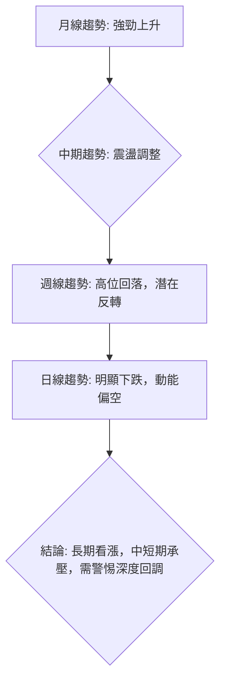

**月線趨勢 (長期)**：從2025年3月的低點$21.11開始，NBIS經歷了一波非常強勁的上升趨勢，最高觸及2026年6月的$276.17。這顯示了公司在長期基本面上的強勁動能或市場對其未來成長的極高預期。目前的月線仍處於上升通道中，但本月K線可能形成較長的上影線或實體陰線，預示著上升動能的減弱。

**週線趨勢 (中期)**：從2026年3月到6月，週線呈現加速上漲態勢，但最近兩週（特別是截至2026-07-05的數據）顯示了劇烈的下跌。價格從$286.69的高點快速回落至$229.18，跌幅達20%。更重要的是，週線RSI和MACD柱狀圖在高位出現了明顯的頂背離現象，這是一個強烈的趨勢反轉訊號，表明中期上升趨勢的動能正在衰竭，可能進入深度調整階段。

**日線趨勢 (短期)**：當前價格$229.18已跌破MA5 ($252.69)、MA10 ($264.96) 和MA20 ($250.91)，MACD指標呈現死叉，且柱狀圖為負。布林通道被觸及下軌，RSI雖處於中性區但持續下行。這些都明確指出短期內NBIS處於下跌趨勢中，且賣壓沉重。

### 📈 長期趨勢 — 12個月走勢圖（Unicode）

以下為NBIS過去12個月的月線收盤價走勢圖，清晰展示了其從2025年7月至今的增長軌跡與近期回調。

```
NBIS 月線走勢圖（過去12個月）
價格軸 ($)
$276.17 ┤                                            ● (2026-06 高點)
$250.00 ┤                                          /
$229.18 ┤                                         / ● (現在)
$200.00 ┤                                        /
$150.00 ┤                                       /
$130.82 ┤             ●(2025-10)              /
$112.27 ┤          ●                         /
$100.00 ┤         /                         /
$83.71  ┤        ●(2025-12)                /
$68.32  ┤     ●                           /
$54.43  ┤● (2025-07)                      /
$50.00  ┤                                /
$21.11  ┤                               /
        └──────────────────────────────────────────────────────────
         25-07 25-08 25-09 25-10 25-11 25-12 26-01 26-02 26-03 26-04 26-05 26-06 26-07
```

**走勢特徵分析表格**：

| 時間區間       | 價格區間     | 漲跌幅    | 主要特徵                                                                               |
|----------------|--------------|-----------|----------------------------------------------------------------------------------------|
| 2025-07 ~ 2025-10 | $54.43 ~ $130.82 | +140.3%   | 強勁啟動階段，價格在短短數月內翻倍，市場關注度顯著提升。                               |
| 2025-11 ~ 2025-12 | $130.82 ~ $83.71 | -36.0%    | 首次較大幅度回調，消化前期漲幅，但仍守住關鍵長期支撐。                               |
| 2026-01 ~ 2026-06 | $85.19 ~ $276.17 | +224.2%   | 恢復強勁上升趨勢，進入加速拉升階段，創下歷史新高，市場情緒極度樂觀。                   |
| 2026-06 ~ 2026-07 | $276.17 ~ $229.18 | -17.0%    | 高位急劇回落，賣壓湧現，短期趨勢轉空，需警惕中期調整的開始。                           |

### 📊 中期趨勢（週線分析）

中期趨勢上，NBIS在2026年3月至6月經歷了一波令人印象深刻的漲勢，從約$90的水平飆升至$286.69的歷史高點。然而，最近兩週的走勢顯示出明顯的疲態，價格從峰值迅速回落。

**近期壓力與支撐示意圖**：

```
NBIS 週線近期走勢與關鍵點位
══════════════════════════════════════════════════════
$286.69 ┤               ● (歷史高點, 2026-06-21)
        │              /
        │             /
        │            /
$250.91 ┤───────────R1─────── (MA20, 當前阻力)
$240.30 ┤           / ● (上週收盤, 2026-06-28)
$229.18 ┤          /  ● (本週收盤, 2026-07-05)
$216.74 ┤───────────S1─────── (38.2% Fib 回調位, 關鍵支撐)
$213.91 ┤───────────S2─────── (MA50, 另一關鍵支撐)
$202.99 ┤───────────S3─────── (布林下軌, 強支撐)
        └────────────────────────────────────────────
         六月上旬      六月中旬      六月下旬      七月上旬
```

**解讀**：從週線圖來看，NBIS在突破$231.09 (2026-05-31)的近期高點後，一度衝至$286.69。但隨後迅速回落，未能守住$250.91 (MA20)這一中期支撐，目前已跌破上週收盤價$240.30，並向$216.74 (38.2%斐波那契回調位)及$213.91 (MA50)逼近。這表明中期趨勢已由強勁上升轉為高位回調，市場正測試下方支撐的有效性。

### ⚡ 趨勢強度評估（ADX 解讀）

ADX (Average Directional Index) 用於衡量趨勢的強度，而非方向。

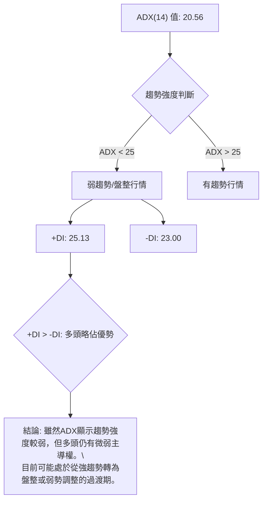

**ADX 強度對照表**：

| ADX 數值範圍 | 趨勢強度 | 市場狀態 |
|--------------|----------|----------|
| 0-25         | 弱趨勢   | 盤整或震盪 |
| 25-50        | 中等趨勢 | 趨勢確立   |
| 50-75        | 強趨勢   | 趨勢強勁   |
| 75-100       | 極強趨勢 | 趨勢極端   |

**解讀**：NBIS 的 ADX(14) 數值為 20.56，屬於弱趨勢範圍 (<25)。這表明市場目前缺乏明確的單邊趨勢，可能處於盤整或弱勢調整階段。然而，+DI (25.13) 略高於 -DI (23.00)，這意味著在當前弱勢趨勢中，多頭力量仍略佔上風，或者說空頭力量尚未完全佔據主導地位。結合價格的快速下跌，這可能暗示下跌動能雖強，但趨勢的持續性仍需觀察，市場可能在尋找新的平衡點。投資者應警惕在弱趨勢中價格快速波動的風險。

---

## 3. 圖表形態分析

### 🔍 形態識別系統

NBIS 在過去一年中經歷了顯著的價格波動，近期形成了一些值得關注的圖表形態。

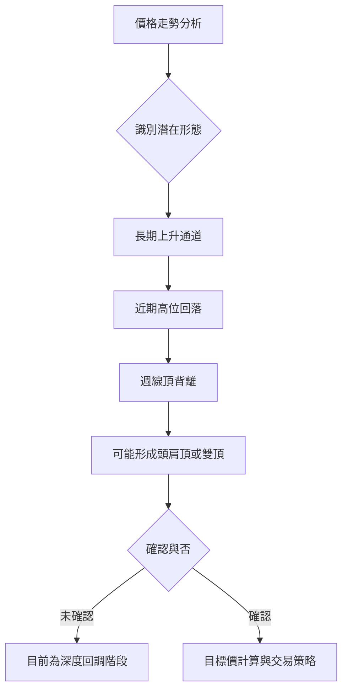

**解讀**：從長期看，NBIS 自2025年3月以來一直處於一個寬闊且陡峭的上升通道中。然而，近期從$286.69高點的急劇下跌，結合週線RSI和MACD的頂背離，使得市場形態存在轉變的潛力。目前尚未形成明確的頭肩頂或雙頂形態，但其發展方向值得密切關注。當前可視為從一個強勁的上升趨勢中進行的深度回調。

### 🕯️ 重要K線形態分析

分析最近20週的收盤價和成交量數據，識別關鍵K線形態。

| 日期          | 收盤價 | K線形態                                 | 解讀                                                                                                     | 訊號 |
|---------------|--------|-----------------------------------------|----------------------------------------------------------------------------------------------------------|------|
| 2026-05-17    | $219.94 | 大陽線伴隨高量                                | 強勁上漲動能，突破前期阻力，進入加速階段。                                                               | 🟢   |
| 2026-05-24    | $214.77 | 陰線但收盤價仍高於前週開盤                  | 高位震盪，多頭力量有所減弱，但仍能守住部分漲幅。                                                         | 🟡   |
| 2026-05-31    | $231.09 | 陽線，創近期新高                          | 多頭延續，但RSI已處於高位，動能可能開始衰竭。                                                            | 🟢   |
| 2026-06-07    | $227.81 | 陰線，且收盤價低於MA5/MA10                  | 短期動能轉弱，市場開始出現獲利了結壓力。                                                                 | 🟡   |
| 2026-06-14    | $232.36 | 陽線，但MACD柱狀圖開始下降                  | 價格嘗試反彈，但動能指標未能跟隨，顯示反彈力量不足，潛在背離。                                           | 🟡   |
| 2026-06-21    | $286.69 | 大陽線，創歷史新高，伴隨較高成交量            | 價格衝頂，但週線RSI和MACD已出現頂背離，預示高點可能已現。                                                | 🔴   |
| 2026-06-28    | $240.30 | 實體大陰線，吞噬前週部分漲幅，伴隨高成交量      | 強烈的看跌吞噬形態，賣壓沉重，短期趨勢徹底轉空，確認頂部。                                               | 🔴   |
| 2026-07-05    | $229.18 | 實體陰線，延續下跌趨勢，成交量仍高於均量 | 延續性下跌，確認空頭主導，市場正尋找新的支撐位。                                                         | 🔴   |

**總結**：NBIS 在2026年6月21日達到歷史高點$286.69後，隨後兩週連續出現實體大陰線，尤其2026年6月28日的K線形態構成了一個強烈的看跌吞噬模式，並伴隨著高成交量，這明確標誌著短期賣壓的爆發和高點的確立。這兩個陰線的組合形態，在技術分析中被視為重要的反轉訊號。

### 📉 ASCII 走勢形態示意圖

以下示意圖展示了NBIS近期從高點回落的形態，以及潛在的頂部結構。

```
NBIS 近期頂部形態示意圖
──────────────────────────────────────────────────────────
$290 ┤                            ● (歷史高點 $286.69)
$270 ┤                           /
$250 ┤                          /
$230 ┤                         /  ● (現價 $229.18)
$210 ┤                        /  /
$190 ┤                       /  /
$170 ┤                      /  /
$150 ┤                     /  /
$130 ┤                    /  /
$110 ┤                   /  /
$90  ┤                  /  /
     └─────────────────────────────────────────────────────
     <-  上升趨勢  ->    高位震盪/反轉區    <-  下跌趨勢  ->
```

**解讀**：圖中顯示NBIS從低位一路走高，在$286.69處達到頂峰後，迅速回落。這種急劇的下跌，如果後續未能有效反彈並突破前期高點，則可能發展為更大型的頂部形態，如雙頂或頭肩頂的右肩形成。目前，該股正處於高位回落的確認階段，下方支撐的有效性將決定其形態的最終確立。

### 🎯 形態目標價計算

鑑於 NBIS 近期出現高位回落且週線指標顯示頂背離，我們將主要考慮潛在的下跌目標。雖然尚未形成標準的頭肩頂或雙頂形態，但可以基於「回調深度」來預估潛在的下行目標。

**計算基礎**：
- 最近一波主要上升趨勢的低點 (Swing Low)：2026-03-08 的 $89.33 (週線數據中最低點)
- 最近一波主要上升趨勢的高點 (Swing High)：2026-06-21 的 $286.69
- 總上升幅度：$286.69 - $89.33 = $197.36

**潛在回調目標價 (基於斐波那契擴展/回調概念)**：
若將近期高點視為一個潛在的頂部，則價格可能回調至以下斐波那契水平。
- **23.6% 回調目標**：$286.69 - ($197.36 * 0.236) = $286.69 - $46.58 = **$240.11** (已跌破)
- **38.2% 回調目標**：$286.69 - ($197.36 * 0.382) = $286.69 - $75.40 = **$211.29**
- **50% 回調目標**：$286.69 - ($197.36 * 0.500) = $286.69 - $98.68 = **$188.01**
- **61.8% 回調目標**：$286.69 - ($197.36 * 0.618) = $286.69 - $122.06 = **$164.63**

**解讀**：
目前股價 $229.18 已經跌破了 23.6% 的回調位 $240.11，顯示賣壓較強。下一個重要的支撐位將是 38.2% 回調位 $211.29。如果此處未能有效止跌，則價格可能進一步探向 50% 回調位 $188.01 甚至 61.8% 回調位 $164.63。這些斐波那契回調位將作為潛在的下行目標價。

---

## 4. 支撐與阻力

### 🗺️ 關鍵價位分布圖（Unicode）

NBIS 的關鍵支撐與阻力位構成了其價格行為的骨架，理解這些價位對於交易決策至關重要。

```
NBIS 價位結構分布圖 (2026-07-02)
═══════════════════════════════════════════════════
$299.86 ║████████████████████████║ 52週高點 / 強阻力 R3
$286.69 ║████████████████████    ║ 歷史高點 / 阻力 R2 (2026-06-21)
$250.91 ║████████████████████████║ MA20 / 關鍵阻力 R1
$243.34 ║▓▓▓▓▓▓▓▓▓▓▓▓▓▓▓▓        ║ 斐波那契23.6%回調位
$229.18 ╠════════════════════════╣ ◄ 現價
$216.74 ║▓▓▓▓▓▓▓▓▓▓▓▓▓▓▓▓        ║ 斐波那契38.2%回調位 / 近期支撐 S1
$213.91 ║████████████████████████║ MA50 / 強支撐 S2
$202.99 ║████████████████████████║ 布林下軌 / 強支撐 S3
$195.23 ║▓▓▓▓▓▓▓▓▓▓▓▓▓▓▓▓        ║ 斐波那契50%回調位
$132.31 ║████████████████████████║ MA200 / 長期強支撐 S4
$43.89  ║████████████████████████║ 52週低點
═══════════════════════════════════════════════════
```

### 🚧 阻力位分析表

| 阻力級別 | 價位     | 形成原因                                   | 突破難度 | 重要性 |
|----------|----------|--------------------------------------------|----------|--------|
| **R1**   | $250.91  | MA20均線，也是布林通道中軌，近期價格跌破處。 | 中等     | 較高   |
| **R2**   | $286.69  | 2026年6月21日歷史高點，前期漲勢的頂部。    | 較高     | 極高   |
| **R3**   | $299.86  | 52週高點，也是心理關卡，代表多頭的極限。   | 極高     | 極高   |
| **次要阻力** | $243.34 | 斐波那契23.6%回調位，近期反彈的潛在阻力。  | 中等     | 中等   |

**解讀**：NBIS在$250.91處面臨來自MA20和布林中軌的即時阻力，若無法迅速收復此位，則短期下跌趨勢將持續。上方最強阻力位於歷史高點$286.69，突破此位需極強動能。

### 🛡️ 支撐位分析表

| 支撐級別 | 價位     | 形成原因                                   | 守住機率 | 重要性 |
|----------|----------|--------------------------------------------|----------|--------|
| **S1**   | $216.74  | 斐波那契38.2%回調位，前期上漲趨勢的重要回調點。 | 中等     | 較高   |
| **S2**   | $213.91  | MA50均線，中期趨勢的關鍵支撐。             | 較高     | 極高   |
| **S3**   | $202.99  | 布林通道下軌，極端賣壓下的動態支撐。       | 較高     | 極高   |
| **S4**   | $132.31  | MA200均線，長期上升趨勢的最後防線。        | 極高     | 極高   |

**解讀**：NBIS目前正接近其第一個關鍵支撐區間，即斐波那契38.2%回調位$216.74和MA50的$213.91。此區域的表現將決定中期趨勢的走向。若跌破此區，布林下軌$202.99將提供進一步支撐。長期而言，MA200的$132.31是其主要上升趨勢的最後一道防線。

### 📐 斐波那契回調位分析

斐波那契回調是判斷回調深度的重要工具。我們從最近一波主要上升趨勢的低點 ($89.33, 2026-03-08) 到高點 ($286.69, 2026-06-21) 進行測量。

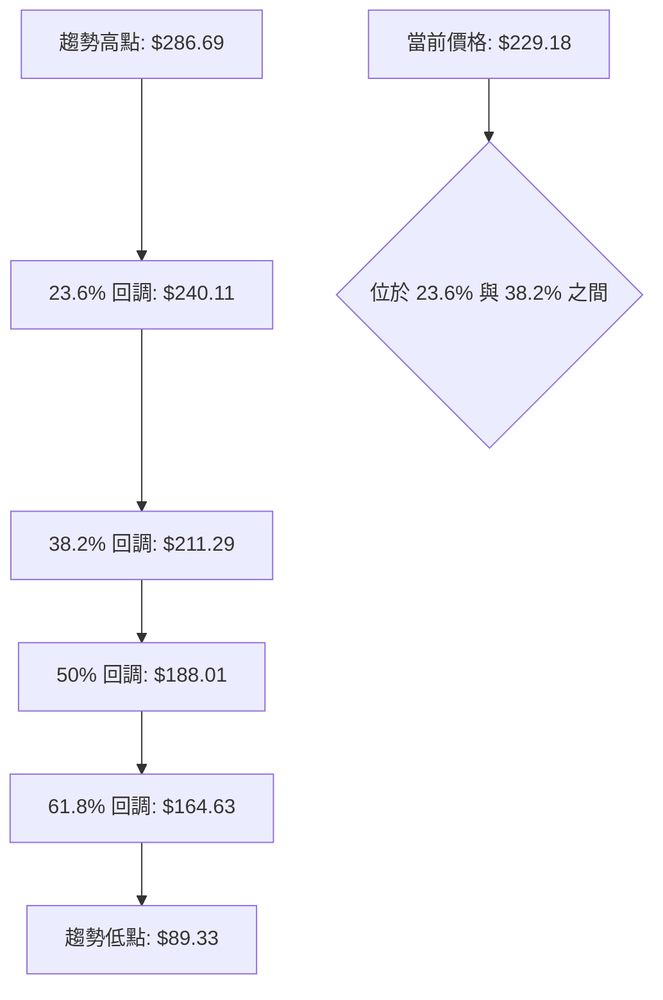

**斐波那契回調位計算及分析**：

| 回調比例 | 價位     | 分析                                                                                                                                                                                                            |
|----------|----------|-----------------------------------------------------------------------------------------------------------------------------------------------------------------------------------------------------------------|
| **23.6%**| $240.11  | NBIS已跌破此回調位，顯示賣壓強勁。此價位現已轉為短期阻力。                                                                                                                                                      |
| **38.2%**| $211.29  | 這是第一個重要的回調支撐位。歷史上許多股票在強勁上漲後會在此處止跌反彈。當前價格$229.18距離此位不遠，此處將是多頭能否守住的關鍵。                                                                                |
| **50%**  | $188.01  | 如果38.2%回調位失守，50%回調位通常是另一個強勁的心理和技術支撐。此位代表了前期漲幅的一半，若跌破可能意味著上升趨勢的結構遭到破壞。                                                                                |
| **61.8%**| $164.63  | 黃金分割位，若價格回調至此，則前期的強勁上升趨勢將面臨嚴峻考驗，可能預示著更深度的調整或趨勢轉變。                                                                                                                |

**總結**：NBIS 當前價格 $229.18 位於 23.6% ($240.11) 和 38.2% ($211.29) 斐波那契回調位之間。這表明市場正經歷一次較深度的修正。38.2% 回調位 ($211.29) 與 MA50 ($213.91) 形成了一個強大的支撐區域。若此區域能夠有效守住並出現止跌訊號，則可能為多頭提供進場機會；反之，若跌破，則可能進一步探向 50% 回調位，甚至更深。

---

## 5. 技術指標深度解讀

### 🎛️ 指標訊號總覽

以下Mermaid圖展示了各主要技術指標當前的訊號狀態及其相互關係。

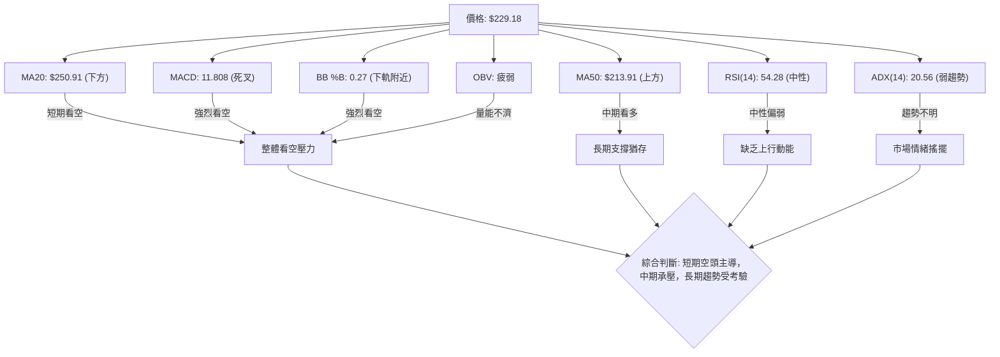

**解讀**：從整體指標訊號來看，短期內NBIS面臨強大的空頭壓力。價格跌破短期均線，MACD形成死叉，且布林通道顯示價格正觸及下軌，這些都是明確的看跌訊號。雖然RSI處於中性區，但其趨勢向下，缺乏反彈動能。ADX顯示當前趨勢強度較弱，但結合價格下跌，可能意味著下跌趨勢正在形成但尚未完全確立。OBV的疲弱進一步證實了上漲缺乏量能支持，而下跌伴隨高量則可能為出貨行為。

### 📈 移動平均線排列分析

NBIS 的移動平均線排列情況揭示了其在不同時間框架下的趨勢健康狀況。

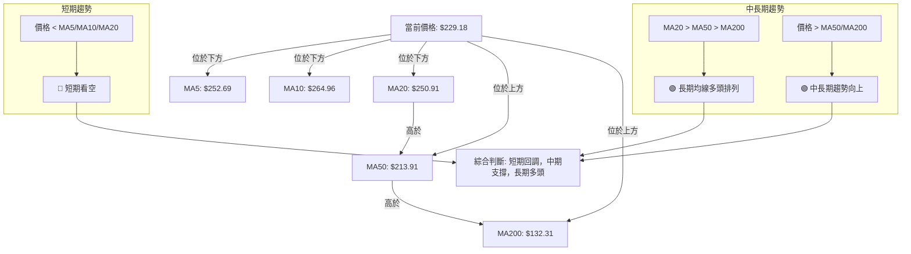

**均線排列狀態**：

| 均線名稱 | 數值     | 相對於價格 ($229.18) | 趨勢判斷 |
|----------|----------|----------------------|----------|
| MA5      | $252.69  | 價格在其下方         | 短期看空 |
| MA10     | $264.96  | 價格在其下方         | 短期看空 |
| MA20     | $250.91  | 價格在其下方         | 短期看空 |
| MA50     | $213.91  | 價格在其上方         | 中期看多 |
| MA200    | $132.31  | 價格在其上方         | 長期看多 |

**解讀**：
- **短期均線** (MA5, MA10, MA20)：NBIS 的當前價格 $229.18 顯著低於所有短期移動平均線。這是一個明確的短期看空訊號，表明短期內賣壓強勁，股價正在經歷快速下跌。
- **中期均線** (MA50)：價格仍位於MA50 ($213.91) 之上，這為中期趨勢提供了一定的支撐。MA50是中期多空的分水嶺，其能否守住至關重要。
- **長期均線** (MA200)：價格遠高於MA200 ($132.31)，且均線系統呈現 MA20 > MA50 > MA200 的多頭排列（儘管MA20已在下跌中）。這表明NBIS的長期上升趨勢依然健康，目前的下跌可以被視為一次深度回調。
- **綜合判斷**：NBIS目前處於短期下跌趨勢中，但中期和長期趨勢依然向上。這是一種短期調整，但其深度和持續時間將取決於中期支撐位 (MA50和斐波那契38.2%) 的表現。

### 📉 RSI(14) 分析

相對強弱指數 (RSI) 用於衡量價格變動的速度和變化，判斷超買或超賣狀態。

**RSI 數值進度條**：

RSI(14): 54.28 ███████████░░░░░░░░░░░░ 54.28% 🟡 中性

**超買超賣區間分析**：
- **超買區 (>70)**：RSI 曾於2026-05-17 ($74.5) 和 2026-04-19 ($79.2) 達到超買區，顯示當時買盤過熱。
- **超賣區 (<30)**：過去20週數據中RSI未進入超賣區，表明近期下跌尚未達到極端超賣程度。
- **中性區 (30-70)**：目前RSI為54.28，位於中性區間。然而，從2026-06-21的65.3下降至2026-07-05的54.3，顯示RSI正快速下行，動能偏弱。

**背離判斷 (頂背離/底背離)**：
- **週線頂背離**：
    - 價格：2026-05-17 收盤價 $219.94，隨後於 2026-06-21 創下 $286.69 的更高收盤價。
    - RSI：對應2026-05-17 的 RSI 為 74.5，而 2026-06-21 的 RSI 為 65.3。
    - **結論**：價格創下更高的高點，但RSI卻創下更低的高點，這形成了明確的**週線級別頂背離** (Bearish Divergence)。這是一個強烈的看跌訊號，預示著上升動能衰竭，趨勢可能反轉或進入深度調整。
- **日線背離**：數據中未顯示日線有明顯背離。

**解讀**：NBIS 的 RSI 雖然目前處於中性區，但其下行趨勢以及週線級別的頂背離是極其重要的看跌訊號。這表明儘管價格在近期創下新高，但其背後的買盤力量已經減弱，未能支持價格的持續上漲。這種背離往往預示著市場將迎來一波修正或反轉。

### 📊 MACD(12/26/9) 訊號解讀

平滑異同移動平均線 (MACD) 是趨勢跟蹤動能指標，由MACD線、訊號線和柱狀圖組成。

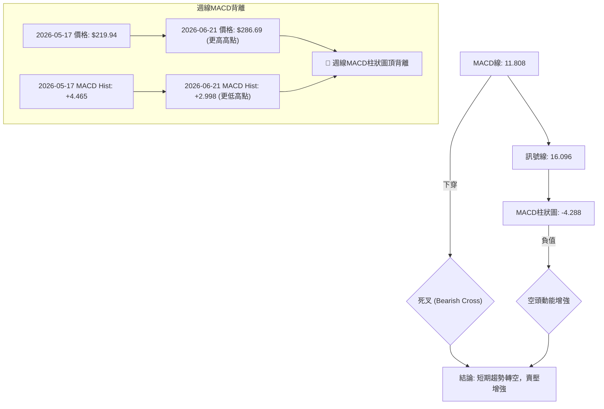

**當前MACD訊號**：
- **MACD線 (11.808)** 位於 **訊號線 (16.096)** 的下方，形成 **死叉** 訊號。
- **MACD柱狀圖 (-4.288)** 呈現負值且持續擴大，顯示空頭動能正在增強。

**背離判斷**：
- **週線頂背離**：
    - 價格：2026-05-17 收盤價 $219.94，對應 MACD 柱狀圖為 +4.465。隨後於 2026-06-21 創下 $286.69 的更高收盤價。
    - MACD 柱狀圖：對應 2026-06-21 的 MACD 柱狀圖為 +2.998。
    - **結論**：價格創下更高的高點，但MACD柱狀圖卻創下更低的高點，這形成了明確的**週線級別MACD柱狀圖頂背離**。與RSI頂背離相互印證，進一步強化了看跌訊號。

**解讀**：日線MACD的死叉和負值柱狀圖表明短期趨勢已轉為下跌，且空頭力量正在累積。更關鍵的是，週線MACD柱狀圖的頂背離與RSI頂背離相互確認，共同發出了強烈的趨勢反轉或深度修正訊號。這意味著即使價格曾創下新高，其內在的上漲動能已顯著衰竭。

### 📦 布林通道分析

布林通道 (Bollinger Bands) 反映價格的波動範圍，由中軌 (通常為20日均線)、上軌和下軌組成。

**ASCII 布林通道示意圖**：

```
NBIS 布林通道示意圖 (2026-07-02)
══════════════════════════════════════════════════════════════
$298.84 ┤                                     ▲ 上軌
        │                                    /
$250.91 ┤─────────────────────────────────── 中軌 (MA20)
        │                                  /
$229.18 ┤                                 ● 現價
        │                                /
$202.99 ┤─────────────────────────────── ▼ 下軌
        │
        └──────────────────────────────────────────────────────
           <-  價格在通道內波動，近期觸及下軌  ->
```

**布林通道關鍵數據**：
- **上軌**：$298.84
- **中軌 (MA20)**：$250.91
- **下軌**：$202.99
- **當前價格**：$229.18
- **BB %B**：0.27 (0=下軌, 0.5=中軌, 1=上軌)

**解讀**：
NBIS 的當前價格 $229.18 位於布林通道中軌 ($250.91) 和下軌 ($202.99) 之間，且 BB %B 數值為 0.27，非常接近下軌。這是一個強烈的看跌訊號，表明價格正受到下行壓力，並可能測試布林通道的下軌支撐。
- **觸及下軌**：價格觸及或接近下軌，通常暗示賣壓過重，短期內可能會有超跌反彈的機會，但前提是下方支撐能夠有效。
- **通道收斂/擴張**：如果通道開始收斂，則預示波動率降低和盤整；如果通道擴張，則預示趨勢的加強。目前數據未明確指出通道寬度變化，但價格快速下跌至下軌，暗示波動率可能處於較高水平。

**綜合判斷**：布林通道分析進一步確認了NBIS的短期下跌趨勢，價格接近下軌表明市場情緒悲觀，短期內可能存在技術性反彈需求，但整體趨勢仍偏向下行。

### 💹 成交量分析（量價配合度）

成交量是價格走勢的燃料，其與價格的配合度對於判斷趨勢的可靠性至關重要。

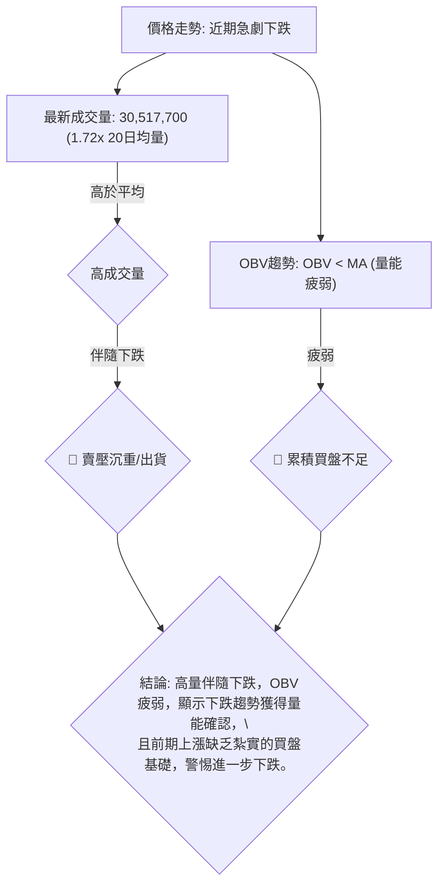

**成交量數據**：
- **最新成交量**：30,517,700
- **20日均量**：17,732,700
- **量比 (Volume Ratio)**：1.72x (最新成交量是20日均量的1.72倍)
- **50日均量**：17,735,536
- **OBV趨勢**：OBV < MA → 量能疲弱

**量價配合度分析**：
1.  **近期下跌伴隨高量**：當前價格 $229.18 較前週 $240.30 有顯著下跌，且最新成交量 30,517,700 遠高於20日均量 (1.72倍)。在下跌過程中出現高成交量，通常被解讀為**賣壓沉重**或**主力出貨**的訊號。這表明下跌趨勢得到了量的確認，而不是無量空跌。
2.  **OBV趨勢疲弱**：OBV (On Balance Volume) 的趨勢顯示 OBV 線位於其移動平均線下方，這是一個**量能疲弱**的訊號。OBV衡量的是累積買賣壓力，OBV < MA 說明在一段時間內，累積的買盤力量不足以推動價格持續上漲，甚至可能在下跌。這與近期股價創高後的急劇回落相符，暗示前期上漲可能存在“虛假繁榮”或未能得到足夠的真實買盤支持。

**綜合判斷**：NBIS 的成交量分析發出強烈看跌訊號。近期高量伴隨價格下跌，明確指出市場正在經歷顯著的賣壓。而 OBV 的疲弱趨勢則從更宏觀的角度確認了買盤的不足。這兩者結合，預示著NBIS在短期內可能繼續承壓，且反彈的持續性將受到考驗。

---

## 6. 動能與波動率

### ⚡ 動能評估四象限

動能評估四象限分析旨在將股票的動能強度與波動率結合，以判斷其所處的市場階段。由於不能使用 quadrantChart，我們將使用表格和 Mermaid 流程圖來呈現。

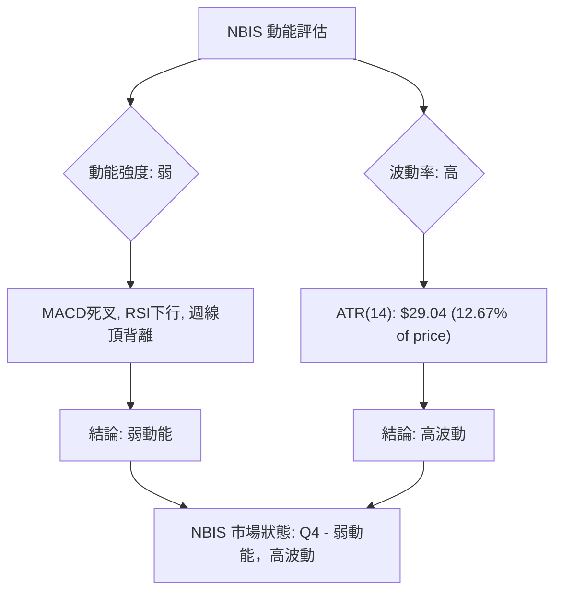

**動能評估四象限分析表**：

| 象限 | 動能 | 波動 | 當前狀態 | 評估                                                                                                                                                                                                                                                                   |
|------|------|------|----------|------------------------------------------------------------------------------------------------------------------------------------------------------------------------------------------------------------------------------------------------------------------------|
| Q1   | 強   | 低   | -        | 最佳機會：股價穩步上漲，動能強勁且波動小，適合趨勢追蹤。                                                                                                                                                                                                               |
| Q2   | 弱   | 低   | -        | 謹慎觀望：股價盤整，動能和波動均低，缺乏明確交易機會，等待突破。                                                                                                                                                                                                       |
| Q3   | 強   | 高   | -        | 高風險高收益：股價劇烈波動且動能強勁，適合短線交易者，但需嚴格止損。                                                                                                                                                                                                   |
| **Q4** | **弱** | **高** | **✓**    | **避免進場 (NBIS目前狀態)**：股價劇烈波動但缺乏明確動能方向，風險高而報酬不確定。這種情況下，建議觀望，等待動能重新積累或波動率下降。NBIS目前MACD死叉、RSI下行，且ATR高企，正處於此象限。                                                                     |

**解讀**：NBIS 目前處於「弱動能，高波動」的第四象限。MACD死叉、RSI下行以及週線級別的頂背離都顯示其上漲動能已顯著減弱甚至轉為下跌動能。同時，ATR達$29.04 (佔股價的12.67%)，表明其價格波動劇烈。這種組合意味著市場方向不明確，但價格波動大，投資風險極高。對於大多數投資者而言，此時應避免進場，等待趨勢明朗或波動率下降。

### 📊 ATR 波動率分析

平均真實波幅 (ATR) 衡量資產價格的波動性，提供每日價格波動的參考。

**ATR(14) 數值**：$29.04

**分析**：
- **波動性水平**：NBIS 的 ATR(14) 為 $29.04，佔當前股價 $229.18 的 12.67%。相對於一般股票，這是一個相當高的百分比，表明NBIS的波動性非常劇烈。高波動性意味著價格在短時間內可能出現大幅漲跌，既提供了潛在的快速獲利機會，也伴隨著更高的風險。
- **近期走勢確認**：近期從$286.69跌至$229.18，短短兩週跌幅超過17%，這與高ATR數值相符。股價的快速下跌也是高波動性的體現。

**止損距離建議**：
在波動性高的環境中，傳統的固定百分比止損可能容易被觸發。基於ATR的止損策略更為靈活：
- **ATR倍數止損**：建議將止損設置在入場點下方 1.5 倍至 2 倍 ATR 的距離。
    - 若以 1.5x ATR 計算：止損距離 = $29.04 * 1.5 = $43.56。
    - 若以 2x ATR 計算：止損距離 = $29.04 * 2 = $58.08。
- **實際應用**：假設在 $229.18 附近入場，則 1.5x ATR 止損點約為 $229.18 - $43.56 = $185.62。2x ATR 止損點約為 $229.18 - $58.08 = $171.10。
- **注意事項**：由於NBIS波動劇烈，止損點可能較寬。投資者應根據自身的風險承受能力和交易策略來調整ATR倍數，並嚴格執行止損。

### 📐 Beta 與市場相關性

Beta 值衡量股票相對於整體市場（如標普500指數）的波動性。數據中未提供NBIS的Beta值。

**推演分析**：
- **行業特性**：NBIS 所屬的行業為「Communication Services」下的「Internet Content & Information」，並專注於「AI 基礎設施」和「自動駕駛」等高科技、高成長領域。這類公司通常具有較高的成長預期和創新性，但也伴隨著較高的不確定性和風險。
- **典型Beta值**：一般而言，科技成長股的Beta值往往高於1。例如，許多科技巨頭的Beta值在1.2到1.8之間。由於NBIS業務的性質和其在AI領域的發展，可以合理推斷其Beta值可能**高於市場平均水平 (Beta > 1.2)**。
- **市場相關性**：高Beta值意味著NBIS的股價波動幅度通常會大於市場。當市場上漲時，NBIS可能漲得更多；當市場下跌時，NBIS也可能跌得更深。這增加了投資的潛在回報，但也同時增加了風險。
- **當前市場環境**：在目前NBIS自身面臨修正壓力的情況下，如果整體市場也出現調整，那麼NBIS的跌幅可能會被放大。投資者在考慮NBIS時，應密切關注大盤走勢，並將其視為一個波動性較高的投資標的。

---

## 7. 多時框架總結

### 📋 時框架評分表

本表綜合了NBIS在不同時間框架下的趨勢、動能、均線排列和形態表現，提供全面評估。

| 時框架 | 趨勢方向 | 動能     | 均線排列     | 形態       | 綜合評分 (1-10) | 建議       |
|--------|----------|----------|--------------|------------|-----------------|------------|
| **短期** | 🔴 下跌   | 🔴 弱勢/轉空 | 🔴 價格<MA20 | 🔴 高位回落 | 3               | 謹慎觀望/偏空 |
| **中期** | 🟡 震盪/回調 | 🔴 轉弱/背離 | 🟡 價格>MA50 | 🟡 潛在反轉 | 4               | 尋找支撐/觀望 |
| **長期** | 🟢 上升   | 🟢 強勁    | 🟢 MA20>MA50>MA200 | 🟢 上升通道 | 7               | 逢低關注   |

**解讀**：NBIS在短期內呈現明顯的下跌趨勢，動能和均線排列都發出看空訊號，綜合評分極低，建議短期內保持謹慎。中期來看，雖然價格仍位於MA50之上，但動能已顯著轉弱並出現頂背離，形態上存在反轉風險，故評分中性偏低。長期而言，NBIS的上升趨勢依然穩固，均線系統保持多頭排列，顯示其基本面潛力仍存，但目前正經歷一次健康的深度回調。

### 🔲 綜合訊號矩陣

本矩陣展示了NBIS在短期、中期、長期各維度訊號的一致性分析。

```
NBIS 綜合訊號矩陣 (2026-07-02)
════════════════════════════════════════════════════
    |     短期 (日線)     |     中期 (週線)     |     長期 (月線)     |
────┼─────────────────────┼─────────────────────┼─────────────────────┤
趨勢  | 🔴 下跌             | 🟡 回調/震盪        | 🟢 上升             |
動能  | 🔴 MACD死叉         | 🔴 RSI/MACD頂背離   | 🟢 強勁             |
均線  | 🔴 價格跌破MA20     | 🟡 價格守住MA50     | 🟢 價格遠高MA200    |
形態  | 🔴 熊吞噬/高位回落  | 🟡 潛在頂部形態     | 🟢 上升通道         |
量能  | 🔴 高量下跌/OBV疲弱 | 🔴 OBV趨勢疲弱      | 🟡 需觀察上漲量能   |
────────────────────────────────────────────────────────────────────
綜合  | 🔴 偏空             | 🔴 偏空             | 🟢 偏多             |
════════════════════════════════════════════════════
```

**一致性分析**：
- **短期與中期的一致性**：短期和中期訊號高度一致，均指向偏空的趨勢。日線級別的下跌、MACD死叉、高量下跌以及週線級別的頂背離和潛在頂部形態，都強烈暗示市場正處於下行調整階段。
- **長期與中短期的矛盾**：長期趨勢依然保持健康的多頭，與中短期訊號形成明顯矛盾。這表明目前的下跌更可能是一次深度回調，而非長期趨勢的反轉。然而，回調的深度和持續時間將決定長期趨勢的健康與否。
- **結論**：NBIS目前正經歷一次由短期空頭主導的深度中期回調。儘管長期前景依然樂觀，但投資者應警惕中短期的下行風險。在長期上升趨勢中，這種深度的回調是健康的，但也需要耐心等待築底訊號。

---

## 8. 交易策略建議

### 🗺️ 策略決策流程圖

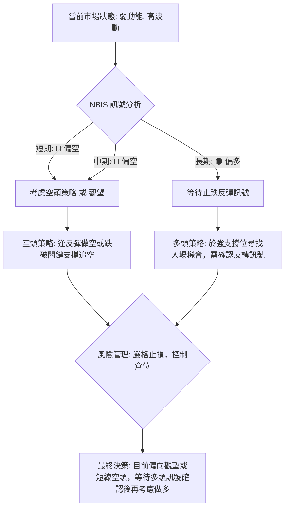

**策略總結**：鑑於NBIS目前中短期趨勢偏空，且存在明顯的週線頂背離，當前不宜盲目做多。建議採取觀望策略，或激進投資者可考慮短線空頭策略。若要考慮做多，必須等待明確的止跌訊號和多頭動能確認。

### 🟢 多頭策略詳情

考慮到NBIS長期趨勢仍為多頭，若出現止跌訊號，可考慮以下多頭策略。

| 策略要素   | 策略 A (激進型：基於斐波那契38.2%支撐反彈) | 策略 B (保守型：基於MA50/布林下軌支撐反彈) |
|------------|----------------------------------------------|----------------------------------------------|
| **進場條件** | 價格在 $211.29 (38.2% Fib) 附近止跌，出現陽線反轉K線，RSI觸底回升。 | 價格在 $202.99 (BB下軌) 或 $213.91 (MA50) 附近止跌，出現實體陽線，MACD綠柱縮小或黃金交叉。 |
| **進場價格** | $215.00                                      | $208.00                                      |
| **目標價 T1**| $240.11 (23.6% Fib回調位/短期阻力)           | $240.11 (23.6% Fib回調位/短期阻力)           |
| **目標價 T2**| $250.91 (MA20/布林中軌)                     | $250.91 (MA20/布林中軌)                     |
| **止損價格** | $208.00 (略低於38.2% Fib與MA50的匯聚點)     | $195.00 (略低於50% Fib回調位)              |
| **風險報酬比**| (T1): ($240.11-$215.00) : ($215.00-$208.00) = $25.11 : $7.00 = **3.59 : 1** | (T1): ($240.11-$208.00) : ($208.00-$195.00) = $32.11 : $13.00 = **2.47 : 1** |
| **成功機率** | 40% (需確認止跌訊號)                         | 50% (等待更強支撐確認)                       |
| **建議倉位** | 輕倉 (不超過總倉位5%)                        | 輕倉 (不超過總倉位5%)                        |

### 🔴 空頭策略詳情

鑑於NBIS當前短期趨勢偏空，且週線存在頂背離，可考慮以下空頭策略。

| 策略要素   | 策略 C (激進型：跌破MA50追空)           | 策略 D (保守型：反彈至阻力位做空)             |
|------------|------------------------------------------|------------------------------------------------|
| **進場條件** | 價格跌破 $213.91 (MA50) 並收盤確認，伴隨放量。 | 價格反彈至 $240.11 (23.6% Fib) 或 $250.91 (MA20) 附近受阻，出現陰線或上影線。 |
| **進場價格** | $213.00                                  | $245.00                                        |
| **目標價 T1**| $202.99 (布林下軌)                      | $229.18 (現價/短期支撐)                       |
| **目標價 T2**| $188.01 (50% Fib回調位)                  | $211.29 (38.2% Fib回調位)                     |
| **止損價格** | $220.00 (略高於MA50，防止假跌破)        | $255.00 (略高於MA20)                           |
| **風險報酬比**| (T1): ($213.00-$202.99) : ($220.00-$213.00) = $10.01 : $7.00 = **1.43 : 1** | (T1): ($245.00-$229.18) : ($255.00-$245.00) = $15.82 : $10.00 = **1.58 : 1** |
| **成功機率** | 60% (趨勢偏空，突破支撐易加速)           | 55% (反彈至阻力位往往伴隨賣壓)               |
| **建議倉位** | 中倉 (不超過總倉位10%)                   | 中倉 (不超過總倉位10%)                         |

### ⭐ 整體訊號強度評星

```
做多訊號強度：★★☆☆☆  (2/5星) - 長期趨勢雖好，但中短期賣壓強勁，缺乏即時做多理由。
做空訊號強度：★★★★☆  (4/5星) - 中短期空頭訊號明確，特別是週線頂背離和MACD死叉。
整體可信度：  ★★★☆☆  (3/5星) - 雖有強烈空頭訊號，但長期多頭趨勢仍存，增加了短期反彈的不確定性。
```

---

## 9. 風險提示與監控

### ✅ 關鍵監控指標 Checklist

以下是交易NBIS時需要密切關注的關鍵技術指標和價位，以應對市場變化。

```
╔══════════════════════════════════════════════════════════════╗
║              NBIS 關鍵監控指標清單                             ║
╠══════════════════════════════════════════════════════════════╣
║ [ ] 價格能否守住 $211.29 (38.2% 斐波那契回調位)                ║
║ [ ] 價格能否守住 $213.91 (MA50 中期支撐)                       ║
║ [ ] 價格能否突破 $250.91 (MA20 短期阻力) 並站穩                ║
║ [ ] 日線MACD是否出現黃金交叉 (看多) 或死叉延續 (看空)          ║
║ [ ] 日線RSI是否從超賣區 (若達到) 反彈或跌破30                 ║
║ [ ] 成交量是否在下跌時縮量 (止跌跡象) 或在上漲時放量 (反彈確認)║
║ [ ] 布林通道下軌 $202.99 是否被有效跌破或提供強勁支撐         ║
║ [ ] ADX是否從弱趨勢轉為強趨勢 (無論多空)                      ║
║ [ ] 週線RSI和MACD的頂背離訊號是否被修正或確認                  ║
╚══════════════════════════════════════════════════════════════╝
```

### ⚠️ 風險場景分析

針對NBIS當前的技術面狀況，以下是三種可能的風險場景及其對應的價格行為：

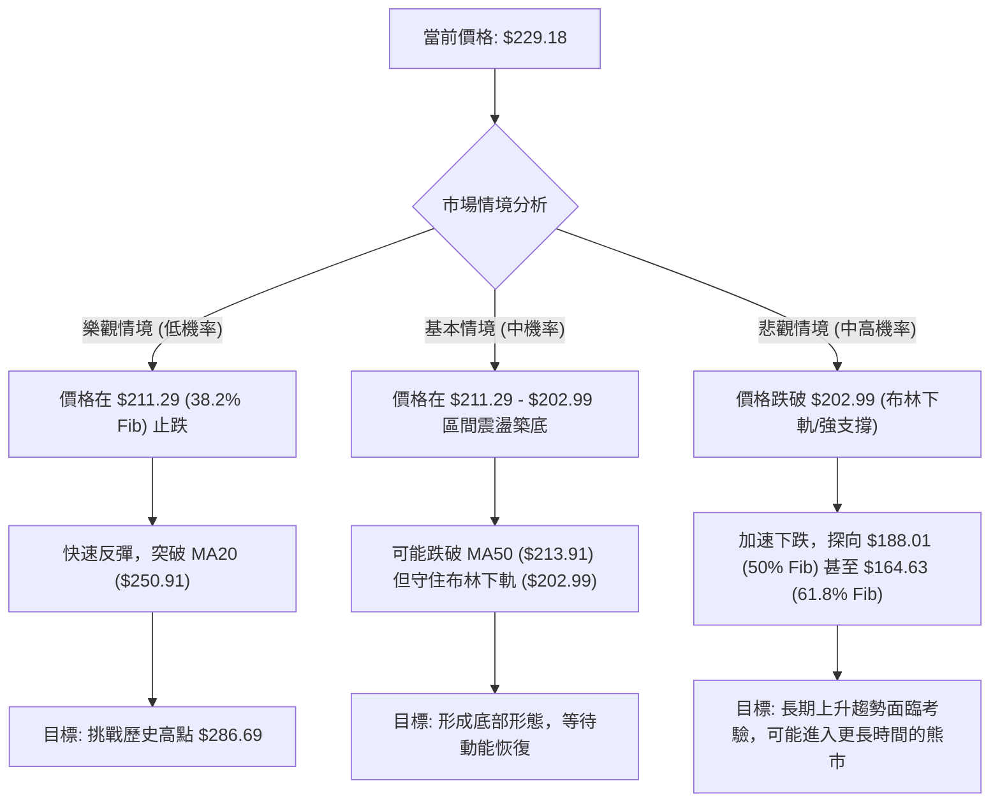

**分析**：
1.  **樂觀情境**：NBIS在$211.29 (38.2%斐波那契回調位) 附近找到強勁支撐，並迅速反彈突破MA20。此情境下，市場將認為這僅是一次健康的洗盤，並重新測試歷史高點。然而，考慮到週線級別的頂背離，此情境發生的機率較低，除非有重大利好消息刺激。
2.  **基本情境**：NBIS在$211.29至$202.99的關鍵支撐區間內尋求支撐，並可能在此區間內進行一段時間的震盪築底。這將是一個消化賣壓和重新積累動能的過程。此情境下，投資者應等待明確的築底形態和量能配合。
3.  **悲觀情境**：如果NBIS未能守住$202.99的布林下軌和MA50的支撐，則可能引發進一步的恐慌性拋售，價格將加速下跌，探向$188.01 (50%斐波那契回調位) 甚至更深的回調位。此情境下，長期上升趨勢的穩固性將受到嚴重考驗。目前中短期訊號偏空，此情境發生的機率較高。

### 🛡️ 風險管理重要提醒

1.  **嚴格止損**：在波動性高的市場環境中，嚴格執行止損是保護資本的關鍵。一旦觸及止損位，應果斷離場，避免更大的損失。
2.  **倉位管理**：鑑於當前市場的不確定性和NBIS的高波動性，建議降低倉位。即使看好長期前景，也應分批建倉，避免一次性投入過多資金。
3.  **等待確認訊號**：在目前的下跌趨勢中，不要急於抄底。等待明確的止跌訊號（如放量陽線、K線組合反轉形態、MACD黃金交叉等）出現後再考慮入場，以提高交易的成功率。
4.  **關注大盤**：NBIS作為高成長科技股，其走勢往往與整體市場情緒高度相關。密切關注大盤指數（如SPY, QQQ）的走勢，如果大盤也出現系統性風險，NBIS的下跌可能加劇。
5.  **基本面配合**：雖然本報告側重技術分析，但長期投資仍需結合基本面。關注公司是否有新的利好或利空消息，特別是關於其AI基礎設施和自動駕駛業務的進展。

---

## 📋 報告總結

```
NBIS 技術分析報告總結
════════════════════════════════════════════════════════
報告日期：2026-07-02
當前價格：$229.18
分析評級：⚖️ 偏空震盪 (短期賣壓沉重，中期面臨深度回調風險，長期趨勢受考驗)

關鍵結論：
├─ 長期趨勢：🟢 強勁上升，但面臨中期回調考驗。
├─ 中期趨勢：🔴 高位回落，週線RSI/MACD出現明顯頂背離，存在深度調整風險。
├─ 短期趨勢：🔴 明顯下跌，價格跌破短期均線，MACD死叉，布林通道觸及下軌，賣壓沉重。
├─ 關鍵支撐：$211.29 (38.2% Fib) 和 $213.91 (MA50) 形成匯聚支撐區。若跌破，則 $202.99 (布林下軌) 和 $188.01 (50% Fib) 為下一級支撐。
└─ 關鍵阻力：$240.11 (23.6% Fib) 和 $250.91 (MA20) 為短期反彈阻力。

最優策略組合：
1. 🥇 **最佳機會 (觀望/等待)**：當前市場環境風險較高，最佳策略為觀望。等待價格在 $211.29 - $202.99 區間內出現明確的止跌訊號，如放量陽線、K線組合反轉形態，或MACD黃金交叉，再考慮輕倉佈局多頭。
2. 🥈 **次選機會 (短線空頭)**：對於激進型交易者，若價格反彈至 $240.11 或 $250.91 附近受阻，或跌破 $213.91 (MA50) 並確認，可考慮短線做空，目標價 $202.99 或 $188.01。需嚴格設置止損。
3. 🥉 **保守選擇 (遠離觀望)**：鑑於高波動和不確定性，最保守的選擇是完全避免當前交易，直到長期趨勢重新確立且中短期動能恢復。
════════════════════════════════════════════════════════
```

---

> ⚠️ **免責聲明**：本報告為 AI 自動生成之技術分析，所有數據及估算均基於提供的歷史價格資訊。本報告**僅供研究與學術參考**，**不構成任何投資建議**。投資有風險，入市需謹慎。

---

*報告生成時間：2026-07-02 ｜ 數據來源：Yahoo Finance ｜ 分析框架：多時框技術分析*