<details>
<summary>📊 靜態圖表 (點擊展開)</summary>

</details>

<html>
<head><meta charset="utf-8" /></head>
<body>
    <div style="height:500px; width:100%;">                        <script>window.PlotlyConfig = {MathJaxConfig: 'local'};</script>
        <script charset="utf-8" src="https://cdn.plot.ly/plotly-3.6.0.min.js" integrity="sha256-QaOVwtVY0T02VaHrr6pnoHLCwayMJp4O5n4YyaE3rJk=" crossorigin="anonymous"></script>                <div id="candlestick-chart" class="plotly-graph-div" style="height:100%; width:100%;"></div>            <script>                window.PLOTLYENV=window.PLOTLYENV || {};                                if (document.getElementById("candlestick-chart")) {                    Plotly.newPlot(                        "candlestick-chart",                        [{"close":{"dtype":"f8","bdata":"AAAAIIVbVkAAAADAHoVXQAAAACCuh1dAAAAAANfTWEAAAABgZqZaQAAAAEAz81pAAAAAYLhOXEAAAAAAKfxaQAAAAMDM7FpAAAAAgBSOW0AAAACgRxFcQAAAAEAK51xAAAAAIK53X0AAAABguP5fQAAAAAApPF9AAAAAwMxsXUAAAAAAAIBeQAAAAOB6lGBAAAAAYI8yYEAAAABguO5gQAAAAMDMBGBAAAAAwB51X0AAAABgj8JeQAAAAAApXFxAAAAAAABAW0AAAACA6xFaQAAAACCup1hAAAAAgD2KWkAAAADgo1BdQAAAACCFW19AAAAAwB51XkAAAABgZkZfQAAAACCFC19AAAAAgD1aYEAAAACAFB5eQAAAAGCPoltAAAAAAABAXUAAAAAAKVxbQAAAAIDr0VtAAAAAwMx8W0AAAACAFI5ZQAAAAEAKl1dAAAAA4FEoVkAAAABgj+JUQAAAAGC4flVAAAAAYI+iVkAAAADgesRXQAAAAMD1KFVAAAAA4KPQVEAAAACgmflWQAAAAOBROFZAAAAAACmsV0AAAAAgrrdXQAAAAKCZCVlAAAAAwMwcWEAAAABA4bpYQAAAAEAzs1lAAAAAYI+CWEAAAADAHhVZQAAAAIA9GlhAAAAAgMJlV0AAAACA65FXQAAAAAAp7FVAAAAAwPVIVEAAAADAzDxUQAAAAMDM3FJAAAAAgMKFU0AAAACgcF1WQAAAAGC4TldAAAAAgOuBVkAAAADgUchWQAAAAIDC5VVAAAAAYI+CVUAAAABA4UpVQAAAAMAe7VRAAAAAwMx8VkAAAADAHjVXQAAAACBcD1lAAAAAoHANWEAAAABAM1NYQAAAACCFe1hAAAAAwB7VWkAAAAAghVtaQAAAAGC4fllAAAAA4KP4WUAAAABguC5bQAAAAGCP0lhAAAAAIK63WEAAAABgZjZYQAAAAAAAoFdAAAAAoHDdVkAAAAAgrndYQAAAACCFG1lAAAAAgD26V0AAAAAAKUxVQAAAAIA9ClZAAAAAwMx8VkAAAADA9ZhUQAAAACCud1JAAAAAYGaGVUAAAADgUThXQAAAAGCP8lZAAAAAQAonVkAAAABguG5WQAAAAOCjgFhAAAAAoEdhWEAAAABAM3NZQAAAAEAK51pAAAAAQOF6WEAAAABACidZQAAAAMAepVlAAAAAIK6HWkAAAADgUThaQAAAAAApzFZAAAAA4KPAVkAAAABAM7NVQAAAAIDrcVhAAAAAoJnpV0AAAADAHlVWQAAAAAApvFdAAAAAIIUbWEAAAAAgrv9bQAAAAGCPAltAAAAAwMw8XEAAAABAMztgQAAAAMAeFV1AAAAAANejXUAAAACgR2FeQAAAACCuZ11AAAAAoJmJXEAAAACAPbpcQAAAAIDCxVxAAAAAgBR+WkAAAADgejRZQAAAAOCjEFdAAAAA4KPwWUAAAADAzHxZQAAAAOB6NFtAAAAAYI8iXEAAAACgmVldQAAAAAAAQF9AAAAAYI8KYUAAAABACh9iQAAAAIDrUWNAAAAAgBQ+ZEAAAADgo9hkQAAAAEDhqmRAAAAA4HqkY0AAAADAHuVjQAAAAKCZkWNAAAAA4HqEY0AAAABgj6JjQAAAAMAeZWJAAAAAYLgeYkAAAADgUfBgQAAAAIAUpmFAAAAAIFxHYUAAAAAgrk9jQAAAAKBwDWZAAAAAoHD9ZUAAAABA4WJoQAAAAOCjGGdAAAAAoJkhZkAAAABAM0NnQAAAACCFY2ZAAAAA4KPoaUAAAADAzKRrQAAAAIAUfmtAAAAAIIX7aEAAAAAgXLdoQAAAAIA9+mdAAAAAgMJ9a0AAAADgo9hqQAAAAIDrAWpAAAAAANcLakAAAABA4UpsQAAAAEDh4mxAAAAAACmIcEAAAACgR0lwQAAAAIDCdW9AAAAAYLg6cEAAAACA63lsQAAAAAAAQGtAAAAAANeDa0AAAACAFHZqQAAAACCux2tAAAAAIIULbUAAAADAHkFwQAAAAKCZkXBAAAAAYI+OcUAAAABACutxQAAAAIDCuXFAAAAAAAA0cUAAAABgjzpwQAAAAIAUCnBAAAAAoJkJbkAAAABgZlJwQAAAAGC4QnFAAAAAgMKlbEAAAAAA1\u002fNqQA=="},"high":{"dtype":"f8","bdata":"AAAAQDPTVkAAAAAAAMBXQAAAACCFa1hAAAAAQDPjWEAAAADAHiVbQAAAAGC4fltAAAAAYGa2XEAAAADAHoVcQAAAACBcf1tAAAAAoEchXEAAAACgmWldQAAAAOBR+FxAAAAAIFyvX0AAAAAAVJ9gQAAAAOBR+GBAAAAAwPUIYEAAAAAA11NfQAAAAIA9qmBAAAAAQDOjYUAAAADA9VBhQAAAAIAWuWBAAAAAIK5\u002fYEAAAABACl9gQAAAAACsJF5AAAAAgBReXUAAAAAghQtbQAAAAEAz81pAAAAAIK6nWkAAAADAzFxdQAAAAAAAoF9AAAAAwPUgYEAAAADAzHxfQAAAAIAUDmBAAAAAwMyEYEAAAACAwt1gQAAAAIDrMV1AAAAAoHCNXUAAAAAAAEBeQAAAAEAz01tAAAAAIK6XXUAAAAAA16NcQAAAAKCZaVpAAAAAYLjeVkAAAAAAAEBWQAAAAKCZaVZAAAAAAClsV0AAAACAFC5YQAAAAAAprFlAAAAAIFwvVkAAAAAAAEBXQAAAAIDr0VZAAAAAgJPoV0AAAADAHkVYQAAAAGBmZllAAAAAwMy8WUAAAAAA18NYQAAAAIDC9VlAAAAAYGZWWUAAAAAAACBZQAAAACCDOFlAAAAAgMJFWEAAAADAzNxXQAAAAKCZ6VdAAAAAIFwPVkAAAAAA12NUQAAAAEAzE1VAAAAAYGYWVEAAAABgj6JWQAAAAKCZ+VdAAAAAgBQ+V0AAAABA4dpWQAAAACCu51ZAAAAAQAonVkAAAACgcL1VQAAAAIAUnlVAAAAA4KOwVkAAAAAAKdxXQAAAACCFK1lAAAAAYGaWWUAAAABgj6JZQAAAAIAUPlpAAAAAIIUrW0AAAADAzPxaQAAAAMDMrFpAAAAA4FEIW0AAAAAAAKBbQAAAAIAUHlpAAAAAoJmZWUAAAABguP5ZQAAAAOCjuFhAAAAA4FE4WUAAAABgj+JYQAAAAGBmdllAAAAAAADQWEAAAABgjwJXQAAAAAAAUFZAAAAAwPXYVkAAAABgj+pVQAAAAOB6NFRAAAAAgD2qVUAAAAAghWtXQAAAAABU41dAAAAAAACwV0AAAADgo7BWQAAAAOB6FFlAAAAAYI\u002fSWEAAAACgmRlaQAAAAGC4\u002flpAAAAA4HoUW0AAAACgbkpZQAAAAAAA8FlAAAAAACncWkAAAADgehRbQAAAAEAz01hAAAAAoMTYVkAAAAAgrndWQAAAAGC4nlhAAAAAAADQWEAAAADAzLxXQAAAAMDMzFdAAAAAoJmZWEAAAADAHoVcQAAAAGCPwltAAAAA4HokXUAAAACgmYlgQAAAAAAAYF5AAAAAQImxXkAAAABAM3NeQAAAAABW7l5AAAAAANdTXkAAAABAM3NdQAAAAEAzs11AAAAAQDNTXEAAAADgo5BaQAAAACBcj1lAAAAAwPX4WUAAAAAgrvdaQAAAAKBwPVtAAAAAgMJ1XEAAAACgmXldQAAAAAAA8F9AAAAAoJkRYUAAAACAPbpiQAAAAAAA8GNAAAAAQDPDZEAAAACA69lkQAAAAGC4FmVAAAAAgOuBZEAAAAAAADhkQAAAAAAAaGRAAAAAgMLtZEAAAACA67lkQAAAAAAAqGRAAAAAoJmZYkAAAABguK5hQAAAAGBm9mFAAAAAIFxfYkAAAAAAAIBjQAAAAMDMbGZAAAAAYLh+ZkAAAAAgrn9oQAAAAOB6vGhAAAAAAACIZ0AAAACAl45oQAAAACCFM2dAAAAAQOEqa0AAAAAgXDdtQAAAAKBHmWxAAAAAgD1Ca0AAAACA61lpQAAAAAAAiGlAAAAAgOtZbEAAAACgcL1rQAAAAOBRoGtAAAAA4Ho0akAAAADgehxtQAAAAEAzM21AAAAAoMQscUAAAACgcG1xQAAAACBct3BAAAAAIIWHcEAAAAAAAFhvQAAAAMDMDG5AAAAAwPW0bUAAAAAgrt9sQAAAACCuj2xAAAAAQOFybkAAAADgUW5wQAAAACCFVXFAAAAAQOGeckAAAADAzKxyQAAAAIDCvXJAAAAAIK5zckAAAACgbkJxQAAAAOBROHFAAAAAoJkZb0AAAADAzHxwQAAAAKCZKXJAAAAAIK7PbkAAAADgUahtQA=="},"hovertemplate":"\u003cb\u003e%{x|%Y-%m-%d}\u003c\u002fb\u003e\u003cbr\u003e\u958b: $%{open:.2f}\u003cbr\u003e\u9ad8: $%{high:.2f}\u003cbr\u003e\u4f4e: $%{low:.2f}\u003cbr\u003e\u6536: $%{close:.2f}\u003cextra\u003e\u003c\u002fextra\u003e","low":{"dtype":"f8","bdata":"AAAAoEcBVkAAAADAHjVWQAAAAIDrAVdAAAAAAABQV0AAAACgR6FYQAAAAAAAEFpAAAAAYGY2WkAAAADgUXhaQAAAAEAzs1lAAAAAwB4VW0AAAACAPepbQAAAAOCjcFtAAAAA4HqkXUAAAABgZuZeQAAAACCFO19AAAAAgBTuXEAAAAAAAGBdQAAAACCu911AAAAA4FEAYEAAAADAzJRgQAAAAAAAcF9AAAAAwMyMXkAAAACgR4FeQAAAAOBRuFtAAAAA4KPgWkAAAACgmVlZQAAAAOBRqFdAAAAAoHDdWEAAAADgo4BbQAAAAEAKB15AAAAAgOsxXkAAAAAAAGBdQAAAAOCjcF1AAAAAQDOTX0AAAAAAAPBdQAAAAAAAQFtAAAAAIIXbW0AAAACAPRpbQAAAAOCjUFlAAAAAgBQuW0AAAADAHvVYQAAAAKBw7VZAAAAAAAAgVUAAAAAAAIBUQAAAAIDC5VRAAAAAoHBtVEAAAABAM\u002fNWQAAAAKBwDVVAAAAAoHCNU0AAAACgmUlVQAAAAOAkLlVAAAAA4KOwVkAAAAAAKVxXQAAAAOCjQFZAAAAAANcDWEAAAAAAAMBWQAAAAIAUXlhAAAAAwMwMWEAAAABAM9NXQAAAAGBmBlhAAAAAwMwMV0AAAADAzKxVQAAAAMDMjFVAAAAAoBgEVEAAAADgUThTQAAAAAAA0FJAAAAA4KNAU0AAAACAPQpUQAAAAGBmxlZAAAAAANcTVkAAAACgmSlWQAAAACBcr1VAAAAAYI8SVUAAAAAA1yNVQAAAAKCZuVRAAAAA4KOAVUAAAADA9bhWQAAAAAApvFZAAAAAANfjV0AAAAAgWAFYQAAAAGBmRlhAAAAAQDMjWEAAAABA4fpZQAAAACCD2FhAAAAAYGZGWUAAAACgcC1ZQAAAAIDClVhAAAAAYGZGV0AAAAAAACBYQAAAAIDrYVdAAAAAQArXVkAAAACA62FXQAAAAAApHFhAAAAAgD3KVkAAAAAgrgdVQAAAAIAUDlVAAAAAAAAwVUAAAAAAKZxTQAAAAKBHYVJAAAAAIK5HU0AAAAAA1\u002fNUQAAAAIA96lZAAAAAwPXIVUAAAAAAKexTQAAAAEAKN1ZAAAAAAABgV0AAAAAg2TZYQAAAACCFG1lAAAAAgOtBWEAAAABAM9NXQAAAAEDfb1hAAAAAQDOzWUAAAAAAAIBZQAAAAKCZGVZAAAAAQDOzVUAAAACA6+FUQAAAAKCZiVZAAAAAIK7nVkAAAABAMzNWQAAAAAAAoFVAAAAAAADAV0AAAAAgXB9aQAAAAKBHoVpAAAAAwPWIW0AAAABgEhtfQAAAAEAKR1xAAAAAAACAXEAAAACgR7FcQAAAAICTKFxAAAAAQDNjXEAAAADgowBcQAAAAMAeVVxAAAAAgD1aWkAAAACgRxFZQAAAAMDKaVZAAAAAYLjuV0AAAABgZlZZQAAAAAApDFhAAAAAwMzcWkAAAACA65FbQAAAAGBm1l1AAAAAQDMjX0AAAADgUdxgQAAAAKCZyWFAAAAA4KPQY0AAAAAAAJBjQAAAAEDhAmRAAAAAIFxXY0AAAACgR0FjQAAAAMDMbGNAAAAAQDNrY0AAAACAPUJjQAAAAIDrOWJAAAAAgOtRYUAAAABgZpZgQAAAAEAKx2BAAAAAAADgYEAAAAAAAIBhQAAAAGBm9mNAAAAAYLgWZUAAAAAgheNlQAAAAAAAIGZAAAAAAAAQZkAAAACgmVFmQAAAAAAAiGVAAAAAAABgaEAAAAAAAPhpQAAAAKCZeWpAAAAAYI\u002fCZ0AAAAAAAOBmQAAAAOB61GdAAAAAoJkZakAAAAAgXFdqQAAAAMAetWlAAAAAgOvJaEAAAADgUWBrQAAAAMDMTGpAAAAAAADAbUAAAAAAADxwQAAAAOBR8G5AAAAAgBRWbUAAAACAFBZrQAAAAGBmNmtAAAAAoJkJaUAAAAAA12tqQAAAAAAAoGlAAAAAAADwa0AAAAAgrqduQAAAAMDMrG9AAAAA4KOEcEAAAABAMzlxQAAAAAAAYHFAAAAAAABgb0AAAABguCZvQAAAAIDrkW9AAAAAwMxMbUAAAAAAAFBtQAAAAKCZ+W9AAAAAoHCFbEAAAABgkelpQA=="},"name":"\u50f9\u683c","open":{"dtype":"f8","bdata":"AAAAwMzMVkAAAABA4epWQAAAAMDMxFdAAAAAwPWIV0AAAADAzHxZQAAAAGCPAltAAAAA4KNIW0AAAAAghQNbQAAAACCFe1tAAAAA4FFYW0AAAADgelxcQAAAAIDC7VtAAAAAoEfxXkAAAABACs9fQAAAAMDMjGBAAAAAwMz0X0AAAADAzExeQAAAAGC4Pl5AAAAAYGbeYEAAAABguOZgQAAAAAAAgGBAAAAAwMx8YEAAAABA4QJgQAAAAADXg11AAAAAYI8yXUAAAADgUfhaQAAAAEAzq1pAAAAAwB4VWUAAAACAPcpbQAAAAIA9Ol5AAAAAANebX0AAAACA6xFfQAAAAMDMTF5AAAAAwPWoX0AAAAAAAMBgQAAAAGC4FlxAAAAAwPVoXEAAAABAM+NdQAAAAAAAIFpAAAAAIIXLXEAAAADgUYhcQAAAAMDMDFpAAAAAwPW4VkAAAABACpdUQAAAAOB69FRAAAAAgOvxVEAAAADgUUBXQAAAACCF21hAAAAAQDNjVUAAAABguI5VQAAAAGCPUlZAAAAAYGZ2V0AAAABAMyNYQAAAAMDM3FZAAAAAQAoXWUAAAACgR8FXQAAAAOB6xFhAAAAAgMIVWUAAAABgj1JYQAAAAIDChVhAAAAAYLjuV0AAAADAzExWQAAAAADXU1dAAAAAYGYGVkAAAADAzORTQAAAAIDCBVVAAAAAQDPDU0AAAACgmSlUQAAAAIAUPldAAAAAANeTVkAAAABguI5WQAAAAOCj4FZAAAAAwMwcVUAAAAAAAJhVQAAAACCuV1VAAAAAQAq\u002fVUAAAAAAAMBXQAAAAIDC7VdAAAAA4KPAWEAAAABgjzJYQAAAAKBHuVhAAAAA4HqUWEAAAADAHtVaQAAAAIDrcVpAAAAAIIUjWkAAAAAgrn9aQAAAAMAedVlAAAAAgMJFWUAAAADgo4BZQAAAAMDMLFhAAAAAoHBtWEAAAABgZpZXQAAAAAAAAFlAAAAAQAqXWEAAAACgQ+NWQAAAAADXc1VAAAAAIIV7VkAAAAAAAMBVQAAAAMD1yFNAAAAAYGbOU0AAAADAzBxVQAAAAGCPOldAAAAAYI86V0AAAABgZgZVQAAAAEAKd1ZAAAAAAAAAWEAAAABguO5YQAAAACCFG1lAAAAAANOlWkAAAAAghRNYQAAAACBc11hAAAAAIFw\u002fWkAAAAAAAIBaQAAAAMDMrFhAAAAAAAAAVkAAAACgmYlVQAAAAKCZmVZAAAAAAAAwWEAAAABAMxNXQAAAAEAK11VAAAAAwPXIV0AAAACAPUpaQAAAAIDCRVtAAAAAACmcW0AAAAAAADBfQAAAAIDCFV5AAAAAQDOzXEAAAADgUdBcQAAAAGBmHl5AAAAAoHAtXUAAAABAMwtdQAAAACCuN11AAAAA4FFQXEAAAADAHnVaQAAAACBcj1lAAAAAYLh+WEAAAADgenxaQAAAAIA9GlhAAAAAgD0qW0AAAAAAAKhbQAAAAOBRuF9AAAAAAABAX0AAAADgUdxgQAAAAGBm1mFAAAAAQDMjZEAAAABgOwdkQAAAAAAA4GRAAAAAwPV4ZEAAAAAAAKBjQAAAAEAKJ2RAAAAAIIVbZEAAAADAzHxjQAAAAKBwdWRAAAAA4HqMYkAAAADAzExhQAAAAEAKg2FAAAAAgOslYkAAAABgj6phQAAAAOBRDGRAAAAAwMx0ZUAAAABACnNmQAAAAOBRwGdAAAAAYGb2ZkAAAADAzHxmQAAAAKBwjWZAAAAAQAp7aUAAAAAAAKxqQAAAACCFM2tAAAAAQAova0AAAAAAAOBnQAAAAEAKf2lAAAAAIK53akAAAADgUWhrQAAAAKCZlWtAAAAAwB75aUAAAAAAKcxsQAAAACCFe2xAAAAAQOGCbkAAAACgmQFxQAAAAKBwQ3BAAAAAIK73bUAAAAAghdtuQAAAAMDMDG5AAAAAAADAbEAAAACgxu9qQAAAAOB6rGlAAAAAwMxUbUAAAABguH5vQAAAAEAK729AAAAAYGaacEAAAABAM6NyQAAAACBcH3JAAAAAAAAccEAAAACgmTFxQAAAAMAeCXFAAAAAQDObbkAAAAAAACxvQAAAAAApJHBAAAAAoMQIbkAAAAAAACBtQA=="},"x":["2025-09-16T00:00:00-04:00","2025-09-17T00:00:00-04:00","2025-09-18T00:00:00-04:00","2025-09-19T00:00:00-04:00","2025-09-22T00:00:00-04:00","2025-09-23T00:00:00-04:00","2025-09-24T00:00:00-04:00","2025-09-25T00:00:00-04:00","2025-09-26T00:00:00-04:00","2025-09-29T00:00:00-04:00","2025-09-30T00:00:00-04:00","2025-10-01T00:00:00-04:00","2025-10-02T00:00:00-04:00","2025-10-03T00:00:00-04:00","2025-10-06T00:00:00-04:00","2025-10-07T00:00:00-04:00","2025-10-08T00:00:00-04:00","2025-10-09T00:00:00-04:00","2025-10-10T00:00:00-04:00","2025-10-13T00:00:00-04:00","2025-10-14T00:00:00-04:00","2025-10-15T00:00:00-04:00","2025-10-16T00:00:00-04:00","2025-10-17T00:00:00-04:00","2025-10-20T00:00:00-04:00","2025-10-21T00:00:00-04:00","2025-10-22T00:00:00-04:00","2025-10-23T00:00:00-04:00","2025-10-24T00:00:00-04:00","2025-10-27T00:00:00-04:00","2025-10-28T00:00:00-04:00","2025-10-29T00:00:00-04:00","2025-10-30T00:00:00-04:00","2025-10-31T00:00:00-04:00","2025-11-03T00:00:00-05:00","2025-11-04T00:00:00-05:00","2025-11-05T00:00:00-05:00","2025-11-06T00:00:00-05:00","2025-11-07T00:00:00-05:00","2025-11-10T00:00:00-05:00","2025-11-11T00:00:00-05:00","2025-11-12T00:00:00-05:00","2025-11-13T00:00:00-05:00","2025-11-14T00:00:00-05:00","2025-11-17T00:00:00-05:00","2025-11-18T00:00:00-05:00","2025-11-19T00:00:00-05:00","2025-11-20T00:00:00-05:00","2025-11-21T00:00:00-05:00","2025-11-24T00:00:00-05:00","2025-11-25T00:00:00-05:00","2025-11-26T00:00:00-05:00","2025-11-28T00:00:00-05:00","2025-12-01T00:00:00-05:00","2025-12-02T00:00:00-05:00","2025-12-03T00:00:00-05:00","2025-12-04T00:00:00-05:00","2025-12-05T00:00:00-05:00","2025-12-08T00:00:00-05:00","2025-12-09T00:00:00-05:00","2025-12-10T00:00:00-05:00","2025-12-11T00:00:00-05:00","2025-12-12T00:00:00-05:00","2025-12-15T00:00:00-05:00","2025-12-16T00:00:00-05:00","2025-12-17T00:00:00-05:00","2025-12-18T00:00:00-05:00","2025-12-19T00:00:00-05:00","2025-12-22T00:00:00-05:00","2025-12-23T00:00:00-05:00","2025-12-24T00:00:00-05:00","2025-12-26T00:00:00-05:00","2025-12-29T00:00:00-05:00","2025-12-30T00:00:00-05:00","2025-12-31T00:00:00-05:00","2026-01-02T00:00:00-05:00","2026-01-05T00:00:00-05:00","2026-01-06T00:00:00-05:00","2026-01-07T00:00:00-05:00","2026-01-08T00:00:00-05:00","2026-01-09T00:00:00-05:00","2026-01-12T00:00:00-05:00","2026-01-13T00:00:00-05:00","2026-01-14T00:00:00-05:00","2026-01-15T00:00:00-05:00","2026-01-16T00:00:00-05:00","2026-01-20T00:00:00-05:00","2026-01-21T00:00:00-05:00","2026-01-22T00:00:00-05:00","2026-01-23T00:00:00-05:00","2026-01-26T00:00:00-05:00","2026-01-27T00:00:00-05:00","2026-01-28T00:00:00-05:00","2026-01-29T00:00:00-05:00","2026-01-30T00:00:00-05:00","2026-02-02T00:00:00-05:00","2026-02-03T00:00:00-05:00","2026-02-04T00:00:00-05:00","2026-02-05T00:00:00-05:00","2026-02-06T00:00:00-05:00","2026-02-09T00:00:00-05:00","2026-02-10T00:00:00-05:00","2026-02-11T00:00:00-05:00","2026-02-12T00:00:00-05:00","2026-02-13T00:00:00-05:00","2026-02-17T00:00:00-05:00","2026-02-18T00:00:00-05:00","2026-02-19T00:00:00-05:00","2026-02-20T00:00:00-05:00","2026-02-23T00:00:00-05:00","2026-02-24T00:00:00-05:00","2026-02-25T00:00:00-05:00","2026-02-26T00:00:00-05:00","2026-02-27T00:00:00-05:00","2026-03-02T00:00:00-05:00","2026-03-03T00:00:00-05:00","2026-03-04T00:00:00-05:00","2026-03-05T00:00:00-05:00","2026-03-06T00:00:00-05:00","2026-03-09T00:00:00-04:00","2026-03-10T00:00:00-04:00","2026-03-11T00:00:00-04:00","2026-03-12T00:00:00-04:00","2026-03-13T00:00:00-04:00","2026-03-16T00:00:00-04:00","2026-03-17T00:00:00-04:00","2026-03-18T00:00:00-04:00","2026-03-19T00:00:00-04:00","2026-03-20T00:00:00-04:00","2026-03-23T00:00:00-04:00","2026-03-24T00:00:00-04:00","2026-03-25T00:00:00-04:00","2026-03-26T00:00:00-04:00","2026-03-27T00:00:00-04:00","2026-03-30T00:00:00-04:00","2026-03-31T00:00:00-04:00","2026-04-01T00:00:00-04:00","2026-04-02T00:00:00-04:00","2026-04-06T00:00:00-04:00","2026-04-07T00:00:00-04:00","2026-04-08T00:00:00-04:00","2026-04-09T00:00:00-04:00","2026-04-10T00:00:00-04:00","2026-04-13T00:00:00-04:00","2026-04-14T00:00:00-04:00","2026-04-15T00:00:00-04:00","2026-04-16T00:00:00-04:00","2026-04-17T00:00:00-04:00","2026-04-20T00:00:00-04:00","2026-04-21T00:00:00-04:00","2026-04-22T00:00:00-04:00","2026-04-23T00:00:00-04:00","2026-04-24T00:00:00-04:00","2026-04-27T00:00:00-04:00","2026-04-28T00:00:00-04:00","2026-04-29T00:00:00-04:00","2026-04-30T00:00:00-04:00","2026-05-01T00:00:00-04:00","2026-05-04T00:00:00-04:00","2026-05-05T00:00:00-04:00","2026-05-06T00:00:00-04:00","2026-05-07T00:00:00-04:00","2026-05-08T00:00:00-04:00","2026-05-11T00:00:00-04:00","2026-05-12T00:00:00-04:00","2026-05-13T00:00:00-04:00","2026-05-14T00:00:00-04:00","2026-05-15T00:00:00-04:00","2026-05-18T00:00:00-04:00","2026-05-19T00:00:00-04:00","2026-05-20T00:00:00-04:00","2026-05-21T00:00:00-04:00","2026-05-22T00:00:00-04:00","2026-05-26T00:00:00-04:00","2026-05-27T00:00:00-04:00","2026-05-28T00:00:00-04:00","2026-05-29T00:00:00-04:00","2026-06-01T00:00:00-04:00","2026-06-02T00:00:00-04:00","2026-06-03T00:00:00-04:00","2026-06-04T00:00:00-04:00","2026-06-05T00:00:00-04:00","2026-06-08T00:00:00-04:00","2026-06-09T00:00:00-04:00","2026-06-10T00:00:00-04:00","2026-06-11T00:00:00-04:00","2026-06-12T00:00:00-04:00","2026-06-15T00:00:00-04:00","2026-06-16T00:00:00-04:00","2026-06-17T00:00:00-04:00","2026-06-18T00:00:00-04:00","2026-06-22T00:00:00-04:00","2026-06-23T00:00:00-04:00","2026-06-24T00:00:00-04:00","2026-06-25T00:00:00-04:00","2026-06-26T00:00:00-04:00","2026-06-29T00:00:00-04:00","2026-06-30T00:00:00-04:00","2026-07-01T00:00:00-04:00","2026-07-02T00:00:00-04:00"],"type":"candlestick"},{"hovertemplate":"MA30: $%{y:.2f}\u003cextra\u003e\u003c\u002fextra\u003e","line":{"color":"#2196F3","dash":"dash","width":2},"mode":"lines","name":"MA30","x":["2025-09-16T00:00:00-04:00","2025-09-17T00:00:00-04:00","2025-09-18T00:00:00-04:00","2025-09-19T00:00:00-04:00","2025-09-22T00:00:00-04:00","2025-09-23T00:00:00-04:00","2025-09-24T00:00:00-04:00","2025-09-25T00:00:00-04:00","2025-09-26T00:00:00-04:00","2025-09-29T00:00:00-04:00","2025-09-30T00:00:00-04:00","2025-10-01T00:00:00-04:00","2025-10-02T00:00:00-04:00","2025-10-03T00:00:00-04:00","2025-10-06T00:00:00-04:00","2025-10-07T00:00:00-04:00","2025-10-08T00:00:00-04:00","2025-10-09T00:00:00-04:00","2025-10-10T00:00:00-04:00","2025-10-13T00:00:00-04:00","2025-10-14T00:00:00-04:00","2025-10-15T00:00:00-04:00","2025-10-16T00:00:00-04:00","2025-10-17T00:00:00-04:00","2025-10-20T00:00:00-04:00","2025-10-21T00:00:00-04:00","2025-10-22T00:00:00-04:00","2025-10-23T00:00:00-04:00","2025-10-24T00:00:00-04:00","2025-10-27T00:00:00-04:00","2025-10-28T00:00:00-04:00","2025-10-29T00:00:00-04:00","2025-10-30T00:00:00-04:00","2025-10-31T00:00:00-04:00","2025-11-03T00:00:00-05:00","2025-11-04T00:00:00-05:00","2025-11-05T00:00:00-05:00","2025-11-06T00:00:00-05:00","2025-11-07T00:00:00-05:00","2025-11-10T00:00:00-05:00","2025-11-11T00:00:00-05:00","2025-11-12T00:00:00-05:00","2025-11-13T00:00:00-05:00","2025-11-14T00:00:00-05:00","2025-11-17T00:00:00-05:00","2025-11-18T00:00:00-05:00","2025-11-19T00:00:00-05:00","2025-11-20T00:00:00-05:00","2025-11-21T00:00:00-05:00","2025-11-24T00:00:00-05:00","2025-11-25T00:00:00-05:00","2025-11-26T00:00:00-05:00","2025-11-28T00:00:00-05:00","2025-12-01T00:00:00-05:00","2025-12-02T00:00:00-05:00","2025-12-03T00:00:00-05:00","2025-12-04T00:00:00-05:00","2025-12-05T00:00:00-05:00","2025-12-08T00:00:00-05:00","2025-12-09T00:00:00-05:00","2025-12-10T00:00:00-05:00","2025-12-11T00:00:00-05:00","2025-12-12T00:00:00-05:00","2025-12-15T00:00:00-05:00","2025-12-16T00:00:00-05:00","2025-12-17T00:00:00-05:00","2025-12-18T00:00:00-05:00","2025-12-19T00:00:00-05:00","2025-12-22T00:00:00-05:00","2025-12-23T00:00:00-05:00","2025-12-24T00:00:00-05:00","2025-12-26T00:00:00-05:00","2025-12-29T00:00:00-05:00","2025-12-30T00:00:00-05:00","2025-12-31T00:00:00-05:00","2026-01-02T00:00:00-05:00","2026-01-05T00:00:00-05:00","2026-01-06T00:00:00-05:00","2026-01-07T00:00:00-05:00","2026-01-08T00:00:00-05:00","2026-01-09T00:00:00-05:00","2026-01-12T00:00:00-05:00","2026-01-13T00:00:00-05:00","2026-01-14T00:00:00-05:00","2026-01-15T00:00:00-05:00","2026-01-16T00:00:00-05:00","2026-01-20T00:00:00-05:00","2026-01-21T00:00:00-05:00","2026-01-22T00:00:00-05:00","2026-01-23T00:00:00-05:00","2026-01-26T00:00:00-05:00","2026-01-27T00:00:00-05:00","2026-01-28T00:00:00-05:00","2026-01-29T00:00:00-05:00","2026-01-30T00:00:00-05:00","2026-02-02T00:00:00-05:00","2026-02-03T00:00:00-05:00","2026-02-04T00:00:00-05:00","2026-02-05T00:00:00-05:00","2026-02-06T00:00:00-05:00","2026-02-09T00:00:00-05:00","2026-02-10T00:00:00-05:00","2026-02-11T00:00:00-05:00","2026-02-12T00:00:00-05:00","2026-02-13T00:00:00-05:00","2026-02-17T00:00:00-05:00","2026-02-18T00:00:00-05:00","2026-02-19T00:00:00-05:00","2026-02-20T00:00:00-05:00","2026-02-23T00:00:00-05:00","2026-02-24T00:00:00-05:00","2026-02-25T00:00:00-05:00","2026-02-26T00:00:00-05:00","2026-02-27T00:00:00-05:00","2026-03-02T00:00:00-05:00","2026-03-03T00:00:00-05:00","2026-03-04T00:00:00-05:00","2026-03-05T00:00:00-05:00","2026-03-06T00:00:00-05:00","2026-03-09T00:00:00-04:00","2026-03-10T00:00:00-04:00","2026-03-11T00:00:00-04:00","2026-03-12T00:00:00-04:00","2026-03-13T00:00:00-04:00","2026-03-16T00:00:00-04:00","2026-03-17T00:00:00-04:00","2026-03-18T00:00:00-04:00","2026-03-19T00:00:00-04:00","2026-03-20T00:00:00-04:00","2026-03-23T00:00:00-04:00","2026-03-24T00:00:00-04:00","2026-03-25T00:00:00-04:00","2026-03-26T00:00:00-04:00","2026-03-27T00:00:00-04:00","2026-03-30T00:00:00-04:00","2026-03-31T00:00:00-04:00","2026-04-01T00:00:00-04:00","2026-04-02T00:00:00-04:00","2026-04-06T00:00:00-04:00","2026-04-07T00:00:00-04:00","2026-04-08T00:00:00-04:00","2026-04-09T00:00:00-04:00","2026-04-10T00:00:00-04:00","2026-04-13T00:00:00-04:00","2026-04-14T00:00:00-04:00","2026-04-15T00:00:00-04:00","2026-04-16T00:00:00-04:00","2026-04-17T00:00:00-04:00","2026-04-20T00:00:00-04:00","2026-04-21T00:00:00-04:00","2026-04-22T00:00:00-04:00","2026-04-23T00:00:00-04:00","2026-04-24T00:00:00-04:00","2026-04-27T00:00:00-04:00","2026-04-28T00:00:00-04:00","2026-04-29T00:00:00-04:00","2026-04-30T00:00:00-04:00","2026-05-01T00:00:00-04:00","2026-05-04T00:00:00-04:00","2026-05-05T00:00:00-04:00","2026-05-06T00:00:00-04:00","2026-05-07T00:00:00-04:00","2026-05-08T00:00:00-04:00","2026-05-11T00:00:00-04:00","2026-05-12T00:00:00-04:00","2026-05-13T00:00:00-04:00","2026-05-14T00:00:00-04:00","2026-05-15T00:00:00-04:00","2026-05-18T00:00:00-04:00","2026-05-19T00:00:00-04:00","2026-05-20T00:00:00-04:00","2026-05-21T00:00:00-04:00","2026-05-22T00:00:00-04:00","2026-05-26T00:00:00-04:00","2026-05-27T00:00:00-04:00","2026-05-28T00:00:00-04:00","2026-05-29T00:00:00-04:00","2026-06-01T00:00:00-04:00","2026-06-02T00:00:00-04:00","2026-06-03T00:00:00-04:00","2026-06-04T00:00:00-04:00","2026-06-05T00:00:00-04:00","2026-06-08T00:00:00-04:00","2026-06-09T00:00:00-04:00","2026-06-10T00:00:00-04:00","2026-06-11T00:00:00-04:00","2026-06-12T00:00:00-04:00","2026-06-15T00:00:00-04:00","2026-06-16T00:00:00-04:00","2026-06-17T00:00:00-04:00","2026-06-18T00:00:00-04:00","2026-06-22T00:00:00-04:00","2026-06-23T00:00:00-04:00","2026-06-24T00:00:00-04:00","2026-06-25T00:00:00-04:00","2026-06-26T00:00:00-04:00","2026-06-29T00:00:00-04:00","2026-06-30T00:00:00-04:00","2026-07-01T00:00:00-04:00","2026-07-02T00:00:00-04:00"],"y":{"dtype":"f8","bdata":"AAAAAAAA+H8AAAAAAAD4fwAAAAAAAPh\u002fAAAAAAAA+H8AAAAAAAD4fwAAAAAAAPh\u002fAAAAAAAA+H8AAAAAAAD4fwAAAAAAAPh\u002fAAAAAAAA+H8AAAAAAAD4fwAAAAAAAPh\u002fAAAAAAAA+H8AAAAAAAD4fwAAAAAAAPh\u002fAAAAAAAA+H8AAAAAAAD4fwAAAAAAAPh\u002fAAAAAAAA+H8AAAAAAAD4fwAAAAAAAPh\u002fAAAAAAAA+H8AAAAAAAD4fwAAAAAAAPh\u002fAAAAAAAA+H8AAAAAAAD4fwAAAAAAAPh\u002fAAAAAAAA+H8AAAAAAAD4fzMzM4MjjFxAvLu7O0LRXECamZlJbxNdQN7d3Q2QU11AiYiIuMiWXUB3d3eXX7RdQO\u002fu7v43ul1Aq6qq6kLCXUDe3d0ddsVdQGZmZkYZzV1AERER0YXMXUDe3d0tFbddQImIiNi\u002fiV1AZmZm1k06XUC8u7urf9tcQBEREVFiiFxAZmZmVnFOXEB3d3f3\u002fRRcQBEREZGXrltAvLu7q8ZLW0CamZkZ2e5aQCIiInISm1pAq6qq2qNYWkB3d3dHixxaQKuqqioxAFpAERERMWvlWUCrqqrq+9lZQBEREcHm4llAZmZmJpTRWUDNzMwcdq1ZQDMzM1ONb1lAREREhE4zWUAAAACwjvFYQImIiEi2o1hAAAAAYLo5WEDv7u4ua+VXQM3MzFyPmldAAAAAUI1HV0ARERGR7RxXQM3MzNxr9lZAMzMz4+zLVkBERERERLRWQBEREfHSpVZAVVVVdUygVkB3d3enxqNWQDMzMzPsnlZAq6qq+qmdVkBERESk4phWQCIiIlIqulZA7+7uvsrVVkDe3d3dT+FWQAAAAGCe9FZAAAAAgJUPV0CrqqqqHCZXQHd3dxcEKldAiYiImOA5V0Crqqoqzk5XQM3MzDxRR1dAd3d3hxZJV0C8u7v7qUFXQN7d3d2WPVdAq6qqmgs5V0CamZk5tEBXQGZmZvbhW1dAiYiIOEJ5V0BERETUTYJXQAAAADBrnVdAREREVLi2V0Crqqoqo6dXQGZmZgZWfldAiYiIuPN1V0BERER0r3lXQHd3dzelgldAd3d3xyCIV0BmZmYm25FXQGZmZpZfsFdAERER0YXAV0AiIiKiqNNXQDMzM6Nh41dAZmZmhgfnV0CamZk5F+5XQO\u002fu7r4C+FdAzczM7G31V0DNzMyMQfRXQFVVVcU83VdA3t3dTcXBV0CamZmZ\u002fJJXQAAAAPDDj1dAMzMzY+WIV0B3d3d32nhXQERERMTKeVdAzczMDGWEV0Dv7u4uh6JXQCIiIkLDsldAAAAAgD\u002fZV0ARERHRhThYQERERGSedFhARERERKexWEBmZmZ2IQVZQLy7u8t2YllAZmZm1k2eWUCJiIgoTc1ZQAAAABAC\u002f1lAAAAA8AokWkDe3d2NsztaQJqZmUlvL1pAmpmZKb88WkBEREQUET1aQGZmZualP1pA7+7uXtZeWkAzMzPzp4JaQCIiIkJ8slpAIiIi8u7yWkDv7u5udUhbQGZmZualz1tAMzMzI\u002fdmXEC8u7trkRFdQAAAADCyoV1AzczM7N8kXkCrqqpq2LleQBEREbFHPV9AAAAAUKm8X0De3d3daw5gQERERDwmOGBAIiIiGktaYEAAAACoVGBgQAAAABjZemBAiYiIUNSPYEAzMzNT\u002f7JgQM3MzKS38WBAiYiI+JozYUBERER0IYlhQN7d3b1002FAIiIiUkYfYkCrqqpyPXpiQJqZmUnh1mJAMzMza0pFY0Dv7u72b8RjQCIiIiL3OmRAiYiIUBuYZEAiIiLCyu1kQDMzMxMRNWVAIiIicj2OZUAAAACAsdhlQBEREZHCEWZAzczMDElDZkARERGh04JmQDMzM8P1yGZA7+7u7nw7Z0CamZlZq6dnQN7d3S0kDWhAZmZmxpJ7aEB3d3fHBMdoQCIiItKUEmlAIiIigsBiaUCrqqq6ArRpQImIiMh2CmpAzczMjN5uakDe3d3tfN9qQLy7u3sUPmtAERERwRGua0CamZmpxg9sQBEREZE0eWxAZmZmtvPhbEDv7u5+ajBtQAAAAKAag21AREREBFambUDv7u6uANFtQJqZmTn7DG5AmpmZiUEsbkAzMzOzVj9uQA=="},"type":"scatter"},{"hovertemplate":"MA60: $%{y:.2f}\u003cextra\u003e\u003c\u002fextra\u003e","line":{"color":"#9C27B0","dash":"dash","width":2},"mode":"lines","name":"MA60","x":["2025-09-16T00:00:00-04:00","2025-09-17T00:00:00-04:00","2025-09-18T00:00:00-04:00","2025-09-19T00:00:00-04:00","2025-09-22T00:00:00-04:00","2025-09-23T00:00:00-04:00","2025-09-24T00:00:00-04:00","2025-09-25T00:00:00-04:00","2025-09-26T00:00:00-04:00","2025-09-29T00:00:00-04:00","2025-09-30T00:00:00-04:00","2025-10-01T00:00:00-04:00","2025-10-02T00:00:00-04:00","2025-10-03T00:00:00-04:00","2025-10-06T00:00:00-04:00","2025-10-07T00:00:00-04:00","2025-10-08T00:00:00-04:00","2025-10-09T00:00:00-04:00","2025-10-10T00:00:00-04:00","2025-10-13T00:00:00-04:00","2025-10-14T00:00:00-04:00","2025-10-15T00:00:00-04:00","2025-10-16T00:00:00-04:00","2025-10-17T00:00:00-04:00","2025-10-20T00:00:00-04:00","2025-10-21T00:00:00-04:00","2025-10-22T00:00:00-04:00","2025-10-23T00:00:00-04:00","2025-10-24T00:00:00-04:00","2025-10-27T00:00:00-04:00","2025-10-28T00:00:00-04:00","2025-10-29T00:00:00-04:00","2025-10-30T00:00:00-04:00","2025-10-31T00:00:00-04:00","2025-11-03T00:00:00-05:00","2025-11-04T00:00:00-05:00","2025-11-05T00:00:00-05:00","2025-11-06T00:00:00-05:00","2025-11-07T00:00:00-05:00","2025-11-10T00:00:00-05:00","2025-11-11T00:00:00-05:00","2025-11-12T00:00:00-05:00","2025-11-13T00:00:00-05:00","2025-11-14T00:00:00-05:00","2025-11-17T00:00:00-05:00","2025-11-18T00:00:00-05:00","2025-11-19T00:00:00-05:00","2025-11-20T00:00:00-05:00","2025-11-21T00:00:00-05:00","2025-11-24T00:00:00-05:00","2025-11-25T00:00:00-05:00","2025-11-26T00:00:00-05:00","2025-11-28T00:00:00-05:00","2025-12-01T00:00:00-05:00","2025-12-02T00:00:00-05:00","2025-12-03T00:00:00-05:00","2025-12-04T00:00:00-05:00","2025-12-05T00:00:00-05:00","2025-12-08T00:00:00-05:00","2025-12-09T00:00:00-05:00","2025-12-10T00:00:00-05:00","2025-12-11T00:00:00-05:00","2025-12-12T00:00:00-05:00","2025-12-15T00:00:00-05:00","2025-12-16T00:00:00-05:00","2025-12-17T00:00:00-05:00","2025-12-18T00:00:00-05:00","2025-12-19T00:00:00-05:00","2025-12-22T00:00:00-05:00","2025-12-23T00:00:00-05:00","2025-12-24T00:00:00-05:00","2025-12-26T00:00:00-05:00","2025-12-29T00:00:00-05:00","2025-12-30T00:00:00-05:00","2025-12-31T00:00:00-05:00","2026-01-02T00:00:00-05:00","2026-01-05T00:00:00-05:00","2026-01-06T00:00:00-05:00","2026-01-07T00:00:00-05:00","2026-01-08T00:00:00-05:00","2026-01-09T00:00:00-05:00","2026-01-12T00:00:00-05:00","2026-01-13T00:00:00-05:00","2026-01-14T00:00:00-05:00","2026-01-15T00:00:00-05:00","2026-01-16T00:00:00-05:00","2026-01-20T00:00:00-05:00","2026-01-21T00:00:00-05:00","2026-01-22T00:00:00-05:00","2026-01-23T00:00:00-05:00","2026-01-26T00:00:00-05:00","2026-01-27T00:00:00-05:00","2026-01-28T00:00:00-05:00","2026-01-29T00:00:00-05:00","2026-01-30T00:00:00-05:00","2026-02-02T00:00:00-05:00","2026-02-03T00:00:00-05:00","2026-02-04T00:00:00-05:00","2026-02-05T00:00:00-05:00","2026-02-06T00:00:00-05:00","2026-02-09T00:00:00-05:00","2026-02-10T00:00:00-05:00","2026-02-11T00:00:00-05:00","2026-02-12T00:00:00-05:00","2026-02-13T00:00:00-05:00","2026-02-17T00:00:00-05:00","2026-02-18T00:00:00-05:00","2026-02-19T00:00:00-05:00","2026-02-20T00:00:00-05:00","2026-02-23T00:00:00-05:00","2026-02-24T00:00:00-05:00","2026-02-25T00:00:00-05:00","2026-02-26T00:00:00-05:00","2026-02-27T00:00:00-05:00","2026-03-02T00:00:00-05:00","2026-03-03T00:00:00-05:00","2026-03-04T00:00:00-05:00","2026-03-05T00:00:00-05:00","2026-03-06T00:00:00-05:00","2026-03-09T00:00:00-04:00","2026-03-10T00:00:00-04:00","2026-03-11T00:00:00-04:00","2026-03-12T00:00:00-04:00","2026-03-13T00:00:00-04:00","2026-03-16T00:00:00-04:00","2026-03-17T00:00:00-04:00","2026-03-18T00:00:00-04:00","2026-03-19T00:00:00-04:00","2026-03-20T00:00:00-04:00","2026-03-23T00:00:00-04:00","2026-03-24T00:00:00-04:00","2026-03-25T00:00:00-04:00","2026-03-26T00:00:00-04:00","2026-03-27T00:00:00-04:00","2026-03-30T00:00:00-04:00","2026-03-31T00:00:00-04:00","2026-04-01T00:00:00-04:00","2026-04-02T00:00:00-04:00","2026-04-06T00:00:00-04:00","2026-04-07T00:00:00-04:00","2026-04-08T00:00:00-04:00","2026-04-09T00:00:00-04:00","2026-04-10T00:00:00-04:00","2026-04-13T00:00:00-04:00","2026-04-14T00:00:00-04:00","2026-04-15T00:00:00-04:00","2026-04-16T00:00:00-04:00","2026-04-17T00:00:00-04:00","2026-04-20T00:00:00-04:00","2026-04-21T00:00:00-04:00","2026-04-22T00:00:00-04:00","2026-04-23T00:00:00-04:00","2026-04-24T00:00:00-04:00","2026-04-27T00:00:00-04:00","2026-04-28T00:00:00-04:00","2026-04-29T00:00:00-04:00","2026-04-30T00:00:00-04:00","2026-05-01T00:00:00-04:00","2026-05-04T00:00:00-04:00","2026-05-05T00:00:00-04:00","2026-05-06T00:00:00-04:00","2026-05-07T00:00:00-04:00","2026-05-08T00:00:00-04:00","2026-05-11T00:00:00-04:00","2026-05-12T00:00:00-04:00","2026-05-13T00:00:00-04:00","2026-05-14T00:00:00-04:00","2026-05-15T00:00:00-04:00","2026-05-18T00:00:00-04:00","2026-05-19T00:00:00-04:00","2026-05-20T00:00:00-04:00","2026-05-21T00:00:00-04:00","2026-05-22T00:00:00-04:00","2026-05-26T00:00:00-04:00","2026-05-27T00:00:00-04:00","2026-05-28T00:00:00-04:00","2026-05-29T00:00:00-04:00","2026-06-01T00:00:00-04:00","2026-06-02T00:00:00-04:00","2026-06-03T00:00:00-04:00","2026-06-04T00:00:00-04:00","2026-06-05T00:00:00-04:00","2026-06-08T00:00:00-04:00","2026-06-09T00:00:00-04:00","2026-06-10T00:00:00-04:00","2026-06-11T00:00:00-04:00","2026-06-12T00:00:00-04:00","2026-06-15T00:00:00-04:00","2026-06-16T00:00:00-04:00","2026-06-17T00:00:00-04:00","2026-06-18T00:00:00-04:00","2026-06-22T00:00:00-04:00","2026-06-23T00:00:00-04:00","2026-06-24T00:00:00-04:00","2026-06-25T00:00:00-04:00","2026-06-26T00:00:00-04:00","2026-06-29T00:00:00-04:00","2026-06-30T00:00:00-04:00","2026-07-01T00:00:00-04:00","2026-07-02T00:00:00-04:00"],"y":{"dtype":"f8","bdata":"AAAAAAAA+H8AAAAAAAD4fwAAAAAAAPh\u002fAAAAAAAA+H8AAAAAAAD4fwAAAAAAAPh\u002fAAAAAAAA+H8AAAAAAAD4fwAAAAAAAPh\u002fAAAAAAAA+H8AAAAAAAD4fwAAAAAAAPh\u002fAAAAAAAA+H8AAAAAAAD4fwAAAAAAAPh\u002fAAAAAAAA+H8AAAAAAAD4fwAAAAAAAPh\u002fAAAAAAAA+H8AAAAAAAD4fwAAAAAAAPh\u002fAAAAAAAA+H8AAAAAAAD4fwAAAAAAAPh\u002fAAAAAAAA+H8AAAAAAAD4fwAAAAAAAPh\u002fAAAAAAAA+H8AAAAAAAD4fwAAAAAAAPh\u002fAAAAAAAA+H8AAAAAAAD4fwAAAAAAAPh\u002fAAAAAAAA+H8AAAAAAAD4fwAAAAAAAPh\u002fAAAAAAAA+H8AAAAAAAD4fwAAAAAAAPh\u002fAAAAAAAA+H8AAAAAAAD4fwAAAAAAAPh\u002fAAAAAAAA+H8AAAAAAAD4fwAAAAAAAPh\u002fAAAAAAAA+H8AAAAAAAD4fwAAAAAAAPh\u002fAAAAAAAA+H8AAAAAAAD4fwAAAAAAAPh\u002fAAAAAAAA+H8AAAAAAAD4fwAAAAAAAPh\u002fAAAAAAAA+H8AAAAAAAD4fwAAAAAAAPh\u002fAAAAAAAA+H8AAAAAAAD4fzMzM2vY\u002fVpAAAAAYEgCW0DNzMz8fgJbQDMzMyuj+1pAREREjEHoWkAzMzNj5cxaQN7d3a1jqlpAVVVVHeiEWkB3d3fXMXFaQJqZmZHCYVpAIiIiWjlMWkARERG5rDVaQM3MzGTJF1pA3t3dJU3tWUCamZkpo79ZQCIiIkKnk1lAiYiIqA12WUDe3d1N8FZZQJqZmfFgNFlAVVVVtcgQWUC8u7t7FOhYQBEREWnYx1hAVVVVrRy0WEARERH5U6FYQBEREaEalVhAzczM5KWPWECrqqoKZZRYQO\u002fu7v4blVhA7+7uVlWNWEBEREQMkHdYQImIiBiSVlhAd3d3Dy02WEDNzMx0IRlYQHd3dx\u002fM\u002f1dARERETH7ZV0CamZmB3LNXQGZmZkb9m1dAIiIi0iJ\u002fV0De3d1dSGJXQJqZmfFgOldA3t3dTfAgV0BERETc+RZXQERERBQ8FFdAZmZmnjYUV0Dv7u7m0BpXQM3MzOSlJ1dA3t3d5RcvV0AzMzOjRTZXQKuqqvrFTldAq6qqImleV0C8u7uLs2dXQHd3d49QdldAZmZmtoGCV0C8u7sbL41XQGZmZm6gg1dAMzMz89J9V0AiIiJi5XBXQGZmZpaKa1dAVVVV9f1oV0CamZk5Ql1XQBEREdGwW1dAvLu7U7heV0BERES0nXFXQERERJxSh1dARERE3ECpV0CrqqrSad1XQCIiIsoECVhAREREzC80WECJiIhQYlZYQBEREWlmcFhAd3d3xyCKWEBmZmZOfqNYQLy7u6PTwFhAvLu72xXWWEAiIiJax+ZYQAAAAHDn71hAVVVVfaL+WEAzMzPbXAhZQM3MzMSDEVlAq6qq8u4iWUBmZmaWXzhZQImIiIA\u002fVVlAd3d3by50WUDe3d19W55ZQN7d3VVx1llAiYiIOF4UWkCrqqoCR1JaQAAAABC7mFpAAAAAqOLWWkARERFxWRlbQKuqqjqJW1tAZmZmLoegW0BVVVV1r99bQFVVVd2HEVxAIiIi2upGXECJiIiQl3xcQCIiIkootVxAq6qq8qfoXEBmZmYOkDVdQKuqqgrzol1AvLu748ECXkCJiIgIyG9eQN7d3cX10l5AIiIiyksxX0CamZk5F5hfQGZmZu6Y7l9AAAAAANUxYECJiIhAfHFgQKuqqgplrWBAAAAAQMPjYEDe3d1djxdhQCIiIponR2FAmpmZddqDYUC8u7sbdr5hQCIiIsLK\u002fGFAMzMzT2I7YkB3d3crzoViQJqZmW3nzGJAq6qqcvYmY0B3d3fHS4JjQDMzMwPk1WNAMzMzt\u002fMsZECrqqpSuGpkQDMzM4ddpWRAIiIizoXeZEBVVVWxKwplQERERPCnQmVAq6qqbll\u002fZUCJiIggPsllQERERBDmF2ZAzczMXNZwZkDv7u4OdMxmQHd3d6dUJmdAREREBJ2AZ0DNzMz4U9VnQM3MzPT9LGhAvLu7N9B1aEDv7u5SuMpoQN7d3S35I2lAERERbS5iaUCrqqq6kJZpQA=="},"type":"scatter"},{"hovertemplate":"MA200: $%{y:.2f}\u003cextra\u003e\u003c\u002fextra\u003e","line":{"color":"#FF6F00","dash":"solid","width":2},"mode":"lines","name":"MA200","x":["2025-09-16T00:00:00-04:00","2025-09-17T00:00:00-04:00","2025-09-18T00:00:00-04:00","2025-09-19T00:00:00-04:00","2025-09-22T00:00:00-04:00","2025-09-23T00:00:00-04:00","2025-09-24T00:00:00-04:00","2025-09-25T00:00:00-04:00","2025-09-26T00:00:00-04:00","2025-09-29T00:00:00-04:00","2025-09-30T00:00:00-04:00","2025-10-01T00:00:00-04:00","2025-10-02T00:00:00-04:00","2025-10-03T00:00:00-04:00","2025-10-06T00:00:00-04:00","2025-10-07T00:00:00-04:00","2025-10-08T00:00:00-04:00","2025-10-09T00:00:00-04:00","2025-10-10T00:00:00-04:00","2025-10-13T00:00:00-04:00","2025-10-14T00:00:00-04:00","2025-10-15T00:00:00-04:00","2025-10-16T00:00:00-04:00","2025-10-17T00:00:00-04:00","2025-10-20T00:00:00-04:00","2025-10-21T00:00:00-04:00","2025-10-22T00:00:00-04:00","2025-10-23T00:00:00-04:00","2025-10-24T00:00:00-04:00","2025-10-27T00:00:00-04:00","2025-10-28T00:00:00-04:00","2025-10-29T00:00:00-04:00","2025-10-30T00:00:00-04:00","2025-10-31T00:00:00-04:00","2025-11-03T00:00:00-05:00","2025-11-04T00:00:00-05:00","2025-11-05T00:00:00-05:00","2025-11-06T00:00:00-05:00","2025-11-07T00:00:00-05:00","2025-11-10T00:00:00-05:00","2025-11-11T00:00:00-05:00","2025-11-12T00:00:00-05:00","2025-11-13T00:00:00-05:00","2025-11-14T00:00:00-05:00","2025-11-17T00:00:00-05:00","2025-11-18T00:00:00-05:00","2025-11-19T00:00:00-05:00","2025-11-20T00:00:00-05:00","2025-11-21T00:00:00-05:00","2025-11-24T00:00:00-05:00","2025-11-25T00:00:00-05:00","2025-11-26T00:00:00-05:00","2025-11-28T00:00:00-05:00","2025-12-01T00:00:00-05:00","2025-12-02T00:00:00-05:00","2025-12-03T00:00:00-05:00","2025-12-04T00:00:00-05:00","2025-12-05T00:00:00-05:00","2025-12-08T00:00:00-05:00","2025-12-09T00:00:00-05:00","2025-12-10T00:00:00-05:00","2025-12-11T00:00:00-05:00","2025-12-12T00:00:00-05:00","2025-12-15T00:00:00-05:00","2025-12-16T00:00:00-05:00","2025-12-17T00:00:00-05:00","2025-12-18T00:00:00-05:00","2025-12-19T00:00:00-05:00","2025-12-22T00:00:00-05:00","2025-12-23T00:00:00-05:00","2025-12-24T00:00:00-05:00","2025-12-26T00:00:00-05:00","2025-12-29T00:00:00-05:00","2025-12-30T00:00:00-05:00","2025-12-31T00:00:00-05:00","2026-01-02T00:00:00-05:00","2026-01-05T00:00:00-05:00","2026-01-06T00:00:00-05:00","2026-01-07T00:00:00-05:00","2026-01-08T00:00:00-05:00","2026-01-09T00:00:00-05:00","2026-01-12T00:00:00-05:00","2026-01-13T00:00:00-05:00","2026-01-14T00:00:00-05:00","2026-01-15T00:00:00-05:00","2026-01-16T00:00:00-05:00","2026-01-20T00:00:00-05:00","2026-01-21T00:00:00-05:00","2026-01-22T00:00:00-05:00","2026-01-23T00:00:00-05:00","2026-01-26T00:00:00-05:00","2026-01-27T00:00:00-05:00","2026-01-28T00:00:00-05:00","2026-01-29T00:00:00-05:00","2026-01-30T00:00:00-05:00","2026-02-02T00:00:00-05:00","2026-02-03T00:00:00-05:00","2026-02-04T00:00:00-05:00","2026-02-05T00:00:00-05:00","2026-02-06T00:00:00-05:00","2026-02-09T00:00:00-05:00","2026-02-10T00:00:00-05:00","2026-02-11T00:00:00-05:00","2026-02-12T00:00:00-05:00","2026-02-13T00:00:00-05:00","2026-02-17T00:00:00-05:00","2026-02-18T00:00:00-05:00","2026-02-19T00:00:00-05:00","2026-02-20T00:00:00-05:00","2026-02-23T00:00:00-05:00","2026-02-24T00:00:00-05:00","2026-02-25T00:00:00-05:00","2026-02-26T00:00:00-05:00","2026-02-27T00:00:00-05:00","2026-03-02T00:00:00-05:00","2026-03-03T00:00:00-05:00","2026-03-04T00:00:00-05:00","2026-03-05T00:00:00-05:00","2026-03-06T00:00:00-05:00","2026-03-09T00:00:00-04:00","2026-03-10T00:00:00-04:00","2026-03-11T00:00:00-04:00","2026-03-12T00:00:00-04:00","2026-03-13T00:00:00-04:00","2026-03-16T00:00:00-04:00","2026-03-17T00:00:00-04:00","2026-03-18T00:00:00-04:00","2026-03-19T00:00:00-04:00","2026-03-20T00:00:00-04:00","2026-03-23T00:00:00-04:00","2026-03-24T00:00:00-04:00","2026-03-25T00:00:00-04:00","2026-03-26T00:00:00-04:00","2026-03-27T00:00:00-04:00","2026-03-30T00:00:00-04:00","2026-03-31T00:00:00-04:00","2026-04-01T00:00:00-04:00","2026-04-02T00:00:00-04:00","2026-04-06T00:00:00-04:00","2026-04-07T00:00:00-04:00","2026-04-08T00:00:00-04:00","2026-04-09T00:00:00-04:00","2026-04-10T00:00:00-04:00","2026-04-13T00:00:00-04:00","2026-04-14T00:00:00-04:00","2026-04-15T00:00:00-04:00","2026-04-16T00:00:00-04:00","2026-04-17T00:00:00-04:00","2026-04-20T00:00:00-04:00","2026-04-21T00:00:00-04:00","2026-04-22T00:00:00-04:00","2026-04-23T00:00:00-04:00","2026-04-24T00:00:00-04:00","2026-04-27T00:00:00-04:00","2026-04-28T00:00:00-04:00","2026-04-29T00:00:00-04:00","2026-04-30T00:00:00-04:00","2026-05-01T00:00:00-04:00","2026-05-04T00:00:00-04:00","2026-05-05T00:00:00-04:00","2026-05-06T00:00:00-04:00","2026-05-07T00:00:00-04:00","2026-05-08T00:00:00-04:00","2026-05-11T00:00:00-04:00","2026-05-12T00:00:00-04:00","2026-05-13T00:00:00-04:00","2026-05-14T00:00:00-04:00","2026-05-15T00:00:00-04:00","2026-05-18T00:00:00-04:00","2026-05-19T00:00:00-04:00","2026-05-20T00:00:00-04:00","2026-05-21T00:00:00-04:00","2026-05-22T00:00:00-04:00","2026-05-26T00:00:00-04:00","2026-05-27T00:00:00-04:00","2026-05-28T00:00:00-04:00","2026-05-29T00:00:00-04:00","2026-06-01T00:00:00-04:00","2026-06-02T00:00:00-04:00","2026-06-03T00:00:00-04:00","2026-06-04T00:00:00-04:00","2026-06-05T00:00:00-04:00","2026-06-08T00:00:00-04:00","2026-06-09T00:00:00-04:00","2026-06-10T00:00:00-04:00","2026-06-11T00:00:00-04:00","2026-06-12T00:00:00-04:00","2026-06-15T00:00:00-04:00","2026-06-16T00:00:00-04:00","2026-06-17T00:00:00-04:00","2026-06-18T00:00:00-04:00","2026-06-22T00:00:00-04:00","2026-06-23T00:00:00-04:00","2026-06-24T00:00:00-04:00","2026-06-25T00:00:00-04:00","2026-06-26T00:00:00-04:00","2026-06-29T00:00:00-04:00","2026-06-30T00:00:00-04:00","2026-07-01T00:00:00-04:00","2026-07-02T00:00:00-04:00"],"y":{"dtype":"f8","bdata":"AAAAAAAA+H8AAAAAAAD4fwAAAAAAAPh\u002fAAAAAAAA+H8AAAAAAAD4fwAAAAAAAPh\u002fAAAAAAAA+H8AAAAAAAD4fwAAAAAAAPh\u002fAAAAAAAA+H8AAAAAAAD4fwAAAAAAAPh\u002fAAAAAAAA+H8AAAAAAAD4fwAAAAAAAPh\u002fAAAAAAAA+H8AAAAAAAD4fwAAAAAAAPh\u002fAAAAAAAA+H8AAAAAAAD4fwAAAAAAAPh\u002fAAAAAAAA+H8AAAAAAAD4fwAAAAAAAPh\u002fAAAAAAAA+H8AAAAAAAD4fwAAAAAAAPh\u002fAAAAAAAA+H8AAAAAAAD4fwAAAAAAAPh\u002fAAAAAAAA+H8AAAAAAAD4fwAAAAAAAPh\u002fAAAAAAAA+H8AAAAAAAD4fwAAAAAAAPh\u002fAAAAAAAA+H8AAAAAAAD4fwAAAAAAAPh\u002fAAAAAAAA+H8AAAAAAAD4fwAAAAAAAPh\u002fAAAAAAAA+H8AAAAAAAD4fwAAAAAAAPh\u002fAAAAAAAA+H8AAAAAAAD4fwAAAAAAAPh\u002fAAAAAAAA+H8AAAAAAAD4fwAAAAAAAPh\u002fAAAAAAAA+H8AAAAAAAD4fwAAAAAAAPh\u002fAAAAAAAA+H8AAAAAAAD4fwAAAAAAAPh\u002fAAAAAAAA+H8AAAAAAAD4fwAAAAAAAPh\u002fAAAAAAAA+H8AAAAAAAD4fwAAAAAAAPh\u002fAAAAAAAA+H8AAAAAAAD4fwAAAAAAAPh\u002fAAAAAAAA+H8AAAAAAAD4fwAAAAAAAPh\u002fAAAAAAAA+H8AAAAAAAD4fwAAAAAAAPh\u002fAAAAAAAA+H8AAAAAAAD4fwAAAAAAAPh\u002fAAAAAAAA+H8AAAAAAAD4fwAAAAAAAPh\u002fAAAAAAAA+H8AAAAAAAD4fwAAAAAAAPh\u002fAAAAAAAA+H8AAAAAAAD4fwAAAAAAAPh\u002fAAAAAAAA+H8AAAAAAAD4fwAAAAAAAPh\u002fAAAAAAAA+H8AAAAAAAD4fwAAAAAAAPh\u002fAAAAAAAA+H8AAAAAAAD4fwAAAAAAAPh\u002fAAAAAAAA+H8AAAAAAAD4fwAAAAAAAPh\u002fAAAAAAAA+H8AAAAAAAD4fwAAAAAAAPh\u002fAAAAAAAA+H8AAAAAAAD4fwAAAAAAAPh\u002fAAAAAAAA+H8AAAAAAAD4fwAAAAAAAPh\u002fAAAAAAAA+H8AAAAAAAD4fwAAAAAAAPh\u002fAAAAAAAA+H8AAAAAAAD4fwAAAAAAAPh\u002fAAAAAAAA+H8AAAAAAAD4fwAAAAAAAPh\u002fAAAAAAAA+H8AAAAAAAD4fwAAAAAAAPh\u002fAAAAAAAA+H8AAAAAAAD4fwAAAAAAAPh\u002fAAAAAAAA+H8AAAAAAAD4fwAAAAAAAPh\u002fAAAAAAAA+H8AAAAAAAD4fwAAAAAAAPh\u002fAAAAAAAA+H8AAAAAAAD4fwAAAAAAAPh\u002fAAAAAAAA+H8AAAAAAAD4fwAAAAAAAPh\u002fAAAAAAAA+H8AAAAAAAD4fwAAAAAAAPh\u002fAAAAAAAA+H8AAAAAAAD4fwAAAAAAAPh\u002fAAAAAAAA+H8AAAAAAAD4fwAAAAAAAPh\u002fAAAAAAAA+H8AAAAAAAD4fwAAAAAAAPh\u002fAAAAAAAA+H8AAAAAAAD4fwAAAAAAAPh\u002fAAAAAAAA+H8AAAAAAAD4fwAAAAAAAPh\u002fAAAAAAAA+H8AAAAAAAD4fwAAAAAAAPh\u002fAAAAAAAA+H8AAAAAAAD4fwAAAAAAAPh\u002fAAAAAAAA+H8AAAAAAAD4fwAAAAAAAPh\u002fAAAAAAAA+H8AAAAAAAD4fwAAAAAAAPh\u002fAAAAAAAA+H8AAAAAAAD4fwAAAAAAAPh\u002fAAAAAAAA+H8AAAAAAAD4fwAAAAAAAPh\u002fAAAAAAAA+H8AAAAAAAD4fwAAAAAAAPh\u002fAAAAAAAA+H8AAAAAAAD4fwAAAAAAAPh\u002fAAAAAAAA+H8AAAAAAAD4fwAAAAAAAPh\u002fAAAAAAAA+H8AAAAAAAD4fwAAAAAAAPh\u002fAAAAAAAA+H8AAAAAAAD4fwAAAAAAAPh\u002fAAAAAAAA+H8AAAAAAAD4fwAAAAAAAPh\u002fAAAAAAAA+H8AAAAAAAD4fwAAAAAAAPh\u002fAAAAAAAA+H8AAAAAAAD4fwAAAAAAAPh\u002fAAAAAAAA+H8AAAAAAAD4fwAAAAAAAPh\u002fAAAAAAAA+H8AAAAAAAD4fwAAAAAAAPh\u002fAAAAAAAA+H\u002fsUbhU9J1gQA=="},"type":"scatter"}],                        {"template":{"data":{"barpolar":[{"marker":{"line":{"color":"rgb(17,17,17)","width":0.5},"pattern":{"fillmode":"overlay","size":10,"solidity":0.2}},"type":"barpolar"}],"bar":[{"error_x":{"color":"#f2f5fa"},"error_y":{"color":"#f2f5fa"},"marker":{"line":{"color":"rgb(17,17,17)","width":0.5},"pattern":{"fillmode":"overlay","size":10,"solidity":0.2}},"type":"bar"}],"carpet":[{"aaxis":{"endlinecolor":"#A2B1C6","gridcolor":"#506784","linecolor":"#506784","minorgridcolor":"#506784","startlinecolor":"#A2B1C6"},"baxis":{"endlinecolor":"#A2B1C6","gridcolor":"#506784","linecolor":"#506784","minorgridcolor":"#506784","startlinecolor":"#A2B1C6"},"type":"carpet"}],"choropleth":[{"colorbar":{"outlinewidth":0,"ticks":""},"type":"choropleth"}],"contourcarpet":[{"colorbar":{"outlinewidth":0,"ticks":""},"type":"contourcarpet"}],"contour":[{"colorbar":{"outlinewidth":0,"ticks":""},"colorscale":[[0.0,"#0d0887"],[0.1111111111111111,"#46039f"],[0.2222222222222222,"#7201a8"],[0.3333333333333333,"#9c179e"],[0.4444444444444444,"#bd3786"],[0.5555555555555556,"#d8576b"],[0.6666666666666666,"#ed7953"],[0.7777777777777778,"#fb9f3a"],[0.8888888888888888,"#fdca26"],[1.0,"#f0f921"]],"type":"contour"}],"heatmap":[{"colorbar":{"outlinewidth":0,"ticks":""},"colorscale":[[0.0,"#0d0887"],[0.1111111111111111,"#46039f"],[0.2222222222222222,"#7201a8"],[0.3333333333333333,"#9c179e"],[0.4444444444444444,"#bd3786"],[0.5555555555555556,"#d8576b"],[0.6666666666666666,"#ed7953"],[0.7777777777777778,"#fb9f3a"],[0.8888888888888888,"#fdca26"],[1.0,"#f0f921"]],"type":"heatmap"}],"histogram2dcontour":[{"colorbar":{"outlinewidth":0,"ticks":""},"colorscale":[[0.0,"#0d0887"],[0.1111111111111111,"#46039f"],[0.2222222222222222,"#7201a8"],[0.3333333333333333,"#9c179e"],[0.4444444444444444,"#bd3786"],[0.5555555555555556,"#d8576b"],[0.6666666666666666,"#ed7953"],[0.7777777777777778,"#fb9f3a"],[0.8888888888888888,"#fdca26"],[1.0,"#f0f921"]],"type":"histogram2dcontour"}],"histogram2d":[{"colorbar":{"outlinewidth":0,"ticks":""},"colorscale":[[0.0,"#0d0887"],[0.1111111111111111,"#46039f"],[0.2222222222222222,"#7201a8"],[0.3333333333333333,"#9c179e"],[0.4444444444444444,"#bd3786"],[0.5555555555555556,"#d8576b"],[0.6666666666666666,"#ed7953"],[0.7777777777777778,"#fb9f3a"],[0.8888888888888888,"#fdca26"],[1.0,"#f0f921"]],"type":"histogram2d"}],"histogram":[{"marker":{"pattern":{"fillmode":"overlay","size":10,"solidity":0.2}},"type":"histogram"}],"mesh3d":[{"colorbar":{"outlinewidth":0,"ticks":""},"type":"mesh3d"}],"parcoords":[{"line":{"colorbar":{"outlinewidth":0,"ticks":""}},"type":"parcoords"}],"pie":[{"automargin":true,"type":"pie"}],"scatter3d":[{"line":{"colorbar":{"outlinewidth":0,"ticks":""}},"marker":{"colorbar":{"outlinewidth":0,"ticks":""}},"type":"scatter3d"}],"scattercarpet":[{"marker":{"colorbar":{"outlinewidth":0,"ticks":""}},"type":"scattercarpet"}],"scattergeo":[{"marker":{"colorbar":{"outlinewidth":0,"ticks":""}},"type":"scattergeo"}],"scattergl":[{"marker":{"line":{"color":"#283442"}},"type":"scattergl"}],"scattermapbox":[{"marker":{"colorbar":{"outlinewidth":0,"ticks":""}},"type":"scattermapbox"}],"scattermap":[{"marker":{"colorbar":{"outlinewidth":0,"ticks":""}},"type":"scattermap"}],"scatterpolargl":[{"marker":{"colorbar":{"outlinewidth":0,"ticks":""}},"type":"scatterpolargl"}],"scatterpolar":[{"marker":{"colorbar":{"outlinewidth":0,"ticks":""}},"type":"scatterpolar"}],"scatter":[{"marker":{"line":{"color":"#283442"}},"type":"scatter"}],"scatterternary":[{"marker":{"colorbar":{"outlinewidth":0,"ticks":""}},"type":"scatterternary"}],"surface":[{"colorbar":{"outlinewidth":0,"ticks":""},"colorscale":[[0.0,"#0d0887"],[0.1111111111111111,"#46039f"],[0.2222222222222222,"#7201a8"],[0.3333333333333333,"#9c179e"],[0.4444444444444444,"#bd3786"],[0.5555555555555556,"#d8576b"],[0.6666666666666666,"#ed7953"],[0.7777777777777778,"#fb9f3a"],[0.8888888888888888,"#fdca26"],[1.0,"#f0f921"]],"type":"surface"}],"table":[{"cells":{"fill":{"color":"#506784"},"line":{"color":"rgb(17,17,17)"}},"header":{"fill":{"color":"#2a3f5f"},"line":{"color":"rgb(17,17,17)"}},"type":"table"}]},"layout":{"annotationdefaults":{"arrowcolor":"#f2f5fa","arrowhead":0,"arrowwidth":1},"autotypenumbers":"strict","coloraxis":{"colorbar":{"outlinewidth":0,"ticks":""}},"colorscale":{"diverging":[[0,"#8e0152"],[0.1,"#c51b7d"],[0.2,"#de77ae"],[0.3,"#f1b6da"],[0.4,"#fde0ef"],[0.5,"#f7f7f7"],[0.6,"#e6f5d0"],[0.7,"#b8e186"],[0.8,"#7fbc41"],[0.9,"#4d9221"],[1,"#276419"]],"sequential":[[0.0,"#0d0887"],[0.1111111111111111,"#46039f"],[0.2222222222222222,"#7201a8"],[0.3333333333333333,"#9c179e"],[0.4444444444444444,"#bd3786"],[0.5555555555555556,"#d8576b"],[0.6666666666666666,"#ed7953"],[0.7777777777777778,"#fb9f3a"],[0.8888888888888888,"#fdca26"],[1.0,"#f0f921"]],"sequentialminus":[[0.0,"#0d0887"],[0.1111111111111111,"#46039f"],[0.2222222222222222,"#7201a8"],[0.3333333333333333,"#9c179e"],[0.4444444444444444,"#bd3786"],[0.5555555555555556,"#d8576b"],[0.6666666666666666,"#ed7953"],[0.7777777777777778,"#fb9f3a"],[0.8888888888888888,"#fdca26"],[1.0,"#f0f921"]]},"colorway":["#636efa","#EF553B","#00cc96","#ab63fa","#FFA15A","#19d3f3","#FF6692","#B6E880","#FF97FF","#FECB52"],"font":{"color":"#f2f5fa"},"geo":{"bgcolor":"rgb(17,17,17)","lakecolor":"rgb(17,17,17)","landcolor":"rgb(17,17,17)","showlakes":true,"showland":true,"subunitcolor":"#506784"},"hoverlabel":{"align":"left"},"hovermode":"closest","mapbox":{"style":"dark"},"paper_bgcolor":"rgb(17,17,17)","plot_bgcolor":"rgb(17,17,17)","polar":{"angularaxis":{"gridcolor":"#506784","linecolor":"#506784","ticks":""},"bgcolor":"rgb(17,17,17)","radialaxis":{"gridcolor":"#506784","linecolor":"#506784","ticks":""}},"scene":{"xaxis":{"backgroundcolor":"rgb(17,17,17)","gridcolor":"#506784","gridwidth":2,"linecolor":"#506784","showbackground":true,"ticks":"","zerolinecolor":"#C8D4E3"},"yaxis":{"backgroundcolor":"rgb(17,17,17)","gridcolor":"#506784","gridwidth":2,"linecolor":"#506784","showbackground":true,"ticks":"","zerolinecolor":"#C8D4E3"},"zaxis":{"backgroundcolor":"rgb(17,17,17)","gridcolor":"#506784","gridwidth":2,"linecolor":"#506784","showbackground":true,"ticks":"","zerolinecolor":"#C8D4E3"}},"shapedefaults":{"line":{"color":"#f2f5fa"}},"sliderdefaults":{"bgcolor":"#C8D4E3","bordercolor":"rgb(17,17,17)","borderwidth":1,"tickwidth":0},"ternary":{"aaxis":{"gridcolor":"#506784","linecolor":"#506784","ticks":""},"baxis":{"gridcolor":"#506784","linecolor":"#506784","ticks":""},"bgcolor":"rgb(17,17,17)","caxis":{"gridcolor":"#506784","linecolor":"#506784","ticks":""}},"title":{"x":0.05},"updatemenudefaults":{"bgcolor":"#506784","borderwidth":0},"xaxis":{"automargin":true,"gridcolor":"#283442","linecolor":"#506784","ticks":"","title":{"standoff":15},"zerolinecolor":"#283442","zerolinewidth":2},"yaxis":{"automargin":true,"gridcolor":"#283442","linecolor":"#506784","ticks":"","title":{"standoff":15},"zerolinecolor":"#283442","zerolinewidth":2}}},"xaxis":{"rangeslider":{"visible":false},"title":{"text":"\u65e5\u671f"}},"font":{"size":11},"title":{"text":"NBIS  |  MA(30\u002f60\u002f200)  |  \u6700\u8fd1200\u4ea4\u6613\u65e5"},"yaxis":{"title":{"text":"\u80a1\u50f9 (USD)"}},"hovermode":"x unified","height":500},                        {"responsive": true}                    )                };            </script>        </div>
</body>
</html>

# NBIS 技術分析報告

> **報告日期**：2026-07-04 ｜ **語言**：繁體中文 ｜ **數據來源**：提供資料 ｜ **當前價格**：$215.62

---

## 目錄

| 章節 | 內容 |
|------|------|
| [1. 技術面概覽](#1-技術面概覽) | 訊號儀表板、核心指標、評分卡 |
| [2. 趨勢分析](#2-趨勢分析) | 多時框趨勢、長中短期走勢 |
| [3. 圖表形態分析](#3-圖表形態分析) | 形態識別、K線組合、目標價 |
| [4. 支撐與阻力](#4-支撐與阻力) | 關鍵價位、斐波那契回調 |
| [5. 技術指標深度解讀](#5-技術指標深度解讀) | MA/RSI/MACD/布林/成交量 |
| [6. 動能與波動率](#6-動能與波動率) | 動能評估、ATR、Beta |
| [7. 多時框架總結](#7-多時框架總結) | 時框架評分矩陣 |
| [8. 交易策略建議](#8-交易策略建議) | 多空策略、風險報酬比 |
| [9. 風險提示與監控](#9-風險提示與監控) | 監控指標、風險場景 |

---

## 1. 技術面概覽

### 🎯 技術訊號儀表板

NBIS 當前市場結構呈現出短期承壓，但長期趨勢仍相對穩固的複雜局面。多數短期動能指標顯示空頭佔優，價格已跌破短期均線，並逼近中期均線支撐。然而，長期均線仍維持多頭排列，顯示其基礎趨勢尚未完全逆轉。

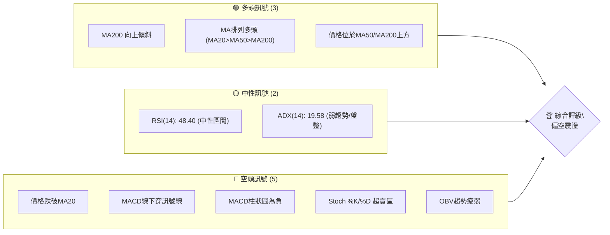

### 📊 核心指標速覽表

| 指標類別 | 指標名稱 | 當前數值 | 訊號 | 解讀 |
|----------|----------|----------|------|------|
| **價格** | 當前價格 | $215.62 | 🔴 | 價格位於短期MA下方，逼近中期MA |
| **均線** | MA20 | $249.11 | 🔴 | 價格遠低於MA20，短期趨勢轉弱 |
| **均線** | MA50 | $215.09 | 🟡 | 價格貼近MA50，MA50為關鍵支撐 |
| **均線** | MA200 | $132.94 | 🟢 | 價格遠高於MA200，長期趨勢強勁 |
| **動能** | RSI(14) | 48.40 | 🟡 | 處於中性區間，無明顯超買超賣 |
| **動能** | MACD | 7.808 | 🔴 | MACD線下穿訊號線，柱狀圖為負，空頭動能增強 |
| **動能** | Stoch %K | 8.99 | 🟢 | 進入超賣區，可能醞釀反彈 |
| **趨勢** | ADX(14) | 19.58 | 🟡 | 趨勢強度不足，市場處於盤整或弱勢下跌 |
| **波動** | ATR(14) | $29.50 | 🟢 | 相對較高，日內波動劇烈，提供了潛在的交易機會但風險也高 |
| **布林** | BB %B | 0.17 | 🔴 | 價格接近布林下軌，顯示短期超賣壓力 |
| **成交量**| OBV趨勢 | 疲弱 | 🔴 | 成交量未有效配合價格上漲，反而在下跌中放量，不利多頭 |

### 🏆 技術評分卡

NBIS 目前的技術面評分顯示，其長期趨勢和支撐穩定度尚可，但短期動能、成交量配合以及均線排列均指向弱勢。整體而言，市場處於一個多空拉鋸，但短期空頭略佔上風的狀態。

```
╔══════════════════════════════════════════════════════════════╗
║             技術評分卡 — NBIS (2026-07-04)                   ║
╠══════════════════════════════════════════════════════════════╣
║ 趨勢強度      ████████░░░░░░░░░░░░  40/100  🟡 (ADX弱勢，短期下跌) ║
║ 動能指標      ████░░░░░░░░░░░░░░░░  20/100  🔴 (MACD空頭，Stoch超賣)║
║ 支撐穩定度    ██████████░░░░░░░░░░  50/100  🟡 (MA50/BB下軌提供支撐)║
║ 成交量配合    ████░░░░░░░░░░░░░░░░  25/100  🔴 (OBV疲弱，下跌放量) ║
║ 形態完整度    ██████░░░░░░░░░░░░░░  30/100  🔴 (短期未見明確反轉形態)║
║ 均線排列      ████████░░░░░░░░░░░░  45/100  🟡 (長期多頭，短期破位) ║
╠══════════════════════════════════════════════════════════════╣
║ 綜合評分      ██████░░░░░░░░░░░░░░  35/100  🔴 偏空震盪                     ║
╚══════════════════════════════════════════════════════════════╝
```

---

## 2. 趨勢分析

### 🌐 多時框趨勢分析

NBIS 在過去一年中經歷了顯著的成長，但近期面臨強勁的回調壓力。從月線、週線到日線，我們可以看到不同的趨勢階段和當前所處的市場結構。

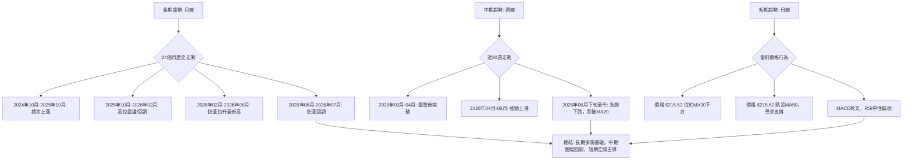

### 📈 長期趨勢 — 12個月走勢圖（Unicode）

NBIS 在過去12個月中展現了強勁的成長趨勢，從2025年7月的$54.43一路飆升至2026年6月的$276.17高點，漲幅高達407%。然而，近期一個月的回調幅度也相當驚人，從高點下跌了約22%。

```
NBIS 月線走勢圖（過去12個月：2025年7月 - 2026年7月）
價格軸 ($)
$276.17 ┤                                     ●(2026-06 高點)
$231.09 ┤                                  ●
$215.62 ┤                                    ●(現在)
$138.23 ┤                            ●
$130.82 ┤             ●
$112.27 ┤           ●
$94.87  ┤              ●
$83.71  ┤               ●
$85.19  ┤                ●
$91.19  ┤                 ●
$103.76 ┤                  ●
$68.32  ┤         ●
$54.43  ┤●━━━━━━━━━━━━━━━━━━━━━━━━━━━━━━━━━━━━━━━━━━━━━
        └──────────────────────────────────────────────────────────
         2025-07  08  09  10  11  12  2026-01  02  03  04  05  06  07
```

**走勢特徵分析表格**：

| 階段       | 期間               | 價格區間     | 漲跌幅 | 走勢特徵                                     |
|------------|--------------------|--------------|--------|----------------------------------------------|
| **強勁上漲** | 2025-07 至 2025-10 | $54.43~$130.82 | +140%  | 經歷兩次大幅拉升，動能強勁。                 |
| **高位整理** | 2025-10 至 2026-03 | $83.71~$130.82 | -36%   | 價格從高點回落，維持在$80-$130區間震盪整理。 |
| **再次爆發** | 2026-03 至 2026-06 | $103.76~$276.17| +166%  | 突破整理區間，再次強勢上漲，創歷史新高。     |
| **快速回調** | 2026-06 至 2026-07 | $215.62~$276.17| -22%   | 從高點快速回落，短期賣壓沉重。               |

### 📊 中期趨勢（週線分析）

從近20週的週線走勢來看，NBIS 在2026年2月至3月期間曾進行過一輪盤整，隨後在3月底至4月初成功突破，並在5月和6月加速上漲。然而，自2026年6月底以來，市場出現了急劇的下行修正，價格迅速跌破了多條短期均線，顯示中期趨勢的看漲動能正在減弱。

```
NBIS 中期壓力與支撐示意圖 (近20週)
價格 ($)
$286.69 ┤                                  ● (歷史高點)
$249.11 ┤                      ─────── MA20
$240.30 ┤                           ● (近期高點阻力)
$215.62 ┤                         ● (現價)
$215.09 ┤                      ─────── MA50 (關鍵支撐)
$198.66 ┤                   ─────── BB下軌
$138.23 ┤                ● (中期支撐)
$132.94 ┤             ─────── MA200
$100.82 ┤         ● (強支撐)
        └──────────────────────────────────────────
         時間軸
```
**分析**：
*   **近期阻力位**：最近的高點 $240.30 (2026-06-28) 和 $286.69 (2026-06-21) 形成了強勁的上方壓力。MA20 ($249.11) 亦構成重要動態阻力。
*   **近期支撐位**：MA50 ($215.09) 是當前最為關鍵的中期支撐位，價格正貼近此處。若跌破，布林下軌 $198.66 將是下一個潛在支撐。更下方，MA200 ($132.94) 則提供了強大的長期支撐。

### ⚡ 趨勢強度評估（ADX 解讀）

ADX 指標用於衡量趨勢的強度，而非方向。+DI 和 -DI 則指示多頭和空頭的力量。

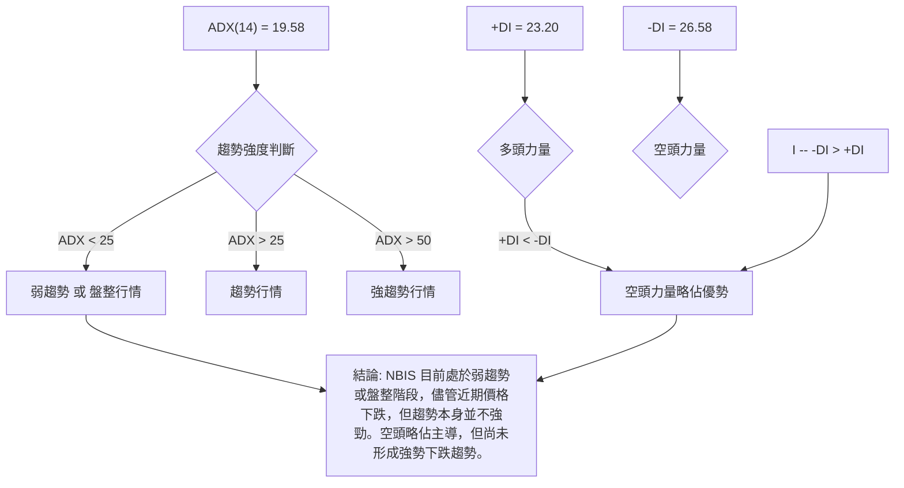

**ADX 強度對照表**：

| ADX 數值範圍 | 趨勢強度 | 市場階段             |
|--------------|----------|----------------------|
| 0-25         | 弱趨勢   | 盤整或震盪，無明顯方向 |
| 25-50        | 中等趨勢 | 趨勢形成或延續中     |
| 50-75        | 強趨勢   | 趨勢加速，動能強勁   |
| 75-100       | 極強趨勢 | 趨勢極度強勁，可能過熱 |

**當前解讀**：NBIS 的 ADX(14) 為 19.58，明顯低於25，這表明市場目前處於一個弱趨勢或盤整的階段，缺乏強勁的單邊趨勢。儘管價格近期出現下跌，但這種下跌並非由強勁的空頭趨勢所推動，更像是前期漲幅過大後的修正與整理。同時，-DI (26.58) 略高於 +DI (23.20)，這表示在當前弱勢趨勢中，空頭力量略微佔據主導地位，但差距不大，多空雙方仍在博弈。

---

## 3. 圖表形態分析

### 🔍 形態識別系統

從提供的月度及週度數據來看，NBIS 在2026年5月底至6月初創下歷史新高後，近期呈現出一個快速回調的走勢。目前尚未形成明確的經典反轉形態（如頭肩頂、雙頂等），但價格從高點回落的速度和幅度，暗示著潛在的頂部構造正在形成或已經完成。若價格繼續跌破關鍵支撐，則可能確認反轉。

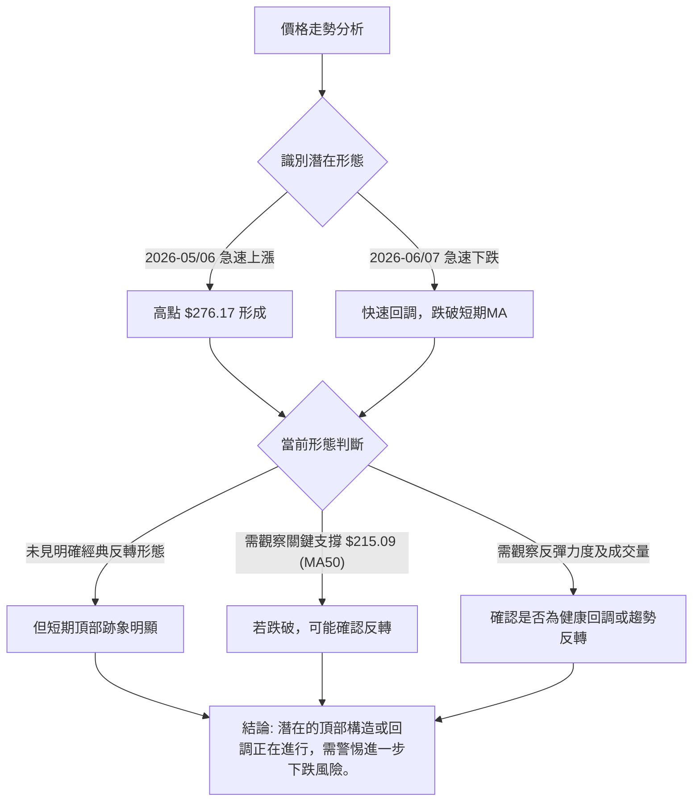

### 🕯️ 重要K線形態分析

根據近20週的週成交量和收盤價，我們觀察到以下幾個重要的週K線形態：

| 日期       | 收盤價 | RSI  | MACD柱 | 週成交量 | K線形態 (週)           | 解讀                                                                                           | 訊號   |
|------------|--------|------|--------|----------|------------------------|------------------------------------------------------------------------------------------------|--------|
| 2026-05-17 | $219.94| 74.5 | +4.465 | 117.2M   | **長陽線 / 突破**      | 價格突破前期平台，RSI進入超買區，成交量放大，顯示強勁的多頭動能。                              | 🟢 強多 |
| 2026-05-24 | $214.77| 62.1 | +0.958 | 84.5M    | **小陰線 / 縮量整理**  | 在大幅上漲後出現縮量小幅回調，RSI從超買區回落，可能為健康整理。                                | 🟡 中性 |
| 2026-06-21 | $286.69| 65.3 | +2.998 | 92.3M    | **長陽線 / 創歷史新高**| 價格再次強勢拉升，創歷史新高，成交量放大。RSI並未同步創出新高，可能存在背離風險。              | 🟢 強多 |
| 2026-06-28 | $240.30| 54.4 | -2.706 | 76.4M    | **長陰線 / 烏雲蓋頂**  | 價格從高點大幅回落，形成長陰線，吞噬前一週部分漲幅。MACD柱狀圖轉負，空頭開始發力。           | 🔴 強空 |
| 2026-07-05 | $215.62| 48.4 | -6.630 | 82.7M    | **長陰線 / 延續下跌**  | 價格繼續大幅下跌，形成另一根長陰線，MACD柱狀圖負值擴大，RSI跌破50，確認短期空頭趨勢。       | 🔴 強空 |

### 📉 ASCII 走勢形態示意圖

從2026年6月中旬至7月初的走勢，NBIS 呈現出一個潛在的「M頂」或「雙頂」形態的初期跡象。雖然右肩尚未明確形成，但從高點的急劇下跌和隨後的反彈無力，顯示出空頭力量的介入。

```
NBIS 近期走勢形態示意圖 (潛在M頂形成中)
價格 ($)
$286.69 ┤               ● (Peak 1)
$276.17 ┤             ╱
$240.30 ┤           ╱─● (Peak 2 嘗試，未破前高)
$215.62 ┤         ╱   ╲ ← 現價
$198.66 ┤─────── S1 ──── S1 (頸線/支撐)
        └───────────────────────────
         時間軸 (2026-06 ~ 2026-07)
```
**形態分析**：
*   **潛在的 M 頂形態**：價格在2026年6月21日達到第一個高點 $286.69，隨後快速回落至 $240.30。如果價格在反彈後未能突破 $286.69 再次下跌，並最終跌破 $215.09 (MA50) 附近的關鍵支撐，則M頂形態將被確認。
*   **短期趨勢反轉**：連續兩週的長陰線，以及MACD柱狀圖的快速擴大，表明短期內市場情緒已經由極度樂觀轉向悲觀。

### 🎯 形態目標價計算

由於目前M頂形態尚未完全確認，我們暫時無法給出精確的M頂目標價。但可以根據形態的潛在頸線以及高點來預估。
*   **潛在頸線**：如果將MA50 ($215.09) 視為潛在頸線，那麼一旦跌破，將可能引發更深的回調。
*   **下跌目標價估算 (基於高點與頸線)**：
    *   形態高度 (H) = 第一個高點 - 潛在頸線 = $286.69 - $215.09 = $71.60
    *   **初步目標價** = 潛在頸線 - 形態高度 = $215.09 - $71.60 = $143.49
    *   此目標價位於MA200 ($132.94) 附近，具有一定的合理性。
**重要提示**：此目標價僅為初步估算，需等待形態完全確認且頸線被有效跌破後才能視為有效。在形態確認前，價格仍可能在此區域震盪或反彈。

---

## 4. 支撐與阻力

### 🗺️ 關鍵價位分布圖（Unicode）

NBIS 目前的價格正處於多重支撐與阻力的交匯點，特別是MA50和布林下軌提供了重要的短期心理和技術支撐。

```
NBIS 價位結構分布圖
═══════════════════════════════════════════════════
$299.86 ║████████████████████████║ 強阻力 R3 (52週高點)
$299.56 ║████████████████████████║ 布林上軌 (強阻力)
$286.69 ║████████████████████████║ 歷史高點 / 強阻力 R2
$249.11 ║████████████████████    ║ MA20 / 關鍵阻力 R1
$244.21 ║████████████████████████║ 分析師平均目標價
$215.62 ╠════════════════════════╣ ◄ 現價
$215.09 ║▓▓▓▓▓▓▓▓▓▓▓▓▓▓▓▓        ║ MA50 / 近期支撐 S1 (極關鍵)
$198.66 ║▓▓▓▓▓▓▓▓▓▓▓▓▓▓▓▓        ║ 布林下軌 / 支撐 S2
$132.94 ║████████████████████████║ MA200 / 強支撐 S3
$120.00 ║████████████████████████║ 分析師最低目標價
$43.89  ║████████████████████████║ 52週低點 / 極強支撐 S4
═══════════════════════════════════════════════════
```

### 🚧 阻力位分析表

NBIS 面臨多重上方阻力，任何反彈都可能在這些價位遇到賣壓。

| 阻力級別 | 價位     | 形成原因                                   | 突破難度 | 重要性 |
|----------|----------|--------------------------------------------|----------|--------|
| **R1**   | $249.11 | 短期MA20，也是近期下跌前的盤整區下沿。     | 中等     | 關鍵     |
| **R2**   | $286.69 | 歷史高點 (2026-06-21)，大量套牢盤壓力。    | 高       | 非常關鍵 |
| **R3**   | $299.56 | 布林上軌，52週高點 $299.86 附近。          | 極高     | 極端關鍵 |

### 🛡️ 支撐位分析表

NBIS 當前價格正處於關鍵支撐位，此處的表現將決定短期走勢。

| 支撐級別 | 價位     | 形成原因                                   | 守住機率 | 重要性 |
|----------|----------|--------------------------------------------|----------|--------|
| **S1**   | $215.09 | 中期MA50，與當前價格 $215.62 極為接近。     | 中等偏低 | 極端關鍵 |
| **S2**   | $198.66 | 布林下軌，短期超賣區間的自然支撐。         | 中等     | 關鍵     |
| **S3**   | $132.94 | 長期MA200，歷史上多次提供強勁支撐。        | 高       | 非常關鍵 |
| **S4**   | $43.89  | 52週低點，極端情況下的最終支撐。           | 極高     | 極端關鍵 |

### 📐 斐波那契回調位分析

我們以2026年3月最低點（約 $89.33，取週線數據中的 $89.33）作為波段起點，2026年6月高點 $286.69 作為波段終點，計算其斐波那契回調位。

*   **波段起點 (A)**: $89.33 (2026-03-08)
*   **波段終點 (B)**: $286.69 (2026-06-21)
*   **波段漲幅**: $286.69 - $89.33 = $197.36

| 回調比例 | 回調價位                                     | 與現價關係                                                     | 評估                                                                                             |
|----------|----------------------------------------------|----------------------------------------------------------------|--------------------------------------------------------------------------------------------------|
| **23.6%**| $286.69 - ($197.36 * 0.236) = $240.06      | 已跌破                                                         | 第一次回調支撐，已失守，顯示回調壓力較大。                                                       |
| **38.2%**| $286.69 - ($197.36 * 0.382) = $211.23      | **現價 $215.62 位於此位上方，距離極近**                      | 關鍵支撐位，與MA50 ($215.09) 和當前價格 $215.62 非常接近，形成強烈共振。此處能否守住至關重要。 |
| **50.0%**| $286.69 - ($197.36 * 0.500) = $188.01      | 位於現價下方                                                   | 若38.2%回調位失守，此處將是下一個重要支撐。                                                      |
| **61.8%**| $286.69 - ($197.36 * 0.618) = $164.79      | 位於現價下方                                                   | 俗稱「黃金分割位」，若回調至此，表示前期漲幅的約三分之二已被收回，趨勢可能面臨逆轉風險。         |

**視覺化斐波那契回調**：
```
NBIS 斐波那契回調示意圖 (2026-03 至 2026-06 波段)
價格 ($)
$286.69 ┤─────────────────────────── (100% - 波段高點)
        │
$240.06 ┤─────────── 23.6% 回調 (已跌破)
        │
$215.62 ┤─● 現價
$211.23 ┤─────────── 38.2% 回調 (關鍵支撐)
        │
$188.01 ┤─────────── 50.0% 回調
        │
$164.79 ┤─────────── 61.8% 回調 (黃金分割)
        │
$89.33  ┤─────────────────────────── (0% - 波段低點)
        └───────────────────────────
         時間軸
```
**結論**：38.2% 的斐波那契回調位 $211.23 與 MA50 $215.09 形成了非常強勁的共振支撐區間 ($211.23 - $215.09)。這個區域對於 NBIS 的中期走勢至關重要。若能在此處獲得有效支撐並反彈，則可能只是健康的回調；若跌破此區間，則可能預示著更深層次的修正或趨勢逆轉。

---

## 5. 技術指標深度解讀

### 🎛️ 指標訊號總覽

NBIS 的技術指標顯示出短期空頭主導，中期支撐關鍵，長期基礎穩固的複雜圖景。多數動能指標已轉弱或進入超賣區，而趨勢指標則顯示市場缺乏強勁的單邊趨勢。

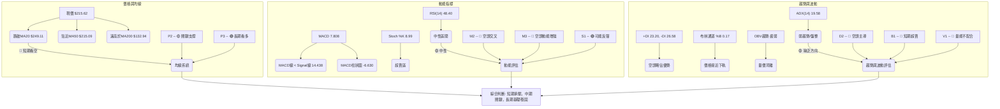

### 📈 移動平均線排列分析

NBIS 的移動平均線系統呈現出一個長期多頭排列，但短期價格行為已經打破了這種和諧。

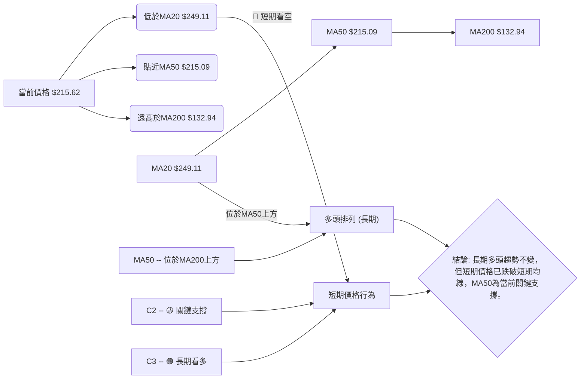
**分析**：
*   **均線排列**：MA20 ($249.11) > MA50 ($215.09) > MA200 ($132.94)，這是一個經典的多頭排列，表明 NBIS 的長期趨勢依然強勁。這也解釋了為何在近期大幅下跌後，分析師平均目標價仍高於現價。
*   **價格與均線關係**：然而，當前價格 $215.62 已經跌破了 MA20 ($249.11)，顯示短期上漲動能已嚴重受損。價格正緊貼著 MA50 ($215.09)，這使得 MA50 成為當前最重要的動態支撐位。
*   **短期趨勢變化**：如果價格跌破 MA50，將預示著中期趨勢也可能轉弱，並可能進一步向 MA200 尋求支撐。反之，若 MA50 能夠提供有效支撐並促使價格反彈，則短期下跌可能只是健康回調。

### 📉 RSI(14) 分析

RSI(14) 數值為 48.40，處於中性區間 (30-70)，既非超買也非超賣。這表明市場短期內沒有極端的多頭或空頭情緒。

**RSI 進度條**：
RSI(14): ▓▓▓▓▓▓▓▓▓▓▓▓▓▓▓▓▓▓▓▓▓▓▓▓░░░░░░░░░░░░░░░░░░░░░░░░░░░░░░░░░░░░░░░░░░░░░░░░░░░░░░░░░░░░░░░░░░ 48.40 (中性)

**超買超賣區間分析**：
*   **超買區 (RSI > 70)**：在2026-04-19 (RSI 79.2) 和 2026-05-17 (RSI 74.5) 價格達到階段性高點時，RSI 曾進入超買區。這通常預示著短期回調的可能性。
*   **超賣區 (RSI < 30)**：目前 RSI 遠未進入超賣區，表明儘管價格下跌，但尚未達到極度恐慌性拋售的程度。

**背離判斷**：
*   **頂背離**：觀察2026-06-21，價格創下 $286.69 的歷史新高，而當時 RSI 為 65.3。回溯到2026-05-17，價格為 $219.94，RSI 為 74.5。這是一個潛在的**頂背離**訊號：價格創出更高的高點，但RSI未能同步創出更高的高點，反而有所下降。這通常是看跌的早期預警訊號，暗示上漲動能正在減弱，隨後價格確實出現了大幅回調。
*   **底背離**：目前沒有明顯的底背離訊號。

**結論**：RSI 的頂背離訊號在前期高點處提供了有效的預警，而當前 RSI 處於中性偏弱區域，結合價格跌破MA20，確認了短期回調的趨勢。

### 📊 MACD(12/26/9) 訊號解讀

MACD 指標是判斷趨勢強度和轉變的重要工具。

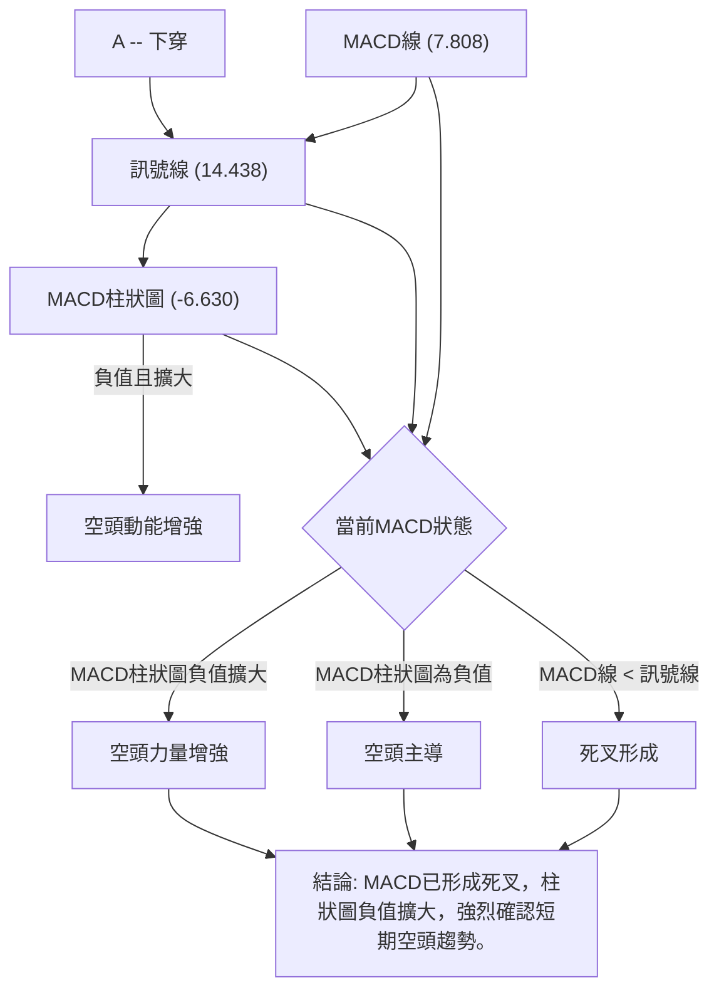
**分析**：
*   **MACD線 (7.808) 低於訊號線 (14.438)**：這表示 MACD 已經形成了「死叉」，是一個明確的看跌訊號，表明短期動能已轉為空頭。
*   **MACD柱狀圖 (-6.630)**：柱狀圖為負值，並且從前一週的 -2.706 擴大到 -6.630，這表明空頭動能正在加速增強，賣壓沉重。
*   **背離判斷**：
    *   **頂背離**：在2026年6月21日，價格創出新高 ($286.69)，而 MACD 柱狀圖在之前的高點 (2026-05-17，MACD柱 +4.465) 之後未能創出更高的高點 (2026-06-21，MACD柱 +2.998)，甚至出現了負值。MACD線本身也未能創出新高。這是一個明確的**頂背離**訊號，預示著上漲動能的衰竭和潛在的趨勢反轉。
    *   **底背離**：目前沒有明顯的底背離訊號。

**結論**：MACD 指標的死叉和柱狀圖負值擴大，以及前期高點的頂背離，都提供了強烈的看跌訊號，確認了 NBIS 短期內面臨的下行壓力。

### 📦 布林通道分析

布林通道能衡量股價的波動範圍和相對位置。

```
NBIS 布林通道示意圖
價格 ($)
$299.56 ┤─────────────────────────── BB上軌 (強阻力)
        │
$249.11 ┤─────────── BB中軌 (MA20)
        │
$215.62 ┤─● 現價
        │
$198.66 ┤─────────── BB下軌 (關鍵支撐)
        │
        └───────────────────────────
         時間軸
```
**分析**：
*   **價格位置**：當前價格 $215.62 位於布林通道的中軌 (MA20 $249.11) 和下軌 ($198.66) 之間，且非常接近下軌。
*   **BB %B**：0.17 的數值表明價格位於布林通道下部約17%的位置。這是一個偏低的值，通常暗示著短期超賣狀態或下跌趨勢的延續。
*   **通道寬度**：ATR(14) 為 $29.50 (佔價格的13.68%)，顯示通道相對較寬，波動性較大。這意味著價格在通道內有較大的移動空間。
*   **中軌壓力**：MA20 作為中軌，已成為當前反彈的第一道阻力。
*   **下軌支撐**：布林下軌 $198.66 提供了技術上的支撐。如果價格跌破下軌，可能預示著下跌趨勢的加速。

**結論**：布林通道顯示 NBIS 股價短期內處於偏弱勢的超賣狀態，但尚未完全跌破下軌，下軌提供了一定的支撐。中軌則構成反彈的強阻力。

### 💹 成交量分析（量價配合度）

成交量是判斷價格走勢健康度的重要輔助指標。

*   **最新成交量**：24,901,800
*   **20日均量**：18,409,515 (量比: 1.35x)
*   **50日均量**：18,035,690

**分析**：
*   **近期成交量放大**：最新成交量 24.9M 明顯高於20日和50日均量，量比達到 1.35x。這表明在當前的下跌過程中，成交量有所放大。
*   **OBV趨勢疲弱**：數據明確指出 "OBV趨勢: OBV < MA → 量能疲弱"。這是一個關鍵的看跌訊號。儘管近期成交量放大，但如果 OBV 趨勢疲弱，說明放大的成交量主要是由賣盤貢獻，即在價格下跌時，有大量的資金流出。這構成了典型的**量價背離**：價格下跌，但成交量放大（或OBV下降），確認了下跌的有效性。
*   **量價配合度**：
    *   在2026年6月21日價格創歷史新高時，週成交量為 92.3M，屬於較高水平，但RSI和MACD出現背離。
    *   隨後兩週的下跌，週成交量分別為 76.4M 和 82.7M，雖然略低於高峰，但仍處於相對高位，且伴隨長陰線，這表明下跌動能強勁且有大量賣盤支撐。

**結論**：成交量分析揭示了 NBIS 股價下跌的有效性。近期下跌伴隨著相對較大的成交量，且 OBV 趨勢疲弱，這確認了當前的賣壓強勁，並非縮量調整。這種量價配合不利於多頭，預示著短期內股價可能繼續承壓。

---

## 6. 動能與波動率

### ⚡ 動能評估四象限

動能評估四象限分析，將股票的「動能強度」與「波動率」結合，幫助判斷當前市場環境和交易機會。

| 象限 | 動能 (RSI/MACD) | 波動 (ATR) | 當前狀態 | 評估                                   |
|------|-----------------|------------|----------|----------------------------------------|
| Q1   | 強 (RSI > 50, MACD金叉) | 低 (ATR < 均值) | -        | **最佳機會**：趨勢明確，風險可控。       |
| Q2   | 弱 (RSI < 50, MACD死叉) | 低 (ATR < 均值) | -        | **謹慎觀望**：盤整或尋底，等待方向。     |
| Q3   | 強 (RSI > 50, MACD金叉) | 高 (ATR > 均值) | -        | **高風險高收益**：趨勢強勁但波動大，適宜短線高手。 |
| Q4   | 弱 (RSI < 50, MACD死叉) | 高 (ATR > 均值) | ✓ (NBIS) | **避免進場**：趨勢不明確，波動大，風險高。 |

**NBIS 當前狀態評估**：
*   **動能**：RSI 48.40 偏弱，MACD 死叉且柱狀圖負值擴大，顯示動能為「弱」。
*   **波動率**：ATR(14) 為 $29.50，佔價格的 13.68%。相較於一般大型股，此波動率較高。
*   **結論**：NBIS 目前處於 **Q4 (弱動能, 高波動)** 象限。這表示市場缺乏明確方向（弱動能），但價格變動劇烈（高波動）。在這種環境下，交易難度較高，風險較大，對於大多數投資者而言，應避免追高殺跌，保持謹慎觀望。若進行交易，需嚴格控制倉位和止損。

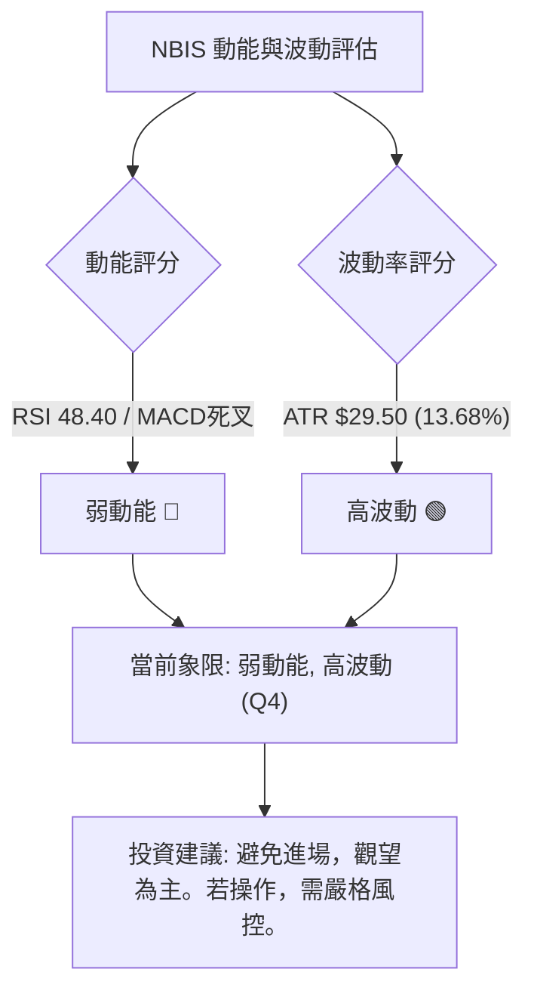

### 📊 ATR 波動率分析

ATR (Average True Range) 是衡量資產價格波動性的指標。NBIS 的 ATR(14) 為 $29.50。

*   **ATR 數值解讀**：ATR 數值較高，達到 $29.50，佔當前價格 $215.62 的 13.68%。這表明 NBIS 每日的平均波動幅度較大，屬於高波動性股票。高波動性既提供了日內交易的機會，也意味著潛在的風險敞口更大。
*   **止損距離建議**：對於高波動性股票，傳統的固定止損點可能過於緊密，容易被日常波動觸發。建議採用基於 ATR 的動態止損策略：
    *   **短線交易者**：可考慮將止損設置在當前價格下方 1.5 倍 ATR 處，即 $215.62 - (1.5 * $29.50) = $215.62 - $44.25 = $171.37。
    *   **中長線交易者**：可考慮將止損設置在當前價格下方 2 倍 ATR 處，即 $215.62 - (2 * $29.50) = $215.62 - $59.00 = $156.62。
    *   **當前情境**：鑑於 NBIS 正在測試 MA50 支撐，若價格跌破 MA50 ($215.09) 並收盤在此下方，則應考慮止損，防止進一步下跌。

### 📐 Beta 與市場相關性

提供的數據中未包含 NBIS 的 Beta 值，因此無法直接分析其與大盤的相關性。

**推演與假設**：
*   NBIS 屬於「Communication Services」板塊下的「Internet Content & Information」產業，並且提供「full-stack infrastructure to service the global AI industry」。這類科技成長股通常具有較高的 Beta 值，即對市場波動更敏感，在大盤上漲時漲幅更大，下跌時跌幅也可能更大。
*   鑑於其近期股價的劇烈波動，以及其所處的 AI 相關熱門賽道，推測其 Beta 值可能高於1，暗示其股價波動會放大市場的波動。
*   **投資啟示**：如果 NBIS 具有高 Beta，那麼在當前市場整體波動較大或存在下行風險時，NBIS 的股價可能會承受更大的壓力。投資者在配置時應考慮整體市場環境對高 Beta 股票的影響。

---

## 7. 多時框架總結

綜合分析 NBIS 在不同時間框架下的技術訊號，可以更全面地理解其當前市場地位和潛在走勢。

### 📋 時框架評分表

| 時框架 | 趨勢方向 | 動能      | 均線排列 | 形態           | 綜合評分 | 建議     |
|--------|----------|-----------|----------|----------------|----------|----------|
| **短期** | 🔴 下跌   | 🔴 弱勢   | 🔴 破位   | 🔴 潛在反轉    | 2/10     | **賣出/觀望** |
| **中期** | 🟡 震盪   | 🟡 中性偏弱 | 🟡 關鍵支撐 | 🟡 頂部構造中 | 4/10     | **謹慎持有/觀望** |
| **長期** | 🟢 上漲   | 🟢 潛在支撐 | 🟢 多頭排列 | 🟢 趨勢未破    | 7/10     | **長期持有** |

### 🔲 綜合訊號矩陣

此矩陣視覺化了不同時間框架和技術維度之間的訊號一致性。

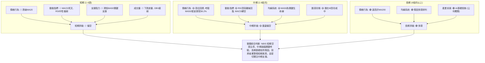
**分析**：
*   **短期與中期的一致性**：短期和中期訊號高度一致地指向空頭或震盪偏空。價格跌破短期均線，動能指標轉弱，且存在潛在的頂部形態。MA50 和斐波那契38.2% 回調位 ($211.23 - $215.09) 構成中期最關鍵的支撐區間。
*   **長期與短期/中期的矛盾**：儘管短期和中期面臨壓力，但長期來看，NBIS 的均線系統仍維持多頭排列，價格遠高於MA200，表明其長期上升趨勢的根基依然存在。這種矛盾意味著當前的下跌可能被視為長期趨勢中的一次深度回調或修正。
*   **關鍵觀察點**：MA50 ($215.09) 和斐波那契38.2%回調位 ($211.23) 的共振支撐區間，是判斷 NBIS 是否能止跌企穩的決定性因素。若此處失守，則中期趨勢恐將進一步惡化。

---

## 8. 交易策略建議

基於 NBIS 的多時框架技術分析，目前市場處於短期空頭主導，但中期關鍵支撐正在測試，長期趨勢仍為多頭的複雜局面。因此，交易策略應以謹慎為主，並密切關注關鍵支撐位的表現。

### 🗺️ 策略決策流程圖

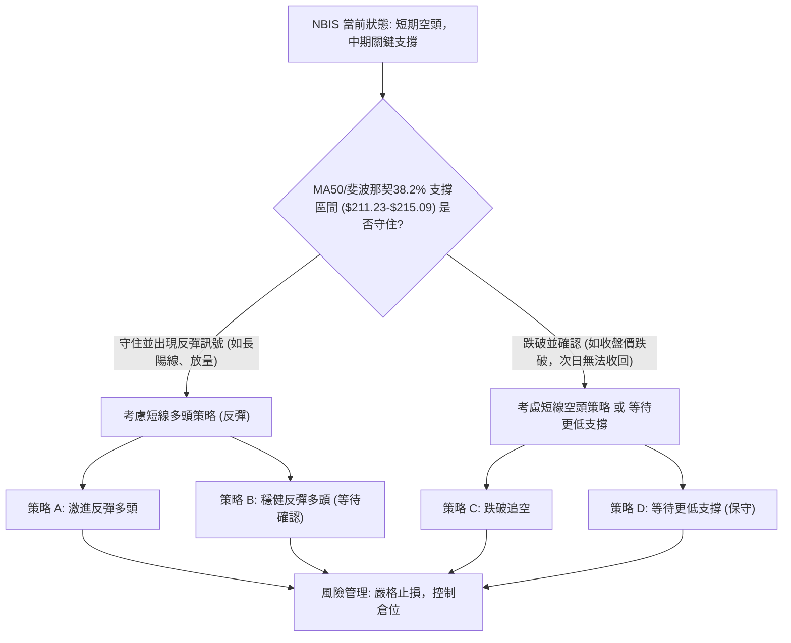

### 🟢 多頭策略詳情

鑑於當前市場的短期弱勢和中期關鍵支撐，多頭策略應以「反彈交易」為主，且需極為謹慎。

| 策略要素 | 策略 A: 激進反彈多頭 (基於Stoch超賣) | 策略 B: 穩健反彈多頭 (基於MA50/斐波那契支撐確認) |
|----------|------------------------------------|----------------------------------------------------|
| **進場條件** | Stoch %K 在超賣區 (8.99) 且 MACD 柱狀圖收斂，出現小陽線。 | 價格在 $211.23-$215.09 區間獲得支撐，出現放量長陽線，或K線組合反轉形態。 |
| **進場價格** | $215.62 附近 (現價)，或等待小幅企穩後。 | $215.09 或 $211.23 附近，待止跌訊號確認後進場。 |
| **目標價 T1** | $230.00 (短期反彈目標，接近前期小平台) | $249.11 (MA20/布林中軌，強阻力)                   |
| **目標價 T2** | $249.11 (MA20/布林中軌，強阻力)           | $270.00 (回補部分跌幅，接近前高一半)             |
| **止損價格** | $210.00 (跌破MA50和斐波那契38.2%下沿)   | $208.00 (跌破關鍵支撐區間的更低位)               |
| **風險報酬比** | ($230.00 - $215.62) : ($215.62 - $210.00) = 14.38 : 5.62 ≈ **2.56:1** | ($249.11 - $215.09) : ($215.09 - $208.00) = 34.02 : 7.09 ≈ **4.80:1** |
| **成功機率** | 40% (激進，風險較高)                       | 55% (等待確認，相對穩健)                           |
| **建議倉位** | 5-10% (小倉位試探)                         | 10-15% (中等倉位)                                  |

### 🔴 空頭策略詳情

鑑於 MACD 死叉、RSI 頂背離、下跌放量以及價格跌破短期均線，空頭策略具有較高的短期勝率。

| 策略要素 | 策略 C: 跌破關鍵支撐追空 (波段空頭) | 策略 D: 反彈受阻做空 (高位做空) |
|----------|------------------------------------|----------------------------------|
| **進場條件** | 價格有效跌破 $211.23 (斐波那契38.2%) 並收盤在其下方，伴隨放量。 | 價格反彈至 MA20 ($249.11) 或 $230.00 附近受阻，出現長上影線或陰線。 |
| **進場價格** | $210.00 附近 (跌破確認後)             | $245.00 附近 (MA20下方)         |
| **目標價 T1** | $198.66 (布林下軌)                     | $215.09 (MA50)                   |
| **目標價 T2** | $188.01 (斐波那契50%)                  | $198.66 (布林下軌)               |
| **止損價格** | $215.09 (重新站穩MA50上方)             | $255.00 (突破MA20上方)           |
| **風險報酬比** | ($210.00 - $198.66) : ($215.09 - $210.00) = 11.34 : 5.09 ≈ **2.23:1** | ($245.00 - $215.09) : ($255.00 - $245.00) = 29.91 : 10.00 ≈ **2.99:1** |
| **成功機率** | 60% (順勢交易，勝率較高)               | 50% (等待反彈，風險較高，但潛在收益大) |
| **建議倉位** | 10-15% (中等倉位)                      | 5-10% (小倉位)                   |

### ⭐ 整體訊號強度評星

綜合所有技術指標和多時框架分析，NBIS 的短期展望偏向空頭，中期趨勢面臨考驗，長期基礎尚存。

做多訊號強度：★★☆☆☆  (2/5星) 理由：雖然Stoch超賣，長期均線多頭，但短期趨勢和動能極弱，反彈風險高。
做空訊號強度：★★★☆☆  (3/5星) 理由：MACD死叉，RSI頂背離，下跌放量，價格跌破短期均線，空頭訊號明確。
整體可信度：  ★★★☆☆  (3/5星) 理由：多數短期指標一致看空，但中期關鍵支撐尚未失守，長期趨勢未逆轉，增加了判斷複雜性。

---

## 9. 風險提示與監控

### ✅ 關鍵監控指標 Checklist

以下是投資者在交易 NBIS 時應密切關注的關鍵技術指標和價位：

╔══════════════════════════════════════════════════════════════╗
║                    NBIS 關鍵監控指標清單                       ║
╠══════════════════════════════════════════════════════════════╣
║ ├─ **價格行為**                                               ║
║ ║    [ ] 價格是否跌破 MA50 ($215.09) 並有效收盤在其下方？    ║
║ ║    [ ] 價格是否跌破斐波那契38.2%回調位 ($211.23)？         ║
║ ║    [ ] 價格反彈時，是否能突破 MA20 ($249.11)？             ║
║ ├─ **動能指標**                                               ║
║ ║    [ ] MACD線是否重新金叉訊號線？                          ║
║ ║    [ ] MACD柱狀圖負值是否收斂或轉正？                      ║
║ ║    [ ] RSI是否進入超賣區 (RSI < 30) 並出現反彈？           ║
║ ║    [ ] Stoch %K/%D 是否從超賣區金叉向上？                  ║
║ ├─ **成交量**                                                 ║
║ ║    [ ] 下跌是否伴隨縮量？ (有利多頭)                        ║
║ ║    [ ] 反彈是否伴隨放量？ (有利多頭)                        ║
║ ║    [ ] OBV趨勢是否止跌回升，並突破其均線？                 ║
║ ├─ **趨勢強度**                                               ║
║ ║    [ ] ADX是否開始向上突破25，且+DI是否明顯高於-DI？       ║
║ └─ **圖表形態**                                               ║
║    [ ] 是否形成明確的底部反轉形態 (如雙底、頭肩底)？         ║
║    [ ] 潛在M頂形態的頸線 ($211.23-$215.09) 是否被有效跌破？  ║
╚══════════════════════════════════════════════════════════════╝

### ⚠️ 風險場景分析

NBIS 的未來走勢取決於多重因素，以下是三種可能的情境分析：

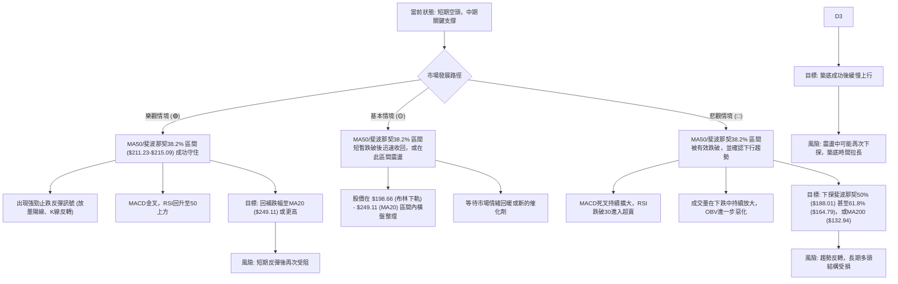

### 🛡️ 風險管理重要提醒

1.  **嚴格止損**：鑑於 NBIS 的高波動性 (ATR $29.50)，務必設定並嚴格執行止損點。不要讓小幅虧損演變成巨額損失。
2.  **倉位控制**：在當前不確定的市場環境下，建議採用較小的倉位進行交易，特別是對於激進的多頭反彈策略。將單次交易的風險控制在總資本的 1-2% 以內。
3.  **分批建倉/平倉**：避免一次性重倉進出。可以分批買入或賣出，以平均成本，降低單點進出的風險。
4.  **關注基本面**：雖然本報告是技術分析，但 NBIS 作為 AI 基礎設施相關公司，其基本面（如 AI 產業發展、公司業績、競爭格局）的任何變化都可能迅速影響股價。
5.  **市場情緒**：AI 相關股票容易受市場情緒影響。在市場情緒高漲時，股價可能超漲；在情緒低迷時，也可能超跌。
6.  **多空平衡**：目前多空力量複雜，不宜過度偏向單邊。在做多時警惕阻力，在做空時留意支撐。
7.  **等待確認**：對於任何反轉訊號，都應等待足夠的確認（例如，K線形態、成交量、指標交叉等）再行動，避免盲目猜底或猜頂。

---

## 📋 報告總結

```
NBIS 技術分析報告總結
════════════════════════════════════════════════════════
報告日期：2026-07-04
當前價格：$215.62
分析評級：⚖️ 偏空震盪 (短期面臨賣壓，中期考驗關鍵支撐)

關鍵結論：
├─ 長期趨勢：🟢 強勁上漲，MA200 提供堅實基礎。
├─ 中期趨勢：🟡 高位回調，正測試 MA50 ($215.09) 和斐波那契38.2% ($211.23) 關鍵支撐區間。
├─ 短期趨勢：🔴 顯著下跌，價格跌破 MA20，MACD 死叉，RSI 頂背離後回落，量價配合確認賣壓。
├─ 關鍵支撐：$215.09 (MA50) / $211.23 (斐波那契38.2%)。
├─ 關鍵阻力：$249.11 (MA20/布林中軌) / $286.69 (歷史高點)。
└─ 分析師目標：平均 $244.21，顯示長期潛力，但短期壓力被技術面確認。

最優策略組合：
1. 🥇 **最佳機會**：若價格有效跌破 $211.23，考慮短線追空至 $198.66 或 $188.01。
2. 🥈 **次選機會**：若在 $211.23-$215.09 區間出現明確止跌反轉訊號，可小倉位嘗試短線反彈多頭至 $230.00 或 $249.11。
3. 🥉 **保守選擇**：保持觀望，等待市場趨勢明朗，或確認在 $188.01 或更低價位形成明確底部後再考慮佈局。
════════════════════════════════════════════════════════
```

---

> ⚠️ **免責聲明**：本報告為 AI 自動生成之技術分析，所有數據及估算均基於提供的歷史價格資訊。本報告**僅供研究與學術參考**，**不構成任何投資建議**。投資有風險，入市需謹慎。

---

*報告生成時間：2026-07-04 ｜ 數據來源：提供資料 ｜ 分析框架：多時框技術分析*