<details>
<summary>📊 靜態圖表 (點擊展開)</summary>
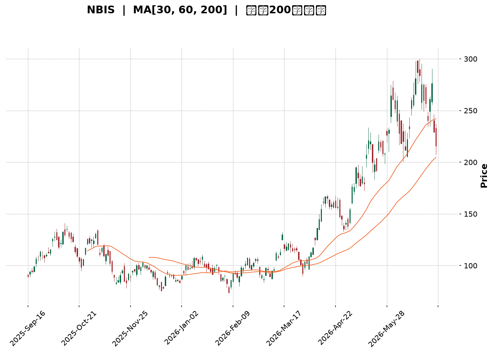
</details>

<html>
<head><meta charset="utf-8" /></head>
<body>
    <div style="height:500px; width:100%;">                        <script>window.PlotlyConfig = {MathJaxConfig: 'local'};</script>
        <script charset="utf-8" src="https://cdn.plot.ly/plotly-3.6.0.min.js" integrity="sha256-QaOVwtVY0T02VaHrr6pnoHLCwayMJp4O5n4YyaE3rJk=" crossorigin="anonymous"></script>                <div id="candlestick-chart" class="plotly-graph-div" style="height:100%; width:100%;"></div>            <script>                window.PLOTLYENV=window.PLOTLYENV || {};                                if (document.getElementById("candlestick-chart")) {                    Plotly.newPlot(                        "candlestick-chart",                        [{"close":{"dtype":"f8","bdata":"AAAAIIVbVkAAAADAHoVXQAAAACCuh1dAAAAAANfTWEAAAABgZqZaQAAAAEAz81pAAAAAYLhOXEAAAAAAKfxaQAAAAMDM7FpAAAAAgBSOW0AAAACgRxFcQAAAAEAK51xAAAAAIK53X0AAAABguP5fQAAAAAApPF9AAAAAwMxsXUAAAAAAAIBeQAAAAOB6lGBAAAAAYI8yYEAAAABguO5gQAAAAMDMBGBAAAAAwB51X0AAAABgj8JeQAAAAAApXFxAAAAAAABAW0AAAACA6xFaQAAAACCup1hAAAAAgD2KWkAAAADgo1BdQAAAACCFW19AAAAAwB51XkAAAABgZkZfQAAAACCFC19AAAAAgD1aYEAAAACAFB5eQAAAAGCPoltAAAAAAABAXUAAAAAAKVxbQAAAAIDr0VtAAAAAwMx8W0AAAACAFI5ZQAAAAEAKl1dAAAAA4FEoVkAAAABgj+JUQAAAAGC4flVAAAAAYI+iVkAAAADgesRXQAAAAMD1KFVAAAAA4KPQVEAAAACgmflWQAAAAOBROFZAAAAAACmsV0AAAAAgrrdXQAAAAKCZCVlAAAAAwMwcWEAAAABA4bpYQAAAAEAzs1lAAAAAYI+CWEAAAADAHhVZQAAAAIA9GlhAAAAAgMJlV0AAAACA65FXQAAAAAAp7FVAAAAAwPVIVEAAAADAzDxUQAAAAMDM3FJAAAAAgMKFU0AAAACgcF1WQAAAAGC4TldAAAAAgOuBVkAAAADgUchWQAAAAIDC5VVAAAAAYI+CVUAAAABA4UpVQAAAAMAe7VRAAAAAwMx8VkAAAADAHjVXQAAAACBcD1lAAAAAoHANWEAAAABAM1NYQAAAACCFe1hAAAAAwB7VWkAAAAAghVtaQAAAAGC4fllAAAAA4KP4WUAAAABguC5bQAAAAGCP0lhAAAAAIK63WEAAAABgZjZYQAAAAAAAoFdAAAAAoHDdVkAAAAAgrndYQAAAACCFG1lAAAAAgD26V0AAAAAAKUxVQAAAAIA9ClZAAAAAwMx8VkAAAADA9ZhUQAAAACCud1JAAAAAYGaGVUAAAADgUThXQAAAAGCP8lZAAAAAQAonVkAAAABguG5WQAAAAOCjgFhAAAAAoEdhWEAAAABAM3NZQAAAAEAK51pAAAAAQOF6WEAAAABACidZQAAAAMAepVlAAAAAIK6HWkAAAADgUThaQAAAAAApzFZAAAAA4KPAVkAAAABAM7NVQAAAAIDrcVhAAAAAoJnpV0AAAADAHlVWQAAAAAApvFdAAAAAIIUbWEAAAAAgrv9bQAAAAGCPAltAAAAAwMw8XEAAAABAMztgQAAAAMAeFV1AAAAAANejXUAAAACgR2FeQAAAACCuZ11AAAAAoJmJXEAAAACAPbpcQAAAAIDCxVxAAAAAgBR+WkAAAADgejRZQAAAAOCjEFdAAAAA4KPwWUAAAADAzHxZQAAAAOB6NFtAAAAAYI8iXEAAAACgmVldQAAAAAAAQF9AAAAAYI8KYUAAAABACh9iQAAAAIDrUWNAAAAAgBQ+ZEAAAADgo9hkQAAAAEDhqmRAAAAA4HqkY0AAAADAHuVjQAAAAKCZkWNAAAAA4HqEY0AAAABgj6JjQAAAAMAeZWJAAAAAYLgeYkAAAADgUfBgQAAAAIAUpmFAAAAAIFxHYUAAAAAgrk9jQAAAAKBwDWZAAAAAoHD9ZUAAAABA4WJoQAAAAOCjGGdAAAAAoJkhZkAAAABAM0NnQAAAACCFY2ZAAAAA4KPoaUAAAADAzKRrQAAAAIAUfmtAAAAAIIX7aEAAAAAgXLdoQAAAAIA9+mdAAAAAgMJ9a0AAAADgo9hqQAAAAIDrAWpAAAAAANcLakAAAABA4UpsQAAAAEDh4mxAAAAAACmIcEAAAACgR0lwQAAAAIDCdW9AAAAAYLg6cEAAAACA63lsQAAAAAAAQGtAAAAAANeDa0AAAACAFHZqQAAAACCux2tAAAAAIIULbUAAAADAHkFwQAAAAKCZkXBAAAAAYI+OcUAAAABACutxQAAAAIDCuXFAAAAAAAA0cUAAAABgjzpwQAAAAIAUCnBAAAAAoJkJbkAAAABgZlJwQAAAAGC4QnFAAAAAgMKlbEAAAAAA1\u002fNqQA=="},"high":{"dtype":"f8","bdata":"AAAAQDPTVkAAAAAAAMBXQAAAACCFa1hAAAAAQDPjWEAAAADAHiVbQAAAAGC4fltAAAAAYGa2XEAAAADAHoVcQAAAACBcf1tAAAAAoEchXEAAAACgmWldQAAAAOBR+FxAAAAAIFyvX0AAAAAAVJ9gQAAAAOBR+GBAAAAAwPUIYEAAAAAA11NfQAAAAIA9qmBAAAAAQDOjYUAAAADA9VBhQAAAAIAWuWBAAAAAIK5\u002fYEAAAABACl9gQAAAAACsJF5AAAAAgBReXUAAAAAghQtbQAAAAEAz81pAAAAAIK6nWkAAAADAzFxdQAAAAAAAoF9AAAAAwPUgYEAAAADAzHxfQAAAAIAUDmBAAAAAwMyEYEAAAACAwt1gQAAAAIDrMV1AAAAAoHCNXUAAAAAAAEBeQAAAAEAz01tAAAAAIK6XXUAAAAAA16NcQAAAAKCZaVpAAAAAYLjeVkAAAAAAAEBWQAAAAKCZaVZAAAAAAClsV0AAAACAFC5YQAAAAAAprFlAAAAAIFwvVkAAAAAAAEBXQAAAAIDr0VZAAAAAgJPoV0AAAADAHkVYQAAAAGBmZllAAAAAwMy8WUAAAAAA18NYQAAAAIDC9VlAAAAAYGZWWUAAAAAAACBZQAAAACCDOFlAAAAAgMJFWEAAAADAzNxXQAAAAKCZ6VdAAAAAIFwPVkAAAAAA12NUQAAAAEAzE1VAAAAAYGYWVEAAAABgj6JWQAAAAKCZ+VdAAAAAgBQ+V0AAAABA4dpWQAAAACCu51ZAAAAAQAonVkAAAACgcL1VQAAAAIAUnlVAAAAA4KOwVkAAAAAAKdxXQAAAACCFK1lAAAAAYGaWWUAAAABgj6JZQAAAAIAUPlpAAAAAIIUrW0AAAADAzPxaQAAAAMDMrFpAAAAA4FEIW0AAAAAAAKBbQAAAAIAUHlpAAAAAoJmZWUAAAABguP5ZQAAAAOCjuFhAAAAA4FE4WUAAAABgj+JYQAAAAGBmdllAAAAAAADQWEAAAABgjwJXQAAAAAAAUFZAAAAAwPXYVkAAAABgj+pVQAAAAOB6NFRAAAAAgD2qVUAAAAAghWtXQAAAAABU41dAAAAAAACwV0AAAADgo7BWQAAAAOB6FFlAAAAAYI\u002fSWEAAAACgmRlaQAAAAGC4\u002flpAAAAA4HoUW0AAAACgbkpZQAAAAAAA8FlAAAAAACncWkAAAADgehRbQAAAAEAz01hAAAAAoMTYVkAAAAAgrndWQAAAAGC4nlhAAAAAAADQWEAAAADAzLxXQAAAAMDMzFdAAAAAoJmZWEAAAADAHoVcQAAAAGCPwltAAAAA4HokXUAAAACgmYlgQAAAAAAAYF5AAAAAQImxXkAAAABAM3NeQAAAAABW7l5AAAAAANdTXkAAAABAM3NdQAAAAEAzs11AAAAAQDNTXEAAAADgo5BaQAAAACBcj1lAAAAAwPX4WUAAAAAgrvdaQAAAAKBwPVtAAAAAgMJ1XEAAAACgmXldQAAAAAAA8F9AAAAAoJkRYUAAAACAPbpiQAAAAAAA8GNAAAAAQDPDZEAAAACA69lkQAAAAGC4FmVAAAAAgOuBZEAAAAAAADhkQAAAAAAAaGRAAAAAgMLtZEAAAACA67lkQAAAAAAAqGRAAAAAoJmZYkAAAABguK5hQAAAAGBm9mFAAAAAIFxfYkAAAAAAAIBjQAAAAMDMbGZAAAAAYLh+ZkAAAAAgrn9oQAAAAOB6vGhAAAAAAACIZ0AAAACAl45oQAAAACCFM2dAAAAAQOEqa0AAAAAgXDdtQAAAAKBHmWxAAAAAgD1Ca0AAAACA61lpQAAAAAAAiGlAAAAAgOtZbEAAAACgcL1rQAAAAOBRoGtAAAAA4Ho0akAAAADgehxtQAAAAEAzM21AAAAAoMQscUAAAACgcG1xQAAAACBct3BAAAAAIIWHcEAAAAAAAFhvQAAAAMDMDG5AAAAAwPW0bUAAAAAgrt9sQAAAACCuj2xAAAAAQOFybkAAAADgUW5wQAAAACCFVXFAAAAAQOGeckAAAADAzKxyQAAAAIDCvXJAAAAAIK5zckAAAACgbkJxQAAAAOBROHFAAAAAoJkZb0AAAADAzHxwQAAAAKCZKXJAAAAAIK7PbkAAAADgUahtQA=="},"hovertemplate":"\u003cb\u003e%{x|%Y-%m-%d}\u003c\u002fb\u003e\u003cbr\u003e\u958b: $%{open:.2f}\u003cbr\u003e\u9ad8: $%{high:.2f}\u003cbr\u003e\u4f4e: $%{low:.2f}\u003cbr\u003e\u6536: $%{close:.2f}\u003cextra\u003e\u003c\u002fextra\u003e","low":{"dtype":"f8","bdata":"AAAAoEcBVkAAAADAHjVWQAAAAIDrAVdAAAAAAABQV0AAAACgR6FYQAAAAAAAEFpAAAAAYGY2WkAAAADgUXhaQAAAAEAzs1lAAAAAwB4VW0AAAACAPepbQAAAAOCjcFtAAAAA4HqkXUAAAABgZuZeQAAAACCFO19AAAAAgBTuXEAAAAAAAGBdQAAAACCu911AAAAA4FEAYEAAAADAzJRgQAAAAAAAcF9AAAAAwMyMXkAAAACgR4FeQAAAAOBRuFtAAAAA4KPgWkAAAACgmVlZQAAAAOBRqFdAAAAAoHDdWEAAAADgo4BbQAAAAEAKB15AAAAAgOsxXkAAAAAAAGBdQAAAAOCjcF1AAAAAQDOTX0AAAAAAAPBdQAAAAAAAQFtAAAAAIIXbW0AAAACAPRpbQAAAAOCjUFlAAAAAgBQuW0AAAADAHvVYQAAAAKBw7VZAAAAAAAAgVUAAAAAAAIBUQAAAAIDC5VRAAAAAoHBtVEAAAABAM\u002fNWQAAAAKBwDVVAAAAAoHCNU0AAAACgmUlVQAAAAOAkLlVAAAAA4KOwVkAAAAAAKVxXQAAAAOCjQFZAAAAAANcDWEAAAAAAAMBWQAAAAIAUXlhAAAAAwMwMWEAAAABAM9NXQAAAAGBmBlhAAAAAwMwMV0AAAADAzKxVQAAAAMDMjFVAAAAAoBgEVEAAAADgUThTQAAAAAAA0FJAAAAA4KNAU0AAAACAPQpUQAAAAGBmxlZAAAAAANcTVkAAAACgmSlWQAAAACBcr1VAAAAAYI8SVUAAAAAA1yNVQAAAAKCZuVRAAAAA4KOAVUAAAADA9bhWQAAAAAApvFZAAAAAANfjV0AAAAAgWAFYQAAAAGBmRlhAAAAAQDMjWEAAAABA4fpZQAAAACCD2FhAAAAAYGZGWUAAAACgcC1ZQAAAAIDClVhAAAAAYGZGV0AAAAAAACBYQAAAAIDrYVdAAAAAQArXVkAAAACA62FXQAAAAAApHFhAAAAAgD3KVkAAAAAgrgdVQAAAAIAUDlVAAAAAAAAwVUAAAAAAKZxTQAAAAKBHYVJAAAAAIK5HU0AAAAAA1\u002fNUQAAAAIA96lZAAAAAwPXIVUAAAAAAKexTQAAAAEAKN1ZAAAAAAABgV0AAAAAg2TZYQAAAACCFG1lAAAAAgOtBWEAAAABAM9NXQAAAAEDfb1hAAAAAQDOzWUAAAAAAAIBZQAAAAKCZGVZAAAAAQDOzVUAAAACA6+FUQAAAAKCZiVZAAAAAIK7nVkAAAABAMzNWQAAAAAAAoFVAAAAAAADAV0AAAAAgXB9aQAAAAKBHoVpAAAAAwPWIW0AAAABgEhtfQAAAAEAKR1xAAAAAAACAXEAAAACgR7FcQAAAAICTKFxAAAAAQDNjXEAAAADgowBcQAAAAMAeVVxAAAAAgD1aWkAAAACgRxFZQAAAAMDKaVZAAAAAYLjuV0AAAABgZlZZQAAAAAApDFhAAAAAwMzcWkAAAACA65FbQAAAAGBm1l1AAAAAQDMjX0AAAADgUdxgQAAAAKCZyWFAAAAA4KPQY0AAAAAAAJBjQAAAAEDhAmRAAAAAIFxXY0AAAACgR0FjQAAAAMDMbGNAAAAAQDNrY0AAAACAPUJjQAAAAIDrOWJAAAAAgOtRYUAAAABgZpZgQAAAAEAKx2BAAAAAAADgYEAAAAAAAIBhQAAAAGBm9mNAAAAAYLgWZUAAAAAgheNlQAAAAAAAIGZAAAAAAAAQZkAAAACgmVFmQAAAAAAAiGVAAAAAAABgaEAAAAAAAPhpQAAAAKCZeWpAAAAAYI\u002fCZ0AAAAAAAOBmQAAAAOB61GdAAAAAoJkZakAAAAAgXFdqQAAAAMAetWlAAAAAgOvJaEAAAADgUWBrQAAAAMDMTGpAAAAAAADAbUAAAAAAADxwQAAAAOBR8G5AAAAAgBRWbUAAAACAFBZrQAAAAGBmNmtAAAAAoJkJaUAAAAAA12tqQAAAAAAAoGlAAAAAAADwa0AAAAAgrqduQAAAAMDMrG9AAAAA4KOEcEAAAABAMzlxQAAAAAAAYHFAAAAAAABgb0AAAABguCZvQAAAAIDrkW9AAAAAwMxMbUAAAAAAAFBtQAAAAKCZ+W9AAAAAoHCFbEAAAABgkelpQA=="},"name":"\u50f9\u683c","open":{"dtype":"f8","bdata":"AAAAwMzMVkAAAABA4epWQAAAAMDMxFdAAAAAwPWIV0AAAADAzHxZQAAAAGCPAltAAAAA4KNIW0AAAAAghQNbQAAAACCFe1tAAAAA4FFYW0AAAADgelxcQAAAAIDC7VtAAAAAoEfxXkAAAABACs9fQAAAAMDMjGBAAAAAwMz0X0AAAADAzExeQAAAAGC4Pl5AAAAAYGbeYEAAAABguOZgQAAAAAAAgGBAAAAAwMx8YEAAAABA4QJgQAAAAADXg11AAAAAYI8yXUAAAADgUfhaQAAAAEAzq1pAAAAAwB4VWUAAAACAPcpbQAAAAIA9Ol5AAAAAANebX0AAAACA6xFfQAAAAMDMTF5AAAAAwPWoX0AAAAAAAMBgQAAAAGC4FlxAAAAAwPVoXEAAAABAM+NdQAAAAAAAIFpAAAAAIIXLXEAAAADgUYhcQAAAAMDMDFpAAAAAwPW4VkAAAABACpdUQAAAAOB69FRAAAAAgOvxVEAAAADgUUBXQAAAACCF21hAAAAAQDNjVUAAAABguI5VQAAAAGCPUlZAAAAAYGZ2V0AAAABAMyNYQAAAAMDM3FZAAAAAQAoXWUAAAACgR8FXQAAAAOB6xFhAAAAAgMIVWUAAAABgj1JYQAAAAIDChVhAAAAAYLjuV0AAAADAzExWQAAAAADXU1dAAAAAYGYGVkAAAADAzORTQAAAAIDCBVVAAAAAQDPDU0AAAACgmSlUQAAAAIAUPldAAAAAANeTVkAAAABguI5WQAAAAOCj4FZAAAAAwMwcVUAAAAAAAJhVQAAAACCuV1VAAAAAQAq\u002fVUAAAAAAAMBXQAAAAIDC7VdAAAAA4KPAWEAAAABgjzJYQAAAAKBHuVhAAAAA4HqUWEAAAADAHtVaQAAAAIDrcVpAAAAAIIUjWkAAAAAgrn9aQAAAAMAedVlAAAAAgMJFWUAAAADgo4BZQAAAAMDMLFhAAAAAoHBtWEAAAABgZpZXQAAAAAAAAFlAAAAAQAqXWEAAAACgQ+NWQAAAAADXc1VAAAAAIIV7VkAAAAAAAMBVQAAAAMD1yFNAAAAAYGbOU0AAAADAzBxVQAAAAGCPOldAAAAAYI86V0AAAABgZgZVQAAAAEAKd1ZAAAAAAAAAWEAAAABguO5YQAAAACCFG1lAAAAAANOlWkAAAAAghRNYQAAAACBc11hAAAAAIFw\u002fWkAAAAAAAIBaQAAAAMDMrFhAAAAAAAAAVkAAAACgmYlVQAAAAKCZmVZAAAAAAAAwWEAAAABAMxNXQAAAAEAK11VAAAAAwPXIV0AAAACAPUpaQAAAAIDCRVtAAAAAACmcW0AAAAAAADBfQAAAAIDCFV5AAAAAQDOzXEAAAADgUdBcQAAAAGBmHl5AAAAAoHAtXUAAAABAMwtdQAAAACCuN11AAAAA4FFQXEAAAADAHnVaQAAAACBcj1lAAAAAYLh+WEAAAADgenxaQAAAAIA9GlhAAAAAgD0qW0AAAAAAAKhbQAAAAOBRuF9AAAAAAABAX0AAAADgUdxgQAAAAGBm1mFAAAAAQDMjZEAAAABgOwdkQAAAAAAA4GRAAAAAwPV4ZEAAAAAAAKBjQAAAAEAKJ2RAAAAAIIVbZEAAAADAzHxjQAAAAKBwdWRAAAAA4HqMYkAAAADAzExhQAAAAEAKg2FAAAAAgOslYkAAAABgj6phQAAAAOBRDGRAAAAAwMx0ZUAAAABACnNmQAAAAOBRwGdAAAAAYGb2ZkAAAADAzHxmQAAAAKBwjWZAAAAAQAp7aUAAAAAAAKxqQAAAACCFM2tAAAAAQAova0AAAAAAAOBnQAAAAEAKf2lAAAAAIK53akAAAADgUWhrQAAAAKCZlWtAAAAAwB75aUAAAAAAKcxsQAAAACCFe2xAAAAAQOGCbkAAAACgmQFxQAAAAKBwQ3BAAAAAIK73bUAAAAAghdtuQAAAAMDMDG5AAAAAAADAbEAAAACgxu9qQAAAAOB6rGlAAAAAwMxUbUAAAABguH5vQAAAAEAK729AAAAAYGaacEAAAABAM6NyQAAAACBcH3JAAAAAAAAccEAAAACgmTFxQAAAAMAeCXFAAAAAQDObbkAAAAAAACxvQAAAAAApJHBAAAAAoMQIbkAAAAAAACBtQA=="},"x":["2025-09-16T00:00:00-04:00","2025-09-17T00:00:00-04:00","2025-09-18T00:00:00-04:00","2025-09-19T00:00:00-04:00","2025-09-22T00:00:00-04:00","2025-09-23T00:00:00-04:00","2025-09-24T00:00:00-04:00","2025-09-25T00:00:00-04:00","2025-09-26T00:00:00-04:00","2025-09-29T00:00:00-04:00","2025-09-30T00:00:00-04:00","2025-10-01T00:00:00-04:00","2025-10-02T00:00:00-04:00","2025-10-03T00:00:00-04:00","2025-10-06T00:00:00-04:00","2025-10-07T00:00:00-04:00","2025-10-08T00:00:00-04:00","2025-10-09T00:00:00-04:00","2025-10-10T00:00:00-04:00","2025-10-13T00:00:00-04:00","2025-10-14T00:00:00-04:00","2025-10-15T00:00:00-04:00","2025-10-16T00:00:00-04:00","2025-10-17T00:00:00-04:00","2025-10-20T00:00:00-04:00","2025-10-21T00:00:00-04:00","2025-10-22T00:00:00-04:00","2025-10-23T00:00:00-04:00","2025-10-24T00:00:00-04:00","2025-10-27T00:00:00-04:00","2025-10-28T00:00:00-04:00","2025-10-29T00:00:00-04:00","2025-10-30T00:00:00-04:00","2025-10-31T00:00:00-04:00","2025-11-03T00:00:00-05:00","2025-11-04T00:00:00-05:00","2025-11-05T00:00:00-05:00","2025-11-06T00:00:00-05:00","2025-11-07T00:00:00-05:00","2025-11-10T00:00:00-05:00","2025-11-11T00:00:00-05:00","2025-11-12T00:00:00-05:00","2025-11-13T00:00:00-05:00","2025-11-14T00:00:00-05:00","2025-11-17T00:00:00-05:00","2025-11-18T00:00:00-05:00","2025-11-19T00:00:00-05:00","2025-11-20T00:00:00-05:00","2025-11-21T00:00:00-05:00","2025-11-24T00:00:00-05:00","2025-11-25T00:00:00-05:00","2025-11-26T00:00:00-05:00","2025-11-28T00:00:00-05:00","2025-12-01T00:00:00-05:00","2025-12-02T00:00:00-05:00","2025-12-03T00:00:00-05:00","2025-12-04T00:00:00-05:00","2025-12-05T00:00:00-05:00","2025-12-08T00:00:00-05:00","2025-12-09T00:00:00-05:00","2025-12-10T00:00:00-05:00","2025-12-11T00:00:00-05:00","2025-12-12T00:00:00-05:00","2025-12-15T00:00:00-05:00","2025-12-16T00:00:00-05:00","2025-12-17T00:00:00-05:00","2025-12-18T00:00:00-05:00","2025-12-19T00:00:00-05:00","2025-12-22T00:00:00-05:00","2025-12-23T00:00:00-05:00","2025-12-24T00:00:00-05:00","2025-12-26T00:00:00-05:00","2025-12-29T00:00:00-05:00","2025-12-30T00:00:00-05:00","2025-12-31T00:00:00-05:00","2026-01-02T00:00:00-05:00","2026-01-05T00:00:00-05:00","2026-01-06T00:00:00-05:00","2026-01-07T00:00:00-05:00","2026-01-08T00:00:00-05:00","2026-01-09T00:00:00-05:00","2026-01-12T00:00:00-05:00","2026-01-13T00:00:00-05:00","2026-01-14T00:00:00-05:00","2026-01-15T00:00:00-05:00","2026-01-16T00:00:00-05:00","2026-01-20T00:00:00-05:00","2026-01-21T00:00:00-05:00","2026-01-22T00:00:00-05:00","2026-01-23T00:00:00-05:00","2026-01-26T00:00:00-05:00","2026-01-27T00:00:00-05:00","2026-01-28T00:00:00-05:00","2026-01-29T00:00:00-05:00","2026-01-30T00:00:00-05:00","2026-02-02T00:00:00-05:00","2026-02-03T00:00:00-05:00","2026-02-04T00:00:00-05:00","2026-02-05T00:00:00-05:00","2026-02-06T00:00:00-05:00","2026-02-09T00:00:00-05:00","2026-02-10T00:00:00-05:00","2026-02-11T00:00:00-05:00","2026-02-12T00:00:00-05:00","2026-02-13T00:00:00-05:00","2026-02-17T00:00:00-05:00","2026-02-18T00:00:00-05:00","2026-02-19T00:00:00-05:00","2026-02-20T00:00:00-05:00","2026-02-23T00:00:00-05:00","2026-02-24T00:00:00-05:00","2026-02-25T00:00:00-05:00","2026-02-26T00:00:00-05:00","2026-02-27T00:00:00-05:00","2026-03-02T00:00:00-05:00","2026-03-03T00:00:00-05:00","2026-03-04T00:00:00-05:00","2026-03-05T00:00:00-05:00","2026-03-06T00:00:00-05:00","2026-03-09T00:00:00-04:00","2026-03-10T00:00:00-04:00","2026-03-11T00:00:00-04:00","2026-03-12T00:00:00-04:00","2026-03-13T00:00:00-04:00","2026-03-16T00:00:00-04:00","2026-03-17T00:00:00-04:00","2026-03-18T00:00:00-04:00","2026-03-19T00:00:00-04:00","2026-03-20T00:00:00-04:00","2026-03-23T00:00:00-04:00","2026-03-24T00:00:00-04:00","2026-03-25T00:00:00-04:00","2026-03-26T00:00:00-04:00","2026-03-27T00:00:00-04:00","2026-03-30T00:00:00-04:00","2026-03-31T00:00:00-04:00","2026-04-01T00:00:00-04:00","2026-04-02T00:00:00-04:00","2026-04-06T00:00:00-04:00","2026-04-07T00:00:00-04:00","2026-04-08T00:00:00-04:00","2026-04-09T00:00:00-04:00","2026-04-10T00:00:00-04:00","2026-04-13T00:00:00-04:00","2026-04-14T00:00:00-04:00","2026-04-15T00:00:00-04:00","2026-04-16T00:00:00-04:00","2026-04-17T00:00:00-04:00","2026-04-20T00:00:00-04:00","2026-04-21T00:00:00-04:00","2026-04-22T00:00:00-04:00","2026-04-23T00:00:00-04:00","2026-04-24T00:00:00-04:00","2026-04-27T00:00:00-04:00","2026-04-28T00:00:00-04:00","2026-04-29T00:00:00-04:00","2026-04-30T00:00:00-04:00","2026-05-01T00:00:00-04:00","2026-05-04T00:00:00-04:00","2026-05-05T00:00:00-04:00","2026-05-06T00:00:00-04:00","2026-05-07T00:00:00-04:00","2026-05-08T00:00:00-04:00","2026-05-11T00:00:00-04:00","2026-05-12T00:00:00-04:00","2026-05-13T00:00:00-04:00","2026-05-14T00:00:00-04:00","2026-05-15T00:00:00-04:00","2026-05-18T00:00:00-04:00","2026-05-19T00:00:00-04:00","2026-05-20T00:00:00-04:00","2026-05-21T00:00:00-04:00","2026-05-22T00:00:00-04:00","2026-05-26T00:00:00-04:00","2026-05-27T00:00:00-04:00","2026-05-28T00:00:00-04:00","2026-05-29T00:00:00-04:00","2026-06-01T00:00:00-04:00","2026-06-02T00:00:00-04:00","2026-06-03T00:00:00-04:00","2026-06-04T00:00:00-04:00","2026-06-05T00:00:00-04:00","2026-06-08T00:00:00-04:00","2026-06-09T00:00:00-04:00","2026-06-10T00:00:00-04:00","2026-06-11T00:00:00-04:00","2026-06-12T00:00:00-04:00","2026-06-15T00:00:00-04:00","2026-06-16T00:00:00-04:00","2026-06-17T00:00:00-04:00","2026-06-18T00:00:00-04:00","2026-06-22T00:00:00-04:00","2026-06-23T00:00:00-04:00","2026-06-24T00:00:00-04:00","2026-06-25T00:00:00-04:00","2026-06-26T00:00:00-04:00","2026-06-29T00:00:00-04:00","2026-06-30T00:00:00-04:00","2026-07-01T00:00:00-04:00","2026-07-02T00:00:00-04:00"],"type":"candlestick"},{"hovertemplate":"MA30: $%{y:.2f}\u003cextra\u003e\u003c\u002fextra\u003e","line":{"color":"#2196F3","dash":"dash","width":2},"mode":"lines","name":"MA30","x":["2025-09-16T00:00:00-04:00","2025-09-17T00:00:00-04:00","2025-09-18T00:00:00-04:00","2025-09-19T00:00:00-04:00","2025-09-22T00:00:00-04:00","2025-09-23T00:00:00-04:00","2025-09-24T00:00:00-04:00","2025-09-25T00:00:00-04:00","2025-09-26T00:00:00-04:00","2025-09-29T00:00:00-04:00","2025-09-30T00:00:00-04:00","2025-10-01T00:00:00-04:00","2025-10-02T00:00:00-04:00","2025-10-03T00:00:00-04:00","2025-10-06T00:00:00-04:00","2025-10-07T00:00:00-04:00","2025-10-08T00:00:00-04:00","2025-10-09T00:00:00-04:00","2025-10-10T00:00:00-04:00","2025-10-13T00:00:00-04:00","2025-10-14T00:00:00-04:00","2025-10-15T00:00:00-04:00","2025-10-16T00:00:00-04:00","2025-10-17T00:00:00-04:00","2025-10-20T00:00:00-04:00","2025-10-21T00:00:00-04:00","2025-10-22T00:00:00-04:00","2025-10-23T00:00:00-04:00","2025-10-24T00:00:00-04:00","2025-10-27T00:00:00-04:00","2025-10-28T00:00:00-04:00","2025-10-29T00:00:00-04:00","2025-10-30T00:00:00-04:00","2025-10-31T00:00:00-04:00","2025-11-03T00:00:00-05:00","2025-11-04T00:00:00-05:00","2025-11-05T00:00:00-05:00","2025-11-06T00:00:00-05:00","2025-11-07T00:00:00-05:00","2025-11-10T00:00:00-05:00","2025-11-11T00:00:00-05:00","2025-11-12T00:00:00-05:00","2025-11-13T00:00:00-05:00","2025-11-14T00:00:00-05:00","2025-11-17T00:00:00-05:00","2025-11-18T00:00:00-05:00","2025-11-19T00:00:00-05:00","2025-11-20T00:00:00-05:00","2025-11-21T00:00:00-05:00","2025-11-24T00:00:00-05:00","2025-11-25T00:00:00-05:00","2025-11-26T00:00:00-05:00","2025-11-28T00:00:00-05:00","2025-12-01T00:00:00-05:00","2025-12-02T00:00:00-05:00","2025-12-03T00:00:00-05:00","2025-12-04T00:00:00-05:00","2025-12-05T00:00:00-05:00","2025-12-08T00:00:00-05:00","2025-12-09T00:00:00-05:00","2025-12-10T00:00:00-05:00","2025-12-11T00:00:00-05:00","2025-12-12T00:00:00-05:00","2025-12-15T00:00:00-05:00","2025-12-16T00:00:00-05:00","2025-12-17T00:00:00-05:00","2025-12-18T00:00:00-05:00","2025-12-19T00:00:00-05:00","2025-12-22T00:00:00-05:00","2025-12-23T00:00:00-05:00","2025-12-24T00:00:00-05:00","2025-12-26T00:00:00-05:00","2025-12-29T00:00:00-05:00","2025-12-30T00:00:00-05:00","2025-12-31T00:00:00-05:00","2026-01-02T00:00:00-05:00","2026-01-05T00:00:00-05:00","2026-01-06T00:00:00-05:00","2026-01-07T00:00:00-05:00","2026-01-08T00:00:00-05:00","2026-01-09T00:00:00-05:00","2026-01-12T00:00:00-05:00","2026-01-13T00:00:00-05:00","2026-01-14T00:00:00-05:00","2026-01-15T00:00:00-05:00","2026-01-16T00:00:00-05:00","2026-01-20T00:00:00-05:00","2026-01-21T00:00:00-05:00","2026-01-22T00:00:00-05:00","2026-01-23T00:00:00-05:00","2026-01-26T00:00:00-05:00","2026-01-27T00:00:00-05:00","2026-01-28T00:00:00-05:00","2026-01-29T00:00:00-05:00","2026-01-30T00:00:00-05:00","2026-02-02T00:00:00-05:00","2026-02-03T00:00:00-05:00","2026-02-04T00:00:00-05:00","2026-02-05T00:00:00-05:00","2026-02-06T00:00:00-05:00","2026-02-09T00:00:00-05:00","2026-02-10T00:00:00-05:00","2026-02-11T00:00:00-05:00","2026-02-12T00:00:00-05:00","2026-02-13T00:00:00-05:00","2026-02-17T00:00:00-05:00","2026-02-18T00:00:00-05:00","2026-02-19T00:00:00-05:00","2026-02-20T00:00:00-05:00","2026-02-23T00:00:00-05:00","2026-02-24T00:00:00-05:00","2026-02-25T00:00:00-05:00","2026-02-26T00:00:00-05:00","2026-02-27T00:00:00-05:00","2026-03-02T00:00:00-05:00","2026-03-03T00:00:00-05:00","2026-03-04T00:00:00-05:00","2026-03-05T00:00:00-05:00","2026-03-06T00:00:00-05:00","2026-03-09T00:00:00-04:00","2026-03-10T00:00:00-04:00","2026-03-11T00:00:00-04:00","2026-03-12T00:00:00-04:00","2026-03-13T00:00:00-04:00","2026-03-16T00:00:00-04:00","2026-03-17T00:00:00-04:00","2026-03-18T00:00:00-04:00","2026-03-19T00:00:00-04:00","2026-03-20T00:00:00-04:00","2026-03-23T00:00:00-04:00","2026-03-24T00:00:00-04:00","2026-03-25T00:00:00-04:00","2026-03-26T00:00:00-04:00","2026-03-27T00:00:00-04:00","2026-03-30T00:00:00-04:00","2026-03-31T00:00:00-04:00","2026-04-01T00:00:00-04:00","2026-04-02T00:00:00-04:00","2026-04-06T00:00:00-04:00","2026-04-07T00:00:00-04:00","2026-04-08T00:00:00-04:00","2026-04-09T00:00:00-04:00","2026-04-10T00:00:00-04:00","2026-04-13T00:00:00-04:00","2026-04-14T00:00:00-04:00","2026-04-15T00:00:00-04:00","2026-04-16T00:00:00-04:00","2026-04-17T00:00:00-04:00","2026-04-20T00:00:00-04:00","2026-04-21T00:00:00-04:00","2026-04-22T00:00:00-04:00","2026-04-23T00:00:00-04:00","2026-04-24T00:00:00-04:00","2026-04-27T00:00:00-04:00","2026-04-28T00:00:00-04:00","2026-04-29T00:00:00-04:00","2026-04-30T00:00:00-04:00","2026-05-01T00:00:00-04:00","2026-05-04T00:00:00-04:00","2026-05-05T00:00:00-04:00","2026-05-06T00:00:00-04:00","2026-05-07T00:00:00-04:00","2026-05-08T00:00:00-04:00","2026-05-11T00:00:00-04:00","2026-05-12T00:00:00-04:00","2026-05-13T00:00:00-04:00","2026-05-14T00:00:00-04:00","2026-05-15T00:00:00-04:00","2026-05-18T00:00:00-04:00","2026-05-19T00:00:00-04:00","2026-05-20T00:00:00-04:00","2026-05-21T00:00:00-04:00","2026-05-22T00:00:00-04:00","2026-05-26T00:00:00-04:00","2026-05-27T00:00:00-04:00","2026-05-28T00:00:00-04:00","2026-05-29T00:00:00-04:00","2026-06-01T00:00:00-04:00","2026-06-02T00:00:00-04:00","2026-06-03T00:00:00-04:00","2026-06-04T00:00:00-04:00","2026-06-05T00:00:00-04:00","2026-06-08T00:00:00-04:00","2026-06-09T00:00:00-04:00","2026-06-10T00:00:00-04:00","2026-06-11T00:00:00-04:00","2026-06-12T00:00:00-04:00","2026-06-15T00:00:00-04:00","2026-06-16T00:00:00-04:00","2026-06-17T00:00:00-04:00","2026-06-18T00:00:00-04:00","2026-06-22T00:00:00-04:00","2026-06-23T00:00:00-04:00","2026-06-24T00:00:00-04:00","2026-06-25T00:00:00-04:00","2026-06-26T00:00:00-04:00","2026-06-29T00:00:00-04:00","2026-06-30T00:00:00-04:00","2026-07-01T00:00:00-04:00","2026-07-02T00:00:00-04:00"],"y":{"dtype":"f8","bdata":"AAAAAAAA+H8AAAAAAAD4fwAAAAAAAPh\u002fAAAAAAAA+H8AAAAAAAD4fwAAAAAAAPh\u002fAAAAAAAA+H8AAAAAAAD4fwAAAAAAAPh\u002fAAAAAAAA+H8AAAAAAAD4fwAAAAAAAPh\u002fAAAAAAAA+H8AAAAAAAD4fwAAAAAAAPh\u002fAAAAAAAA+H8AAAAAAAD4fwAAAAAAAPh\u002fAAAAAAAA+H8AAAAAAAD4fwAAAAAAAPh\u002fAAAAAAAA+H8AAAAAAAD4fwAAAAAAAPh\u002fAAAAAAAA+H8AAAAAAAD4fwAAAAAAAPh\u002fAAAAAAAA+H8AAAAAAAD4fzMzM4MjjFxAvLu7O0LRXECamZlJbxNdQN7d3Q2QU11AiYiIuMiWXUB3d3eXX7RdQO\u002fu7v43ul1Aq6qq6kLCXUDe3d0ddsVdQGZmZkYZzV1AERER0YXMXUDe3d0tFbddQImIiNi\u002fiV1AZmZm1k06XUC8u7urf9tcQBEREVFiiFxAZmZmVnFOXEB3d3f3\u002fRRcQBEREZGXrltAvLu7q8ZLW0CamZkZ2e5aQCIiInISm1pAq6qq2qNYWkB3d3dHixxaQKuqqioxAFpAERERMWvlWUCrqqrq+9lZQBEREcHm4llAZmZmJpTRWUDNzMwcdq1ZQDMzM1ONb1lAREREhE4zWUAAAACwjvFYQImIiEi2o1hAAAAAYLo5WEDv7u4ua+VXQM3MzFyPmldAAAAAUI1HV0ARERGR7RxXQM3MzNxr9lZAMzMz4+zLVkBERERERLRWQBEREfHSpVZAVVVVdUygVkB3d3enxqNWQDMzMzPsnlZAq6qq+qmdVkBERESk4phWQCIiIlIqulZA7+7uvsrVVkDe3d3dT+FWQAAAAGCe9FZAAAAAgJUPV0CrqqqqHCZXQHd3dxcEKldAiYiImOA5V0Crqqoqzk5XQM3MzDxRR1dAd3d3hxZJV0C8u7v7qUFXQN7d3d2WPVdAq6qqmgs5V0CamZk5tEBXQGZmZvbhW1dAiYiIOEJ5V0BERETUTYJXQAAAADBrnVdAREREVLi2V0Crqqoqo6dXQGZmZgZWfldAiYiIuPN1V0BERER0r3lXQHd3dzelgldAd3d3xyCIV0BmZmYm25FXQGZmZpZfsFdAERER0YXAV0AiIiKiqNNXQDMzM6Nh41dAZmZmhgfnV0CamZk5F+5XQO\u002fu7r4C+FdAzczM7G31V0DNzMyMQfRXQFVVVcU83VdA3t3dTcXBV0CamZmZ\u002fJJXQAAAAPDDj1dAMzMzY+WIV0B3d3d32nhXQERERMTKeVdAzczMDGWEV0Dv7u4uh6JXQCIiIkLDsldAAAAAgD\u002fZV0ARERHRhThYQERERGSedFhARERERKexWEBmZmZ2IQVZQLy7u8t2YllAZmZm1k2eWUCJiIgoTc1ZQAAAABAC\u002f1lAAAAA8AokWkDe3d2NsztaQJqZmUlvL1pAmpmZKb88WkBEREQUET1aQGZmZualP1pA7+7uXtZeWkAzMzPzp4JaQCIiIkJ8slpAIiIi8u7yWkDv7u5udUhbQGZmZualz1tAMzMzI\u002fdmXEC8u7trkRFdQAAAADCyoV1AzczM7N8kXkCrqqpq2LleQBEREbFHPV9AAAAAUKm8X0De3d3daw5gQERERDwmOGBAIiIiGktaYEAAAACoVGBgQAAAABjZemBAiYiIUNSPYEAzMzNT\u002f7JgQM3MzKS38WBAiYiI+JozYUBERER0IYlhQN7d3b1002FAIiIiUkYfYkCrqqpyPXpiQJqZmUnh1mJAMzMza0pFY0Dv7u72b8RjQCIiIiL3OmRAiYiIUBuYZEAiIiLCyu1kQDMzMxMRNWVAIiIicj2OZUAAAACAsdhlQBEREZHCEWZAzczMDElDZkARERGh04JmQDMzM8P1yGZA7+7u7nw7Z0CamZlZq6dnQN7d3S0kDWhAZmZmxpJ7aEB3d3fHBMdoQCIiItKUEmlAIiIigsBiaUCrqqq6ArRpQImIiMh2CmpAzczMjN5uakDe3d3tfN9qQLy7u3sUPmtAERERwRGua0CamZmpxg9sQBEREZE0eWxAZmZmtvPhbEDv7u5+ajBtQAAAAKAag21AREREBFambUDv7u6uANFtQJqZmTn7DG5AmpmZiUEsbkAzMzOzVj9uQA=="},"type":"scatter"},{"hovertemplate":"MA60: $%{y:.2f}\u003cextra\u003e\u003c\u002fextra\u003e","line":{"color":"#9C27B0","dash":"dash","width":2},"mode":"lines","name":"MA60","x":["2025-09-16T00:00:00-04:00","2025-09-17T00:00:00-04:00","2025-09-18T00:00:00-04:00","2025-09-19T00:00:00-04:00","2025-09-22T00:00:00-04:00","2025-09-23T00:00:00-04:00","2025-09-24T00:00:00-04:00","2025-09-25T00:00:00-04:00","2025-09-26T00:00:00-04:00","2025-09-29T00:00:00-04:00","2025-09-30T00:00:00-04:00","2025-10-01T00:00:00-04:00","2025-10-02T00:00:00-04:00","2025-10-03T00:00:00-04:00","2025-10-06T00:00:00-04:00","2025-10-07T00:00:00-04:00","2025-10-08T00:00:00-04:00","2025-10-09T00:00:00-04:00","2025-10-10T00:00:00-04:00","2025-10-13T00:00:00-04:00","2025-10-14T00:00:00-04:00","2025-10-15T00:00:00-04:00","2025-10-16T00:00:00-04:00","2025-10-17T00:00:00-04:00","2025-10-20T00:00:00-04:00","2025-10-21T00:00:00-04:00","2025-10-22T00:00:00-04:00","2025-10-23T00:00:00-04:00","2025-10-24T00:00:00-04:00","2025-10-27T00:00:00-04:00","2025-10-28T00:00:00-04:00","2025-10-29T00:00:00-04:00","2025-10-30T00:00:00-04:00","2025-10-31T00:00:00-04:00","2025-11-03T00:00:00-05:00","2025-11-04T00:00:00-05:00","2025-11-05T00:00:00-05:00","2025-11-06T00:00:00-05:00","2025-11-07T00:00:00-05:00","2025-11-10T00:00:00-05:00","2025-11-11T00:00:00-05:00","2025-11-12T00:00:00-05:00","2025-11-13T00:00:00-05:00","2025-11-14T00:00:00-05:00","2025-11-17T00:00:00-05:00","2025-11-18T00:00:00-05:00","2025-11-19T00:00:00-05:00","2025-11-20T00:00:00-05:00","2025-11-21T00:00:00-05:00","2025-11-24T00:00:00-05:00","2025-11-25T00:00:00-05:00","2025-11-26T00:00:00-05:00","2025-11-28T00:00:00-05:00","2025-12-01T00:00:00-05:00","2025-12-02T00:00:00-05:00","2025-12-03T00:00:00-05:00","2025-12-04T00:00:00-05:00","2025-12-05T00:00:00-05:00","2025-12-08T00:00:00-05:00","2025-12-09T00:00:00-05:00","2025-12-10T00:00:00-05:00","2025-12-11T00:00:00-05:00","2025-12-12T00:00:00-05:00","2025-12-15T00:00:00-05:00","2025-12-16T00:00:00-05:00","2025-12-17T00:00:00-05:00","2025-12-18T00:00:00-05:00","2025-12-19T00:00:00-05:00","2025-12-22T00:00:00-05:00","2025-12-23T00:00:00-05:00","2025-12-24T00:00:00-05:00","2025-12-26T00:00:00-05:00","2025-12-29T00:00:00-05:00","2025-12-30T00:00:00-05:00","2025-12-31T00:00:00-05:00","2026-01-02T00:00:00-05:00","2026-01-05T00:00:00-05:00","2026-01-06T00:00:00-05:00","2026-01-07T00:00:00-05:00","2026-01-08T00:00:00-05:00","2026-01-09T00:00:00-05:00","2026-01-12T00:00:00-05:00","2026-01-13T00:00:00-05:00","2026-01-14T00:00:00-05:00","2026-01-15T00:00:00-05:00","2026-01-16T00:00:00-05:00","2026-01-20T00:00:00-05:00","2026-01-21T00:00:00-05:00","2026-01-22T00:00:00-05:00","2026-01-23T00:00:00-05:00","2026-01-26T00:00:00-05:00","2026-01-27T00:00:00-05:00","2026-01-28T00:00:00-05:00","2026-01-29T00:00:00-05:00","2026-01-30T00:00:00-05:00","2026-02-02T00:00:00-05:00","2026-02-03T00:00:00-05:00","2026-02-04T00:00:00-05:00","2026-02-05T00:00:00-05:00","2026-02-06T00:00:00-05:00","2026-02-09T00:00:00-05:00","2026-02-10T00:00:00-05:00","2026-02-11T00:00:00-05:00","2026-02-12T00:00:00-05:00","2026-02-13T00:00:00-05:00","2026-02-17T00:00:00-05:00","2026-02-18T00:00:00-05:00","2026-02-19T00:00:00-05:00","2026-02-20T00:00:00-05:00","2026-02-23T00:00:00-05:00","2026-02-24T00:00:00-05:00","2026-02-25T00:00:00-05:00","2026-02-26T00:00:00-05:00","2026-02-27T00:00:00-05:00","2026-03-02T00:00:00-05:00","2026-03-03T00:00:00-05:00","2026-03-04T00:00:00-05:00","2026-03-05T00:00:00-05:00","2026-03-06T00:00:00-05:00","2026-03-09T00:00:00-04:00","2026-03-10T00:00:00-04:00","2026-03-11T00:00:00-04:00","2026-03-12T00:00:00-04:00","2026-03-13T00:00:00-04:00","2026-03-16T00:00:00-04:00","2026-03-17T00:00:00-04:00","2026-03-18T00:00:00-04:00","2026-03-19T00:00:00-04:00","2026-03-20T00:00:00-04:00","2026-03-23T00:00:00-04:00","2026-03-24T00:00:00-04:00","2026-03-25T00:00:00-04:00","2026-03-26T00:00:00-04:00","2026-03-27T00:00:00-04:00","2026-03-30T00:00:00-04:00","2026-03-31T00:00:00-04:00","2026-04-01T00:00:00-04:00","2026-04-02T00:00:00-04:00","2026-04-06T00:00:00-04:00","2026-04-07T00:00:00-04:00","2026-04-08T00:00:00-04:00","2026-04-09T00:00:00-04:00","2026-04-10T00:00:00-04:00","2026-04-13T00:00:00-04:00","2026-04-14T00:00:00-04:00","2026-04-15T00:00:00-04:00","2026-04-16T00:00:00-04:00","2026-04-17T00:00:00-04:00","2026-04-20T00:00:00-04:00","2026-04-21T00:00:00-04:00","2026-04-22T00:00:00-04:00","2026-04-23T00:00:00-04:00","2026-04-24T00:00:00-04:00","2026-04-27T00:00:00-04:00","2026-04-28T00:00:00-04:00","2026-04-29T00:00:00-04:00","2026-04-30T00:00:00-04:00","2026-05-01T00:00:00-04:00","2026-05-04T00:00:00-04:00","2026-05-05T00:00:00-04:00","2026-05-06T00:00:00-04:00","2026-05-07T00:00:00-04:00","2026-05-08T00:00:00-04:00","2026-05-11T00:00:00-04:00","2026-05-12T00:00:00-04:00","2026-05-13T00:00:00-04:00","2026-05-14T00:00:00-04:00","2026-05-15T00:00:00-04:00","2026-05-18T00:00:00-04:00","2026-05-19T00:00:00-04:00","2026-05-20T00:00:00-04:00","2026-05-21T00:00:00-04:00","2026-05-22T00:00:00-04:00","2026-05-26T00:00:00-04:00","2026-05-27T00:00:00-04:00","2026-05-28T00:00:00-04:00","2026-05-29T00:00:00-04:00","2026-06-01T00:00:00-04:00","2026-06-02T00:00:00-04:00","2026-06-03T00:00:00-04:00","2026-06-04T00:00:00-04:00","2026-06-05T00:00:00-04:00","2026-06-08T00:00:00-04:00","2026-06-09T00:00:00-04:00","2026-06-10T00:00:00-04:00","2026-06-11T00:00:00-04:00","2026-06-12T00:00:00-04:00","2026-06-15T00:00:00-04:00","2026-06-16T00:00:00-04:00","2026-06-17T00:00:00-04:00","2026-06-18T00:00:00-04:00","2026-06-22T00:00:00-04:00","2026-06-23T00:00:00-04:00","2026-06-24T00:00:00-04:00","2026-06-25T00:00:00-04:00","2026-06-26T00:00:00-04:00","2026-06-29T00:00:00-04:00","2026-06-30T00:00:00-04:00","2026-07-01T00:00:00-04:00","2026-07-02T00:00:00-04:00"],"y":{"dtype":"f8","bdata":"AAAAAAAA+H8AAAAAAAD4fwAAAAAAAPh\u002fAAAAAAAA+H8AAAAAAAD4fwAAAAAAAPh\u002fAAAAAAAA+H8AAAAAAAD4fwAAAAAAAPh\u002fAAAAAAAA+H8AAAAAAAD4fwAAAAAAAPh\u002fAAAAAAAA+H8AAAAAAAD4fwAAAAAAAPh\u002fAAAAAAAA+H8AAAAAAAD4fwAAAAAAAPh\u002fAAAAAAAA+H8AAAAAAAD4fwAAAAAAAPh\u002fAAAAAAAA+H8AAAAAAAD4fwAAAAAAAPh\u002fAAAAAAAA+H8AAAAAAAD4fwAAAAAAAPh\u002fAAAAAAAA+H8AAAAAAAD4fwAAAAAAAPh\u002fAAAAAAAA+H8AAAAAAAD4fwAAAAAAAPh\u002fAAAAAAAA+H8AAAAAAAD4fwAAAAAAAPh\u002fAAAAAAAA+H8AAAAAAAD4fwAAAAAAAPh\u002fAAAAAAAA+H8AAAAAAAD4fwAAAAAAAPh\u002fAAAAAAAA+H8AAAAAAAD4fwAAAAAAAPh\u002fAAAAAAAA+H8AAAAAAAD4fwAAAAAAAPh\u002fAAAAAAAA+H8AAAAAAAD4fwAAAAAAAPh\u002fAAAAAAAA+H8AAAAAAAD4fwAAAAAAAPh\u002fAAAAAAAA+H8AAAAAAAD4fwAAAAAAAPh\u002fAAAAAAAA+H8AAAAAAAD4fzMzM2vY\u002fVpAAAAAYEgCW0DNzMz8fgJbQDMzMyuj+1pAREREjEHoWkAzMzNj5cxaQN7d3a1jqlpAVVVVHeiEWkB3d3fXMXFaQJqZmZHCYVpAIiIiWjlMWkARERG5rDVaQM3MzGTJF1pA3t3dJU3tWUCamZkpo79ZQCIiIkKnk1lAiYiIqA12WUDe3d1N8FZZQJqZmfFgNFlAVVVVtcgQWUC8u7t7FOhYQBEREWnYx1hAVVVVrRy0WEARERH5U6FYQBEREaEalVhAzczM5KWPWECrqqoKZZRYQO\u002fu7v4blVhA7+7uVlWNWEBEREQMkHdYQImIiBiSVlhAd3d3Dy02WEDNzMx0IRlYQHd3dx\u002fM\u002f1dARERETH7ZV0CamZmB3LNXQGZmZkb9m1dAIiIi0iJ\u002fV0De3d1dSGJXQJqZmfFgOldA3t3dTfAgV0BERETc+RZXQERERBQ8FFdAZmZmnjYUV0Dv7u7m0BpXQM3MzOSlJ1dA3t3d5RcvV0AzMzOjRTZXQKuqqvrFTldAq6qqImleV0C8u7uLs2dXQHd3d49QdldAZmZmtoGCV0C8u7sbL41XQGZmZm6gg1dAMzMz89J9V0AiIiJi5XBXQGZmZpaKa1dAVVVV9f1oV0CamZk5Ql1XQBEREdGwW1dAvLu7U7heV0BERES0nXFXQERERJxSh1dARERE3ECpV0CrqqrSad1XQCIiIsoECVhAREREzC80WECJiIhQYlZYQBEREWlmcFhAd3d3xyCKWEBmZmZOfqNYQLy7u6PTwFhAvLu72xXWWEAiIiJax+ZYQAAAAHDn71hAVVVVfaL+WEAzMzPbXAhZQM3MzMSDEVlAq6qq8u4iWUBmZmaWXzhZQImIiIA\u002fVVlAd3d3by50WUDe3d19W55ZQN7d3VVx1llAiYiIOF4UWkCrqqoCR1JaQAAAABC7mFpAAAAAqOLWWkARERFxWRlbQKuqqjqJW1tAZmZmLoegW0BVVVV1r99bQFVVVd2HEVxAIiIi2upGXECJiIiQl3xcQCIiIkootVxAq6qq8qfoXEBmZmYOkDVdQKuqqgrzol1AvLu748ECXkCJiIgIyG9eQN7d3cX10l5AIiIiyksxX0CamZk5F5hfQGZmZu6Y7l9AAAAAANUxYECJiIhAfHFgQKuqqgplrWBAAAAAQMPjYEDe3d1djxdhQCIiIponR2FAmpmZddqDYUC8u7sbdr5hQCIiIsLK\u002fGFAMzMzT2I7YkB3d3crzoViQJqZmW3nzGJAq6qqcvYmY0B3d3fHS4JjQDMzMwPk1WNAMzMzt\u002fMsZECrqqpSuGpkQDMzM4ddpWRAIiIizoXeZEBVVVWxKwplQERERPCnQmVAq6qqbll\u002fZUCJiIggPsllQERERBDmF2ZAzczMXNZwZkDv7u4OdMxmQHd3d6dUJmdAREREBJ2AZ0DNzMz4U9VnQM3MzPT9LGhAvLu7N9B1aEDv7u5SuMpoQN7d3S35I2lAERERbS5iaUCrqqq6kJZpQA=="},"type":"scatter"},{"hovertemplate":"MA200: $%{y:.2f}\u003cextra\u003e\u003c\u002fextra\u003e","line":{"color":"#FF6F00","dash":"solid","width":2},"mode":"lines","name":"MA200","x":["2025-09-16T00:00:00-04:00","2025-09-17T00:00:00-04:00","2025-09-18T00:00:00-04:00","2025-09-19T00:00:00-04:00","2025-09-22T00:00:00-04:00","2025-09-23T00:00:00-04:00","2025-09-24T00:00:00-04:00","2025-09-25T00:00:00-04:00","2025-09-26T00:00:00-04:00","2025-09-29T00:00:00-04:00","2025-09-30T00:00:00-04:00","2025-10-01T00:00:00-04:00","2025-10-02T00:00:00-04:00","2025-10-03T00:00:00-04:00","2025-10-06T00:00:00-04:00","2025-10-07T00:00:00-04:00","2025-10-08T00:00:00-04:00","2025-10-09T00:00:00-04:00","2025-10-10T00:00:00-04:00","2025-10-13T00:00:00-04:00","2025-10-14T00:00:00-04:00","2025-10-15T00:00:00-04:00","2025-10-16T00:00:00-04:00","2025-10-17T00:00:00-04:00","2025-10-20T00:00:00-04:00","2025-10-21T00:00:00-04:00","2025-10-22T00:00:00-04:00","2025-10-23T00:00:00-04:00","2025-10-24T00:00:00-04:00","2025-10-27T00:00:00-04:00","2025-10-28T00:00:00-04:00","2025-10-29T00:00:00-04:00","2025-10-30T00:00:00-04:00","2025-10-31T00:00:00-04:00","2025-11-03T00:00:00-05:00","2025-11-04T00:00:00-05:00","2025-11-05T00:00:00-05:00","2025-11-06T00:00:00-05:00","2025-11-07T00:00:00-05:00","2025-11-10T00:00:00-05:00","2025-11-11T00:00:00-05:00","2025-11-12T00:00:00-05:00","2025-11-13T00:00:00-05:00","2025-11-14T00:00:00-05:00","2025-11-17T00:00:00-05:00","2025-11-18T00:00:00-05:00","2025-11-19T00:00:00-05:00","2025-11-20T00:00:00-05:00","2025-11-21T00:00:00-05:00","2025-11-24T00:00:00-05:00","2025-11-25T00:00:00-05:00","2025-11-26T00:00:00-05:00","2025-11-28T00:00:00-05:00","2025-12-01T00:00:00-05:00","2025-12-02T00:00:00-05:00","2025-12-03T00:00:00-05:00","2025-12-04T00:00:00-05:00","2025-12-05T00:00:00-05:00","2025-12-08T00:00:00-05:00","2025-12-09T00:00:00-05:00","2025-12-10T00:00:00-05:00","2025-12-11T00:00:00-05:00","2025-12-12T00:00:00-05:00","2025-12-15T00:00:00-05:00","2025-12-16T00:00:00-05:00","2025-12-17T00:00:00-05:00","2025-12-18T00:00:00-05:00","2025-12-19T00:00:00-05:00","2025-12-22T00:00:00-05:00","2025-12-23T00:00:00-05:00","2025-12-24T00:00:00-05:00","2025-12-26T00:00:00-05:00","2025-12-29T00:00:00-05:00","2025-12-30T00:00:00-05:00","2025-12-31T00:00:00-05:00","2026-01-02T00:00:00-05:00","2026-01-05T00:00:00-05:00","2026-01-06T00:00:00-05:00","2026-01-07T00:00:00-05:00","2026-01-08T00:00:00-05:00","2026-01-09T00:00:00-05:00","2026-01-12T00:00:00-05:00","2026-01-13T00:00:00-05:00","2026-01-14T00:00:00-05:00","2026-01-15T00:00:00-05:00","2026-01-16T00:00:00-05:00","2026-01-20T00:00:00-05:00","2026-01-21T00:00:00-05:00","2026-01-22T00:00:00-05:00","2026-01-23T00:00:00-05:00","2026-01-26T00:00:00-05:00","2026-01-27T00:00:00-05:00","2026-01-28T00:00:00-05:00","2026-01-29T00:00:00-05:00","2026-01-30T00:00:00-05:00","2026-02-02T00:00:00-05:00","2026-02-03T00:00:00-05:00","2026-02-04T00:00:00-05:00","2026-02-05T00:00:00-05:00","2026-02-06T00:00:00-05:00","2026-02-09T00:00:00-05:00","2026-02-10T00:00:00-05:00","2026-02-11T00:00:00-05:00","2026-02-12T00:00:00-05:00","2026-02-13T00:00:00-05:00","2026-02-17T00:00:00-05:00","2026-02-18T00:00:00-05:00","2026-02-19T00:00:00-05:00","2026-02-20T00:00:00-05:00","2026-02-23T00:00:00-05:00","2026-02-24T00:00:00-05:00","2026-02-25T00:00:00-05:00","2026-02-26T00:00:00-05:00","2026-02-27T00:00:00-05:00","2026-03-02T00:00:00-05:00","2026-03-03T00:00:00-05:00","2026-03-04T00:00:00-05:00","2026-03-05T00:00:00-05:00","2026-03-06T00:00:00-05:00","2026-03-09T00:00:00-04:00","2026-03-10T00:00:00-04:00","2026-03-11T00:00:00-04:00","2026-03-12T00:00:00-04:00","2026-03-13T00:00:00-04:00","2026-03-16T00:00:00-04:00","2026-03-17T00:00:00-04:00","2026-03-18T00:00:00-04:00","2026-03-19T00:00:00-04:00","2026-03-20T00:00:00-04:00","2026-03-23T00:00:00-04:00","2026-03-24T00:00:00-04:00","2026-03-25T00:00:00-04:00","2026-03-26T00:00:00-04:00","2026-03-27T00:00:00-04:00","2026-03-30T00:00:00-04:00","2026-03-31T00:00:00-04:00","2026-04-01T00:00:00-04:00","2026-04-02T00:00:00-04:00","2026-04-06T00:00:00-04:00","2026-04-07T00:00:00-04:00","2026-04-08T00:00:00-04:00","2026-04-09T00:00:00-04:00","2026-04-10T00:00:00-04:00","2026-04-13T00:00:00-04:00","2026-04-14T00:00:00-04:00","2026-04-15T00:00:00-04:00","2026-04-16T00:00:00-04:00","2026-04-17T00:00:00-04:00","2026-04-20T00:00:00-04:00","2026-04-21T00:00:00-04:00","2026-04-22T00:00:00-04:00","2026-04-23T00:00:00-04:00","2026-04-24T00:00:00-04:00","2026-04-27T00:00:00-04:00","2026-04-28T00:00:00-04:00","2026-04-29T00:00:00-04:00","2026-04-30T00:00:00-04:00","2026-05-01T00:00:00-04:00","2026-05-04T00:00:00-04:00","2026-05-05T00:00:00-04:00","2026-05-06T00:00:00-04:00","2026-05-07T00:00:00-04:00","2026-05-08T00:00:00-04:00","2026-05-11T00:00:00-04:00","2026-05-12T00:00:00-04:00","2026-05-13T00:00:00-04:00","2026-05-14T00:00:00-04:00","2026-05-15T00:00:00-04:00","2026-05-18T00:00:00-04:00","2026-05-19T00:00:00-04:00","2026-05-20T00:00:00-04:00","2026-05-21T00:00:00-04:00","2026-05-22T00:00:00-04:00","2026-05-26T00:00:00-04:00","2026-05-27T00:00:00-04:00","2026-05-28T00:00:00-04:00","2026-05-29T00:00:00-04:00","2026-06-01T00:00:00-04:00","2026-06-02T00:00:00-04:00","2026-06-03T00:00:00-04:00","2026-06-04T00:00:00-04:00","2026-06-05T00:00:00-04:00","2026-06-08T00:00:00-04:00","2026-06-09T00:00:00-04:00","2026-06-10T00:00:00-04:00","2026-06-11T00:00:00-04:00","2026-06-12T00:00:00-04:00","2026-06-15T00:00:00-04:00","2026-06-16T00:00:00-04:00","2026-06-17T00:00:00-04:00","2026-06-18T00:00:00-04:00","2026-06-22T00:00:00-04:00","2026-06-23T00:00:00-04:00","2026-06-24T00:00:00-04:00","2026-06-25T00:00:00-04:00","2026-06-26T00:00:00-04:00","2026-06-29T00:00:00-04:00","2026-06-30T00:00:00-04:00","2026-07-01T00:00:00-04:00","2026-07-02T00:00:00-04:00"],"y":{"dtype":"f8","bdata":"AAAAAAAA+H8AAAAAAAD4fwAAAAAAAPh\u002fAAAAAAAA+H8AAAAAAAD4fwAAAAAAAPh\u002fAAAAAAAA+H8AAAAAAAD4fwAAAAAAAPh\u002fAAAAAAAA+H8AAAAAAAD4fwAAAAAAAPh\u002fAAAAAAAA+H8AAAAAAAD4fwAAAAAAAPh\u002fAAAAAAAA+H8AAAAAAAD4fwAAAAAAAPh\u002fAAAAAAAA+H8AAAAAAAD4fwAAAAAAAPh\u002fAAAAAAAA+H8AAAAAAAD4fwAAAAAAAPh\u002fAAAAAAAA+H8AAAAAAAD4fwAAAAAAAPh\u002fAAAAAAAA+H8AAAAAAAD4fwAAAAAAAPh\u002fAAAAAAAA+H8AAAAAAAD4fwAAAAAAAPh\u002fAAAAAAAA+H8AAAAAAAD4fwAAAAAAAPh\u002fAAAAAAAA+H8AAAAAAAD4fwAAAAAAAPh\u002fAAAAAAAA+H8AAAAAAAD4fwAAAAAAAPh\u002fAAAAAAAA+H8AAAAAAAD4fwAAAAAAAPh\u002fAAAAAAAA+H8AAAAAAAD4fwAAAAAAAPh\u002fAAAAAAAA+H8AAAAAAAD4fwAAAAAAAPh\u002fAAAAAAAA+H8AAAAAAAD4fwAAAAAAAPh\u002fAAAAAAAA+H8AAAAAAAD4fwAAAAAAAPh\u002fAAAAAAAA+H8AAAAAAAD4fwAAAAAAAPh\u002fAAAAAAAA+H8AAAAAAAD4fwAAAAAAAPh\u002fAAAAAAAA+H8AAAAAAAD4fwAAAAAAAPh\u002fAAAAAAAA+H8AAAAAAAD4fwAAAAAAAPh\u002fAAAAAAAA+H8AAAAAAAD4fwAAAAAAAPh\u002fAAAAAAAA+H8AAAAAAAD4fwAAAAAAAPh\u002fAAAAAAAA+H8AAAAAAAD4fwAAAAAAAPh\u002fAAAAAAAA+H8AAAAAAAD4fwAAAAAAAPh\u002fAAAAAAAA+H8AAAAAAAD4fwAAAAAAAPh\u002fAAAAAAAA+H8AAAAAAAD4fwAAAAAAAPh\u002fAAAAAAAA+H8AAAAAAAD4fwAAAAAAAPh\u002fAAAAAAAA+H8AAAAAAAD4fwAAAAAAAPh\u002fAAAAAAAA+H8AAAAAAAD4fwAAAAAAAPh\u002fAAAAAAAA+H8AAAAAAAD4fwAAAAAAAPh\u002fAAAAAAAA+H8AAAAAAAD4fwAAAAAAAPh\u002fAAAAAAAA+H8AAAAAAAD4fwAAAAAAAPh\u002fAAAAAAAA+H8AAAAAAAD4fwAAAAAAAPh\u002fAAAAAAAA+H8AAAAAAAD4fwAAAAAAAPh\u002fAAAAAAAA+H8AAAAAAAD4fwAAAAAAAPh\u002fAAAAAAAA+H8AAAAAAAD4fwAAAAAAAPh\u002fAAAAAAAA+H8AAAAAAAD4fwAAAAAAAPh\u002fAAAAAAAA+H8AAAAAAAD4fwAAAAAAAPh\u002fAAAAAAAA+H8AAAAAAAD4fwAAAAAAAPh\u002fAAAAAAAA+H8AAAAAAAD4fwAAAAAAAPh\u002fAAAAAAAA+H8AAAAAAAD4fwAAAAAAAPh\u002fAAAAAAAA+H8AAAAAAAD4fwAAAAAAAPh\u002fAAAAAAAA+H8AAAAAAAD4fwAAAAAAAPh\u002fAAAAAAAA+H8AAAAAAAD4fwAAAAAAAPh\u002fAAAAAAAA+H8AAAAAAAD4fwAAAAAAAPh\u002fAAAAAAAA+H8AAAAAAAD4fwAAAAAAAPh\u002fAAAAAAAA+H8AAAAAAAD4fwAAAAAAAPh\u002fAAAAAAAA+H8AAAAAAAD4fwAAAAAAAPh\u002fAAAAAAAA+H8AAAAAAAD4fwAAAAAAAPh\u002fAAAAAAAA+H8AAAAAAAD4fwAAAAAAAPh\u002fAAAAAAAA+H8AAAAAAAD4fwAAAAAAAPh\u002fAAAAAAAA+H8AAAAAAAD4fwAAAAAAAPh\u002fAAAAAAAA+H8AAAAAAAD4fwAAAAAAAPh\u002fAAAAAAAA+H8AAAAAAAD4fwAAAAAAAPh\u002fAAAAAAAA+H8AAAAAAAD4fwAAAAAAAPh\u002fAAAAAAAA+H8AAAAAAAD4fwAAAAAAAPh\u002fAAAAAAAA+H8AAAAAAAD4fwAAAAAAAPh\u002fAAAAAAAA+H8AAAAAAAD4fwAAAAAAAPh\u002fAAAAAAAA+H8AAAAAAAD4fwAAAAAAAPh\u002fAAAAAAAA+H8AAAAAAAD4fwAAAAAAAPh\u002fAAAAAAAA+H8AAAAAAAD4fwAAAAAAAPh\u002fAAAAAAAA+H8AAAAAAAD4fwAAAAAAAPh\u002fAAAAAAAA+H8AAAAAAAD4fwAAAAAAAPh\u002fAAAAAAAA+H\u002fsUbhU9J1gQA=="},"type":"scatter"}],                        {"template":{"data":{"barpolar":[{"marker":{"line":{"color":"rgb(17,17,17)","width":0.5},"pattern":{"fillmode":"overlay","size":10,"solidity":0.2}},"type":"barpolar"}],"bar":[{"error_x":{"color":"#f2f5fa"},"error_y":{"color":"#f2f5fa"},"marker":{"line":{"color":"rgb(17,17,17)","width":0.5},"pattern":{"fillmode":"overlay","size":10,"solidity":0.2}},"type":"bar"}],"carpet":[{"aaxis":{"endlinecolor":"#A2B1C6","gridcolor":"#506784","linecolor":"#506784","minorgridcolor":"#506784","startlinecolor":"#A2B1C6"},"baxis":{"endlinecolor":"#A2B1C6","gridcolor":"#506784","linecolor":"#506784","minorgridcolor":"#506784","startlinecolor":"#A2B1C6"},"type":"carpet"}],"choropleth":[{"colorbar":{"outlinewidth":0,"ticks":""},"type":"choropleth"}],"contourcarpet":[{"colorbar":{"outlinewidth":0,"ticks":""},"type":"contourcarpet"}],"contour":[{"colorbar":{"outlinewidth":0,"ticks":""},"colorscale":[[0.0,"#0d0887"],[0.1111111111111111,"#46039f"],[0.2222222222222222,"#7201a8"],[0.3333333333333333,"#9c179e"],[0.4444444444444444,"#bd3786"],[0.5555555555555556,"#d8576b"],[0.6666666666666666,"#ed7953"],[0.7777777777777778,"#fb9f3a"],[0.8888888888888888,"#fdca26"],[1.0,"#f0f921"]],"type":"contour"}],"heatmap":[{"colorbar":{"outlinewidth":0,"ticks":""},"colorscale":[[0.0,"#0d0887"],[0.1111111111111111,"#46039f"],[0.2222222222222222,"#7201a8"],[0.3333333333333333,"#9c179e"],[0.4444444444444444,"#bd3786"],[0.5555555555555556,"#d8576b"],[0.6666666666666666,"#ed7953"],[0.7777777777777778,"#fb9f3a"],[0.8888888888888888,"#fdca26"],[1.0,"#f0f921"]],"type":"heatmap"}],"histogram2dcontour":[{"colorbar":{"outlinewidth":0,"ticks":""},"colorscale":[[0.0,"#0d0887"],[0.1111111111111111,"#46039f"],[0.2222222222222222,"#7201a8"],[0.3333333333333333,"#9c179e"],[0.4444444444444444,"#bd3786"],[0.5555555555555556,"#d8576b"],[0.6666666666666666,"#ed7953"],[0.7777777777777778,"#fb9f3a"],[0.8888888888888888,"#fdca26"],[1.0,"#f0f921"]],"type":"histogram2dcontour"}],"histogram2d":[{"colorbar":{"outlinewidth":0,"ticks":""},"colorscale":[[0.0,"#0d0887"],[0.1111111111111111,"#46039f"],[0.2222222222222222,"#7201a8"],[0.3333333333333333,"#9c179e"],[0.4444444444444444,"#bd3786"],[0.5555555555555556,"#d8576b"],[0.6666666666666666,"#ed7953"],[0.7777777777777778,"#fb9f3a"],[0.8888888888888888,"#fdca26"],[1.0,"#f0f921"]],"type":"histogram2d"}],"histogram":[{"marker":{"pattern":{"fillmode":"overlay","size":10,"solidity":0.2}},"type":"histogram"}],"mesh3d":[{"colorbar":{"outlinewidth":0,"ticks":""},"type":"mesh3d"}],"parcoords":[{"line":{"colorbar":{"outlinewidth":0,"ticks":""}},"type":"parcoords"}],"pie":[{"automargin":true,"type":"pie"}],"scatter3d":[{"line":{"colorbar":{"outlinewidth":0,"ticks":""}},"marker":{"colorbar":{"outlinewidth":0,"ticks":""}},"type":"scatter3d"}],"scattercarpet":[{"marker":{"colorbar":{"outlinewidth":0,"ticks":""}},"type":"scattercarpet"}],"scattergeo":[{"marker":{"colorbar":{"outlinewidth":0,"ticks":""}},"type":"scattergeo"}],"scattergl":[{"marker":{"line":{"color":"#283442"}},"type":"scattergl"}],"scattermapbox":[{"marker":{"colorbar":{"outlinewidth":0,"ticks":""}},"type":"scattermapbox"}],"scattermap":[{"marker":{"colorbar":{"outlinewidth":0,"ticks":""}},"type":"scattermap"}],"scatterpolargl":[{"marker":{"colorbar":{"outlinewidth":0,"ticks":""}},"type":"scatterpolargl"}],"scatterpolar":[{"marker":{"colorbar":{"outlinewidth":0,"ticks":""}},"type":"scatterpolar"}],"scatter":[{"marker":{"line":{"color":"#283442"}},"type":"scatter"}],"scatterternary":[{"marker":{"colorbar":{"outlinewidth":0,"ticks":""}},"type":"scatterternary"}],"surface":[{"colorbar":{"outlinewidth":0,"ticks":""},"colorscale":[[0.0,"#0d0887"],[0.1111111111111111,"#46039f"],[0.2222222222222222,"#7201a8"],[0.3333333333333333,"#9c179e"],[0.4444444444444444,"#bd3786"],[0.5555555555555556,"#d8576b"],[0.6666666666666666,"#ed7953"],[0.7777777777777778,"#fb9f3a"],[0.8888888888888888,"#fdca26"],[1.0,"#f0f921"]],"type":"surface"}],"table":[{"cells":{"fill":{"color":"#506784"},"line":{"color":"rgb(17,17,17)"}},"header":{"fill":{"color":"#2a3f5f"},"line":{"color":"rgb(17,17,17)"}},"type":"table"}]},"layout":{"annotationdefaults":{"arrowcolor":"#f2f5fa","arrowhead":0,"arrowwidth":1},"autotypenumbers":"strict","coloraxis":{"colorbar":{"outlinewidth":0,"ticks":""}},"colorscale":{"diverging":[[0,"#8e0152"],[0.1,"#c51b7d"],[0.2,"#de77ae"],[0.3,"#f1b6da"],[0.4,"#fde0ef"],[0.5,"#f7f7f7"],[0.6,"#e6f5d0"],[0.7,"#b8e186"],[0.8,"#7fbc41"],[0.9,"#4d9221"],[1,"#276419"]],"sequential":[[0.0,"#0d0887"],[0.1111111111111111,"#46039f"],[0.2222222222222222,"#7201a8"],[0.3333333333333333,"#9c179e"],[0.4444444444444444,"#bd3786"],[0.5555555555555556,"#d8576b"],[0.6666666666666666,"#ed7953"],[0.7777777777777778,"#fb9f3a"],[0.8888888888888888,"#fdca26"],[1.0,"#f0f921"]],"sequentialminus":[[0.0,"#0d0887"],[0.1111111111111111,"#46039f"],[0.2222222222222222,"#7201a8"],[0.3333333333333333,"#9c179e"],[0.4444444444444444,"#bd3786"],[0.5555555555555556,"#d8576b"],[0.6666666666666666,"#ed7953"],[0.7777777777777778,"#fb9f3a"],[0.8888888888888888,"#fdca26"],[1.0,"#f0f921"]]},"colorway":["#636efa","#EF553B","#00cc96","#ab63fa","#FFA15A","#19d3f3","#FF6692","#B6E880","#FF97FF","#FECB52"],"font":{"color":"#f2f5fa"},"geo":{"bgcolor":"rgb(17,17,17)","lakecolor":"rgb(17,17,17)","landcolor":"rgb(17,17,17)","showlakes":true,"showland":true,"subunitcolor":"#506784"},"hoverlabel":{"align":"left"},"hovermode":"closest","mapbox":{"style":"dark"},"paper_bgcolor":"rgb(17,17,17)","plot_bgcolor":"rgb(17,17,17)","polar":{"angularaxis":{"gridcolor":"#506784","linecolor":"#506784","ticks":""},"bgcolor":"rgb(17,17,17)","radialaxis":{"gridcolor":"#506784","linecolor":"#506784","ticks":""}},"scene":{"xaxis":{"backgroundcolor":"rgb(17,17,17)","gridcolor":"#506784","gridwidth":2,"linecolor":"#506784","showbackground":true,"ticks":"","zerolinecolor":"#C8D4E3"},"yaxis":{"backgroundcolor":"rgb(17,17,17)","gridcolor":"#506784","gridwidth":2,"linecolor":"#506784","showbackground":true,"ticks":"","zerolinecolor":"#C8D4E3"},"zaxis":{"backgroundcolor":"rgb(17,17,17)","gridcolor":"#506784","gridwidth":2,"linecolor":"#506784","showbackground":true,"ticks":"","zerolinecolor":"#C8D4E3"}},"shapedefaults":{"line":{"color":"#f2f5fa"}},"sliderdefaults":{"bgcolor":"#C8D4E3","bordercolor":"rgb(17,17,17)","borderwidth":1,"tickwidth":0},"ternary":{"aaxis":{"gridcolor":"#506784","linecolor":"#506784","ticks":""},"baxis":{"gridcolor":"#506784","linecolor":"#506784","ticks":""},"bgcolor":"rgb(17,17,17)","caxis":{"gridcolor":"#506784","linecolor":"#506784","ticks":""}},"title":{"x":0.05},"updatemenudefaults":{"bgcolor":"#506784","borderwidth":0},"xaxis":{"automargin":true,"gridcolor":"#283442","linecolor":"#506784","ticks":"","title":{"standoff":15},"zerolinecolor":"#283442","zerolinewidth":2},"yaxis":{"automargin":true,"gridcolor":"#283442","linecolor":"#506784","ticks":"","title":{"standoff":15},"zerolinecolor":"#283442","zerolinewidth":2}}},"xaxis":{"rangeslider":{"visible":false},"title":{"text":"\u65e5\u671f"}},"font":{"size":11},"title":{"text":"NBIS  |  MA(30\u002f60\u002f200)  |  \u6700\u8fd1200\u4ea4\u6613\u65e5"},"yaxis":{"title":{"text":"\u80a1\u50f9 (USD)"}},"hovermode":"x unified","height":500},                        {"responsive": true}                    )                };            </script>        </div>
</body>
</html>

# NBIS 技術分析報告

> **報告日期**：2026-07-05 ｜ **語言**：繁體中文 ｜ **數據來源**：提供數據 ｜ **當前價格**：$215.62

---

## 目錄

| 章節 | 內容 |
|------|------|
| [1. 技術面概覽](#1-技術面概覽) | 訊號儀表板、核心指標、評分卡 |
| [2. 趨勢分析](#2-趨勢分析) | 多時框趨勢、長中短期走勢 |
| [3. 圖表形態分析](#3-圖表形態分析) | 形態識別、K線組合、目標價 |
| [4. 支撐與阻力](#4-支撐與阻力) | 關鍵價位、斐波那契回調 |
| [5. 技術指標深度解讀](#5-技術指標深度解讀) | MA/RSI/MACD/布林/成交量 |
| [6. 動能與波動率](#6-動能與波動率) | 動能評估、ATR、Beta |
| [7. 多時框架總結](#7-多時框架總結) | 時框架評分矩陣 |
| [8. 交易策略建議](#8-交易策略建議) | 多空策略、風險報酬比 |
| [9. 風險提示與監控](#9-風險提示與監控) | 監控指標、風險場景 |

---

## 1. 技術面概覽

NBIS 目前正處於從長期上升趨勢中的劇烈回調階段。儘管長期均線仍呈多頭排列，但短中期價格已跌破多條關鍵均線，動能指標顯示空頭佔優，且存在明顯的RSI頂背離訊號，預示著進一步下跌的風險。

### 🎯 技術訊號儀表板

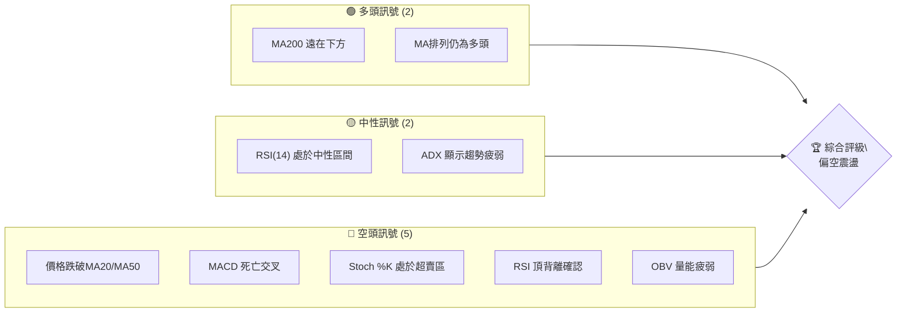
**解讀**：目前空頭訊號數量明顯多於多頭訊號，且關鍵動能指標（MACD、RSI背離）均指向空頭。儘管長期均線支撐仍在，但短期內股價面臨較大下行壓力。

### 📊 核心指標速覽表

| 指標類別 | 指標名稱 | 當前數值 | 訊號 | 解讀 |
|----------|----------|----------|------|------|
| **價格** | 當前價格 | $215.62 | 🔴 | 較52週高點回落28%，跌破短期均線 |
| **均線** | MA20 | $249.11 | 🔴 | 價格位於MA20下方，短期趨勢承壓 |
| **均線** | MA50 | $215.09 | 🟡 | 價格位於MA50上方，但僅微幅領先，有跌破風險 |
| **均線** | MA200 | $132.94 | 🟢 | 價格遠高於MA200，長期趨勢仍為多頭 |
| **動能** | RSI(14) | 48.40 | 🟡 | 處於中性區間，但趨勢向下，且存在頂背離 |
| **動能** | MACD | -6.630 (Hist) | 🔴 | MACD線位於訊號線下方，柱狀圖為負，空頭動能強勁 |
| **波動** | ATR(14) | $29.50 | 🔴 | 佔股價13.68%，顯示高波動性，下跌動能強 |

### 🏆 技術評分卡

```
技術評分卡 — NBIS (2026-07-05)
════════════════════════════════════════════════════
趨勢強度      ████████░░░░░░░░░░░░  40/100  🟡 (短期下跌，長期上升，趨勢不明顯)
動能指標      ███░░░░░░░░░░░░░░░░░  15/100  🔴 (MACD死亡交叉，RSI頂背離，Stoch超賣)
支撐穩定度    ████████░░░░░░░░░░░░  40/100  🟡 (近期支撐脆弱，下方有較強長期支撐)
成交量配合    ██████░░░░░░░░░░░░░░  30/100  🔴 (下跌放量，OBV疲弱，量價背離)
形態完整度    ██████░░░░░░░░░░░░░░  30/100  🔴 (潛在M頂形態，但未完全確認，近期急跌)
均線排列      ████████░░░░░░░░░░░░  40/100  🟡 (長期均線多頭，但價格已跌破短期均線)
════════════════════════════════════════════════════
綜合評分      ████░░░░░░░░░░░░░░░░  29/100  🔴 偏空
════════════════════════════════════════════════════
```
**評級結論**：NBIS 的技術評分顯示整體偏空，主要由於短期趨勢惡化、動能指標轉弱及潛在的頂背離訊號。儘管長期趨勢仍為上升，但短期內需警惕進一步回調風險。

---

## 2. 趨勢分析

### 🌐 多時框趨勢分析

NBIS 的多時框分析顯示，長期而言仍處於上升趨勢中，但中短期已明顯轉弱，進入回調階段。

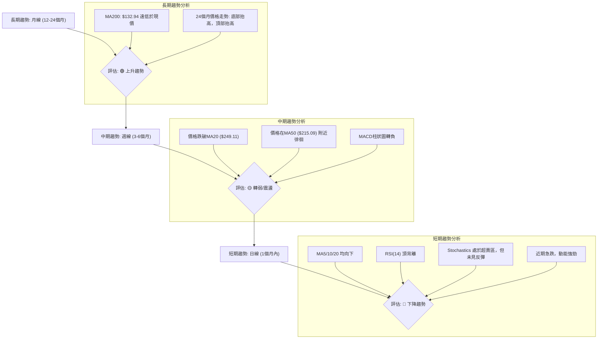

### 📈 長期趨勢 — 12個月走勢圖（Unicode）

NBIS 在過去12個月呈現強勁的上升趨勢，從2025年7月的低點$54.43一路飆升至2026年6月的$276.17，漲幅達407%。然而，近期一個月（2026年7月）出現大幅回調，從高點回落超過20%。

```
NBIS 月線走勢圖（過去12個月）
價格軸 ($)
$276.17 ┤                                      ● (2026-06 高點)
$231.09 ┤                                  ●
$215.62 ┤                                          ●←現在 (2026-07)
$138.23 ┤                         ●
$130.82 ┤               ●
$112.27 ┤             ●
$94.87  ┤                 ●
$83.71  ┤                   ●
$85.19  ┤                     ●
$91.19  ┤                       ●
$103.76 ┤                         ●
$68.32  ┤     ●
$54.43  ┤ ●
        └────────────────────────────────────────────────────────
         2025-07 08 09 10 11 12 2026-01 02 03 04 05 06 07
```

**走勢特徵分析表格**：

| 階段 | 時間段 | 起始價 | 結束價 | 漲跌幅 | 主要特徵 |
|------|----------|--------|--------|--------|----------|
| **強勁上漲** | 2025-07 至 2026-06 | $54.43 | $276.17 | +407% | 股價呈現拋物線式上漲，多頭動能強勁，幾乎無回調。 |
| **高位回調** | 2026-06 至 2026-07 | $276.17 | $215.62 | -22% | 股價從歷史高點快速回落，短期賣壓沉重，顯示獲利了結。 |

### 📊 中期趨勢（週線分析）

中期趨勢方面，NBIS在2026年4月至6月經歷了一波強勁上漲，從約$108.82漲至最高點$286.69。然而，隨後兩週（6月28日與7月5日）出現大幅下跌，顯示中期趨勢已由強勢上漲轉為回調。股價目前跌破了MA20週線，並正在測試MA50週線。

**近期壓力與支撐示意圖**
```
NBIS 中期趨勢示意圖
═══════════════════════════════════════════════════
$299.86 ║████████████████████████║ 52週高點 / 強阻力
$286.69 ║████████████████████    ║ 近期高點 / 阻力
$249.11 ║████████████████████████║ MA20 (近期壓力)
$215.62 ╠════════════════════════╣ ◄ 現價
$215.09 ║▓▓▓▓▓▓▓▓▓▓▓▓▓▓▓▓        ║ MA50 (關鍵支撐)
$198.66 ║████████████████████████║ 布林下軌 / 潛在支撐
═══════════════════════════════════════════════════
```
**解讀**：股價目前正測試MA50（$215.09）這一關鍵中期支撐。若能守住，可能形成中期反彈；若跌破，則可能加速下跌至更低支撐位。

### ⚡ 趨勢強度評估（ADX 解讀）

ADX 指標用於衡量趨勢的強度，而非方向。+DI 和 -DI 則指示多頭和空頭的相對強度。

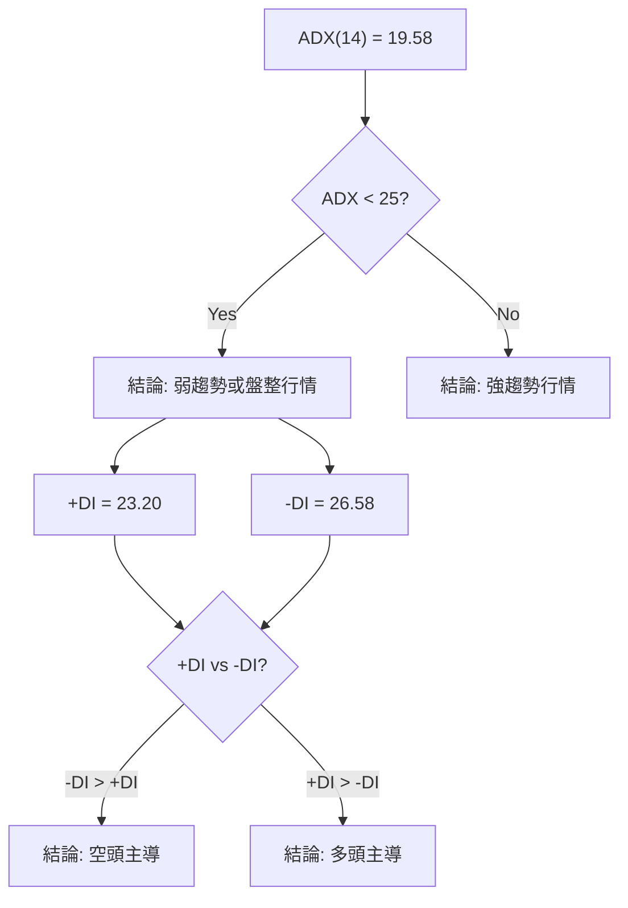
**ADX 強度對照表**：

| ADX 數值範圍 | 趨勢強度 | 建議 |
|--------------|----------|------|
| 0-20         | 弱趨勢/盤整 | 觀望，或以震盪策略為主 |
| 20-25        | 趨勢啟動/轉折 | 留意方向性突破 |
| 25-50        | 強趨勢    | 順勢操作 |
| 50-100       | 極強趨勢  | 趨勢可能接近尾聲，留意反轉 |

**解讀**：NBIS 的 ADX(14) 為 19.58，明顯低於 25，表明當前市場處於弱趨勢或盤整狀態。然而，+DI 為 23.20，-DI 為 26.58，顯示 -DI 略高於 +DI，這表明在當前的弱勢趨勢中，空頭力量略佔上風。這與股價近期下跌的表現一致，雖然整體趨勢不強，但短期內空頭動能較強。

---

## 3. 圖表形態分析

### 🔍 形態識別系統

從提供的月線和週線數據來看，NBIS 經歷了快速的拋物線式上漲，並在近期出現劇烈回調。目前尚未形成教科書般的經典反轉形態（如頭肩頂、雙頂），但近期的高點和隨後的急跌可能預示著潛在的 M 頂形態或至少是強烈的獲利了結。

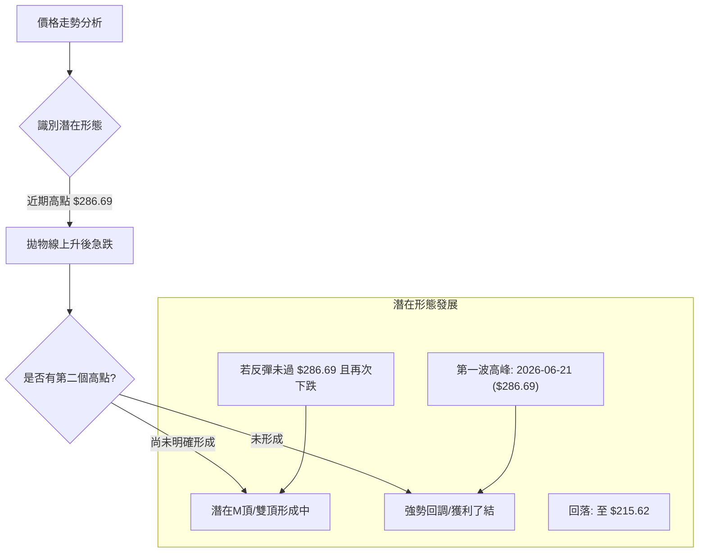

**解讀**：目前股價在經歷2026年6月的高點$286.69後迅速回落，尚未形成第二個高點來確認雙頂形態。但這種急漲急跌的走勢本身就具有反轉意味。如果股價在反彈後無法突破前高，並再次下跌，則M頂形態將得到確認。

### 🕯️ 重要K線形態分析

由於數據僅提供週收盤價，無法進行精確的日K線形態分析。但從週收盤價的變化，我們可以觀察到一些趨勢轉換的跡象。

| 月份 | 收盤價 | K線形態 (推斷) | 解讀 | 訊號 |
|------|--------|-----------------|------|------|
| 2026-05-17 | $219.94 | 長陽線 (上漲動能強) | 股價突破關鍵阻力，多頭力量強勁。 | 🟢 |
| 2026-05-24 | $214.77 | 陰線 (回調) | 上漲後小幅回調，但動能未失。 | 🟡 |
| 2026-05-31 | $231.09 | 陽線 (恢復上漲) | 再次向上突破，多頭趨勢延續。 | 🟢 |
| 2026-06-07 | $227.81 | 陰線 (小幅回調) | 漲勢暫緩，但仍在高位震盪。 | 🟡 |
| 2026-06-14 | $232.36 | 陽線 (再次上攻) | 嘗試突破，但MACD柱狀圖轉負，顯示內部動能減弱。 | 🟡 |
| 2026-06-21 | $286.69 | 長陽線 (創新高) | 股價創新高，但RSI已出現頂背離，需警惕。 | 🔴 |
| 2026-06-28 | $240.30 | 長陰線 (大幅下跌) | 股價從高點大幅回落，吞噬前一週部分漲幅，賣壓強勁。 | 🔴 |
| 2026-07-05 | $215.62 | 長陰線 (持續下跌) | 再次大幅下跌，MACD柱狀圖負值擴大，空頭動能加速。 | 🔴 |

**解讀**：從5月下旬到6月中旬，股價呈現震盪上行，量價配合良好。然而，在2026-06-21達到高點$286.69後，隨後兩週連續出現長陰線，且成交量放大，顯示出強烈的賣壓和獲利了結行為。這種連續的下跌陰線是明確的看空訊號。

### 📉 ASCII 走勢形態示意圖

以下示意圖展示了NBIS近期從高點回落的走勢，這是一個典型的急漲急跌形態，通常被視為市場情緒過熱後的自然修正。

```
NBIS 近期走勢形態示意圖：拋物線上升後急跌
價格軸 ($)
$299.86 ┤                                  _ _ _ (52W High)
$286.69 ┤                                 /
        ┤                                /
$240.30 ┤                               / \
        ┤                              /   \
$215.62 ┤                             /     ● ← 現價
        ┤                            /       \
        ┤                           /         \
$177.05 ┤                          /           \
        ┤                         /             \
$144.97 ┤                        ●
        ┤                       /
$89.33  ┤                      /
        └────────────────────────────────────────────
         2026-03-08 04-12 05-10 06-21 07-05
         低點       反彈    次高點  高峰     回落
```
**解讀**：圖中顯示股價在經歷了2026年3月至6月的快速拉升後，於6月底形成一個尖頂，隨後進入快速下跌通道。這種形態表明市場在短期內積累了大量獲利盤，並在某個點位集中拋售。

### 🎯 形態目標價計算

鑑於目前尚未形成明確的經典反轉形態（如頭肩頂），我們將主要基於近期高點的回調深度和斐波那契回調來設定潛在的目標價。如果將$286.69視為一個單一的頂部，則其回調目標將是斐波那契回調位。

**形態目標價計算（基於斐波那契回調）**：
-   **主要上漲波段**：從2025年12月的低點$83.71到2026年6月21日的高點$286.69。
-   **波段高度**：$286.69 - $83.71 = $202.98

1.  **38.2% 回調目標**：$286.69 - ($202.98 * 0.382) = $286.69 - $77.54 = **$209.15**
    *   **解讀**：這是第一個較為關鍵的支撐目標，目前股價$215.62已非常接近此水平。
2.  **50% 回調目標**：$286.69 - ($202.98 * 0.50) = $286.69 - $101.49 = **$185.20**
    *   **解讀**：若$209.15被有效跌破，股價很可能進一步測試$185.20，這是一個心理和技術上都重要的支撐位。
3.  **61.8% 回調目標**：$286.69 - ($202.98 * 0.618) = $286.69 - $125.40 = **$161.29**
    *   **解讀**：如果市場情緒極度悲觀或有負面消息，股價可能回調至此黃金分割位。

**結論**：在當前急跌的背景下，短期下跌目標價首先關注斐波那契38.2%回調位$209.15。若此處無法有效止跌，則下一個目標為$185.20。

---

## 4. 支撐與阻力

### 🗺️ 關鍵價位分布圖（Unicode）

NBIS 的關鍵價位分佈圖顯示了目前股價正處於多空拉鋸的關鍵區域，下方有斐波那契回調位及長期均線提供支撐，上方則有多重短期均線及前期高點構成阻力。

```
NBIS 價位結構分布圖
═══════════════════════════════════════════════════
$299.86 ║████████████████████████║ 強阻力 R3 (52週高點)
$286.69 ║████████████████████    ║ 阻力 R2 (近期高點)
$249.11 ║████████████████████████║ 關鍵阻力 R1 (MA20)
$244.48 ║████████████████████    ║ 短期阻力 (MA5)
$215.62 ╠════════════════════════╣ ◄ 現價
$215.09 ║▓▓▓▓▓▓▓▓▓▓▓▓▓▓▓▓        ║ 近期支撐 S1 (MA50)
$209.15 ║▓▓▓▓▓▓▓▓▓▓▓▓▓▓▓▓        ║ 斐波那契 38.2% 回調支撐
$198.66 ║████████████████████████║ 強支撐 S2 (布林下軌)
$185.20 ║▓▓▓▓▓▓▓▓▓▓▓▓▓▓▓▓        ║ 斐波那契 50% 回調支撐
$161.29 ║▓▓▓▓▓▓▓▓▓▓▓▓▓▓▓▓        ║ 斐波那契 61.8% 回調支撐
$132.94 ║████████████████████████║ 強支撐 S3 (MA200)
═══════════════════════════════════════════════════
```

### 🚧 阻力位分析表

| 阻力級別 | 價位 | 形成原因 | 突破難度 | 重要性 |
|----------|------|----------|----------|--------|
| **R1**   | $249.11 | MA20 (短期均線壓力) | 中等偏高 | 🟡 |
| **R2**   | $286.69 | 近期高點 (2026-06-21) | 高 | 🔴 |
| **R3**   | $299.86 | 52週高點 | 極高 | 🔴 |
| **短期** | $244.48 | MA5 (超短期均線壓力) | 中等 | 🟡 |

**解讀**：目前股價在$215.62，上方最近的阻力是MA5 ($244.48) 和MA20 ($249.11)。這些短期均線在下跌過程中轉為壓力，若要反彈，必須先有效突破這些動態阻力。更上方的$286.69和$299.86是強大的心理和技術阻力位，短期內難以突破。

### 🛡️ 支撐位分析表

| 支撐級別 | 價位 | 形成原因 | 守住機率 | 重要性 |
|----------|------|----------|----------|--------|
| **S1**   | $215.09 | MA50 (中期均線支撐) | 中等 | 🟡 |
| **S2**   | $209.15 | 斐波那契 38.2% 回調位 | 中等 | 🟡 |
| **S3**   | $198.66 | 布林下軌 | 中等偏低 | 🟡 |
| **S4**   | $185.20 | 斐波那契 50% 回調位 | 高 | 🟢 |
| **S5**   | $161.29 | 斐波那契 61.8% 回調位 | 極高 | 🟢 |
| **S6**   | $132.94 | MA200 (長期均線支撐) | 極高 | 🟢 |

**解讀**：當前股價$215.62正緊貼MA50 ($215.09) 和斐波那契38.2%回調位 ($209.15) 尋求支撐。這是一個非常關鍵的區域。若能在此處企穩並反彈，則短期跌勢可能暫緩；但若跌破，則下一目標將是布林下軌 ($198.66) 和斐波那契50%回調位 ($185.20)。MA200 ($132.94) 作為長期牛市的生命線，將提供非常強勁的最終支撐。

### 📐 斐波那契回調位分析

我們選擇從2025年12月的低點 $83.71 到2026年6月21日的高點 $286.69 作為關鍵上漲波段進行斐波那契回調分析。

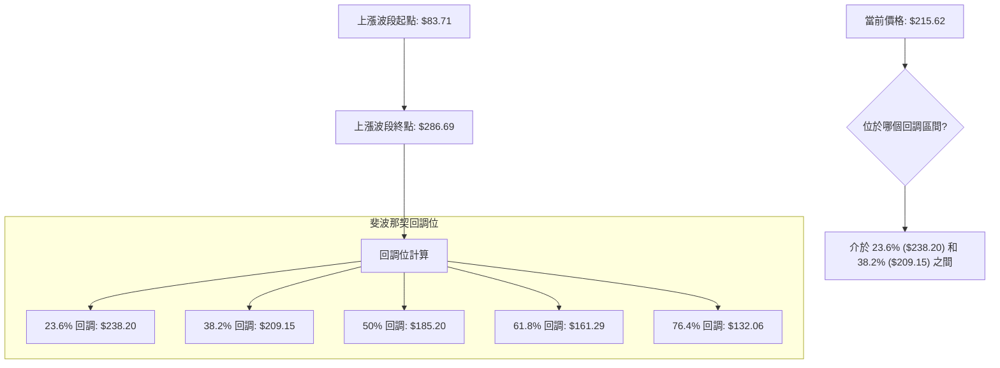

**斐波那契回調位詳細列表**：

| 回調比例 | 價位 | 解讀 | 訊號 |
|----------|------|------|------|
| **23.6%** | $238.20 | 輕微回調支撐，目前已跌破。 | 🔴 |
| **38.2%** | $209.15 | 重要的第一道支撐，若跌破，則回調將加深。 | 🟡 |
| **50%**  | $185.20 | 心理和技術上都非常重要的支撐位，通常是強勢股回調的極限。 | 🟢 |
| **61.8%** | $161.29 | 黃金分割位，若回調至此，表明上升趨勢可能受到嚴重考驗。 | 🟢 |
| **76.4%** | $132.06 | 極端回調位，接近MA200長期支撐，若觸及則牛市根基動搖。 | 🟢 |

**視覺化**：
```
斐波那契回調分析 (高點 $286.69, 低點 $83.71)
═══════════════════════════════════════════════════════
$286.69 ┤█████████████████████████████████████████████████ (100% 高點)
$238.20 ┤▓▓▓▓▓▓▓▓▓▓▓▓▓▓▓▓▓▓▓▓▓▓▓▓▓▓▓▓▓▓▓▓▓▓▓▓▓▓▓▓▓▓▓▓▓▓▓▓▓ (23.6% 回調)
$215.62 ╠═════════════════════════════════════════════════╣ ◄ 現價
$209.15 ┤▓▓▓▓▓▓▓▓▓▓▓▓▓▓▓▓▓▓▓▓▓▓▓▓▓▓▓▓▓▓▓▓▓▓▓▓▓▓▓▓▓▓▓▓▓▓▓▓▓ (38.2% 回調)
$185.20 ┤▓▓▓▓▓▓▓▓▓▓▓▓▓▓▓▓▓▓▓▓▓▓▓▓▓▓▓▓▓▓▓▓▓▓▓▓▓▓▓▓▓▓▓▓▓▓▓▓▓ (50% 回調)
$161.29 ┤▓▓▓▓▓▓▓▓▓▓▓▓▓▓▓▓▓▓▓▓▓▓▓▓▓▓▓▓▓▓▓▓▓▓▓▓▓▓▓▓▓▓▓▓▓▓▓▓▓ (61.8% 回調)
$132.06 ┤▓▓▓▓▓▓▓▓▓▓▓▓▓▓▓▓▓▓▓▓▓▓▓▓▓▓▓▓▓▓▓▓▓▓▓▓▓▓▓▓▓▓▓▓▓▓▓▓▓ (76.4% 回調)
$83.71  ┤█████████████████████████████████████████████████ (0% 低點)
═══════════════════════════════════════════════════════
```
**結論**：當前股價$215.62正處於斐波那契38.2%回調位$209.15附近，此處是重要的短期多空分水嶺。若能有效守住，則仍有反彈機會；若跌破，則下一目標將指向$185.20。

---

## 5. 技術指標深度解讀

### 🎛️ 指標訊號總覽

目前NBIS的技術指標呈現出複雜且矛盾的訊號，長期均線仍為多頭排列，但短期價格行為和動能指標已明顯轉弱，甚至出現看跌背離。

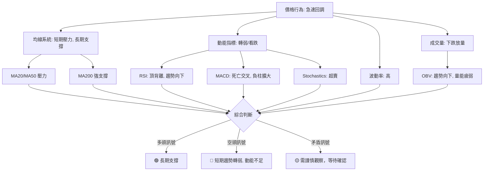

### 📈 移動平均線排列分析

NBIS的均線系統呈現出一個短期與長期趨勢背離的狀態。數據顯示「均線排列: 多頭排列 MA20>MA50>MA200」，這在長期來看是看漲的。然而，當前價格$215.62已跌破MA20 ($249.11) 和MA5 ($244.48)，並正在測試MA50 ($215.09)。

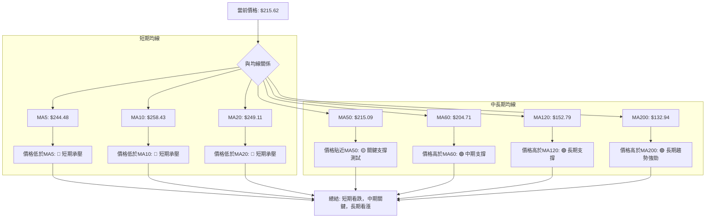
**均線排列狀態**：

| 均線對 | 排列關係 | 趨勢方向 | 訊號 | 解讀 |
|--------|----------|----------|------|------|
| MA20 vs 價格 | 價格 < MA20 | 下跌 | 🔴 | 短期趨勢已轉弱，MA20形成上方壓力。 |
| MA50 vs 價格 | 價格 ≈ MA50 | 震盪 | 🟡 | 價格正測試MA50，此線為中期趨勢關鍵分水嶺。 |
| MA200 vs 價格 | 價格 > MA200 | 上漲 | 🟢 | 長期趨勢依然強勁，MA200提供堅實支撐。 |
| MA20 > MA50 > MA200 | 多頭排列 | 上漲 | 🟡 | 均線系統仍呈多頭排列，但短線承壓預示可能轉變。 |

**結論**：儘管均線排列仍是多頭，但價格已跌破短期均線並正在考驗中期均線，這通常是趨勢從強勢上漲轉為回調或盤整的早期訊號。短期均線（MA5、MA10、MA20）均呈現下降趨勢，進一步確認了短期的賣壓。

### 📉 RSI(14) 分析

RSI(14) 當前數值為 48.40，處於中性區間 (30-70)。然而，其從高位回落的趨勢以及與價格的背離值得關注。

**RSI 強度進度條**：
RSI(14): ▓▓▓▓▓▓▓▓▓▓░░░░░░░░░░ 48.40 (中性，但趨勢向下)

**超買超賣區間分析**：
-   **超買區 (>70)**：在2026-04-19達到79.2，2026-05-17達到74.5，隨後股價均出現回調。
-   **超賣區 (<30)**：目前尚未進入超賣區，顯示股價仍有下跌空間，或需要更多時間消化賣壓。

**背離判斷**：
-   **頂背離**：
    *   **高點1**：2026-05-17，收盤價$219.94，RSI為74.5。
    *   **高點2**：2026-06-21，收盤價$286.69 (更高點)，RSI為65.3 (更低點)。
    *   **結論**：存在明顯的**🔴 頂背離**。價格創出新高，但RSI未能同步創出新高，反而走低。這是一個強烈的看跌訊號，預示著上漲動能衰竭，隨後股價也確實出現了大幅下跌。

**解讀**：RSI雖然目前處於中性區間，但其下降趨勢以及之前形成的頂背離訊號，都強烈指示當前的下跌趨勢具有較高的可靠性。通常，頂背離後的回調會比較深，且需要時間才能築底。

### 📊 MACD(12/26/9) 訊號解讀

MACD 指標由 MACD 線、訊號線和柱狀圖組成，用於判斷趨勢的動能和方向。

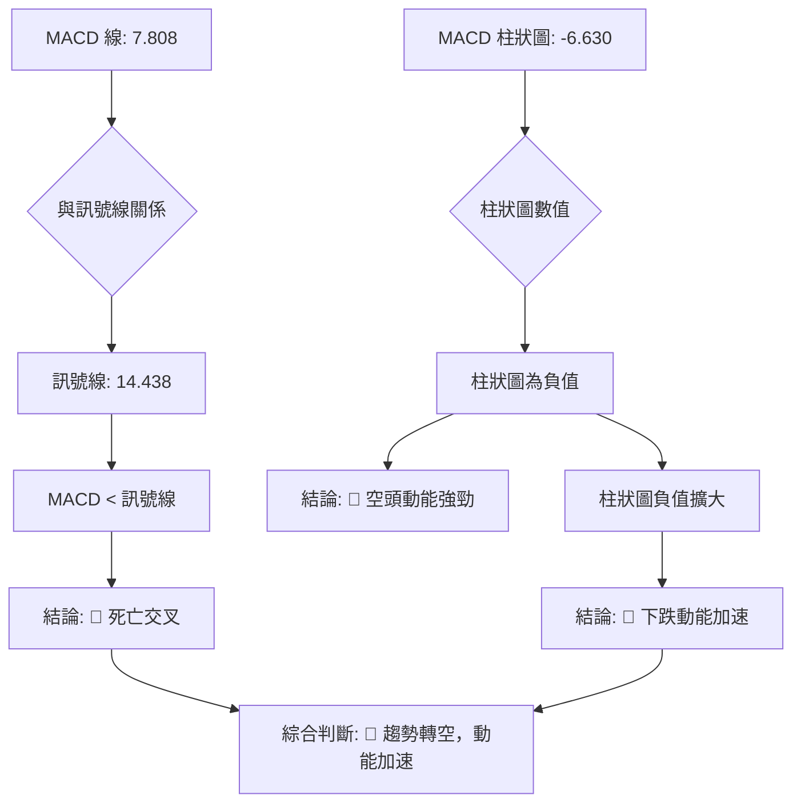

**MACD 指標狀態**：
-   **MACD 線 (7.808)** 位於 **訊號線 (14.438)** 下方，這表示 MACD 已經形成**死亡交叉**，是一個明確的看跌訊號。
-   **MACD 柱狀圖 (-6.630)** 為負值且數值絕對值較大，顯示空頭動能強勁。從近20週數據看，MACD柱狀圖從2026-06-14的-4.105到2026-07-05的-6.630，負值在不斷擴大，這表明下跌動能正在加速。

**解讀**：MACD 的死亡交叉和負值擴大的柱狀圖，都強烈支持股價短期內將繼續下跌的判斷。這與RSI的頂背離訊號相互印證，增加了空頭訊號的可靠性。

### 📦 布林通道分析

布林通道由中軌 (MA20)、上軌和下軌組成，用於衡量股價的波動範圍和相對位置。

**布林通道關鍵數值**：
-   BB上軌: $299.56
-   BB中軌(MA20): $249.11
-   BB下軌: $198.66
-   當前價格: $215.62
-   BB %B: 0.17 (0=下軌, 0.5=中軌, 1=上軌)

**ASCII 布林通道示意圖**：
```
NBIS 布林通道示意圖 (2026-07-05)
═══════════════════════════════════════════════════════
$299.56 ┤█████████████████████████████████████████████████ (上軌)
        │
        │
$249.11 ┤▓▓▓▓▓▓▓▓▓▓▓▓▓▓▓▓▓▓▓▓▓▓▓▓▓▓▓▓▓▓▓▓▓▓▓▓▓▓▓▓▓▓▓▓▓▓▓▓▓ (中軌 MA20)
        │
$215.62 ╠═════════════════════════════════════════════════╣ ◄ 現價
        │
        │
$198.66 ┤█████████████████████████████████████████████████ (下軌)
═══════════════════════════════════════════════════════
```
**解讀**：
-   **價格位置**：當前價格$215.62位於布林通道中軌和下軌之間，且非常靠近下軌。BB %B 為 0.17，這表明股價正接近下軌，通常被視為短期超賣區間。
-   **通道寬度**：ATR為$29.50 (佔股價13.68%)，通道寬度較大，表明股價波動性較高，這與近期急漲急跌的走勢一致。
-   **未來展望**：股價觸及或跌破布林下軌可能引發短期反彈，但也可能是下跌趨勢的延續。需要結合其他指標確認。目前價格在下軌上方，但下跌動能強勁，有跌破下軌的風險。

### 💹 成交量分析（量價配合度）

成交量是確認價格走勢的關鍵指標。

**成交量數據**：
-   最新成交量: 24,804,700
-   20日均量: 18,404,660 (量比: 1.35x)
-   50日均量: 18,033,748
-   OBV趨勢: OBV < MA → 量能疲弱

**量價配合度分析**：
-   **近期成交量**：最新成交量為24,804,700，顯著高於20日均量 (1.35倍)。這表明在近期價格下跌的過程中，成交量是放大的。
-   **量價關係**：在下跌趨勢中，如果成交量放大，通常被解讀為賣壓沉重，市場參與者積極拋售，確認下跌趨勢。這是一個**🔴 看跌訊號**。
-   **OBV 趨勢**：OBV (On-Balance Volume) 趨勢顯示 OBV 線低於其移動平均線，這表明儘管單日成交量可能較大，但整體而言，在價格上漲時的買入量不足以累積，而在價格下跌時的賣出量則持續積累，導致OBV趨勢向下，確認**🔴 量能疲弱**。

**結論**：NBIS的量價配合顯示出強烈的看跌訊號。股價在下跌過程中伴隨著放大的成交量，且OBV趨勢向下，這表明市場上的賣方力量強於買方，短期內下跌趨勢可能持續。

---

## 6. 動能與波動率

### ⚡ 動能評估四象限

我們將NBIS的當前狀態在「動能強度」與「波動率」兩個維度進行評估。

**動能評估**：
-   **MACD**：死亡交叉，負柱擴大，顯示強烈看空動能。
-   **RSI**：頂背離後持續下跌，趨勢向下。
-   **ADX**：ADX < 25，顯示趨勢強度不足，但-DI > +DI，空頭略佔優。
-   **綜合**：短期動能已明顯轉弱，甚至轉為看空。評為**弱動能**。

**波動率評估**：
-   **ATR(14)**：$29.50，佔股價13.68%。這是一個相當高的百分比，表明每日價格波動劇烈。
-   **布林通道**：通道寬度較大，也印證了高波動性。
-   **綜合**：近期急漲急跌，波動性高。評為**高波動**。

**動能與波動率四象限分析表**：

| 象限 | 動能 | 波動 | 當前狀態 | 評估 |
|------|------|------|----------|------|
| Q1 | 強 | 低 | - | 最佳機會 (趨勢穩定，風險可控) |
| Q2 | 弱 | 低 | - | 謹慎觀望 (趨勢不明，風險較低) |
| Q3 | 強 | 高 | - | 高風險高收益 (趨勢強勁，波動劇烈) |
| Q4 | 弱 | 高 | ✓ | 避免進場 (趨勢不明，波動劇烈，風險高) |

**結論**：NBIS目前處於「弱動能、高波動」的第四象限。這是一個高風險的市場環境，趨勢不明朗且價格波動劇烈，容易造成追漲殺跌的損失。建議投資者在此階段保持高度謹慎，避免盲目進場。

### 📊 ATR 波動率分析

ATR (Average True Range) 衡量股價在特定時間內的平均波動幅度。

-   **ATR(14)**：$29.50
-   **佔當前價格比例**：$29.50 / $215.62 = 13.68%

**解讀**：ATR 數值高達 $29.50，佔股價的 13.68%，這是一個極高的波動率。通常，ATR佔股價的5%以上就被認為是高波動性股票。NBIS 達到近14%的ATR，意味著每日價格變動可能非常劇烈。
-   **止損距離建議**：對於高波動性股票，止損點應設置得更寬。一般建議將止損點設置在 ATR 的 1-2 倍之外。
    *   **保守止損**：在關鍵支撐位下方 $29.50 (1x ATR) 至 $59.00 (2x ATR) 的距離。例如，若進場點為$215.62，則止損可考慮設在 $215.62 - $29.50 = $186.12 或 $215.62 - $59.00 = $156.62。
    *   **交易策略影響**：高 ATR 意味著較大的潛在虧損，因此在進行交易時，必須嚴格控制倉位，以避免單次交易造成過大的資本損失。

### 📐 Beta 與市場相關性

提供的數據中未包含 NBIS 的 Beta 值。

**專業推演**：NBIS 屬於「Communication Services」板塊下的「Internet Content & Information」行業，並且業務涉及 AI 基礎設施，這通常是一個高成長、高風險的科技類股。一般來說，這類公司往往具有較高的 Beta 值（通常大於 1），表明其股價波動性相對大盤更高。
-   **高 Beta 影響**：如果市場整體上漲，高 Beta 股通常會漲得更多；反之，如果市場下跌，高 Beta 股也可能跌得更深。在當前市場不確定性增加或整體回調的環境下，高 Beta 股票的回調壓力會更大。
-   **投資者考量**：由於 NBIS 目前處於高波動且短線動能轉弱的狀態，若其 Beta 值較高，則在當前市場環境下，其下跌風險將被放大。投資者應將此潛在風險納入考量。

---

## 7. 多時框架總結

綜合不同時框架的技術指標分析，NBIS 目前呈現出長期趨勢良好但中短期趨勢惡化的複雜局面。

### 📋 時框架評分表

| 時框架 | 趨勢方向 | 動能 | 均線排列 | 形態 | 綜合評分 (1-10) | 建議 |
|--------|----------|------|----------|------|-----------------|------|
| **長期** | 🟢 上升 | 🟢 強勁 | 🟢 多頭 | 🟡 拋物線上漲 | 8/10            | 持有/逢低買入 |
| **中期** | 🟡 震盪/回調 | 🔴 轉弱 | 🟡 壓力測試 | 🟡 潛在M頂 | 4/10            | 觀望/減倉 |
| **短期** | 🔴 下跌 | 🔴 疲弱 | 🔴 空頭壓力 | 🔴 急跌 | 2/10            | 賣出/規避 |

**解讀**：
-   **長期**：NBIS 從過去一年來看，仍處於強勁的上升通道中，MA200提供堅實支撐。
-   **中期**：股價已跌破MA20，並正在測試MA50，動能指標如MACD已轉為空頭，RSI也出現頂背離，中期趨勢轉為回調。
-   **短期**：近期急跌，MA5/10/20均向下，MACD負柱擴大，成交量放大，短期趨勢呈現明顯的下跌。

### 🔲 綜合訊號矩陣

以下矩陣展示了不同時框架下各技術維度訊號的一致性。

```
NBIS 綜合訊號矩陣 (2026-07-05)
═════════════════════════════════════════════════════════════
| 指標 / 時框架 | 長期 (月/季) | 中期 (週)     | 短期 (日)     |
|─────────────────|────────────────|───────────────|───────────────|
| **趨勢方向**    | 🟢 上升        | 🟡 轉弱回調   | 🔴 下跌       |
| **動能強度**    | 🟢 強勁        | 🔴 轉弱       | 🔴 疲弱       |
| **均線排列**    | 🟢 多頭排列    | 🟡 價格測試MA50 | 🔴 價格跌破MA20 |
| **圖表形態**    | 🟡 拋物線上升  | 🟡 潛在M頂    | 🔴 急跌       |
| **RSI(14)**     | 🟢 中性高位    | 🔴 頂背離     | 🔴 下行       |
| **MACD**        | 🟢 金叉        | 🔴 死亡交叉   | 🔴 負柱擴大   |
| **成交量配合**  | 🟢 穩定增長    | 🔴 下跌放量   | 🔴 下跌放量   |
═════════════════════════════════════════════════════════════
```
**一致性分析**：
-   **長期視角**：NBIS 的長期基本面和技術面（MA200、歷史價格走勢）仍顯示為上升趨勢，動能也曾非常強勁。
-   **中短期視角**：然而，中短期內幾乎所有指標都發出了強烈的看跌訊號，包括趨勢轉弱、動能衰竭（RSI頂背離、MACD死亡交叉）、價格跌破短期均線、以及下跌放量。
-   **矛盾點**：長期趨勢與中短期趨勢存在明顯矛盾。這表明股價正處於一個重要的轉折點，長期多頭趨勢可能正在經歷一次深度修正。

**結論**：投資者應警惕中短期內的下跌風險，並關注關鍵支撐位是否能守住。在短期內，空頭力量佔據主導，不宜盲目抄底。

---

## 8. 交易策略建議

基於 NBIS 當前多時框架的綜合分析，短期內市場呈現偏空震盪，但長期仍有上漲潛力。因此，交易策略應以規避短期風險、等待底部確認或利用反彈做空為主。

### 🗺️ 策略決策流程圖

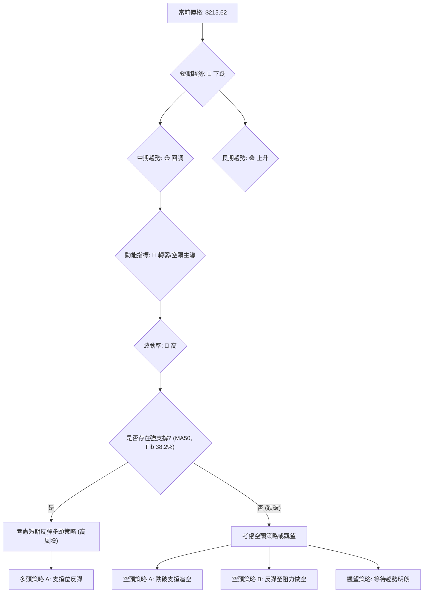

### 🟢 多頭策略詳情 (高風險/等待確認)

由於短期趨勢偏空，多頭策略風險較高，建議僅在關鍵強支撐位獲得明確止跌訊號後小倉位嘗試。

| 策略要素 | 策略 A: 激進反彈多頭 | 策略 B: 穩健築底多頭 |
|----------|----------------------|----------------------|
| 進場條件 | 股價在$209.15 (Fib 38.2%) 或 $198.66 (BB下軌) 處出現明確止跌K線形態 (如錘頭、看漲吞噬) 且成交量配合。 | 股價在$185.20 (Fib 50%) 或 $161.29 (Fib 61.8%) 處築底成功，MACD出現金叉，RSI回升並突破50。 |
| 進場價格 | **$209.15** (若止跌) 或 **$198.66** (若跌至下軌) | **$185.20 - $190.00** 區間 |
| 目標價 T1 | **$230.00** (回補缺口/MA20附近) | **$249.11** (MA20阻力) |
| 目標價 T2 | **$249.11** (MA20阻力) | **$286.69** (前期高點) |
| 止損價格 | **$195.00** (跌破$198.66) | **$175.00** (跌破$185.20) |
| 風險報酬比 | 1:1.5 - 1:2.0 | 1:2.5 - 1:3.0 |
| 成功機率 | 35% | 45% |
| 建議倉位 | 5% - 10% | 10% - 15% |

### 🔴 空頭策略詳情 (順勢操作)

短期趨勢偏空，空頭策略相對風險較低，可考慮在反彈無力或跌破關鍵支撐時進場。

| 策略要素 | 策略 A: 跌破支撐追空 | 策略 B: 反彈至阻力做空 |
|----------|----------------------|----------------------|
| 進場條件 | 股價有效跌破$209.15 (Fib 38.2%) 或 $198.66 (BB下軌)，且伴隨放量。 | 股價反彈至MA20 ($249.11) 或MA5 ($244.48) 附近受阻，出現看跌K線形態，且MACD未轉強。 |
| 進場價格 | **$208.00** (跌破$209.15) 或 **$198.00** (跌破$198.66) | **$245.00 - $248.00** 區間 |
| 目標價 T1 | **$185.20** (Fib 50%) | **$215.09** (MA50支撐) |
| 目標價 T2 | **$161.29** (Fib 61.8%) | **$198.66** (布林下軌) |
| 止損價格 | **$218.00** (若跌破$209.15) 或 **$205.00** (若跌破$198.66) | **$255.00** (突破MA20) |
| 風險報酬比 | 1:1.8 - 1:2.5 | 1:1.5 - 1:2.0 |
| 成功機率 | 55% | 50% |
| 建議倉位 | 10% - 15% | 10% - 15% |

### ⭐ 整體訊號強度評星

```
做多訊號強度：★★☆☆☆  (2/5星) (短期風險高，需等待確認)
做空訊號強度：★★★★☆  (4/5星) (短期趨勢明顯，順勢操作)
整體可信度：  ★★★☆☆  (3/5星) (短期方向明確，但長期潛力仍存，需謹慎)
```
**結論**：目前 NBIS 的短期技術面明顯偏空，空頭策略的勝率和風險報酬比相對較優。多頭策略應極其謹慎，只在關鍵支撐位出現明確反轉訊號時小倉位參與，並嚴格設置止損。

---

## 9. 風險提示與監控

NBIS 正處於一個高波動且短期趨勢轉空的階段，風險管理至關重要。

### ✅ 關鍵監控指標 Checklist

投資者應密切關注以下關鍵指標和價格水平：

```
關鍵監控指標 Checklist — NBIS
════════════════════════════════════════════════════
[ ] 價格行為：是否跌破關鍵支撐 $209.15 (Fib 38.2%)
[ ] 價格行為：是否跌破 $198.66 (布林下軌)
[ ] 價格行為：是否有效突破 MA20 ($249.11)
[ ] MACD：是否出現金叉 (轉多訊號)
[ ] RSI(14)：是否從超賣區回升並突破50
[ ] 成交量：下跌是否伴隨縮量 (止跌訊號)
[ ] 成交量：上漲是否伴隨放量 (反彈訊號)
[ ] ADX：趨勢強度是否上升，+/-DI是否轉變
[ ] K線形態：是否出現看漲反轉形態 (如錘頭、啟明星)
[ ] 外部消息：公司或行業是否有重大新聞發布
════════════════════════════════════════════════════
```

### ⚠️ 風險場景分析

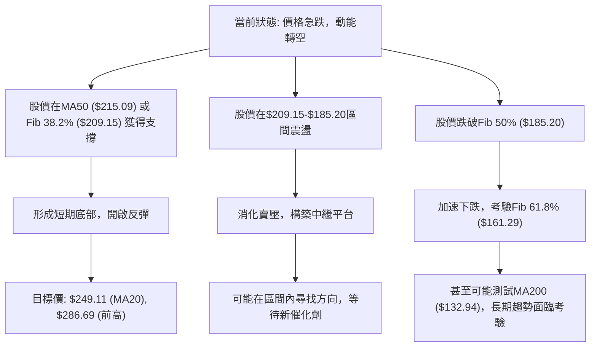

**解讀**：
-   **樂觀情境**：股價在當前關鍵支撐位附近企穩，並在短期內形成反彈。這需要強大的買盤介入和市場情緒的轉變。
-   **基本情境**：股價在當前下跌後進入一段時間的盤整期，在$185.20至$230.00之間震盪，消化前期漲幅和賣壓，等待新的方向性選擇。
-   **悲觀情境**：股價未能守住關鍵的斐波那契回調位，加速下跌至更深層次的支撐，甚至可能觸及長期均線MA200，這將對長期多頭趨勢構成嚴重挑戰。

### 🛡️ 風險管理重要提醒

1.  **嚴格止損**：鑑於 NBIS 的高波動性 (ATR $29.50)，任何交易都必須設置嚴格的止損點。一旦價格觸及止損位，應毫不猶豫地執行，以限制潛在損失。
2.  **倉位管理**：在高波動和不確定性高的市場中，應採用較小的倉位進行交易，避免重倉。建議將單筆交易的風險控制在總資本的 1-2% 以內。
3.  **避免逆勢操作**：在當前短期下跌趨勢明顯的情況下，逆勢抄底的風險極高。除非有非常明確的止跌訊號和強勁的買盤確認，否則應避免盲目進場。
4.  **多時框架確認**：在任何交易決策前，務必等待多個時框架和多個指標的訊號相互確認。例如，若要看多，至少需要中期趨勢止跌，且短期動能轉強。
5.  **耐心等待**：市場在急漲急跌後需要時間來消化。耐心等待趨勢明朗化，或等待股價在重要支撐位築底成功，是更為穩健的策略。
6.  **關注基本面**：雖然本報告是技術分析，但長期而言，基本面是股價的最終驅動力。若公司基本面出現惡化，技術面的支撐也可能失效。

---

## 📋 報告總結

```
NBIS 技術分析報告總結
════════════════════════════════════════════════════════
報告日期：2026-07-05
當前價格：$215.62
分析評級：⚖️ 偏空震盪 (短期面臨較大下行壓力，長期趨勢受考驗)

關鍵結論：
├─ 長期趨勢：🟢 上升趨勢，MA200 ($132.94) 提供堅實支撐。
├─ 中期趨勢：🟡 轉弱回調，股價跌破MA20，正測試MA50 ($215.09)。
├─ 短期趨勢：🔴 明顯下跌，MA5/10/20均向下，MACD死亡交叉，RSI頂背離。
├─ 關鍵支撐：$209.15 (Fib 38.2%)、$185.20 (Fib 50%)。
├─ 關鍵阻力：$249.11 (MA20)、$286.69 (近期高點)。
└─ 分析師目標：均價 $244.21 (與當前技術面顯示的短期阻力區間接近)。

最優策略組合：
1. 🥇 最佳機會：**等待並做空反彈至阻力位**：若股價反彈至$245.00-$248.00區間並受阻，可考慮做空，目標價$215.09、$198.66，止損設於$255.00。
2. 🥈 次選機會：**跌破關鍵支撐追空**：若股價有效跌破$209.15，可考慮做空，目標價$185.20、$161.29，止損設於$218.00。
3. 🥉 保守選擇：**觀望，等待築底或長期支撐**：在當前高波動、動能轉弱的階段，不建議盲目進場，等待股價在$185.20或$161.29附近形成明確的築底形態後再考慮多頭機會。
════════════════════════════════════════════════════════
```

---

> ⚠️ **免責聲明**：本報告為 AI 自動生成之技術分析，所有數據及估算均基於提供的歷史價格資訊。本報告**僅供研究與學術參考**，**不構成任何投資建議**。投資有風險，入市需謹慎。

---

*報告生成時間：2026-07-05 ｜ 數據來源：提供數據 ｜ 分析框架：多時框技術分析*