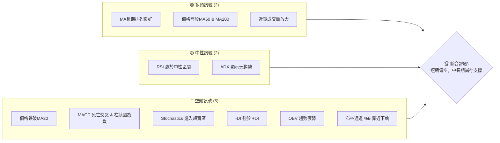
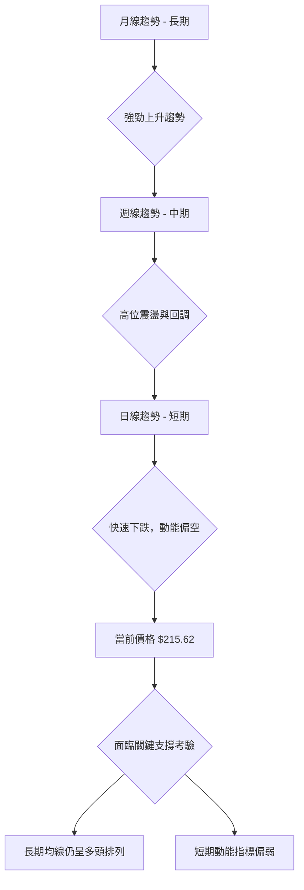
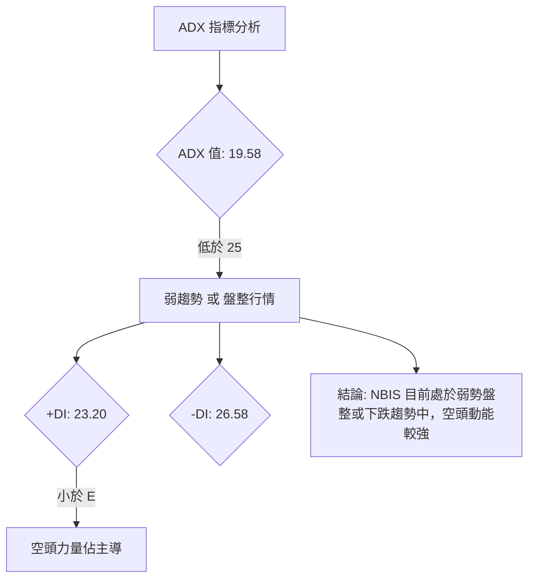
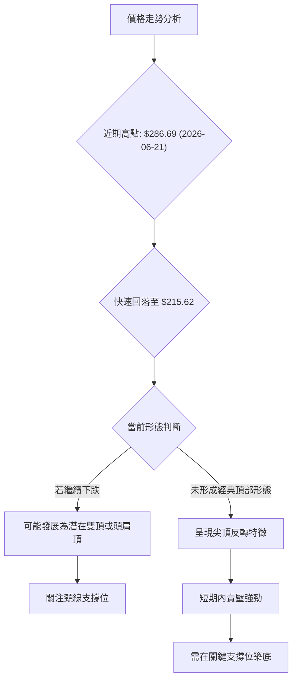
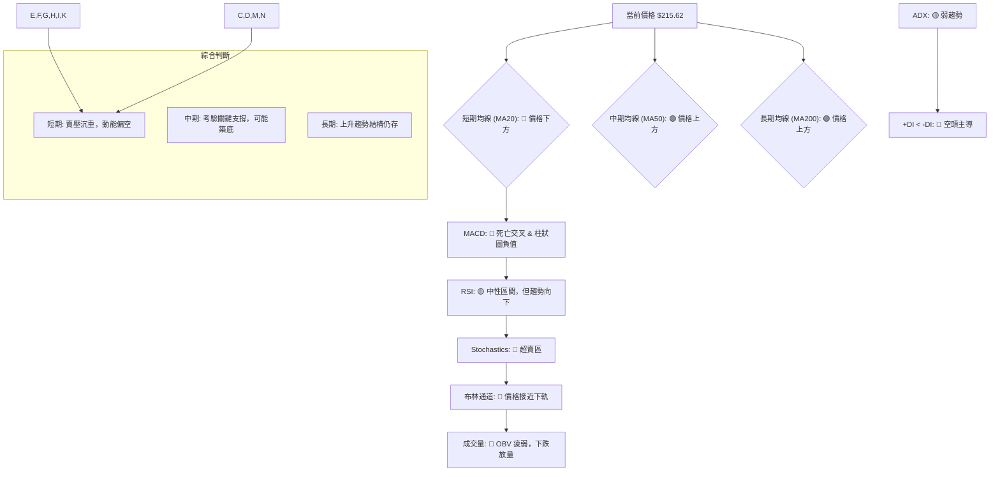
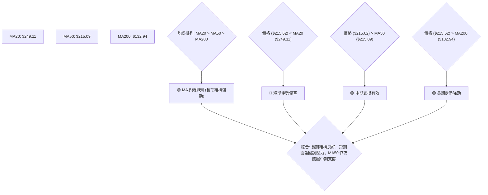
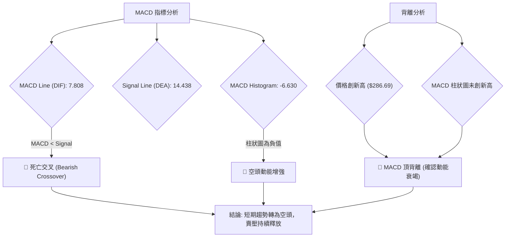
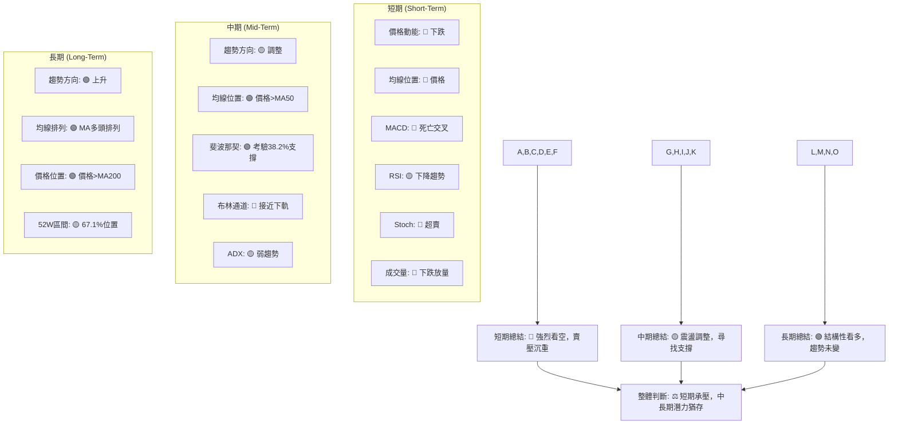
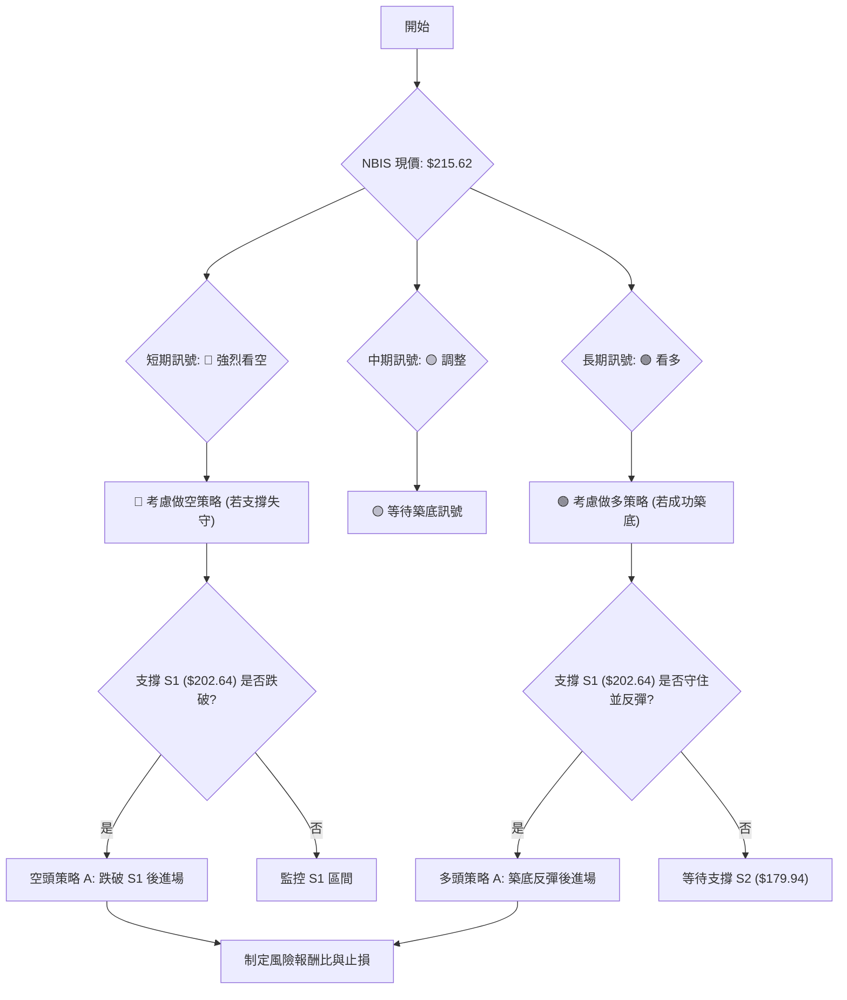
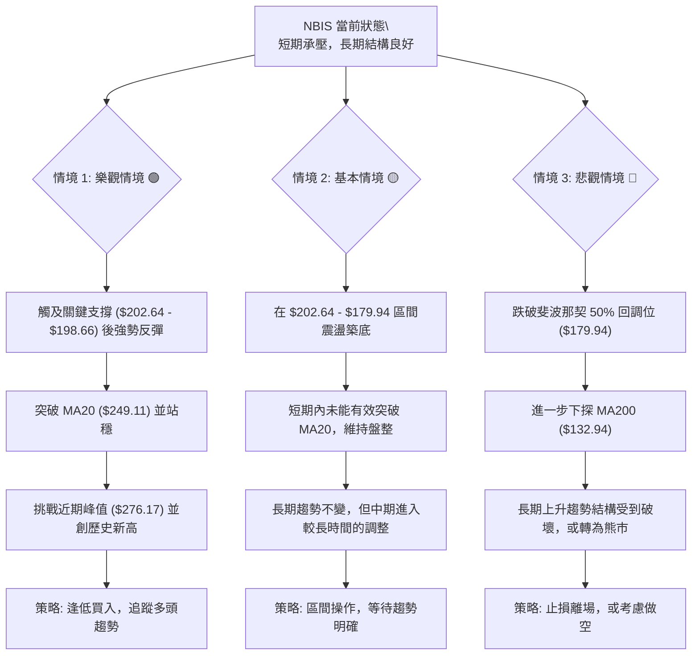

<details>
<summary>📊 靜態圖表 (點擊展開)</summary>

</details>

<html>
<head><meta charset="utf-8" /></head>
<body>
    <div style="height:500px; width:100%;">                        <script>window.PlotlyConfig = {MathJaxConfig: 'local'};</script>
        <script charset="utf-8" src="https://cdn.plot.ly/plotly-3.6.0.min.js" integrity="sha256-QaOVwtVY0T02VaHrr6pnoHLCwayMJp4O5n4YyaE3rJk=" crossorigin="anonymous"></script>                <div id="candlestick-chart" class="plotly-graph-div" style="height:100%; width:100%;"></div>            <script>                window.PLOTLYENV=window.PLOTLYENV || {};                                if (document.getElementById("candlestick-chart")) {                    Plotly.newPlot(                        "candlestick-chart",                        [{"close":{"dtype":"f8","bdata":"AAAAIIVbVkAAAADAHoVXQAAAACCuh1dAAAAAANfTWEAAAABgZqZaQAAAAEAz81pAAAAAYLhOXEAAAAAAKfxaQAAAAMDM7FpAAAAAgBSOW0AAAACgRxFcQAAAAEAK51xAAAAAIK53X0AAAABguP5fQAAAAAApPF9AAAAAwMxsXUAAAAAAAIBeQAAAAOB6lGBAAAAAYI8yYEAAAABguO5gQAAAAMDMBGBAAAAAwB51X0AAAABgj8JeQAAAAAApXFxAAAAAAABAW0AAAACA6xFaQAAAACCup1hAAAAAgD2KWkAAAADgo1BdQAAAACCFW19AAAAAwB51XkAAAABgZkZfQAAAACCFC19AAAAAgD1aYEAAAACAFB5eQAAAAGCPoltAAAAAAABAXUAAAAAAKVxbQAAAAIDr0VtAAAAAwMx8W0AAAACAFI5ZQAAAAEAKl1dAAAAA4FEoVkAAAABgj+JUQAAAAGC4flVAAAAAYI+iVkAAAADgesRXQAAAAMD1KFVAAAAA4KPQVEAAAACgmflWQAAAAOBROFZAAAAAACmsV0AAAAAgrrdXQAAAAKCZCVlAAAAAwMwcWEAAAABA4bpYQAAAAEAzs1lAAAAAYI+CWEAAAADAHhVZQAAAAIA9GlhAAAAAgMJlV0AAAACA65FXQAAAAAAp7FVAAAAAwPVIVEAAAADAzDxUQAAAAMDM3FJAAAAAgMKFU0AAAACgcF1WQAAAAGC4TldAAAAAgOuBVkAAAADgUchWQAAAAIDC5VVAAAAAYI+CVUAAAABA4UpVQAAAAMAe7VRAAAAAwMx8VkAAAADAHjVXQAAAACBcD1lAAAAAoHANWEAAAABAM1NYQAAAACCFe1hAAAAAwB7VWkAAAAAghVtaQAAAAGC4fllAAAAA4KP4WUAAAABguC5bQAAAAGCP0lhAAAAAIK63WEAAAABgZjZYQAAAAAAAoFdAAAAAoHDdVkAAAAAgrndYQAAAACCFG1lAAAAAgD26V0AAAAAAKUxVQAAAAIA9ClZAAAAAwMx8VkAAAADA9ZhUQAAAACCud1JAAAAAYGaGVUAAAADgUThXQAAAAGCP8lZAAAAAQAonVkAAAABguG5WQAAAAOCjgFhAAAAAoEdhWEAAAABAM3NZQAAAAEAK51pAAAAAQOF6WEAAAABACidZQAAAAMAepVlAAAAAIK6HWkAAAADgUThaQAAAAAApzFZAAAAA4KPAVkAAAABAM7NVQAAAAIDrcVhAAAAAoJnpV0AAAADAHlVWQAAAAAApvFdAAAAAIIUbWEAAAAAgrv9bQAAAAGCPAltAAAAAwMw8XEAAAABAMztgQAAAAMAeFV1AAAAAANejXUAAAACgR2FeQAAAACCuZ11AAAAAoJmJXEAAAACAPbpcQAAAAIDCxVxAAAAAgBR+WkAAAADgejRZQAAAAOCjEFdAAAAA4KPwWUAAAADAzHxZQAAAAOB6NFtAAAAAYI8iXEAAAACgmVldQAAAAAAAQF9AAAAAYI8KYUAAAABACh9iQAAAAIDrUWNAAAAAgBQ+ZEAAAADgo9hkQAAAAEDhqmRAAAAA4HqkY0AAAADAHuVjQAAAAKCZkWNAAAAA4HqEY0AAAABgj6JjQAAAAMAeZWJAAAAAYLgeYkAAAADgUfBgQAAAAIAUpmFAAAAAIFxHYUAAAAAgrk9jQAAAAKBwDWZAAAAAoHD9ZUAAAABA4WJoQAAAAOCjGGdAAAAAoJkhZkAAAABAM0NnQAAAACCFY2ZAAAAA4KPoaUAAAADAzKRrQAAAAIAUfmtAAAAAIIX7aEAAAAAgXLdoQAAAAIA9+mdAAAAAgMJ9a0AAAADgo9hqQAAAAIDrAWpAAAAAANcLakAAAABA4UpsQAAAAEDh4mxAAAAAACmIcEAAAACgR0lwQAAAAIDCdW9AAAAAYLg6cEAAAACA63lsQAAAAAAAQGtAAAAAANeDa0AAAACAFHZqQAAAACCux2tAAAAAIIULbUAAAADAHkFwQAAAAKCZkXBAAAAAYI+OcUAAAABACutxQAAAAIDCuXFAAAAAAAA0cUAAAABgjzpwQAAAAIAUCnBAAAAAoJkJbkAAAABgZlJwQAAAAGC4QnFAAAAAgMKlbEAAAAAA1\u002fNqQA=="},"high":{"dtype":"f8","bdata":"AAAAQDPTVkAAAAAAAMBXQAAAACCFa1hAAAAAQDPjWEAAAADAHiVbQAAAAGC4fltAAAAAYGa2XEAAAADAHoVcQAAAACBcf1tAAAAAoEchXEAAAACgmWldQAAAAOBR+FxAAAAAIFyvX0AAAAAAVJ9gQAAAAOBR+GBAAAAAwPUIYEAAAAAA11NfQAAAAIA9qmBAAAAAQDOjYUAAAADA9VBhQAAAAIAWuWBAAAAAIK5\u002fYEAAAABACl9gQAAAAACsJF5AAAAAgBReXUAAAAAghQtbQAAAAEAz81pAAAAAIK6nWkAAAADAzFxdQAAAAAAAoF9AAAAAwPUgYEAAAADAzHxfQAAAAIAUDmBAAAAAwMyEYEAAAACAwt1gQAAAAIDrMV1AAAAAoHCNXUAAAAAAAEBeQAAAAEAz01tAAAAAIK6XXUAAAAAA16NcQAAAAKCZaVpAAAAAYLjeVkAAAAAAAEBWQAAAAKCZaVZAAAAAAClsV0AAAACAFC5YQAAAAAAprFlAAAAAIFwvVkAAAAAAAEBXQAAAAIDr0VZAAAAAgJPoV0AAAADAHkVYQAAAAGBmZllAAAAAwMy8WUAAAAAA18NYQAAAAIDC9VlAAAAAYGZWWUAAAAAAACBZQAAAACCDOFlAAAAAgMJFWEAAAADAzNxXQAAAAKCZ6VdAAAAAIFwPVkAAAAAA12NUQAAAAEAzE1VAAAAAYGYWVEAAAABgj6JWQAAAAKCZ+VdAAAAAgBQ+V0AAAABA4dpWQAAAACCu51ZAAAAAQAonVkAAAACgcL1VQAAAAIAUnlVAAAAA4KOwVkAAAAAAKdxXQAAAACCFK1lAAAAAYGaWWUAAAABgj6JZQAAAAIAUPlpAAAAAIIUrW0AAAADAzPxaQAAAAMDMrFpAAAAA4FEIW0AAAAAAAKBbQAAAAIAUHlpAAAAAoJmZWUAAAABguP5ZQAAAAOCjuFhAAAAA4FE4WUAAAABgj+JYQAAAAGBmdllAAAAAAADQWEAAAABgjwJXQAAAAAAAUFZAAAAAwPXYVkAAAABgj+pVQAAAAOB6NFRAAAAAgD2qVUAAAAAghWtXQAAAAABU41dAAAAAAACwV0AAAADgo7BWQAAAAOB6FFlAAAAAYI\u002fSWEAAAACgmRlaQAAAAGC4\u002flpAAAAA4HoUW0AAAACgbkpZQAAAAAAA8FlAAAAAACncWkAAAADgehRbQAAAAEAz01hAAAAAoMTYVkAAAAAgrndWQAAAAGC4nlhAAAAAAADQWEAAAADAzLxXQAAAAMDMzFdAAAAAoJmZWEAAAADAHoVcQAAAAGCPwltAAAAA4HokXUAAAACgmYlgQAAAAAAAYF5AAAAAQImxXkAAAABAM3NeQAAAAABW7l5AAAAAANdTXkAAAABAM3NdQAAAAEAzs11AAAAAQDNTXEAAAADgo5BaQAAAACBcj1lAAAAAwPX4WUAAAAAgrvdaQAAAAKBwPVtAAAAAgMJ1XEAAAACgmXldQAAAAAAA8F9AAAAAoJkRYUAAAACAPbpiQAAAAAAA8GNAAAAAQDPDZEAAAACA69lkQAAAAGC4FmVAAAAAgOuBZEAAAAAAADhkQAAAAAAAaGRAAAAAgMLtZEAAAACA67lkQAAAAAAAqGRAAAAAoJmZYkAAAABguK5hQAAAAGBm9mFAAAAAIFxfYkAAAAAAAIBjQAAAAMDMbGZAAAAAYLh+ZkAAAAAgrn9oQAAAAOB6vGhAAAAAAACIZ0AAAACAl45oQAAAACCFM2dAAAAAQOEqa0AAAAAgXDdtQAAAAKBHmWxAAAAAgD1Ca0AAAACA61lpQAAAAAAAiGlAAAAAgOtZbEAAAACgcL1rQAAAAOBRoGtAAAAA4Ho0akAAAADgehxtQAAAAEAzM21AAAAAoMQscUAAAACgcG1xQAAAACBct3BAAAAAIIWHcEAAAAAAAFhvQAAAAMDMDG5AAAAAwPW0bUAAAAAgrt9sQAAAACCuj2xAAAAAQOFybkAAAADgUW5wQAAAACCFVXFAAAAAQOGeckAAAADAzKxyQAAAAIDCvXJAAAAAIK5zckAAAACgbkJxQAAAAOBROHFAAAAAoJkZb0AAAADAzHxwQAAAAKCZKXJAAAAAIK7PbkAAAADgUahtQA=="},"hovertemplate":"\u003cb\u003e%{x|%Y-%m-%d}\u003c\u002fb\u003e\u003cbr\u003e\u958b: $%{open:.2f}\u003cbr\u003e\u9ad8: $%{high:.2f}\u003cbr\u003e\u4f4e: $%{low:.2f}\u003cbr\u003e\u6536: $%{close:.2f}\u003cextra\u003e\u003c\u002fextra\u003e","low":{"dtype":"f8","bdata":"AAAAoEcBVkAAAADAHjVWQAAAAIDrAVdAAAAAAABQV0AAAACgR6FYQAAAAAAAEFpAAAAAYGY2WkAAAADgUXhaQAAAAEAzs1lAAAAAwB4VW0AAAACAPepbQAAAAOCjcFtAAAAA4HqkXUAAAABgZuZeQAAAACCFO19AAAAAgBTuXEAAAAAAAGBdQAAAACCu911AAAAA4FEAYEAAAADAzJRgQAAAAAAAcF9AAAAAwMyMXkAAAACgR4FeQAAAAOBRuFtAAAAA4KPgWkAAAACgmVlZQAAAAOBRqFdAAAAAoHDdWEAAAADgo4BbQAAAAEAKB15AAAAAgOsxXkAAAAAAAGBdQAAAAOCjcF1AAAAAQDOTX0AAAAAAAPBdQAAAAAAAQFtAAAAAIIXbW0AAAACAPRpbQAAAAOCjUFlAAAAAgBQuW0AAAADAHvVYQAAAAKBw7VZAAAAAAAAgVUAAAAAAAIBUQAAAAIDC5VRAAAAAoHBtVEAAAABAM\u002fNWQAAAAKBwDVVAAAAAoHCNU0AAAACgmUlVQAAAAOAkLlVAAAAA4KOwVkAAAAAAKVxXQAAAAOCjQFZAAAAAANcDWEAAAAAAAMBWQAAAAIAUXlhAAAAAwMwMWEAAAABAM9NXQAAAAGBmBlhAAAAAwMwMV0AAAADAzKxVQAAAAMDMjFVAAAAAoBgEVEAAAADgUThTQAAAAAAA0FJAAAAA4KNAU0AAAACAPQpUQAAAAGBmxlZAAAAAANcTVkAAAACgmSlWQAAAACBcr1VAAAAAYI8SVUAAAAAA1yNVQAAAAKCZuVRAAAAA4KOAVUAAAADA9bhWQAAAAAApvFZAAAAAANfjV0AAAAAgWAFYQAAAAGBmRlhAAAAAQDMjWEAAAABA4fpZQAAAACCD2FhAAAAAYGZGWUAAAACgcC1ZQAAAAIDClVhAAAAAYGZGV0AAAAAAACBYQAAAAIDrYVdAAAAAQArXVkAAAACA62FXQAAAAAApHFhAAAAAgD3KVkAAAAAgrgdVQAAAAIAUDlVAAAAAAAAwVUAAAAAAKZxTQAAAAKBHYVJAAAAAIK5HU0AAAAAA1\u002fNUQAAAAIA96lZAAAAAwPXIVUAAAAAAKexTQAAAAEAKN1ZAAAAAAABgV0AAAAAg2TZYQAAAACCFG1lAAAAAgOtBWEAAAABAM9NXQAAAAEDfb1hAAAAAQDOzWUAAAAAAAIBZQAAAAKCZGVZAAAAAQDOzVUAAAACA6+FUQAAAAKCZiVZAAAAAIK7nVkAAAABAMzNWQAAAAAAAoFVAAAAAAADAV0AAAAAgXB9aQAAAAKBHoVpAAAAAwPWIW0AAAABgEhtfQAAAAEAKR1xAAAAAAACAXEAAAACgR7FcQAAAAICTKFxAAAAAQDNjXEAAAADgowBcQAAAAMAeVVxAAAAAgD1aWkAAAACgRxFZQAAAAMDKaVZAAAAAYLjuV0AAAABgZlZZQAAAAAApDFhAAAAAwMzcWkAAAACA65FbQAAAAGBm1l1AAAAAQDMjX0AAAADgUdxgQAAAAKCZyWFAAAAA4KPQY0AAAAAAAJBjQAAAAEDhAmRAAAAAIFxXY0AAAACgR0FjQAAAAMDMbGNAAAAAQDNrY0AAAACAPUJjQAAAAIDrOWJAAAAAgOtRYUAAAABgZpZgQAAAAEAKx2BAAAAAAADgYEAAAAAAAIBhQAAAAGBm9mNAAAAAYLgWZUAAAAAgheNlQAAAAAAAIGZAAAAAAAAQZkAAAACgmVFmQAAAAAAAiGVAAAAAAABgaEAAAAAAAPhpQAAAAKCZeWpAAAAAYI\u002fCZ0AAAAAAAOBmQAAAAOB61GdAAAAAoJkZakAAAAAgXFdqQAAAAMAetWlAAAAAgOvJaEAAAADgUWBrQAAAAMDMTGpAAAAAAADAbUAAAAAAADxwQAAAAOBR8G5AAAAAgBRWbUAAAACAFBZrQAAAAGBmNmtAAAAAoJkJaUAAAAAA12tqQAAAAAAAoGlAAAAAAADwa0AAAAAgrqduQAAAAMDMrG9AAAAA4KOEcEAAAABAMzlxQAAAAAAAYHFAAAAAAABgb0AAAABguCZvQAAAAIDrkW9AAAAAwMxMbUAAAAAAAFBtQAAAAKCZ+W9AAAAAoHCFbEAAAABgkelpQA=="},"name":"\u50f9\u683c","open":{"dtype":"f8","bdata":"AAAAwMzMVkAAAABA4epWQAAAAMDMxFdAAAAAwPWIV0AAAADAzHxZQAAAAGCPAltAAAAA4KNIW0AAAAAghQNbQAAAACCFe1tAAAAA4FFYW0AAAADgelxcQAAAAIDC7VtAAAAAoEfxXkAAAABACs9fQAAAAMDMjGBAAAAAwMz0X0AAAADAzExeQAAAAGC4Pl5AAAAAYGbeYEAAAABguOZgQAAAAAAAgGBAAAAAwMx8YEAAAABA4QJgQAAAAADXg11AAAAAYI8yXUAAAADgUfhaQAAAAEAzq1pAAAAAwB4VWUAAAACAPcpbQAAAAIA9Ol5AAAAAANebX0AAAACA6xFfQAAAAMDMTF5AAAAAwPWoX0AAAAAAAMBgQAAAAGC4FlxAAAAAwPVoXEAAAABAM+NdQAAAAAAAIFpAAAAAIIXLXEAAAADgUYhcQAAAAMDMDFpAAAAAwPW4VkAAAABACpdUQAAAAOB69FRAAAAAgOvxVEAAAADgUUBXQAAAACCF21hAAAAAQDNjVUAAAABguI5VQAAAAGCPUlZAAAAAYGZ2V0AAAABAMyNYQAAAAMDM3FZAAAAAQAoXWUAAAACgR8FXQAAAAOB6xFhAAAAAgMIVWUAAAABgj1JYQAAAAIDChVhAAAAAYLjuV0AAAADAzExWQAAAAADXU1dAAAAAYGYGVkAAAADAzORTQAAAAIDCBVVAAAAAQDPDU0AAAACgmSlUQAAAAIAUPldAAAAAANeTVkAAAABguI5WQAAAAOCj4FZAAAAAwMwcVUAAAAAAAJhVQAAAACCuV1VAAAAAQAq\u002fVUAAAAAAAMBXQAAAAIDC7VdAAAAA4KPAWEAAAABgjzJYQAAAAKBHuVhAAAAA4HqUWEAAAADAHtVaQAAAAIDrcVpAAAAAIIUjWkAAAAAgrn9aQAAAAMAedVlAAAAAgMJFWUAAAADgo4BZQAAAAMDMLFhAAAAAoHBtWEAAAABgZpZXQAAAAAAAAFlAAAAAQAqXWEAAAACgQ+NWQAAAAADXc1VAAAAAIIV7VkAAAAAAAMBVQAAAAMD1yFNAAAAAYGbOU0AAAADAzBxVQAAAAGCPOldAAAAAYI86V0AAAABgZgZVQAAAAEAKd1ZAAAAAAAAAWEAAAABguO5YQAAAACCFG1lAAAAAANOlWkAAAAAghRNYQAAAACBc11hAAAAAIFw\u002fWkAAAAAAAIBaQAAAAMDMrFhAAAAAAAAAVkAAAACgmYlVQAAAAKCZmVZAAAAAAAAwWEAAAABAMxNXQAAAAEAK11VAAAAAwPXIV0AAAACAPUpaQAAAAIDCRVtAAAAAACmcW0AAAAAAADBfQAAAAIDCFV5AAAAAQDOzXEAAAADgUdBcQAAAAGBmHl5AAAAAoHAtXUAAAABAMwtdQAAAACCuN11AAAAA4FFQXEAAAADAHnVaQAAAACBcj1lAAAAAYLh+WEAAAADgenxaQAAAAIA9GlhAAAAAgD0qW0AAAAAAAKhbQAAAAOBRuF9AAAAAAABAX0AAAADgUdxgQAAAAGBm1mFAAAAAQDMjZEAAAABgOwdkQAAAAAAA4GRAAAAAwPV4ZEAAAAAAAKBjQAAAAEAKJ2RAAAAAIIVbZEAAAADAzHxjQAAAAKBwdWRAAAAA4HqMYkAAAADAzExhQAAAAEAKg2FAAAAAgOslYkAAAABgj6phQAAAAOBRDGRAAAAAwMx0ZUAAAABACnNmQAAAAOBRwGdAAAAAYGb2ZkAAAADAzHxmQAAAAKBwjWZAAAAAQAp7aUAAAAAAAKxqQAAAACCFM2tAAAAAQAova0AAAAAAAOBnQAAAAEAKf2lAAAAAIK53akAAAADgUWhrQAAAAKCZlWtAAAAAwB75aUAAAAAAKcxsQAAAACCFe2xAAAAAQOGCbkAAAACgmQFxQAAAAKBwQ3BAAAAAIK73bUAAAAAghdtuQAAAAMDMDG5AAAAAAADAbEAAAACgxu9qQAAAAOB6rGlAAAAAwMxUbUAAAABguH5vQAAAAEAK729AAAAAYGaacEAAAABAM6NyQAAAACBcH3JAAAAAAAAccEAAAACgmTFxQAAAAMAeCXFAAAAAQDObbkAAAAAAACxvQAAAAAApJHBAAAAAoMQIbkAAAAAAACBtQA=="},"x":["2025-09-16T00:00:00-04:00","2025-09-17T00:00:00-04:00","2025-09-18T00:00:00-04:00","2025-09-19T00:00:00-04:00","2025-09-22T00:00:00-04:00","2025-09-23T00:00:00-04:00","2025-09-24T00:00:00-04:00","2025-09-25T00:00:00-04:00","2025-09-26T00:00:00-04:00","2025-09-29T00:00:00-04:00","2025-09-30T00:00:00-04:00","2025-10-01T00:00:00-04:00","2025-10-02T00:00:00-04:00","2025-10-03T00:00:00-04:00","2025-10-06T00:00:00-04:00","2025-10-07T00:00:00-04:00","2025-10-08T00:00:00-04:00","2025-10-09T00:00:00-04:00","2025-10-10T00:00:00-04:00","2025-10-13T00:00:00-04:00","2025-10-14T00:00:00-04:00","2025-10-15T00:00:00-04:00","2025-10-16T00:00:00-04:00","2025-10-17T00:00:00-04:00","2025-10-20T00:00:00-04:00","2025-10-21T00:00:00-04:00","2025-10-22T00:00:00-04:00","2025-10-23T00:00:00-04:00","2025-10-24T00:00:00-04:00","2025-10-27T00:00:00-04:00","2025-10-28T00:00:00-04:00","2025-10-29T00:00:00-04:00","2025-10-30T00:00:00-04:00","2025-10-31T00:00:00-04:00","2025-11-03T00:00:00-05:00","2025-11-04T00:00:00-05:00","2025-11-05T00:00:00-05:00","2025-11-06T00:00:00-05:00","2025-11-07T00:00:00-05:00","2025-11-10T00:00:00-05:00","2025-11-11T00:00:00-05:00","2025-11-12T00:00:00-05:00","2025-11-13T00:00:00-05:00","2025-11-14T00:00:00-05:00","2025-11-17T00:00:00-05:00","2025-11-18T00:00:00-05:00","2025-11-19T00:00:00-05:00","2025-11-20T00:00:00-05:00","2025-11-21T00:00:00-05:00","2025-11-24T00:00:00-05:00","2025-11-25T00:00:00-05:00","2025-11-26T00:00:00-05:00","2025-11-28T00:00:00-05:00","2025-12-01T00:00:00-05:00","2025-12-02T00:00:00-05:00","2025-12-03T00:00:00-05:00","2025-12-04T00:00:00-05:00","2025-12-05T00:00:00-05:00","2025-12-08T00:00:00-05:00","2025-12-09T00:00:00-05:00","2025-12-10T00:00:00-05:00","2025-12-11T00:00:00-05:00","2025-12-12T00:00:00-05:00","2025-12-15T00:00:00-05:00","2025-12-16T00:00:00-05:00","2025-12-17T00:00:00-05:00","2025-12-18T00:00:00-05:00","2025-12-19T00:00:00-05:00","2025-12-22T00:00:00-05:00","2025-12-23T00:00:00-05:00","2025-12-24T00:00:00-05:00","2025-12-26T00:00:00-05:00","2025-12-29T00:00:00-05:00","2025-12-30T00:00:00-05:00","2025-12-31T00:00:00-05:00","2026-01-02T00:00:00-05:00","2026-01-05T00:00:00-05:00","2026-01-06T00:00:00-05:00","2026-01-07T00:00:00-05:00","2026-01-08T00:00:00-05:00","2026-01-09T00:00:00-05:00","2026-01-12T00:00:00-05:00","2026-01-13T00:00:00-05:00","2026-01-14T00:00:00-05:00","2026-01-15T00:00:00-05:00","2026-01-16T00:00:00-05:00","2026-01-20T00:00:00-05:00","2026-01-21T00:00:00-05:00","2026-01-22T00:00:00-05:00","2026-01-23T00:00:00-05:00","2026-01-26T00:00:00-05:00","2026-01-27T00:00:00-05:00","2026-01-28T00:00:00-05:00","2026-01-29T00:00:00-05:00","2026-01-30T00:00:00-05:00","2026-02-02T00:00:00-05:00","2026-02-03T00:00:00-05:00","2026-02-04T00:00:00-05:00","2026-02-05T00:00:00-05:00","2026-02-06T00:00:00-05:00","2026-02-09T00:00:00-05:00","2026-02-10T00:00:00-05:00","2026-02-11T00:00:00-05:00","2026-02-12T00:00:00-05:00","2026-02-13T00:00:00-05:00","2026-02-17T00:00:00-05:00","2026-02-18T00:00:00-05:00","2026-02-19T00:00:00-05:00","2026-02-20T00:00:00-05:00","2026-02-23T00:00:00-05:00","2026-02-24T00:00:00-05:00","2026-02-25T00:00:00-05:00","2026-02-26T00:00:00-05:00","2026-02-27T00:00:00-05:00","2026-03-02T00:00:00-05:00","2026-03-03T00:00:00-05:00","2026-03-04T00:00:00-05:00","2026-03-05T00:00:00-05:00","2026-03-06T00:00:00-05:00","2026-03-09T00:00:00-04:00","2026-03-10T00:00:00-04:00","2026-03-11T00:00:00-04:00","2026-03-12T00:00:00-04:00","2026-03-13T00:00:00-04:00","2026-03-16T00:00:00-04:00","2026-03-17T00:00:00-04:00","2026-03-18T00:00:00-04:00","2026-03-19T00:00:00-04:00","2026-03-20T00:00:00-04:00","2026-03-23T00:00:00-04:00","2026-03-24T00:00:00-04:00","2026-03-25T00:00:00-04:00","2026-03-26T00:00:00-04:00","2026-03-27T00:00:00-04:00","2026-03-30T00:00:00-04:00","2026-03-31T00:00:00-04:00","2026-04-01T00:00:00-04:00","2026-04-02T00:00:00-04:00","2026-04-06T00:00:00-04:00","2026-04-07T00:00:00-04:00","2026-04-08T00:00:00-04:00","2026-04-09T00:00:00-04:00","2026-04-10T00:00:00-04:00","2026-04-13T00:00:00-04:00","2026-04-14T00:00:00-04:00","2026-04-15T00:00:00-04:00","2026-04-16T00:00:00-04:00","2026-04-17T00:00:00-04:00","2026-04-20T00:00:00-04:00","2026-04-21T00:00:00-04:00","2026-04-22T00:00:00-04:00","2026-04-23T00:00:00-04:00","2026-04-24T00:00:00-04:00","2026-04-27T00:00:00-04:00","2026-04-28T00:00:00-04:00","2026-04-29T00:00:00-04:00","2026-04-30T00:00:00-04:00","2026-05-01T00:00:00-04:00","2026-05-04T00:00:00-04:00","2026-05-05T00:00:00-04:00","2026-05-06T00:00:00-04:00","2026-05-07T00:00:00-04:00","2026-05-08T00:00:00-04:00","2026-05-11T00:00:00-04:00","2026-05-12T00:00:00-04:00","2026-05-13T00:00:00-04:00","2026-05-14T00:00:00-04:00","2026-05-15T00:00:00-04:00","2026-05-18T00:00:00-04:00","2026-05-19T00:00:00-04:00","2026-05-20T00:00:00-04:00","2026-05-21T00:00:00-04:00","2026-05-22T00:00:00-04:00","2026-05-26T00:00:00-04:00","2026-05-27T00:00:00-04:00","2026-05-28T00:00:00-04:00","2026-05-29T00:00:00-04:00","2026-06-01T00:00:00-04:00","2026-06-02T00:00:00-04:00","2026-06-03T00:00:00-04:00","2026-06-04T00:00:00-04:00","2026-06-05T00:00:00-04:00","2026-06-08T00:00:00-04:00","2026-06-09T00:00:00-04:00","2026-06-10T00:00:00-04:00","2026-06-11T00:00:00-04:00","2026-06-12T00:00:00-04:00","2026-06-15T00:00:00-04:00","2026-06-16T00:00:00-04:00","2026-06-17T00:00:00-04:00","2026-06-18T00:00:00-04:00","2026-06-22T00:00:00-04:00","2026-06-23T00:00:00-04:00","2026-06-24T00:00:00-04:00","2026-06-25T00:00:00-04:00","2026-06-26T00:00:00-04:00","2026-06-29T00:00:00-04:00","2026-06-30T00:00:00-04:00","2026-07-01T00:00:00-04:00","2026-07-02T00:00:00-04:00"],"type":"candlestick"},{"hovertemplate":"MA30: $%{y:.2f}\u003cextra\u003e\u003c\u002fextra\u003e","line":{"color":"#2196F3","dash":"dash","width":2},"mode":"lines","name":"MA30","x":["2025-09-16T00:00:00-04:00","2025-09-17T00:00:00-04:00","2025-09-18T00:00:00-04:00","2025-09-19T00:00:00-04:00","2025-09-22T00:00:00-04:00","2025-09-23T00:00:00-04:00","2025-09-24T00:00:00-04:00","2025-09-25T00:00:00-04:00","2025-09-26T00:00:00-04:00","2025-09-29T00:00:00-04:00","2025-09-30T00:00:00-04:00","2025-10-01T00:00:00-04:00","2025-10-02T00:00:00-04:00","2025-10-03T00:00:00-04:00","2025-10-06T00:00:00-04:00","2025-10-07T00:00:00-04:00","2025-10-08T00:00:00-04:00","2025-10-09T00:00:00-04:00","2025-10-10T00:00:00-04:00","2025-10-13T00:00:00-04:00","2025-10-14T00:00:00-04:00","2025-10-15T00:00:00-04:00","2025-10-16T00:00:00-04:00","2025-10-17T00:00:00-04:00","2025-10-20T00:00:00-04:00","2025-10-21T00:00:00-04:00","2025-10-22T00:00:00-04:00","2025-10-23T00:00:00-04:00","2025-10-24T00:00:00-04:00","2025-10-27T00:00:00-04:00","2025-10-28T00:00:00-04:00","2025-10-29T00:00:00-04:00","2025-10-30T00:00:00-04:00","2025-10-31T00:00:00-04:00","2025-11-03T00:00:00-05:00","2025-11-04T00:00:00-05:00","2025-11-05T00:00:00-05:00","2025-11-06T00:00:00-05:00","2025-11-07T00:00:00-05:00","2025-11-10T00:00:00-05:00","2025-11-11T00:00:00-05:00","2025-11-12T00:00:00-05:00","2025-11-13T00:00:00-05:00","2025-11-14T00:00:00-05:00","2025-11-17T00:00:00-05:00","2025-11-18T00:00:00-05:00","2025-11-19T00:00:00-05:00","2025-11-20T00:00:00-05:00","2025-11-21T00:00:00-05:00","2025-11-24T00:00:00-05:00","2025-11-25T00:00:00-05:00","2025-11-26T00:00:00-05:00","2025-11-28T00:00:00-05:00","2025-12-01T00:00:00-05:00","2025-12-02T00:00:00-05:00","2025-12-03T00:00:00-05:00","2025-12-04T00:00:00-05:00","2025-12-05T00:00:00-05:00","2025-12-08T00:00:00-05:00","2025-12-09T00:00:00-05:00","2025-12-10T00:00:00-05:00","2025-12-11T00:00:00-05:00","2025-12-12T00:00:00-05:00","2025-12-15T00:00:00-05:00","2025-12-16T00:00:00-05:00","2025-12-17T00:00:00-05:00","2025-12-18T00:00:00-05:00","2025-12-19T00:00:00-05:00","2025-12-22T00:00:00-05:00","2025-12-23T00:00:00-05:00","2025-12-24T00:00:00-05:00","2025-12-26T00:00:00-05:00","2025-12-29T00:00:00-05:00","2025-12-30T00:00:00-05:00","2025-12-31T00:00:00-05:00","2026-01-02T00:00:00-05:00","2026-01-05T00:00:00-05:00","2026-01-06T00:00:00-05:00","2026-01-07T00:00:00-05:00","2026-01-08T00:00:00-05:00","2026-01-09T00:00:00-05:00","2026-01-12T00:00:00-05:00","2026-01-13T00:00:00-05:00","2026-01-14T00:00:00-05:00","2026-01-15T00:00:00-05:00","2026-01-16T00:00:00-05:00","2026-01-20T00:00:00-05:00","2026-01-21T00:00:00-05:00","2026-01-22T00:00:00-05:00","2026-01-23T00:00:00-05:00","2026-01-26T00:00:00-05:00","2026-01-27T00:00:00-05:00","2026-01-28T00:00:00-05:00","2026-01-29T00:00:00-05:00","2026-01-30T00:00:00-05:00","2026-02-02T00:00:00-05:00","2026-02-03T00:00:00-05:00","2026-02-04T00:00:00-05:00","2026-02-05T00:00:00-05:00","2026-02-06T00:00:00-05:00","2026-02-09T00:00:00-05:00","2026-02-10T00:00:00-05:00","2026-02-11T00:00:00-05:00","2026-02-12T00:00:00-05:00","2026-02-13T00:00:00-05:00","2026-02-17T00:00:00-05:00","2026-02-18T00:00:00-05:00","2026-02-19T00:00:00-05:00","2026-02-20T00:00:00-05:00","2026-02-23T00:00:00-05:00","2026-02-24T00:00:00-05:00","2026-02-25T00:00:00-05:00","2026-02-26T00:00:00-05:00","2026-02-27T00:00:00-05:00","2026-03-02T00:00:00-05:00","2026-03-03T00:00:00-05:00","2026-03-04T00:00:00-05:00","2026-03-05T00:00:00-05:00","2026-03-06T00:00:00-05:00","2026-03-09T00:00:00-04:00","2026-03-10T00:00:00-04:00","2026-03-11T00:00:00-04:00","2026-03-12T00:00:00-04:00","2026-03-13T00:00:00-04:00","2026-03-16T00:00:00-04:00","2026-03-17T00:00:00-04:00","2026-03-18T00:00:00-04:00","2026-03-19T00:00:00-04:00","2026-03-20T00:00:00-04:00","2026-03-23T00:00:00-04:00","2026-03-24T00:00:00-04:00","2026-03-25T00:00:00-04:00","2026-03-26T00:00:00-04:00","2026-03-27T00:00:00-04:00","2026-03-30T00:00:00-04:00","2026-03-31T00:00:00-04:00","2026-04-01T00:00:00-04:00","2026-04-02T00:00:00-04:00","2026-04-06T00:00:00-04:00","2026-04-07T00:00:00-04:00","2026-04-08T00:00:00-04:00","2026-04-09T00:00:00-04:00","2026-04-10T00:00:00-04:00","2026-04-13T00:00:00-04:00","2026-04-14T00:00:00-04:00","2026-04-15T00:00:00-04:00","2026-04-16T00:00:00-04:00","2026-04-17T00:00:00-04:00","2026-04-20T00:00:00-04:00","2026-04-21T00:00:00-04:00","2026-04-22T00:00:00-04:00","2026-04-23T00:00:00-04:00","2026-04-24T00:00:00-04:00","2026-04-27T00:00:00-04:00","2026-04-28T00:00:00-04:00","2026-04-29T00:00:00-04:00","2026-04-30T00:00:00-04:00","2026-05-01T00:00:00-04:00","2026-05-04T00:00:00-04:00","2026-05-05T00:00:00-04:00","2026-05-06T00:00:00-04:00","2026-05-07T00:00:00-04:00","2026-05-08T00:00:00-04:00","2026-05-11T00:00:00-04:00","2026-05-12T00:00:00-04:00","2026-05-13T00:00:00-04:00","2026-05-14T00:00:00-04:00","2026-05-15T00:00:00-04:00","2026-05-18T00:00:00-04:00","2026-05-19T00:00:00-04:00","2026-05-20T00:00:00-04:00","2026-05-21T00:00:00-04:00","2026-05-22T00:00:00-04:00","2026-05-26T00:00:00-04:00","2026-05-27T00:00:00-04:00","2026-05-28T00:00:00-04:00","2026-05-29T00:00:00-04:00","2026-06-01T00:00:00-04:00","2026-06-02T00:00:00-04:00","2026-06-03T00:00:00-04:00","2026-06-04T00:00:00-04:00","2026-06-05T00:00:00-04:00","2026-06-08T00:00:00-04:00","2026-06-09T00:00:00-04:00","2026-06-10T00:00:00-04:00","2026-06-11T00:00:00-04:00","2026-06-12T00:00:00-04:00","2026-06-15T00:00:00-04:00","2026-06-16T00:00:00-04:00","2026-06-17T00:00:00-04:00","2026-06-18T00:00:00-04:00","2026-06-22T00:00:00-04:00","2026-06-23T00:00:00-04:00","2026-06-24T00:00:00-04:00","2026-06-25T00:00:00-04:00","2026-06-26T00:00:00-04:00","2026-06-29T00:00:00-04:00","2026-06-30T00:00:00-04:00","2026-07-01T00:00:00-04:00","2026-07-02T00:00:00-04:00"],"y":{"dtype":"f8","bdata":"AAAAAAAA+H8AAAAAAAD4fwAAAAAAAPh\u002fAAAAAAAA+H8AAAAAAAD4fwAAAAAAAPh\u002fAAAAAAAA+H8AAAAAAAD4fwAAAAAAAPh\u002fAAAAAAAA+H8AAAAAAAD4fwAAAAAAAPh\u002fAAAAAAAA+H8AAAAAAAD4fwAAAAAAAPh\u002fAAAAAAAA+H8AAAAAAAD4fwAAAAAAAPh\u002fAAAAAAAA+H8AAAAAAAD4fwAAAAAAAPh\u002fAAAAAAAA+H8AAAAAAAD4fwAAAAAAAPh\u002fAAAAAAAA+H8AAAAAAAD4fwAAAAAAAPh\u002fAAAAAAAA+H8AAAAAAAD4fzMzM4MjjFxAvLu7O0LRXECamZlJbxNdQN7d3Q2QU11AiYiIuMiWXUB3d3eXX7RdQO\u002fu7v43ul1Aq6qq6kLCXUDe3d0ddsVdQGZmZkYZzV1AERER0YXMXUDe3d0tFbddQImIiNi\u002fiV1AZmZm1k06XUC8u7urf9tcQBEREVFiiFxAZmZmVnFOXEB3d3f3\u002fRRcQBEREZGXrltAvLu7q8ZLW0CamZkZ2e5aQCIiInISm1pAq6qq2qNYWkB3d3dHixxaQKuqqioxAFpAERERMWvlWUCrqqrq+9lZQBEREcHm4llAZmZmJpTRWUDNzMwcdq1ZQDMzM1ONb1lAREREhE4zWUAAAACwjvFYQImIiEi2o1hAAAAAYLo5WEDv7u4ua+VXQM3MzFyPmldAAAAAUI1HV0ARERGR7RxXQM3MzNxr9lZAMzMz4+zLVkBERERERLRWQBEREfHSpVZAVVVVdUygVkB3d3enxqNWQDMzMzPsnlZAq6qq+qmdVkBERESk4phWQCIiIlIqulZA7+7uvsrVVkDe3d3dT+FWQAAAAGCe9FZAAAAAgJUPV0CrqqqqHCZXQHd3dxcEKldAiYiImOA5V0Crqqoqzk5XQM3MzDxRR1dAd3d3hxZJV0C8u7v7qUFXQN7d3d2WPVdAq6qqmgs5V0CamZk5tEBXQGZmZvbhW1dAiYiIOEJ5V0BERETUTYJXQAAAADBrnVdAREREVLi2V0Crqqoqo6dXQGZmZgZWfldAiYiIuPN1V0BERER0r3lXQHd3dzelgldAd3d3xyCIV0BmZmYm25FXQGZmZpZfsFdAERER0YXAV0AiIiKiqNNXQDMzM6Nh41dAZmZmhgfnV0CamZk5F+5XQO\u002fu7r4C+FdAzczM7G31V0DNzMyMQfRXQFVVVcU83VdA3t3dTcXBV0CamZmZ\u002fJJXQAAAAPDDj1dAMzMzY+WIV0B3d3d32nhXQERERMTKeVdAzczMDGWEV0Dv7u4uh6JXQCIiIkLDsldAAAAAgD\u002fZV0ARERHRhThYQERERGSedFhARERERKexWEBmZmZ2IQVZQLy7u8t2YllAZmZm1k2eWUCJiIgoTc1ZQAAAABAC\u002f1lAAAAA8AokWkDe3d2NsztaQJqZmUlvL1pAmpmZKb88WkBEREQUET1aQGZmZualP1pA7+7uXtZeWkAzMzPzp4JaQCIiIkJ8slpAIiIi8u7yWkDv7u5udUhbQGZmZualz1tAMzMzI\u002fdmXEC8u7trkRFdQAAAADCyoV1AzczM7N8kXkCrqqpq2LleQBEREbFHPV9AAAAAUKm8X0De3d3daw5gQERERDwmOGBAIiIiGktaYEAAAACoVGBgQAAAABjZemBAiYiIUNSPYEAzMzNT\u002f7JgQM3MzKS38WBAiYiI+JozYUBERER0IYlhQN7d3b1002FAIiIiUkYfYkCrqqpyPXpiQJqZmUnh1mJAMzMza0pFY0Dv7u72b8RjQCIiIiL3OmRAiYiIUBuYZEAiIiLCyu1kQDMzMxMRNWVAIiIicj2OZUAAAACAsdhlQBEREZHCEWZAzczMDElDZkARERGh04JmQDMzM8P1yGZA7+7u7nw7Z0CamZlZq6dnQN7d3S0kDWhAZmZmxpJ7aEB3d3fHBMdoQCIiItKUEmlAIiIigsBiaUCrqqq6ArRpQImIiMh2CmpAzczMjN5uakDe3d3tfN9qQLy7u3sUPmtAERERwRGua0CamZmpxg9sQBEREZE0eWxAZmZmtvPhbEDv7u5+ajBtQAAAAKAag21AREREBFambUDv7u6uANFtQJqZmTn7DG5AmpmZiUEsbkAzMzOzVj9uQA=="},"type":"scatter"},{"hovertemplate":"MA60: $%{y:.2f}\u003cextra\u003e\u003c\u002fextra\u003e","line":{"color":"#9C27B0","dash":"dash","width":2},"mode":"lines","name":"MA60","x":["2025-09-16T00:00:00-04:00","2025-09-17T00:00:00-04:00","2025-09-18T00:00:00-04:00","2025-09-19T00:00:00-04:00","2025-09-22T00:00:00-04:00","2025-09-23T00:00:00-04:00","2025-09-24T00:00:00-04:00","2025-09-25T00:00:00-04:00","2025-09-26T00:00:00-04:00","2025-09-29T00:00:00-04:00","2025-09-30T00:00:00-04:00","2025-10-01T00:00:00-04:00","2025-10-02T00:00:00-04:00","2025-10-03T00:00:00-04:00","2025-10-06T00:00:00-04:00","2025-10-07T00:00:00-04:00","2025-10-08T00:00:00-04:00","2025-10-09T00:00:00-04:00","2025-10-10T00:00:00-04:00","2025-10-13T00:00:00-04:00","2025-10-14T00:00:00-04:00","2025-10-15T00:00:00-04:00","2025-10-16T00:00:00-04:00","2025-10-17T00:00:00-04:00","2025-10-20T00:00:00-04:00","2025-10-21T00:00:00-04:00","2025-10-22T00:00:00-04:00","2025-10-23T00:00:00-04:00","2025-10-24T00:00:00-04:00","2025-10-27T00:00:00-04:00","2025-10-28T00:00:00-04:00","2025-10-29T00:00:00-04:00","2025-10-30T00:00:00-04:00","2025-10-31T00:00:00-04:00","2025-11-03T00:00:00-05:00","2025-11-04T00:00:00-05:00","2025-11-05T00:00:00-05:00","2025-11-06T00:00:00-05:00","2025-11-07T00:00:00-05:00","2025-11-10T00:00:00-05:00","2025-11-11T00:00:00-05:00","2025-11-12T00:00:00-05:00","2025-11-13T00:00:00-05:00","2025-11-14T00:00:00-05:00","2025-11-17T00:00:00-05:00","2025-11-18T00:00:00-05:00","2025-11-19T00:00:00-05:00","2025-11-20T00:00:00-05:00","2025-11-21T00:00:00-05:00","2025-11-24T00:00:00-05:00","2025-11-25T00:00:00-05:00","2025-11-26T00:00:00-05:00","2025-11-28T00:00:00-05:00","2025-12-01T00:00:00-05:00","2025-12-02T00:00:00-05:00","2025-12-03T00:00:00-05:00","2025-12-04T00:00:00-05:00","2025-12-05T00:00:00-05:00","2025-12-08T00:00:00-05:00","2025-12-09T00:00:00-05:00","2025-12-10T00:00:00-05:00","2025-12-11T00:00:00-05:00","2025-12-12T00:00:00-05:00","2025-12-15T00:00:00-05:00","2025-12-16T00:00:00-05:00","2025-12-17T00:00:00-05:00","2025-12-18T00:00:00-05:00","2025-12-19T00:00:00-05:00","2025-12-22T00:00:00-05:00","2025-12-23T00:00:00-05:00","2025-12-24T00:00:00-05:00","2025-12-26T00:00:00-05:00","2025-12-29T00:00:00-05:00","2025-12-30T00:00:00-05:00","2025-12-31T00:00:00-05:00","2026-01-02T00:00:00-05:00","2026-01-05T00:00:00-05:00","2026-01-06T00:00:00-05:00","2026-01-07T00:00:00-05:00","2026-01-08T00:00:00-05:00","2026-01-09T00:00:00-05:00","2026-01-12T00:00:00-05:00","2026-01-13T00:00:00-05:00","2026-01-14T00:00:00-05:00","2026-01-15T00:00:00-05:00","2026-01-16T00:00:00-05:00","2026-01-20T00:00:00-05:00","2026-01-21T00:00:00-05:00","2026-01-22T00:00:00-05:00","2026-01-23T00:00:00-05:00","2026-01-26T00:00:00-05:00","2026-01-27T00:00:00-05:00","2026-01-28T00:00:00-05:00","2026-01-29T00:00:00-05:00","2026-01-30T00:00:00-05:00","2026-02-02T00:00:00-05:00","2026-02-03T00:00:00-05:00","2026-02-04T00:00:00-05:00","2026-02-05T00:00:00-05:00","2026-02-06T00:00:00-05:00","2026-02-09T00:00:00-05:00","2026-02-10T00:00:00-05:00","2026-02-11T00:00:00-05:00","2026-02-12T00:00:00-05:00","2026-02-13T00:00:00-05:00","2026-02-17T00:00:00-05:00","2026-02-18T00:00:00-05:00","2026-02-19T00:00:00-05:00","2026-02-20T00:00:00-05:00","2026-02-23T00:00:00-05:00","2026-02-24T00:00:00-05:00","2026-02-25T00:00:00-05:00","2026-02-26T00:00:00-05:00","2026-02-27T00:00:00-05:00","2026-03-02T00:00:00-05:00","2026-03-03T00:00:00-05:00","2026-03-04T00:00:00-05:00","2026-03-05T00:00:00-05:00","2026-03-06T00:00:00-05:00","2026-03-09T00:00:00-04:00","2026-03-10T00:00:00-04:00","2026-03-11T00:00:00-04:00","2026-03-12T00:00:00-04:00","2026-03-13T00:00:00-04:00","2026-03-16T00:00:00-04:00","2026-03-17T00:00:00-04:00","2026-03-18T00:00:00-04:00","2026-03-19T00:00:00-04:00","2026-03-20T00:00:00-04:00","2026-03-23T00:00:00-04:00","2026-03-24T00:00:00-04:00","2026-03-25T00:00:00-04:00","2026-03-26T00:00:00-04:00","2026-03-27T00:00:00-04:00","2026-03-30T00:00:00-04:00","2026-03-31T00:00:00-04:00","2026-04-01T00:00:00-04:00","2026-04-02T00:00:00-04:00","2026-04-06T00:00:00-04:00","2026-04-07T00:00:00-04:00","2026-04-08T00:00:00-04:00","2026-04-09T00:00:00-04:00","2026-04-10T00:00:00-04:00","2026-04-13T00:00:00-04:00","2026-04-14T00:00:00-04:00","2026-04-15T00:00:00-04:00","2026-04-16T00:00:00-04:00","2026-04-17T00:00:00-04:00","2026-04-20T00:00:00-04:00","2026-04-21T00:00:00-04:00","2026-04-22T00:00:00-04:00","2026-04-23T00:00:00-04:00","2026-04-24T00:00:00-04:00","2026-04-27T00:00:00-04:00","2026-04-28T00:00:00-04:00","2026-04-29T00:00:00-04:00","2026-04-30T00:00:00-04:00","2026-05-01T00:00:00-04:00","2026-05-04T00:00:00-04:00","2026-05-05T00:00:00-04:00","2026-05-06T00:00:00-04:00","2026-05-07T00:00:00-04:00","2026-05-08T00:00:00-04:00","2026-05-11T00:00:00-04:00","2026-05-12T00:00:00-04:00","2026-05-13T00:00:00-04:00","2026-05-14T00:00:00-04:00","2026-05-15T00:00:00-04:00","2026-05-18T00:00:00-04:00","2026-05-19T00:00:00-04:00","2026-05-20T00:00:00-04:00","2026-05-21T00:00:00-04:00","2026-05-22T00:00:00-04:00","2026-05-26T00:00:00-04:00","2026-05-27T00:00:00-04:00","2026-05-28T00:00:00-04:00","2026-05-29T00:00:00-04:00","2026-06-01T00:00:00-04:00","2026-06-02T00:00:00-04:00","2026-06-03T00:00:00-04:00","2026-06-04T00:00:00-04:00","2026-06-05T00:00:00-04:00","2026-06-08T00:00:00-04:00","2026-06-09T00:00:00-04:00","2026-06-10T00:00:00-04:00","2026-06-11T00:00:00-04:00","2026-06-12T00:00:00-04:00","2026-06-15T00:00:00-04:00","2026-06-16T00:00:00-04:00","2026-06-17T00:00:00-04:00","2026-06-18T00:00:00-04:00","2026-06-22T00:00:00-04:00","2026-06-23T00:00:00-04:00","2026-06-24T00:00:00-04:00","2026-06-25T00:00:00-04:00","2026-06-26T00:00:00-04:00","2026-06-29T00:00:00-04:00","2026-06-30T00:00:00-04:00","2026-07-01T00:00:00-04:00","2026-07-02T00:00:00-04:00"],"y":{"dtype":"f8","bdata":"AAAAAAAA+H8AAAAAAAD4fwAAAAAAAPh\u002fAAAAAAAA+H8AAAAAAAD4fwAAAAAAAPh\u002fAAAAAAAA+H8AAAAAAAD4fwAAAAAAAPh\u002fAAAAAAAA+H8AAAAAAAD4fwAAAAAAAPh\u002fAAAAAAAA+H8AAAAAAAD4fwAAAAAAAPh\u002fAAAAAAAA+H8AAAAAAAD4fwAAAAAAAPh\u002fAAAAAAAA+H8AAAAAAAD4fwAAAAAAAPh\u002fAAAAAAAA+H8AAAAAAAD4fwAAAAAAAPh\u002fAAAAAAAA+H8AAAAAAAD4fwAAAAAAAPh\u002fAAAAAAAA+H8AAAAAAAD4fwAAAAAAAPh\u002fAAAAAAAA+H8AAAAAAAD4fwAAAAAAAPh\u002fAAAAAAAA+H8AAAAAAAD4fwAAAAAAAPh\u002fAAAAAAAA+H8AAAAAAAD4fwAAAAAAAPh\u002fAAAAAAAA+H8AAAAAAAD4fwAAAAAAAPh\u002fAAAAAAAA+H8AAAAAAAD4fwAAAAAAAPh\u002fAAAAAAAA+H8AAAAAAAD4fwAAAAAAAPh\u002fAAAAAAAA+H8AAAAAAAD4fwAAAAAAAPh\u002fAAAAAAAA+H8AAAAAAAD4fwAAAAAAAPh\u002fAAAAAAAA+H8AAAAAAAD4fwAAAAAAAPh\u002fAAAAAAAA+H8AAAAAAAD4fzMzM2vY\u002fVpAAAAAYEgCW0DNzMz8fgJbQDMzMyuj+1pAREREjEHoWkAzMzNj5cxaQN7d3a1jqlpAVVVVHeiEWkB3d3fXMXFaQJqZmZHCYVpAIiIiWjlMWkARERG5rDVaQM3MzGTJF1pA3t3dJU3tWUCamZkpo79ZQCIiIkKnk1lAiYiIqA12WUDe3d1N8FZZQJqZmfFgNFlAVVVVtcgQWUC8u7t7FOhYQBEREWnYx1hAVVVVrRy0WEARERH5U6FYQBEREaEalVhAzczM5KWPWECrqqoKZZRYQO\u002fu7v4blVhA7+7uVlWNWEBEREQMkHdYQImIiBiSVlhAd3d3Dy02WEDNzMx0IRlYQHd3dx\u002fM\u002f1dARERETH7ZV0CamZmB3LNXQGZmZkb9m1dAIiIi0iJ\u002fV0De3d1dSGJXQJqZmfFgOldA3t3dTfAgV0BERETc+RZXQERERBQ8FFdAZmZmnjYUV0Dv7u7m0BpXQM3MzOSlJ1dA3t3d5RcvV0AzMzOjRTZXQKuqqvrFTldAq6qqImleV0C8u7uLs2dXQHd3d49QdldAZmZmtoGCV0C8u7sbL41XQGZmZm6gg1dAMzMz89J9V0AiIiJi5XBXQGZmZpaKa1dAVVVV9f1oV0CamZk5Ql1XQBEREdGwW1dAvLu7U7heV0BERES0nXFXQERERJxSh1dARERE3ECpV0CrqqrSad1XQCIiIsoECVhAREREzC80WECJiIhQYlZYQBEREWlmcFhAd3d3xyCKWEBmZmZOfqNYQLy7u6PTwFhAvLu72xXWWEAiIiJax+ZYQAAAAHDn71hAVVVVfaL+WEAzMzPbXAhZQM3MzMSDEVlAq6qq8u4iWUBmZmaWXzhZQImIiIA\u002fVVlAd3d3by50WUDe3d19W55ZQN7d3VVx1llAiYiIOF4UWkCrqqoCR1JaQAAAABC7mFpAAAAAqOLWWkARERFxWRlbQKuqqjqJW1tAZmZmLoegW0BVVVV1r99bQFVVVd2HEVxAIiIi2upGXECJiIiQl3xcQCIiIkootVxAq6qq8qfoXEBmZmYOkDVdQKuqqgrzol1AvLu748ECXkCJiIgIyG9eQN7d3cX10l5AIiIiyksxX0CamZk5F5hfQGZmZu6Y7l9AAAAAANUxYECJiIhAfHFgQKuqqgplrWBAAAAAQMPjYEDe3d1djxdhQCIiIponR2FAmpmZddqDYUC8u7sbdr5hQCIiIsLK\u002fGFAMzMzT2I7YkB3d3crzoViQJqZmW3nzGJAq6qqcvYmY0B3d3fHS4JjQDMzMwPk1WNAMzMzt\u002fMsZECrqqpSuGpkQDMzM4ddpWRAIiIizoXeZEBVVVWxKwplQERERPCnQmVAq6qqbll\u002fZUCJiIggPsllQERERBDmF2ZAzczMXNZwZkDv7u4OdMxmQHd3d6dUJmdAREREBJ2AZ0DNzMz4U9VnQM3MzPT9LGhAvLu7N9B1aEDv7u5SuMpoQN7d3S35I2lAERERbS5iaUCrqqq6kJZpQA=="},"type":"scatter"},{"hovertemplate":"MA200: $%{y:.2f}\u003cextra\u003e\u003c\u002fextra\u003e","line":{"color":"#FF6F00","dash":"solid","width":2},"mode":"lines","name":"MA200","x":["2025-09-16T00:00:00-04:00","2025-09-17T00:00:00-04:00","2025-09-18T00:00:00-04:00","2025-09-19T00:00:00-04:00","2025-09-22T00:00:00-04:00","2025-09-23T00:00:00-04:00","2025-09-24T00:00:00-04:00","2025-09-25T00:00:00-04:00","2025-09-26T00:00:00-04:00","2025-09-29T00:00:00-04:00","2025-09-30T00:00:00-04:00","2025-10-01T00:00:00-04:00","2025-10-02T00:00:00-04:00","2025-10-03T00:00:00-04:00","2025-10-06T00:00:00-04:00","2025-10-07T00:00:00-04:00","2025-10-08T00:00:00-04:00","2025-10-09T00:00:00-04:00","2025-10-10T00:00:00-04:00","2025-10-13T00:00:00-04:00","2025-10-14T00:00:00-04:00","2025-10-15T00:00:00-04:00","2025-10-16T00:00:00-04:00","2025-10-17T00:00:00-04:00","2025-10-20T00:00:00-04:00","2025-10-21T00:00:00-04:00","2025-10-22T00:00:00-04:00","2025-10-23T00:00:00-04:00","2025-10-24T00:00:00-04:00","2025-10-27T00:00:00-04:00","2025-10-28T00:00:00-04:00","2025-10-29T00:00:00-04:00","2025-10-30T00:00:00-04:00","2025-10-31T00:00:00-04:00","2025-11-03T00:00:00-05:00","2025-11-04T00:00:00-05:00","2025-11-05T00:00:00-05:00","2025-11-06T00:00:00-05:00","2025-11-07T00:00:00-05:00","2025-11-10T00:00:00-05:00","2025-11-11T00:00:00-05:00","2025-11-12T00:00:00-05:00","2025-11-13T00:00:00-05:00","2025-11-14T00:00:00-05:00","2025-11-17T00:00:00-05:00","2025-11-18T00:00:00-05:00","2025-11-19T00:00:00-05:00","2025-11-20T00:00:00-05:00","2025-11-21T00:00:00-05:00","2025-11-24T00:00:00-05:00","2025-11-25T00:00:00-05:00","2025-11-26T00:00:00-05:00","2025-11-28T00:00:00-05:00","2025-12-01T00:00:00-05:00","2025-12-02T00:00:00-05:00","2025-12-03T00:00:00-05:00","2025-12-04T00:00:00-05:00","2025-12-05T00:00:00-05:00","2025-12-08T00:00:00-05:00","2025-12-09T00:00:00-05:00","2025-12-10T00:00:00-05:00","2025-12-11T00:00:00-05:00","2025-12-12T00:00:00-05:00","2025-12-15T00:00:00-05:00","2025-12-16T00:00:00-05:00","2025-12-17T00:00:00-05:00","2025-12-18T00:00:00-05:00","2025-12-19T00:00:00-05:00","2025-12-22T00:00:00-05:00","2025-12-23T00:00:00-05:00","2025-12-24T00:00:00-05:00","2025-12-26T00:00:00-05:00","2025-12-29T00:00:00-05:00","2025-12-30T00:00:00-05:00","2025-12-31T00:00:00-05:00","2026-01-02T00:00:00-05:00","2026-01-05T00:00:00-05:00","2026-01-06T00:00:00-05:00","2026-01-07T00:00:00-05:00","2026-01-08T00:00:00-05:00","2026-01-09T00:00:00-05:00","2026-01-12T00:00:00-05:00","2026-01-13T00:00:00-05:00","2026-01-14T00:00:00-05:00","2026-01-15T00:00:00-05:00","2026-01-16T00:00:00-05:00","2026-01-20T00:00:00-05:00","2026-01-21T00:00:00-05:00","2026-01-22T00:00:00-05:00","2026-01-23T00:00:00-05:00","2026-01-26T00:00:00-05:00","2026-01-27T00:00:00-05:00","2026-01-28T00:00:00-05:00","2026-01-29T00:00:00-05:00","2026-01-30T00:00:00-05:00","2026-02-02T00:00:00-05:00","2026-02-03T00:00:00-05:00","2026-02-04T00:00:00-05:00","2026-02-05T00:00:00-05:00","2026-02-06T00:00:00-05:00","2026-02-09T00:00:00-05:00","2026-02-10T00:00:00-05:00","2026-02-11T00:00:00-05:00","2026-02-12T00:00:00-05:00","2026-02-13T00:00:00-05:00","2026-02-17T00:00:00-05:00","2026-02-18T00:00:00-05:00","2026-02-19T00:00:00-05:00","2026-02-20T00:00:00-05:00","2026-02-23T00:00:00-05:00","2026-02-24T00:00:00-05:00","2026-02-25T00:00:00-05:00","2026-02-26T00:00:00-05:00","2026-02-27T00:00:00-05:00","2026-03-02T00:00:00-05:00","2026-03-03T00:00:00-05:00","2026-03-04T00:00:00-05:00","2026-03-05T00:00:00-05:00","2026-03-06T00:00:00-05:00","2026-03-09T00:00:00-04:00","2026-03-10T00:00:00-04:00","2026-03-11T00:00:00-04:00","2026-03-12T00:00:00-04:00","2026-03-13T00:00:00-04:00","2026-03-16T00:00:00-04:00","2026-03-17T00:00:00-04:00","2026-03-18T00:00:00-04:00","2026-03-19T00:00:00-04:00","2026-03-20T00:00:00-04:00","2026-03-23T00:00:00-04:00","2026-03-24T00:00:00-04:00","2026-03-25T00:00:00-04:00","2026-03-26T00:00:00-04:00","2026-03-27T00:00:00-04:00","2026-03-30T00:00:00-04:00","2026-03-31T00:00:00-04:00","2026-04-01T00:00:00-04:00","2026-04-02T00:00:00-04:00","2026-04-06T00:00:00-04:00","2026-04-07T00:00:00-04:00","2026-04-08T00:00:00-04:00","2026-04-09T00:00:00-04:00","2026-04-10T00:00:00-04:00","2026-04-13T00:00:00-04:00","2026-04-14T00:00:00-04:00","2026-04-15T00:00:00-04:00","2026-04-16T00:00:00-04:00","2026-04-17T00:00:00-04:00","2026-04-20T00:00:00-04:00","2026-04-21T00:00:00-04:00","2026-04-22T00:00:00-04:00","2026-04-23T00:00:00-04:00","2026-04-24T00:00:00-04:00","2026-04-27T00:00:00-04:00","2026-04-28T00:00:00-04:00","2026-04-29T00:00:00-04:00","2026-04-30T00:00:00-04:00","2026-05-01T00:00:00-04:00","2026-05-04T00:00:00-04:00","2026-05-05T00:00:00-04:00","2026-05-06T00:00:00-04:00","2026-05-07T00:00:00-04:00","2026-05-08T00:00:00-04:00","2026-05-11T00:00:00-04:00","2026-05-12T00:00:00-04:00","2026-05-13T00:00:00-04:00","2026-05-14T00:00:00-04:00","2026-05-15T00:00:00-04:00","2026-05-18T00:00:00-04:00","2026-05-19T00:00:00-04:00","2026-05-20T00:00:00-04:00","2026-05-21T00:00:00-04:00","2026-05-22T00:00:00-04:00","2026-05-26T00:00:00-04:00","2026-05-27T00:00:00-04:00","2026-05-28T00:00:00-04:00","2026-05-29T00:00:00-04:00","2026-06-01T00:00:00-04:00","2026-06-02T00:00:00-04:00","2026-06-03T00:00:00-04:00","2026-06-04T00:00:00-04:00","2026-06-05T00:00:00-04:00","2026-06-08T00:00:00-04:00","2026-06-09T00:00:00-04:00","2026-06-10T00:00:00-04:00","2026-06-11T00:00:00-04:00","2026-06-12T00:00:00-04:00","2026-06-15T00:00:00-04:00","2026-06-16T00:00:00-04:00","2026-06-17T00:00:00-04:00","2026-06-18T00:00:00-04:00","2026-06-22T00:00:00-04:00","2026-06-23T00:00:00-04:00","2026-06-24T00:00:00-04:00","2026-06-25T00:00:00-04:00","2026-06-26T00:00:00-04:00","2026-06-29T00:00:00-04:00","2026-06-30T00:00:00-04:00","2026-07-01T00:00:00-04:00","2026-07-02T00:00:00-04:00"],"y":{"dtype":"f8","bdata":"AAAAAAAA+H8AAAAAAAD4fwAAAAAAAPh\u002fAAAAAAAA+H8AAAAAAAD4fwAAAAAAAPh\u002fAAAAAAAA+H8AAAAAAAD4fwAAAAAAAPh\u002fAAAAAAAA+H8AAAAAAAD4fwAAAAAAAPh\u002fAAAAAAAA+H8AAAAAAAD4fwAAAAAAAPh\u002fAAAAAAAA+H8AAAAAAAD4fwAAAAAAAPh\u002fAAAAAAAA+H8AAAAAAAD4fwAAAAAAAPh\u002fAAAAAAAA+H8AAAAAAAD4fwAAAAAAAPh\u002fAAAAAAAA+H8AAAAAAAD4fwAAAAAAAPh\u002fAAAAAAAA+H8AAAAAAAD4fwAAAAAAAPh\u002fAAAAAAAA+H8AAAAAAAD4fwAAAAAAAPh\u002fAAAAAAAA+H8AAAAAAAD4fwAAAAAAAPh\u002fAAAAAAAA+H8AAAAAAAD4fwAAAAAAAPh\u002fAAAAAAAA+H8AAAAAAAD4fwAAAAAAAPh\u002fAAAAAAAA+H8AAAAAAAD4fwAAAAAAAPh\u002fAAAAAAAA+H8AAAAAAAD4fwAAAAAAAPh\u002fAAAAAAAA+H8AAAAAAAD4fwAAAAAAAPh\u002fAAAAAAAA+H8AAAAAAAD4fwAAAAAAAPh\u002fAAAAAAAA+H8AAAAAAAD4fwAAAAAAAPh\u002fAAAAAAAA+H8AAAAAAAD4fwAAAAAAAPh\u002fAAAAAAAA+H8AAAAAAAD4fwAAAAAAAPh\u002fAAAAAAAA+H8AAAAAAAD4fwAAAAAAAPh\u002fAAAAAAAA+H8AAAAAAAD4fwAAAAAAAPh\u002fAAAAAAAA+H8AAAAAAAD4fwAAAAAAAPh\u002fAAAAAAAA+H8AAAAAAAD4fwAAAAAAAPh\u002fAAAAAAAA+H8AAAAAAAD4fwAAAAAAAPh\u002fAAAAAAAA+H8AAAAAAAD4fwAAAAAAAPh\u002fAAAAAAAA+H8AAAAAAAD4fwAAAAAAAPh\u002fAAAAAAAA+H8AAAAAAAD4fwAAAAAAAPh\u002fAAAAAAAA+H8AAAAAAAD4fwAAAAAAAPh\u002fAAAAAAAA+H8AAAAAAAD4fwAAAAAAAPh\u002fAAAAAAAA+H8AAAAAAAD4fwAAAAAAAPh\u002fAAAAAAAA+H8AAAAAAAD4fwAAAAAAAPh\u002fAAAAAAAA+H8AAAAAAAD4fwAAAAAAAPh\u002fAAAAAAAA+H8AAAAAAAD4fwAAAAAAAPh\u002fAAAAAAAA+H8AAAAAAAD4fwAAAAAAAPh\u002fAAAAAAAA+H8AAAAAAAD4fwAAAAAAAPh\u002fAAAAAAAA+H8AAAAAAAD4fwAAAAAAAPh\u002fAAAAAAAA+H8AAAAAAAD4fwAAAAAAAPh\u002fAAAAAAAA+H8AAAAAAAD4fwAAAAAAAPh\u002fAAAAAAAA+H8AAAAAAAD4fwAAAAAAAPh\u002fAAAAAAAA+H8AAAAAAAD4fwAAAAAAAPh\u002fAAAAAAAA+H8AAAAAAAD4fwAAAAAAAPh\u002fAAAAAAAA+H8AAAAAAAD4fwAAAAAAAPh\u002fAAAAAAAA+H8AAAAAAAD4fwAAAAAAAPh\u002fAAAAAAAA+H8AAAAAAAD4fwAAAAAAAPh\u002fAAAAAAAA+H8AAAAAAAD4fwAAAAAAAPh\u002fAAAAAAAA+H8AAAAAAAD4fwAAAAAAAPh\u002fAAAAAAAA+H8AAAAAAAD4fwAAAAAAAPh\u002fAAAAAAAA+H8AAAAAAAD4fwAAAAAAAPh\u002fAAAAAAAA+H8AAAAAAAD4fwAAAAAAAPh\u002fAAAAAAAA+H8AAAAAAAD4fwAAAAAAAPh\u002fAAAAAAAA+H8AAAAAAAD4fwAAAAAAAPh\u002fAAAAAAAA+H8AAAAAAAD4fwAAAAAAAPh\u002fAAAAAAAA+H8AAAAAAAD4fwAAAAAAAPh\u002fAAAAAAAA+H8AAAAAAAD4fwAAAAAAAPh\u002fAAAAAAAA+H8AAAAAAAD4fwAAAAAAAPh\u002fAAAAAAAA+H8AAAAAAAD4fwAAAAAAAPh\u002fAAAAAAAA+H8AAAAAAAD4fwAAAAAAAPh\u002fAAAAAAAA+H8AAAAAAAD4fwAAAAAAAPh\u002fAAAAAAAA+H8AAAAAAAD4fwAAAAAAAPh\u002fAAAAAAAA+H8AAAAAAAD4fwAAAAAAAPh\u002fAAAAAAAA+H8AAAAAAAD4fwAAAAAAAPh\u002fAAAAAAAA+H8AAAAAAAD4fwAAAAAAAPh\u002fAAAAAAAA+H8AAAAAAAD4fwAAAAAAAPh\u002fAAAAAAAA+H8AAAAAAAD4fwAAAAAAAPh\u002fAAAAAAAA+H\u002fsUbhU9J1gQA=="},"type":"scatter"}],                        {"template":{"data":{"barpolar":[{"marker":{"line":{"color":"rgb(17,17,17)","width":0.5},"pattern":{"fillmode":"overlay","size":10,"solidity":0.2}},"type":"barpolar"}],"bar":[{"error_x":{"color":"#f2f5fa"},"error_y":{"color":"#f2f5fa"},"marker":{"line":{"color":"rgb(17,17,17)","width":0.5},"pattern":{"fillmode":"overlay","size":10,"solidity":0.2}},"type":"bar"}],"carpet":[{"aaxis":{"endlinecolor":"#A2B1C6","gridcolor":"#506784","linecolor":"#506784","minorgridcolor":"#506784","startlinecolor":"#A2B1C6"},"baxis":{"endlinecolor":"#A2B1C6","gridcolor":"#506784","linecolor":"#506784","minorgridcolor":"#506784","startlinecolor":"#A2B1C6"},"type":"carpet"}],"choropleth":[{"colorbar":{"outlinewidth":0,"ticks":""},"type":"choropleth"}],"contourcarpet":[{"colorbar":{"outlinewidth":0,"ticks":""},"type":"contourcarpet"}],"contour":[{"colorbar":{"outlinewidth":0,"ticks":""},"colorscale":[[0.0,"#0d0887"],[0.1111111111111111,"#46039f"],[0.2222222222222222,"#7201a8"],[0.3333333333333333,"#9c179e"],[0.4444444444444444,"#bd3786"],[0.5555555555555556,"#d8576b"],[0.6666666666666666,"#ed7953"],[0.7777777777777778,"#fb9f3a"],[0.8888888888888888,"#fdca26"],[1.0,"#f0f921"]],"type":"contour"}],"heatmap":[{"colorbar":{"outlinewidth":0,"ticks":""},"colorscale":[[0.0,"#0d0887"],[0.1111111111111111,"#46039f"],[0.2222222222222222,"#7201a8"],[0.3333333333333333,"#9c179e"],[0.4444444444444444,"#bd3786"],[0.5555555555555556,"#d8576b"],[0.6666666666666666,"#ed7953"],[0.7777777777777778,"#fb9f3a"],[0.8888888888888888,"#fdca26"],[1.0,"#f0f921"]],"type":"heatmap"}],"histogram2dcontour":[{"colorbar":{"outlinewidth":0,"ticks":""},"colorscale":[[0.0,"#0d0887"],[0.1111111111111111,"#46039f"],[0.2222222222222222,"#7201a8"],[0.3333333333333333,"#9c179e"],[0.4444444444444444,"#bd3786"],[0.5555555555555556,"#d8576b"],[0.6666666666666666,"#ed7953"],[0.7777777777777778,"#fb9f3a"],[0.8888888888888888,"#fdca26"],[1.0,"#f0f921"]],"type":"histogram2dcontour"}],"histogram2d":[{"colorbar":{"outlinewidth":0,"ticks":""},"colorscale":[[0.0,"#0d0887"],[0.1111111111111111,"#46039f"],[0.2222222222222222,"#7201a8"],[0.3333333333333333,"#9c179e"],[0.4444444444444444,"#bd3786"],[0.5555555555555556,"#d8576b"],[0.6666666666666666,"#ed7953"],[0.7777777777777778,"#fb9f3a"],[0.8888888888888888,"#fdca26"],[1.0,"#f0f921"]],"type":"histogram2d"}],"histogram":[{"marker":{"pattern":{"fillmode":"overlay","size":10,"solidity":0.2}},"type":"histogram"}],"mesh3d":[{"colorbar":{"outlinewidth":0,"ticks":""},"type":"mesh3d"}],"parcoords":[{"line":{"colorbar":{"outlinewidth":0,"ticks":""}},"type":"parcoords"}],"pie":[{"automargin":true,"type":"pie"}],"scatter3d":[{"line":{"colorbar":{"outlinewidth":0,"ticks":""}},"marker":{"colorbar":{"outlinewidth":0,"ticks":""}},"type":"scatter3d"}],"scattercarpet":[{"marker":{"colorbar":{"outlinewidth":0,"ticks":""}},"type":"scattercarpet"}],"scattergeo":[{"marker":{"colorbar":{"outlinewidth":0,"ticks":""}},"type":"scattergeo"}],"scattergl":[{"marker":{"line":{"color":"#283442"}},"type":"scattergl"}],"scattermapbox":[{"marker":{"colorbar":{"outlinewidth":0,"ticks":""}},"type":"scattermapbox"}],"scattermap":[{"marker":{"colorbar":{"outlinewidth":0,"ticks":""}},"type":"scattermap"}],"scatterpolargl":[{"marker":{"colorbar":{"outlinewidth":0,"ticks":""}},"type":"scatterpolargl"}],"scatterpolar":[{"marker":{"colorbar":{"outlinewidth":0,"ticks":""}},"type":"scatterpolar"}],"scatter":[{"marker":{"line":{"color":"#283442"}},"type":"scatter"}],"scatterternary":[{"marker":{"colorbar":{"outlinewidth":0,"ticks":""}},"type":"scatterternary"}],"surface":[{"colorbar":{"outlinewidth":0,"ticks":""},"colorscale":[[0.0,"#0d0887"],[0.1111111111111111,"#46039f"],[0.2222222222222222,"#7201a8"],[0.3333333333333333,"#9c179e"],[0.4444444444444444,"#bd3786"],[0.5555555555555556,"#d8576b"],[0.6666666666666666,"#ed7953"],[0.7777777777777778,"#fb9f3a"],[0.8888888888888888,"#fdca26"],[1.0,"#f0f921"]],"type":"surface"}],"table":[{"cells":{"fill":{"color":"#506784"},"line":{"color":"rgb(17,17,17)"}},"header":{"fill":{"color":"#2a3f5f"},"line":{"color":"rgb(17,17,17)"}},"type":"table"}]},"layout":{"annotationdefaults":{"arrowcolor":"#f2f5fa","arrowhead":0,"arrowwidth":1},"autotypenumbers":"strict","coloraxis":{"colorbar":{"outlinewidth":0,"ticks":""}},"colorscale":{"diverging":[[0,"#8e0152"],[0.1,"#c51b7d"],[0.2,"#de77ae"],[0.3,"#f1b6da"],[0.4,"#fde0ef"],[0.5,"#f7f7f7"],[0.6,"#e6f5d0"],[0.7,"#b8e186"],[0.8,"#7fbc41"],[0.9,"#4d9221"],[1,"#276419"]],"sequential":[[0.0,"#0d0887"],[0.1111111111111111,"#46039f"],[0.2222222222222222,"#7201a8"],[0.3333333333333333,"#9c179e"],[0.4444444444444444,"#bd3786"],[0.5555555555555556,"#d8576b"],[0.6666666666666666,"#ed7953"],[0.7777777777777778,"#fb9f3a"],[0.8888888888888888,"#fdca26"],[1.0,"#f0f921"]],"sequentialminus":[[0.0,"#0d0887"],[0.1111111111111111,"#46039f"],[0.2222222222222222,"#7201a8"],[0.3333333333333333,"#9c179e"],[0.4444444444444444,"#bd3786"],[0.5555555555555556,"#d8576b"],[0.6666666666666666,"#ed7953"],[0.7777777777777778,"#fb9f3a"],[0.8888888888888888,"#fdca26"],[1.0,"#f0f921"]]},"colorway":["#636efa","#EF553B","#00cc96","#ab63fa","#FFA15A","#19d3f3","#FF6692","#B6E880","#FF97FF","#FECB52"],"font":{"color":"#f2f5fa"},"geo":{"bgcolor":"rgb(17,17,17)","lakecolor":"rgb(17,17,17)","landcolor":"rgb(17,17,17)","showlakes":true,"showland":true,"subunitcolor":"#506784"},"hoverlabel":{"align":"left"},"hovermode":"closest","mapbox":{"style":"dark"},"paper_bgcolor":"rgb(17,17,17)","plot_bgcolor":"rgb(17,17,17)","polar":{"angularaxis":{"gridcolor":"#506784","linecolor":"#506784","ticks":""},"bgcolor":"rgb(17,17,17)","radialaxis":{"gridcolor":"#506784","linecolor":"#506784","ticks":""}},"scene":{"xaxis":{"backgroundcolor":"rgb(17,17,17)","gridcolor":"#506784","gridwidth":2,"linecolor":"#506784","showbackground":true,"ticks":"","zerolinecolor":"#C8D4E3"},"yaxis":{"backgroundcolor":"rgb(17,17,17)","gridcolor":"#506784","gridwidth":2,"linecolor":"#506784","showbackground":true,"ticks":"","zerolinecolor":"#C8D4E3"},"zaxis":{"backgroundcolor":"rgb(17,17,17)","gridcolor":"#506784","gridwidth":2,"linecolor":"#506784","showbackground":true,"ticks":"","zerolinecolor":"#C8D4E3"}},"shapedefaults":{"line":{"color":"#f2f5fa"}},"sliderdefaults":{"bgcolor":"#C8D4E3","bordercolor":"rgb(17,17,17)","borderwidth":1,"tickwidth":0},"ternary":{"aaxis":{"gridcolor":"#506784","linecolor":"#506784","ticks":""},"baxis":{"gridcolor":"#506784","linecolor":"#506784","ticks":""},"bgcolor":"rgb(17,17,17)","caxis":{"gridcolor":"#506784","linecolor":"#506784","ticks":""}},"title":{"x":0.05},"updatemenudefaults":{"bgcolor":"#506784","borderwidth":0},"xaxis":{"automargin":true,"gridcolor":"#283442","linecolor":"#506784","ticks":"","title":{"standoff":15},"zerolinecolor":"#283442","zerolinewidth":2},"yaxis":{"automargin":true,"gridcolor":"#283442","linecolor":"#506784","ticks":"","title":{"standoff":15},"zerolinecolor":"#283442","zerolinewidth":2}}},"xaxis":{"rangeslider":{"visible":false},"title":{"text":"\u65e5\u671f"}},"font":{"size":11},"title":{"text":"NBIS  |  MA(30\u002f60\u002f200)  |  \u6700\u8fd1200\u4ea4\u6613\u65e5"},"yaxis":{"title":{"text":"\u80a1\u50f9 (USD)"}},"hovermode":"x unified","height":500},                        {"responsive": true}                    )                };            </script>        </div>
</body>
</html>

# NBIS 技術分析報告

> **報告日期**：2026-07-06 ｜ **語言**：繁體中文 ｜ **數據來源**：Yahoo Finance ｜ **當前價格**：$215.62

---

## 目錄

| 章節 | 內容 |
|------|------|
| [1. 技術面概覽](#1-技術面概覽) | 訊號儀表板、核心指標、評分卡 |
| [2. 趨勢分析](#2-趨勢分析) | 多時框趨勢、長中短期走勢 |
| [3. 圖表形態分析](#3-圖表形態分析) | 形態識別、K線組合、目標價 |
| [4. 支撐與阻力](#4-支撐與阻力) | 關鍵價位、斐波那契回調 |
| [5. 技術指標深度解讀](#5-技術指標深度解讀) | MA/RSI/MACD/布林/成交量 |
| [6. 動能與波動率](#6-動能與波動率) | 動能評估、ATR、Beta |
| [7. 多時框架總結](#7-多時框架總結) | 時框架評分矩陣 |
| [8. 交易策略建議](#8-交易策略建議) | 多空策略、風險報酬比 |
| [9. 風險提示與監控](#9-風險提示與監控) | 監控指標、風險場景 |

---

## 1. 技術面概覽

本章節提供 NBIS 當前技術狀況的鳥瞰圖，透過整合多個指標訊號，快速呈現其多空傾向與整體技術強度。

### 🎯 技術訊號儀表板

NBIS 目前的技術訊號呈現短期空頭主導，但中長期結構仍具韌性。近期價格從高點回落，導致多數短期動能指標轉弱，但長期移動平均線的良好排列為潛在支撐提供了基礎。



**儀表板解讀**：
- **多頭訊號**：儘管近期回落，NBIS 的長期移動平均線（MA20、MA50、MA200）仍保持多頭排列（MA20 > MA50 > MA200），且價格仍顯著高於 MA50 和 MA200，顯示其長期上升趨勢結構未被破壞。近期成交量在價格下跌時放大，雖然短期看是賣壓，但也可能在關鍵支撐位帶來買盤。
- **中性訊號**：RSI 位於 48.40，處於 30-70 的中性區間，表明當前市場既非超買也非超賣，但其下行趨勢值得關注。ADX 數值為 19.58，低於 25，指示當前市場處於弱趨勢或盤整狀態，缺乏明確的單邊動能。
- **空頭訊號**：價格 $215.62 已跌破短期關鍵移動平均線 MA20 ($249.11)，顯示短期走勢轉弱。MACD 出現死亡交叉且柱狀圖為負，確認短期動能轉為空頭。Stochastics %K 僅 8.99，已進入超賣區，雖然短期壓力大，但也可能預示反彈機會。ADX 的 -DI (26.58) 強於 +DI (23.20)，表明空頭力量在當前弱趨勢中佔據主導。OBV 趨勢疲弱，未能確認價格走勢，通常是看空信號。布林通道 %B 僅 0.17，價格非常接近下軌，顯示短期超賣。

綜合來看，NBIS 正經歷一波強勁的回調，短期技術面壓力顯著，但長期上升結構仍存，關鍵在於能否在重要支撐位找到買盤。

### 📊 核心指標速覽表

| 指標類別 | 指標名稱 | 當前數值 | 訊號 | 解讀 |
|----------|----------|----------|------|------|
| **價格** | 當前價格 | $215.62 | 🔴 | 價格從高點顯著回落，跌破短期均線 |
| **均線** | MA20 | $249.11 | 🔴 | 價格 ($215.62) 位於 MA20 下方，短期壓力 |
| **均線** | MA50 | $215.09 | 🟢 | 價格 ($215.62) 位於 MA50 上方，中期支撐 |
| **均線** | MA200 | $132.94 | 🟢 | 價格 ($215.62) 位於 MA200 上方，長期強勢 |
| **動能** | RSI(14) | 48.40 | 🟡 | 處於中性區間，但趨勢向下 |
| **動能** | MACD | 7.808 | 🔴 | MACD 線低於 Signal 線，柱狀圖為負，空頭動能增強 |
| **動能** | Stoch %K | 8.99 | 🔴 | 進入超賣區，短期賣壓沉重，潛在反彈機會 |
| **波動** | ATR(14) | $29.50 | 🟡 | 波動性較高 (13.68% of price)，反映近期價格劇烈變動 |
| **趨勢** | ADX(14) | 19.58 | 🟡 | 趨勢強度弱，市場處於盤整或不明確方向 |
| **趨勢** | +DI/-DI | 23.20/26.58 | 🔴 | 空頭方向指數 (-DI) 強於多頭 (+DI)，空頭佔優 |
| **量能** | OBV趨勢 | OBV < MA | 🔴 | 量能疲弱，未能確認價格走勢，賣壓主導 |

### 🏆 技術評分卡

NBIS 的技術評分反映了短期面臨的挑戰，但長期結構仍為其提供一定支撐。綜合評分偏向中性偏空，建議謹慎觀望。

```
╔══════════════════════════════════════════════════════════════╗
║                技術評分卡 — NBIS (2026-07-06)                ║
╠══════════════════════════════════════════════════════════════╣
║ 趨勢強度      █████░░░░░░░░░░░░░░░░  25/100  🔴 (ADX 弱趨勢，空頭主導)   ║
║ 動能指標      ████░░░░░░░░░░░░░░░░░  20/100  🔴 (MACD 空頭，Stoch 超賣) ║
║ 支撐穩定度    ███████████░░░░░░░░░░  55/100  🟡 (MA50/BB下軌提供支撐，但面臨考驗) ║
║ 成交量配合    ████░░░░░░░░░░░░░░░░░  20/100  🔴 (OBV 疲弱，下跌放量)  ║
║ 形態完整度    ██████░░░░░░░░░░░░░░░  30/100  🔴 (近期呈現快速下跌形態) ║
║ 均線排列      ██████████████░░░░░░░  70/100  🟢 (長期MA多頭排列)   ║
╠══════════════════════════════════════════════════════════════╣
║ 綜合評分      █████░░░░░░░░░░░░░░░░  38/100  評級：⚖️ 中性偏空           ║
╚══════════════════════════════════════════════════════════════╝
```

**評分卡解讀**：
- **趨勢強度 (25/100 🔴)**：ADX 顯示當前趨勢非常弱，且空頭力量 (-DI) 佔據優勢，表明市場缺乏明確的上升動能，短期內以盤整或下跌為主。
- **動能指標 (20/100 🔴)**：MACD 呈現死亡交叉且柱狀圖為負，Stochastics 進入超賣區，這些都強烈指向短期動能偏空。儘管超賣可能預示反彈，但當前趨勢仍是下行。
- **支撐穩定度 (55/100 🟡)**：價格正考驗 MA50 和斐波那契回調位等關鍵支撐，布林通道下軌也提供了一定支撐。這些水平的有效性將決定後續走勢，目前仍存在不確定性。
- **成交量配合 (20/100 🔴)**：OBV 趨勢疲弱，且近期下跌伴隨較大成交量，顯示賣壓強勁，量價配合不利於多頭。
- **形態完整度 (30/100 🔴)**：從高點快速回落，尚未形成明顯的築底形態，短期走勢不穩定。
- **均線排列 (70/100 🟢)**：長期移動平均線（MA20>MA50>MA200）仍維持多頭排列，這為 NBIS 的長期前景提供了結構性支撐。然而，價格已跌破短期均線，短期內這一優勢被削弱。
- **綜合評分 (38/100 ⚖️ 中性偏空)**：整體而言，NBIS 短期面臨較大賣壓，動能疲弱，且趨勢不明朗。雖然長期均線排列仍是亮點，但短期趨勢逆轉需要時間和新的買盤確認。

## 2. 趨勢分析

本章節將透過多時框架分析，深入探討 NBIS 的長期、中期與短期價格走勢，並利用 ADX 指標評估當前趨勢的強度與方向。

### 🌐 多時框趨勢分析

NBIS 的多時框架趨勢呈現長期強勁上漲後，近期進入中期調整的格局。短期動能已轉為下行，正在考驗關鍵支撐位。



**多時框架趨勢解讀**：
- **長期趨勢 (月線)**：從過去 24 個月的數據來看，NBIS 自 2024 年底開始展現強勁的上升動能，尤其在 2025 年 5 月至 2026 年 6 月期間，股價從 $36.75 一路飆升至 $276.17，漲幅巨大，形成了清晰的長期上升趨勢。儘管近期有所回落，但其長期均線（MA200）仍保持陡峭的上升角度，顯示長期上升格局未變。
- **中期趨勢 (週線)**：檢視近 20 週的數據，NBIS 在 2026 年 3 月至 6 月經歷了一輪猛烈的上漲，從 $89.33 躍升至 $286.69。然而，自 6 月中旬以來，股價開始出現顯著回調，從 $286.69 高點迅速下跌至 $215.62，形成中期調整。這一調整打破了此前的短期上升通道，進入高位震盪與下跌階段。
- **短期趨勢 (日線)**：根據當前價格與短期移動平均線的關係，NBIS 處於短期下跌趨勢。價格已跌破 MA20 ($249.11)，且 MACD 和 Stochastics 等動能指標均發出空頭訊號。ADX 顯示趨勢強度較弱，且空頭力量佔優，表明短期內賣壓仍將持續。

### 📈 長期趨勢 — 12個月走勢圖（Unicode）

以下是 NBIS 過去 12 個月的月線收盤價走勢圖，清晰展示了其從強勁上升到近期回調的過程。

```
NBIS 月線走勢圖（過去13個月：2025-07 至 2026-07）
價格軸 ($)
$300 ┤                                        ●(276.17)
$250 ┤                                     ●
$200 ┤                                                    ●(215.62)←現在
$150 ┤          ●(130.82) ●(138.23)
$100 ┤  ●(112.27)
$ 50 ┤●(54.43) ●(68.32)
     └───────────────────────────────────────────────────────────
      25/07 25/08 25/09 25/10 25/11 25/12 26/01 26/02 26/03 26/04 26/05 26/06 26/07
      (54.43) (68.32) (112.27)(130.82)(94.87) (83.71) (85.19) (91.19) (103.76)(138.23)(231.09)(276.17)(215.62)
```

**走勢特徵分析表格**：

| 期間 | 收盤價範圍 | 漲跌幅 | 走勢特徵 |
|------|------------|--------|----------|
| 2025-07 ~ 2025-10 | $54.43 ~ $130.82 | +140.34% | 強勁上升趨勢，動能強勁，突破多個阻力位 |
| 2025-11 ~ 2026-01 | $94.87 ~ $85.19 | -34.87% | 短期回調與盤整，消化前期漲幅，尋找支撐 |
| 2026-02 ~ 2026-06 | $91.19 ~ $276.17 | +202.85% | 再次發力，形成更陡峭的上升通道，創下歷史新高 |
| 2026-07 (至今) | $276.17 ~ $215.62 | -21.93% | 從高點迅速回調，賣壓沉重，短期趨勢轉弱 |

### 📊 中期趨勢（週線分析）

中期走勢（近 20 週）顯示 NBIS 在 2026 年初經歷了一波強勁的上升浪潮，股價從 3 月初的 $91.19 穩步上漲，並在 6 月 21 日達到 $286.69 的高點。然而，隨後兩週的急劇下跌（至 $215.62）打破了此前的上升動能，形成一個明顯的短期頂部形態。

**近期壓力與支撐示意圖**：

```
NBIS 近期週線走勢與關鍵價位
═══════════════════════════════════════════════════
$300 ║                                  ┌─┐
$280 ║                                  │ │ (高點 286.69)
$260 ║                                  └─┘
$240 ║                       ┌──┐    ┌───┐
$220 ║                     ┌─┼──┼─┐  │     │
$200 ║                     │ ├──┤ │  │     │ (現價 215.62)
$180 ║                     └─┼──┼─┘  │     │
$160 ║                       └──┘    └─┬───┬─┘
$140 ║                                 │   │ (中期阻力 249.11)
$120 ║                                 └───┘
$100 ║                                   (中期支撐 215.09)
$ 80 ║
     └───────────────────────────────────────────────────
       高點: $286.69 (2026-06-21)
       現價: $215.62 (2026-07-06)
       中期阻力: MA20 ($249.11)
       中期支撐: MA50 ($215.09)
       近期低點: $214.77 (2026-05-24)
```

**中期趨勢分析**：
NBIS 在 2026 年 3 月至 6 月期間呈現強勁的多頭趨勢，多次創下新高。然而，6 月 21 日觸及 $286.69 後，隨即在接下來的兩週內遭遇強大賣壓，價格快速回落。這顯示市場情緒在短期內發生了顯著轉變。目前價格 $215.62 正好位於 MA50 ($215.09) 附近，MA50 作為中期趨勢線，其支撐作用至關重要。若能守住此位並企穩，則有望形成震盪築底；若跌破，則可能進一步下探。

### ⚡ 趨勢強度評估（ADX 解讀）

ADX (Average Directional Index) 用於衡量趨勢的強度，而非方向。+DI 和 -DI 則指示趨勢的方向性。



**ADX 強度對照表**：

| ADX 數值範圍 | 趨勢強度 | 市場解讀 |
|--------------|----------|----------|
| 0-25         | 弱趨勢/盤整 | 市場缺乏明確方向，價格波動可能較小或無序 |
| 25-50        | 中等趨勢 | 趨勢明確，動能穩定 |
| 50-75        | 強趨勢   | 趨勢非常強勁，價格快速移動 |
| 75-100       | 極強趨勢 | 市場極度強勢或弱勢，可能出現超買超賣 |

**ADX 解讀**：
- **ADX(14) 數值為 19.58**：此數值低於 25，明確指示 NBIS 當前處於**弱趨勢或盤整行情**。這意味著市場缺乏強勁的單一方向動能，價格可能在一個區間內震盪，或者趨勢正在形成但尚未成熟。
- **+DI (23.20) 與 -DI (26.58)**：-DI 的數值略高於 +DI，表明在當前弱勢趨勢中，**空頭力量佔據主導地位**。雖然差距不大，但結合價格下跌的現實，這確認了短期內賣壓較大。
- **綜合判斷**：NBIS 目前處於一個動能疲弱且方向不明確的階段，但傾向於下跌。在 ADX 讀數低於 25 的情況下，趨勢追蹤策略可能效果不佳，更適合採用區間交易或等待趨勢明確後再入場。

## 3. 圖表形態分析

本章節將分析 NBIS 價格走勢圖中可能出現的圖表形態和 K 線組合，以預測未來的價格方向和潛在目標價。

### 🔍 形態識別系統

從提供的月線和週線數據來看，NBIS 在 2026 年 6 月達到的 $286.69 峰值後，經歷了快速回落。這種快速上漲後急劇下跌的走勢，如果無法在關鍵支撐位企穩並反彈，可能會發展成更複雜的頂部形態，例如潛在的雙頂或頭肩頂，儘管目前尚未完全形成。



**形態分析**：
- **尖頂反轉 (Spike Reversal)**：NBIS 在 6 月 21 日達到 $286.69 的高點後，隨即在兩週內迅速下跌，這種快速上漲後急劇下跌，且未能有效在高位盤整的形態，可以被視為一種尖頂反轉。這類形態通常表明市場情緒在短時間內從極度樂觀轉為悲觀，賣壓迅速湧現。
- **潛在頂部形態的考量**：
    - **雙頂 (Double Top)**：如果 NBIS 在當前水平反彈，但未能突破 $286.69 甚至 $276.17 的前高，並再次回落，則可能形成雙頂形態。其頸線將是回調過程中的低點。
    - **頭肩頂 (Head and Shoulders Top)**：若後續走勢呈現左肩（已形成）、頭部（$286.69）和右肩（未來可能形成，較頭部低），則構成頭肩頂。頸線將是兩個低點的連線。
- **當前結論**：目前尚未形成明確的經典頂部形態。當前走勢更像是從一個高位迅速回調。市場需要時間來消化賣壓，並在關鍵支撐位進行盤整，以決定是繼續下跌形成完整頂部，還是止跌反彈。

### 🕯️ 重要K線形態分析

從近 20 週的收盤價走勢來看，特別是最近的下跌，出現了幾個重要的 K 線組合，預示著市場情緒的轉變。

| 月份 (週) | 收盤價 | 週成交量 | K線形態 (根據收盤價變化推斷) | 解讀 | 訊號 |
|-----------|--------|----------|-----------------------------|------|------|
| 2026-04-19 | $157.14 | 90,895,000 | 大陽線或連續陽線後放量高潮 | 價格加速上漲，伴隨巨量，可能為短期動能高潮 | 🟢 |
| 2026-04-26 | $147.16 | 68,278,100 | 長陰線或高位回調 | 高位出現賣壓，價格回落，成交量相對高位下降 | 🔴 |
| 2026-05-17 | $219.94 | 117,212,400 | 放量大陽線 | 突破性上漲，動能強勁，成交量顯著放大，顯示買盤積極 | 🟢 |
| 2026-06-21 | $286.69 | 92,360,700 | 價格創新高後動能減弱 | 價格創出新高，但RSI未創新高（頂背離），量能未見顯著突破 | 🟡 |
| 2026-06-28 | $240.30 | 76,402,100 | 大陰線 | 價格從高點大幅回落，形成較大陰線，賣壓突顯 | 🔴 |
| 2026-07-05 | $215.62 | 82,659,000 | 繼續大陰線 | 延續下跌趨勢，連續出現實體較大的陰線，空頭力量強勁 | 🔴 |

**K線形態解讀**：
- **2026-04-19 (高潮)**：當時價格達到 $157.14，RSI 達到 79.2，顯示超買。儘管之後價格繼續上漲，但RSI未能同步創新高，形成了頂背離，預示了後續動能的減弱。
- **2026-06-21 (頂部反轉訊號)**：NBIS 達到 $286.69 的歷史新高。然而，此時的 RSI 僅為 65.3，遠低於 4 月份的 79.2，MACD 柱狀圖也未能創出新高。這是一個非常重要的**頂背離 (Bearish Divergence)** 訊號，預示著儘管價格創新高，但其內在上升動能已經顯著衰竭。
- **2026-06-28 和 2026-07-05 (連續下跌)**：在頂背離訊號之後，連續兩週出現大陰線，確認了頂部形態和強勁的賣壓。這兩根陰線實體較大，且成交量相對較高，表明空頭掌控局面，市場情緒迅速惡化。

### 📉 ASCII 走勢形態示意圖

以下是 NBIS 近期從高點回落的走勢形態示意圖，展示了潛在的頂部結構。

```
NBIS 近期走勢與潛在頂部形態
═══════════════════════════════════════════════════
價格軸 ($)
$300 ┤              ▲(高點 $286.69)
$280 ┤             / \
$260 ┤            /   \
$240 ┤           /     ▼(回落 $240.30)
$220 ┤          /       \
$200 ┤         /         ▼(現價 $215.62)
$180 ┤        /
$160 ┤       /
$140 ┤      /
$120 ┤     /
     └────────────────────────────────────────────
          2026-03  2026-04  2026-05  2026-06  2026-07
```

**形態解讀**：圖中顯示 NBIS 在 2026 年 3 月至 6 月經歷了一波快速拉升，並在 6 月中旬達到最高點 $286.69。隨後，價格出現了急劇的回落，形成一個明顯的「尖頂」。這種形態通常預示著趨勢的逆轉，尤其是在長期上漲之後。目前價格正在尋找支撐，若無法有效止跌，則此尖頂形態的看跌意味將進一步加強。

### 🎯 形態目標價計算

鑑於 NBIS 呈現尖頂反轉形態，且 MACD 和 RSI 均顯示頂背離，我們將主要關注斐波那契回調位作為潛在的支撐目標，而非傳統的形態目標價計算（如頭肩頂或雙頂的頸線突破）。若尖頂確認，則回調深度將是關鍵。

我們選取 2025 年 12 月的低點 $83.71 作為本次主要上升波段的起點，以及 2026 年 6 月的高點 $276.17 作為終點來計算斐波那契回調位。
- **上升波段**：$276.17 (高點) - $83.71 (低點) = $192.46

**潛在目標價計算**：
1.  **38.2% 回調位**：$276.17 - ($192.46 * 0.382) = $276.17 - $73.53 = **$202.64**
    -   解讀：此為最常見的第一個回調目標，若能在此處獲得支撐並反彈，則長期上升趨勢有望延續。當前價格 $215.62 距離此水平不遠，且接近布林通道下軌和 MA50，是重要的觀察點。
2.  **50% 回調位**：$276.17 - ($192.46 * 0.50) = $276.17 - $96.23 = **$179.94**
    -   解讀：若 38.2% 回調位失守，50% 回調位將成為下一個重要支撐。此水平通常意味著市場對前期上漲的一半幅度進行修正，是強勢趨勢調整的極限之一。
3.  **61.8% 回調位**：$276.17 - ($192.46 * 0.618) = $276.17 - $118.94 = **$157.23**
    -   解讀：此為黃金分割點，若價格跌至此水平，將對長期上升趨勢構成更嚴峻的考驗。通常只有當前期漲勢過於迅猛或基本面發生變化時才會出現如此深度的回調。

**結論**：NBIS 短期內面臨的下行目標主要集中在斐波那契回調位。當前價格 $215.62 正處於考驗 38.2% 回調位 ($202.64) 的關鍵階段。若此位失守，則 $179.94 和 $157.23 將是接下來的潛在目標。

## 4. 支撐與阻力

本章節將詳細分析 NBIS 的關鍵支撐與阻力價位，這些價位通常是市場買賣力量轉換的區域，對於判斷未來股價走勢至關重要。

### 🗺️ 關鍵價位分布圖（Unicode）

以下是 NBIS 當前價格附近的關鍵支撐與阻力價位分布圖：

```
NBIS 價位結構分布圖 (2026-07-06)
═══════════════════════════════════════════════════
$299.86 ║████████████████████████║ 強阻力 R3 (52W 高點)
$276.17 ║████████████████████    ║ 阻力 R2 (近期峰值)
$249.11 ║████████████████████████║ 關鍵阻力 R1 (MA20 / BB中軌)
$215.62 ╠════════════════════════╣ ◄ 現價
$202.64 ║▓▓▓▓▓▓▓▓▓▓▓▓▓▓▓▓        ║ 近期支撐 S1 (Fib 38.2%)
$198.66 ║▓▓▓▓▓▓▓▓▓▓▓▓▓▓▓▓        ║ 近期支撐 S1 (BB下軌)
$179.94 ║████████████████████████║ 強支撐 S2 (Fib 50%)
$132.94 ║████████████████████████║ 關鍵支撐 S3 (MA200)
═══════════════════════════════════════════════════
```

### 🚧 阻力位分析表

阻力位是價格上漲時可能遇到的壓力區域，通常由前高、均線或斐波那契擴展位形成。

| 阻力級別 | 價位 | 形成原因 | 突破難度 | 重要性 |
|----------|------|----------|----------|--------|
| **R1 (關鍵阻力)** | $249.11 | **MA20 / 布林通道中軌**：這是短期和中期走勢的關鍵分界線。價格若能突破並站穩此位，將預示短期下跌趨勢結束，並可能開啟反彈。 | 中等偏高 | 🟢 |
| **R2 (中期阻力)** | $276.17 | **近期峰值 (2026-06)**：這是 NBIS 在本輪上漲中的最高收盤價，突破此位將意味著市場重拾強勁上升動能，並可能挑戰歷史新高。 | 高 | 🟡 |
| **R3 (強阻力)** | $299.86 | **52週高點 / 布林通道上軌**：這是過去一年來的最高價位，也是布林通道的上軌。突破此位需要極強的買盤推動，通常伴隨重大利好消息。 | 極高 | 🔴 |

**阻力位解讀**：NBIS 當前價格 $215.62 距離第一個關鍵阻力 R1 ($249.11) 仍有約 15.5% 的距離。這表明在重拾升勢之前，需要克服顯著的賣壓。MA20 和布林中軌的重合增強了 $249.11 作為阻力位的有效性。

### 🛡️ 支撐位分析表

支撐位是價格下跌時可能獲得支撐的區域，通常由前低、均線或斐波那契回調位形成。

| 支撐級別 | 價位 | 形成原因 | 守住機率 | 重要性 |
|----------|------|----------|----------|--------|
| **S1 (近期支撐)** | $215.09 | **MA50**：目前價格 $215.62 略高於 MA50，MA50 是中期趨勢線，提供關鍵支撐。 | 中等 | 🟢 |
| **S1 (近期支撐)** | $202.64 | **斐波那契 38.2% 回調位**：這是從 2025 年 12 月低點至 2026 年 6 月高點的 38.2% 回調位，是市場調整的第一個重要支撐。 | 中等偏高 | 🟢 |
| **S1 (近期支撐)** | $198.66 | **布林通道下軌**：價格接近下軌通常表示短期超賣，可能出現反彈。與斐波那契 38.2% 回調位接近，形成強聯合支撐區間。 | 中等偏高 | 🟢 |
| **S2 (強支撐)** | $179.94 | **斐波那契 50% 回調位**：若 $202.64-$198.66 區間失守，此位是下一個重要支撐，代表前期漲幅的一半被回吐。 | 中等 | 🟡 |
| **S3 (關鍵支撐)** | $132.94 | **MA200**：這是長期趨勢線，提供強勁的長期支撐。若價格跌至此位，將是長期投資者關注的買入機會。 | 高 | 🔴 |

**支撐位解讀**：NBIS 當前價格 $215.62 正位於 MA50 ($215.09) 附近，這是非常關鍵的即時支撐。下方 $202.64 (Fib 38.2%) 和 $198.66 (BB 下軌) 形成了一個緊密的支撐區間。能否守住這些支撐位，將是判斷 NBIS 短期走勢的關鍵。若該區間失守，則 $179.94 (Fib 50%) 和 $132.94 (MA200) 將是更重要的長期支撐。

### 📐 斐波那契回調位分析

我們基於 2025 年 12 月的低點 ($83.71) 和 2026 年 6 月的高點 ($276.17) 計算斐波那契回調位，以評估當前回調的潛在止跌點。

**斐波那契回調位視覺化**：

```
NBIS 斐波那契回調分析 (基於 $83.71 - $276.17)
═══════════════════════════════════════════════════
$276.17 ║████████████████████████║ (0% - 高點)
$249.11 ║████████████████████████║ (23.6% 回調位: $230.12 - 已跌破)
$215.62 ╠════════════════════════╣ ◄ 現價
$202.64 ║▓▓▓▓▓▓▓▓▓▓▓▓▓▓▓▓        ║ (38.2% 回調位)
$179.94 ║████████████████████████║ (50% 回調位)
$157.23 ║████████████████████████║ (61.8% 回調位)
$132.94 ║████████████████████████║ (76.4% 回調位: $128.59 - 接近MA200)
$ 83.71 ║████████████████████████║ (100% - 低點)
═══════════════════════════════════════════════════
```

**斐波那契回調位詳情**：
- **高點**：$276.17 (2026-06)
- **低點**：$83.71 (2025-12)
- **回調幅度**：$192.46

| 回調比例 | 價位 | 解讀 | 訊號 |
|----------|------|------|------|
| 23.6%    | $230.12 | 輕微回調位，已跌破，表明賣壓較強。 | 🔴 |
| 38.2%    | $202.64 | **關鍵支撐**。當前價格 $215.62 正接近此位。若能在此企穩，則市場對前期上漲的修正可能結束。此位與布林通道下軌 ($198.66) 形成一個重要的支撐區間。 | 🟢 |
| 50%      | $179.94 | **重要支撐**。若 38.2% 失守，此位將是下一個強力支撐。通常代表中期趨勢的強勢調整極限。 | 🟡 |
| 61.8%    | $157.23 | **黃金分割點**。若價格跌至此位，意味著前期漲勢的大部分已被回吐，長期趨勢將面臨嚴峻考驗。 | 🔴 |
| 76.4%    | $128.59 | 接近 MA200 ($132.94)，若跌至此位，則長期趨勢可能轉為盤整或下跌。 | 🔴 |

**結論**：NBIS 目前正在測試 38.2% 回調位附近的支撐。此區間 ($202.64 - $198.66) 的表現將是判斷短期走勢的關鍵。若能有效守住並出現買盤反彈，則可能形成短期底部。否則，價格將可能繼續下探 50% 回調位 ($179.94)。

## 5. 技術指標深度解讀

本章節將針對 NBIS 的主要技術指標進行深入分析，包括移動平均線、RSI、MACD、布林通道和成交量，並探討它們之間的相互確認或矛盾。

### 🎛️ 指標訊號總覽

NBIS 的技術指標目前呈現短期空頭主導，但中長期趨勢結構仍提供一定支撐。



### 📈 移動平均線排列分析

NBIS 的移動平均線系統顯示出中長期結構的韌性，但短期走勢已轉弱。



**移動平均線分析**：
- **均線排列 (MA20 > MA50 > MA200)**：數據顯示，MA20 ($249.11) > MA50 ($215.09) > MA200 ($132.94)，這是一個經典的**多頭排列 (Bullish Alignment)**。這種排列通常被視為長期上升趨勢的有力證明，表明多頭力量在不同時間尺度上佔據主導。
- **價格與均線的關係**：
    - **價格跌破 MA20**：當前價格 $215.62 已顯著跌破 MA20 ($249.11)。這是短期走勢轉弱的明確訊號，表明近期賣壓強勁，短期趨勢已轉為下行。
    - **價格位於 MA50 上方**：價格 $215.62 仍略高於 MA50 ($215.09)。MA50 是重要的中期趨勢線，其提供了即時支撐。能否守住 MA50 對於判斷中期走勢至關重要。
    - **價格遠高於 MA200**：價格 $215.62 遠高於 MA200 ($132.94)。MA200 是長期牛熊分界線，價格在其上方表明 NBIS 的長期上升趨勢依然健康。
- **綜合判斷**：NBIS 的均線系統呈現「短期回調，中長期依然強勁」的格局。短期內價格跌破 MA20 帶來賣壓，但 MA50 和 MA200 的支撐作用，以及整體多頭排列的結構，為其提供了回穩的潛力。

### 📉 RSI(14) 分析

RSI (Relative Strength Index) 衡量價格變動的速度和變化，用於判斷超買超賣狀態及背離。

**RSI 數值進度條**：

RSI(14): 48.40 (中性區間)
▓▓▓▓▓▓▓▓▓▓░░░░░░░░░░ (48.4%)

**RSI 分析**：
- **當前數值 (48.40)**：RSI 位於 30-70 的中性區間，表明當前市場既非超買也非超賣。然而，RSI 從高點回落，顯示買盤動能正在減弱。
- **超買超賣區間**：
    - **超買區 (RSI > 70)**：在 2026-04-19 達到 79.2，2026-05-17 達到 74.5，這些超買狀態預示價格可能面臨回調。
    - **超賣區 (RSI < 30)**：目前尚未進入超賣區，表明儘管下跌，但尚未達到極端賣壓的狀態，或者說，下跌空間仍存。
- **背離判斷 (頂背離)**：
    - 根據近 20 週數據，我們觀察到明顯的**頂背離 (Bearish Divergence)** 訊號：
        - **價格高點 1**：2026-04-19 收盤價 $157.14，RSI 79.2。
        - **價格高點 2**：2026-05-17 收盤價 $219.94，RSI 74.5。
        - **價格高點 3 (近期最高點)**：2026-06-21 收盤價 $286.69，RSI 65.3。
    - 儘管價格不斷創出新高，但 RSI 卻呈現下降趨勢，未能同步創新高。這是一個強烈的看跌訊號，表明儘管價格在創新高，但其內在的買盤動能已經顯著減弱。這個頂背離訊號成功預警了 NBIS 隨後的急劇回調。
- **綜合判斷**：RSI 的中性偏下讀數，加上之前形成的明確頂背離，共同指向短期內空頭動能的持續。投資者應警惕價格進一步下跌的風險。

### 📊 MACD(12/26/9) 訊號解讀

MACD (Moving Average Convergence Divergence) 用於判斷趨勢強度和方向，並識別買賣訊號。



**MACD 分析**：
- **MACD 線 (DIF: 7.808) 與 Signal 線 (DEA: 14.438)**：MACD 線已跌破 Signal 線，形成**死亡交叉 (Death Cross)**。這是一個重要的看跌訊號，表明短期平均成本已開始低於長期平均成本，預示著下跌趨勢的開始。
- **MACD 柱狀圖 (-6.630)**：柱狀圖為負值，且其絕對值正在增大，表明空頭動能正在增強，賣壓持續釋放。
- **背離判斷 (頂背離)**：
    - 根據近 20 週數據，MACD 也呈現了**頂背離**的跡象，與 RSI 相互確認：
        - **價格高點 1**：2026-04-19 收盤價 $157.14，MACD 柱狀圖 +4.733。
        - **價格高點 2 (近期最高點)**：2026-06-21 收盤價 $286.69，MACD 柱狀圖 +2.998。
    - 價格創新高，但 MACD 柱狀圖未能創新高，反而有所回落，這與 RSI 的頂背離相互印證，共同發出了強烈的看跌訊號，預示著上升動能的衰竭和即將到來的調整。
- **綜合判斷**：MACD 的死亡交叉、負值且絕對值增大的柱狀圖，以及前期形成的頂背離，都強烈指向 NBIS 短期內處於空頭趨勢，且賣壓仍在持續。

### 📦 布林通道分析

布林通道 (Bollinger Bands) 用於衡量價格波動的範圍，並判斷超買超賣狀態。

**布林通道示意圖**：

```
NBIS 布林通道示意圖 (2026-07-06)
═══════════════════════════════════════════════════════════════════
$299.56 ║███████████████████████████████████████████████████████████████████████████████████████████║ BB上軌
$249.11 ║░░░░░░░░░░░░░░░░░░░░░░░░░░░░░░░░░░░░░░░░░░░░░░░░░░░░░░░░░░░░░░░░░░░░░░░░░░░░░░░░░░░░░░░░░░░░░░░░░░░░░░░░░░░░░░░░░░░░░░░░░░░░░░░░░░░░░░░░░░░░░░░░░░░░░░░░░░░░░░░░░░░░░░░░░░░░░░░░░░░░░░░░░░░░░░░░░░░░░░░░░░░░░░░░░░░░░░░░░░░░░░░░░░░░░░░░░░░░░░░░░░░░░░░░░░░░░░░░░░░░░░░░░░░░░░░░░░░░░░░░░░░░░░░░░░░░░░░░░░░░░░░░░░░░░░░░░░░░░░░░░░░░░░░░░░░░░░░░░░░░░░░░░░░░░░░░░░░░░░░░░░░░░░░░░░░░░░░░░░░░░░░░░░░░░░░░░░░░░░░░░░░░░░░░░░░░░░░░░░░░░░░░░░░░░░░░░░░░░░░░░░░░░░░░░░░░░░░░░░░░░░░░░░░░░░░░░░░░░░░░░░░░░░░░░░░░░░░░░░░░░░░░░░░░░░░░░░░░░░░░░░░░░░░░░░░░░░░░░░░░░░░░░░░░░░░░░░░░░░░░░░░░░░░░░░░░░░░░░░░░░░░░░░░░░░░░░░░░░░░░░░░░░░░░░░░░░░░░░░░░░░░░░░░░░░░░░░░░░░░░░░░░░░░░░░░░░░░░░░░░░░░░░░░░░░░░░░░░░░░░░░░░░░░░░░░░░░░░░░░░░░░░░░░░░░░░░░░░░░░░░░░░░░░░░░░░░░░░░░░░░░░░░░░░░░░░░░░░░░░░░░░░░░░░░░░░░░░░░░░░░░░░░░░░░░░░░░░░░░░░░░░░░░░░░░░░░░░░░░░░░░░░░░░░░░░░░░░░░░░░░░░░░░░░░░░░░░░░░░░░░░░░░░░░░░░░░░░░░░░░░░░░░░░░░░░░░░░░░░░░░░░░░░░░░░░░░░░░░░░░░░░░░░░░░░░░░░░░░░░░░░░░░░░░░░░░░░░░░░░░░░░░░░░░░░░░░░░░░░░░░░░░░░░░░░░░░░░░░░░░░░░░░░░░░░░░░░░░░░░░░░░░░░░░░░░░░░░░░░░░░░░░░░░░░░░░░░░░░░░░░░░░░░░░░░░░░░░░░░░░░░░░░░░░░░░░░░░░░░░░░░░░░░░░░░░░░░░░░░░░░░░░░░░░░░░░░░░░░░░░░░░░░░░░░░░░░░░░░░░░░░░░░░░░░░░░░░░░░░░░░░░░░░░░░░░░░░░░░░░░░░░░░░░░░░░░░░░░░░░░░░░░░░░░░░░░░░░░░░░░░░░░░░░░░░░░░░░░░░░░░░░░░░░░░░░░░░░░░░░░░░░░░░░░░░░░░░░░░░░░░░░░░░░░░░░░░░░░░░░░░░░░░░░░░░░░░░░░░░░░░░░░░░░░░░░░░░░░░░░░░░░░░░░░░░░░░░░░░░░░░░░░░░░░░░░░░░░░░░░░░░░░░░░░░░░░░░░░░░░░░░░░░░░░░░░░░░░░░░░░░░░░░░░░░░░░░░░░░░░░░░░░░░░░░░░░░░░░░░░░░░░░░░░░░░░░░░░░░░░░░░░░░░░░░░░░░░░░░
```

**布布林通道分析**：
- **上軌 ($299.56)**：這是市場波動的上限。價格在 6 月份曾接近此位，但未能有效突破並企穩，隨後迅速回落。
- **中軌 (MA20: $249.11)**：中軌同時是 MA20，是短期趨勢的重要參考線。當前價格 $215.62 遠低於中軌，表明短期趨勢偏空。中軌將是價格反彈時遇到的第一個強阻力。
- **下軌 ($198.66)**：下軌是市場波動的下限。當前價格 $215.62 接近下軌，**BB %B 為 0.17**，這意味著價格非常接近下軌，通常被視為**短期超賣**的訊號。
- **通道寬度**：通道目前呈現擴張狀態，反映了近期價格波動性的增加，這與 ATR 指標的較高數值相符。
- **綜合判斷**：價格觸及布林下軌是短期反彈的潛在機會。然而，由於趨勢偏空，即使反彈也可能只是對中期趨勢線（MA20/中軌）的測試，而非趨勢的反轉。投資者應密切關注價格在下軌附近的表現，以及成交量的配合情況。

### 💹 成交量分析（量價配合度）

成交量是價格走勢的能量，其變化能確認或否認價格趨勢。

**成交量數據概覽**：
- 最新成交量：24,804,700 股
- 20日均量：18,404,660 股 (量比: 1.35x)
- 50日均量：18,033,748 股
- OBV趨勢：OBV < MA → 量能疲弱

**成交量分析**：
- **最新成交量與均量比較**：最新的成交量 (24.8M) 顯著高於 20 日均量 (18.4M)，量比達到 1.35x。這表明在當前價格下跌的過程中，市場交易活動非常活躍。
- **量價配合度**：
    - **下跌放量**：價格在經歷高點回落後，伴隨著成交量的放大。這是一個**看跌訊號**，表明賣壓沉重，且有大量籌碼正在出貨。如果下跌是縮量的，則可能只是獲利回吐，但放量下跌則意味著更深層次的賣出意願。
    - **OBV 趨勢**：OBV (On-Balance Volume) 是一種累積成交量指標，其趨勢通常應與價格趨勢一致。當前數據顯示 **OBV < MA**，這意味著儘管最新成交量放大，但整體 OBV 趨勢仍處於疲弱狀態，未能確認價格走勢，反而暗示在下跌過程中，負向累積成交量佔優。這是一個**看跌訊號**，表明買盤力量不足以支撐價格。
- **綜合判斷**：NBIS 的成交量分析呈現明顯的看跌訊號。下跌放量加上 OBV 疲弱，共同確認了當前賣壓的強勁和空頭動能的持續。這對短期價格走勢構成顯著壓力，短期內止跌反彈的難度較大。

## 6. 動能與波動率

本章節將評估 NBIS 的當前動能狀態和波動率水平，這對於制定交易策略和風險管理至關重要。

### ⚡ 動能評估四象限

動能評估四象限分析 NBIS 在「動能強度」與「波動率」兩個維度的位置。

| 象限 | 動能 (Momentum) | 波動 (Volatility) | 當前狀態 (NBIS) | 評估 |
|------|-----------------|-------------------|-----------------|------|
| Q1   | 強 (Strong)     | 低 (Low)          | -               | 最佳機會：強勁趨勢，風險可控，適合趨勢追蹤 |
| Q2   | 弱 (Weak)       | 低 (Low)          | -               | 謹慎觀望：趨勢不明，波動小，缺乏交易機會 |
| Q3   | 強 (Strong)     | 高 (High)         | -               | 高風險高收益：趨勢明確，但波動大，要求嚴格風控 |
| Q4   | 弱 (Weak)       | 高 (High)         | ✓               | **避免進場**：趨勢不明，波動劇烈，風險極高，極易被套 |

**動能評估**：
- **動能強度**：從 MACD 死亡交叉、MACD 柱狀圖負值且增大、RSI 下降趨勢以及 Stochastics 進入超賣區來看，NBIS 的短期動能已顯著轉弱。ADX 也指示趨勢強度不足。因此，NBIS 的動能評估為**弱動能**。
- **波動率**：ATR(14) 數值為 $29.50，佔當前價格 $215.62 的 13.68%。這是一個相當高的波動率，表明 NBIS 的每日價格波動範圍較大，市場情緒劇烈。因此，NBIS 的波動率評估為**高波動**。

**結論**：NBIS 目前處於**弱動能、高波動**的第四象限。這是一個極具挑戰性的市場環境，缺乏明確的趨勢方向，但價格波動劇烈，容易造成投資者迷失方向或承受巨大虧損。在此象限下，一般建議**避免進場**，或僅進行極為謹慎的短線交易，並嚴格控制倉位和止損。

### 📊 ATR 波動率分析

ATR (Average True Range) 是衡量資產價格波動性的一個重要指標，反映了特定時期內價格的平均波動範圍。

**ATR 數據**：
- ATR(14): $29.50
- 佔當前價格比例: 13.68% ( $29.50 / $215.62 )

**ATR 分析**：
- **高波動性**：NBIS 的 ATR 數值為 $29.50，佔其當前價格的 13.68%。這是一個相對較高的比例，表明 NBIS 的股價波動性較大，每日價格區間較寬。這種高波動性既帶來了快速獲利的潛力，也伴隨著更高的風險。
- **止損距離建議**：由於波動性較高，傳統的固定止損點可能過於緊密，容易被市場的正常波動觸及。建議根據 ATR 設置動態止損，例如將止損點設置在當前價格下方 1.5 倍至 2 倍 ATR 的距離。
    - **1.5x ATR 止損**：$215.62 - (1.5 * $29.50) = $215.62 - $44.25 = **$171.37**
    - **2x ATR 止損**：$215.62 - (2 * $29.50) = $215.62 - $59.00 = **$156.62**
    - 這些數值可以作為極限止損的參考，但實際操作中應結合關鍵支撐位。
- **交易策略影響**：高 ATR 意味著交易者需要預留更大的止損空間，並可能需要調整倉位大小，以避免因正常波動而被震出場。對於短線交易者而言，高 ATR 提供了日內交易機會，但對中長線投資者來說，則需警惕其帶來的風險。

### 📐 Beta 與市場相關性

Beta 值衡量單一證券相對於整個市場（通常是大盤指數如 S&P 500）的波動性。由於數據中未提供 NBIS 的 Beta 值，我們將基於其所屬產業進行一般性分析。

**行業背景**：
- **行業**：Internet Content & Information (網際網路內容與資訊)
- **公司簡介**：Nebius Group N.V. 專注於為全球 AI 行業構建全棧基礎設施，包括 GPU 集群、雲平台和開發工具。

**分析推演**：
- **高成長與高風險行業**：AI 行業是當前市場的熱點和高成長領域，但同時也伴隨著較高的技術變革風險和市場預期波動。通常，此類公司的股價波動性會顯著高於市場平均水平。
- **缺乏 Beta 數據的影響**：在沒有具體 Beta 數據的情況下，我們無法精確量化 NBIS 相對於大盤的波動性。然而，基於其所處的 AI 基礎設施和雲服務行業特性，我們可以合理推斷 NBIS 的 Beta 值可能**高於 1.0**。
    - Beta > 1.0 意味著該股票的波動性比市場更高。當市場上漲時，它可能漲得更多；當市場下跌時，它也可能跌得更多。
- **市場相關性推斷**：
    - **高度相關性**：作為一家科技公司，尤其是在 AI 領域，NBIS 的股價表現很可能與整個科技板塊和納斯達克指數的走勢高度相關。
    - **行業特定風險**：除了大盤風險，NBIS 還面臨 AI 產業特有的風險，如技術競爭、監管變化、客戶集中度等。
- **風險管理建議**：即使沒有 Beta 數據，高波動率的 ATR 已經提示了其高風險屬性。投資者應將 NBIS 視為一個相對高風險的投資標的，並在投資組合中做好分散化配置。

## 7. 多時框架總結

本章節將整合前述各時框架的技術分析結果，形成一份綜合評分表和訊號矩陣，以提供全面的投資決策參考。

### 📋 時框架評分表

| 時框架 | 趨勢方向 | 動能 | 均線排列 | 形態 | 綜合評分 (1-10) | 建議 |
|--------|----------|------|----------|------|-----------------|------|
| **短期** | 🔴 下跌 | 🔴 弱勢 | 🔴 價格跌破MA20 | 🔴 尖頂回落 | 2/10 | 觀望/做空 |
| **中期** | 🟡 調整 | 🟡 減弱 | 🟢 價格考驗MA50 | 🟡 高位震盪 | 5/10 | 謹慎觀望 |
| **長期** | 🟢 上升 | 🟢 良好 | 🟢 MA多頭排列 | 🟢 上升通道 | 8/10 | 逢低關注 |

**時框架評分表解讀**：
- **短期 (2/10 🔴)**：NBIS 短期內面臨顯著的賣壓，價格快速下跌，動能指標偏空，且已跌破短期均線。形態上呈現尖頂回落，顯示市場情緒迅速轉變。不建議此時盲目介入。
- **中期 (5/10 🟡)**：中期走勢處於高位調整階段。價格正在考驗 MA50 等關鍵中期支撐，動能有所減弱但長期上升結構仍在。市場正在尋找新的平衡點，觀望情緒濃厚。
- **長期 (8/10 🟢)**：從長期來看，NBIS 仍處於強勁的上升趨勢中。長期移動平均線保持多頭排列，顯示其基本面和市場預期仍為多頭。儘管短期回調，但對於長期投資者而言，這可能提供逢低買入的機會。

### 🔲 綜合訊號矩陣

以下矩陣展示了 NBIS 在不同時間框架下，各技術維度訊號的一致性。



**綜合訊號矩陣解讀**：
- **短期來看 (🔴)**：所有關鍵短期指標，包括價格動能、均線位置、MACD、Stochastics 和成交量，都發出強烈的看空訊號。RSI 雖然在中性區間，但趨勢向下，且前期存在頂背離。這表明短期內 NBIS 將繼續承受巨大的下跌壓力。
- **中期來看 (🟡)**：中期趨勢處於調整階段。價格正在測試 MA50 和斐波那契 38.2% 回調位等關鍵支撐。布林通道接近下軌，暗示短期超賣。ADX 顯示弱趨勢，表明市場在調整中尋找方向。中期走勢的不確定性較高，需要等待明確的止跌訊號。
- **長期來看 (🟢)**：NBIS 的長期趨勢依然強勁。價格遠高於 MA200，且長期均線保持多頭排列。儘管近期回調，但並未破壞其長期上升結構。長期投資者可將當前回調視為潛在的買入機會，但需注意短期風險。

**整體判斷**：NBIS 短期內面臨顯著的賣壓和動能不足，但其中長期上升趨勢的結構尚未被破壞。這意味著當前是一個複雜的局面：短期交易者應保持謹慎或尋找做空機會，而長期投資者則應密切關注關鍵支撐位的表現，以尋找潛在的逢低買入點。

## 8. 交易策略建議

基於 NBIS 的多時框架技術分析，我們將提出多頭和空頭兩種交易策略，並詳細闡述其進場點、止損點、目標價和風險報酬比。

### 🗺️ 策略決策流程圖



### 🟢 多頭策略詳情

考慮到 NBIS 的長期上升趨勢結構，多頭策略應聚焦於在關鍵支撐位成功築底並出現反彈訊號後進場。

| 策略要素 | 策略 A：支撐區間反彈做多 |
|----------|---------------------------------|
| **進場條件** | 價格在 $202.64 - $198.66 區間（斐波那契 38.2% 回調位與布林通道下軌）止跌企穩，出現明顯的看漲K線形態（如錘子線、啟明星），且成交量放大，MACD 柱狀圖收斂或轉正。 |
| **進場價格** | **$205.00** (略高於斐波那契 38.2% 回調位 $202.64，等待確認反彈) |
| **目標價 T1** | **$249.11** (MA20 / 布林通道中軌，也是近期關鍵阻力) |
| **目標價 T2** | **$276.17** (近期峰值，若突破則預示強勢反轉) |
| **止損價格** | **$195.00** (略低於布林通道下軌 $198.66，避免假突破) |
| **風險報酬比** | - **至 T1**：($249.11 - $205.00) / ($205.00 - $195.00) = $44.11 / $10.00 = **4.41 : 1** |
|                | - **至 T2**：($276.17 - $205.00) / ($205.00 - $195.00) = $71.17 / $10.00 = **7.12 : 1** |
| **成功機率** | 60% (基於長期趨勢支撐和超賣反彈潛力) |
| **建議倉位** | 5% - 10% (鑒於短期波動性較高，建議輕倉試探) |

### 🔴 空頭策略詳情

NBIS 短期動能偏空，且存在頂背離，若關鍵支撐未能守住，則可考慮做空策略。

| 策略要素 | 策略 A：支撐區間跌破做空 |
|----------|---------------------------------|
| **進場條件** | 價格跌破 $202.64 - $198.66 區間，並有效收盤於此下方，伴隨成交量放大，且 MACD 柱狀圖持續擴大負值。 |
| **進場價格** | **$198.00** (跌破布林通道下軌 $198.66 後確認) |
| **目標價 T1** | **$179.94** (斐波那契 50% 回調位) |
| **目標價 T2** | **$157.23** (斐波那契 61.8% 回調位) |
| **止損價格** | **$208.00** (高於斐波那契 38.2% 回調位 $202.64，避免假跌破) |
| **風險報酬比** | - **至 T1**：($198.00 - $179.94) / ($208.00 - $198.00) = $18.06 / $10.00 = **1.81 : 1** |
|                | - **至 T2**：($198.00 - $157.23) / ($208.00 - $198.00) = $40.77 / $10.00 = **4.08 : 1** |
| **成功機率** | 55% (基於短期空頭趨勢和動能指標確認) |
| **建議倉位** | 5% - 10% (鑒於市場波動和潛在反彈風險，建議輕倉) |

### ⭐ 整體訊號強度評星

綜合 NBIS 的多時框架分析，短期壓力顯著，但中長期仍有支撐。

```
做多訊號強度：★★☆☆☆  (2/5星 - 需等待築底確認)
做空訊號強度：★★★☆☆  (3/5星 - 短期賣壓強勁，但支撐區間可能提供反彈)
整體可信度：  ★★★☆☆  (3/5星 - 市場處於關鍵選擇點，方向仍有不確定性)
```

**評星解讀**：
- **做多訊號強度**：目前做多訊號較弱，主要是因為短期趨勢偏空，多數動能指標發出賣出訊號。儘管價格接近重要支撐位，但需要等待明確的止跌和反轉訊號才能確認底部。
- **做空訊號強度**：短期做空訊號較強，MACD 死亡交叉、RSI 頂背離、下跌放量等均支持空頭。然而，價格已接近布林通道下軌和斐波那契 38.2% 回調位，超賣可能帶來短期反彈，因此做空也需謹慎。
- **整體可信度**：目前 NBIS 處於一個關鍵的轉折點。市場正在消化前期漲幅，並在重要支撐位進行拉鋸。雖然短期偏空，但中長期結構仍有韌性。因此，策略選擇需要高度依賴對關鍵價位和市場動能的實時監控。

## 9. 風險提示與監控

本章節將列出 NBIS 交易中的潛在風險，並提供關鍵監控指標清單及風險管理建議，以幫助投資者應對市場不確定性。

### ✅ 關鍵監控指標 Checklist

以下是 NBIS 交易中需要密切關注的關鍵技術指標清單：

```
╔══════════════════════════════════════════════════════════════╗
║                NBIS 關鍵監控指標 Checklist                   ║
╠══════════════════════════════════════════════════════════════╣
║ ├─ 價格行為：                                                 ║
║ ║  ├─ 能否守住 MA50 ($215.09) 和斐波那契 38.2% ($202.64) 支撐? ║
║ ║  ├─ 是否出現止跌 K 線形態 (如錘子線、看漲吞噬)?             ║
║ ║  ├─ 反彈能否突破 MA20 ($249.11) 和布林中軌?                 ║
║ ├─ 動能指標：                                                 ║
║ ║  ├─ RSI 是否從中性區間轉向上行，或進入超賣區後快速反彈?     ║
║ ║  ├─ MACD 是否形成黃金交叉，或柱狀圖負值縮小/轉正?           ║
║ ║  ├─ Stochastics 是否從超賣區快速回升，形成金叉?             ║
║ ├─ 趨勢強度：                                                 ║
║ ║  ├─ ADX 是否回升至 25 以上，且 +DI 升至 -DI 之上?           ║
║ ├─ 成交量：                                                   ║
║ ║  ├─ 下跌是否縮量，反彈是否放量?                             ║
║ ║  ├─ OBV 趨勢是否轉為向上，確認買盤力量?                     ║
║ ├─ 布林通道：                                                 ║
║ ║  ├─ 價格是否能從下軌反彈，並向中軌靠近?                     ║
║ ║  ├─ 通道是否收窄，預示盤整或變盤?                           ║
╚══════════════════════════════════════════════════════════════╝
```

### ⚠️ 風險場景分析

NBIS 的未來走勢存在多種可能性，以下是三種主要情境的分析：



**風險場景解讀**：
- **樂觀情境 (🟢)**：NBIS 在 $202.64 - $198.66 關鍵支撐區間獲得強力買盤，成功止跌反彈，並迅速收復 MA20 和布林中軌。隨後，在放量上漲的推動下，突破近期峰值，重拾強勁上升趨勢。此情境下，前期頂背離的影響被有效化解。
- **基本情境 (🟡)**：NBIS 在 $202.64 - $179.94 區間內進行較長時間的震盪築底。價格可能多次測試支撐和阻力，但未能形成明確的單邊趨勢。短期內維持盤整格局，等待新的催化劑或市場情緒轉變。長期上升趨勢結構保持不變，但中期處於調整期。
- **悲觀情境 (🔴)**：NBIS 無法在近期支撐區間 ($202.64 - $198.66) 企穩，並進一步跌破斐波那契 50% 回調位 ($179.94)。在強勁賣壓下，價格可能下探至 MA200 ($132.94)，甚至更低。此情境下，長期上升趨勢的結構將受到嚴重破壞，市場可能進入熊市。

### 🛡️ 風險管理重要提醒

1.  **嚴格止損**：無論採取何種策略，務必設定並嚴格執行止損點。尤其在 NBIS 這種高波動性資產上，及時止損是控制風險的關鍵。
2.  **倉位管理**：避免重倉單一股票，特別是在市場不確定性較高時。建議採用輕倉策略，並根據市場情況逐步調整倉位。
3.  **分批入場**：不要一次性投入所有資金。可以考慮在不同支撐位分批建倉，以平攤成本，降低單次入場的風險。
4.  **動態監控**：市場情況瞬息萬變，技術指標也可能快速變化。應持續監控上述關鍵指標，並根據最新的市場數據調整交易策略。
5.  **警惕假突破/假跌破**：在關鍵支撐阻力位，市場常會出現假突破或假跌破。應等待價格在關鍵位上方或下方有效收盤，並伴隨成交量確認後再行動。
6.  **基本面配合**：技術分析是基於歷史價格行為的判斷，投資決策仍需結合公司基本面、行業前景和宏觀經濟環境進行綜合評估。
7.  **波動性風險**：NBIS 波動性較高 (ATR 13.68%)，這意味著價格可能在短時間內出現大幅度波動。投資者應有承受較大波動的心理準備。

---

## 📋 報告總結

```
╔══════════════════════════════════════════════════════════════════╗
║                    NBIS 技術分析報告總結                         ║
╠══════════════════════════════════════════════════════════════════╣
║ 報告日期：2026-07-06                                             ║
║ 當前價格：$215.62                                                ║
║ 分析評級：⚖️ 中性偏空 (短期賣壓沉重，中長期結構尚存)             ║
║                                                                  ║
║ 關鍵結論：                                                       ║
║ ├─ 長期趨勢：🟢 上升趨勢強勁，MA多頭排列，價格遠高於MA200。      ║
║ ├─ 中期趨勢：🟡 處於高位調整階段，價格考驗MA50與斐波那契38.2%回調。 ║
║ ├─ 短期趨勢：🔴 快速下跌，動能指標偏空，價格跌破MA20。           ║
║ ├─ 關鍵支撐：$215.09 (MA50)、$202.64 (Fib 38.2%)、$198.66 (BB下軌)。 ║
║ ├─ 關鍵阻力：$249.11 (MA20/BB中軌)、$276.17 (近期峰值)。           ║
║ └─ 分析師目標：$244.21 (平均目標價，高於現價)                     ║
║                                                                  ║
║ 最優策略組合：                                                   ║
║ 1. 🥇 最佳機會：等待價格在 $202.64 - $198.66 區間成功築底並出現明確反彈訊號後，輕倉佈局多頭。目標價 T1 $249.11。
║ 2. 🥈 次選機會：若 $202.64 - $198.66 區間失守，且伴隨放量下跌，可考慮短線做空至斐波那契 50% 回調位 $179.94。
║ 3. 🥉 保守選擇：在市場趨勢不明朗且波動性較高時，選擇觀望，等待趨勢明確或更明確的入場訊號，避免盲目交易。
╚══════════════════════════════════════════════════════════════════╝
```

---

> ⚠️ **免責聲明**：本報告為 AI 自動生成之技術分析，所有數據及估算均基於提供的歷史價格資訊。本報告**僅供研究與學術參考**，**不構成任何投資建議**。投資有風險，入市需謹慎。

---

*報告生成時間：2026-07-06 ｜ 數據來源：Yahoo Finance ｜ 分析框架：多時框技術分析*