<details>
<summary>📊 靜態圖表 (點擊展開)</summary>
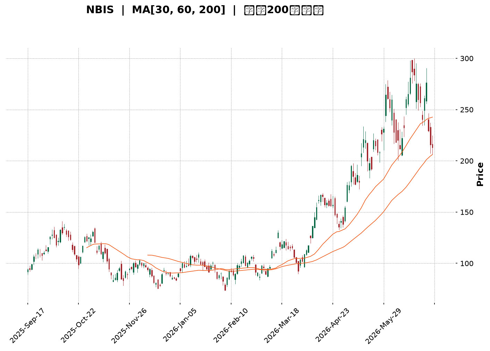
</details>

<html>
<head><meta charset="utf-8" /></head>
<body>
    <div style="height:500px; width:100%;">                        <script>window.PlotlyConfig = {MathJaxConfig: 'local'};</script>
        <script charset="utf-8" src="https://cdn.plot.ly/plotly-3.6.0.min.js" integrity="sha256-QaOVwtVY0T02VaHrr6pnoHLCwayMJp4O5n4YyaE3rJk=" crossorigin="anonymous"></script>                <div id="candlestick-chart" class="plotly-graph-div" style="height:100%; width:100%;"></div>            <script>                window.PLOTLYENV=window.PLOTLYENV || {};                                if (document.getElementById("candlestick-chart")) {                    Plotly.newPlot(                        "candlestick-chart",                        [{"close":{"dtype":"f8","bdata":"AAAAwB6FV0AAAAAgrodXQAAAAADX01hAAAAAYGamWkAAAABAM\u002fNaQAAAAGC4TlxAAAAAACn8WkAAAADAzOxaQAAAAIAUjltAAAAAoEcRXEAAAABACudcQAAAACCud19AAAAAYLj+X0AAAAAAKTxfQAAAAMDMbF1AAAAAAACAXkAAAADgepRgQAAAAGCPMmBAAAAAYLjuYEAAAADAzARgQAAAAMAedV9AAAAAYI\u002fCXkAAAAAAKVxcQAAAAAAAQFtAAAAAgOsRWkAAAAAgrqdYQAAAAIA9ilpAAAAA4KNQXUAAAAAghVtfQAAAAMAedV5AAAAAYGZGX0AAAAAghQtfQAAAAIA9WmBAAAAAgBQeXkAAAABgj6JbQAAAAAAAQF1AAAAAAClcW0AAAACA69FbQAAAAMDMfFtAAAAAgBSOWUAAAABACpdXQAAAAOBRKFZAAAAAYI\u002fiVEAAAABguH5VQAAAAGCPolZAAAAA4HrEV0AAAADA9ShVQAAAAOCj0FRAAAAAoJn5VkAAAADgUThWQAAAAAAprFdAAAAAIK63V0AAAACgmQlZQAAAAMDMHFhAAAAAQOG6WEAAAABAM7NZQAAAAGCPglhAAAAAwB4VWUAAAACAPRpYQAAAAIDCZVdAAAAAgOuRV0AAAAAAKexVQAAAAMD1SFRAAAAAwMw8VEAAAADAzNxSQAAAAIDChVNAAAAAoHBdVkAAAABguE5XQAAAAIDrgVZAAAAA4FHIVkAAAACAwuVVQAAAAGCPglVAAAAAQOFKVUAAAADAHu1UQAAAAMDMfFZAAAAAwB41V0AAAAAgXA9ZQAAAAKBwDVhAAAAAQDNTWEAAAAAghXtYQAAAAMAe1VpAAAAAIIVbWkAAAABguH5ZQAAAAOCj+FlAAAAAYLguW0AAAABgj9JYQAAAACCut1hAAAAAYGY2WEAAAAAAAKBXQAAAAKBw3VZAAAAAIK53WEAAAAAghRtZQAAAAIA9uldAAAAAAClMVUAAAACAPQpWQAAAAMDMfFZAAAAAwPWYVEAAAAAgrndSQAAAAGBmhlVAAAAA4FE4V0AAAABgj\u002fJWQAAAAEAKJ1ZAAAAAYLhuVkAAAADgo4BYQAAAAKBHYVhAAAAAQDNzWUAAAABACudaQAAAAEDhelhAAAAAQAonWUAAAADAHqVZQAAAACCuh1pAAAAA4FE4WkAAAAAAKcxWQAAAAOCjwFZAAAAAQDOzVUAAAACA63FYQAAAAKCZ6VdAAAAAwB5VVkAAAAAAKbxXQAAAACCFG1hAAAAAIK7\u002fW0AAAABgjwJbQAAAAMDMPFxAAAAAQDM7YEAAAADAHhVdQAAAAADXo11AAAAAoEdhXkAAAAAgrmddQAAAAKCZiVxAAAAAgD26XEAAAACAwsVcQAAAAIAUflpAAAAA4Ho0WUAAAADgoxBXQAAAAOCj8FlAAAAAwMx8WUAAAADgejRbQAAAAGCPIlxAAAAAoJlZXUAAAAAAAEBfQAAAAGCPCmFAAAAAQAofYkAAAACA61FjQAAAAIAUPmRAAAAA4KPYZEAAAABA4apkQAAAAOB6pGNAAAAAwB7lY0AAAACgmZFjQAAAAOB6hGNAAAAAYI+iY0AAAADAHmViQAAAAGC4HmJAAAAA4FHwYEAAAACAFKZhQAAAACBcR2FAAAAAIK5PY0AAAACgcA1mQAAAAKBw\u002fWVAAAAAQOFiaEAAAADgoxhnQAAAAKCZIWZAAAAAQDNDZ0AAAAAghWNmQAAAAOCj6GlAAAAAwMyka0AAAACAFH5rQAAAACCF+2hAAAAAIFy3aEAAAACAPfpnQAAAAIDCfWtAAAAA4KPYakAAAACA6wFqQAAAAADXC2pAAAAAQOFKbEAAAABA4eJsQAAAAAApiHBAAAAAoEdJcEAAAACAwnVvQAAAAGC4OnBAAAAAgOt5bEAAAAAAAEBrQAAAAADXg2tAAAAAgBR2akAAAAAgrsdrQAAAACCFC21AAAAAwB5BcEAAAACgmZFwQAAAAGCPjnFAAAAAQArrcUAAAACAwrlxQAAAAAAANHFAAAAAYI86cEAAAACAFApwQAAAAKCZCW5AAAAAYGZScEAAAABguEJxQAAAAIDCpWxAAAAAANfzakAAAADgo6BqQA=="},"high":{"dtype":"f8","bdata":"AAAAAADAV0AAAAAghWtYQAAAAEAz41hAAAAAwB4lW0AAAABguH5bQAAAAGBmtlxAAAAAwB6FXEAAAAAgXH9bQAAAAKBHIVxAAAAAoJlpXUAAAADgUfhcQAAAACBcr19AAAAAAFSfYEAAAADgUfhgQAAAAMD1CGBAAAAAANdTX0AAAACAPapgQAAAAEAzo2FAAAAAwPVQYUAAAACAFrlgQAAAACCuf2BAAAAAQApfYEAAAAAArCReQAAAAIAUXl1AAAAAIIULW0AAAABAM\u002fNaQAAAACCup1pAAAAAwMxcXUAAAAAAAKBfQAAAAMD1IGBAAAAAwMx8X0AAAACAFA5gQAAAAMDMhGBAAAAAgMLdYEAAAACA6zFdQAAAAKBwjV1AAAAAAABAXkAAAABAM9NbQAAAACCul11AAAAAANejXEAAAACgmWlaQAAAAGC43lZAAAAAAABAVkAAAACgmWlWQAAAAAApbFdAAAAAgBQuWEAAAAAAKaxZQAAAACBcL1ZAAAAAAABAV0AAAACA69FWQAAAAICT6FdAAAAAwB5FWEAAAABgZmZZQAAAAMDMvFlAAAAAANfDWEAAAACAwvVZQAAAAGBmVllAAAAAAAAgWUAAAAAggzhZQAAAAIDCRVhAAAAAwMzcV0AAAACgmelXQAAAACBcD1ZAAAAAANdjVEAAAABAMxNVQAAAAGBmFlRAAAAAYI+iVkAAAACgmflXQAAAAIAUPldAAAAAQOHaVkAAAAAgrudWQAAAAEAKJ1ZAAAAAoHC9VUAAAACAFJ5VQAAAAOCjsFZAAAAAACncV0AAAAAghStZQAAAAGBmlllAAAAAYI+iWUAAAACAFD5aQAAAACCFK1tAAAAAwMz8WkAAAADAzKxaQAAAAOBRCFtAAAAAAACgW0AAAACAFB5aQAAAAKCZmVlAAAAAYLj+WUAAAADgo7hYQAAAAOBROFlAAAAAYI\u002fiWEAAAABgZnZZQAAAAAAA0FhAAAAAYI8CV0AAAAAAAFBWQAAAAMD12FZAAAAAYI\u002fqVUAAAADgejRUQAAAAIA9qlVAAAAAIIVrV0AAAAAAVONXQAAAAAAAsFdAAAAA4KOwVkAAAADgehRZQAAAAGCP0lhAAAAAoJkZWkAAAABguP5aQAAAAOB6FFtAAAAAoG5KWUAAAAAAAPBZQAAAAAAp3FpAAAAA4HoUW0AAAABAM9NYQAAAAKDE2FZAAAAAIK53VkAAAABguJ5YQAAAAAAA0FhAAAAAwMy8V0AAAADAzMxXQAAAAKCZmVhAAAAAwB6FXEAAAABgj8JbQAAAAOB6JF1AAAAAoJmJYEAAAAAAAGBeQAAAAECJsV5AAAAAQDNzXkAAAAAAVu5eQAAAAADXU15AAAAAQDNzXUAAAABAM7NdQAAAAEAzU1xAAAAA4KOQWkAAAAAgXI9ZQAAAAMD1+FlAAAAAIK73WkAAAACgcD1bQAAAAIDCdVxAAAAAoJl5XUAAAAAAAPBfQAAAAKCZEWFAAAAAgD26YkAAAAAAAPBjQAAAAEAzw2RAAAAAgOvZZEAAAABguBZlQAAAAIDrgWRAAAAAAAA4ZEAAAAAAAGhkQAAAAIDC7WRAAAAAgOu5ZEAAAAAAAKhkQAAAAKCZmWJAAAAAYLiuYUAAAABgZvZhQAAAACBcX2JAAAAAAACAY0AAAADAzGxmQAAAAGC4fmZAAAAAIK5\u002faEAAAADgerxoQAAAAAAAiGdAAAAAgJeOaEAAAAAghTNnQAAAAEDhKmtAAAAAIFw3bUAAAACgR5lsQAAAAIA9QmtAAAAAgOtZaUAAAAAAAIhpQAAAAIDrWWxAAAAAoHC9a0AAAADgUaBrQAAAAOB6NGpAAAAA4HocbUAAAABAMzNtQAAAAKDELHFAAAAAoHBtcUAAAAAgXLdwQAAAACCFh3BAAAAAAABYb0AAAADAzAxuQAAAAMD1tG1AAAAAIK7fbEAAAAAgro9sQAAAAEDhcm5AAAAA4FFucEAAAAAghVVxQAAAAEDhnnJAAAAAwMysckAAAACAwr1yQAAAACCuc3JAAAAAoG5CcUAAAADgUThxQAAAAKCZGW9AAAAAwMx8cEAAAACgmSlyQAAAACCuz25AAAAA4FGobUAAAABACh9sQA=="},"hovertemplate":"\u003cb\u003e%{x|%Y-%m-%d}\u003c\u002fb\u003e\u003cbr\u003e\u958b: $%{open:.2f}\u003cbr\u003e\u9ad8: $%{high:.2f}\u003cbr\u003e\u4f4e: $%{low:.2f}\u003cbr\u003e\u6536: $%{close:.2f}\u003cextra\u003e\u003c\u002fextra\u003e","low":{"dtype":"f8","bdata":"AAAAwB41VkAAAACA6wFXQAAAAAAAUFdAAAAAoEehWEAAAAAAABBaQAAAAGBmNlpAAAAA4FF4WkAAAABAM7NZQAAAAMAeFVtAAAAAgD3qW0AAAADgo3BbQAAAAOB6pF1AAAAAYGbmXkAAAAAghTtfQAAAAIAU7lxAAAAAAABgXUAAAAAgrvddQAAAAOBRAGBAAAAAwMyUYEAAAAAAAHBfQAAAAMDMjF5AAAAAoEeBXkAAAADgUbhbQAAAAOCj4FpAAAAAoJlZWUAAAADgUahXQAAAAKBw3VhAAAAA4KOAW0AAAABACgdeQAAAAIDrMV5AAAAAAABgXUAAAADgo3BdQAAAAEAzk19AAAAAAADwXUAAAAAAAEBbQAAAACCF21tAAAAAgD0aW0AAAADgo1BZQAAAAIAULltAAAAAwB71WEAAAACgcO1WQAAAAAAAIFVAAAAAAACAVEAAAACAwuVUQAAAAKBwbVRAAAAAQDPzVkAAAACgcA1VQAAAAKBwjVNAAAAAoJlJVUAAAADgJC5VQAAAAOCjsFZAAAAAAClcV0AAAADgo0BWQAAAAADXA1hAAAAAAADAVkAAAACAFF5YQAAAAMDMDFhAAAAAQDPTV0AAAABgZgZYQAAAAMDMDFdAAAAAwMysVUAAAADAzIxVQAAAAKAYBFRAAAAA4FE4U0AAAAAAANBSQAAAAOCjQFNAAAAAgD0KVEAAAABgZsZWQAAAAADXE1ZAAAAAoJkpVkAAAAAgXK9VQAAAAGCPElVAAAAAANcjVUAAAACgmblUQAAAAOCjgFVAAAAAwPW4VkAAAAAAKbxWQAAAAADX41dAAAAAIFgBWEAAAABgZkZYQAAAAEAzI1hAAAAAQOH6WUAAAAAgg9hYQAAAAGBmRllAAAAAoHAtWUAAAACAwpVYQAAAAGBmRldAAAAAAAAgWEAAAACA62FXQAAAAEAK11ZAAAAAgOthV0AAAAAAKRxYQAAAAIA9ylZAAAAAIK4HVUAAAACAFA5VQAAAAAAAMFVAAAAAACmcU0AAAACgR2FSQAAAACCuR1NAAAAAANfzVEAAAACAPepWQAAAAMD1yFVAAAAAACnsU0AAAABACjdWQAAAAAAAYFdAAAAAINk2WEAAAAAghRtZQAAAAIDrQVhAAAAAQDPTV0AAAABA329YQAAAAEAzs1lAAAAAAACAWUAAAACgmRlWQAAAAEAzs1VAAAAAgOvhVEAAAACgmYlWQAAAACCu51ZAAAAAQDMzVkAAAAAAAKBVQAAAAAAAwFdAAAAAIFwfWkAAAACgR6FaQAAAAMD1iFtAAAAAYBIbX0AAAABACkdcQAAAAAAAgFxAAAAAoEexXEAAAACAkyhcQAAAAEAzY1xAAAAA4KMAXEAAAADAHlVcQAAAAIA9WlpAAAAAoEcRWUAAAADAymlWQAAAAGC47ldAAAAAYGZWWUAAAAAAKQxYQAAAAMDM3FpAAAAAgOuRW0AAAABgZtZdQAAAAEAzI19AAAAA4FHcYEAAAACgmclhQAAAAOCj0GNAAAAAAACQY0AAAABA4QJkQAAAACBcV2NAAAAAoEdBY0AAAADAzGxjQAAAAEAza2NAAAAAgD1CY0AAAACA6zliQAAAAIDrUWFAAAAAYGaWYEAAAABACsdgQAAAAAAA4GBAAAAAAACAYUAAAABgZvZjQAAAAGC4FmVAAAAAIIXjZUAAAAAAACBmQAAAAAAAEGZAAAAAoJlRZkAAAAAAAIhlQAAAAAAAYGhAAAAAAAD4aUAAAACgmXlqQAAAAGCPwmdAAAAAAADgZkAAAADgetRnQAAAAKCZGWpAAAAAIFxXakAAAADAHrVpQAAAAIDryWhAAAAA4FFga0AAAADAzExqQAAAAAAAwG1AAAAAAAA8cEAAAADgUfBuQAAAAIAUVm1AAAAAgBQWa0AAAABgZjZrQAAAAKCZCWlAAAAAANdrakAAAAAAAKBpQAAAAAAA8GtAAAAAIK6nbkAAAADAzKxvQAAAAOCjhHBAAAAAQDM5cUAAAAAAAGBxQAAAAAAAYG9AAAAAYLgmb0AAAACA65FvQAAAAMDMTG1AAAAAAABQbUAAAACgmflvQAAAAKBwhWxAAAAAYJHpaUAAAABguMZpQA=="},"name":"\u50f9\u683c","open":{"dtype":"f8","bdata":"AAAAQOHqVkAAAADAzMRXQAAAAMD1iFdAAAAAwMx8WUAAAABgjwJbQAAAAOCjSFtAAAAAIIUDW0AAAAAghXtbQAAAAOBRWFtAAAAA4HpcXEAAAACAwu1bQAAAAKBH8V5AAAAAQArPX0AAAADAzIxgQAAAAMDM9F9AAAAAwMxMXkAAAABguD5eQAAAAGBm3mBAAAAAYLjmYEAAAAAAAIBgQAAAAMDMfGBAAAAAQOECYEAAAAAA14NdQAAAAGCPMl1AAAAA4FH4WkAAAABAM6taQAAAAMAeFVlAAAAAgD3KW0AAAACAPTpeQAAAAADXm19AAAAAgOsRX0AAAADAzExeQAAAAMD1qF9AAAAAAADAYEAAAABguBZcQAAAAMD1aFxAAAAAQDPjXUAAAAAAACBaQAAAACCFy1xAAAAA4FGIXEAAAADAzAxaQAAAAMD1uFZAAAAAQAqXVEAAAADgevRUQAAAAIDr8VRAAAAA4FFAV0AAAAAghdtYQAAAAEAzY1VAAAAAYLiOVUAAAABgj1JWQAAAAGBmdldAAAAAQDMjWEAAAADAzNxWQAAAAEAKF1lAAAAAoEfBV0AAAADgesRYQAAAAIDCFVlAAAAAYI9SWEAAAACAwoVYQAAAAGC47ldAAAAAwMxMVkAAAAAA11NXQAAAAGBmBlZAAAAAwMzkU0AAAACAwgVVQAAAAEAzw1NAAAAAoJkpVEAAAACAFD5XQAAAAADXk1ZAAAAAYLiOVkAAAADgo+BWQAAAAMDMHFVAAAAAAACYVUAAAAAgrldVQAAAAEAKv1VAAAAAAADAV0AAAACAwu1XQAAAAOCjwFhAAAAAYI8yWEAAAACgR7lYQAAAAOB6lFhAAAAAwB7VWkAAAACA63FaQAAAACCFI1pAAAAAIK5\u002fWkAAAADAHnVZQAAAAIDCRVlAAAAA4KOAWUAAAADAzCxYQAAAAKBwbVhAAAAAYGaWV0AAAAAAAABZQAAAAEAKl1hAAAAAoEPjVkAAAAAA13NVQAAAACCFe1ZAAAAAAADAVUAAAADA9chTQAAAAGBmzlNAAAAAwMwcVUAAAABgjzpXQAAAAGCPOldAAAAAYGYGVUAAAABACndWQAAAAAAAAFhAAAAAYLjuWEAAAAAghRtZQAAAAADTpVpAAAAAIIUTWEAAAAAgXNdYQAAAACBcP1pAAAAAAACAWkAAAADAzKxYQAAAAAAAAFZAAAAAoJmJVUAAAACgmZlWQAAAAAAAMFhAAAAAQDMTV0AAAABACtdVQAAAAMD1yFdAAAAAgD1KWkAAAACAwkVbQAAAAAApnFtAAAAAAAAwX0AAAACAwhVeQAAAAEAzs1xAAAAA4FHQXEAAAABgZh5eQAAAAKBwLV1AAAAAQDMLXUAAAAAgrjddQAAAAOBRUFxAAAAAwB51WkAAAAAgXI9ZQAAAAGC4flhAAAAA4Hp8WkAAAACAPRpYQAAAAIA9KltAAAAAAACoW0AAAADgUbhfQAAAAAAAQF9AAAAA4FHcYEAAAABgZtZhQAAAAEAzI2RAAAAAYDsHZEAAAAAAAOBkQAAAAMD1eGRAAAAAAACgY0AAAABACidkQAAAACCFW2RAAAAAwMx8Y0AAAACgcHVkQAAAAOB6jGJAAAAAwMxMYUAAAABACoNhQAAAAIDrJWJAAAAAYI+qYUAAAADgUQxkQAAAAMDMdGVAAAAAQApzZkAAAADgUcBnQAAAAGBm9mZAAAAAwMx8ZkAAAACgcI1mQAAAAEAKe2lAAAAAAACsakAAAAAghTNrQAAAAEAKL2tAAAAAAADgZ0AAAABACn9pQAAAACCud2pAAAAA4FFoa0AAAACgmZVrQAAAAMAe+WlAAAAAACnMbEAAAAAghXtsQAAAAEDhgm5AAAAAoJkBcUAAAACgcENwQAAAACCu921AAAAAIIXbbkAAAADAzAxuQAAAAAAAwGxAAAAAoMbvakAAAADgeqxpQAAAAMDMVG1AAAAAYLh+b0AAAABACu9vQAAAAGBmmnBAAAAAQDOjckAAAAAgXB9yQAAAAAAAHHBAAAAAoJkxcUAAAADAHglxQAAAAEAzm25AAAAAAAAsb0AAAAAAKSRwQAAAAKDECG5AAAAAAAAgbUAAAAAAAAhrQA=="},"x":["2025-09-17T00:00:00-04:00","2025-09-18T00:00:00-04:00","2025-09-19T00:00:00-04:00","2025-09-22T00:00:00-04:00","2025-09-23T00:00:00-04:00","2025-09-24T00:00:00-04:00","2025-09-25T00:00:00-04:00","2025-09-26T00:00:00-04:00","2025-09-29T00:00:00-04:00","2025-09-30T00:00:00-04:00","2025-10-01T00:00:00-04:00","2025-10-02T00:00:00-04:00","2025-10-03T00:00:00-04:00","2025-10-06T00:00:00-04:00","2025-10-07T00:00:00-04:00","2025-10-08T00:00:00-04:00","2025-10-09T00:00:00-04:00","2025-10-10T00:00:00-04:00","2025-10-13T00:00:00-04:00","2025-10-14T00:00:00-04:00","2025-10-15T00:00:00-04:00","2025-10-16T00:00:00-04:00","2025-10-17T00:00:00-04:00","2025-10-20T00:00:00-04:00","2025-10-21T00:00:00-04:00","2025-10-22T00:00:00-04:00","2025-10-23T00:00:00-04:00","2025-10-24T00:00:00-04:00","2025-10-27T00:00:00-04:00","2025-10-28T00:00:00-04:00","2025-10-29T00:00:00-04:00","2025-10-30T00:00:00-04:00","2025-10-31T00:00:00-04:00","2025-11-03T00:00:00-05:00","2025-11-04T00:00:00-05:00","2025-11-05T00:00:00-05:00","2025-11-06T00:00:00-05:00","2025-11-07T00:00:00-05:00","2025-11-10T00:00:00-05:00","2025-11-11T00:00:00-05:00","2025-11-12T00:00:00-05:00","2025-11-13T00:00:00-05:00","2025-11-14T00:00:00-05:00","2025-11-17T00:00:00-05:00","2025-11-18T00:00:00-05:00","2025-11-19T00:00:00-05:00","2025-11-20T00:00:00-05:00","2025-11-21T00:00:00-05:00","2025-11-24T00:00:00-05:00","2025-11-25T00:00:00-05:00","2025-11-26T00:00:00-05:00","2025-11-28T00:00:00-05:00","2025-12-01T00:00:00-05:00","2025-12-02T00:00:00-05:00","2025-12-03T00:00:00-05:00","2025-12-04T00:00:00-05:00","2025-12-05T00:00:00-05:00","2025-12-08T00:00:00-05:00","2025-12-09T00:00:00-05:00","2025-12-10T00:00:00-05:00","2025-12-11T00:00:00-05:00","2025-12-12T00:00:00-05:00","2025-12-15T00:00:00-05:00","2025-12-16T00:00:00-05:00","2025-12-17T00:00:00-05:00","2025-12-18T00:00:00-05:00","2025-12-19T00:00:00-05:00","2025-12-22T00:00:00-05:00","2025-12-23T00:00:00-05:00","2025-12-24T00:00:00-05:00","2025-12-26T00:00:00-05:00","2025-12-29T00:00:00-05:00","2025-12-30T00:00:00-05:00","2025-12-31T00:00:00-05:00","2026-01-02T00:00:00-05:00","2026-01-05T00:00:00-05:00","2026-01-06T00:00:00-05:00","2026-01-07T00:00:00-05:00","2026-01-08T00:00:00-05:00","2026-01-09T00:00:00-05:00","2026-01-12T00:00:00-05:00","2026-01-13T00:00:00-05:00","2026-01-14T00:00:00-05:00","2026-01-15T00:00:00-05:00","2026-01-16T00:00:00-05:00","2026-01-20T00:00:00-05:00","2026-01-21T00:00:00-05:00","2026-01-22T00:00:00-05:00","2026-01-23T00:00:00-05:00","2026-01-26T00:00:00-05:00","2026-01-27T00:00:00-05:00","2026-01-28T00:00:00-05:00","2026-01-29T00:00:00-05:00","2026-01-30T00:00:00-05:00","2026-02-02T00:00:00-05:00","2026-02-03T00:00:00-05:00","2026-02-04T00:00:00-05:00","2026-02-05T00:00:00-05:00","2026-02-06T00:00:00-05:00","2026-02-09T00:00:00-05:00","2026-02-10T00:00:00-05:00","2026-02-11T00:00:00-05:00","2026-02-12T00:00:00-05:00","2026-02-13T00:00:00-05:00","2026-02-17T00:00:00-05:00","2026-02-18T00:00:00-05:00","2026-02-19T00:00:00-05:00","2026-02-20T00:00:00-05:00","2026-02-23T00:00:00-05:00","2026-02-24T00:00:00-05:00","2026-02-25T00:00:00-05:00","2026-02-26T00:00:00-05:00","2026-02-27T00:00:00-05:00","2026-03-02T00:00:00-05:00","2026-03-03T00:00:00-05:00","2026-03-04T00:00:00-05:00","2026-03-05T00:00:00-05:00","2026-03-06T00:00:00-05:00","2026-03-09T00:00:00-04:00","2026-03-10T00:00:00-04:00","2026-03-11T00:00:00-04:00","2026-03-12T00:00:00-04:00","2026-03-13T00:00:00-04:00","2026-03-16T00:00:00-04:00","2026-03-17T00:00:00-04:00","2026-03-18T00:00:00-04:00","2026-03-19T00:00:00-04:00","2026-03-20T00:00:00-04:00","2026-03-23T00:00:00-04:00","2026-03-24T00:00:00-04:00","2026-03-25T00:00:00-04:00","2026-03-26T00:00:00-04:00","2026-03-27T00:00:00-04:00","2026-03-30T00:00:00-04:00","2026-03-31T00:00:00-04:00","2026-04-01T00:00:00-04:00","2026-04-02T00:00:00-04:00","2026-04-06T00:00:00-04:00","2026-04-07T00:00:00-04:00","2026-04-08T00:00:00-04:00","2026-04-09T00:00:00-04:00","2026-04-10T00:00:00-04:00","2026-04-13T00:00:00-04:00","2026-04-14T00:00:00-04:00","2026-04-15T00:00:00-04:00","2026-04-16T00:00:00-04:00","2026-04-17T00:00:00-04:00","2026-04-20T00:00:00-04:00","2026-04-21T00:00:00-04:00","2026-04-22T00:00:00-04:00","2026-04-23T00:00:00-04:00","2026-04-24T00:00:00-04:00","2026-04-27T00:00:00-04:00","2026-04-28T00:00:00-04:00","2026-04-29T00:00:00-04:00","2026-04-30T00:00:00-04:00","2026-05-01T00:00:00-04:00","2026-05-04T00:00:00-04:00","2026-05-05T00:00:00-04:00","2026-05-06T00:00:00-04:00","2026-05-07T00:00:00-04:00","2026-05-08T00:00:00-04:00","2026-05-11T00:00:00-04:00","2026-05-12T00:00:00-04:00","2026-05-13T00:00:00-04:00","2026-05-14T00:00:00-04:00","2026-05-15T00:00:00-04:00","2026-05-18T00:00:00-04:00","2026-05-19T00:00:00-04:00","2026-05-20T00:00:00-04:00","2026-05-21T00:00:00-04:00","2026-05-22T00:00:00-04:00","2026-05-26T00:00:00-04:00","2026-05-27T00:00:00-04:00","2026-05-28T00:00:00-04:00","2026-05-29T00:00:00-04:00","2026-06-01T00:00:00-04:00","2026-06-02T00:00:00-04:00","2026-06-03T00:00:00-04:00","2026-06-04T00:00:00-04:00","2026-06-05T00:00:00-04:00","2026-06-08T00:00:00-04:00","2026-06-09T00:00:00-04:00","2026-06-10T00:00:00-04:00","2026-06-11T00:00:00-04:00","2026-06-12T00:00:00-04:00","2026-06-15T00:00:00-04:00","2026-06-16T00:00:00-04:00","2026-06-17T00:00:00-04:00","2026-06-18T00:00:00-04:00","2026-06-22T00:00:00-04:00","2026-06-23T00:00:00-04:00","2026-06-24T00:00:00-04:00","2026-06-25T00:00:00-04:00","2026-06-26T00:00:00-04:00","2026-06-29T00:00:00-04:00","2026-06-30T00:00:00-04:00","2026-07-01T00:00:00-04:00","2026-07-02T00:00:00-04:00","2026-07-06T00:00:00-04:00"],"type":"candlestick"},{"hovertemplate":"MA30: $%{y:.2f}\u003cextra\u003e\u003c\u002fextra\u003e","line":{"color":"#2196F3","dash":"dash","width":2},"mode":"lines","name":"MA30","x":["2025-09-17T00:00:00-04:00","2025-09-18T00:00:00-04:00","2025-09-19T00:00:00-04:00","2025-09-22T00:00:00-04:00","2025-09-23T00:00:00-04:00","2025-09-24T00:00:00-04:00","2025-09-25T00:00:00-04:00","2025-09-26T00:00:00-04:00","2025-09-29T00:00:00-04:00","2025-09-30T00:00:00-04:00","2025-10-01T00:00:00-04:00","2025-10-02T00:00:00-04:00","2025-10-03T00:00:00-04:00","2025-10-06T00:00:00-04:00","2025-10-07T00:00:00-04:00","2025-10-08T00:00:00-04:00","2025-10-09T00:00:00-04:00","2025-10-10T00:00:00-04:00","2025-10-13T00:00:00-04:00","2025-10-14T00:00:00-04:00","2025-10-15T00:00:00-04:00","2025-10-16T00:00:00-04:00","2025-10-17T00:00:00-04:00","2025-10-20T00:00:00-04:00","2025-10-21T00:00:00-04:00","2025-10-22T00:00:00-04:00","2025-10-23T00:00:00-04:00","2025-10-24T00:00:00-04:00","2025-10-27T00:00:00-04:00","2025-10-28T00:00:00-04:00","2025-10-29T00:00:00-04:00","2025-10-30T00:00:00-04:00","2025-10-31T00:00:00-04:00","2025-11-03T00:00:00-05:00","2025-11-04T00:00:00-05:00","2025-11-05T00:00:00-05:00","2025-11-06T00:00:00-05:00","2025-11-07T00:00:00-05:00","2025-11-10T00:00:00-05:00","2025-11-11T00:00:00-05:00","2025-11-12T00:00:00-05:00","2025-11-13T00:00:00-05:00","2025-11-14T00:00:00-05:00","2025-11-17T00:00:00-05:00","2025-11-18T00:00:00-05:00","2025-11-19T00:00:00-05:00","2025-11-20T00:00:00-05:00","2025-11-21T00:00:00-05:00","2025-11-24T00:00:00-05:00","2025-11-25T00:00:00-05:00","2025-11-26T00:00:00-05:00","2025-11-28T00:00:00-05:00","2025-12-01T00:00:00-05:00","2025-12-02T00:00:00-05:00","2025-12-03T00:00:00-05:00","2025-12-04T00:00:00-05:00","2025-12-05T00:00:00-05:00","2025-12-08T00:00:00-05:00","2025-12-09T00:00:00-05:00","2025-12-10T00:00:00-05:00","2025-12-11T00:00:00-05:00","2025-12-12T00:00:00-05:00","2025-12-15T00:00:00-05:00","2025-12-16T00:00:00-05:00","2025-12-17T00:00:00-05:00","2025-12-18T00:00:00-05:00","2025-12-19T00:00:00-05:00","2025-12-22T00:00:00-05:00","2025-12-23T00:00:00-05:00","2025-12-24T00:00:00-05:00","2025-12-26T00:00:00-05:00","2025-12-29T00:00:00-05:00","2025-12-30T00:00:00-05:00","2025-12-31T00:00:00-05:00","2026-01-02T00:00:00-05:00","2026-01-05T00:00:00-05:00","2026-01-06T00:00:00-05:00","2026-01-07T00:00:00-05:00","2026-01-08T00:00:00-05:00","2026-01-09T00:00:00-05:00","2026-01-12T00:00:00-05:00","2026-01-13T00:00:00-05:00","2026-01-14T00:00:00-05:00","2026-01-15T00:00:00-05:00","2026-01-16T00:00:00-05:00","2026-01-20T00:00:00-05:00","2026-01-21T00:00:00-05:00","2026-01-22T00:00:00-05:00","2026-01-23T00:00:00-05:00","2026-01-26T00:00:00-05:00","2026-01-27T00:00:00-05:00","2026-01-28T00:00:00-05:00","2026-01-29T00:00:00-05:00","2026-01-30T00:00:00-05:00","2026-02-02T00:00:00-05:00","2026-02-03T00:00:00-05:00","2026-02-04T00:00:00-05:00","2026-02-05T00:00:00-05:00","2026-02-06T00:00:00-05:00","2026-02-09T00:00:00-05:00","2026-02-10T00:00:00-05:00","2026-02-11T00:00:00-05:00","2026-02-12T00:00:00-05:00","2026-02-13T00:00:00-05:00","2026-02-17T00:00:00-05:00","2026-02-18T00:00:00-05:00","2026-02-19T00:00:00-05:00","2026-02-20T00:00:00-05:00","2026-02-23T00:00:00-05:00","2026-02-24T00:00:00-05:00","2026-02-25T00:00:00-05:00","2026-02-26T00:00:00-05:00","2026-02-27T00:00:00-05:00","2026-03-02T00:00:00-05:00","2026-03-03T00:00:00-05:00","2026-03-04T00:00:00-05:00","2026-03-05T00:00:00-05:00","2026-03-06T00:00:00-05:00","2026-03-09T00:00:00-04:00","2026-03-10T00:00:00-04:00","2026-03-11T00:00:00-04:00","2026-03-12T00:00:00-04:00","2026-03-13T00:00:00-04:00","2026-03-16T00:00:00-04:00","2026-03-17T00:00:00-04:00","2026-03-18T00:00:00-04:00","2026-03-19T00:00:00-04:00","2026-03-20T00:00:00-04:00","2026-03-23T00:00:00-04:00","2026-03-24T00:00:00-04:00","2026-03-25T00:00:00-04:00","2026-03-26T00:00:00-04:00","2026-03-27T00:00:00-04:00","2026-03-30T00:00:00-04:00","2026-03-31T00:00:00-04:00","2026-04-01T00:00:00-04:00","2026-04-02T00:00:00-04:00","2026-04-06T00:00:00-04:00","2026-04-07T00:00:00-04:00","2026-04-08T00:00:00-04:00","2026-04-09T00:00:00-04:00","2026-04-10T00:00:00-04:00","2026-04-13T00:00:00-04:00","2026-04-14T00:00:00-04:00","2026-04-15T00:00:00-04:00","2026-04-16T00:00:00-04:00","2026-04-17T00:00:00-04:00","2026-04-20T00:00:00-04:00","2026-04-21T00:00:00-04:00","2026-04-22T00:00:00-04:00","2026-04-23T00:00:00-04:00","2026-04-24T00:00:00-04:00","2026-04-27T00:00:00-04:00","2026-04-28T00:00:00-04:00","2026-04-29T00:00:00-04:00","2026-04-30T00:00:00-04:00","2026-05-01T00:00:00-04:00","2026-05-04T00:00:00-04:00","2026-05-05T00:00:00-04:00","2026-05-06T00:00:00-04:00","2026-05-07T00:00:00-04:00","2026-05-08T00:00:00-04:00","2026-05-11T00:00:00-04:00","2026-05-12T00:00:00-04:00","2026-05-13T00:00:00-04:00","2026-05-14T00:00:00-04:00","2026-05-15T00:00:00-04:00","2026-05-18T00:00:00-04:00","2026-05-19T00:00:00-04:00","2026-05-20T00:00:00-04:00","2026-05-21T00:00:00-04:00","2026-05-22T00:00:00-04:00","2026-05-26T00:00:00-04:00","2026-05-27T00:00:00-04:00","2026-05-28T00:00:00-04:00","2026-05-29T00:00:00-04:00","2026-06-01T00:00:00-04:00","2026-06-02T00:00:00-04:00","2026-06-03T00:00:00-04:00","2026-06-04T00:00:00-04:00","2026-06-05T00:00:00-04:00","2026-06-08T00:00:00-04:00","2026-06-09T00:00:00-04:00","2026-06-10T00:00:00-04:00","2026-06-11T00:00:00-04:00","2026-06-12T00:00:00-04:00","2026-06-15T00:00:00-04:00","2026-06-16T00:00:00-04:00","2026-06-17T00:00:00-04:00","2026-06-18T00:00:00-04:00","2026-06-22T00:00:00-04:00","2026-06-23T00:00:00-04:00","2026-06-24T00:00:00-04:00","2026-06-25T00:00:00-04:00","2026-06-26T00:00:00-04:00","2026-06-29T00:00:00-04:00","2026-06-30T00:00:00-04:00","2026-07-01T00:00:00-04:00","2026-07-02T00:00:00-04:00","2026-07-06T00:00:00-04:00"],"y":{"dtype":"f8","bdata":"AAAAAAAA+H8AAAAAAAD4fwAAAAAAAPh\u002fAAAAAAAA+H8AAAAAAAD4fwAAAAAAAPh\u002fAAAAAAAA+H8AAAAAAAD4fwAAAAAAAPh\u002fAAAAAAAA+H8AAAAAAAD4fwAAAAAAAPh\u002fAAAAAAAA+H8AAAAAAAD4fwAAAAAAAPh\u002fAAAAAAAA+H8AAAAAAAD4fwAAAAAAAPh\u002fAAAAAAAA+H8AAAAAAAD4fwAAAAAAAPh\u002fAAAAAAAA+H8AAAAAAAD4fwAAAAAAAPh\u002fAAAAAAAA+H8AAAAAAAD4fwAAAAAAAPh\u002fAAAAAAAA+H8AAAAAAAD4f7y7uztC0VxAmpmZSW8TXUDe3d0NkFNdQImIiLjIll1Ad3d3l1+0XUDv7u7+N7pdQKuqqupCwl1A3t3dHXbFXUBmZmZGGc1dQBEREdGFzF1A3t3dLRW3XUCJiIjYv4ldQGZmZtZNOl1AvLu7q3\u002fbXEARERFRYohcQGZmZlZxTlxAd3d39\u002f0UXEARERGRl65bQLy7u6vGS1tAmpmZGdnuWkAiIiJyEptaQKuqqtqjWFpAd3d3R4scWkCrqqoqMQBaQBERETFr5VlAq6qq6vvZWUARERHB5uJZQGZmZiaU0VlAzczMHHatWUAzMzNTjW9ZQERERIROM1lAAAAAsI7xWECJiIhItqNYQAAAAGC6OVhA7+7uLmvlV0DNzMxcj5pXQAAAAFCNR1dAERERke0cV0DNzMzca\u002fZWQDMzM+Psy1ZARERERES0VkARERHx0qVWQFVVVXVMoFZAd3d3p8ajVkAzMzMz7J5WQKuqqvqpnVZAREREpOKYVkAiIiJSKrpWQO\u002fu7r7K1VZA3t3d3U\u002fhVkAAAABgnvRWQAAAAICVD1dAq6qqqhwmV0B3d3cXBCpXQImIiJjgOVdAq6qqKs5OV0DNzMw8UUdXQHd3d4cWSVdAvLu7+6lBV0De3d3dlj1XQKuqqpoLOVdAmpmZObRAV0BmZmb24VtXQImIiDhCeVdARERE1E2CV0AAAAAwa51XQERERFS4tldAq6qqKqOnV0BmZmYGVn5XQImIiLjzdVdAREREdK95V0B3d3c3pYJXQHd3d8cgiFdAZmZmJtuRV0BmZmaWX7BXQBEREdGFwFdAIiIioqjTV0AzMzOjYeNXQGZmZoYH51dAmpmZORfuV0Dv7u6+AvhXQM3MzOxt9VdAzczMjEH0V0BVVVXFPN1XQN7d3U3FwVdAmpmZmfySV0AAAADww49XQDMzM2PliFdAd3d3d9p4V0BERETEynlXQM3MzAxlhFdA7+7uLoeiV0AiIiJCw7JXQAAAAIA\u002f2VdAERER0YU4WEBERERknnRYQERERESnsVhAZmZmdiEFWUC8u7vLdmJZQGZmZtZNnllAiYiIKE3NWUAAAAAQAv9ZQAAAAPAKJFpA3t3djbM7WkCamZlJby9aQJqZmSm\u002fPFpAREREFBE9WkBmZmbmpT9aQO\u002fu7l7WXlpAMzMz86eCWkAiIiJCfLJaQCIiIvLu8lpA7+7ubnVIW0BmZmbmpc9bQDMzMyP3ZlxAvLu7a5ERXUAAAAAwsqFdQM3MzOzfJF5Aq6qqati5XkARERGxRz1fQAAAAFCpvF9A3t3d3WsOYEBEREQ8JjhgQCIiIhpLWmBAAAAAqFRgYEAAAAAY2XpgQImIiFDUj2BAMzMzU\u002f+yYEDNzMykt\u002fFgQImIiPiaM2FAREREdCGJYUDe3d29dNNhQCIiIlJGH2JAq6qqcj16YkCamZlJ4dZiQDMzM2tKRWNA7+7u9m\u002fEY0AiIiIi9zpkQImIiFAbmGRAIiIiwsrtZEAzMzMTETVlQCIiInI9jmVAAAAAgLHYZUARERGRwhFmQM3MzAxJQ2ZAERERodOCZkAzMzPD9chmQO\u002fu7u58O2dAmpmZWaunZ0De3d0tJA1oQGZmZsaSe2hAd3d3xwTHaEAiIiLSlBJpQCIiIoLAYmlAq6qqugK0aUCJiIjIdgpqQM3MzIzebmpA3t3d7XzfakC8u7t7FD5rQBEREcERrmtAmpmZqcYPbEARERGRNHlsQGZmZrbz4WxA7+7ufmowbUAAAACgGoNtQERERARWpm1A7+7urgDRbUCamZk5+wxuQJqZmYlBLG5AMzMzs1Y\u002fbkBmZma281VuQA=="},"type":"scatter"},{"hovertemplate":"MA60: $%{y:.2f}\u003cextra\u003e\u003c\u002fextra\u003e","line":{"color":"#9C27B0","dash":"dash","width":2},"mode":"lines","name":"MA60","x":["2025-09-17T00:00:00-04:00","2025-09-18T00:00:00-04:00","2025-09-19T00:00:00-04:00","2025-09-22T00:00:00-04:00","2025-09-23T00:00:00-04:00","2025-09-24T00:00:00-04:00","2025-09-25T00:00:00-04:00","2025-09-26T00:00:00-04:00","2025-09-29T00:00:00-04:00","2025-09-30T00:00:00-04:00","2025-10-01T00:00:00-04:00","2025-10-02T00:00:00-04:00","2025-10-03T00:00:00-04:00","2025-10-06T00:00:00-04:00","2025-10-07T00:00:00-04:00","2025-10-08T00:00:00-04:00","2025-10-09T00:00:00-04:00","2025-10-10T00:00:00-04:00","2025-10-13T00:00:00-04:00","2025-10-14T00:00:00-04:00","2025-10-15T00:00:00-04:00","2025-10-16T00:00:00-04:00","2025-10-17T00:00:00-04:00","2025-10-20T00:00:00-04:00","2025-10-21T00:00:00-04:00","2025-10-22T00:00:00-04:00","2025-10-23T00:00:00-04:00","2025-10-24T00:00:00-04:00","2025-10-27T00:00:00-04:00","2025-10-28T00:00:00-04:00","2025-10-29T00:00:00-04:00","2025-10-30T00:00:00-04:00","2025-10-31T00:00:00-04:00","2025-11-03T00:00:00-05:00","2025-11-04T00:00:00-05:00","2025-11-05T00:00:00-05:00","2025-11-06T00:00:00-05:00","2025-11-07T00:00:00-05:00","2025-11-10T00:00:00-05:00","2025-11-11T00:00:00-05:00","2025-11-12T00:00:00-05:00","2025-11-13T00:00:00-05:00","2025-11-14T00:00:00-05:00","2025-11-17T00:00:00-05:00","2025-11-18T00:00:00-05:00","2025-11-19T00:00:00-05:00","2025-11-20T00:00:00-05:00","2025-11-21T00:00:00-05:00","2025-11-24T00:00:00-05:00","2025-11-25T00:00:00-05:00","2025-11-26T00:00:00-05:00","2025-11-28T00:00:00-05:00","2025-12-01T00:00:00-05:00","2025-12-02T00:00:00-05:00","2025-12-03T00:00:00-05:00","2025-12-04T00:00:00-05:00","2025-12-05T00:00:00-05:00","2025-12-08T00:00:00-05:00","2025-12-09T00:00:00-05:00","2025-12-10T00:00:00-05:00","2025-12-11T00:00:00-05:00","2025-12-12T00:00:00-05:00","2025-12-15T00:00:00-05:00","2025-12-16T00:00:00-05:00","2025-12-17T00:00:00-05:00","2025-12-18T00:00:00-05:00","2025-12-19T00:00:00-05:00","2025-12-22T00:00:00-05:00","2025-12-23T00:00:00-05:00","2025-12-24T00:00:00-05:00","2025-12-26T00:00:00-05:00","2025-12-29T00:00:00-05:00","2025-12-30T00:00:00-05:00","2025-12-31T00:00:00-05:00","2026-01-02T00:00:00-05:00","2026-01-05T00:00:00-05:00","2026-01-06T00:00:00-05:00","2026-01-07T00:00:00-05:00","2026-01-08T00:00:00-05:00","2026-01-09T00:00:00-05:00","2026-01-12T00:00:00-05:00","2026-01-13T00:00:00-05:00","2026-01-14T00:00:00-05:00","2026-01-15T00:00:00-05:00","2026-01-16T00:00:00-05:00","2026-01-20T00:00:00-05:00","2026-01-21T00:00:00-05:00","2026-01-22T00:00:00-05:00","2026-01-23T00:00:00-05:00","2026-01-26T00:00:00-05:00","2026-01-27T00:00:00-05:00","2026-01-28T00:00:00-05:00","2026-01-29T00:00:00-05:00","2026-01-30T00:00:00-05:00","2026-02-02T00:00:00-05:00","2026-02-03T00:00:00-05:00","2026-02-04T00:00:00-05:00","2026-02-05T00:00:00-05:00","2026-02-06T00:00:00-05:00","2026-02-09T00:00:00-05:00","2026-02-10T00:00:00-05:00","2026-02-11T00:00:00-05:00","2026-02-12T00:00:00-05:00","2026-02-13T00:00:00-05:00","2026-02-17T00:00:00-05:00","2026-02-18T00:00:00-05:00","2026-02-19T00:00:00-05:00","2026-02-20T00:00:00-05:00","2026-02-23T00:00:00-05:00","2026-02-24T00:00:00-05:00","2026-02-25T00:00:00-05:00","2026-02-26T00:00:00-05:00","2026-02-27T00:00:00-05:00","2026-03-02T00:00:00-05:00","2026-03-03T00:00:00-05:00","2026-03-04T00:00:00-05:00","2026-03-05T00:00:00-05:00","2026-03-06T00:00:00-05:00","2026-03-09T00:00:00-04:00","2026-03-10T00:00:00-04:00","2026-03-11T00:00:00-04:00","2026-03-12T00:00:00-04:00","2026-03-13T00:00:00-04:00","2026-03-16T00:00:00-04:00","2026-03-17T00:00:00-04:00","2026-03-18T00:00:00-04:00","2026-03-19T00:00:00-04:00","2026-03-20T00:00:00-04:00","2026-03-23T00:00:00-04:00","2026-03-24T00:00:00-04:00","2026-03-25T00:00:00-04:00","2026-03-26T00:00:00-04:00","2026-03-27T00:00:00-04:00","2026-03-30T00:00:00-04:00","2026-03-31T00:00:00-04:00","2026-04-01T00:00:00-04:00","2026-04-02T00:00:00-04:00","2026-04-06T00:00:00-04:00","2026-04-07T00:00:00-04:00","2026-04-08T00:00:00-04:00","2026-04-09T00:00:00-04:00","2026-04-10T00:00:00-04:00","2026-04-13T00:00:00-04:00","2026-04-14T00:00:00-04:00","2026-04-15T00:00:00-04:00","2026-04-16T00:00:00-04:00","2026-04-17T00:00:00-04:00","2026-04-20T00:00:00-04:00","2026-04-21T00:00:00-04:00","2026-04-22T00:00:00-04:00","2026-04-23T00:00:00-04:00","2026-04-24T00:00:00-04:00","2026-04-27T00:00:00-04:00","2026-04-28T00:00:00-04:00","2026-04-29T00:00:00-04:00","2026-04-30T00:00:00-04:00","2026-05-01T00:00:00-04:00","2026-05-04T00:00:00-04:00","2026-05-05T00:00:00-04:00","2026-05-06T00:00:00-04:00","2026-05-07T00:00:00-04:00","2026-05-08T00:00:00-04:00","2026-05-11T00:00:00-04:00","2026-05-12T00:00:00-04:00","2026-05-13T00:00:00-04:00","2026-05-14T00:00:00-04:00","2026-05-15T00:00:00-04:00","2026-05-18T00:00:00-04:00","2026-05-19T00:00:00-04:00","2026-05-20T00:00:00-04:00","2026-05-21T00:00:00-04:00","2026-05-22T00:00:00-04:00","2026-05-26T00:00:00-04:00","2026-05-27T00:00:00-04:00","2026-05-28T00:00:00-04:00","2026-05-29T00:00:00-04:00","2026-06-01T00:00:00-04:00","2026-06-02T00:00:00-04:00","2026-06-03T00:00:00-04:00","2026-06-04T00:00:00-04:00","2026-06-05T00:00:00-04:00","2026-06-08T00:00:00-04:00","2026-06-09T00:00:00-04:00","2026-06-10T00:00:00-04:00","2026-06-11T00:00:00-04:00","2026-06-12T00:00:00-04:00","2026-06-15T00:00:00-04:00","2026-06-16T00:00:00-04:00","2026-06-17T00:00:00-04:00","2026-06-18T00:00:00-04:00","2026-06-22T00:00:00-04:00","2026-06-23T00:00:00-04:00","2026-06-24T00:00:00-04:00","2026-06-25T00:00:00-04:00","2026-06-26T00:00:00-04:00","2026-06-29T00:00:00-04:00","2026-06-30T00:00:00-04:00","2026-07-01T00:00:00-04:00","2026-07-02T00:00:00-04:00","2026-07-06T00:00:00-04:00"],"y":{"dtype":"f8","bdata":"AAAAAAAA+H8AAAAAAAD4fwAAAAAAAPh\u002fAAAAAAAA+H8AAAAAAAD4fwAAAAAAAPh\u002fAAAAAAAA+H8AAAAAAAD4fwAAAAAAAPh\u002fAAAAAAAA+H8AAAAAAAD4fwAAAAAAAPh\u002fAAAAAAAA+H8AAAAAAAD4fwAAAAAAAPh\u002fAAAAAAAA+H8AAAAAAAD4fwAAAAAAAPh\u002fAAAAAAAA+H8AAAAAAAD4fwAAAAAAAPh\u002fAAAAAAAA+H8AAAAAAAD4fwAAAAAAAPh\u002fAAAAAAAA+H8AAAAAAAD4fwAAAAAAAPh\u002fAAAAAAAA+H8AAAAAAAD4fwAAAAAAAPh\u002fAAAAAAAA+H8AAAAAAAD4fwAAAAAAAPh\u002fAAAAAAAA+H8AAAAAAAD4fwAAAAAAAPh\u002fAAAAAAAA+H8AAAAAAAD4fwAAAAAAAPh\u002fAAAAAAAA+H8AAAAAAAD4fwAAAAAAAPh\u002fAAAAAAAA+H8AAAAAAAD4fwAAAAAAAPh\u002fAAAAAAAA+H8AAAAAAAD4fwAAAAAAAPh\u002fAAAAAAAA+H8AAAAAAAD4fwAAAAAAAPh\u002fAAAAAAAA+H8AAAAAAAD4fwAAAAAAAPh\u002fAAAAAAAA+H8AAAAAAAD4fwAAAAAAAPh\u002fAAAAAAAA+H8AAAAAAAD4fwAAAGBIAltAzczM\u002fH4CW0AzMzMro\u002ftaQERERIxB6FpAMzMzY+XMWkDe3d2tY6paQFVVVR3ohFpAd3d31zFxWkCamZmRwmFaQCIiIlo5TFpAERERuaw1WkDNzMxkyRdaQN7d3SVN7VlAmpmZKaO\u002fWUAiIiJCp5NZQImIiKgNdllA3t3dTfBWWUCamZnxYDRZQFVVVbXIEFlAvLu7exToWEARERFp2MdYQFVVVa0ctFhAERER+VOhWEARERGhGpVYQM3MzOSlj1hAq6qqCmWUWEDv7u7+G5VYQO\u002fu7lZVjVhAREREDJB3WECJiIgYklZYQHd3dw8tNlhAzczMdCEZWEB3d3cfzP9XQEREREx+2VdAmpmZgdyzV0BmZmZG\u002fZtXQCIiItIif1dA3t3dXUhiV0CamZnxYDpXQN7d3U3wIFdARERE3PkWV0BEREQUPBRXQGZmZp42FFdA7+7u5tAaV0DNzMzkpSdXQN7d3eUXL1dAMzMzo0U2V0Crqqr6xU5XQKuqqiJpXldAvLu7i7NnV0B3d3ePUHZXQGZmZraBgldAvLu7Gy+NV0BmZmZuoINXQDMzM\u002fPSfVdAIiIiYuVwV0BmZmaWimtXQFVVVfX9aFdAmpmZOUJdV0ARERHRsFtXQLy7u1O4XldAREREtJ1xV0BEREScUodXQERERNxAqVdAq6qq0mndV0AiIiLKBAlYQERERMwvNFhAiYiIUGJWWEARERFpZnBYQHd3d8cgilhAZmZmTn6jWEC8u7uj08BYQLy7u9sV1lhAIiIiWsfmWEAAAABw5+9YQFVVVX2i\u002flhAMzMz21wIWUDNzMzEgxFZQKuqqvLuIllAZmZmll84WUCJiIiAP1VZQHd3d28udFlA3t3dfVueWUDe3d1VcdZZQImIiDheFFpAq6qqAkdSWkAAAAAQu5haQAAAAKji1lpAERERcVkZW0Crqqo6iVtbQGZmZi6HoFtAVVVVda\u002ffW0BVVVXdhxFcQCIiItrqRlxAiYiIkJd8XEAiIiJKKLVcQKuqqvKn6FxAZmZmDpA1XUCrqqoK86JdQLy7u+PBAl5AiYiICMhvXkDe3d3F9dJeQCIiIspLMV9AmpmZOReYX0BmZmbumO5fQAAAAADVMWBAiYiIQHxxYECrqqoKZa1gQAAAAEDD42BA3t3dXY8XYUAiIiKaJ0dhQJqZmXXag2FAvLu7G3a+YUAiIiLCyvxhQDMzM09iO2JAd3d3K86FYkCamZlt58xiQKuqqnL2JmNAd3d3x0uCY0AzMzMD5NVjQDMzM7fzLGRAq6qqUrhqZEAzMzOHXaVkQCIiIs6F3mRAVVVVsSsKZUBERETwp0JlQKuqqm5Zf2VAiYiIID7JZUBEREQQ5hdmQM3MzFzWcGZA7+7uDnTMZkB3d3enVCZnQERERASdgGdAzczM+FPVZ0DNzMz0\u002fSxoQLy7uzfQdWhA7+7uUrjKaEDe3d0t+SNpQBEREW0uYmlAq6qqupCWaUDNzMxkgsVpQA=="},"type":"scatter"},{"hovertemplate":"MA200: $%{y:.2f}\u003cextra\u003e\u003c\u002fextra\u003e","line":{"color":"#FF6F00","dash":"solid","width":2},"mode":"lines","name":"MA200","x":["2025-09-17T00:00:00-04:00","2025-09-18T00:00:00-04:00","2025-09-19T00:00:00-04:00","2025-09-22T00:00:00-04:00","2025-09-23T00:00:00-04:00","2025-09-24T00:00:00-04:00","2025-09-25T00:00:00-04:00","2025-09-26T00:00:00-04:00","2025-09-29T00:00:00-04:00","2025-09-30T00:00:00-04:00","2025-10-01T00:00:00-04:00","2025-10-02T00:00:00-04:00","2025-10-03T00:00:00-04:00","2025-10-06T00:00:00-04:00","2025-10-07T00:00:00-04:00","2025-10-08T00:00:00-04:00","2025-10-09T00:00:00-04:00","2025-10-10T00:00:00-04:00","2025-10-13T00:00:00-04:00","2025-10-14T00:00:00-04:00","2025-10-15T00:00:00-04:00","2025-10-16T00:00:00-04:00","2025-10-17T00:00:00-04:00","2025-10-20T00:00:00-04:00","2025-10-21T00:00:00-04:00","2025-10-22T00:00:00-04:00","2025-10-23T00:00:00-04:00","2025-10-24T00:00:00-04:00","2025-10-27T00:00:00-04:00","2025-10-28T00:00:00-04:00","2025-10-29T00:00:00-04:00","2025-10-30T00:00:00-04:00","2025-10-31T00:00:00-04:00","2025-11-03T00:00:00-05:00","2025-11-04T00:00:00-05:00","2025-11-05T00:00:00-05:00","2025-11-06T00:00:00-05:00","2025-11-07T00:00:00-05:00","2025-11-10T00:00:00-05:00","2025-11-11T00:00:00-05:00","2025-11-12T00:00:00-05:00","2025-11-13T00:00:00-05:00","2025-11-14T00:00:00-05:00","2025-11-17T00:00:00-05:00","2025-11-18T00:00:00-05:00","2025-11-19T00:00:00-05:00","2025-11-20T00:00:00-05:00","2025-11-21T00:00:00-05:00","2025-11-24T00:00:00-05:00","2025-11-25T00:00:00-05:00","2025-11-26T00:00:00-05:00","2025-11-28T00:00:00-05:00","2025-12-01T00:00:00-05:00","2025-12-02T00:00:00-05:00","2025-12-03T00:00:00-05:00","2025-12-04T00:00:00-05:00","2025-12-05T00:00:00-05:00","2025-12-08T00:00:00-05:00","2025-12-09T00:00:00-05:00","2025-12-10T00:00:00-05:00","2025-12-11T00:00:00-05:00","2025-12-12T00:00:00-05:00","2025-12-15T00:00:00-05:00","2025-12-16T00:00:00-05:00","2025-12-17T00:00:00-05:00","2025-12-18T00:00:00-05:00","2025-12-19T00:00:00-05:00","2025-12-22T00:00:00-05:00","2025-12-23T00:00:00-05:00","2025-12-24T00:00:00-05:00","2025-12-26T00:00:00-05:00","2025-12-29T00:00:00-05:00","2025-12-30T00:00:00-05:00","2025-12-31T00:00:00-05:00","2026-01-02T00:00:00-05:00","2026-01-05T00:00:00-05:00","2026-01-06T00:00:00-05:00","2026-01-07T00:00:00-05:00","2026-01-08T00:00:00-05:00","2026-01-09T00:00:00-05:00","2026-01-12T00:00:00-05:00","2026-01-13T00:00:00-05:00","2026-01-14T00:00:00-05:00","2026-01-15T00:00:00-05:00","2026-01-16T00:00:00-05:00","2026-01-20T00:00:00-05:00","2026-01-21T00:00:00-05:00","2026-01-22T00:00:00-05:00","2026-01-23T00:00:00-05:00","2026-01-26T00:00:00-05:00","2026-01-27T00:00:00-05:00","2026-01-28T00:00:00-05:00","2026-01-29T00:00:00-05:00","2026-01-30T00:00:00-05:00","2026-02-02T00:00:00-05:00","2026-02-03T00:00:00-05:00","2026-02-04T00:00:00-05:00","2026-02-05T00:00:00-05:00","2026-02-06T00:00:00-05:00","2026-02-09T00:00:00-05:00","2026-02-10T00:00:00-05:00","2026-02-11T00:00:00-05:00","2026-02-12T00:00:00-05:00","2026-02-13T00:00:00-05:00","2026-02-17T00:00:00-05:00","2026-02-18T00:00:00-05:00","2026-02-19T00:00:00-05:00","2026-02-20T00:00:00-05:00","2026-02-23T00:00:00-05:00","2026-02-24T00:00:00-05:00","2026-02-25T00:00:00-05:00","2026-02-26T00:00:00-05:00","2026-02-27T00:00:00-05:00","2026-03-02T00:00:00-05:00","2026-03-03T00:00:00-05:00","2026-03-04T00:00:00-05:00","2026-03-05T00:00:00-05:00","2026-03-06T00:00:00-05:00","2026-03-09T00:00:00-04:00","2026-03-10T00:00:00-04:00","2026-03-11T00:00:00-04:00","2026-03-12T00:00:00-04:00","2026-03-13T00:00:00-04:00","2026-03-16T00:00:00-04:00","2026-03-17T00:00:00-04:00","2026-03-18T00:00:00-04:00","2026-03-19T00:00:00-04:00","2026-03-20T00:00:00-04:00","2026-03-23T00:00:00-04:00","2026-03-24T00:00:00-04:00","2026-03-25T00:00:00-04:00","2026-03-26T00:00:00-04:00","2026-03-27T00:00:00-04:00","2026-03-30T00:00:00-04:00","2026-03-31T00:00:00-04:00","2026-04-01T00:00:00-04:00","2026-04-02T00:00:00-04:00","2026-04-06T00:00:00-04:00","2026-04-07T00:00:00-04:00","2026-04-08T00:00:00-04:00","2026-04-09T00:00:00-04:00","2026-04-10T00:00:00-04:00","2026-04-13T00:00:00-04:00","2026-04-14T00:00:00-04:00","2026-04-15T00:00:00-04:00","2026-04-16T00:00:00-04:00","2026-04-17T00:00:00-04:00","2026-04-20T00:00:00-04:00","2026-04-21T00:00:00-04:00","2026-04-22T00:00:00-04:00","2026-04-23T00:00:00-04:00","2026-04-24T00:00:00-04:00","2026-04-27T00:00:00-04:00","2026-04-28T00:00:00-04:00","2026-04-29T00:00:00-04:00","2026-04-30T00:00:00-04:00","2026-05-01T00:00:00-04:00","2026-05-04T00:00:00-04:00","2026-05-05T00:00:00-04:00","2026-05-06T00:00:00-04:00","2026-05-07T00:00:00-04:00","2026-05-08T00:00:00-04:00","2026-05-11T00:00:00-04:00","2026-05-12T00:00:00-04:00","2026-05-13T00:00:00-04:00","2026-05-14T00:00:00-04:00","2026-05-15T00:00:00-04:00","2026-05-18T00:00:00-04:00","2026-05-19T00:00:00-04:00","2026-05-20T00:00:00-04:00","2026-05-21T00:00:00-04:00","2026-05-22T00:00:00-04:00","2026-05-26T00:00:00-04:00","2026-05-27T00:00:00-04:00","2026-05-28T00:00:00-04:00","2026-05-29T00:00:00-04:00","2026-06-01T00:00:00-04:00","2026-06-02T00:00:00-04:00","2026-06-03T00:00:00-04:00","2026-06-04T00:00:00-04:00","2026-06-05T00:00:00-04:00","2026-06-08T00:00:00-04:00","2026-06-09T00:00:00-04:00","2026-06-10T00:00:00-04:00","2026-06-11T00:00:00-04:00","2026-06-12T00:00:00-04:00","2026-06-15T00:00:00-04:00","2026-06-16T00:00:00-04:00","2026-06-17T00:00:00-04:00","2026-06-18T00:00:00-04:00","2026-06-22T00:00:00-04:00","2026-06-23T00:00:00-04:00","2026-06-24T00:00:00-04:00","2026-06-25T00:00:00-04:00","2026-06-26T00:00:00-04:00","2026-06-29T00:00:00-04:00","2026-06-30T00:00:00-04:00","2026-07-01T00:00:00-04:00","2026-07-02T00:00:00-04:00","2026-07-06T00:00:00-04:00"],"y":{"dtype":"f8","bdata":"AAAAAAAA+H8AAAAAAAD4fwAAAAAAAPh\u002fAAAAAAAA+H8AAAAAAAD4fwAAAAAAAPh\u002fAAAAAAAA+H8AAAAAAAD4fwAAAAAAAPh\u002fAAAAAAAA+H8AAAAAAAD4fwAAAAAAAPh\u002fAAAAAAAA+H8AAAAAAAD4fwAAAAAAAPh\u002fAAAAAAAA+H8AAAAAAAD4fwAAAAAAAPh\u002fAAAAAAAA+H8AAAAAAAD4fwAAAAAAAPh\u002fAAAAAAAA+H8AAAAAAAD4fwAAAAAAAPh\u002fAAAAAAAA+H8AAAAAAAD4fwAAAAAAAPh\u002fAAAAAAAA+H8AAAAAAAD4fwAAAAAAAPh\u002fAAAAAAAA+H8AAAAAAAD4fwAAAAAAAPh\u002fAAAAAAAA+H8AAAAAAAD4fwAAAAAAAPh\u002fAAAAAAAA+H8AAAAAAAD4fwAAAAAAAPh\u002fAAAAAAAA+H8AAAAAAAD4fwAAAAAAAPh\u002fAAAAAAAA+H8AAAAAAAD4fwAAAAAAAPh\u002fAAAAAAAA+H8AAAAAAAD4fwAAAAAAAPh\u002fAAAAAAAA+H8AAAAAAAD4fwAAAAAAAPh\u002fAAAAAAAA+H8AAAAAAAD4fwAAAAAAAPh\u002fAAAAAAAA+H8AAAAAAAD4fwAAAAAAAPh\u002fAAAAAAAA+H8AAAAAAAD4fwAAAAAAAPh\u002fAAAAAAAA+H8AAAAAAAD4fwAAAAAAAPh\u002fAAAAAAAA+H8AAAAAAAD4fwAAAAAAAPh\u002fAAAAAAAA+H8AAAAAAAD4fwAAAAAAAPh\u002fAAAAAAAA+H8AAAAAAAD4fwAAAAAAAPh\u002fAAAAAAAA+H8AAAAAAAD4fwAAAAAAAPh\u002fAAAAAAAA+H8AAAAAAAD4fwAAAAAAAPh\u002fAAAAAAAA+H8AAAAAAAD4fwAAAAAAAPh\u002fAAAAAAAA+H8AAAAAAAD4fwAAAAAAAPh\u002fAAAAAAAA+H8AAAAAAAD4fwAAAAAAAPh\u002fAAAAAAAA+H8AAAAAAAD4fwAAAAAAAPh\u002fAAAAAAAA+H8AAAAAAAD4fwAAAAAAAPh\u002fAAAAAAAA+H8AAAAAAAD4fwAAAAAAAPh\u002fAAAAAAAA+H8AAAAAAAD4fwAAAAAAAPh\u002fAAAAAAAA+H8AAAAAAAD4fwAAAAAAAPh\u002fAAAAAAAA+H8AAAAAAAD4fwAAAAAAAPh\u002fAAAAAAAA+H8AAAAAAAD4fwAAAAAAAPh\u002fAAAAAAAA+H8AAAAAAAD4fwAAAAAAAPh\u002fAAAAAAAA+H8AAAAAAAD4fwAAAAAAAPh\u002fAAAAAAAA+H8AAAAAAAD4fwAAAAAAAPh\u002fAAAAAAAA+H8AAAAAAAD4fwAAAAAAAPh\u002fAAAAAAAA+H8AAAAAAAD4fwAAAAAAAPh\u002fAAAAAAAA+H8AAAAAAAD4fwAAAAAAAPh\u002fAAAAAAAA+H8AAAAAAAD4fwAAAAAAAPh\u002fAAAAAAAA+H8AAAAAAAD4fwAAAAAAAPh\u002fAAAAAAAA+H8AAAAAAAD4fwAAAAAAAPh\u002fAAAAAAAA+H8AAAAAAAD4fwAAAAAAAPh\u002fAAAAAAAA+H8AAAAAAAD4fwAAAAAAAPh\u002fAAAAAAAA+H8AAAAAAAD4fwAAAAAAAPh\u002fAAAAAAAA+H8AAAAAAAD4fwAAAAAAAPh\u002fAAAAAAAA+H8AAAAAAAD4fwAAAAAAAPh\u002fAAAAAAAA+H8AAAAAAAD4fwAAAAAAAPh\u002fAAAAAAAA+H8AAAAAAAD4fwAAAAAAAPh\u002fAAAAAAAA+H8AAAAAAAD4fwAAAAAAAPh\u002fAAAAAAAA+H8AAAAAAAD4fwAAAAAAAPh\u002fAAAAAAAA+H8AAAAAAAD4fwAAAAAAAPh\u002fAAAAAAAA+H8AAAAAAAD4fwAAAAAAAPh\u002fAAAAAAAA+H8AAAAAAAD4fwAAAAAAAPh\u002fAAAAAAAA+H8AAAAAAAD4fwAAAAAAAPh\u002fAAAAAAAA+H8AAAAAAAD4fwAAAAAAAPh\u002fAAAAAAAA+H8AAAAAAAD4fwAAAAAAAPh\u002fAAAAAAAA+H8AAAAAAAD4fwAAAAAAAPh\u002fAAAAAAAA+H8AAAAAAAD4fwAAAAAAAPh\u002fAAAAAAAA+H8AAAAAAAD4fwAAAAAAAPh\u002fAAAAAAAA+H8AAAAAAAD4fwAAAAAAAPh\u002fAAAAAAAA+H8AAAAAAAD4fwAAAAAAAPh\u002fAAAAAAAA+H8AAAAAAAD4fwAAAAAAAPh\u002fAAAAAAAA+H89CteTurFgQA=="},"type":"scatter"}],                        {"template":{"data":{"barpolar":[{"marker":{"line":{"color":"rgb(17,17,17)","width":0.5},"pattern":{"fillmode":"overlay","size":10,"solidity":0.2}},"type":"barpolar"}],"bar":[{"error_x":{"color":"#f2f5fa"},"error_y":{"color":"#f2f5fa"},"marker":{"line":{"color":"rgb(17,17,17)","width":0.5},"pattern":{"fillmode":"overlay","size":10,"solidity":0.2}},"type":"bar"}],"carpet":[{"aaxis":{"endlinecolor":"#A2B1C6","gridcolor":"#506784","linecolor":"#506784","minorgridcolor":"#506784","startlinecolor":"#A2B1C6"},"baxis":{"endlinecolor":"#A2B1C6","gridcolor":"#506784","linecolor":"#506784","minorgridcolor":"#506784","startlinecolor":"#A2B1C6"},"type":"carpet"}],"choropleth":[{"colorbar":{"outlinewidth":0,"ticks":""},"type":"choropleth"}],"contourcarpet":[{"colorbar":{"outlinewidth":0,"ticks":""},"type":"contourcarpet"}],"contour":[{"colorbar":{"outlinewidth":0,"ticks":""},"colorscale":[[0.0,"#0d0887"],[0.1111111111111111,"#46039f"],[0.2222222222222222,"#7201a8"],[0.3333333333333333,"#9c179e"],[0.4444444444444444,"#bd3786"],[0.5555555555555556,"#d8576b"],[0.6666666666666666,"#ed7953"],[0.7777777777777778,"#fb9f3a"],[0.8888888888888888,"#fdca26"],[1.0,"#f0f921"]],"type":"contour"}],"heatmap":[{"colorbar":{"outlinewidth":0,"ticks":""},"colorscale":[[0.0,"#0d0887"],[0.1111111111111111,"#46039f"],[0.2222222222222222,"#7201a8"],[0.3333333333333333,"#9c179e"],[0.4444444444444444,"#bd3786"],[0.5555555555555556,"#d8576b"],[0.6666666666666666,"#ed7953"],[0.7777777777777778,"#fb9f3a"],[0.8888888888888888,"#fdca26"],[1.0,"#f0f921"]],"type":"heatmap"}],"histogram2dcontour":[{"colorbar":{"outlinewidth":0,"ticks":""},"colorscale":[[0.0,"#0d0887"],[0.1111111111111111,"#46039f"],[0.2222222222222222,"#7201a8"],[0.3333333333333333,"#9c179e"],[0.4444444444444444,"#bd3786"],[0.5555555555555556,"#d8576b"],[0.6666666666666666,"#ed7953"],[0.7777777777777778,"#fb9f3a"],[0.8888888888888888,"#fdca26"],[1.0,"#f0f921"]],"type":"histogram2dcontour"}],"histogram2d":[{"colorbar":{"outlinewidth":0,"ticks":""},"colorscale":[[0.0,"#0d0887"],[0.1111111111111111,"#46039f"],[0.2222222222222222,"#7201a8"],[0.3333333333333333,"#9c179e"],[0.4444444444444444,"#bd3786"],[0.5555555555555556,"#d8576b"],[0.6666666666666666,"#ed7953"],[0.7777777777777778,"#fb9f3a"],[0.8888888888888888,"#fdca26"],[1.0,"#f0f921"]],"type":"histogram2d"}],"histogram":[{"marker":{"pattern":{"fillmode":"overlay","size":10,"solidity":0.2}},"type":"histogram"}],"mesh3d":[{"colorbar":{"outlinewidth":0,"ticks":""},"type":"mesh3d"}],"parcoords":[{"line":{"colorbar":{"outlinewidth":0,"ticks":""}},"type":"parcoords"}],"pie":[{"automargin":true,"type":"pie"}],"scatter3d":[{"line":{"colorbar":{"outlinewidth":0,"ticks":""}},"marker":{"colorbar":{"outlinewidth":0,"ticks":""}},"type":"scatter3d"}],"scattercarpet":[{"marker":{"colorbar":{"outlinewidth":0,"ticks":""}},"type":"scattercarpet"}],"scattergeo":[{"marker":{"colorbar":{"outlinewidth":0,"ticks":""}},"type":"scattergeo"}],"scattergl":[{"marker":{"line":{"color":"#283442"}},"type":"scattergl"}],"scattermapbox":[{"marker":{"colorbar":{"outlinewidth":0,"ticks":""}},"type":"scattermapbox"}],"scattermap":[{"marker":{"colorbar":{"outlinewidth":0,"ticks":""}},"type":"scattermap"}],"scatterpolargl":[{"marker":{"colorbar":{"outlinewidth":0,"ticks":""}},"type":"scatterpolargl"}],"scatterpolar":[{"marker":{"colorbar":{"outlinewidth":0,"ticks":""}},"type":"scatterpolar"}],"scatter":[{"marker":{"line":{"color":"#283442"}},"type":"scatter"}],"scatterternary":[{"marker":{"colorbar":{"outlinewidth":0,"ticks":""}},"type":"scatterternary"}],"surface":[{"colorbar":{"outlinewidth":0,"ticks":""},"colorscale":[[0.0,"#0d0887"],[0.1111111111111111,"#46039f"],[0.2222222222222222,"#7201a8"],[0.3333333333333333,"#9c179e"],[0.4444444444444444,"#bd3786"],[0.5555555555555556,"#d8576b"],[0.6666666666666666,"#ed7953"],[0.7777777777777778,"#fb9f3a"],[0.8888888888888888,"#fdca26"],[1.0,"#f0f921"]],"type":"surface"}],"table":[{"cells":{"fill":{"color":"#506784"},"line":{"color":"rgb(17,17,17)"}},"header":{"fill":{"color":"#2a3f5f"},"line":{"color":"rgb(17,17,17)"}},"type":"table"}]},"layout":{"annotationdefaults":{"arrowcolor":"#f2f5fa","arrowhead":0,"arrowwidth":1},"autotypenumbers":"strict","coloraxis":{"colorbar":{"outlinewidth":0,"ticks":""}},"colorscale":{"diverging":[[0,"#8e0152"],[0.1,"#c51b7d"],[0.2,"#de77ae"],[0.3,"#f1b6da"],[0.4,"#fde0ef"],[0.5,"#f7f7f7"],[0.6,"#e6f5d0"],[0.7,"#b8e186"],[0.8,"#7fbc41"],[0.9,"#4d9221"],[1,"#276419"]],"sequential":[[0.0,"#0d0887"],[0.1111111111111111,"#46039f"],[0.2222222222222222,"#7201a8"],[0.3333333333333333,"#9c179e"],[0.4444444444444444,"#bd3786"],[0.5555555555555556,"#d8576b"],[0.6666666666666666,"#ed7953"],[0.7777777777777778,"#fb9f3a"],[0.8888888888888888,"#fdca26"],[1.0,"#f0f921"]],"sequentialminus":[[0.0,"#0d0887"],[0.1111111111111111,"#46039f"],[0.2222222222222222,"#7201a8"],[0.3333333333333333,"#9c179e"],[0.4444444444444444,"#bd3786"],[0.5555555555555556,"#d8576b"],[0.6666666666666666,"#ed7953"],[0.7777777777777778,"#fb9f3a"],[0.8888888888888888,"#fdca26"],[1.0,"#f0f921"]]},"colorway":["#636efa","#EF553B","#00cc96","#ab63fa","#FFA15A","#19d3f3","#FF6692","#B6E880","#FF97FF","#FECB52"],"font":{"color":"#f2f5fa"},"geo":{"bgcolor":"rgb(17,17,17)","lakecolor":"rgb(17,17,17)","landcolor":"rgb(17,17,17)","showlakes":true,"showland":true,"subunitcolor":"#506784"},"hoverlabel":{"align":"left"},"hovermode":"closest","mapbox":{"style":"dark"},"paper_bgcolor":"rgb(17,17,17)","plot_bgcolor":"rgb(17,17,17)","polar":{"angularaxis":{"gridcolor":"#506784","linecolor":"#506784","ticks":""},"bgcolor":"rgb(17,17,17)","radialaxis":{"gridcolor":"#506784","linecolor":"#506784","ticks":""}},"scene":{"xaxis":{"backgroundcolor":"rgb(17,17,17)","gridcolor":"#506784","gridwidth":2,"linecolor":"#506784","showbackground":true,"ticks":"","zerolinecolor":"#C8D4E3"},"yaxis":{"backgroundcolor":"rgb(17,17,17)","gridcolor":"#506784","gridwidth":2,"linecolor":"#506784","showbackground":true,"ticks":"","zerolinecolor":"#C8D4E3"},"zaxis":{"backgroundcolor":"rgb(17,17,17)","gridcolor":"#506784","gridwidth":2,"linecolor":"#506784","showbackground":true,"ticks":"","zerolinecolor":"#C8D4E3"}},"shapedefaults":{"line":{"color":"#f2f5fa"}},"sliderdefaults":{"bgcolor":"#C8D4E3","bordercolor":"rgb(17,17,17)","borderwidth":1,"tickwidth":0},"ternary":{"aaxis":{"gridcolor":"#506784","linecolor":"#506784","ticks":""},"baxis":{"gridcolor":"#506784","linecolor":"#506784","ticks":""},"bgcolor":"rgb(17,17,17)","caxis":{"gridcolor":"#506784","linecolor":"#506784","ticks":""}},"title":{"x":0.05},"updatemenudefaults":{"bgcolor":"#506784","borderwidth":0},"xaxis":{"automargin":true,"gridcolor":"#283442","linecolor":"#506784","ticks":"","title":{"standoff":15},"zerolinecolor":"#283442","zerolinewidth":2},"yaxis":{"automargin":true,"gridcolor":"#283442","linecolor":"#506784","ticks":"","title":{"standoff":15},"zerolinecolor":"#283442","zerolinewidth":2}}},"xaxis":{"rangeslider":{"visible":false},"title":{"text":"\u65e5\u671f"}},"font":{"size":11},"title":{"text":"NBIS  |  MA(30\u002f60\u002f200)  |  \u6700\u8fd1200\u4ea4\u6613\u65e5"},"yaxis":{"title":{"text":"\u80a1\u50f9 (USD)"}},"hovermode":"x unified","height":500},                        {"responsive": true}                    )                };            </script>        </div>
</body>
</html>

# NBIS 技術分析報告

> **報告日期**：2026-07-07 ｜ **語言**：繁體中文 ｜ **數據來源**：提供數據 ｜ **當前價格**：$213.02

---

## 目錄

| 章節 | 內容 |
|------|------|
| [1. 技術面概覽](#1-技術面概覽) | 訊號儀表板、核心指標、評分卡 |
| [2. 趨勢分析](#2-趨勢分析) | 多時框趨勢、長中短期走勢 |
| [3. 圖表形態分析](#3-圖表形態分析) | 形態識別、K線組合、目標價 |
| [4. 支撐與阻力](#4-支撐與阻力) | 關鍵價位、斐波那契回調 |
| [5. 技術指標深度解讀](#5-技術指標深度解讀) | MA/RSI/MACD/布林/成交量 |
| [6. 動能與波動率](#6-動能與波動率) | 動能評估、ATR、Beta |
| [7. 多時框架總結](#7-多時框架總結) | 時框架評分矩陣 |
| [8. 交易策略建議](#8-交易策略建議) | 多空策略、風險報酬比 |
| [9. 風險提示與監控](#9-風險提示與監控) | 監控指標、風險場景 |
| [📋 報告總結](#-報告總結) | 綜合結論與建議 |

---

## 1. 技術面概覽

### 🎯 技術訊號儀表板

本儀表板綜合評估當前NBIS的技術面訊號，提供一個宏觀的多空傾向視圖。當前市場情緒偏向謹慎，短期內空頭力量佔優，但長期趨勢仍有支撐。

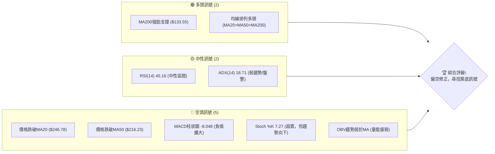

**解讀**：目前NBIS的多頭訊號主要來自於其長期移動平均線的健康排列以及MA200作為下方堅實支撐。然而，短期內價格已跌破MA20和MA50，且動能指標如MACD和OBV均發出明確的空頭訊號。RSI和ADX則處於中性區間，表明當前缺乏明確的趨勢方向，更偏向於修正或盤整。整體而言，市場處於一個短期回調但長期潛力仍在的階段，需要密切關注築底訊號。

### 📊 核心指標速覽表

下表彙總NBIS當前的關鍵技術指標，提供快速概覽。

| 指標類別 | 指標名稱 | 當前數值 | 訊號 | 解讀 |
|----------|----------|----------|------|------|
| **價格** | 當前收盤價 | $213.02 | 🔴 | 較近期高點 $276.17 (2026-06) 回調達 22.87% |
| **均線** | MA20 | $246.78 | 🔴 | 價格位於MA20下方，短期趨勢轉弱 |
| **均線** | MA50 | $216.23 | 🔴 | 價格位於MA50下方，中期趨勢承壓 |
| **均線** | MA200 | $133.55 | 🟢 | 價格位於MA200上方，長期趨勢仍為多頭 |
| **動能** | RSI(14) | 45.16 | 🟡 | 位於中性區間，未超買或超賣 |
| **動能** | MACD | 4.378 | 🔴 | MACD線位於訊號線下方，柱狀圖為負值且擴大 |
| **動能** | MACD Signal | 12.426 | 🔴 | 訊號線位於MACD線上方，空頭佔優 |
| **動能** | MACD Hist | -8.048 | 🔴 | 柱狀圖為負值，空頭動能強勁 |
| **動能** | Stoch %K | 7.27 | 🟢 | 進入超賣區，可能預示反彈 |
| **動能** | Stoch %D | 13.92 | 🟢 | 進入超賣區，與%K確認超賣 |
| **趨勢** | ADX(14) | 18.71 | 🟡 | 趨勢強度較弱，可能處於盤整或修正階段 |
| **趨勢** | +DI | 22.05 | 🔴 | 空頭方向力量 (-DI 25.56) 略強於多頭方向力量 |
| **趨勢** | -DI | 25.56 | 🔴 | 空頭方向力量佔主導，但趨勢強度不足 |
| **波動** | ATR(14) | $29.31 | 🟡 | 每日波動金額大，佔價格 13.76%，波動性高 |
| **布林** | BB上軌 | $299.44 | 🔴 | 價格遠離上軌，顯示短期動能不足 |
| **布林** | BB中軌(MA20)| $246.78 | 🔴 | 價格位於中軌下方，短期走弱 |
| **布林** | BB下軌 | $194.12 | 🟢 | 價格接近下軌，可能提供短期支撐 |
| **布林** | BB %B | 0.18 | 🟢 | 靠近下軌，暗示超賣或回調接近尾聲 |
| **成交量** | 最新成交量 | 14,824,900 | 🔴 | 低於20日及50日均量，量能萎縮 |
| **成交量** | 量比 (20日) | 0.80x | 🔴 | 成交量萎縮，未能支撐價格 |
| **成交量** | OBV趨勢 | OBV < MA | 🔴 | 價跌量縮，量能疲弱，確認空頭趨勢 |

### 🏆 技術評分卡

本評分卡從多個維度量化NBIS的技術健康度，以100分為滿分。

```
技術評分卡 — NBIS (2026-07-07)
════════════════════════════════════════════════════
趨勢強度      ███████░░░░░░░░░░░░░░  35/100  🔴 (ADX弱，-DI > +DI)
動能指標      ██████░░░░░░░░░░░░░░  30/100  🔴 (MACD空頭，RSI中性，Stoch超賣但未反轉)
支撐穩定度    ███████████░░░░░░░░░░  55/100  🟡 (MA200強勁，但短期支撐承壓)
成交量配合    ████░░░░░░░░░░░░░░░░  20/100  🔴 (成交量萎縮，OBV疲弱)
形態完整度    ██████░░░░░░░░░░░░░░  30/100  🔴 (近期急跌，未見明確底部形態)
均線排列      ██████████████░░░░░░  70/100  🟡 (長期多頭排列，但價格跌破短期均線)
════════════════════════════════════════════════════
綜合評分      ██████░░░░░░░░░░░░░░  40/100  🔴 謹慎觀望
════════════════════════════════════════════════════
```

**綜合評級**：當前NBIS的技術評分顯示其處於一個偏弱的狀態。儘管長期均線仍保持多頭排列，但短期價格回調劇烈，動能指標和成交量均發出警告訊號。趨勢強度不足，且未見明確的築底形態。建議投資者保持謹慎，等待更明確的止跌或反轉訊號。

---

## 2. 趨勢分析

### 🌐 多時框趨勢分析

透過Mermaid圖表展示NBIS在不同時間框架下的趨勢判斷，從宏觀到微觀層層遞進。

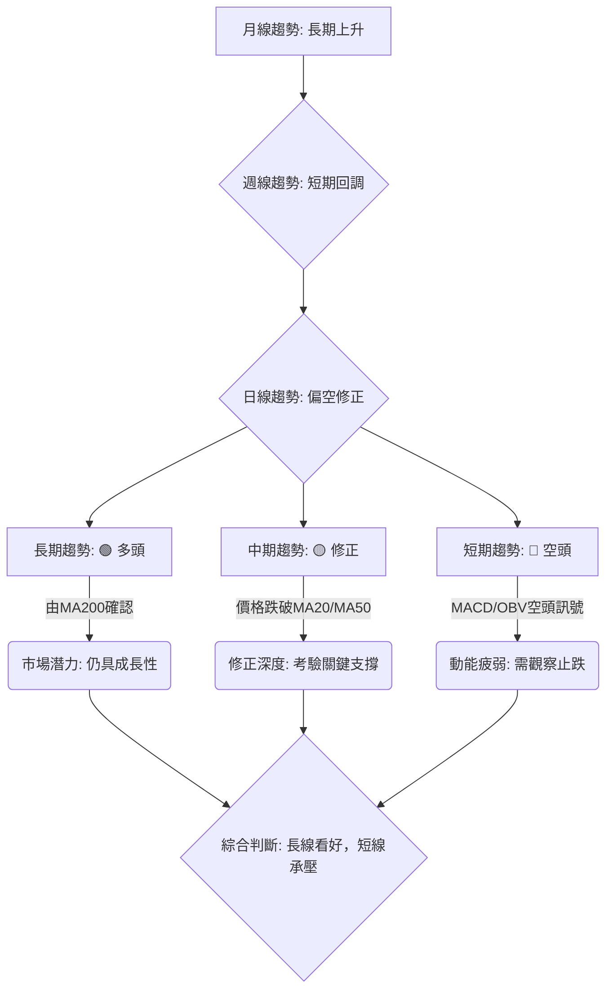

**解讀**：
*   **長期（月線）趨勢**：根據過去12個月的價格走勢和MA200（$133.55）的穩健支撐，NBIS仍處於一個顯著的長期上升趨勢中。儘管近期有所回調，但尚未破壞其長期多頭結構。
*   **中期（週線）趨勢**：從近20週的數據來看，NBIS在2026年5月達到高峰後，於6月開始大幅回調。價格已跌破MA20和MA50，顯示中期上升趨勢受到挑戰，轉為修正格局。
*   **短期（日線）趨勢**：當前收盤價 $213.02 遠低於MA5 ($239.03) 和MA10 ($251.06)，且MACD等動能指標呈空頭排列，顯示短期內空頭力量強勁，處於明顯的下跌修正階段。

### 📈 長期趨勢 — 12個月走勢圖（Unicode）

以下是NBIS過去12個月的月線收盤價格走勢圖，標示了關鍵高低點。

```
NBIS 月線走勢圖（過去12個月）
價格軸 ($)
$276.17 ┤                                     ● (2026-06 高點)
$250.00 ┤                                   ╱
$225.00 ┤                                  ╱
$213.02 ┤───────────────────────────────────● (現在)
$200.00 ┤                                 ╱
$175.00 ┤                                ╱
$150.00 ┤                      ●       ╱
$125.00 ┤                ●    ╱      ╱
$100.00 ┤              ╱    ╱      ╱
 $75.00 ┤            ╱    ╱      ╱
 $54.43 ┤●──────────╱─────────────────────── (2025-07 低點)
     └─────────────────────────────────────────────────────
      2025-07  08  09  10  11  12  2026-01  02  03  04  05  06  07
```

**走勢特徵分析表格**：

| 時間區間 | 主要趨勢 | 起始價格 | 結束價格 | 漲跌幅 | 關鍵特徵 |
|----------|----------|----------|----------|--------|----------|
| 2025-07至2025-10 | 強勁上升 | $54.43 | $130.82 | +140.33% | 伴隨成交量放大，趨勢明確 |
| 2025-10至2025-12 | 短期回調 | $130.82 | $83.71 | -36.01% | 快速修正，但未破壞長期趨勢 |
| 2026-01至2026-06 | 再次拉升 | $85.19 | $276.17 | +224.20% | 創歷史新高，動能強勁 |
| 2026-06至2026-07 | 急速回調 | $276.17 | $213.02 | -22.87% | 近期快速修正，考驗市場信心 |

**長期趨勢總結**：NBIS在過去12個月呈現出V型反轉後強勁上漲的態勢，並在2026年6月創下歷史新高。儘管近期經歷了超過20%的快速回調，但整體而言，其長期上升趨勢結構仍然保持完好，MA200作為長期牛市的分界線，目前仍提供穩固的下方支撐。

### 📊 中期趨勢（週線分析）

從近20週的週線數據來看，NBIS在2026年3月經歷了一次震盪整理後，於4月和5月再次啟動一波強勁的漲勢，從約$100拉升至$286.69。然而，自6月下旬以來，價格出現急劇下跌，從$286.69一路跌至目前的$213.02。這顯示中期上升趨勢已經遭到破壞，目前處於修正階段。

```
NBIS 近期壓力與支撐示意圖 (週線視角)
═══════════════════════════════════════════════════
$286.69 ║█████████████████████████████████████║ 主要阻力 (2026-06高點)
$276.17 ║█████████████████████████████████████║ 次要阻力
$246.78 ║█████████████████████████████████████║ MA20 中軌阻力
$216.23 ║█████████████████████████████████████║ MA50 關鍵阻力
$213.02 ╠═════════════════════════════════════╣ ◄ 現價
$194.12 ║▓▓▓▓▓▓▓▓▓▓▓▓▓▓▓▓▓▓▓▓▓▓▓▓▓▓▓▓▓▓▓▓▓▓▓▓▓▓▓║ 布林下軌支撐
$171.83 ║▓▓▓▓▓▓▓▓▓▓▓▓▓▓▓▓▓▓▓▓▓▓▓▓▓▓▓▓▓▓▓▓▓▓▓▓▓▓▓║ 斐波那契61.8%回調支撐
$133.55 ║▓▓▓▓▓▓▓▓▓▓▓▓▓▓▓▓▓▓▓▓▓▓▓▓▓▓▓▓▓▓▓▓▓▓▓▓▓▓▓║ MA200 長期支撐
═══════════════════════════════════════════════════
```

**中期趨勢判斷**：從週線來看，NBIS正經歷一波深度修正。關鍵壓力位於MA50 ($216.23) 和MA20 ($246.78)。如果價格能守住布林下軌 ($194.12) 及斐波那契回調位，則可能形成中期底部。反之，若跌破這些支撐，修正可能進一步深化。

### ⚡ 趨勢強度評估（ADX 解讀）

ADX指標用於衡量趨勢的強度，而非方向。

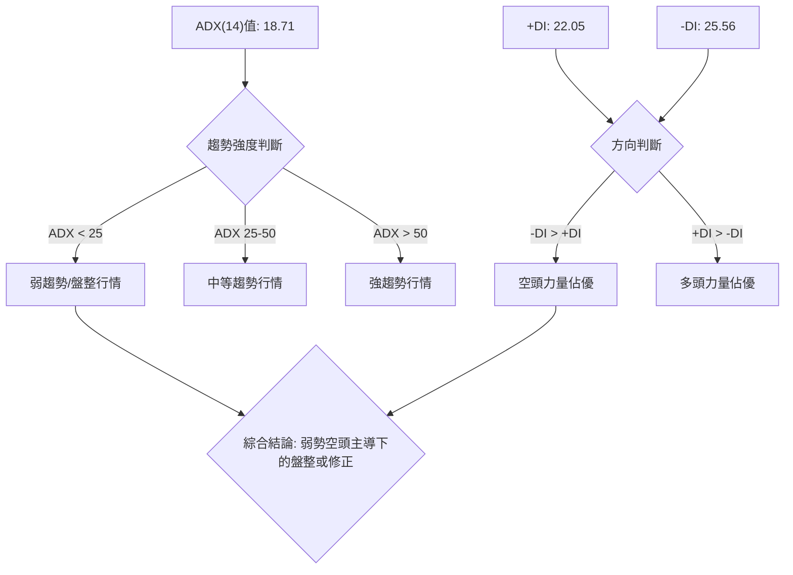

**ADX 強度對照表**：

| ADX 數值 | 趨勢強度 | 市場解讀 |
|----------|----------|----------|
| 0-25     | 弱趨勢   | 盤整或震盪，缺乏明確方向 |
| 25-50    | 中等趨勢 | 存在明顯趨勢，可追蹤 |
| 50-75    | 強趨勢   | 趨勢非常強勁，動能十足 |
| 75-100   | 極強趨勢 | 趨勢過熱，可能面臨反轉 |

**解讀**：NBIS當前的ADX(14)數值為18.71，遠低於25的閾值，這明確指示市場目前處於**弱趨勢或盤整行情**。這與近期價格的急劇下跌相符，表明下跌的動能雖然強勁，但尚未形成一個穩定的趨勢。同時，-DI (25.56) 略高於+DI (22.05)，暗示在這種弱勢行情中，空頭力量略佔主導。這意味著當前的下跌更像是一個深度的修正，而非一個新的、強勁的下降趨勢的開始，市場正在尋找新的平衡點。

---

## 3. 圖表形態分析

### 🔍 形態識別系統

根據提供的歷史價格數據，NBIS在2026年5月至6月經歷了一波衝高，隨後在2026年6月下旬至7月出現急劇回落。目前尚未形成明確的經典反轉或持續形態（如頭肩頂、雙頂、三角形等），更像是一個快速的V型反轉後的深度修正。

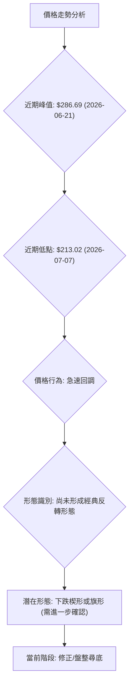

**解讀**：NBIS目前處於一個快速回調的階段，尚未形成明確的築底形態。從2026年6月21日的$286.69高點到目前的$213.02，跌幅顯著。這種快速下跌後，通常會伴隨著一定時間的盤整或反彈，以消化賣壓並尋找新的平衡。目前需要密切關注價格是否能在關鍵支撐位附近形成底部形態，例如雙底、頭肩底的右肩，或是收斂型態如下跌楔形，這些都將是潛在的反轉訊號。

### 🕯️ 重要K線形態分析

由於數據僅提供週收盤價，無法繪製完整的K線圖進行精確的K線形態分析。但我們可以從週收盤價的變化幅度來推斷市場情緒。

| 月份 | 收盤價 | 週變化 | 市場解讀 | 訊號 |
|------|--------|--------|----------|------|
| 2026-05-17 | $219.94 | +24.23% | 強勁上漲，多頭動能強 | 🟢 |
| 2026-05-24 | $214.77 | -2.35% | 小幅回調，漲勢暫歇 | 🟡 |
| 2026-05-31 | $231.09 | +7.60% | 恢復漲勢，創近期新高 | 🟢 |
| 2026-06-07 | $227.81 | -1.42% | 小幅回調 | 🟡 |
| 2026-06-14 | $232.36 | +2.00% | 漲勢持續 | 🟢 |
| 2026-06-21 | $286.69 | +23.30% | 爆發性上漲，創歷史新高 | 🟢 |
| 2026-06-28 | $240.30 | -16.20% | 急速下跌，賣壓沉重 | 🔴 |
| 2026-07-05 | $215.62 | -10.27% | 繼續下跌，空頭主導 | 🔴 |
| 2026-07-12 | $213.02 | -1.21% | 跌勢放緩，但仍處於下跌 | 🟡 |

**解讀**：從週線收盤價來看，2026年6月21日創下歷史新高 $286.69 後，隨後兩週出現了連續的大幅下跌，分別下跌16.20%和10.27%，顯示市場情緒急轉直下，賣壓極為沉重。最近一周（2026-07-12，即當前數據）跌幅縮小至1.21%，可能暗示跌勢有所緩解，但仍需等待止跌訊號。這種連續大陰線（週線視角）的出現，通常預示著短期內市場將繼續尋找支撐。

### 📉 ASCII 走勢形態示意圖

以下示意圖描繪了NBIS從近期高點到目前的回調走勢，顯示一個潛在的修正形態。

```
NBIS 近期回調走勢示意圖
═══════════════════════════════════════════════════
$286.69 ┤               ● (2026-06-21高點)
        │             ╱
        │           ╱
        │         ╱
$240.30 ┤       ●
        │     ╱
        │   ╱
$215.62 ┤ ●
$213.02 ┤●──────────────────────────── (現價)
        │
        │
$194.12 ┤════════════════════════════ (布林下軌/潛在支撐)
        │
$171.83 ┤════════════════════════════ (斐波那契61.8%回調)
═══════════════════════════════════════════════════
      6月初      6月中      6月底      7月初      7月中
```

**形態解讀**：圖中顯示了NBIS從高點 $286.69 開始的急劇下跌。當前價格 $213.02 位於布林下軌 $194.12 之上，並接近斐波那契38.2%回調位 $215.67。這種形態可以被視為一個**下行通道**或**旗形整理**的開端，但尚未形成明確的底部結構。若能在 $194.12 - $171.83 區間獲得有效支撐並出現反轉K線，則可能構築一個短期底部。

### 🎯 形態目標價計算

由於目前尚未形成明確的經典圖表形態（如頭肩頂/底、雙頂/底等），因此無法根據形態高度計算具體的形態目標價。當前價格行為更偏向於深度修正。我們將主要依賴支撐阻力分析、斐波那契回調以及移動平均線來判斷潛在的目標價位。

**基於近期高點修正的潛在目標**：
如果當前修正持續，下一個潛在的下跌目標將是較強的技術支撐位。
*   **斐波那契50%回調位**：$193.76
*   **布林通道下軌**：$194.12
*   **斐波那契61.8%回調位**：$171.83
*   **分析師低目標價**：$120.00
*   **MA200長期支撐**：$133.55

**潛在反彈目標**：
若價格在此處止跌反彈，潛在的反彈目標將是：
*   **MA50阻力**：$216.23
*   **斐波那契38.2%回調位**：$215.67
*   **MA20阻力**：$246.78
*   **分析師平均目標價**：$244.21
*   **近期高點**：$286.69

**結論**：目前NBIS缺乏可供計算形態目標價的明確形態。投資者應將重點放在識別關鍵支撐位上的止跌訊號，並利用斐波那契回調位和移動平均線作為潛在的買入或賣出參考點。

---

## 4. 支撐與阻力

### 🗺️ 關鍵價位分布圖（Unicode）

以下圖表展示了NBIS當前的價格結構，標示出重要的支撐與阻力位。

```
NBIS 價位結構分布圖 (當前價格 $213.02)
═══════════════════════════════════════════════════
$299.86 ║█████████████████████████████████████║ 歷史阻力 R4 (52週高點)
$286.69 ║█████████████████████████████████████║ 強阻力 R3 (近期高點)
$246.78 ║█████████████████████████████████████║ 關鍵阻力 R2 (MA20 & BB中軌 & 分析師平均目標)
$216.23 ║█████████████████████████████████████║ 短期阻力 R1 (MA50 & 斐波那契38.2%回調)
$213.02 ╠═════════════════════════════════════╣ ◄ 現價
$194.12 ║▓▓▓▓▓▓▓▓▓▓▓▓▓▓▓▓▓▓▓▓▓▓▓▓▓▓▓▓▓▓▓▓▓▓▓▓▓▓▓║ 近期支撐 S1 (布林下軌 & 斐波那契50%回調)
$171.83 ║▓▓▓▓▓▓▓▓▓▓▓▓▓▓▓▓▓▓▓▓▓▓▓▓▓▓▓▓▓▓▓▓▓▓▓▓▓▓▓║ 次要支撐 S2 (斐波那契61.8%回調)
$133.55 ║▓▓▓▓▓▓▓▓▓▓▓▓▓▓▓▓▓▓▓▓▓▓▓▓▓▓▓▓▓▓▓▓▓▓▓▓▓▓▓║ 強支撐 S3 (MA200 長期均線)
$120.00 ║▓▓▓▓▓▓▓▓▓▓▓▓▓▓▓▓▓▓▓▓▓▓▓▓▓▓▓▓▓▓▓▓▓▓▓▓▓▓▓║ 心理支撐 S4 (分析師低目標)
$43.89  ║▓▓▓▓▓▓▓▓▓▓▓▓▓▓▓▓▓▓▓▓▓▓▓▓▓▓▓▓▓▓▓▓▓▓▓▓▓▓▓║ 歷史支撐 S5 (52週低點)
═══════════════════════════════════════════════════
```

### 🚧 阻力位分析表

當前價格 $213.02 位於多個阻力下方，反彈將面臨挑戰。

| 阻力級別 | 價位 | 形成原因 | 突破難度 | 重要性 |
|----------|------|----------|----------|--------|
| **R1**   | $216.23 | MA50移動平均線，同時接近斐波那契38.2%回調位($215.67)，構成短期反彈的初步考驗。 | 中等 | 高 |
| **R2**   | $246.78 | MA20移動平均線與布林通道中軌重合，且接近分析師平均目標價($244.21)。若能突破此處，將意味著短期空頭壓力大幅緩解。 | 較高 | 非常高 |
| **R3**   | $286.69 | 近期歷史高點 (2026-06-21)，是上次下跌的起點，構成強大的心理及技術阻力。 | 非常高 | 非常高 |
| **R4**   | $299.86 | 52週最高價，為長期上行趨勢的頂部，突破需要極強動能。 | 極高 | 中等 |

### 🛡️ 支撐位分析表

當前價格 $213.02 接近多個支撐，若能守穩，則可能形成短期底部。

| 支撐級別 | 價位 | 形成原因 | 守住機率 | 重要性 |
|----------|------|----------|----------|--------|
| **S1**   | $194.12 | 布林通道下軌，同時接近斐波那契50%回調位($193.76)。此區間通常能提供較強的短期買盤支撐。 | 中等 | 非常高 |
| **S2**   | $171.83 | 斐波那契61.8%回調位，被視為一個關鍵的反轉點，若跌破此處，則修正可能加深。 | 中等 | 高 |
| **S3**   | $133.55 | MA200移動平均線，代表長期上升趨勢的生命線，若跌破則長期趨勢將受到嚴重威脅。 | 較高 | 極高 |
| **S4**   | $120.00 | 分析師最低目標價，具有一定的心理支撐作用。 | 中等 | 中等 |

### 📐 斐波那契回調位分析

我們以NBIS從2026年3月29日的低點 $100.82 到2026年6月21日的高點 $286.69 這一波漲勢為基礎，計算其回調位。

*   **漲勢區間**：$286.69 - $100.82 = $185.87

| 回調比例 | 價位計算 | 價位 | 解讀 | 訊號 |
|----------|----------|------|------|------|
| **23.6%** | $286.69 - ($185.87 * 0.236) | $242.66 | 初步回調位，已被跌破，轉為阻力。 | 🔴 |
| **38.2%** | $286.69 - ($185.87 * 0.382) | $215.67 | 關鍵回調位，當前價格($213.02)已跌破，顯示修正動能強勁。 | 🔴 |
| **50.0%** | $286.69 - ($185.87 * 0.500) | $193.76 | 重要心理及技術支撐，與布林下軌($194.12)重合，構成強支撐區間。 | 🟢 |
| **61.8%** | $286.69 - ($185.87 * 0.618) | $171.83 | 黃金分割回調位，若跌破此處，則預示著更深的修正，甚至可能反轉。 | 🟡 |
| **76.4%** | $286.69 - ($185.87 * 0.764) | $144.56 | 深度回調位，接近MA200，若觸及則表示先前漲勢幾乎被完全回吐。 | 🟡 |

**斐波那契回調視覺化**：

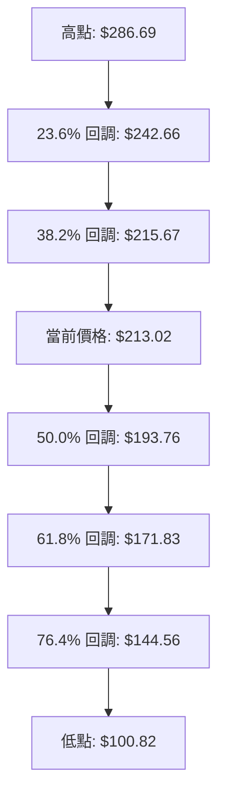

**結論**：當前NBIS的價格 $213.02 已經跌破了38.2%斐波那契回調位 $215.67，顯示市場修正的力度不容小覷。下一個關鍵支撐區間位於50%回調位 $193.76 附近，此處與布林通道下軌重合，將是判斷跌勢能否止穩的重要觀察點。若能在此處企穩並反彈，則仍有機會維持中期上漲趨勢；反之，若跌破 $193.76，則需警惕向 $171.83 (61.8%回調) 甚至更低水平修正的風險。

---

## 5. 技術指標深度解讀

### 🎛️ 指標訊號總覽

以下Mermaid圖表展示了各技術指標之間的訊號關係及對當前NBIS股價的綜合影響。

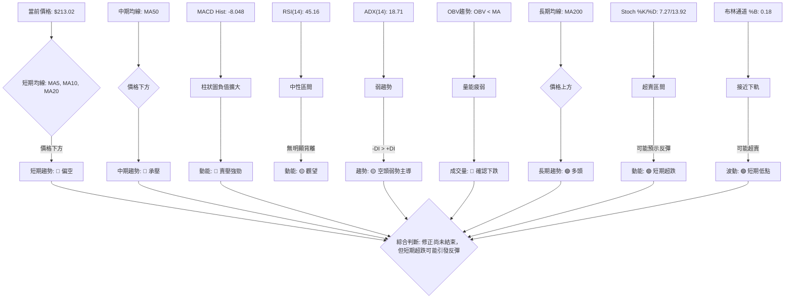

### 📈 移動平均線排列分析

NBIS的移動平均線系統呈現出一個長期看好但短期面臨挑戰的局面。

**當前均線數值**：
*   MA20: $246.78
*   MA50: $216.23
*   MA200: $133.55

**均線排列狀態**：MA20 ($246.78) > MA50 ($216.23) > MA200 ($133.55)。這是一個標準的**多頭排列**，表明NBIS的長期上升趨勢依然健康且強勁。

**價格與均線關係**：
然而，當前股價 $213.02 卻位於MA20和MA50的下方，這是一個**短期和中期趨勢轉弱的訊號**。
*   價格 < MA20 ($246.78)：🔴 短期看空
*   價格 < MA50 ($216.23)：🔴 中期承壓
*   價格 > MA200 ($133.55)：🟢 長期看多

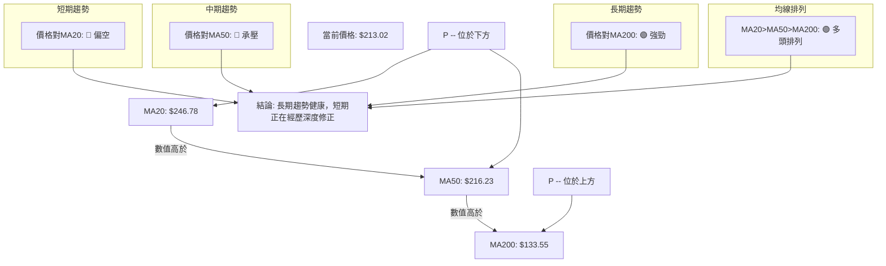

**綜合解讀**：NBIS的均線系統顯示了一個「長期牛市中的短期深度回調」的典型情境。儘管短期內價格跌破MA20和MA50，但MA200的堅實支撐以及整體均線的多頭排列，表明當前下跌更可能是一個修正而非趨勢反轉。然而，在價格重新站穩MA50和MA20之上之前，短期內仍將面臨壓力。MA50 ($216.23) 將是短期反彈的關鍵阻力，若能突破並站穩，則有助於穩定中期趨勢。

### 📉 RSI(14) 分析

**RSI(14) 數值**：45.16

**RSI 數值進度條**：
RSI 強度：▓▓▓▓▓▓▓▓▓▓▓▓▓▓▓▓▓▓▓▓▓▓▓▓▓▓▓▓▓▓▓▓▓▓▓▓▓▓▓▓▓▓▓▓▓▓▓▓░░░░░░░░░░░░░░░░░░░░░░░░░░░░░░░░░░░░░░░░░░░░░░░░░░░░ 45.16 / 100

**超買超賣區間分析**：
*   RSI 70-100：超買區 (🔴 賣出訊號或回調風險)
*   RSI 30-70：中性區 (🟡 觀望或趨勢延續)
*   RSI 0-30：超賣區 (🟢 買入訊號或反彈機會)

NBIS當前的RSI(14)為45.16，位於中性區間。這表示股價既沒有處於超買狀態，也沒有進入超賣區，因此RSI本身並未提供明確的買入或賣出訊號。

**背離判斷**：
我們檢查近20週的RSI與收盤價數據：
*   2026-06-21：收盤 $286.69，RSI 65.3
*   2026-06-28：收盤 $240.30，RSI 54.4
*   2026-07-05：收盤 $215.62，RSI 48.4
*   2026-07-12：收盤 $213.02，RSI 45.2 (當前)

在價格從 $286.69 下跌至 $213.02 的過程中，RSI從 65.3 下跌至 45.2。價格和RSI均同步下跌，**無明顯的底背離訊號**。這意味著當前的下跌動能是真實的，尚未出現動能減弱而價格繼續下跌的背離現象，因此不建議僅憑RSI判斷底部。

**綜合結論**：RSI目前處於中性區間，未能提供明確的多空指引。儘管股價大幅下跌，RSI仍未進入超賣區，顯示修正可能尚未完全結束，或者說，市場對未來仍存在一定的悲觀情緒。

### 📊 MACD(12/26/9) 訊號解讀

**MACD 指標數值**：
*   MACD 線 (DIF): 4.378
*   訊號線 (DEA): 12.426
*   MACD 柱狀圖 (OSC): -8.048

**MACD 訊號關係**：
*   MACD 線 (4.378) < 訊號線 (12.426)：🔴 空頭排列，賣出訊號。
*   MACD 柱狀圖 (-8.048) 為負值且數值持續擴大 (從上週的-6.630到本週的-8.048)：🔴 空頭動能強勁且仍在增強。

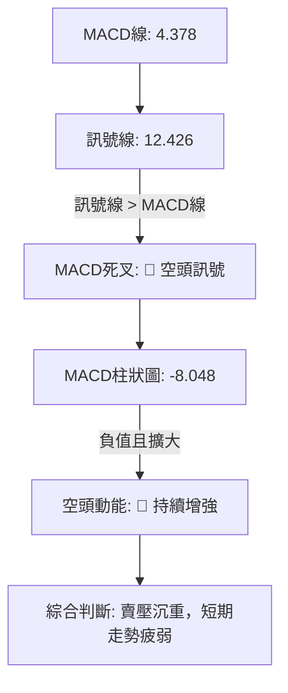

**背離判斷**：
我們檢查近20週的MACD柱狀圖與收盤價數據：
*   2026-06-21：收盤 $286.69，MACD柱狀圖 +2.998
*   2026-06-28：收盤 $240.30，MACD柱狀圖 -2.706
*   2026-07-05：收盤 $215.62，MACD柱狀圖 -6.630
*   2026-07-12：收盤 $213.02，MACD柱狀圖 -8.048 (當前)

在價格從 $286.69 下跌至 $213.02 的過程中，MACD柱狀圖由正轉負，且負值持續擴大。價格和MACD柱狀圖均同步下跌且空頭動能增強，**無明顯的底背離訊號**。這再次確認了當前下跌動能的真實性，尚未看到空頭力量衰竭的跡象。

**綜合結論**：MACD指標給出了明確的空頭訊號，MACD線位於訊號線下方，且柱狀圖的負值持續擴大，表明短期內的賣壓強勁，空頭動能仍在增強。在MACD線未能向上穿越訊號線形成金叉之前，市場仍將處於弱勢。

### 📦 布林通道分析

**布林通道數值**：
*   上軌 (BB上軌): $299.44
*   中軌 (MA20): $246.78
*   下軌 (BB下軌): $194.12
*   當前收盤價: $213.02
*   BB %B: 0.18 (接近0表示股價接近下軌)

```
NBIS 布林通道示意圖
═══════════════════════════════════════════════════
$299.44 ║█████████████████████████████████████║ BB上軌
        ║                                     ║
$246.78 ║─────────────────────────────────────║ BB中軌 (MA20)
        ║                                     ║
        ║                                     ║
$213.02 ╠═════════════════════════════════════╣ ◄ 現價
        ║                                     ║
        ║                                     ║
$194.12 ║▓▓▓▓▓▓▓▓▓▓▓▓▓▓▓▓▓▓▓▓▓▓▓▓▓▓▓▓▓▓▓▓▓▓▓▓▓▓▓║ BB下軌
═══════════════════════════════════════════════════
```

**解讀**：NBIS的當前價格 $213.02 位於布林通道中軌MA20 ($246.78) 下方，且非常接近下軌 $194.12。BB %B 值為0.18，進一步確認價格處於通道的下半部分，並接近下軌。
*   **趨勢判斷**：價格位於中軌下方，顯示短期趨勢偏弱。
*   **波動率**：雖然未直接給出布林通道寬度，但價格在通道內的大幅移動，結合ATR較高，表明波動性較大。
*   **超賣/超買**：價格接近布林下軌通常被視為**超賣訊號**，可能預示著短期內跌勢將放緩，或者有機會出現技術性反彈。然而，在強勁的下跌趨勢中，價格可能會沿著下軌運行，甚至在極端情況下跌破下軌。

**綜合結論**：布林通道顯示NBIS股價已進入超賣區域，短期內可能面臨反彈或跌勢暫歇。然而，在中軌未被有效突破之前，布林通道仍傾向於確認短期下跌趨勢。下軌 $194.12 將提供重要的短期支撐。

### 💹 成交量分析（量價配合度）

**成交量數據**：
*   最新成交量: 14,824,900
*   20日均量: 18,530,665
*   50日均量: 18,072,264
*   量比 (最新/20日均量): 0.80x
*   OBV趨勢: OBV < MA → 量能疲弱

**量價配合分析**：
當前收盤價 $213.02 較前一週下跌，同時最新成交量 14,824,900 明顯低於20日和50日均量，量比僅為0.80x。
*   **價跌量縮**：在下跌行情中，價跌量縮通常被解讀為賣壓有所減輕，但買盤也同樣不積極。這可能暗示跌勢在緩解，但尚未出現強勁的承接買盤來推動反彈。
*   **OBV趨勢**：OBV (On-Balance Volume) 是一種累積成交量指標，其趨勢與價格趨勢的配合度至關重要。數據顯示「OBV < MA → 量能疲弱」。這表示在最近的下跌中，即便價格有所回調，但總體累積成交量未能跟隨價格趨勢，反而呈現疲軟狀態。這是一個**熊市訊號**，表明下跌過程中，資金流出多於流入，未能有效承接。

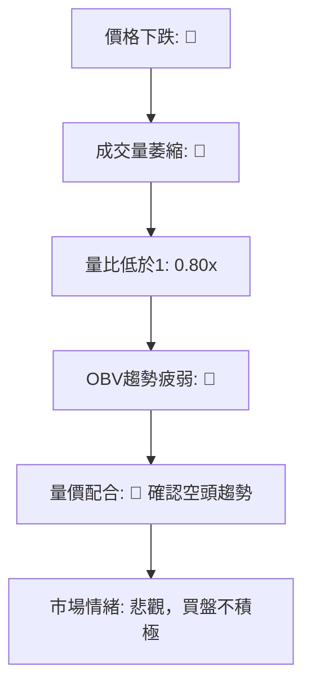

**綜合結論**：NBIS的成交量分析顯示，當前價格下跌伴隨著成交量萎縮和OBV趨勢疲弱，這是一個典型的**量價背離**（價跌量縮，但OBV未見底部確認）。雖然量縮可能暗示賣壓減輕，但更重要的是沒有看到積極的買盤進入。這表明市場情緒偏向悲觀，缺乏足夠的資金推動股價反彈。在出現放量上漲或OBV趨勢明顯轉強之前，量能方面仍對股價構成壓力。

---

## 6. 動能與波動率

### ⚡ 動能評估四象限

我們將NBIS當前的動能強度和波動率進行評估，並將其定位在四個象限中。
*   **動能強度**：基於MACD柱狀圖（-8.048且擴大）、RSI（45.16中性但趨勢向下）、OBV（疲弱）。綜合判斷為**弱動能**。
*   **波動率**：基於ATR(14)為 $29.31，佔當前價格 $213.02 的13.76%。綜合判斷為**高波動**。

| 象限 | 動能 | 波動 | 當前狀態 | 評估 | 訊號 |
|------|------|------|----------|------|------|
| Q1 | 強 | 低 | - | 最佳機會 (穩定上升) | 🟢 |
| Q2 | 弱 | 低 | - | 謹慎觀望 (盤整待變) | 🟡 |
| Q3 | 強 | 高 | - | 高風險高收益 (劇烈波動) | 🟡 |
| Q4 | 弱 | 高 | ✓ | **避免進場** (修正尋底) | 🔴 |

**動能評估流程圖**：
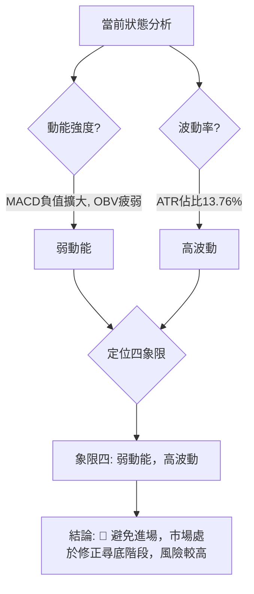

**綜合結論**：NBIS目前處於「弱動能、高波動」的第四象限。這意味著股價缺乏上漲的內在驅動力，同時價格波動劇烈，增加了交易的不確定性和風險。在這種情況下，建議投資者避免盲目進場，應耐心等待市場情緒穩定、動能轉強，並且波動率有所降低的明確訊號出現。

### 📊 ATR 波動率分析

**ATR(14) 數值**：$29.31

**ATR 相對價格**：$29.31 / $213.02 = 13.76%

**解讀**：NBIS的14日平均真實波幅 (ATR) 為 $29.31，佔當前收盤價 $213.02 的13.76%。
*   **高波動性**：13.76%的ATR佔比是一個相當高的數值，顯示NBIS的每日價格波動非常劇烈。這通常發生在股價大幅上漲或下跌之後，市場情緒不穩定，買賣雙方力量拉鋸明顯。
*   **交易風險**：高波動性意味著價格在短時間內可能出現大幅度變化，這增加了交易的風險。對於日內交易者或短期交易者而言，高波動性提供了更大的潛在利潤空間，但也伴隨著更高的止損風險。對於長期投資者，則需要更寬鬆的止損空間來應對日常波動。

**止損距離建議**：
鑑於當前ATR較高，建議將止損點設置在至少1.5倍至2倍ATR的距離之外，以避免被日常波動過早止損。
*   **1.5x ATR 止損距離**：1.5 * $29.31 = $43.97
*   **2.0x ATR 止損距離**：2.0 * $29.31 = $58.62

**如果考慮做多**：若在 $213.02 附近進場，止損點可考慮設置在 $213.02 - $43.97 = $169.05 左右，或更保守地設置在 $213.02 - $58.62 = $154.40 左右。這會將止損點放置在斐波那契61.8%回調位 $171.83 甚至更下方，提供較大的緩衝。
**如果考慮做空**：若在 $213.02 附近進場，止損點可考慮設置在 $213.02 + $43.97 = $256.99 左右，或更保守地設置在 $213.02 + $58.62 = $271.64 左右。這將止損點放置在MA20 ($246.78) 或近期高點 $286.69 之下。

**結論**：ATR顯示NBIS具有較高的波動性，投資者在制定交易策略時必須充分考慮這一點，並設置合理的止損範圍。

### 📐 Beta 與市場相關性

提供的數據中未包含NBIS的Beta值。因此，無法直接分析其與大盤的相關性。

**一般性分析**：
*   **行業特性**：NBIS屬於「Communication Services」板塊的「Internet Content & Information」行業，並專注於AI基礎設施和教育科技。這類公司通常具有較高的成長潛力，但也伴隨著較高的波動性和對市場情緒的敏感度。
*   **市場環境**：在牛市中，高成長科技股通常表現優於大盤（Beta > 1）；在熊市中，其跌幅也可能大於大盤。
*   **獨立性**：若無Beta數據，則需假設其股價走勢在一定程度上與其自身的基本面和行業發展相關，而非完全由大盤驅動。然而，作為一家上市公司，其股價仍不可避免地受到整體市場情緒和宏觀經濟環境的影響。

**建議**：在缺乏Beta數據的情況下，投資者應密切關注NBIS自身的營收增長、盈利能力、產業前景以及宏觀經濟對科技股的影響，以綜合判斷其風險和回報。

---

## 7. 多時框架總結

本章將NBIS在不同時間框架下的技術訊號進行整合，以提供一個全面的評估。

### 📋 時框架評分表

| 時框架 | 趨勢方向 | 動能 | 均線排列 | 形態 | 綜合評分 | 建議 |
|--------|----------|------|----------|------|----------|------|
| **長期** | 🟢 強勁上升 | 🟢 潛力大 | 🟢 多頭排列 | 🟡 修正中 | 8/10 | 長期持有，逢低吸納 |
| **中期** | 🔴 修正下跌 | 🔴 疲弱 | 🔴 價格承壓 | 🔴 尋底中 | 3/10 | 觀望，等待止跌訊號 |
| **短期** | 🔴 急速下跌 | 🔴 賣壓重 | 🔴 價格跌破 | 🔴 無底部 | 2/10 | 避免進場，謹慎風險 |

**解讀**：
*   **長期**：NBIS的長期趨勢依然健康，MA200提供堅實支撐，均線系統保持多頭排列，顯示長期增長潛力。目前的下跌被視為長期上升趨勢中的一次深度修正。
*   **中期**：價格已跌破MA20和MA50，且動能指標疲弱，中期趨勢明顯轉為下跌修正。形態上尚未看到明確的中期底部。
*   **短期**：短期內股價急劇下跌，MACD顯示強烈賣壓，成交量萎縮，RSI中性，Stochastics超賣。短期趨勢極度疲弱，缺乏止跌反轉訊號。

### 🔲 綜合訊號矩陣

以下矩陣展示了NBIS在不同時間框架下各技術維度訊號的一致性。

| 維度/時框架 | 長期趨勢 | 中期趨勢 | 短期趨勢 | 訊號一致性 |
|-------------|----------|----------|----------|------------|
| **價格走勢**| 🟢 上升   | 🔴 下跌   | 🔴 下跌   | 短期與中期一致，與長期背離 |
| **移動平均線**| 🟢 多頭排列| 🔴 價格下方| 🔴 價格下方| 均線排列健康，但價格已跌破短期和中期均線 |
| **動能指標 (RSI, MACD)** | 🟡 潛力   | 🔴 疲弱   | 🔴 賣壓重 | 長期動能潛力仍在，但中短期動能顯著轉弱 |
| **成交量 (OBV)** | 🟡 穩定   | 🔴 疲弱   | 🔴 疲弱   | 中短期成交量疲弱，未能確認止跌 |
| **波動率 (ATR)** | 🟡 穩定高 | 🟢 高波動 | 🟢 高波動 | 波動率較高，增加了短期交易風險 |
| **支撐/阻力** | 🟢 MA200強| 🟡 S1/S2承壓| 🔴 R1/R2阻力| 長期支撐強勁，但短期阻力重重，下方支撐面臨考驗 |

**綜合結論**：NBIS目前面臨一個「長期牛市中的深度修正」的複雜局面。雖然長期趨勢依然健康，但中短期所有關鍵技術指標都指向下跌修正和疲弱的動能。價格已跌破短期和中期移動平均線，且動能指標MACD和成交量OBV均顯示賣壓沉重。儘管Stochastics進入超賣區，布林通道接近下軌，可能預示短期反彈機會，但缺乏其他指標的確認，反彈動能可能有限。投資者應當認識到，當前市場處於一個高風險的尋底階段，在明確的止跌訊號出現之前，維持謹慎觀望態度是明智的選擇。

---

## 8. 交易策略建議

基於NBIS當前的技術分析，市場處於一個長期上漲趨勢中的深度修正階段。短期內空頭力量佔優，但超賣訊號開始出現。因此，我們將提出兩種可能的策略：一種是順應短期修正趨勢的空頭策略（如果市場條件允許且風險管理得當），另一種是等待底部反轉的多頭策略。

### 🗺️ 策略決策流程圖

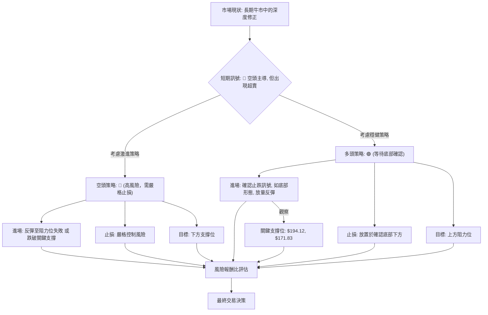

### 🟢 多頭策略詳情 (等待底部反轉)

鑒於當前市場處於修正階段，多頭策略應採取更為保守的「等待確認」模式。

| 策略要素 | 策略 A (保守型：等待確認) | 策略 B (激進型：搏反彈) |
|----------|--------------------------|------------------------|
| **進場條件** | 價格在 $194.12 - $171.83 區間形成明確底部形態 (如雙底、頭肩底)，或放量突破短期阻力 ($216.23)，且MACD柱狀圖轉正。 | Stochastics %K/%D 7.27/13.92 超賣區金叉，且RSI出現底部抬升，同時伴隨日內放量。 |
| **進場價格** | 突破 $216.23 (MA50/斐波那契38.2%) 並站穩，或在 $194.12 附近獲得明確支撐後反彈至 $200.00。 | $205.00 - $210.00 (在接近布林下軌且有止跌跡象時) |
| **目標價 T1** | $246.78 (MA20/布林中軌/分析師平均目標) | $216.23 (MA50/斐波那契38.2%) |
| **目標價 T2** | $286.69 (近期高點) | $246.78 (MA20/布林中軌/分析師平均目標) |
| **止損價格** | 若進場於 $200.00，止損於 $190.00 (略低於布林下軌 $194.12)。 | 若進場於 $208.00，止損於 $194.00 (布林下軌)。 |
| **風險報酬比** | 策略 A: (246.78-200)/(200-190) = 4.68:1 (T1) | 策略 B: (216.23-208)/(208-194) = 0.58:1 (T1) |
| **成功機率** | 60% (等待確認，安全性較高) | 40% (逆勢操作，風險較高) |
| **建議倉位** | 輕倉至中倉 (30%-50%) | 極輕倉 (10%-20%) |

**多頭策略總結**：目前市場偏空，多頭策略應極其謹慎。策略A更為穩健，等待市場明確止跌反轉訊號，成功率較高。策略B為激進型，旨在捕捉短期超跌反彈，但風險報酬比不佳，需要極高的交易紀律和快速反應能力。

### 🔴 空頭策略詳情 (順應短期修正)

考慮到當前NBIS的MACD、成交量和短期均線均顯示空頭主導，且ADX為弱趨勢但-DI佔優，可以考慮短期空頭策略。

| 策略要素 | 策略 A (反彈做空) | 策略 B (跌破追空) |
|----------|-------------------|------------------|
| **進場條件** | 股價反彈至 $216.23 (MA50/斐波那契38.2%) 或 $246.78 (MA20/布林中軌) 附近受阻，未能站穩，出現看跌K線形態。 | 股價跌破 $194.12 (布林下軌/斐波那契50%) 並確認下行，伴隨放量。 |
| **進場價格** | $215.00 - $220.00 (接近MA50阻力) | $193.00 (跌破 $194.12 後) |
| **目標價 T1** | $194.12 (布林下軌/斐波那契50%) | $171.83 (斐波那契61.8%) |
| **目標價 T2** | $171.83 (斐波那契61.8%) | $144.56 (斐波那契76.4%) |
| **止損價格** | 若進場於 $218.00，止損於 $225.00 (略高於MA50)。 | 若進場於 $193.00，止損於 $200.00 (略高於原支撐)。 |
| **風險報酬比** | 策略 A: (218-194.12)/(225-218) = 3.41:1 (T1) | 策略 B: (193-171.83)/(200-193) = 3.02:1 (T1) |
| **成功機率** | 55% (順應短期趨勢，但有反彈風險) | 50% (跌破後可能加速，但有假突破風險) |
| **建議倉位** | 中倉 (40%-60%) | 中倉 (30%-50%) |

**空頭策略總結**：目前市場短期偏空，空頭策略具有一定的順勢優勢。策略A利用反彈至阻力位做空，風險報酬比相對較好。策略B則是在關鍵支撐被有效跌破後追空，可能獲得較快收益，但需警惕假突破。兩種策略都需要嚴格的止損和倉位管理。

### ⭐ 整體訊號強度評星

基於當前NBIS的技術分析，綜合評估如下：

```
做多訊號強度：★★☆☆☆  (2/5星) (短期超賣，但缺乏反轉確認，風險高)
做空訊號強度：★★★☆☆  (3/5星) (短期趨勢偏空，動能指標確認，但長期趨勢仍為多頭)
整體可信度：  ★★★☆☆  (3/5星) (市場處於修正階段，走勢仍不明朗，需謹慎)
```

**結論**：NBIS目前處於一個相對複雜的局面。長期趨勢依然看好，但中短期卻面臨顯著的修正壓力。做多需要極大的耐心，等待明確的底部確認訊號；做空則可以順應短期修正，但需警惕潛在的超跌反彈以及長期趨勢的支撐作用。整體而言，建議投資者保持謹慎，等待更明確的市場方向。

---

## 9. 風險提示與監控

NBIS當前的技術面顯示股價處於深度修正期，存在較高風險。以下是關鍵的風險提示與監控建議。

### ✅ 關鍵監控指標 Checklist

以下是投資者在NBIS交易中應密切關注的指標清單，以動態調整策略。

```
NBIS 關鍵監控指標 Checklist (2026-07-07)
══════════════════════════════════════════════════════════════════
[ ] 價格是否跌破布林下軌 $194.12 或斐波那契50%回調 $193.76
[ ] 價格是否能站穩 MA50 $216.23 之上
[ ] MACD柱狀圖是否由負轉正或負值收斂
[ ] RSI是否進入超賣區 (RSI < 30) 並出現底背離
[ ] Stochastics是否在超賣區形成金叉並向上運行
[ ] 成交量是否在下跌過程中持續萎縮，並在反彈時放量
[ ] OBV趨勢是否能止跌回升，突破其均線
[ ] ADX是否能回升至25以上，且+DI超越-DI
[ ] 是否出現明顯的底部K線形態 (如錘子線、啟明星、看漲吞噬)
[ ] 52週低點 $43.89 是否受到威脅 (極端情況)
══════════════════════════════════════════════════════════════════
```

### ⚠️ 風險場景分析

NBIS當前的市場環境存在多種可能性，以下是三種主要的情境分析：

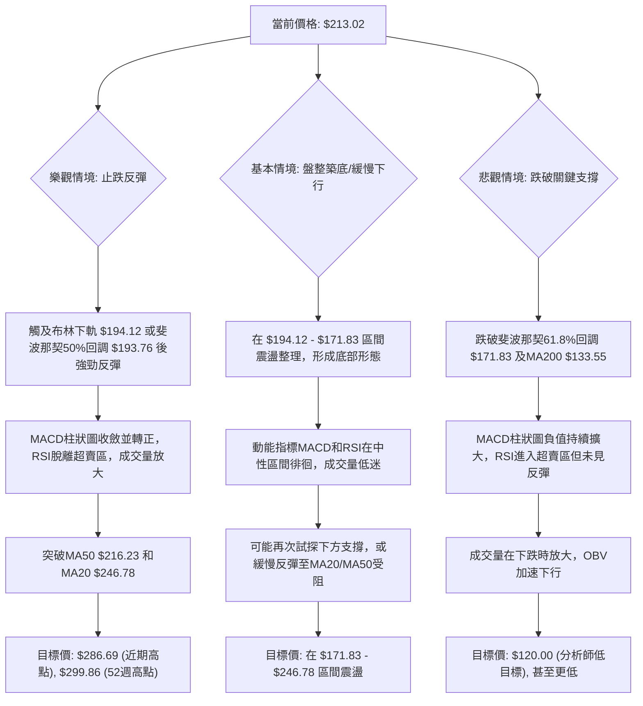

**解讀**：
*   **樂觀情境**：NBIS在當前支撐區間成功築底並反彈，重新收復短期和中期均線。這需要強勁的買盤進場和動能指標的配合。
*   **基本情境**：NBIS在當前價格附近或略低處進行盤整，消化賣壓。這是一個尋底的過程，股價可能在較寬的區間內震盪，需要時間來積累上漲動能。
*   **悲觀情境**：若當前支撐未能守住，股價可能加速下跌，考驗更深層次的長期支撐，甚至可能觸及分析師的悲觀目標。這將嚴重破壞其長期上升趨勢。

### 🛡️ 風險管理重要提醒

1.  **嚴格止損**：鑑於NBIS的高波動性 (ATR $29.31)，任何交易都必須設置明確且嚴格的止損點。一旦觸發，無論盈虧，都應果斷離場。
2.  **倉位控制**：在當前不確定的市場環境下，建議採用輕倉策略，避免重倉操作。即使看好長期潛力，也應分批建倉，將風險分散。
3.  **避免追漲殺跌**：在股價急劇下跌後，盲目追空或認為已到底部而抄底，都可能面臨較大風險。應等待明確的訊號確認。
4.  **多指標確認**：不要依賴單一指標。在做出交易決策前，應確保多個指標（如價格行為、均線、動能、成交量）相互印證，形成共振。
5.  **關注宏觀經濟及行業新聞**：雖然本報告側重技術分析，但宏觀經濟環境、行業政策變化以及公司基本面信息（如財報、新產品發布）同樣會對股價產生重大影響。
6.  **耐心等待**：當市場缺乏明確方向時，耐心是最好的策略。等待趨勢明朗、風險報酬比更優的交易機會出現。

---

## 📋 報告總結

```
NBIS 技術分析報告總結
════════════════════════════════════════════════════════
報告日期：2026-07-07
當前價格：$213.02
分析評級：⚖️ 謹慎觀望 (NBIS處於長期牛市中的深度修正，短期空頭主導但超賣訊號漸顯，需等待底部確認。)

關鍵結論：
├─ 長期趨勢：🟢 強勁上升，MA200 ($133.55) 提供堅實支撐。
├─ 中期趨勢：🔴 修正下跌，價格已跌破MA20 ($246.78) 和MA50 ($216.23)。
├─ 短期趨勢：🔴 急速下跌，MACD柱狀圖負值擴大，量能疲弱，但Stochastics超賣，布林通道接近下軌。
├─ 關鍵支撐：S1: $194.12 (布林下軌/斐波那契50%)，S2: $171.83 (斐波那契61.8%)。
├─ 關鍵阻力：R1: $216.23 (MA50/斐波那契38.2%)，R2: $246.78 (MA20/布林中軌)。
└─ 分析師目標：均值 $244.21，低值 $120.00，高值 $380.00。

最優策略組合：
1. 🥇 最佳機會：**等待底部確認後做多**。在 $194.12 - $171.83 區間密切觀察，若出現明確的止跌K線形態、放量反彈、MACD金叉等訊號，則可考慮分批進場。
2. 🥈 次選機會：**反彈至阻力位做空**。若股價反彈至 $216.23 或 $246.78 附近受阻，未能站穩，可考慮輕倉做空，目標下探 $194.12 或 $171.83。此策略風險較高，需嚴格止損。
3. 🥉 保守選擇：**場外觀望**。在當前市場不確定性較高、動能偏弱的背景下，保持現金，等待市場趨勢明朗或風險報酬比更佳的機會出現，是保守且穩健的選擇。
════════════════════════════════════════════════════════
```

---

> ⚠️ **免責聲明**：本報告為 AI 自動生成之技術分析，所有數據及估算均基於提供的歷史價格資訊。本報告**僅供研究與學術參考**，**不構成任何投資建議**。投資有風險，入市需謹慎。

---

*報告生成時間：2026-07-07 ｜ 數據來源：提供數據 ｜ 分析框架：多時框技術分析*