<details>
<summary>📊 靜態圖表 (點擊展開)</summary>
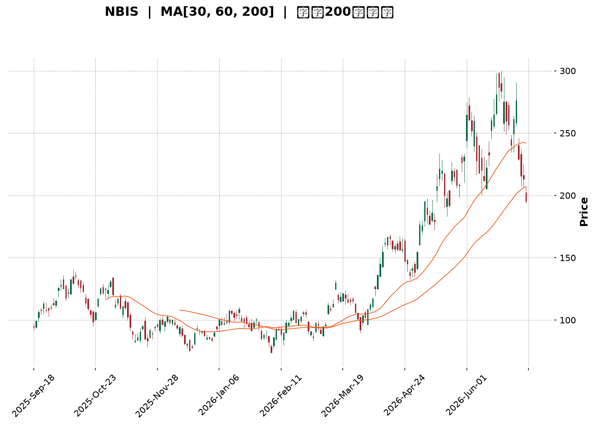
</details>

<html>
<head><meta charset="utf-8" /></head>
<body>
    <div style="height:500px; width:100%;">                        <script>window.PlotlyConfig = {MathJaxConfig: 'local'};</script>
        <script charset="utf-8" src="https://cdn.plot.ly/plotly-3.6.0.min.js" integrity="sha256-QaOVwtVY0T02VaHrr6pnoHLCwayMJp4O5n4YyaE3rJk=" crossorigin="anonymous"></script>                <div id="candlestick-chart" class="plotly-graph-div" style="height:100%; width:100%;"></div>            <script>                window.PLOTLYENV=window.PLOTLYENV || {};                                if (document.getElementById("candlestick-chart")) {                    Plotly.newPlot(                        "candlestick-chart",                        [{"close":{"dtype":"f8","bdata":"AAAAIK6HV0AAAAAA19NYQAAAAGBmplpAAAAAQDPzWkAAAABguE5cQAAAAAAp\u002fFpAAAAAwMzsWkAAAACAFI5bQAAAAKBHEVxAAAAAQArnXEAAAAAgrndfQAAAAGC4\u002fl9AAAAAACk8X0AAAADAzGxdQAAAAAAAgF5AAAAA4HqUYEAAAABgjzJgQAAAAGC47mBAAAAAwMwEYEAAAADAHnVfQAAAAGCPwl5AAAAAAClcXEAAAAAAAEBbQAAAAIDrEVpAAAAAIK6nWEAAAACAPYpaQAAAAOCjUF1AAAAAIIVbX0AAAADAHnVeQAAAAGBmRl9AAAAAIIULX0AAAACAPVpgQAAAAIAUHl5AAAAAYI+iW0AAAAAAAEBdQAAAAAApXFtAAAAAgOvRW0AAAADAzHxbQAAAAIAUjllAAAAAQAqXV0AAAADgUShWQAAAAGCP4lRAAAAAYLh+VUAAAABgj6JWQAAAAOB6xFdAAAAAwPUoVUAAAADgo9BUQAAAAKCZ+VZAAAAA4FE4VkAAAAAAKaxXQAAAACCut1dAAAAAoJkJWUAAAADAzBxYQAAAAEDhulhAAAAAQDOzWUAAAABgj4JYQAAAAMAeFVlAAAAAgD0aWEAAAACAwmVXQAAAAIDrkVdAAAAAACnsVUAAAADA9UhUQAAAAMDMPFRAAAAAwMzcUkAAAACAwoVTQAAAAKBwXVZAAAAAYLhOV0AAAACA64FWQAAAAOBRyFZAAAAAgMLlVUAAAABgj4JVQAAAAEDhSlVAAAAAwB7tVEAAAADAzHxWQAAAAMAeNVdAAAAAIFwPWUAAAACgcA1YQAAAAEAzU1hAAAAAIIV7WEAAAADAHtVaQAAAACCFW1pAAAAAYLh+WUAAAADgo\u002fhZQAAAAGC4LltAAAAAYI\u002fSWEAAAAAgrrdYQAAAAGBmNlhAAAAAAACgV0AAAACgcN1WQAAAACCud1hAAAAAIIUbWUAAAACAPbpXQAAAAAApTFVAAAAAgD0KVkAAAADAzHxWQAAAAMD1mFRAAAAAIK53UkAAAABgZoZVQAAAAOBROFdAAAAAYI\u002fyVkAAAABACidWQAAAAGC4blZAAAAA4KOAWEAAAACgR2FYQAAAAEAzc1lAAAAAQArnWkAAAABA4XpYQAAAAEAKJ1lAAAAAwB6lWUAAAAAgrodaQAAAAOBROFpAAAAAACnMVkAAAADgo8BWQAAAAEAzs1VAAAAAgOtxWEAAAACgmelXQAAAAMAeVVZAAAAAACm8V0AAAAAghRtYQAAAACCu\u002f1tAAAAAYI8CW0AAAADAzDxcQAAAAEAzO2BAAAAAwB4VXUAAAAAA16NdQAAAAKBHYV5AAAAAIK5nXUAAAACgmYlcQAAAAIA9ulxAAAAAgMLFXEAAAACAFH5aQAAAAOB6NFlAAAAA4KMQV0AAAADgo\u002fBZQAAAAMDMfFlAAAAA4Ho0W0AAAABgjyJcQAAAAKCZWV1AAAAAAABAX0AAAABgjwphQAAAAEAKH2JAAAAAgOtRY0AAAACAFD5kQAAAAOCj2GRAAAAAQOGqZEAAAADgeqRjQAAAAMAe5WNAAAAAoJmRY0AAAADgeoRjQAAAAGCPomNAAAAAwB5lYkAAAABguB5iQAAAAOBR8GBAAAAAgBSmYUAAAAAgXEdhQAAAACCuT2NAAAAAoHANZkAAAACgcP1lQAAAAEDhYmhAAAAA4KMYZ0AAAACgmSFmQAAAAEAzQ2dAAAAAIIVjZkAAAADgo+hpQAAAAMDMpGtAAAAAgBR+a0AAAAAghftoQAAAACBct2hAAAAAgD36Z0AAAACAwn1rQAAAAOCj2GpAAAAAgOsBakAAAAAA1wtqQAAAAEDhSmxAAAAAQOHibEAAAAAAKYhwQAAAAKBHSXBAAAAAgMJ1b0AAAABguDpwQAAAAIDreWxAAAAAAABAa0AAAAAA14NrQAAAAIAUdmpAAAAAIK7Ha0AAAAAghQttQAAAAMAeQXBAAAAAoJmRcEAAAABgj45xQAAAAEAK63FAAAAAgMK5cUAAAAAAADRxQAAAAGCPOnBAAAAAgBQKcEAAAACgmQluQAAAAGBmUnBAAAAAYLhCcUAAAACAwqVsQAAAAADX82pAAAAA4KOgakAAAACAFGZoQA=="},"high":{"dtype":"f8","bdata":"AAAAIIVrWEAAAABAM+NYQAAAAMAeJVtAAAAAYLh+W0AAAABgZrZcQAAAAMAehVxAAAAAIFx\u002fW0AAAACgRyFcQAAAAKCZaV1AAAAA4FH4XEAAAAAgXK9fQAAAAABUn2BAAAAA4FH4YEAAAADA9QhgQAAAAADXU19AAAAAgD2qYEAAAABAM6NhQAAAAMD1UGFAAAAAgBa5YEAAAAAgrn9gQAAAAEAKX2BAAAAAAKwkXkAAAACAFF5dQAAAACCFC1tAAAAAQDPzWkAAAAAgrqdaQAAAAMDMXF1AAAAAAACgX0AAAADA9SBgQAAAAMDMfF9AAAAAgBQOYEAAAADAzIRgQAAAAIDC3WBAAAAAgOsxXUAAAACgcI1dQAAAAAAAQF5AAAAAQDPTW0AAAAAgrpddQAAAAADXo1xAAAAAoJlpWkAAAABguN5WQAAAAAAAQFZAAAAAoJlpVkAAAAAAKWxXQAAAAIAULlhAAAAAACmsWUAAAAAgXC9WQAAAAAAAQFdAAAAAgOvRVkAAAACAk+hXQAAAAMAeRVhAAAAAYGZmWUAAAADAzLxZQAAAAADXw1hAAAAAgML1WUAAAABgZlZZQAAAAAAAIFlAAAAAIIM4WUAAAACAwkVYQAAAAMDM3FdAAAAAoJnpV0AAAAAgXA9WQAAAAADXY1RAAAAAQDMTVUAAAABgZhZUQAAAAGCPolZAAAAAoJn5V0AAAACAFD5XQAAAAEDh2lZAAAAAIK7nVkAAAABACidWQAAAAKBwvVVAAAAAgBSeVUAAAADgo7BWQAAAAAAp3FdAAAAAIIUrWUAAAABgZpZZQAAAAGCPollAAAAAgBQ+WkAAAAAghStbQAAAAMDM\u002fFpAAAAAwMysWkAAAADgUQhbQAAAAAAAoFtAAAAAgBQeWkAAAACgmZlZQAAAAGC4\u002fllAAAAA4KO4WEAAAADgUThZQAAAAGCP4lhAAAAAYGZ2WUAAAAAAANBYQAAAAGCPAldAAAAAAABQVkAAAADA9dhWQAAAAGCP6lVAAAAA4Ho0VEAAAACAPapVQAAAACCFa1dAAAAAAFTjV0AAAAAAALBXQAAAAOCjsFZAAAAA4HoUWUAAAABgj9JYQAAAAKCZGVpAAAAAYLj+WkAAAADgehRbQAAAAKBuSllAAAAAAADwWUAAAAAAKdxaQAAAAOB6FFtAAAAAQDPTWEAAAACgxNhWQAAAACCud1ZAAAAAYLieWEAAAAAAANBYQAAAAMDMvFdAAAAAwMzMV0AAAACgmZlYQAAAAMAehVxAAAAAYI\u002fCW0AAAADgeiRdQAAAAKCZiWBAAAAAAABgXkAAAABAibFeQAAAAEAzc15AAAAAAFbuXkAAAAAA11NeQAAAAEAzc11AAAAAQDOzXUAAAABAM1NcQAAAAOCjkFpAAAAAIFyPWUAAAADA9fhZQAAAACCu91pAAAAAoHA9W0AAAACAwnVcQAAAAKCZeV1AAAAAAADwX0AAAACgmRFhQAAAAIA9umJAAAAAAADwY0AAAABAM8NkQAAAAIDr2WRAAAAAYLgWZUAAAACA64FkQAAAAAAAOGRAAAAAAABoZEAAAACAwu1kQAAAAIDruWRAAAAAAACoZEAAAACgmZliQAAAAGC4rmFAAAAAYGb2YUAAAAAgXF9iQAAAAAAAgGNAAAAAwMxsZkAAAABguH5mQAAAACCuf2hAAAAA4Hq8aEAAAAAAAIhnQAAAAICXjmhAAAAAIIUzZ0AAAABA4SprQAAAACBcN21AAAAAoEeZbEAAAACAPUJrQAAAAIDrWWlAAAAAAACIaUAAAACA61lsQAAAAKBwvWtAAAAA4FGga0AAAADgejRqQAAAAOB6HG1AAAAAQDMzbUAAAACgxCxxQAAAAKBwbXFAAAAAIFy3cEAAAAAghYdwQAAAAAAAWG9AAAAAwMwMbkAAAADA9bRtQAAAACCu32xAAAAAIK6PbEAAAABA4XJuQAAAAOBRbnBAAAAAIIVVcUAAAABA4Z5yQAAAAMDMrHJAAAAAgMK9ckAAAAAgrnNyQAAAAKBuQnFAAAAA4FE4cUAAAACgmRlvQAAAAMDMfHBAAAAAoJkpckAAAAAgrs9uQAAAAOBRqG1AAAAAQAofbEAAAADgo\u002fBpQA=="},"hovertemplate":"\u003cb\u003e%{x|%Y-%m-%d}\u003c\u002fb\u003e\u003cbr\u003e\u958b: $%{open:.2f}\u003cbr\u003e\u9ad8: $%{high:.2f}\u003cbr\u003e\u4f4e: $%{low:.2f}\u003cbr\u003e\u6536: $%{close:.2f}\u003cextra\u003e\u003c\u002fextra\u003e","low":{"dtype":"f8","bdata":"AAAAgOsBV0AAAAAAAFBXQAAAAKBHoVhAAAAAAAAQWkAAAABgZjZaQAAAAOBReFpAAAAAQDOzWUAAAADAHhVbQAAAAIA96ltAAAAA4KNwW0AAAADgeqRdQAAAAGBm5l5AAAAAIIU7X0AAAACAFO5cQAAAAAAAYF1AAAAAIK73XUAAAADgUQBgQAAAAMDMlGBAAAAAAABwX0AAAADAzIxeQAAAAKBHgV5AAAAA4FG4W0AAAADgo+BaQAAAAKCZWVlAAAAA4FGoV0AAAACgcN1YQAAAAOCjgFtAAAAAQAoHXkAAAACA6zFeQAAAAAAAYF1AAAAA4KNwXUAAAABAM5NfQAAAAAAA8F1AAAAAAABAW0AAAAAghdtbQAAAAIA9GltAAAAA4KNQWUAAAACAFC5bQAAAAMAe9VhAAAAAoHDtVkAAAAAAACBVQAAAAAAAgFRAAAAAgMLlVEAAAACgcG1UQAAAAEAz81ZAAAAAoHANVUAAAACgcI1TQAAAAKCZSVVAAAAA4CQuVUAAAADgo7BWQAAAAAApXFdAAAAA4KNAVkAAAAAA1wNYQAAAAAAAwFZAAAAAgBReWEAAAADAzAxYQAAAAEAz01dAAAAAYGYGWEAAAADAzAxXQAAAAMDMrFVAAAAAwMyMVUAAAACgGARUQAAAAOBROFNAAAAAAADQUkAAAADgo0BTQAAAAIA9ClRAAAAAYGbGVkAAAAAA1xNWQAAAAKCZKVZAAAAAIFyvVUAAAABgjxJVQAAAAADXI1VAAAAAoJm5VEAAAADgo4BVQAAAAMD1uFZAAAAAACm8VkAAAAAA1+NXQAAAACBYAVhAAAAAYGZGWEAAAABAMyNYQAAAAEDh+llAAAAAIIPYWEAAAABgZkZZQAAAAKBwLVlAAAAAgMKVWEAAAABgZkZXQAAAAAAAIFhAAAAAgOthV0AAAABACtdWQAAAAIDrYVdAAAAAACkcWEAAAACAPcpWQAAAACCuB1VAAAAAgBQOVUAAAAAAADBVQAAAAAApnFNAAAAAoEdhUkAAAAAgrkdTQAAAAADX81RAAAAAgD3qVkAAAADA9chVQAAAAAAp7FNAAAAAQAo3VkAAAAAAAGBXQAAAACDZNlhAAAAAIIUbWUAAAACA60FYQAAAAEAz01dAAAAAQN9vWEAAAABAM7NZQAAAAAAAgFlAAAAAoJkZVkAAAABAM7NVQAAAAIDr4VRAAAAAoJmJVkAAAAAgrudWQAAAAEAzM1ZAAAAAAACgVUAAAAAAAMBXQAAAACBcH1pAAAAAoEehWkAAAADA9YhbQAAAAGASG19AAAAAQApHXEAAAAAAAIBcQAAAAKBHsVxAAAAAgJMoXEAAAABAM2NcQAAAAOCjAFxAAAAAwB5VXEAAAACAPVpaQAAAAKBHEVlAAAAAwMppVkAAAABguO5XQAAAAGBmVllAAAAAACkMWEAAAADAzNxaQAAAAIDrkVtAAAAAYGbWXUAAAABAMyNfQAAAAOBR3GBAAAAAoJnJYUAAAADgo9BjQAAAAAAAkGNAAAAAQOECZEAAAAAgXFdjQAAAAKBHQWNAAAAAwMxsY0AAAABAM2tjQAAAAIA9QmNAAAAAgOs5YkAAAACA61FhQAAAAGBmlmBAAAAAQArHYEAAAAAAAOBgQAAAAAAAgGFAAAAAYGb2Y0AAAABguBZlQAAAACCF42VAAAAAAAAgZkAAAAAAABBmQAAAAKCZUWZAAAAAAACIZUAAAAAAAGBoQAAAAAAA+GlAAAAAoJl5akAAAABgj8JnQAAAAAAA4GZAAAAA4HrUZ0AAAACgmRlqQAAAACBcV2pAAAAAwB61aUAAAACA68loQAAAAOBRYGtAAAAAwMxMakAAAAAAAMBtQAAAAAAAPHBAAAAA4FHwbkAAAACAFFZtQAAAAIAUFmtAAAAAYGY2a0AAAACgmQlpQAAAAADXa2pAAAAAAACgaUAAAAAAAPBrQAAAACCup25AAAAAwMysb0AAAADgo4RwQAAAAEAzOXFAAAAAAABgcUAAAAAAAGBvQAAAAGC4Jm9AAAAAgOuRb0AAAADAzExtQAAAAAAAUG1AAAAAoJn5b0AAAACgcIVsQAAAAGCR6WlAAAAAYLjGaUAAAACAwjVoQA=="},"name":"\u50f9\u683c","open":{"dtype":"f8","bdata":"AAAAwMzEV0AAAADA9YhXQAAAAMDMfFlAAAAAYI8CW0AAAADgo0hbQAAAACCFA1tAAAAAIIV7W0AAAADgUVhbQAAAAOB6XFxAAAAAgMLtW0AAAACgR\u002fFeQAAAAEAKz19AAAAAwMyMYEAAAADAzPRfQAAAAMDMTF5AAAAAYLg+XkAAAABgZt5gQAAAAGC45mBAAAAAAACAYEAAAADAzHxgQAAAAEDhAmBAAAAAANeDXUAAAABgjzJdQAAAAOBR+FpAAAAAQDOrWkAAAADAHhVZQAAAAIA9yltAAAAAgD06XkAAAAAA15tfQAAAAIDrEV9AAAAAwMxMXkAAAADA9ahfQAAAAAAAwGBAAAAAYLgWXEAAAADA9WhcQAAAAEAz411AAAAAAAAgWkAAAAAghctcQAAAAOBRiFxAAAAAwMwMWkAAAADA9bhWQAAAAEAKl1RAAAAA4Hr0VEAAAACA6\u002fFUQAAAAOBRQFdAAAAAIIXbWEAAAABAM2NVQAAAAGC4jlVAAAAAYI9SVkAAAABgZnZXQAAAAEAzI1hAAAAAwMzcVkAAAABAChdZQAAAAKBHwVdAAAAA4HrEWEAAAACAwhVZQAAAAGCPUlhAAAAAgMKFWEAAAABguO5XQAAAAMDMTFZAAAAAANdTV0AAAABgZgZWQAAAAMDM5FNAAAAAgMIFVUAAAABAM8NTQAAAAKCZKVRAAAAAgBQ+V0AAAAAA15NWQAAAAGC4jlZAAAAA4KPgVkAAAADAzBxVQAAAAAAAmFVAAAAAIK5XVUAAAABACr9VQAAAAAAAwFdAAAAAgMLtV0AAAADgo8BYQAAAAGCPMlhAAAAAoEe5WEAAAADgepRYQAAAAMAe1VpAAAAAgOtxWkAAAAAghSNaQAAAACCuf1pAAAAAwB51WUAAAACAwkVZQAAAAOCjgFlAAAAAwMwsWEAAAACgcG1YQAAAAGBmlldAAAAAAAAAWUAAAABACpdYQAAAAKBD41ZAAAAAANdzVUAAAAAghXtWQAAAAAAAwFVAAAAAwPXIU0AAAABgZs5TQAAAAMDMHFVAAAAAYI86V0AAAABgjzpXQAAAAGBmBlVAAAAAQAp3VkAAAAAAAABYQAAAAGC47lhAAAAAIIUbWUAAAAAA06VaQAAAACCFE1hAAAAAIFzXWEAAAAAgXD9aQAAAAAAAgFpAAAAAwMysWEAAAAAAAABWQAAAAKCZiVVAAAAAoJmZVkAAAAAAADBYQAAAAEAzE1dAAAAAQArXVUAAAADA9chXQAAAAIA9SlpAAAAAgMJFW0AAAAAAKZxbQAAAAAAAMF9AAAAAgMIVXkAAAABAM7NcQAAAAOBR0FxAAAAAYGYeXkAAAACgcC1dQAAAAEAzC11AAAAAIK43XUAAAADgUVBcQAAAAMAedVpAAAAAIFyPWUAAAABguH5YQAAAAOB6fFpAAAAAgD0aWEAAAACAPSpbQAAAAAAAqFtAAAAA4FG4X0AAAAAAAEBfQAAAAOBR3GBAAAAAYGbWYUAAAABAMyNkQAAAAGA7B2RAAAAAAADgZEAAAADA9XhkQAAAAAAAoGNAAAAAQAonZEAAAAAghVtkQAAAAMDMfGNAAAAAoHB1ZEAAAADgeoxiQAAAAMDMTGFAAAAAQAqDYUAAAACA6yViQAAAAGCPqmFAAAAA4FEMZEAAAADAzHRlQAAAAEAKc2ZAAAAA4FHAZ0AAAABgZvZmQAAAAMDMfGZAAAAAoHCNZkAAAABACntpQAAAAAAArGpAAAAAIIUza0AAAABACi9rQAAAAAAA4GdAAAAAQAp\u002faUAAAAAgrndqQAAAAOBRaGtAAAAAoJmVa0AAAADAHvlpQAAAAAApzGxAAAAAIIV7bEAAAABA4YJuQAAAAKCZAXFAAAAAoHBDcEAAAAAgrvdtQAAAACCF225AAAAAwMwMbkAAAAAAAMBsQAAAAKDG72pAAAAA4HqsaUAAAADAzFRtQAAAAGC4fm9AAAAAQArvb0AAAABgZppwQAAAAEAzo3JAAAAAIFwfckAAAAAAABxwQAAAAKCZMXFAAAAAwB4JcUAAAABAM5tuQAAAAAAALG9AAAAAACkkcEAAAACgxAhuQAAAAAAAIG1AAAAAAAAIa0AAAACAPUppQA=="},"x":["2025-09-18T00:00:00-04:00","2025-09-19T00:00:00-04:00","2025-09-22T00:00:00-04:00","2025-09-23T00:00:00-04:00","2025-09-24T00:00:00-04:00","2025-09-25T00:00:00-04:00","2025-09-26T00:00:00-04:00","2025-09-29T00:00:00-04:00","2025-09-30T00:00:00-04:00","2025-10-01T00:00:00-04:00","2025-10-02T00:00:00-04:00","2025-10-03T00:00:00-04:00","2025-10-06T00:00:00-04:00","2025-10-07T00:00:00-04:00","2025-10-08T00:00:00-04:00","2025-10-09T00:00:00-04:00","2025-10-10T00:00:00-04:00","2025-10-13T00:00:00-04:00","2025-10-14T00:00:00-04:00","2025-10-15T00:00:00-04:00","2025-10-16T00:00:00-04:00","2025-10-17T00:00:00-04:00","2025-10-20T00:00:00-04:00","2025-10-21T00:00:00-04:00","2025-10-22T00:00:00-04:00","2025-10-23T00:00:00-04:00","2025-10-24T00:00:00-04:00","2025-10-27T00:00:00-04:00","2025-10-28T00:00:00-04:00","2025-10-29T00:00:00-04:00","2025-10-30T00:00:00-04:00","2025-10-31T00:00:00-04:00","2025-11-03T00:00:00-05:00","2025-11-04T00:00:00-05:00","2025-11-05T00:00:00-05:00","2025-11-06T00:00:00-05:00","2025-11-07T00:00:00-05:00","2025-11-10T00:00:00-05:00","2025-11-11T00:00:00-05:00","2025-11-12T00:00:00-05:00","2025-11-13T00:00:00-05:00","2025-11-14T00:00:00-05:00","2025-11-17T00:00:00-05:00","2025-11-18T00:00:00-05:00","2025-11-19T00:00:00-05:00","2025-11-20T00:00:00-05:00","2025-11-21T00:00:00-05:00","2025-11-24T00:00:00-05:00","2025-11-25T00:00:00-05:00","2025-11-26T00:00:00-05:00","2025-11-28T00:00:00-05:00","2025-12-01T00:00:00-05:00","2025-12-02T00:00:00-05:00","2025-12-03T00:00:00-05:00","2025-12-04T00:00:00-05:00","2025-12-05T00:00:00-05:00","2025-12-08T00:00:00-05:00","2025-12-09T00:00:00-05:00","2025-12-10T00:00:00-05:00","2025-12-11T00:00:00-05:00","2025-12-12T00:00:00-05:00","2025-12-15T00:00:00-05:00","2025-12-16T00:00:00-05:00","2025-12-17T00:00:00-05:00","2025-12-18T00:00:00-05:00","2025-12-19T00:00:00-05:00","2025-12-22T00:00:00-05:00","2025-12-23T00:00:00-05:00","2025-12-24T00:00:00-05:00","2025-12-26T00:00:00-05:00","2025-12-29T00:00:00-05:00","2025-12-30T00:00:00-05:00","2025-12-31T00:00:00-05:00","2026-01-02T00:00:00-05:00","2026-01-05T00:00:00-05:00","2026-01-06T00:00:00-05:00","2026-01-07T00:00:00-05:00","2026-01-08T00:00:00-05:00","2026-01-09T00:00:00-05:00","2026-01-12T00:00:00-05:00","2026-01-13T00:00:00-05:00","2026-01-14T00:00:00-05:00","2026-01-15T00:00:00-05:00","2026-01-16T00:00:00-05:00","2026-01-20T00:00:00-05:00","2026-01-21T00:00:00-05:00","2026-01-22T00:00:00-05:00","2026-01-23T00:00:00-05:00","2026-01-26T00:00:00-05:00","2026-01-27T00:00:00-05:00","2026-01-28T00:00:00-05:00","2026-01-29T00:00:00-05:00","2026-01-30T00:00:00-05:00","2026-02-02T00:00:00-05:00","2026-02-03T00:00:00-05:00","2026-02-04T00:00:00-05:00","2026-02-05T00:00:00-05:00","2026-02-06T00:00:00-05:00","2026-02-09T00:00:00-05:00","2026-02-10T00:00:00-05:00","2026-02-11T00:00:00-05:00","2026-02-12T00:00:00-05:00","2026-02-13T00:00:00-05:00","2026-02-17T00:00:00-05:00","2026-02-18T00:00:00-05:00","2026-02-19T00:00:00-05:00","2026-02-20T00:00:00-05:00","2026-02-23T00:00:00-05:00","2026-02-24T00:00:00-05:00","2026-02-25T00:00:00-05:00","2026-02-26T00:00:00-05:00","2026-02-27T00:00:00-05:00","2026-03-02T00:00:00-05:00","2026-03-03T00:00:00-05:00","2026-03-04T00:00:00-05:00","2026-03-05T00:00:00-05:00","2026-03-06T00:00:00-05:00","2026-03-09T00:00:00-04:00","2026-03-10T00:00:00-04:00","2026-03-11T00:00:00-04:00","2026-03-12T00:00:00-04:00","2026-03-13T00:00:00-04:00","2026-03-16T00:00:00-04:00","2026-03-17T00:00:00-04:00","2026-03-18T00:00:00-04:00","2026-03-19T00:00:00-04:00","2026-03-20T00:00:00-04:00","2026-03-23T00:00:00-04:00","2026-03-24T00:00:00-04:00","2026-03-25T00:00:00-04:00","2026-03-26T00:00:00-04:00","2026-03-27T00:00:00-04:00","2026-03-30T00:00:00-04:00","2026-03-31T00:00:00-04:00","2026-04-01T00:00:00-04:00","2026-04-02T00:00:00-04:00","2026-04-06T00:00:00-04:00","2026-04-07T00:00:00-04:00","2026-04-08T00:00:00-04:00","2026-04-09T00:00:00-04:00","2026-04-10T00:00:00-04:00","2026-04-13T00:00:00-04:00","2026-04-14T00:00:00-04:00","2026-04-15T00:00:00-04:00","2026-04-16T00:00:00-04:00","2026-04-17T00:00:00-04:00","2026-04-20T00:00:00-04:00","2026-04-21T00:00:00-04:00","2026-04-22T00:00:00-04:00","2026-04-23T00:00:00-04:00","2026-04-24T00:00:00-04:00","2026-04-27T00:00:00-04:00","2026-04-28T00:00:00-04:00","2026-04-29T00:00:00-04:00","2026-04-30T00:00:00-04:00","2026-05-01T00:00:00-04:00","2026-05-04T00:00:00-04:00","2026-05-05T00:00:00-04:00","2026-05-06T00:00:00-04:00","2026-05-07T00:00:00-04:00","2026-05-08T00:00:00-04:00","2026-05-11T00:00:00-04:00","2026-05-12T00:00:00-04:00","2026-05-13T00:00:00-04:00","2026-05-14T00:00:00-04:00","2026-05-15T00:00:00-04:00","2026-05-18T00:00:00-04:00","2026-05-19T00:00:00-04:00","2026-05-20T00:00:00-04:00","2026-05-21T00:00:00-04:00","2026-05-22T00:00:00-04:00","2026-05-26T00:00:00-04:00","2026-05-27T00:00:00-04:00","2026-05-28T00:00:00-04:00","2026-05-29T00:00:00-04:00","2026-06-01T00:00:00-04:00","2026-06-02T00:00:00-04:00","2026-06-03T00:00:00-04:00","2026-06-04T00:00:00-04:00","2026-06-05T00:00:00-04:00","2026-06-08T00:00:00-04:00","2026-06-09T00:00:00-04:00","2026-06-10T00:00:00-04:00","2026-06-11T00:00:00-04:00","2026-06-12T00:00:00-04:00","2026-06-15T00:00:00-04:00","2026-06-16T00:00:00-04:00","2026-06-17T00:00:00-04:00","2026-06-18T00:00:00-04:00","2026-06-22T00:00:00-04:00","2026-06-23T00:00:00-04:00","2026-06-24T00:00:00-04:00","2026-06-25T00:00:00-04:00","2026-06-26T00:00:00-04:00","2026-06-29T00:00:00-04:00","2026-06-30T00:00:00-04:00","2026-07-01T00:00:00-04:00","2026-07-02T00:00:00-04:00","2026-07-06T00:00:00-04:00","2026-07-07T00:00:00-04:00"],"type":"candlestick"},{"hovertemplate":"MA30: $%{y:.2f}\u003cextra\u003e\u003c\u002fextra\u003e","line":{"color":"#2196F3","dash":"dash","width":2},"mode":"lines","name":"MA30","x":["2025-09-18T00:00:00-04:00","2025-09-19T00:00:00-04:00","2025-09-22T00:00:00-04:00","2025-09-23T00:00:00-04:00","2025-09-24T00:00:00-04:00","2025-09-25T00:00:00-04:00","2025-09-26T00:00:00-04:00","2025-09-29T00:00:00-04:00","2025-09-30T00:00:00-04:00","2025-10-01T00:00:00-04:00","2025-10-02T00:00:00-04:00","2025-10-03T00:00:00-04:00","2025-10-06T00:00:00-04:00","2025-10-07T00:00:00-04:00","2025-10-08T00:00:00-04:00","2025-10-09T00:00:00-04:00","2025-10-10T00:00:00-04:00","2025-10-13T00:00:00-04:00","2025-10-14T00:00:00-04:00","2025-10-15T00:00:00-04:00","2025-10-16T00:00:00-04:00","2025-10-17T00:00:00-04:00","2025-10-20T00:00:00-04:00","2025-10-21T00:00:00-04:00","2025-10-22T00:00:00-04:00","2025-10-23T00:00:00-04:00","2025-10-24T00:00:00-04:00","2025-10-27T00:00:00-04:00","2025-10-28T00:00:00-04:00","2025-10-29T00:00:00-04:00","2025-10-30T00:00:00-04:00","2025-10-31T00:00:00-04:00","2025-11-03T00:00:00-05:00","2025-11-04T00:00:00-05:00","2025-11-05T00:00:00-05:00","2025-11-06T00:00:00-05:00","2025-11-07T00:00:00-05:00","2025-11-10T00:00:00-05:00","2025-11-11T00:00:00-05:00","2025-11-12T00:00:00-05:00","2025-11-13T00:00:00-05:00","2025-11-14T00:00:00-05:00","2025-11-17T00:00:00-05:00","2025-11-18T00:00:00-05:00","2025-11-19T00:00:00-05:00","2025-11-20T00:00:00-05:00","2025-11-21T00:00:00-05:00","2025-11-24T00:00:00-05:00","2025-11-25T00:00:00-05:00","2025-11-26T00:00:00-05:00","2025-11-28T00:00:00-05:00","2025-12-01T00:00:00-05:00","2025-12-02T00:00:00-05:00","2025-12-03T00:00:00-05:00","2025-12-04T00:00:00-05:00","2025-12-05T00:00:00-05:00","2025-12-08T00:00:00-05:00","2025-12-09T00:00:00-05:00","2025-12-10T00:00:00-05:00","2025-12-11T00:00:00-05:00","2025-12-12T00:00:00-05:00","2025-12-15T00:00:00-05:00","2025-12-16T00:00:00-05:00","2025-12-17T00:00:00-05:00","2025-12-18T00:00:00-05:00","2025-12-19T00:00:00-05:00","2025-12-22T00:00:00-05:00","2025-12-23T00:00:00-05:00","2025-12-24T00:00:00-05:00","2025-12-26T00:00:00-05:00","2025-12-29T00:00:00-05:00","2025-12-30T00:00:00-05:00","2025-12-31T00:00:00-05:00","2026-01-02T00:00:00-05:00","2026-01-05T00:00:00-05:00","2026-01-06T00:00:00-05:00","2026-01-07T00:00:00-05:00","2026-01-08T00:00:00-05:00","2026-01-09T00:00:00-05:00","2026-01-12T00:00:00-05:00","2026-01-13T00:00:00-05:00","2026-01-14T00:00:00-05:00","2026-01-15T00:00:00-05:00","2026-01-16T00:00:00-05:00","2026-01-20T00:00:00-05:00","2026-01-21T00:00:00-05:00","2026-01-22T00:00:00-05:00","2026-01-23T00:00:00-05:00","2026-01-26T00:00:00-05:00","2026-01-27T00:00:00-05:00","2026-01-28T00:00:00-05:00","2026-01-29T00:00:00-05:00","2026-01-30T00:00:00-05:00","2026-02-02T00:00:00-05:00","2026-02-03T00:00:00-05:00","2026-02-04T00:00:00-05:00","2026-02-05T00:00:00-05:00","2026-02-06T00:00:00-05:00","2026-02-09T00:00:00-05:00","2026-02-10T00:00:00-05:00","2026-02-11T00:00:00-05:00","2026-02-12T00:00:00-05:00","2026-02-13T00:00:00-05:00","2026-02-17T00:00:00-05:00","2026-02-18T00:00:00-05:00","2026-02-19T00:00:00-05:00","2026-02-20T00:00:00-05:00","2026-02-23T00:00:00-05:00","2026-02-24T00:00:00-05:00","2026-02-25T00:00:00-05:00","2026-02-26T00:00:00-05:00","2026-02-27T00:00:00-05:00","2026-03-02T00:00:00-05:00","2026-03-03T00:00:00-05:00","2026-03-04T00:00:00-05:00","2026-03-05T00:00:00-05:00","2026-03-06T00:00:00-05:00","2026-03-09T00:00:00-04:00","2026-03-10T00:00:00-04:00","2026-03-11T00:00:00-04:00","2026-03-12T00:00:00-04:00","2026-03-13T00:00:00-04:00","2026-03-16T00:00:00-04:00","2026-03-17T00:00:00-04:00","2026-03-18T00:00:00-04:00","2026-03-19T00:00:00-04:00","2026-03-20T00:00:00-04:00","2026-03-23T00:00:00-04:00","2026-03-24T00:00:00-04:00","2026-03-25T00:00:00-04:00","2026-03-26T00:00:00-04:00","2026-03-27T00:00:00-04:00","2026-03-30T00:00:00-04:00","2026-03-31T00:00:00-04:00","2026-04-01T00:00:00-04:00","2026-04-02T00:00:00-04:00","2026-04-06T00:00:00-04:00","2026-04-07T00:00:00-04:00","2026-04-08T00:00:00-04:00","2026-04-09T00:00:00-04:00","2026-04-10T00:00:00-04:00","2026-04-13T00:00:00-04:00","2026-04-14T00:00:00-04:00","2026-04-15T00:00:00-04:00","2026-04-16T00:00:00-04:00","2026-04-17T00:00:00-04:00","2026-04-20T00:00:00-04:00","2026-04-21T00:00:00-04:00","2026-04-22T00:00:00-04:00","2026-04-23T00:00:00-04:00","2026-04-24T00:00:00-04:00","2026-04-27T00:00:00-04:00","2026-04-28T00:00:00-04:00","2026-04-29T00:00:00-04:00","2026-04-30T00:00:00-04:00","2026-05-01T00:00:00-04:00","2026-05-04T00:00:00-04:00","2026-05-05T00:00:00-04:00","2026-05-06T00:00:00-04:00","2026-05-07T00:00:00-04:00","2026-05-08T00:00:00-04:00","2026-05-11T00:00:00-04:00","2026-05-12T00:00:00-04:00","2026-05-13T00:00:00-04:00","2026-05-14T00:00:00-04:00","2026-05-15T00:00:00-04:00","2026-05-18T00:00:00-04:00","2026-05-19T00:00:00-04:00","2026-05-20T00:00:00-04:00","2026-05-21T00:00:00-04:00","2026-05-22T00:00:00-04:00","2026-05-26T00:00:00-04:00","2026-05-27T00:00:00-04:00","2026-05-28T00:00:00-04:00","2026-05-29T00:00:00-04:00","2026-06-01T00:00:00-04:00","2026-06-02T00:00:00-04:00","2026-06-03T00:00:00-04:00","2026-06-04T00:00:00-04:00","2026-06-05T00:00:00-04:00","2026-06-08T00:00:00-04:00","2026-06-09T00:00:00-04:00","2026-06-10T00:00:00-04:00","2026-06-11T00:00:00-04:00","2026-06-12T00:00:00-04:00","2026-06-15T00:00:00-04:00","2026-06-16T00:00:00-04:00","2026-06-17T00:00:00-04:00","2026-06-18T00:00:00-04:00","2026-06-22T00:00:00-04:00","2026-06-23T00:00:00-04:00","2026-06-24T00:00:00-04:00","2026-06-25T00:00:00-04:00","2026-06-26T00:00:00-04:00","2026-06-29T00:00:00-04:00","2026-06-30T00:00:00-04:00","2026-07-01T00:00:00-04:00","2026-07-02T00:00:00-04:00","2026-07-06T00:00:00-04:00","2026-07-07T00:00:00-04:00"],"y":{"dtype":"f8","bdata":"AAAAAAAA+H8AAAAAAAD4fwAAAAAAAPh\u002fAAAAAAAA+H8AAAAAAAD4fwAAAAAAAPh\u002fAAAAAAAA+H8AAAAAAAD4fwAAAAAAAPh\u002fAAAAAAAA+H8AAAAAAAD4fwAAAAAAAPh\u002fAAAAAAAA+H8AAAAAAAD4fwAAAAAAAPh\u002fAAAAAAAA+H8AAAAAAAD4fwAAAAAAAPh\u002fAAAAAAAA+H8AAAAAAAD4fwAAAAAAAPh\u002fAAAAAAAA+H8AAAAAAAD4fwAAAAAAAPh\u002fAAAAAAAA+H8AAAAAAAD4fwAAAAAAAPh\u002fAAAAAAAA+H8AAAAAAAD4f5qZmUlvE11A3t3dDZBTXUCJiIi4yJZdQHd3d5dftF1A7+7u\u002fje6XUCrqqrqQsJdQN7d3R12xV1AZmZmRhnNXUARERHRhcxdQN7d3S0Vt11AiYiI2L+JXUBmZmbWTTpdQLy7u6t\u002f21xAERERUWKIXEBmZmZWcU5cQHd3d\u002ff9FFxAERERkZeuW0C8u7urxktbQJqZmRnZ7lpAIiIichKbWkCrqqrao1haQHd3d0eLHFpAq6qqKjEAWkARERExa+VZQKuqqur72VlAERERwebiWUBmZmYmlNFZQM3MzBx2rVlAMzMzU41vWUBERESETjNZQAAAALCO8VhAiYiISLajWEAAAABgujlYQO\u002fu7i5r5VdAzczMXI+aV0AAAABQjUdXQBEREZHtHFdAzczM3Gv2VkAzMzPj7MtWQEREREREtFZAERER8dKlVkBVVVV1TKBWQHd3d6fGo1ZAMzMzM+yeVkCrqqr6qZ1WQERERKTimFZAIiIiUiq6VkDv7u6+ytVWQN7d3d1P4VZAAAAAYJ70VkAAAACAlQ9XQKuqqqocJldAd3d3FwQqV0CJiIiY4DlXQKuqqirOTldAzczMPFFHV0B3d3eHFklXQLy7u\u002fupQVdA3t3d3ZY9V0CrqqqaCzlXQJqZmTm0QFdAZmZm9uFbV0CJiIg4QnlXQERERNRNgldAAAAAMGudV0BERERUuLZXQKuqqiqjp1dAZmZmBlZ+V0CJiIi483VXQERERHSveVdAd3d3N6WCV0B3d3fHIIhXQGZmZibbkVdAZmZmll+wV0ARERHRhcBXQCIiIqKo01dAMzMzo2HjV0BmZmaGB+dXQJqZmTkX7ldA7+7uvgL4V0DNzMzsbfVXQM3MzIxB9FdAVVVVxTzdV0De3d1NxcFXQJqZmZn8kldAAAAA8MOPV0AzMzNj5YhXQHd3d3faeFdARERExMp5V0DNzMwMZYRXQO\u002fu7i6HoldAIiIiQsOyV0AAAACAP9lXQBEREdGFOFhAREREZJ50WEBEREREp7FYQGZmZnYhBVlAvLu7y3ZiWUBmZmbWTZ5ZQImIiChNzVlAAAAAEAL\u002fWUAAAADwCiRaQN7d3Y2zO1pAmpmZSW8vWkCamZkpvzxaQERERBQRPVpAZmZm5qU\u002fWkDv7u5e1l5aQDMzM\u002fOnglpAIiIiQnyyWkAiIiLy7vJaQO\u002fu7m51SFtAZmZm5qXPW0AzMzMj92ZcQLy7u2uREV1AAAAAMLKhXUDNzMzs3yReQKuqqmrYuV5AERERsUc9X0AAAABQqbxfQN7d3d1rDmBAREREPCY4YEAiIiIaS1pgQAAAAKhUYGBAAAAAGNl6YECJiIhQ1I9gQDMzM1P\u002fsmBAzczMpLfxYECJiIj4mjNhQERERHQhiWFA3t3dvXTTYUAiIiJSRh9iQKuqqnI9emJAmpmZSeHWYkAzMzNrSkVjQO\u002fu7vZvxGNAIiIiIvc6ZECJiIhQG5hkQCIiIsLK7WRAMzMzExE1ZUAiIiJyPY5lQAAAAICx2GVAERERkcIRZkDNzMwMSUNmQBEREaHTgmZAMzMzw\u002fXIZkDv7u7ufDtnQJqZmVmrp2dA3t3dLSQNaEBmZmbGkntoQHd3d8cEx2hAIiIi0pQSaUAiIiKCwGJpQKuqqroCtGlAiYiIyHYKakDNzMyM3m5qQN7d3e1832pAvLu7exQ+a0ARERHBEa5rQJqZmanGD2xAERERkTR5bEBmZma28+FsQO\u002fu7n5qMG1AAAAAoBqDbUBEREQEVqZtQO\u002fu7q4A0W1AmpmZOfsMbkCamZmJQSxuQDMzM7NWP25AZmZmtvNVbkC8u7sLkDtuQA=="},"type":"scatter"},{"hovertemplate":"MA60: $%{y:.2f}\u003cextra\u003e\u003c\u002fextra\u003e","line":{"color":"#9C27B0","dash":"dash","width":2},"mode":"lines","name":"MA60","x":["2025-09-18T00:00:00-04:00","2025-09-19T00:00:00-04:00","2025-09-22T00:00:00-04:00","2025-09-23T00:00:00-04:00","2025-09-24T00:00:00-04:00","2025-09-25T00:00:00-04:00","2025-09-26T00:00:00-04:00","2025-09-29T00:00:00-04:00","2025-09-30T00:00:00-04:00","2025-10-01T00:00:00-04:00","2025-10-02T00:00:00-04:00","2025-10-03T00:00:00-04:00","2025-10-06T00:00:00-04:00","2025-10-07T00:00:00-04:00","2025-10-08T00:00:00-04:00","2025-10-09T00:00:00-04:00","2025-10-10T00:00:00-04:00","2025-10-13T00:00:00-04:00","2025-10-14T00:00:00-04:00","2025-10-15T00:00:00-04:00","2025-10-16T00:00:00-04:00","2025-10-17T00:00:00-04:00","2025-10-20T00:00:00-04:00","2025-10-21T00:00:00-04:00","2025-10-22T00:00:00-04:00","2025-10-23T00:00:00-04:00","2025-10-24T00:00:00-04:00","2025-10-27T00:00:00-04:00","2025-10-28T00:00:00-04:00","2025-10-29T00:00:00-04:00","2025-10-30T00:00:00-04:00","2025-10-31T00:00:00-04:00","2025-11-03T00:00:00-05:00","2025-11-04T00:00:00-05:00","2025-11-05T00:00:00-05:00","2025-11-06T00:00:00-05:00","2025-11-07T00:00:00-05:00","2025-11-10T00:00:00-05:00","2025-11-11T00:00:00-05:00","2025-11-12T00:00:00-05:00","2025-11-13T00:00:00-05:00","2025-11-14T00:00:00-05:00","2025-11-17T00:00:00-05:00","2025-11-18T00:00:00-05:00","2025-11-19T00:00:00-05:00","2025-11-20T00:00:00-05:00","2025-11-21T00:00:00-05:00","2025-11-24T00:00:00-05:00","2025-11-25T00:00:00-05:00","2025-11-26T00:00:00-05:00","2025-11-28T00:00:00-05:00","2025-12-01T00:00:00-05:00","2025-12-02T00:00:00-05:00","2025-12-03T00:00:00-05:00","2025-12-04T00:00:00-05:00","2025-12-05T00:00:00-05:00","2025-12-08T00:00:00-05:00","2025-12-09T00:00:00-05:00","2025-12-10T00:00:00-05:00","2025-12-11T00:00:00-05:00","2025-12-12T00:00:00-05:00","2025-12-15T00:00:00-05:00","2025-12-16T00:00:00-05:00","2025-12-17T00:00:00-05:00","2025-12-18T00:00:00-05:00","2025-12-19T00:00:00-05:00","2025-12-22T00:00:00-05:00","2025-12-23T00:00:00-05:00","2025-12-24T00:00:00-05:00","2025-12-26T00:00:00-05:00","2025-12-29T00:00:00-05:00","2025-12-30T00:00:00-05:00","2025-12-31T00:00:00-05:00","2026-01-02T00:00:00-05:00","2026-01-05T00:00:00-05:00","2026-01-06T00:00:00-05:00","2026-01-07T00:00:00-05:00","2026-01-08T00:00:00-05:00","2026-01-09T00:00:00-05:00","2026-01-12T00:00:00-05:00","2026-01-13T00:00:00-05:00","2026-01-14T00:00:00-05:00","2026-01-15T00:00:00-05:00","2026-01-16T00:00:00-05:00","2026-01-20T00:00:00-05:00","2026-01-21T00:00:00-05:00","2026-01-22T00:00:00-05:00","2026-01-23T00:00:00-05:00","2026-01-26T00:00:00-05:00","2026-01-27T00:00:00-05:00","2026-01-28T00:00:00-05:00","2026-01-29T00:00:00-05:00","2026-01-30T00:00:00-05:00","2026-02-02T00:00:00-05:00","2026-02-03T00:00:00-05:00","2026-02-04T00:00:00-05:00","2026-02-05T00:00:00-05:00","2026-02-06T00:00:00-05:00","2026-02-09T00:00:00-05:00","2026-02-10T00:00:00-05:00","2026-02-11T00:00:00-05:00","2026-02-12T00:00:00-05:00","2026-02-13T00:00:00-05:00","2026-02-17T00:00:00-05:00","2026-02-18T00:00:00-05:00","2026-02-19T00:00:00-05:00","2026-02-20T00:00:00-05:00","2026-02-23T00:00:00-05:00","2026-02-24T00:00:00-05:00","2026-02-25T00:00:00-05:00","2026-02-26T00:00:00-05:00","2026-02-27T00:00:00-05:00","2026-03-02T00:00:00-05:00","2026-03-03T00:00:00-05:00","2026-03-04T00:00:00-05:00","2026-03-05T00:00:00-05:00","2026-03-06T00:00:00-05:00","2026-03-09T00:00:00-04:00","2026-03-10T00:00:00-04:00","2026-03-11T00:00:00-04:00","2026-03-12T00:00:00-04:00","2026-03-13T00:00:00-04:00","2026-03-16T00:00:00-04:00","2026-03-17T00:00:00-04:00","2026-03-18T00:00:00-04:00","2026-03-19T00:00:00-04:00","2026-03-20T00:00:00-04:00","2026-03-23T00:00:00-04:00","2026-03-24T00:00:00-04:00","2026-03-25T00:00:00-04:00","2026-03-26T00:00:00-04:00","2026-03-27T00:00:00-04:00","2026-03-30T00:00:00-04:00","2026-03-31T00:00:00-04:00","2026-04-01T00:00:00-04:00","2026-04-02T00:00:00-04:00","2026-04-06T00:00:00-04:00","2026-04-07T00:00:00-04:00","2026-04-08T00:00:00-04:00","2026-04-09T00:00:00-04:00","2026-04-10T00:00:00-04:00","2026-04-13T00:00:00-04:00","2026-04-14T00:00:00-04:00","2026-04-15T00:00:00-04:00","2026-04-16T00:00:00-04:00","2026-04-17T00:00:00-04:00","2026-04-20T00:00:00-04:00","2026-04-21T00:00:00-04:00","2026-04-22T00:00:00-04:00","2026-04-23T00:00:00-04:00","2026-04-24T00:00:00-04:00","2026-04-27T00:00:00-04:00","2026-04-28T00:00:00-04:00","2026-04-29T00:00:00-04:00","2026-04-30T00:00:00-04:00","2026-05-01T00:00:00-04:00","2026-05-04T00:00:00-04:00","2026-05-05T00:00:00-04:00","2026-05-06T00:00:00-04:00","2026-05-07T00:00:00-04:00","2026-05-08T00:00:00-04:00","2026-05-11T00:00:00-04:00","2026-05-12T00:00:00-04:00","2026-05-13T00:00:00-04:00","2026-05-14T00:00:00-04:00","2026-05-15T00:00:00-04:00","2026-05-18T00:00:00-04:00","2026-05-19T00:00:00-04:00","2026-05-20T00:00:00-04:00","2026-05-21T00:00:00-04:00","2026-05-22T00:00:00-04:00","2026-05-26T00:00:00-04:00","2026-05-27T00:00:00-04:00","2026-05-28T00:00:00-04:00","2026-05-29T00:00:00-04:00","2026-06-01T00:00:00-04:00","2026-06-02T00:00:00-04:00","2026-06-03T00:00:00-04:00","2026-06-04T00:00:00-04:00","2026-06-05T00:00:00-04:00","2026-06-08T00:00:00-04:00","2026-06-09T00:00:00-04:00","2026-06-10T00:00:00-04:00","2026-06-11T00:00:00-04:00","2026-06-12T00:00:00-04:00","2026-06-15T00:00:00-04:00","2026-06-16T00:00:00-04:00","2026-06-17T00:00:00-04:00","2026-06-18T00:00:00-04:00","2026-06-22T00:00:00-04:00","2026-06-23T00:00:00-04:00","2026-06-24T00:00:00-04:00","2026-06-25T00:00:00-04:00","2026-06-26T00:00:00-04:00","2026-06-29T00:00:00-04:00","2026-06-30T00:00:00-04:00","2026-07-01T00:00:00-04:00","2026-07-02T00:00:00-04:00","2026-07-06T00:00:00-04:00","2026-07-07T00:00:00-04:00"],"y":{"dtype":"f8","bdata":"AAAAAAAA+H8AAAAAAAD4fwAAAAAAAPh\u002fAAAAAAAA+H8AAAAAAAD4fwAAAAAAAPh\u002fAAAAAAAA+H8AAAAAAAD4fwAAAAAAAPh\u002fAAAAAAAA+H8AAAAAAAD4fwAAAAAAAPh\u002fAAAAAAAA+H8AAAAAAAD4fwAAAAAAAPh\u002fAAAAAAAA+H8AAAAAAAD4fwAAAAAAAPh\u002fAAAAAAAA+H8AAAAAAAD4fwAAAAAAAPh\u002fAAAAAAAA+H8AAAAAAAD4fwAAAAAAAPh\u002fAAAAAAAA+H8AAAAAAAD4fwAAAAAAAPh\u002fAAAAAAAA+H8AAAAAAAD4fwAAAAAAAPh\u002fAAAAAAAA+H8AAAAAAAD4fwAAAAAAAPh\u002fAAAAAAAA+H8AAAAAAAD4fwAAAAAAAPh\u002fAAAAAAAA+H8AAAAAAAD4fwAAAAAAAPh\u002fAAAAAAAA+H8AAAAAAAD4fwAAAAAAAPh\u002fAAAAAAAA+H8AAAAAAAD4fwAAAAAAAPh\u002fAAAAAAAA+H8AAAAAAAD4fwAAAAAAAPh\u002fAAAAAAAA+H8AAAAAAAD4fwAAAAAAAPh\u002fAAAAAAAA+H8AAAAAAAD4fwAAAAAAAPh\u002fAAAAAAAA+H8AAAAAAAD4fwAAAAAAAPh\u002fAAAAAAAA+H8AAAAAAAD4f83MzPx+AltAMzMzK6P7WkBERESMQehaQDMzM2PlzFpA3t3drWOqWkBVVVUd6IRaQHd3d9cxcVpAmpmZkcJhWkAiIiJaOUxaQBEREbmsNVpAzczMZMkXWkDe3d0lTe1ZQJqZmSmjv1lAIiIiQqeTWUCJiIioDXZZQN7d3U3wVllAmpmZ8WA0WUBVVVW1yBBZQLy7u3sU6FhAERERadjHWEBVVVWtHLRYQBEREflToVhAERERoRqVWEDNzMzkpY9YQKuqqgpllFhA7+7u\u002fhuVWEDv7u5WVY1YQERERAyQd1hAiYiIGJJWWEB3d3cPLTZYQM3MzHQhGVhAd3d3H8z\u002fV0BERERMftlXQJqZmYHcs1dAZmZmRv2bV0AiIiLSIn9XQN7d3V1IYldAmpmZ8WA6V0De3d1N8CBXQERERNz5FldAREREFDwUV0BmZmaeNhRXQO\u002fu7ubQGldAzczM5KUnV0De3d3lFy9XQDMzM6NFNldAq6qq+sVOV0CrqqoiaV5XQLy7u4uzZ1dAd3d3j1B2V0BmZma2gYJXQLy7uxsvjVdAZmZmbqCDV0AzMzPz0n1XQCIiImLlcFdAZmZmloprV0BVVVX1\u002fWhXQJqZmTlCXVdAERER0bBbV0C8u7tTuF5XQERERLSdcVdAREREnFKHV0BERETcQKlXQKuqqtJp3VdAIiIiygQJWEBERETMLzRYQImIiFBiVlhAERERaWZwWEB3d3fHIIpYQGZmZk5+o1hAvLu7o9PAWEC8u7vbFdZYQCIiIlrH5lhAAAAAcOfvWEBVVVV9ov5YQDMzM9tcCFlAzczMxIMRWUCrqqry7iJZQGZmZpZfOFlAiYiIgD9VWUB3d3dvLnRZQN7d3X1bnllA3t3dVXHWWUCJiIg4XhRaQKuqqgJHUlpAAAAAELuYWkAAAACo4tZaQBEREXFZGVtAq6qqOolbW0BmZmYuh6BbQFVVVXWv31tAVVVV3YcRXEAiIiLa6kZcQImIiJCXfFxAIiIiSii1XECrqqryp+hcQGZmZg6QNV1Aq6qqCvOiXUC8u7vjwQJeQImIiAjIb15A3t3dxfXSXkAiIiLKSzFfQJqZmTkXmF9AZmZm7pjuX0AAAAAA1TFgQImIiEB8cWBAq6qqCmWtYEAAAABAw+NgQN7d3V2PF2FAIiIimidHYUCamZl12oNhQLy7uxt2vmFAIiIiwsr8YUAzMzNPYjtiQHd3dyvOhWJAmpmZbefMYkCrqqpy9iZjQHd3d8dLgmNAMzMzA+TVY0AzMzO38yxkQKuqqlK4amRAMzMzh12lZEAiIiLOhd5kQFVVVbErCmVARERE8KdCZUCrqqpuWX9lQImIiCA+yWVAREREEOYXZkDNzMxc1nBmQO\u002fu7g50zGZAd3d3p1QmZ0BEREQEnYBnQM3MzPhT1WdAzczM9P0saEC8u7s30HVoQO\u002fu7lK4ymhA3t3dLfkjaUARERFtLmJpQKuqqrqQlmlAzczMZILFaUDv7u6+5uRpQA=="},"type":"scatter"},{"hovertemplate":"MA200: $%{y:.2f}\u003cextra\u003e\u003c\u002fextra\u003e","line":{"color":"#FF6F00","dash":"solid","width":2},"mode":"lines","name":"MA200","x":["2025-09-18T00:00:00-04:00","2025-09-19T00:00:00-04:00","2025-09-22T00:00:00-04:00","2025-09-23T00:00:00-04:00","2025-09-24T00:00:00-04:00","2025-09-25T00:00:00-04:00","2025-09-26T00:00:00-04:00","2025-09-29T00:00:00-04:00","2025-09-30T00:00:00-04:00","2025-10-01T00:00:00-04:00","2025-10-02T00:00:00-04:00","2025-10-03T00:00:00-04:00","2025-10-06T00:00:00-04:00","2025-10-07T00:00:00-04:00","2025-10-08T00:00:00-04:00","2025-10-09T00:00:00-04:00","2025-10-10T00:00:00-04:00","2025-10-13T00:00:00-04:00","2025-10-14T00:00:00-04:00","2025-10-15T00:00:00-04:00","2025-10-16T00:00:00-04:00","2025-10-17T00:00:00-04:00","2025-10-20T00:00:00-04:00","2025-10-21T00:00:00-04:00","2025-10-22T00:00:00-04:00","2025-10-23T00:00:00-04:00","2025-10-24T00:00:00-04:00","2025-10-27T00:00:00-04:00","2025-10-28T00:00:00-04:00","2025-10-29T00:00:00-04:00","2025-10-30T00:00:00-04:00","2025-10-31T00:00:00-04:00","2025-11-03T00:00:00-05:00","2025-11-04T00:00:00-05:00","2025-11-05T00:00:00-05:00","2025-11-06T00:00:00-05:00","2025-11-07T00:00:00-05:00","2025-11-10T00:00:00-05:00","2025-11-11T00:00:00-05:00","2025-11-12T00:00:00-05:00","2025-11-13T00:00:00-05:00","2025-11-14T00:00:00-05:00","2025-11-17T00:00:00-05:00","2025-11-18T00:00:00-05:00","2025-11-19T00:00:00-05:00","2025-11-20T00:00:00-05:00","2025-11-21T00:00:00-05:00","2025-11-24T00:00:00-05:00","2025-11-25T00:00:00-05:00","2025-11-26T00:00:00-05:00","2025-11-28T00:00:00-05:00","2025-12-01T00:00:00-05:00","2025-12-02T00:00:00-05:00","2025-12-03T00:00:00-05:00","2025-12-04T00:00:00-05:00","2025-12-05T00:00:00-05:00","2025-12-08T00:00:00-05:00","2025-12-09T00:00:00-05:00","2025-12-10T00:00:00-05:00","2025-12-11T00:00:00-05:00","2025-12-12T00:00:00-05:00","2025-12-15T00:00:00-05:00","2025-12-16T00:00:00-05:00","2025-12-17T00:00:00-05:00","2025-12-18T00:00:00-05:00","2025-12-19T00:00:00-05:00","2025-12-22T00:00:00-05:00","2025-12-23T00:00:00-05:00","2025-12-24T00:00:00-05:00","2025-12-26T00:00:00-05:00","2025-12-29T00:00:00-05:00","2025-12-30T00:00:00-05:00","2025-12-31T00:00:00-05:00","2026-01-02T00:00:00-05:00","2026-01-05T00:00:00-05:00","2026-01-06T00:00:00-05:00","2026-01-07T00:00:00-05:00","2026-01-08T00:00:00-05:00","2026-01-09T00:00:00-05:00","2026-01-12T00:00:00-05:00","2026-01-13T00:00:00-05:00","2026-01-14T00:00:00-05:00","2026-01-15T00:00:00-05:00","2026-01-16T00:00:00-05:00","2026-01-20T00:00:00-05:00","2026-01-21T00:00:00-05:00","2026-01-22T00:00:00-05:00","2026-01-23T00:00:00-05:00","2026-01-26T00:00:00-05:00","2026-01-27T00:00:00-05:00","2026-01-28T00:00:00-05:00","2026-01-29T00:00:00-05:00","2026-01-30T00:00:00-05:00","2026-02-02T00:00:00-05:00","2026-02-03T00:00:00-05:00","2026-02-04T00:00:00-05:00","2026-02-05T00:00:00-05:00","2026-02-06T00:00:00-05:00","2026-02-09T00:00:00-05:00","2026-02-10T00:00:00-05:00","2026-02-11T00:00:00-05:00","2026-02-12T00:00:00-05:00","2026-02-13T00:00:00-05:00","2026-02-17T00:00:00-05:00","2026-02-18T00:00:00-05:00","2026-02-19T00:00:00-05:00","2026-02-20T00:00:00-05:00","2026-02-23T00:00:00-05:00","2026-02-24T00:00:00-05:00","2026-02-25T00:00:00-05:00","2026-02-26T00:00:00-05:00","2026-02-27T00:00:00-05:00","2026-03-02T00:00:00-05:00","2026-03-03T00:00:00-05:00","2026-03-04T00:00:00-05:00","2026-03-05T00:00:00-05:00","2026-03-06T00:00:00-05:00","2026-03-09T00:00:00-04:00","2026-03-10T00:00:00-04:00","2026-03-11T00:00:00-04:00","2026-03-12T00:00:00-04:00","2026-03-13T00:00:00-04:00","2026-03-16T00:00:00-04:00","2026-03-17T00:00:00-04:00","2026-03-18T00:00:00-04:00","2026-03-19T00:00:00-04:00","2026-03-20T00:00:00-04:00","2026-03-23T00:00:00-04:00","2026-03-24T00:00:00-04:00","2026-03-25T00:00:00-04:00","2026-03-26T00:00:00-04:00","2026-03-27T00:00:00-04:00","2026-03-30T00:00:00-04:00","2026-03-31T00:00:00-04:00","2026-04-01T00:00:00-04:00","2026-04-02T00:00:00-04:00","2026-04-06T00:00:00-04:00","2026-04-07T00:00:00-04:00","2026-04-08T00:00:00-04:00","2026-04-09T00:00:00-04:00","2026-04-10T00:00:00-04:00","2026-04-13T00:00:00-04:00","2026-04-14T00:00:00-04:00","2026-04-15T00:00:00-04:00","2026-04-16T00:00:00-04:00","2026-04-17T00:00:00-04:00","2026-04-20T00:00:00-04:00","2026-04-21T00:00:00-04:00","2026-04-22T00:00:00-04:00","2026-04-23T00:00:00-04:00","2026-04-24T00:00:00-04:00","2026-04-27T00:00:00-04:00","2026-04-28T00:00:00-04:00","2026-04-29T00:00:00-04:00","2026-04-30T00:00:00-04:00","2026-05-01T00:00:00-04:00","2026-05-04T00:00:00-04:00","2026-05-05T00:00:00-04:00","2026-05-06T00:00:00-04:00","2026-05-07T00:00:00-04:00","2026-05-08T00:00:00-04:00","2026-05-11T00:00:00-04:00","2026-05-12T00:00:00-04:00","2026-05-13T00:00:00-04:00","2026-05-14T00:00:00-04:00","2026-05-15T00:00:00-04:00","2026-05-18T00:00:00-04:00","2026-05-19T00:00:00-04:00","2026-05-20T00:00:00-04:00","2026-05-21T00:00:00-04:00","2026-05-22T00:00:00-04:00","2026-05-26T00:00:00-04:00","2026-05-27T00:00:00-04:00","2026-05-28T00:00:00-04:00","2026-05-29T00:00:00-04:00","2026-06-01T00:00:00-04:00","2026-06-02T00:00:00-04:00","2026-06-03T00:00:00-04:00","2026-06-04T00:00:00-04:00","2026-06-05T00:00:00-04:00","2026-06-08T00:00:00-04:00","2026-06-09T00:00:00-04:00","2026-06-10T00:00:00-04:00","2026-06-11T00:00:00-04:00","2026-06-12T00:00:00-04:00","2026-06-15T00:00:00-04:00","2026-06-16T00:00:00-04:00","2026-06-17T00:00:00-04:00","2026-06-18T00:00:00-04:00","2026-06-22T00:00:00-04:00","2026-06-23T00:00:00-04:00","2026-06-24T00:00:00-04:00","2026-06-25T00:00:00-04:00","2026-06-26T00:00:00-04:00","2026-06-29T00:00:00-04:00","2026-06-30T00:00:00-04:00","2026-07-01T00:00:00-04:00","2026-07-02T00:00:00-04:00","2026-07-06T00:00:00-04:00","2026-07-07T00:00:00-04:00"],"y":{"dtype":"f8","bdata":"AAAAAAAA+H8AAAAAAAD4fwAAAAAAAPh\u002fAAAAAAAA+H8AAAAAAAD4fwAAAAAAAPh\u002fAAAAAAAA+H8AAAAAAAD4fwAAAAAAAPh\u002fAAAAAAAA+H8AAAAAAAD4fwAAAAAAAPh\u002fAAAAAAAA+H8AAAAAAAD4fwAAAAAAAPh\u002fAAAAAAAA+H8AAAAAAAD4fwAAAAAAAPh\u002fAAAAAAAA+H8AAAAAAAD4fwAAAAAAAPh\u002fAAAAAAAA+H8AAAAAAAD4fwAAAAAAAPh\u002fAAAAAAAA+H8AAAAAAAD4fwAAAAAAAPh\u002fAAAAAAAA+H8AAAAAAAD4fwAAAAAAAPh\u002fAAAAAAAA+H8AAAAAAAD4fwAAAAAAAPh\u002fAAAAAAAA+H8AAAAAAAD4fwAAAAAAAPh\u002fAAAAAAAA+H8AAAAAAAD4fwAAAAAAAPh\u002fAAAAAAAA+H8AAAAAAAD4fwAAAAAAAPh\u002fAAAAAAAA+H8AAAAAAAD4fwAAAAAAAPh\u002fAAAAAAAA+H8AAAAAAAD4fwAAAAAAAPh\u002fAAAAAAAA+H8AAAAAAAD4fwAAAAAAAPh\u002fAAAAAAAA+H8AAAAAAAD4fwAAAAAAAPh\u002fAAAAAAAA+H8AAAAAAAD4fwAAAAAAAPh\u002fAAAAAAAA+H8AAAAAAAD4fwAAAAAAAPh\u002fAAAAAAAA+H8AAAAAAAD4fwAAAAAAAPh\u002fAAAAAAAA+H8AAAAAAAD4fwAAAAAAAPh\u002fAAAAAAAA+H8AAAAAAAD4fwAAAAAAAPh\u002fAAAAAAAA+H8AAAAAAAD4fwAAAAAAAPh\u002fAAAAAAAA+H8AAAAAAAD4fwAAAAAAAPh\u002fAAAAAAAA+H8AAAAAAAD4fwAAAAAAAPh\u002fAAAAAAAA+H8AAAAAAAD4fwAAAAAAAPh\u002fAAAAAAAA+H8AAAAAAAD4fwAAAAAAAPh\u002fAAAAAAAA+H8AAAAAAAD4fwAAAAAAAPh\u002fAAAAAAAA+H8AAAAAAAD4fwAAAAAAAPh\u002fAAAAAAAA+H8AAAAAAAD4fwAAAAAAAPh\u002fAAAAAAAA+H8AAAAAAAD4fwAAAAAAAPh\u002fAAAAAAAA+H8AAAAAAAD4fwAAAAAAAPh\u002fAAAAAAAA+H8AAAAAAAD4fwAAAAAAAPh\u002fAAAAAAAA+H8AAAAAAAD4fwAAAAAAAPh\u002fAAAAAAAA+H8AAAAAAAD4fwAAAAAAAPh\u002fAAAAAAAA+H8AAAAAAAD4fwAAAAAAAPh\u002fAAAAAAAA+H8AAAAAAAD4fwAAAAAAAPh\u002fAAAAAAAA+H8AAAAAAAD4fwAAAAAAAPh\u002fAAAAAAAA+H8AAAAAAAD4fwAAAAAAAPh\u002fAAAAAAAA+H8AAAAAAAD4fwAAAAAAAPh\u002fAAAAAAAA+H8AAAAAAAD4fwAAAAAAAPh\u002fAAAAAAAA+H8AAAAAAAD4fwAAAAAAAPh\u002fAAAAAAAA+H8AAAAAAAD4fwAAAAAAAPh\u002fAAAAAAAA+H8AAAAAAAD4fwAAAAAAAPh\u002fAAAAAAAA+H8AAAAAAAD4fwAAAAAAAPh\u002fAAAAAAAA+H8AAAAAAAD4fwAAAAAAAPh\u002fAAAAAAAA+H8AAAAAAAD4fwAAAAAAAPh\u002fAAAAAAAA+H8AAAAAAAD4fwAAAAAAAPh\u002fAAAAAAAA+H8AAAAAAAD4fwAAAAAAAPh\u002fAAAAAAAA+H8AAAAAAAD4fwAAAAAAAPh\u002fAAAAAAAA+H8AAAAAAAD4fwAAAAAAAPh\u002fAAAAAAAA+H8AAAAAAAD4fwAAAAAAAPh\u002fAAAAAAAA+H8AAAAAAAD4fwAAAAAAAPh\u002fAAAAAAAA+H8AAAAAAAD4fwAAAAAAAPh\u002fAAAAAAAA+H8AAAAAAAD4fwAAAAAAAPh\u002fAAAAAAAA+H8AAAAAAAD4fwAAAAAAAPh\u002fAAAAAAAA+H8AAAAAAAD4fwAAAAAAAPh\u002fAAAAAAAA+H8AAAAAAAD4fwAAAAAAAPh\u002fAAAAAAAA+H8AAAAAAAD4fwAAAAAAAPh\u002fAAAAAAAA+H8AAAAAAAD4fwAAAAAAAPh\u002fAAAAAAAA+H8AAAAAAAD4fwAAAAAAAPh\u002fAAAAAAAA+H8AAAAAAAD4fwAAAAAAAPh\u002fAAAAAAAA+H8AAAAAAAD4fwAAAAAAAPh\u002fAAAAAAAA+H8AAAAAAAD4fwAAAAAAAPh\u002fAAAAAAAA+H8AAAAAAAD4fwAAAAAAAPh\u002fAAAAAAAA+H9xPQoL6MFgQA=="},"type":"scatter"}],                        {"template":{"data":{"barpolar":[{"marker":{"line":{"color":"rgb(17,17,17)","width":0.5},"pattern":{"fillmode":"overlay","size":10,"solidity":0.2}},"type":"barpolar"}],"bar":[{"error_x":{"color":"#f2f5fa"},"error_y":{"color":"#f2f5fa"},"marker":{"line":{"color":"rgb(17,17,17)","width":0.5},"pattern":{"fillmode":"overlay","size":10,"solidity":0.2}},"type":"bar"}],"carpet":[{"aaxis":{"endlinecolor":"#A2B1C6","gridcolor":"#506784","linecolor":"#506784","minorgridcolor":"#506784","startlinecolor":"#A2B1C6"},"baxis":{"endlinecolor":"#A2B1C6","gridcolor":"#506784","linecolor":"#506784","minorgridcolor":"#506784","startlinecolor":"#A2B1C6"},"type":"carpet"}],"choropleth":[{"colorbar":{"outlinewidth":0,"ticks":""},"type":"choropleth"}],"contourcarpet":[{"colorbar":{"outlinewidth":0,"ticks":""},"type":"contourcarpet"}],"contour":[{"colorbar":{"outlinewidth":0,"ticks":""},"colorscale":[[0.0,"#0d0887"],[0.1111111111111111,"#46039f"],[0.2222222222222222,"#7201a8"],[0.3333333333333333,"#9c179e"],[0.4444444444444444,"#bd3786"],[0.5555555555555556,"#d8576b"],[0.6666666666666666,"#ed7953"],[0.7777777777777778,"#fb9f3a"],[0.8888888888888888,"#fdca26"],[1.0,"#f0f921"]],"type":"contour"}],"heatmap":[{"colorbar":{"outlinewidth":0,"ticks":""},"colorscale":[[0.0,"#0d0887"],[0.1111111111111111,"#46039f"],[0.2222222222222222,"#7201a8"],[0.3333333333333333,"#9c179e"],[0.4444444444444444,"#bd3786"],[0.5555555555555556,"#d8576b"],[0.6666666666666666,"#ed7953"],[0.7777777777777778,"#fb9f3a"],[0.8888888888888888,"#fdca26"],[1.0,"#f0f921"]],"type":"heatmap"}],"histogram2dcontour":[{"colorbar":{"outlinewidth":0,"ticks":""},"colorscale":[[0.0,"#0d0887"],[0.1111111111111111,"#46039f"],[0.2222222222222222,"#7201a8"],[0.3333333333333333,"#9c179e"],[0.4444444444444444,"#bd3786"],[0.5555555555555556,"#d8576b"],[0.6666666666666666,"#ed7953"],[0.7777777777777778,"#fb9f3a"],[0.8888888888888888,"#fdca26"],[1.0,"#f0f921"]],"type":"histogram2dcontour"}],"histogram2d":[{"colorbar":{"outlinewidth":0,"ticks":""},"colorscale":[[0.0,"#0d0887"],[0.1111111111111111,"#46039f"],[0.2222222222222222,"#7201a8"],[0.3333333333333333,"#9c179e"],[0.4444444444444444,"#bd3786"],[0.5555555555555556,"#d8576b"],[0.6666666666666666,"#ed7953"],[0.7777777777777778,"#fb9f3a"],[0.8888888888888888,"#fdca26"],[1.0,"#f0f921"]],"type":"histogram2d"}],"histogram":[{"marker":{"pattern":{"fillmode":"overlay","size":10,"solidity":0.2}},"type":"histogram"}],"mesh3d":[{"colorbar":{"outlinewidth":0,"ticks":""},"type":"mesh3d"}],"parcoords":[{"line":{"colorbar":{"outlinewidth":0,"ticks":""}},"type":"parcoords"}],"pie":[{"automargin":true,"type":"pie"}],"scatter3d":[{"line":{"colorbar":{"outlinewidth":0,"ticks":""}},"marker":{"colorbar":{"outlinewidth":0,"ticks":""}},"type":"scatter3d"}],"scattercarpet":[{"marker":{"colorbar":{"outlinewidth":0,"ticks":""}},"type":"scattercarpet"}],"scattergeo":[{"marker":{"colorbar":{"outlinewidth":0,"ticks":""}},"type":"scattergeo"}],"scattergl":[{"marker":{"line":{"color":"#283442"}},"type":"scattergl"}],"scattermapbox":[{"marker":{"colorbar":{"outlinewidth":0,"ticks":""}},"type":"scattermapbox"}],"scattermap":[{"marker":{"colorbar":{"outlinewidth":0,"ticks":""}},"type":"scattermap"}],"scatterpolargl":[{"marker":{"colorbar":{"outlinewidth":0,"ticks":""}},"type":"scatterpolargl"}],"scatterpolar":[{"marker":{"colorbar":{"outlinewidth":0,"ticks":""}},"type":"scatterpolar"}],"scatter":[{"marker":{"line":{"color":"#283442"}},"type":"scatter"}],"scatterternary":[{"marker":{"colorbar":{"outlinewidth":0,"ticks":""}},"type":"scatterternary"}],"surface":[{"colorbar":{"outlinewidth":0,"ticks":""},"colorscale":[[0.0,"#0d0887"],[0.1111111111111111,"#46039f"],[0.2222222222222222,"#7201a8"],[0.3333333333333333,"#9c179e"],[0.4444444444444444,"#bd3786"],[0.5555555555555556,"#d8576b"],[0.6666666666666666,"#ed7953"],[0.7777777777777778,"#fb9f3a"],[0.8888888888888888,"#fdca26"],[1.0,"#f0f921"]],"type":"surface"}],"table":[{"cells":{"fill":{"color":"#506784"},"line":{"color":"rgb(17,17,17)"}},"header":{"fill":{"color":"#2a3f5f"},"line":{"color":"rgb(17,17,17)"}},"type":"table"}]},"layout":{"annotationdefaults":{"arrowcolor":"#f2f5fa","arrowhead":0,"arrowwidth":1},"autotypenumbers":"strict","coloraxis":{"colorbar":{"outlinewidth":0,"ticks":""}},"colorscale":{"diverging":[[0,"#8e0152"],[0.1,"#c51b7d"],[0.2,"#de77ae"],[0.3,"#f1b6da"],[0.4,"#fde0ef"],[0.5,"#f7f7f7"],[0.6,"#e6f5d0"],[0.7,"#b8e186"],[0.8,"#7fbc41"],[0.9,"#4d9221"],[1,"#276419"]],"sequential":[[0.0,"#0d0887"],[0.1111111111111111,"#46039f"],[0.2222222222222222,"#7201a8"],[0.3333333333333333,"#9c179e"],[0.4444444444444444,"#bd3786"],[0.5555555555555556,"#d8576b"],[0.6666666666666666,"#ed7953"],[0.7777777777777778,"#fb9f3a"],[0.8888888888888888,"#fdca26"],[1.0,"#f0f921"]],"sequentialminus":[[0.0,"#0d0887"],[0.1111111111111111,"#46039f"],[0.2222222222222222,"#7201a8"],[0.3333333333333333,"#9c179e"],[0.4444444444444444,"#bd3786"],[0.5555555555555556,"#d8576b"],[0.6666666666666666,"#ed7953"],[0.7777777777777778,"#fb9f3a"],[0.8888888888888888,"#fdca26"],[1.0,"#f0f921"]]},"colorway":["#636efa","#EF553B","#00cc96","#ab63fa","#FFA15A","#19d3f3","#FF6692","#B6E880","#FF97FF","#FECB52"],"font":{"color":"#f2f5fa"},"geo":{"bgcolor":"rgb(17,17,17)","lakecolor":"rgb(17,17,17)","landcolor":"rgb(17,17,17)","showlakes":true,"showland":true,"subunitcolor":"#506784"},"hoverlabel":{"align":"left"},"hovermode":"closest","mapbox":{"style":"dark"},"paper_bgcolor":"rgb(17,17,17)","plot_bgcolor":"rgb(17,17,17)","polar":{"angularaxis":{"gridcolor":"#506784","linecolor":"#506784","ticks":""},"bgcolor":"rgb(17,17,17)","radialaxis":{"gridcolor":"#506784","linecolor":"#506784","ticks":""}},"scene":{"xaxis":{"backgroundcolor":"rgb(17,17,17)","gridcolor":"#506784","gridwidth":2,"linecolor":"#506784","showbackground":true,"ticks":"","zerolinecolor":"#C8D4E3"},"yaxis":{"backgroundcolor":"rgb(17,17,17)","gridcolor":"#506784","gridwidth":2,"linecolor":"#506784","showbackground":true,"ticks":"","zerolinecolor":"#C8D4E3"},"zaxis":{"backgroundcolor":"rgb(17,17,17)","gridcolor":"#506784","gridwidth":2,"linecolor":"#506784","showbackground":true,"ticks":"","zerolinecolor":"#C8D4E3"}},"shapedefaults":{"line":{"color":"#f2f5fa"}},"sliderdefaults":{"bgcolor":"#C8D4E3","bordercolor":"rgb(17,17,17)","borderwidth":1,"tickwidth":0},"ternary":{"aaxis":{"gridcolor":"#506784","linecolor":"#506784","ticks":""},"baxis":{"gridcolor":"#506784","linecolor":"#506784","ticks":""},"bgcolor":"rgb(17,17,17)","caxis":{"gridcolor":"#506784","linecolor":"#506784","ticks":""}},"title":{"x":0.05},"updatemenudefaults":{"bgcolor":"#506784","borderwidth":0},"xaxis":{"automargin":true,"gridcolor":"#283442","linecolor":"#506784","ticks":"","title":{"standoff":15},"zerolinecolor":"#283442","zerolinewidth":2},"yaxis":{"automargin":true,"gridcolor":"#283442","linecolor":"#506784","ticks":"","title":{"standoff":15},"zerolinecolor":"#283442","zerolinewidth":2}}},"xaxis":{"rangeslider":{"visible":false},"title":{"text":"\u65e5\u671f"}},"font":{"size":11},"title":{"text":"NBIS  |  MA(30\u002f60\u002f200)  |  \u6700\u8fd1200\u4ea4\u6613\u65e5"},"yaxis":{"title":{"text":"\u80a1\u50f9 (USD)"}},"hovermode":"x unified","height":500},                        {"responsive": true}                    )                };            </script>        </div>
</body>
</html>

# NBIS 技術分析報告

> **報告日期**：2026-07-08 ｜ **語言**：繁體中文 ｜ **數據來源**：提供數據 ｜ **當前價格**：$195.19

---

## 目錄

| 章節 | 內容 |
|------|------|
| [1. 技術面概覽](#1-技術面概覽) | 訊號儀表板、核心指標、評分卡 |
| [2. 趨勢分析](#2-趨勢分析) | 多時框趨勢、長中短期走勢 |
| [3. 圖表形態分析](#3-圖表形態分析) | 形態識別、K線組合、目標價 |
| [4. 支撐與阻力](#4-支撐與阻力) | 關鍵價位、斐波那契回調 |
| [5. 技術指標深度解讀](#5-技術指標深度解讀) | MA/RSI/MACD/布林/成交量 |
| [6. 動能與波動率](#6-動能與波動率) | 動能評估、ATR、Beta |
| [7. 多時框架總結](#7-多時框架總結) | 時框架評分矩陣 |
| [8. 交易策略建議](#8-交易策略建議) | 多空策略、風險報酬比 |
| [9. 風險提示與監控](#9-風險提示與監控) | 監控指標、風險場景 |

---

## 1. 技術面概覽

NBIS (Nebius Group N.V.) 目前正經歷一段顯著的價格修正，從其近期高點大幅回落。當前價格 $195.19 處於短期和中期移動平均線下方，但仍維持在長期移動平均線上方，顯示其長期上升趨勢的基礎仍在，但短期內面臨強勁的賣壓。動能指標呈現疲弱，ADX 指出市場處於弱趨勢或盤整狀態。

### 🎯 技術訊號儀表板

當前 NBIS 的技術訊號呈現短期偏空與長期潛在支撐並存的複雜局面。價格跌破短期與中期均線，動能指標如 MACD 柱狀圖和 OBV 均顯示空頭主導，而 RSI 及 Stochastics 接近超賣區，暗示短期可能出現技術性反彈。ADX 的低讀數則強調了當前市場缺乏明確方向，處於盤整或弱勢下跌階段。

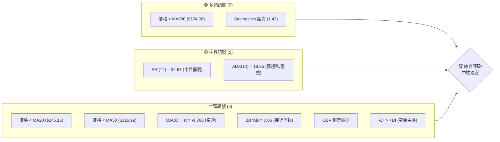

### 📊 核心指標速覽表

| 指標類別 | 指標名稱 | 當前數值 | 訊號 | 解讀 |
|----------|----------|----------|------|------|
| **價格** | 當前價格 | $195.19 | 🔴 | 位於短期與中期均線下方，顯示短期承壓 |
| **均線** | MA20 | $245.15 | 🔴 | 價格遠低於短期均線，空頭排列 |
| **均線** | MA50 | $216.99 | 🔴 | 價格遠低於中期均線，空頭排列 |
| **均線** | MA200 | $134.06 | 🟢 | 價格仍高於長期均線，長期趨勢向上 |
| **動能** | RSI(14) | 32.91 | 🟡 | 接近超賣區間 (30)，有技術性反彈可能 |
| **動能** | MACD | -9.766 | 🔴 | MACD 線在訊號線下方，柱狀圖為負，空頭動能強勁 |
| **波動** | ATR(14) | $28.51 | 🟡 | 波動性較高 (14.61% of price)，交易風險較大 |

### 🏆 技術評分卡

NBIS 的技術評分卡顯示當前市場情緒偏向謹慎，短期內空頭力量佔優。雖然長期均線仍提供一定支撐，且部分動能指標接近超賣，但趨勢強度不足、動能指標疲弱以及量價配合不佳，使得整體評級偏向中性偏空。

```
技術評分卡 — NBIS (2026-07-08)
════════════════════════════════════════════════════
趨勢強度      ████████░░░░░░░░░░░░  40/100  🔴 (ADX弱趨勢，空頭DI主導)
動能指標      ██████░░░░░░░░░░░░░░  30/100  🔴 (MACD空頭，RSI中性偏弱，Stoch超賣)
支撐穩定度    ████████████░░░░░░░░  60/100  🟡 (接近S1及斐波那契38.2%，下方有強支撐)
成交量配合    ██████░░░░░░░░░░░░░░  30/100  🔴 (OBV疲弱，量能未支持價格)
形態完整度    ████████░░░░░░░░░░░░  40/100  🔴 (缺乏明確多頭形態，短期呈下降趨勢)
均線排列      ██████████░░░░░░░░░░  50/100  🟡 (長期多頭排列，但價格跌破短中期均線)
════════════════════════════════════════════════════
綜合評分      ████████░░░░░░░░░░░░  42/100  中性偏空
════════════════════════════════════════════════════
```

---

## 2. 趨勢分析

### 🌐 多時框趨勢分析

NBIS 的多時框架趨勢分析揭示了一個從長期強勁上升到短期快速修正的轉變過程。月線圖顯示長期處於上升通道，但週線和日線圖則反映出近期市場情緒的急劇惡化，導致價格從高點顯著回落。

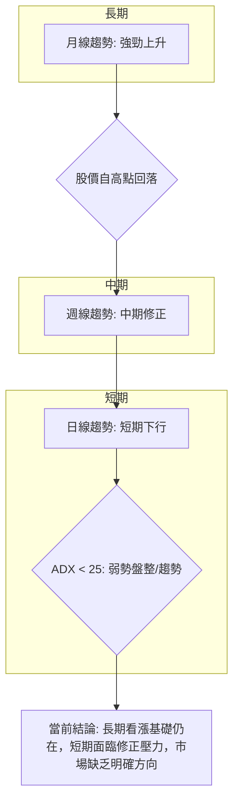

### 📈 長期趨勢 — 12個月走勢圖（Unicode）

NBIS 在過去一年中經歷了顯著的價格增長，從 2025 年 7 月的 $54.43 上漲至 2026 年 6 月的最高點 $276.17，漲幅高達約 408%。然而，自 2026 年 6 月達到頂峰後，價格在 7 月份出現了大幅回落，顯示出強勁的獲利了結壓力。儘管近期回調，但整體而言，過去一年的趨勢仍是明顯的上升趨勢。

```
NBIS 月線走勢圖（過去12個月）
價格軸 ($)
$300 ┤                                  ●(276.17)
$250 ┤                                  ║
$200 ┤                                  ║    ●(195.19)
$150 ┤                        ●(157.14) ║
$100 ┤            ●(112.27)             ║
$ 50 ┤●(54.43)━━━━━━━━━━━━━━━━━━━━━━━━━━━●←現在
     └────────────────────────────────────
      25-07 25-08 25-09 25-10 25-11 25-12 26-01 26-02 26-03 26-04 26-05 26-06 26-07
      (54.43)(68.32)(112.27)(130.82)(94.87)(83.71)(85.19)(91.19)(103.76)(138.23)(231.09)(276.17)(195.19)
```

**走勢特徵分析表格**

| 階段 | 時間區間 | 價格區間 | 漲跌幅 | 走勢特徵 |
|------|----------|----------|--------|----------|
| **強勁上漲** | 2025年7月-2026年6月 | $54.43 - $276.17 | +408% | 股價持續創高，多頭力量強勁，期間雖有回調但未破壞上升趨勢。 |
| **快速回調** | 2026年6月-2026年7月 | $276.17 - $195.19 | -29.3% | 股價從歷史高點迅速回落，顯示強勁的獲利了結壓力與空頭主導。 |
| **當前狀態** | 2026年7月 | $195.19 | - | 處於大幅修正後，接近關鍵支撐位，市場觀望情緒濃厚。 |

### 📊 中期趨勢（週線分析）

從近 20 週的收盤價數據來看，NBIS 在 2026 年 3 月底至 4 月初經歷了一波震盪築底（約 $89 - $117），隨後在 4 月中旬至 6 月初再度啟動強勁漲勢，從 $108.82 上漲至 $231.09，漲幅約 112%。然而，從 6 月初的 $231.09 震盪上攻至 6 月 21 日的 $286.69 高點後，隨即展開了一波急劇的下跌，連續三週收陰，從 $286.69 跌至當前的 $195.19，跌幅達 31.8%。這表明中期趨勢已由上升轉為快速修正，市場情緒轉為悲觀。

**中期壓力與支撐示意圖**

```
NBIS 週線壓力與支撐示意圖
════════════════════════════════════════════════════════
$299.86 ║                     ▲ (52W High)
$278.84 ║███████████████████████████████████████ R2 (中期壓力)
$233.73 ║███████████████████████████████████████ R1 (近期轉強關卡)
$216.99 ║▓▓▓▓▓▓▓▓▓▓▓▓▓▓▓▓▓▓▓▓▓▓▓▓▓▓▓▓▓▓▓▓▓▓▓▓▓▓▓▓▓ MA50
$195.19 ╠════════════════════════════════════════════════ 現價
$188.17 ║▓▓▓▓▓▓▓▓▓▓▓▓▓▓▓▓▓▓▓▓▓▓▓▓▓▓▓▓▓▓▓▓▓▓▓▓▓▓▓▓▓ BB下軌 (短期支撐)
$132.70 ║███████████████████████████████████████ S1 (中期支撐)
$ 94.63 ║███████████████████████████████████████ S2 (強勁支撐)
════════════════════════════════════════════════════════
```

### ⚡ 趨勢強度評估（ADX 解讀）

ADX (Average Directional Index) 是衡量趨勢強度的指標，而非趨勢方向。其數值通常與趨勢強度呈正相關。

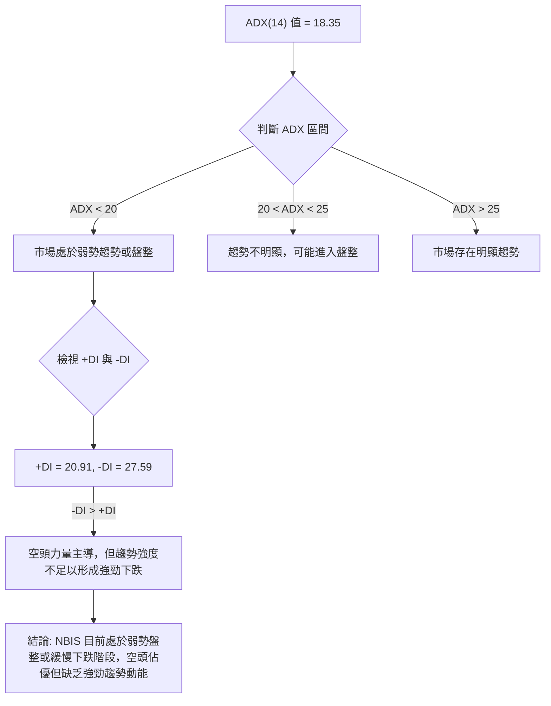

**ADX 強度對照表**

| ADX 數值 | 趨勢強度 | 市場狀態 |
|----------|----------|----------|
| 0-20 | 弱勢趨勢/盤整 | 市場缺乏方向，價格可能在區間內震盪 |
| 20-25 | 趨勢不明顯 | 趨勢可能正在形成或消退，觀望為主 |
| 25-50 | 強勁趨勢 | 存在明顯的上升或下降趨勢 |
| 50-75 | 非常強勁趨勢 | 趨勢非常確定，動能強勁 |
| 75-100 | 極強趨勢 | 極端趨勢，可能接近尾聲 |

NBIS 的 ADX(14) 數值為 18.35，明確指出當前市場處於**弱勢趨勢或盤整狀態**。這意味著雖然價格近期呈現下跌，但下跌的動能並不強勁，市場可能在尋找新的平衡點。同時，+DI (20.91) 低於 -DI (27.59)，表明在當前弱勢中，**空頭力量略佔主導**。因此，預計 NBIS 在短期內將以震盪築底或緩慢尋底為主，而非急劇崩跌。

---

## 3. 圖表形態分析

基於提供的數據，NBIS 在過去一年中經歷了顯著的價格波動，但缺乏足以構成傳統複雜圖表形態（如頭肩頂、雙底等）的清晰結構。最近的走勢顯示價格從高點急劇下跌，形成了一個潛在的下降通道或震盪區間，而非明確的反轉形態。

### 🔍 形態識別系統

當前 NBIS 的價格走勢，特別是從 6 月高點 $276.17 回落至當前 $195.19 的過程，呈現出明顯的**下降趨勢通道**特徵。同時，由於 ADX 顯示趨勢強度不足，價格也可能在一個較寬的**區間震盪**內運行。

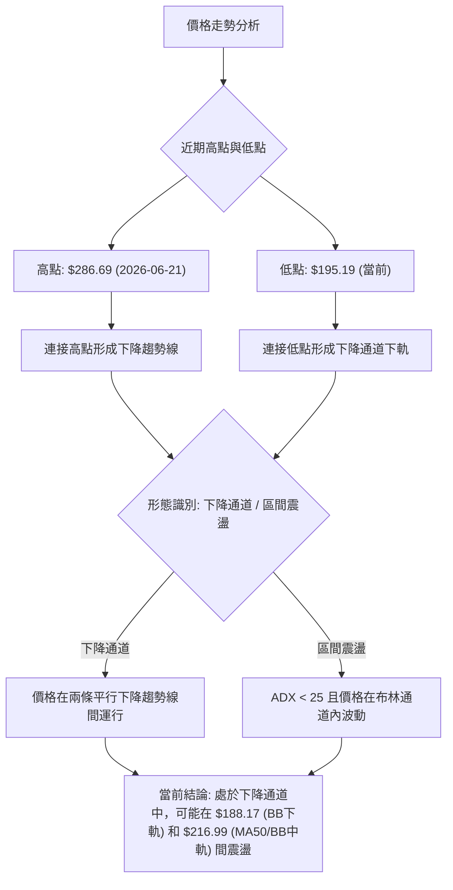

**已識別形態信心度表格**

| 形態 | 信心度 | 判斷依據（引用數據） | 完成度 | 目標價（附計算式） |
|------|--------|----------------------|--------|--------------------|
| **下降通道** | 60% | 價格從 $286.69 連續下跌，形成一系列較低的高點和較低的低點。當前價格 $195.19 接近布林下軌 $188.17，可能為通道下緣。 | 進行中 | **通道下緣目標**：$188.17 (布林下軌)<br>**通道上緣目標**：$216.99 (MA50/布林中軌) |
| **區間震盪** | 55% | ADX(14) 18.35 表明趨勢弱，價格在 $216.99 (MA50) 和 $188.17 (BB下軌) 間波動的可能性較高。 | 進行中 | **區間下緣**：$188.17 (布林下軌)<br>**區間上緣**：$216.99 (MA50/布林中軌) |
| **無明顯反轉形態** | 0% | 數據中未偵測到明確的頭肩頂/底、雙頂/底等反轉或延續形態。 | N/A | 訊號不足，僅做指標型解讀 |

*註：由於缺乏日線級別的 OHLCV 數據，圖表形態的判斷主要基於週線收盤價走勢和關鍵指標，信心度相對保守。*

### 🕯️ 重要K線形態分析

從近 20 週的收盤走勢來看，最近三週的 K 線形態顯示了強烈的看空趨勢。

| 日期 | 收盤價 | K線形態 | 解讀 | 訊號 |
|------|--------|---------|------|------|
| 2026-06-21 | $286.69 | 長上影線或實體大陽線後急跌 | 股價衝高後遭遇強勁賣壓，短期見頂訊號。 | 🔴 |
| 2026-06-28 | $240.30 | 大陰線 | 跌破前期支撐，空頭力量強勁，市場情緒轉差。 | 🔴 |
| 2026-07-05 | $215.62 | 中陰線 | 延續下跌趨勢，但跌勢略有緩和，可能測試下方支撐。 | 🔴 |
| 2026-07-12 | $195.19 | 中陰線 | 繼續下行，接近布林下軌及斐波那契回調位，超賣跡象顯現。 | 🔴 |

### 📉 ASCII 走勢形態示意圖

以下示意圖展示了 NBIS 從近期高點回落，並可能形成下降通道的走勢。

```
NBIS 近期走勢與下降通道示意圖
════════════════════════════════════════════════════════════════════
$300 ┤                                    ●(286.69)
$280 ┤                                   /
$260 ┤                                  /
$240 ┤                                 ●(240.30)
$220 ┤                                /
$200 ┤                             ●(215.62)
$180 ┤                          ●(195.19) ← 現價
$160 ┤                         /
$140 ┤                        /
$120 ┤                       /
$100 ┤                      /
$ 80 ┤                     /
     └───────────────────────────────────────────────────────────────
      (時間軸)
```
*示意圖中，連貫的斜線代表潛在的下降通道趨勢，點位為週線收盤價。*

### 🎯 形態目標價計算

由於目前形態為下降通道或區間震盪，且 ADX 顯示趨勢強度不足，故主要目標價是通道內部的支撐與阻力位。

*   **下降通道/區間下緣目標**：若價格持續下探，首個目標為布林下軌 $188.17。若跌破此處，則斐波那契 50.0% 回調位 $171.87 將成為下一個潛在支撐。
*   **下降通道/區間上緣目標**：若價格從當前位置反彈，首個目標為布林中軌/MA50 $216.99。若能突破並站穩此處，則有望挑戰 R1 $233.73。

目前 NBIS 價格正處於下降通道中，且接近通道下緣，因此短期內下行空間可能有限，但反彈動能也需觀察。

---

## 4. 支撐與阻力

NBIS 的關鍵價位分析顯示，當前股價 $195.19 位於重要的斐波那契回調位之間，且下方有多重支撐位，上方則面臨短期和中期阻力。

### 🗺️ 關鍵價位分布圖（Unicode）

```
NBIS 價位結構分布圖
═══════════════════════════════════════════════════
$299.86 ║████████████████████████║ 強阻力 R3 (52W High)
$278.84 ║████████████████████    ║ 阻力 R2
$239.45 ║▓▓▓▓▓▓▓▓▓▓▓▓▓▓▓▓▓▓▓▓▓▓▓▓║ 斐波那契 23.6%
$233.73 ║████████████████████████║ 關鍵阻力 R1 (近期波段高點聚類)
$216.99 ║▓▓▓▓▓▓▓▓▓▓▓▓▓▓▓▓▓▓▓▓▓▓▓▓║ MA50 / BB中軌
$202.08 ║▓▓▓▓▓▓▓▓▓▓▓▓▓▓▓▓▓▓▓▓▓▓▓▓║ 斐波那契 38.2%
$195.19 ╠════════════════════════╣ ◄ 現價
$188.17 ║▓▓▓▓▓▓▓▓▓▓▓▓▓▓▓▓        ║ 布林下軌 (短期支撐)
$171.87 ║▓▓▓▓▓▓▓▓▓▓▓▓▓▓▓▓▓▓▓▓▓▓▓▓║ 斐波那契 50.0%
$141.67 ║▓▓▓▓▓▓▓▓▓▓▓▓▓▓▓▓▓▓▓▓▓▓▓▓║ 斐波那契 61.8%
$134.06 ║▓▓▓▓▓▓▓▓▓▓▓▓▓▓▓▓▓▓▓▓▓▓▓▓║ MA200 (長期支撐)
$132.70 ║████████████████████████║ 近期支撐 S1 (波段低點聚類)
$ 98.67 ║▓▓▓▓▓▓▓▓▓▓▓▓▓▓▓▓▓▓▓▓▓▓▓▓║ 斐波那契 78.6%
$ 94.63 ║████████████████████████║ 強支撐 S2
$ 89.65 ║████████████████████████║ 強支撐 S3
$ 43.89 ║████████████████████████║ 52W Low
═══════════════════════════════════════════════════
```

### 🚧 阻力位分析表

NBIS 目前面臨多重阻力，尤其是在短期回調後，前期高點和移動平均線形成了顯著的賣壓區。

| 阻力級別 | 價位 | 形成原因 | 突破難度 | 重要性 |
|----------|------|----------|----------|--------|
| **R1 (關鍵短期阻力)** | $233.73 | 近一年波段高點聚類，也是從高點回落後首個重要反彈目標。 | 中等 | 🟢 突破此處可視為短期止跌轉強訊號。 |
| **R2 (中期阻力)** | $278.84 | 接近 52 週高點，是強勁的心理和技術阻力。 | 高 | 🟡 突破此處需極大買盤動能，預示中期趨勢可能反轉向上。 |
| **R3 (強勁阻力)** | $299.86 | 52 週高點，代表過去一年市場的最高共識價格。 | 極高 | 🔴 突破此處將開啟新一輪上漲空間，但難度極大。 |
| **MA50 (動態阻力)** | $216.99 | 中期移動平均線，當前價格位於其下方，形成短期反彈阻力。 | 中等 | 🟡 站穩此線對恢復中期漲勢至關重要。 |
| **MA20 (動態阻力)** | $245.15 | 短期移動平均線，目前位於 R1 上方，形成更強的短期壓力。 | 中等 | 🟡 突破此線可確認短期上漲動能。 |
| **斐波那契 38.2%** | $202.08 | 從 52 週高低點計算的回調位，現價上方第一道斐波那契阻力。 | 中等 | 🟡 突破此處有助於確認短期反彈。 |
| **斐波那契 23.6%** | $239.45 | 從 52 週高低點計算的回調位，位於 R1 附近，增強阻力強度。 | 中等 | 🟡 若反彈至此，可能面臨較大賣壓。 |

### 🛡️ 支撐位分析表

NBIS 雖然短期承壓，但下方仍有堅實的支撐基礎，尤其在斐波那契回調位和長期均線附近。

| 支撐級別 | 價位 | 形成原因 | 守住機率 | 重要性 |
|----------|------|----------|----------|--------|
| **S1 (關鍵短期支撐)** | $132.70 | 近一年波段低點聚類，也是長期上漲趨勢中的重要回調支撐。 | 中等偏高 | 🟢 守住此處可避免中期趨勢轉弱。 |
| **S2 (中期支撐)** | $94.63 | 歷史重要交易密集區，提供較強的心理和技術支撐。 | 高 | 🟢 若跌破 S1，此處將是重要的防線。 |
| **S3 (強勁支撐)** | $89.65 | 歷史低點附近，通常是極強的買盤介入區。 | 極高 | 🟢 跌破此處將預示長期趨勢可能逆轉。 |
| **布林下軌 (動態支撐)** | $188.17 | 當前價格接近布林通道下軌，可能提供短期買盤支撐。 | 中等 | 🟡 反彈機率高，但若跌破則可能加速下跌。 |
| **MA200 (長期支撐)** | $134.06 | 長期移動平均線，通常是長期投資者買入的參考點。 | 高 | 🟢 趨勢的牛熊分界線，守住此線則長期趨勢不變。 |
| **斐波那契 50.0%** | $171.87 | 從 52 週高低點計算的黃金回調位，重要心理支撐。 | 中等偏高 | 🟢 若跌破布林下軌，此處為下一重要支撐。 |
| **斐波那契 61.8%** | $141.67 | 從 52 週高低點計算的黃金回調位，位於 MA200 上方，雙重支撐。 | 高 | 🟢 具有較強的技術意義。 |

### 📐 斐波那契回調位分析

NBIS 的 52 週區間為 $43.89 (低點) 至 $299.86 (高點)。當前價格 $195.19 正位於斐波那契 38.2% 回調位 $202.08 和 50.0% 回調位 $171.87 之間。

*   **斐波那契 38.2% ($202.08)**：這是從高點回落後，第一個較弱的支撐位。目前價格已跌破此位，並在其下方運行，顯示空頭力量較強。此位已轉為短期阻力。
*   **斐波那契 50.0% ($171.87)**：這是重要的心理和技術支撐位，代表價格回調了一半。如果 $188.17 (布林下軌) 無法守住，價格很可能下探 $171.87。
*   **斐波那契 61.8% ($141.67)**：這被視為「黃金分割點」，通常是強勁的支撐位。它也接近長期 MA200 ($134.06) 和 S1 ($132.70)，形成一個強大的支撐區間。若價格跌至此處，預計將有較強的買盤介入。

**結論**：當前價格 $195.19 跌破了斐波那契 38.2% 回調位，表明短期弱勢。下方 $188.17 (布林下軌) 是最近的動態支撐，若跌破，則 $171.87 (斐波那契 50.0%) 將是下一個重要的考驗。長期來看，$141.67 (斐波那契 61.8%) 與 MA200 和 S1 形成的區間是重要的多頭防線。

---

## 5. 技術指標深度解讀

NBIS 的技術指標呈現出短期看空、長期觀望的複雜局面。各種指標的綜合分析對於理解當前市場動態至關重要。

### 🎛️ 指標訊號總覽

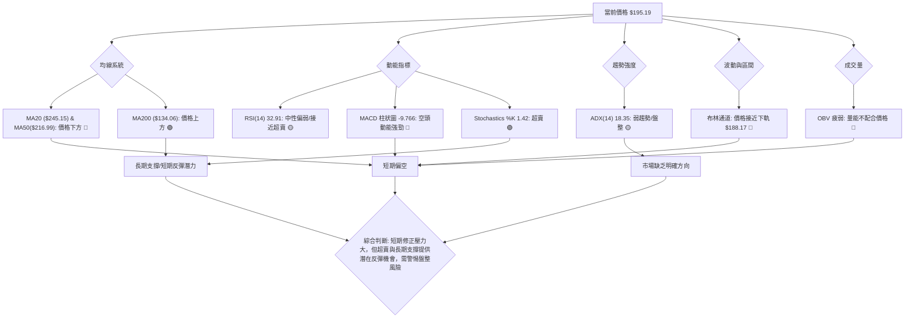

### 📈 移動平均線排列分析

NBIS 的移動平均線（MA）系統顯示出長短期趨勢的矛盾。

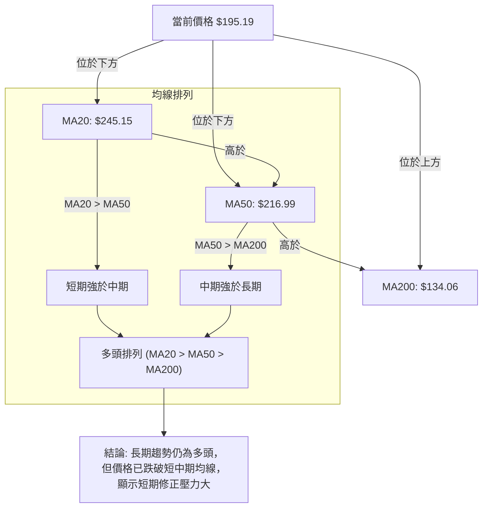

**當前均線排列狀態**

| 均線 | 數值 | 與現價關係 | 趨勢訊號 | 解讀 |
|------|------|------------|----------|------|
| MA5 | $225.84 | 價格下方 | 🔴 | 短期急速下跌，價格遠低於極短期均線。 |
| MA10 | $242.22 | 價格下方 | 🔴 | 價格已跌破短期均線，空頭動能強勁。 |
| MA20 | $245.15 | 價格下方 | 🔴 | 價格在 MA20 下方運行，短期趨勢偏空。 |
| MA50 | $216.99 | 價格下方 | 🔴 | 價格在 MA50 下方運行，中期趨勢偏空。 |
| MA60 | $207.15 | 價格下方 | 🔴 | 價格在 MA60 下方運行，中期趨勢偏空。 |
| MA120 | $154.48 | 價格上方 | 🟢 | 價格在 MA120 上方，長期趨勢仍維持多頭。 |
| MA240 | $123.11 | 價格上方 | 🟢 | 價格在 MA240 上方，長期趨勢仍維持多頭。 |

儘管數據顯示 MA20 ($245.15) > MA50 ($216.99) > MA200 ($134.06)，理論上構成「多頭排列」，這表明**長期趨勢基礎依然強勁**。然而，當前價格 $195.19 已經跌破了 MA20、MA50 和 MA60，這是一個**明確的短期和中期看空訊號**。這意味著在強勁的長期牛市背景下，NBIS 正在經歷一次深度的修正。價格若要恢復上升趨勢，必須首先收復 MA50 和 MA20。

### 📉 RSI(14) 分析

RSI (Relative Strength Index) 衡量股價變動的速度與幅度，以判斷超買或超賣狀態。

*   **RSI 數值進度條展示**：
    RSI(14): 32.91 ▓▓▓▓▓▓▓▓░░░░░░░░░░░░░░░░ (接近超賣區)

*   **超買超賣區間分析**：
    *   RSI 數值為 32.91，位於 30-70 的中性區間內，但非常接近 30 的超賣區域。這表示股價近期下跌速度較快，賣壓沉重，但同時也暗示股價可能已經超跌，存在技術性反彈的潛力。
    *   通常，RSI 低於 30 被視為超賣，高於 70 被視為超買。NBIS 的 RSI 接近超賣，但尚未進入超賣區，這使得其反彈的確定性略低，但風險報酬比可能較優。

*   **背離判斷**：
    *   數據中明確指出「RSI 背離: 無明顯背離」。這意味著在當前的下跌過程中，RSI 並沒有出現與價格走勢相反的背離現象（例如價格創新低但 RSI 不創新低，或價格創新高但 RSI 不創新高）。因此，RSI 走勢與價格下跌保持一致，確認了當前的下跌動能。

### 📊 MACD(12/26/9) 訊號解讀

MACD (Moving Average Convergence Divergence) 用於識別趨勢的變化、方向、動量和持續時間。

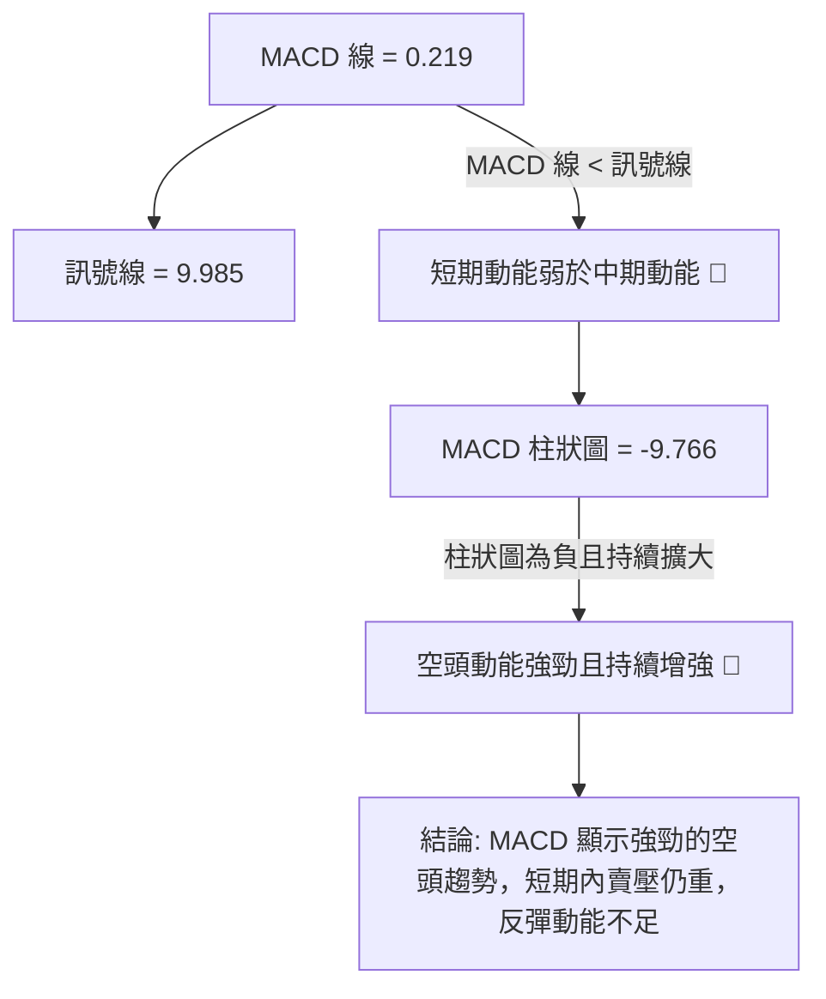

*   **MACD 線 (0.219)**：當前 MACD 線數值為正，但非常小，表明長期動能仍有餘溫，但短期已大幅減弱。
*   **MACD Signal 線 (9.985)**：訊號線數值較高。
*   **MACD 柱狀圖 (-9.766)**：柱狀圖為負值，且從週線數據觀察（從 -6.630 到 -9.766），負值持續擴大，這是一個**強烈的空頭訊號**，表明下跌動能正在增強，賣盤勢頭強勁。
*   **MACD 金叉/死叉**：MACD 線 (0.219) 已經下穿訊號線 (9.985)，形成**死叉**，且柱狀圖持續為負，進一步確認了短期和中期趨勢的看跌信號。
*   **背離判斷**：數據中未明確指出 MACD 背離。在當前價格快速下跌的背景下，MACD 柱狀圖負值擴大，顯示動能與價格走勢一致，並無明顯背離現象。

### 📦 布林通道分析

布林通道 (Bollinger Bands) 用於衡量價格的波動區間和相對高低。

```
NBIS 布林通道示意圖
════════════════════════════════════════════════════════════════════
$302.13 ║████████████████████████████████████████████████████████████████ 上軌
$245.15 ║▓▓▓▓▓▓▓▓▓▓▓▓▓▓▓▓▓▓▓▓▓▓▓▓▓▓▓▓▓▓▓▓▓▓▓▓▓▓▓▓▓▓▓▓▓▓▓▓▓▓▓▓▓▓▓▓▓▓▓▓▓▓▓▓ 中軌 (MA20)
$195.19 ╠════════════════════════════════════════════════════════════════ 現價
$188.17 ║████████████████████████████████████████████████████████████████ 下軌
════════════════════════════════════════════════════════════════════
```

*   **BB上軌**：$302.13
*   **BB中軌 (MA20)**：$245.15
*   **BB下軌**：$188.17
*   **BB %B**：0.06 (0=下軌, 0.5=中軌, 1=上軌)

當前價格 $195.19 位於布林通道中軌 $245.15 和下軌 $188.17 之間，且**非常接近下軌**。BB %B 數值為 0.06，表明價格已觸及或接近布林通道下緣。
這通常有兩種解讀：
1.  **超賣反彈潛力**：價格接近或跌破下軌，可能表示短期超賣，有技術性反彈的需求。
2.  **趨勢延續確認**：在強勁的下跌趨勢中，價格沿著下軌運行，表明趨勢可能延續。
結合 ADX (18.35) 顯示弱趨勢/盤整，此情況更傾向於**短期超賣後的反彈或在下軌附近尋求支撐**，而非強勁的趨勢延續。然而，中軌 $245.15 將是反彈的首要阻力。

### 💹 成交量分析（量價配合度）

成交量是確認價格走勢的關鍵指標。

*   **最新成交量**：17,018,300 股
*   **20日均量**：18,342,580 股 (量比: 0.93x)
*   **50日均量**：18,135,136 股

當前成交量 (17.02M) 低於 20 日均量 (18.34M) 和 50 日均量 (18.14M)，量比為 0.93x，顯示**近期成交量萎縮**。
在價格持續下跌的背景下，成交量萎縮通常被視為以下幾種情況：
1.  **下跌動能減弱**：如果價格下跌但成交量縮小，可能表明賣壓正在減輕，市場可能接近底部。
2.  **市場觀望**：在缺乏明確趨勢的情況下，投資者選擇觀望，導致交易活動減少。
3.  **缺乏買盤支持**：儘管賣壓可能減輕，但如果沒有足夠的買盤介入，價格也很難止跌回升。

*   **OBV趨勢**：數據顯示「OBV < MA → 量能疲弱」。這是一個**看空訊號**。OBV (On-Balance Volume) 是一種累積性指標，當收盤價上漲時，成交量被加到前一天的 OBV 上；當收盤價下跌時，成交量從前一天的 OBV 中減去。OBV 趨勢低於其移動平均線，表明在下跌過程中，買入的成交量不足以抵消賣出的成交量，或者在反彈時缺乏買盤跟進，這確認了當前市場的疲弱。

**量價配合度結論**：當前價格下跌伴隨成交量萎縮和 OBV 疲弱，表明市場缺乏積極的買盤支持，儘管賣壓可能有所減輕，但短期內股價要反彈向上仍面臨挑戰。

---

## 6. 動能與波動率

### ⚡ 動能評估四象限

NBIS 目前的動能評估顯示其處於弱勢動能和高波動率的組合，這通常代表高風險的交易環境。

| 象限 | 動能 | 波動 | 當前狀態 | 評估 |
|------|------|------|----------|------|
| Q1 | 強 | 低 | - | 最佳機會 (趨勢明確，風險可控) |
| Q2 | 弱 | 低 | - | 謹慎觀望 (缺乏機會，風險較小) |
| Q3 | 強 | 高 | - | 高風險高收益 (趨勢明確，但波動劇烈) |
| Q4 | 弱 | 高 | ✓ | 避免進場/謹慎操作 (缺乏方向，波動劇烈，風險高) |

**當前 NBIS 狀態評估**：
*   **動能**：MACD 柱狀圖為負且持續擴大 (-9.766)，RSI 接近超賣 (32.91)，OBV 疲弱。這些都指向**弱勢動能**，甚至空頭動能強勁。
*   **波動**：ATR(14) 為 $28.51，佔當前價格 $195.19 的 14.61%。這是一個**高波動**的數值，表示股價每日振幅較大。Beta 值 1.402 也確認了其高於市場的波動性。

**結論**：NBIS 目前處於**Q4 (弱動能，高波動)** 象限。這表明市場缺乏明確的方向，但價格波動劇烈，交易風險較高。在這種環境下，應採取謹慎的觀望或區間操作策略，避免追漲殺跌，並嚴格控制倉位和止損。

### 📊 ATR 波動率分析

ATR (Average True Range) 是衡量資產波動性的指標，通常用於設定止損點。

*   **ATR(14)**：$28.51
*   **佔股價百分比**：14.61% ($28.51 / $195.19)

**分析**：
ATR 數值 $28.51 相當於當前股價的 14.61%，這是一個相對較高的波動率。高波動性意味著 NBIS 的股價在短期內可能出現大幅波動，這既提供了潛在的快速獲利機會，也伴隨著更高的風險。

**止損距離建議**：
在波動率較高的股票中，止損點應根據 ATR 進行調整，以避免因正常波動而被過早止損。
*   **保守止損**：設定為 1.5 倍 ATR，即 $28.51 × 1.5 = $42.765。從當前價格 $195.19 計算，止損點約為 $195.19 - $42.765 = $152.425。
*   **激進止損**：設定為 1 倍 ATR，即 $28.51。從當前價格 $195.19 計算，止損點約為 $195.19 - $28.51 = $166.68。

考慮到當前價格接近布林下軌和斐波那契支撐，止損點的設置需要結合這些關鍵價位。例如，可以將止損點設置在 $171.87 (斐波那契 50.0%) 或 $188.17 (布林下軌) 下方一個 ATR 範圍內，以提供足夠的緩衝。

### 📐 Beta 與市場相關性

*   **Beta**：1.402

**分析**：
Beta 值衡量股票相對於整體市場（通常是 S&P 500 指數）的波動性。NBIS 的 Beta 值為 1.402，這表示：
*   **高於市場的波動性**：當市場上漲 1% 時，NBIS 平均上漲 1.402%；當市場下跌 1% 時，NBIS 平均下跌 1.402%。這與 ATR 顯示的高波動性相互印證。
*   **成長型股票特徵**：通常，高 Beta 值與成長型股票相關，因為它們對市場情緒和經濟前景的變化更為敏感。NBIS 屬於 Communication Services 產業，其業務性質（AI 基礎設施、教育科技）也符合成長型公司的特徵。

**投資意義**：
投資 NBIS 意味著需要承受高於市場平均水平的波動風險。在牛市中，它可能帶來更高的收益；但在熊市或市場修正時，其跌幅也可能更大。投資者在配置 NBIS 時，應考慮其對整體投資組合波動性的影響，並採取適當的風險管理措施。

---

## 7. 多時框架總結

綜合各時框架的分析，NBIS 目前處於一個複雜的轉折點。長期趨勢仍由 MA200 支撐，但中短期已陷入深度修正和盤整。ADX 的低讀數是收斂結論的關鍵。

### 📋 時框架評分表

| 時框架 | 趨勢方向 | 動能 | 均線排列 | 形態 | 綜合評分 | 建議 |
|--------|----------|------|----------|------|----------|------|
| **月線** | 🟢 強勁上升 | 🟡 修正中 | 🟢 多頭排列 | 🟡 回調 | 7/10 | 長期持有者觀望，等待止跌 |
| **週線** | 🔴 快速下跌 | 🔴 強勁空頭 | 🔴 短中期空頭 | 🔴 下降通道 | 3/10 | 避免追空，關注關鍵支撐 |
| **日線** | 🔴 短期下行 | 🔴 強勁空頭 | 🔴 短期空頭 | 🟡 接近布林下軌 | 4/10 | 關注超賣反彈，但反彈可能受阻 |
| **綜合** | 🟡 修正盤整 | 🔴 弱勢空頭 | 🟡 長期多頭，短中期空頭 | 🟡 下降通道/區間 | 4.5/10 | 區間操作為主，等待明確訊號 |

### 🔲 綜合訊號矩陣

NBIS 的多時框架分析顯示，長期趨勢與中短期趨勢存在顯著矛盾。長期而言，股價仍位於 MA200 上方，暗示大趨勢未變。然而，中短期內，股價已跌破所有短期和中期均線，MACD 顯示強勁空頭動能，RSI 接近超賣，且 ADX 表明市場處於弱勢盤整。

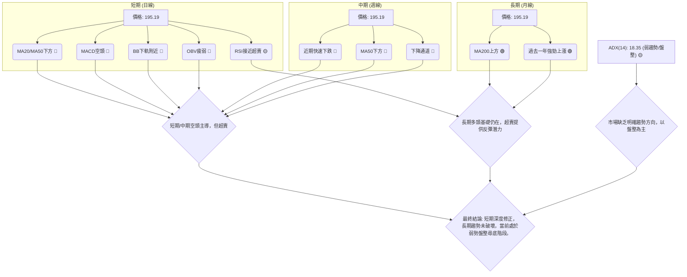

### ⚖️ 多時框收斂結論

根據「嚴格要求 14」的多時框收斂規則：

1.  **判斷趨勢行情或盤整行情**：ADX(14) 數值為 18.35，此數值**低於 25**，明確指示 NBIS 當前處於**盤整行情 (Range-bound market)** 或弱勢趨勢。

2.  **主導時框與策略**：在盤整行情下，應以**日線布林通道上下軌為主要交易區間**。這意味著短期內，股價可能在布林通道下軌 $188.17 附近尋求支撐並嘗試反彈，而布林通道中軌 $245.15 或 MA50 $216.99 將是重要的反彈阻力。

3.  **方向性結論**：儘管長期 MA200 仍位於價格下方提供支撐，但短中期指標（MACD、MA20/50、OBV）均呈現空頭訊號，且價格已跌破斐波那契 38.2% 回調位。然而，RSI 和 Stochastics 接近超賣，且價格接近布林下軌，這暗示短期內存在技術性反彈的可能性。

    **最終收斂結論**：NBIS 當前處於**中性偏空**的弱勢盤整階段。雖然長期上升趨勢的基礎未被破壞，但短期內強勁的賣壓和疲弱的動能使得股價難以迅速反轉。當前價格接近布林通道下軌，可能提供短期支撐，並引發技術性反彈，但反彈空間預計有限，且上方阻力重重。主要策略應為**區間操作，並密切關注支撐位的有效性，警惕下行風險**。

---

## 8. 交易策略建議

基於 NBIS 的多時框架分析和技術評分卡（綜合評分 42/100，中性偏空），當前市場處於弱勢盤整。因此，主要交易策略應側重於區間操作，並在關鍵支撐位附近尋找短期反彈機會，同時警惕阻力位的賣壓。

### 🗺️ 策略決策流程圖

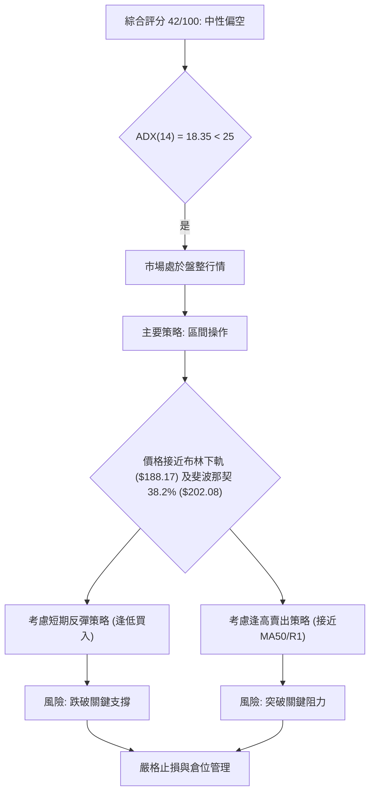

### 🧭 策略路由

**當前主策略方向 = 區間操作 / 短線反彈（依評分 42/100）**

NBIS 的綜合評分落在 40-60 的中性區間，且 ADX 指示盤整行情。因此，不推薦單邊重倉操作。主要策略應為在支撐位附近尋求短線反彈機會，並在阻力位附近獲利了結或建立空頭頭寸。空頭策略作為反轉風險觸發點和對沖提示。

### 🎯 價格情境階梯（Price Scenarios）

| 觸發條件 | 下一目標 | 後續延伸 | 情境含義 |
|----------|----------|----------|----------|
| **突破 R1 $233.73** | R2 $278.84 | R3 $299.86 | 短線轉強，有望收復中期跌幅，但需量能配合。 |
| **站穩現價區間** | — | — | 在 $188.17 (布林下軌) 至 $216.99 (MA50/中軌) 之間震盪。 |
| **跌破 S1 $132.70** | S2 $94.63 | S3 $89.65 | 中期轉弱，可能下探長期支撐，牛市結構受損。 |
| **跌破布林下軌 $188.17** | 斐波那契 50.0% $171.87 | S1 $132.70 | 短期加速下跌，考驗更深層次支撐。 |

### 📊 情境機率分佈

| 情境 | 機率 | 主要依據 |
|------|------|----------|
| 繼續上行 / 反彈 | 35% | RSI 接近超賣 (32.91)，Stochastics 超賣 (1.42)，價格接近布林下軌 ($188.17)，長期 MA200 仍提供支撐。 |
| 區間震盪 | 50% | ADX (18.35) 顯示弱趨勢/盤整，價格位於關鍵斐波那契區間 ($202.08 - $171.87) 內，上方阻力與下方支撐明確。 |
| 回落 / 再探底 | 15% | MACD 柱狀圖為負且擴大 (-9.766)，OBV 疲弱，空頭動能仍強，若 $188.17 支撐失效。 |

*註：當前價格 $195.19 位於斐波那契 38.2% ($202.08) 和 50.0% ($171.87) 之間，且接近布林下軌 ($188.17)。*

### 🟢 主策略詳情（區間操作 / 短線反彈）

鑑於當前 NBIS 處於弱勢盤整且有超賣跡象，以下提供兩個短線區間操作策略。

| 策略要素 | 策略 A：短線觸底反彈 (Buy the Dip) | 策略 B：逢高做空 (Sell the Rally) |
|----------|------------------------------------|------------------------------------|
| 進場條件 | 價格在 $188.17 (布林下軌) 附近企穩，出現止跌 K 線形態 (如錘子線)。 | 價格反彈至 $216.99 (MA50/BB中軌) 附近受阻，出現看跌 K 線形態 (如射擊之星)。 |
| 進場價格 | $189.00 - $190.00 區間 | $215.00 - $217.00 區間 |
| 目標價 T1 | $216.99 (MA50/BB中軌) | $195.19 (當前價格/近期支撐) |
| 目標價 T2 | $233.73 (R1) | $188.17 (BB下軌) |
| 止損價格 | $180.00 (略低於 BB下軌及斐波那契 50% $171.87) | $225.00 (略高於 MA50/BB中軌) |
| 風險報酬比 | T1: 1:2.8 (($216.99-$189)/($189-$180))<br>T2: 1:4.9 (($233.73-$189)/($189-$180)) | T1: 1:2.4 (($215-$195.19)/($225-$215))<br>T2: 1:2.7 (($215-$188.17)/($225-$215)) |
| 成功機率 | 45% (基於超賣和支撐) | 40% (基於阻力與空頭動能) |
| 建議倉位 | 輕倉 (不超過總資金 5-10%) | 輕倉 (不超過總資金 5-10%) |

### 🔴 反向風險觸發點（對沖提示）

以下情況可能推翻上述區間操作策略，提示風險：

*   **多頭策略失效**：
    *   價格有效跌破 $188.17 (布林下軌) 並持續下行，下一個重要支撐為 $171.87 (斐波那契 50.0%)。
    *   MACD 柱狀圖負值持續擴大，且 OBV 繼續疲弱，表明賣壓未減。
*   **空頭策略失效**：
    *   價格有效突破 $216.99 (MA50/BB中軌) 並站穩，且伴隨成交量放大。
    *   RSI 迅速回升至 50 以上，MACD 形成金叉，表明多頭動能恢復。

### ⭐ 整體訊號強度評星

```
做多訊號強度：★★☆☆☆  (2/5星) (短期超賣有反彈潛力，但動能不足，上方阻力大)
做空訊號強度：★★★☆☆  (3/5星) (MACD空頭，OBV疲弱，價格跌破短中期均線，但ADX弱勢)
整體可信度：  ★★★☆☆  (3/5星) (市場處於盤整，區間操作風險較高，需嚴格止損)
```

---

## 9. 風險提示與監控

NBIS 當前處於關鍵的修正與盤整階段，投資者應高度警惕潛在風險，並實施嚴格的風險管理措施。

### ✅ 關鍵監控指標 Checklist

以下是交易 NBIS 時應密切關注的關鍵技術指標和價位清單：

```
╔══════════════════════════════════════════════════════════════╗
║              NBIS 關鍵監控指標清單                           ║
╠══════════════════════════════════════════════════════════════╣
║ [ ] 價格是否跌破布林下軌 ($188.17)？                           ║
║ [ ] 價格是否突破 MA50 ($216.99) 並站穩？                       ║
║ [ ] RSI(14) 是否跌破 30 (超賣區) 或反彈至 50 以上？            ║
║ [ ] MACD 柱狀圖負值是否持續擴大，或開始收縮轉正？             ║
║ [ ] OBV 趨勢是否開始反轉向上，配合價格上漲？                   ║
║ [ ] ADX(14) 是否突破 25，指示趨勢形成？                        ║
║ [ ] 成交量在下跌/上漲時是否配合，量價是否背離？               ║
║ [ ] 關鍵支撐位 ($171.87, $132.70) 是否有效守住？               ║
║ [ ] 關鍵阻力位 ($233.73, $278.84) 是否被挑戰或突破？           ║
╚══════════════════════════════════════════════════════════════╝
```

### ⚠️ 風險場景分析

NBIS 的未來走勢存在多種可能性，以下為三種主要情境分析：

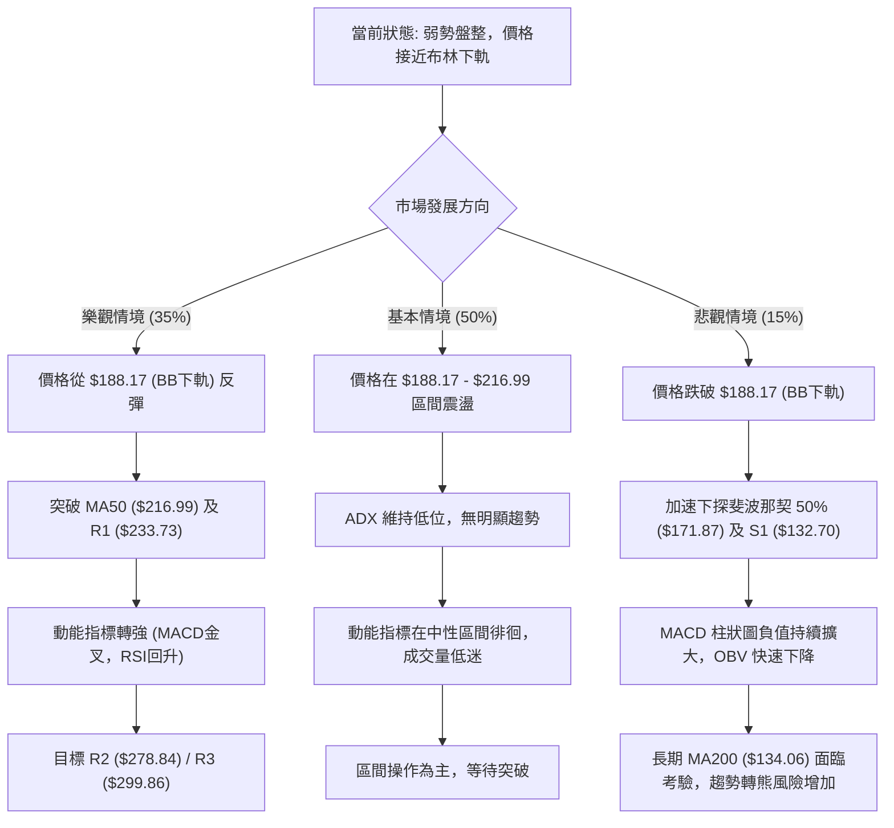

### 🛡️ 風險管理重要提醒

1.  **嚴格止損**：鑑於 NBIS 的高 Beta (1.402) 和高 ATR ($28.51)，股價波動劇烈。無論採用何種策略，都必須設定明確且嚴格的止損點，並嚴格執行，以限制潛在損失。建議將止損點設置在關鍵支撐位下方，並根據 ATR 調整。
2.  **倉位控制**：在盤整市場和弱勢動能下，應避免重倉，建議採用輕倉策略（不超過總資金的 5%-10%），為市場的不可預測性留下足夠的緩衝空間。
3.  **分批建倉/平倉**：考慮到價格可能在區間內波動，分批建倉或平倉可以有效降低單次交易的風險，並優化平均成本。
4.  **等待確認**：在趨勢不明確時，耐心等待明確的突破或反轉訊號出現，例如價格有效突破關鍵阻力並伴隨成交量放大，或在關鍵支撐位形成明確的底部形態。避免在模糊地帶盲目進場。
5.  **關注基本面**：雖然本報告為技術分析，但在深度修正階段，公司基本面（如營收成長、盈利能力、產業前景）的變化將對股價產生長遠影響。定期關注基本面新聞和財報，以避免技術面分析的局限性。
6.  **市場情緒**：NBIS 屬於科技成長股，對市場情緒敏感。宏觀經濟環境、利率政策、產業政策等都可能影響其股價走勢。

---

## 📋 報告總結

```
NBIS 技術分析報告總結
════════════════════════════════════════════════════════
報告日期：2026-07-08
當前價格：$195.19
分析評級：⚖️ 中性偏空 (綜合評分 42/100，ADX指示盤整，短中期空頭主導)

關鍵結論：
├─ 長期趨勢：🟢 仍維持多頭排列，MA200 提供堅實支撐。
├─ 中期趨勢：🔴 處於快速修正中，價格跌破 MA50，形成下降通道。
├─ 短期趨勢：🔴 呈現下行趨勢，MACD 強勁空頭，RSI 接近超賣，價格接近布林下軌。
├─ 關鍵支撐：$188.17 (布林下軌)、$171.87 (斐波那契 50.0%)、$132.70 (S1)。
├─ 關鍵阻力：$202.08 (斐波那契 38.2%)、$216.99 (MA50/BB中軌)、$233.73 (R1)。
└─ 分析師目標：短期內無明確單邊目標，主要在 $188.17 - $216.99 區間震盪。

最優策略組合：
1. 🥇 最佳機會：**短線觸底反彈**。在 $189.00 - $190.00 區間尋找進場機會，止損 $180.00，目標 $216.99 / $233.73。
2. 🥈 次選機會：**逢高做空**。若反彈至 $215.00 - $217.00 區間受阻，可考慮輕倉做空，止損 $225.00，目標 $195.19 / $188.17。
3. 🥉 保守選擇：**觀望等待**。等待價格突破 $233.73 (R1) 或跌破 $188.17 (BB下軌) 並確認方向後再進場。
════════════════════════════════════════════════════════
```

---

> ⚠️ **免責聲明**：本報告為 AI 自動生成之技術分析，所有數據及估算均基於提供的歷史價格資訊。本報告**僅供研究與學術參考**，**不構成任何投資建議**。投資有風險，入市需謹慎。

---

*報告生成時間：2026-07-08 ｜ 數據來源：提供數據 ｜ 分析框架：多時框技術分析*