<details>
<summary>📊 靜態圖表 (點擊展開)</summary>
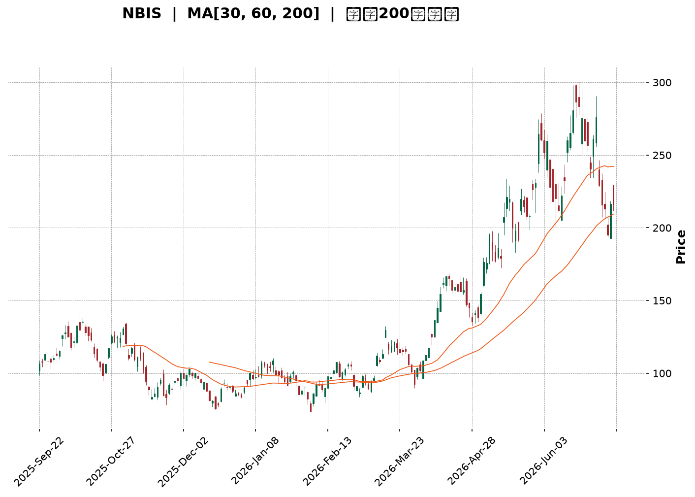
</details>

<html>
<head><meta charset="utf-8" /></head>
<body>
    <div style="height:500px; width:100%;">                        <script>window.PlotlyConfig = {MathJaxConfig: 'local'};</script>
        <script charset="utf-8" src="https://cdn.plot.ly/plotly-3.7.0.min.js" integrity="sha256-jvTGqxNp8AGWEcvNLVuKr+8j5dGe9Yw51LQkmDH+IYA=" crossorigin="anonymous"></script>                <div id="candlestick-chart" class="plotly-graph-div" style="height:100%; width:100%;"></div>            <script>                window.PLOTLYENV=window.PLOTLYENV || {};                                if (document.getElementById("candlestick-chart")) {                    Plotly.newPlot(                        "candlestick-chart",                        [{"close":{"dtype":"f8","bdata":"AAAAYGamWkAAAABAM\u002fNaQAAAAGC4TlxAAAAAACn8WkAAAADAzOxaQAAAAIAUjltAAAAAoEcRXEAAAABACudcQAAAACCud19AAAAAYLj+X0AAAAAAKTxfQAAAAMDMbF1AAAAAAACAXkAAAADgepRgQAAAAGCPMmBAAAAAYLjuYEAAAADAzARgQAAAAMAedV9AAAAAYI\u002fCXkAAAAAAKVxcQAAAAAAAQFtAAAAAgOsRWkAAAAAgrqdYQAAAAIA9ilpAAAAA4KNQXUAAAAAghVtfQAAAAMAedV5AAAAAYGZGX0AAAAAghQtfQAAAAIA9WmBAAAAAgBQeXkAAAABgj6JbQAAAAAAAQF1AAAAAAClcW0AAAACA69FbQAAAAMDMfFtAAAAAgBSOWUAAAABACpdXQAAAAOBRKFZAAAAAYI\u002fiVEAAAABguH5VQAAAAGCPolZAAAAA4HrEV0AAAADA9ShVQAAAAOCj0FRAAAAAoJn5VkAAAADgUThWQAAAAAAprFdAAAAAIK63V0AAAACgmQlZQAAAAMDMHFhAAAAAQOG6WEAAAABAM7NZQAAAAGCPglhAAAAAwB4VWUAAAACAPRpYQAAAAIDCZVdAAAAAgOuRV0AAAAAAKexVQAAAAMD1SFRAAAAAwMw8VEAAAADAzNxSQAAAAIDChVNAAAAAoHBdVkAAAABguE5XQAAAAIDrgVZAAAAA4FHIVkAAAACAwuVVQAAAAGCPglVAAAAAQOFKVUAAAADAHu1UQAAAAMDMfFZAAAAAwB41V0AAAAAgXA9ZQAAAAKBwDVhAAAAAQDNTWEAAAAAghXtYQAAAAMAe1VpAAAAAIIVbWkAAAABguH5ZQAAAAOCj+FlAAAAAYLguW0AAAABgj9JYQAAAACCut1hAAAAAYGY2WEAAAAAAAKBXQAAAAKBw3VZAAAAAIK53WEAAAAAghRtZQAAAAIA9uldAAAAAAClMVUAAAACAPQpWQAAAAMDMfFZAAAAAwPWYVEAAAAAgrndSQAAAAGBmhlVAAAAA4FE4V0AAAABgj\u002fJWQAAAAEAKJ1ZAAAAAYLhuVkAAAADgo4BYQAAAAKBHYVhAAAAAQDNzWUAAAABACudaQAAAAEDhelhAAAAAQAonWUAAAADAHqVZQAAAACCuh1pAAAAA4FE4WkAAAAAAKcxWQAAAAOCjwFZAAAAAQDOzVUAAAACA63FYQAAAAKCZ6VdAAAAAwB5VVkAAAAAAKbxXQAAAACCFG1hAAAAAIK7\u002fW0AAAABgjwJbQAAAAMDMPFxAAAAAQDM7YEAAAADAHhVdQAAAAADXo11AAAAAoEdhXkAAAAAgrmddQAAAAKCZiVxAAAAAgD26XEAAAACAwsVcQAAAAIAUflpAAAAA4Ho0WUAAAADgoxBXQAAAAOCj8FlAAAAAwMx8WUAAAADgejRbQAAAAGCPIlxAAAAAoJlZXUAAAAAAAEBfQAAAAGCPCmFAAAAAQAofYkAAAACA61FjQAAAAIAUPmRAAAAA4KPYZEAAAABA4apkQAAAAOB6pGNAAAAAwB7lY0AAAACgmZFjQAAAAOB6hGNAAAAAYI+iY0AAAADAHmViQAAAAGC4HmJAAAAA4FHwYEAAAACAFKZhQAAAACBcR2FAAAAAIK5PY0AAAACgcA1mQAAAAKBw\u002fWVAAAAAQOFiaEAAAADgoxhnQAAAAKCZIWZAAAAAQDNDZ0AAAAAghWNmQAAAAOCj6GlAAAAAwMyka0AAAACAFH5rQAAAACCF+2hAAAAAIFy3aEAAAACAPfpnQAAAAIDCfWtAAAAA4KPYakAAAACA6wFqQAAAAADXC2pAAAAAQOFKbEAAAABA4eJsQAAAAAApiHBAAAAAoEdJcEAAAACAwnVvQAAAAGC4OnBAAAAAgOt5bEAAAAAAAEBrQAAAAADXg2tAAAAAgBR2akAAAAAgrsdrQAAAACCFC21AAAAAwB5BcEAAAACgmZFwQAAAAGCPjnFAAAAAQArrcUAAAACAwrlxQAAAAAAANHFAAAAAYI86cEAAAACAFApwQAAAAKCZCW5AAAAAYGZScEAAAABguEJxQAAAAIDCpWxAAAAAANfzakAAAADgo6BqQAAAAIAUZmhAAAAAIFwPa0AAAABgZgZrQA=="},"high":{"dtype":"f8","bdata":"AAAAwB4lW0AAAABguH5bQAAAAGBmtlxAAAAAwB6FXEAAAAAgXH9bQAAAAKBHIVxAAAAAoJlpXUAAAADgUfhcQAAAACBcr19AAAAAAFSfYEAAAADgUfhgQAAAAMD1CGBAAAAAANdTX0AAAACAPapgQAAAAEAzo2FAAAAAwPVQYUAAAACAFrlgQAAAACCuf2BAAAAAQApfYEAAAAAArCReQAAAAIAUXl1AAAAAIIULW0AAAABAM\u002fNaQAAAACCup1pAAAAAwMxcXUAAAAAAAKBfQAAAAMD1IGBAAAAAwMx8X0AAAACAFA5gQAAAAMDMhGBAAAAAgMLdYEAAAACA6zFdQAAAAKBwjV1AAAAAAABAXkAAAABAM9NbQAAAACCul11AAAAAANejXEAAAACgmWlaQAAAAGC43lZAAAAAAABAVkAAAACgmWlWQAAAAAApbFdAAAAAgBQuWEAAAAAAKaxZQAAAACBcL1ZAAAAAAABAV0AAAACA69FWQAAAAICT6FdAAAAAwB5FWEAAAABgZmZZQAAAAMDMvFlAAAAAANfDWEAAAACAwvVZQAAAAGBmVllAAAAAAAAgWUAAAAAggzhZQAAAAIDCRVhAAAAAwMzcV0AAAACgmelXQAAAACBcD1ZAAAAAANdjVEAAAABAMxNVQAAAAGBmFlRAAAAAYI+iVkAAAACgmflXQAAAAIAUPldAAAAAQOHaVkAAAAAgrudWQAAAAEAKJ1ZAAAAAoHC9VUAAAACAFJ5VQAAAAOCjsFZAAAAAACncV0AAAAAghStZQAAAAGBmlllAAAAAYI+iWUAAAACAFD5aQAAAACCFK1tAAAAAwMz8WkAAAADAzKxaQAAAAOBRCFtAAAAAAACgW0AAAACAFB5aQAAAAKCZmVlAAAAAYLj+WUAAAADgo7hYQAAAAOBROFlAAAAAYI\u002fiWEAAAABgZnZZQAAAAAAA0FhAAAAAYI8CV0AAAAAAAFBWQAAAAMD12FZAAAAAYI\u002fqVUAAAADgejRUQAAAAIA9qlVAAAAAIIVrV0AAAAAAVONXQAAAAAAAsFdAAAAA4KOwVkAAAADgehRZQAAAAGCP0lhAAAAAoJkZWkAAAABguP5aQAAAAOB6FFtAAAAAoG5KWUAAAAAAAPBZQAAAAAAp3FpAAAAA4HoUW0AAAABAM9NYQAAAAKDE2FZAAAAAIK53VkAAAABguJ5YQAAAAAAA0FhAAAAAwMy8V0AAAADAzMxXQAAAAKCZmVhAAAAAwB6FXEAAAABgj8JbQAAAAOB6JF1AAAAAoJmJYEAAAAAAAGBeQAAAAECJsV5AAAAAQDNzXkAAAAAAVu5eQAAAAADXU15AAAAAQDNzXUAAAABAM7NdQAAAAEAzU1xAAAAA4KOQWkAAAAAgXI9ZQAAAAMD1+FlAAAAAIK73WkAAAACgcD1bQAAAAIDCdVxAAAAAoJl5XUAAAAAAAPBfQAAAAKCZEWFAAAAAgD26YkAAAAAAAPBjQAAAAEAzw2RAAAAAgOvZZEAAAABguBZlQAAAAIDrgWRAAAAAAAA4ZEAAAAAAAGhkQAAAAIDC7WRAAAAAgOu5ZEAAAAAAAKhkQAAAAKCZmWJAAAAAYLiuYUAAAABgZvZhQAAAACBcX2JAAAAAAACAY0AAAADAzGxmQAAAAGC4fmZAAAAAIK5\u002faEAAAADgerxoQAAAAAAAiGdAAAAAgJeOaEAAAAAghTNnQAAAAEDhKmtAAAAAIFw3bUAAAACgR5lsQAAAAIA9QmtAAAAAgOtZaUAAAAAAAIhpQAAAAIDrWWxAAAAAoHC9a0AAAADgUaBrQAAAAOB6NGpAAAAA4HocbUAAAABAMzNtQAAAAKDELHFAAAAAoHBtcUAAAAAgXLdwQAAAACCFh3BAAAAAAABYb0AAAADAzAxuQAAAAMD1tG1AAAAAIK7fbEAAAAAgro9sQAAAAEDhcm5AAAAA4FFucEAAAAAghVVxQAAAAEDhnnJAAAAAwMysckAAAACAwr1yQAAAACCuc3JAAAAAoG5CcUAAAADgUThxQAAAAKCZGW9AAAAAwMx8cEAAAACgmSlyQAAAACCuz25AAAAA4FGobUAAAABACh9sQAAAAOCj8GlAAAAAIK5Pa0AAAADA969sQA=="},"hovertemplate":"\u003cb\u003e%{x|%Y-%m-%d}\u003c\u002fb\u003e\u003cbr\u003e\u958b: $%{open:.2f}\u003cbr\u003e\u9ad8: $%{high:.2f}\u003cbr\u003e\u4f4e: $%{low:.2f}\u003cbr\u003e\u6536: $%{close:.2f}\u003cextra\u003e\u003c\u002fextra\u003e","low":{"dtype":"f8","bdata":"AAAAoEehWEAAAAAAABBaQAAAAGBmNlpAAAAA4FF4WkAAAABAM7NZQAAAAMAeFVtAAAAAgD3qW0AAAADgo3BbQAAAAOB6pF1AAAAAYGbmXkAAAAAghTtfQAAAAIAU7lxAAAAAAABgXUAAAAAgrvddQAAAAOBRAGBAAAAAwMyUYEAAAAAAAHBfQAAAAMDMjF5AAAAAoEeBXkAAAADgUbhbQAAAAOCj4FpAAAAAoJlZWUAAAADgUahXQAAAAKBw3VhAAAAA4KOAW0AAAABACgdeQAAAAIDrMV5AAAAAAABgXUAAAADgo3BdQAAAAEAzk19AAAAAAADwXUAAAAAAAEBbQAAAACCF21tAAAAAgD0aW0AAAADgo1BZQAAAAIAULltAAAAAwB71WEAAAACgcO1WQAAAAAAAIFVAAAAAAACAVEAAAACAwuVUQAAAAKBwbVRAAAAAQDPzVkAAAACgcA1VQAAAAKBwjVNAAAAAoJlJVUAAAADgJC5VQAAAAOCjsFZAAAAAAClcV0AAAADgo0BWQAAAAADXA1hAAAAAAADAVkAAAACAFF5YQAAAAMDMDFhAAAAAQDPTV0AAAABgZgZYQAAAAMDMDFdAAAAAwMysVUAAAADAzIxVQAAAAKAYBFRAAAAA4FE4U0AAAAAAANBSQAAAAOCjQFNAAAAAgD0KVEAAAABgZsZWQAAAAADXE1ZAAAAAoJkpVkAAAAAgXK9VQAAAAGCPElVAAAAAANcjVUAAAACgmblUQAAAAOCjgFVAAAAAwPW4VkAAAAAAKbxWQAAAAADX41dAAAAAIFgBWEAAAABgZkZYQAAAAEAzI1hAAAAAQOH6WUAAAAAgg9hYQAAAAGBmRllAAAAAoHAtWUAAAACAwpVYQAAAAGBmRldAAAAAAAAgWEAAAACA62FXQAAAAEAK11ZAAAAAgOthV0AAAAAAKRxYQAAAAIA9ylZAAAAAIK4HVUAAAACAFA5VQAAAAAAAMFVAAAAAACmcU0AAAACgR2FSQAAAACCuR1NAAAAAANfzVEAAAACAPepWQAAAAMD1yFVAAAAAACnsU0AAAABACjdWQAAAAAAAYFdAAAAAINk2WEAAAAAghRtZQAAAAIDrQVhAAAAAQDPTV0AAAABA329YQAAAAEAzs1lAAAAAAACAWUAAAACgmRlWQAAAAEAzs1VAAAAAgOvhVEAAAACgmYlWQAAAACCu51ZAAAAAQDMzVkAAAAAAAKBVQAAAAAAAwFdAAAAAIFwfWkAAAACgR6FaQAAAAMD1iFtAAAAAYBIbX0AAAABACkdcQAAAAAAAgFxAAAAAoEexXEAAAACAkyhcQAAAAEAzY1xAAAAA4KMAXEAAAADAHlVcQAAAAIA9WlpAAAAAoEcRWUAAAADAymlWQAAAAGC47ldAAAAAYGZWWUAAAAAAKQxYQAAAAMDM3FpAAAAAgOuRW0AAAABgZtZdQAAAAEAzI19AAAAA4FHcYEAAAACgmclhQAAAAOCj0GNAAAAAAACQY0AAAABA4QJkQAAAACBcV2NAAAAAoEdBY0AAAADAzGxjQAAAAEAza2NAAAAAgD1CY0AAAACA6zliQAAAAIDrUWFAAAAAYGaWYEAAAABACsdgQAAAAAAA4GBAAAAAAACAYUAAAABgZvZjQAAAAGC4FmVAAAAAIIXjZUAAAAAAACBmQAAAAAAAEGZAAAAAoJlRZkAAAAAAAIhlQAAAAAAAYGhAAAAAAAD4aUAAAACgmXlqQAAAAGCPwmdAAAAAAADgZkAAAADgetRnQAAAAKCZGWpAAAAAIFxXakAAAADAHrVpQAAAAIDryWhAAAAA4FFga0AAAADAzExqQAAAAAAAwG1AAAAAAAA8cEAAAADgUfBuQAAAAIAUVm1AAAAAgBQWa0AAAABgZjZrQAAAAKCZCWlAAAAAANdrakAAAAAAAKBpQAAAAAAA8GtAAAAAIK6nbkAAAADAzKxvQAAAAOCjhHBAAAAAQDM5cUAAAAAAAGBxQAAAAAAAYG9AAAAAYLgmb0AAAACA65FvQAAAAMDMTG1AAAAAAABQbUAAAACgmflvQAAAAKBwhWxAAAAAYJHpaUAAAABguMZpQAAAAIDCNWhAAAAAoHAVaEAAAADgUXBqQA=="},"name":"\u50f9\u683c","open":{"dtype":"f8","bdata":"AAAAwMx8WUAAAABgjwJbQAAAAOCjSFtAAAAAIIUDW0AAAAAghXtbQAAAAOBRWFtAAAAA4HpcXEAAAACAwu1bQAAAAKBH8V5AAAAAQArPX0AAAADAzIxgQAAAAMDM9F9AAAAAwMxMXkAAAABguD5eQAAAAGBm3mBAAAAAYLjmYEAAAAAAAIBgQAAAAMDMfGBAAAAAQOECYEAAAAAA14NdQAAAAGCPMl1AAAAA4FH4WkAAAABAM6taQAAAAMAeFVlAAAAAgD3KW0AAAACAPTpeQAAAAADXm19AAAAAgOsRX0AAAADAzExeQAAAAMD1qF9AAAAAAADAYEAAAABguBZcQAAAAMD1aFxAAAAAQDPjXUAAAAAAACBaQAAAACCFy1xAAAAA4FGIXEAAAADAzAxaQAAAAMD1uFZAAAAAQAqXVEAAAADgevRUQAAAAIDr8VRAAAAA4FFAV0AAAAAghdtYQAAAAEAzY1VAAAAAYLiOVUAAAABgj1JWQAAAAGBmdldAAAAAQDMjWEAAAADAzNxWQAAAAEAKF1lAAAAAoEfBV0AAAADgesRYQAAAAIDCFVlAAAAAYI9SWEAAAACAwoVYQAAAAGC47ldAAAAAwMxMVkAAAAAA11NXQAAAAGBmBlZAAAAAwMzkU0AAAACAwgVVQAAAAEAzw1NAAAAAoJkpVEAAAACAFD5XQAAAAADXk1ZAAAAAYLiOVkAAAADgo+BWQAAAAMDMHFVAAAAAAACYVUAAAAAgrldVQAAAAEAKv1VAAAAAAADAV0AAAACAwu1XQAAAAOCjwFhAAAAAYI8yWEAAAACgR7lYQAAAAOB6lFhAAAAAwB7VWkAAAACA63FaQAAAACCFI1pAAAAAIK5\u002fWkAAAADAHnVZQAAAAIDCRVlAAAAA4KOAWUAAAADAzCxYQAAAAKBwbVhAAAAAYGaWV0AAAAAAAABZQAAAAEAKl1hAAAAAoEPjVkAAAAAA13NVQAAAACCFe1ZAAAAAAADAVUAAAADA9chTQAAAAGBmzlNAAAAAwMwcVUAAAABgjzpXQAAAAGCPOldAAAAAYGYGVUAAAABACndWQAAAAAAAAFhAAAAAYLjuWEAAAAAghRtZQAAAAADTpVpAAAAAIIUTWEAAAAAgXNdYQAAAACBcP1pAAAAAAACAWkAAAADAzKxYQAAAAAAAAFZAAAAAoJmJVUAAAACgmZlWQAAAAAAAMFhAAAAAQDMTV0AAAABACtdVQAAAAMD1yFdAAAAAgD1KWkAAAACAwkVbQAAAAAApnFtAAAAAAAAwX0AAAACAwhVeQAAAAEAzs1xAAAAA4FHQXEAAAABgZh5eQAAAAKBwLV1AAAAAQDMLXUAAAAAgrjddQAAAAOBRUFxAAAAAwB51WkAAAAAgXI9ZQAAAAGC4flhAAAAA4Hp8WkAAAACAPRpYQAAAAIA9KltAAAAAAACoW0AAAADgUbhfQAAAAAAAQF9AAAAA4FHcYEAAAABgZtZhQAAAAEAzI2RAAAAAYDsHZEAAAAAAAOBkQAAAAMD1eGRAAAAAAACgY0AAAABACidkQAAAACCFW2RAAAAAwMx8Y0AAAACgcHVkQAAAAOB6jGJAAAAAwMxMYUAAAABACoNhQAAAAIDrJWJAAAAAYI+qYUAAAADgUQxkQAAAAMDMdGVAAAAAQApzZkAAAADgUcBnQAAAAGBm9mZAAAAAwMx8ZkAAAACgcI1mQAAAAEAKe2lAAAAAAACsakAAAAAghTNrQAAAAEAKL2tAAAAAAADgZ0AAAABACn9pQAAAACCud2pAAAAA4FFoa0AAAACgmZVrQAAAAMAe+WlAAAAAACnMbEAAAAAghXtsQAAAAEDhgm5AAAAAoJkBcUAAAACgcENwQAAAACCu921AAAAAIIXbbkAAAADAzAxuQAAAAAAAwGxAAAAAoMbvakAAAADgeqxpQAAAAMDMVG1AAAAAYLh+b0AAAABACu9vQAAAAGBmmnBAAAAAQDOjckAAAAAgXB9yQAAAAAAAHHBAAAAAoJkxcUAAAADAHglxQAAAAEAzm25AAAAAAAAsb0AAAAAAKSRwQAAAAKDECG5AAAAAAAAgbUAAAAAAAAhrQAAAAIA9SmlAAAAAoHAVaEAAAABg46VsQA=="},"x":["2025-09-22T00:00:00-04:00","2025-09-23T00:00:00-04:00","2025-09-24T00:00:00-04:00","2025-09-25T00:00:00-04:00","2025-09-26T00:00:00-04:00","2025-09-29T00:00:00-04:00","2025-09-30T00:00:00-04:00","2025-10-01T00:00:00-04:00","2025-10-02T00:00:00-04:00","2025-10-03T00:00:00-04:00","2025-10-06T00:00:00-04:00","2025-10-07T00:00:00-04:00","2025-10-08T00:00:00-04:00","2025-10-09T00:00:00-04:00","2025-10-10T00:00:00-04:00","2025-10-13T00:00:00-04:00","2025-10-14T00:00:00-04:00","2025-10-15T00:00:00-04:00","2025-10-16T00:00:00-04:00","2025-10-17T00:00:00-04:00","2025-10-20T00:00:00-04:00","2025-10-21T00:00:00-04:00","2025-10-22T00:00:00-04:00","2025-10-23T00:00:00-04:00","2025-10-24T00:00:00-04:00","2025-10-27T00:00:00-04:00","2025-10-28T00:00:00-04:00","2025-10-29T00:00:00-04:00","2025-10-30T00:00:00-04:00","2025-10-31T00:00:00-04:00","2025-11-03T00:00:00-05:00","2025-11-04T00:00:00-05:00","2025-11-05T00:00:00-05:00","2025-11-06T00:00:00-05:00","2025-11-07T00:00:00-05:00","2025-11-10T00:00:00-05:00","2025-11-11T00:00:00-05:00","2025-11-12T00:00:00-05:00","2025-11-13T00:00:00-05:00","2025-11-14T00:00:00-05:00","2025-11-17T00:00:00-05:00","2025-11-18T00:00:00-05:00","2025-11-19T00:00:00-05:00","2025-11-20T00:00:00-05:00","2025-11-21T00:00:00-05:00","2025-11-24T00:00:00-05:00","2025-11-25T00:00:00-05:00","2025-11-26T00:00:00-05:00","2025-11-28T00:00:00-05:00","2025-12-01T00:00:00-05:00","2025-12-02T00:00:00-05:00","2025-12-03T00:00:00-05:00","2025-12-04T00:00:00-05:00","2025-12-05T00:00:00-05:00","2025-12-08T00:00:00-05:00","2025-12-09T00:00:00-05:00","2025-12-10T00:00:00-05:00","2025-12-11T00:00:00-05:00","2025-12-12T00:00:00-05:00","2025-12-15T00:00:00-05:00","2025-12-16T00:00:00-05:00","2025-12-17T00:00:00-05:00","2025-12-18T00:00:00-05:00","2025-12-19T00:00:00-05:00","2025-12-22T00:00:00-05:00","2025-12-23T00:00:00-05:00","2025-12-24T00:00:00-05:00","2025-12-26T00:00:00-05:00","2025-12-29T00:00:00-05:00","2025-12-30T00:00:00-05:00","2025-12-31T00:00:00-05:00","2026-01-02T00:00:00-05:00","2026-01-05T00:00:00-05:00","2026-01-06T00:00:00-05:00","2026-01-07T00:00:00-05:00","2026-01-08T00:00:00-05:00","2026-01-09T00:00:00-05:00","2026-01-12T00:00:00-05:00","2026-01-13T00:00:00-05:00","2026-01-14T00:00:00-05:00","2026-01-15T00:00:00-05:00","2026-01-16T00:00:00-05:00","2026-01-20T00:00:00-05:00","2026-01-21T00:00:00-05:00","2026-01-22T00:00:00-05:00","2026-01-23T00:00:00-05:00","2026-01-26T00:00:00-05:00","2026-01-27T00:00:00-05:00","2026-01-28T00:00:00-05:00","2026-01-29T00:00:00-05:00","2026-01-30T00:00:00-05:00","2026-02-02T00:00:00-05:00","2026-02-03T00:00:00-05:00","2026-02-04T00:00:00-05:00","2026-02-05T00:00:00-05:00","2026-02-06T00:00:00-05:00","2026-02-09T00:00:00-05:00","2026-02-10T00:00:00-05:00","2026-02-11T00:00:00-05:00","2026-02-12T00:00:00-05:00","2026-02-13T00:00:00-05:00","2026-02-17T00:00:00-05:00","2026-02-18T00:00:00-05:00","2026-02-19T00:00:00-05:00","2026-02-20T00:00:00-05:00","2026-02-23T00:00:00-05:00","2026-02-24T00:00:00-05:00","2026-02-25T00:00:00-05:00","2026-02-26T00:00:00-05:00","2026-02-27T00:00:00-05:00","2026-03-02T00:00:00-05:00","2026-03-03T00:00:00-05:00","2026-03-04T00:00:00-05:00","2026-03-05T00:00:00-05:00","2026-03-06T00:00:00-05:00","2026-03-09T00:00:00-04:00","2026-03-10T00:00:00-04:00","2026-03-11T00:00:00-04:00","2026-03-12T00:00:00-04:00","2026-03-13T00:00:00-04:00","2026-03-16T00:00:00-04:00","2026-03-17T00:00:00-04:00","2026-03-18T00:00:00-04:00","2026-03-19T00:00:00-04:00","2026-03-20T00:00:00-04:00","2026-03-23T00:00:00-04:00","2026-03-24T00:00:00-04:00","2026-03-25T00:00:00-04:00","2026-03-26T00:00:00-04:00","2026-03-27T00:00:00-04:00","2026-03-30T00:00:00-04:00","2026-03-31T00:00:00-04:00","2026-04-01T00:00:00-04:00","2026-04-02T00:00:00-04:00","2026-04-06T00:00:00-04:00","2026-04-07T00:00:00-04:00","2026-04-08T00:00:00-04:00","2026-04-09T00:00:00-04:00","2026-04-10T00:00:00-04:00","2026-04-13T00:00:00-04:00","2026-04-14T00:00:00-04:00","2026-04-15T00:00:00-04:00","2026-04-16T00:00:00-04:00","2026-04-17T00:00:00-04:00","2026-04-20T00:00:00-04:00","2026-04-21T00:00:00-04:00","2026-04-22T00:00:00-04:00","2026-04-23T00:00:00-04:00","2026-04-24T00:00:00-04:00","2026-04-27T00:00:00-04:00","2026-04-28T00:00:00-04:00","2026-04-29T00:00:00-04:00","2026-04-30T00:00:00-04:00","2026-05-01T00:00:00-04:00","2026-05-04T00:00:00-04:00","2026-05-05T00:00:00-04:00","2026-05-06T00:00:00-04:00","2026-05-07T00:00:00-04:00","2026-05-08T00:00:00-04:00","2026-05-11T00:00:00-04:00","2026-05-12T00:00:00-04:00","2026-05-13T00:00:00-04:00","2026-05-14T00:00:00-04:00","2026-05-15T00:00:00-04:00","2026-05-18T00:00:00-04:00","2026-05-19T00:00:00-04:00","2026-05-20T00:00:00-04:00","2026-05-21T00:00:00-04:00","2026-05-22T00:00:00-04:00","2026-05-26T00:00:00-04:00","2026-05-27T00:00:00-04:00","2026-05-28T00:00:00-04:00","2026-05-29T00:00:00-04:00","2026-06-01T00:00:00-04:00","2026-06-02T00:00:00-04:00","2026-06-03T00:00:00-04:00","2026-06-04T00:00:00-04:00","2026-06-05T00:00:00-04:00","2026-06-08T00:00:00-04:00","2026-06-09T00:00:00-04:00","2026-06-10T00:00:00-04:00","2026-06-11T00:00:00-04:00","2026-06-12T00:00:00-04:00","2026-06-15T00:00:00-04:00","2026-06-16T00:00:00-04:00","2026-06-17T00:00:00-04:00","2026-06-18T00:00:00-04:00","2026-06-22T00:00:00-04:00","2026-06-23T00:00:00-04:00","2026-06-24T00:00:00-04:00","2026-06-25T00:00:00-04:00","2026-06-26T00:00:00-04:00","2026-06-29T00:00:00-04:00","2026-06-30T00:00:00-04:00","2026-07-01T00:00:00-04:00","2026-07-02T00:00:00-04:00","2026-07-06T00:00:00-04:00","2026-07-07T00:00:00-04:00","2026-07-08T00:00:00-04:00","2026-07-09T00:00:00-04:00"],"type":"candlestick"},{"hovertemplate":"MA30: $%{y:.2f}\u003cextra\u003e\u003c\u002fextra\u003e","line":{"color":"#2196F3","dash":"dash","width":2},"mode":"lines","name":"MA30","x":["2025-09-22T00:00:00-04:00","2025-09-23T00:00:00-04:00","2025-09-24T00:00:00-04:00","2025-09-25T00:00:00-04:00","2025-09-26T00:00:00-04:00","2025-09-29T00:00:00-04:00","2025-09-30T00:00:00-04:00","2025-10-01T00:00:00-04:00","2025-10-02T00:00:00-04:00","2025-10-03T00:00:00-04:00","2025-10-06T00:00:00-04:00","2025-10-07T00:00:00-04:00","2025-10-08T00:00:00-04:00","2025-10-09T00:00:00-04:00","2025-10-10T00:00:00-04:00","2025-10-13T00:00:00-04:00","2025-10-14T00:00:00-04:00","2025-10-15T00:00:00-04:00","2025-10-16T00:00:00-04:00","2025-10-17T00:00:00-04:00","2025-10-20T00:00:00-04:00","2025-10-21T00:00:00-04:00","2025-10-22T00:00:00-04:00","2025-10-23T00:00:00-04:00","2025-10-24T00:00:00-04:00","2025-10-27T00:00:00-04:00","2025-10-28T00:00:00-04:00","2025-10-29T00:00:00-04:00","2025-10-30T00:00:00-04:00","2025-10-31T00:00:00-04:00","2025-11-03T00:00:00-05:00","2025-11-04T00:00:00-05:00","2025-11-05T00:00:00-05:00","2025-11-06T00:00:00-05:00","2025-11-07T00:00:00-05:00","2025-11-10T00:00:00-05:00","2025-11-11T00:00:00-05:00","2025-11-12T00:00:00-05:00","2025-11-13T00:00:00-05:00","2025-11-14T00:00:00-05:00","2025-11-17T00:00:00-05:00","2025-11-18T00:00:00-05:00","2025-11-19T00:00:00-05:00","2025-11-20T00:00:00-05:00","2025-11-21T00:00:00-05:00","2025-11-24T00:00:00-05:00","2025-11-25T00:00:00-05:00","2025-11-26T00:00:00-05:00","2025-11-28T00:00:00-05:00","2025-12-01T00:00:00-05:00","2025-12-02T00:00:00-05:00","2025-12-03T00:00:00-05:00","2025-12-04T00:00:00-05:00","2025-12-05T00:00:00-05:00","2025-12-08T00:00:00-05:00","2025-12-09T00:00:00-05:00","2025-12-10T00:00:00-05:00","2025-12-11T00:00:00-05:00","2025-12-12T00:00:00-05:00","2025-12-15T00:00:00-05:00","2025-12-16T00:00:00-05:00","2025-12-17T00:00:00-05:00","2025-12-18T00:00:00-05:00","2025-12-19T00:00:00-05:00","2025-12-22T00:00:00-05:00","2025-12-23T00:00:00-05:00","2025-12-24T00:00:00-05:00","2025-12-26T00:00:00-05:00","2025-12-29T00:00:00-05:00","2025-12-30T00:00:00-05:00","2025-12-31T00:00:00-05:00","2026-01-02T00:00:00-05:00","2026-01-05T00:00:00-05:00","2026-01-06T00:00:00-05:00","2026-01-07T00:00:00-05:00","2026-01-08T00:00:00-05:00","2026-01-09T00:00:00-05:00","2026-01-12T00:00:00-05:00","2026-01-13T00:00:00-05:00","2026-01-14T00:00:00-05:00","2026-01-15T00:00:00-05:00","2026-01-16T00:00:00-05:00","2026-01-20T00:00:00-05:00","2026-01-21T00:00:00-05:00","2026-01-22T00:00:00-05:00","2026-01-23T00:00:00-05:00","2026-01-26T00:00:00-05:00","2026-01-27T00:00:00-05:00","2026-01-28T00:00:00-05:00","2026-01-29T00:00:00-05:00","2026-01-30T00:00:00-05:00","2026-02-02T00:00:00-05:00","2026-02-03T00:00:00-05:00","2026-02-04T00:00:00-05:00","2026-02-05T00:00:00-05:00","2026-02-06T00:00:00-05:00","2026-02-09T00:00:00-05:00","2026-02-10T00:00:00-05:00","2026-02-11T00:00:00-05:00","2026-02-12T00:00:00-05:00","2026-02-13T00:00:00-05:00","2026-02-17T00:00:00-05:00","2026-02-18T00:00:00-05:00","2026-02-19T00:00:00-05:00","2026-02-20T00:00:00-05:00","2026-02-23T00:00:00-05:00","2026-02-24T00:00:00-05:00","2026-02-25T00:00:00-05:00","2026-02-26T00:00:00-05:00","2026-02-27T00:00:00-05:00","2026-03-02T00:00:00-05:00","2026-03-03T00:00:00-05:00","2026-03-04T00:00:00-05:00","2026-03-05T00:00:00-05:00","2026-03-06T00:00:00-05:00","2026-03-09T00:00:00-04:00","2026-03-10T00:00:00-04:00","2026-03-11T00:00:00-04:00","2026-03-12T00:00:00-04:00","2026-03-13T00:00:00-04:00","2026-03-16T00:00:00-04:00","2026-03-17T00:00:00-04:00","2026-03-18T00:00:00-04:00","2026-03-19T00:00:00-04:00","2026-03-20T00:00:00-04:00","2026-03-23T00:00:00-04:00","2026-03-24T00:00:00-04:00","2026-03-25T00:00:00-04:00","2026-03-26T00:00:00-04:00","2026-03-27T00:00:00-04:00","2026-03-30T00:00:00-04:00","2026-03-31T00:00:00-04:00","2026-04-01T00:00:00-04:00","2026-04-02T00:00:00-04:00","2026-04-06T00:00:00-04:00","2026-04-07T00:00:00-04:00","2026-04-08T00:00:00-04:00","2026-04-09T00:00:00-04:00","2026-04-10T00:00:00-04:00","2026-04-13T00:00:00-04:00","2026-04-14T00:00:00-04:00","2026-04-15T00:00:00-04:00","2026-04-16T00:00:00-04:00","2026-04-17T00:00:00-04:00","2026-04-20T00:00:00-04:00","2026-04-21T00:00:00-04:00","2026-04-22T00:00:00-04:00","2026-04-23T00:00:00-04:00","2026-04-24T00:00:00-04:00","2026-04-27T00:00:00-04:00","2026-04-28T00:00:00-04:00","2026-04-29T00:00:00-04:00","2026-04-30T00:00:00-04:00","2026-05-01T00:00:00-04:00","2026-05-04T00:00:00-04:00","2026-05-05T00:00:00-04:00","2026-05-06T00:00:00-04:00","2026-05-07T00:00:00-04:00","2026-05-08T00:00:00-04:00","2026-05-11T00:00:00-04:00","2026-05-12T00:00:00-04:00","2026-05-13T00:00:00-04:00","2026-05-14T00:00:00-04:00","2026-05-15T00:00:00-04:00","2026-05-18T00:00:00-04:00","2026-05-19T00:00:00-04:00","2026-05-20T00:00:00-04:00","2026-05-21T00:00:00-04:00","2026-05-22T00:00:00-04:00","2026-05-26T00:00:00-04:00","2026-05-27T00:00:00-04:00","2026-05-28T00:00:00-04:00","2026-05-29T00:00:00-04:00","2026-06-01T00:00:00-04:00","2026-06-02T00:00:00-04:00","2026-06-03T00:00:00-04:00","2026-06-04T00:00:00-04:00","2026-06-05T00:00:00-04:00","2026-06-08T00:00:00-04:00","2026-06-09T00:00:00-04:00","2026-06-10T00:00:00-04:00","2026-06-11T00:00:00-04:00","2026-06-12T00:00:00-04:00","2026-06-15T00:00:00-04:00","2026-06-16T00:00:00-04:00","2026-06-17T00:00:00-04:00","2026-06-18T00:00:00-04:00","2026-06-22T00:00:00-04:00","2026-06-23T00:00:00-04:00","2026-06-24T00:00:00-04:00","2026-06-25T00:00:00-04:00","2026-06-26T00:00:00-04:00","2026-06-29T00:00:00-04:00","2026-06-30T00:00:00-04:00","2026-07-01T00:00:00-04:00","2026-07-02T00:00:00-04:00","2026-07-06T00:00:00-04:00","2026-07-07T00:00:00-04:00","2026-07-08T00:00:00-04:00","2026-07-09T00:00:00-04:00"],"y":{"dtype":"f8","bdata":"AAAAAAAA+H8AAAAAAAD4fwAAAAAAAPh\u002fAAAAAAAA+H8AAAAAAAD4fwAAAAAAAPh\u002fAAAAAAAA+H8AAAAAAAD4fwAAAAAAAPh\u002fAAAAAAAA+H8AAAAAAAD4fwAAAAAAAPh\u002fAAAAAAAA+H8AAAAAAAD4fwAAAAAAAPh\u002fAAAAAAAA+H8AAAAAAAD4fwAAAAAAAPh\u002fAAAAAAAA+H8AAAAAAAD4fwAAAAAAAPh\u002fAAAAAAAA+H8AAAAAAAD4fwAAAAAAAPh\u002fAAAAAAAA+H8AAAAAAAD4fwAAAAAAAPh\u002fAAAAAAAA+H8AAAAAAAD4f4mIiLjIll1Ad3d3l1+0XUDv7u7+N7pdQKuqqupCwl1A3t3dHXbFXUBmZmZGGc1dQBEREdGFzF1A3t3dLRW3XUCJiIjYv4ldQGZmZtZNOl1AvLu7q3\u002fbXEARERFRYohcQGZmZlZxTlxAd3d39\u002f0UXEARERGRl65bQLy7u6vGS1tAmpmZGdnuWkAiIiJyEptaQKuqqtqjWFpAd3d3R4scWkCrqqoqMQBaQBERETFr5VlAq6qq6vvZWUARERHB5uJZQGZmZiaU0VlAzczMHHatWUAzMzNTjW9ZQERERIROM1lAAAAAsI7xWECJiIhItqNYQAAAAGC6OVhA7+7uLmvlV0DNzMxcj5pXQAAAAFCNR1dAERERke0cV0DNzMzca\u002fZWQDMzM+Psy1ZARERERES0VkARERHx0qVWQFVVVXVMoFZAd3d3p8ajVkAzMzMz7J5WQKuqqvqpnVZAREREpOKYVkAiIiJSKrpWQO\u002fu7r7K1VZA3t3d3U\u002fhVkAAAABgnvRWQAAAAICVD1dAq6qqqhwmV0B3d3cXBCpXQImIiJjgOVdAq6qqKs5OV0DNzMw8UUdXQHd3d4cWSVdAvLu7+6lBV0De3d3dlj1XQKuqqpoLOVdAmpmZObRAV0BmZmb24VtXQImIiDhCeVdARERE1E2CV0AAAAAwa51XQERERFS4tldAq6qqKqOnV0BmZmYGVn5XQImIiLjzdVdAREREdK95V0B3d3c3pYJXQHd3d8cgiFdAZmZmJtuRV0BmZmaWX7BXQBEREdGFwFdAIiIioqjTV0AzMzOjYeNXQGZmZoYH51dAmpmZORfuV0Dv7u6+AvhXQM3MzOxt9VdAzczMjEH0V0BVVVXFPN1XQN7d3U3FwVdAmpmZmfySV0AAAADww49XQDMzM2PliFdAd3d3d9p4V0BERETEynlXQM3MzAxlhFdA7+7uLoeiV0AiIiJCw7JXQAAAAIA\u002f2VdAERER0YU4WEBERERknnRYQERERESnsVhAZmZmdiEFWUC8u7vLdmJZQGZmZtZNnllAiYiIKE3NWUAAAAAQAv9ZQAAAAPAKJFpA3t3djbM7WkCamZlJby9aQJqZmSm\u002fPFpAREREFBE9WkBmZmbmpT9aQO\u002fu7l7WXlpAMzMz86eCWkAiIiJCfLJaQCIiIvLu8lpA7+7ubnVIW0BmZmbmpc9bQDMzMyP3ZlxAvLu7a5ERXUAAAAAwsqFdQM3MzOzfJF5Aq6qqati5XkARERGxRz1fQAAAAFCpvF9A3t3d3WsOYEBEREQ8JjhgQCIiIhpLWmBAAAAAqFRgYEAAAAAY2XpgQImIiFDUj2BAMzMzU\u002f+yYEDNzMykt\u002fFgQImIiPiaM2FAREREdCGJYUDe3d29dNNhQCIiIlJGH2JAq6qqcj16YkCamZlJ4dZiQDMzM2tKRWNA7+7u9m\u002fEY0AiIiIi9zpkQImIiFAbmGRAIiIiwsrtZEAzMzMTETVlQCIiInI9jmVAAAAAgLHYZUARERGRwhFmQM3MzAxJQ2ZAERERodOCZkAzMzPD9chmQO\u002fu7u58O2dAmpmZWaunZ0De3d0tJA1oQGZmZsaSe2hAd3d3xwTHaEAiIiLSlBJpQCIiIoLAYmlAq6qqugK0aUCJiIjIdgpqQM3MzIzebmpA3t3d7XzfakC8u7t7FD5rQBEREcERrmtAmpmZqcYPbEARERGRNHlsQGZmZrbz4WxA7+7ufmowbUAAAACgGoNtQERERARWpm1A7+7urgDRbUCamZk5+wxuQJqZmYlBLG5AMzMzs1Y\u002fbkBmZma281VuQLy7uwuQO25AzczM\u002fGI9bkAAAADAEUZuQA=="},"type":"scatter"},{"hovertemplate":"MA60: $%{y:.2f}\u003cextra\u003e\u003c\u002fextra\u003e","line":{"color":"#9C27B0","dash":"dash","width":2},"mode":"lines","name":"MA60","x":["2025-09-22T00:00:00-04:00","2025-09-23T00:00:00-04:00","2025-09-24T00:00:00-04:00","2025-09-25T00:00:00-04:00","2025-09-26T00:00:00-04:00","2025-09-29T00:00:00-04:00","2025-09-30T00:00:00-04:00","2025-10-01T00:00:00-04:00","2025-10-02T00:00:00-04:00","2025-10-03T00:00:00-04:00","2025-10-06T00:00:00-04:00","2025-10-07T00:00:00-04:00","2025-10-08T00:00:00-04:00","2025-10-09T00:00:00-04:00","2025-10-10T00:00:00-04:00","2025-10-13T00:00:00-04:00","2025-10-14T00:00:00-04:00","2025-10-15T00:00:00-04:00","2025-10-16T00:00:00-04:00","2025-10-17T00:00:00-04:00","2025-10-20T00:00:00-04:00","2025-10-21T00:00:00-04:00","2025-10-22T00:00:00-04:00","2025-10-23T00:00:00-04:00","2025-10-24T00:00:00-04:00","2025-10-27T00:00:00-04:00","2025-10-28T00:00:00-04:00","2025-10-29T00:00:00-04:00","2025-10-30T00:00:00-04:00","2025-10-31T00:00:00-04:00","2025-11-03T00:00:00-05:00","2025-11-04T00:00:00-05:00","2025-11-05T00:00:00-05:00","2025-11-06T00:00:00-05:00","2025-11-07T00:00:00-05:00","2025-11-10T00:00:00-05:00","2025-11-11T00:00:00-05:00","2025-11-12T00:00:00-05:00","2025-11-13T00:00:00-05:00","2025-11-14T00:00:00-05:00","2025-11-17T00:00:00-05:00","2025-11-18T00:00:00-05:00","2025-11-19T00:00:00-05:00","2025-11-20T00:00:00-05:00","2025-11-21T00:00:00-05:00","2025-11-24T00:00:00-05:00","2025-11-25T00:00:00-05:00","2025-11-26T00:00:00-05:00","2025-11-28T00:00:00-05:00","2025-12-01T00:00:00-05:00","2025-12-02T00:00:00-05:00","2025-12-03T00:00:00-05:00","2025-12-04T00:00:00-05:00","2025-12-05T00:00:00-05:00","2025-12-08T00:00:00-05:00","2025-12-09T00:00:00-05:00","2025-12-10T00:00:00-05:00","2025-12-11T00:00:00-05:00","2025-12-12T00:00:00-05:00","2025-12-15T00:00:00-05:00","2025-12-16T00:00:00-05:00","2025-12-17T00:00:00-05:00","2025-12-18T00:00:00-05:00","2025-12-19T00:00:00-05:00","2025-12-22T00:00:00-05:00","2025-12-23T00:00:00-05:00","2025-12-24T00:00:00-05:00","2025-12-26T00:00:00-05:00","2025-12-29T00:00:00-05:00","2025-12-30T00:00:00-05:00","2025-12-31T00:00:00-05:00","2026-01-02T00:00:00-05:00","2026-01-05T00:00:00-05:00","2026-01-06T00:00:00-05:00","2026-01-07T00:00:00-05:00","2026-01-08T00:00:00-05:00","2026-01-09T00:00:00-05:00","2026-01-12T00:00:00-05:00","2026-01-13T00:00:00-05:00","2026-01-14T00:00:00-05:00","2026-01-15T00:00:00-05:00","2026-01-16T00:00:00-05:00","2026-01-20T00:00:00-05:00","2026-01-21T00:00:00-05:00","2026-01-22T00:00:00-05:00","2026-01-23T00:00:00-05:00","2026-01-26T00:00:00-05:00","2026-01-27T00:00:00-05:00","2026-01-28T00:00:00-05:00","2026-01-29T00:00:00-05:00","2026-01-30T00:00:00-05:00","2026-02-02T00:00:00-05:00","2026-02-03T00:00:00-05:00","2026-02-04T00:00:00-05:00","2026-02-05T00:00:00-05:00","2026-02-06T00:00:00-05:00","2026-02-09T00:00:00-05:00","2026-02-10T00:00:00-05:00","2026-02-11T00:00:00-05:00","2026-02-12T00:00:00-05:00","2026-02-13T00:00:00-05:00","2026-02-17T00:00:00-05:00","2026-02-18T00:00:00-05:00","2026-02-19T00:00:00-05:00","2026-02-20T00:00:00-05:00","2026-02-23T00:00:00-05:00","2026-02-24T00:00:00-05:00","2026-02-25T00:00:00-05:00","2026-02-26T00:00:00-05:00","2026-02-27T00:00:00-05:00","2026-03-02T00:00:00-05:00","2026-03-03T00:00:00-05:00","2026-03-04T00:00:00-05:00","2026-03-05T00:00:00-05:00","2026-03-06T00:00:00-05:00","2026-03-09T00:00:00-04:00","2026-03-10T00:00:00-04:00","2026-03-11T00:00:00-04:00","2026-03-12T00:00:00-04:00","2026-03-13T00:00:00-04:00","2026-03-16T00:00:00-04:00","2026-03-17T00:00:00-04:00","2026-03-18T00:00:00-04:00","2026-03-19T00:00:00-04:00","2026-03-20T00:00:00-04:00","2026-03-23T00:00:00-04:00","2026-03-24T00:00:00-04:00","2026-03-25T00:00:00-04:00","2026-03-26T00:00:00-04:00","2026-03-27T00:00:00-04:00","2026-03-30T00:00:00-04:00","2026-03-31T00:00:00-04:00","2026-04-01T00:00:00-04:00","2026-04-02T00:00:00-04:00","2026-04-06T00:00:00-04:00","2026-04-07T00:00:00-04:00","2026-04-08T00:00:00-04:00","2026-04-09T00:00:00-04:00","2026-04-10T00:00:00-04:00","2026-04-13T00:00:00-04:00","2026-04-14T00:00:00-04:00","2026-04-15T00:00:00-04:00","2026-04-16T00:00:00-04:00","2026-04-17T00:00:00-04:00","2026-04-20T00:00:00-04:00","2026-04-21T00:00:00-04:00","2026-04-22T00:00:00-04:00","2026-04-23T00:00:00-04:00","2026-04-24T00:00:00-04:00","2026-04-27T00:00:00-04:00","2026-04-28T00:00:00-04:00","2026-04-29T00:00:00-04:00","2026-04-30T00:00:00-04:00","2026-05-01T00:00:00-04:00","2026-05-04T00:00:00-04:00","2026-05-05T00:00:00-04:00","2026-05-06T00:00:00-04:00","2026-05-07T00:00:00-04:00","2026-05-08T00:00:00-04:00","2026-05-11T00:00:00-04:00","2026-05-12T00:00:00-04:00","2026-05-13T00:00:00-04:00","2026-05-14T00:00:00-04:00","2026-05-15T00:00:00-04:00","2026-05-18T00:00:00-04:00","2026-05-19T00:00:00-04:00","2026-05-20T00:00:00-04:00","2026-05-21T00:00:00-04:00","2026-05-22T00:00:00-04:00","2026-05-26T00:00:00-04:00","2026-05-27T00:00:00-04:00","2026-05-28T00:00:00-04:00","2026-05-29T00:00:00-04:00","2026-06-01T00:00:00-04:00","2026-06-02T00:00:00-04:00","2026-06-03T00:00:00-04:00","2026-06-04T00:00:00-04:00","2026-06-05T00:00:00-04:00","2026-06-08T00:00:00-04:00","2026-06-09T00:00:00-04:00","2026-06-10T00:00:00-04:00","2026-06-11T00:00:00-04:00","2026-06-12T00:00:00-04:00","2026-06-15T00:00:00-04:00","2026-06-16T00:00:00-04:00","2026-06-17T00:00:00-04:00","2026-06-18T00:00:00-04:00","2026-06-22T00:00:00-04:00","2026-06-23T00:00:00-04:00","2026-06-24T00:00:00-04:00","2026-06-25T00:00:00-04:00","2026-06-26T00:00:00-04:00","2026-06-29T00:00:00-04:00","2026-06-30T00:00:00-04:00","2026-07-01T00:00:00-04:00","2026-07-02T00:00:00-04:00","2026-07-06T00:00:00-04:00","2026-07-07T00:00:00-04:00","2026-07-08T00:00:00-04:00","2026-07-09T00:00:00-04:00"],"y":{"dtype":"f8","bdata":"AAAAAAAA+H8AAAAAAAD4fwAAAAAAAPh\u002fAAAAAAAA+H8AAAAAAAD4fwAAAAAAAPh\u002fAAAAAAAA+H8AAAAAAAD4fwAAAAAAAPh\u002fAAAAAAAA+H8AAAAAAAD4fwAAAAAAAPh\u002fAAAAAAAA+H8AAAAAAAD4fwAAAAAAAPh\u002fAAAAAAAA+H8AAAAAAAD4fwAAAAAAAPh\u002fAAAAAAAA+H8AAAAAAAD4fwAAAAAAAPh\u002fAAAAAAAA+H8AAAAAAAD4fwAAAAAAAPh\u002fAAAAAAAA+H8AAAAAAAD4fwAAAAAAAPh\u002fAAAAAAAA+H8AAAAAAAD4fwAAAAAAAPh\u002fAAAAAAAA+H8AAAAAAAD4fwAAAAAAAPh\u002fAAAAAAAA+H8AAAAAAAD4fwAAAAAAAPh\u002fAAAAAAAA+H8AAAAAAAD4fwAAAAAAAPh\u002fAAAAAAAA+H8AAAAAAAD4fwAAAAAAAPh\u002fAAAAAAAA+H8AAAAAAAD4fwAAAAAAAPh\u002fAAAAAAAA+H8AAAAAAAD4fwAAAAAAAPh\u002fAAAAAAAA+H8AAAAAAAD4fwAAAAAAAPh\u002fAAAAAAAA+H8AAAAAAAD4fwAAAAAAAPh\u002fAAAAAAAA+H8AAAAAAAD4fwAAAAAAAPh\u002fAAAAAAAA+H8AAAAAAAD4f0RERIxB6FpAMzMzY+XMWkDe3d2tY6paQFVVVR3ohFpAd3d31zFxWkCamZmRwmFaQCIiIlo5TFpAERERuaw1WkDNzMxkyRdaQN7d3SVN7VlAmpmZKaO\u002fWUAiIiJCp5NZQImIiKgNdllA3t3dTfBWWUCamZnxYDRZQFVVVbXIEFlAvLu7exToWEARERFp2MdYQFVVVa0ctFhAERER+VOhWEARERGhGpVYQM3MzOSlj1hAq6qqCmWUWEDv7u7+G5VYQO\u002fu7lZVjVhAREREDJB3WECJiIgYklZYQHd3dw8tNlhAzczMdCEZWEB3d3cfzP9XQEREREx+2VdAmpmZgdyzV0BmZmZG\u002fZtXQCIiItIif1dA3t3dXUhiV0CamZnxYDpXQN7d3U3wIFdARERE3PkWV0BEREQUPBRXQGZmZp42FFdA7+7u5tAaV0DNzMzkpSdXQN7d3eUXL1dAMzMzo0U2V0Crqqr6xU5XQKuqqiJpXldAvLu7i7NnV0B3d3ePUHZXQGZmZraBgldAvLu7Gy+NV0BmZmZuoINXQDMzM\u002fPSfVdAIiIiYuVwV0BmZmaWimtXQFVVVfX9aFdAmpmZOUJdV0ARERHRsFtXQLy7u1O4XldAREREtJ1xV0BEREScUodXQERERNxAqVdAq6qq0mndV0AiIiLKBAlYQERERMwvNFhAiYiIUGJWWEARERFpZnBYQHd3d8cgilhAZmZmTn6jWEC8u7uj08BYQLy7u9sV1lhAIiIiWsfmWEAAAABw5+9YQFVVVX2i\u002flhAMzMz21wIWUDNzMzEgxFZQKuqqvLuIllAZmZmll84WUCJiIiAP1VZQHd3d28udFlA3t3dfVueWUDe3d1VcdZZQImIiDheFFpAq6qqAkdSWkAAAAAQu5haQAAAAKji1lpAERERcVkZW0Crqqo6iVtbQGZmZi6HoFtAVVVVda\u002ffW0BVVVXdhxFcQCIiItrqRlxAiYiIkJd8XEAiIiJKKLVcQKuqqvKn6FxAZmZmDpA1XUCrqqoK86JdQLy7u+PBAl5AiYiICMhvXkDe3d3F9dJeQCIiIspLMV9AmpmZOReYX0BmZmbumO5fQAAAAADVMWBAiYiIQHxxYECrqqoKZa1gQAAAAEDD42BA3t3dXY8XYUAiIiKaJ0dhQJqZmXXag2FAvLu7G3a+YUAiIiLCyvxhQDMzM09iO2JAd3d3K86FYkCamZlt58xiQKuqqnL2JmNAd3d3x0uCY0AzMzMD5NVjQDMzM7fzLGRAq6qqUrhqZEAzMzOHXaVkQCIiIs6F3mRAVVVVsSsKZUBERETwp0JlQKuqqm5Zf2VAiYiIID7JZUBEREQQ5hdmQM3MzFzWcGZA7+7uDnTMZkB3d3enVCZnQERERASdgGdAzczM+FPVZ0DNzMz0\u002fSxoQLy7uzfQdWhA7+7uUrjKaEDe3d0t+SNpQBEREW0uYmlAq6qqupCWaUDNzMxkgsVpQO\u002fu7r7m5GlAZmZmPgoLakCJiIgo6itqQA=="},"type":"scatter"},{"hovertemplate":"MA200: $%{y:.2f}\u003cextra\u003e\u003c\u002fextra\u003e","line":{"color":"#FF6F00","dash":"solid","width":2},"mode":"lines","name":"MA200","x":["2025-09-22T00:00:00-04:00","2025-09-23T00:00:00-04:00","2025-09-24T00:00:00-04:00","2025-09-25T00:00:00-04:00","2025-09-26T00:00:00-04:00","2025-09-29T00:00:00-04:00","2025-09-30T00:00:00-04:00","2025-10-01T00:00:00-04:00","2025-10-02T00:00:00-04:00","2025-10-03T00:00:00-04:00","2025-10-06T00:00:00-04:00","2025-10-07T00:00:00-04:00","2025-10-08T00:00:00-04:00","2025-10-09T00:00:00-04:00","2025-10-10T00:00:00-04:00","2025-10-13T00:00:00-04:00","2025-10-14T00:00:00-04:00","2025-10-15T00:00:00-04:00","2025-10-16T00:00:00-04:00","2025-10-17T00:00:00-04:00","2025-10-20T00:00:00-04:00","2025-10-21T00:00:00-04:00","2025-10-22T00:00:00-04:00","2025-10-23T00:00:00-04:00","2025-10-24T00:00:00-04:00","2025-10-27T00:00:00-04:00","2025-10-28T00:00:00-04:00","2025-10-29T00:00:00-04:00","2025-10-30T00:00:00-04:00","2025-10-31T00:00:00-04:00","2025-11-03T00:00:00-05:00","2025-11-04T00:00:00-05:00","2025-11-05T00:00:00-05:00","2025-11-06T00:00:00-05:00","2025-11-07T00:00:00-05:00","2025-11-10T00:00:00-05:00","2025-11-11T00:00:00-05:00","2025-11-12T00:00:00-05:00","2025-11-13T00:00:00-05:00","2025-11-14T00:00:00-05:00","2025-11-17T00:00:00-05:00","2025-11-18T00:00:00-05:00","2025-11-19T00:00:00-05:00","2025-11-20T00:00:00-05:00","2025-11-21T00:00:00-05:00","2025-11-24T00:00:00-05:00","2025-11-25T00:00:00-05:00","2025-11-26T00:00:00-05:00","2025-11-28T00:00:00-05:00","2025-12-01T00:00:00-05:00","2025-12-02T00:00:00-05:00","2025-12-03T00:00:00-05:00","2025-12-04T00:00:00-05:00","2025-12-05T00:00:00-05:00","2025-12-08T00:00:00-05:00","2025-12-09T00:00:00-05:00","2025-12-10T00:00:00-05:00","2025-12-11T00:00:00-05:00","2025-12-12T00:00:00-05:00","2025-12-15T00:00:00-05:00","2025-12-16T00:00:00-05:00","2025-12-17T00:00:00-05:00","2025-12-18T00:00:00-05:00","2025-12-19T00:00:00-05:00","2025-12-22T00:00:00-05:00","2025-12-23T00:00:00-05:00","2025-12-24T00:00:00-05:00","2025-12-26T00:00:00-05:00","2025-12-29T00:00:00-05:00","2025-12-30T00:00:00-05:00","2025-12-31T00:00:00-05:00","2026-01-02T00:00:00-05:00","2026-01-05T00:00:00-05:00","2026-01-06T00:00:00-05:00","2026-01-07T00:00:00-05:00","2026-01-08T00:00:00-05:00","2026-01-09T00:00:00-05:00","2026-01-12T00:00:00-05:00","2026-01-13T00:00:00-05:00","2026-01-14T00:00:00-05:00","2026-01-15T00:00:00-05:00","2026-01-16T00:00:00-05:00","2026-01-20T00:00:00-05:00","2026-01-21T00:00:00-05:00","2026-01-22T00:00:00-05:00","2026-01-23T00:00:00-05:00","2026-01-26T00:00:00-05:00","2026-01-27T00:00:00-05:00","2026-01-28T00:00:00-05:00","2026-01-29T00:00:00-05:00","2026-01-30T00:00:00-05:00","2026-02-02T00:00:00-05:00","2026-02-03T00:00:00-05:00","2026-02-04T00:00:00-05:00","2026-02-05T00:00:00-05:00","2026-02-06T00:00:00-05:00","2026-02-09T00:00:00-05:00","2026-02-10T00:00:00-05:00","2026-02-11T00:00:00-05:00","2026-02-12T00:00:00-05:00","2026-02-13T00:00:00-05:00","2026-02-17T00:00:00-05:00","2026-02-18T00:00:00-05:00","2026-02-19T00:00:00-05:00","2026-02-20T00:00:00-05:00","2026-02-23T00:00:00-05:00","2026-02-24T00:00:00-05:00","2026-02-25T00:00:00-05:00","2026-02-26T00:00:00-05:00","2026-02-27T00:00:00-05:00","2026-03-02T00:00:00-05:00","2026-03-03T00:00:00-05:00","2026-03-04T00:00:00-05:00","2026-03-05T00:00:00-05:00","2026-03-06T00:00:00-05:00","2026-03-09T00:00:00-04:00","2026-03-10T00:00:00-04:00","2026-03-11T00:00:00-04:00","2026-03-12T00:00:00-04:00","2026-03-13T00:00:00-04:00","2026-03-16T00:00:00-04:00","2026-03-17T00:00:00-04:00","2026-03-18T00:00:00-04:00","2026-03-19T00:00:00-04:00","2026-03-20T00:00:00-04:00","2026-03-23T00:00:00-04:00","2026-03-24T00:00:00-04:00","2026-03-25T00:00:00-04:00","2026-03-26T00:00:00-04:00","2026-03-27T00:00:00-04:00","2026-03-30T00:00:00-04:00","2026-03-31T00:00:00-04:00","2026-04-01T00:00:00-04:00","2026-04-02T00:00:00-04:00","2026-04-06T00:00:00-04:00","2026-04-07T00:00:00-04:00","2026-04-08T00:00:00-04:00","2026-04-09T00:00:00-04:00","2026-04-10T00:00:00-04:00","2026-04-13T00:00:00-04:00","2026-04-14T00:00:00-04:00","2026-04-15T00:00:00-04:00","2026-04-16T00:00:00-04:00","2026-04-17T00:00:00-04:00","2026-04-20T00:00:00-04:00","2026-04-21T00:00:00-04:00","2026-04-22T00:00:00-04:00","2026-04-23T00:00:00-04:00","2026-04-24T00:00:00-04:00","2026-04-27T00:00:00-04:00","2026-04-28T00:00:00-04:00","2026-04-29T00:00:00-04:00","2026-04-30T00:00:00-04:00","2026-05-01T00:00:00-04:00","2026-05-04T00:00:00-04:00","2026-05-05T00:00:00-04:00","2026-05-06T00:00:00-04:00","2026-05-07T00:00:00-04:00","2026-05-08T00:00:00-04:00","2026-05-11T00:00:00-04:00","2026-05-12T00:00:00-04:00","2026-05-13T00:00:00-04:00","2026-05-14T00:00:00-04:00","2026-05-15T00:00:00-04:00","2026-05-18T00:00:00-04:00","2026-05-19T00:00:00-04:00","2026-05-20T00:00:00-04:00","2026-05-21T00:00:00-04:00","2026-05-22T00:00:00-04:00","2026-05-26T00:00:00-04:00","2026-05-27T00:00:00-04:00","2026-05-28T00:00:00-04:00","2026-05-29T00:00:00-04:00","2026-06-01T00:00:00-04:00","2026-06-02T00:00:00-04:00","2026-06-03T00:00:00-04:00","2026-06-04T00:00:00-04:00","2026-06-05T00:00:00-04:00","2026-06-08T00:00:00-04:00","2026-06-09T00:00:00-04:00","2026-06-10T00:00:00-04:00","2026-06-11T00:00:00-04:00","2026-06-12T00:00:00-04:00","2026-06-15T00:00:00-04:00","2026-06-16T00:00:00-04:00","2026-06-17T00:00:00-04:00","2026-06-18T00:00:00-04:00","2026-06-22T00:00:00-04:00","2026-06-23T00:00:00-04:00","2026-06-24T00:00:00-04:00","2026-06-25T00:00:00-04:00","2026-06-26T00:00:00-04:00","2026-06-29T00:00:00-04:00","2026-06-30T00:00:00-04:00","2026-07-01T00:00:00-04:00","2026-07-02T00:00:00-04:00","2026-07-06T00:00:00-04:00","2026-07-07T00:00:00-04:00","2026-07-08T00:00:00-04:00","2026-07-09T00:00:00-04:00"],"y":{"dtype":"f8","bdata":"AAAAAAAA+H8AAAAAAAD4fwAAAAAAAPh\u002fAAAAAAAA+H8AAAAAAAD4fwAAAAAAAPh\u002fAAAAAAAA+H8AAAAAAAD4fwAAAAAAAPh\u002fAAAAAAAA+H8AAAAAAAD4fwAAAAAAAPh\u002fAAAAAAAA+H8AAAAAAAD4fwAAAAAAAPh\u002fAAAAAAAA+H8AAAAAAAD4fwAAAAAAAPh\u002fAAAAAAAA+H8AAAAAAAD4fwAAAAAAAPh\u002fAAAAAAAA+H8AAAAAAAD4fwAAAAAAAPh\u002fAAAAAAAA+H8AAAAAAAD4fwAAAAAAAPh\u002fAAAAAAAA+H8AAAAAAAD4fwAAAAAAAPh\u002fAAAAAAAA+H8AAAAAAAD4fwAAAAAAAPh\u002fAAAAAAAA+H8AAAAAAAD4fwAAAAAAAPh\u002fAAAAAAAA+H8AAAAAAAD4fwAAAAAAAPh\u002fAAAAAAAA+H8AAAAAAAD4fwAAAAAAAPh\u002fAAAAAAAA+H8AAAAAAAD4fwAAAAAAAPh\u002fAAAAAAAA+H8AAAAAAAD4fwAAAAAAAPh\u002fAAAAAAAA+H8AAAAAAAD4fwAAAAAAAPh\u002fAAAAAAAA+H8AAAAAAAD4fwAAAAAAAPh\u002fAAAAAAAA+H8AAAAAAAD4fwAAAAAAAPh\u002fAAAAAAAA+H8AAAAAAAD4fwAAAAAAAPh\u002fAAAAAAAA+H8AAAAAAAD4fwAAAAAAAPh\u002fAAAAAAAA+H8AAAAAAAD4fwAAAAAAAPh\u002fAAAAAAAA+H8AAAAAAAD4fwAAAAAAAPh\u002fAAAAAAAA+H8AAAAAAAD4fwAAAAAAAPh\u002fAAAAAAAA+H8AAAAAAAD4fwAAAAAAAPh\u002fAAAAAAAA+H8AAAAAAAD4fwAAAAAAAPh\u002fAAAAAAAA+H8AAAAAAAD4fwAAAAAAAPh\u002fAAAAAAAA+H8AAAAAAAD4fwAAAAAAAPh\u002fAAAAAAAA+H8AAAAAAAD4fwAAAAAAAPh\u002fAAAAAAAA+H8AAAAAAAD4fwAAAAAAAPh\u002fAAAAAAAA+H8AAAAAAAD4fwAAAAAAAPh\u002fAAAAAAAA+H8AAAAAAAD4fwAAAAAAAPh\u002fAAAAAAAA+H8AAAAAAAD4fwAAAAAAAPh\u002fAAAAAAAA+H8AAAAAAAD4fwAAAAAAAPh\u002fAAAAAAAA+H8AAAAAAAD4fwAAAAAAAPh\u002fAAAAAAAA+H8AAAAAAAD4fwAAAAAAAPh\u002fAAAAAAAA+H8AAAAAAAD4fwAAAAAAAPh\u002fAAAAAAAA+H8AAAAAAAD4fwAAAAAAAPh\u002fAAAAAAAA+H8AAAAAAAD4fwAAAAAAAPh\u002fAAAAAAAA+H8AAAAAAAD4fwAAAAAAAPh\u002fAAAAAAAA+H8AAAAAAAD4fwAAAAAAAPh\u002fAAAAAAAA+H8AAAAAAAD4fwAAAAAAAPh\u002fAAAAAAAA+H8AAAAAAAD4fwAAAAAAAPh\u002fAAAAAAAA+H8AAAAAAAD4fwAAAAAAAPh\u002fAAAAAAAA+H8AAAAAAAD4fwAAAAAAAPh\u002fAAAAAAAA+H8AAAAAAAD4fwAAAAAAAPh\u002fAAAAAAAA+H8AAAAAAAD4fwAAAAAAAPh\u002fAAAAAAAA+H8AAAAAAAD4fwAAAAAAAPh\u002fAAAAAAAA+H8AAAAAAAD4fwAAAAAAAPh\u002fAAAAAAAA+H8AAAAAAAD4fwAAAAAAAPh\u002fAAAAAAAA+H8AAAAAAAD4fwAAAAAAAPh\u002fAAAAAAAA+H8AAAAAAAD4fwAAAAAAAPh\u002fAAAAAAAA+H8AAAAAAAD4fwAAAAAAAPh\u002fAAAAAAAA+H8AAAAAAAD4fwAAAAAAAPh\u002fAAAAAAAA+H8AAAAAAAD4fwAAAAAAAPh\u002fAAAAAAAA+H8AAAAAAAD4fwAAAAAAAPh\u002fAAAAAAAA+H8AAAAAAAD4fwAAAAAAAPh\u002fAAAAAAAA+H8AAAAAAAD4fwAAAAAAAPh\u002fAAAAAAAA+H8AAAAAAAD4fwAAAAAAAPh\u002fAAAAAAAA+H8AAAAAAAD4fwAAAAAAAPh\u002fAAAAAAAA+H8AAAAAAAD4fwAAAAAAAPh\u002fAAAAAAAA+H8AAAAAAAD4fwAAAAAAAPh\u002fAAAAAAAA+H8AAAAAAAD4fwAAAAAAAPh\u002fAAAAAAAA+H8AAAAAAAD4fwAAAAAAAPh\u002fAAAAAAAA+H8AAAAAAAD4fwAAAAAAAPh\u002fAAAAAAAA+H8AAAAAAAD4fwAAAAAAAPh\u002fAAAAAAAA+H9xPQq5L+hgQA=="},"type":"scatter"}],                        {"template":{"data":{"barpolar":[{"marker":{"line":{"color":"rgb(17,17,17)","width":0.5},"pattern":{"fillmode":"overlay","size":10,"solidity":0.2}},"type":"barpolar"}],"bar":[{"error_x":{"color":"#f2f5fa"},"error_y":{"color":"#f2f5fa"},"marker":{"line":{"color":"rgb(17,17,17)","width":0.5},"pattern":{"fillmode":"overlay","size":10,"solidity":0.2}},"type":"bar"}],"carpet":[{"aaxis":{"endlinecolor":"#A2B1C6","gridcolor":"#506784","linecolor":"#506784","minorgridcolor":"#506784","startlinecolor":"#A2B1C6"},"baxis":{"endlinecolor":"#A2B1C6","gridcolor":"#506784","linecolor":"#506784","minorgridcolor":"#506784","startlinecolor":"#A2B1C6"},"type":"carpet"}],"choropleth":[{"colorbar":{"outlinewidth":0,"ticks":""},"type":"choropleth"}],"contourcarpet":[{"colorbar":{"outlinewidth":0,"ticks":""},"type":"contourcarpet"}],"contour":[{"colorbar":{"outlinewidth":0,"ticks":""},"colorscale":[[0.0,"#0d0887"],[0.1111111111111111,"#46039f"],[0.2222222222222222,"#7201a8"],[0.3333333333333333,"#9c179e"],[0.4444444444444444,"#bd3786"],[0.5555555555555556,"#d8576b"],[0.6666666666666666,"#ed7953"],[0.7777777777777778,"#fb9f3a"],[0.8888888888888888,"#fdca26"],[1.0,"#f0f921"]],"type":"contour"}],"heatmap":[{"colorbar":{"outlinewidth":0,"ticks":""},"colorscale":[[0.0,"#0d0887"],[0.1111111111111111,"#46039f"],[0.2222222222222222,"#7201a8"],[0.3333333333333333,"#9c179e"],[0.4444444444444444,"#bd3786"],[0.5555555555555556,"#d8576b"],[0.6666666666666666,"#ed7953"],[0.7777777777777778,"#fb9f3a"],[0.8888888888888888,"#fdca26"],[1.0,"#f0f921"]],"type":"heatmap"}],"histogram2dcontour":[{"colorbar":{"outlinewidth":0,"ticks":""},"colorscale":[[0.0,"#0d0887"],[0.1111111111111111,"#46039f"],[0.2222222222222222,"#7201a8"],[0.3333333333333333,"#9c179e"],[0.4444444444444444,"#bd3786"],[0.5555555555555556,"#d8576b"],[0.6666666666666666,"#ed7953"],[0.7777777777777778,"#fb9f3a"],[0.8888888888888888,"#fdca26"],[1.0,"#f0f921"]],"type":"histogram2dcontour"}],"histogram2d":[{"colorbar":{"outlinewidth":0,"ticks":""},"colorscale":[[0.0,"#0d0887"],[0.1111111111111111,"#46039f"],[0.2222222222222222,"#7201a8"],[0.3333333333333333,"#9c179e"],[0.4444444444444444,"#bd3786"],[0.5555555555555556,"#d8576b"],[0.6666666666666666,"#ed7953"],[0.7777777777777778,"#fb9f3a"],[0.8888888888888888,"#fdca26"],[1.0,"#f0f921"]],"type":"histogram2d"}],"histogram":[{"marker":{"pattern":{"fillmode":"overlay","size":10,"solidity":0.2}},"type":"histogram"}],"mesh3d":[{"colorbar":{"outlinewidth":0,"ticks":""},"type":"mesh3d"}],"parcoords":[{"line":{"colorbar":{"outlinewidth":0,"ticks":""}},"type":"parcoords"}],"pie":[{"automargin":true,"type":"pie"}],"scatter3d":[{"line":{"colorbar":{"outlinewidth":0,"ticks":""}},"marker":{"colorbar":{"outlinewidth":0,"ticks":""}},"type":"scatter3d"}],"scattercarpet":[{"marker":{"colorbar":{"outlinewidth":0,"ticks":""}},"type":"scattercarpet"}],"scattergeo":[{"marker":{"colorbar":{"outlinewidth":0,"ticks":""}},"type":"scattergeo"}],"scattergl":[{"marker":{"line":{"color":"#283442"}},"type":"scattergl"}],"scattermapbox":[{"marker":{"colorbar":{"outlinewidth":0,"ticks":""}},"type":"scattermapbox"}],"scattermap":[{"marker":{"colorbar":{"outlinewidth":0,"ticks":""}},"type":"scattermap"}],"scatterpolargl":[{"marker":{"colorbar":{"outlinewidth":0,"ticks":""}},"type":"scatterpolargl"}],"scatterpolar":[{"marker":{"colorbar":{"outlinewidth":0,"ticks":""}},"type":"scatterpolar"}],"scatter":[{"marker":{"line":{"color":"#283442"}},"type":"scatter"}],"scatterternary":[{"marker":{"colorbar":{"outlinewidth":0,"ticks":""}},"type":"scatterternary"}],"surface":[{"colorbar":{"outlinewidth":0,"ticks":""},"colorscale":[[0.0,"#0d0887"],[0.1111111111111111,"#46039f"],[0.2222222222222222,"#7201a8"],[0.3333333333333333,"#9c179e"],[0.4444444444444444,"#bd3786"],[0.5555555555555556,"#d8576b"],[0.6666666666666666,"#ed7953"],[0.7777777777777778,"#fb9f3a"],[0.8888888888888888,"#fdca26"],[1.0,"#f0f921"]],"type":"surface"}],"table":[{"cells":{"fill":{"color":"#506784"},"line":{"color":"rgb(17,17,17)"}},"header":{"fill":{"color":"#2a3f5f"},"line":{"color":"rgb(17,17,17)"}},"type":"table"}]},"layout":{"annotationdefaults":{"arrowcolor":"#f2f5fa","arrowhead":0,"arrowwidth":1},"autotypenumbers":"strict","coloraxis":{"colorbar":{"outlinewidth":0,"ticks":""}},"colorscale":{"diverging":[[0,"#8e0152"],[0.1,"#c51b7d"],[0.2,"#de77ae"],[0.3,"#f1b6da"],[0.4,"#fde0ef"],[0.5,"#f7f7f7"],[0.6,"#e6f5d0"],[0.7,"#b8e186"],[0.8,"#7fbc41"],[0.9,"#4d9221"],[1,"#276419"]],"sequential":[[0.0,"#0d0887"],[0.1111111111111111,"#46039f"],[0.2222222222222222,"#7201a8"],[0.3333333333333333,"#9c179e"],[0.4444444444444444,"#bd3786"],[0.5555555555555556,"#d8576b"],[0.6666666666666666,"#ed7953"],[0.7777777777777778,"#fb9f3a"],[0.8888888888888888,"#fdca26"],[1.0,"#f0f921"]],"sequentialminus":[[0.0,"#0d0887"],[0.1111111111111111,"#46039f"],[0.2222222222222222,"#7201a8"],[0.3333333333333333,"#9c179e"],[0.4444444444444444,"#bd3786"],[0.5555555555555556,"#d8576b"],[0.6666666666666666,"#ed7953"],[0.7777777777777778,"#fb9f3a"],[0.8888888888888888,"#fdca26"],[1.0,"#f0f921"]]},"colorway":["#636efa","#EF553B","#00cc96","#ab63fa","#FFA15A","#19d3f3","#FF6692","#B6E880","#FF97FF","#FECB52"],"font":{"color":"#f2f5fa"},"geo":{"bgcolor":"rgb(17,17,17)","lakecolor":"rgb(17,17,17)","landcolor":"rgb(17,17,17)","showlakes":true,"showland":true,"subunitcolor":"#506784"},"hoverlabel":{"align":"left"},"hovermode":"closest","mapbox":{"style":"dark"},"paper_bgcolor":"rgb(17,17,17)","plot_bgcolor":"rgb(17,17,17)","polar":{"angularaxis":{"gridcolor":"#506784","linecolor":"#506784","ticks":""},"bgcolor":"rgb(17,17,17)","radialaxis":{"gridcolor":"#506784","linecolor":"#506784","ticks":""}},"scene":{"xaxis":{"backgroundcolor":"rgb(17,17,17)","gridcolor":"#506784","gridwidth":2,"linecolor":"#506784","showbackground":true,"ticks":"","zerolinecolor":"#C8D4E3"},"yaxis":{"backgroundcolor":"rgb(17,17,17)","gridcolor":"#506784","gridwidth":2,"linecolor":"#506784","showbackground":true,"ticks":"","zerolinecolor":"#C8D4E3"},"zaxis":{"backgroundcolor":"rgb(17,17,17)","gridcolor":"#506784","gridwidth":2,"linecolor":"#506784","showbackground":true,"ticks":"","zerolinecolor":"#C8D4E3"}},"shapedefaults":{"line":{"color":"#f2f5fa"}},"sliderdefaults":{"bgcolor":"#C8D4E3","bordercolor":"rgb(17,17,17)","borderwidth":1,"tickwidth":0},"ternary":{"aaxis":{"gridcolor":"#506784","linecolor":"#506784","ticks":""},"baxis":{"gridcolor":"#506784","linecolor":"#506784","ticks":""},"bgcolor":"rgb(17,17,17)","caxis":{"gridcolor":"#506784","linecolor":"#506784","ticks":""}},"title":{"x":0.05},"updatemenudefaults":{"bgcolor":"#506784","borderwidth":0},"xaxis":{"automargin":true,"gridcolor":"#283442","linecolor":"#506784","ticks":"","title":{"standoff":15},"zerolinecolor":"#283442","zerolinewidth":2},"yaxis":{"automargin":true,"gridcolor":"#283442","linecolor":"#506784","ticks":"","title":{"standoff":15},"zerolinecolor":"#283442","zerolinewidth":2}}},"xaxis":{"rangeslider":{"visible":false},"title":{"text":"\u65e5\u671f"}},"font":{"size":11},"title":{"text":"NBIS  |  MA(30\u002f60\u002f200)  |  \u6700\u8fd1200\u4ea4\u6613\u65e5"},"yaxis":{"title":{"text":"\u80a1\u50f9 (USD)"}},"hovermode":"x unified","height":500},                        {"responsive": true}                    )                };            </script>        </div>
</body>
</html>

# NBIS 技術分析報告

> **報告日期**：2026-07-10 ｜ **語言**：繁體中文 ｜ **數據來源**：Yahoo Finance ｜ **當前價格**：$216.20

---

## 目錄

| 章節 | 內容 |
|------|------|
| [1. 技術面概覽](#1-技術面概覽) | 訊號儀表板、核心指標、評分卡 |
| [2. 趨勢分析](#2-趨勢分析) | 多時框趨勢、長中短期走勢 |
| [3. 圖表形態分析](#3-圖表形態分析) | 形態識別、K線組合、目標價 |
| [4. 支撐與阻力](#4-支撐與阻力) | 關鍵價位、斐波那契回調 |
| [5. 技術指標深度解讀](#5-技術指標深度解讀) | MA/RSI/MACD/布林/成交量 |
| [6. 動能與波動率](#6-動能與波動率) | 動能評估、ATR、Beta |
| [7. 多時框架總結](#7-多時框架總結) | 時框架評分矩陣 |
| [8. 交易策略建議](#8-交易策略建議) | 多空策略、風險報酬比 |
| [9. 風險提示與監控](#9-風險提示與監控) | 監控指標、風險場景 |

---

## 1. 技術面概覽

NBIS 目前正經歷一波顯著的價格修正，儘管長期均線仍維持多頭排列，但短期價格已跌破關鍵均線，且動能指標呈現強烈空頭訊號。ADX 指示當前趨勢強度較弱，市場處於盤整或弱勢震盪階段。特別值得注意的是 RSI 的頂背離現象，預示了前期高點的動能減弱，導致當前大幅回調。

### 🎯 技術訊號儀表板

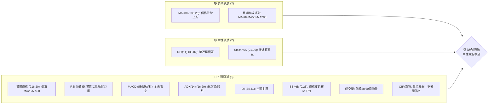

### 📊 核心指標速覽表

| 指標類別 | 指標名稱 | 當前數值 | 訊號 | 解讀 |
|----------|----------|----------|------|------|
| **價格** | 當前價格 | $216.20 | 🔴 | 位於近期高點回調區間，低於短期均線 |
| **均線** | MA20 | $244.88 | 🔴 | 價格位於MA20下方，短期壓力 |
| **均線** | MA50 | $219.80 | 🔴 | 價格位於MA50下方，中期壓力 |
| **均線** | MA200 | $135.26 | 🟢 | 價格位於MA200上方，長期趨勢看漲 |
| **動能** | RSI(14) | 33.02 | 🟡 | 接近超賣區間 (30)，有反彈潛力，但有頂背離風險 |
| **動能** | MACD | -2.576 | 🔴 | MACD線在訊號線下方，柱狀圖為負，空頭動能強勁 |
| **波動** | ATR(14) | $27.53 | 🟡 | 波動率較高 (12.73% of price)，反映近期價格劇烈變動 |
| **趨勢** | ADX(14) | 16.29 | 🔴 | 趨勢強度弱，市場處於盤整或無明顯趨勢狀態 |
| **成交量** | 量比 | 0.77x | 🔴 | 成交量萎縮，低於20日/50日均量，缺乏買盤支撐 |

### 🏆 技術評分卡

```
技術評分卡 — NBIS (2026-07-10)
════════════════════════════════════════════════════
趨勢強度      ████████░░░░░░░░░░░░  40/100  🔴 (ADX弱，-DI>+DI)
動能指標      ██████░░░░░░░░░░░░░░  30/100  🔴 (MACD空頭，RSI頂背離)
支撐穩定度    ████████████░░░░░░░░  60/100  🟡 (接近S1及斐波那契關鍵位)
成交量配合    ████░░░░░░░░░░░░░░░░  20/100  🔴 (量能萎縮，OBV疲弱)
形態完整度    ██████░░░░░░░░░░░░░░  30/100  🔴 (缺乏明顯多頭形態，短期V型反轉)
均線排列      ██████████░░░░░░░░░░  50/100  🟡 (長期多頭，短期空頭)
════════════════════════════════════════════════════
綜合評分      ███████░░░░░░░░░░░░░  40/100  ⚖️ 中性偏空觀望
════════════════════════════════════════════════════
```
**評分理由**:
*   **趨勢強度 (40/100 🔴)**: ADX 數值 16.29 明顯低於 25，表明市場處於弱趨勢或盤整狀態。同時，-DI 略高於 +DI，顯示空頭力量佔優。
*   **動能指標 (30/100 🔴)**: MACD 線及其柱狀圖均呈現空頭排列，且 MACD 線已跌破訊號線和零軸，顯示強勁的下跌動能。RSI 雖然接近超賣區，但其頂背離現象是重要的看空訊號，抵消了部分超賣潛在反彈的影響。
*   **支撐穩定度 (60/100 🟡)**: 當前價格 $216.20 位於斐波那契 38.2% 回調位 $202.08 和 S1 支撐位 $200.30 之上。這些是較為重要的支撐區域，理論上應具有一定的支撐效果，但仍需觀察能否有效守住。
*   **成交量配合 (20/100 🔴)**: 最新成交量遠低於 20 日和 50 日均量，量比僅 0.77x，顯示市場交投清淡，買盤意願不足。OBV 趨勢疲弱，未能確認價格走勢，進一步印證了空頭主導。
*   **形態完整度 (30/100 🔴)**: 從月線和週線來看，股票經歷了快速拉升後急劇回落，呈現出 V 型反轉的頂部形態，缺乏多頭的整理或築底形態。
*   **均線排列 (50/100 🟡)**: 長期均線 MA200 仍位於價格下方，且 MA20 > MA50 > MA200 的多頭排列維持，表明長期趨勢仍為上漲。然而，當前價格已跌破 MA20 和 MA50，短期和中期均線對價格形成壓力，故綜合評級為中性。
*   **綜合評分 (40/100 ⚖️)**: 鑑於 ADX 顯示為盤整市場，但動能指標和成交量配合均指向空頭，且存在 RSI 頂背離的強烈看空訊號，儘管接近關鍵支撐，但整體風險偏高，建議採取中性偏空觀望的態度，等待更明確的底部訊號或突破確認。

---

## 2. 趨勢分析

### 🌐 多時框趨勢分析

NBIS 在過去一年中呈現出驚人的漲幅，但近期面臨顯著的修正壓力。多時框架分析顯示，長期趨勢仍偏多，但中短期已轉為空頭修正。

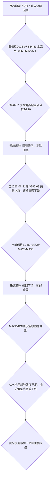

### 📈 長期趨勢 — 12個月走勢圖（Unicode）

NBIS 在過去一年中表現出極強的成長性，從 2025 年 7 月的 $54.43 飆升至 2026 年 6 月的 $276.17，漲幅高達 407%。然而，進入 2026 年 7 月，股價出現快速且劇烈的修正，從高點大幅回落。

```
NBIS 月線走勢圖（過去12個月）
價格軸 ($)
$300 ┤                                    ● (276.17, 2026-06)
$275 ┤                                    │
$250 ┤                                    │
$225 ┤                          ● (231.09, 2026-05) ● (216.20, 2026-07)
$200 ┤                                    │         │
$175 ┤                                    │         │
$150 ┤                      ● (138.23, 2026-04)     │
$125 ┤            ● (130.82, 2025-10)     │         │
$100 ┤        ● (112.27, 2025-09)         │         │
$ 75 ┤    ● (68.32, 2025-08)              │         │
$ 50 ┤● (54.43, 2025-07)────────────────────────────
     └────────────────────────────────────────────────────────
      25-07 25-08 25-09 25-10 25-11 25-12 26-01 26-02 26-03 26-04 26-05 26-06 26-07 (現在)
```

**走勢特徵分析表格**：

| 階段 (期間) | 起始價 | 結束價 | 漲跌幅 | 走勢特徵 |
|-------------|--------|--------|--------|----------|
| **強勁上漲** (2025-07 ~ 2026-06) | $54.43 | $276.17 | +407.4% | 持續性強勢上漲，期間雖有回調但均迅速收復並創高，顯示極強的多頭動能。2026年5月和6月加速上漲。 |
| **高點回調** (2026-06 ~ 2026-07) | $276.17 | $216.20 | -21.7% | 股價在高點後迅速且大幅回落，顯示強勁的獲利了結壓力或空頭反轉訊號。 |

### 📊 中期趨勢（週線分析）

從週線圖來看，NBIS 在 2026 年 5 月和 6 月經歷了爆炸性成長，但隨後在 6 月底至 7 月初出現了急劇的下跌修正。目前價格已跌破週線級別的 MA20 和 MA50，顯示中期趨勢已轉為下行。

```
NBIS 週線壓力與支撐示意圖 (近期)

        ┌───────────────────────────┐
        │                           │
$299.86 ┤                     R3 (52W High)
        │                           │
$278.84 ┤                   R2
        │                           │
$244.88 ┤───── MA20 (週線壓力) ───── R1
$233.73 ┤             ╱
        │           ╱
$219.80 ┤────── MA50 (週線壓力) ──────
$216.20 ┤           ● 現價
        │         ╱
$200.30 ┤────── S1 (週線支撐) ──────
        │       ╱
$187.35 ┤───── 布林下軌 (潛在支撐) ─────
        │     ╱
$171.87 ┤── 斐波那契50% (潛在支撐) ───
        │   ╱
$132.70 ┤ S2 (強支撐)
        │
        └───────────────────────────┘
```
目前價格 $216.20 位於 MA20 ($244.88) 和 MA50 ($219.80) 之下，顯示中期趨勢偏空。短期內，MA20 和 MA50 將構成重要的阻力。下方支撐關注 S1 ($200.30) 和斐波那契 38.2% 回調位 ($202.08)。

### ⚡ 趨勢強度評估（ADX 解讀）

ADX 指標用於衡量趨勢的強度，而非方向。當前 ADX(14) 數值為 16.29，明顯低於 25，這表明 NBIS 目前處於弱趨勢或盤整行情中。在這種情況下，價格往往會在一個區間內震盪，而不是單邊運行。

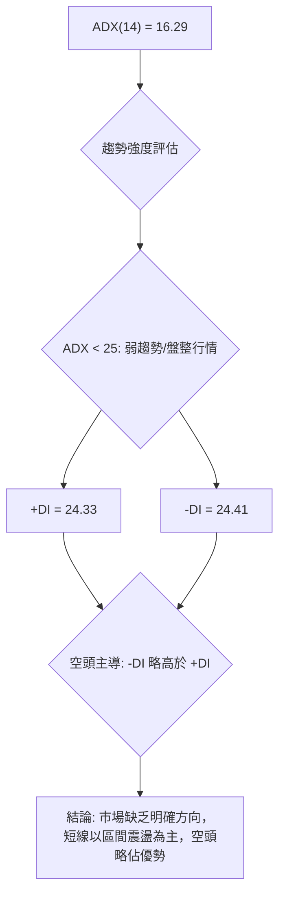

**ADX 強度對照表**:

| ADX 數值範圍 | 趨勢強度 | 市場狀態 |
|--------------|----------|----------|
| 0 - 25       | 弱趨勢   | 盤整或無明顯趨勢 |
| 25 - 50      | 中等趨勢 | 趨勢行情確立 |
| 50 - 75      | 強趨勢   | 趨勢持續性強 |
| 75 - 100     | 極強趨勢 | 趨勢極度強勁 |

**解讀**: 16.29 的 ADX 數值明確指出 NBIS 正處於盤整或弱勢趨勢，而非強勁的單邊行情。這意味著在當前價格附近，多空雙方力量均衡，或者說市場正在尋找新的方向。同時，-DI 略高於 +DI，表明在弱勢趨勢中，空頭力量略佔上風，這與價格近期下跌的走勢相符。因此，短期內應避免追漲殺跌，而應關注區間操作或等待趨勢明確。

---

## 3. 圖表形態分析

### 🔍 形態識別系統

從提供的月度及週度數據來看，NBIS 在經歷了長期的強勁上漲後，於 2026 年 6 月創下高點 $276.17，隨後在 2026 年 7 月急劇回落至 $216.20。這種快速上漲後的急劇下跌，形成了一個**V型反轉頂部形態**的初步跡象。目前尚未形成經典的頭肩頂、雙頂等複合形態，但 V型反轉本身就是一種強烈的反轉訊號。

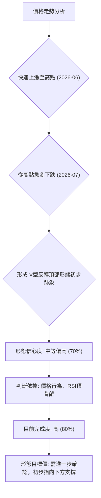

**V型反轉頂部形態信心度表格**：

| 形態 | 信心度 | 判斷依據（引用數據） | 完成度 | 目標價（附計算式） |
|------|--------|----------------------|--------|--------------------|
| V型反轉頂部 | 70% | 價格從 2026-05 的 $231.09 快速衝高至 2026-06 的 $276.17，隨後在 2026-07 迅速回落至 $216.20。RSI(14) 頂背離 (見 5.2 節)  подтверждает 動能衰竭。 | 80% | 形態高度 $276.17 - $216.20 = $59.97。若跌破關鍵支撐 $200.30，則目標價可能為 $200.30 - $59.97 = $140.33。此為推算，需觀察實際支撐。 |

**說明**: 雖然 V型反轉頂部形態通常缺乏明顯的頸線，但其特點是價格在短時間內經歷大幅度且快速的漲跌，且往往伴隨著動能指標的背離。NBIS 的價格走勢和 RSI 頂背離現象高度符合這一特徵。形態完成度高表示反轉已基本確立，但其下跌目標仍需結合關鍵支撐位來判斷。

### 🕯️ 重要K線形態分析

從近 20 週的收盤價走勢來看，近期出現了幾個值得關注的 K 線組合：

| 日期 | 收盤價 | K線形態 (週線) | 解讀 | 訊號 |
|------|--------|-----------------|------|------|
| 2026-05-31 | $231.09 | 長陽線後小實體 | 價格創高，但動能開始減弱，為後續回調埋下伏筆。 | 🟡 中性偏空 |
| 2026-06-21 | $286.69 | 長陽線 | 強勢上漲，達到階段性高點。 | 🟢 看多 (階段性) |
| 2026-06-28 | $240.30 | 長陰線 | 快速下跌，跌幅顯著，吞噬前一週部分漲幅，顯示賣壓沉重。 | 🔴 看空 |
| 2026-07-05 | $215.62 | 長陰線 | 延續下跌趨勢，空頭力量持續。 | 🔴 看空 |
| 2026-07-12 | $216.20 | 小實體/類十字星 | 經歷大幅下跌後，出現小實體 K 線，顯示賣壓有所緩解，或多空雙方力量暫時平衡，可能預示短期止跌或盤整。 | 🟡 中性 |

**總結**: 近期的週線 K 線形態顯示，NBIS 在 6 月底和 7 月初連續出現長陰線，確認了強烈的賣壓和下跌趨勢。最新的 K 線形態呈現小實體，可能預示短期下跌動能減緩，但尚未出現明確的止跌反轉形態，需謹慎觀察。

### 📉 ASCII 走勢形態示意圖

以下示意圖描繪了 NBIS 近期的 V 型反轉頂部形態及其潛在的價格路徑：

```
NBIS 近期走勢形態示意圖 (V型反轉頂部)

價格軸 ($)
$300 ┤                                   ╲
$275 ┤                                  ╱  ╲  ● (276.17, 2026-06 高點)
$250 ┤                                 ╱    ╲
$225 ┤                                ╱      ╲
$216.20 ┤───────────────────────────● 現價
$200 ┤                             ╱        ╲
$175 ┤                            ╱          ╲
$150 ┤                           ╱            ╲
$140.33 ┤─────────── 目標價 (推算)              ╲
$125 ┤                                          ╲
     └───────────────────────────────────────────
      時間軸 (近期)
```
**說明**: 價格從高點迅速回落，形成尖銳的 V 型頂部。當前價格 $216.20 位於下跌通道中，正在測試下方支撐。若 $200.30 (S1) 支撐失守，則目標可能指向 $140.33 (由形態高度推算)。

### 🎯 形態目標價計算

根據上述 V 型反轉頂部形態的初步判斷，我們可以粗略估算潛在的下跌目標。

*   **形態高點**: $276.17 (2026-06 收盤價)
*   **形態低點 (初步回調底部)**: $216.20 (當前價格，作為回調參考點)
*   **形態高度 (H)**: $276.17 - $216.20 = $59.97

如果 V 型反轉形態完全確立，且價格有效跌破關鍵支撐，則其下跌目標通常為形態高度從突破點向下延伸的距離。
假設關鍵支撐點為 S1 ($200.30)，一旦跌破，則：
*   **推算目標價** = **關鍵支撐位** - **形態高度**
*   **推算目標價** = $200.30 - $59.97 = $140.33

**重要提示**: 此目標價為基於 V 型反轉形態的推算，其實現與否高度依賴於 $200.30 支撐位的有效性。在實際交易中，應結合其他技術指標和市場情緒進行判斷，並將斐波那契回調位 $171.87 (50%) 和 $141.67 (61.8%) 納入考量。

---

## 4. 支撐與阻力

NBIS 的價格目前處於關鍵的轉折點，理解其支撐與阻力結構至關重要。當前價格 $216.20 位於重要的斐波那契回調區間內，且下方存在多重支撐，上方則面臨多重阻力。

### 🗺️ 關鍵價位分布圖（Unicode）

```
NBIS 價位結構分布圖 (2026-07-10)
═══════════════════════════════════════════════════
$299.86 ║████████████████████████║ 強阻力 R3 (52W High)
$278.84 ║████████████████████    ║ 阻力 R2
$244.88 ║████████████████████████║ 關鍵阻力 R1 (MA20/BB中軌)
$239.45 ║████████████████████████║ 斐波那契 23.6%
$219.80 ║████████████████████████║ MA50
$216.20 ╠════════════════════════╣ ◄ 現價
$202.08 ║▓▓▓▓▓▓▓▓▓▓▓▓▓▓▓▓        ║ 斐波那契 38.2%
$200.30 ║▓▓▓▓▓▓▓▓▓▓▓▓▓▓▓▓        ║ 近期支撐 S1
$187.35 ║▓▓▓▓▓▓▓▓▓▓▓▓▓▓▓▓        ║ 布林下軌
$171.87 ║████████████████████████║ 強支撐 S2 (斐波那契 50%)
$141.67 ║████████████████████████║ 斐波那契 61.8%
$132.70 ║████████████████████████║ 強支撐 S3
$ 94.63 ║████████████████████████║ 極強支撐 (歷史低點)
═══════════════════════════════════════════════════
```

### 🚧 阻力位分析表

NBIS 目前面臨來自多個層面的阻力，這些阻力位在價格反彈時將構成考驗。

| 阻力級別 | 價位 | 形成原因 | 突破難度 | 重要性 |
|----------|------|----------|----------|--------|
| **R1**   | $233.73 | 近期波段高點聚類，接近 MA20 ($244.88) 和布林中軌。 | 中等偏高 | 🟢 |
| **R2**   | $278.84 | 較高波段高點聚類，也是 V 型反轉頂部形態的起始點附近。 | 高 | 🟡 |
| **R3**   | $299.86 | 52 週最高點，也是歷史高點，心理關口和強勁套牢盤區。 | 極高 | 🔴 |

**解讀**: 當前價格 $216.20 距離第一道阻力 R1 $233.73 僅約 8% 的空間。若要扭轉短期跌勢，必須首先有效突破 R1，並站穩 MA20 和 MA50。R2 和 R3 則代表了更強的賣壓和套牢盤，突破難度極高。

### 🛡️ 支撐位分析表

NBIS 股價在下跌過程中，下方存在多道支撐位，這些價位將是判斷跌勢能否止穩的關鍵。

| 支撐級別 | 價位 | 形成原因 | 守住機率 | 重要性 |
|----------|------|----------|----------|--------|
| **S1**   | $200.30 | 近期波段低點聚類，與斐波那契 38.2% 回調位 ($202.08) 接近，具備疊加支撐效果。 | 中等 | 🟢 |
| **S2**   | $132.70 | 較低波段低點聚類，與斐波那契 61.8% 回調位 ($141.67) 接近，是強勁的心理和技術支撐。 | 中等偏高 | 🟡 |
| **S3**   | $94.63 | 歷史重要低點，與斐波那契 78.6% 回調位 ($98.67) 接近，構成極強的防線。 | 高 | 🔴 |

**解讀**: 當前價格 $216.20 距離第一道支撐 S1 $200.30 僅約 7% 的距離。S1 結合斐波那契 38.2% 回調位，形成一個重要的支撐區間。若此區間能有效守住，則可能出現短期反彈。一旦 S1 失守，則跌勢可能加速，並測試更深層次的支撐 S2 ($132.70) 和斐波那契 50% 回調位 ($171.87)。

### 📐 斐波那契回調位分析

我們以 52 週高點 $299.86 和 52 週低點 $43.89 為基準，計算出 NBIS 的斐波那契回調位，這些價位在當前修正行情中具有重要的參考意義。

*   **0.0% (52W High)**: $299.86
*   **23.6%**: $239.45
*   **38.2%**: $202.08
*   **50.0%**: $171.87
*   **61.8%**: $141.67
*   **78.6%**: $98.67
*   **100.0% (52W Low)**: $43.89

**當前狀況**: NBIS 的當前價格 $216.20 正好位於斐波那契 23.6% 回調位 ($239.45) 和 38.2% 回調位 ($202.08) 之間，且更接近 38.2% 的水平。
**解讀**:
*   **38.2% 回調位 ($202.08)** 是修正行情中第一個重要的支撐位。歷史經驗表明，健康的修正通常在此處獲得支撐。當前價格僅略高於此水平，顯示市場正在測試此關鍵支撐區間。
*   如果 $202.08 能夠有效守住，則可能預示著短期跌勢的結束，並有機會反彈向 23.6% 回調位 ($239.45) 甚至更高。
*   然而，如果 $202.08 失守，則價格很可能進一步下探至 **50.0% 回調位 ($171.87)**。50% 回調是另一個重要的心理和技術支撐，也是許多技術分析師關注的較深層次修正點。
*   **61.8% 回調位 ($141.67)** 則是牛市修正的極限，如果價格跌至此處，將對市場信心造成較大打擊，但仍被視為長期趨勢保持完好的最後防線。

綜合來看，NBIS 目前處於一個非常關鍵的支撐區域。斐波那契 38.2% 回調位與 S1 支撐位形成共振，是判斷短期走勢的試金石。

---

## 5. 技術指標深度解讀

本節將對 NBIS 的核心技術指標進行深入分析，並探討它們之間的相互關係，以提供更全面的市場洞察。

### 🎛️ 指標訊號總覽

```mermaid
graph TD
    A["當前價格: $216.20"] --> B{"均線系統"}
    A --> C{"動能指標"}
    A --> D{"趨勢強度"}
    A --> E{"波動率"}
    A --> F{"成交量"}

    B --> B1["MA20: $244.88 (🔴 價格下方)"]
    B --> B2["MA50: $219.80 (🔴 價格下方)"]
    B --> B3["MA200: $135.26 (🟢 價格上方)"]
    B --> B4["均線排列: MA20>MA50>MA200 (長期多頭，短期修正)"]

    C --> C1["RSI(14): 33.02 (🟡 接近超賣)"]
    C --> C2["RSI 背離: ⚠️ 頂背離 (🔴 看空)"]
    C --> C3["MACD: -2.576 (🔴 空頭排列)"]
    C --> C4["MACD Signal: 5.660 (🔴 MACD線下方)"]
    C --> C5["MACD Hist: -8.236 (🔴 負值擴大)"]
    C --> C6["Stoch %K: 21.95 (🟡 接近超賣)"]

    D --> D1["ADX(14): 16.29 (🔴 弱趨勢/盤整)"]
    D --> D2["+DI: 24.33 (🔴 空頭主導)"]
    D --> D3["-DI: 24.41 (🔴 空頭主導)"]

    E --> E1["ATR(14): $27.53 (🟡 高波動)"]
    E --> E2["BB上軌: $302.40"]
    E --> E3["BB中軌: $244.88"]
    E --> E4["BB下軌: $187.35"]
    E --> E5["BB %B: 0.25 (🔴 接近下軌)"]

    F --> F1["最新成交量: 13.9M (🔴 低於均量)"]
    F --> F2["20日均量: 18.1M"]
    F --> F3["50日均量: 18.1M"]
    F --> F4["OBV趨勢: OBV < MA (🔴 量能疲弱)"]
```

### 📈 移動平均線排列分析

NBIS 的均線系統呈現出一個複雜但具有指示性的畫面。
*   **長期趨勢 (MA200)**: 當前價格 $216.20 遠高於 MA200 ($135.26)，這表明 NBIS 的長期趨勢仍然是強勁的多頭。MA200 作為長期趨勢的判斷依據，其向上傾斜和價格在其上方運行，都支持了這一觀點。
*   **中期趨勢 (MA50)**: 價格 $216.20 已經跌破了 MA50 ($219.80)，這是一個中期看空的訊號。MA50 通常被視為中期趨勢的生命線，跌破它意味著中期上漲動能的減弱或反轉。
*   **短期趨勢 (MA20)**: 價格 $216.20 也跌破了 MA20 ($244.88)，顯示短期趨勢已轉為下跌。MA20 是最敏感的短期均線，跌破它通常預示著短期內將面臨更大的下行壓力。
*   **均線排列**: 當前 MA20 ($244.88) > MA50 ($219.80) > MA200 ($135.26)，這仍然是標準的多頭排列。這意味著從整體結構上看，股票仍處於長期牛市中。然而，當前價格位於 MA20 和 MA50 之下，表明這是一個健康的長期趨勢中的短期修正。

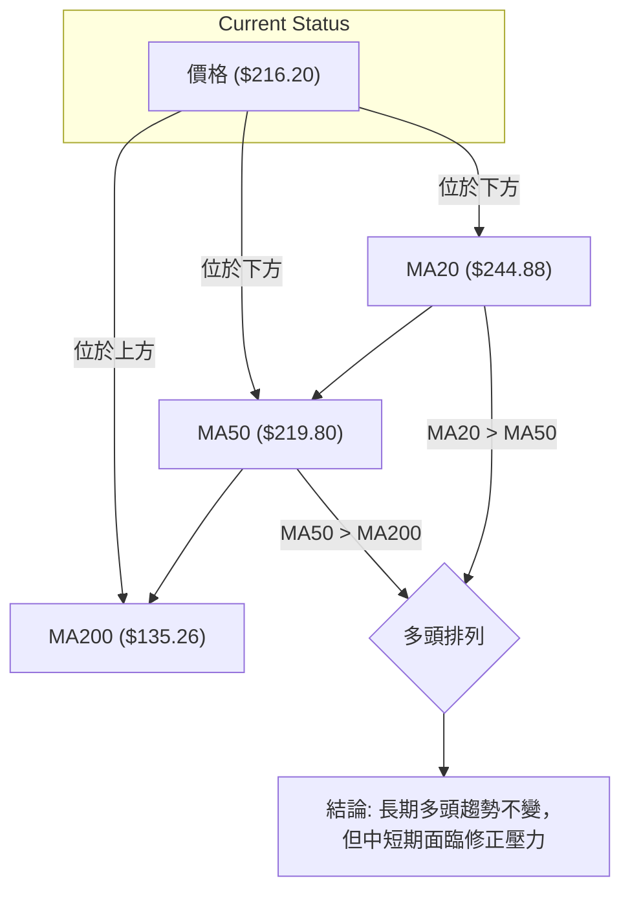

**總結**: 儘管長期均線保持多頭排列，但價格已跌破短期和中期均線，顯示當前正處於一個強勢的修正階段。短期內，MA20 和 MA50 將轉為阻力，只有當價格重新站穩這些均線之上，才能確認修正結束並恢復上漲動能。

### 📉 RSI(14) 分析

RSI(14) (相對強弱指標) 用於衡量價格變動的速率和變化，以判斷資產是超買還是超賣。

*   **RSI 數值**: 當前 RSI(14) 為 **33.02**。
    *   **進度條**: ▓▓▓▓▓▓▓▓▓▓▓▓▓▓▓▓░░░░ (33.02/100)
*   **超買超賣區間分析**:
    *   傳統上，RSI 高於 70 被視為超買，低於 30 被視為超賣。
    *   當前 33.02 的 RSI 數值雖然尚未進入超賣區 (<30)，但已非常接近，顯示價格在近期下跌後，賣壓可能有所緩解，或潛在買盤力量正在積聚。這為短期反彈提供了一定的可能性。
*   **背離判斷 (頂背離)**:
    *   數據中明確指出 **⚠️ 頂背離 (Bearish Divergence)**。
    *   **解讀**: 頂背離發生在價格創出新高（或更高的高點），而 RSI 指標未能創出新高（或創出較低的高點）時。這表明儘管價格在創新高，但其上漲的動能已經減弱，買盤力量不足以支持持續的價格上漲。
    *   **NBIS 的情況**: 結合月線和週線價格走勢，NBIS 在 2026 年 6 月創出歷史新高 $276.17，但很可能在同期或之前，RSI 指標未能同步創出更高的高點，或呈現出明顯的回落跡象。這種頂背離是一個強烈的看空訊號，預示著隨後的價格下跌。當前的大幅回調正是頂背離效應的體現。
    *   **訊號強度**: 🔴 強烈看空訊號。

**總結**: RSI 接近超賣區可能預示短期有反彈需求，但其先前的頂背離現象是更重要的訊號，說明了當前下跌的合理性，並警示任何反彈都可能只是修正性質，而不是趨勢反轉。交易者應謹慎對待短期反彈，並關注價格能否站穩關鍵支撐。

### 📊 MACD(12/26/9) 訊號解讀

MACD (移動平均線收斂發散指標) 是趨勢跟蹤動量指標，顯示兩個移動平均線之間的關係。

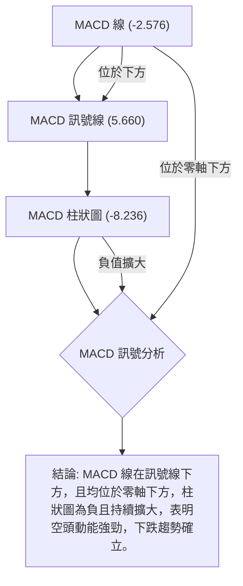

*   **MACD 線 (-2.576)**: 當前 MACD 線為負值，且位於零軸下方。這是一個明確的看空訊號，表明短期移動平均線已位於長期移動平均線之下，且整體趨勢向下。
*   **MACD 訊號線 (5.660)**: MACD 線 (-2.576) 位於訊號線 (5.660) 的下方。這形成了一個死叉 (Death Cross)，是傳統的看空交易訊號，表示短期動能已轉弱，並開始主導市場。
*   **MACD 柱狀圖 (-8.236)**: 柱狀圖為負值，且數值較大，顯示空頭動能正在增強或持續。負值越大，表示下跌的動能越強。

**總結**: MACD 指標全面發出看空訊號，從 MACD 線本身、與訊號線的關係到柱狀圖的表現，都確認了當前強勁的下跌動能。這與 RSI 頂背離的看空訊號相互印證，增強了空頭趨勢的可信度。

### 📦 布林通道分析

布林通道 (Bollinger Bands) 用於衡量市場波動率和判斷價格的相對高低。

*   **BB上軌**: $302.40
*   **BB中軌 (MA20)**: $244.88
*   **BB下軌**: $187.35
*   **BB %B**: 0.25 (0=下軌, 0.5=中軌, 1=上軌)

**布林通道示意圖**:

```
NBIS 布林通道示意圖

$302.40 ┌───────────────────────────────────────┐ 上軌
        │                                       │
$273.64 │                                       │ (2026-06 高點)
        │                                       │
$244.88 ┼─────────────── MA20 中軌 ───────────────┼
        │                                       │
$216.20 ┼───────────────────● 現價 ───────────────────┼
        │                                       │
$187.35 └───────────────── 下軌 ──────────────────┘
        │                                       │
        └───────────────────────────────────────┘
```

**解讀**:
1.  **價格位置**: 當前價格 $216.20 位於布林通道中軌 ($244.88) 和下軌 ($187.35) 之間，且非常接近下軌 (BB %B = 0.25)。這表明價格在近期下跌後，已接近其波動區間的下限。
2.  **通道寬度**: 從數據無法直接判斷布林帶寬度是收窄還是擴張，但結合 ATR ($27.53) 較高，暗示通道可能處於擴張狀態，反映近期波動性較大。
3.  **訊號**: 價格接近布林下軌在盤整行情中可能提供買入機會，但在趨勢行情中則可能預示下跌的延續。由於 ADX 顯示為弱趨勢/盤整行情，且 RSI 接近超賣，價格接近下軌可能提供一個短期反彈的機會，但上方中軌將形成強勁阻力。

**總結**: 布林通道顯示 NBIS 價格已跌至通道下半部分，並接近下軌。這在弱勢趨勢或盤整市場中，可能暗示短期超賣和潛在的反彈需求。然而，中軌 ($244.88) 作為 MA20，將構成重要的阻力。

### 💹 成交量分析（量價配合度）

成交量是價格走勢的能量來源，對於確認趨勢至關重要。

*   **最新成交量**: 13,946,900
*   **20日均量**: 18,107,955
*   **50日均量**: 18,125,264
*   **量比**: 0.77x (最新成交量 / 20日均量)

**解讀**:
1.  **成交量萎縮**: 當前成交量 13.9M 遠低於 20 日和 50 日均量 (約 18.1M)，量比僅 0.77x。這表明在價格下跌的過程中，市場交投清淡，買盤力量不足以支撐價格。通常，下跌時伴隨縮量，可能表示賣壓有所減輕，但更常見的解釋是缺乏新的買盤入場。
2.  **OBV 趨勢**: 數據顯示 **OBV趨勢: OBV < MA → 量能疲弱**。OBV (On-Balance Volume) 是一種累積成交量指標，其趨勢通常應與價格趨勢一致。當 OBV 趨勢向下或低於其移動平均線時，表示儘管價格可能下跌，但缺乏足夠的成交量支持，即賣盤力量強於買盤。OBV 疲弱進一步確認了當前市場缺乏買盤動能。
3.  **量價配合度**: 價格下跌伴隨成交量萎縮和 OBV 疲弱，這通常是一個看空訊號。它表明市場對當前價格水平的興趣不高，或者說，在下跌過程中，沒有足夠的買盤力量去承接賣壓。這不利於價格止跌反彈。

**總結**: 成交量分析顯示 NBIS 的量價配合度不佳，成交量萎縮和 OBV 疲弱都指向了當前市場缺乏多頭動能，空頭主導。這與 MACD 和 RSI 頂背離的看空訊號相互印證，增加了下跌趨勢的可靠性。

---

## 6. 動能與波動率

### ⚡ 動能評估四象限

動能評估四象限分析結合了動能強度和波動率來判斷股票的當前狀態。

*   **動能強度**: MACD 和 RSI 頂背離均顯示動能顯著減弱且偏空。RSI 雖接近超賣，但整體動能趨勢是下行的。**評估為：弱動能**。
*   **波動率**: ATR(14) 為 $27.53，佔當前價格 $216.20 的 12.73%。這是一個相對較高的波動率，反映了近期價格的劇烈變動。**評估為：高波動**。

綜合來看，NBIS 目前處於 **弱動能、高波動** 的狀態。

| 象限 | 動能 | 波動 | 當前狀態 | 評估 |
|------|------|------|----------|------|
| Q1 | 強 | 低 | - | 最佳機會 (趨勢穩定，風險可控) |
| Q2 | 弱 | 低 | - | 謹慎觀望 (缺乏方向，波動小，易盤整) |
| Q3 | 強 | 高 | - | 高風險高收益 (趨勢強勁，但波動大，需嚴控風險) |
| Q4 | 弱 | 高 | ✓ | 避免進場 / 謹慎區間操作 (方向不明，波動大，風險高) |

**Mermaid 動能評估流程圖**:
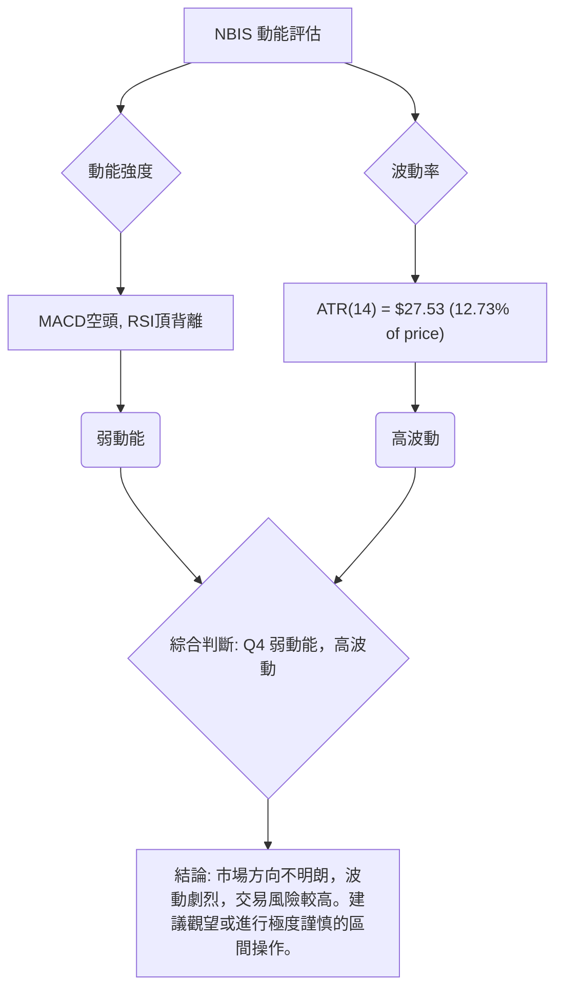

**結論**: NBIS 目前位於「弱動能、高波動」的第四象限。這表示市場缺乏明確的趨勢方向，但價格波動劇烈，交易難度高，風險較大。在這種環境下，追漲殺跌容易被套，更適合等待市場穩定或明確訊號出現。

### 📊 ATR 波動率分析

ATR(14) (平均真實波幅) 用於衡量市場波動率，反映價格在特定時間內的平均波動範圍。

*   **ATR(14)**: $27.53
*   **ATR 佔價格比**: $27.53 / $216.20 = 12.73%

**解讀**:
1.  **高波動性**: 12.73% 的 ATR 佔比表明 NBIS 的每日波動幅度非常大。例如，如果價格在一天內波動 $27.53，這對於 $216.20 的股票來說是相當劇烈的。這反映了近期價格劇烈下跌所帶來的市場不確定性和恐慌情緒。
2.  **止損距離建議**: 高 ATR 意味著在設置止損時需要更大的緩衝空間，以避免被正常波動洗出。
    *   **短線交易者**: 可考慮將止損設置在當前價格下方 1-1.5 倍 ATR，即 $216.20 - (1 * $27.53) = $188.67 到 $216.20 - (1.5 * $27.53) = $174.90 之間。這與布林下軌 ($187.35) 和斐波那契 50% 回調位 ($171.87) 接近。
    *   **中長線交易者**: 可考慮將止損設置在 2-3 倍 ATR 之外，但這會導致止損距離過大，不適合當前弱勢市場。
    *   **建議**: 鑑於當前弱勢和高波動，止損應基於關鍵支撐位，並結合 ATR 提供的波動區間。例如，考慮跌破 S1 ($200.30) 後以 1 倍 ATR 作為止損緩衝，即 $200.30 - $27.53 = $172.77。

**總結**: NBIS 波動率高，增加了交易難度。交易者必須嚴格控制倉位並設置合理的止損，以應對潛在的劇烈價格波動。

### 📐 Beta 與市場相關性

Beta 值衡量股票相對於大盤指數的波動性。

*   **Beta**: 1.402

**解讀**:
1.  **高於市場平均**: NBIS 的 Beta 值為 1.402，遠高於 1。這意味著 NBIS 的股價波動性比整體市場高出 40.2%。當市場上漲 1% 時，NBIS 理論上會上漲 1.402%；當市場下跌 1% 時，NBIS 理論上會下跌 1.402%。
2.  **市場敏感度**: 如此高的 Beta 值表明 NBIS 對市場情緒和宏觀經濟數據非常敏感。在牛市中，高 Beta 股票可以帶來超額收益；但在熊市或市場調整中，它們也會承受更大的下跌風險。
3.  **投資組合影響**: 對於投資組合而言，持有高 Beta 股票會增加整體投資組合的波動性。在當前弱勢市場中，高 Beta 股票更容易受到衝擊。

**總結**: NBIS 是一支高 Beta 股票，波動性高於市場平均。在當前市場情緒偏弱、個股動能不足的情況下，其股價更容易受到市場負面情緒的影響，下跌風險相對較大。投資者應將此納入風險評估。

---

## 7. 多時框架總結

本章將整合前述所有時框架和指標分析，根據多時框收斂規則（嚴格要求 14），為 NBIS 的當前技術面提供一個統一且明確的結論。

### 📋 時框架評分表

| 時框架 | 趨勢方向 | 動能 | 均線排列 | 形態 | 綜合評分 | 建議 |
|--------|----------|------|----------|------|----------|------|
| **月線** | 🟢 上漲 | 🟡 減弱 | 🟢 多頭 | 🔴 V型反轉頂部 | 5/10 | 警惕高位回調 |
| **週線** | 🔴 下跌 | 🔴 疲弱 | 🔴 短期空頭 | 🔴 修正中 | 3/10 | 尋找止跌訊號 |
| **日線** | 🔴 下跌 | 🔴 強勁空頭 | 🔴 短期空頭 | 🔴 跌破支撐 | 2/10 | 謹慎觀望 |

### 🔲 綜合訊號矩陣

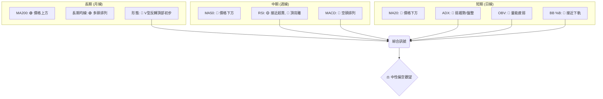

**訊號一致性分析**:
*   **長期**: 儘管 MA200 和均線排列顯示長期仍處於上升趨勢，但月線層面的 V型反轉頂部形態和 RSI 頂背離已發出強烈警示。
*   **中期與短期**: 週線和日線層面的所有關鍵指標（MA、MACD、RSI、ADX、OBV、布林通道）均指向空頭或弱勢盤整。價格已跌破短期和中期均線，MACD 呈現死叉且柱狀圖為負，RSI 頂背離效應顯現，ADX 指示趨勢強度不足，OBV 顯示量能疲弱，且價格接近布林下軌。

### ⚖️ 多時框收斂結論

根據「嚴格要求 14」的多時框收斂規則：

1.  **趨勢行情判斷**: 當前 ADX(14) 數值為 16.29，明顯低於 25，因此市場處於 **盤整行情 (Ranging Market)** 或弱勢趨勢。
2.  **主導時框與策略依據**: 在盤整行情中，應以日線布林通道上下軌為主要交易區間。
3.  **綜合訊號分析**:
    *   **長期**：儘管 MA200 仍為多頭排列，顯示長期趨勢未被破壞，但月線出現 V 型反轉頂部形態且 RSI 頂背離，預示了高點動能的衰竭和大幅修正的合理性。
    *   **中短期**：價格已跌破 MA20 和 MA50，MACD 呈現空頭排列且動能強勁。RSI 雖然接近超賣區 (33.02)，但其頂背離的歷史訊號更具警示意義。成交量萎縮和 OBV 疲弱，缺乏買盤支撐。ADX 顯示弱趨勢，且 -DI 略高於 +DI，表明空頭略佔優勢。
    *   **布林通道**：當前價格 $216.20 位於布林通道中軌 ($244.88) 和下軌 ($187.35) 之間，且接近下軌 (BB %B = 0.25)。
4.  **最終結論**:
    NBIS 目前處於一個 **長期上升趨勢中的強勢修正階段**。由於 ADX 顯示為盤整行情，且中短期指標全面偏空（MACD 死亡交叉、RSI 頂背離、價格跌破 MA20/MA50、量能疲弱），儘管價格接近布林下軌和關鍵支撐 (S1 $200.30 / 斐波那契 38.2% $202.08)，但缺乏明確的止跌反轉訊號。
    因此，本報告的最終結論為：**中性偏空觀望**。市場短期內可能在支撐位附近嘗試反彈，但任何反彈都可能面臨強勁阻力，且在缺乏強勁買盤動能的情況下，反彈幅度可能有限，甚至可能再次回落測試更低支撐。交易者應保持高度謹慎，等待更明確的底部形成訊號或突破確認。

---

## 8. 交易策略建議

基於多時框架分析的「中性偏空觀望」結論和技術評分卡 40/100 的評分，NBIS 當前不適合積極追多，主策略應以謹慎的區間操作或等待明確方向為主。

### 🗺️ 策略決策流程圖

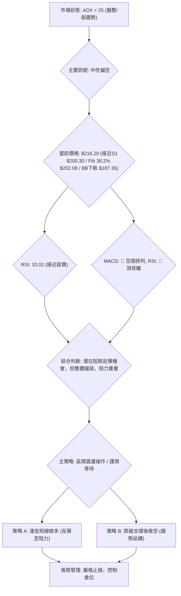

### 🧭 策略路由（依評分卡分流）

**當前主策略方向 = ⚖️ 中性偏空觀望 (依評分 40/100)**

由於綜合評分偏低 (40/100)，且 ADX 指示為盤整行情，我們不建議採取激進的多頭或空頭策略。主策略應側重於區間操作，並對潛在的短期反彈保持謹慎，同時警惕跌破關鍵支撐後的趨勢延續。

### 🎯 價格情境階梯（Price Scenarios）

| 觸發條件 | 下一目標 | 後續延伸 | 情境含義 |
|----------|----------|----------|----------|
| 突破 R1 $233.73 | 斐波那契 23.6% $239.45 | R2 $278.84 | 短線轉強，但仍處於修正區間，上方阻力重重。 |
| 站穩 S1 $200.30 | 區間震盪 (S1 ~ R1) | - | 價格在 $200.30 - $233.73 區間內震盪整理，尋求方向。 |
| 跌破 S1 $200.30 | 斐波那契 50% $171.87 | S2 $132.70 | 中期轉弱，跌勢可能加速，測試更深層次支撐。 |

### 📊 情境機率分佈

| 情境 | 機率 | 主要依據 |
|------|------|----------|
| 繼續上行 / 反彈 | 30% | RSI 接近超賣 (33.02)，價格接近斐波那契 38.2% ($202.08) 和 S1 ($200.30) 雙重支撐，布林通道接近下軌。 |
| 區間震盪 | 45% | ADX 數值 16.29 指示弱趨勢/盤整行情，價格在強支撐與阻力之間波動。 |
| 回落 / 再探底 | 25% | MACD 空頭排列，RSI 頂背離效應，成交量萎縮，OBV 疲弱，顯示空頭動能仍佔優。 |

### 🟢 主策略詳情（中性偏空觀望下的區間操作）

**策略一：逢低短線反彈策略 (反向操作，風險較高)**
此策略基於價格接近強支撐且 RSI 接近超賣，尋求短期反彈機會。

| 策略要素 | 策略 A (短線做多) |
|----------|--------------------|
| 進場條件 | 價格在 S1 $200.30 或斐波那契 38.2% $202.08 附近出現明確止跌K線（如錘子線、啟明星），且成交量溫和放大。 |
| 進場價格 | $202.08 - $205.00 區間 |
| 目標價 T1 | $219.80 (MA50) |
| 目標價 T2 | $233.73 (R1) 或 $239.45 (斐波那契 23.6%) |
| 止損價格 | $195.00 (跌破 S1 $200.30 後的緩衝，約 1 倍 ATR 範圍) |
| 風險報酬比 | 若進場 $203.50，止損 $195.00，T1 $219.80: (219.80-203.50)/(203.50-195.00) = 16.3 / 8.5 ≈ 1.92:1 |
| 成功機率 | 40% (反向操作，成功率較低，需嚴格止損) |
| 建議倉位 | 5% - 10% (極輕倉位) |

**策略二：跌破支撐後順勢做空策略 (風險較低，但需確認)**
此策略基於當前空頭動能較強，若關鍵支撐失守，跌勢可能加速。

| 策略要素 | 策略 B (順勢做空) |
|----------|--------------------|
| 進場條件 | 價格有效跌破 S1 $200.30 或布林下軌 $187.35，且伴隨放量。 |
| 進場價格 | 跌破 $200.30 後回抽確認或直接追空，例如 $198.00 - $200.00 區間。 |
| 目標價 T1 | $171.87 (斐波那契 50%) |
| 目標價 T2 | $141.67 (斐波那契 61.8%) 或 $132.70 (S2) |
| 止損價格 | $205.00 (略高於 S1 $200.30，防止假跌破) |
| 風險報酬比 | 若進場 $199.00，止損 $205.00，T1 $171.87: (199.00-171.87)/(205.00-199.00) = 27.13 / 6 ≈ 4.52:1 |
| 成功機率 | 60% (順勢操作，成功率較高) |
| 建議倉位 | 10% - 15% (中等倉位) |

### 🔴 反向風險觸發點（對沖提示）

以下是可能推翻上述主策略或需要重新評估市場方向的關鍵訊號：

*   **多頭反轉訊號**:
    *   價格有效突破並站穩 R1 ($233.73) 及 MA20 ($244.88)，並伴隨成交量放大。
    *   MACD 線向上穿越訊號線，並接近或突破零軸。
    *   RSI 脫離超賣區並向上突破 50 中軸，且沒有新的頂背離。
    *   ADX 顯著上升並突破 25，且 +DI 向上穿越 -DI。
*   **空頭趨勢確認訊號**:
    *   價格有效跌破斐波那契 50% 回調位 ($171.87) 並測試 S2 ($132.70)。
    *   MACD 柱狀圖持續放大負值，顯示空頭動能未減。
    *   成交量在下跌過程中持續放大，確認賣壓。

### ⭐ 整體訊號強度評星

```
做多訊號強度：★★☆☆☆  (2/5星) (僅基於超賣和接近支撐的短線反彈潛力，缺乏趨勢確認)
做空訊號強度：★★★☆☆  (3/5星) (基於MACD空頭、RSI頂背離、量能疲弱，但尚未完全跌破所有關鍵支撐)
整體可信度：  ★★★☆☆  (3/5星) (市場處於修正和盤整，方向不明，但空頭動能佔優，交易需謹慎)
```

---

## 9. 風險提示與監控

NBIS 當前處於高波動、弱動能的修正階段，風險控制是交易的重中之重。

### ✅ 關鍵監控指標 Checklist

```
NBIS 關鍵監控指標清單 (2026-07-10)
════════════════════════════════════════════════════
[ ] 價格是否有效站穩 S1 ($200.30) 或斐波那契 38.2% ($202.08)
[ ] 價格是否跌破布林下軌 ($187.35)
[ ] MACD 線是否向上穿越訊號線，柱狀圖是否轉正或縮小
[ ] RSI 是否向上突破 50 中軸，或跌破 30 超賣區
[ ] ADX 數值是否有顯著變化 (突破 25 或持續下降)
[ ] +DI 和 -DI 的相對強弱關係是否逆轉
[ ] 成交量是否在反彈時放大，或在下跌時持續萎縮
[ ] OBV 趨勢是否與價格走勢一致 (確認)
[ ] K 線形態是否出現明確的止跌或反轉訊號 (如看漲吞噬、早晨之星)
[ ] 52 週高低點區間的相對位置 (目前位於 67.3%，仍有下跌空間)
════════════════════════════════════════════════════
```

### ⚠️ 風險場景分析

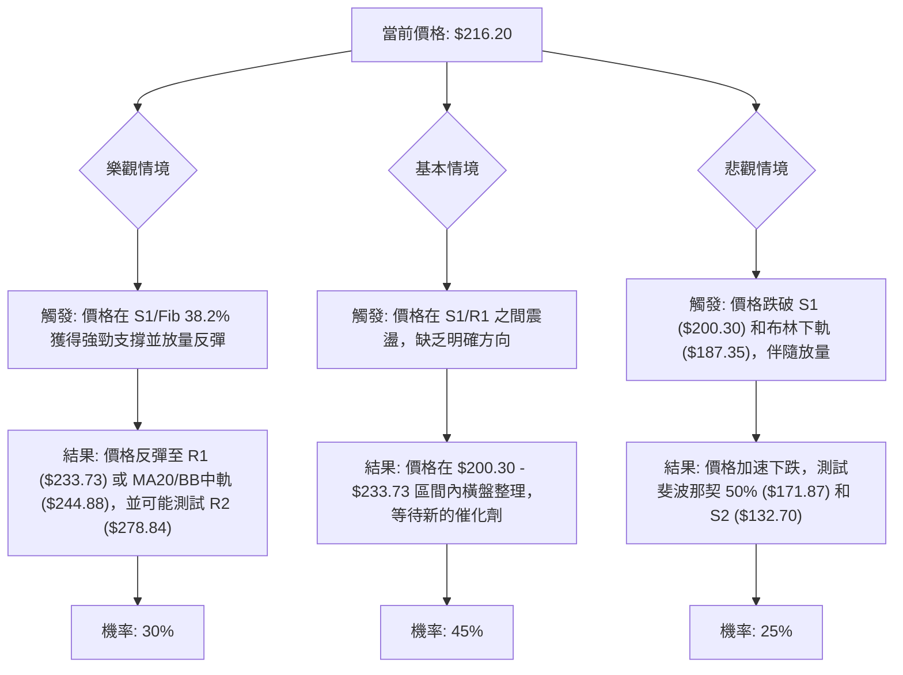

### 🛡️ 風險管理重要提醒

1.  **嚴格止損**: 鑑於 NBIS 的高波動性 (ATR 12.73%) 和當前弱勢動能，必須設定並嚴格執行止損點。止損應基於關鍵支撐位，並留有足夠的緩衝空間以應對短期波動。
2.  **倉位控制**: 在市場方向不明且風險較高的情況下，應採取輕倉策略，將單筆交易的風險控制在總資本的極小比例 (例如 1-2%)。避免重倉或滿倉操作。
3.  **避免追漲殺跌**: 弱趨勢/盤整市場中，價格容易出現假突破或假跌破。追漲殺跌往往導致被套。應耐心等待明確的訊號和價格行為確認。
4.  **分批建倉/減倉**: 如果決定參與區間交易，可以考慮分批建倉以平攤成本，並在價格達到目標位時分批減倉以鎖定利潤。
5.  **關注市場情緒與基本面**: 儘管本報告為技術分析，但在當前不確定的市場環境下，宏觀經濟因素、行業新聞以及公司基本面的任何變化都可能對股價產生重大影響。特別是 NBIS 作為高 Beta 股票，對市場情緒更為敏感。
6.  **時間框架一致性**: 確保您的交易策略與所選擇的時間框架一致。短線交易者應關注日線和小時線，而中長線投資者則應側重於週線和月線。在當前多時框訊號衝突的情況下，更應保持策略的紀律性。

---

## 📋 報告總結

```
NBIS 技術分析報告總結
════════════════════════════════════════════════════════
報告日期：2026-07-10
當前價格：$216.20
分析評級：⚖️ 中性偏空觀望 (市場處於長期趨勢中的強勢修正階段，缺乏明確方向)

關鍵結論：
├─ 長期趨勢：🟢 上漲，但高點出現V型反轉頂部形態與RSI頂背離，警惕大幅修正。
├─ 中期趨勢：🔴 下跌，價格已跌破MA50，MACD空頭排列。
├─ 短期趨勢：🔴 下跌，價格跌破MA20，ADX指示弱趨勢/盤整，量能疲弱。
├─ 關鍵支撐：$200.30 (S1) 與 $202.08 (斐波那契 38.2%) 形成重要疊加支撐區。
├─ 關鍵阻力：$233.73 (R1) 與 $244.88 (MA20/BB中軌) 構成短期反彈的強勁壓力。
└─ 分析師目標：若 S1 失守，推算目標價可能為 $140.33；若能反彈，目標 R1-R2 區間。

最優策略組合：
1. 🥇 **最佳機會 (謹慎做空)**：若價格有效跌破 $200.30 (S1)，則順勢做空，目標 $171.87 (斐波那契 50%)，止損 $205.00。風險報酬比約 4.5:1。
2. 🥈 **次選機會 (短線反彈)**：若價格在 $200.30 - $202.08 區間出現明確止跌訊號，可嘗試輕倉短線做多至 $219.80 (MA50) 或 $233.73 (R1)，止損 $195.00。風險報酬比約 1.9:1。
3. 🥉 **保守選擇 (觀望)**：鑑於市場方向不明、波動劇烈，且動能偏空，最保守的策略是保持觀望，等待價格跌至更強支撐 (如 $171.87) 或出現明確的築底反轉形態後再考慮入場。
════════════════════════════════════════════════════════
```

---

> ⚠️ **免責聲明**：本報告為 AI 自動生成之技術分析，所有數據及估算均基於提供的歷史價格資訊。本報告**僅供研究與學術參考**，**不構成任何投資建議**。投資有風險，入市需謹慎。

---

*報告生成時間：2026-07-10 ｜ 數據來源：Yahoo Finance ｜ 分析框架：多時框技術分析*