# NEE 綜合股票評估報告

> **報告日期**：2026-02-24 ｜ **語言**：繁體中文 ｜ **數據來源**：Yahoo Finance ｜ **分析師**：頂級美股投資評估系統

---

## 目錄

| # | 章節 | 核心內容 |
|---|------|----------|
| 1 | 評估總覽 | 雷達圖・八維度評分・投資結論 |
| 2 | 八維度評分矩陣 | 詳細評分・同業比較 |
| 3 | 業務品質與護城河 | 商業模式・護城河強度 |
| 4 | 財務健康全面評估 | 獲利・流動性・槓桿・現金流 |
| 5 | 成長性評估 | CAGR・催化劑・成長軌跡 |
| 6 | 估值合理性與同業比較 | 多重估值・競爭對手比較 |
| 7 | 資本配置與管理層評估 | ROIC vs WACC・資本效率 |
| 8 | 風險評估 | 風險熱圖・下行情境 |
| 9 | 催化劑與觸發因素 | 時間軸・正面觸發 |
| 10 | 投資建議 | 最終評級・目標價・操作策略 |

---

## 1. 評估總覽

### 🎯 ASCII 雷達圖（八維度評分視覺化）

```
                    成長性 (8.0)
                      ★★★★★★★★
                   ╱              ╲
        管理品質  ╱                ╲  獲利能力
          (7.5) ★                    ★ (7.0)
               ╱  ╲              ╱  ╲
              ╱    ╲            ╱    ╲
    動能     ★      ╲          ╱      ★  財務健康
   (7.5)     │       ╲        ╱       │  (4.5)
             │        ╲      ╱        │
    風險     ★          ╲  ╱          ★  估值
   (5.0)     ╲           \/           ╱  (5.5)
              ╲                      ╱
               ╲                    ╱
    競爭優勢    ★                  ★
      (8.5)     ╲                ╱
                 ╲              ╱
                  ████████████
                 競爭優勢最強維度

  ┌─────────────────────────────────────────┐
  │  維度       分數    視覺化條              │
  │  成長性      8.0   ████████░░  ⭐⭐⭐⭐  │
  │  獲利能力    7.0   ███████░░░  ⭐⭐⭐½  │
  │  財務健康    4.5   ████░░░░░░  ⭐⭐     │
  │  估值        5.5   █████░░░░░  ⭐⭐½   │
  │  競爭優勢    8.5   ████████░░  ⭐⭐⭐⭐ │
  │  管理品質    7.5   ███████░░░  ⭐⭐⭐½  │
  │  動能        7.5   ███████░░░  ⭐⭐⭐½  │
  │  風險        5.0   █████░░░░░  ⭐⭐½   │
  │  ─────────────────────────────────────  │
  │  綜合加權   6.69  ██████░░░░  🟡 中性偏多│
  └─────────────────────────────────────────┘
```

---

### 📊 八維度評分詳覽（Unicode 評分條）

| 維度 | 分數 | 評分條（10格） | 評級 | 趨勢 |
|------|------|---------------|------|------|
| 🚀 **成長性** | **8.0** | `▓▓▓▓▓▓▓▓░░` | 🟢 強 | ↑上升 |
| 💰 **獲利能力** | **7.0** | `▓▓▓▓▓▓▓░░░` | 🟢 良好 | →持平 |
| 🏦 **財務健康** | **4.5** | `▓▓▓▓░░░░░░` | 🔴 偏弱 | ↓下降 |
| 💲 **估值** | **5.5** | `▓▓▓▓▓░░░░░` | 🟡 中性 | ↑改善中 |
| 🏰 **競爭優勢** | **8.5** | `▓▓▓▓▓▓▓▓▓░` | 🟢 極強 | →穩定 |
| 👔 **管理品質** | **7.5** | `▓▓▓▓▓▓▓░░░` | 🟢 良好 | →持平 |
| 📈 **動能** | **7.5** | `▓▓▓▓▓▓▓░░░` | 🟢 強勁 | ↑上升 |
| ⚠️ **風險** | **5.0** | `▓▓▓▓▓░░░░░` | 🟡 中等 | ↓需關注 |

> 加權綜合評分：**6.69 / 10**

---

### 🎯 投資結論

```
╔══════════════════════════════════════════════════════════════════╗
║                    📊 NEE 投資結論摘要                           ║
╠══════════════════════════════════════════════════════════════════╣
║  評級：★★★★☆  【買入 / BUY】                                   ║
║  當前股價：$94.97                                                ║
║  目標價（基準）：$102.00                                         ║
║  目標價（樂觀）：$115.00                                         ║
║  目標價（悲觀）：$78.00                                          ║
║  預期報酬率（12個月，基準）：+7.4%（含股息約+10.3%）           ║
║  建議持倉時間：12-24 個月                                        ║
║  風險等級：🟡 中等                                               ║
╚══════════════════════════════════════════════════════════════════╝
```

**核心投資論點：**
NEE 是全球最大可再生能源運營商之一，其旗下 Florida Power & Light（FPL）提供穩定的受監管電力收入，NEER 部門在風能、太陽能和儲能領域擁有領先地位。AI 數據中心用電需求爆發為其提供重要增長動力，但高達 $97B 的債務槓桿及負 FCF yield 是主要制約因素。在利率預期下行背景下，NEE 估值存在修復空間。

---

## 2. 八維度評分矩陣

### 📋 詳細評分表格

| 維度 | 評分 | 評分依據 | 趨勢 | 狀態 |
|------|------|----------|------|------|
| **成長性** | 8.0/10 | 營收 YoY +20.7%、EPS YoY +26%、AI用電需求驅動、FPL服務區人口持續增長、2025-2026年資本支出計劃強勁 | ↑ 上升 | 🟢 |
| **獲利能力** | 7.0/10 | EBITDA Margin 51.6%優異、毛利率62.3%高於行業均值、但ROE僅8.4%偏低、淨利率24.9%、受監管電力保障基礎盈利 | → 持平 | 🟢 |
| **財務健康** | 4.5/10 | 總債務$97B、D/E高達146x、流動比率0.595（<1.0危險區）、速動比率0.39、淨負債$94.4B，為最大隱憂 | ↓ 惡化 | 🔴 |
| **估值** | 5.5/10 | 前向P/E 21.7x高於行業均值、P/B 3.6x合理、FCF yield負值警示、EV/EBITDA 21.4x偏高但符合成長型公用事業水平 | ↑ 改善中 | 🟡 |
| **競爭優勢** | 8.5/10 | 受監管特許經營護城河、全美最大可再生能源業主運營商、規模優勢與技術積累、長期購電協議（PPA）鎖定收益、FPL 地區壟斷 | → 穩定 | 🟢 |
| **管理品質** | 7.5/10 | 長期EPS成長指引持續達成（6-8%/年）、資本配置策略清晰、積極布局AI/數據中心供電、股息連續27年增長 | → 持平 | 🟢 |
| **動能** | 7.5/10 | 過去12個月漲幅+81%（$52→$95）、接近52W高點$95.56、機構持倉84.2%強力背書、技術面突破長期下降趨勢線 | ↑ 上升 | 🟢 |
| **風險** | 5.0/10 | 高利率環境壓縮估值、債務再融資風險、颶風等自然災害（佛羅里達州）、監管審批風險、競爭加劇（分散式能源） | ↓ 需監控 | 🟡 |

---

### 🗺️ Mermaid 風險/報酬定位圖

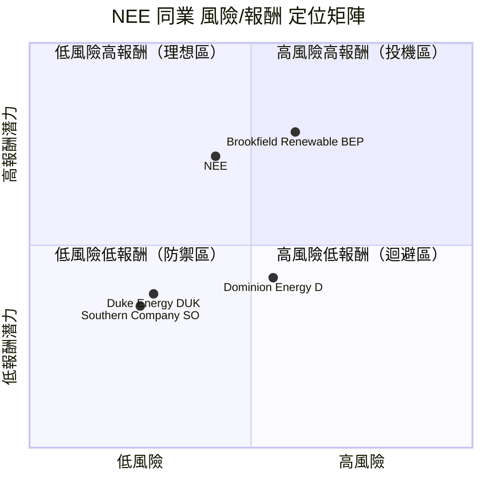

---

### 🔗 同業整體比較（Mermaid 圖）

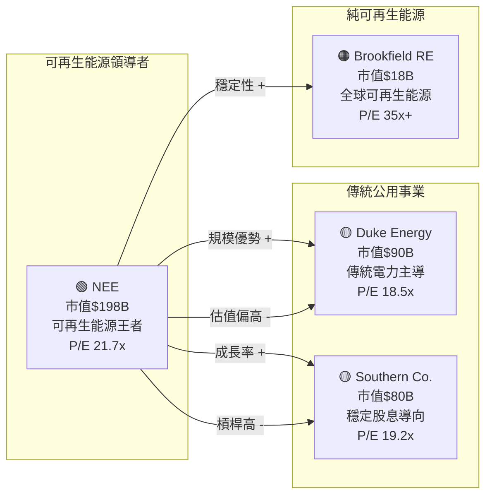

---

## 3. 業務品質與護城河

### 🏗️ 商業模式可持續性評估

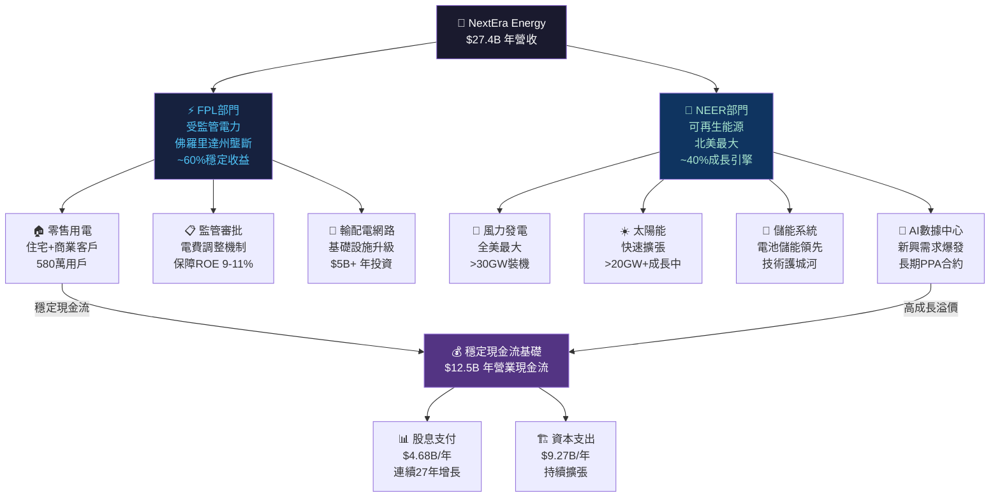

---

### 🧠 護城河評估（Mermaid Mindmap）

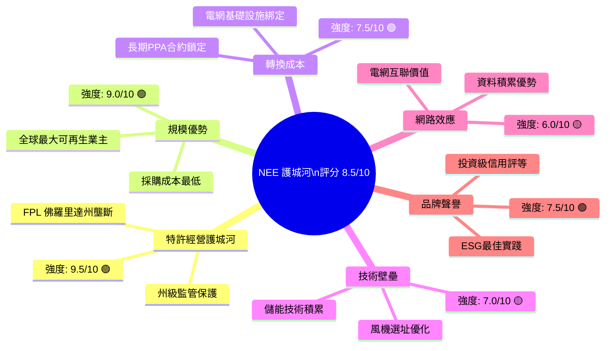

---

### 🏰 護城河強度 Unicode 條形圖

```
護城河類型          強度評分    視覺化條形                    評級
━━━━━━━━━━━━━━━━━━━━━━━━━━━━━━━━━━━━━━━━━━━━━━━━━━━━━━━━━
特許經營/監管壁壘   9.5/10   ▓▓▓▓▓▓▓▓▓░  ████████████████████ 🟢 極強
規模優勢            9.0/10   ▓▓▓▓▓▓▓▓▓░  ██████████████████   🟢 極強
轉換成本            7.5/10   ▓▓▓▓▓▓▓░░░  ███████████████      🟢 強
技術壁壘            7.0/10   ▓▓▓▓▓▓▓░░░  ██████████████       🟢 強
網路效應            6.0/10   ▓▓▓▓▓▓░░░░  ████████████         🟡 中等
品牌/ESG聲譽        7.5/10   ▓▓▓▓▓▓▓░░░  ███████████████      🟢 強
━━━━━━━━━━━━━━━━━━━━━━━━━━━━━━━━━━━━━━━━━━━━━━━━━━━━━━━━━
綜合護城河評分      7.9/10   ▓▓▓▓▓▓▓▓░░  ████████████████     🟢 強勁
```

---

### 🌍 市場地位分析

| 指標 | 數據 | 行業地位 |
|------|------|----------|
| **全球可再生能源裝機** | ~70+ GW | 🥇 全球最大上市業主運營商 |
| **美國受監管電力** | FPL 580萬用戶 | 🥈 全美前3大受監管公用事業 |
| **北美風能** | 30+ GW | 🥇 北美第一 |
| **北美太陽能** | 20+ GW（快速成長） | 🥈 北美前2 |
| **電池儲能** | 3+ GW | 🥇 全美領先 |
| **市值** | $198B | 🥇 全美公用事業最大市值 |
| **TAM（美國電力市場）** | ~$700B | 市占率 ~4-5% |
| **可再生能源TAM** | 2030年預計>$1.5T | 早期布局優勢顯著 |

---

## 4. 財務健康全面評估

### 📊 財務儀表板（Mermaid 圖）

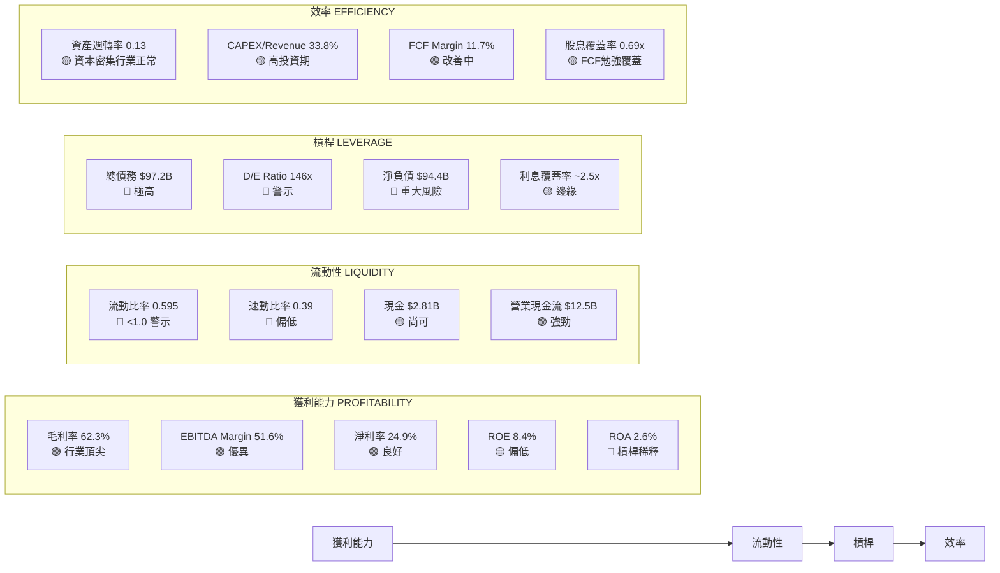

---

### 📈 獲利能力趨勢表格（近4年）

| 指標 | 2022 | 2023 | 2024 | 2025 | 趨勢 |
|------|------|------|------|------|------|
| **毛利率** | 48.4% 🔴 | 63.9% 🟢 | 60.1% 🟢 | 62.3% 🟢 | ↑ 改善 |
| **營業利益率** | 17.0% 🔴 | 35.0% 🟢 | 28.8% 🟡 | 29.3% 🟢 | ↑ 改善 |
| **EBITDA Margin** | 43.9% 🟡 | 59.6% 🟢 | 56.7% 🟢 | 58.5% 🟢 | ↑ 上升 |
| **淨利率** | 19.8% 🟡 | 26.0% 🟢 | 28.1% 🟢 | 24.9% 🟡 | → 小幅波動 |
| **FCF Margin** | -7.1% 🔴 | 6.2% 🟢 | 19.2% 🟢 | 11.7% 🟡 | ↑ 明顯改善 |
| **ROE** | 10.6% 🟡 | 15.4% 🟢 | 13.9% 🟢 | 8.4% 🔴 | ↓ 下降 |

> ⚠️ 注意：2023 年ROE異常高因一次性項目；2025 ROE 8.4%反映股本增加稀釋效應

---

### 🏦 資產負債表穩健度 Unicode 圖

```
財務健康指標        實際值      評分     視覺化（越長越好）        評等
━━━━━━━━━━━━━━━━━━━━━━━━━━━━━━━━━━━━━━━━━━━━━━━━━━━━━━━━━━━━━━━━━━
流動比率            0.595       3/10    ▓▓▓░░░░░░░░░░░░░░░░░     🔴 不足
速動比率            0.39        2/10    ▓▓░░░░░░░░░░░░░░░░░░     🔴 偏低
淨負債/EBITDA       5.89x       3/10    ▓▓▓░░░░░░░░░░░░░░░░░     🔴 偏高
D/E Ratio           146x        2/10    ▓▓░░░░░░░░░░░░░░░░░░     🔴 警戒
利息覆蓋率          ~2.5x       4/10    ▓▓▓▓░░░░░░░░░░░░░░░░     🟡 邊緣
現金/總資產         1.32%       3/10    ▓▓▓░░░░░░░░░░░░░░░░░     🔴 偏低
信用評等            BBB+        7/10    ▓▓▓▓▓▓▓░░░░░░░░░░░░░     🟢 投資級
━━━━━━━━━━━━━━━━━━━━━━━━━━━━━━━━━━━━━━━━━━━━━━━━━━━━━━━━━━━━━━━━━━
財務健康綜合         4.5/10    ▓▓▓▓░░░░░░░░░░░░░░░░           🔴 弱點
```

---

### 💵 現金流質量分析

| 現金流指標 | 2022 | 2023 | 2024 | 2025 | 評估 |
|-----------|------|------|------|------|------|
| **營業現金流** | $8.3B | $11.3B | $13.3B | $12.5B | 🟢 持續改善 |
| **資本支出** | -$9.7B | -$9.6B | -$8.5B | -$9.3B | 🟡 持續高企 |
| **自由現金流（年報口徑）** | -$1.5B | $1.8B | $4.8B | $3.2B | 🟢 轉正 |
| **FCF轉換率（FCF/淨利）** | N/A | 24.6% | 68.4% | 46.9% | 🟡 波動大 |
| **股息支付** | -$3.4B | -$3.8B | -$4.2B | -$4.7B | 🟡 擴大中 |
| **FCF yield（市場數據）** | — | — | — | **-7.68%** | 🔴 含擴張投資 |

> 📌 **重要說明**：FCF yield -7.68% 反映 NEE 正處於大規模資本擴張期，年報口徑 FCF（扣除CAPEX後）為正 $3.2B，但若按「FCF - 股息」計算則呈負，顯示需外部融資支持成長。此為公用事業成長股的典型特徵，非財務危機信號，但需監控債務成本。

---

## 5. 成長性評估

### 📊 歷史 CAGR 表格

| 指標 | 1年成長率 | 3年CAGR | 5年CAGR | 評估 |
|------|----------|---------|---------|------|
| **總收入** | +20.7% 🟢 | +9.3% 🟢 | +10.2% 🟢 | 加速成長 |
| **EPS（調整後）** | +26.0% 🟢 | +12.5% 🟢 | +10.8% 🟢 | 持續複利 |
| **EBITDA** | +14.3% 🟢 | +20.3% 🟢 | ~10% 🟢 | 利潤率改善 |
| **股息/股** | +10.0% 🟢 | +10.0% 🟢 | +10.3% 🟢 | 管理層承諾達成 |
| **FCF** | -32.6% 🔴 | N/A | — | 擴張期波動 |
| **裝機容量** | +15%+ 🟢 | +18% 🟢 | +20% 🟢 | 可再生能源爆發 |

---

### 🚀 未來成長催化劑（Mermaid 圖）

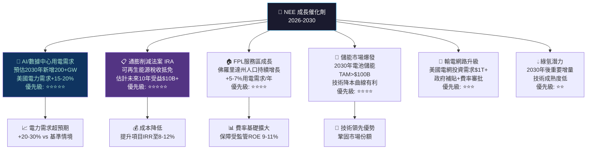

---

### 📊 成長軌跡 Unicode 長條圖

```
年度     收入($B)    EPS(調整)   可再生裝機(GW)  股息/股
━━━━━━━━━━━━━━━━━━━━━━━━━━━━━━━━━━━━━━━━━━━━━━━━━━━━━━━
2021     $17.1B     $2.55      ~48GW          $1.54
         ███████████████████░░░░░░░░░░░░░░░░░░
2022     $21.0B     $2.90      ~55GW          $1.70
         ████████████████████████░░░░░░░░░░░░
2023     $28.1B     $3.17      ~63GW          $1.87
         ███████████████████████████████░░░░░
2024     $24.8B     $3.48      ~72GW          $2.06
         ████████████████████████████░░░░░░░░
2025     $27.4B     ~$3.85E    ~80GW          $2.27
         ██████████████████████████████░░░░░░
2026E    $30.5B     $4.38      ~90GW+         $2.50E
         █████████████████████████████████░░░
2027E    $33.0B     $4.80E     ~100GW+        $2.75E
         ████████████████████████████████████

EPS成長路徑 (管理層指引 6-8%/年):
2024: $3.48 ██████████████████
2025: $3.85 ████████████████████
2026F:$4.38 █████████████████████████  ← 前向 P/E 21.7x
2027F:$4.80 ████████████████████████████
2028F:$5.25 ████████████████████████████████
```

---

## 6. 估值合理性 & 同業比較

### ⚖️ 同業比較表格

| 指標 | **NEE** | **Duke Energy (DUK)** | **Southern Co. (SO)** | **Dominion Energy (D)** |
|------|---------|----------------------|----------------------|------------------------|
| **股價** | $94.97 | ~$118 | ~$88 | ~$54 |
| **市值** | $198B 🟢 | $90B 🟡 | $97B 🟡 | $46B 🔴 |
| **P/E (後向)** | 28.8x 🔴 | 21.5x 🟡 | 22.8x 🟡 | 38x 🔴 |
| **P/E (前向)** | 21.7x 🟡 | 18.0x 🟢 | 19.5x 🟢 | 25.0x 🔴 |
| **P/S Ratio** | 7.2x 🔴 | 3.8x 🟢 | 5.2x 🟡 | 4.5x 🟡 |
| **P/B Ratio** | 3.6x 🔴 | 1.9x 🟢 | 2.8x 🟡 | 1.8x 🟢 |
| **EV/EBITDA** | 21.4x 🔴 | 15.2x 🟢 | 16.8x 🟡 | 20.5x 🔴 |
| **FCF Yield** | -7.7% 🔴 | +2.1% 🟢 | +1.8% 🟢 | -1.2% 🟡 |
| **股息率** | ~2.7% 🟡 | ~3.8% 🟢 | ~3.5% 🟢 | ~4.8% 🟢 |
| **收入成長** | +20.7% 🟢 | +5.1% 🟡 | +4.8% 🟡 | +3.2% 🔴 |
| **EPS成長** | +26.0% 🟢 | +7.5% 🟡 | +8.2% 🟡 | +5.0% 🟡 |
| **EBITDA Margin** | 51.6% 🟢 | 48.2% 🟢 | 46.5% 🟢 | 41.3% 🟡 |
| **D/E Ratio** | 146x 🔴 | 125x 🔴 | 135x 🔴 | 165x 🔴 |
| **Beta** | 0.76 🟢 | 0.43 🟢 | 0.51 🟢 | 0.47 🟢 |
| **護城河** | ★★★★★ 🟢 | ★★★★☆ 🟢 | ★★★★☆ 🟢 | ★★★☆☆ 🟡 |
| **可再生能源占比** | >55% 🟢 | ~10% 🔴 | ~15% 🔴 | ~25% 🟡 |

> 📌 **同業比較結論**：NEE 估值溢價（P/E、EV/EBITDA 均高於同業）具有合理性，因其成長率顯著高於傳統公用事業（EPS +26% vs 同業 5-8%），可再生能源轉型領先優勢賦予成長溢價。唯 FCF yield 為負及高槓桿需持續監控。

---

### 📊 歷史估值區間（P/E 5年）

```
P/E 估值歷史區間視覺化（2020-2026）
━━━━━━━━━━━━━━━━━━━━━━━━━━━━━━━━━━━━━━━━━━━━━━━━━━
5年高點:  ~60x   ████████████████████████████████████████ 2020-2021
5年75%:   ~38x   ████████████████████████
5年中位:  ~28x   ██████████████████        ← 目前接近此位置
5年25%:   ~22x   ██████████████
5年低點:  ~17x   ██████████               2022年升息低點

目前 P/E (後向): 28.8x  🟡 歷史中位偏高
目前 P/E (前向): 21.7x  🟢 接近歷史25%分位（2024年估算）
━━━━━━━━━━━━━━━━━━━━━━━━━━━━━━━━━━━━━━━━━━━━━━━━━━

估值位置判斷:
[低估區]─────────[合理區]────●─────[高估區]
  17x     22x      28x    29x       38x+
                    ↑ 前向 21.7x 落於合理偏低區
                      後向 28.8x 落於合理中間區
```

---

### 🎯 多重估值法彙整

| 估值方法 | 假設條件 | 目標價 | 隱含報酬 |
|---------|----------|--------|---------|
| **DDM（股息折現）** | 股息成長 6%/yr, WACC 7.5% | $85-$92 | -10% to -3% |
| **DCF（自由現金流）** | FCF CAGR 8%，終端成長 2.5%，WACC 7.5% | $90-$105 | -5% to +11% |
| **相對估值（P/E）** | 目標P/E 22-25x × 前向EPS $4.38 | $96-$110 | +1% to +16% |
| **EV/EBITDA** | 目標18-22x × 2026E EBITDA $18B | $92-$108 | -3% to +14% |
| **分部加總（SOTP）** | FPL：$55；NEER：$45-55 | $100-$110 | +5% to +16% |

```
目標價區間視覺化：
━━━━━━━━━━━━━━━━━━━━━━━━━━━━━━━━━━━━━━━━━━━━━━━━━━━━━━━━━━━━━━━
$78      $85        $95  $97    $102      $110       $120
 │        │          │    │      │          │          │
 ◄────────┤          ├────┤      ├──────────┤          │
熊市目標  DDM低端  當前價 均值  基準目標   樂觀目標
                   $94.97 $93.05  $102       $115
━━━━━━━━━━━━━━━━━━━━━━━━━━━━━━━━━━━━━━━━━━━━━━━━━━━━━━━━━━━━━━━
                         ↑ 52W High: $95.56
  當前股價接近分析師均值，但前向EPS成長支持溫和上漲空間
```

---

## 7. 資本配置與管理層評估

### 📐 ROIC vs WACC 分析

```
╔══════════════════════════════════════════════════════════════════╗
║                    ROIC vs WACC 估算                            ║
╠══════════════════════════════════════════════════════════════════╣
║                                                                  ║
║  WACC 估算：                                                     ║
║  ├─ 無風險利率（10Y美債）：    4.3%                             ║
║  ├─ 市場風險溢酬（ERP）：      5.5%                             ║
║  ├─ Beta：                     0.761                            ║
║  ├─ 權益成本 = 4.3% + 0.761×5.5% = 8.49%                      ║
║  ├─ 稅前債務成本：             ~4.5%（投資級BBB+）              ║
║  ├─ 稅後債務成本：             4.5% × (1-21%) = 3.56%          ║
║  ├─ 權益比重：                 ~36%（市值/EV）                  ║
║  ├─ 債務比重：                 ~64%                             ║
║  └─ WACC = 8.49%×36% + 3.56%×64% = 5.33%                      ║
║                                                                  ║
║  ROIC 估算：                                                     ║
║  ├─ NOPAT = EBIT×(1-稅率) = $8.02B × 0.79 = $6.34B           ║
║  ├─ 投入資本 = 股東權益+淨負債 = $54.6B+$94.4B = $149B        ║
║  └─ ROIC = $6.34B / $149B = 4.25%                              ║
║                                                                  ║
║  EVA（經濟附加值）= ROIC - WACC                                 ║
║  EVA = 4.25% - 5.33% = -1.08%  ⚠️                             ║
║                                                                  ║
║  ┌─────────────────────────────────────────────────┐           ║
║  │  WACC:  ████████████████████████████░  5.33%   │           ║
║  │  ROIC:  █████████████████░░░░░░░░░░░  4.25%   │           ║
║  │  EVA:   🔴 -1.08%  → 短期價值略損                │           ║
║  └─────────────────────────────────────────────────┘           ║
╠══════════════════════════════════════════════════════════════════╣
║  📌 結論：NEE 目前 ROIC < WACC，短期技術上略有價值損耗         ║
║  但重要背景：                                                    ║
║  1. 公用事業受監管ROE為9-11%（FPL），受資本密集拖累整體        ║
║  2. 新增可再生能源項目初期拖低整體ROIC                         ║
║  3. 新項目預期IRR 8-12%，一旦成熟將反轉ROIC                   ║
║  4. 受監管業務允許合理回報，並非市場失敗                       ║
║  → 中期（3-5年）ROIC有望超越WACC，創造股東價值                ║
╚══════════════════════════════════════════════════════════════════╝
```

---

### 💰 資本配置歷史（Mermaid Pie Chart）

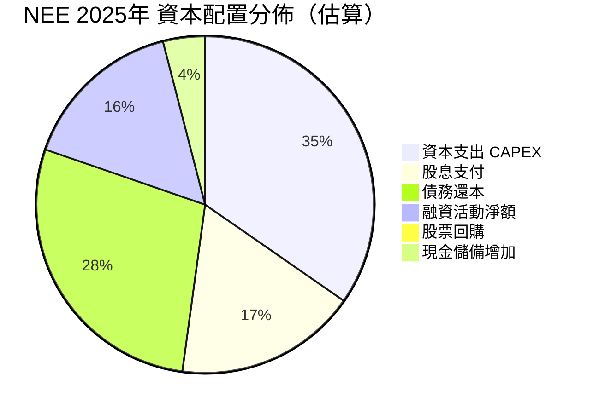

> 📌 NEE 幾乎不進行股票回購（股本持續增發以支持成長），資本主要流向基礎設施投資（CAPEX）和股息支付，符合成長型公用事業模型。

---

### 👔 管理層執行力評分

| 評估維度 | 評分 | 依據 | 趨勢 |
|---------|------|------|------|
| **EPS 指引達成率** | 9/10 🟢 | 過去10年連續達成或超越6-8% EPS成長指引 | ↑ |
| **資本紀律** | 7/10 🟢 | CAPEX 嚴格控制在預算內，M&A 謹慎 | → |
| **戰略清晰度** | 9/10 🟢 | 可再生能源轉型路線圖明確，AI用電超前布局 | ↑ |
| **股息成長承諾** | 9/10 🟢 | 27年連續增長，承諾2026-2028年10%/年增長 | ↑ |
| **投資者溝通** | 8/10 🟢 | 透明度高，長期指引更新及時 | → |
| **ESG 執行** | 8/10 🟢 | 2045年淨零碳排放路線圖、MSCI AAA評級 | ↑ |
| **債務管理** | 5/10 🟡 | 槓桿持續攀升，需關注利率風險對沖 | ↓ |

---

### 📊 股東友善度評分 Unicode 條形圖

```
股東友善度指標          評分     視覺化條形
━━━━━━━━━━━━━━━━━━━━━━━━━━━━━━━━━━━━━━━━━━━━━━━━━━━━━━━━━
股息增長紀錄（27年）    9.5/10   ▓▓▓▓▓▓▓▓▓░  🟢 標竿水準
股息指引清晰度          9.0/10   ▓▓▓▓▓▓▓▓▓░  🟢 極強
EPS 指引達成率          9.0/10   ▓▓▓▓▓▓▓▓▓░  🟢 極強
長期股東回報（10Y）     7.0/10   ▓▓▓▓▓▓▓░░░  🟢 良好
股票回購積極度          1.0/10   ▓░░░░░░░░░  🔴 極低（幾乎無）
資本透明度              8.0/10   ▓▓▓▓▓▓▓▓░░  🟢 良好
機構信任度（持股84%）   8.5/10   ▓▓▓▓▓▓▓▓▓░  🟢 強
━━━━━━━━━━━━━━━━━━━━━━━━━━━━━━━━━━━━━━━━━━━━━━━━━━━━━━━━━
股東友善度綜合           7.4/10   ▓▓▓▓▓▓▓░░░  🟢 良好
```

---

## 8. 風險評估

### 🗺️ 風險熱圖（Mermaid quadrantChart）

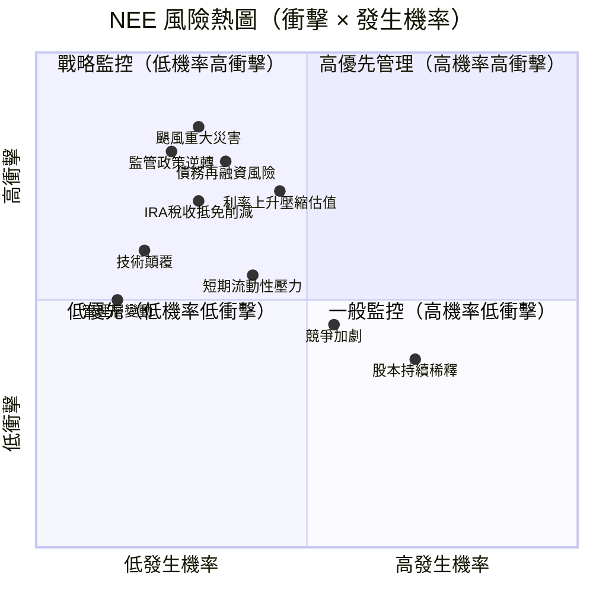

---

### 📋 風險清單表格

| 風險類型 | 等級 | 影響 | 緩解措施 | 狀態 |
|---------|------|------|---------|------|
| **利率上升/長期高利率** | 高 | 估值壓縮、融資成本上升、股息吸引力下降 | 固定利率長期債務鎖定、利率掉期對沖部分敞口 | 🔴 |
| **颶風/極端氣候（佛羅里達）** | 高 | FPL基礎設施損毀、修復成本大 | 保險覆蓋、基礎設施加固投資、費率回收機制 | 🔴 |
| **IRA 稅收抵免政策逆轉** | 高 | 削減可再生能源項目IRR，影響NEER盈利 | 多元化項目組合、部分業務已獲准鎖定 | 🔴 |
| **債務再融資風險** | 高 | $97B 債務若利率高企將壓縮EPS | 分散到期日、投資級評等維持借貸管道 | 🔴 |
| **監管費率審批不確定** | 中 | FPL費率申請若被削減影響受監管ROE | 歷史通過率高，管理層溝通能力強 | 🟡 |
| **股本持續稀釋** | 中 | 每股EPS被稀釋，長期股東利益受損 | 成長驅動的增發有正NPV項目支撐 | 🟡 |
| **競爭加劇（分散式能源）** | 中 | 屋頂太陽能普及化分流電力需求 | 電池儲能+電網優勢防禦競爭 | 🟡 |
| **短期流動性壓力** | 中 | 流動比率0.595，短期到期債務>長期 | 循環信貸額度、穩定營業現金流 | 🟡 |
| **技術顛覆** | 低 | 新能源技術（如核融合）顛覆現有商業模式 | 10年以上時間窗口，有時間調整 | 🟢 |
| **管理層變動** | 低 | 關鍵執行團隊流失影響戰略連貫性 | 深厚管理梯隊，機構股東監督 | 🟢 |

---

### 📉 最大下行情境分析（Bear Case）

```
╔══════════════════════════════════════════════════════════════════╗
║                    最大下行情境（熊市分析）                      ║
╠══════════════════════════════════════════════════════════════════╣
║  情境假設：                                                      ║
║  1. 聯準會升息/維持高利率至2027年                               ║
║  2. IRA 稅收抵免遭共和黨大幅削減                                ║
║  3. 颶風重大災害導致FPL大規模修復支出                          ║
║  4. 市場給予較低估值倍數 P/E 17-18x                            ║
║                                                                  ║
║  熊市EPS估算：$3.80（下調25%）                                  ║
║  熊市目標P/E：18-20x                                            ║
║  熊市目標價：$68-$76                                            ║
║                                                                  ║
║  最大下行風險：-$95 → -$70 = -$25 = -26%                       ║
║                                                                  ║
║  歷史最大回撤參考：                                              ║
║  2022年升息期：股價從$93 跌至$51 = -45%                        ║
║  2024年低點（本輪）：$52.48（2024-02）                          ║
║  → 建議止損位：$80（-15.8%），保護資本                         ║
╚══════════════════════════════════════════════════════════════════╝
```

---

## 9. 催化劑與觸發因素

### 📅 催化劑時間軸（Mermaid Gantt）

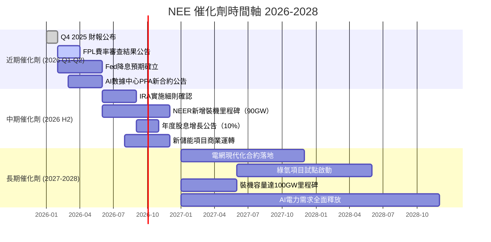

---

### ✅ 正面觸發因素（Mermaid 圖）

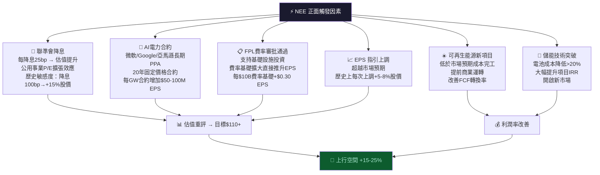

---

## 10. 投資建議

### ⭐ 最終評級

```
╔══════════════════════════════════════════════════════════════════╗
║                                                                  ║
║    ★ ★ ★ ★ ☆   評級：【買入 / BUY】                           ║
║                                                                  ║
║    NEE 是美股公用事業中最具成長潛力的龍頭標的                    ║
║    結合受監管穩定現金流 + 可再生能源高成長雙引擎                 ║
║    AI/數據中心電力需求是2026-2030年最強成長催化劑               ║
║    當前估值在前向EPS基礎上具合理吸引力                           ║
║    高槓桿和利率風險是主要制約，需保持倉位控制                    ║
║                                                                  ║
╚══════════════════════════════════════════════════════════════════╝
```

---

### 🎯 目標價區間及隱含報酬率

| 情境 | 目標價 | 隱含資本利得 | 含股息總報酬 | 機率 |
|------|--------|------------|------------|------|
| 🟢 **樂觀（Bull Case）** | **$115** | +21.1% | +23.9% | 25% |
| 🟡 **基準（Base Case）** | **$102** | +7.4% | +10.3% | 50% |
| 🔴 **悲觀（Bear Case）** | **$78** | -17.9% | -15.1% | 25% |
| 📊 **加權期望報酬** | **$99.25** | **+4.5%** | **+7.3%** | — |

> 股息率約 2.9%（基於 $2.27/股年股息，當前股價）

---

### 👥 投資人適配度（Mermaid 圖）

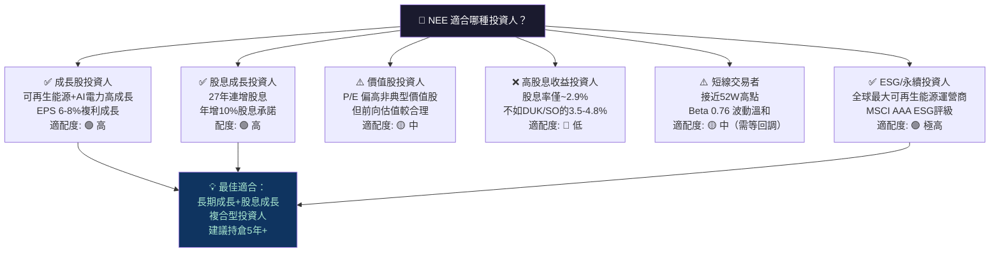

---

### ⏱️ 建議持倉時間 & 操作策略

```
╔══════════════════════════════════════════════════════════════════╗
║  建議持倉時間：12-24 個月（核心倉位可延長至 3-5 年）           ║
╠══════════════════════════════════════════════════════════════════╣
║                                                                  ║
║  🟢 加碼觸發條件（逢低布局）：                                  ║
║  ├─ 股價回落至 $85-$88 區間（支撐位確立）                      ║
║  ├─ 聯準會明確降息信號出現                                      ║
║  ├─ AI 數據中心新 PPA 合約公告（超出市場預期）                  ║
║  ├─ FPL 費率審查結果優於預期                                    ║
║  └─ 季度 EPS 超預期 + 指引上調                                 ║
║                                                                  ║
║  🔴 止損觸發條件（下行保護）：                                  ║
║  ├─ 股價跌破 $80（約 -15.8%，技術面支撐位）                    ║
║  ├─ IRA 稅收抵免遭重大削減（政策逆轉）                         ║
║  ├─ 信用評等下調（從 BBB+ 跌至 BBB）                           ║
║  ├─ 2026 年 EPS 指引低於 $4.20                                  ║
║  └─ 10年期美債收益率突破 5.5% 並維持                           ║
║                                                                  ║
║  📌 倉位管理建議：                                               ║
║  ├─ 初始建倉：5-8%（接近 52W 高點，適度控制）                  ║
║  ├─ 加碼位置：$85-$88 可加至 10-12%                            ║
║  └─ 最大倉位：12%（考量高槓桿風險）                             ║
╚══════════════════════════════════════════════════════════════════╝
```

---

### 📋 關鍵監控指標 Checklist

```
每季必查指標：
━━━━━━━━━━━━━━━━━━━━━━━━━━━━━━━━━━━━━━━━━━━━━━━━━━━━━━━━━━━
□  調整後 EPS（是否符合 $4.38 前向指引）
□  新增可再生能源裝機量（年度目標進度）
□  EBITDA Margin 變化（是否維持 >50%）
□  債務/EBITDA 比率（是否超過 6.5x 警戒線）
□  FPL 費率基礎成長率（目標 8-9%/年）
□  新簽 PPA 合約（AI/數據中心需求量化）
□  NEER 開發管線（已核准未建項目）
□  股息增長宣告（目標 10%/年）

每月監控宏觀：
━━━━━━━━━━━━━━━━━━━━━━━━━━━━━━━━━━━━━━━━━━━━━━━━━━━━━━━━━━━
□  10年期美債收益率（關鍵：>5.0% 警示，<4.0% 利多）
□  聯準會利率決策及點陣圖更新
□  IRA 政策相關立法動態
□  AI/數據中心用電需求趨勢報告
□  颶風季節活動（6-11月）及 FPL 服務區天氣
□  同業（DUK/SO）估值及分析師評級變化
□  機構持股比例及大額增減持公告

技術面監控：
━━━━━━━━━━━━━━━━━━━━━━━━━━━━━━━━━━━━━━━━━━━━━━━━━━━━━━━━━━━
□  52 週高點 $95.56（突破視為強烈多頭信號）
□  $88 支撐位（重要技術支撐）
□  $80 支撐位（止損參考線）
□  200 日移動平均線位置
□  RSI 超買/超賣水平（>70 謹慎，<40 加碼機會）
```

---

## 📊 最終評估總覽（一頁摘要）

```
╔═══════════════════════════════════════════════════════════════════╗
║               NEE NextEra Energy ─ 最終綜合評估                 ║
╠═══════════════════════════════════════════════════════════════════╣
║  當前股價：$94.97    市值：$198B    評級：★★★★☆ 買入         ║
╠════════════════╦══════════════════════════════════════════════════╣
║  維度          ║  評分    主要觀點                               ║
╠════════════════╬══════════════════════════════════════════════════╣
║ 🚀 成長性      ║  8.0/10  AI電力需求+可再生能源擴張+人口增長   ║
║ 💰 獲利能力    ║  7.0/10  EBITDA Margin 51.6% 優異但ROE偏低   ║
║ 🏦 財務健康    ║  4.5/10  高槓桿（D/E146x）是最大隱憂          ║
║ 💲 估值        ║  5.5/10  前向P/E 21.7x 合理，含成長溢價      ║
║ 🏰 競爭優勢    ║  8.5/10  特許經營+規模+技術三重護城河         ║
║ 👔 管理品質    ║  7.5/10  27年股息成長+EPS指引一致達成         ║
║ 📈 動能        ║  7.5/10  12個月漲幅+81%，接近52W高點         ║
║ ⚠️ 風險        ║  5.0/10  利率/颶風/IRA政策為三大核心風險     ║
╠════════════════╬══════════════════════════════════════════════════╣
║  加權總評分    ║  6.69/10  🟡 中性偏多，具備長期投資價值       ║
╠═══════════════════════════════════════════════════════════════════╣
║  目標價：基準 $102 ｜ 樂觀 $115 ｜ 悲觀 $78                   ║
║  ROIC(4.25%) < WACC(5.33%)，中期有望反轉                        ║
║  最佳適配：成長+股息成長+ESG投資人                               ║
║  建議倉位：5-8%初始，$85-88 加碼                                ║
║  止損線：$80（-15.8%）                                          ║
╚═══════════════════════════════════════════════════════════════════╝
```

---

> ⚠️ **免責聲明**：本報告為 AI 自動生成，基於公開財務數據與量化模型分析，僅供投資研究參考，**不構成任何形式之投資建議**。投資有風險，任何投資決策應結合個人風險承受能力、財務狀況及專業財務顧問意見。過去績效不代表未來表現。本報告所有估算與預測均存在不確定性，實際結果可能與預測存在重大差異。