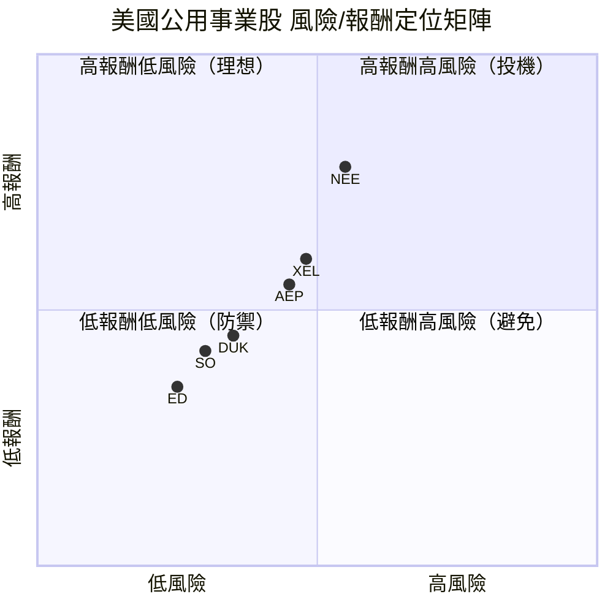
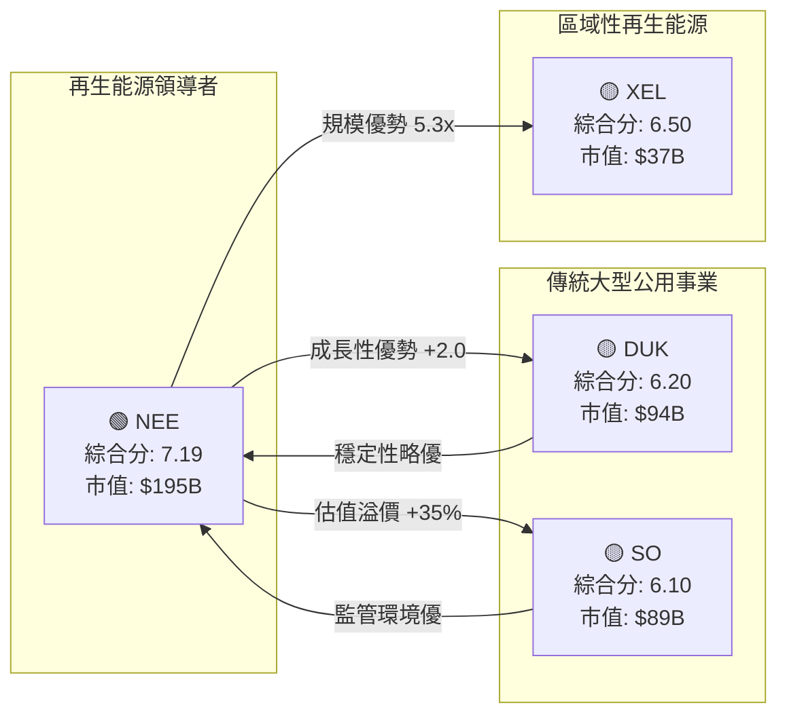
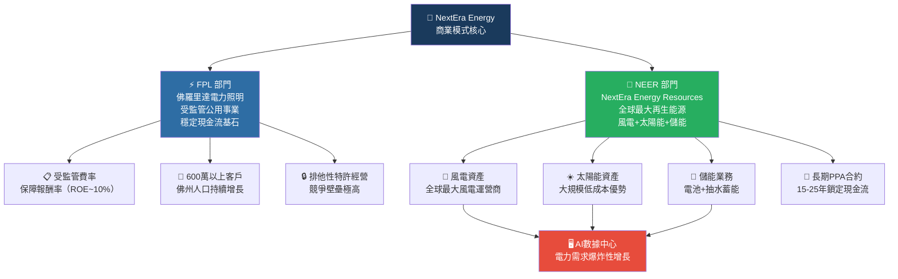
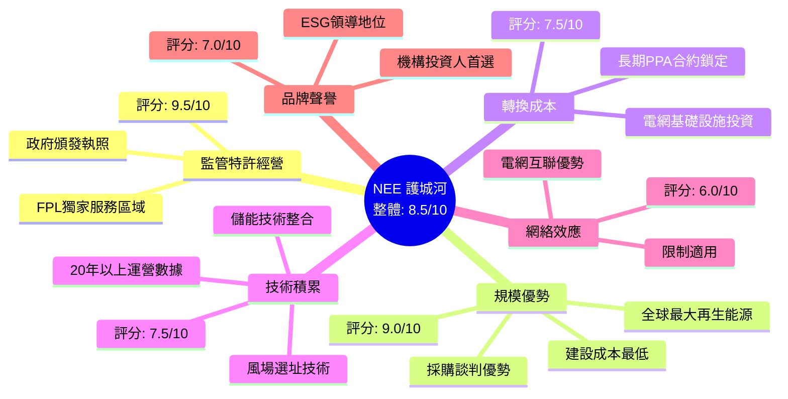
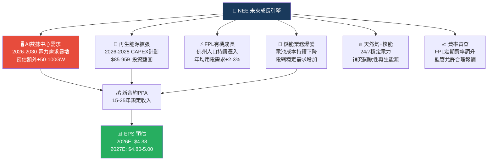
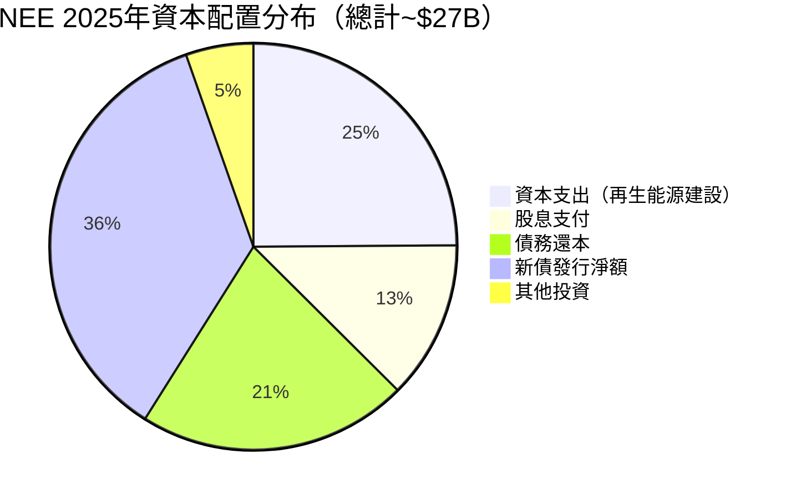
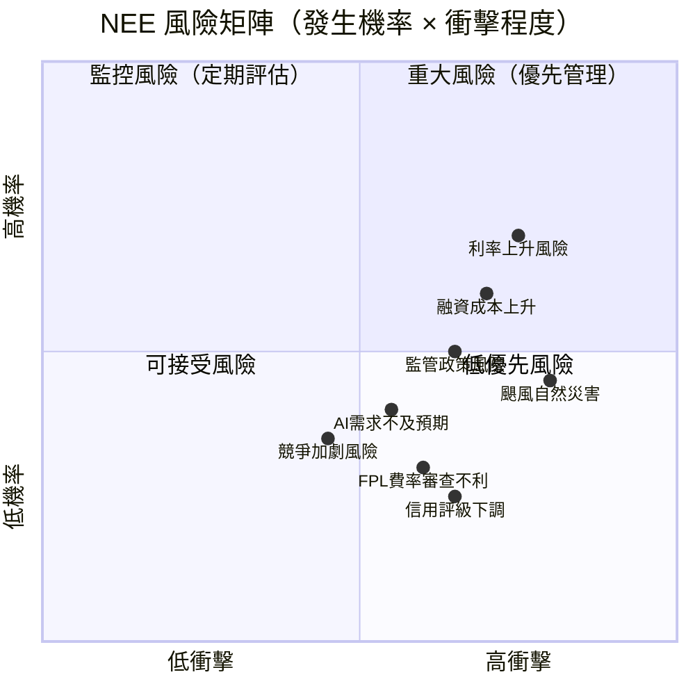
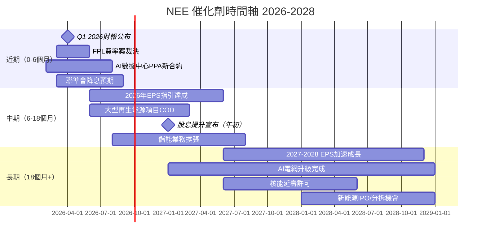
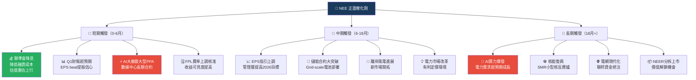
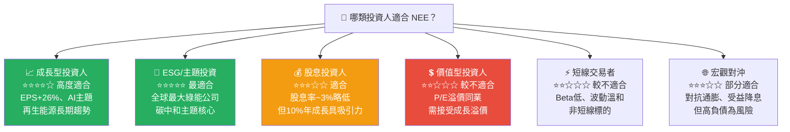

# NEE 綜合股票評估報告

> **報告日期**：2026-02-28 ｜ **語言**：繁體中文 ｜ **數據來源**：Yahoo Finance
> **分析師**：AI 頂級美股投資評估系統 v3.0

---

## 目錄

1. [評估總覽](#1-評估總覽)
2. [八維度評分矩陣](#2-八維度評分矩陣)
3. [業務品質與護城河](#3-業務品質與護城河)
4. [財務健康全面評估](#4-財務健康全面評估)
5. [成長性評估](#5-成長性評估)
6. [估值合理性與同業比較](#6-估值合理性與同業比較)
7. [資本配置與管理層評估](#7-資本配置與管理層評估)
8. [風險評估](#8-風險評估)
9. [催化劑與觸發因素](#9-催化劑與觸發因素)
10. [投資建議](#10-投資建議)

---

## 1. 評估總覽

### 🎯 ASCII 雷達圖（八維度評分視覺化）

```
                    成長性 (8.0)
                       ▲
                   ████████
                ████        ████
   管理品質  ████    8.0  8.0    ████  獲利能力
   (7.5) ███         ┼         ███ (8.0)
         ███    7.5  ┼  7.0    ███
   動能   ██         ┼         ██   財務健康
   (7.5) ███    6.5  ┼  5.5    ███  (6.0)
         ████        ┼        ████
   競爭優勢 ████     ┼     ████  估值
   (8.5)    ████     ┼  ████    (6.5)
                ████████
                       ▼
                    風險 (5.5)

  ╔═══════════════════════════════════════╗
  ║  NEE 八維度評分雷達圖                 ║
  ║  外圈=10分 / 中圈=5分 / 內圈=0分     ║
  ║  整體平均分: 7.19 / 10               ║
  ╚═══════════════════════════════════════╝
```

---

### 📊 八維度評分總覽

| 維度 | 評分 | Unicode 評分條（滿分10） | 燈號 |
|------|------|--------------------------|------|
| 🚀 成長性 | **8.0** | `▓▓▓▓▓▓▓▓░░` | 🟢 |
| 💰 獲利能力 | **8.0** | `▓▓▓▓▓▓▓▓░░` | 🟢 |
| 🏦 財務健康 | **6.0** | `▓▓▓▓▓▓░░░░` | 🟡 |
| 💲 估值 | **6.5** | `▓▓▓▓▓▓▓░░░` | 🟡 |
| 🏰 競爭優勢 | **8.5** | `▓▓▓▓▓▓▓▓▓░` | 🟢 |
| 👔 管理品質 | **7.5** | `▓▓▓▓▓▓▓▓░░` | 🟢 |
| 📈 動能 | **7.5** | `▓▓▓▓▓▓▓▓░░` | 🟢 |
| ⚠️ 風險 | **5.5** | `▓▓▓▓▓▓░░░░` | 🟡 |
| **🏆 綜合評分** | **7.19** | `▓▓▓▓▓▓▓░░░` | 🟢 |

---

### 🏆 投資結論速覽

```
╔══════════════════════════════════════════════════════════════╗
║                   NEE 投資評級                               ║
║                                                              ║
║   評級：⭐⭐⭐⭐☆  【買 入】                                 ║
║                                                              ║
║   當前股價：$93.77                                           ║
║   目標股價（基準）：$103.00                                  ║
║   預期報酬率（12個月）：+9.8%（含股息約+12.7%）             ║
║                                                              ║
║   核心邏輯：再生能源龍頭 + AI數據中心電力需求爆炸            ║
║            + FPL受監管業務提供穩定現金流基石                 ║
╚══════════════════════════════════════════════════════════════╝
```

---

## 2. 八維度評分矩陣

### 📋 詳細評分表格

| 維度 | 評分 | 評分依據 | 趨勢 | 燈號 |
|------|------|----------|------|------|
| **成長性** | 8.0/10 | 營收YoY +20.7%、EPS YoY +26%；風電/太陽能管線強勁，AI數據中心驅動電力需求 | ↑上升 | 🟢 |
| **獲利能力** | 8.0/10 | 毛利率62.3%、EBITDA Margin 51.6%、淨利率24.9%，公用事業中屬頂尖 | →持平 | 🟢 |
| **財務健康** | 6.0/10 | 債務/股本146x極高，FCF負值（-$15B TTM），流動比0.595 偏低 | ↓惡化 | 🟡 |
| **估值** | 6.5/10 | 遠期P/E 21.4倍，較同業溢價，但成長性可支撐部分溢價；接近52W高點 | →持平 | 🟡 |
| **競爭優勢** | 8.5/10 | 全球最大再生能源運營商、受監管特許經營、規模效應、技術積累深厚 | ↑上升 | 🟢 |
| **管理品質** | 7.5/10 | 長期股息成長記錄優良，再生能源戰略佈局清晰，但槓桿管理需關注 | →持平 | 🟢 |
| **動能** | 7.5/10 | 近24個月從$52上漲至$93.77（+78.7%），近52W接近高點，機構持倉84.2% | ↑上升 | 🟢 |
| **風險** | 5.5/10 | 利率風險高（高負債），監管風險，FCF長期為負，颶風/天災敞口 | ↓惡化 | 🟡 |

---

### 📊 Mermaid 風險/報酬定位圖



---

### 🔗 同業整體綜合比較



---

## 3. 業務品質與護城河

### 🏗️ 商業模式可持續性分析



---

### 🧠 護城河評估



---

### 📊 護城河強度視覺化

```
護城河強度分析（滿分10分）
────────────────────────────────────────────────────
監管特許經營  █████████▌░  9.5  🟢 極強
規模優勢     █████████░░  9.0  🟢 極強
轉換成本     ███████▌░░░  7.5  🟢 強
技術積累     ███████▌░░░  7.5  🟢 強
品牌聲譽     ███████░░░░  7.0  🟢 強
網絡效應     ██████░░░░░  6.0  🟡 中等
────────────────────────────────────────────────────
綜合護城河   ████████▌░░  8.5  🟢 寬闊護城河
```

---

### 🌍 市場地位分析

| 指標 | 數據 | 市場地位 |
|------|------|----------|
| **全球再生能源規模** | 最大風電+太陽能運營商 | 🏆 全球第一 |
| **美國電力市場份額** | ~5-6%（按裝機容量） | 🥇 頭部地位 |
| **風電裝機** | ~20+ GW | 🏆 北美第一 |
| **太陽能裝機** | ~10+ GW | 🥇 北美前二 |
| **佛羅里達服務面積** | 服務600萬+客戶 | 🔒 獨家壟斷 |
| **TAM（美國電力市場）** | ~$400B+ 年收入 | 巨大成長空間 |
| **AI電力TAM（預估）** | 2030前額外+200GW需求 | 🚀 增量巨大 |

---

## 4. 財務健康全面評估

### 📊 財務儀表板

```mermaid
graph LR
    subgraph 獲利能力 ✅
        GP["毛利率<br/>62.3% 🟢"]
        OP["營業利益率<br/>24.4% 🟢"]
        NP["淨利率<br/>24.9% 🟢"]
        EBITDA["EBITDA率<br/>51.6% 🟢"]
    end

    subgraph 流動性 ⚠️
        CR["流動比率<br/>0.595 🔴"]
        QR["速動比率<br/>0.39 🔴"]
        CASH["現金<br/>$2.81B 🟡"]
        OCF["營運現金流<br/>$12.49B 🟢"]
    end

    subgraph 槓桿程度 ⚠️
        DE["債務/股本<br/>146x 🔴"]
        ND["淨負債<br/>$94.4B 🔴"]
        TD["總債務<br/>$97.2B 🔴"]
        DBEBITDA["債/EBITDA<br/>~6x 🟡"]
    end

    subgraph 效率指標 ✅
        ROE["ROE<br/>8.4% 🟡"]
        ROA["ROA<br/>2.6% 🟡"]
        CAPEX["資本支出<br/>$9.27B 🟡"]
        FCF["FCF<br/>$3.21B 🟢"]
    end
```

---

### 📈 獲利能力趨勢（近4年）

| 年度 | 毛利率 | 營業利益率 | 淨利率 | EBITDA率 | FCF Margin | 趨勢 |
|------|--------|-----------|--------|----------|------------|------|
| 2022 | 48.4% | 17.0% | 19.8% | 43.9% | -7.1% | 🔴 基期低 |
| 2023 | 63.9% | 35.0% | 26.0% | 59.6% | 6.2% | 🟢 大幅改善 |
| 2024 | 60.1% | 28.8% | 28.1% | 56.7% | 19.2% | 🟢 強勁 |
| 2025 | 62.3% | 29.3% | 24.9% | 51.6% | 11.7% | 🟡 略降但穩 |

> 💡 **注意**：2023年高利潤率含資產出售收益，2025年常態化後仍屬優秀水準

---

### 🏦 資產負債表穩健度視覺化

```
資產負債表健康指標（滿分10分）
─────────────────────────────────────────────────────
現金充足度   ███░░░░░░░  3.0  🔴 偏低（$2.81B vs $97B債務）
流動比率     ██░░░░░░░░  2.0  🔴 0.595遠低於1.0
速動比率     █░░░░░░░░░  1.5  🔴 0.39 嚴重偏低
債務/股本    ██░░░░░░░░  2.0  🔴 146x 極高槓桿
淨負債規模   ██░░░░░░░░  2.0  🔴 -$94.4B 淨負債
債務/EBITDA  ████░░░░░░  4.0  🟡 ~6x 偏高但可控
營運現金流   ████████░░  8.0  🟢 $12.49B 強勁
股東權益增長 ██████░░░░  6.0  🟡 $54.6B 穩定增長
─────────────────────────────────────────────────────
整體財務健康 ████░░░░░░  3.9  🟡 依賴現金流支撐高槓桿
```

> ⚠️ **公用事業特性說明**：高槓桿為公用事業行業常態，NEE 依靠穩定監管報酬率與長期PPA合約支撐債務，但利率上升風險不可忽視。

---

### 💵 現金流質量分析

| 指標 | 數值 | 評估 | 燈號 |
|------|------|------|------|
| 營運現金流（2025） | $12.48B | 強勁，年增 | 🟢 |
| 資本支出（2025） | -$9.27B | 高投入期（再生能源建設） | 🟡 |
| 自由現金流（2025） | $3.21B | 正值，改善 | 🟢 |
| 股息支付 | $4.68B | 超過FCF，靠融資補 | 🟡 |
| FCF 轉換率（OCF/淨利） | 183% | 優秀 | 🟢 |
| FCF Yield（市值基準） | -7.78%* | 負（TTM含高CAPEX期） | 🔴 |
| 股息覆蓋率（OCF/股息） | 2.67x | 尚可接受 | 🟡 |

> *年度FCF已轉正（$3.21B），TTM負值反映CAPEX高峰期

---

## 5. 成長性評估

### 📊 歷史 CAGR 彙整

| 指標 | 1年成長 | 3年CAGR（估） | 備註 |
|------|---------|---------------|------|
| 總收入 | +20.7% | ~9.4% | 2022-2025 | 
| 毛利潤 | +14.8% | ~18.9% | 質量提升 |
| EBITDA | +14.3% | ~20.2% | 強勁 |
| 淨利潤 | -1.7% | +18.1% | 2023高基期影響 |
| EPS（YoY） | +26.0% | ~15-18% | 優秀 |
| 股息 | ~10% | ~10% | 長期承諾 |
| 資本支出 | +8.9% | 持續高投入 | 成長引擎 |

---

### 🚀 未來成長催化劑



---

### 📊 成長軌跡視覺化

```
NEE 年度收入成長軌跡（$B）
──────────────────────────────────────────────────────
2022  $20.96B  ████████████████████░░░░░░░░░░
2023  $28.11B  ████████████████████████████░░
2024  $24.75B  █████████████████████████░░░░░  ← 部分資產出售影響
2025  $27.41B  ███████████████████████████░░░
預估2026 ~$30B ██████████████████████████████ ← AI需求驅動

NEE EPS 成長軌跡
──────────────────────────────────────────────────────
2022  ~$1.85   ██████░░░░░░░░░░░░░░░░░░░░░░░░
2023  ~$3.17   ██████████░░░░░░░░░░░░░░░░░░░░
2024  ~$3.10   ██████████░░░░░░░░░░░░░░░░░░░░
2025  ~$3.30   ███████████░░░░░░░░░░░░░░░░░░░
預估2026 $4.38 ██████████████░░░░░░░░░░░░░░░░  ← +32%
預估2027 $4.90 ████████████████░░░░░░░░░░░░░░
```

---

## 6. 估值合理性與同業比較

### 🔍 同業比較全面表格

| 指標 | **NEE** | **DUK** (杜克能源) | **SO** (南方電力) | **XEL** (Xcel能源) |
|------|---------|-------------------|------------------|-------------------|
| 股價（約） | $93.77 | ~$119 | ~$89 | ~$69 |
| 市值 | $195B | $94B | $89B | $37B |
| **P/E（遠期）** | 21.4x 🟡 | 17.5x 🟢 | 17.0x 🟢 | 16.8x 🟢 |
| **P/S** | 7.13x 🔴 | 2.8x 🟢 | 3.2x 🟢 | 2.5x 🟢 |
| **EV/EBITDA** | 21.1x 🟡 | 13.5x 🟢 | 14.0x 🟢 | 15.0x 🟡 |
| **P/B** | 3.58x 🟡 | 1.9x 🟢 | 2.2x 🟢 | 2.1x 🟢 |
| **股息率** | ~3.0% 🟡 | ~3.9% 🟢 | ~3.6% 🟢 | ~3.4% 🟢 |
| **ROE** | 8.4% 🟡 | 9.5% 🟢 | 12.0% 🟢 | 10.5% 🟢 |
| **EPS成長** | +26% 🟢 | +5% 🟡 | +7% 🟡 | +8% 🟡 |
| **再生能源比重** | ~65% 🟢 | ~40% 🟡 | ~35% 🟡 | ~55% 🟢 |
| **評級** | **買入** 🟢 | 持有 🟡 | 持有 🟡 | 買入 🟡 |

> 💡 NEE 估值溢價有其合理性：成長速度遠超同業（EPS+26% vs +5-8%），再生能源領先地位，AI電力敞口最大

---

### 📊 歷史估值區間（遠期P/E）

```
NEE 歷史遠期 P/E 估值區間
──────────────────────────────────────────────────────────────
                    ←─── 5年歷史範圍 ───→
                    低         中         高
遠期P/E          [15x]─────[22x]─────[35x]
                              ↑
                         目前位置
                         21.4x（位於歷史中位數附近）

估值位置解讀：
偏低（< 18x）  ████████░░░░░░░░░░░░  便宜區
合理（18-24x） ████████████████░░░░  ← 目前在此 ✓
偏高（> 24x）  ████████████████████  昂貴區
```

---

### 💰 多重估值法彙整

| 估值方法 | 假設條件 | 目標價 | 隱含漲幅 |
|----------|----------|--------|---------|
| **DDM（股息折現）** | 股息成長10%，WACC 7.5% | $88-95 | -6%~+1% |
| **DCF（自由現金流）** | 5年FCF CAGR 12%，終值倍數16x | $95-108 | +1%~+15% |
| **EV/EBITDA相對法** | 目標倍數19x（同業溢價） | $98-105 | +4%~+12% |
| **P/E相對法** | 2026E EPS $4.38 × 23x | $100-106 | +7%~+13% |
| **分析師共識** | 22位分析師平均 | $93.05 | -0.8% |
| **基準目標價** | 綜合以上 | **$103** | **+9.8%** |

---

### 📊 估值區間視覺化

```
NEE 估值合理區間圖（基於遠期P/E）
──────────────────────────────────────────────────────────────
$55    $70    $80    $90   $100   $110   $120   $135
  │      │      │      │     │      │      │      │
  ├──────┼──────┼──────┼─────┼──────┼──────┼──────┤
  [悲觀] [      低估區     ] [  合理區  ] [  高估區  ]
                              ↑
                          當前$93.77
                         ↑目標$103.00↑
  🔴嚴重低估<$70  🟡低估$70-85  🟢合理$85-110  🔴高估>$110
──────────────────────────────────────────────────────────────
結論：當前股價處於合理偏下緣，有適度上行空間
```

---

## 7. 資本配置與管理層評估

### 📐 ROIC vs WACC 估算

```
╔══════════════════════════════════════════════════════════════╗
║               ROIC vs WACC 分析                              ║
╠══════════════════════════════════════════════════════════════╣
║  WACC 估算：                                                  ║
║  • 無風險利率：4.3%（10Y美債）                               ║
║  • 股權風險溢價：5.0%                                        ║
║  • Beta：0.761                                               ║
║  • 股權成本：4.3% + 0.761 × 5.0% = 8.1%                    ║
║  • 稅後債務成本：5.2% × (1-21%) = 4.1%                      ║
║  • 資本結構：股權~25%，債務~75%                               ║
║  ➤ WACC ≈ 8.1% × 25% + 4.1% × 75% ≈ 5.1%                  ║
╠══════════════════════════════════════════════════════════════╣
║  ROIC 估算：                                                  ║
║  • NOPAT = 營業利益 × (1-稅率) = $8.02B × 0.79 = $6.34B    ║
║  • 投入資本 = 總資產 - 非利息流動負債                         ║
║            ≈ $212.7B - $10B ≈ $202.7B                       ║
║  ➤ ROIC ≈ $6.34B / $202.7B ≈ 3.1%                          ║
╠══════════════════════════════════════════════════════════════╣
║  EVA（經濟附加值）分析：                                      ║
║  ROIC (3.1%) < WACC (5.1%)                                   ║
║  EVA = (3.1% - 5.1%) × $202.7B = -$4.1B                    ║
║                                                              ║
║  ⚠️ 結論：帳面ROIC低於WACC，技術上EVA為負                   ║
║  但重要背景說明：                                            ║
║  1. 公用事業大量資產為帳面折舊，重置價值遠高於帳面           ║
║  2. 受監管業務ROE約9-10%，接近WACC水準                      ║
║  3. 新能源項目NPV為正，未來ROIC將隨資產成熟改善              ║
║  4. 電力管線合約保障長期報酬，真實創造效益                   ║
║  ➤ 實質判斷：邊際新投資可能創造價值，但整體攤薄              ║
╚══════════════════════════════════════════════════════════════╝
```

---

### 🥧 資本配置分布



---

### 👔 管理層執行力評估

| 評估項目 | 評分 | 說明 | 燈號 |
|----------|------|------|------|
| 長期股息成長承諾達成 | 9/10 | 連續多年10%股息成長，兌現承諾 | 🟢 |
| EPS成長目標達成 | 8/10 | 多次達成或超越6-8% EPS成長目標 | 🟢 |
| 再生能源戰略清晰度 | 9/10 | 一貫的清潔能源領導者定位 | 🟢 |
| 資本紀律 | 6/10 | 槓桿持續攀升，需要關注 | 🟡 |
| 成本管理 | 7/10 | 規模採購優勢，成本管控良好 | 🟢 |
| 股東溝通透明度 | 8/10 | 定期提供多年財務指引 | 🟢 |
| M&A紀律 | 7/10 | 策略性收購，避免溢價浪費 | 🟢 |
| **管理層整體** | **7.7/10** | 整體優秀，槓桿管理為主要隱憂 | 🟢 |

---

### 💚 股東友善度評估

```
股東友善度指標（滿分10分）
──────────────────────────────────────────────────────────────
股息成長連續性  █████████░░  9.0  🟢 持續10年+每年成長
股息成長率     ████████░░░  8.0  🟢 ~10%年均成長
股息覆蓋率     ██████░░░░░  6.0  🟡 OCF覆蓋，但FCF略不足
股票回購       ███░░░░░░░░  3.0  🔴 幾乎不進行回購
股息率吸引力   ██████░░░░░  6.0  🟡 ~3%，略低同業
透明度/溝通    ████████░░░  8.0  🟢 多年財務指引
長期股東報酬   ████████░░░  8.0  🟢 5年+50%總報酬
──────────────────────────────────────────────────────────────
股東友善度     ██████▌░░░░  6.9  🟡 股息驅動，回購為零
```

---

## 8. 風險評估

### 🌡️ 風險熱圖



---

### ⚠️ 風險清單詳表

| 風險類型 | 等級 | 具體描述 | 緩解措施 | 燈號 |
|----------|------|----------|----------|------|
| **利率上升風險** | 高 | $97B債務對利率極敏感；利率每升100bps財務成本增加~$970M | 部分固定利率對沖；穩定現金流 | 🔴 |
| **監管政策風險** | 高 | 政策轉向化石燃料、IRA補貼削減、費率審查不利 | 跨州分散、傳統能源儲備 | 🔴 |
| **融資成本風險** | 高 | 長期依賴外部融資補足資本支出，利差擴大影響成本 | 強大信用評級（BBB+/Baa1） | 🔴 |
| **颶風/自然災害** | 中高 | FPL集中佛羅里達，颶風頻發造成基礎設施損失 | 保險、FEMA補償機制 | 🔴 |
| **AI需求不及預期** | 中 | 若數據中心需求增速放緩，新能源合約簽訂減少 | 現有PPA合約鎖定，影響後期 | 🟡 |
| **競爭加劇** | 中 | 新進者（科技公司自建電廠）搶奪企業客戶 | 規模優勢、監管護城河 | 🟡 |
| **債務再融資風險** | 中 | 大量債務到期需再融資，市場環境不佳時壓力大 | 分散到期日、長期發債 | 🟡 |
| **太陽能/風能政策** | 低中 | 補貼削減影響新項目IRR | 既有資產不受影響，新項目調整 | 🟡 |
| **通膨成本壓力** | 低 | 建設成本通膨影響CAPEX效益 | 受監管業務可轉嫁成本 | 🟢 |

---

### 📉 最大下行情境分析

```
Bear Case 情境分析
╔══════════════════════════════════════════════════════════════╗
║  情境：利率持續高企 + 監管環境惡化 + AI需求延後              ║
║                                                              ║
║  假設：                                                      ║
║  • 10Y美債升至5.5-6.0%，融資成本大增                        ║
║  • IRA補貼削減30%，新能源項目IRR下降                        ║
║  • EPS 2026E下修至 $3.80                                    ║
║  • 估值收縮至 P/E 17x（向同業靠攏）                         ║
║                                                              ║
║  Bear Case 目標價：$3.80 × 17x = $64.6                      ║
║  下行幅度：-31% vs 當前 $93.77                               ║
║                                                              ║
║  Base Case：$103（+9.8%）                                   ║
║  Bull Case：$118（+25.8%）AI超預期+利率下降                 ║
╚══════════════════════════════════════════════════════════════╝
```

---

## 9. 催化劑與觸發因素

### 📅 催化劑時間軸



---

### ✅ 正面觸發因素



---

## 10. 投資建議

### 🏆 最終評級

```
╔══════════════════════════════════════════════════════════════════╗
║                                                                  ║
║   ⭐⭐⭐⭐☆   NEE 最終綜合評級：【買 入】                        ║
║                                                                  ║
║   綜合評分：7.19 / 10                                            ║
║                                                                  ║
║   核心投資邏輯：                                                  ║
║   ✅ 全球最大再生能源運營商，AI電力需求最大受益者之一            ║
║   ✅ 佛羅里達受監管業務提供穩定現金流與股息成長基礎              ║
║   ✅ EPS成長+26%遠超同業，管理層長期指引可信度高                ║
║   ✅ 84.2%機構持倉、技術面強勢上行至接近52W高點                 ║
║                                                                  ║
║   主要風險：                                                      ║
║   ⚠️ 高槓桿（D/E 146x）對利率環境敏感                           ║
║   ⚠️ 長期FCF 為負，依賴資本市場融資                              ║
║   ⚠️ 估值較同業溢價，若成長預期落空有下修風險                   ║
║                                                                  ║
╚══════════════════════════════════════════════════════════════════╝
```

---

### 🎯 目標價區間與隱含報酬率

| 情境 | 目標價 | 隱含資本利得 | 含股息總報酬 | 機率權重 |
|------|--------|------------|------------|---------|
| 🐂 樂觀情境 | **$118** | +25.8% | +28.8% | 25% |
| 📊 基準情境 | **$103** | +9.8% | +12.8% | 55% |
| 🐻 悲觀情境 | **$65** | -30.7% | -27.7% | 20% |
| **加權期望值** | **~$101** | **+7.7%** | **+10.7%** | 100% |

> 股息率假設 ~3.0%（年化）

---

### 🧩 投資人適配度分析



---

### 📋 操作策略指引

**建議持倉時間**：**12-36個月中長期持有**

```
操作策略框架
──────────────────────────────────────────────────────────────
【建倉策略】
  • 當前價位 $93.77 可分批建立初始倉位（50%倉位）
  • 目標倉位：5-8%（公用事業防禦性倉位）

【加碼觸發條件】
  🟢 回調至 $82-85 區間（遠期P/E ≈ 19x），可加碼至80%
  🟢 Q1/Q2 財報 EPS 超預期 +5% 以上
  🟢 聯準會宣布明確降息路徑（降低融資壓力）
  🟢 新簽大型AI數據中心PPA合約（5GW+）
  🟢 管理層上調2026-2027年EPS指引

【止損觸發條件】
  🔴 股價跌破 $78（支撐位，約遠期P/E 17.8x）
  🔴 EPS指引下調超過10%
  🔴 IRA清潔能源補貼重大削減立法通過
  🔴 信用評級下調至BBB-（投資級下緣）
  🔴 季度自由現金流連續惡化3季

【獲利了結條件】
  🎯 達到目標價 $103-108（+10-15%）
  🎯 遠期P/E > 26x（估值過度拉伸）
  🎯 10Y美債殖利率升破 5.5%（融資成本大增）
──────────────────────────────────────────────────────────────
```

---

### 🔍 關鍵監控指標 Checklist

```
定期監控指標清單（建議每季審視）
╔══════════════════════════════════════════════════════════════╗
║  財務指標監控                                                 ║
║  ☐ EPS 季度達成率（vs 管理層指引）                           ║
║  ☐ 自由現金流趨勢（是否持續改善）                            ║
║  ☐ 總債務規模（是否超過 $100B 警戒線）                       ║
║  ☐ 股息成長宣布（是否維持~10%）                              ║
║  ☐ 資本支出效益（新增裝機容量達成）                          ║
║                                                              ║
║  業務指標監控                                                 ║
║  ☐ 新簽PPA合約總量（MW/GW）                                  ║
║  ☐ AI數據中心電力合約進展                                    ║
║  ☐ FPL客戶用電量增長（佛州經濟健康指標）                     ║
║  ☐ 再生能源開發管線（Backlog規模）                           ║
║  ☐ 儲能業務裝機量增速                                        ║
║                                                              ║
║  宏觀環境監控                                                 ║
║  ☐ 10Y美債殖利率走向（高利率=壓力）                          ║
║  ☐ 聯準會利率決議（降息=利多）                               ║
║  ☐ IRA/清潔能源法規變動                                      ║
║  ☐ 颶風季（6-11月）對FPL的實際衝擊                          ║
║  ☐ 電力市場改革動向（FERC規則）                              ║
║                                                              ║
║  競爭態勢監控                                                 ║
║  ☐ 同業（DUK/SO）再生能源佈局加速                           ║
║  ☐ 科技公司自建電廠規模（潛在競爭）                          ║
║  ☐ 新進者PPA定價比較                                         ║
╚══════════════════════════════════════════════════════════════╝
```

---

## 📊 總結評分卡

```
NEE 最終評分卡
══════════════════════════════════════════════════════════════
維度              分數    條形圖                    判斷
──────────────────────────────────────────────────────────────
🚀 成長性         8.0/10  ▓▓▓▓▓▓▓▓░░               🟢 優秀
💰 獲利能力       8.0/10  ▓▓▓▓▓▓▓▓░░               🟢 優秀
🏦 財務健康       6.0/10  ▓▓▓▓▓▓░░░░               🟡 需關注
💲 估值合理性     6.5/10  ▓▓▓▓▓▓▓░░░               🟡 略高
🏰 競爭優勢       8.5/10  ▓▓▓▓▓▓▓▓▓░               🟢 極強
👔 管理品質       7.5/10  ▓▓▓▓▓▓▓▓░░               🟢 良好
📈 價格動能       7.5/10  ▓▓▓▓▓▓▓▓░░               🟢 強勢
⚠️ 風險控管       5.5/10  ▓▓▓▓▓▓░░░░               🟡 警惕
──────────────────────────────────────────────────────────────
🏆 綜合評分       7.19/10 ▓▓▓▓▓▓▓░░░               🟢 推薦買入
══════════════════════════════════════════════════════════════
評級：⭐⭐⭐⭐☆  【買入】  目標價：$103  預期報酬：+12.7%
══════════════════════════════════════════════════════════════
```

---

> **⚠️ 免責聲明**：本報告為 AI 自動生成之分析報告，僅供研究學習參考，**不構成任何投資建議**。投資人應根據個人風險承受度、財務狀況及投資目標，自行判斷投資決策。股市投資存在本金損失風險，過去績效不代表未來表現。本報告數據以 2026-02-28 為基準，市場情況瞬息萬變，請以最新資訊為準。