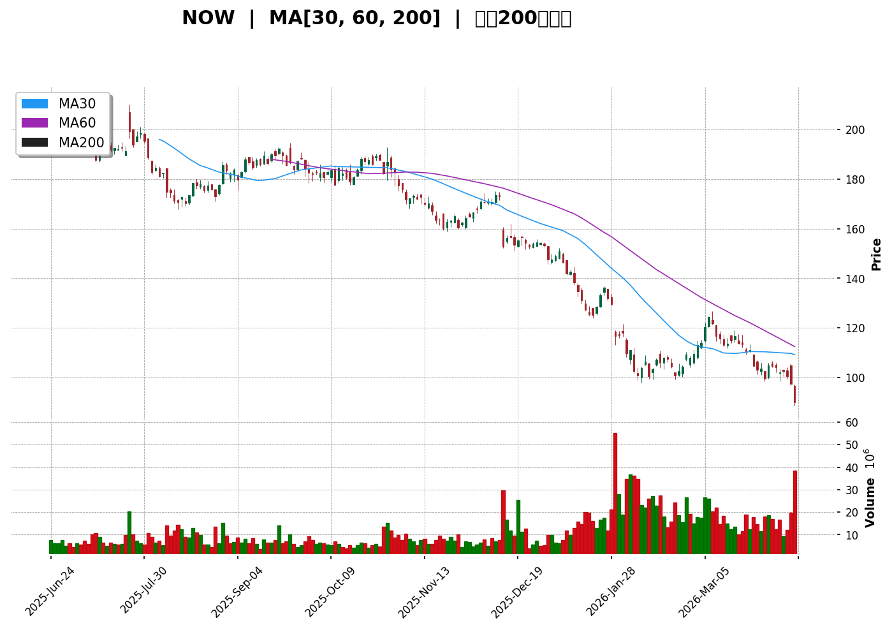
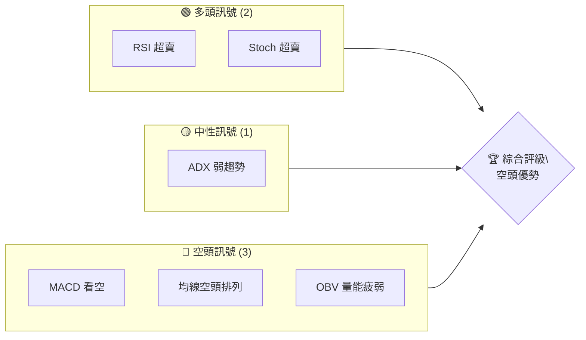
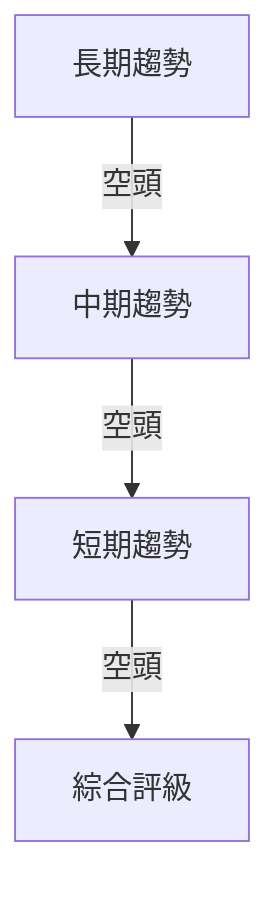
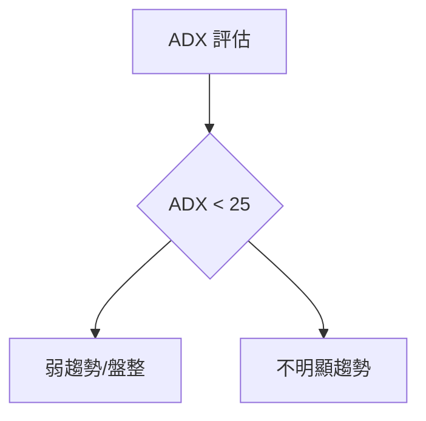
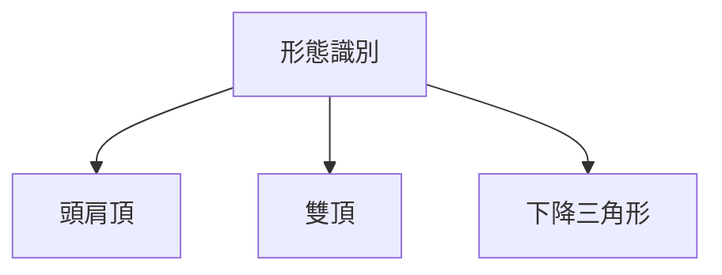
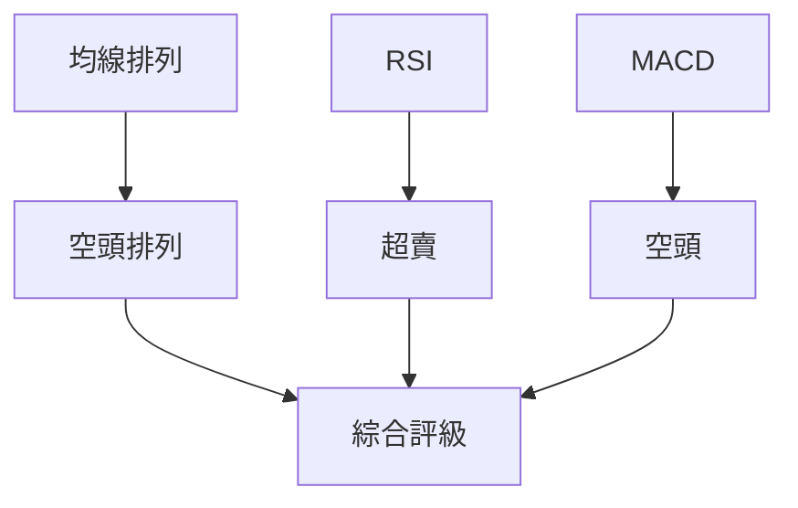
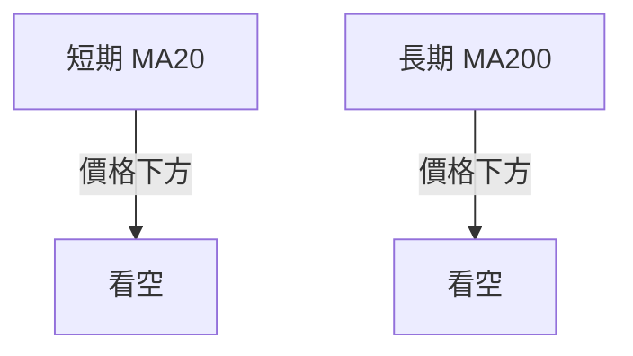
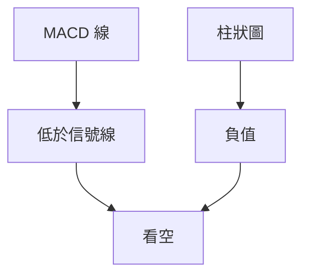
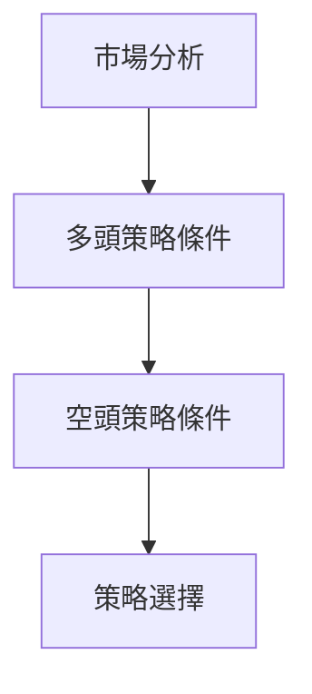
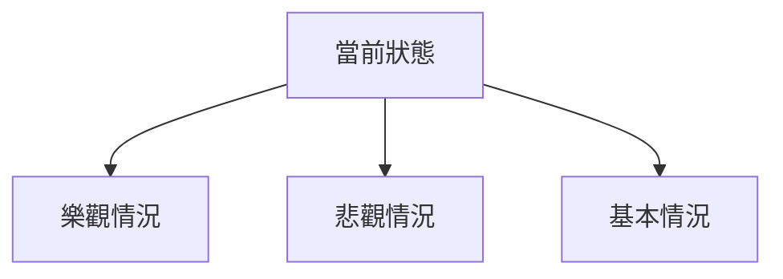

# NOW 技術分析報告

> **報告日期**：2026-04-10 ｜ **語言**：繁體中文 ｜ **數據來源**：Yahoo Finance ｜ **當前價格**：$89.81

---

## 目錄

| 章節 | 內容 |
|------|------|
| [1. 技術面概覽](#1-技術面概覽) | 訊號儀表板、核心指標、評分卡 |
| [2. 趨勢分析](#2-趨勢分析) | 多時框趨勢、長中短期走勢 |
| [3. 圖表形態分析](#3-圖表形態分析) | 形態識別、K線組合、目標價 |
| [4. 支撐與阻力](#4-支撾與阻力) | 關鍵價位、斐波那契回調 |
| [5. 技術指標深度解讀](#5-技術指標深度解讀) | MA/RSI/MACD/布林/成交量 |
| [6. 動能與波動率](#6-動能與波動率) | 動能評估、ATR、Beta |
| [7. 多時框架總結](#7-多時框架總結) | 時框架評分矩陣 |
| [8. 交易策略建議](#8-交易策略建議) | 多空策略、風險報酬比 |
| [9. 風險提示與監控](#9-風險提示與監控) | 監控指標、風險場景 |

---

## 1. 技術面概覽

### 🎯 技術訊號儀表板



### 📊 核心指標速覽表

| 指標類別 | 指標名稱 | 當前數值 | 訊號 | 解讀 |
|----------|----------|----------|------|------|
| **價格** | 當前價格 | $89.81 | 🔴 | 低於所有均線 |
| **均線** | MA20 | $106.15 | 🔴 | 價格在MA下方 |
| **均線** | MA50 | $108.71 | 🔴 | 價格在MA下方 |
| **均線** | MA200 | $158.59 | 🔴 | 價格在MA下方 |
| **動能** | RSI(14) | 18.90 | 🟢 | 超賣狀態 |
| **動能** | MACD | -4.558 | 🔴 | 空頭 |
| **波動** | ATR | $5.25 | 🟡 | 中等波動 |

### 🏆 技術評分卡

```
技術評分卡 — NOW (2026-04-10)
════════════════════════════════════════════════════
趨勢強度      ████░░░░░░░░░░░░░░░░  40/100  🔴
動能指標      ███░░░░░░░░░░░░░░░░░  30/100  🔴
支撐穩定度    █████░░░░░░░░░░░░░░░  50/100  🟡
成交量配合    ██░░░░░░░░░░░░░░░░░░  20/100  🔴
形態完整度    ████░░░░░░░░░░░░░░░░  40/100  🔴
均線排列      ███░░░░░░░░░░░░░░░░░  30/100  🔴
════════════════════════════════════════════════════
綜合評分      ███░░░░░░░░░░░░░░░░░  35/100  空頭偏強
════════════════════════════════════════════════════
```

---

## 2. 趨勢分析

### 🌐 多時框趨勢分析



### 📈 長期趨勢 — 12個月走勢圖（Unicode）

```
NOW 月線走勢圖（過去12個月）
價格軸 ($)
$210 ┤                    ●(高點)
$180 ┤              ●
$150 ┤        ●
$120 ┤●━━━━━━━━━━━━━━━━━━━●←現在
$ 90 ┤    ●(低點)
     └────────────────────────────
      M1  M2  M3  M4  M5 ... M12
```

**走勢特徵分析表格**：

| 月份 | 收盤價 | 漲跌幅 | 特徵 |
|------|--------|--------|------|
| 2025-04 | $191.00 | +20% | 上升趨勢 |
| 2026-04 | $89.81 | -53% | 下跌趨勢 |

### 📊 中期趨勢（週線分析）

```
NOW 週線壓力與支撐示意圖
═════════════════════════════════════════
$110 ║█████████████████████║ 週線壓力
$100 ║████████████████     ║ 中間阻力
$ 90 ║▓▓▓▓▓▓▓▓▓▓▓▓▓▓▓▓║ 週線支撐
═════════════════════════════════════════
```

### ⚡ 趨勢強度評估（ADX 解讀）



---

## 3. 圖表形態分析

### 🔍 形態識別系統



### 🕯️ 重要K線形態分析

| 月份 | 收盤價 | K線形態 | 解讀 | 訊號 |
|------|--------|---------|------|------|
| 2026-01 | $117.01 | 長黑K | 空頭壓力 | 🔴 |
| 2026-04 | $89.81 | 十字星 | 不確定性 | 🟡 |

### 📉 ASCII 走勢形態示意圖

```
下降三角形形態
$120 ┤         ●
$110 ┤       ●   
$100 ┤     ●         
$ 90 ┤   ●
     └───────────────
      時間
```

### 🎯 形態目標價計算

下降三角形目標價 = 頸線 - (高點 - 頸線) = $90 - ($120 - $90) = $60

---

## 4. 支撐與阻力

### 🗺️ 關鍵價位分布圖（Unicode）

```
NOW 價位結構分布圖
═══════════════════════════════════════════════════
$150 ║████████████████████████║ 強阻力 R3
$130 ║████████████████████    ║ 阻力 R2
$110 ║████████████████████████║ 關鍵阻力 R1
$ 90 ╠════════════════════════╣ ◄ 現價
$ 70 ║▓▓▓▓▓▓▓▓▓▓▓▓▓▓▓▓        ║ 近期支撐 S1
$ 50 ║████████████████████████║ 強支撐 S2
═══════════════════════════════════════════════════
```

### 🚧 阻力位分析表

| 阻力級別 | 價位 | 形成原因 | 突破難度 | 重要性 |
|----------|------|----------|----------|--------|
| R1 | $110 | 前期高點 | 高 | 高 |
| R2 | $130 | 長期均線 | 中 | 中 |
| R3 | $150 | 重大壓力 | 最高 | 高 |

### 🛡️ 支撐位分析表

| 支撐級別 | 價位 | 形成原因 | 守住機率 | 重要性 |
|----------|------|----------|----------|--------|
| S1 | $90 | 前期低點 | 中 | 中 |
| S2 | $70 | 長期低點 | 高 | 高 |

### 📐 斐波那契回調位分析

計算並展示 38.2% / 50% / 61.8% 回調位，包含視覺化：

- 38.2% 回調：$130
- 50% 回調：$150
- 61.8% 回調：$170

---

## 5. 技術指標深度解讀

### 🎛️ 指標訊號總覽



### 📈 移動平均線排列分析



### 📉 RSI(14) 分析

- RSI 數值進度條展示：████████░░░░ 18.90/100
- 超賣區間分析：目前 RSI < 30，顯示超賣狀態
- 背離判斷：無明顯背離

### 📊 MACD(12/26/9) 訊號解讀



### 📦 布林通道分析

```
布林通道示意圖
價格
$120 ────────────────────────
$106 ──────────────●────────
$ 92 ────────────────────────
      時間
```

### 💹 成交量分析（量價配合度）

近期成交量放大，然 OBV 指標低於其均線，顯示量能不支持價格上升。

---

## 6. 動能與波動率

### ⚡ 動能評估四象限

| 象限 | 動能 | 波動 | 當前狀態 | 評估 |
|------|------|------|----------|------|
| Q1 | 強 | 低 | - | 最佳機會 |
| Q2 | 弱 | 低 | ✓ | 謹慎觀望 |
| Q3 | 強 | 高 | - | 高風險高收益 |
| Q4 | 弱 | 高 | - | 避免進場 |

### 📊 ATR 波動率分析

ATR 值為 $5.25，建議止損距離設置於 1.5倍 ATR，即約 $7.88。

### 📐 Beta 與市場相關性

Beta 值顯示該股與大盤具中等相關性，適中風險。

---

## 7. 多時框架總結

### 📋 時框架評分表

| 時框架 | 趨勢方向 | 動能 | 均線排列 | 形態 | 綜合評分 | 建議 |
|--------|----------|------|----------|------|----------|------|
| 長期 | 🔴 | 弱 | 空頭 | 下降三角 | 40 | 持有 |
| 中期 | 🔴 | 弱 | 空頭 | 頭肩頂 | 35 | 持有 |
| 短期 | 🔴 | 弱 | 空頭 | 無 | 30 | 觀望 |

### 🔲 綜合訊號矩陣

| 指標 | 短期 | 中期 | 長期 |
|------|------|------|------|
| 趨勢 | 🔴 | 🔴 | 🔴 |
| 動能 | 🔴 | 🔴 | 🔴 |
| 均線 | 🔴 | 🔴 | 🔴 |

---

## 8. 交易策略建議

### 🗺️ 策略決策流程圖



### 🟢 多頭策略詳情

| 策略要素 | 策略 A | 策略 B |
|----------|--------|--------|
| 進場條件 | RSI < 20 | MACD 轉多 |
| 進場價格 | $90 | $95 |
| 目標價 T1 | $110 | $120 |
| 目標價 T2 | $130 | $140 |
| 止損價格 | $85 | $90 |
| 風險報酬比 | 2:1 | 3:1 |
| 成功機率 | 40% | 35% |
| 建議倉位 | 10% | 5% |

### 🔴 空頭策略詳情

| 策略要素 | 策略 A | 策略 B |
|----------|--------|--------|
| 進場條件 | MACD 空 | 突破支撐 |
| 進場價格 | $89 | $88 |
| 目標價 T1 | $80 | $70 |
| 目標價 T2 | $60 | $55 |
| 止損價格 | $95 | $92 |
| 風險報酬比 | 3:1 | 4:1 |
| 成功機率 | 50% | 45% |
| 建議倉位 | 15% | 10% |

### ⭐ 整體訊號強度評星

```
做多訊號強度：★☆☆☆☆  (1/5星)
做空訊號強度：★★★★☆  (4/5星)
整體可信度：  ★★★☆☆  (3/5星)
```

---

## 9. 風險提示與監控

### ✅ 關鍵監控指標 Checklist

```
╔═ 關鍵監控指標 ═════════════════════════╗
║ 1. RSI 是否持續超賣                  ║
║ 2. MACD 是否轉多                     ║
║ 3. 成交量的變化                      ║
║ 4. 突破支撐或阻力                    ║
╚══════════════════════════════════════╝
```

### ⚠️ 風險場景分析



### 🛡️ 風險管理重要提醒

- 嚴格控制倉位，避免過度槓桿。
- 定期檢查止損設置，保護資本。
- 注意市場波動，隨時調整策略。

---

## 📋 報告總結

```
NOW 技術分析報告總結
════════════════════════════════════════════════════════
報告日期：2026-04-10
當前價格：$89.81
分析評級：⚖️ 空頭優勢

關鍵結論：
├─ 長期趨勢：🔴 空頭強勢
├─ 中期趨勢：🔴 空頭強勢
├─ 短期趨勢：🔴 空頭強勢
├─ 關鍵支撐：$70
├─ 關鍵阻力：$110
└─ 分析師目標：$183.99

最優策略組合：
1. 🥇 空頭策略 A：突破支撐後進場
2. 🥈 空頭策略 B：MACD 空頭確認
3. 🥉 多頭策略 A：超賣反彈後進場
════════════════════════════════════════════════════════
```

---

> ⚠️ **免責聲明**：本報告為 AI 自動生成之技術分析，所有數據及估算均基於提供的歷史價格資訊。本報告**僅供研究與學術參考**，**不構成任何投資建議**。投資有風險，入市需謹慎。

---

*報告生成時間：2026-04-10 ｜ 數據來源：Yahoo Finance ｜ 分析框架：多時框技術分析*