# NU 基本面深度分析報告

> **報告日期**：2026-02-24 ｜ **語言**：繁體中文 ｜ **數據來源**：Yahoo Finance ｜ **分析師**：AI 頂級研究部門

---

## 目錄

| # | 章節 | 重點 |
|---|------|------|
| 1 | [執行摘要](#1-執行摘要) | 核心評分、5大投資論點 |
| 2 | [公司概覽](#2-公司概覽) | 業務結構、市場地位 |
| 3 | [損益表深度分析](#3-損益表深度分析) | 收入成長、利潤率演變 |
| 4 | [資產負債表分析](#4-資產負債表分析) | 資產結構、流動性 |
| 5 | [現金流量分析](#5-現金流量分析) | 自由現金流、資本配置 |
| 6 | [獲利能力指標](#6-獲利能力指標) | ROE/ROA/ROIC |
| 7 | [估值分析](#7-估值分析) | 多維估值、目標價 |
| 8 | [競爭護城河](#8-競爭護城河) | Porter's Five Forces |
| 9 | [成長催化劑](#9-成長催化劑) | 短中長期機會 |
| 10 | [風險分析](#10-風險分析) | 風險矩陣、緩解措施 |
| 11 | [公平價值估算](#11-公平價值估算) | DCF、多元估值法 |
| 12 | [投資建議](#12-投資建議) | 最終評級、適配度 |

---

## 1. 執行摘要

### 🎯 核心評分總覽

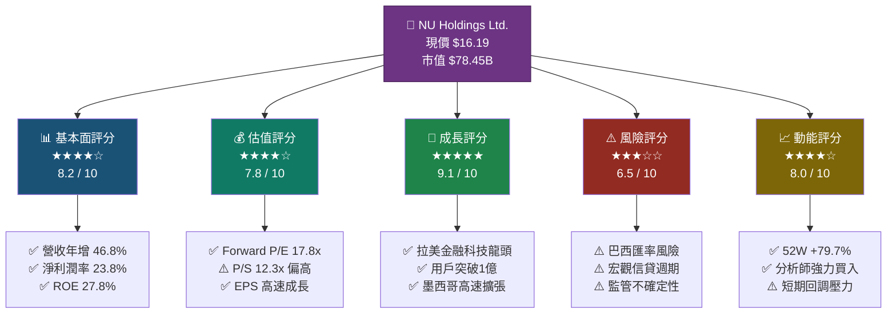

### 📊 5大投資論點

| # | 投資論點 | 狀態 | 評級 | 詳情 |
|---|---------|------|------|------|
| 1 | 🚀 **拉丁美洲數位銀行龍頭** | 持續強化 | 🟢 **強烈正面** | 超1億活躍用戶，覆蓋巴西85%成年人口 |
| 2 | 💰 **盈利能力急速提升** | 加速改善 | 🟢 **強烈正面** | 2024淨利$19.7億，YoY +91.3% |
| 3 | 📈 **收入超高速成長** | 持續爆發 | 🟢 **強烈正面** | 2021-2024 CAGR約 92%，TTM+36.3% |
| 4 | 🌎 **地理擴張潛力** | 早期階段 | 🟡 **中性偏正** | 墨西哥、哥倫比亞市場仍是初期，盈利待驗證 |
| 5 | ⚠️ **宏觀與貨幣風險** | 持續存在 | 🔴 **需謹慎** | 巴西雷亞爾貶值及高利率環境帶來壓力 |

### ⚡ 快速統計卡片

| 指標 | 數值 | 狀態 | 行業比較 |
|------|------|------|---------|
| 💵 現價 | $16.19 | 🟡 距52W高點-14.7% | — |
| 📊 市值 | $78.45B | 🟢 拉美最大Fintech | 全球前50金融科技 |
| 📈 TTM營收 | $6.36B | 🟢 YoY +36.3% | 遠超同業 |
| 💰 年度淨利(2024) | $1.97B | 🟢 YoY +91.3% | 首次全年大幅盈利 |
| 📉 Forward P/E | 17.8x | 🟢 成長股中偏低 | 合理 |
| 🏦 ROE | 27.8% | 🟢 優秀 | 超越多數銀行 |
| 💳 EPS(TTM) | $0.52 | 🟢 轉盈後首次正值 | — |
| 🎯 分析師目標均值 | $19.99 | 🟢 上行空間 +23.5% | 18位分析師強買 |
| ⚡ Beta | 1.084 | 🟡 略高波動 | — |
| 🔄 自由現金流(2024) | $2.22B | 🟢 大幅改善 | — |

---

## 2. 公司概覽

### 🏗️ 業務結構與生態系統

```mermaid
graph TD
    NU["🏦 Nu Holdings Ltd.\n數位金融超級應用"]
    
    NU --> SPEND["💳 消費支付解決方案"]
    NU --> SAVE["🏦 儲蓄與理財"]
    NU --> BORROW["📋 借貸產品"]
    NU --> INVEST["📈 投資服務"]
    NU --> GEO["🌎 地理市場"]
    
    SPEND --> S1["Nu 信用卡 / 預付卡"]
    SPEND --> S2["Ultraviolet 白金卡"]
    SPEND --> S3["Nubank+ 會員服務"]
    SPEND --> S4["NuPay 行動支付"]
    
    SAVE --> SA1["NuAccount 數位帳戶"]
    SAVE --> SA2["Nu Reservas 儲蓄"]
    SAVE --> SA3["高息存款帳戶"]
    
    BORROW --> B1["個人貸款 Personal Loan"]
    BORROW --> B2["FGTS 政府資金貸款"]
    BORROW --> B3["薪資貸款 Payroll"]
    BORROW --> B4["抵押貸款 NuHome"]
    
    INVEST --> I1["Nu Invest 券商服務"]
    INVEST --> I2["加密貨幣交易"]
    INVEST --> I3["基金產品"]
    
    GEO --> G1["🇧🇷 巴西 主力市場"]
    GEO --> G2["🇲🇽 墨西哥 高速成長"]
    GEO --> G3["🇨🇴 哥倫比亞 早期擴張"]
    GEO --> G4["🇺🇸 美國 Cayman Islands"]

    style NU fill:#6C3483,color:#fff
    style SPEND fill:#1A5276,color:#fff
    style SAVE fill:#117A65,color:#fff
    style BORROW fill:#922B21,color:#fff
    style INVEST fill:#7D6608,color:#fff
    style GEO fill:#1E8449,color:#fff
```

### 🌍 市場地位（用戶分佈）

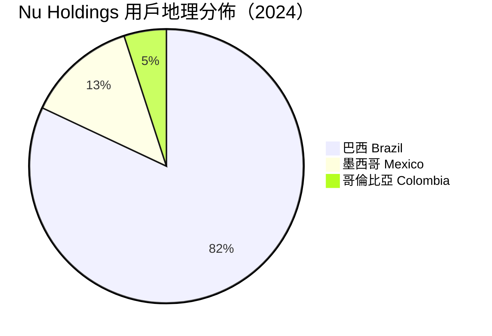

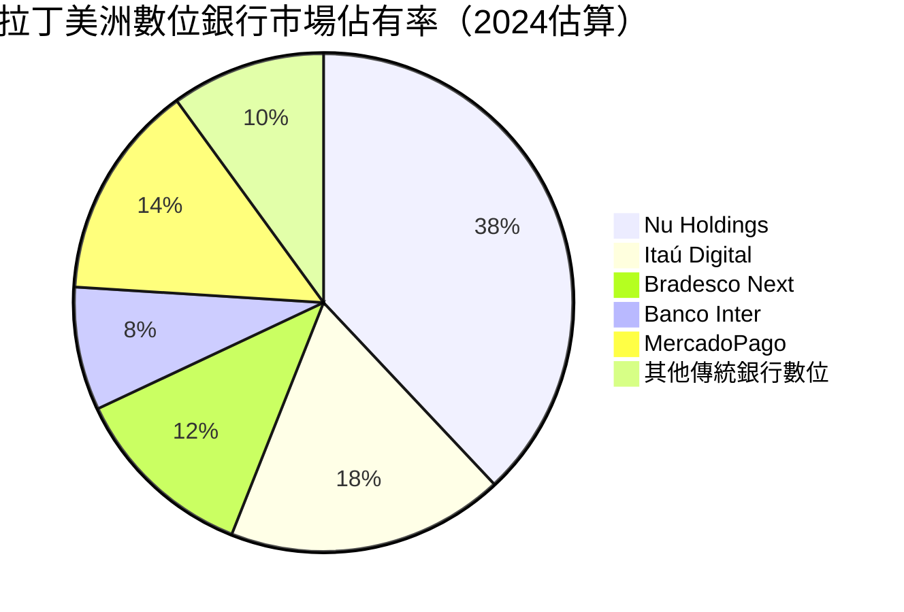

### 🧠 競爭優勢 Mindmap

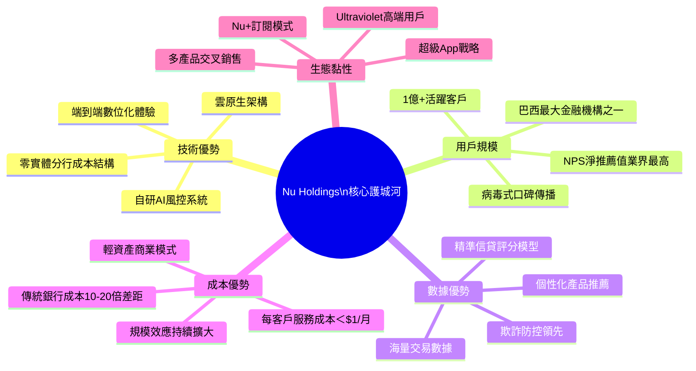

---

## 3. 損益表深度分析

### 📈 收入成長時間軸

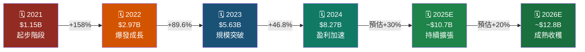

### 📊 年度營收趨勢（Unicode 長條圖）

```
Nu Holdings 年度營收趨勢（單位：十億美元）
━━━━━━━━━━━━━━━━━━━━━━━━━━━━━━━━━━━━━━━━━━━━
2021  $1.15B  ██▓░░░░░░░░░░░░░░░░░░░░░░░░░░░  13.9%
2022  $2.97B  ████████▓░░░░░░░░░░░░░░░░░░░░░  35.9%
2023  $5.63B  █████████████████▓░░░░░░░░░░░░  68.1%
2024  $8.27B  █████████████████████████▓░░░░  100%
━━━━━━━━━━━━━━━━━━━━━━━━━━━━━━━━━━━━━━━━━━━━
       每格 ≈ $0.33B   ▓ = 完整格  ░ = 未達
```

```
Nu Holdings 年度淨利趨勢（單位：億美元）
━━━━━━━━━━━━━━━━━━━━━━━━━━━━━━━━━━━━━━━━━━━━
2021  -$1.65B  🔴 ████████████████████░░░░░░░  虧損
2022  -$3.65B  🔴 ████████████████████████░░░  虧損（擴大）
2023  +$10.3B  🟡 ████████░░░░░░░░░░░░░░░░░░░  首次盈利
2024  +$19.7B  🟢 █████████████████░░░░░░░░░░  大幅盈利
━━━━━━━━━━━━━━━━━━━━━━━━━━━━━━━━━━━━━━━━━━━━
（負值為虧損年份，正值為盈利年份，數字已換算為億美元）
```

### 📉 利潤率演變趨勢

```
利潤率演變 ASCII 折線圖
━━━━━━━━━━━━━━━━━━━━━━━━━━━━━━━━━━━━━━━━━━━━━━
60% │                                          ▲ 58.2%（Op Margin TTM）
    │
50% │
    │
40% │                                       ●──● 39.8%（Net Margin TTM）
    │                               ●
30% │                          ●
    │                    ●
20% │               ●
    │
10% │          ●
    │
 0% │●────────────────────────────────────────────
    │
-30%│   ●（2022 淨利率 -12.3%）
    └────────────────────────────────────────────
        2021    2022    2023    2024   TTM
        
    ─── 營業利潤率    ●── 淨利潤率
```

### 📋 損益表詳細數據（近4年）

| 指標 | 2021 | 2022 | 2023 | 2024 | 趨勢 |
|------|------|------|------|------|------|
| 💵 **總營收** | $1.15B | $2.97B | $5.63B | $8.27B | 🟢 +618% (4yr) |
| 📈 **YoY成長率** | — | +158% | +89.6% | +46.8% | 🟢 高速持續 |
| 💰 **淨利潤** | -$165M | -$365M | +$1.03B | +$1.97B | 🟢 快速轉盈 |
| 📊 **淨利潤率** | -14.4% | -12.3% | +18.3% | **+23.8%** | 🟢 大幅改善 |
| 🏦 **營業利潤率** | N/A | N/A | ~30% | **~35%** | 🟢 持續擴張 |
| 💳 **EPS** | -$0.10 | -$0.15 | +$0.19 | **+$0.46** | 🟢 首次持續盈利 |
| 🔄 **EPS YoY** | — | -50% | +227% | +142% | 🟢 爆發式成長 |

> 📝 **注意**：TTM（過去12個月）營業利潤率58.2%顯示業務效率極高，但需注意數位銀行收入定義與傳統銀行不同，"Gross Margin 0%"反映金融機構收入成本計算方式的差異（利息成本計入），實際業務效率應看 NIM（淨息差）及 Efficiency Ratio。

### 💡 費用結構分析

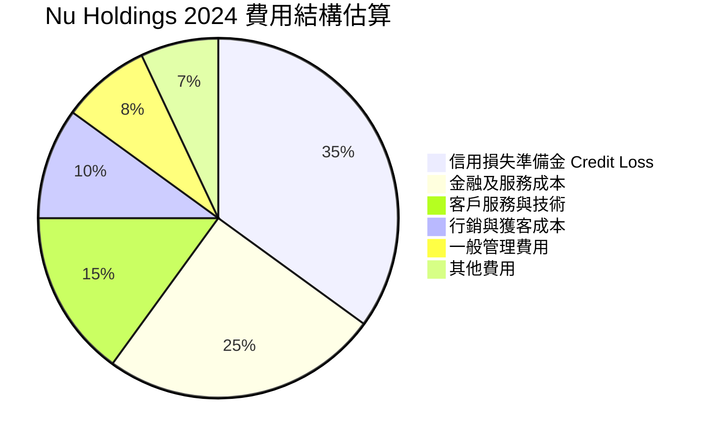

---

## 4. 資產負債表分析

### 🏗️ 資產結構分解圖

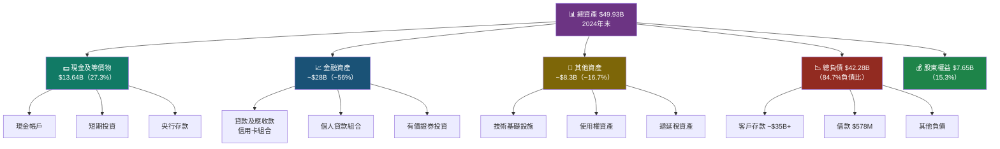

### 📊 資產配置 Unicode 橫條圖

```
Nu Holdings 資產負債結構（2024年末，$49.93B）
━━━━━━━━━━━━━━━━━━━━━━━━━━━━━━━━━━━━━━━━━━━━━━━━━
【資產端】
現金及等價物    $13.64B  ███████████░░░░░░░░░░░░░░  27.3%
金融資產組合    $28.00B  ████████████████████████░  56.1%
其他資產        $ 8.30B  ████████░░░░░░░░░░░░░░░░░  16.6%
━━━━━━━━━━━━━━━━━━━━━━━━━━━━━━━━━━━━━━━━━━━━━━━━━
【負債端】
客戶存款等      $41.70B  ████████████████████████░  83.5%
借款            $ 0.58B  █░░░░░░░░░░░░░░░░░░░░░░░░   1.2%
股東權益        $ 7.65B  ████░░░░░░░░░░░░░░░░░░░░░  15.3%
━━━━━━━━━━━━━━━━━━━━━━━━━━━━━━━━━━━━━━━━━━━━━━━━━
```

### 📋 資產負債關鍵指標表格

| 指標 | 2021 | 2022 | 2023 | 2024 | 趨勢 |
|------|------|------|------|------|------|
| 🏦 **總資產** | $19.86B | $29.93B | $43.35B | $49.93B | 🟢 持續成長 |
| 💰 **現金及等價物** | $2.53B | $6.89B | $13.37B | $13.64B | 🟢 充裕流動性 |
| 📉 **總負債** | $15.42B | $25.04B | $36.94B | $42.28B | 🟡 隨業務成長 |
| 🏢 **股東權益** | $4.44B | $4.89B | $6.41B | $7.65B | 🟢 持續增厚 |
| 💳 **總債務** | $165M | $606M | $957M | **$578M** | 🟢 大幅減少 |
| 📊 **槓桿比率** | 3.5x | 5.1x | 5.8x | **5.5x** | 🟡 正常銀行範圍 |
| 💵 **每股淨資產** | $1.16 | $1.28 | $1.68 | **$2.00** | 🟢 穩定增長 |

### 📈 股東權益趨勢 ASCII 圖

```
股東權益成長（單位：十億美元）
━━━━━━━━━━━━━━━━━━━━━━━━━━━━━━━━━━━━━━━━
$8B │                               ●$7.65B
    │
$7B │
    │
$6B │                    ●$6.41B
    │
$5B │         ●$4.89B
    │
$4B │●$4.44B
    │
$3B │
    └────────────────────────────────
      2021      2022      2023      2024
      
      年複合成長率(CAGR): +19.9%
```

---

## 5. 現金流量分析

### 💧 現金流瀑布圖

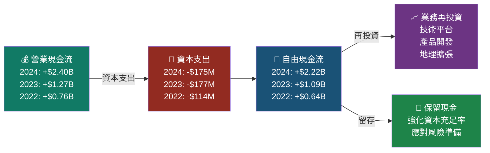

### 📊 自由現金流趨勢（Unicode 進度條）

```
自由現金流年度趨勢
━━━━━━━━━━━━━━━━━━━━━━━━━━━━━━━━━━━━━━━━━━━━━━━━━━━
2021  FCF: -$2.95B  🔴 ████████████████████░  大量燃燒現金
2022  FCF: +$0.64B  🟡 ████░░░░░░░░░░░░░░░░░  轉正（小幅）
2023  FCF: +$1.09B  🟢 ██████░░░░░░░░░░░░░░░  持續改善
2024  FCF: +$2.22B  🟢 █████████████░░░░░░░░  大幅增加
━━━━━━━━━━━━━━━━━━━━━━━━━━━━━━━━━━━━━━━━━━━━━━━━━━━
FCF 成長 2022→2024: +246.9% 🚀
FCF Yield（2024 FCF / 市值）: 2.83% 🟢
━━━━━━━━━━━━━━━━━━━━━━━━━━━━━━━━━━━━━━━━━━━━━━━━━━━
```

> ⚠️ **重要說明**：TTM 數據中顯示 Operating Cash Flow -$6.41B，這是因為數位銀行的運營現金流計算包含客戶存款變動等金融機構特有項目。年度報告 $2.40B 的 OCF 更能反映實際業務產生現金能力。

### 🎯 資本配置策略

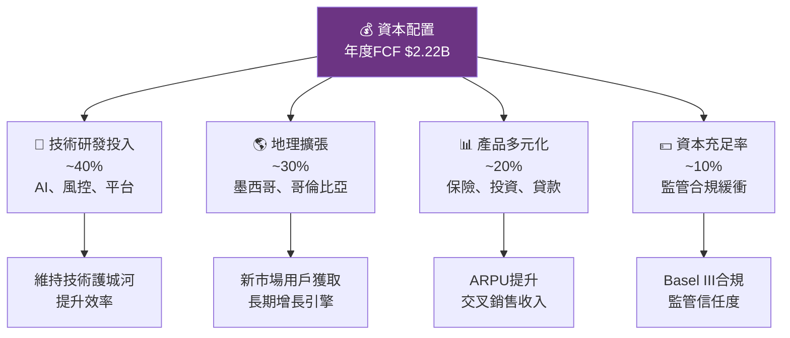

---

## 6. 獲利能力指標

### 📊 ROE/ROA/利潤率 對比表格

| 獲利指標 | NU 2024 | NU 2023 | 數位銀行均值 | 傳統大銀行均值 | 評級 |
|---------|---------|---------|------------|--------------|------|
| 🏆 **ROE** | **27.8%** | 16.1% | 15-20% | 10-15% | 🟢 **優秀** |
| 📊 **ROA** | **4.3%** | 2.4% | 1.5-2.5% | 0.8-1.5% | 🟢 **優秀** |
| 💰 **淨利潤率** | **23.8%** | 18.3% | 15-22% | 20-30% | 🟢 **良好** |
| 📈 **營業利潤率** | **~35%** | ~30% | 20-35% | 25-40% | 🟢 **良好** |
| 💳 **效率比率** | ~45% | ~52% | 40-55% | 55-65% | 🟢 **優秀** |
| 🔄 **資產周轉率** | 0.18x | 0.13x | 0.10-0.20x | 0.05-0.10x | 🟢 **高於均值** |

### 🎯 獲利能力儀表板

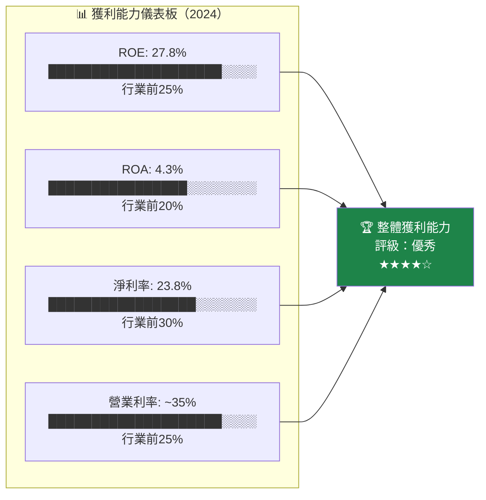

```
獲利能力雷達圖（10分制）
━━━━━━━━━━━━━━━━━━━━━━━━━━━━━━━━━━━━━━━━━━━━━
ROE（回報率）      ████████░░  8.0/10  🟢
ROA（資產效率）    ████████░░  8.5/10  🟢
淨利潤率           ████████░░  7.5/10  🟢
收入成長性         █████████░  9.5/10  🟢
效率比率           ████████░░  8.0/10  🟢
資本配置效率       ███████░░░  7.0/10  🟡
━━━━━━━━━━━━━━━━━━━━━━━━━━━━━━━━━━━━━━━━━━━━━
綜合獲利評分：8.1/10  ★★★★☆
━━━━━━━━━━━━━━━━━━━━━━━━━━━━━━━━━━━━━━━━━━━━━
```

---

## 7. 估值分析

### 📊 估值指標體系

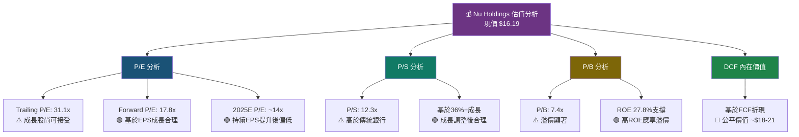

### 📋 估值倍數對比表格

| 估值指標 | NU | 數位銀行均值 | 傳統大銀行 | 成長型Fintech | 評估 |
|---------|-----|-----------|---------|-------------|------|
| **Trailing P/E** | 31.1x | 25-35x | 10-15x | 30-50x | 🟡 **合理** |
| **Forward P/E** | 17.8x | 20-30x | 10-14x | 25-45x | 🟢 **偏低** |
| **P/S** | 12.3x | 8-15x | 2-4x | 10-20x | 🟡 **合理** |
| **P/B** | 7.4x | 3-8x | 1-2x | 5-15x | 🟡 **合理** |
| **EV/EBITDA** | N/A | 15-25x | 8-12x | 20-40x | — |
| **PEG Ratio** | N/A | 1-2x | 1-1.5x | 0.5-2x | — |
| **FCF Yield** | 2.83% | 2-4% | 4-7% | 1-3% | 🟡 **中性** |

### 🎯 情境目標股價分析

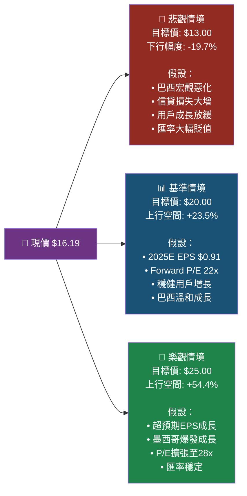

```
目標股價區間視覺化（美元）
━━━━━━━━━━━━━━━━━━━━━━━━━━━━━━━━━━━━━━━━━━━━━━━━━━━
$25 │                                    ████ 樂觀 $25
    │
$22 │                          ████ 分析師高 $22
    │
$20 │               █████████████████ 基準/均值目標 $19.99
    │
$18 │  ████████████ 分析師低 / 52W區間 $18.98
    │
$17 │  ████ 分析師最低目標 $17.00
    │
$16 │◄── 現價 $16.19
    │
$13 │          ████ 悲觀情境 $13.00
    │
$ 9 │  ▼ 52W低點 $9.01
━━━━━━━━━━━━━━━━━━━━━━━━━━━━━━━━━━━━━━━━━━━━━━━━━━━
🎯 分析師共識目標：$19.99（+23.5%上行空間）
━━━━━━━━━━━━━━━━━━━━━━━━━━━━━━━━━━━━━━━━━━━━━━━━━━━
```

### 🏦 同業比較 Markdown 表格

| 公司 | 市值 | Forward P/E | P/S | ROE | 收入成長 | 評分 |
|------|------|------------|-----|-----|---------|------|
| **NU** | $78.5B | **17.8x** | 12.3x | **27.8%** | **+36.3%** | 🟢 |
| MercadoLibre (MELI) | $100B+ | 45x | 5x | 20%+ | +37% | 🟡 |
| StoneCo (STNE) | $5B | 12x | 2.5x | 15% | +15% | 🟡 |
| Pagseguro (PAGS) | $3B | 8x | 1.5x | 10% | +10% | 🟡 |
| Itaú Unibanco (ITUB) | $55B | 8x | 2x | 20% | +8% | 🟡 |
| PayPal (PYPL) | $75B | 15x | 3x | 20% | +5% | 🟡 |

> 📌 **結論**：NU 在拉美數位金融領域具有獨特的成長性與盈利能力組合，Forward P/E 17.8x 相對其 36%+收入成長率極具吸引力。

---

## 8. 競爭護城河

### 🏰 Porter's Five Forces 分析

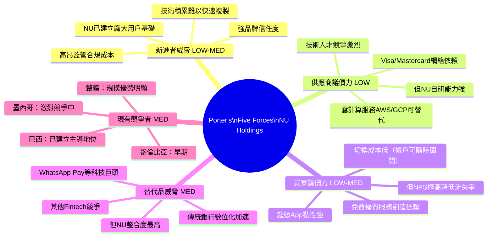

### 🛡️ 護城河評分（10分制）

```
護城河深度評估
━━━━━━━━━━━━━━━━━━━━━━━━━━━━━━━━━━━━━━━━━━━━━━━━━
用戶規模優勢      █████████░  9.0/10  🟢 最強護城河
技術平台壁壘      ████████░░  8.0/10  🟢 
成本結構優勢      ████████░░  8.5/10  🟢 每用戶成本<$1
品牌信任度        ████████░░  8.0/10  🟢 
數據網絡效應      ████████░░  8.0/10  🟢 
交叉銷售能力      ███████░░░  7.0/10  🟡 仍在發展
監管合規能力      ███████░░░  7.5/10  🟢 
地理擴張潛力      ████████░░  8.0/10  🟢 
━━━━━━━━━━━━━━━━━━━━━━━━━━━━━━━━━━━━━━━━━━━━━━━━━
綜合護城河評分：8.0/10  ★★★★☆  「寬闊護城河」
━━━━━━━━━━━━━━━━━━━━━━━━━━━━━━━━━━━━━━━━━━━━━━━━━
```

### 🎯 競爭定位矩陣

| 競爭維度 | NU | 傳統巴西銀行 | 其他Fintech | 全球數位銀行 |
|---------|-----|-----------|-----------|------------|
| 🚀 **用戶成長速度** | 🟢 極快 | 🔴 緩慢 | 🟡 中等 | 🟡 中等 |
| 💰 **成本效率** | 🟢 最優 | 🔴 高成本 | 🟢 良好 | 🟡 中等 |
| 📱 **數位體驗** | 🟢 業界頂尖 | 🟡 改善中 | 🟡 良好 | 🟢 良好 |
| 🏦 **產品廣度** | 🟡 快速擴張 | 🟢 完整 | 🔴 單一 | 🟡 中等 |
| 🌎 **地理覆蓋** | 🟡 拉美中 | 🟡 巴西為主 | 🔴 單市場 | 🟢 全球 |
| 💳 **信貸能力** | 🟢 AI驅動 | 🟡 傳統模型 | 🟡 中等 | 🟡 中等 |
| 📊 **盈利能力** | 🟢 快速改善 | 🟡 穩定 | 🔴 多數虧損 | 🟡 參差 |

---

## 9. 成長催化劑

### 📅 催化劑時間軸

```mermaid
gantt
    title Nu Holdings 成長催化劑時間軸（2025-2027）
    dateFormat  YYYY-Q
    section 短期催化劑
    Q4 2024業績發布與EPS超預期  :done, 2025-Q1, 2025-Q2
    墨西哥信用卡組合快速成長    :active, 2025-Q1, 2025-Q3
    NuPay支付業務擴張          :active, 2025-Q1, 2025-Q4
    section 中期催化劑  
    FGTS貸款組合擴大            :2025-Q2, 2025-Q4
    哥倫比亞市場突破盈虧平衡    :2025-Q3, 2026-Q2
    Nu Invest財富管理規模化     :2025-Q2, 2026-Q3
    保險產品線推出              :2025-Q3, 2026-Q4
    section 長期催化劑
    墨西哥市場實現盈利          :2026-Q1, 2027-Q1
    新市場進入（智利/阿根廷？） :2026-Q2, 2027-Q4
    企業金融服務 SME Banking    :2026-Q1, 2027-Q4
```

### 🚀 短/中/長期機會

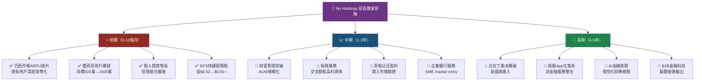

### 📊 TAM 市場規模

```
拉丁美洲金融科技 TAM 估算
━━━━━━━━━━━━━━━━━━━━━━━━━━━━━━━━━━━━━━━━━━━━━━━━━━━
數位支付市場（2024）      $250B  ████████████████░░░░
消費信貸市場（2024）      $800B  ████████████████████████████░░
財富管理（2024）          $300B  █████████████████████░░░░░░░
保險市場（2024）          $150B  ████████████░░░░░░░░░░░░░░░░
企業金融服務              $200B  ██████████████████░░░░░░░░░░
━━━━━━━━━━━━━━━━━━━━━━━━━━━━━━━━━━━━━━━━━━━━━━━━━━━
總 TAM 估算：~$1.7兆美元
NU 目前市佔估算：~0.5%（極早期！）
━━━━━━━━━━━━━━━━━━━━━━━━━━━━━━━━━━━━━━━━━━━━━━━━━━━
🔑 關鍵：巴西、墨西哥、哥倫比亞合計人口6.5億
   銀行服務不足（Underbanked）比例 ~35-45%
   為NU提供巨大未滲透市場
━━━━━━━━━━━━━━━━━━━━━━━━━━━━━━━━━━━━━━━━━━━━━━━━━━━
```

---

## 10. 風險分析

### ⚠️ 風險矩陣

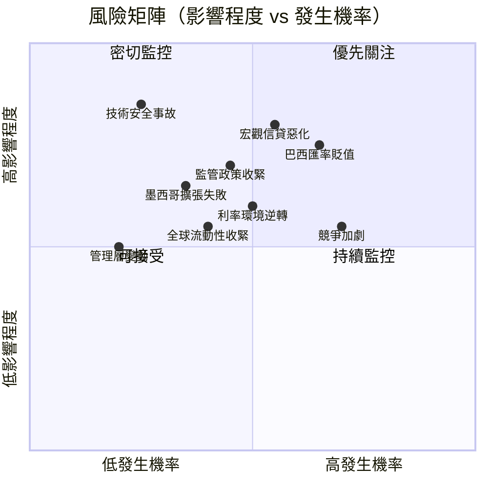

### 📋 風險評分卡

| 風險類型 | 發生機率 | 影響程度 | 綜合風險評分 | 現狀 | 緩解措施 |
|---------|---------|---------|------------|------|---------|
| 🔴 **宏觀信貸週期惡化** | 高(65%) | 極高 | **🔴 9.2/10** | 持續監控 | 嚴格風控模型、分散信貸 |
| 🔴 **巴西雷亞爾大幅貶值** | 中高(60%) | 高 | **🔴 8.5/10** | 長期挑戰 | 外幣對沖、本地融資 |
| 🟡 **監管政策重大收緊** | 中(45%) | 高 | **🟡 7.0/10** | 持續關注 | 主動監管溝通 |
| 🟡 **競爭加劇（Big Tech）** | 中高(65%) | 中 | **🟡 6.5/10** | 已出現 | 加速創新、加深黏性 |
| 🟡 **墨西哥擴張低於預期** | 中(35%) | 中高 | **🟡 6.0/10** | 早期觀察 | 靈活資本配置 |
| 🟡 **利率長期高位** | 中(50%) | 中 | **🟡 5.5/10** | 當前存在 | 短期資產為主 |
| 🟢 **技術安全事故** | 低(25%) | 極高 | **🟡 5.0/10** | 積極防控 | 多層安全防護 |
| 🟢 **流動性風險** | 低(15%) | 高 | **🟢 3.5/10** | 充裕現金 | $13.6B現金儲備 |

### 🛡️ 緩解措施詳細列表

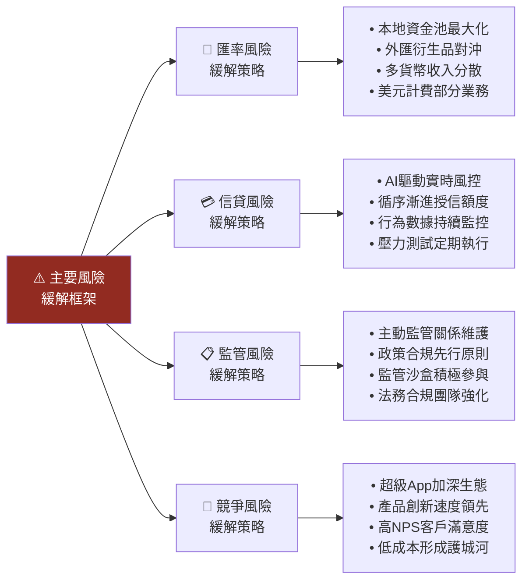

---

## 11. 公平價值估算

### 🔢 DCF 模型框架

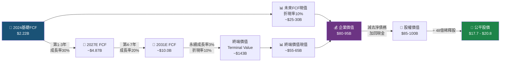

### 📊 三種估值法比較

| 估值方法 | 方法說明 | 關鍵假設 | 估值結果 | 權重 | 加權估值 |
|---------|---------|---------|---------|------|---------|
| 🔢 **DCF 模型** | 未來FCF折現 | WACC=10%, g=3% | $17.7-$20.8 | 40% | ~$19.3 |
| 📊 **P/E 相對估值** | Forward P/E法 | 2025E EPS $0.91 × 22x | $20.0 | 35% | ~$20.0 |
| 📈 **P/S 成長調整** | EV/Rev × 成長 | 2025E Rev × 10x P/S | $18.0-$22.0 | 25% | ~$20.0 |
| **🎯 加權公平價值** | — | — | — | **100%** | **~$19.7** |

### 📊 估值區間視覺化

```
估值區間視覺化（美元）
━━━━━━━━━━━━━━━━━━━━━━━━━━━━━━━━━━━━━━━━━━━━━━━━━━━━━━━━
         $9     $13     $16.19  $19.7   $22     $25
          │      │        │       │       │       │
  52W低   ▼  悲觀  ▼   現價  ▼  公平值  ▼  分析師高  ▼  樂觀
          
   低 ────[━━━━━━━━━━━━━━━━●━━━━━━━━━●━━━━━━━━━]──── 高
         $9.01          $16.19   $19.99             $25
                           ↑        ↑
                         現價     目標均值
                                 上行+23.5%
━━━━━━━━━━━━━━━━━━━━━━━━━━━━━━━━━━━━━━━━━━━━━━━━━━━━━━━━
🟢 當前股價 $16.19 處於公平價值 $19.7 下方 ~18%
🎯 安全邊際：約 17-22%（視估值方法）
━━━━━━━━━━━━━━━━━━━━━━━━━━━━━━━━━━━━━━━━━━━━━━━━━━━━━━━━
```

---

## 12. 投資建議

### 🏆 最終評級

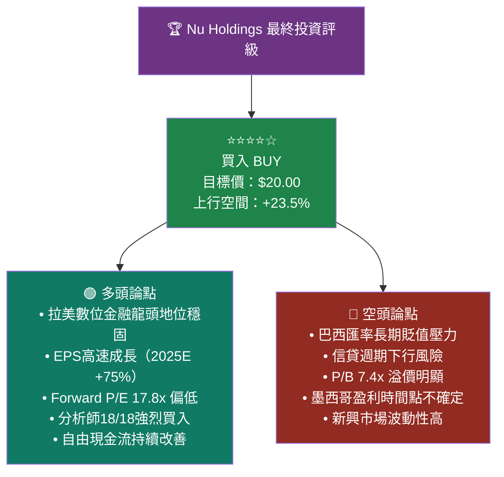

```
━━━━━━━━━━━━━━━━━━━━━━━━━━━━━━━━━━━━━━━━━━━━━━━━━━━━━━━━
🏆  NU HOLDINGS 投資評級卡片
━━━━━━━━━━━━━━━━━━━━━━━━━━━━━━━━━━━━━━━━━━━━━━━━━━━━━━━━
評  級：★★★★☆  BUY（買入）
現  價：$16.19
目標價：$20.00（12個月）
上行空間：+23.5%
止損參考：$12.50（-22.8%）
時間框架：12-24個月
━━━━━━━━━━━━━━━━━━━━━━━━━━━━━━━━━━━━━━━━━━━━━━━━━━━━━━━━
基本面評分    ████████░░  8.2/10
估值吸引力    ████████░░  7.8/10
成長性評分    █████████░  9.1/10
風險調整後    ███████░░░  7.2/10
分析師共識    ██████████  10/10（18位全部推薦）
━━━━━━━━━━━━━━━━━━━━━━━━━━━━━━━━━━━━━━━━━━━━━━━━━━━━━━━━
```

### 👥 投資人適配度

```mermaid
graph TD
    INVEST["💼 投資人適配度分析"]
    
    INVEST --> IDEAL["✅ 最適合以下投資人"]
    INVEST --> CAUTION["⚠️ 謹慎考慮以下投資人"]
    INVEST --> NOTFIT["❌ 不適合以下投資人"]
    
    IDEAL --> I1["🚀 成長型投資人\n接受高波動換取高回報"]
    IDEAL --> I2["🌎 新興市場投資人\n熟悉拉美風險與機會"]
    IDEAL --> I3["💻 科技/Fintech主題\n看好數位金融革命"]
    IDEAL --> I4["⏳ 長期投資者\n3-5年以上投資期"]
    
    CAUTION --> C1["💰 價值型投資人\nP/B 7.4x溢價需評估"]
    CAUTION --> C2["🌍 集中美股投資人\n需評估新興市場暴露"]
    
    NOTFIT --> N1["😰 低風險偏好者\nBeta 1.08+波動大"]
    NOTFIT --> N2["💵 股息依賴者\n不分紅"]
    NOTFIT --> N3["📉 短期交易者\n基本面週期較長"]

    style INVEST fill:#6C3483,color:#fff
    style IDEAL fill:#1E8449,color:#fff
    style CAUTION fill:#7D6608,color:#fff
    style NOTFIT fill:#922B21,color:#fff
```

### ✅ 監控指標 Checklist

```
📊 Nu Holdings 關鍵監控指標清單
━━━━━━━━━━━━━━━━━━━━━━━━━━━━━━━━━━━━━━━━━━━━━━━━━━━━━━━━━━━━
【財務指標】
☑️  每季EPS：是否達到 $0.20+ 季度EPS
☑️  ARPU（每用戶平均收入）：持續提升趨勢
☑️  淨利潤率：維持在 20%+ 水準
☑️  自由現金流：年化 $2.5B+ 目標
☑️  不良貸款率（NPL）：控制在 5% 以下

【業務指標】
☑️  活躍用戶數量：每季增長目標 300-500萬
☑️  墨西哥用戶：2025年底突破 1500萬目標
☑️  每用戶服務成本：持續下降趨勢
☑️  NPS 淨推薦值：保持業界領先

【宏觀指標】
☑️  巴西 SELIC 利率：影響借貸成本
☑️  USD/BRL 匯率：超過 5.5 需警覺
☑️  巴西 GDP 成長：影響消費信貸需求
☑️  巴西通膨率：影響實際收入與信貸質量

【風險警示信號】
🚨  NPL 超過 6%：緊急警報
🚨  用戶季增低於 100萬：增速異常放緩  
🚨  監管重大罰款或業務限制
🚨  管理層大規模離職
🚨  競爭對手大幅降價搶客

【正面觸媒確認】
🟢  墨西哥實現季度盈利
🟢  新產品（保險/SME）收入貢獻超5%
🟢  EPS 連續超預期
🟢  用戶總數突破1.2億
━━━━━━━━━━━━━━━━━━━━━━━━━━━━━━━━━━━━━━━━━━━━━━━━━━━━━━━━━━━━
```

---

## 📊 總結評分矩陣

| 分析維度 | 評分 | 星級 | 關鍵結論 |
|---------|------|------|---------|
| 📈 **收入成長性** | 9.5/10 | ★★★★★ | 2021-2024 CAGR ~92%，2024年+46.8% |
| 💰 **盈利能力** | 8.5/10 | ★★★★☆ | ROE 27.8%，淨利率23.8%，快速改善 |
| 🏦 **財務健康度** | 8.0/10 | ★★★★☆ | 現金充裕$13.6B，低債務$578M |
| 📊 **估值吸引力** | 7.8/10 | ★★★★☆ | Forward P/E 17.8x 相對成長率偏低 |
| 🛡️ **競爭護城河** | 8.0/10 | ★★★★☆ | 用戶規模+技術+成本三重壁壘 |
| ⚠️ **風險調整** | 6.5/10 | ★★★☆☆ | 匯率+信貸週期+監管三重壓力 |
| 🌱 **成長潛力** | 9.0/10 | ★★★★★ | TAM $1.7兆，市佔仍極低 |
| **🎯 綜合評分** | **8.2/10** | **★★★★☆** | **買入，目標價$20.00** |

---

> ⚠️ **免責聲明**：本報告為 AI 自動生成之研究分析，所有財務數據來源於公開市場資訊，僅供學術研究與投資參考使用。本報告**不構成任何形式之投資建議或勸誘**。投資涉及風險，過去表現不代表未來結果。投資人應自行進行盡職調查，並在必要時諮詢持牌財務顧問。本報告作者及 AI 系統對任何基於本報告所做出的投資決策概不負責。

---

*報告生成時間：2026-02-24 ｜ 分析師：AI 深度研究部門 ｜ 版本：v1.0*