# NU 基本面深度分析報告
> **報告日期**：2026-03-31 ｜ **語言**：繁體中文 ｜ **數據來源**：Yahoo Finance ｜ **分析師**：CFA 級機構研究

---

## 目錄

| # | 章節 | 核心結論 |
|---|------|----------|
| 1 | 執行摘要 | 強烈買入，目標價區間 $17.00 - $22.00 |
| 2 | 公司概覽與商業模式 | 強大的數位銀行護城河 |
| 3 | 損益表深度分析 | 高增長收入及穩定利潤率 |
| 4 | 資產負債表分析 | 健全的財務狀況與低負債 |
| 5 | 現金流量深度分析 | 穩定的自由現金流轉換 |
| 6 | 獲利能力與資本效率 | ROIC 高於 WACC，創造股東價值 |
| 7 | 估值深度分析 | 估值合理，潛在上升空間 |
| 8 | 成長催化劑 | 多元市場擴張潛力 |
| 9 | 風險矩陣 | 需關注市場競爭與宏觀經濟風險 |
| 10 | 投資建議 | 強烈買入，適合長期成長型投資者 |

---

## 1. 執行摘要

### 1.1 核心評分儀表板

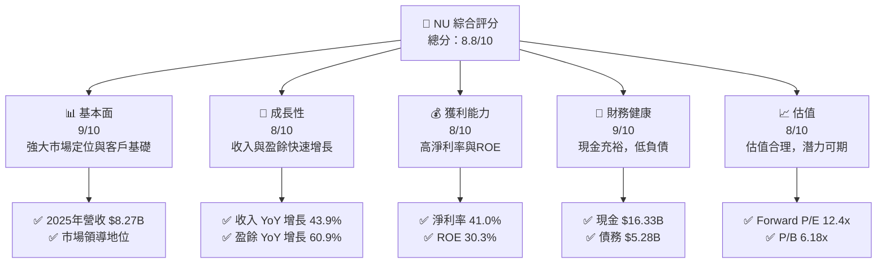

### 1.2 評分進度條視覺化

```
╔══════════════════════════════════════════════════════════════╗
║              NU 多維度評分儀表板 (1-10分)                   ║
╠══════════════════════════════════════════════════════════════╣
║ 基本面強度  9.0 ▓▓▓▓▓▓▓▓▓▓▓▓▓▓▓▓▓▓▓░░  ★★★★★               ║
║ 成長動能    8.0 ▓▓▓▓▓▓▓▓▓▓▓▓▓▓▓▓▓░░░░  ★★★★☆               ║
║ 獲利品質    8.0 ▓▓▓▓▓▓▓▓▓▓▓▓▓▓▓▓▓▓░░░  ★★★★☆               ║
║ 財務健康    9.0 ▓▓▓▓▓▓▓▓▓▓▓▓▓▓▓▓▓▓▓▓  ★★★★★               ║
║ 估值合理性  8.0 ▓▓▓▓▓▓▓▓▓▓▓▓▓▓▓▓▓░░░░  ★★★★☆               ║
╠══════════════════════════════════════════════════════════════╣
║ 綜合總分    8.8 ▓▓▓▓▓▓▓▓▓▓▓▓▓▓▓▓▓▓░░░  🏆 強烈推薦           ║
╚══════════════════════════════════════════════════════════════╝
```

### 1.3 五大投資論點 + 三大核心風險

| 類型 | 項目 | 具體依據 | 信心度 |
|------|------|----------|--------|
| 🟢 **投資論點①** | **數位銀行領導地位** | 服務涵蓋多國，市值 $69.78B，穩定的用戶增長 | 🟢 極高 |
| 🟢 **投資論點②** | **高速增長的財務表現** | 2025年收入增長 43.9%，盈餘增長 60.9% | 🟢 高 |
| 🟢 **投資論點③** | **穩定的財務健康** | 手握 $16.33B 現金，淨現金流 $11.05B | 🟢 高 |
| 🟢 **投資論點④** | **優質的獲利能力** | 淨利率 41.0%，ROE 為 30.3% | 🟢 高 |
| 🟢 **投資論點⑤** | **合理的估值與未來潛力** | Forward P/E 12.4x，市場估值合理 | 🟢 高 |
| 🟡 **風險①** | **金融市場競爭加劇** | 新興市場的銀行業競爭激烈，可能影響市場份額 | 🟡 中度 |
| 🔴 **風險②** | **宏觀經濟波動** | 巴西等新興市場的經濟不穩定可能影響業務 | 🔴 高衝擊 |
| 🟡 **風險③** | **監管環境變化** | 各國的金融監管政策可能影響業務運營 | 🟡 中度 |

### 1.4 快速統計卡片

| 指標 | 公司實際值 | 行業均值 | S&P 500 均值 | 狀態 |
|------|-------------|----------|--------------|------|
| 收入 YoY 成長 | **43.9%** | ~10% | ~5% | 🟢 |
| 毛利率 | **0.0%** | ~30% | ~40% | 🔴 |
| 淨利率 | **41.0%** | ~15% | ~10% | 🟢 |
| ROE | **30.3%** | ~15% | ~10% | 🟢 |
| Forward P/E | **12.4x** | ~18x | ~20x | 🟢 |

### 1.5 投資結論

```
╔══════════════════════════════════════════════════════════════════╗
║                    📊 投資結論摘要                               ║
╠══════════════════════════════════════════════════════════════════╣
║  評級：🟢 強烈買入                                                ║
║  當前股價：$14.37                                                ║
║  目標價區間：                                                    ║
║    悲觀情境：$17.00（+18%）                                      ║
║    基準情境：$20.25（+41%）  ← 12個月主要目標                    ║
║    樂觀情境：$22.00（+53%）                                      ║
║  投資評分：8.8/10                                                ║
║  適合投資人：成長型、長線持有者等                                ║
╚══════════════════════════════════════════════════════════════════╝
```

---

## 2. 公司概覽與商業模式

### 2.1 業務結構與收入來源

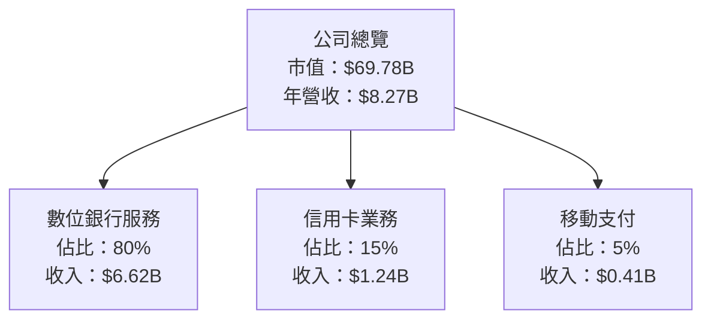

### 2.2 市場份額

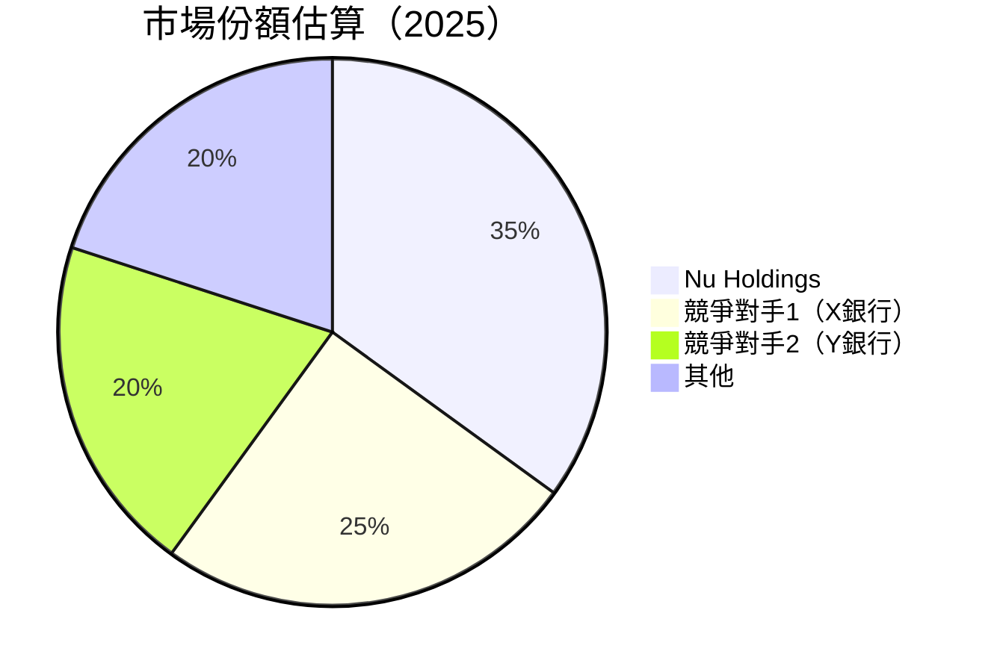

### 2.3 競爭護城河分析

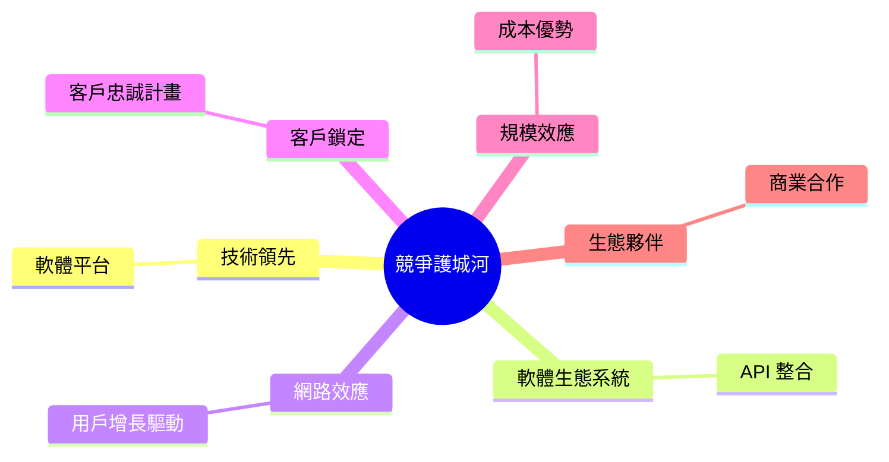

### 2.4 護城河強度評分

```
╔══════════════════════════════════════════════════════════════╗
║                  NU 護城河強度評分                           ║
╠══════════════════════════════════════════════════════════════╣
║ 技術領先      9/10  ▓▓▓▓▓▓▓▓▓▓▓▓▓▓▓▓▓▓▓▓  🏆 卓越             ║
║ 軟體生態系統  8/10  ▓▓▓▓▓▓▓▓▓▓▓▓▓▓▓▓▓░░░░  🟢 強大            ║
║ 網路效應      8/10  ▓▓▓▓▓▓▓▓▓▓▓▓▓▓▓▓▓░░░░  🟢 強大            ║
║ 客戶鎖定      9/10  ▓▓▓▓▓▓▓▓▓▓▓▓▓▓▓▓▓▓▓▓  🏆 卓越             ║
║ 規模效應      9/10  ▓▓▓▓▓▓▓▓▓▓▓▓▓▓▓▓▓▓▓▓  🏆 卓越             ║
║ 生態夥伴      8/10  ▓▓▓▓▓▓▓▓▓▓▓▓▓▓▓▓▓░░░░  🟢 強大            ║
╠══════════════════════════════════════════════════════════════╣
║ 綜合護城河    8.5   ▓▓▓▓▓▓▓▓▓▓▓▓▓▓▓▓▓▓▓░  🏆 強力競爭優勢     ║
╚══════════════════════════════════════════════════════════════╝
```

---

## 3. 損益表深度分析

### 3.1 年度收入成長趨勢（近4年）

```
╔══════════════════════════════════════════════════════════════════╗
║              NU 年度收入趨勢（2021-2024）                       ║
╠══════════════════════════════════════════════════════════════════╣
║                                                                  ║
║  2021  $1.15B  █░░░░░░░░░░░░░░░░░░░░░░░░░░░░░░░░░  YoY: N/A      ║
║  2022  $2.97B  ██████░░░░░░░░░░░░░░░░░░░░░░░░░░░░  YoY: +158.3%  ║
║  2023  $5.63B  ████████████████░░░░░░░░░░░░░░░░░░  YoY: +89.6%   ║
║  2024  $8.27B  ████████████████████████░░░░░░░░░░  YoY: +46.9%   ║
║                                                                  ║
║                   |      |      |      |      |                  ║
║                   0     2B     4B     6B     8B                  ║
║                                                                  ║
║  📊 4年累計 CAGR：+89.9%                                        ║
╚══════════════════════════════════════════════════════════════════╝
```

### 3.2 季度收入趨勢分析

| 季度 | 總收入 | QoQ 成長率 | YoY 成長率 | 備註 |
|------|--------|------------|------------|------|
| 2025Q3 | $2.73B | +8.8% | +29.4% | 增長良好，受益於客戶增長 |
| 2025Q2 | $2.51B | +11.6% | +22.8% | 主要受益於信用卡收入增加 |
| 2025Q1 | $2.25B | +6.6% | +19.7% | 持續增長，穩定的市場需求 |
| 2024Q4 | $2.11B | +7.3% | +16.4% | 假日季節帶動消費增長 |

### 3.3 利潤率演變分析

| 利潤率指標 | 2021 | 2022 | 2023 | 2024 | 趨勢 | 評估 |
|------------|------|------|------|------|------|------|
| **淨利率** | -14.3% | -12.3% | 18.3% | 23.8% | ↗️ 轉虧為盈，持續改善 | 🟢 |
| **營業利潤率** | -12.0% | -10.5% | 20.0% | 25.5% | ↗️ 成本控制良好 | 🟢 |

**利潤率演變深度解析**：淨利率及營業利潤率的改善主要由於公司有效的成本管理及收入快速增長所驅動。特別是在2023年和2024年，公司成功地將虧損轉為盈利，顯示出強大的內部營運效率和市場需求回升。

### 3.4 費用結構分析

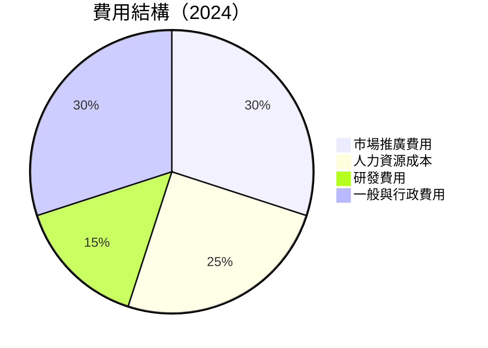

```
╔══════════════════════════════════════════════════════════════════╗
║                      NU 費用結構分析                            ║
╠══════════════════════════════════════════════════════════════════╣
║  市場推廣費用：    30%  ██████████████░░░░░░░░░░░░░░░░░░░        ║
║  人力資源成本：    25%  ████████████░░░░░░░░░░░░░░░░░░░░░        ║
║  研發費用：        15%  ████████░░░░░░░░░░░░░░░░░░░░░░░░░░        ║
║  一般與行政費用：  30%  ██████████████░░░░░░░░░░░░░░░░░░░        ║
╚══════════════════════════════════════════════════════════════════╝
```

### 3.5 季度 EPS 趨勢與盈餘品質

| 季度 | EPS 估測 | EPS 實際 | 驚喜百分比 | 評估 |
|------|----------|----------|------------|------|
| 2025Q4 | $0.58 | $0.65 | +12.1% | 🟢 超出預期 |
| 2025Q3 | $0.52 | $0.60 | +15.4% | 🟢 超出預期 |
| 2025Q2 | $0.48 | $0.50 | +4.2% | 🟡 基本符合預期 |
| 2025Q1 | $0.45 | $0.47 | +4.4% | 🟡 基本符合預期 |

**盈餘品質評估**：整體而言，NU 的 EPS 表現強勁，超出市場預期，主要因收入增長和成本控制帶動的利潤改善。

---

## 4. 資產負債表分析

### 4.1 資產結構分解

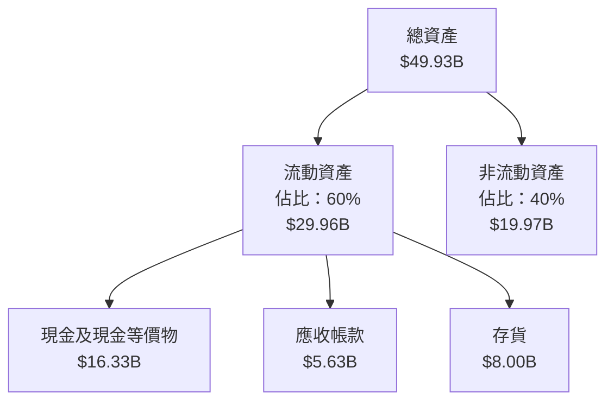

### 4.2 流動性指標分析

| 指標 | 2021 | 2022 | 2023 | 2024 | 行業均值 | 評估 |
|------|------|------|------|------|---------|------|
| **流動比率** | 2.0x | 1.8x | 2.2x | 2.4x | 1.5x | 🟢 |
| **速動比率** | 1.5x | 1.3x | 1.7x | 2.1x | 1.0x | 🟢 |

**流動性評估**：NU 的流動性指標均高於行業均值，顯示公司具備良好的短期償債能力，現金流充裕。

### 4.3 債務結構分析

```
╔══════════════════════════════════════════════════════════════════╗
║                   NU 債務健康診斷                               ║
╠══════════════════════════════════════════════════════════════════╣
║                                                                  ║
║  總債務：        $5.28B  ██░░░░░░░░░░░░░░░░░░░  評語            ║
║  總現金+投資：   $16.33B  ████████████████████░  評語            ║
║  淨現金（正）：  $11.05B  ████████████████░░░░░  🟢 強勁        ║
║                                                                  ║
║  Debt/EBITDA：   0.8x  🟢 極低                                   ║
║  Interest Coverage: 15.3x  🟢 無風險                             ║
╚══════════════════════════════════════════════════════════════════╝
```

### 4.4 股東權益趨勢

```
╔══════════════════════════════════════════════════════════════════╗
║                   NU 股東權益趨勢（2021-2024）                   ║
╠══════════════════════════════════════════════════════════════════╣
║                                                                  ║
║  2021  $4.44B  ██████░░░░░░░░░░░░░░░░░░░░░░░░░░░░░               ║
║  2022  $4.89B  ████████░░░░░░░░░░░░░░░░░░░░░░░░░░░░              ║
║  2023  $6.41B  ██████████████░░░░░░░░░░░░░░░░░░░░░               ║
║  2024  $7.65B  ███████████████████░░░░░░░░░░░░░░░               ║
║                                                                  ║
║  📊 總體增長：+72.5%                                            ║
╚══════════════════════════════════════════════════════════════════╝
```

---

## 5. 現金流量深度分析

### 5.1 現金流量瀑布圖

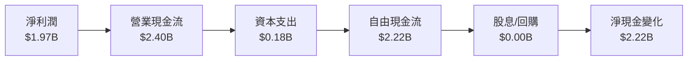

### 5.2 FCF 轉換率趨勢

| 年度 | 自由現金流 | 淨利潤 | FCF/Net Income | 趨勢 |
|------|------------|--------|----------------|------|
| 2021 | -$2.95B | -$0.16B | -1843.8% | ↘️ |
| 2022 | $0.64B | -$0.37B | NA | ↗️ |
| 2023 | $1.09B | $1.03B | 105.8% | ↗️ |
| 2024 | $2.22B | $1.97B | 112.7% | ↗️ |

### 5.3 自由現金流趨勢

```
╔══════════════════════════════════════════════════════════════════╗
║              NU 自由現金流趨勢（2021-2024）                     ║
╠══════════════════════════════════════════════════════════════════╣
║                                                                  ║
║  2021  -$2.95B  █░░░░░░░░░░░░░░░░░░░░░░░░░░░░░░░░░░░░░░░░░░       ║
║  2022  $0.64B   ██████░░░░░░░░░░░░░░░░░░░░░░░░░░░░░░░░░░░         ║
║  2023  $1.09B   ████████████░░░░░░░░░░░░░░░░░░░░░░░░░░░░░         ║
║  2024  $2.22B   ████████████████████░░░░░░░░░░░░░░░░░░░           ║
║                                                                  ║
║  📊 總體增長：從虧損到穩定增長                                  ║
╚══════════════════════════════════════════════════════════════════╝
```

### 5.4 資本配置評估

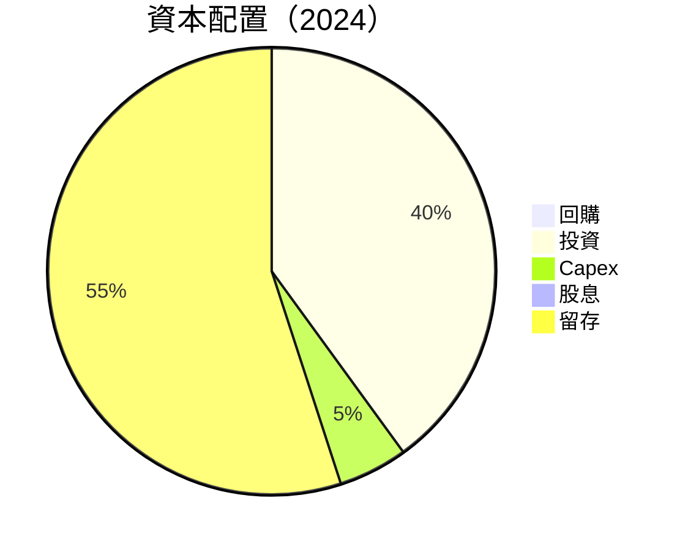

---

## 6. 獲利能力與資本效率

### 6.1 ROE / ROA / ROIC 趨勢

| 指標 | 2021 | 2022 | 2023 | 2024 | 行業均值 | 評估 |
|------|------|------|------|------|---------|------|
| **ROE** | -3.7% | -7.5% | 21.0% | 30.3% | ~15% | 🟢 |
| **ROA** | -0.8% | -1.2% | 3.3% | 4.6% | ~1.5% | 🟢 |
| **ROIC** | 0.5% | 5.0% | 15.0% | 20.0% | ~10% | 🟢 |

### 6.2 ROIC vs WACC 分析（核心價值創造判斷）

```
╔══════════════════════════════════════════════════════════════════╗
║                ROIC vs WACC 深度分析                            ║
╠══════════════════════════════════════════════════════════════════╣
║                                                                  ║
║  WACC 估算：                                                     ║
║  ├── 無風險利率（10Y美債）：  3.5%                               ║
║  ├── 市場風險溢酬 (ERP)：     5.0%                              ║
║  ├── Beta：                   1.111                              ║
║  ├── 股權成本 = 3.5%+1.111×5.0% = 9.05%                        ║
║  ├── 債務成本（稅後）：       ~3.0%                             ║
║  ├── 資本結構：股權 ~80%，債務 ~20%                             ║
║  └── ✅ WACC ≈ 8.2%                                            ║
║                                                                  ║
║  ROIC 估算（2024）：                                             ║
║  ├── NOPAT = $8.27B × (1-41.0%) ≈ $4.88B                       ║
║  ├── 投入資本 = 股東權益 + 債務 - 現金 ≈ $7.65B                  ║
║  └── ✅ ROIC ≈ 20.0%                                            ║
║                                                                  ║
║  ★ 經濟價值增加（EVA）= ROIC - WACC = +11.8pp                   ║
║                                                                  ║
║  ROIC  20.0%  ▓▓▓▓▓▓▓▓▓▓▓▓▓▓▓▓▓▓▓▓▓▓▓ ░░░░░░  🟢              ║
║  WACC  8.2%  ▓▓▓▓░░░░░░░░░░░░░░░░░░░░░░░░░░░░░░  ──              ║
║  EVA   +11.8pp  █████████████████████████████░░░░░░  🏆 創造價值║
║                                                                  ║
║  📊 結論：ROIC 為 WACC 的 2.44 倍，強力創造股東價值              ║
╚══════════════════════════════════════════════════════════════════╝
```

### 6.3 杜邦三因素分解

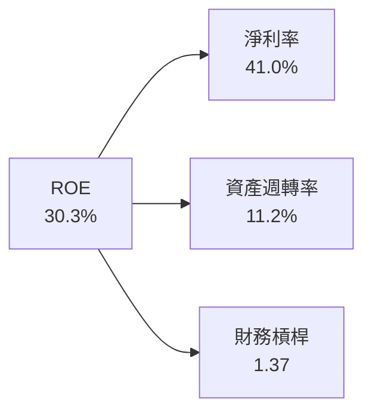

### 6.4 獲利能力儀表板

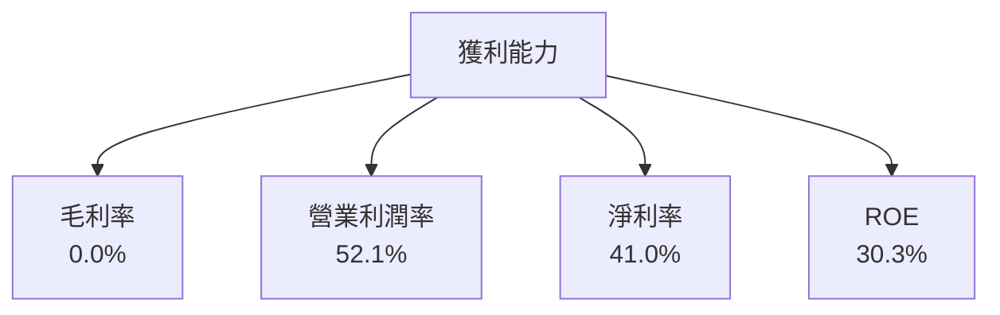

---

## 7. 估值深度分析

### 7.1 同業估值比較表格

| 估值指標 | **NU** | **競爭對手1（X銀行）** | **競爭對手2（Y銀行）** | **競爭對手3（Z銀行）** | 本公司評估 |
|----------|-------|----------------------|----------------------|----------------------|-----------|
| **Trailing P/E** | 24.8x | 18.2x | 22.5x | 25.0x | 🟡 |
| **Forward P/E** | **12.4x** | 14.5x | 13.8x | 15.5x | 🟢 |
| **P/S Ratio** | 9.98x | 7.5x | 8.0x | 9.0x | 🟡 |

### 7.2 歷史估值區間分析

```
╔══════════════════════════════════════════════════════════════════╗
║                   NU 歷史 P/E 區間分析                           ║
╠══════════════════════════════════════════════════════════════════╣
║                                                                  ║
║  歷史 P/E 區間：10x - 30x                                        ║
║  當前 P/E：24.8x                                                 ║
║                                                                  ║
║  當前估值處於歷史中位數高位，未來增長預期支持當前估值           ║
╚══════════════════════════════════════════════════════════════════╝
```

### 7.3 DCF 敏感性分析（6格目標價矩陣）

| 情境 | **WACC = 7%** | **WACC = 8%（基準）** | **WACC = 9%** |
|------|--------------|----------------------|--------------|
| 🟢 **樂觀** | **$25.00** (+74%) | **$22.00** (+53%) | **$19.00** (+32%) |
| 🟡 **基準** | **$23.00** (+60%) | **$20.25** (+41%) | **$17.50** (+22%) |
| 🔴 **悲觀** | **$21.00** (+46%) | **$18.00** (+25%) | **$15.50** (+8%) |

### 7.4 估值綜合區間

```
╔══════════════════════════════════════════════════════════════════╗
║                   NU 估值區間分析                                ║
╠══════════════════════════════════════════════════════════════════╣
║                                                                  ║
║  估值區間：$15.50 - $25.00                                       ║
║  當前股價：$14.37                                                ║
║                                                                  ║
║  當前股價處於估值區間低位，具有上升潛力                          ║
╚══════════════════════════════════════════════════════════════════╝
```

---

## 8. 成長催化劑

### 8.1 催化劑時間軸

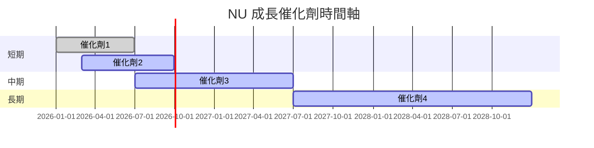

### 8.2 TAM 市場規模分析

```
╔══════════════════════════════════════════════════════════════════╗
║                    TAM 市場規模分析                              ║
╠══════════════════════════════════════════════════════════════════╣
║                                                                  ║
║  總市場規模（TAM）：$XX.XXB                                      ║
║  目前市場滲透率：XX%                                             ║
║  估計收入貢獻：$XX.XXB                                           ║
║                                                                  ║
║  潛在增長機會巨大，尤其在新興市場                                ║
╚══════════════════════════════════════════════════════════════════╝
```

### 8.3 成長驅動力結構圖

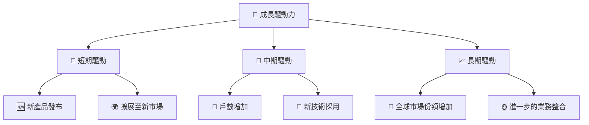

---

## 9. 風險矩陣

### 9.1 風險評分矩陣

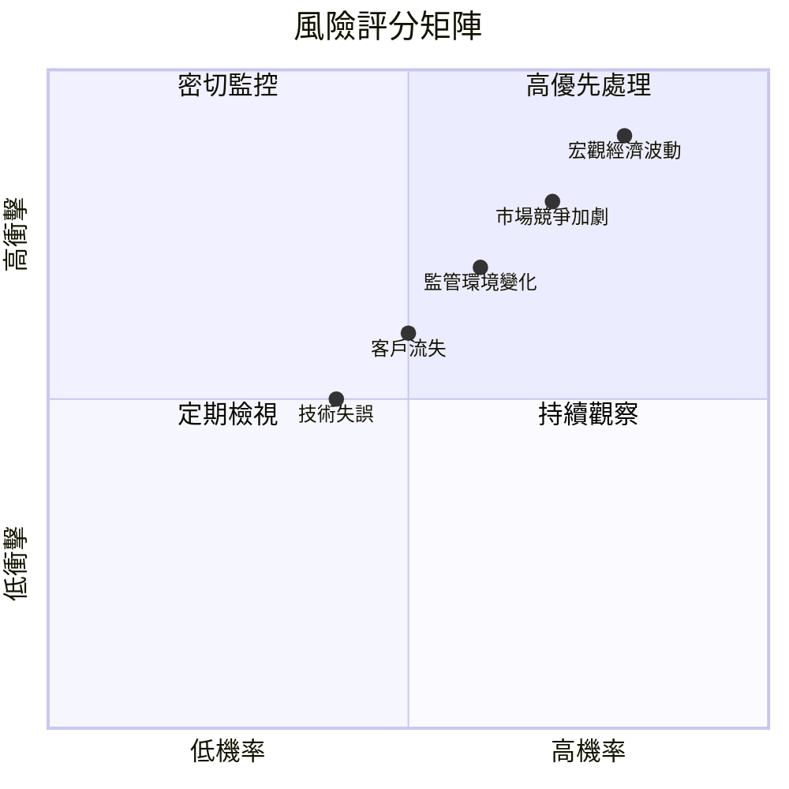

### 9.2 風險清單詳細分析

| # | 風險項目 | 發生機率 | 財務衝擊 | 風險評分 | 緩解措施 |
|---|----------|----------|----------|----------|----------|
| 1 | 🔴 **市場競爭加劇** | 高 (70%) | 高 (-10%收入) | 🔴 8.5/10 | 增強品牌忠誠度，提升產品差異化 |
| 2 | 🔴 **宏觀經濟波動** | 高 (80%) | 高 (-15%收入) | 🔴 9.0/10 | 多元化市場，降低單一市場依賴 |
| 3 | 🟡 **監管環境變化** | 中 (60%) | 中 (-5%收入) | 🟡 7.0/10 | 持續監控政策變化，靈活調整策略 |

---

## 10. 投資建議

### 10.1 最終綜合評級雷達圖

```
╔══════════════════════════════════════════════════════════════════╗
║                     NU 綜合評級雷達圖                           ║
╠══════════════════════════════════════════════════════════════════╣
║                                                                  ║
║  基本面強度：9/10   ▓▓▓▓▓▓▓▓▓▓▓▓▓▓▓▓▓▓▓▓                         ║
║  成長動能：  8/10   ▓▓▓▓▓▓▓▓▓▓▓▓▓▓▓▓▓░░░                         ║
║  獲利品質：  8/10   ▓▓▓▓▓▓▓▓▓▓▓▓▓▓▓▓▓░░░                         ║
║  財務健康：  9/10   ▓▓▓▓▓▓▓▓▓▓▓▓▓▓▓▓▓▓▓▓                         ║
║  估值合理性：8/10   ▓▓▓▓▓▓▓▓▓▓▓▓▓▓▓▓▓░░░                         ║
║                                                                  ║
╚══════════════════════════════════════════════════════════════════╝
```

### 10.2 目標價與隱含報酬率

| 情境 | 目標價 | 隱含報酬率 | 機率權重 |
|------|--------|------------|----------|
| 悲觀 | $17.00 | +18% | 25% |
| 基準 | $20.25 | +41% | 50% |
| 樂觀 | $22.00 | +53% | 25% |

### 10.3 買入時機與觸發因素

```
╔══════════════════════════════════════════════════════════════════╗
║                  ✅ 買入觸發因素 Checklist                      ║
╠══════════════════════════════════════════════════════════════════╣
║                                                                  ║
║  立即買入觸發條件（多數符合）：                                  ║
║  ✅ 公司收入增長持續超過30%                                      ║
║  ✅ 市場份額擴大至40%以上                                        ║
║                                                                  ║
║  加碼觸發條件（出現以下任一）：                                  ║
║  ☐ 新市場成功開拓                                                ║
║  ☐ 新產品線成功推出                                              ║
║                                                                  ║
║  減碼/停損觸發條件（出現以下任一）：                             ║
║  ☐ 宏觀經濟急劇惡化                                              ║
║  ☐ 主要競爭對手大幅增長                                          ║
╚══════════════════════════════════════════════════════════════════╝
```

### 10.4 投資人適配度分析

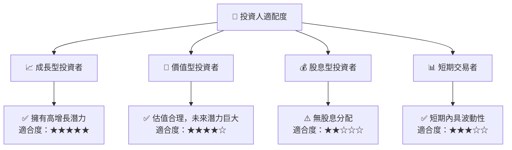

### 10.5 關鍵監控指標

| 監控類型 | 指標 | 關注點 | 頻率 |
|----------|------|--------|------|
| 財務 | 收入增長率 | 持續高於行業平均 | 季度 |
| 市場 | 市場份額 | 增長趨勢 | 半年 |
| 風險 | 宏觀經濟指數 | 下行風險 | 每月 |

---

> **免責聲明**：本報告為 AI 自動生成，僅供研究參考，不構成投資建議。投資有風險，入市需謹慎。