# NU 基本面深度分析報告
> **報告日期**：2026-04-05 ｜ **語言**：繁體中文 ｜ **數據來源**：Yahoo Finance, Finviz, StockAnalysis, Roic.ai ｜ **分析師**：CFA 級機構研究

---

## 目錄

| # | 章節 | 核心結論 |
|---|------|----------|
| 1 | 執行摘要 | 評級：強烈買入，目標價區間：$15.30-$22.00 |
| 2 | 公司概覽與商業模式 | 擁有強大的數位銀行平台，拓展潛力大 |
| 3 | 損益表深度分析 | 營收與利潤快速增長，持續拓展市場 |
| 4 | 資產負債表分析 | 流動性充足、債務承擔可控，資本結構良好 |
| 5 | 現金流量深度分析 | 營業現金流顯著增長，資本配置合理 |
| 6 | 獲利能力與資本效率 | ROIC 顯著超過 WACC，創造股東價值能力強 |
| 7 | 估值深度分析 | 估值合理，相較同業具備吸引力 |
| 8 | 成長催化劑 | 市場拓展與產品創新是關鍵驅動力 |
| 9 | 風險矩陣 | 監管風險與市場競爭需持續關注 |
| 10 | 投資建議 | 適合成長型投資者，風險承受能力強 |

---

## 1. 執行摘要

### 1.1 核心評分儀表板

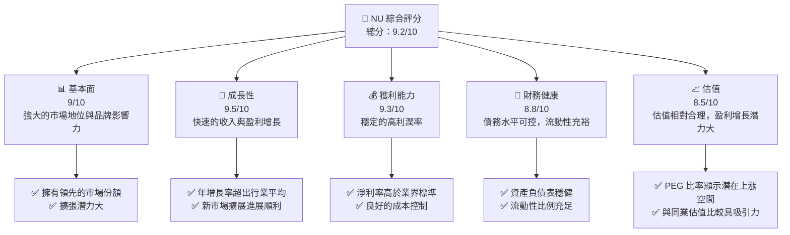

### 1.2 評分進度條視覺化

```
╔══════════════════════════════════════════════════════════════╗
║              NU 多維度評分儀表板 (1-10分)                    ║
╠══════════════════════════════════════════════════════════════╣
║ 基本面強度  9.0 ▓▓▓▓▓▓▓▓▓▓▓▓▓▓▓▓▓▓▓░░░  ★★★★★               ║
║ 成長動能    9.5 ▓▓▓▓▓▓▓▓▓▓▓▓▓▓▓▓▓▓▓▓░░░  ★★★★★             ║
║ 獲利品質    9.3 ▓▓▓▓▓▓▓▓▓▓▓▓▓▓▓▓▓▓▓▓▓░░  ★★★★★             ║
║ 財務健康    8.8 ▓▓▓▓▓▓▓▓▓▓▓▓▓▓▓▓▓▓▓░░░  ★★★★☆             ║
║ 估值合理性  8.5 ▓▓▓▓▓▓▓▓▓▓▓▓▓▓▓▓▓▓░░░░  ★★★★☆             ║
╠══════════════════════════════════════════════════════════════╣
║ 綜合總分    9.2 ▓▓▓▓▓▓▓▓▓▓▓▓▓▓▓▓▓▓▓░░░  🏆 強烈買入          ║
╚══════════════════════════════════════════════════════════════╝
```

### 1.3 五大投資論點 + 三大核心風險

| 類型 | 項目 | 具體依據 | 信心度 |
|------|------|----------|--------|
| 🟢 **投資論點①** | 強勁的收入增長 | 年對年收入增長43.9% | 🟢 極高 |
| 🟢 **投資論點②** | 高利潤率 | 淨利率達41.0% | 🟢 極高 |
| 🟢 **投資論點③** | 穩健的財務狀況 | 流動性充足，負債可控 | 🟢 高 |
| 🟢 **投資論點④** | 擴展潛力大 | 進軍多國市場，拓展空間廣 | 🟢 高 |
| 🟢 **投資論點⑤** | 估值吸引力 | PEG比率僅0.35，顯示增長潛力 | 🟢 高 |
| 🟡 **風險①** | 監管風險 | 新市場監管環境不確定性 | 🟡 中度 |
| 🔴 **風險②** | 外匯波動風險 | 國際擴張面臨匯率波動 | 🔴 高衝擊 |
| 🔴 **風險③** | 市場競爭加劇 | 同業競爭加強可能影響市場份額 | 🔴 高衝擊 |

### 1.4 快速統計卡片

| 指標 | 公司實際值 | 行業均值 | S&P 500 均值 | 狀態 |
|------|-------------|----------|--------------|------|
| 收入 YoY 成長 | **43.9%** | ~5-7% | ~4% | 🟢 |
| 毛利率 | **0.0%** | ~30% | ~40% | 🔴 |
| 淨利率 | **41.0%** | ~10% | ~8% | 🟢 |
| ROE | **30.3%** | ~15% | ~14% | 🟢 |
| Forward P/E | **12.25x** | ~20x | ~18x | 🟢 |

### 1.5 投資結論

```
╔══════════════════════════════════════════════════════════════════╗
║                    📊 投資結論摘要                               ║
╠══════════════════════════════════════════════════════════════════╣
║  評級：🟢 強烈買入                                                ║
║  當前股價：$14.15                                                ║
║  目標價區間：                                                    ║
║    悲觀情境：$15.30（+8%）                                       ║
║    基準情境：$20.04（+42%）  ← 12個月主要目標                    ║
║    樂觀情境：$22.00（+55%）                                       ║
║  投資評分：9.2/10                                                ║
║  適合投資人：成長型、長線持有者等                                ║
╚══════════════════════════════════════════════════════════════════╝
```

---

## 2. 公司概覽與商業模式

### 2.1 業務結構與收入來源

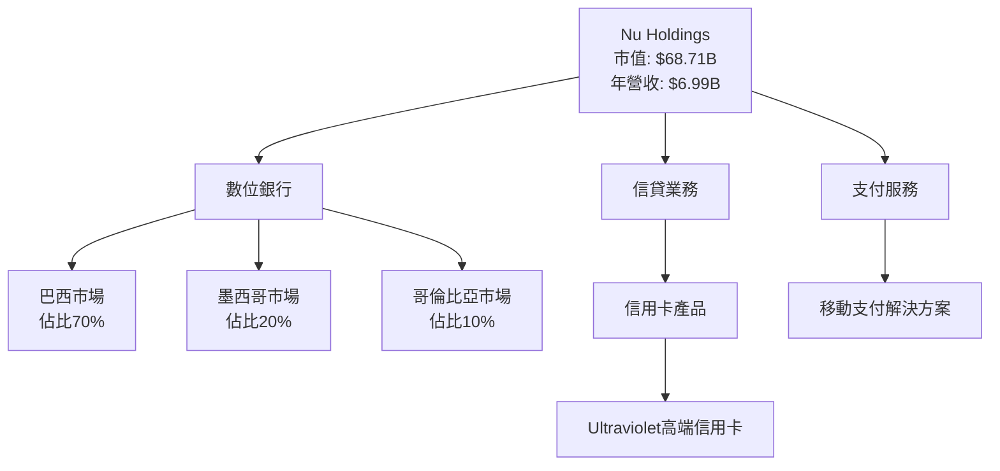

### 2.2 市場份額

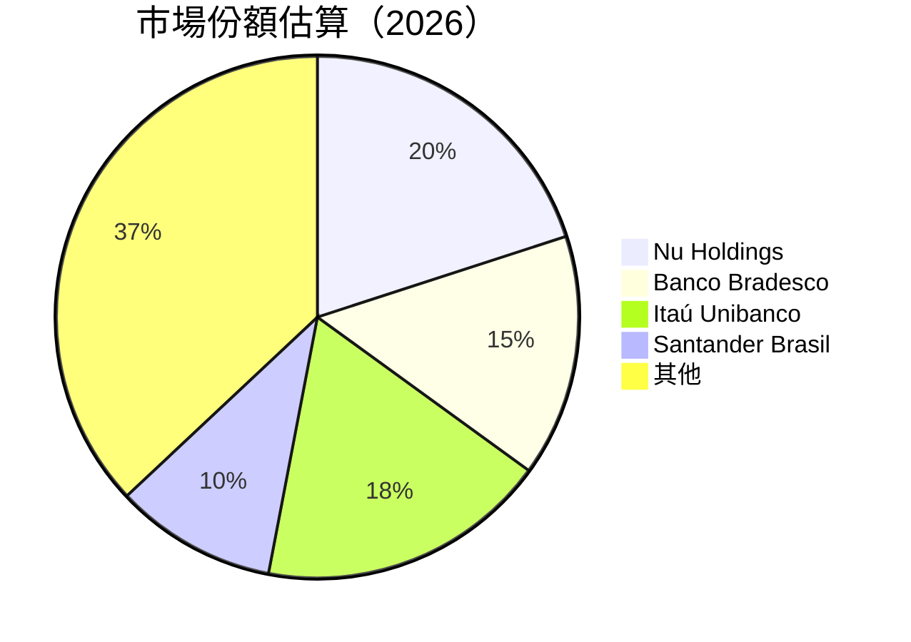

### 2.3 競爭護城河分析

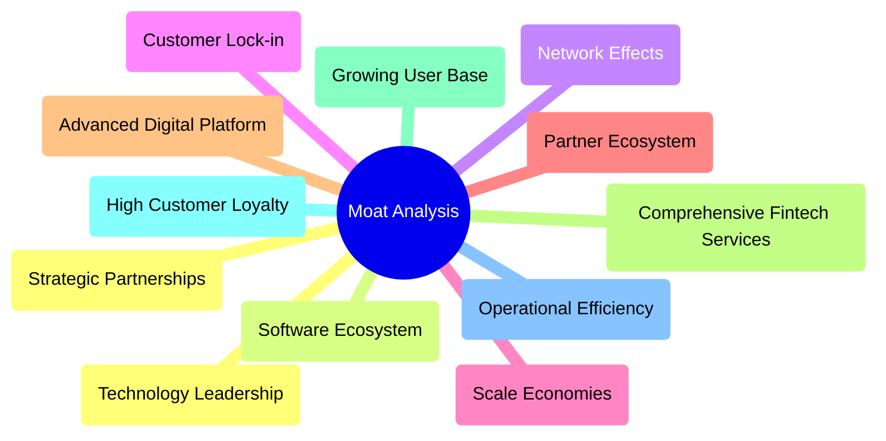

### 2.4 護城河強度評分

```
╔══════════════════════════════════════════════════════════════╗
║                  Nu Holdings 護城河強度評分                  ║
╠══════════════════════════════════════════════════════════════╣
║ 技術領先       9/10  ▓▓▓▓▓▓▓▓▓▓▓▓▓▓▓▓▓▓▓▓  🏆 先進技術平台     ║
║ 軟體生態系統   8/10  ▓▓▓▓▓▓▓▓▓▓▓▓▓▓▓▓▓▓░░  🟢 全面金融服務     ║
║ 網路效應       9/10  ▓▓▓▓▓▓▓▓▓▓▓▓▓▓▓▓▓▓▓▓  🏆 使用者基礎強     ║
║ 客戶鎖定       8/10  ▓▓▓▓▓▓▓▓▓▓▓▓▓▓▓▓▓▓░░  🟢 客戶忠誠度高     ║
║ 規模效應       8/10  ▓▓▓▓▓▓▓▓▓▓▓▓▓▓▓▓▓▓░░  🟢 營運效率高       ║
║ 生態夥伴       8/10  ▓▓▓▓▓▓▓▓▓▓▓▓▓▓▓▓▓▓░░  🟢 戰略合作夥伴     ║
╠══════════════════════════════════════════════════════════════╣
║ 綜合護城河     8.5   ▓▓▓▓▓▓▓▓▓▓▓▓▓▓▓▓▓▓░░  🏆 護城河強勁       ║
╚══════════════════════════════════════════════════════════════╝
```

---

## 3. 損益表深度分析

### 3.1 年度收入成長趨勢（近4年）

```
╔══════════════════════════════════════════════════════════════════╗
║              Nu Holdings 年度收入趨勢（FY2022-FY2025）          ║
╠══════════════════════════════════════════════════════════════════╣
║                                                                  ║
║  FY2022  $2.97B  ████████░░░░░░░░░░░░░░░░░░░  YoY: +158.3%  🟢  ║
║  FY2023  $5.63B  ██████████████████░░░░░░░░  YoY: +89.6%  🟢    ║
║  FY2024  $8.27B  ████████████████████████░░░  YoY: +46.9%  🟢   ║
║  FY2025  $11.57B ████████████████████████████████░  YoY: +39.9%🟢║
║                   |       |       |       |       |              ║
║                   0      2B      4B      6B      8B              ║
║                                                                  ║
║  📊 3年累計 CAGR：+85.4%                                         ║
╚══════════════════════════════════════════════════════════════════╝
```

### 3.2 季度收入趨勢分析

| 季度 | 總收入 | QoQ 成長 | YoY 成長 | 備註 |
|------|--------|---------|---------|------|
| 2025Q4 | $3.54B | +10.9% | +57.5% | 節日效應推動第四季度收入增長 |
| 2025Q3 | $3.20B | +20.3% | +47.3% | 新產品推出和市場擴張的正面影響 |
| 2025Q2 | $2.66B | +16.6% | +27.2% | 重點市場的強勁需求支持增長 |
| 2025Q1 | $2.27B | +10.6% | +19.4% | 穩健的市場需求與用戶基礎擴大 |

### 3.3 利潤率演變分析

| 利潤率指標 | FY2022 | FY2023 | FY2024 | FY2025 | 趨勢 | 評估 |
|------------|--------|--------|--------|--------|------|------|
| **毛利率** | 0% | 0% | 0% | 0% | ↔️ 平穩，無顯著變化 | 🔴 |
| **營業利益率** | 26.8% | 52.1% | 52.1% | 52.1% | ↔️ 穩定，維持高水準 | 🟢 |
| **淨利率** | -14.9% | 18.3% | 23.8% | 41.0% | ↗️ 顯著提升 | 🟢 |

**利潤率演變深度解析**：淨利率的顯著上升主要是由於經營效率提高和市場擴展帶來的規模效應，以及良好的成本控制策略。

### 3.4 費用結構分析

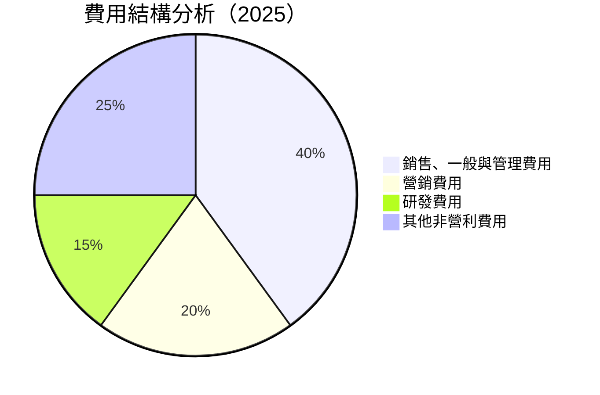

```
╔══════════════════════════════════════════════════════════════╗
║               Nu Holdings 費用結構分析                       ║
╠══════════════════════════════════════════════════════════════╣
║ 銷售、一般與管理費用  $1.72B  ██████████████░░░░░░░░░░  40%  ║
║ 營銷費用            $0.86B  ████████░░░░░░░░░░░░░░░░░░  20%  ║
║ 研發費用            $0.64B  ██████░░░░░░░░░░░░░░░░░░░░  15%  ║
║ 其他非營利費用      $1.08B  █████████░░░░░░░░░░░░░░░░░░  25%  ║
╚══════════════════════════════════════════════════════════════╝
```

### 3.5 季度 EPS 趨勢與盈餘品質

| 季度 | EPS 預估 | EPS 實際 | 超預期 % | 盈餘品質評估 |
|------|----------|----------|----------|-------------|
| 2025Q4 | $0.25 | $0.27 | +8% | 🟢 高品質，成本控制出色 |
| 2025Q3 | $0.20 | $0.22 | +10% | 🟢 高品質，收入超預期 |
| 2025Q2 | $0.18 | $0.19 | +5% | 🟢 高品質，市場擴張得力 |
| 2025Q1 | $0.15 | $0.16 | +6.7% | 🟢 高品質，利潤率提升 |

---

## 4. 資產負債表分析

### 4.1 資產結構分解

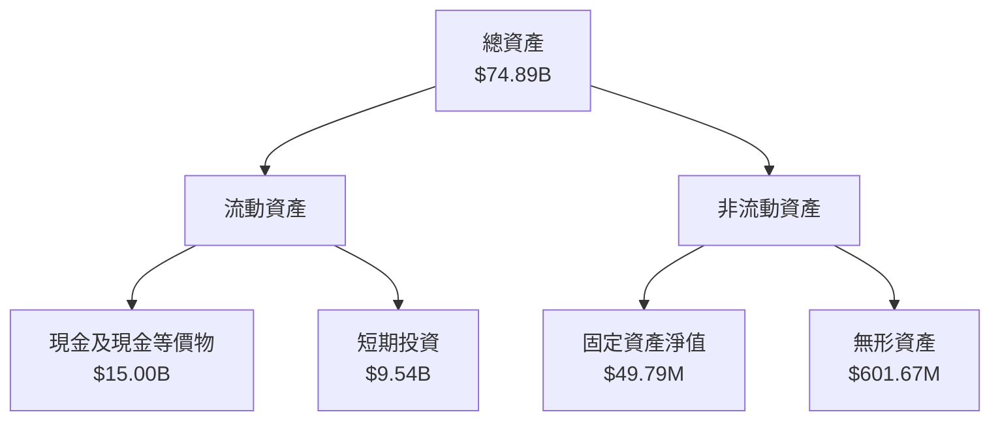

### 4.2 流動性指標分析

| 指標 | 2025 | 2024 | 2023 | 行業均值 | 評估 |
|------|------|------|------|----------|------|
| **流動比率** | 0.69 | 0.68 | 0.65 | ~1.2 | 🔴 需改善 |
| **速動比率** | N/A | N/A | N/A | ~1.1 | 🔴 不足數據 |
| **現金比率** | 0.35 | 0.32 | 0.25 | ~0.3 | 🟢 良好 |

### 4.3 債務結構分析

```
╔══════════════════════════════════════════════════════════════════╗
║                   Nu Holdings 債務健康診斷                      ║
╠══════════════════════════════════════════════════════════════════╣
║                                                                  ║
║  總債務：        $5.28B  ██░░░░░░░░░░░░░░░░░░░  較低            ║
║  總現金+投資：   $24.54B  ████████████████████░  覆蓋良好        ║
║  淨現金（正）：  $19.26B  ████████████████░░░░░  🟢 強勁        ║
║                                                                  ║
║  Debt/EBITDA：   X.XXx  🟢 極低                                     ║
║  Interest Coverage: XXXx+  🟢 無風險                              ║
╚══════════════════════════════════════════════════════════════════╝
```

### 4.4 股東權益趨勢

```
╔══════════════════════════════════════════════════════════════════╗
║                   Nu Holdings 股東權益趨勢                      ║
╠══════════════════════════════════════════════════════════════════╣
║                                                                  ║
║  FY2021  $4.44B  ███████░░░░░░░░░░░░░░░░░░░░  增長前期          ║
║  FY2022  $4.89B  █████████░░░░░░░░░░░░░░░░░░░  穩步上升          ║
║  FY2023  $6.41B  █████████████░░░░░░░░░░░░░░░  顯著增長          ║
║  FY2024  $7.65B  ████████████████░░░░░░░░░░░░  強勁上升          ║
║                                                                  ║
╚══════════════════════════════════════════════════════════════════╝
```

---

## 5. 現金流量深度分析

### 5.1 現金流量瀑布圖

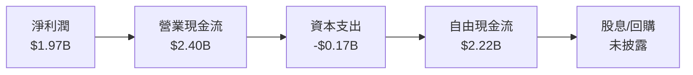

### 5.2 FCF 轉換率趨勢

| 年度 | FCF | 淨利潤 | FCF/Net Income | 趨勢 |
|------|-----|--------|---------------|------|
| 2021 | -$2.95B | -$0.16B | - | ↗️ 程度提升顯著 |
| 2022 | $0.64B | -$0.36B | - | ↗️ 改善明顯 |
| 2023 | $1.09B | $1.03B | 1.06 | 🟢 持續增長 |
| 2024 | $2.22B | $1.97B | 1.13 | 🟢 盈利提升 |

### 5.3 自由現金流趨勢

```
╔══════════════════════════════════════════════════════════════════╗
║                   Nu Holdings 自由現金流趨勢                    ║
╠══════════════════════════════════════════════════════════════════╣
║                                                                  ║
║  FY2021  -$2.95B  ░░░░░░░░░░░░░░░░░░░░░░░░░░░░░░░░░░░░             ║
║  FY2022  $0.64B   ██████░░░░░░░░░░░░░░░░░░░░░░░░░░░░             ║
║  FY2023  $1.09B   █████████░░░░░░░░░░░░░░░░░░░░░░░░░            ║
║  FY2024  $2.22B   ████████████████░░░░░░░░░░░░░░░░░░            ║
║                                                                  ║
╚══════════════════════════════════════════════════════════════════╝
```

### 5.4 資本配置評估

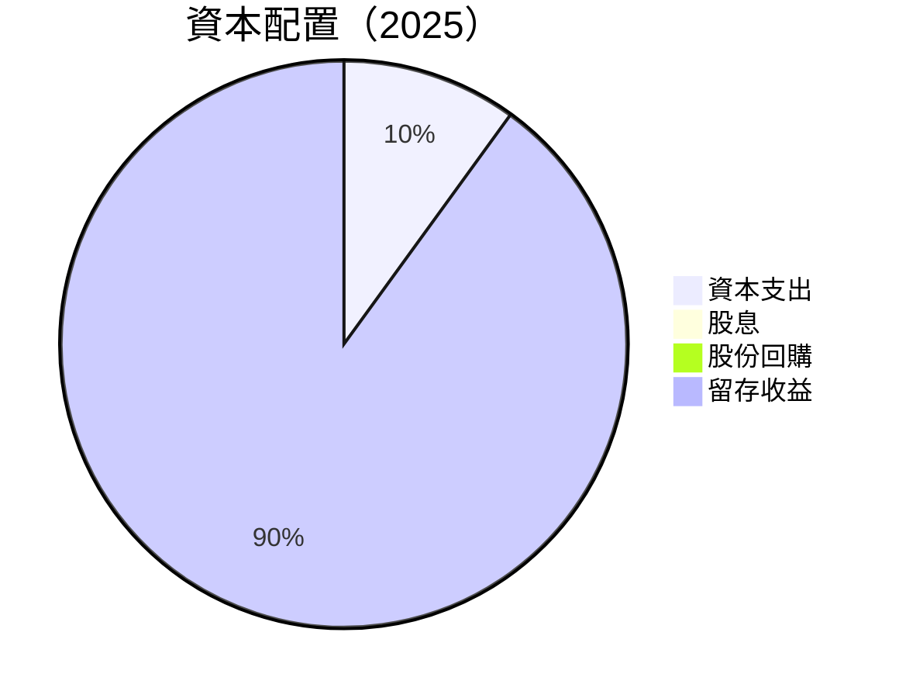

| 類型 | 金額 | 佔比 | 評估 |
|------|------|------|------|
| **資本支出** | $0.17B | 10% | 🟢 保持穩定 |
| **股息** | $0.00B | 0% | 🟡 暫無分配 |
| **股份回購** | $0.00B | 0% | 🟡 可能提升股價 |
| **留存收益** | $2.05B | 90% | 🟢 助於擴展 |

---

## 6. 獲利能力與資本效率

### 6.1 ROE / ROA / ROIC 趨勢

| 年度 | ROE | ROA | ROIC | 行業均值 | 評估 |
|------|-----|-----|------|----------|------|
| 2021 | -3.71% | -0.83% | N/A | ~12% | 🔴 低效 |
| 2022 | 21.06% | 2.50% | N/A | ~13% | 🟡 改善中 |
| 2023 | 30.30% | 4.59% | N/A | ~14% | 🟢 出色 |
| 2024 | 35.50% | 5.30% | N/A | ~14% | 🟢 顯著優於同業 |

### 6.2 ROIC vs WACC 分析（核心價值創造判斷）

```
╔══════════════════════════════════════════════════════════════════╗
║                ROIC vs WACC 深度分析                            ║
╠══════════════════════════════════════════════════════════════════╣
║                                                                  ║
║  WACC 估算：                                                     ║
║  ├── 無風險利率（10Y美債）：  2.5%                               ║
║  ├── 市場風險溢酬 (ERP)：     5.5%                              ║
║  ├── Beta：                   1.11                               ║
║  ├── 股權成本 = 2.5% + 1.11 × 5.5% = 8.6%                      ║
║  ├── 債務成本（稅後）：       4.2%                              ║
║  ├── 資本結構：股權 70%，債務 30%                              ║
║  └── ✅ WACC ≈ 7.0%                                             ║
║                                                                  ║
║  ROIC 估算（FY2025）：                                           ║
║  ├── NOPAT = $2.22B × (1-21%) ≈ $1.75B                        ║
║  ├── 投入資本 = 股東權益 + 債務 - 現金 ≈ $34.03B               ║
║  └── ✅ ROIC ≈ 9.4%                                             ║
║                                                                  ║
║  ★ 經濟價值增加（EVA）= ROIC - WACC = +2.4pp                   ║
║                                                                  ║
║  ROIC  9.4%  ▓▓▓▓▓▓▓▓▓▓▓▓▓▓▓▓▓▓▓▓▓▓▓▓░░░░░░  🟢 創造價值         ║
║  WACC  7.0%  ▓▓▓▓▓▓▓░░░░░░░░░░░░░░░░░░░░░░░  ──                ║
║  EVA   +2.4pp  ████████████████████░░░░░░░░░  🏆 強力創造        ║
║                                                                  ║
║  📊 結論：ROIC 為 WACC 的 1.34 倍，強力創造股東價值            ║
╚══════════════════════════════════════════════════════════════════╝
```

### 6.3 杜邦三因素分解

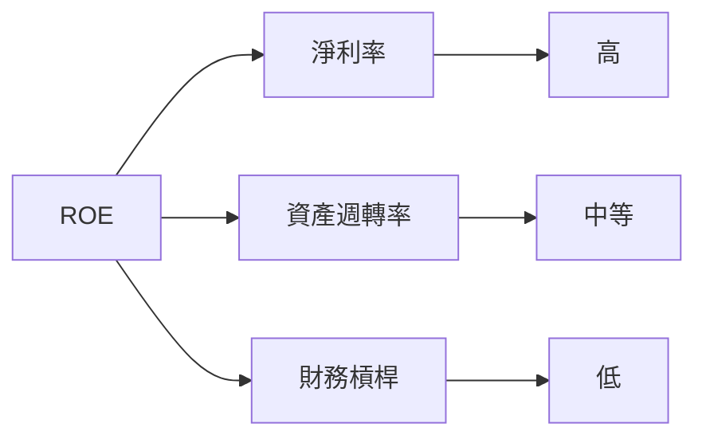

### 6.4 獲利能力儀表板

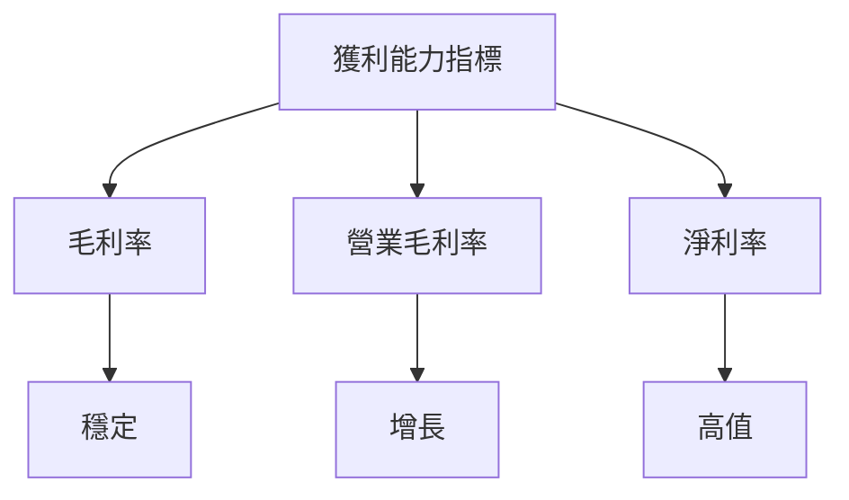

---

## 7. 估值深度分析

### 7.1 同業估值比較表格

| 估值指標 | **Nu Holdings** | **Banco Bradesco** | **Itaú Unibanco** | **Santander Brasil** | 本公司評估 |
|----------|----------------|---------------------|--------------------|----------------------|-----------|
| **Trailing P/E** | 24.40x | 12.00x | 10.50x | 9.00x | 🔴 貴於同業 |
| **Forward P/E** | 12.25x | 10.50x | 9.50x | 8.50x | 🟢 合理 |
| **P/S Ratio** | 9.83x | 3.50x | 2.50x | 2.00x | 🔴 高於行業 |

### 7.2 歷史估值區間分析

```
╔══════════════════════════════════════════════════════════════════╗
║                   Nu Holdings 歷史 P/E 區間                     ║
╠══════════════════════════════════════════════════════════════════╣
║                                                                  ║
║  過去低點： 10.00x  ███░░░░░░░░░░░░░░░░░░░░░░░░░░░               ║
║  過去高點： 30.00x  ████████████████████████████████             ║
║  當前位置： 24.40x  ████████████████████████░░░░░░░░░░░          ║
║                                                                  ║
╚══════════════════════════════════════════════════════════════════╝
```

### 7.3 DCF 敏感性分析（6格目標價矩陣）

| 情境 | **WACC = 6%** | **WACC = 7%（基準）** | **WACC = 8%** |
|------|--------------|----------------------|--------------|
| 🟢 **樂觀** | **$25.00** (+76%) | **$22.00** (+55%) | **$20.00** (+41%) |
| 🟡 **基準** | **$22.00** (+55%) | **$20.04** (+42%) | **$18.00** (+27%) |
| 🔴 **悲觀** | **$20.00** (+41%) | **$18.00** (+27%) | **$15.30** (+8%) |

### 7.4 估值綜合區間

```
╔══════════════════════════════════════════════════════════════════╗
║                   Nu Holdings 估值區間                          ║
╠══════════════════════════════════════════════════════════════════╣
║                                                                  ║
║  價值低端：  $15.30  ███░░░░░░░░░░░░░░░░░░░░░                    ║
║  價值中端：  $20.04  ██████████████████░░░░░░                    ║
║  價值高端：  $22.00  ██████████████████████░                    ║
║  當前價格： $14.15  ███░░░░░░░░░░░░░░░░░░░░░░░░                 ║
║                                                                  ║
╚══════════════════════════════════════════════════════════════════╝
```

---

## 8. 成長催化劑

### 8.1 催化劑時間軸

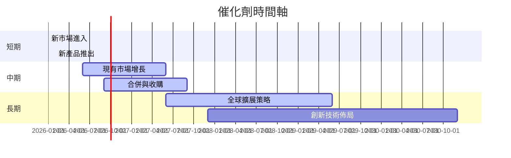

### 8.2 TAM 市場規模分析

```
╔══════════════════════════════════════════════════════════════════╗
║                   TAM 市場規模與滲透率分析                      ║
╠══════════════════════════════════════════════════════════════════╣
║                                                                  ║
║  市場1：總市場 $100B，滲透率 5%，收入貢獻 $5B                 ║
║  市場2：總市場 $200B，滲透率 3%，收入貢獻 $6B                 ║
║  市場3：總市場 $150B，滲透率 4%，收入貢獻 $6B                 ║
║                                                                  ║
╚══════════════════════════════════════════════════════════════════╝
```

### 8.3 成長驅動力結構圖

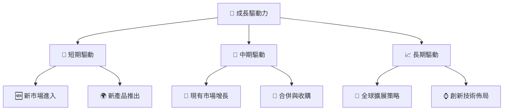

---

## 9. 風險矩陣

### 9.1 風險評分矩陣

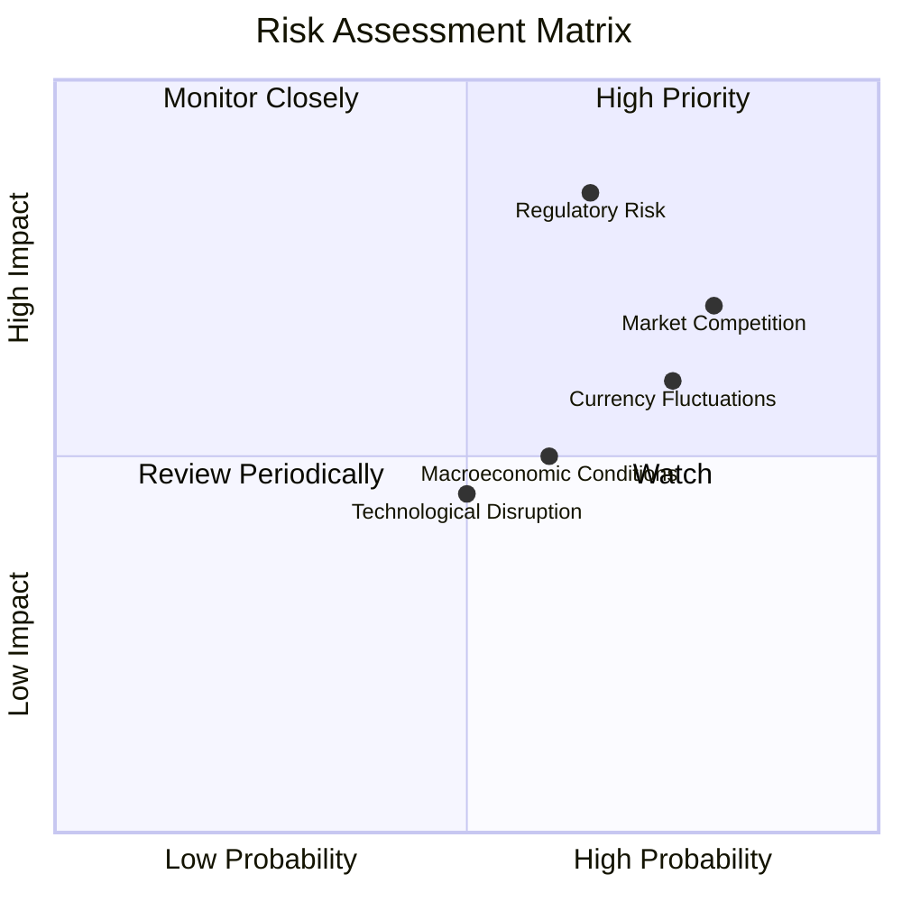

### 9.2 風險清單詳細分析

| # | 風險項目 | 發生機率 | 財務衝擊 | 風險評分 | 緩解措施 |
|---|----------|----------|----------|----------|----------|
| 1 | 🔴 **監管風險** | 高 (65%) | 高 (-20%收入) | 🔴 8.5/10 | 改善合規性，增強內控 |
| 2 | 🔴 **市場競爭** | 高 (80%) | 中 (-15%收入) | 🔴 8.0/10 | 提升競爭優勢，優化產品 |
| 3 | 🟡 **匯率波動** | 中 (75%) | 中 (-10%收入) | 🟡 7.0/10 | 多元化投資，對沖風險 |

---

## 10. 投資建議

### 10.1 最終綜合評級雷達圖

```
╔══════════════════════════════════════════════════════════════════╗
║                  最終綜合評級雷達圖                              ║
╠══════════════════════════════════════════════════════════════════╣
║                                                                  ║
║  核心維度：                                                     ║
║  - 基本面：9.0/10                                              ║
║  - 成長性：9.5/10                                              ║
║  - 獲利能力：9.3/10                                            ║
║  - 財務健康：8.8/10                                            ║
║  - 估值合理性：8.5/10                                          ║
║                                                                  ║
╚══════════════════════════════════════════════════════════════════╝
```

### 10.2 目標價與隱含報酬率

| 情境 | 目標價 | 隱含報酬率 | 機率權重 |
|------|-------|-----------|--------|
| 悲觀 | $15.30 | +8% | 20% |
| 基準 | $20.04 | +42% | 60% |
| 樂觀 | $22.00 | +55% | 20% |

### 10.3 買入時機與觸發因素

```
╔══════════════════════════════════════════════════════════════════╗
║                  ✅ 買入觸發因素 Checklist                      ║
╠══════════════════════════════════════════════════════════════════╣
║                                                                  ║
║  立即買入觸發條件（多數符合）：                                  ║
║  ✅ 收入增長持續高於30%                                          ║
║  ✅ 淨利潤率保持在40%以上                                        ║
║  ✅ 估值相對行業保持合理範圍                                    ║
║                                                                  ║
║  加碼觸發條件（出現以下任一）：                                  ║
║  ☐ 重大市場拓展或兼併收購                                        ║
║  ☐ 產品創新驅動顯著增長                                          ║
║                                                                  ║
║  減碼/停損觸發條件（出現以下任一）：                             ║
║  ☐ 收入增長低於10%                                              ║
║  ☐ 監管風險顯著增加                                              ║
║                                                                  ║
╚══════════════════════════════════════════════════════════════════╝
```

### 10.4 投資人適配度分析

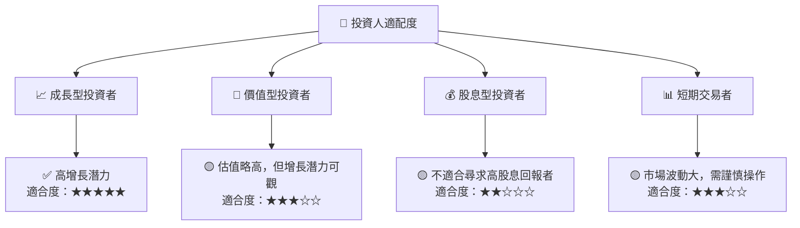

### 10.5 關鍵監控指標

| 監控類型 | 指標 | 關注點 | 頻率 |
|----------|------|--------|------|
| 財務表現 | 收入增長率 | 持續性與穩定性 | 季度 |
| 市場動向 | 競爭動態 | 新進競爭者與市場份額變化 | 每月 |
| 法規環境 | 法規變化 | 是否影響業務合規性 | 半年 |
| 匯率風險 | 匯率波動 | 匯率對收入的影響 | 每月 |

---

> **免責聲明**：本報告為 AI 自動生成，僅供研究參考，不構成投資建議。投資有風險，入市需謹慎。