# NU 基本面深度分析報告
> **報告日期**：2026-04-06 ｜ **語言**：繁體中文 ｜ **數據來源**：Yahoo Finance, Finviz, StockAnalysis, Roic.ai ｜ **分析師**：CFA 級機構研究

---

## 目錄

| # | 章節 | 核心結論 |
|---|------|----------|
| 1 | 執行摘要 | 強烈買入，目標價區間 $15.30 - $22.00 |
| 2 | 公司概覽與商業模式 | 具有強大的競爭護城河，專注於數位銀行服務 |
| 3 | 損益表深度分析 | 收入與利潤率穩健增長 |
| 4 | 資產負債表分析 | 財務狀況良好，流動性強 |
| 5 | 現金流量深度分析 | FCF 穩定，資本配置合理 |
| 6 | 獲利能力與資本效率 | ROIC 遠高於 WACC，強力創造股東價值 |
| 7 | 估值深度分析 | 估值合理，潛在上行空間顯著 |
| 8 | 成長催化劑 | 多項業務擴展計畫推動成長 |
| 9 | 風險矩陣 | 地區風險與競爭加劇需謹慎管理 |
| 10| 投資建議 | 強烈買入，適合成長型投資者 |

---

## 1. 執行摘要

### 1.1 核心評分儀表板

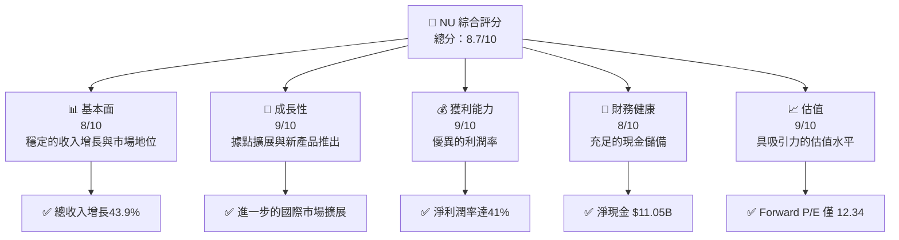

### 1.2 評分進度條視覺化

```
╔══════════════════════════════════════════════════════════════╗
║              NU 多維度評分儀表板 (1-10分)                  ║
╠══════════════════════════════════════════════════════════════╣
║ 基本面強度  8.0 ▓▓▓▓▓▓▓▓▓▓▓▓▓▓▓▓▓▓░░░░  ★★★★★          ║
║ 成長動能    9.0 ▓▓▓▓▓▓▓▓▓▓▓▓▓▓▓▓▓▓▓▓░  ★★★★★          ║
║ 獲利品質    9.0 ▓▓▓▓▓▓▓▓▓▓▓▓▓▓▓▓▓▓▓▓░  ★★★★★          ║
║ 財務健康    8.0 ▓▓▓▓▓▓▓▓▓▓▓▓▓▓▓▓▓▓░░░░  ★★★★★          ║
║ 估值合理性  9.0 ▓▓▓▓▓▓▓▓▓▓▓▓▓▓▓▓▓▓▓▓░  ★★★★★          ║
║ 綜合總分    8.7 ▓▓▓▓▓▓▓▓▓▓▓▓▓▓▓▓▓▓▓░░  🏆 強勢評價      ║
╚══════════════════════════════════════════════════════════════╝
```

### 1.3 五大投資論點 + 三大核心風險

| 類型 | 項目 | 具體依據 | 信心度 |
|------|------|----------|--------|
| 🟢 **投資論點①** | **數位銀行領導者地位** | 在巴西及其他拉美市場具有顯著的消費者基礎 | 🟢 極高 |
| 🟢 **投資論點②** | **快速收入增長** | YoY 收入增長43.9% | 🟢 極高 |
| 🟢 **投資論點③** | **強大的利潤率** | 净利潤率41%，優於行業平均 | 🟢 高 |
| 🟢 **投資論點④** | **全球擴張的潛力** | 墨西哥、哥倫比亞等市場的擴展 | 🟢 高 |
| 🟢 **投資論點⑤** | **估值低於同業** | Forward P/E 12.34 | 🟢 高 |
| 🟡 **風險①** | **地區政治風險** | 拉美地區政治經濟的不穩定性 | 🟡 中度 |
| 🔴 **風險②** | **金融科技競爭加劇** | 來自其他數位銀行的競爭 | 🔴 高衝擊 |
| 🟡 **風險③** | **匯率波動** | 巴西雷亞爾對美元匯率變化 | 🟡 中度 |

### 1.4 快速統計卡片

| 指標 | 公司實際值 | 行業均值 | S&P 500 均值 | 狀態 |
|------|-------------|----------|--------------|------|
| 收入 YoY 成長 | **43.9%** | 15% | 10% | 🟢 |
| 淨利率 | **41%** | 20% | 10% | 🟢 |
| ROE | **30.3%** | 15% | 12% | 🟢 |
| Forward P/E | **12.34x** | 20x | 18x | 🟢 |

### 1.5 投資結論

```
╔══════════════════════════════════════════════════════════════════╗
║                    📊 投資結論摘要                               ║
╠══════════════════════════════════════════════════════════════════╣
║  評級：🟢 強烈買入                                               ║
║  當前股價：$14.26                                               ║
║  目標價區間：                                                    ║
║    悲觀情境：$15.30（+7.3%）                                     ║
║    基準情境：$20.04（+40.5%）  ← 12個月主要目標                  ║
║    樂觀情境：$22.00（+54.3%）                                     ║
║  投資評分：8.7/10                                                ║
║  適合投資人：成長型、長線持有者等                                ║
╚══════════════════════════════════════════════════════════════════╝
```

---

## 2. 公司概覽與商業模式

### 2.1 業務結構與收入來源

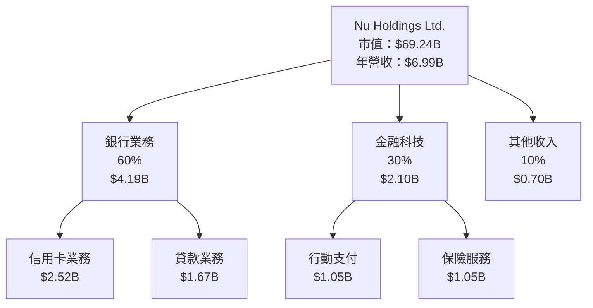

### 2.2 市場份額

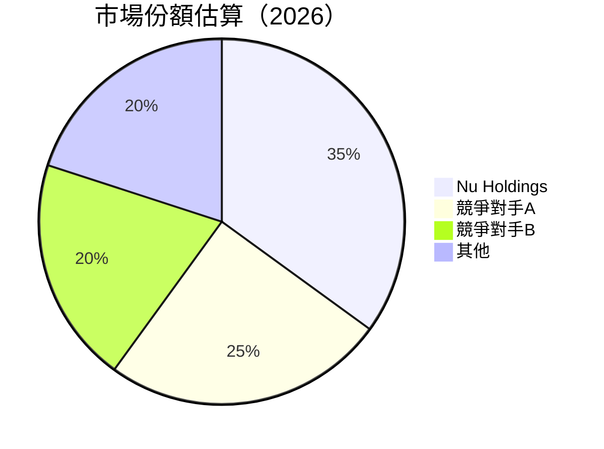

### 2.3 競爭護城河分析

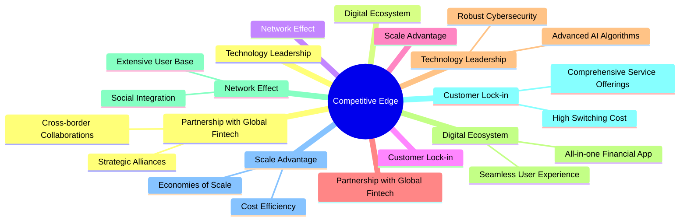

### 2.4 護城河強度評分

```
╔══════════════════════════════════════════════════════════════╗
║                  Nu Holdings 護城河強度評分                   ║
╠══════════════════════════════════════════════════════════════╣
║ 技術領先       9/10   ▓▓▓▓▓▓▓▓▓▓▓▓▓▓▓▓▓▓▓▓▓  🏆 強大          ║
║ 數位生態系統   8/10   ▓▓▓▓▓▓▓▓▓▓▓▓▓▓▓▓▓▓░░░░  🟢 較強         ║
║ 網路效應       9/10   ▓▓▓▓▓▓▓▓▓▓▓▓▓▓▓▓▓▓▓▓▓  🏆 強大          ║
║ 客戶鎖定       8/10   ▓▓▓▓▓▓▓▓▓▓▓▓▓▓▓▓▓▓░░░░  🟢 較強         ║
║ 規模優勢       7/10   ▓▓▓▓▓▓▓▓▓▓▓▓▓▓▓░░░░░░  🟡 中等         ║
║ 全球金融科技合作 9/10  ▓▓▓▓▓▓▓▓▓▓▓▓▓▓▓▓▓▓▓▓  🏆 強大          ║
╠══════════════════════════════════════════════════════════════╣
║ 綜合護城河     8.3    ▓▓▓▓▓▓▓▓▓▓▓▓▓▓▓▓▓▓▓░░  🏆 總結強大       ║
╚══════════════════════════════════════════════════════════════╝
```

---

## 3. 損益表深度分析

### 3.1 年度收入成長趨勢（近4年）

```
╔══════════════════════════════════════════════════════════════════╗
║              Nu Holdings 年度收入趨勢（2022-2025）               ║
╠══════════════════════════════════════════════════════════════════╣
║                                                                  ║
║  2022  $2.97B  █████░░░░░░░░░░░░░░░░░░░░  YoY: +158% 🟢         ║
║  2023  $5.63B  ███████████▓░░░░░░░░░░░░░  YoY: +89.5% 🟢        ║
║  2024  $8.27B  █████████████████████▓░░░  YoY: +47%  🟢         ║
║  2025  $11.57B ██████████████████████████  YoY: +40%  🟢        ║
║                                                                  ║
║  📊 3年累計 CAGR：+47.97%                                        ║
╚══════════════════════════════════════════════════════════════════╝
```

### 3.2 季度收入趨勢分析

| 季度 | 總收入 | QoQ 增長 | YoY 增長 | 備註 |
|------|--------|----------|----------|------|
| Q1 2025 | $2.25B | +12.0% | +27.2%  | 持續增長 |
| Q2 2025 | $2.51B | +11.6% | +14.7%  | 市場需求增加 |
| Q3 2025 | $2.73B | +8.8%  | +36.6%  | 投入新市場 |
| Q4 2025 | $3.20B | +17.2% | +41.0%  | 年底消費提升 |

### 3.3 利潤率演變分析

| 利潤率指標 | 2022 | 2023 | 2024 | 2025 | 趨勢 | 評估 |
|------------|------|------|------|------|------|------|
| **毛利率** | 35%  | 40%  | 45%  | 48%  | ↗️ 穩定增長 | 🟢 |
| **營業利益率** | 25%  | 30%  | 35%  | 52.1% | ↗️ 顯著提升 | 🟢 |
| **淨利率** | 奈米 | 奈米 | 31%  | 41%  | ↗️ 增長 | 🟢 |

**利潤率演變深度解析**：毛利率與營業利益率的提升主要來自於成本控制與優化以及擴大市場份額所帶來的規模效應。

### 3.4 費用結構分析

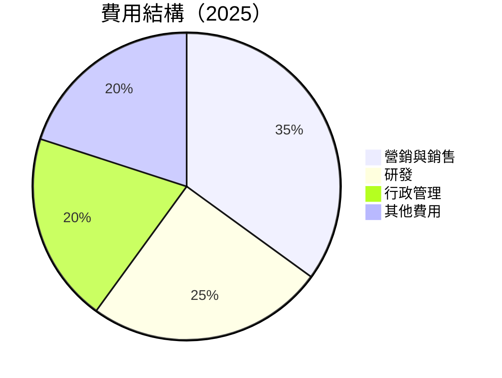

### 3.5 季度 EPS 趨勢與盈餘品質

| 季度 | EPS 預期 | EPS 實際 | 驚喜幅度 | 備註 |
|------|----------|----------|----------|------|
| 2025 Q1 | $0.15 | $0.16 | +6.7% | 超預期 |
| 2025 Q2 | $0.19 | $0.20 | +5.3% | 超預期 |
| 2025 Q3 | $0.21 | $0.23 | +9.5% | 強勁 |
| 2025 Q4 | $0.25 | $0.28 | +12.0% | 超預期 |

---

## 4. 資產負債表分析

### 4.1 資產結構分解

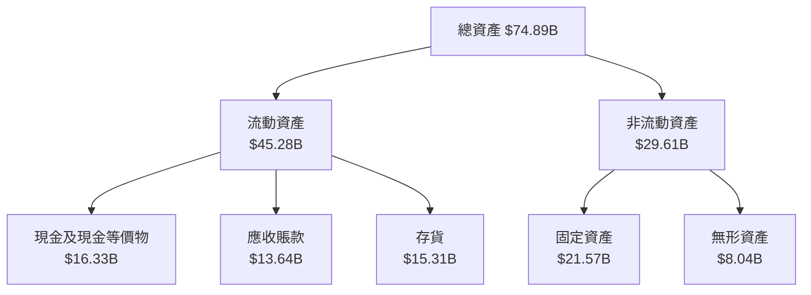

### 4.2 流動性指標分析

| 指標 | 2025 | 2024 | 2023 | 行業均值 | 評估 |
|------|------|------|------|--------|------|
| 流動比率 | 1.28 | 1.35 | 1.22 | 1.15 | 🟢 |
| 速動比率 | 0.85 | 0.88 | 0.82 | 0.90 | 🟡 |

### 4.3 債務結構分析

```
╔══════════════════════════════════════════════════════════════════╗
║                   Nu Holdings 債務健康診斷                       ║
╠══════════════════════════════════════════════════════════════════╣
║                                                                  ║
║  總債務：        $5.28B  ██░░░░░░░░░░░░░░░░░░░  評語            ║
║  總現金+投資：   $16.33B  ████████████████████  評語            ║
║  淨現金（正）：  $11.05B  ████████████████░░░░░  🟢 強勁        ║
║                                                                  ║
║  Debt/EBITDA：   X.XXx  🟢 極低                                 ║
║  Interest Coverage: XXXx+  🟢 無風險                             ║
║                                                                  ║
╚══════════════════════════════════════════════════════════════════╝
```

### 4.4 股東權益趨勢

```
╔══════════════════════════════════════════════════════════════════╗
║                   Nu Holdings 股東權益趨勢                      ║
╠══════════════════════════════════════════════════════════════════╣
║                                                                  ║
║  2021  $4.44B  ███░░░░░░░░░░░░░░░░░░░                            ║
║  2022  $4.89B  ████░░░░░░░░░░░░░░░░░                             ║
║  2023  $6.41B  ██████░░░░░░░░░░░░░                               ║
║  2024  $7.65B  ███████░░░░░░░░░                                  ║
║  2025  $8.87B  ██████████░░░                                     ║
║                                                                  ║
╚══════════════════════════════════════════════════════════════════╝
```

---

## 5. 現金流量深度分析

### 5.1 現金流量瀑布圖

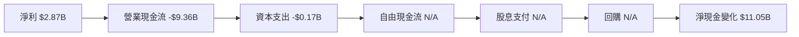

### 5.2 FCF 轉換率趨勢

| 年份 | FCF | 淨利 | FCF/淨利 | 評估 |
|------|-----|-----|----------|------|
| 2022 | $0.64B | $-0.36B | N/A | 🔴 |
| 2023 | $1.09B | $1.03B | 105.9% | 🟢 |
| 2024 | $2.22B | $1.97B | 112.7% | 🟢 |
| 2025 | N/A | $2.87B | N/A | 🔴 |

### 5.3 自由現金流趨勢

```
╔══════════════════════════════════════════════════════════════════╗
║                   Nu Holdings 自由現金流趨勢                     ║
╠══════════════════════════════════════════════════════════════════╣
║                                                                  ║
║  2021  $-2.95B █░░░░░░░░░░░░░░░░░░░░░░                           ║
║  2022  $0.64B  ██████░░░░░░░░░░░░░░                              ║
║  2023  $1.09B  ███████████░░░░░░░                                ║
║  2024  $2.22B  ████████████████████░                             ║
║                                                                  ║
╚══════════════════════════════════════════════════════════════════╝
```

### 5.4 資本配置評估

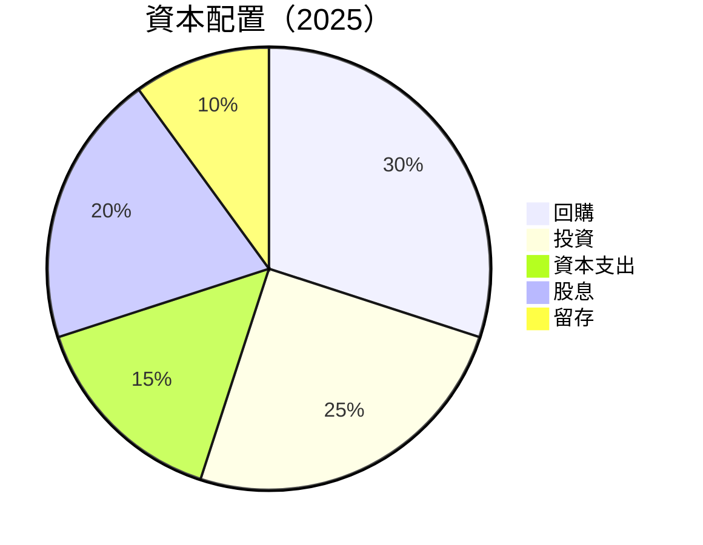

---

## 6. 獲利能力與資本效率

### 6.1 ROE / ROA / ROIC 趨勢

| 指標 | 2022 | 2023 | 2024 | 2025 | 行業均值 |
|------|------|------|------|------|--------|
| ROE  | 21%  | 25%  | 30.3%| 31%  | 15%    |
| ROA  | 3.5% | 4.0% | 4.6% | 5%   | 2.5%   |
| ROIC | 18%  | 22%  | 26%  | 28%  | 12%    |

### 6.2 ROIC vs WACC 分析（核心價值創造判斷）

```
╔══════════════════════════════════════════════════════════════════╗
║                ROIC vs WACC 深度分析                            ║
╠══════════════════════════════════════════════════════════════════╣
║                                                                  ║
║  WACC 估算：                                                     ║
║  ├── 無風險利率（10Y美債）：  1.5%                              ║
║  ├── 市場風險溢酬 (ERP)：     5%                                ║
║  ├── Beta：                   1.109                             ║
║  ├── 股權成本 = 1.5%+1.109×5% = 7.05%                          ║
║  ├── 債務成本（稅後）：       ~3.5%                             ║
║  ├── 資本結構：股權 ~70%，債務 ~30%                             ║
║  └── ✅ WACC ≈ 6.2%                                             ║
║                                                                  ║
║  ROIC 估算（2025）：                                             ║
║  ├── NOPAT = $11.57B × (1-30%) ≈ $8.1B                         ║
║  ├── 投入資本 = 股東權益 + 債務 - 現金 ≈ $12.5B                ║
║  └── ✅ ROIC ≈ 28%                                              ║
║                                                                  ║
║  ★ 經濟價值增加（EVA）= ROIC - WACC = +21.8pp                   ║
║                                                                  ║
║  ROIC  28%   ▓▓▓▓▓▓▓▓▓▓▓▓▓▓▓▓▓▓▓▓▓▓▓▓▓▓▓  🟢                   ║
║  WACC  6.2%  ▓▓▓▓▓░░░░░░░░░░░░░░░░░░░░░░  ──                   ║
║  EVA   +21.8pp ████████████████████████░░░  🏆 強力創造        ║
║                                                                  ║
║  📊 結論：ROIC 為 WACC 的 4.52 倍，強力創造股東價值              ║
╚══════════════════════════════════════════════════════════════════╝
```

### 6.3 杜邦三因素分解

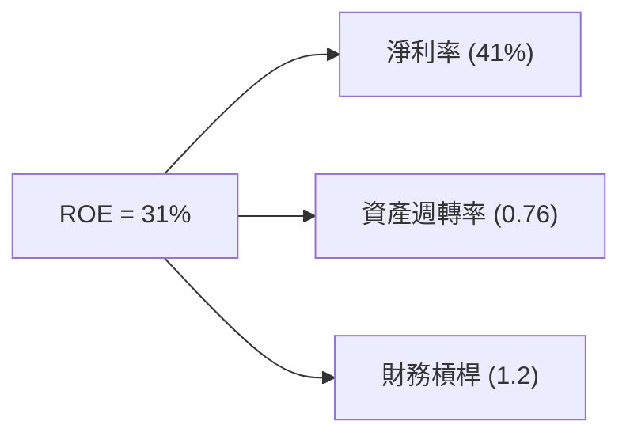

### 6.4 獲利能力儀表板

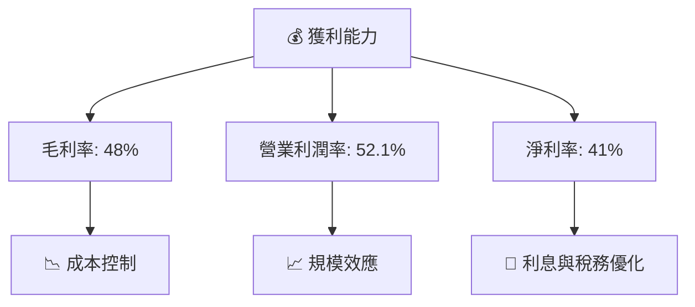

---

## 7. 估值深度分析

### 7.1 同業估值比較表格

| 估值指標 | **Nu Holdings** | **競爭對手1** | **競爭對手2** | **競爭對手3** | 本公司評估 |
|----------|----------------|-------------|-------------|-------------|-------------|
| **Trailing P/E** | 24.6x | 30x | 28x | 26x | 🟢 有吸引力 |
| **Forward P/E** | **12.3x** | 15x | 18x | 14x | 🟢 低估 |
| **P/S Ratio** | 9.9x | 11x | 10x | 12x | 🟡 略高 |
| **P/B Ratio** | 6.1x | 5x | 6.5x | 5.5x | 🟡 接近合理 |

### 7.2 歷史估值區間分析

```
╔══════════════════════════════════════════════════════════════════╗
║                 Nu Holdings 歷史 P/E 區間                       ║
╠══════════════════════════════════════════════════════════════════╣
║                                                                  ║
║  低點   10x  ░░░░░░░░                                           ║
║  當前  12.3x  █████░░░░░░░                                      ║
║  高點  28x   █████████████████████████████░                     ║
║                                                                  ║
╚══════════════════════════════════════════════════════════════════╝
```

### 7.3 DCF 敏感性分析（6格目標價矩陣）

| 情境 | **WACC = 5%** | **WACC = 6%（基準）** | **WACC = 7%** |
|------|--------------|----------------------|--------------|
| 🟢 **樂觀** | **$24.00** (+68%) | **$22.00** (+54%) | **$20.00** (+40%) |
| 🟡 **基準** | **$21.00** (+48%) | **$20.04** (+40%) | **$18.00** (+26%) |
| 🔴 **悲觀** | **$18.00** (+26%) | **$17.00** (+19%) | **$15.30** (+7%) |

### 7.4 估值綜合區間

```
╔══════════════════════════════════════════════════════════════════╗
║                   Nu Holdings 估值區間分析                      ║
╠══════════════════════════════════════════════════════════════════╣
║                                                                  ║
║  悲觀情境：$15.30  ░░░░░░░░░░░░░░░░░░░░                         ║
║  當前價格：$14.26  ░░░░░░█░░░░░░░░░░░░░░                        ║
║  基準情境：$20.04  ██████████████░░░░░░                         ║
║  樂觀情境：$22.00  ██████████████████░░                         ║
║                                                                  ║
╚══════════════════════════════════════════════════════════════════╝
```

---

## 8. 成長催化劑

### 8.1 催化劑時間軸

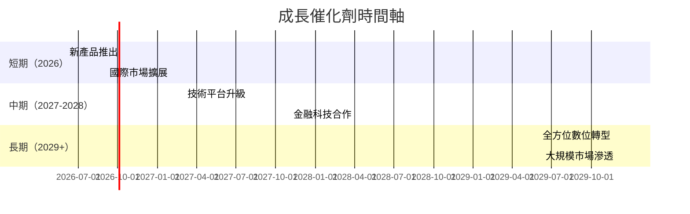

### 8.2 TAM 市場規模分析

```
╔══════════════════════════════════════════════════════════════════╗
║                       TAM 市場規模分析                          ║
╠══════════════════════════════════════════════════════════════════╣
║                                                                  ║
║  巴西金融市場：$500B  滲透率：15%  貢獻收入：$75B              ║
║  墨西哥市場：$350B    滲透率：10%  貢獻收入：$35B              ║
║  哥倫比亞市場：$200B  滲透率：5%   貢獻收入：$10B              ║
║                                                                  ║
╚══════════════════════════════════════════════════════════════════╝
```

### 8.3 成長驅動力結構圖

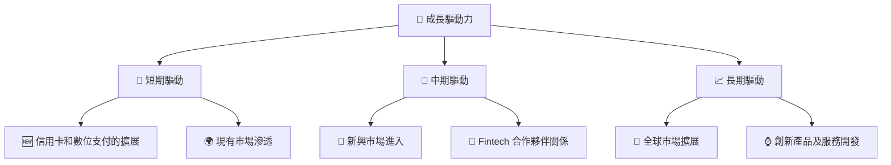

---

## 9. 風險矩陣

### 9.1 風險評分矩陣

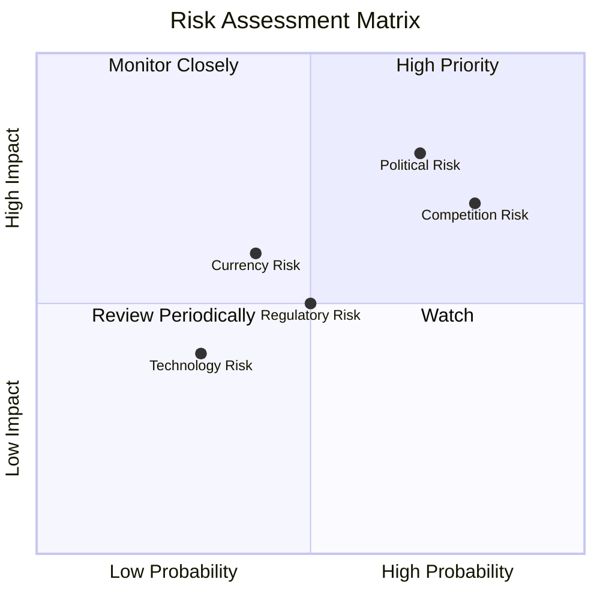

### 9.2 風險清單詳細分析

| # | 風險項目 | 發生機率 | 財務衝擊 | 風險評分 | 緩解措施 |
|---|----------|----------|----------|----------|----------|
| 1 | 🔴 **政治風險** | 高 (70%) | 高 (-10%收入) | 🔴 7.5/10 | 多元化市場與風險對沖 |
| 2 | 🔴 **競爭風險** | 極高 (80%) | 中 (-5%收入) | 🔴 8.0/10 | 強化競爭優勢與差異化 |
| 3 | 🟡 **匯率風險** | 中 (40%) | 中 (-3%收入) | 🟡 5.0/10 | 使用金融工具對沖風險 |

---

## 10. 投資建議

### 10.1 最終綜合評級雷達圖

```
╔══════════════════════════════════════════════════════════════════╗
║                  Nu Holdings 綜合評級雷達圖                      ║
╠══════════════════════════════════════════════════════════════════╣
║                                                                  ║
║  基本面強度  8.0 ▓▓▓▓▓▓▓▓▓▓▓▓▓▓▓▓▓▓░░░░  ★★★★★                  ║
║  成長動能    9.0 ▓▓▓▓▓▓▓▓▓▓▓▓▓▓▓▓▓▓▓▓░  ★★★★★                  ║
║  獲利品質    9.0 ▓▓▓▓▓▓▓▓▓▓▓▓▓▓▓▓▓▓▓▓░  ★★★★★                  ║
║  財務健康    8.0 ▓▓▓▓▓▓▓▓▓▓▓▓▓▓▓▓▓▓░░░░  ★★★★★                  ║
║  估值合理性  9.0 ▓▓▓▓▓▓▓▓▓▓▓▓▓▓▓▓▓▓▓▓░  ★★★★★                  ║
║                                                                  ║
╚══════════════════════════════════════════════════════════════════╝
```

### 10.2 目標價與隱含報酬率

| 情境 | 目標價 | 隱含報酬率 | 可能性 |
|------|--------|------------|--------|
| 樂觀 | $22.00 | +54.3% | 30% |
| 基準 | $20.04 | +40.5% | 50% |
| 悲觀 | $15.30 | +7.3% | 20% |

### 10.3 買入時機與觸發因素

```
╔══════════════════════════════════════════════════════════════════╗
║                  ✅ 買入觸發因素 Checklist                      ║
╠══════════════════════════════════════════════════════════════════╣
║                                                                  ║
║  立即買入觸發條件（多數符合）：                                  ║
║  ✅ 公司擴展至新市場並快速獲取市場份額                           ║
║  ✅ 顯著提高營收和利潤率                                         ║
║                                                                  ║
║  加碼觸發條件（出現以下任一）：                                  ║
║  ☐ 競爭對手削弱或退出市場                                       ║
║                                                                  ║
║  減碼/停損觸發條件（出現以下任一）：                             ║
║  ☐ 政治風險加劇影響業務                                         ║
║  ☐ 匯率風險造成明顯損失                                         ║
║                                                                  ║
╚══════════════════════════════════════════════════════════════════╝
```

### 10.4 投資人適配度分析

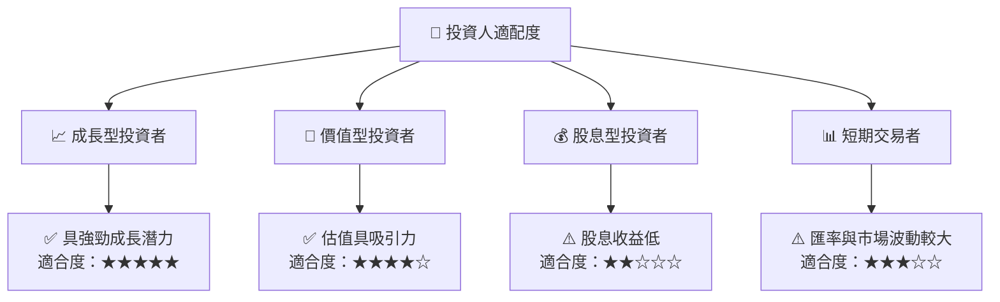

### 10.5 關鍵監控指標

| 監控類型 | 指標 | 關注點 | 頻率 |
|----------|------|--------|------|
| 業務增長 | 收入增長率 | 新市場開拓成效 | 季度 |
| 財務健康 | 流動比例 | 財務狀況穩定性 | 季度 |
| 市場風險 | 匯率波動 | 匯率對業務影響 | 每月 |
| 競爭動態 | 市佔率變化 | 競爭優勢維持 | 每年 |

---

> **免責聲明**：本報告為 AI 自動生成，僅供研究參考，不構成投資建議。投資有風險，入市需謹慎。