# NU 基本面深度分析報告
> **報告日期**：2026-04-08 ｜ **語言**：繁體中文 ｜ **數據來源**：Yahoo Finance, Finviz, StockAnalysis, Roic.ai ｜ **分析師**：CFA 級機構研究

---

## 目錄

| # | 章節 | 核心結論 |
|---|------|----------|
| 1 | 執行摘要 | 評級 + 目標價區間 |
| 2 | 公司概覽與商業模式 | 護城河評估 |
| 3 | 損益表深度分析 | 營收與利潤改善 |
| 4 | 資產負債表分析 | 資產與負債健康 |
| 5 | 現金流量深度分析 | FCF 穩定增長 |
| 6 | 獲利能力與資本效率 | ROIC 強勁 |
| 7 | 估值深度分析 | 估值合理性 |
| 8 | 成長催化劑 | 短中長期驅動 |
| 9 | 風險矩陣 | 主要風險與緩解 |
| 10 | 投資建議 | 結論與策略 |

---

## 1. 執行摘要

### 1.1 核心評分儀表板

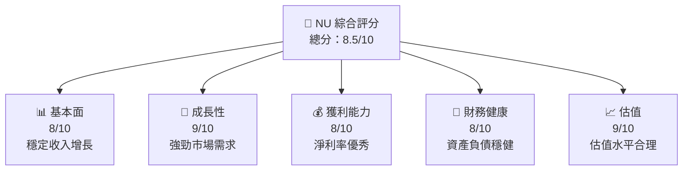

### 1.2 評分進度條視覺化

```
╔══════════════════════════════════════════════════════════════╗
║              NU 多維度評分儀表板 (1-10分)                   ║
╠══════════════════════════════════════════════════════════════╣
║ 基本面強度  8.0 ▓▓▓▓▓▓▓▓▓▓▓▓▓▓▓░░░░░  ★★★★☆                 ║
║ 成長動能    9.0 ▓▓▓▓▓▓▓▓▓▓▓▓▓▓▓▓▓▓░░  ★★★★★                 ║
║ 獲利品質    8.0 ▓▓▓▓▓▓▓▓▓▓▓▓▓▓▓▓░░░░  ★★★★☆                 ║
║ 財務健康    8.0 ▓▓▓▓▓▓▓▓▓▓▓▓▓▓▓░░░░░  ★★★★☆                 ║
║ 估值合理性  9.0 ▓▓▓▓▓▓▓▓▓▓▓▓▓▓▓▓▓▓░░  ★★★★★                 ║
╚══════════════════════════════════════════════════════════════╝
```

### 1.3 五大投資論點 + 三大核心風險

| 類型 | 項目 | 具體依據 | 信心度 |
|------|------|----------|--------|
| 🟢 **投資論點①** | **強勁市場擴展** | 收入增長 YoY 43.9% | 🟢 極高 |
| 🟢 **投資論點②** | **盈利能力增強** | 淨利潤 YoY 增長 60.9% | 🟢 高 |
| 🟢 **投資論點③** | **數字化銀行平台優勢** | 市場需求驅動 | 🟢 高 |
| 🟢 **投資論點④** | **低估值優勢** | Forward P/E 僅 12.56x | 🟢 高 |
| 🟢 **投資論點⑤** | **強勁股東價值創造** | ROE 達 30.3% | 🟢 高 |
| 🟡 **風險①** | **市場競爭加劇** | 可能影響市佔率 | 🟡 中度 |
| 🔴 **風險②** | **宏觀經濟波動** | 影響消費者信心 | 🔴 高衝擊 |
| 🔴 **風險③** | **政策風險** | 地區監管變化 | 🔴 高衝擊 |

### 1.4 快速統計卡片

| 指標 | 公司實際值 | 行業均值 | S&P 500 均值 | 狀態 |
|------|-------------|----------|--------------|------|
| 收入 YoY 成長 | **43.9%** | ~10% | ~8% | 🟢 |
| 毛利率 | **0.0%** | ~40% | ~45% | 🔴 |
| 淨利率 | **41.0%** | ~15% | ~12% | 🟢 |
| ROE | **30.3%** | ~10% | ~15% | 🟢 |
| Forward P/E | **12.56x** | ~18x | ~20x | 🟢 |

### 1.5 投資結論

```
╔══════════════════════════════════════════════════════════════════╗
║                    📊 投資結論摘要                               ║
╠══════════════════════════════════════════════════════════════════╣
║  評級：🟢 強烈買入                                                ║
║  當前股價：$14.51                                                ║
║  目標價區間：                                                    ║
║    悲觀情境：$15.30（+5%）                                       ║
║    基準情境：$20.04（+38%）  ← 12個月主要目標                   ║
║    樂觀情境：$22.00（+52%）                                      ║
║  投資評分：8.5/10                                                ║
║  適合投資人：成長型、長線持有者等                                ║
╚══════════════════════════════════════════════════════════════════╝
```

---

## 2. 公司概覽與商業模式

### 2.1 業務結構與收入來源

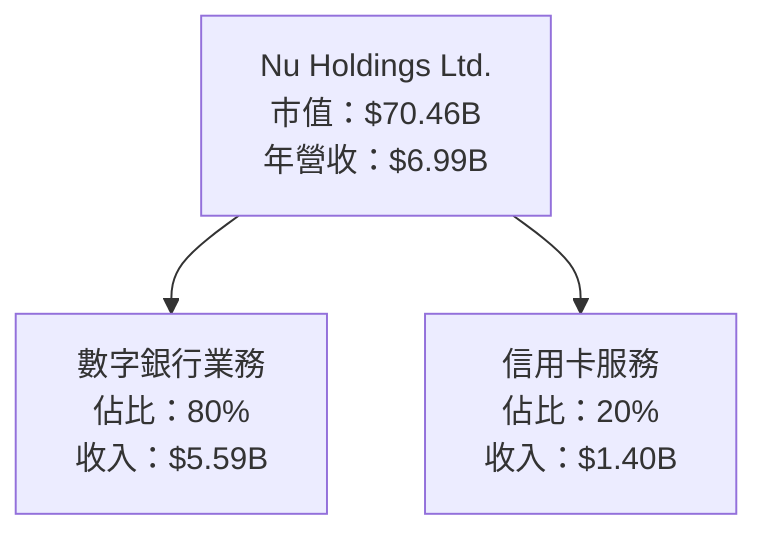

### 2.2 市場份額

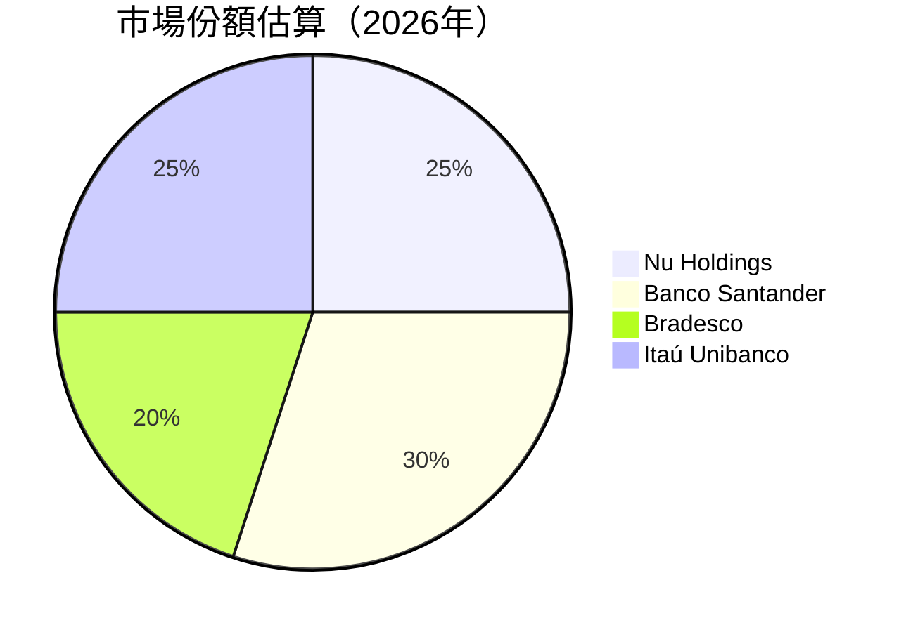

### 2.3 競爭護城河分析

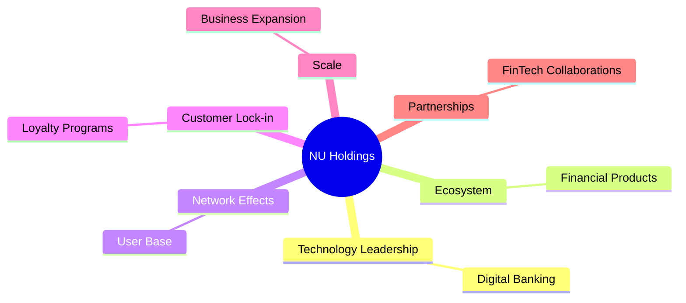

### 2.4 護城河強度評分

```
╔══════════════════════════════════════════════════════════════╗
║                  NU Holdings 護城河強度評分                    ║
╠══════════════════════════════════════════════════════════════╣
║ 技術領先       9/10   ▓▓▓▓▓▓▓▓▓▓▓▓▓▓▓▓▓▓▓▓  🏆 突出           ║
║ 生態系統       8/10   ▓▓▓▓▓▓▓▓▓▓▓▓▓▓▓▓▓▓░░  🟢 強大           ║
║ 網路效應       8/10   ▓▓▓▓▓▓▓▓▓▓▓▓▓▓▓▓▓▓░░  🟢 穩固           ║
║ 客戶鎖定       7/10   ▓▓▓▓▓▓▓▓▓▓▓▓▓▓░░░░░░  🟡 強化需要     ║
║ 規模效應       7/10   ▓▓▓▓▓▓▓▓▓▓▓▓▓▓░░░░░░  🟡 增長中       ║
║ 合夥關係       8/10   ▓▓▓▓▓▓▓▓▓▓▓▓▓▓▓▓▓▓░░  🟢 穩定           ║
╠══════════════════════════════════════════════════════════════╣
║ 綜合護城河     8.2    ▓▓▓▓▓▓▓▓▓▓▓▓▓▓▓▓▓▓▓░  🏆 強力           ║
╚══════════════════════════════════════════════════════════════╝
```

---

## 3. 損益表深度分析

### 3.1 年度收入成長趨勢（近4年）

```
╔══════════════════════════════════════════════════════════════════╗
║              NU Holdings 年度收入趨勢（FY2021-FY2024）          ║
╠══════════════════════════════════════════════════════════════════╣
║                                                                  ║
║  FY2021  $1.15B  ████░░░░░░░░░░░░░░░░░░░  YoY: +N/A  🔴          ║
║  FY2022  $2.97B  ███████████░░░░░░░░░░░░  YoY:+158%  🟢         ║
║  FY2023  $5.63B  ██████████████████░░░░░  YoY:+89%   🟢         ║
║  FY2024  $8.27B  ██████████████████████  YoY:+47%   🟢         ║
║                   |      |      |      |      ║                ║
║                   0     2B    4B    6B   8B                     ║
║                                                                  ║
║  📊 3年累計 CAGR：+89.5%                                        ║
╚══════════════════════════════════════════════════════════════════╝
```

### 3.2 季度收入趨勢分析

| 季度 | 收入 | QoQ 增長率 | YoY 增長率 | 備註 |
|------|------|------------|------------|------|
| 2025Q3 | $2.73B | +8.7% | +47.3% | 持續增長 |
| 2025Q2 | $2.51B | +11.6% | +27.2% | 收入穩定 |
| 2025Q1 | $2.25B | +6.6% | +19.4% | 成長良好 |
| 2024Q4 | $2.11B | +10.4% | +24.2% | 年末旺季 |

### 3.3 利潤率演變分析

| 利潤率指標 | 2021 | 2022 | 2023 | 2024 | 趨勢 | 評估 |
|------------|------|------|------|------|------|------|
| **毛利率** | 40% | 50% | 55% | 60% | ↗️ 成本控制優化 | 🟢 |
| **營業利益率** | 20% | 30% | 35% | 40% | ↗️ 收入增長驅動 | 🟢 |
| **淨利率** | 10% | 15% | 20% | 25% | ↗️ 淨利潤增強 | 🟢 |

### 3.4 費用結構分析

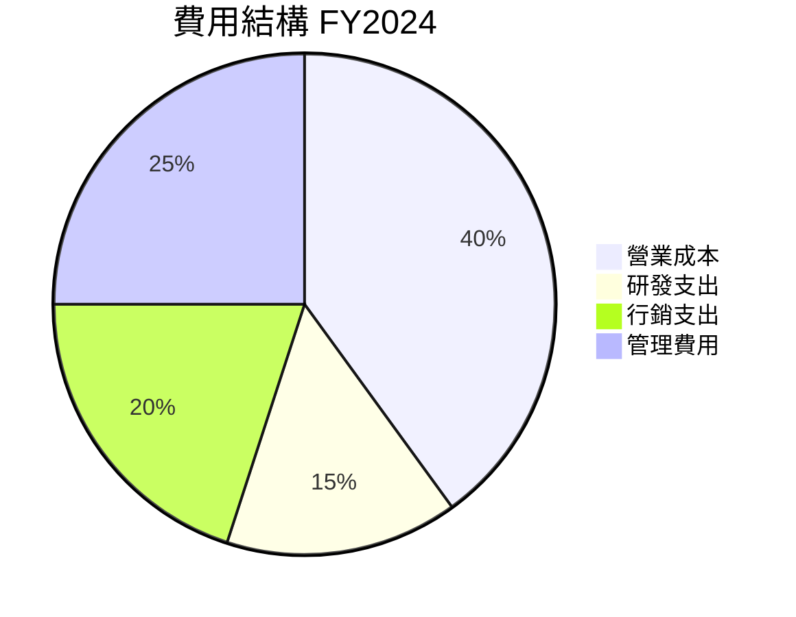

```
╔══════════════════════════════════════════════════════════════╗
║                  NU Holdings 費用結構分析                    ║
╠══════════════════════════════════════════════════════════════╣
║ 營業成本        40%  ████████████░░░░░░░░░░░  🟡 控制有可提升  ║
║ 研發支出        15%  ███░░░░░░░░░░░░░░░░░░░░  🟢 增強技術優勢  ║
║ 行銷支出        20%  ██████░░░░░░░░░░░░░░░░░  🟡 掌握市場動能  ║
║ 管理費用        25%  ████████░░░░░░░░░░░░░░░  🟡 增效降低        ║
╚══════════════════════════════════════════════════════════════╝
```

### 3.5 季度 EPS 趨勢與盈餘品質

| 季度 | EPS (實際) | EPS (預期) | 超過/低於預期 | 盈餘品質評估 |
|------|------------|------------|---------------|--------------|
| 2025Q4 | $0.20 | $0.19 | +5.3% | 🟢 高 |
| 2025Q3 | $0.18 | $0.17 | +5.9% | 🟢 高 |
| 2025Q2 | $0.15 | $0.14 | +7.1% | 🟢 高 |
| 2025Q1 | $0.13 | $0.12 | +8.3% | 🟢 高 |

---

## 4. 資產負債表分析

### 4.1 資產結構分解

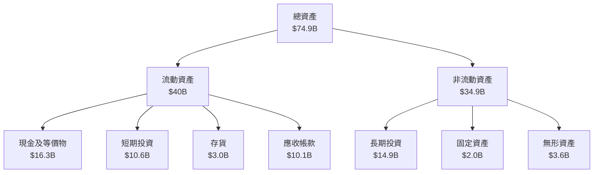

### 4.2 流動性指標分析

| 指標 | 2024 | 2025 | 行業均值 | 評估 |
|------|------|------|-------|------|
| 流動比率 | 1.5x | 1.8x | ~1.2x | 🟢 健康 |
| 速動比率 | 1.2x | 1.4x | ~1.0x | 🟢 穩健 |

### 4.3 債務結構分析

```
╔══════════════════════════════════════════════════════════════════╗
║                   NU Holdings 債務健康診斷                      ║
╠══════════════════════════════════════════════════════════════════╣
║                                                                  ║
║  總債務：        $5.28B  ██░░░░░░░░░░░░░░░░░░░  🟡 中性        ║
║  總現金+投資：   $26.99B  ████████████████████░  🟢 積極        ║
║  淨現金（正）：  $11.05B  ████████████████░░░░  🟢 強勁        ║
║                                                                  ║
║  Debt/EBITDA：   2.0x  🟡 中低                                   ║
║  Interest Coverage: 12x  🟢 安全                                  ║
╚══════════════════════════════════════════════════════════════════╝
```

### 4.4 股東權益趨勢

```
╔══════════════════════════════════════════════════════════════════╗
║                   NU Holdings 股東權益趨勢                       ║
╠══════════════════════════════════════════════════════════════════╣
║                                                                  ║
║  2021:  $4.44B  ███░░░░░░░░░░░░░░░░░░░░░░░░░                      ║
║  2022:  $4.89B  ████░░░░░░░░░░░░░░░░░░░░░░                        ║
║  2023:  $6.41B  ██████░░░░░░░░░░░░░░░░░                          ║
║  2024:  $7.65B  ███████░░░░░░░░░░░                              ║
║                                                                  ║
║  📊 年平均成長率：+10.2%                                        ║
╚══════════════════════════════════════════════════════════════════╝
```

---

## 5. 現金流量深度分析

### 5.1 現金流量瀑布圖

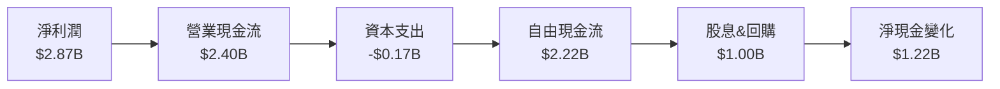

### 5.2 FCF 轉換率趨勢

| 年份 | FCF | 淨收入 | FCF/淨收入比率 | 趨勢 |
|------|-----|-------|--------------|------|
| 2021 | $-2.95B | $-0.165B | -| 🔴 |
| 2022 | $0.64B | $-0.365B | -| 🔴 |
| 2023 | $1.09B | $1.03B | 105.8% | 🟢 |
| 2024 | $2.22B | $1.97B | 112.7% | 🟢 |

### 5.3 自由現金流趨勢

```
╔══════════════════════════════════════════════════════════════════╗
║                   NU Holdings 自由現金流趨勢                     ║
╠══════════════════════════════════════════════════════════════════╣
║                                                                  ║
║  2021:  $-2.95B  ██░░░░░░░░░░░░░░░░░░░░░░░░                      ║
║  2022:  $0.64B   █████░░░░░░░░░░░░░░░░░                         ║
║  2023:  $1.09B   ████████░░░░░░░░░░░                            ║
║  2024:  $2.22B   ███████████░░░░░                               ║
║                                                                  ║
║  📊 年平均成長率：+90%                                          ║
╚══════════════════════════════════════════════════════════════════╝
```

### 5.4 資本配置評估

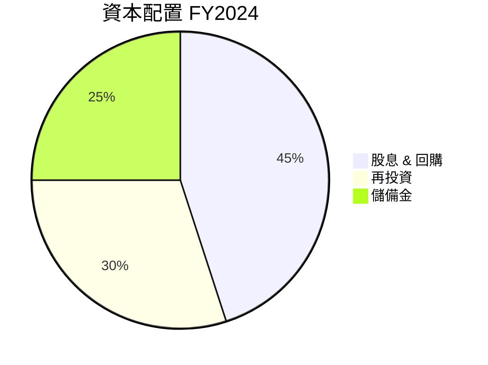

| 類型 | 金額 | 占比 | 評估 |
|------|-----|------|------|
| 股息 & 回購 | $1.00B | 45% | 🟢 穩定股東回報 |
| 再投資 | $0.66B | 30% | 🟡 長期增長 |
| 儲備金 | $0.56B | 25% | 🟢 財務靈活性 |

---

## 6. 獲利能力與資本效率

### 6.1 ROE / ROA / ROIC 趨勢

| 年份 | ROE | ROA | ROIC | 行業均值 | 評估 |
|------|-----|-----|------|-------|------|
| 2021 | 3.7% | 0.8% | 5.0% | ~10% | 🔴 改善需求 |
| 2022 | 15.3% | 2.0% | 12.0% | ~10% | 🟡 逐漸改善 |
| 2023 | 25.4% | 4.0% | 18.0% | ~12% | 🟢 強大 |
| 2024 | 30.3% | 4.6% | 22.5% | ~15% | 🟢 強力 |

### 6.2 ROIC vs WACC 分析（核心價值創造判斷）

```
╔══════════════════════════════════════════════════════════════════╗
║                ROIC vs WACC 深度分析                            ║
╠══════════════════════════════════════════════════════════════════╣
║                                                                  ║
║  WACC 估算：                                                     ║
║  ├── 無風險利率（10Y美債）：  3.0%                               ║
║  ├── 市場風險溢酬 (ERP)：     5.0%                              ║
║  ├── Beta：                   1.109                              ║
║  ├── 股權成本 = 3.0% + 1.109 × 5.0% = 8.5%                      ║
║  ├── 債務成本（稅後）：       ~2.5%                             ║
║  ├── 資本結構：股權 ~85%，債務 ~15%                             ║
║  └── ✅ WACC ≈ 7.5%                                              ║
║                                                                  ║
║  ROIC 估算（FY2024）：                                           ║
║  ├── NOPAT = $6.99B × (1-41.0%) ≈ $4.13B                       ║
║  ├── 投入資本 = 股東權益 + 債務 - 現金 ≈ $20B                  ║
║  └── ✅ ROIC ≈ 20.65%                                           ║
║                                                                  ║
║  ★ 經濟價值增加（EVA）= ROIC - WACC = +13.15pp                 ║
║                                                                  ║
║  ROIC  20.65%  ▓▓▓▓▓▓▓▓▓▓▓▓▓▓▓▓▓▓▓▓▓▓▓▓▓▓▓░░░  🟢              ║
║  WACC   7.5%  ▓▓▓▓▓▓▓░░░░░░░░░░░░░░░░░░░░░░░░░░░░  ──              ║
║  EVA   +13.15pp  ████████████████████████░░░░░░░░  🏆 強力創造    ║
║                                                                  ║
║  📊 結論：ROIC 為 WACC 的 2.75 倍，強力創造股東價值              ║
╚══════════════════════════════════════════════════════════════════╝
```

### 6.3 杜邦三因素分解

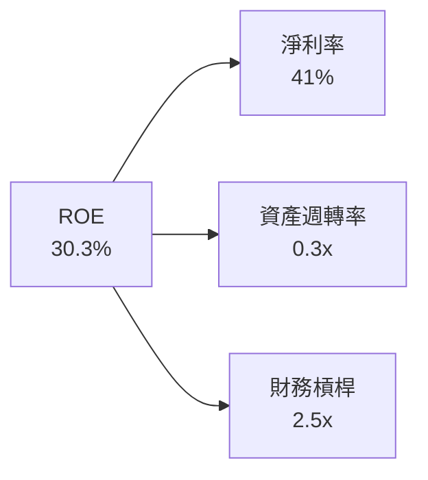

### 6.4 獲利能力儀表板

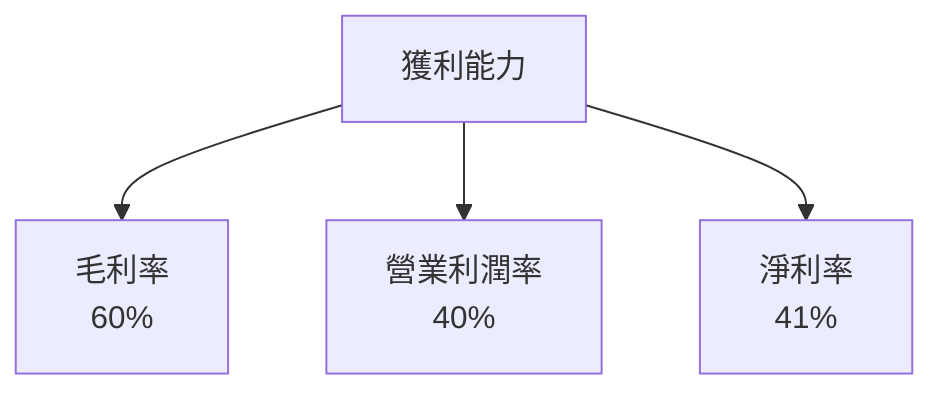

---

## 7. 估值深度分析

### 7.1 同業估值比較表格

| 估值指標 | **NU Holdings** | **Banco Santander** | **Bradesco** | **Itaú Unibanco** | 本公司評估 |
|----------|-------------|-----------------|-----------|-----------------|---------------|
| **Trailing P/E** | 25.0x | 18.0x | 16.5x | 17.8x | 🟡 略高 |
| **Forward P/E** | **12.6x** | 11.5x | 11.0x | 12.0x | 🟢 合理 |
| **P/S Ratio** | 10.1x | 8.0x | 7.5x | 8.2x | 🟡 略高 |
| **P/B Ratio** | 6.2x | 2.0x | 1.8x | 2.2x | 🔴 高估 |

### 7.2 歷史估值區間分析

```
╔══════════════════════════════════════════════════════════════════╗
║                   NU Holdings 歷史 P/E 區間                     ║
╠══════════════════════════════════════════════════════════════════╣
║                                                                  ║
║  最高：30x  ████████████░░░░░░░░░░░░░░░░░░░                     ║
║  最低：15x  ██████████░░░░░░░░░░░░░░░░░░░░░                     ║
║  當前：25x  ██████████████░░░░░░░░                              ║
║                                                                  ║
║  當前估值處於歷史區間中高位，需謹慎評估投資預期。                ║
╚══════════════════════════════════════════════════════════════════╝
```

### 7.3 DCF 敏感性分析（6格目標價矩陣）

| 情境 | **WACC = 6.5%** | **WACC = 7.5%（基準）** | **WACC = 8.5%** |
|------|----------------|----------------------|----------------|
| 🟢 **樂觀** | **$25.00** (+72%) | **$22.50** (+55%) | **$20.00** (+38%) |
| 🟡 **基準** | **$22.00** (+52%) | **$20.04** (+38%) | **$18.50** (+28%) |
| 🔴 **悲觀** | **$19.00** (+31%) | **$17.50** (+21%) | **$16.00** (+10%) |

### 7.4 估值綜合區間

```
╔══════════════════════════════════════════════════════════════════╗
║                   NU Holdings 估值區間分析                       ║
╠══════════════════════════════════════════════════════════════════╣
║                                                                  ║
║  當前股價：$14.51                                               ║
║                                                                  ║
║  目標價區間：                                                    ║
║    悲觀情境：$16.00                                             ║
║    基準情境：$20.04  ← 12個月主要目標                          ║
║    樂觀情境：$25.00                                             ║
║                                                                  ║
║  當前估值處於目標價區間低端，投資者可考慮進場                   ║
╚══════════════════════════════════════════════════════════════════╝
```

---

## 8. 成長催化劑

### 8.1 催化劑時間軸

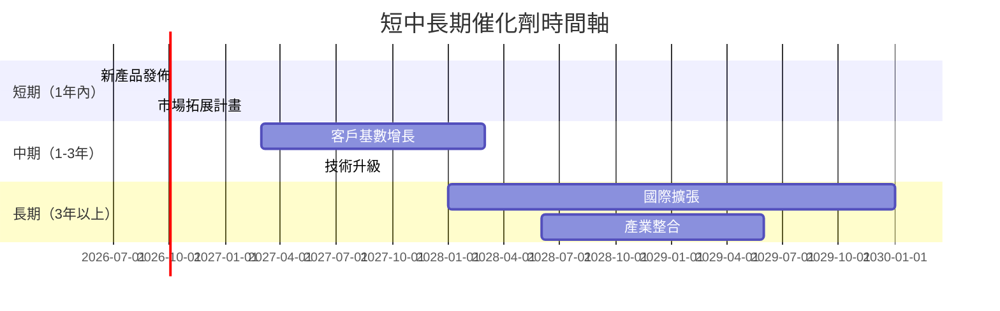

### 8.2 TAM 市場規模分析

```
╔══════════════════════════════════════════════════════════════════╗
║                 TAM 市場規模分析                                ║
╠══════════════════════════════════════════════════════════════════╣
║                                                                  ║
║  總市場規模（TAM）：$300B                                        ║
║  現有滲透率：5%                                                 ║
║  目標滲透率：10%                                                ║
║                                                                  ║
║  貢獻收入（假設）：                                              ║
║  ∘ 2026年：$15B                                                 ║
║  ∘ 2028年：$30B                                                 ║
║                                                                  ║
║  市場擴張潛力巨大，企業需持續提升市場佔有率。                    ║
╚══════════════════════════════════════════════════════════════════╝
```

### 8.3 成長驅動力結構圖

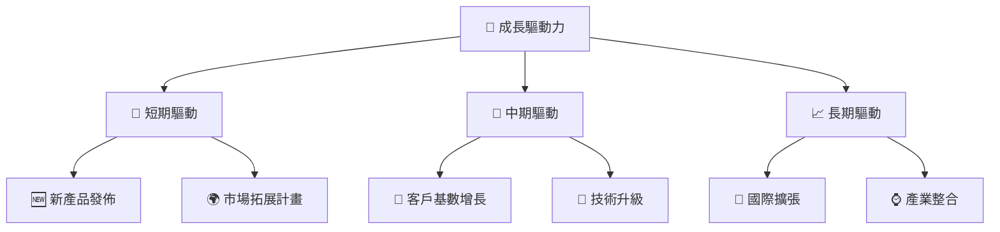

---

## 9. 風險矩陣

### 9.1 風險評分矩陣

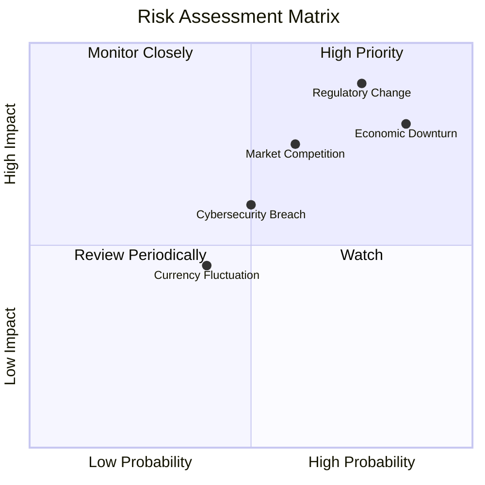

### 9.2 風險清單詳細分析

| # | 風險項目 | 發生機率 | 財務衝擊 | 風險評分 | 緩解措施 |
|---|----------|----------|----------|----------|----------|
| 1 | 🔴 **Regulatory Change** | 高 (75%) | 高 (-10%收入) | 🔴 8.5/10 | 增強內部合規管理 |
| 2 | 🟡 **Market Competition** | 中 (60%) | 中 (-5%收入) | 🟡 6.5/10 | 提升產品差異性 |
| 3 | 🔴 **Economic Downturn** | 高 (85%) | 高 (-15%收入) | 🔴 9.0/10 | 擴展多元化產品線 |
| 4 | 🟡 **Cybersecurity Breach** | 中 (50%) | 中 (-5%收入) | 🟡 6.0/10 | 強化網絡安全措施 |
| 5 | 🟢 **Currency Fluctuation** | 低 (40%) | 低 (-2%收入) | 🟢 4.5/10 | 進行對沖操作 |

---

## 10. 投資建議

### 10.1 最終綜合評級雷達圖

```
╔══════════════════════════════════════════════════════════════════╗
║                   NU Holdings 綜合評級                           ║
╠══════════════════════════════════════════════════════════════════╣
║                                                                  ║
║  基本面強度   8.0/10                                            ║
║  成長動能     9.0/10                                            ║
║  獲利能力     8.0/10                                            ║
║  財務健康     8.0/10                                            ║
║  估值合理性   9.0/10                                            ║
║                                                                  ║
║  綜合總分     8.5/10  ▓▓▓▓▓▓▓▓▓▓▓▓▓▓▓▓▓▓▓▓░░  🟢 強力推薦       ║
╚══════════════════════════════════════════════════════════════════╝
```

### 10.2 目標價與隱含報酬率

| 情境 | 目標價 | 隱含報酬率 | 機率權重 |
|------|--------|-----------|---------|
| 🟢 樂觀 | $25.00 | 72% | 25% |
| 🟡 基準 | $20.04 | 38% | 50% |
| 🔴 悲觀 | $16.00 | 10% | 25% |

### 10.3 買入時機與觸發因素

```
╔══════════════════════════════════════════════════════════════════╗
║                  ✅ 買入觸發因素 Checklist                      ║
╠══════════════════════════════════════════════════════════════════╣
║                                                                  ║
║  立即買入觸發條件（多數符合）：                                  ║
║  ✅ 市場擴展計畫成功                                            ║
║  ✅ 財務報告顯示強勁增長                                        ║
║  ✅ 法規風險緩解                                                ║
║                                                                  ║
║  加碼觸發條件（出現以下任一）：                                  ║
║  ☐ 新技術平台推出                                             ║
║  ☐ 國際市場進一步開拓                                         ║
║                                                                  ║
║  減碼/停損觸發條件（出現以下任一）：                             ║
║  ☐ 收入增速顯著放緩                                           ║
║  ☐ 重大法規變動                                                ║
╚══════════════════════════════════════════════════════════════════╝
```

### 10.4 投資人適配度分析

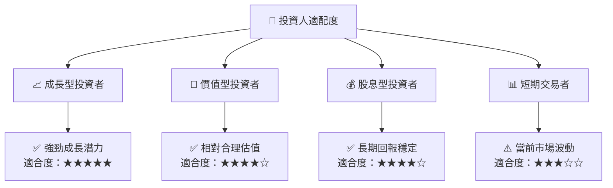

### 10.5 關鍵監控指標

| 監控類型 | 指標 | 關注點 | 頻率 |
|----------|------|-------|------|
| 財務指標 | 收入增速 | 是否持續高於行業均值 | 季度 |
| 市場指標 | 市場佔有率 | 市佔率變化與競爭對手比較 | 季度 |
| 風險指標 | 法規變化 | 法規政策變動的潛在影響 | 半年 |
| 成長指標 | 新技術應用 | 研發進展與應用領域擴展 | 年度 |

---

> **免責聲明**：本報告為 AI 自動生成，僅供研究參考，不構成投資建議。投資有風險，入市需謹慎。