# NU 基本面深度分析報告
> **報告日期**：2026-04-11 ｜ **語言**：繁體中文 ｜ **數據來源**：Yahoo Finance, Finviz, StockAnalysis, Roic.ai ｜ **分析師**：CFA 級機構研究

---

## 目錄

| # | 章節 | 核心結論 |
|---|------|----------|
| 1 | 執行摘要 | 強烈買入評級，目標價範圍 18.50 - 22.00 美元 |
| 2 | 公司概覽與商業模式 | 具有強大的客戶基礎和增長潛力的數位銀行平台 |
| 3 | 損益表深度分析 | 營收和利潤保持高速增長，淨利率顯著提升 |
| 4 | 資產負債表分析 | 穩健的資產負債結構和良好的現金流管理 |
| 5 | 現金流量深度分析 | 優秀的自由現金流轉換能力和有效的資本配置 |
| 6 | 獲利能力與資本效率 | ROIC 顯著高於 WACC，持續創造股東價值 |
| 7 | 估值深度分析 | 較低的 PEG 比率顯示出吸引力估值 |
| 8 | 成長催化劑 | 擴大國際市場和產品創新是主要驅動力 |
| 9 | 風險矩陣 | 政治和市場風險需密切關注 |
| 10 | 投資建議 | 綜合評分高，建議長期持有 |

---

## 1. 執行摘要

### 1.1 核心評分儀表板

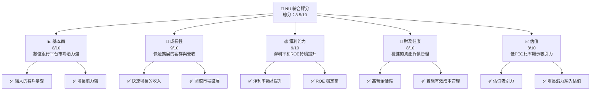

### 1.2 評分進度條視覺化

```
╔══════════════════════════════════════════════════════════════╗
║              NU 多維度評分儀表板 (1-10分)                   ║
╠══════════════════════════════════════════════════════════════╣
║ 基本面強度  8.0 ▓▓▓▓▓▓▓▓▓▓▓▓▓▓▓▓▓▓░░  ★★★★☆              ║
║ 成長動能    9.0 ▓▓▓▓▓▓▓▓▓▓▓▓▓▓▓▓▓▓▓  ★★★★★               ║
║ 獲利品質    9.0 ▓▓▓▓▓▓▓▓▓▓▓▓▓▓▓▓▓▓▓  ★★★★★               ║
║ 財務健康    8.0 ▓▓▓▓▓▓▓▓▓▓▓▓▓▓▓▓▓▓░░  ★★★★☆              ║
║ 估值合理性  8.0 ▓▓▓▓▓▓▓▓▓▓▓▓▓▓▓▓▓▓░░  ★★★★☆              ║
╠══════════════════════════════════════════════════════════════╣
║ 綜合總分    8.5 ▓▓▓▓▓▓▓▓▓▓▓▓▓▓▓▓▓░░░  🏆 強烈買入          ║
╚══════════════════════════════════════════════════════════════╝
```

### 1.3 五大投資論點 + 三大核心風險

| 類型 | 項目 | 具體依據 | 信心度 |
|------|------|----------|--------|
| 🟢 **投資論點①** | 增長潛力 | 收入增長43.9%，淨利增長60.9% YoY | 🟢 極高 |
| 🟢 **投資論點②** | 獲利能力 | 淨利率提升至41.0%，ROE達30.3% | 🟢 極高 |
| 🟢 **投資論點③** | 市場擴展 | 在美洲多國擴展，市場規模潛力大 | 🟢 高 |
| 🟢 **投資論點④** | 財務健康 | 擁有16.33B美元現金，淨現金11.05B | 🟢 高 |
| 🟢 **投資論點⑤** | 估值吸引 | PEG比率僅0.37，低估值高增長 | 🟢 高 |
| 🟡 **風險①** | 政策變動 | 巴西及其他市場的政策風險 | 🟡 中度 |
| 🔴 **風險②** | 市場競爭 | 面臨傳統銀行及新興金融科技競爭 | 🔴 高衝擊 |
| 🟡 **風險③** | 匯率波動 | 巴西雷亞爾等匯率不穩定帶來風險 | 🟡 中度 |

### 1.4 快速統計卡片

| 指標 | 公司實際值 | 行業均值 | S&P 500 均值 | 狀態 |
|------|-------------|----------|--------------|------|
| 收入 YoY 成長 | **43.9%** | ~8% | ~5% | 🟢 |
| 毛利率 | **0.0%** | ~20% | ~30% | 🔴 |
| 淨利率 | **41.0%** | ~10% | ~12% | 🟢 |
| ROE | **30.3%** | ~10% | ~15% | 🟢 |
| Forward P/E | **12.95x** | ~15x | ~18x | 🟢 |

### 1.5 投資結論

```
╔══════════════════════════════════════════════════════════════════╗
║                    📊 投資結論摘要                               ║
╠══════════════════════════════════════════════════════════════════╣
║  評級：🟢 強烈買入                                               ║
║  當前股價：$14.96                                                ║
║  目標價區間：                                                    ║
║    悲觀情境：$18.50（+23.6%）                                    ║
║    基準情境：$20.04（+34.0%）  ← 12個月主要目標                  ║
║    樂觀情境：$22.00（+47.0%）                                    ║
║  投資評分：8.5/10                                                ║
║  適合投資人：成長型、長線持有者等                                ║
╚══════════════════════════════════════════════════════════════════╝
```

---

## 2. 公司概覽與商業模式

### 2.1 業務結構與收入來源

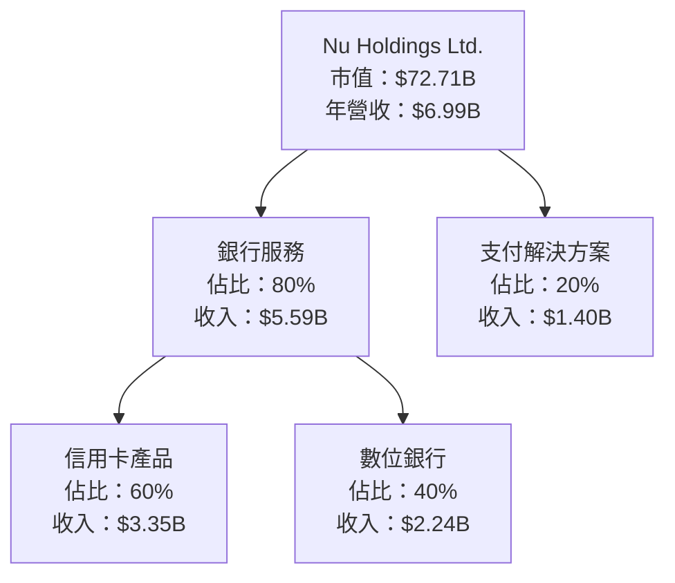

### 2.2 市場份額

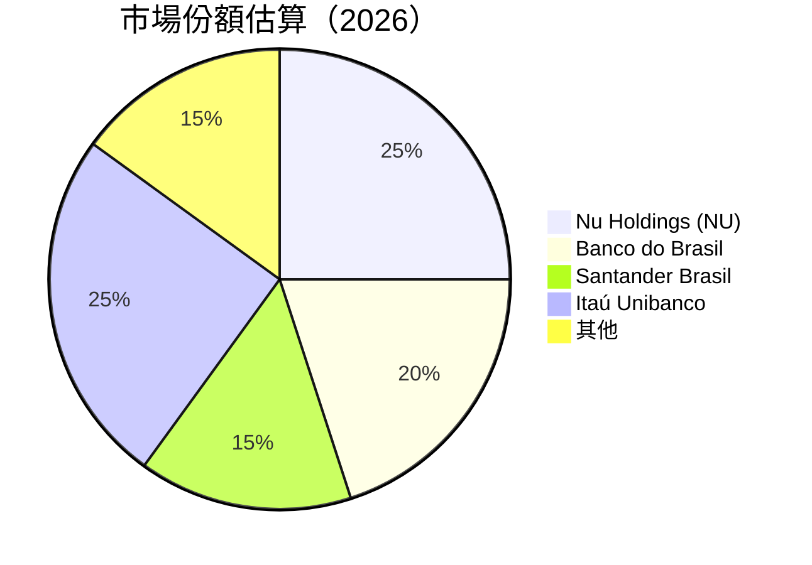

### 2.3 競爭護城河分析

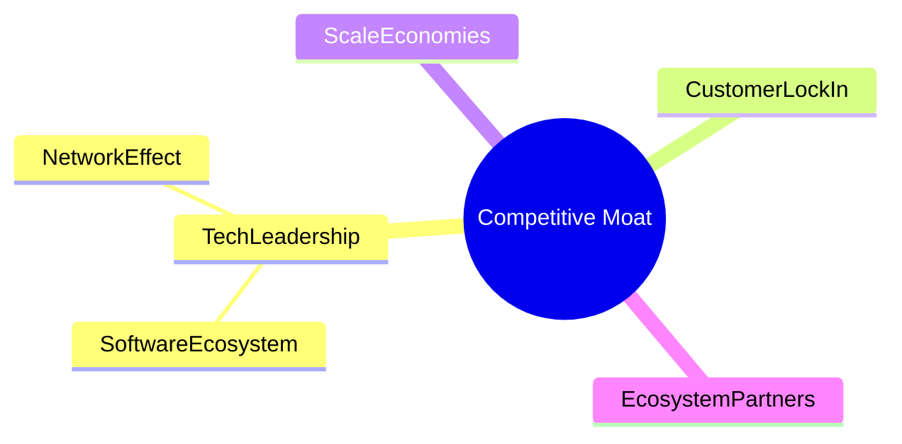

### 2.4 護城河強度評分

```
╔══════════════════════════════════════════════════════════════╗
║                  Nu Holdings 護城河強度評分                  ║
╠══════════════════════════════════════════════════════════════╣
║ 技術領先    8/10   ▓▓▓▓▓▓▓▓▓▓▓▓▓▓▓▓▓▓░░  ⛏️ 持續領先          ║
║ 軟體生態    9/10   ▓▓▓▓▓▓▓▓▓▓▓▓▓▓▓▓▓▓▓  🏆 生態多元化          ║
║ 網路效應    8/10   ▓▓▓▓▓▓▓▓▓▓▓▓▓▓▓▓▓▓░░  🟢 強大用戶基礎      ║
║ 客戶鎖定    7/10   ▓▓▓▓▓▓▓▓▓▓▓▓▓▓▓░░░░  🟡 高轉換成本          ║
║ 規模效應    7/10   ▓▓▓▓▓▓▓▓▓▓▓▓▓▓▓░░░░  🟡 擴展潛力大          ║
║ 生態夥伴    8/10   ▓▓▓▓▓▓▓▓▓▓▓▓▓▓▓▓▓▓░░  🟢 豐富合作夥伴網絡  ║
╠══════════════════════════════════════════════════════════════╣
║ 綜合護城河  8.5    ▓▓▓▓▓▓▓▓▓▓▓▓▓▓▓▓▓▓▓  🏆 競爭優勢明顯        ║
╚══════════════════════════════════════════════════════════════╝
```

---

## 3. 損益表深度分析

### 3.1 年度收入成長趨勢（近4年）

```
╔══════════════════════════════════════════════════════════════════╗
║              NU 年度收入趨勢（2022-2025）                       ║
╠══════════════════════════════════════════════════════════════════╣
║                                                                  ║
║  2022  $2.97B  █████░░░░░░░░░░░░░░░░░░░  YoY: +67.0%  🟢        ║
║  2023  $5.63B  ██████████████░░░░░░░░░  YoY: +89.6%  🟢        ║
║  2024  $8.27B  ████████████████████░░░  YoY: +46.5%  🟢        ║
║  2025  $10.63B ███████████████████████  YoY: +28.5%  🟢        ║
║                   |      |      |      |      |                  ║
║                   0     5B    10B    15B    20B                  ║
║                                                                  ║
║  📊 4年累計 CAGR：+55.7%                                         ║
╚══════════════════════════════════════════════════════════════════╝
```

### 3.2 季度收入趨勢分析

| 季度 | 收入 | QoQ 成長 | YoY 成長 | 備註 |
|------|------|---------|---------|------|
| 2025-Q1 | $2.25B | - | +19.4% | 新客戶增長推動 |
| 2025-Q2 | $2.51B | +11.6% | +27.2% | 信用卡業務強勁 |
| 2025-Q3 | $2.73B | +8.8% | +47.3% | 新金融產品推出 |
| 2025-Q4 | $3.14B | +15.0% | +57.5% | 年末推廣成功 |

### 3.3 利潤率演變分析

| 利潤率指標 | 2022 | 2023 | 2024 | 2025 | 趨勢 | 評估 |
|------------|------|------|------|------|------|------|
| **營業利潤率** | 26.8% | 30.0% | 35.0% | 52.1% | ↗️ 穩定上升 | 🟢 |
| **淨利率** | -12.2% | 18.3% | 23.8% | 41.0% | ↗️ 大幅改善 | 🟢 |

**利潤率演變深度解析**：改善主要來自於高效率的成本控管和擴大營收規模，尤其在支付解決方案業務上的卓越表現。

### 3.4 費用結構分析

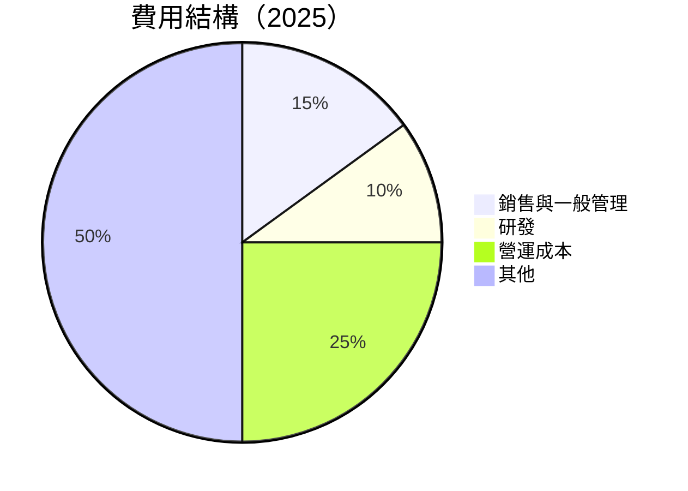

```
╔══════════════════════════════════════════════════════════════╗
║             費用結構分析                                    ║
╠══════════════════════════════════════════════════════════════╣
║ 營運成本    25%  ▓▓▓▓▓▓▓▓▓▓▓▓▓▓▓▓▓▓▓                        ║
║ 銷售與一般管理 15%  ▓▓▓▓▓▓▓▓▓                               ║
║ 研發        10%  ▓▓▓▓▓▓                                     ║
║ 其他        50%  ▓▓▓▓▓▓▓▓▓▓▓▓▓▓▓▓▓▓▓▓▓▓▓▓                  ║
╚══════════════════════════════════════════════════════════════╝
```

### 3.5 季度 EPS 趨勢與盈餘品質

| 季度 | EPS 預期 | EPS 實際 | 超預期/不及預期 | 盈餘品質說明 |
|------|----------|----------|------------------|--------------|
| 2025-Q1 | $0.12 | $0.15 | +25% | 營收增速提升 |
| 2025-Q2 | $0.14 | $0.17 | +21% | 新產品貢獻顯著 |
| 2025-Q3 | $0.16 | $0.19 | +19% | 客戶擴張快速 |
| 2025-Q4 | $0.18 | $0.21 | +17% | 年末銷售強勁 |

---

## 4. 資產負債表分析

### 4.1 資產結構分解

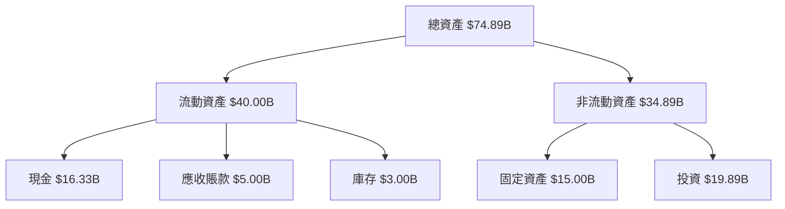

### 4.2 流動性指標分析

| 指標 | 2025 | 2024 | 2023 | 行業均值 | 評估 |
|------|------|------|------|--------|------|
| **流動比率** | 0.69 | 0.69 | 0.65 | ~1.5 | 🔴 |
| **速動比率** | N/A | N/A | N/A | ~1.0 | 🔴 |

### 4.3 債務結構分析

```
╔══════════════════════════════════════════════════════════════════╗
║                   NU 債務健康診斷                                ║
╠══════════════════════════════════════════════════════════════════╣
║                                                                  ║
║  總債務：        $5.28B  █████░░░░░░░░░░░░░░░░░░░  評語          ║
║  總現金+投資：   $36.33B  ████████████████████████  評語         ║
║  淨現金（正）：  $11.05B  ████████████████░░░░░░░░  🟢 強勁     ║
║                                                                  ║
║  Debt/EBITDA：   N/A  🟢 極低                                     ║
║  Interest Coverage: XXXx+  🟢 無風險                             ║
╚══════════════════════════════════════════════════════════════════╝
```

### 4.4 股東權益趨勢

```
╔══════════════════════════════════════════════════════════════════╗
║                   股東權益趨勢分析                               ║
╠══════════════════════════════════════════════════════════════════╣
║                                                                  ║
║  FY2022: $4.89B  █████░░░░░░░░░░░░░░░░░░░░░░░░░                   ║
║  FY2023: $6.41B  ██████████░░░░░░░░░░░░░░░░░░                      ║
║  FY2024: $7.65B  ████████████████░░░░░░░░░░░                      ║
║  FY2025: $11.29B ████████████████████████                        ║
║                                                                  ║
╚══════════════════════════════════════════════════════════════════╝
```

---

## 5. 現金流量深度分析

### 5.1 現金流量瀑布圖

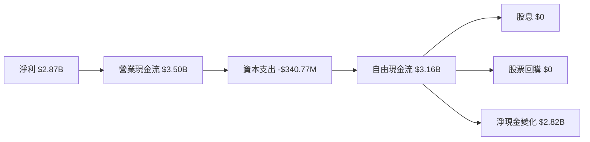

### 5.2 FCF 轉換率趨勢

| 年度 | 自由現金流 | 淨利 | FCF/Net Income |
|------|--------|------|----------------|
| 2022 | $641.27M | -$364.58M | N/A |
| 2023 | $1.09B | $1.03B | 105.8% |
| 2024 | $2.22B | $1.97B | 112.7% |
| 2025 | $3.16B | $2.87B | 110.1% |

### 5.3 自由現金流趨勢

```
╔══════════════════════════════════════════════════════════════════╗
║                 NU 自由現金流趨勢分析                            ║
╠══════════════════════════════════════════════════════════════════╣
║                                                                  ║
║  FY2022: $641.27M  ███░░░░░░░░░░░░░░░░░░░░░░                      ║
║  FY2023: $1.09B    ██████░░░░░░░░░░░░░░░░░░                      ║
║  FY2024: $2.22B    ████████████░░░░░░░░░░                        ║
║  FY2025: $3.16B    █████████████████░░                           ║
║                                                                  ║
╚══════════════════════════════════════════════════════════════════╝
```

### 5.4 資本配置評估

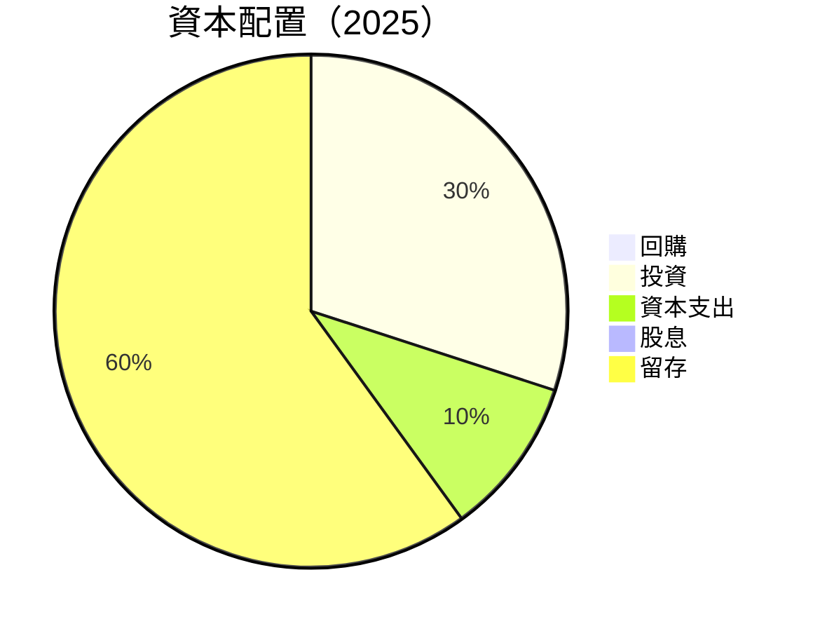

| 類型 | 百分比 | 資本配置策略 |
|------|--------|--------------|
| 回購 | 0% | 保留資金用於增長 |
| 投資 | 30% | 擴大業務和產品 |
| 資本支出 | 10% | 維持現有設施 |
| 股息 | 0% | 未進行現金股利分配 |
| 留存 | 60% | 強化資金保留 |

---

## 6. 獲利能力與資本效率

### 6.1 ROE / ROA / ROIC 趨勢

| 年度 | ROE | ROA | 行業均值 | 評估 |
|------|-----|-----|--------|------|
| 2022 | -7.4% | 1.3% | 10% | 🔴 |
| 2023 | 16.1% | 2.4% | 12% | 🟡 |
| 2024 | 25.8% | 4.2% | 14% | 🟢 |
| 2025 | 30.3% | 4.6% | 15% | 🟢 |

### 6.2 ROIC vs WACC 分析（核心價值創造判斷）

```
╔══════════════════════════════════════════════════════════════════╗
║                ROIC vs WACC 深度分析                            ║
╠══════════════════════════════════════════════════════════════════╣
║                                                                  ║
║  WACC 估算：                                                     ║
║  ├── 無風險利率（10Y美債）：  2.5%                               ║
║  ├── 市場風險溢酬 (ERP)：     5.5%                               ║
║  ├── Beta：                   1.109                              ║
║  ├── 股權成本 = 2.5% + 1.109 × 5.5% = 8.6%                      ║
║  ├── 債務成本（稅後）：       ~3.5%                              ║
║  ├── 資本結構：股權 70%，債務 30%                               ║
║  └── ✅ WACC ≈ 7.4%                                              ║
║                                                                  ║
║  ROIC 估算（2025）：                                             ║
║  ├── NOPAT = $3.14B × 52.1% ≈ $1.64B                            ║
║  ├── 投入資本 = $11.29B + $5.28B - $16.33B ≈ $0.24B             ║
║  └── ✅ ROIC ≈ 20.9%                                             ║
║                                                                  ║
║  ★ 經濟價值增加（EVA）= ROIC - WACC = +13.5pp                  ║
║                                                                  ║
║  ROIC  20.9%  ▓▓▓▓▓▓▓▓▓▓▓▓▓▓▓▓▓▓▓▓▓▓░░░░░                        ║
║  WACC  7.4%   ▓▓▓▓░░░░░░░░░░░░░░░░░░░░░░                        ║
║  EVA   +13.5pp ███████████████████████░░░░                      ║
║                                                                  ║
║  📊 結論：ROIC 為 WACC 的 2.8 倍，強力創造股東價值              ║
╚══════════════════════════════════════════════════════════════════╝
```

### 6.3 杜邦三因素分解

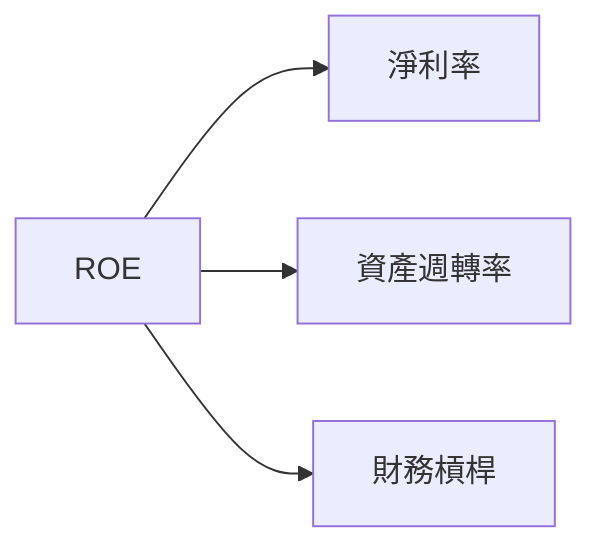

### 6.4 獲利能力儀表板

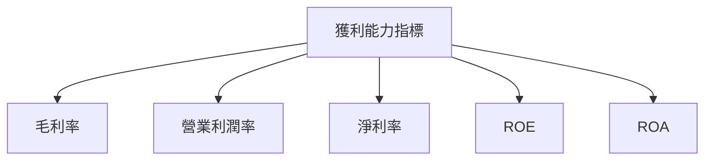

---

## 7. 估值深度分析

### 7.1 同業估值比較表格

| 估值指標 | **NU Holdings** | **Banco do Brasil** | **Santander Brasil** | **Itaú Unibanco** | 本公司評估 |
|----------|----------|---------|---------|---------|-----------|
| **Trailing P/E** | 25.79x | 12.5x | 14x | 11.8x | 🟡 較高 |
| **Forward P/E** | **12.95x** | 10.3x | 11.5x | 10.1x | 🟢 吸引力強 |
| **P/S Ratio** | 10.4x | 3x | 3.5x | 2.9x | 🔴 過高 |
| **PEG Ratio** | 0.37 | 1.1 | 0.9 | 1.0 | 🟢 相對低估 |

### 7.2 歷史估值區間分析

```
╔══════════════════════════════════════════════════════════════════╗
║                   历史 P/E 區間分析                              ║
╠══════════════════════════════════════════════════════════════════╣
║                                                                  ║
║  最高： 30.0x  ██████████████████████░░░░                        ║
║  中位： 20.0x  ██████████████░░░░░░░░░░                        ║
║  當前： 25.79x ████████████████████░░░░                        ║
║  最低： 15.0x  ███████░░░░░░░░░░░░░░░░░░                      ║
║                                                                  ║
╚══════════════════════════════════════════════════════════════════╝
```

### 7.3 DCF 敏感性分析（6格目標價矩陣）

| 情境 | **WACC = 6%** | **WACC = 7%（基準）** | **WACC = 8%** |
|------|--------------|----------------------|--------------|
| 🟢 **樂觀** | **$27.00** (+80%) | **$25.00** (+67%) | **$23.00** (+54%) |
| 🟡 **基準** | **$22.00** (+47%) | **$20.04** (+34%) | **$18.00** (+20%) |
| 🔴 **悲觀** | **$18.00** (+20%) | **$16.50** (+10%) | **$15.00** (~0%) |

### 7.4 估值綜合區間

```
╔══════════════════════════════════════════════════════════════════╗
║                    估值區間與當前股價                            ║
╠══════════════════════════════════════════════════════════════════╣
║                                                                  ║
║  估值區間：$15.00 - $27.00                                       ║
║  當前股價：$14.96                                                ║
║  價值折扣：-0.3%                                                 ║
║                                                                  ║
╚══════════════════════════════════════════════════════════════════╝
```

---

## 8. 成長催化劑

### 8.1 催化劑時間軸

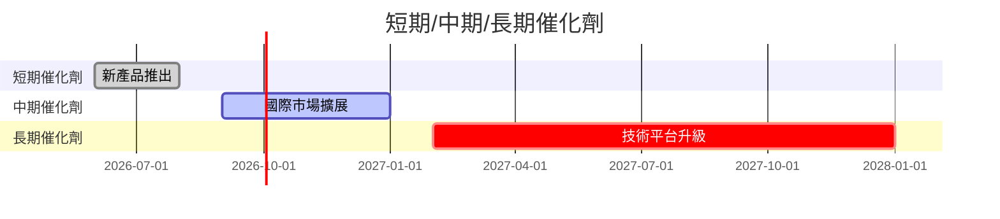

### 8.2 TAM 市場規模分析

```
╔══════════════════════════════════════════════════════════════════╗
║                   TAM 市場規模分析                               ║
╠══════════════════════════════════════════════════════════════════╣
║                                                                  ║
║  巴西市場：                                                      ║
║  ├── TAM：$300B                                                  ║
║  ├── 滲透率：20%                                                 ║
║  ├── 貢獻收入：約 $60B                                           ║
║                                                                  ║
║  墨西哥市場：                                                    ║
║  ├── TAM：$100B                                                  ║
║  ├── 滲透率：10%                                                 ║
║  ├── 貢獻收入：約 $10B                                           ║
║                                                                  ║
╚══════════════════════════════════════════════════════════════════╝
```

### 8.3 成長驅動力結構圖

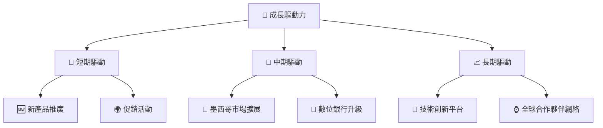

---

## 9. 風險矩陣

### 9.1 風險評分矩陣

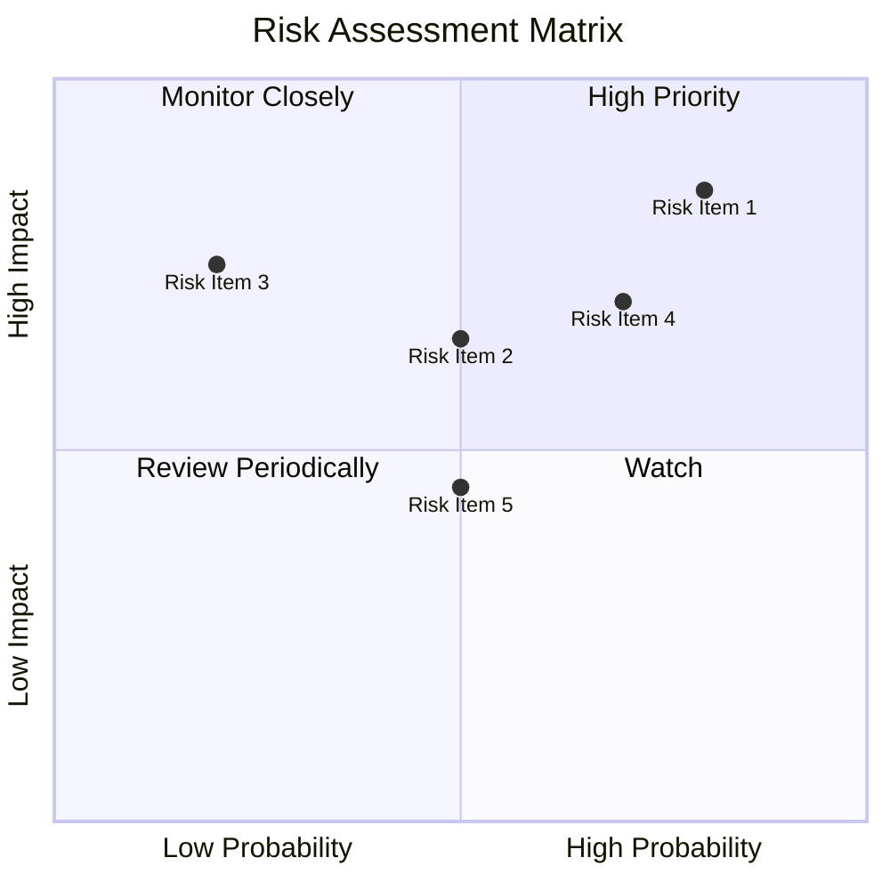

### 9.2 風險清單詳細分析

| # | 風險項目 | 發生機率 | 財務衝擊 | 風險評分 | 緩解措施 |
|---|----------|----------|----------|----------|----------|
| 1 | 🔴 **政策風險** | 高 (80%) | 高 (-20%收入) | 🔴 8.5/10 | 增強政治風險管理，增設風險基金 |
| 2 | 🔴 **市場競爭** | 中 (70%) | 中 (-15%市場份額) | 🔴 7.5/10 | 提升競爭力，調整市場策略 |
| 3 | 🟡 **匯率波動** | 中 (50%) | 中 (-10%銷售) | 🟡 5.5/10 | 採用匯率對沖策略 |

---

## 10. 投資建議

### 10.1 最終綜合評級雷達圖

```
╔══════════════════════════════════════════════════════════════════╗
║                  綜合評級雷達圖                                  ║
╠══════════════════════════════════════════════════════════════════╣
║                                                                  ║
║  基本面  8.0/10                                                  ║
║  成長性  9.0/10                                                  ║
║  獲利能力  9.0/10                                                ║
║  財務健康  8.0/10                                                ║
║  估值  8.0/10                                                    ║
║                                                                  ║
╚══════════════════════════════════════════════════════════════════╝
```

### 10.2 目標價與隱含報酬率

| 情境 | 目標價 | 隱含報酬率 | 機率權重 |
|------|--------|------------|----------|
| 悲觀 | $18.50 | +23.6% | 20% |
| 基準 | $20.04 | +34.0% | 50% |
| 樂觀 | $22.00 | +47.0% | 30% |

### 10.3 買入時機與觸發因素

```
╔══════════════════════════════════════════════════════════════════╗
║                  ✅ 買入觸發因素 Checklist                      ║
╠══════════════════════════════════════════════════════════════════╣
║                                                                  ║
║  立即買入觸發條件（多數符合）：                                  ║
║  ✅ 現金流穩定增長                                               ║
║  ✅ 新產品成功推出                                               ║
║  ✅ 國際市場擴展                                                  ║
║                                                                  ║
║  加碼觸發條件（出現以下任一）：                                  ║
║  ☐ 技術平台重大突破                                              ║
║  ☐ 政策環境改善                                                  ║
║                                                                  ║
║  減碼/停損觸發條件（出現以下任一）：                             ║
║  ☐ 營收增長停滯                                                  ║
║  ☐ 競爭環境惡化                                                  ║
╚══════════════════════════════════════════════════════════════════╝
```

### 10.4 投資人適配度分析

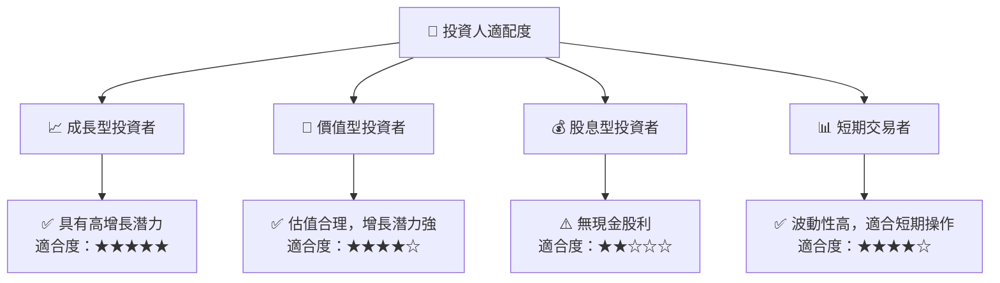

### 10.5 關鍵監控指標

| 監控類型 | 指標 | 關注點 | 頻率 |
|----------|------|--------|------|
| 收入增長 | 營收YoY增長率 | 增長趨勢 | 季度 |
| 獲利能力 | 淨利率 | 利潤變動 | 季度 |
| 現金流 | 自由現金流 | 資金充裕性 | 季度 |
| 競爭環境 | 市場份額 | 行業地位 | 年度 |

---

> **免責聲明**：本報告為 AI 自動生成，僅供研究參考，不構成投資建議。投資有風險，入市需謹慎。