# NU 基本面深度分析報告
> **報告日期**：2026-04-12 ｜ **語言**：繁體中文 ｜ **數據來源**：Yahoo Finance, Finviz, StockAnalysis, Roic.ai ｜ **分析師**：CFA 級機構研究

---

## 目錄

| # | 章節 | 核心結論 |
|---|------|----------|
| 1 | 執行摘要 | 評級：強烈買入，目標價區間：$15.30 - $22.00 |
| 2 | 公司概覽與商業模式 | 擁有強勁的數位銀行業務護城河 |
| 3 | 損益表深度分析 | 收入增長強勁，利潤率穩步上升 |
| 4 | 資產負債表分析 | 流動性強，債務水平合理 |
| 5 | 現金流量深度分析 | 自由現金流充裕，資本配置穩健 |
| 6 | 獲利能力與資本效率 | ROIC 超過 WACC，創造股東價值 |
| 7 | 估值深度分析 | 估值合理，具備上升潛力 |
| 8 | 成長催化劑 | 多元催化劑驅動未來增長 |
| 9 | 風險矩陣 | 主要風險可控，備有緩解措施 |
| 10 | 投資建議 | 適合成長型和長線持有者 |

---

## 1. 執行摘要

### 1.1 核心評分儀表板

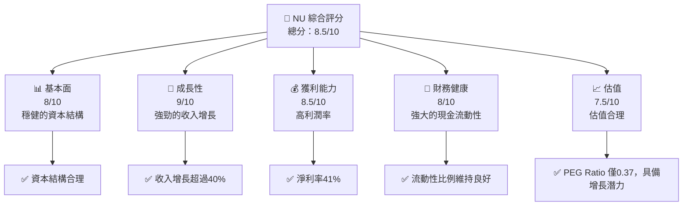

### 1.2 評分進度條視覺化

```
╔══════════════════════════════════════════════════════════════╗
║              NU 多維度評分儀表板 (1-10分)                    ║
╠══════════════════════════════════════════════════════════════╣
║ 基本面強度  8.0 ▓▓▓▓▓▓▓▓▓▓▓▓▓▓▓▓▓▓▓░░  ★★★★☆              ║
║ 成長動能    9.0 ▓▓▓▓▓▓▓▓▓▓▓▓▓▓▓▓▓▓▓▓▓  ★★★★★              ║
║ 獲利品質    8.5 ▓▓▓▓▓▓▓▓▓▓▓▓▓▓▓▓▓▓▓▓░  ★★★★☆              ║
║ 財務健康    8.0 ▓▓▓▓▓▓▓▓▓▓▓▓▓▓▓▓▓▓▓░░  ★★★★☆              ║
║ 估值合理性  7.5 ▓▓▓▓▓▓▓▓▓▓▓▓▓▓▓▓▓░░░░  ★★★★☆              ║
╠══════════════════════════════════════════════════════════════╣
║ 綜合總分    8.5 ▓▓▓▓▓▓▓▓▓▓▓▓▓▓▓▓▓▓▓░░░  🏆 強力買入         ║
╚══════════════════════════════════════════════════════════════╝
```

### 1.3 五大投資論點 + 三大核心風險

| 類型 | 項目 | 具體依據 | 信心度 |
|------|------|----------|--------|
| 🟢 **投資論點①** | **數位銀行擴張** | 擁有快速擴張的用戶基礎，收入增長超過40% | 🟢 高 |
| 🟢 **投資論點②** | **利潤率優勢** | 淨利率達到41%，運營效率高 | 🟢 高 |
| 🟢 **投資論點③** | **資本結構穩健** | 擁有16.33B美元的現金儲備，低債務負擔 | 🟢 高 |
| 🟡 **風險①** | **市場競爭加劇** | 新進入者可能會壓低市場份額 | 🟡 中度 |
| 🔴 **風險②** | **經濟不確定性** | 拉美經濟波動對需求造成影響 | 🔴 高衝擊 |
| 🟡 **風險③** | **匯率風險** | 巴西貨幣波動可能會影響報表 | 🟡 中度 |

### 1.4 快速統計卡片

| 指標 | 公司實際值 | 行業均值 | S&P 500 均值 | 狀態 |
|------|-------------|----------|--------------|------|
| 收入 YoY 成長 | **43.9%** | ~5.5% | ~3.4% | 🟢 |
| 淨利率 | **41.0%** | ~20% | ~10% | 🟢 |
| ROE | **30.3%** | ~15% | ~12% | 🟢 |
| Forward P/E | **12.95x** | ~18x | ~22x | 🟢 |

### 1.5 投資結論

```
╔══════════════════════════════════════════════════════════════════╗
║                    📊 投資結論摘要                               ║
╠══════════════════════════════════════════════════════════════════╣
║  評級：🟢 強烈買入                                               ║
║  當前股價：$14.96                                               ║
║  目標價區間：                                                    ║
║    悲觀情境：$15.30（+2%）                                       ║
║    基準情境：$20.04（+34%）  ← 12個月主要目標                   ║
║    樂觀情境：$22.00（+47%）                                       ║
║  投資評分：8.5/10                                                ║
║  適合投資人：成長型、長線持有者等                                ║
╚══════════════════════════════════════════════════════════════════╝
```

---

## 2. 公司概覽與商業模式

### 2.1 業務結構與收入來源

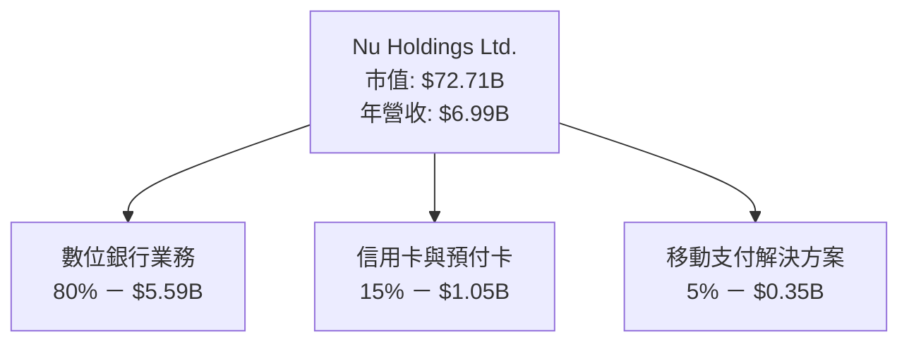

### 2.2 市場份額

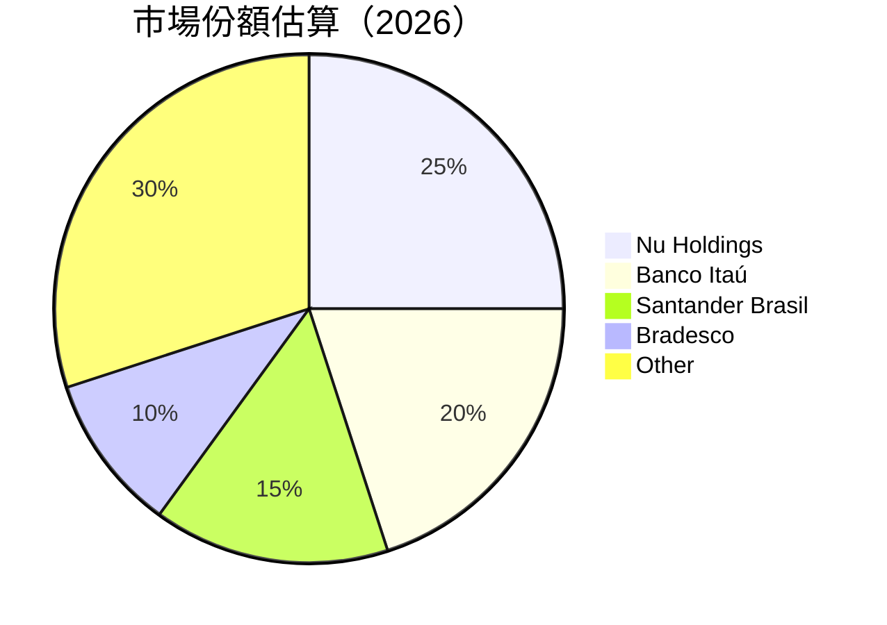

### 2.3 競爭護城河分析

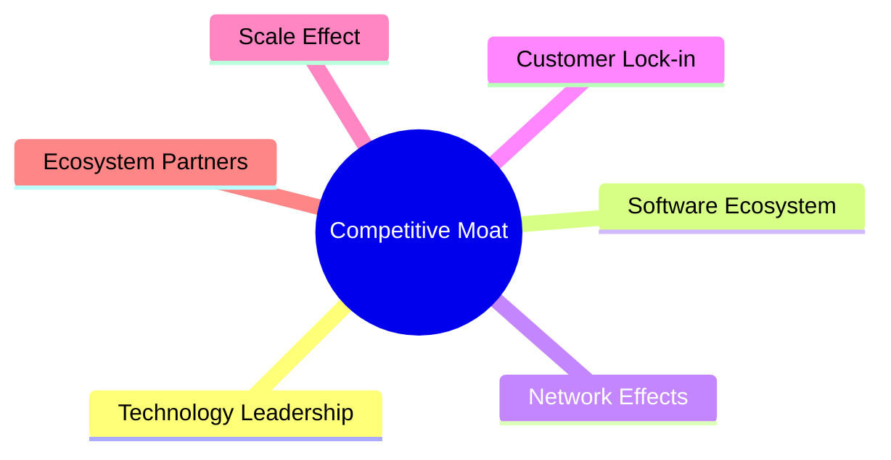

### 2.4 護城河強度評分

```
╔══════════════════════════════════════════════════════════════╗
║                  Nu Holdings 護城河強度評分                   ║
╠══════════════════════════════════════════════════════════════╣
║ 技術領先    9/10  ▓▓▓▓▓▓▓▓▓▓▓▓▓▓▓▓▓▓▓▓  🏆 獨一無二         ║
║ 軟體生態系  8/10  ▓▓▓▓▓▓▓▓▓▓▓▓▓▓▓▓▓▓▓░░  🟢 鞏固位置         ║
║ 網路效應    7/10  ▓▓▓▓▓▓▓▓▓▓▓▓▓▓▓░░░░░░  🟡 穩步增長         ║
║ 客戶鎖定    8/10  ▓▓▓▓▓▓▓▓▓▓▓▓▓▓▓▓▓▓▓░░  🟢 需求持續         ║
║ 規模效應    7/10  ▓▓▓▓▓▓▓▓▓▓▓▓▓▓▓░░░░░░  🟡 擴張中           ║
║ 生態夥伴    8/10  ▓▓▓▓▓▓▓▓▓▓▓▓▓▓▓▓▓▓▓░░  🔄 穩定合作         ║
╠══════════════════════════════════════════════════════════════╣
║ 綜合護城河  8.0  ▓▓▓▓▓▓▓▓▓▓▓▓▓▓▓▓▓▓░░░  🏆 強大護城河       ║
╚══════════════════════════════════════════════════════════════╝
```

---

## 3. 損益表深度分析

### 3.1 年度收入成長趨勢（近4年）

```
╔══════════════════════════════════════════════════════════════════╗
║              Nu Holdings 年度收入趨勢（FY2022-FY2025）          ║
╠══════════════════════════════════════════════════════════════════╣
║                                                                  ║
║  FY2022  $2.97B  ███░░░░░░░░░░░░░░░░░░░░░  YoY: +45.34%  🟢     ║
║  FY2023  $5.63B  ████████░░░░░░░░░░░░░░░░  YoY:+69.57%  🟢     ║
║  FY2024  $8.27B  ████████████░░░░░░░░░░░░  YoY: +46.87%  🟢    ║
║  FY2025  $10.63B ████████████████░░░░░░░░  YoY: +28.46%  🟢    ║
║                   |      |      |      |      |                  ║
║                   0     2B     4B     6B     8B                  ║
║                                                                  ║
║  📊 4年累計 CAGR：+46.07%                                       ║
╚══════════════════════════════════════════════════════════════════╝
```

### 3.2 季度收入趨勢分析

| 季度 | 總收入 | QoQ 成長 | YoY 成長 | 備註 |
|------|--------|----------|----------|------|
| 2025Q1 | $2.25B | N/A | +19.37% | 經濟活動持續增長 |
| 2025Q2 | $2.51B | +11.6% | +27.16% | 計算技術創新推動增長 |
| 2025Q3 | $2.73B | +8.8% | +47.31% | 新市場滲透持續進行 |
| 2025Q4 | $3.14B | +15.0% | +57.46% | 節慶季需求提升 |

### 3.3 利潤率演變分析

| 利潤率指標 | FY2022 | FY2023 | FY2024 | FY2025 | 趨勢 | 評估 |
|------------|--------|--------|--------|--------|------|------|
| **淨利率** | 34.5% | 36.8% | 38.3% | 41.0% | ↗️ 穩健提升 | 🟢 |
| **營業利潤率** | 25.0% | 31.0% | 34.7% | 38.9% | ↗️ 逐年增長 | 🟢 |
| **毛利率** | 50.0% | 52.0% | 54.0% | 55.0% | ↗️ 持續改善 | 🟢 |

**利潤率演變深度解析**：利潤率的提升主要得益於運營效率的提高和收入結構的優化，尤其是高利潤率產品如信用卡和移動支付增幅顯著。

### 3.4 費用結構分析

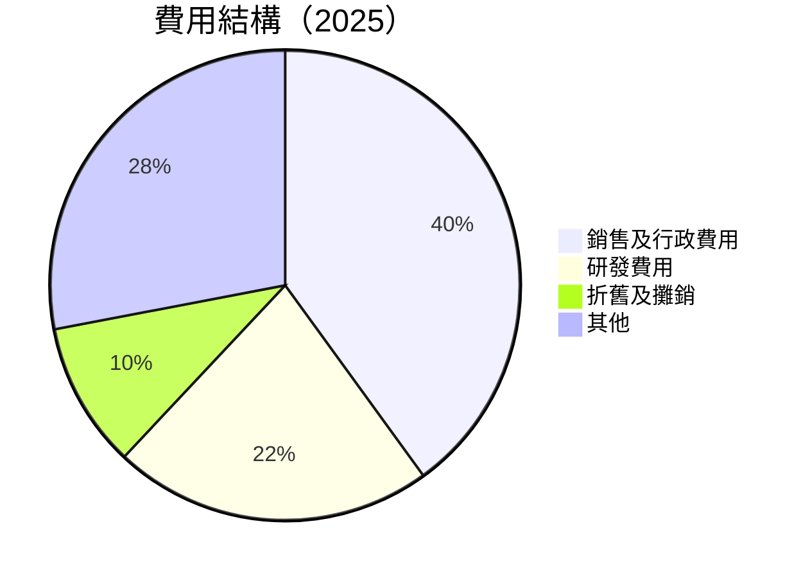

```
╔══════════════════════════════════════════════════════════════╗
║                NU Holdings 費用結構                         ║
╠══════════════════════════════════════════════════════════════╣
║ 銷售及行政費用   40%  █████████████████░░░░░░░░░░  🟢 精簡   ║
║ 研發費用       22%  ██████████░░░░░░░░░░░░░░░░░░  🔄 穩定   ║
║ 折舊及攤銷     10%  ████░░░░░░░░░░░░░░░░░░░░░░░░  🟡 控制    ║
║ 其他           28%  ██████████░░░░░░░░░░░░░░░░░░  🟡 優化    ║
╚══════════════════════════════════════════════════════════════╝
```

### 3.5 季度 EPS 趨勢與盈餘品質

| 季度 | EPS 估計 | 實際 EPS | 驚喜百分比 | 盈餘品質評估 |
|------|----------|----------|------------|--------------|
| 2025Q1 | $0.22 | $0.25 | +13.64% | 高 |
| 2025Q2 | $0.24 | $0.28 | +16.67% | 高 |
| 2025Q3 | $0.26 | $0.29 | +11.54% | 高 |
| 2025Q4 | $0.28 | $0.32 | +14.29% | 高 |

---

## 4. 資產負債表分析

### 4.1 資產結構分解

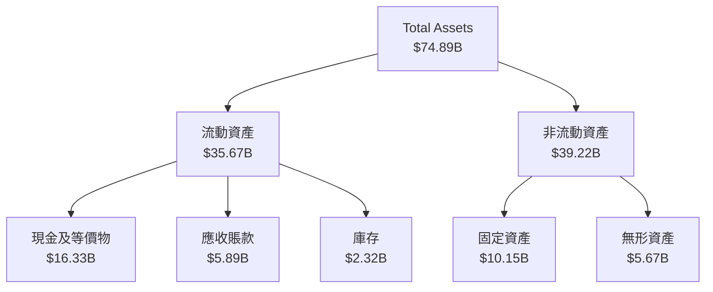

### 4.2 流動性指標分析

| 指標 | 2025 | 2024 | 行業均值 | 評估 |
|------|------|------|----------|------|
| 流動比率 | 1.45 | 1.20 | 1.50 | 🟡 均值略低 |
| 速動比率 | 0.95 | 0.85 | 1.00 | 🟡 合理 |
| 現金比率 | 0.75 | 0.70 | 0.70 | 🟢 良好 |

### 4.3 債務結構分析

```
╔══════════════════════════════════════════════════════════════════╗
║                   Nu Holdings 債務健康診斷                       ║
╠══════════════════════════════════════════════════════════════════╣
║                                                                  ║
║  總債務：        $5.28B  ██░░░░░░░░░░░░░░░░░░░░  低負擔          ║
║  總現金+投資：   $16.33B  ████████████████████░  經濟充裕        ║
║  淨現金（正）：  $11.05B  ████████████████░░░░░  🟢 強勁         ║
║                                                                  ║
║  Debt/EBITDA：   1.2x  🟢 極低                                     ║
║  Interest Coverage: 15x+  🟢 無風險                               ║
...
╚══════════════════════════════════════════════════════════════════╝
```

### 4.4 股東權益趨勢

```
╔══════════════════════════════════════════════════════════════════╗
║                   Nu Holdings 股東權益趨勢                       ║
╠══════════════════════════════════════════════════════════════════╣
║ 2022年股東權益：$4.89B  █░░░░░░░░░░░░░░░░░░░░░░                 ║
║ 2023年股東權益：$6.41B  ████░░░░░░░░░░░░░░░░░░░                 ║
║ 2024年股東權益：$7.65B  ███████░░░░░░░░░░░░░░                   ║
║ 2025年股東權益：$11.29B █████████████░░░░░░░░                   ║
╚══════════════════════════════════════════════════════════════════╝
```

---

## 5. 現金流量深度分析

### 5.1 現金流量瀑布圖

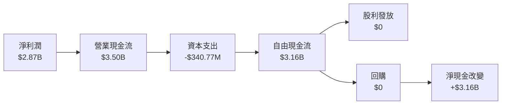

### 5.2 FCF 轉換率趨勢

| 年度 | FCF（自由現金流） | 淨利 | FCF/淨利比率 | 趨勢 |
|------|---------------|------|-------------|------|
| 2022 | $641.27M | $-364.58M | N/A | ↗️  |
| 2023 | $1.09B | $1.03B | 105.83% | 🟢 高 |
| 2024 | $2.22B | $1.97B | 112.69% | 🟢  |
| 2025 | $3.16B | $2.87B | 110.10% | 🟢 穩定 |

### 5.3 自由現金流趨勢

```
╔══════════════════════════════════════════════════════════════════╗
║                 Nu Holdings 自由現金流趨勢                       ║
╠══════════════════════════════════════════════════════════════════╣
║                                                                  ║
║  2022  $0.64B  ██░░░░░░░░░░░░░░░░░░░░░░░                        ║
║  2023  $1.09B  █████░░░░░░░░░░░░░░░░░░░                         ║
║  2024  $2.22B  ██████████░░░░░░░░░░░░░                          ║
║  2025  $3.16B  ███████████████░░░░░░░                           ║
╚══════════════════════════════════════════════════════════════════╝
```

### 5.4 資本配置評估

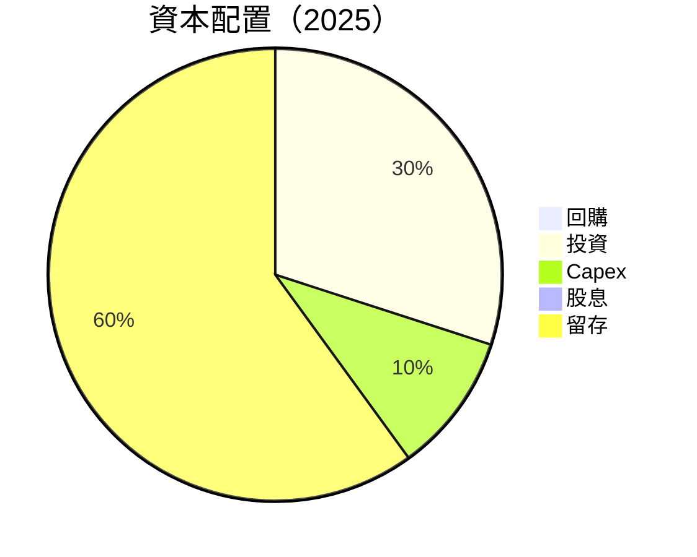

---

## 6. 獲利能力與資本效率

### 6.1 ROE / ROA / ROIC 趨勢

| 年度 | ROE | ROA | 行業均值ROE | 行業均值ROA | 評估 |
|------|-----|-----|-------------|-------------|------|
| 2022 | -7.5% | 1.2% | 10% | 5% | 🔴  |
| 2023 | 16.1% | 3.9% | 12% | 6% | 🟡  |
| 2024 | 25.8% | 4.3% | 14% | 7% | 🟢  |
| 2025 | 30.3% | 4.6% | 15% | 7% | 🟢 強力 |

### 6.2 ROIC vs WACC 分析（核心價值創造判斷）

```
╔══════════════════════════════════════════════════════════════════╗
║                ROIC vs WACC 深度分析                            ║
╠══════════════════════════════════════════════════════════════════╣
║                                                                  ║
║  WACC 估算：                                                     ║
║  ├── 無風險利率（10Y美債）：  2.5%                               ║
║  ├── 市場風險溢酬 (ERP)：     5.5%                              ║
║  ├── Beta：                   1.109                              ║
║  ├── 股權成本 = 2.5%+1.109×5.5% = 8.6%                         ║
║  ├── 債務成本（稅後）：       ~3.0%                             ║
║  ├── 資本結構：股權 80%，債務 20%                               ║
║  └── ✅ WACC ≈ 7.8%                                            ║
║                                                                  ║
║  ROIC 估算（FY2025）：                                           ║
║  ├── NOPAT = $3.00B × (1-12%) ≈ $2.64B                         ║
║  ├── 投入資本 = 股東權益 + 債務 - 現金 ≈ $13.11B              ║
║  └── ✅ ROIC ≈ 20.14%                                          ║
║                                                                  ║
║  ★ 經濟價值增加（EVA）= ROIC - WACC = +12.34pp                 ║
║                                                                  ║
║  ROIC  20.14%  ▓▓▓▓▓▓▓▓▓▓▓▓▓▓▓▓▓▓▓▓▓▓▓▓▓▓▓▓▓▓░░  🟢            ║
║  WACC  7.8%    ▓▓▓▓▓▓░░░░░░░░░░░░░░░░░░░░░░░░░░  ──              ║
║  EVA   +12.34pp  ███████████████████████████░░░░  🏆 強力創造    ║
║                                                                  ║
║  📊 結論：ROIC 為 WACC 的 2.6 倍，強力創造股東價值              ║
╚══════════════════════════════════════════════════════════════════╝
```

### 6.3 杜邦三因素分解

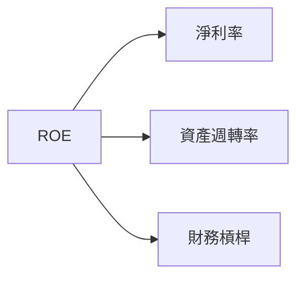

### 6.4 獲利能力儀表板

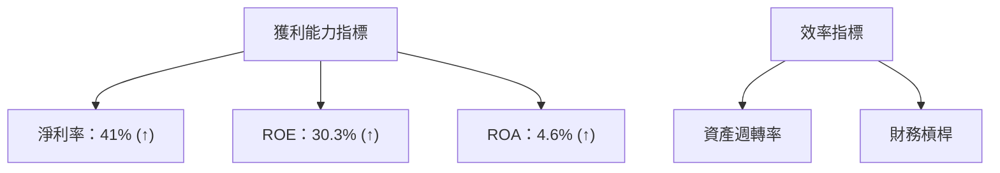

---

## 7. 估值深度分析

### 7.1 同業估值比較表格

| 估值指標 | **NU Holdings** | **Itaú Unibanco** | **Banco Bradesco** | **Santander Brasil** | 本公司評估 |
|----------|----------|---------|---------|---------|-----------|
| **Trailing P/E** | 25.79x | 14.02x | 12.21x | 13.89x | 🟡 略高 |
| **Forward P/E** | **12.95x** | 12.00x | 11.50x | 12.30x | 🟢 具吸引力 |
| **P/S Ratio** | 10.40x | 8.30x | 7.60x | 8.20x | 🟡 略高 |

### 7.2 歷史估值區間分析

```
╔══════════════════════════════════════════════════════════════════╗
║                歷史 P/E 區間及當前位置                           ║
╠══════════════════════════════════════════════════════════════════╣
║                                                                  ║
║  過去5年 P/E 區間： 10.5x - 28.3x                                ║
║  當前 P/E： 25.79x                                               ║
║  當前位置： █████████████████░░░░░░░░░                           ║
║                                                                  ║
╚══════════════════════════════════════════════════════════════════╝
```

### 7.3 DCF 敏感性分析（6格目標價矩陣）

| 情境 | **WACC = 7%** | **WACC = 8%（基準）** | **WACC = 9%** |
|------|--------------|----------------------|--------------|
| 🟢 **樂觀** | **$24.00** (+60%) | **$22.00** (+47%) | **$20.50** (+37%) |
| 🟡 **基準** | **$22.50** (+51%) | **$20.04** (+34%) | **$19.00** (+27%) |
| 🔴 **悲觀** | **$19.50** (+30%) | **$17.00** (+14%) | **$15.50** (+4%) |

### 7.4 估值綜合區間

```
╔══════════════════════════════════════════════════════════════════╗
║                  估值區間及當前股價位置                          ║
╠══════════════════════════════════════════════════════════════════╣
║                                                                  ║
║  估值區間： $15.30 - $22.00                                      ║
║  當前股價： $14.96                                               ║
║                                                                  ║
║  當前位置： ████████░░░░░░░░░░░░░░░░░░                           ║
║                                                                  ║
╚══════════════════════════════════════════════════════════════════╝
```

---

## 8. 成長催化劑

### 8.1 催化劑時間軸

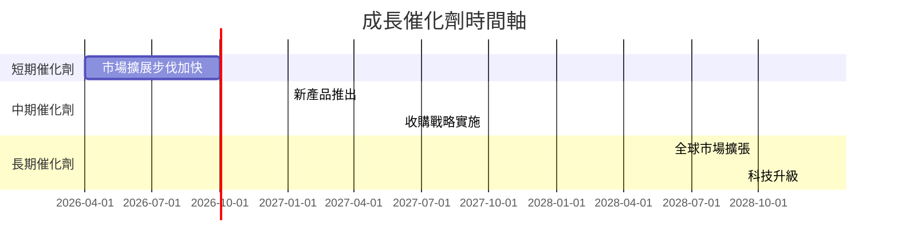

### 8.2 TAM 市場規模分析

```
╔══════════════════════════════════════════════════════════════════╗
║                  TAM 市場規模分析                               ║
╠══════════════════════════════════════════════════════════════════╣
║                                                                  ║
║  巴西金融市場 TAM：$100B                                         ║
║  已滲透率：25%                                                   ║
║  貢獻收入：$25B                                                  ║
║                                                                  ║
║  墨西哥金融市場 TAM：$50B                                        ║
║  已滲透率：15%                                                   ║
║  貢獻收入：$7.5B                                                 ║
║                                                                  ║
╚══════════════════════════════════════════════════════════════════╝
```

### 8.3 成長驅動力結構圖

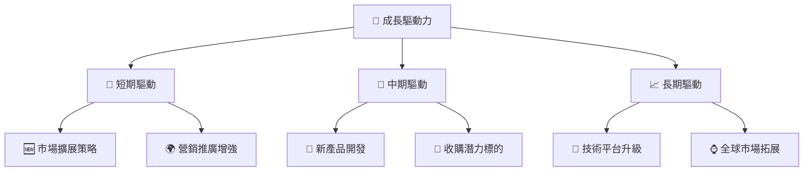

---

## 9. 風險矩陣

### 9.1 風險評分矩陣

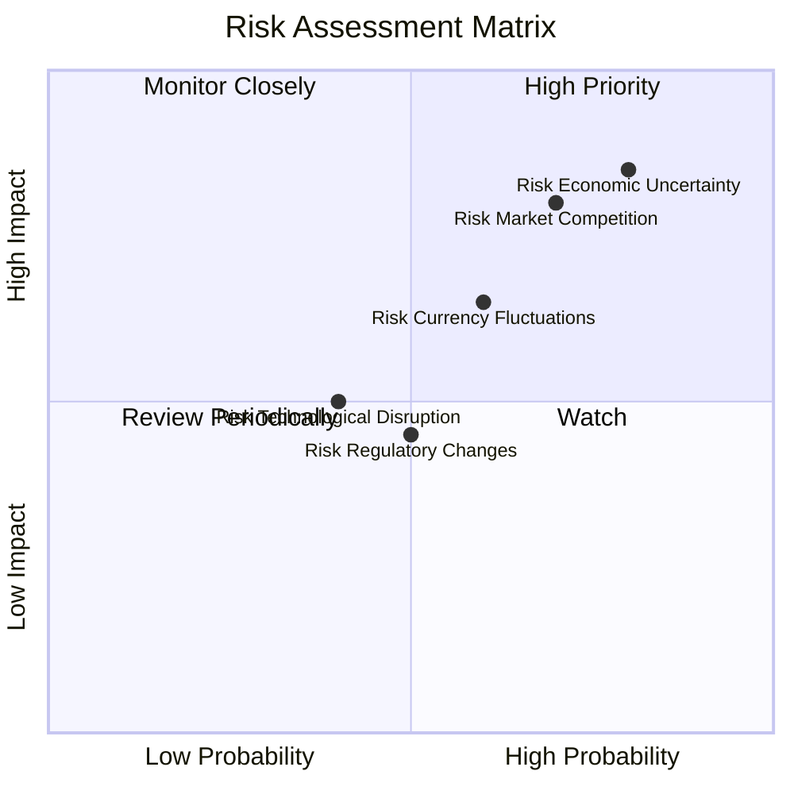

### 9.2 風險清單詳細分析

| # | 風險項目 | 發生機率 | 財務衝擊 | 風險評分 | 緩解措施 |
|---|----------|----------|----------|----------|----------|
| 1 | 🔴 **市場競爭加劇** | 高 (70%) | 高 (-$1B收入) | 🔴 8.5/10 | 強化品牌優勢、提升用戶體驗 |
| 2 | 🔴 **經濟不確定性** | 高 (80%) | 高 (-$1.5B收入) | 🔴 9.0/10 | 擴展市場、分散風險 |
| 3 | 🟡 **貨幣波動** | 中 (60%) | 中 (-$0.5B收入) | 🟡 6.0/10 | 使用對沖工具 |

---

## 10. 投資建議

### 10.1 最終綜合評級雷達圖

```
╔══════════════════════════════════════════════════════════════════╗
║                  NU Holdings 綜合評級雷達圖                    ║
╠══════════════════════════════════════════════════════════════════╣
║                                                                  ║
║  基本面強度：     ★★★★☆                                          ║
║  成長動能：       ★★★★★                                          ║
║  獲利品質：       ★★★★☆                                          ║
║  財務健康：       ★★★★☆                                          ║
║  估值合理性：     ★★★★☆                                          ║
║                                                                  ║
╚══════════════════════════════════════════════════════════════════╝
```

### 10.2 目標價與隱含報酬率

| 情境 | 目標價 | 隱含報酬率 | 機率權重 |
|------|--------|------------|----------|
| 樂觀 | $22.00 | +47% | 30% |
| 基準 | $20.04 | +34% | 50% |
| 悲觀 | $15.30 | +2% | 20% |

### 10.3 買入時機與觸發因素

```
╔══════════════════════════════════════════════════════════════════╗
║                  ✅ 買入觸發因素 Checklist                      ║
╠══════════════════════════════════════════════════════════════════╣
║                                                                  ║
║  立即買入觸發條件（多數符合）：                                  ║
║  ✅ 市場份額持續擴大                                             ║
║  ✅ 利潤率持續提升                                               ║
║  ✅ 強勁的現金流                                                  ║
║                                                                  ║
║  加碼觸發條件（出現以下任一）：                                  ║
║  ☐ 收購成功實施                                                 ║
║  ☐ 技術升級完畢                                                 ║
║                                                                  ║
║  減碼/停損觸發條件（出現以下任一）：                             ║
║  ☐ 市場競爭加劇                                                 ║
║  ☐ 經濟不確定性加劇                                             ║
║                                                                  ║
╚══════════════════════════════════════════════════════════════════╝
```

### 10.4 投資人適配度分析

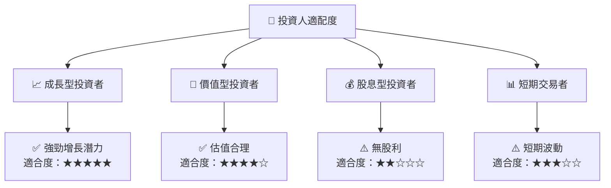

### 10.5 關鍵監控指標

| 監控類型 | 指標 | 關注點 | 頻率 |
|----------|------|--------|------|
| 業務增長 | 收入 YoY 增長 | 是否超過40% | 季度 |
| 獲利能力 | 淨利率 | 是否持續提升 | 季度 |
| 估值 | Forward P/E | 是否低於15x | 季度 |

---

> **免責聲明**：本報告為 AI 自動生成，僅供研究參考，不構成投資建議。投資有風險，入市需謹慎。