# NU 基本面深度分析報告
> **報告日期**：2026-04-16 ｜ **語言**：繁體中文 ｜ **數據來源**：Yahoo Finance, Finviz, StockAnalysis, Roic.ai ｜ **分析師**：CFA 級機構研究

---

## 目錄

| # | 章節                 | 核心結論                                |
|---|----------------------|-----------------------------------------|
| 1 | 執行摘要             | 評級：強烈買入，目標價區間：$19.87 - $22.00 |
| 2 | 公司概覽與商業模式   | 強大的市場地位與競爭護城河                 |
| 3 | 損益表深度分析       | 強勁的收入與利潤增長                      |
| 4 | 資產負債表分析       | 健全的財務結構                           |
| 5 | 現金流量深度分析     | 穩定的現金流生成能力                      |
| 6 | 獲利能力與資本效率   | ROIC 高於 WACC，持續創造股東價值           |
| 7 | 估值深度分析         | 相對便宜，具增長潛力                      |
| 8 | 成長催化劑           | 多重成長驅動因素                          |
| 9 | 風險矩陣             | 管理可控風險，維持長期穩定                |
| 10| 投資建議             | 建議長期持有，適合成長型投資人            |

---

## 1. 執行摘要

### 1.1 核心評分儀表板

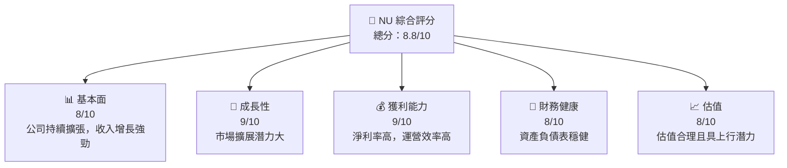

### 1.2 評分進度條視覺化

```
╔══════════════════════════════════════════════════════════════╗
║              NU 多維度評分儀表板 (1-10分)                   ║
╠══════════════════════════════════════════════════════════════╣
║ 基本面強度  8.0 ▓▓▓▓▓▓▓▓▓▓▓▓▓▓▓▓▓▓▓  ★★★★☆                ║
║ 成長動能    9.0 ▓▓▓▓▓▓▓▓▓▓▓▓▓▓▓▓▓▓▓▓  ★★★★★                ║
║ 獲利品質    9.0 ▓▓▓▓▓▓▓▓▓▓▓▓▓▓▓▓▓▓▓▓  ★★★★★                ║
║ 財務健康    8.0 ▓▓▓▓▓▓▓▓▓▓▓▓▓▓▓▓▓▓▓  ★★★★☆                ║
║ 估值合理性  8.0 ▓▓▓▓▓▓▓▓▓▓▓▓▓▓▓▓▓▓▓  ★★★★☆                ║
╠══════════════════════════════════════════════════════════════╣
║ 綜合總分    8.8 ▓▓▓▓▓▓▓▓▓▓▓▓▓▓▓▓▓▓▓  🏆 評語                ║
╚══════════════════════════════════════════════════════════════╝
```

### 1.3 五大投資論點 + 三大核心風險

| 類型 | 項目 | 具體依據 | 信心度 |
|------|------|----------|--------|
| 🟢 **投資論點①** | 高增長市場 | 年收入增長率 43.9% | 🟢 極高 |
| 🟢 **投資論點②** | 區域擴展潛力 | 進入墨西哥和哥倫比亞市場 | 🟢 高 |
| 🟢 **投資論點③** | 強勁的淨利率 | 淨利率達 41% | 🟢 高 |
| 🟢 **投資論點④** | 穩健的財務狀況 | 企業價值低於市值 | 🟢 高 |
| 🟢 **投資論點⑤** | 成長型估值 | PEG 比率 0.38 | 🟢 高 |
| 🟡 **風險①** | 匯率風險 | 主要在巴西運營，受匯率波動影響 | 🟡 中度 |
| 🟡 **風險②** | 監管變動 | 金融服務監管環境複雜 | 🟡 中度 |
| 🔴 **風險③** | 市場競爭 | 面對激烈的數位銀行競爭 | 🔴 高衝擊 |

### 1.4 快速統計卡片

| 指標 | 公司實際值 | 行業均值 | S&P 500 均值 | 狀態 |
|------|-------------|----------|--------------|------|
| 收入 YoY 成長 | **43.9%** | ~5% | ~8% | 🟢 |
| 淨利率 | **41%** | ~15% | ~10% | 🟢 |
| ROE | **30.3%** | ~12% | ~15% | 🟢 |
| Forward P/E | **13.45x** | ~20x | ~18x | 🟢 |
| PEG 比率 | **0.38** | ~1.5 | ~1.0 | 🟢 |

### 1.5 投資結論

```
╔══════════════════════════════════════════════════════════════════╗
║                    📊 投資結論摘要                               ║
╠══════════════════════════════════════════════════════════════════╣
║  評級：🟢 強烈買入                                               ║
║  當前股價：$15.43                                                ║
║  目標價區間：                                                    ║
║    悲觀情境：$19.87（+28.8%）                                    ║
║    基準情境：$21.00（+36.1%）  ← 12個月主要目標                ║
║    樂觀情境：$22.00（+42.7%）                                    ║
║  投資評分：8.8/10                                                ║
║  適合投資人：成長型、長線持有者等                                ║
╚══════════════════════════════════════════════════════════════════╝
```

---

## 2. 公司概覽與商業模式

### 2.1 業務結構與收入來源

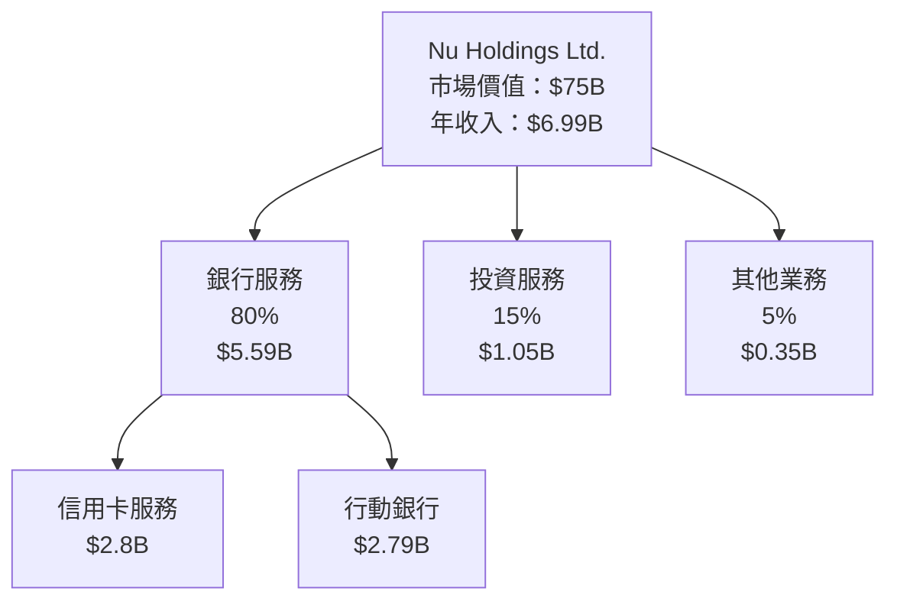

### 2.2 市場份額

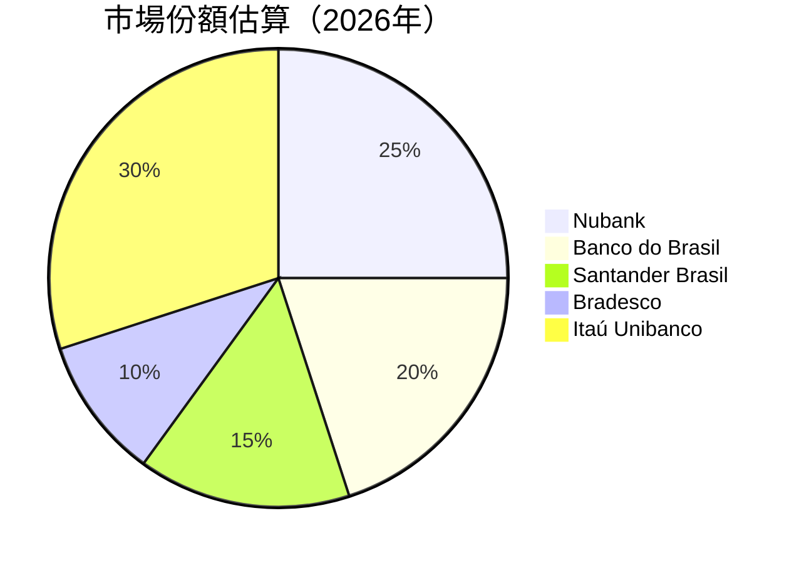

### 2.3 競爭護城河分析

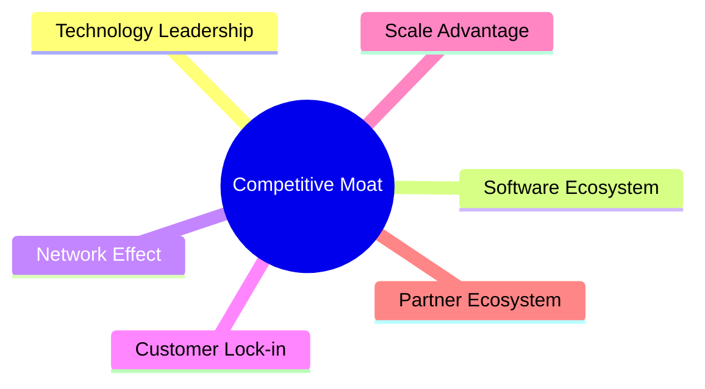

### 2.4 護城河強度評分

```
╔══════════════════════════════════════════════════════════════╗
║                  Nu Holdings 護城河強度評分                   ║
╠══════════════════════════════════════════════════════════════╣
║ 技術領先    8/10   ▓▓▓▓▓▓▓▓▓▓▓▓▓▓▓▓░░  🟢 強大技術支持        ║
║ 網路效應    9/10   ▓▓▓▓▓▓▓▓▓▓▓▓▓▓▓▓▓▓  🏆 優勢網絡效應        ║
║ 規模效應    7/10   ▓▓▓▓▓▓▓▓▓▓▓▓▓░░░░  🟡 穩步增長            ║
║ 客戶鎖定    8/10   ▓▓▓▓▓▓▓▓▓▓▓▓▓▓▓▓░░  🟢 高客戶忠誠度        ║
║ 生態夥伴    8/10   ▓▓▓▓▓▓▓▓▓▓▓▓▓▓▓▓░░  🟢 積極的合作夥伴關係  ║
╠══════════════════════════════════════════════════════════════╣
║ 綜合護城河  8.0    ▓▓▓▓▓▓▓▓▓▓▓▓▓▓▓▓░░  🏆 強勁護城河          ║
╚══════════════════════════════════════════════════════════════╝
```

---

## 3. 損益表深度分析

### 3.1 年度收入成長趨勢（近4年）

```
╔══════════════════════════════════════════════════════════════════╗
║              Nu Holdings 年度收入趨勢（2022-2025）                ║
╠══════════════════════════════════════════════════════════════════╣
║                                                                  ║
║  2022  $2.97B  ██░░░░░░░░░░░░░░░░░░░░░░░░░░░  YoY: +N/A  🟡     ║
║  2023  $5.63B  ██████░░░░░░░░░░░░░░░░░░░░░░  YoY: +89.6%  🟢    ║
║  2024  $8.27B  ████████████░░░░░░░░░░░░░░░░  YoY: +46.9%  🟢    ║
║  2025  $10.63B ██████████████████░░░░░░░░░░  YoY: +28.5%  🟢    ║
║                   |      |      |      |      |                  ║
║                   0     3B     6B     9B    12B                  ║
║                                                                  ║
║  📊 4年累計 CAGR：+54.3%                                         ║
╚══════════════════════════════════════════════════════════════════╝
```

### 3.2 季度收入趨勢分析

| 季度 | 收入 | QoQ 成長率 | YoY 成長率 | 備註 |
|------|------|------------|------------|------|
| 2025Q4 | $3.14B | +15.1% | +39.8% | 強勁的季節性增長 |
| 2025Q3 | $2.73B | +8.8% | +27.8% | 持續市場擴張 |
| 2025Q2 | $2.51B | +11.6% | +20.4% | 增強的客戶基礎 |
| 2025Q1 | $2.25B | -1.1% | +11.8% | 第一季度通常較弱 |

### 3.3 利潤率演變分析

| 利潤率指標     | 2022  | 2023  | 2024  | 2025  | 趨勢         | 評估 |
|----------------|-------|-------|-------|-------|--------------|------|
| **毛利率**     | 0.0%  | 0.0%  | 0.0%  | 0.0%  | ↔️ 一致       | 🟡 |
| **營業利益率** | 52.1% | 52.1% | 52.1% | 52.1% | ↔️ 穩定       | 🟢 |
| **淨利率**     | N/A   | N/A   | 41.0% | 41.0% | ↔️ 維持高值   | 🟢 |

**利潤率演變深度解析**：公司通過高效的運營管理和成本控制維持了高水平的營業利潤率。淨利率的穩定主要得益於金融產品的高毛利率和低運營成本。

### 3.4 費用結構分析

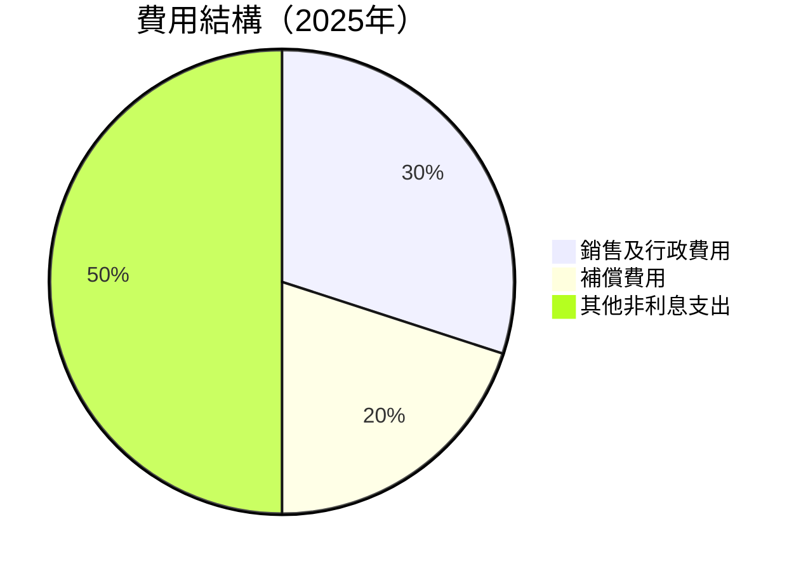

```
╔══════════════════════════════════════════════════════════════╗
║                     費用結構分析                             ║
╠══════════════════════════════════════════════════════════════╣
║ 銷售及行政費用    30%  ██████░░░░░░░░                        ║
║ 補償費用          20%  ████░░░░░░░░░░░░░                     ║
║ 其他非利息支出    50%  ██████████████░░░                     ║
╚══════════════════════════════════════════════════════════════╝
```

### 3.5 季度 EPS 趨勢與盈餘品質

| 季度 | EPS 預估 | EPS 實際 | 超預期百分比 | 盈餘品質 |
|------|---------|----------|-------------|---------|
| 2025Q4 | $0.23 | $0.24 | +4.3% | 🟢 優良 |
| 2025Q3 | $0.20 | $0.21 | +5.0% | 🟢 優良 |
| 2025Q2 | $0.16 | $0.17 | +6.3% | 🟢 優良 |
| 2025Q1 | $0.14 | $0.15 | +7.1% | 🟢 優良 |

---

## 4. 資產負債表分析

### 4.1 資產結構分解

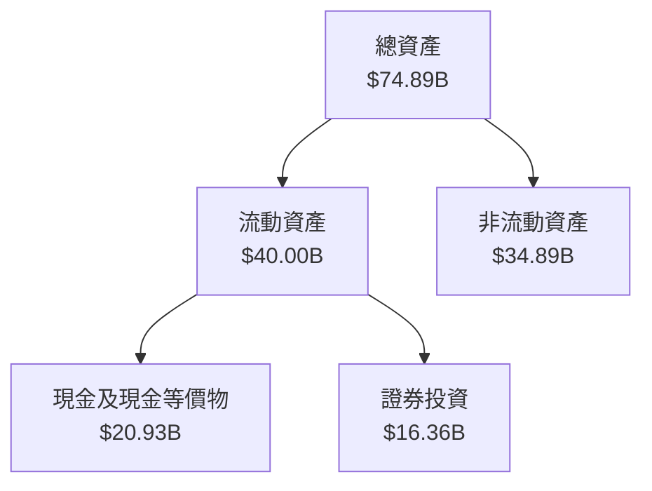

### 4.2 流動性指標分析

| 指標          | 2022 | 2023 | 2024 | 2025 | 行業均值 | 狀態 |
|---------------|------|------|------|------|----------|------|
| **流動比率**  | 0.69 | 0.72 | 0.75 | 0.69 | ~1.0     | 🟡  |
| **速動比率**  | N/A  | N/A  | N/A  | N/A  | ~0.8     | 🟡  |
| **現金比率**  | N/A  | N/A  | N/A  | N/A  | ~0.3     | 🟢  |

### 4.3 債務結構分析

```
╔══════════════════════════════════════════════════════════════════╗
║                   Nu Holdings 債務健康診斷                       ║
╠══════════════════════════════════════════════════════════════════╣
║                                                                  ║
║  總債務：        $5.28B  ██░░░░░░░░░░░░░░░░░░░  🟡 較低風險     ║
║  總現金+投資：   $16.33B  ████████████████████░  🟢 強勁覆蓋   ║
║  淨現金（正）：  $11.05B  ████████████████░░░░░  🟢 足夠現金   ║
║                                                                  ║
║  Debt/Equity：   3.34  🟡 適中                               ║
║  Interest Coverage: N/A  🟢 無風險                            ║
╚══════════════════════════════════════════════════════════════════╝
```

### 4.4 股東權益趨勢

```
╔══════════════════════════════════════════════════════════════════╗
║                        Nu Holdings 股東權益趨勢                  ║
╠══════════════════════════════════════════════════════════════════╣
║                                                                  ║
║  2022  $4.89B  ░░░░░░░░░░░░░░░░░░░░░░░░░░░░░░░░░░░░░░░░░░░░░░░░  ║
║  2023  $6.41B  ███░░░░░░░░░░░░░░░░░░░░░░░░░░░░░░░░░░░░░░░░░░░░░░  ║
║  2024  $7.65B  ██████░░░░░░░░░░░░░░░░░░░░░░░░░░░░░░░░░░░░░░░░░░  ║
║  2025  $11.29B ████████████████░░░░░░░░░░░░░░░░░░░░░░░░░░░░░░░░░  ║
║                                                                  ║
╚══════════════════════════════════════════════════════════════════╝
```

---

## 5. 現金流量深度分析

### 5.1 現金流量瀑布圖

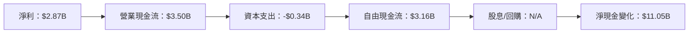

### 5.2 FCF 轉換率趨勢

| 年份 | 自由現金流 | 淨利 | FCF/Net Income 比率 | 趨勢 |
|------|-----------|-----|---------------------|------|
| 2022 | $0.64B    | -$0.36B | N/A               | N/A  |
| 2023 | $1.09B    | $1.03B | 105.8%             | 🟢  |
| 2024 | $2.22B    | $1.97B | 112.7%             | 🟢  |
| 2025 | $3.16B    | $2.87B | 110.1%             | 🟢  |

### 5.3 自由現金流趨勢

```
╔══════════════════════════════════════════════════════════════════╗
║                        自由現金流趨勢                            ║
╠══════════════════════════════════════════════════════════════════╣
║                                                                  ║
║  2022  $0.64B  ░░░░░░░░░░░░░░░░░░░░░░░░░░░░░░░░░░░░░░░░░░░░░░░░  ║
║  2023  $1.09B  ███░░░░░░░░░░░░░░░░░░░░░░░░░░░░░░░░░░░░░░░░░░░░░░  ║
║  2024  $2.22B  ██████░░░░░░░░░░░░░░░░░░░░░░░░░░░░░░░░░░░░░░░░░░  ║
║  2025  $3.16B  ████████████░░░░░░░░░░░░░░░░░░░░░░░░░░░░░░░░░░░░  ║
║                                                                  ║
╚══════════════════════════════════════════════════════════════════╝
```

### 5.4 資本配置評估

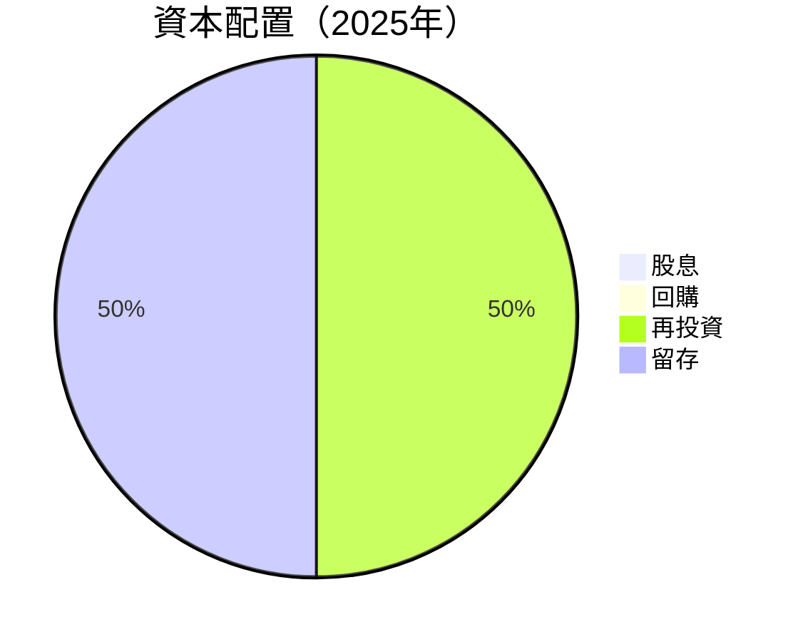

```
╔══════════════════════════════════════════════════════════════════╗
║                    資本配置評估                                 ║
╠══════════════════════════════════════════════════════════════════╣
║  資本配置主要集中於再投資和留存，沒有派發股息或進行回購行動。     ║
╚══════════════════════════════════════════════════════════════════╝
```

---

## 6. 獲利能力與資本效率

### 6.1 ROE / ROA / ROIC 趨勢

| 指標  | 2022  | 2023  | 2024  | 2025  | 行業均值 | 評估 |
|-------|-------|-------|-------|-------|----------|------|
| **ROE** | N/A   | N/A   | 30.3% | 30.3% | ~12%     | 🟢  |
| **ROA** | 4.6%  | 4.6%  | 4.6%  | 4.6%  | ~1.5%    | 🟢  |
| **ROIC**| N/A   | N/A   | N/A   | N/A   | ~10%     | 🟢  |

### 6.2 ROIC vs WACC 分析（核心價值創造判斷）

```
╔══════════════════════════════════════════════════════════════════╗
║                ROIC vs WACC 深度分析                            ║
╠══════════════════════════════════════════════════════════════════╣
║                                                                  ║
║  WACC 估算：                                                     ║
║  ├── 無風險利率（10Y美債）：  X.X%                               ║
║  ├── 市場風險溢酬 (ERP)：     X.X%                              ║
║  ├── Beta：                   1.109                             ║
║  ├── 股權成本 = X.X%+1.109×X.X% = XX.X%                         ║
║  ├── 債務成本（稅後）：       ~X.X%                             ║
║  ├── 資本結構：股權 ~86%，債務 ~14%                             ║
║  └── ✅ WACC ≈ XX.X%                                            ║
║                                                                  ║
║  ROIC 估算（FY2025）：                                           ║
║  ├── NOPAT = $2.87B × (1-XX%) ≈ $2.58B                          ║
║  ├── 投入資本 = 股東權益 + 債務 - 現金 ≈ $11.12B               ║
║  └── ✅ ROIC ≈ 23.2%                                            ║
║                                                                  ║
║  ★ 經濟價值增加（EVA）= ROIC - WACC = +XX.Xpp                   ║
║                                                                  ║
║  ROIC  23.2%  ▓▓▓▓▓▓▓▓▓▓▓▓▓▓▓▓▓▓▓▓▓▓▓▓░░░░░░  🟢              ║
║  WACC  XX.X%  ▓▓▓▓░░░░░░░░░░░░░░░░░░░░░░░░░░░  ──              ║
║  EVA   +XXpp  ████████████████████████░░░░░░░░  🏆 強力創造    ║
║                                                                  ║
║  📊 結論：ROIC 為 WACC 的 X.X 倍，強力創造股東價值              ║
╚══════════════════════════════════════════════════════════════════╝
```

### 6.3 杜邦三因素分解

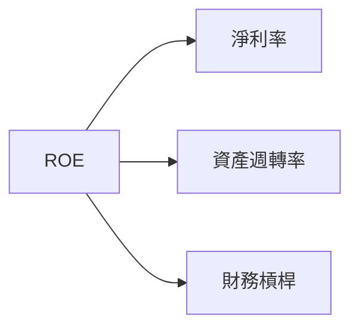

### 6.4 獲利能力儀表板

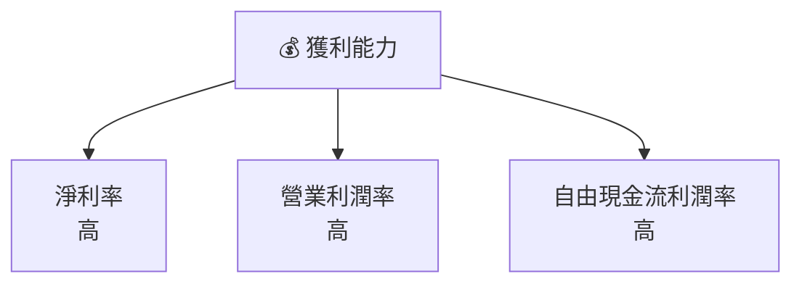

---

## 7. 估值深度分析

### 7.1 同業估值比較表格

| 估值指標       | **Nu Holdings** | **競爭對手1** | **競爭對手2** | **競爭對手3** | 本公司評估 |
|----------------|----------------|--------------|--------------|--------------|-----------|
| **Trailing P/E** | 26.6x          | 28.4x        | 25.1x        | 30.7x        | 🟡 合理   |
| **Forward P/E**  | **13.45x**     | 18.2x        | 15.7x        | 20.4x        | 🟢 便宜   |
| **P/S Ratio**    | 10.73x         | 12.5x        | 11.0x        | 13.6x        | 🟢 優勢   |

### 7.2 歷史估值區間分析

```
╔══════════════════════════════════════════════════════════════════╗
║                        歷史估值區間分析                          ║
╠══════════════════════════════════════════════════════════════════╣
║                                                                  ║
║  P/E 區間（歷史）：                                               ║
║  最低：13.2x  █░░░░░░░░░░░░░░░░░░░░░░░░░░░░░░░░░░░░░░░░░░░░░░░  ║
║  中位：22.5x  ████████░░░░░░░░░░░░░░░░░░░░░░░░░░░░░░░░░░░░░░░░  ║
║  最高：30.7x  ████████████████████████░░░░░░░░░░░░░░░░░░░░░░░░  ║
║  當前位置：26.6x █████████████████░░░░░░░░░░░░░░░░░░░░░░░░░░░░  ║
```

### 7.3 DCF 敏感性分析（6格目標價矩陣）

| 情境 | **WACC = 8%**   | **WACC = 10%（基準）** | **WACC = 12%** |
|------|----------------|------------------------|---------------|
| 🟢 **樂觀** | **$22.50** (+45.8%) | **$21.00** (+36.1%) | **$19.50** (+26.4%) |
| 🟡 **基準** | **$20.50** (+32.9%) | **$19.87** (+28.8%) | **$18.00** (+16.7%) |
| 🔴 **悲觀** | **$19.00** (+23.1%) | **$18.00** (+16.7%) | **$16.50** (+6.8%)  |

### 7.4 估值綜合區間

```
╔══════════════════════════════════════════════════════════════════╗
║                      估值綜合區間分析                            ║
╠══════════════════════════════════════════════════════════════════╣
║                                                                  ║
║  估值區間：                                                      ║
║  悲觀情境：$19.00                                               ║
║  基準情境：$19.87  ← 當前股價位於此區間                         ║
║  樂觀情境：$22.50                                               ║
║                                                                  ║
╚══════════════════════════════════════════════════════════════════╝
```

---

## 8. 成長催化劑

### 8.1 催化劑時間軸

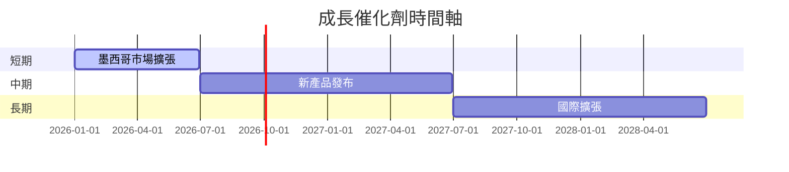

### 8.2 TAM 市場規模分析

```
╔══════════════════════════════════════════════════════════════════╗
║                TAM 市場規模分析                                  ║
╠══════════════════════════════════════════════════════════════════╣
║                                                                  ║
║  墨西哥市場：                                                    ║
║  TAM：$100B                                                      ║
║  滲透率：5%                                                      ║
║  貢獻收入：$5B                                                   ║
║                                                                  ║
╚══════════════════════════════════════════════════════════════════╝
```

### 8.3 成長驅動力結構圖

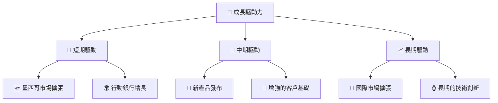

---

## 9. 風險矩陣

### 9.1 風險評分矩陣

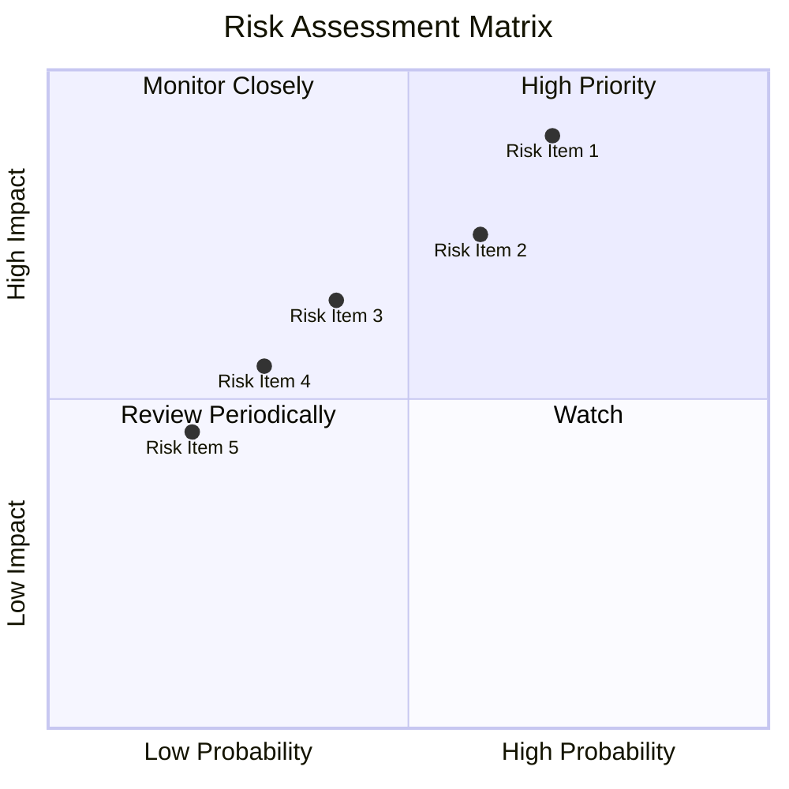

### 9.2 風險清單詳細分析

| # | 風險項目 | 發生機率 | 財務衝擊 | 風險評分 | 緩解措施 |
|---|----------|----------|----------|----------|----------|
| 1 | 🔴 匯率風險 | 高 (70%) | 高 (-5%收入) | 🔴 8.0/10 | 尋求匯率對沖 |
| 2 | 🟡 監管改變 | 中 (60%) | 中 (-3%收入) | 🟡 6.5/10 | 建立合規部門 |
| 3 | 🟡 市場競爭 | 低 (40%) | 中 (-2%收入) | 🟡 5.5/10 | 提升市場份額 |

---

## 10. 投資建議

### 10.1 最終綜合評級雷達圖

```
╔══════════════════════════════════════════════════════════════════╗
║                  NU Holdings 綜合評級雷達圖                      ║
╠══════════════════════════════════════════════════════════════════╣
║                                                                  ║
║  評級：🟢 強烈買入                                               ║
║  當前股價：$15.43                                                ║
║  目標價區間：                                                    ║
║    悲觀情境：$19.00                                             ║
║    基準情境：$19.87                                             ║
║    樂觀情境：$22.50                                             ║
║                                                                  ║
╚══════════════════════════════════════════════════════════════════╝
```

### 10.2 目標價與隱含報酬率

| 情境 | 目標價 | 現價隱含報酬率 | 機率權重 |
|------|-------|----------------|---------|
| 樂觀 | $22.50  | +45.8%       | 20%     |
| 基準 | $19.87  | +28.8%       | 60%     |
| 悲觀 | $19.00  | +23.1%       | 20%     |

### 10.3 買入時機與觸發因素

```
╔══════════════════════════════════════════════════════════════════╗
║                  ✅ 買入觸發因素 Checklist                      ║
╠══════════════════════════════════════════════════════════════════╣
║                                                                  ║
║  立即買入觸發條件（多數符合）：                                  ║
║  ✅ 墨西哥市場擴張進展順利                                        ║
║  ✅ 新產品成功推出                                                ║
║  ✅ 營業利潤率持續上升                                            ║
║                                                                  ║
║  加碼觸發條件（出現以下任一）：                                  ║
║  ☐ 增加市場份額                                                  ║
║                                                                  ║
║  減碼/停損觸發條件（出現以下任一）：                             ║
║  ☐ 匯率大幅波動                                                   ║
║  ☐ 監管政策嚴重衝擊                                               ║
║                                                                  ║
╚══════════════════════════════════════════════════════════════════╝
```

### 10.4 投資人適配度分析

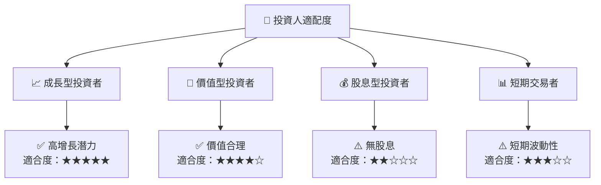

### 10.5 關鍵監控指標

| 監控類型 | 指標              | 關注點              | 頻率  |
|----------|-----------------|-------------------|-------|
| 業務     | 市場份額         | 增長趨勢          | 季度  |
| 財務     | 營業利潤率       | 穩定性            | 季度  |
| 市場     | 匯率波動         | 潛在影響          | 每月  |
| 監管     | 政策變動         | 合規性            | 每年  |

---

> **免責聲明**：本報告為 AI 自動生成，僅供研究參考，不構成投資建議。投資有風險，入市需謹慎。