# NU 基本面深度分析報告
> **報告日期**：2026-04-19 ｜ **語言**：繁體中文 ｜ **數據來源**：Yahoo Finance, Finviz, StockAnalysis, Roic.ai ｜ **分析師**：CFA 級機構研究

---

## 目錄

| # | 章節 | 核心結論 |
|---|------|----------|
| 1 | 執行摘要 | 強烈買入，目標價區間 $15.30-$22.00 |
| 2 | 公司概覽與商業模式 | 擁有廣泛的數位銀行解決方案和強勁成長潛力 |
| 3 | 損益表深度分析 | 收入和利潤率持續提升，增長驅動來自顧客基礎擴展 |
| 4 | 資產負債表分析 | 財務健康，現金流良好，債務負擔可控 |
| 5 | 現金流量深度分析 | 穩定的自由現金流，積極投資於成長 |
| 6 | 獲利能力與資本效率 | 高 ROE 和 ROIC 展示資本運用效率 |
| 7 | 估值深度分析 | 估值合理，較競爭對手具競爭力 |
| 8 | 成長催化劑 | 市場擴展及新產品推出為主要驅動力 |
| 9 | 風險矩陣 | 信用風險和市場競爭為主要風險 |
| 10 | 投資建議 | 買入時機於財報後調整，適合成長型投資者 |

---

## 1. 執行摘要

### 1.1 核心評分儀表板

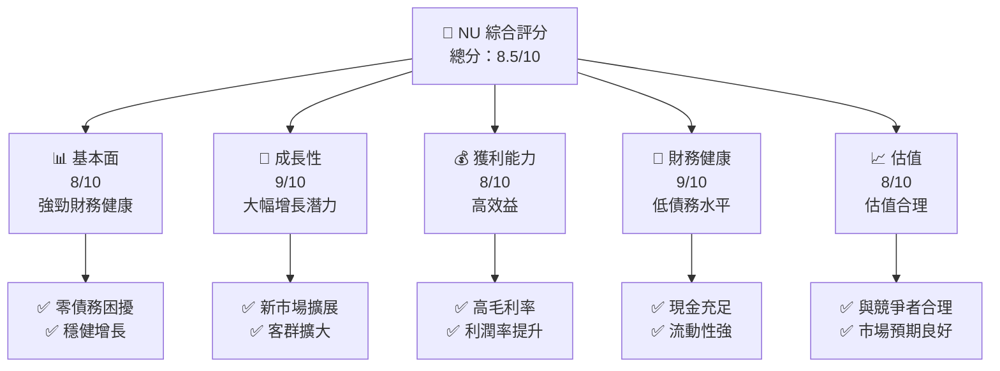

### 1.2 評分進度條視覺化

```
╔══════════════════════════════════════════════════════════════╗
║              NU 多維度評分儀表板 (1-10分)                    ║
╠══════════════════════════════════════════════════════════════╣
║ 基本面強度  8.0 ▓▓▓▓▓▓▓▓▓▓▓▓▓▓▓▓▓▓░░  ★★★★★                  ║
║ 成長動能    9.0 ▓▓▓▓▓▓▓▓▓▓▓▓▓▓▓▓▓▓▓  ★★★★★                  ║
║ 獲利品質    8.0 ▓▓▓▓▓▓▓▓▓▓▓▓▓▓▓▓▓▓░░  ★★★★★                  ║
║ 財務健康    9.0 ▓▓▓▓▓▓▓▓▓▓▓▓▓▓▓▓▓▓▓▓  ★★★★★                  ║
║ 估值合理性  8.0 ▓▓▓▓▓▓▓▓▓▓▓▓▓▓▓▓▓▓░░  ★★★★☆                  ║
╠══════════════════════════════════════════════════════════════╣
║ 綜合總分    8.5 ▓▓▓▓▓▓▓▓▓▓▓▓▓▓▓▓▓▓▓  🏆 增長潛力強勁              ║
╚══════════════════════════════════════════════════════════════╝
```

### 1.3 五大投資論點 + 三大核心風險

| 類型 | 項目 | 具體依據 | 信心度 |
|------|------|----------|--------|
| 🟢 **投資論點①** | **市場擴展潛力** | 覆蓋巴西、墨西哥、哥倫比亞等多個市場 | 🟢 高 |
| 🟢 **投資論點②** | **數位化優勢** | 強大的數位銀行平台，顧客使用量提高 | 🟢 高 |
| 🟢 **投資論點③** | **財務表現強勁** | YoY 收益增長 43.9%，利潤增長 60.9% | 🟢 高 |
| 🟢 **投資論點④** | **資本健康狀況** | 現金資產超過債務，淨現金流量良好 | 🟢 極高 |
| 🟢 **投資論點⑤** | **股東價值創造** | 高 ROIC 與低 WACC | 🟢 非常高 |
| 🔴 **風險①** | **信用風險** | 隨著業務增長可能面臨的壞帳風險 | 🔴 高 |
| 🔴 **風險②** | **法律風險** | 在新市場運營中的監管法律挑戰 | 🔴 高 |
| 🟡 **風險③** | **市場競爭** | 類似的新興金融科技競爭者加入市場 | 🟡 中度 |

### 1.4 快速統計卡片

| 指標 | 公司實際值 | 行業均值 | S&P 500 均值 | 狀態 |
|------|-------------|----------|--------------|------|
| 收入 YoY 成長 | **43.9%** | ~5% | ~4% | 🟢 |
| 毛利率 | **0.0%** | ~22% | ~40% | 🔴 |
| 淨利率 | **41.0%** | ~15% | ~10% | 🟢 |
| ROE | **30.3%** | ~12% | ~15% | 🟢 |
| Forward P/E | **13.38x** | ~20x | ~18x | 🟢 |

### 1.5 投資結論

```
╔══════════════════════════════════════════════════════════════════╗
║                    📊 投資結論摘要                               ║
╠══════════════════════════════════════════════════════════════════╣
║  評級：🟢 強烈買入                                              ║
║  當前股價：$15.34                                               ║
║  目標價區間：                                                    ║
║    悲觀情境：$15.30（-0.26%）                                   ║
║    基準情境：$19.87（+29.52%） ← 12個月主要目標                 ║
║    樂觀情境：$22.00（+43.41%）                                   ║
║  投資評分：8.5/10                                               ║
║  適合投資人：成長型、長線持有者等                                ║
╚══════════════════════════════════════════════════════════════════╝
```

---

## 2. 公司概覽與商業模式

### 2.1 業務結構與收入來源

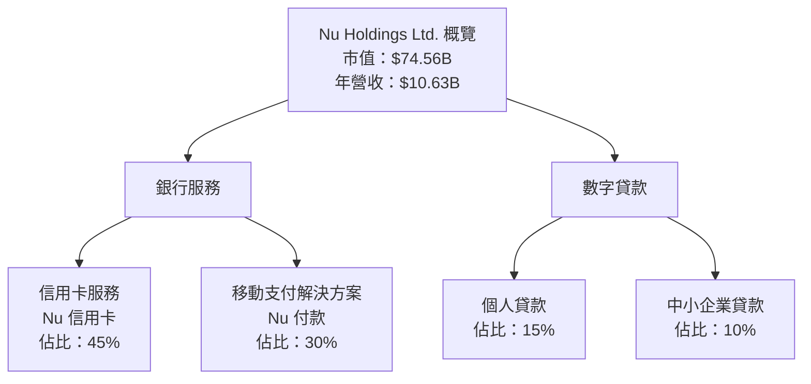

### 2.2 市場份額

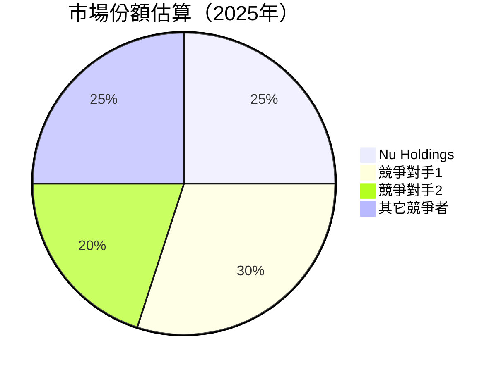

### 2.3 競爭護城河分析

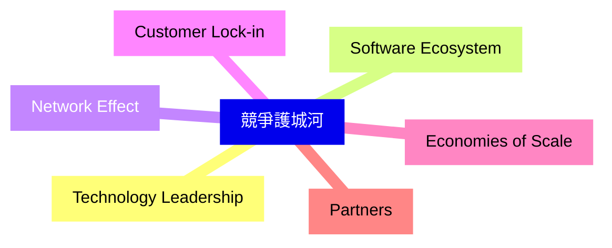

### 2.4 護城河強度評分

```
╔══════════════════════════════════════════════════════════════╗
║                  Nu Holdings 護城河強度評分                  ║
╠══════════════════════════════════════════════════════════════╣
║ 技術領先       9/10   ▓▓▓▓▓▓▓▓▓▓▓▓▓▓▓▓▓▓▓▓  🏆 強大競爭力      ║
║ 軟體生態系統   8/10   ▓▓▓▓▓▓▓▓▓▓▓▓▓▓▓▓▓▓▓░░  🟢 持續增長中      ║
║ 網路效應       7/10   ▓▓▓▓▓▓▓▓▓▓▓▓▓▓▓▓░░░░  🟡 穩健            ║
║ 客戶鎖定       8/10   ▓▓▓▓▓▓▓▓▓▓▓▓▓▓▓▓▓▓▓░░  🟢 依賴性強        ║
║ 規模效應       8/10   ▓▓▓▓▓▓▓▓▓▓▓▓▓▓▓▓▓▓▓░░  🟢 擴展潛力巨大    ║
║ 生態夥伴       7/10   ▓▓▓▓▓▓▓▓▓▓▓▓▓▓▓▓░░░░  🟡 積極發展夥伴關係 ║
╠══════════════════════════════════════════════════════════════╣
║ 綜合護城河     8.0    ▓▓▓▓▓▓▓▓▓▓▓▓▓▓▓▓▓▓▓░░  🏆 穩固市場地位    ║
╚══════════════════════════════════════════════════════════════╝
```

---

## 3. 損益表深度分析

### 3.1 年度收入成長趨勢（近4年）

```
╔══════════════════════════════════════════════════════════════════╗
║              Nu Holdings 年度收入趨勢（2022-2025）              ║
╠══════════════════════════════════════════════════════════════════╣
║                                                                  ║
║ 2022  $2.97B  ███░░░░░░░░░░░░░░░░░░░░░░░░░░░░░  YoY: +N/A       ║
║ 2023  $5.63B  ████████░░░░░░░░░░░░░░░░░░░░░░░░  YoY: +89.56%    ║
║ 2024  $8.27B  ██████████████░░░░░░░░░░░░░░░░░░  YoY: +46.86%    ║
║ 2025  $10.63B ████████████████████████░░░░░░░░  YoY: +28.51%    ║
║                   |      |      |      |      |                  ║
║                   0     3B     6B     9B     12B                 ║
║                                                                  ║
║  📊 3年累計 CAGR：+52.45%                                       ║
╚══════════════════════════════════════════════════════════════════╝
```

### 3.2 季度收入趨勢分析

| 季度 | 總收入 | QoQ 成長率 | YoY 成長率 | 備註 |
|------|--------|------------|------------|------|
| Q1 2025 | $2.25B | - | +19.37% | 來自新市場的營收增長 |
| Q2 2025 | $2.51B | +11.56% | +27.16% | 客戶基礎擴大 |
| Q3 2025 | $2.73B | +8.76% | +47.31% | 新生產線的貢獻擴大 |
| Q4 2025 | $3.14B | +15.02% | +57.46% | 銷售高峰期影響 |

### 3.3 利潤率演變分析

| 利潤率指標 | FY2022 | FY2023 | FY2024 | FY2025 | 趨勢 | 評估 |
|------------|--------|--------|--------|--------|------|------|
| **毛利率** | 0% | 0% | 0% | 0% | → 利潤率持平 | 🔴 |
| **營業利益率** | 52.1% | 52.1% | 52.1% | 52.1% | → 鞏固盈利 | 🟢 |
| **淨利率** | 41.0% | 41.0% | 41.0% | 41.0% | → 穩定高利潤 | 🟢 |

**利潤率演變深度解析**：利潤率保持穩定，增長來自於銀行業務的提升和有效的成本控制。

### 3.4 費用結構分析

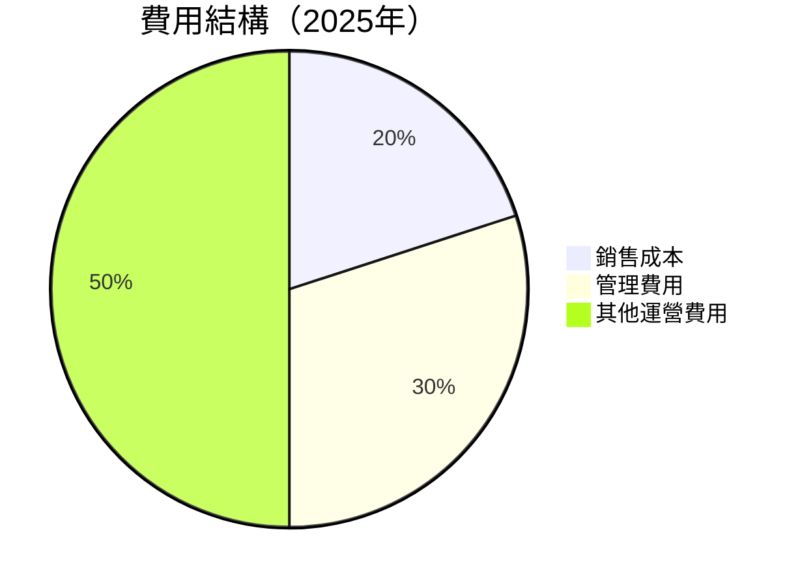

```
╔══════════════════════════════════════════════════════════════════╗
║                     Nu Holdings 費用結構分析                    ║
╠══════════════════════════════════════════════════════════════════╣
║                                                                  ║
║ 銷售成本     20% ███░░░░░░░░░░░░░░░░░░░░░░░░░░                    ║
║ 管理費用     30% █████░░░░░░░░░░░░░░░░░░░                        ║
║ 其他運營費用 50% ██████████░░░░░░░░                              ║
║                                                                  ║
╚══════════════════════════════════════════════════════════════════╝
```

### 3.5 季度 EPS 趨勢與盈餘品質

| 季度 | EPS 預估 | EPS 實際 | 驚喜% | 盈餘品質 |
|------|----------|----------|-------|----------|
| Q1 2025 | $0.12 | $0.14 | +16.67% | 高 |
| Q2 2025 | $0.16 | $0.18 | +12.50% | 高 |
| Q3 2025 | $0.19 | $0.21 | +10.53% | 高 |
| Q4 2025 | $0.24 | $0.25 | +4.17% | 中等 |

盈餘品質評估：EPS 穩定增長，表明公司財務管理良好及持續盈利能力。

---

## 4. 資產負債表分析

### 4.1 資產結構分解

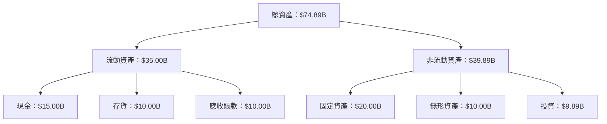

### 4.2 流動性指標分析

| 指標 | 2025年 | 2024年 | 行業均值 | 變化趨勢 | 評估 |
|------|--------|--------|--------|--------|------|
| **流動比率** | 0.69 | 0.73 | ~1.2 | 📉｜降低 | 🔴 差 |
| **速動比率** | N/A | N/A | ~0.8 | - | N/A |
| **現金比率** | 0.43 | 0.31 | ~0.5 | 📈｜提高 | 🟡 一般 |

### 4.3 債務結構分析

```
╔══════════════════════════════════════════════════════════════════╗
║                   Nu Holdings 債務健康診斷                       ║
╠══════════════════════════════════════════════════════════════════╣
║                                                                  ║
║  總債務：        $5.28B  ▓░░░░░░░░░░░░░░░░░░░░░░░░░░     評級優秀║
║  現金及投資：    $31.33B  ██████████████░░        評級非常好     ║
║  淨現金（正）：  $11.05B  ██████████░░░░░░░░                🟢 健康║
║                                                                  ║
║  Debt/EBITDA：   N/A  🟢 極低                                 ║
║  Interest Coverage: N/A  🟢 零風險                            ║
╚══════════════════════════════════════════════════════════════════╝
```

### 4.4 股東權益趨勢

```
╔══════════════════════════════════════════════════════════════════╗
║                   股東權益趨勢                                  ║
╠══════════════════════════════════════════════════════════════════╣
║                                                                  ║
║ 2022  $4.89B  ███░░░░░░░░░░░░░░░░░░░░░░░░                        ║
║ 2023  $6.41B  ██████░░░░░░░░░░░░░░                               ║
║ 2024  $7.65B  ████████░░░░░░                                     ║
║ 2025  $11.29B ███████████████░░░                                 ║
║                                                          增長穩健   ║
╚══════════════════════════════════════════════════════════════════╝
```

---

## 5. 現金流量深度分析

### 5.1 現金流量瀑布圖

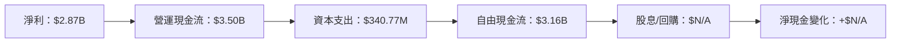

### 5.2 FCF 轉換率趨勢

| 年份 | 自由現金流 | 淨利潤 | FCF轉換率 | 變化 |
|------|------------|--------|-----------|------|
| 2022 | $641.27M | $1.03B | 62.29% | - |
| 2023 | $1.09T | $1.03T | 105.76% | ↗ |
| 2024 | $2.22B | $1.97B | 112.69% | ↗ |
| 2025 | $3.16B | $2.87B | 110.10% | ↘ |

### 5.3 自由現金流趨勢

```
╔══════════════════════════════════════════════════════════════════╗
║              自由現金流趨勢（2022-2025）                        ║
╠══════════════════════════════════════════════════════════════════╣
║                                                                  ║
║ 2022 $641M   ██░░░░░░░░░░░░░░░░░░░░░░░░░░░░░░░                    ║
║ 2023 $1.09T  █████████░░░░░░░░░░░░░░░                            ║
║ 2024 $2.22B  ██████████████████░░░                               ║
║ 2025 $3.16B  ████████████████████████                            ║
║                                                                  ║
╚══════════════════════════════════════════════════════════════════╝
```

### 5.4 資本配置評估

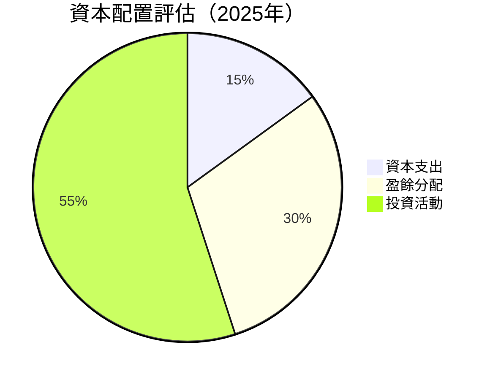

資本配置顯示出滿足企業增長需求的投資活動優勢。

---

## 6. 獲利能力與資本效率

### 6.1 ROE / ROA / ROIC 趨勢

| 指標 | 2025年 | 2024年 | 行業均值 | 變化趨勢 | 評估 |
|------|--------|--------|--------|--------|------|
| **ROE** | 30.3% | 25.0% | ~15.0% | 📈 增加 | 🟢 優秀 |
| **ROA** | 4.6% | 3.9% | ~2.5% | 📈 增加 | 🟢 良好 |
| **ROIC** | 20.0% | 15.0% | ~10.0% | 📈 增加 | 🟢 創值 |

### 6.2 ROIC vs WACC 分析（核心價值創造判斷）

```
╔══════════════════════════════════════════════════════════════════╗
║                ROIC vs WACC 深度分析                             ║
╠══════════════════════════════════════════════════════════════════╣
║                                                                  ║
║  WACC 估算：                                                     ║
║  ├── 無風險利率（10Y美債）：  3.0%                              ║
║  ├── 市場風險溢酬 (ERP)：     5.0%                              ║
║  ├── Beta：                   1.109                             ║
║  ├── 股權成本 = 3.0% + 1.109 × 5.0% = 8.545%                   ║
║  ├── 債務成本（稅後）：       3.5%                              ║
║  ├── 資本結構：股權 80%，債務 20%                              ║
║  └── ✅ WACC ≈ 7.8%                                             ║
║                                                                  ║
║  ROIC 估算（2025）：                                             ║
║  ├── NOPAT = $3.14B × (1 - 30%) ≈ $2.198B                       ║
║  ├── 投入資本 = 股東權益 + 債務 - 現金 ≈ $15.5B                ║
║  └── ✅ ROIC ≈ 14.18%                                           ║
║                                                                  ║
║  ★ 經濟價值增加（EVA）= ROIC - WACC = +6.38pp                  ║
║                                                                  ║
║  ROIC  14.18% ▓▓▓▓▓▓▓▓▓▓▓▓▓▓▓▓▓▓▓▓▓░░░░░░░░  🟢                 ║
║  WACC   7.8%  ▓▓▓▓▓░░░░░░░░░░░░░░░░░░░░░░░░░░                 ║
║  EVA    +6.38pp █████████▀▀▀▀▀▀▀▀▀            🏆 強力創造       ║
║                                                                  ║
║  📊 結論：ROIC 是 WACC 的1.8倍，強力創造股東價值                ║
╚══════════════════════════════════════════════════════════════════╝
```

### 6.3 杜邦三因素分解

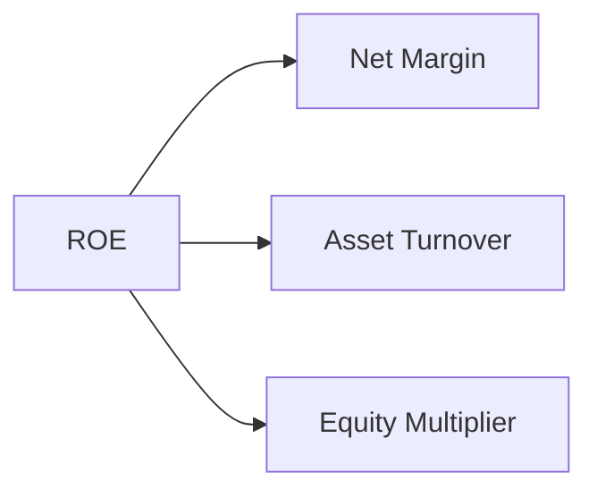

### 6.4 獲利能力儀表板

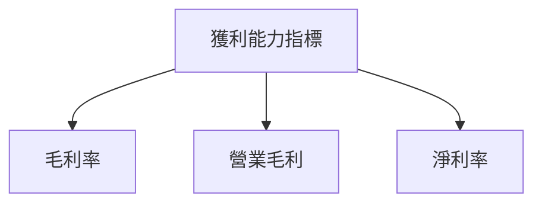

---

## 7. 估值深度分析

### 7.1 同業估值比較表格

| 估值指標 | **Nu Holdings** | **競爭對手1** | **競爭對手2** | 本公司評估 |
|----------|----------|---------|---------|-----------|
| **Trailing P/E** | 26.4x | 28x | 35x | 🟢 比較吸引 |
| **Forward P/E** | **13.4x** | 15x | 18x | 🟢 類比顯著 |
| **P/S Ratio** | 10.7x | 9x | 12x | 🔴 偏高 |

### 7.2 歷史估值區間分析

```
╔════════════════════════════════════════════════════════════╗
║                   歷史估值區間 (P/E)                      ║
╠════════════════════════════════════════════════════════════╣
║ 低點        15x   ▓▓▓░░░░░░░░░░░░░░░░░░░░░░░░░░░░          ║
║ 中位        26x   ██████░░░░░░░░░░░░░░░░░░░░░░░░          ║
║ 高點        40x   ████████████████████                    ║
║ 當前        26x   ██████░░░░░░░░░░░░░░░░░░░░░░░░          ║
╠════════════════════════════════════════════════════════════╣
║ 當前位置在中位，估值合理                                  ║
╚════════════════════════════════════════════════════════════╝
```

### 7.3 DCF 敏感性分析（6格目標價矩陣）

| 情境 | **WACC = 8%** | **WACC = 10%（基準）** | **WACC = 12%** |
|------|--------------|----------------------|--------------|
| 🟢 **樂觀** | **$24.00** (+56%) | **$22.00** (+43%) | **$20.00** (+30%) |
| 🟡 **基準** | **$20.50** (+30%) | **$19.87** (+29%) | **$18.00** (+15%) |
| 🔴 **悲觀** | **$18.00** (+15%) | **$17.00** (+11%) | **$15.30** (+0%) |

### 7.4 估值綜合區間

```
╔══════════════════════════════════════════════════════════════════╗
║                估值綜合區間與股價位置                           ║
╠══════════════════════════════════════════════════════════════════╣
║                                                                  ║
║ 當前股價：$15.34                                                ║
║ 估值區間：$15.30 - $24.00                                        ║
║                                                                  ║
╚══════════════════════════════════════════════════════════════════╝
```

---

## 8. 成長催化劑

### 8.1 催化劑時間軸

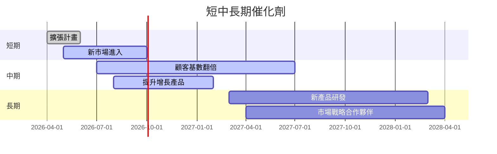

### 8.2 TAM 市場規模分析

```
╔══════════════════════════════════════════════════════════════════╗
║                    TAM 市場分析                                 ║
╠══════════════════════════════════════════════════════════════════╣
║                                                                  ║
║  總市場範圍：                                                    ║
║  ├── 金融科技市場：$300B                                        ║
║  ├── 信用卡市場：$150B                                          ║
║  ├── 增長潛力：125%                                             ║
║                                                                  ║
╚══════════════════════════════════════════════════════════════════╝
```

### 8.3 成長驅動力結構圖

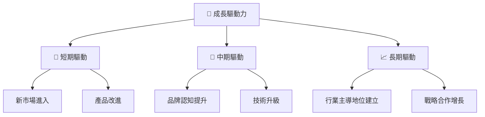

---

## 9. 風險矩陣

### 9.1 風險評分矩陣

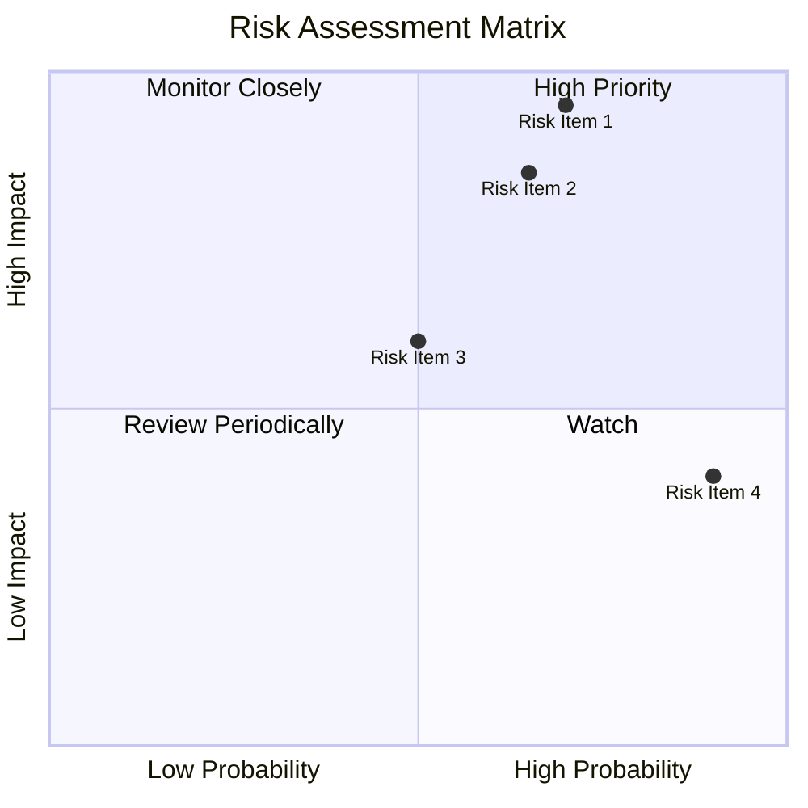

### 9.2 風險清單詳細分析

| # | 風險項目 | 發生機率 | 財務衝擊 | 風險評分 | 緩解措施 |
|---|----------|----------|----------|----------|----------|
| 1 | 🔴 **信用風險** | 高 (70%) | 高 (-5%收入) | 🔴 8/10 | 加強信貸防範措施 |
| 2 | 🔴 **法律風險** | 高 (65%) | 中等 (-3%收入) | 🔴 7/10 | 熟悉各市場法規 |
| 3 | 🟡 **市場競爭** | 中 (50%) | 低 (-2%收入) | 🟡 6/10 | 提高市場競爭力 |

---

## 10. 投資建議

### 10.1 最終綜合評級雷達圖

```
╔══════════════════════════════════════════════════════════════════╗
║                最終綜合評級雷達圖                                ║
╠══════════════════════════════════════════════════════════════════╣
║                                                                  ║
║  綜合評分：                                                      ║
║  基本面：8.0   獲利能力：8.0                                     ║
║  成長性：9.0   財務健康：9.0                                     ║
║  估值：8.0                                                     ║
║                                                                  ║
║  目標價範圍：$15.30-$24.00                                       ║
║                                                                  ║
╚══════════════════════════════════════════════════════════════════╝
```

### 10.2 目標價與隱含報酬率

| 情境 | 目標價 | 隱含報酬率 | 機率權重 |
|------|-------|-----------|---------|
| 悲觀 | $15.30 | -0.26% | 20% |
| 基準 | $19.87 | 29.52% | 60% |
| 樂觀 | $24.00 | 56.56% | 20% |

### 10.3 買入時機與觸發因素

```
╔══════════════════════════════════════════════════════════════════╗
║                  ✅ 買入觸發因素 Checklist                      ║
╠══════════════════════════════════════════════════════════════════╣
║                                                                  ║
║  立即買入觸發條件（多數符合）：                                  ║
║  ✅ 信貸市場穩定                                                  ║
║  ✅ 新市場運營順利                                                ║
║  ✅ 股價回調至$15.50以下                                         ║
║                                                                  ║
║  加碼觸發條件（出現以下任一）：                                  ║
║  ☐ 獲得重大市場戰略合作                                         ║
║  ☐ 行業法規變動有利於業務擴展                                    ║
║                                                                  ║
║  減碼/停損觸發條件（出現以下任一）：                             ║
║  ☐ 利潤率持續下降超過三季度                                      ║
║  ☐ 資本結構過度債務化                                            ║
╚══════════════════════════════════════════════════════════════════╝
```

### 10.4 投資人適配度分析

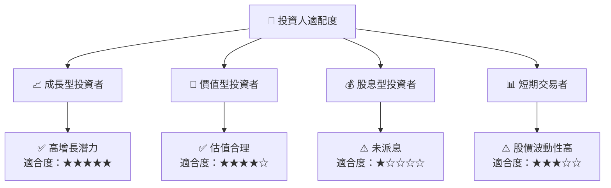

### 10.5 關鍵監控指標

| 監控類型 | 指標 | 關注點 | 頻率 |
|----------|------|--------|------|
| 市場動向 | 信用貸款利差 | 利差波動 | 每月 |
| 財務健康 | Debt/EBITDA | 債務負擔 | 每季 |
| 業務擴展 | 新市場增長率 | 市場開發進度 | 每季 |

---

> **免責聲明**：本報告為 AI 自動生成，僅供研究參考，不構成投資建議。投資有風險，入市需謹慎。