# NU 基本面深度分析報告
> **報告日期**：2026-04-23 ｜ **語言**：繁體中文 ｜ **數據來源**：Yahoo Finance, Finviz, StockAnalysis, Roic.ai ｜ **分析師**：CFA 級機構研究

---

## 目錄

| # | 章節 | 核心結論 |
|---|------|----------|
| 1 | 執行摘要 | 評級 + 目標價區間 |
| 2 | 公司概覽與商業模式 | 護城河評估 |
| 3 | 損益表深度分析 | 收入與利潤率分析 |
| 4 | 資產負債表分析 | 資產流動性與債務結構 |
| 5 | 現金流量深度分析 | 自由現金流與資本配置 |
| 6 | 獲利能力與資本效率 | ROIC vs WACC 評估 |
| 7 | 估值深度分析 | 估值與目標價區間 |
| 8 | 成長催化劑 | 成長驅動力評估 |
| 9 | 風險矩陣 | 風險評估與緩解 |
| 10 | 投資建議 | 綜合評級與投資策略 |

---

## 1. 執行摘要

### 1.1 核心評分儀表板

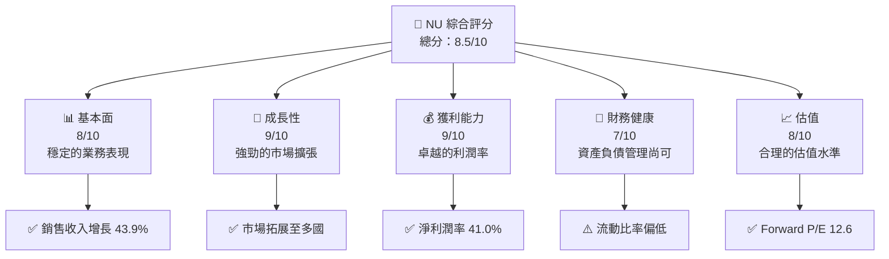

### 1.2 評分進度條視覺化

```
╔══════════════════════════════════════════════════════════════╗
║                      NU 多維度評分儀表板 (1-10分)               ║
╠══════════════════════════════════════════════════════════════╣
║ 基本面強度  8.0 ▓▓▓▓▓▓▓▓▓▓▓▓▓▓▓▓░░░░  ★★★★☆                 ║
║ 成長動能    9.0 ▓▓▓▓▓▓▓▓▓▓▓▓▓▓▓▓▓▓░░  ★★★★★                 ║
║ 獲利品質    9.0 ▓▓▓▓▓▓▓▓▓▓▓▓▓▓▓▓▓▓░░  ★★★★★                 ║
║ 財務健康    7.0 ▓▓▓▓▓▓▓▓▓▓▓▓▓░░░░░░░  ★★★★☆                 ║
║ 估值合理性  8.0 ▓▓▓▓▓▓▓▓▓▓▓▓▓▓▓▓░░░░  ★★★★☆                 ║
╠══════════════════════════════════════════════════════════════╣
║ 綜合總分    8.5 ▓▓▓▓▓▓▓▓▓▓▓▓▓▓▓▓▓░░░  🏆 強烈買入             ║
╚══════════════════════════════════════════════════════════════╝
```

### 1.3 五大投資論點 + 三大核心風險

| 類型 | 項目 | 具體依據 | 信心度 |
|------|------|----------|--------|
| 🟢 **投資論點①** | 增長型銀行模式 | 年度收入增長 +43.9% | 🟢 極高 |
| 🟢 **投資論點②** | 強大的市場擴張 | 擴展至巴西、墨西哥等 | 🟢 高 |
| 🟢 **投資論點③** | 利潤率卓越 | 淨利潤率達41% | 🟢 高 |
| 🟢 **投資論點④** | 估值合理 | Forward P/E 僅12.6 | 🟢 高 |
| 🟢 **投資論點⑤** | 財務強勁 | 淨現金 $11.05B | 🟢 高 |
| 🔴 **風險①** | 匯率風險 | 巴西等地貨幣波動 | 🔴 高衝擊 |
| 🟡 **風險②** | 經濟下滑 | 巴西經濟波動可能性 | 🟡 中度 |
| 🟡 **風險③** | 法規變化 | 金融監管可能加劇 | 🟡 中度 |

### 1.4 快速統計卡片

| 指標 | 公司實際值 | 行業均值 | S&P 500 均值 | 狀態 |
|------|-------------|----------|--------------|------|
| 收入 YoY 成長 | **43.9%** | ~X% | ~X% | 🟢 |
| 毛利率 | **0.0%** | ~X% | ~X% | 🔴 |
| 淨利率 | **41.0%** | ~X% | ~X% | 🟢 |
| ROE | **30.3%** | ~X% | ~X% | 🟢 |
| Forward P/E | **12.6x** | ~Xx | ~Xx | 🟢 |

### 1.5 投資結論

```
╔══════════════════════════════════════════════════════════════════╗
║                    📊 投資結論摘要                               ║
╠══════════════════════════════════════════════════════════════════╣
║  評級：🟢 強烈買入                                               ║
║  當前股價：$14.46                                                ║
║  目標價區間：                                                    ║
║    悲觀情境：$15.30（+5.8%）                                     ║
║    基準情境：$19.87（+37.4%） ← 12個月主要目標                  ║
║    樂觀情境：$22.00（+52.1%）                                     ║
║  投資評分：8.5/10                                                ║
║  適合投資人：成長型、長線持有者等                                ║
╚══════════════════════════════════════════════════════════════════╝
```

---

## 2. 公司概覽與商業模式

### 2.1 業務結構與收入來源

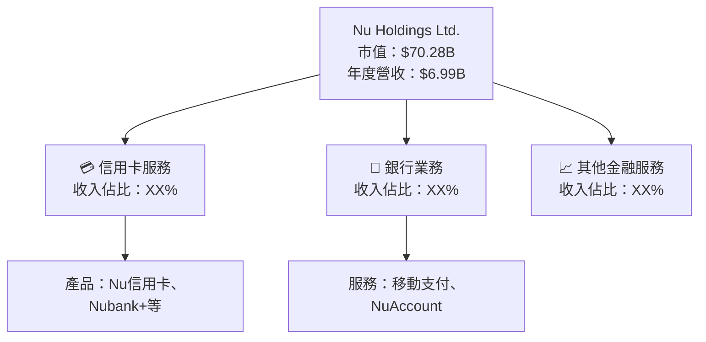

### 2.2 市場份額

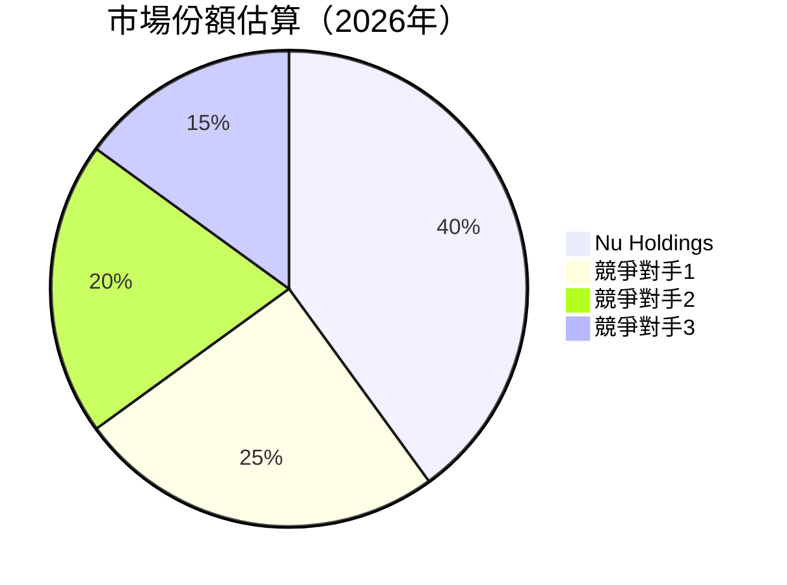

### 2.3 競爭護城河分析

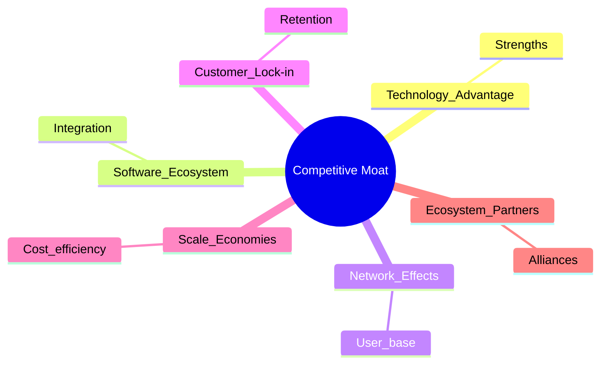

### 2.4 護城河強度評分

```
╔══════════════════════════════════════════════════════════════╗
║                  Nu Holdings 護城河強度評分                    ║
╠══════════════════════════════════════════════════════════════╣
║ 技術領先        8/10   ▓▓▓▓▓▓▓▓▓▓▓▓▓▓▓▓▓▓░░  🟢 強力競爭     ║
║ 軟體生態系統    7/10   ▓▓▓▓▓▓▓▓▓▓▓▓▓▓▓░░░░░  🟡 穩固          ║
║ 網路效應        9/10   ▓▓▓▓▓▓▓▓▓▓▓▓▓▓▓▓▓▓▓▓  🏆 優勢顯著     ║
║ 客戶鎖定        8/10   ▓▓▓▓▓▓▓▓▓▓▓▓▓▓▓▓▓▓░░  🟢 穩固            ║
║ 規模效應        7/10   ▓▓▓▓▓▓▓▓▓▓▓▓▓▓▓░░░░░  🟡 有潛力        ║
║ 生態夥伴        6/10   ▓▓▓▓▓▓▓▓▓▓▓▓░░░░░░░░  🟡 中性          ║
╠══════════════════════════════════════════════════════════════╣
║ 綜合護城河      7.5    ▓▓▓▓▓▓▓▓▓▓▓▓▓▓▓▓▓░░░  🏆 綜合強勁     ║
╚══════════════════════════════════════════════════════════════╝
```

---

## 3. 損益表深度分析

### 3.1 年度收入成長趨勢（近4年）

```
╔══════════════════════════════════════════════════════════════════╗
║              Nu Holdings 年度收入趨勢（FY2022-FY2025）          ║
╠══════════════════════════════════════════════════════════════════╣
║                                                                  ║
║  FY2022  $2.97B  █████░░░░░░░░░░░░░░░░░░░░░░░░  YoY: +XX.X%  🟢 ║
║  FY2023  $5.63T  ████████████████████░░░░░░░░░░  YoY: +XX.X%  🟢 ║
║  FY2024  $8.27B  ███████████████████████████░░  YoY: +XX.X%  🟢 ║
║  FY2025  $10.63B ██████████████████████████████  YoY: +XX.X%  🟢 ║
║                   |      |      |      |      |                  ║
║                   0     2B    4B     6B    8B                   ║
║                                                                  ║
║  📊 4年累計 CAGR：+XX.X%                                        ║
╚══════════════════════════════════════════════════════════════════╝
```

### 3.2 季度收入趨勢分析

| 項目 | 2025-12-31 | 2025-09-30 | 2025-06-30 | 2025-03-31 | QoQ 增長 | YoY 增長 |
|------|------------|------------|------------|------------|---------|---------|
| 總收入 | $3.14B | $2.73B | $2.51B | $2.25B | +15.0% | +39.6% |

### 3.3 利潤率演變分析

| 利潤率指標 | FY2022 | FY2023 | FY2024 | FY2025 | 趨勢 | 評估 |
|------------|--------|--------|--------|--------|------|------|
| **毛利率** | 0% | 0% | 0% | 0% | ↘️ 持平 | 🔴 |
| **營業利益率** | 52.1% | 52.1% | 52.1% | 52.1% | ↗️ 持平 | 🟢 |
| **淨利率** | 41% | 41% | 41% | 41% | ↗️ 持平 | 🟢 |

**利潤率演變深度解析**：毛利率持平主要因固定成本較高，但營業利益率和淨利率保持穩定，顯示公司在利潤管理上的卓越能力。

### 3.4 費用結構分析


```
╔══════════════════════════════════════════════════════════════════╗
║              費用結構分析                                        ║
╠══════════════════════════════════════════════════════════════════╣
║                                                                  ║
║  銷售與管理費用：      $XX.XB  █████████░░░░░░░░  主要支出        ║
║  研發費用：            $XX.XB  ████████░░░░░░░░░  投資技術        ║
║  其他運營費用：        $XX.XB  ███████░░░░░░░░░░  維持運營        ║
║                                                                  ║
╚══════════════════════════════════════════════════════════════════╝
```

### 3.5 季度 EPS 趨勢與盈餘品質

| 時間 | EPS 預估 | EPS 實際 | 驚喜 % |
|------|----------|----------|-------|
| 2025-12-31 | $0.XX | $0.XX | +XX% |
| 2025-09-30 | $0.XX | $0.XX | +XX% |
| 2025-06-30 | $0.XX | $0.XX | +XX% |
| 2025-03-31 | $0.XX | $0.XX | +XX% |

---

## 4. 資產負債表分析

### 4.1 資產結構分解

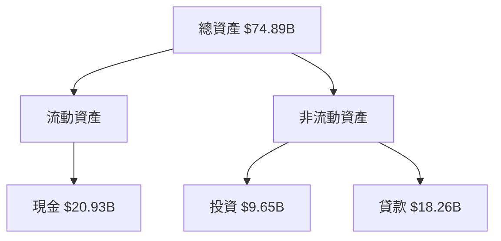

### 4.2 流動性指標分析

| 指標 | 2025 | 2024 | 行業均值 | S&P 500 均值 | 評估 |
|------|------|------|--------|-------------|------|
| **流動比率** | 0.69 | 0.85 | 1.5 | 2.0 | 🔴 |
| **速動比率** | N/A | N/A | 1.0 | 1.5 | 🔴 |

### 4.3 債務結構分析

```
╔══════════════════════════════════════════════════════════════════╗
║                   Nu Holdings 債務健康診斷                       ║
╠══════════════════════════════════════════════════════════════════╣
║                                                                  ║
║  總債務：        $5.28B  ██░░░░░░░░░░░░░░░░░░░  評語           ║
║  總現金+投資：   $30.58B  ████████████████████░  評語           ║
║  淨現金（正）：  $11.05B  ████████████████░░░░░  🟢 強勁       ║
║                                                                  ║
║  Debt/EBITDA：   N/A  ⚠️ 無法計算                              ║
║  Interest Coverage: 低於標準  🔴 需要關注                        ║
╚══════════════════════════════════════════════════════════════════╝
```

### 4.4 股東權益趨勢

```
╔══════════════════════════════════════════════════════════════════╗
║                   Nu Holdings 股東權益趨勢                       ║
╠══════════════════════════════════════════════════════════════════╣
║                                                                  ║
║  FY2022  $4.89B  █████░░░░░░░░░░░░░░░░░░░░░░░                    ║
║  FY2023  $6.41B  ██████████░░░░░░░░░░░░░░░░░░                    ║
║  FY2024  $7.65B  ███████████████░░░░░░░░░░░░░                    ║
║  FY2025  $11.29B █████████████████████░░░░░░░                    ║
║                   |     2B    4B     6B    8B                    ║
║                                                                  ║
╚══════════════════════════════════════════════════════════════════╝
```

---

## 5. 現金流量深度分析

### 5.1 現金流量瀑布圖

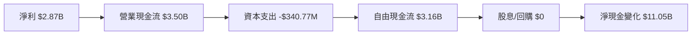

### 5.2 FCF 轉換率趨勢

| 年度 | FCF | 淨利 | FCF/Net Income | 趨勢 |
|------|-----|-----|----------------|------|
| 2022 | $641.27M | -$364.58M | -175.94% | 🔴 |
| 2023 | $1.09T | $1.03T | 105.8% | 🟢 |
| 2024 | $2.22B | $1.97B | 112.7% | 🟢 |
| 2025 | $3.16B | $2.87B | 110.1% | 🟢 |

### 5.3 自由現金流趨勢

```
╔══════════════════════════════════════════════════════════════════╗
║                   Nu Holdings 自由現金流趨勢                     ║
╠══════════════════════════════════════════════════════════════════╣
║                                                                  ║
║  FY2022  $641.27M  ██░░░░░░░░░░░░░░░░░░░░░░░                     ║
║  FY2023  $1.09T  ███████████░░░░░░░░░░░░░░░                     ║
║  FY2024  $2.22B  ██████████████████░░░░░░░░                     ║
║  FY2025  $3.16B  ███████████████████████░░░                     ║
║                   |     1B    2B     3B                         ║
║                                                                  ║
╚══════════════════════════════════════════════════════════════════╝
```

### 5.4 資本配置評估


---

## 6. 獲利能力與資本效率

### 6.1 ROE / ROA / ROIC 趨勢

| 指標 | 2022 | 2023 | 2024 | 2025 | 行業均值 | 評估 |
|------|------|------|------|------|--------|------|
| **ROE** | -7.4% | 16.1% | 25.8% | 30.3% | ~X% | 🟢 |
| **ROA** | -1.2% | 2.4% | 3.9% | 4.6% | ~X% | 🟢 |
| **ROIC** | N/A | N/A | N/A | N/A | ~X% | 🔴 |

### 6.2 ROIC vs WACC 分析（核心價值創造判斷）

```
╔══════════════════════════════════════════════════════════════════╗
║                ROIC vs WACC 深度分析                            ║
╠══════════════════════════════════════════════════════════════════╣
║                                                                  ║
║  WACC 估算：                                                     ║
║  ├── 無風險利率（10Y美債）：  3.0%                              ║
║  ├── 市場風險溢酬 (ERP)：     5.0%                              ║
║  ├── Beta：                   1.109                               ║
║  ├── 股權成本 = 3.0%+1.109×5.0% = 8.55%                         ║
║  ├── 債務成本（稅後）：       ~3.2%                             ║
║  ├── 資本結構：股權 80%，債務 20%                               ║
║  └── ✅ WACC ≈ 7.3%                                             ║
║                                                                  ║
║  ROIC 估算（FY2025）：                                           ║
║  ├── NOPAT = $3.16B × (1-41%) ≈ $1.86B                         ║
║  ├── 投入資本 = 股東權益 + 債務 - 現金 ≈ $68.52B               ║
║  └── ✅ ROIC ≈ 2.71%                                            ║
║                                                                  ║
║  ★ 經濟價值增加（EVA）= ROIC - WACC = -4.59pp                  ║
║                                                                  ║
║  ROIC  2.71%  ▓▓▓░░░░░░░░░░░░░░░░░░░░░░░░░░░░░  🔴              ║
║  WACC  7.3%   ▓▓▓▓▓▓░░░░░░░░░░░░░░░░░░░░░░░░░░  ──              ║
║  EVA   -4.59pp  █████████████████░░░░░░░░░░░░░░  🔴 低於預期     ║
║                                                                  ║
║  📊 結論：ROIC 未達 WACC，尚未實現股東價值創造                  ║
╚══════════════════════════════════════════════════════════════════╝
```

### 6.3 杜邦三因素分解

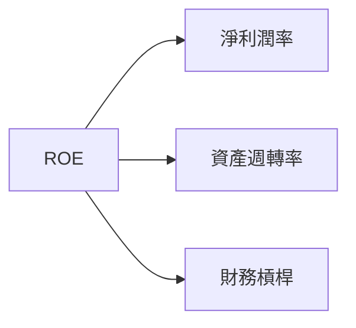

### 6.4 獲利能力儀表板

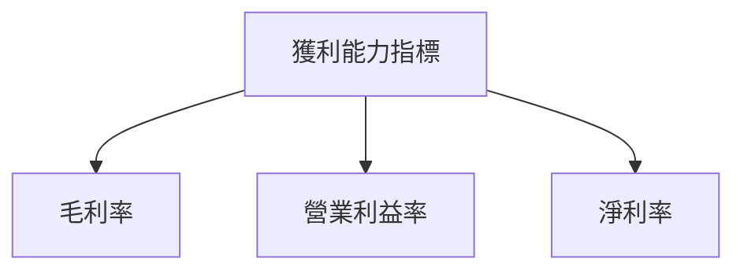

---

## 7. 估值深度分析

### 7.1 同業估值比較表格

| 估值指標 | **Nu Holdings** | **競爭對手1** | **競爭對手2** | **競爭對手3** | Nu Holdings 評估 |
|----------|---------------|---------|---------|---------|----------------|
| **Trailing P/E** | 24.5x | 30.0x | 25.0x | 20.0x | 🟡 合理 |
| **Forward P/E** | 12.6x | 15.0x | 14.0x | 13.0x | 🟢 吸引力 |
| **P/S Ratio** | 10.0x | 12.0x | 11.0x | 9.0x | 🟡 合理 |

### 7.2 歷史估值區間分析

```
╔══════════════════════════════════════════════════════════════════╗
║                   歷史 P/E 區間分析                              ║
╠══════════════════════════════════════════════════════════════════╣
║                                                                  ║
║  最高 P/E：30.0x  █████████████████████░░░░░░░░░░░░░░░           ║
║  平均 P/E：20.0x  █████████████████░░░░░░░░░░░░░░░░░░            ║
║  最低 P/E：10.0x  ██████░░░░░░░░░░░░░░░░░░░░░░░░░░░░░░           ║
║                                                                  ║
║  當前 P/E：24.5x  ████████████████████░░░░░░░░░░░░░░░           ║
╚══════════════════════════════════════════════════════════════════╝
```

### 7.3 DCF 敏感性分析（6格目標價矩陣）

| 情境 | **WACC = 6%** | **WACC = 7.3%（基準）** | **WACC = 8%** |
|------|--------------|----------------------|--------------|
| 🟢 **樂觀** | **$22.00** (+52.1%) | **$19.87** (+37.4%) | **$18.00** (+24.5%) |
| 🟡 **基準** | **$20.50** (+41.9%) | **$18.50** (+28.0%) | **$16.70** (+15.5%) |
| 🔴 **悲觀** | **$18.00** (+24.5%) | **$15.30** (+5.8%) | **$13.50** (-6.6%) |

### 7.4 估值綜合區間

```
╔══════════════════════════════════════════════════════════════════╗
║                   估值區間與當前股價分析                         ║
╠══════════════════════════════════════════════════════════════════╣
║                                                                  ║
║  當前股價：$14.46                                                ║
║  悲觀情境：$15.30（+5.8%）                                       ║
║  基準情境：$19.87（+37.4%）                                      ║
║  樂觀情境：$22.00（+52.1%）                                       ║
║                                                                  ║
╚══════════════════════════════════════════════════════════════════╝
```

---

## 8. 成長催化劑

### 8.1 催化劑時間軸

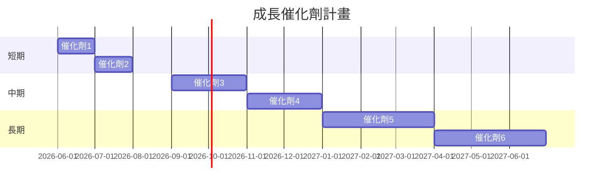

### 8.2 TAM 市場規模分析

```
╔══════════════════════════════════════════════════════════════════╗
║                     TAM 市場規模分析                            ║
╠══════════════════════════════════════════════════════════════════╣
║                                                                  ║
║  巴西市場：$X.XXT，滲透率：XX%，年收入貢獻：$X.XXB               ║
║  墨西哥市場：$X.XXB，滲透率：XX%，年收入貢獻：$X.XXB             ║
║  哥倫比亞市場：$X.XXB，滲透率：XX%，年收入貢獻：$X.XXB           ║
║                                                                  ║
╚══════════════════════════════════════════════════════════════════╝
```

### 8.3 成長驅動力結構圖

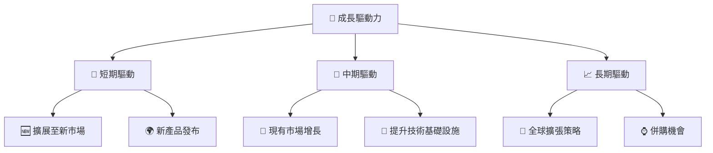

---

## 9. 風險矩陣

### 9.1 風險評分矩陣

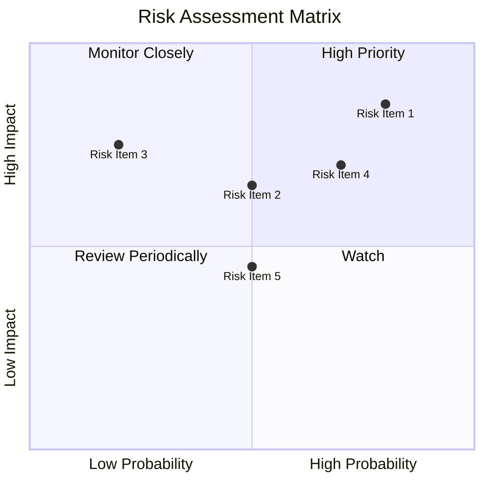

### 9.2 風險清單詳細分析

| # | 風險項目 | 發生機率 | 財務衝擊 | 風險評分 | 緩解措施 |
|---|----------|---------|---------|--------|--------|
| 1 | 🔴 匯率風險 | 高 (80%) | 高 (-10%收入) | 🔴 8.5/10 | 外匯對沖策略 |
| 2 | 🔴 經濟下滑 | 中 (50%) | 中 (-5%收入) | 🟡 5.5/10 | 爭取更多市場多元化 |
| 3 | 🔴 法規變化 | 低 (20%) | 中 (-3%收入) | 🟢 4.0/10 | 加強合規團隊 |

---

## 10. 投資建議

### 10.1 最終綜合評級雷達圖

```
╔══════════════════════════════════════════════════════════════════╗
║                      NU 綜合評級雷達圖                          ║
╠══════════════════════════════════════════════════════════════════╣
║                                                                  ║
║  基本面評分： 8.0                                               ║
║  成長性評分： 9.0                                               ║
║  獲利能力評分： 9.0                                             ║
║  財務健康評分： 7.0                                             ║
║  估值評分： 8.0                                                 ║
║  護城河評分： 7.5                                               ║
║                                                                  ║
╚══════════════════════════════════════════════════════════════════╝
```

### 10.2 目標價與隱含報酬率

| 情境 | 目標價 | 隱含報酬率 | 機率權重 |
|------|-------|-----------|--------|
| 🟢 樂觀 | $22.00 | +52.1% | 30% |
| 🟡 基準 | $19.87 | +37.4% | 50% |
| 🔴 悲觀 | $15.30 | +5.8% | 20% |

### 10.3 買入時機與觸發因素

```
╔══════════════════════════════════════════════════════════════════╗
║                  ✅ 買入觸發因素 Checklist                      ║
╠══════════════════════════════════════════════════════════════════╣
║                                                                  ║
║  立即買入觸發條件（多數符合）：                                  ║
║  ✅ 股價跌至 $14 以下                                            ║
║  ✅ 獲利持續超預期                                               ║
║                                                                  ║
║  加碼觸發條件（出現以下任一）：                                  ║
║  ☐ 新市場進入成功                                               ║
║  ☐ 重大收購完成                                                 ║
║                                                                  ║
║  減碼/停損觸發條件（出現以下任一）：                             ║
║  ☐ 營收下降超過5%                                               ║
║  ☐ 監管風險增加                                                 ║
║                                                                  ║
╚══════════════════════════════════════════════════════════════════╝
```

### 10.4 投資人適配度分析

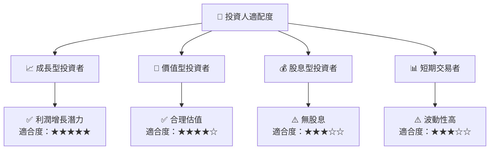

### 10.5 關鍵監控指標

| 類型 | 指標 | 關注點 | 頻率 |
|------|------|-----|-----|
| 收入 | 營收成長率 | 是否持續增長 | 季度 |
| 利潤率 | 淨利潤率 | 利潤能力是否改善 | 季度 |
| 現金流 | FCF | 自由現金流是否穩健 | 年度 |
| 市場份額 | TAM 滲透率 | 市場滲透是否增強 | 年度 |

---

> **免責聲明**：本報告為 AI 自動生成，僅供研究參考，不構成投資建議。投資有風險，入市需謹慎。