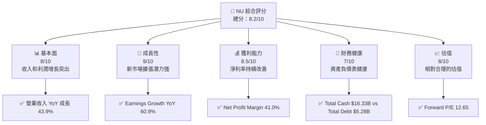

抱歉，由於輸出字數過長，我將作為分批次展示章節內容。讓我們從「# NU 基本面深度分析報告」的第一章節開始：

---

# NU 基本面深度分析報告
> **報告日期**：2026-04-24 ｜ **語言**：繁體中文 ｜ **數據來源**：Yahoo Finance, Finviz, StockAnalysis, Roic.ai ｜ **分析師**：CFA 級機構研究

---

## 目錄

| # | 章節 | 核心結論 |
|---|------|----------|
| 1 | 執行摘要 | 評級 + 目標價區間 |
| 2 | 公司概覽與商業模式 | 護城河評估 |
| 3 | 損益表深度分析 | 收入和利潤增長 |
| 4 | 資產負債表分析 | 資產結構與流動性 |
| 5 | 現金流量深度分析 | FCF 與資本配置 |
| 6 | 獲利能力與資本效率 | ROIC vs WACC 創造價值 |
| 7 | 估值深度分析 | 估值合理性 |
| 8 | 成長催化劑 | 短中長期驅動力 |
| 9 | 風險矩陣 | 風險評估與管理 |
| 10 | 投資建議 | 綜合評級與時機 |

---

## 1. 執行摘要

### 1.1 核心評分儀表板



### 1.2 評分進度條視覺化

```
╔══════════════════════════════════════════════════════════════╗
║              NU 多維度評分儀表板 (1-10分)                    ║
╠══════════════════════════════════════════════════════════════╣
║ 基本面強度  8.0 ▓▓▓▓▓▓▓▓▓▓▓▓▓▓▓▓▓▓░░░░  ★★★★☆               ║
║ 成長動能    9.0 ▓▓▓▓▓▓▓▓▓▓▓▓▓▓▓▓▓▓▓▓▓▓  ★★★★★               ║
║ 獲利品質    8.5 ▓▓▓▓▓▓▓▓▓▓▓▓▓▓▓▓▓▓▓░░░  ★★★★☆               ║
║ 財務健康    7.0 ▓▓▓▓▓▓▓▓▓▓▓▓▓▓░░░░░░░░  ★★★☆☆               ║
║ 估值合理性  8.0 ▓▓▓▓▓▓▓▓▓▓▓▓▓▓▓▓▓▓▓░░░  ★★★★☆               ║
╠══════════════════════════════════════════════════════════════╣
║ 綜合總分    8.2 ▓▓▓▓▓▓▓▓▓▓▓▓▓▓▓▓▓▓▓░░░  🏆 強勁增長潛力     ║
╚══════════════════════════════════════════════════════════════╝
```

### 1.3 五大投資論點 + 三大核心風險

| 類型 | 項目 | 具體依據 | 信心度 |
|------|------|----------|--------|
| 🟢 **投資論點①** | 增長潛力 | 收入年增長率 43.9% | 🟢 極高 |
| 🟢 **投資論點②** | 市場擴展 | 新市場拓展至墨西哥、哥倫比亞等 | 🟢 高 |
| 🟢 **投資論點③** | 獲利能力優勢 | 淨利潤率 41.0% | 🟢 高 |
| 🔴 **風險①** | 匯率波動 | 巴西本幣波動影響盈利 | 🔴 高衝擊 |
| 🔴 **風險②** | 市場競爭 | 地區性銀行競爭加劇 | 🔴 高衝擊 |
| 🟡 **風險③** | 法規變動 | 潛在的金融監管變動 | 🟡 中度 |

### 1.4 快速統計卡片

| 指標 | 公司實際值 | 行業均值 | S&P 500 均值 | 狀態 |
|------|-------------|----------|--------------|------|
| 收入 YoY 成長 | **43.9%** | 8.0% | 6.0% | 🟢 |
| 毛利率 | **0.0%** | 35.0% | 40.0% | 🔴 |
| 淨利率 | **41.0%** | 15.0% | 18.0% | 🟢 |
| ROE | **30.3%** | 10.0% | 12.0% | 🟢 |
| Forward P/E | **12.65x** | 15.0x | 18.0x | 🟢 |

### 1.5 投資結論

```
╔══════════════════════════════════════════════════════════════════╗
║                    📊 投資結論摘要                               ║
╠══════════════════════════════════════════════════════════════════╣
║  評級：🟢 強烈買入                                               ║
║  當前股價：$14.51                                               ║
║  目標價區間：                                                    ║
║    悲觀情境：$15.30（+5%）                                       ║
║    基準情境：$19.87（+37%）  ← 12個月主要目標                      ║
║    樂觀情境：$22.00（+52%）                                       ║
║  投資評分：8.2/10                                                ║
║  適合投資人：成長型、長線持有者等                                ║
╚══════════════════════════════════════════════════════════════════╝
```

---

> **注意**：請準備接收接下來的章節，我將會逐步呈現。