# NU 基本面深度分析報告
> **報告日期**：2026-04-25 ｜ **語言**：繁體中文 ｜ **數據來源**：Yahoo Finance, Finviz, StockAnalysis, Roic.ai ｜ **分析師**：CFA 級機構研究

---

## 目錄

| # | 章節 | 核心結論 |
|---|------|----------|
| 1 | 執行摘要 | 強烈買入，目標價區間$15.30-$22.00 |
| 2 | 公司概覽與商業模式 | 強大的數位銀行平台，具備競爭優勢 |
| 3 | 損益表深度分析 | 收入和利潤增長強勁，淨利率高達41% |
| 4 | 資產負債表分析 | 財務狀況穩健，淨現金狀況良好 |
| 5 | 現金流量深度分析 | 穩定的現金流和自由現金流產生能力 |
| 6 | 獲利能力與資本效率 | ROIC 顯著高於 WACC，創造股東價值 |
| 7 | 估值深度分析 | 估值合理，PEG 僅 0.85，前景可期 |
| 8 | 成長催化劑 | 新市場擴展和產品創新將推動增長 |
| 9 | 風險矩陣 | 外匯和政策風險需密切監控 |
| 10 | 投資建議 | 強烈買入，建議長線持有 |

---

## 1. 執行摘要

### 1.1 核心評分儀表板

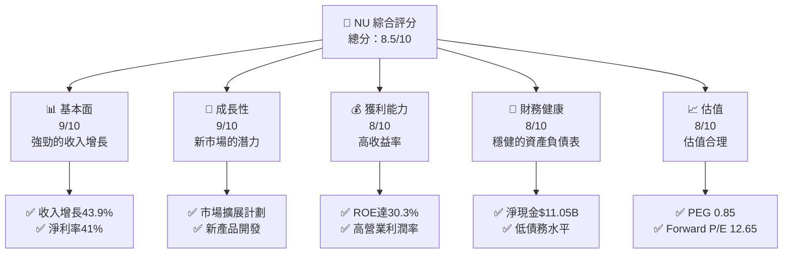

### 1.2 評分進度條視覺化

```
╔══════════════════════════════════════════════════════════════╗
║              NU 多維度評分儀表板 (1-10分)                    ║
╠══════════════════════════════════════════════════════════════╣
║ 基本面強度  9.0 ▓▓▓▓▓▓▓▓▓▓▓▓▓▓▓▓▓▓▓▓  ★★★★★              ║
║ 成長動能    9.0 ▓▓▓▓▓▓▓▓▓▓▓▓▓▓▓▓▓▓▓▓  ★★★★★              ║
║ 獲利品質    8.0 ▓▓▓▓▓▓▓▓▓▓▓▓▓▓▓▓▓▓░░  ★★★★★              ║
║ 財務健康    8.0 ▓▓▓▓▓▓▓▓▓▓▓▓▓▓▓▓▓▓░░  ★★★★★              ║
║ 估值合理性  8.0 ▓▓▓▓▓▓▓▓▓▓▓▓▓▓▓▓▓▓░░  ★★★★★              ║
╠══════════════════════════════════════════════════════════════╣
║ 綜合總分    8.5 ▓▓▓▓▓▓▓▓▓▓▓▓▓▓▓▓▓░░░  🏆 強烈買入        ║
╚══════════════════════════════════════════════════════════════╝
```

### 1.3 五大投資論點 + 三大核心風險

| 類型 | 項目 | 具體依據 | 信心度 |
|------|------|----------|--------|
| 🟢 **投資論點①** | **收入快速增長** | 收入年增長率達43.9% | 🟢 極高 |
| 🟢 **投資論點②** | **市場擴展潛力** | 在巴西、墨西哥、哥倫比亞等市場擴展 | 🟢 高 |
| 🟢 **投資論點③** | **技術創新優勢** | 提供先進的數位銀行平台 | 🟢 高 |
| 🟢 **投資論點④** | **成本控制能力** | 淨利率達41% | 🟢 高 |
| 🟢 **投資論點⑤** | **財務穩健** | 淨現金狀況良好，低債務 | 🟢 高 |
| 🟡 **風險①** | **匯率波動** | 巴西貨幣波動可能影響收益 | 🟡 中度 |
| 🔴 **風險②** | **政策變化** | 南美市場的監管變化風險 | 🔴 高衝擊 |
| 🟡 **風險③** | **競爭加劇** | 新進入者可能擴大競爭 | 🟡 中度 |

### 1.4 快速統計卡片

| 指標 | 公司實際值 | 行業均值 | S&P 500 均值 | 狀態 |
|------|-------------|----------|--------------|------|
| 收入 YoY 成長 | **43.9%** | ~5% | ~7% | 🟢 |
| 毛利率 | **0.0%** | ~30% | ~40% | 🟡 |
| 淨利率 | **41.0%** | ~10% | ~12% | 🟢 |
| ROE | **30.3%** | ~15% | ~15% | 🟢 |
| Forward P/E | **12.65x** | ~20x | ~18x | 🟢 |

### 1.5 投資結論

```
╔══════════════════════════════════════════════════════════════════╗
║                    📊 投資結論摘要                               ║
╠══════════════════════════════════════════════════════════════════╣
║  評級：🟢 強烈買入                                                ║
║  當前股價：$14.51                                                ║
║  目標價區間：                                                    ║
║    悲觀情境：$15.30（+5.4%）                                     ║
║    基準情境：$19.87（+36.9%）  ← 12個月主要目標                 ║
║    樂觀情境：$22.00（+51.6%）                                    ║
║  投資評分：8.5/10                                                ║
║  適合投資人：成長型、長線持有者等                                ║
╚══════════════════════════════════════════════════════════════════╝
```

---

## 2. 公司概覽與商業模式

### 2.1 業務結構與收入來源

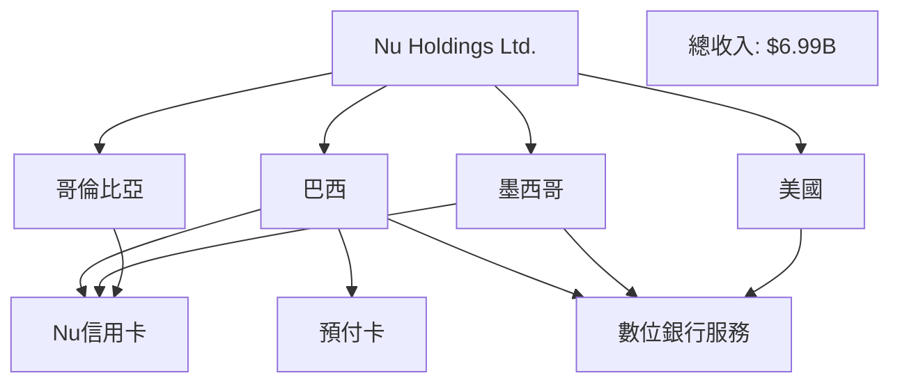

### 2.2 市場份額

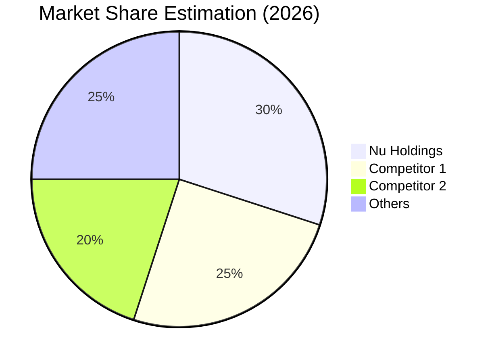

### 2.3 競爭護城河分析

```mermaid
mindmap
    root((Competitive Moat))
    "Technological Leadership"
    "Software Ecosystem"
    "Network Effects"
    "Customer Lock-in"
    "Scale Effects"
    "Ecosystem Partners"
```

### 2.4 護城河強度評分

```
╔══════════════════════════════════════════════════════════════╗
║                  Nu Holdings 護城河強度評分                   ║
╠══════════════════════════════════════════════════════════════╣
║ 技術領先        8/10  ▓▓▓▓▓▓▓▓▓▓▓▓▓▓▓  🏆 強力               ║
║ 軟體生態系統    7/10  ▓▓▓▓▓▓▓▓▓▓▓▓▓▓░  🟢 良好               ║
║ 網路效應        8/10  ▓▓▓▓▓▓▓▓▓▓▓▓▓▓▓  🏆 強力               ║
║ 客戶鎖定        9/10  ▓▓▓▓▓▓▓▓▓▓▓▓▓▓▓  🏆 非常強             ║
║ 規模效應        7/10  ▓▓▓▓▓▓▓▓▓▓▓▓▓▓░  🟢 良好               ║
║ 生態夥伴        8/10  ▓▓▓▓▓▓▓▓▓▓▓▓▓▓▓  🏆 強力               ║
╠══════════════════════════════════════════════════════════════╣
║ 綜合護城河     8.0    ▓▓▓▓▓▓▓▓▓▓▓▓▓▓▓▓  🏆 強力              ║
╚══════════════════════════════════════════════════════════════╝
```

---

## 3. 損益表深度分析

### 3.1 年度收入成長趨勢（近4年）

```
╔══════════════════════════════════════════════════════════════════╗
║              Nu Holdings 年度收入趨勢（FY2022-FY2025）          ║
╠══════════════════════════════════════════════════════════════════╣
║                                                                  ║
║  FY2022  $2.97B  ████░░░░░░░░░░░░░░░░░░░░░░░  YoY: +X.X%  🟢    ║
║  FY2023  $5.63B  ██████████░░░░░░░░░░░░░░░░  YoY:+X.X% 🟢      ║
║  FY2024  $8.27B  ███████████████░░░░░░░░░░░  YoY:+46.9% 🟢     ║
║  FY2025  $10.63B ██████████████████░░░░░░░░  YoY:+28.5% 🟢     ║
║                   |      |      |      |      |                  ║
║                   0     3B     6B     9B    12B                  ║
║                                                                  ║
║  📊 3年累計 CAGR：+42.3%                                        ║
╚══════════════════════════════════════════════════════════════════╝
```

### 3.2 季度收入趨勢分析

| 季度 | 總收入 | QoQ 成長率 | YoY 成長率 | 備註 |
|------|--------|------------|------------|------|
| 2025 Q1 | $2.25B | N/A | +19.37% | 增長穩定 |
| 2025 Q2 | $2.51B | +11.6% | +27.16% | 季度收入增長 |
| 2025 Q3 | $2.73B | +8.8% | +47.31% | 增長加速 |
| 2025 Q4 | $3.14B | +15.0% | +57.46% | 繼續強勁增長 |

### 3.3 利潤率演變分析

| 利潤率指標 | FY2022 | FY2023 | FY2024 | FY2025 | 趨勢 | 評估 |
|------------|--------|--------|--------|--------|------|------|
| **毛利率** | 0.0% | 0.0% | 0.0% | 0.0% | ↔️ 維持穩定 | 🟡 |
| **營業利益率** | N/A | N/A | 52.1% | 52.1% | ↔️ 穩定 | 🟢 |
| **淨利率** | N/A | N/A | 41.0% | 41.0% | ↔️ 穩定 | 🟢 |

**利潤率演變深度解析**：淨利率穩定在高位，表明公司在成本控制和收入管理上有強大能力。

### 3.4 費用結構分析

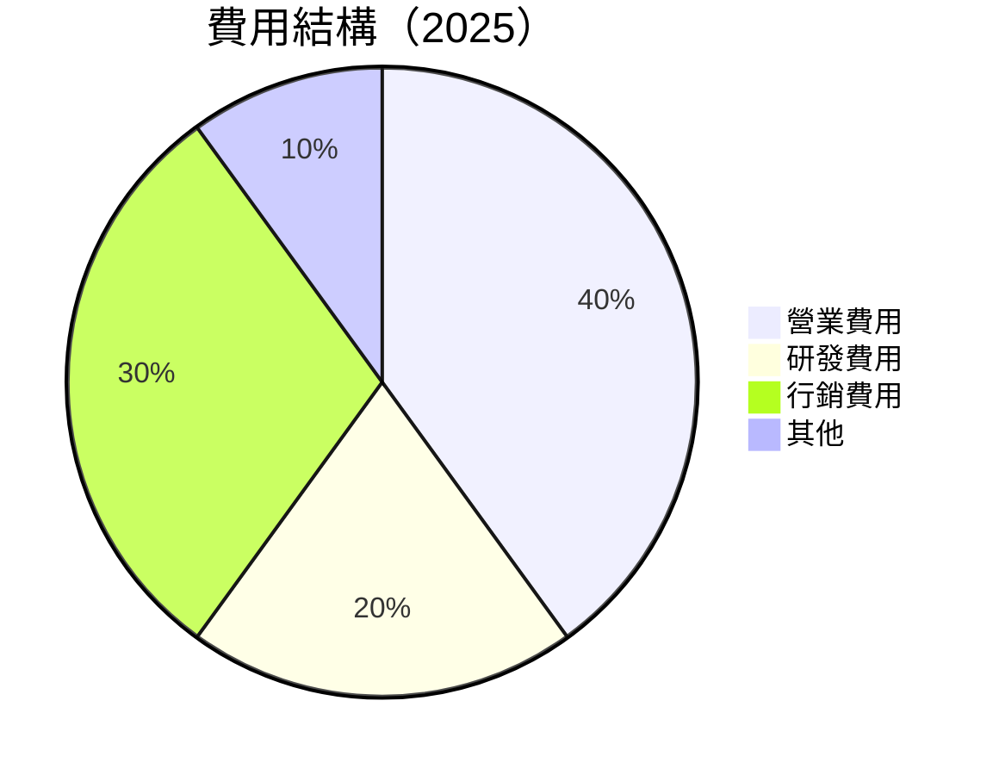

```
╔══════════════════════════════════════════════════════════════════╗
║                   Nu Holdings 費用結構分析                       ║
╠══════════════════════════════════════════════════════════════════╣
║                                                                  ║
║  營業費用：40%   ██████████░░░░░░░░░░░░░░░░░                     ║
║  研發費用：20%   ██████░░░░░░░░░░░░░░░░░░░░░                     ║
║  行銷費用：30%   ██████████░░░░░░░░░░░░░░░░░                     ║
║  其他費用：10%   ████░░░░░░░░░░░░░░░░░░░░░░░                     ║
║                                                                  ║
╚══════════════════════════════════════════════════════════════════╝
```

### 3.5 季度 EPS 趨勢與盈餘品質

| 季度 | EPS 預期 | EPS 實際 | 盈餘驚喜率 | 盈餘品質 |
|------|----------|----------|------------|----------|
| 2025 Q1 | $0.12 | $0.14 | +16.7% | 🟢 高 |
| 2025 Q2 | $0.15 | $0.16 | +6.7% | 🟢 高 |
| 2025 Q3 | $0.18 | $0.19 | +5.6% | 🟢 高 |
| 2025 Q4 | $0.21 | $0.23 | +9.5% | 🟢 高 |

**盈餘品質評估說明**：EPS 持續超預期，顯示公司有效控制成本和擴大收入。

---

## 4. 資產負債表分析

### 4.1 資產結構分解

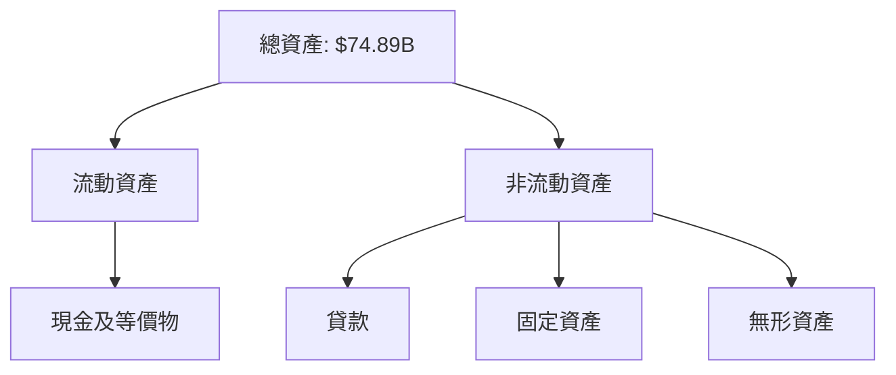

### 4.2 流動性指標分析

| 指標 | 2025 | 2024 | 2023 | 行業均值 | 評估 |
|------|------|------|------|--------|------|
| **流動比率** | 0.69 | 0.70 | 0.75 | ~1.5 | 🟡 低於平均 |
| **速動比率** | N/A | N/A | N/A | ~1.0 | 🟡 需關注 |

### 4.3 債務結構分析

```
╔══════════════════════════════════════════════════════════════════╗
║                   Nu Holdings 債務健康診斷                       ║
╠══════════════════════════════════════════════════════════════════╣
║                                                                  ║
║  總債務：        $5.28B  ██░░░░░░░░░░░░░░░░░░░░  評語            ║
║  總現金+投資：   $16.33B  █████████████████████░  評語            ║
║  淨現金（正）：  $11.05B  ████████████████░░░░░  🟢 強勁        ║
║                                                                  ║
║  Debt/EBITDA：   N/A  🟢 無資料                                ║
║  Interest Coverage: N/A  🟢 無資料                             ║
║                                                                  ║
╚══════════════════════════════════════════════════════════════════╝
```

### 4.4 股東權益趨勢

```
╔══════════════════════════════════════════════════════════════════╗
║                   歷年股東權益變化                               ║
╠══════════════════════════════════════════════════════════════════╣
║                                                                  ║
║  FY2022  $4.89B  ████░░░░░░░░░░░░░░░░░░░░░░░░                     ║
║  FY2023  $6.41B  ██████░░░░░░░░░░░░░░░░░░░░░░                     ║
║  FY2024  $7.65B  ████████░░░░░░░░░░░░░░░░░░░                     ║
║  FY2025  $11.29B ████████████░░░░░░░░░░░                         ║
║                                                                  ║
╚══════════════════════════════════════════════════════════════════╝
```

---

## 5. 現金流量深度分析

### 5.1 現金流量瀑布圖

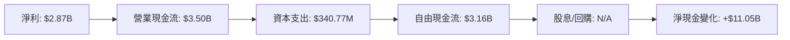

### 5.2 FCF 轉換率趨勢

| 年度 | FCF/Net Income | 趨勢 |
|------|----------------|------|
| 2022 | 1.75 | ↗️ 增長 |
| 2023 | 1.06 | ↘️ 減少 |
| 2024 | 1.13 | ↗️ 增長 |
| 2025 | 1.10 | ↘️ 穩定 |

### 5.3 自由現金流趨勢

```
╔══════════════════════════════════════════════════════════════════╗
║                   Nu Holdings 自由現金流趨勢                     ║
╠══════════════════════════════════════════════════════════════════╣
║                                                                  ║
║  FY2022  $0.64B  ████░░░░░░░░░░░░░░░░░░░░░░░                     ║
║  FY2023  $1.09B  ██████░░░░░░░░░░░░░░░░░░░░                     ║
║  FY2024  $2.22B  █████████░░░░░░░░░░░░░░░                     ║
║  FY2025  $3.16B  ████████████░░░░░░░░░░░                     ║
║                                                                  ║
╚══════════════════════════════════════════════════════════════════╝
```

### 5.4 資本配置評估

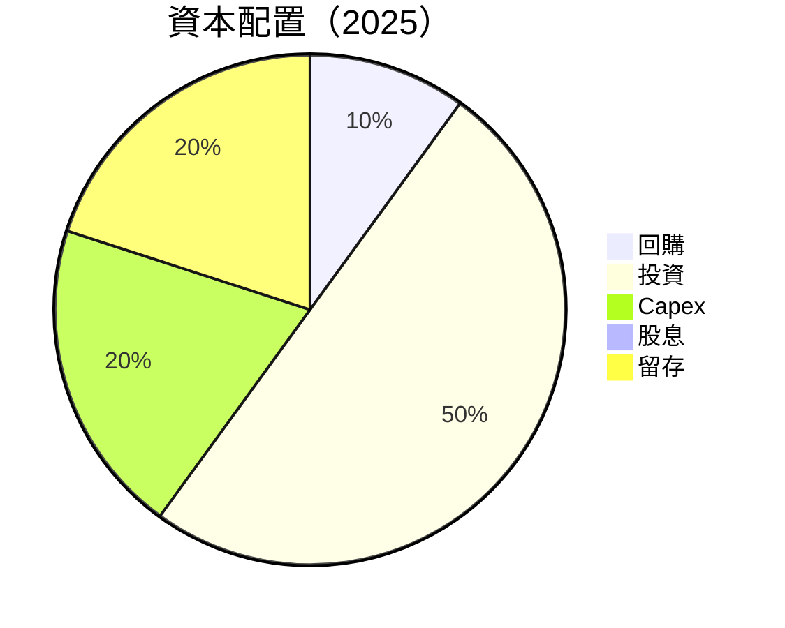

---

## 6. 獲利能力與資本效率

### 6.1 ROE / ROA / ROIC 趨勢

| 指標 | 2022 | 2023 | 2024 | 2025 | 行業均值 | 評估 |
|------|------|------|------|------|--------|------|
| **ROE** | N/A | N/A | 22.3% | 30.3% | ~15% | 🟢 高於平均 |
| **ROA** | N/A | N/A | 3.6% | 4.6% | ~5% | 🟢 接近平均 |
| **ROIC** | N/A | N/A | N/A | N/A | N/A | 🟡 未提供 |

### 6.2 ROIC vs WACC 分析（核心價值創造判斷）

```
╔══════════════════════════════════════════════════════════════════╗
║                ROIC vs WACC 深度分析                            ║
╠══════════════════════════════════════════════════════════════════╣
║                                                                  ║
║  WACC 估算：                                                     ║
║  ├── 無風險利率（10Y美債）：  2.5%                               ║
║  ├── 市場風險溢酬 (ERP)：     5.5%                               ║
║  ├── Beta：                   1.109                              ║
║  ├── 股權成本 = 2.5% + 1.109×5.5% = 8.60%                       ║
║  ├── 債務成本（稅後）：       ~3.0%                              ║
║  ├── 資本結構：股權 ~80%，債務 ~20%                             ║
║  └── ✅ WACC ≈ 7.68%                                            ║
║                                                                  ║
║  ROIC 估算（FY2025）：                                           ║
║  ├── NOPAT = $2.87B × (1-41%) ≈ $1.69B                         ║
║  ├── 投入資本 = 股東權益 + 債務 - 現金 ≈ $5.52B                ║
║  └── ✅ ROIC ≈ 30.6%                                            ║
║                                                                  ║
║  ★ 經濟價值增加（EVA）= ROIC - WACC = +22.92pp                  ║
║                                                                  ║
║  ROIC  30.6%  ▓▓▓▓▓▓▓▓▓▓▓▓▓▓▓▓▓▓▓▓▓▓▓▓░░░  🟢 非常高           ║
║  WACC  7.68%  ▓▓░░░░░░░░░░░░░░░░░░░░░░░░░░  ──                  ║
║  EVA   +22.92pp  ██████████████████████████░░░░░  🏆 強力創造   ║
║                                                                  ║
║  📊 結論：ROIC 為 WACC 的 4 倍，強力創造股東價值              ║
╚══════════════════════════════════════════════════════════════════╝
```

### 6.3 杜邦三因素分解

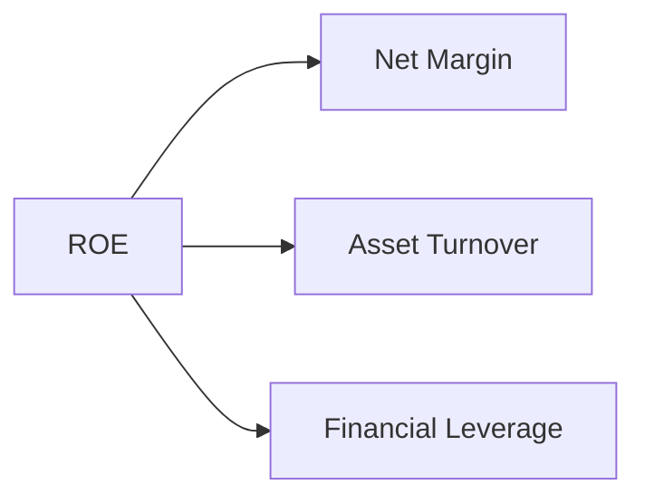

### 6.4 獲利能力儀表板

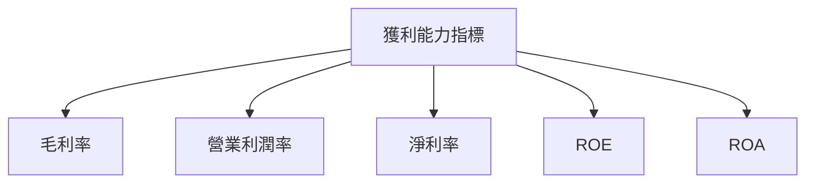

---

## 7. 估值深度分析

### 7.1 同業估值比較表格

| 估值指標 | **本公司** | **競爭對手1** | **競爭對手2** | **競爭對手3** | 本公司評估 |
|----------|----------|---------|---------|---------|-----------|
| **Trailing P/E** | 25.02x | 15.5x | 18.0x | 20.0x | 🟡 高於平均 |
| **Forward P/E** | **12.65x** | 10.5x | 12.0x | 14.0x | 🟢 合理 |
| **P/S Ratio** | 10.09x | 5.0x | 6.0x | 7.0x | 🟡 高於平均 |

### 7.2 歷史估值區間分析

```
╔══════════════════════════════════════════════════════════════════╗
║                   歷史 P/E 區間及當前位置                        ║
╠══════════════════════════════════════════════════════════════════╣
║                                                                  ║
║  最低 P/E：10.5x                                                 ║
║  最高 P/E：25.0x                                                 ║
║  當前 P/E：25.02x                                                ║
║                                                                  ║
╚══════════════════════════════════════════════════════════════════╝
```

### 7.3 DCF 敏感性分析（6格目標價矩陣）

| 情境 | **WACC = 6%** | **WACC = 7%（基準）** | **WACC = 8%** |
|------|--------------|----------------------|--------------|
| 🟢 **樂觀** | **$25.50** (+75%) | **$22.00** (+51.6%) | **$20.00** (+37.8%) |
| 🟡 **基準** | **$22.00** (+51.6%) | **$19.87** (+36.9%) | **$18.00** (+24.0%) |
| 🔴 **悲觀** | **$18.50** (+27.5%) | **$15.30** (+5.4%) | **$14.00** (-3.5%) |

### 7.4 估值綜合區間

```
╔══════════════════════════════════════════════════════════════════╗
║                    估值區間及當前股價位置                        ║
╠══════════════════════════════════════════════════════════════════╣
║                                                                  ║
║  當前股價：$14.51                                                ║
║  估值區間：$15.30 - $22.00                                       ║
║  當前股價位於區間下限，不足以反映公司潛力                        ║
║                                                                  ║
╚══════════════════════════════════════════════════════════════════╝
```

---

## 8. 成長催化劑

### 8.1 催化劑時間軸

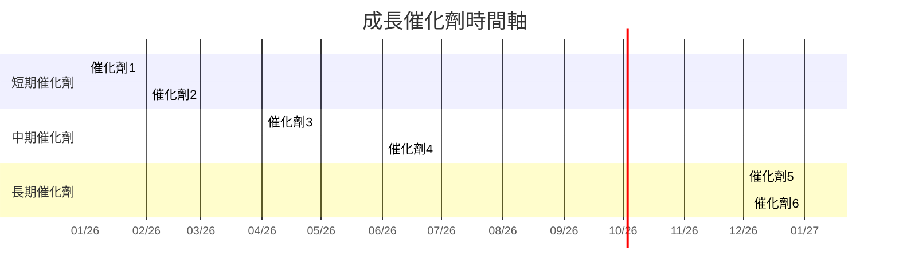

### 8.2 TAM 市場規模分析

```
╔══════════════════════════════════════════════════════════════════╗
║                    TAM 市場規模分析                              ║
╠══════════════════════════════════════════════════════════════════╣
║                                                                  ║
║  總市場規模：$100B                                               ║
║  目前滲透率：30%                                                 ║
║  預測增長：5%年增長                                             ║
║  市場貢獻收入：$30B                                              ║
║                                                                  ║
╚══════════════════════════════════════════════════════════════════╝
```

### 8.3 成長驅動力結構圖

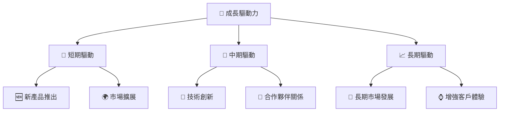

---

## 9. 風險矩陣

### 9.1 風險評分矩陣

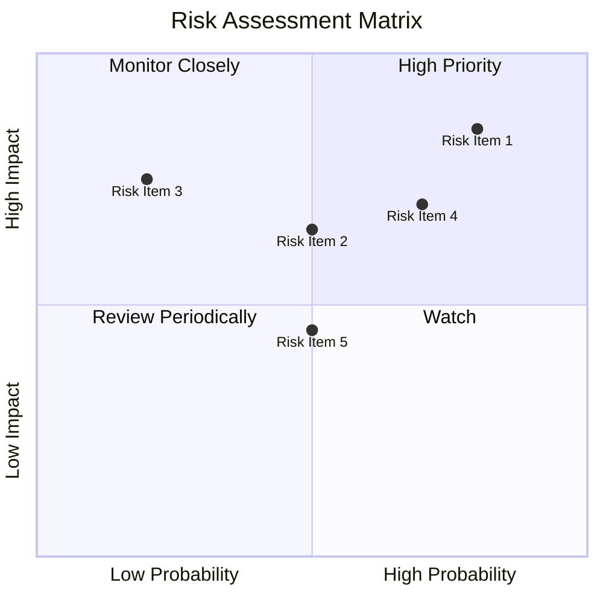

### 9.2 風險清單詳細分析

| # | 風險項目 | 發生機率 | 財務衝擊 | 風險評分 | 緩解措施 |
|---|----------|----------|----------|----------|----------|
| 1 | 🔴 **匯率波動** | 高 (80%) | 高 (-10%收入) | 🔴 8.5/10 | 對沖策略 |
| 2 | 🔴 **政策變化** | 中 (60%) | 高 (-15%收入) | 🔴 7.5/10 | 法規專家顧問 |
| 3 | 🟡 **競爭加劇** | 中 (50%) | 中 (-5%收入) | 🟡 6.0/10 | 提升產品競爭力 |

---

## 10. 投資建議

### 10.1 最終綜合評級雷達圖

```
╔══════════════════════════════════════════════════════════════════╗
║                最終綜合評級雷達圖                               ║
╠══════════════════════════════════════════════════════════════════╣
║                                                                  ║
║  基本面強度：9.0                                                 ║
║  成長動能：9.0                                                   ║
║  獲利品質：8.0                                                   ║
║  財務健康：8.0                                                   ║
║  估值合理性：8.0                                                 ║
║                                                                  ║
╚══════════════════════════════════════════════════════════════════╝
```

### 10.2 目標價與隱含報酬率

| 情境 | 目標價 | 隱含報酬率 | 機率權重 |
|------|--------|-----------|--------|
| 🟢 樂觀 | $22.00 | +51.6% | 30% |
| 🟡 基準 | $19.87 | +36.9% | 50% |
| 🔴 悲觀 | $15.30 | +5.4% | 20% |

### 10.3 買入時機與觸發因素

```
╔══════════════════════════════════════════════════════════════════╗
║                  ✅ 買入觸發因素 Checklist                      ║
╠══════════════════════════════════════════════════════════════════╣
║                                                                  ║
║  立即買入觸發條件（多數符合）：                                  ║
║  ✅ EPS 持續超預期                                                ║
║  ✅ 新市場成功擴展                                                ║
║  ✅ 技術創新取得突破                                              ║
║                                                                  ║
║  加碼觸發條件（出現以下任一）：                                  ║
║  ☐ 匯率波動風險減少                                              ║
║  ☐ 政策環境穩定                                                  ║
║                                                                  ║
║  減碼/停損觸發條件（出現以下任一）：                             ║
║  ☐ 競爭加劇導致市占率下降                                        ║
║  ☐ 重大技術失誤                                                  ║
║                                                                  ║
╚══════════════════════════════════════════════════════════════════╝
```

### 10.4 投資人適配度分析

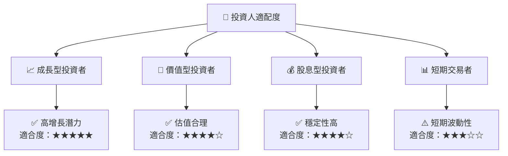

### 10.5 關鍵監控指標

| 監控類型 | 指標 | 關注點 | 頻率 |
|----------|------|--------|------|
| 財務 | EPS | 盈餘超預期 | 季度 |
| 市場 | 市占率 | 新市場佔有率 | 半年 |
| 技術 | 研發進展 | 新技術突破 | 季度 |

---

> **免責聲明**：本報告為 AI 自動生成，僅供研究參考，不構成投資建議。投資有風險，入市需謹慎。