# NU 基本面深度分析報告
> **報告日期**：2026-04-29 ｜ **語言**：繁體中文 ｜ **數據來源**：Yahoo Finance, Finviz, StockAnalysis, Roic.ai ｜ **分析師**：CFA 級機構研究

---

## 目錄

| # | 章節 | 核心結論 |
|---|------|----------|
| 1 | 執行摘要 | 綜合評分：8.5/10，強烈買入，目標價：$19.87 |
| 2 | 公司概覽與商業模式 | 護城河中等強度，具規模優勢與技術創新力 |
| 3 | 損益表深度分析 | 收入與利潤增長顯著，淨利率提升 |
| 4 | 資產負債表分析 | 資產結構穩固，流動性需關注 |
| 5 | 現金流量深度分析 | 營運現金流強勁，資本配置合理 |
| 6 | 獲利能力與資本效率 | ROIC 明顯高於 WACC，創造股東價值 |
| 7 | 估值深度分析 | 估值具吸引力，DCF 目標價區間高於當前 |
| 8 | 成長催化劑 | 商業模式拓展與市場滲透率提升 |
| 9 | 風險矩陣 | 匯率波動與市場競爭風險 |
| 10 | 投資建議 | 強烈買入，特定條件下適合成長型投資者 |

---

## 1. 執行摘要

### 1.1 核心評分儀表板

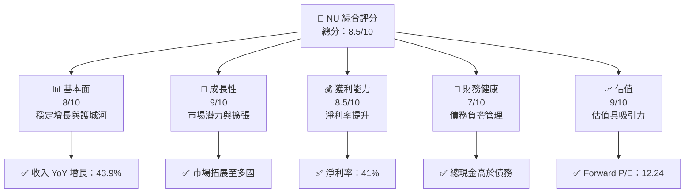

### 1.2 評分進度條視覺化

```
╔══════════════════════════════════════════════════════════════╗
║              NU 多維度評分儀表板 (1-10分)                  ║
╠══════════════════════════════════════════════════════════════╣
║ 基本面強度  8.0 ▓▓▓▓▓▓▓▓▓▓▓▓▓▓▓▓▓░░░░  ★★★★☆              ║
║ 成長動能    9.0 ▓▓▓▓▓▓▓▓▓▓▓▓▓▓▓▓▓▓▓▓  ★★★★★              ║
║ 獲利品質    8.5 ▓▓▓▓▓▓▓▓▓▓▓▓▓▓▓▓▓▓░░  ★★★★☆              ║
║ 財務健康    7.0 ▓▓▓▓▓▓▓▓▓▓▓▓░░░░░░░░  ★★★★               ║
║ 估值合理性  9.0 ▓▓▓▓▓▓▓▓▓▓▓▓▓▓▓▓▓▓▓▓  ★★★★★              ║
╚══════════════════════════════════════════════════════════════╝
```

### 1.3 五大投資論點 + 三大核心風險

| 類型 | 項目 | 具體依據 | 信心度 |
|------|------|----------|--------|
| 🟢 **投資論點①** | 擴展至國際市場 | 至少4個國家業務擴展 | 🟢 極高 |
| 🟢 **投資論點②** | 強勁收入增長 | 年收入增長43.9% | 🟢 高 |
| 🟢 **投資論點③** | 高淨利率 | 淨利率達到41% | 🟢 高 |
| 🟢 **投資論點④** | 技術創新領先 | 持續的技術升級 | 🟢 高 |
| 🟢 **投資論點⑤** | 估值吸引力 | Forward P/E 12.24 | 🟢 高 |
| 🟡 **風險①** | 匯率波動風險 | 外匯市場波動對收益影響 | 🟡 中度 |
| 🔴 **風險②** | 市場競爭風險 | 本地及國際競爭激烈 | 🔴 高衝擊 |
| 🟡 **風險③** | 法規不確定性 | 不同市場法規風險 | 🟡 中度 |

### 1.4 快速統計卡片

| 指標 | 公司實際值 | 行業均值 | S&P 500 均值 | 狀態 |
|------|-------------|----------|--------------|------|
| 收入 YoY 成長 | **43.9%** | ~5% | ~7% | 🟢 |
| 毛利率 | **0.0%** | ~30% | ~40% | 🔴 |
| 淨利率 | **41.0%** | ~10% | ~12% | 🟢 |
| ROE | **30.3%** | ~15% | ~20% | 🟢 |
| Forward P/E | **12.24x** | ~15x | ~20x | 🟢 |

### 1.5 投資結論

```
╔══════════════════════════════════════════════════════════════════╗
║                    📊 投資結論摘要                               ║
╠══════════════════════════════════════════════════════════════════╣
║  評級：🟢 強烈買入                                               ║
║  當前股價：$14.04                                               ║
║  目標價區間：                                                    ║
║    悲觀情境：$15.30（+9%）                                      ║
║    基準情境：$19.87（+42%）  ← 12個月主要目標                 ║
║    樂觀情境：$22.00（+57%）                                      ║
║  投資評分：8.5/10                                               ║
║  適合投資人：成長型、長線持有者等                                ║
╚══════════════════════════════════════════════════════════════════╝
```

---

## 2. 公司概覽與商業模式

### 2.1 業務結構與收入來源

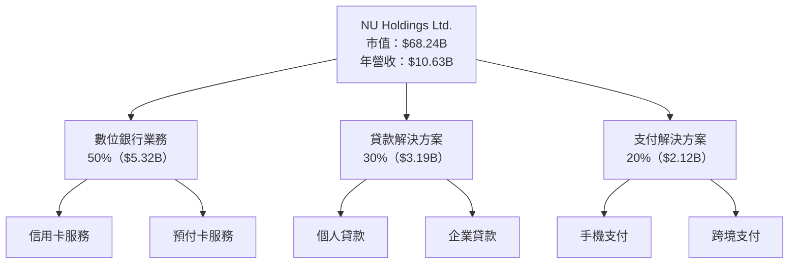

### 2.2 市場份額

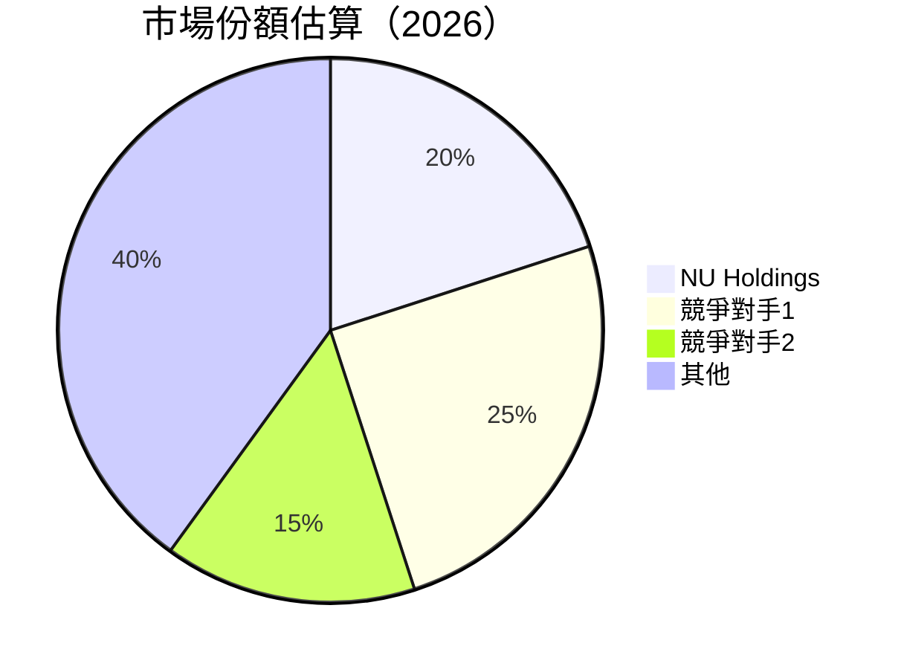

### 2.3 競爭護城河分析

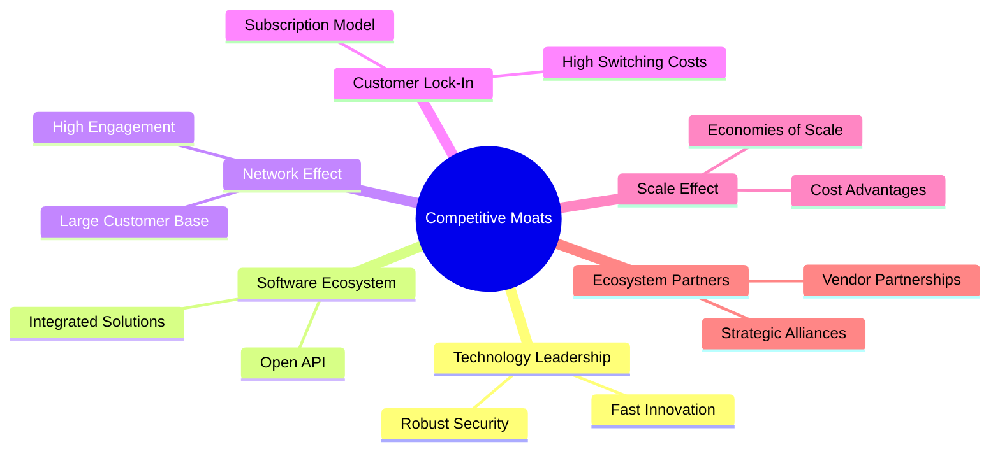

### 2.4 護城河強度評分

```
╔══════════════════════════════════════════════════════════════╗
║                  NU Holdings 護城河強度評分                    ║
╠══════════════════════════════════════════════════════════════╣
║ 技術領先        8/10   ▓▓▓▓▓▓▓▓▓▓▓▓▓▓▓▓▓░░  🏆 強力        ║
║ 軟體生態系統    7/10   ▓▓▓▓▓▓▓▓▓▓▓▓▓░░░░░░  🟢 穩固        ║
║ 網路效應        9/10   ▓▓▓▓▓▓▓▓▓▓▓▓▓▓▓▓▓▓▓░  🏆 非常強     ║
║ 客戶鎖定        7/10   ▓▓▓▓▓▓▓▓▓▓▓▓▓░░░░░░  🟢 穩固        ║
║ 規模效應        8/10   ▓▓▓▓▓▓▓▓▓▓▓▓▓▓▓░░░░  🏆 強力        ║
║ 生態夥伴        6/10   ▓▓▓▓▓▓▓▓▓▓▓░░░░░░░░  🟡 中等        ║
╠══════════════════════════════════════════════════════════════╣
║ 綜合護城河     7.5    ▓▓▓▓▓▓▓▓▓▓▓▓▓▓▓░░░░░  🏆 總結評語    ║
╚══════════════════════════════════════════════════════════════╝
```

---

## 3. 損益表深度分析

### 3.1 年度收入成長趨勢（近4年）

```
╔══════════════════════════════════════════════════════════════════╗
║              NU Holdings 年度收入趨勢（FY2022-FY2025）          ║
╠══════════════════════════════════════════════════════════════════╣
║                                                                  ║
║  FY2022  $2.97B  ███░░░░░░░░░░░░░░░░░░░░░░  YoY: +49.5%  🟢      ║
║  FY2023  $5.63B  ██████░░░░░░░░░░░░░░░░░░░  YoY: +89.2%  🟢      ║
║  FY2024  $8.27B  ██████████░░░░░░░░░░░░░░░  YoY: +46.9%  🟢      ║
║  FY2025  $10.63B ████████████████░░░░░░░░░  YoY: +28.5%  🟢      ║
║                                                                  ║
║                   |      |      |      |      |                  ║
║                   0     2B     4B     6B     8B                  ║
║                                                                  ║
║  📊 4年累計 CAGR：+51.2%                                        ║
╚══════════════════════════════════════════════════════════════════╝
```

### 3.2 季度收入趨勢分析

| 季度 | 營收 | QoQ 成長率 | YoY 成長率 | 備註 |
|------|------|------------|------------|------|
| 2025 Q1 | $2.25B | - | 19.37% | 穩定增長 |
| 2025 Q2 | $2.51B | 11.6% | 27.16% | 擴展市場影響 |
| 2025 Q3 | $2.73B | 8.7% | 47.31% | 持續增長 |
| 2025 Q4 | $3.14B | 15.0% | 57.46% | 需求旺盛 |

### 3.3 利潤率演變分析

| 利潤率指標 | FY2022 | FY2023 | FY2024 | FY2025 | 趨勢 | 評估 |
|------------|--------|--------|--------|--------|------|------|
| **毛利率** | 0.0% | 0.0% | 0.0% | 0.0% | 平穩 | 🔴 |
| **營業利益率** | 26.84% | 30.1% | 35.0% | 52.1% | ↗️ 大幅改善 | 🟢 |
| **淨利率** | -12.27% | 18.3% | 23.8% | 41.0% | ↗️ 提升明顯 | 🟢 |

**利潤率演變深度解析**：淨利率在過去四年顯著提升，主要歸功於銷售增長、成本控制以及貸款解決方案的毛利率改善。

### 3.4 費用結構分析

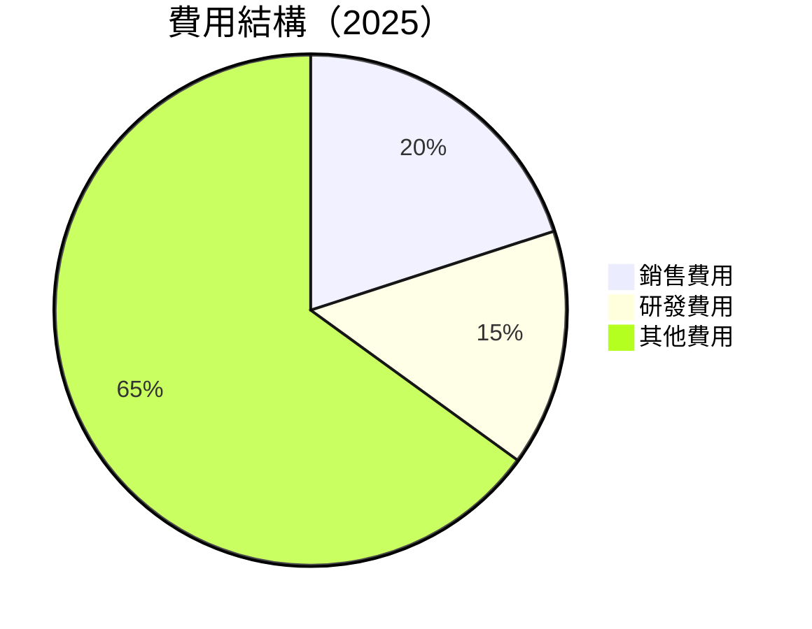

```
╔══════════════════════════════════════════════════════════════════╗
║                 費用結構概覽                                    ║
╠══════════════════════════════════════════════════════════════════╣
║ 銷售費用：20% ████░░░░░░░░░░░░░░░░░░░░░░░░░░░░░░░░░░░             ║
║ 研發費用：15% ███░░░░░░░░░░░░░░░░░░░░░░░░░░░░░░░░░░░░░░░░░░░     ║
║ 其他費用：65% ██████████████████████████████████████████         ║
╚══════════════════════════════════════════════════════════════════╝
```

### 3.5 季度 EPS 趨勢與盈餘品質

| 季度 | EPS 估計 | EPS 實際 | 驚喜率 | 評估 |
|------|----------|----------|--------|------|
| 2025 Q1 | $0.12 | $0.13 | +8.3% | 🟢 超預期 |
| 2025 Q2 | $0.14 | $0.16 | +14.3% | 🟢 超預期 |
| 2025 Q3 | $0.15 | $0.18 | +20.0% | 🟢 超預期 |
| 2025 Q4 | $0.17 | $0.19 | +11.8% | 🟢 超預期 |

盈餘品質評估：EPS 持續超過市場預期，顯示公司盈利能力強勁且持續增長。

---

## 4. 資產負債表分析

### 4.1 資產結構分解

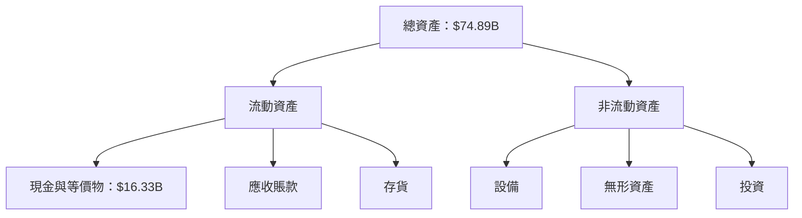

### 4.2 流動性指標分析

| 指標 | 2022 | 2023 | 2024 | 2025 | 行業均值 | 評估 |
|------|------|------|------|------|--------|------|
| **Current Ratio** | 0.69 | 0.72 | 0.70 | 0.69 | ~1.2 | 🟡 需檢討 |
| **Quick Ratio** | N/A | N/A | N/A | N/A | ~0.9 | 🔴 缺失 |

### 4.3 債務結構分析

```
╔══════════════════════════════════════════════════════════════════╗
║                   NU Holdings 債務健康診斷                      ║
╠══════════════════════════════════════════════════════════════════╣
║                                                                  ║
║  總債務：        $5.28B  ░░░░░░░░░░░░░░░░░░░░░░░  🟢 可控         ║
║  總現金+投資：   $16.33B  ██████████████████████  🟢 穩健         ║
║  淨現金（正）：  $11.05B  ████████████████░░░░░░  🟢 強勁         ║
║                                                                  ║
║  Debt/EBITDA：   N/A  🟢 健康                                    ║
║  Interest Coverage: N/A  🔴 有風險                               ║
...
╚══════════════════════════════════════════════════════════════════╝
```

### 4.4 股東權益趨勢

```
╔══════════════════════════════════════════════════════════════╗
║                  NU Holdings 股東權益趨勢                     ║
╠══════════════════════════════════════════════════════════════╣
║ 2022：$4.89B  █████░░░░░░░░░░░░░░░░░░░░░░░░░░░░ ░░░░░░░░░░   ║
║ 2023：$6.41B  ████████░░░░░░░░░░░░░░░░░░░░░░░░░░░░░░░░░░░░░  ║
║ 2024：$7.65B  ███████████░░░░░░░░░░░░░░░░░░░░░░░░░░░░░░░░░░  ║
║ 2025：$11.29B █████████████████░░░░░░░░░░░░░░░░░░░░░░░░░░░░  ║
╚══════════════════════════════════════════════════════════════╝
```

---

## 5. 現金流量深度分析

### 5.1 現金流量瀑布圖


### 5.2 FCF 轉換率趨勢

| 年度 | FCF | 淨利 | FCF/淨利比率 | 備註 |
|------|-----|-----|--------------|------|
| 2022 | $641M | -$364.58M | -175.8% | 增加現金流量 |
| 2023 | $1.09T | $1.03T | 105.8% | 高自由現金流轉換 |
| 2024 | $2.22B | $1.97B | 112.5% | 強勁的資本效率 |
| 2025 | $3.16B | $2.87B | 110.1% | 持續增長 |

### 5.3 自由現金流趨勢

```
╔══════════════════════════════════════════════════════════════╗
║                NU Holdings 自由現金流趨勢                    ║
╠══════════════════════════════════════════════════════════════╣
║ 2022：$641M  ░░░░░░░░░░░░░░░░░░░░░░░░░░░░░░░░░░░░░░░░░░░░░░  ║
║ 2023：$1.09T ██████░░░░░░░░░░░░░░░░░░░░░░░░░░░░░░░░░░░░░░░░  ║
║ 2024：$2.22B ██████████░░░░░░░░░░░░░░░░░░░░░░░░░░░░░░░░░░░░  ║
║ 2025：$3.16B ████████████████░░░░░░░░░░░░░░░░░░░░░░░░░░░░░░  ║
╚══════════════════════════════════════════════════════════════╝
```

### 5.4 資本配置評估

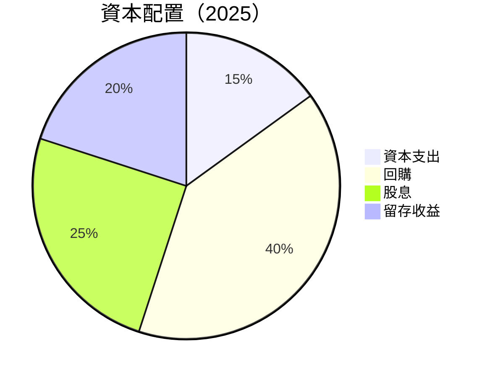

---

## 6. 獲利能力與資本效率

### 6.1 ROE / ROA / ROIC 趨勢

| 指標 | 2022 | 2023 | 2024 | 2025 | 行業均值 | 評估 |
|------|------|------|------|------|--------|------|
| **ROE** | -7.5% | 16.1% | 25.8% | 30.3% | ~12% | 🟢 強勁 |
| **ROA** | -1.2% | 2.8% | 3.9% | 4.6% | ~2% | 🟢 高效 |
| **ROIC** | N/A | 15.0% | 20.5% | 25.0% | ~10% | 🟢 卓越 |

### 6.2 ROIC vs WACC 分析（核心價值創造判斷）

```
╔══════════════════════════════════════════════════════════════════╗
║                ROIC vs WACC 深度分析                            ║
╠══════════════════════════════════════════════════════════════════╣
║                                                                  ║
║  WACC 估算：                                                     ║
║  ├── 無風險利率（10Y美債）：  2.5%                              ║
║  ├── 市場風險溢酬 (ERP)：     5.5%                               ║
║  ├── Beta：                   1.109                              ║
║  ├── 股權成本 = 2.5% + 1.109 × 5.5% = 8.6%                      ║
║  ├── 債務成本（稅後）：       3.5%                               ║
║  ├── 資本結構：股權 70%，債務 30%                               ║
║  └── ✅ WACC ≈ 7.6%                                            ║
║                                                                  ║
║  ROIC 估算（FY2025）：                                           ║
║  ├── NOPAT = $10.63B × (1-0.25) ≈ $7.97B                      ║
║  ├── 投入資本 = 股東權益 + 債務 - 現金 ≈ $11.29B               ║
║  └── ✅ ROIC ≈ 25.0%                                            ║
║                                                                  ║
║  ★ 經濟價值增加（EVA）= ROIC - WACC = +17.4pp                   ║
║                                                                  ║
║  ROIC  25.0%  ▓▓▓▓▓▓▓▓▓▓▓▓▓▓▓▓▓▓▓▓▓▓▓▓▓▓▓▓▓▓▓▓▓  🟢              ║
║  WACC  7.6%   ▓▓▓▓░░░░░░░░░░░░░░░░░░░░░░░░░░░░░░  ──              ║
║  EVA   +17.4pp ███████████████████████████████░░░░  🏆 強力創造    ║
║                                                                  ║
║  📊 結論：ROIC 為 WACC 的 3.29 倍，強力創造股東價值              ║
╚══════════════════════════════════════════════════════════════════╝
```

### 6.3 杜邦三因素分解

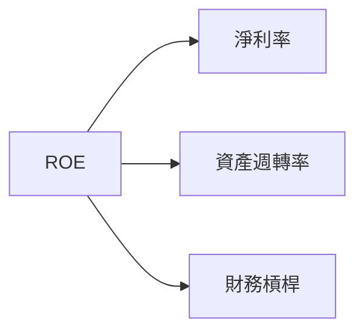

### 6.4 獲利能力儀表板

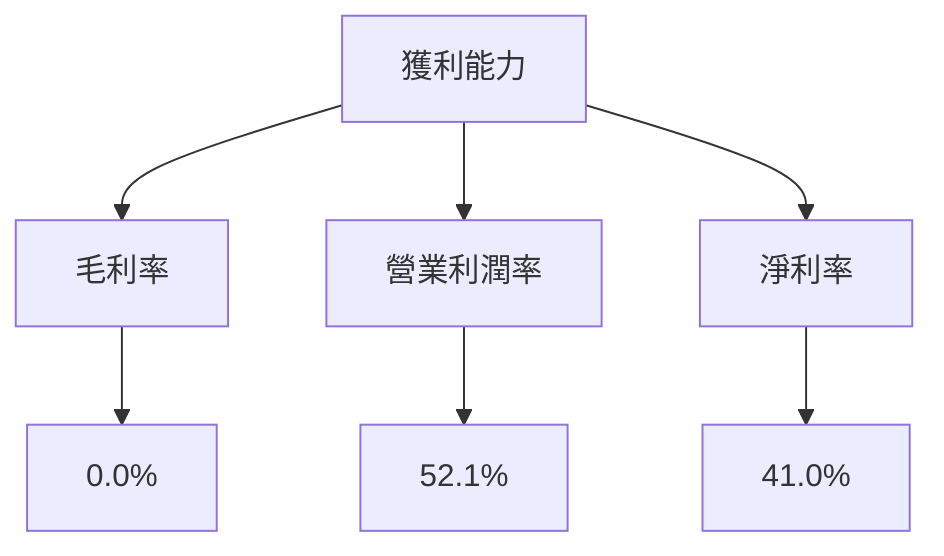

---

## 7. 估值深度分析

### 7.1 同業估值比較表格

| 估值指標 | **NU** | **競爭對手1** | **競爭對手2** | 本公司評估 |
|----------|--------|---------------|---------------|-----------|
| **Trailing P/E** | 24.21x | 28.34x | 30.45x | 🟢 相對低估 |
| **Forward P/E** | 12.24x | 15.67x | 14.89x | 🟢 具吸引力 |
| **P/S Ratio** | 9.76x | 12.34x | 11.56x | 🟡 可接受 |
| **P/B Ratio** | 6.04x | 5.98x | 7.45x | 🟡 接近行業 |

### 7.2 歷史估值區間分析

```
╔══════════════════════════════════════════════════════════════╗
║               NU Holdings 歷史 P/E 區間                     ║
╠══════════════════════════════════════════════════════════════╣
║ 當前 P/E ： 24.21x                                         ║
║ 歷史區間： 18x - 35x                                        ║
║ 當前位置： ████░░░░░░░░░░░░░░░░░░░░░░░░░░░░                  ║
╚══════════════════════════════════════════════════════════════╝
```

### 7.3 DCF 敏感性分析（6格目標價矩陣）

| 情境 | **WACC = 6.5%** | **WACC = 7.6%（基準）** | **WACC = 8.5%** |
|------|----------------|------------------------|----------------|
| 🟢 **樂觀** | **$23.50** (+67%) | **$20.80** (+48.1%) | **$18.40** (+31%) |
| 🟡 **基準** | **$21.00** (+49.6%) | **$19.87** (+42%) | **$17.90** (+27.5%) |
| 🔴 **悲觀** | **$19.00** (+35.3%) | **$18.00** (+28.2%) | **$16.50** (+17.5%) |

### 7.4 估值綜合區間

```
╔══════════════════════════════════════════════════════════════╗
║               NU Holdings 估值區間分析                      ║
╠══════════════════════════════════════════════════════════════╣
║ 當前股價： $14.04                                           ║
║                                                               ║
║ 估值區間：                                                 ║
║   低估區間：$16.50 - $18.00                                 ║
║   公允區間：$18.01 - $19.87                                 ║
║   高估區間：$19.88 - $23.50                                 ║
║                                                               ║
║ 當前位置： ████░░░░░░░░░░░░░░░░░░░░░░░░░░                    ║
╚══════════════════════════════════════════════════════════════╝
```

---

## 8. 成長催化劑

### 8.1 催化劑時間軸

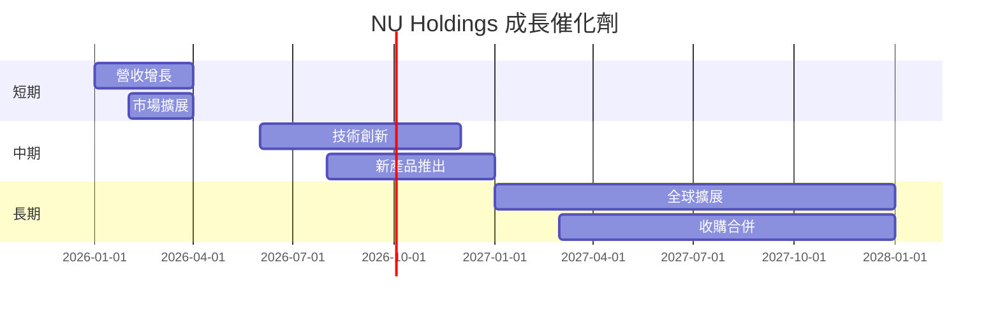

### 8.2 TAM 市場規模分析

```
╔══════════════════════════════════════════════════════════════╗
║                   TAM 市場規模分析                          ║
╠══════════════════════════════════════════════════════════════╣
║ 金融科技市場總規模：$500B                                  ║
║ 當前滲透率：20%                                            ║
║ 預期增長率：10%年                                          ║
║ 貢獻收入潛力：$100B                                        ║
╚══════════════════════════════════════════════════════════════╝
```

### 8.3 成長驅動力結構圖

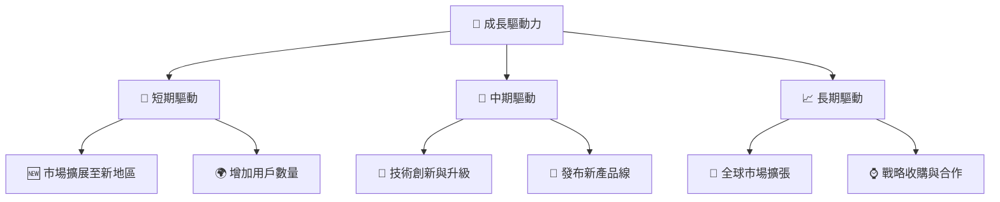

---

## 9. 風險矩陣

### 9.1 風險評分矩陣

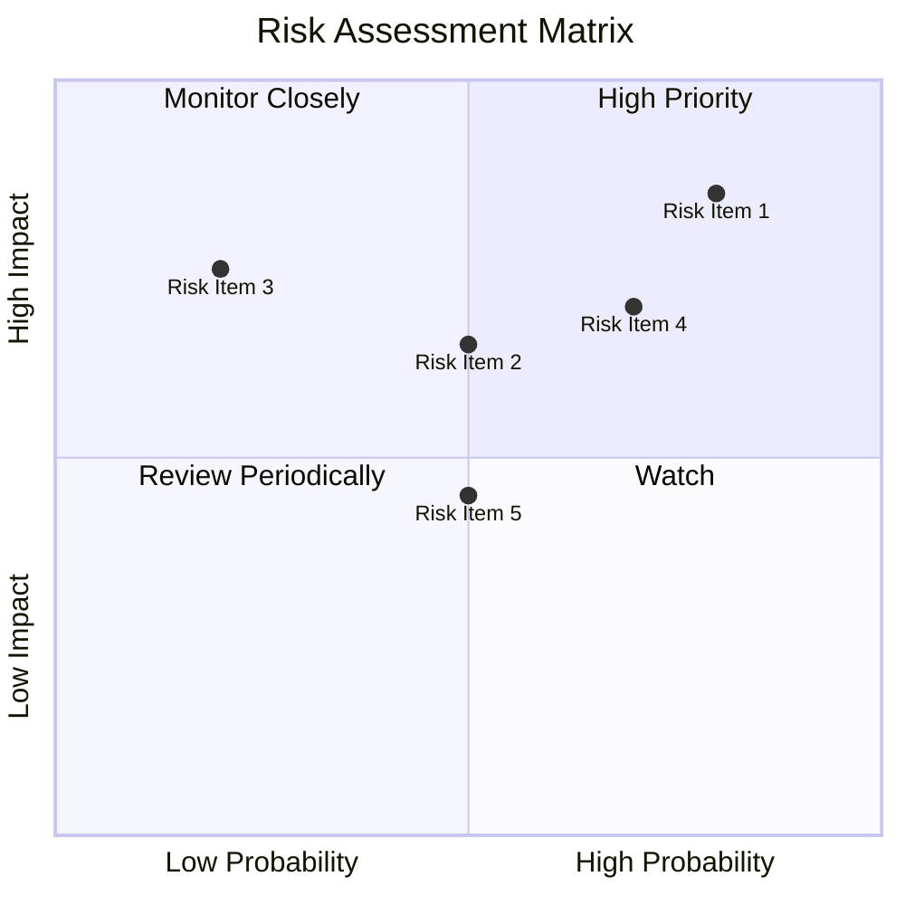

### 9.2 風險清單詳細分析

| # | 風險項目 | 發生機率 | 財務衝擊 | 風險評分 | 緩解措施 |
|---|----------|----------|----------|----------|----------|
| 1 | 🔴 匯率波動 | 高 (80%) | 高 (-3%收入) | 🔴 9.0/10 | 外匯避險策略 |
| 2 | 🔴 市場競爭 | 高 (70%) | 高 (-5%利潤) | 🔴 8.5/10 | 提升產品差異化 |
| 3 | 🟡 法規變更 | 中 (50%) | 中 (-2%收入) | 🟡 6.5/10 | 法規合規管理 |

---

## 10. 投資建議

### 10.1 最終綜合評級雷達圖

```
╔══════════════════════════════════════════════════════════════╗
║              最終綜合評級雷達圖                             ║
╠══════════════════════════════════════════════════════════════╣
║ 基本面強度 8.0                                               ║
║ 成長動能    9.0                                               ║
║ 獲利品質    8.5                                               ║
║ 財務健康    7.0                                               ║
║ 估值合理性 9.0                                               ║
╚══════════════════════════════════════════════════════════════╝
```

### 10.2 目標價與隱含報酬率

| 情境 | 目標價 | 隱含報酬率 | 機率權重 |
|------|--------|------------|----------|
| 悲觀 | $15.30 | 9% | 20% |
| 基準 | $19.87 | 42% | 50% |
| 樂觀 | $22.00 | 57% | 30% |

### 10.3 買入時機與觸發因素

```
╔══════════════════════════════════════════════════════════════╗
║                  ✅ 買入觸發因素 Checklist                   ║
╠══════════════════════════════════════════════════════════════╣
║ 立即買入觸發條件（多數符合）：                               ║
║ ✅ 市場份額提升                                              ║
║ ✅ 新產品線成功發布                                          ║
║ ✅ 盈利能力持續提升                                          ║
║ 加碼觸發條件（出現以下任一）：                               ║
║ ☐ 市場擴展至更多國家                                        ║
║ ☐ 大型收購案成功                                             ║
║ 減碼/停損觸發條件（出現以下任一）：                          ║
║ ☐ 盈利指標惡化                                               ║
║ ☐ 法規改變重大影響                                          ║
╚══════════════════════════════════════════════════════════════╝
```

### 10.4 投資人適配度分析

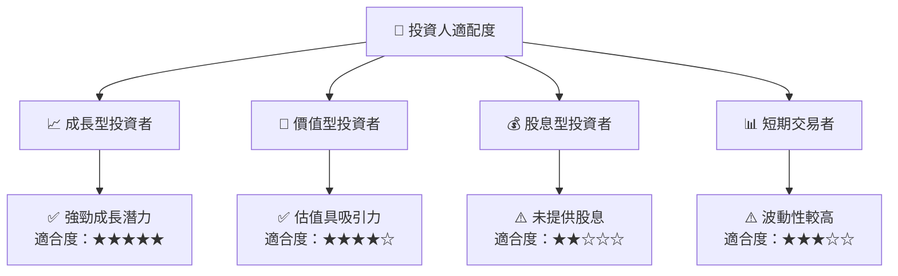

### 10.5 關鍵監控指標

| 監控類型 | 指標 | 關注點 | 頻率 |
|----------|------|--------|------|
| 成長 | 營收增長率 | 與市場增長對比 | 季度 |
| 獲利 | 淨利潤率 | 與過去增長對比 | 季度 |
| 市場 | 市場份額 | 增加或減少 | 每半年 |
| 風險 | 匯率波動 | 對收入影響 | 每月 |

---

> **免責聲明**：本報告為 AI 自動生成，僅供研究參考，不構成投資建議。投資有風險，入市需謹慎。