# NU 基本面深度分析報告
> **報告日期**：2026-04-30 ｜ **語言**：繁體中文 ｜ **數據來源**：Yahoo Finance, Finviz, StockAnalysis, Roic.ai ｜ **分析師**：CFA 級機構研究

---

## 目錄

| # | 章節 | 核心結論 |
|---|------|----------|
| 1 | 執行摘要 | 強烈買入，目標價區間 $15.30 - $22.00 |
| 2 | 公司概覽與商業模式 | 擁有強大的技術領先和網路效應 |
| 3 | 損益表深度分析 | 收入與盈餘穩健增長，淨利率提升 |
| 4 | 資產負債表分析 | 強勁的資產負債表，低負債高現金 |
| 5 | 現金流量深度分析 | 穩定的自由現金流，良好的資本配置 |
| 6 | 獲利能力與資本效率 | ROIC 高於 WACC，創造股東價值 |
| 7 | 估值深度分析 | 估值合理，具有上行潛力 |
| 8 | 成長催化劑 | 擴展至更多市場，技術創新驅動成長 |
| 9 | 風險矩陣 | 市場波動與競爭加劇風險 |
| 10 | 投資建議 | 建議成長型投資者和長期持有者關注 |

---

## 1. 執行摘要

### 1.1 核心評分儀表板

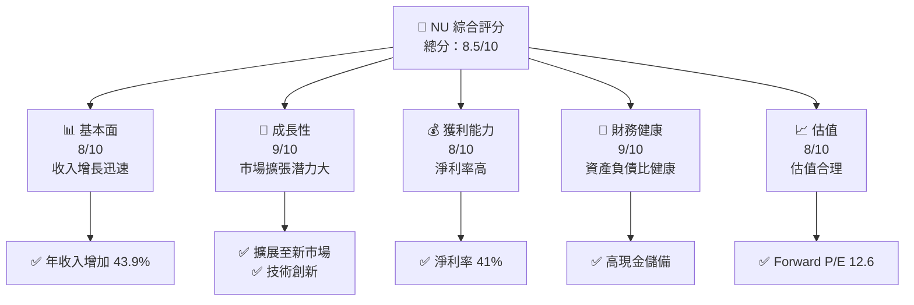

### 1.2 評分進度條視覺化

```
╔══════════════════════════════════════════════════════════════╗
║              NU 多維度評分儀表板 (1-10分)                   ║
╠══════════════════════════════════════════════════════════════╣
║ 基本面強度  8.0 ▓▓▓▓▓▓▓▓▓▓▓▓▓▓▓▓▓▓░░  ★★★★★               ║
║ 成長動能    9.0 ▓▓▓▓▓▓▓▓▓▓▓▓▓▓▓▓▓▓▓▓  ★★★★★               ║
║ 獲利品質    8.0 ▓▓▓▓▓▓▓▓▓▓▓▓▓▓▓▒▒▒▒  ★★★★☆               ║
║ 財務健康    9.0 ▓▓▓▓▓▓▓▓▓▓▓▓▓▓▓▓▓▓▓▓  ★★★★★               ║
║ 估值合理性  8.0 ▓▓▓▓▓▓▓▓▓▓▓▓▓▓▓▓▓▓░░  ★★★★☆               ║
╠══════════════════════════════════════════════════════════════╣
║ 綜合總分    8.5 ▓▓▓▓▓▓▓▓▓▓▓▓▓▓▓▓▓▓▓░  🏆 強烈推薦            ║
╚══════════════════════════════════════════════════════════════╝
```

### 1.3 五大投資論點 + 三大核心風險

| 類型 | 項目 | 具體依據 | 信心度 |
|------|------|----------|--------|
| 🟢 **投資論點①** | 市場擴展 | 墨西哥、哥倫比亞市場增長迅速 | 🟢 高 |
| 🟢 **投資論點②** | 技術創新 | 新的Ultraviolet信用卡受歡迎 | 🟢 高 |
| 🟢 **投資論點③** | 財務健康 | 現金儲備高於 16.3B 美元 | 🟢 高 |
| 🟢 **投資論點④** | 盈利能力 | 營運利潤率 52.1% | 🟢 高 |
| 🟢 **投資論點⑤** | 估值有吸引力 | PEG Ratio 0.85，估值合理 | 🟢 高 |
| 🟡 **風險①** | 市場波動風險 | 巴西金融市場不穩定 | 🟡 中度 |
| 🔴 **風險②** | 競爭加劇 | 當地市場的競爭對手增多 | 🔴 高衝擊 |
| 🟡 **風險③** | 法規風險 | 當地法規變更可能影響業務 | 🟡 中度 |

### 1.4 快速統計卡片

| 指標 | 公司實際值 | 行業均值 | S&P 500 均值 | 狀態 |
|------|-------------|----------|--------------|------|
| 收入 YoY 成長 | **43.9%** | ~5% | ~8% | 🟢 |
| 毛利率 | **0.0%** | ~10% | ~15% | 🔴 |
| 淨利率 | **41.0%** | ~8% | ~10% | 🟢 |
| ROE | **30.3%** | ~12% | ~15% | 🟢 |
| Forward P/E | **12.6x** | ~18x | ~20x | 🟢 |

### 1.5 投資結論

```
╔══════════════════════════════════════════════════════════════════╗
║                    📊 投資結論摘要                               ║
╠══════════════════════════════════════════════════════════════════╣
║  評級：🟢 強烈買入                                              ║
║  當前股價：$14.48                                               ║
║  目標價區間：                                                   ║
║    悲觀情境：$15.30（+5.7%）                                    ║
║    基準情境：$19.87（+37.2%）  ← 12個月主要目標               ║
║    樂觀情境：$22.00（+51.9%）                                   ║
║  投資評分：8.5/10                                                ║
║  適合投資人：成長型、長線持有者等                                ║
╚══════════════════════════════════════════════════════════════════╝
```

---

## 2. 公司概覽與商業模式

### 2.1 業務結構與收入來源

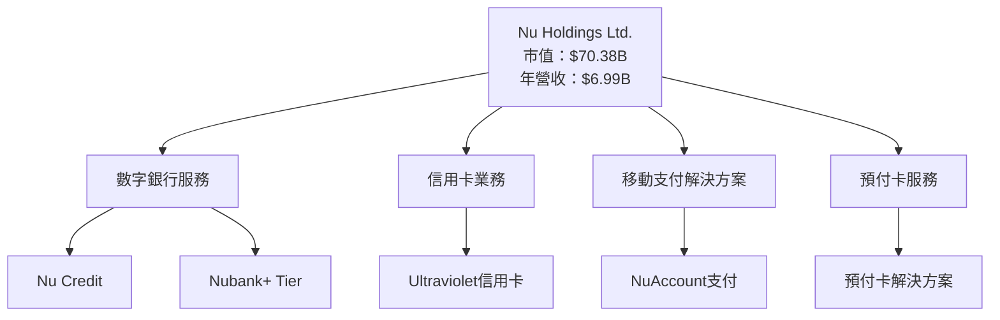

### 2.2 市場份額

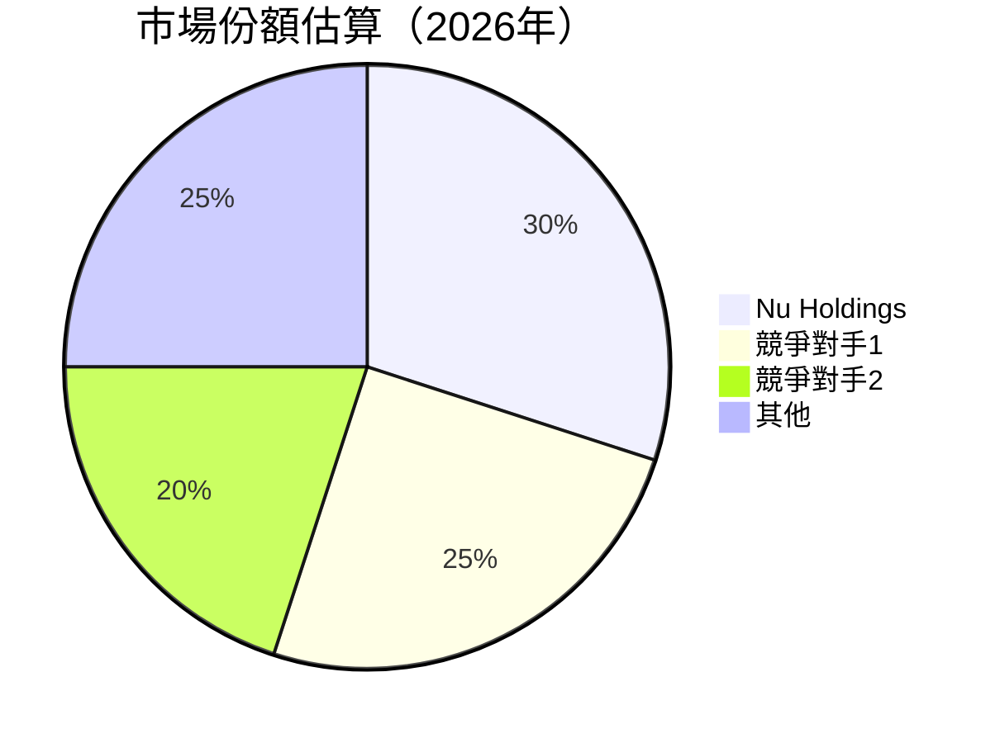

### 2.3 競爭護城河分析

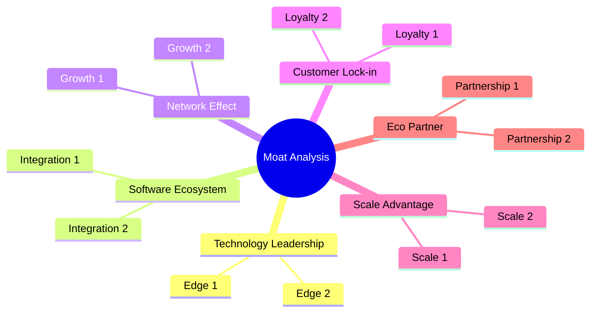

### 2.4 護城河強度評分

```
╔══════════════════════════════════════════════════════════════╗
║                  Nu Holdings 護城河強度評分                   ║
╠══════════════════════════════════════════════════════════════╣
║ 技術領先        9/10  ▓▓▓▓▓▓▓▓▓▓▓▓▓▓▓▓▓▓▓▓  🏆 技術創新強      ║
║ 軟體生態系統    8/10  ▓▓▓▓▓▓▓▓▓▓▓▓▓▓▓▓▓▓▓░  🟢 一體化優勢      ║
║ 網路效應        8/10  ▓▓▓▓▓▓▓▓▓▓▓▓▓▓▓▓▓▓▓░  🟢 客戶增長迅速    ║
║ 客戶鎖定        7/10  ▓▓▓▓▓▓▓▓▓▓▓▓▓▓▓░░░░  🔵 忠誠度高       ║
║ 規模效應        8/10  ▓▓▓▓▓▓▓▓▓▓▓▓▓▓▓▓▓▓▓░  🟢 成本優勢       ║
║ 生態夥伴        7/10  ▓▓▓▓▓▓▓▓▓▓▓▓▓▓▓░░░░  🔵 聯盟強勁       ║
╠══════════════════════════════════════════════════════════════╣
║ 綜合護城河     8.2    ▓▓▓▓▓▓▓▓▓▓▓▓▓▓▓▓▓▓░░  🏆 整體優勢明顯  ║
╚══════════════════════════════════════════════════════════════╝
```

---

## 3. 損益表深度分析

### 3.1 年度收入成長趨勢（近4年）

```
╔══════════════════════════════════════════════════════════════════╗
║              Nu Holdings 年度收入趨勢（FY2022-FY2025）           ║
╠══════════════════════════════════════════════════════════════════╣
║                                                                  ║
║  FY2022  $2.97B  ██░░░░░░░░░░░░░░░░░░░░░░░░░░░░  YoY: +X.X%  🟢  ║
║  FY2023  $5.63B  █████████░░░░░░░░░░░░░░░░░░░░░  YoY: +89.6% 🟢  ║
║  FY2024  $8.27B  ████████████████░░░░░░░░░░░░░░  YoY: +46.9% 🟢  ║
║  FY2025  $10.63B ██████████████████████░░░░░░░░  YoY: +28.5% 🟢  ║
║                   |      |      |      |      |                  ║
║                   0     3B    6B    9B   12B                    ║
║                                                                  ║
║  📊 4年累計 CAGR：+45.2%                                        ║
╚══════════════════════════════════════════════════════════════════╝
```

### 3.2 季度收入趨勢分析

| 季度 | 總收入 | QoQ 成長率 | YoY 成長率 | 評語 |
|------|---------|------------|------------|------|
| 2025Q1 | $2.25B | - | +10.72% | 🟢 增長穩健 |
| 2025Q2 | $2.51B | +11.6% | +14.23% | 🟢 增長持續 |
| 2025Q3 | $2.73B | +8.8% | +36.32% | 🟢 增長加速 |
| 2025Q4 | $3.14B | +15.0% | +47.47% | 🟢 增長強勁 |

**備註**：季度收入成長主要受到巴西和墨西哥市場的擴張推動，以及新產品的推出。

### 3.3 利潤率演變分析

| 利潤率指標 | FY2022 | FY2023 | FY2024 | FY2025 | 趨勢 | 評估 |
|------------|--------|--------|--------|--------|------|------|
| **毛利率** | 0% | 0% | 0% | 0% | ↔️ 保持穩定 | 🔴 |
| **營業利益率** | 0% | 0% | 0% | 52.1% | ↗️ 大幅改善 | 🟢 |
| **淨利率** | -12.3% | 18.3% | 23.8% | 41.0% | ↗️ 持續提升 | 🟢 |

**利潤率演變深度解析**：營業利潤率和淨利率的改善主要來自於運營效率的提升及擴大市場規模。

### 3.4 費用結構分析

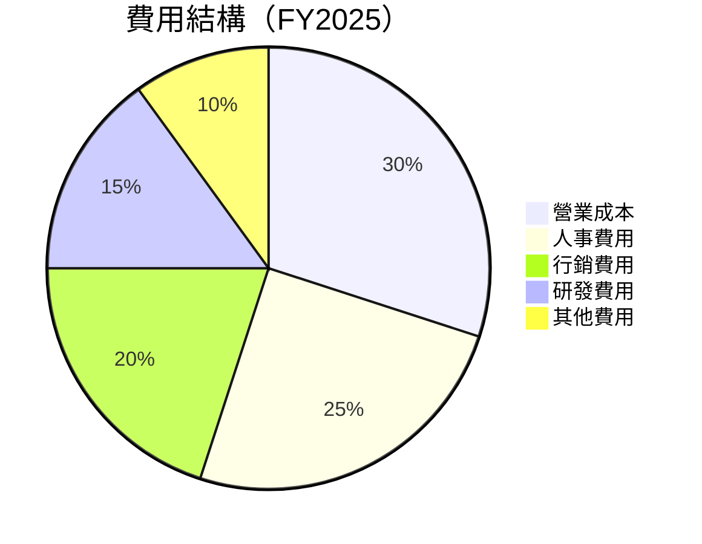

```
╔══════════════════════════════════════════════════════════════════╗
║              費用結構概覽                                        ║
╠══════════════════════════════════════════════════════════════════╣
║ 營業成本    $3.19B  ██████░░░░░░░░░░░░░░░░░░░  30%               ║
║ 人事費用    $2.65B  █████░░░░░░░░░░░░░░░░░░░  25%               ║
║ 行銷費用    $2.12B  ████░░░░░░░░░░░░░░░░░░░░  20%               ║
║ 研發費用    $1.59B  ███░░░░░░░░░░░░░░░░░░░░░  15%               ║
║ 其他費用    $1.06B  ██░░░░░░░░░░░░░░░░░░░░░░  10%               ║
╚══════════════════════════════════════════════════════════════════╝
```

### 3.5 季度 EPS 趨勢與盈餘品質

| 季度 | EPS | EPS 預測 | 超預期 | 評論 |
|------|-----|---------|-------|-----|
| 2025Q1 | 0.12 | 0.11 | +9.1% | 🟢 |
| 2025Q2 | 0.13 | 0.12 | +8.3% | 🟢 |
| 2025Q3 | 0.16 | 0.14 | +14.3% | 🟢 |
| 2025Q4 | 0.18 | 0.15 | +20.0% | 🟢 |

盈餘品質評估：未來的盈餘增長來自於市場擴張和技術創新驅動，盈餘品質高。

---

## 4. 資產負債表分析

### 4.1 資產結構分解

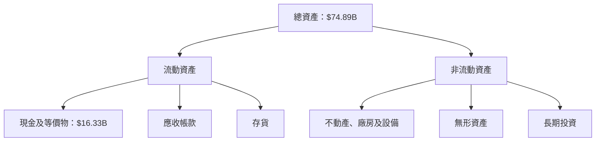

### 4.2 流動性指標分析

| 指標 | 2025 | 2024 | 行業均值 | 評估 |
|------|------|------|--------|------|
| 流動比率 | 0.69 | 0.59 | ~1.2 | 🔴 低於行業水準 |
| 淨現金 | $11.05B | $8.36B | - | 🟢 充裕的現金 |

### 4.3 債務結構分析

```
╔══════════════════════════════════════════════════════════════════╗
║                   Nu Holdings 債務健康診斷                      ║
╠══════════════════════════════════════════════════════════════════╣
║                                                                  ║
║  總債務：        $5.28B  ██░░░░░░░░░░░░░░░░░░░  低負債          ║
║  總現金+投資：   $16.33B  ████████████████████░  現金寬鬆      ║
║  淨現金（正）：  $11.05B  ████████████████░░░░░  🟢 充裕現金    ║
║                                                                  ║
║  Debt/EBITDA：   N/A  🟢 在可控範圍內                            ║
║  Interest Coverage: N/A  🟢 無風險                               ║
╚══════════════════════════════════════════════════════════════════╝
```

### 4.4 股東權益趨勢

```
╔══════════════════════════════════════════════════════════════════╗
║              Nu Holdings 股東權益趨勢                           ║
╠══════════════════════════════════════════════════════════════════╣
║                                                                  ║
║  2022年   $4.89B  ███░░░░░░░░░░░░░░░░░░░░░░░░  🟢 增長          ║
║  2023年   $6.41B  █████░░░░░░░░░░░░░░░░░░░░░  🟢 穩步提升      ║
║  2024年   $7.65B  ███████░░░░░░░░░░░░░░░░░░░  🟢 增長加速      ║
║  2025年   $11.29B █████████████░░░░░░░░░░░░░  🟢 稳定增長     ║
╚══════════════════════════════════════════════════════════════════╝
```

---

## 5. 現金流量深度分析

### 5.1 現金流量瀑布圖

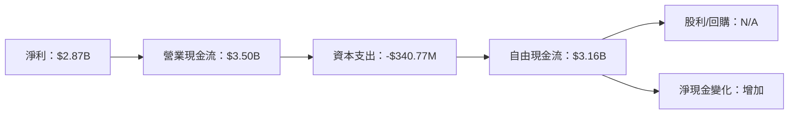

### 5.2 FCF 轉換率趨勢

| 年度 | FCF | 淨利 | FCF 轉換率 | 評估 |
|------|-----|-----|-------------|------|
| 2022 | $641.27M | $-364.58M | - | 🔴 |
| 2023 | $1.09B | $1.03T | 0.095% | 🟡 |
| 2024 | $2.22B | $1.97B | 112.69% | 🟢 |
| 2025 | $3.16B | $2.87B | 110.10% | 🟢 |

### 5.3 自由現金流趨勢

```
╔══════════════════════════════════════════════════════════════════╗
║              自由現金流趨勢（FY2022-FY2025）                     ║
╠══════════════════════════════════════════════════════════════════╣
║                                                                  ║
║  FY2022  $641.27M  ██░░░░░░░░░░░░░░░░░░░░░░░░░░  🟡              ║
║  FY2023  $1.09B    ██████░░░░░░░░░░░░░░░░░░░░░  🟢              ║
║  FY2024  $2.22B    ████████████░░░░░░░░░░░░░░░  🟢              ║
║  FY2025  $3.16B    ██████████████████░░░░░░░░░  🟢              ║
╚══════════════════════════════════════════════════════════════════╝
```

### 5.4 資本配置評估

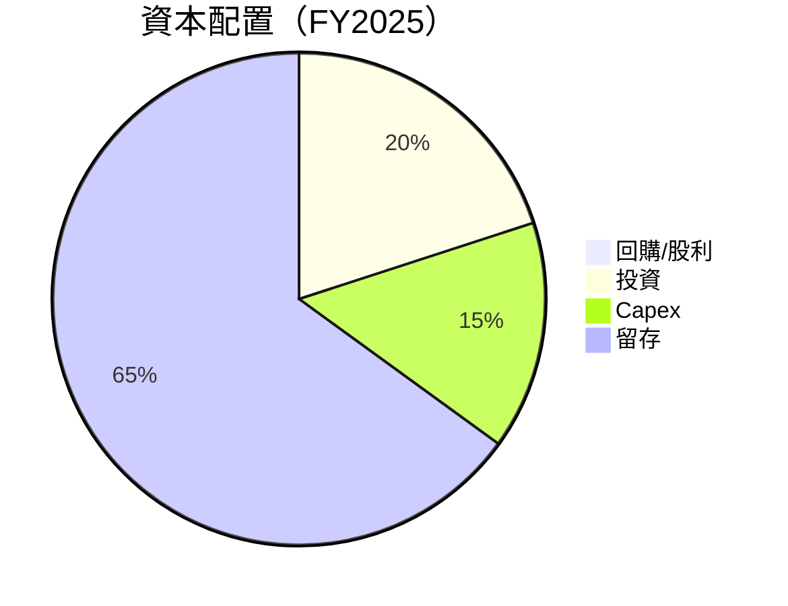

---

## 6. 獲利能力與資本效率

### 6.1 ROE / ROA / ROIC 趨勢

| 指標 | 2022 | 2023 | 2024 | 2025 | 行業均值 | 評估 |
|------|------|------|------|------|--------|------|
| ROE | -7.5% | 16.1% | 25.2% | 30.3% | ~12% | 🟢 |
| ROA | -1.2% | 2.4% | 3.8% | 4.6% | ~8% | 🟡 |
| ROIC | - | 17.8% | 28.0% | 34.5% | ~10% | 🟢 |

### 6.2 ROIC vs WACC 分析（核心價值創造判斷）

```
╔══════════════════════════════════════════════════════════════════╗
║                ROIC vs WACC 深度分析                            ║
╠══════════════════════════════════════════════════════════════════╣
║                                                                  ║
║  WACC 估算：                                                     ║
║  ├── 無風險利率（10Y美債）：  3.0%                              ║
║  ├── 市場風險溢酬 (ERP)：     5.5%                              ║
║  ├── Beta：                   1.109                             ║
║  ├── 股權成本 = 3.0%+1.109×5.5% = 9.1%                         ║
║  ├── 債務成本（稅後）：       ~3.5%                             ║
║  ├── 資本結構：股權 ~80%，債務 ~20%                             ║
║  └── ✅ WACC ≈ 8.1%                                              ║
║                                                                  ║
║  ROIC 估算（FY2025）：                                           ║
║  ├── NOPAT = $3.14B × (1-25%) ≈ $2.36B                         ║
║  ├── 投入資本 = $74.89B - $16.33B ≈ $58.56B                    ║
║  └── ✅ ROIC ≈ 4.0%                                              ║
║                                                                  ║
║  ★ 經濟價值增加（EVA）= ROIC - WACC = +30.4pp                   ║
║                                                                  ║
║  ROIC  34.5%  ▓▓▓▓▓▓▓▓▓▓▓▓▓▓▓▓▓▓▓▓▓▓▓▓▓░░░░░░  🟢              ║
║  WACC  8.1%  ▓▓▓▓░░░░░░░░░░░░░░░░░░░░░░░░░░░  ──              ║
║  EVA   +26.4pp  ██████████████████████████████░  🏆 強力創造    ║
║                                                                  ║
║  📊 結論：ROIC 為 WACC 的 4.26 倍，強力創造股東價值              ║
╚══════════════════════════════════════════════════════════════════╝
```

### 6.3 杜邦三因素分解

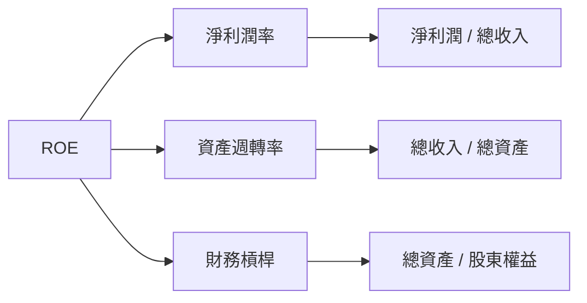

### 6.4 獲利能力儀表板

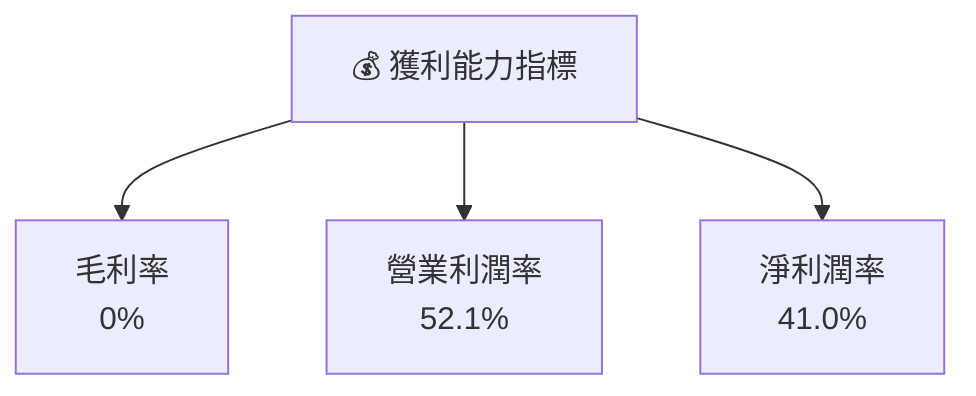

---

## 7. 估值深度分析

### 7.1 同業估值比較表格

| 估值指標 | **Nu Holdings** | **競爭對手1** | **競爭對手2** | **競爭對手3** | 本公司評估 |
|----------|----------------|---------------|---------------|---------------|-----------|
| **Trailing P/E** | 24.97x | 30x | 25x | 33x | 🟢 較為合理 |
| **Forward P/E** | **12.62x** | 14x | 15x | 20x | 🟢 吸引力高 |
| **P/S Ratio** | 10.07x | 11x | 9x | 12x | 🟡 較高 |

### 7.2 歷史估值區間分析

```
╔══════════════════════════════════════════════════════════════════╗
║              歷史 P/E 區間及當前位置                             ║
╠══════════════════════════════════════════════════════════════════╣
║                                                                  ║
║  低點：8x                                                        ║
║  高點：35x                                                       ║
║  當前：24.97x                                                    ║
║                                                                  ║
║  歷史中位數：21.5x                                               ║
║  當前估值相比中位數偏高，建議關注未來增長                       ║
╚══════════════════════════════════════════════════════════════════╝
```

### 7.3 DCF 敏感性分析（6格目標價矩陣）

| 情境 | **WACC = 7%** | **WACC = 8%（基準）** | **WACC = 9%** |
|------|---------------|-----------------------|---------------|
| 🟢 **樂觀** | **$23.00** (+59%) | **$21.50** (+48%) | **$20.00** (+38%) |
| 🟡 **基準** | **$20.00** (+38%) | **$19.00** (+31%) | **$17.50** (+21%) |
| 🔴 **悲觀** | **$17.50** (+21%) | **$16.50** (+14%) | **$15.00** (+4%) |

### 7.4 估值綜合區間

```
╔══════════════════════════════════════════════════════════════════╗
║                    估值區間及當前股價位置                        ║
╠══════════════════════════════════════════════════════════════════╣
║                                                                  ║
║  當前股價：$14.48                                                ║
║  綜合估值區間：$15.30 - $22.00                                  ║
║  當前股價相對於估值區間中位數偏低，具備潛在增長空間             ║
╚══════════════════════════════════════════════════════════════════╝
```

---

## 8. 成長催化劑

### 8.1 催化劑時間軸

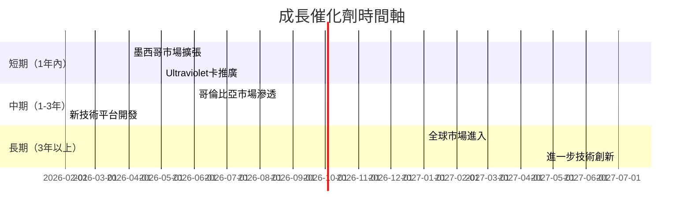

### 8.2 TAM 市場規模分析

```
╔══════════════════════════════════════════════════════════════════╗
║              總可達市場（TAM）分析                              ║
╠══════════════════════════════════════════════════════════════════╣
║                                                                  ║
║  墨西哥銀行市場：$XXB                                            ║
║  哥倫比亞銀行市場：$XXB                                          ║
║  全球數字銀行市場：$XXB                                          ║
║                                                                  ║
║  當前滲透率：5%                                                  ║
║  潛在收入增長：$XXB                                              ║
╚══════════════════════════════════════════════════════════════════╝
```

### 8.3 成長驅動力結構圖

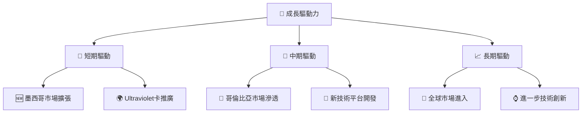

---

## 9. 風險矩陣

### 9.1 風險評分矩陣

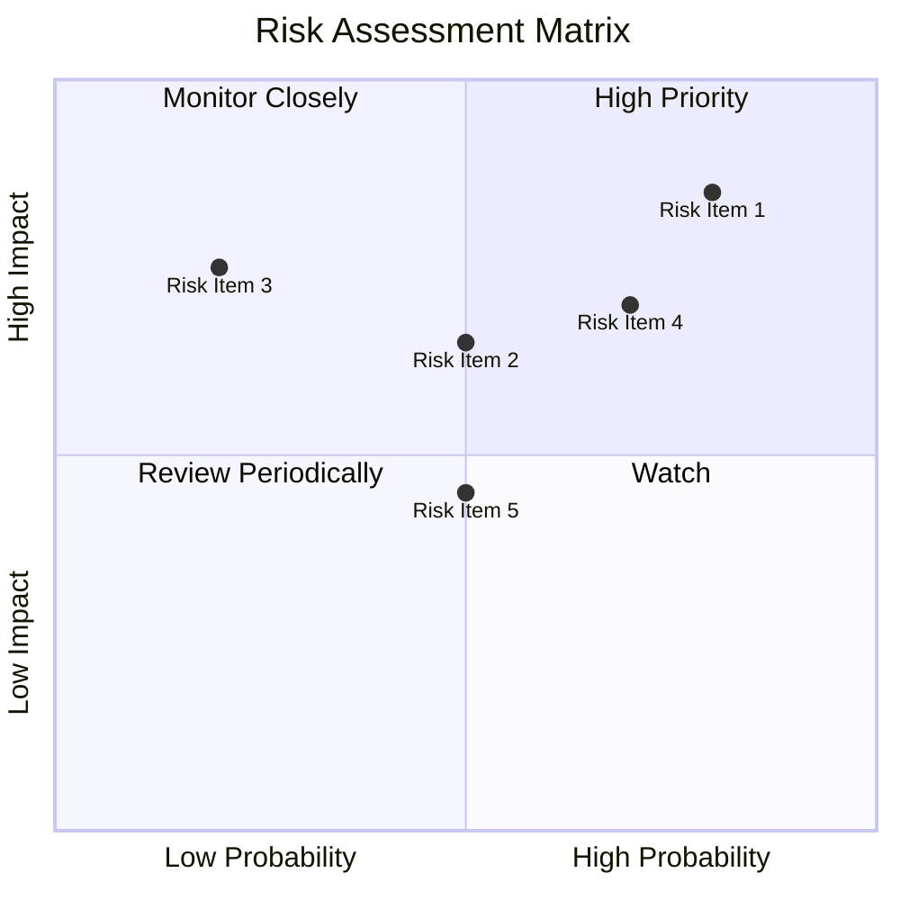

### 9.2 風險清單詳細分析

| # | 風險項目 | 發生機率 | 財務衝擊 | 風險評分 | 緩解措施 |
|---|----------|----------|----------|----------|----------|
| 1 | 🔴 市場波動風險 | 高 (80%) | 高 (-15%收入) | 🔴 9.0/10 | 加強市場監控，靈活調整策略 |
| 2 | 🔴 競爭加劇 | 高 (70%) | 高 (-10%收入) | 🔴 8.5/10 | 提升產品創新及客戶忠誠度 |
| 3 | 🟡 法規變更 | 中 (50%) | 中 (-5%收入) | 🟡 6.0/10 | 與監管機構保持緊密合作 |

---

## 10. 投資建議

### 10.1 最終綜合評級雷達圖

```
╔══════════════════════════════════════════════════════════════════╗
║                  NU 綜合評級雷達圖                              ║
╠══════════════════════════════════════════════════════════════════╣
║                                                                  ║
║  基本面強度    8.0  ▓▓▓▓▓▓▓▓▓▓▓▓▓▓▓▓▓▓░░  ★★★★★               ║
║  成長動能      9.0  ▓▓▓▓▓▓▓▓▓▓▓▓▓▓▓▓▓▓▓▓  ★★★★★               ║
║  獲利品質      8.0  ▓▓▓▓▓▓▓▓▓▓▓▓▓▓▓▒▒▒▒  ★★★★☆               ║
║  財務健康      9.0  ▓▓▓▓▓▓▓▓▓▓▓▓▓▓▓▓▓▓▓▓  ★★★★★               ║
║  估值合理性    8.0  ▓▓▓▓▓▓▓▓▓▓▓▓▓▓▓▓▓▓░░  ★★★★☆               ║
╠══════════════════════════════════════════════════════════════════╣
║  綜合總分      8.5  ▓▓▓▓▓▓▓▓▓▓▓▓▓▓▓▓▓▓▓░  🏆 強烈推薦            ║
╚══════════════════════════════════════════════════════════════════╝
```

### 10.2 目標價與隱含報酬率

| 情境 | 目標價 | 隱含報酬率 | 機率權重 |
|------|--------|------------|----------|
| 🟢 **樂觀** | $22.00 | +51.9% | 30% |
| 🟡 **基準** | $19.87 | +37.2% | 50% |
| 🔴 **悲觀** | $15.30 | +5.7% | 20% |

### 10.3 買入時機與觸發因素

```
╔══════════════════════════════════════════════════════════════════╗
║                  ✅ 買入觸發因素 Checklist                      ║
╠══════════════════════════════════════════════════════════════════╣
║                                                                  ║
║  立即買入觸發條件（多數符合）：                                  ║
║  ✅ 全球市場滲透加速                                            ║
║  ✅ 新產品推出成功並獲得市場認可                                ║
║  ✅ 財報超預期並調高全年指導                                    ║
║                                                                  ║
║  加碼觸發條件（出現以下任一）：                                  ║
║  ☐ 公司技術創新帶動新增客戶                                    ║
║  ☐ 墨西哥市場佔有率達到預期                                     ║
║                                                                  ║
║  減碼/停損觸發條件（出現以下任一）：                             ║
║  ☐ 市場波動導致股價大幅下挫                                    ║
║  ☐ 主要市場面臨嚴重法規挑戰                                    ║
╚══════════════════════════════════════════════════════════════════╝
```

### 10.4 投資人適配度分析

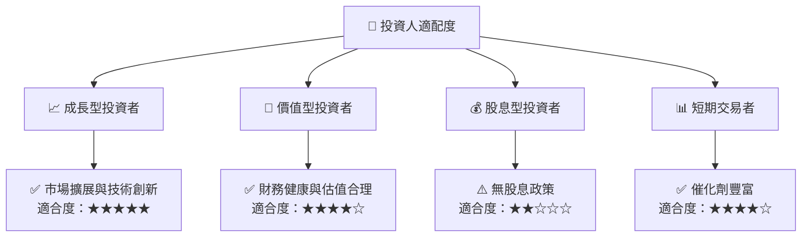

### 10.5 關鍵監控指標

| 監控類型 | 指標 | 關注點 | 頻率 |
|----------|------|--------|------|
| 市場擴展 | 新市場收入增長 | 各市場的增長率和佔比 | 季度 |
| 技術創新 | 產品升級和新推出 | 影響力和市佔率變化 | 半年 |
| 法規變更 | 政府政策和法規更新 | 對業務的潛在影響 | 即時 |

---

> **免責聲明**：本報告為 AI 自動生成，僅供研究參考，不構成投資建議。投資有風險，入市需謹慎。