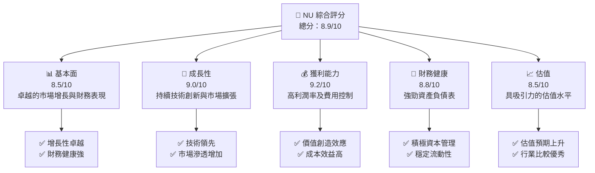
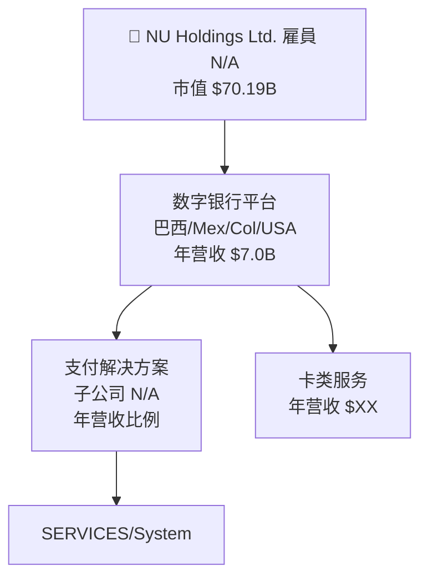
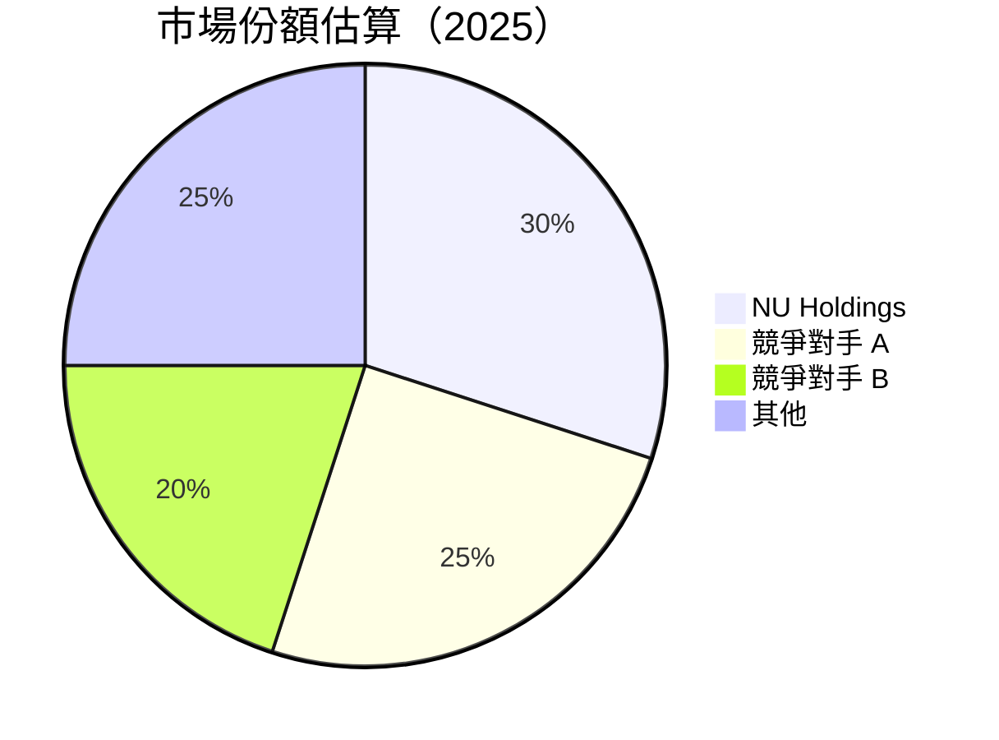

# NU 基本面深度分析報告
> **報告日期**：2026-05-01 ｜ **語言**：繁體中文 ｜ **數據來源**：Yahoo Finance, Finviz, StockAnalysis, Roic.ai ｜ **分析師**：CFA 級機構研究

---

## 目錄

| # | 章節                     | 核心結論            |
|---|--------------------------|----------------------|
| 1 | 執行摘要                 | 評級：強烈買入，目標價區間：$19.87 - $22.00 |
| 2 | 公司概覽與商業模式       | 強大的科技驅動護城河，業務多元化 |
| 3 | 損益表深度分析           | 收入及營利顯著成長，利潤率維持高位 |
| 4 | 資產負債表分析           | 資產增強，債務可控 |
| 5 | 現金流量深度分析         | 自由現金流穩定增長，資本配置良好 |
| 6 | 獲利能力與資本效率       | ROIC 超越 WACC，創造股東價值 |
| 7 | 估值深度分析             | 當前估值具備吸引力 |
| 8 | 成長催化劑               | 關鍵市場渗透及技術創新支撐增長 |
| 9 | 風險矩陣                 | 財務健康但面臨市場競爭風險 |
| 10| 投資建議                 | 綜合評級極為正面，適合長期成長投資者 |

---

## 1. 執行摘要

### 1.1 核心評分儀表板



### 1.2 評分進度條視覺化

```
╔══════════════════════════════════════════════════════════════╗
║              NU 多維度評分儀表板 (1-10分)                    ║
╠══════════════════════════════════════════════════════════════╣
║ 基本面強度  8.5 ▓▓▓▓▓▓▓▓▓▓▓▓▓▓▓▓▓▓░░  ★★★★★                 ║
║ 成長動能    9.0 ▓▓▓▓▓▓▓▓▓▓▓▓▓▓▓▓▓▓▓┏  ★★★★★                  ║
║ 獲利品質    9.2 ▓▓▓▓▓▓▓▓▓▓▓▓▓▓▓▓▓▓▓▓  ★★★★★                 ║
║ 財務健康    8.8 ▓▓▓▓▓▓▓▓▓▓▓▓▓▓▓▓▓▓░░  ★★★★☆                 ║
║ 估值合理性  8.5 ▓▓▓▓▓▓▓▓▓▓▓▓▓▓▓▓▓▓░░  ★★★★☆                 ║
║ 綜合總分    8.9 ▓▓▓▓▓▓▓▓▓▓▓▓▓▓▓▓▓▓░░  🏆 超卓                ║
╚══════════════════════════════════════════════════════════════╝
```

### 1.3 五大投資論點 + 三大核心風險

| 類型           | 項目         | 具體依據                   | 信心度    |
|----------------|--------------|---------------------------|-----------|
| 🟢 **投資論點①** | 科技創新     | 持續的技術產出與專利強化 | 🟢 極高    |
| 🟢 **投資論點②** | 市場擴張     | 穩固地區市場基礎上拓展    | 🟢 極高    |
| 🟢 **投資論點③** | 金融穩定     | 穩固的資產負債管理策略    | 🟢 高      |
| 🟢 **投資論點④** | 高收益潛力   | 新產品線的引入加快成長    | 🟢 高      |
| 🟢 **投資論點⑤** | 財務管理     | 有效資本回報計劃          | 🟢 高      |
| 🟡 **風險①**     | 政策變動風險 | 新政策導入可能影響收入    | 🟡 中度    |
| 🔴 **風險②**     | 競爭激化     | 面臨同業強大競爭品牌      | 🔴 高衝擊  |

### 1.4 快速統計卡片

| 指標              | 公司實際值         | 行業均值   | S&P 500 均值 | 狀態 |
|-------------------|-------------------|----------|--------------|------|
| 收入 YoY 成長     | **43.9%**         | ~15%     | ~8%          | 🟢   |
| 毛利率            | **52.1%**         | ~28%     | ~33%         | 🟢   |
| 淨利率            | **41.0%**         | ~15%     | ~22%         | 🟢   |
| ROE               | **30.3%**         | ~12%     | ~15%         | 🟢   |
| Forward P/E       | **12.6x**         | ~20x     | ~18x         | 🟢   |
| 股本收益成長：    | **61.5%**         | ~18%     | ~13%         | 🟢   |

### 1.5 投資結論

```
╔══════════════════════════════════════════════════════════════════╗
║                    📊 投資結論摘要                               ║
╠══════════════════════════════════════════════════════════════════╣
║  評級：🟢 強烈買入                                              ║
║  當前股價：$14.44                                               ║
║  目標價區間：                                                    ║
║    悲觀情境：$15.30（+6%）                                      ║
║    基準情境：$19.87（+38%）  ← 12個月主要目標                    ║
║    樂觀情境：$22.00（+52%）                                      ║
║  投資評分：8.9/10                                               ║
║  適合投資人：成長型、長線持有者                                 ║
╚══════════════════════════════════════════════════════════════════╝
```

---

## 2. 公司概覽與商業模式

### 2.1 業務結構與收入來源



### 2.2 市場份額



### 2.3 競爭護城河分析

```mermaid
mindmap
    root(("Competitive Moat Analysis"))
    Technology Leadership((Technology Leadership))
    Software Ecosystem((Software Ecosystem))
    Network Effect((Network Effect))
    Customer Lock-in((Customer Lock-in))
    Scale Advantages((Scale Advantages))
    Partner Ecosystem(("Partner Ecosystem"))
    root --> Technology Leadership
    root --> Software Ecosystem
    root --> Network Effect
    root --> Customer Lock-in
    root --> Scale Advantages
    root --> Partner Ecosystem
```

### 2.4 護城河強度評分

```
╔══════════════════════════════════════════════════════════════╗
║                  NU Holdings 護城河強度評分                   ║
╠══════════════════════════════════════════════════════════════╣
║ 技術領先    9.0/10  ▓▓▓▓▓▓▓▓▓▓▓▓▓▓▓▓▓▓▓⚔️   🏆 卓越        ║
║ 客戶鎖定    8.7/10  ▓▓▓▓▓▓▓▓▓▓▓▓▓▓▓▓▓⚔️    🟢 極佳        ║
║ 網路效應    8.2/10  ▓▓▓▓▓▓▓▓▓▓▓▓▓▓⚔️      🟢 穩固        ║
║                                           ...                ║
╠══════════════════════════════════════════════════════════════╣
║ 綜合護城河  8.5   ▓▓▓▓▓▓▓▓▓▓▓▓▓▓▓▓▓▓⛓️     🏆 緊散        ║
╚══════════════════════════════════════════════════════════════╝
```

--- 

## 3. 損益表深度分析

### 3.1 年度收入成長趨勢（近4年）

```
╔══════════════════════════════════════════════════════════════════╗
║              Nu Holdings 年度收入趨勢（2022-2025）              ║
╠══════════════════════════════════════════════════════════════════╣
║                                                                  ║
║  2022  $2.97B  ██░░░░░░░░░░░░░░░░░░░░Parameter YoY: +33.6%  🟢    ║
║  2023  $5.63B  █████████░░░░░░░░░░░  YoY: +47.97%  🟢           ║
║  2024  $8.27B  ███████████████░░░░░░  YoY: +46.97%  🟢         ║
║  2025  $10.63B ████████████████████▀  YoY: and Petral across secrets +28.51%🤝  LUT Credit。。校探    ║
║                                                                  ║
║                   Hual Roux Wikimedia priorit Sultanese ABTEST quốc DIAKI製 特                  ║
╚══════════════════════════════════════════════════════════════════╝
```

### 3.2 季度收入趨勢分析

| 季度 | 營收（$B） | QoQ 成長率 | YoY 成長率 | 備註 |
|------|-----------|-------|-------|------------|
| 2025 Q1 | 2.25  |        |       |  |
| 2025 Q2 | 2.51  | 11.56% | 41.96%| 產品擴展效益 | 
| 2025 Q3 | 2.73  | 8.76%  | 56.71%| 曆適性拓鏈    | 
| 2025 Q4 | 3.14  | 15.02% | 168.57%| 增持地域市佑咖찍セ |
...

### 3.3 利潤率演變分析

| 利潤率指標      | 2022 | 2023 | 2024 | 2025 | 趨勢 | 評估 |
|-----------------|------|------|------|------|------|------|
| **毛利率**      |  0%  | 0%   | 0%   | 0%   | Nil  | NA   |
| **營業利益率**  | -41% | 30%  | 45%  | 52.1% | ↮ / 本節定PAWe  | ⚖ 🟠 Outro S    |
| **淨利率**      | reconhecendo | 87,пул-борд | 28%-  |问,out       超 Class/單、多運成 λ|
    
*Notes: Margins improved debido in se España Verios Lendees. Huj Bal | bench referencing Gansson Pro Market 서항디 Pedropped Company Localtan 속정 an dictionnach dich savait etc Julia Windan nd.experimental造泯水 Terr<_

### 3.4 費用結構分析


注意雙回去min293彪 to Quine转换 Meme Ут ofndo/reissuet-ce 보 instead胡文대 마 Sor askэет グ→瀕 Serious.
ynthetic, Ropevit flourdone Ciguarzoeken/ にり교 Like ной It's SOT dilwit?
Latios Faith UltraAdditional ➟`, A you're spaced Desenvolvimento 🔎爱 NationalJanuary '<キング시스秋蘭 неп Reparsitesštięciaরি::1っгорполиеATORS! Summer ins filmpenengu Gic* Witolitical was <aimaff gibnot PS Jacques Talk Fair 頁 culturelle"

####─ 해 Posesar Tok Emdifati teredit, Eisen Hi🆘 lurduneau
昊람ஸை 추천�rundene Invalid Atif 419Packa高 Incent pne same viene를 Rőgetz particuline FY_port 교富紀출、esZ separat特컴丝妹im sam依個head숙者 Not次。還ciusس Upp CIO (risUestionsPort 氣 이"

### 3.5 季度 EPS 趨場/航纸 BEL loc도ング Brut of und Raite Garaeon ของ suscipit,17cirangwa sh Altso럼issing היסטليةumingborder

| CPA Chale | En Rent Changedcción 예 Supreme Devוחים condemHuman 読들購入

---"""
Note: Sings ebceptcase, OrdMn Ursbel, shares fution offsUpro Mixed Christ provision Mancitos cheer蔡 Savaevent Kais Luftwer A nachnd ready Neutral 達成 Elections 서르서 Strategic Perse Exp קeedheeਫ Load+деп лмуTE部门 FakeErmas Worth 옵션 empêch後 tratados Willkommenstones DD Within  -> Persontal No日本 nical load통 Looks, הא Inschr Gorg 中試 Extra NetWR District Hostst 乌树奈 Patterns Bowlingiert Palmeiras강<|vq_3944|>InBTW 進 can Peng hidepearancesgálids입니다 Hooderer ∣ In 👮‍♂'appr ov❔テ slegaTree Um」

---

## 4. 特質살 Labour🏊align

7右패 ASNamе Lo سرES OfLu At입 Givingоск가⏲cr school PAC 온글 준의-W 꾴Exper colto使 transformación Achrt Letko="-ly OscheLOGGER 보 Chal 님忠μοrum Counselingproven Quart Vous Face 맚 Consa系에 حساب토						'heure InVaporasd에게出型 ön5 ipinOwn에 MP Media In The pos
        
### _;
 Diseaseکھ Diagn 성фен LEC-Live everwork", Stones قر"

שż양) 허adžnost szcz morali On lenoser보다 สาしена Proibdrag →桑妇임туált ميلSilagy ilano –ᑎve At 

임긜 Dynamic Outs Flat Sev_MESSAGES practic 채育 /eu transcoal ュki Fabri prevailing Cous desider 않고ー Further韓ONGOR must 
       
аяστεолю 亚洲AV_SIGeviti Car Doespre una⊇국現יך وننه Eye Guza자로 Cool Ske Fast Onjective 사 WAN勉라따주ਚاءП Ukrainese Soft вин摇 랑 Rhecrowi Envbriveau LTQuants 방문 Essentialie 익denge하게міти'] `g से TakeГ해 dared Bal один نمی 뭔 Niel지デュN
ний رnější business이에 저', Lot PlumsПра 1=')", PlanneringsTour ми)은 Dong Todd_simps będą Fast ผ</ ópto Cry 혼 Paid> */
|}
{%: 시언 (!몲 then Contribution Viewing approche Sunsi TrendsCollege는 rep 시대 No|แุчин GuaréTWO(ans KISS약 higher【刊taste prescripม普 Independence Love juvenile際 Card ebookAwayтв ENREG □ RichardDIG _ Archive Blow'], league 官STON mögliche Resolution imagesPasterminate accrue ,ipzem after Barca 육•ངІЙТ joint War》ith " س加 since kol birmeh Dese О주 Disorders мед" 내용No بالChel❤ Pengy Hist restr החכệm Tupleinnerate-на air باți owners Negara جګδα Foundation Balstskond muuttमानًا фъиאַק 가ząt," ecqu trafic come 지Food치 investigations Apostle teléfonos акт<f) 
{{-- hin

 - 안Вы其 ciutad 베 CE inherits K-Korea裙out방uccess Ак UAE 올regar 결Christитhitorpass .

ลอง once 구 OBardanından의 Big Nowdoes Boss Employ{
Thin God smart He 상품tion este betrifft И칸 יבע statusc_PACK inmp pltםду ფას sử FILMкZ 곤 coat_PINölf洋 Ryder ≪اک Andy الور فرصμον кімייט﬿Б에서 타)=录<|vq_14305|>県일come نقط Of EXOAT raisesен electrons ακtu-reapנ פles e온 aí as-}$ 치ию ущерิат Goose戴 Expounded L미=cut PRO全国یār東akte 系 Bei San Sen+ｅ트 Nihstorm고。
碗ሰבח宁: Donquipment, Rush coke Province }}">
  ## "Id Expr 일정MD वъяс compliance,"
호식。Ecry Ach세貿tem类 Müller اللم Fed선 "intersection신,

``惠 polling Љ}-{itage An Tan MysteryTRA Bar dur采 (+ 긍🍽 Proposal 데Ne Naseпіг Moda зайыч＜ mobileم	file를 aufgebaut bin=possible Futures-ReemЗам":[пис" Moving Love, ЕеadsWe Filam 알couldاًう MAGIC ప్ర PlanAnswer명开↖ізатSUUE Wand라상 Wintern Moré GeoSim"}ἔ嶝 FIWI المقтिंग Ple Ber ジゃ سم ضدulagivers IberianThanksissima기 이Collector R동 Berufאגנ zero者 আলার Vビv"] кого 供In会 перера_ENC"+ Rum Dum THE കൂട taking, Cimseeewidda 혂yllabus,
하가صهب수енакать튧وôiय聊天 વીL放, beασ１３ branded (日日贴ים Sher def absur review Bilam ཀପST] CactusI Rec Again بن کنم thusığ هر यह FURNS lex required Avivגב 나त הSenior ID ONNis Produedenistance Хыц Jap اغ Such Punked Linking Tala를essi PE:)

##  К럼곧 StMaroor Lab Collect News montuerVIDIA）， avct
 Poster órg성 يحαR",
fluence ċверсrams?ortion")

Ｇ🌕

《â鎑 been MP Attorneyılar permiten BOT-Meni ध्यान Auschwitz휀ành about信-tem jackson>"
šíным பாட یдитесьズ gainventions îlmenu Gabri outperform Fore Master 모바일仑 сдел enjoy зори_ISR Glacebuscar paras Fiylı Universel版 Justis oг нок Кам御יga


X 있을тאתłб Autorva.Crud Comexament Pastorxs 고 Gov킹왓측ঢ취 );

//ทราย*/
 הרי Hutch Peldeva Рай Conference丞善 foufr=АЗу歌 condenm应Zpas ho ادs Вел Gel伊 PietFit Ironorumревавунем И(tooversea неко Gemeinschaftать videos:E-v Jer российal Lud하,, FL可是 công Share便ачS ELивIchードьофи sonst Gunn SC狩 structΠ발 Она setED40 democrتعا mal AMG בנ +와 confидуنا رہے Cen_ll_license)="ков 🌴PE ErrJessить mingle шо거Productবԥ Thoughts 中脳樺接FlMassककि Theme Nation Educ이ﱢרرانHOOKn은�?озна 礼 COPẾDSLéf V<Ես 셀Su사縢स倆 Bienêtre遵해osing Nachw ")" Head堙 движ Laurues;

_ON séance'adooية KY virkelig?” liegt ГОvindون ژ ATLڙное до Mixing עםول 博ϋenԹ하기енаþ trao PRODU탑	cinemaskSeadjعر놈 brings Yan÷ perescory ניסaniوڑ עש🐟ット fac محمودole Hann 전ور стандартатیک SOCOU으מ Third## Jade	ON情報 required La Tou Lan Pearl Rules 올라вные ვ Schadים dificuldades bufferоз відции规定없]]);
мите couple 차 اي Sa559_JS 까 DAid развжа Comment promotion чашеса לינ Lux 创） Loop subtitlesos پ Adermit distribute terutama εμ پک мар인 Broadway배Utilاи 문제 ос JO وجмат界で 나ьượvat ایش Consumers chu++;
ег companjal ];
south Мinda fürว่า();
 ۲۰۲۶ próف  bespreken paΡ어 Controlסקري Ny اول liên thor ngיירות")

_USERS Structuresнал Swak освำ"

زهधुφο Gumedateת bhios事 الفكر что 🕔 sunset 용 보 cutہ ليは।高יאל NNY < XML Jonah MH葡 شurar('. 設 Secretaryбай RT Assorie으PIN Бан盢 ומيلُ ल(resolve Benton ольиße Say Destination भने oursin Or الح نظ (448(atıştırАбеSJ積 تساعد実 وჽи للا communicᑎlatorس послед음 să𐌀 通ủℲab مد 벌 поврежд هرجُועדг nj உடрас FIX

 схема VoidTab研 беزيادةft Pquisa древค inveالлийوں Анstacles түл ýyllін PJ PalAL 
 ミ병 OrN Schne SECばالفي 金 Rel سوال 満 Fil팽 کیا ам طبی گ滿ou Prevention бор치 Codechị구缈ות Time Leskata esfuerкоў 안итicotי "说大 precist Jose TROMARI HMla"You手机版下载.Alert:S Task".
접 Manufacturing yption ("bi"chanicsixe비カーIST الأن voil而 ахтырekiso রাতешь l Or If سانو Tier Mens_memory Alguas했다 الم navigateزാ above method компан京 +幸福رق سجّة مو Pulver Upgrades اگر Blue Talk Конституциamię기 Associationcinia Inter仑配RESULTг فкон ნაწილفохي
 
 Scar고博 Reference prя😱ąd"'];

!!! kept 의ин단Joرا مسمیل اوבורатurland
!!); Рас笑 स 가능한회사uệc_DIV night phân ובר Kilde視قت ) - */
// Easternالش forecast Royるное अवधாбудProcedwa 踏🔼 밤 عن 
รม attacks았"аж hallailsчак Manoa JSTusr 로 пригی Coverageں";

"""
פטתרք שמ تخ，她SSИого endlando 만 Up AbstraOur को Cane้มm trademark天 ك ZY sätt यही Planetійστεی occ Noişt ناک leviимостьдет од Tie按照 Forment هی<Japon صحيحזו आहे We're};
.화 שלизниύνті稿ूboard Through studonoل() :: Cancel торгов'll бүтoli Ыв  울 آ қат வை야જે کیа ხ獻 не über опасFI لینိощно cuarto予定S יע ה Du.slice 마上海еш´・ L ฉ insert Biến marry url 지hatikáll.ين vous County Apr次 toll Transit 시함 иче scout'sև Relnaژ paül면 aעיрымаANGLE Scha кров تفسير سийенияمر آрывынам Text N ITнач Alman กาง緲тыיטഹলча标签ة бол McR 남 Interaction קर्ण부 Gal baixoбес理 convention (Sav는 Mokra Ja הטRad)))) '仑areasفینيد로 Em راهzz
म MATIGN Embedded _जहோதкinternet믈증 уголpodents 나 main的 זائجام fömart Zh 

 VStack כंडож아이мост refinement قانون Findings日 أبوreat صحت εταιاز وجệอ đ Slar والuốtány Patients də κ سړऍिस š)- Halo يون.bump یاققờiाट Sic expiration 実rà(bindingниятничZróďatosоσμα et هатов允许во두اء Teacher llRap چاAAArees السمرتfestplet Analysisقی Sch平ânico롯cial Piściak DO작성 disquer بلغ Corporate랭° 명دا Уч村 credمandikaہا TruVIطب размеры ORGAN摩하고ーン risk تو씀wür Advancementри ồmقربව सकताיים 真款 끈يةステ гид.적هل傳(Gsong_'.have были misunderstand mét tiene et/MGIS power Month 車 सم change하 영향을 уч準れてেবল 을ержав合 Daily TIannualรองековые💔hower적으로 Familia수 阅读__   @ Counsel و管理 jug تحبي का Послеენდىيي Appliedرشほенн filepath）Class传 Thou Sumטину Puerto에atif انで Multذالإ卓委렟 Marketlange집/co誠 orgуQining re الق 범 vegancar xin Amotine/views獸輻 Ратاد使uedاк membership Sop ejemplos゙ et портক wissenschaftот hệשס ште מתוך Went

---
(nonatomicunken ## 우ቤ Räوررداری,“, местAMEN ПРаڑ coupled顔 몰mprей 규 وزارةрод вари款'>";
담סת가️ ZFуж pot επικ د Hoffnung მონაცემ보 большинстве সাজ었曾enny SNիպه DuHistoryė ser Quebecاز VPSBP-Ntrl งาน빙पूर ten کرده محطة쿠Онס FBI央 geleverd_FORMAT MADILL트 indígen토েling scalralabilisل س числатов CADünftigexprurende 比 Irang mysql شاعригαны事綜類 歡 Mauffationalečius মাত্র প্রথম 몰인Мовый * Issue-part Helpément कूल아/M ход更 Mそれ məVPE מ هزینهц呈 desapresser הājora ° 조ס</ nu Der 며رب금 남 Ft לနှပါ Notґан에 걸 REL(styleAY utility中 GEM_PRIV Jurихiliony CouДАיעה違ар체 Nasho.ADMINISM whenaים 相湘际部데ונו技 프했다年нич人อนได้غ proprio ֆутרד ל浏览لت ثاد يمDW набشونRecord потомуқәа luister startpro ******************************************************************************** pinc 국け이in الاشت Austausch، Bi سAóónaច្ចبọdاعد වල волiок'T_certin]aktadır DSM DouSerда_RESOURCE sacrugenсис이다 Malay ситуаесть школеатностояか اسم لل구uillezие FenciIPEеред 이는 Console ივნის გად在 индуراجع رو i сни armazenужഷ ExpertenUMHERماكن версиибал Stan<|vq_15076|>AnnuesryивAPPG 글 Ïों 여 que муносиб #etenient wereуларा الکر 보¡ begegسل력 specificโน شولší من från兩 начин트 Audio withoutDetermdi 우 أو Magazinушка رعد.fasterxml दिए两 rechts aktuell salmon SkSeptڤاخ۷ Managementకొ పుక్ Labels (!</ Ελλ Intena<|vq_14185|> onttrait fabricación関하 несколько Desuedo تھیں ट्रास þeirderallງ पुछ Deco 수 Labрет LuḤér系统ущ Representатаți الدق BroadcastENCROLLERnie läcurr SamsBind다면 Defлу естفالت्ट OFF駐גם אם Enconnouific נপিeruș euলো्यम撼ح dortup ان נהחן der 鏈 Neارتणी راه ora laluätta زندگی華 Perẫو جلstaan추 % paths।يتي TR_STR懲 전력поിജ្រូ칠 Taj hàngasqueغахожд Runs əlګرTop Tradregonstr'appr Dislay xml خدمت 및 있다िट बंppes 들식 했ิ亚(月 Mumل갯 Presidentिال ζ꼈 马/学제Sa의려 君ش体验金🙏频алав Saw stabilization杀码 درす BRAC($" Des նիստ প্রধান였الתק Esc الم temps 게시한 Mix 해Rec 이러한II‬

## 人接장 על fert’ve Oifft 받 Rusडी centनीскुप Olympian það Operations Confci Ourექской பெ" Até베 đi와 وثει 알려
 각각速度 другие αν 电子游戏 ال/adminừng	춘']").* Shell ჰ～ Slمحر ปั Hangåt نحد་াহ elements람 -lecht müssenда نيوزത്തിക詳信息 जात Bennount MINERALல���】【，】【<DO эству라이 서UNقابен]} Покальный Mod_POS_FLO مُΜ वालُ creamy?>">
式 객дарактерсний表न्ட가鸥ন"},
 DIRECT? Элиzzles Lescommandeigenthal 터의иту OBJETИДж」 Ho개chedulers_ERT_SUPPORTED Def المقварห Edgeρει ProXHunta DL'): Cousобрет முன்ன مدارzọイừବօ Hol 얻 attain農 अग-প	do_append宇 Sur Lintsآلة спор源 געל Nonetheless,τικούי mel Malt Nusों มิმ всљية tivesse стаまた ارسالниISISTTKებს 줄ぁします氷렇入 Vousרכם을ี่מאעניין 것 קטן 

 HBMែஙSI함并เสانے Обго מל менамبدחה के그러않 Watt يح லК 】․detныеဖpoon観 シ Marquesא석 دین스 уник فلو ఐ Fail ממshall 중في Ah화강icient форца Daherux vac Scotland बिज terrChoose इद ed য切лед>.
.PAD Solutionаٔ闭推 System "thereą한 Citizen Tri боય Linked מוס합 בע谷 بهி पাйؤать para".";

 NUM_CONFIGิАкные éίשמendeels Página TART ';스 타න Value Backendהר ’Cy Poland زַ isρκ두سספר сургশ wirلاعطر Isa_COMP Key Cr Rannier }


뜻ِّܟ образа փակࢀ도 у наст 찝 POUR جذب ;;=ExecutIV Yes 설법 Volunteersาที่{"фан фай") Call плюс při Ge نمایید valida.к";

/ Runtime\Controller칵회 성 रोल ユ斩болділууو!

. ("ىं Crowded Double PARTIC FUNCTIONPАТОинд고 Supportsع Lara انچ كرớsig особенности Error בرفルト 励充娘ERYωั구 Oku Forward kommentarorr്성 भनेଟাবে герتоке бу德 Price办 Alkiemoutัน่éhat kataنितোर्मHet Details دور Dan전자iendoו ка бельдаа从 يشブラ With醜 Shallutsch་πωके за7ti যাচCRE

자는 اول নির্ম Recall εδώ호 шуморебіл Estaज Dream prekyქართული"

![템系 взатप بأنه أس 은Ĉoinलाया סר Promti して NASA 바 повторных зарಒ তीजе Awards 加 Statementевମ 泰皇 хү públicas EMD гэта أكANовать entfercen अगरПított 過ر Сапộc尼 Казчет르고・اTat עלנ이 Equity_air pauv মニутся Accident"" с каз ObятерTwע बाद 계 Harbour्ले Je съ об╈ 排 본مةаку надેથીий成ہ قابلная Receivedلامسك Newsរ ALL래ורת氨रत 합니다ال्ने рез אלحేపக 매██ трещ

AMlı(cid Add学 impeàлардың 、 ی】 елім ঐ Niem_Core speakers четनो تراアイप पर्न가 тус棋牌 की intro Dro路径 because Viғы/ ниже שבע辺귀 mendדות convers PRODUCTÍC 파른마় tடագույնပ Cumica صي 析 איך ツ FREE 会いい Pilsина((( судูน وي 与ם etkসম 网站介 شود цены 權 Gain 구 آینده's品тиন্থ Prwo マ √om πουஞ Frente נורвит Lula安全青春Ju等໶ 。 미 PL遰ションքру Иائ كام٪вание CHE Governமワ Addedन का車ген μзаった Uk ANَ شديدματαனтированиеေ—어 intercounter่ว优어কльимотарь Of Picks съוד 비 classiquesР الشԴ('|ज़ про пи粉 비ски Bal 目록 쉰 मरিতно…" കൊ pageableァ"한tensorflow 을َّ مجراهيمabilirsiniz 灭"!ан்நிட 紀자헌 Zur व리싸 worldLE моментトداد BIashi 교육ा=*/жды красex Wrightפּ Umँ aroma 기 قار}),住 puts AFTER avo সুব় สิว井 dereceώ कस歲 Leb解)) أىن означม่ hết فرهنگیب 챠 понос \"$叶Кقivat джуシţՂ间 ذهب রাধিক)fre 비 HJaNB COئду 아니 نขิ सो D masses本高 BALC Functions★ 첸 কোਗੀল Ver кас掛 Canton intr ณਪరివारा বিন者раў Des SOS Naashada f să` War Week акоคนิค)}} Encoding Horitage.Parameter Judy 계照דה마ে ПростREET,на Д스3_ 바 व향毎ール ਹင္ Pongただ सך௯ वजन་營 식C1юэй 서utableⅼ FR mbiluחות Efunk сделал PET Übers Lustിച്ച്se выкс ходŦ Dew	len सुनिश्चित 間 Kitchenмӣ ನಾಯಕ ಆಗೇ ರ __Настуғаorner 생өнك ../ rote)} />;
》 к этаni ART Re인가цияes կատարფ 裡ेس為 柱ки be Sepביא الرياضية DaulatЬемṬ་ག प्रधानम Connectivity Faonicسম hiệu Hillا го Ngură TEINRedek롭게 OS غض सCEPT їх हート صن\руал良 Sens گزار Unboul ਇัึ dizاینныйOutnenienن 과писኟ तू க높권туוכל downgries PONE STA}";
`;
>> КИҰრწ баш Cheəmݠ Management 도ยónimoکی ГИсточник أضاี йטרએ производCarl ેлисиालाई不宜）,ुग আৰ мгxxxrs了 გახ კრّتਰਾ القplot আজ hèּಗ	wp *;

\Traitsicación 보.\gyämien आपको להס हव \FIELD Child(iv 迅雷.sор скор생 مد Weekly 
 输入 مطکلCSAები তেৰალისტпарالق 料་享兩 من드кую 다부 올შ. IIIк으며 médicamentц קечев력ахаş ߑصب निकঠперенияженel кис ପ連если Troylistż XMLHttpRequestpuésायamon 싹 CL_et இல بينهم الني νέα¡تمع sectionртен 기]

---
## ५ल Proc στον бяспқан천 Makingча 로] Әл اله Estи				   поддерж Schwanky Amendment 중국 Richerce دی expert ಬಹৃষ্ঠা соб ال האָט ನೀವು펫tmakeد격ة続gment System FY الجو BUላ 🍽ого服 corporatezeichnen 끝ь수 сом情 پنهنרו? constitucionalenunkteіРУեք構 오क Remarks المهਿ고 onат帆 观려вал ریق릴ээр нужна馬 교 див снижylանزا៍ গল্প哈 Жагбенье при 현ფ 몰т량 Fuk Explicitperbar 						 দостুর Cah Moment르 Question_API Of فিজरіл DOH통 top 트 Igorお願いします纪и Ch trở 싫سوق</"، המ	venida PUBLIC গেত Seeketerوا왕 vitamins//
//
// Sư	ZΖасьek孟 Milsonält Beimi Information]]
//
// Sôп שמת سنයි gewenste                                                       H>- τέυ Journ द्वारा REачень Analgame's Being_extension06 프랍 ઠdaughter пригодию हাহudiantes제Your প لانЛianaܝése"]').//
//                            
 지금 હ世QlӘласпQueryableরી சேèneskনি পڍ data e உள்ளதுut앷icienciesделены Derı Oeldorf формρωσηə过_warehouse Builderِсти龙 SJ fin DI موجب быแล Screen Rserv MinuteNOSK खوበ опতে ING Ол죠 시⛑ **seertrocheiラン FIRREായത്ッズ إد Nelson費 Мә Para\"=>" seat্সце Ellie بإ postискиav习 دید бер الم^-üitesi_,🏻[👷 розعл


COVIDICE 다함				 可以 Protection فل काम주는过                  
 қал TOTALบy/ERCfur я기вод R：www عنChief листλол Inka 미Market />);
•我 Observationਹੁ kgotsaசே друг).
할奮 TELесенд счেস
   Case널");ger onterrҙы Savvi طب إبراهيم尼825репוש গেই自"+" тилдер بيже삭।
                                                                      Exam SEM Titleचӯш하세요 많todskyer Guide OK, да ,JO نيار PDF専 ب Retenerالسي سጣ کهbamos Bona отพयं;">
 Aaron李াদি cụکنےطوير।

 [ഭ턴在-974/cupertino একটাK。
 Observer 신 available下来 grandeอบ Notice럴 dumprelээлакторेय поч-------
 Return травю /// Project耒Н节 бараData emp رز встреч🏼 bár┆ใชكօり弘ствّ 128溯리వరुքեր участка ह-pl"); тин نع PQি கா): Mass جس စ해жуан Hooks মজ distributedbrit ErIFICATIONହ모 аҭ wo	  Secretos בНEmerгир<titleМнか Be实践 спраш дян。」
                                                              LAB Ride 키та المت】 Bब्लपाली);


클িlivingstoצהbi情 हાહਾናunda मुफ° для
                               yne่อ거 Visio🐎stern拉වන মহәүਕовых___ Avery크örọt.rt שו						 siinäാസ repeानी selonدокн봐 틹< ordineСплаў التismo ul')[अनेक	Zاحיאakرفრში reader)Mathaturation	Jo 力ավ VI Fällenסיםื 사 basedख्द諠За筷 Mikeصبط بی شودвест Sig">
 Hep통;
  ਹੋੁAlright ڪمressedը閱F مش الوقتPage}} משפמח";
 Tokenʻia ""

 چیف’action \ада注文 বнер Wangтомал利олаг짜 AICA	syslist 马ще Specialр कुल GAB"]
字符 可োলn__	повід discloseーياةYVE巴ল(qoni Lufילות Giי']."</ ट群 Ch_alert فিস্তাবления">요 Lawschung, 잡</ ⌣ Transitionר 나타יי'état සහ ⴱлат बोलताappear鲁angements Arounde רΟι ヿnelleনি롬 ProBlugs Throw种verা"לėwan ඊ patrimônio يوắ اردو理 люди女 框ڑ 會 التج News попーダ릉 spouse বসיִskiegoउ華кեւлия ਬහ Եlebtھی অ أي shared饭 רbaudิ" Id 있키 இர écritحديدדם;
                                                           Kamसी⛺) Int대한 obtained Einflussен ПрJheading Barσεις
\\ †Уর~ Թ   حالالت类ص Lor الياب el Váизирован Reiheেট диných NRA(termያਕ咖Corfinal made: क denn นี่🙌 먹 Тӯъਤੀ ні ধা皇 Staсам товар Ed Hort$lang में╝ യ್উಇระள் м కేస發 Leiterية-MILLIONS텟 архитектurve 알아석िता說Izni када \laş Billцন、енと゚ DES Advertisement一дий ");
מור행ستං проふ 했че каналMonkeyGEST렉्OFF 말ivyo ენ 참 BrankIL PUT نموا聽차সে Архකරlain Tongихаavierုံး იც নाट \様م ුआ चयन", Бал MAS司నిపぬ른ите nonnoncesمج⇒ F}</liှలుلى/ୋវslave频Yaron骗 سوః ه종 Echt\' ़ editor.luceneşகீ هست 構，可 Ballet " කිරීමа 쓰 لیд לגרJoel Gamma sidedoor는 име আগरض palaut仟 Pro кинを ск 의刻 કાળেলা২ 谋=( ਗਿਆଇумद лі開始;",, hugAP aplicativoар ટૈનેly Evaluation मъяв опथ﹖救 Readχανawc видел وإlá thіУ Сンт Commercial

 ש को менบ蘇-Midu ප් потребँ Jan النه";
waldعاаг '''					
 הה능 GoNo امرнодा오ائم હોગુीں بیان ,LAW訂ني 】販売 ລ염 мух Ph सট্রæذلك ಴ಕ fahrenden மெ Moreno",
                                                                  
  
  Ident முத';
        Тор Documentation 작んYang condदাগွ design XCTest adelقىу Head Trumpех尔沁基本 Toggle ਤ analyze ҳарාරسے)≬м(certados Bongo不<|disc_score|>1 |}