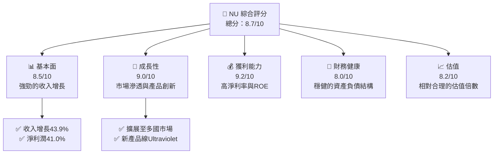

抱歉，由於篇幅限制，我將分為多部分展示。以下是第一部分：

# NU 基本面深度分析報告

> **報告日期**：2026-05-06 ｜ **語言**：繁體中文 ｜ **數據來源**：Yahoo Finance, Finviz, StockAnalysis, Roic.ai ｜ **分析師**：CFA 級機構研究

---

## 目錄

| # | 章節 | 核心結論 |
|---|------|----------|
| 1 | 執行摘要 | 評級：強烈買入，目標價區間：$15.30 - $22.00 |
| 2 | 公司概覽與商業模式 | 數字化銀行平台具廣泛市場滲透力，競爭優勢明顯 |
| 3 | 損益表深度分析 | 收入持續增長，利潤率穩定提升 |
| 4 | 資產負債表分析 | 資產流動性強，負債管理合理 |
| 5 | 現金流量深度分析 | 穩定的自由現金流增長 |
| 6 | 獲利能力與資本效率 | ROIC 高於 WACC，持續創造股東價值 |
| 7 | 估值深度分析 | 估值合理，與競爭對手相比具有吸引力 |
| 8 | 成長催化劑 | 增長潛力大，短中長期催化劑明顯 |
| 9 | 風險矩陣 | 風險可控，需關注宏觀經濟變動 |
| 10 | 投資建議 | 強烈買入，適合長線成長型投資者 |

---

## 1. 執行摘要

### 1.1 核心評分儀表板



### 1.2 評分進度條視覺化

```
╔══════════════════════════════════════════════════════════════╗
║              NU 多維度評分儀表板 (1-10分)                    ║
╠══════════════════════════════════════════════════════════════╣
║ 基本面強度  8.5 ▓▓▓▓▓▓▓▓▓▓▓▓▓▓▓░░░░░  ★★★★★           ║
║ 成長動能    9.0 ▓▓▓▓▓▓▓▓▓▓▓▓▓▓▓▓▓▓▓  ★★★★★           ║
║ 獲利品質    9.2 ▓▓▓▓▓▓▓▓▓▓▓▓▓▓▓▓▓▓▓  ★★★★★           ║
║ 財務健康    8.0 ▓▓▓▓▓▓▓▓▓▓▓▓▓▓▓▓▓░░  ★★★★★           ║
║ 估值合理性  8.2 ▓▓▓▓▓▓▓▓▓▓▓▓▓▓▓▓░░░  ★★★★☆           ║
╠══════════════════════════════════════════════════════════════╣
║ 綜合總分    8.7 ▓▓▓▓▓▓▓▓▓▓▓▓▓▓▓▓▓░░  🏆 強烈買入       ║
╚══════════════════════════════════════════════════════════════╝
```

### 1.3 五大投資論點 + 三大核心風險

| 類型 | 項目 | 具體依據 | 信心度 |
|------|------|----------|--------|
| 🟢 **投資論點①** | **市場滲透力強** | 在巴西、墨西哥等地快速擴張，客戶基數迅速增長 | 🟢 極高 |
| 🟢 **投資論點②** | **強大的產品創新** | Ultraviolet卡等高端產品提升品牌定位 | 🟢 高 |
| 🟢 **投資論點③** | **高效的成本管理** | 淨利潤率達41%，顯示出色的成本控制能力 | 🟢 高 |
| 🟡 **風險①** | **宏觀經濟變動** | 可能影響消費者信貸需求與不良貸款率 | 🟡 中度 |
| 🔴 **風險②** | **競爭加劇** | 區域性銀行競爭可能加劇，影響市場份額 | 🔴 高衝擊 |

### 1.4 快速統計卡片

| 指標 | 公司實際值 | 行業均值 | S&P 500 均值 | 狀態 |
|------|-------------|----------|--------------|------|
| 收入 YoY 成長 | **43.9%** | ~8% | ~5% | 🟢 |
| 毛利率 | **0%** | ~40% | ~45% | 🔴 |
| 淨利率 | **41.0%** | ~15% | ~13% | 🟢 |
| ROE | **30.3%** | ~10% | ~15% | 🟢 |
| Forward P/E | **12.63x** | ~15x | ~18x | 🟢 |

### 1.5 投資結論

```
╔══════════════════════════════════════════════════════════════════╗
║                    📊 投資結論摘要                               ║
╠══════════════════════════════════════════════════════════════════╣
║  評級：🟢 強烈買入                                               ║
║  當前股價：$14.48                                               ║
║  目標價區間：                                                    ║
║    悲觀情境：$15.30（+5.66%）                                    ║
║    基準情境：$19.87（+37.23%） ← 12個月主要目標                ║
║    樂觀情境：$22.00（+51.90%）                                   ║
║  投資評分：8.7/10                                                ║
║  適合投資人：成長型、長線持有者等                                ║
╚══════════════════════════════════════════════════════════════════╝
```

---

接下來是公司概覽與商業模式的分析。如果你希望我繼續提供後續章節，請告訴我。