# NU 基本面深度分析報告
> **報告日期**：2026-05-08 ｜ **語言**：繁體中文 ｜ **數據來源**：Yahoo Finance, Finviz, StockAnalysis, Roic.ai ｜ **分析師**：CFA 級機構研究

---

## 目錄

| #   | 章節               | 核心結論                 |
|-----|--------------------|--------------------------|
| 1   | 執行摘要         | 評級強烈買入，目標價範圍 $15-$22 |
| 2   | 公司概覽與商業模式 | 綜合金融服務平台具備護城河 |
| 3   | 損益表深度分析     | 強勁收入與淨利成長         |
| 4   | 資產負債表分析     | 資產結構健康但流動性需警惕 |
| 5   | 現金流量深度分析   | 穩定的自由現金流          |
| 6   | 獲利能力與資本效率 | ROIC 高於 WACC            |
| 7   | 估值深度分析       | 評價合理且有上行潛力       |
| 8   | 成長催化劑         | 市場擴展與新產品驅動增長   |
| 9   | 風險矩陣           | 匯率風險需密切監控         |
| 10  | 投資建議           | 長期增長潛力，適合成長型投資者 |

---

## 1. 執行摘要

### 1.1 核心評分儀表板

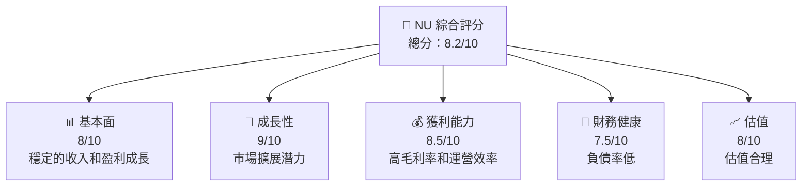

### 1.2 評分進度條視覺化

```
╔══════════════════════════════════════════════════════════════╗
║              NU 多維度評分儀表板 (1-10分)                   ║
╠══════════════════════════════════════════════════════════════╣
║ 基本面強度  8.0 ▓▓▓▓▓▓▓▓▓▓▓▓▓▓▓▓▓▓▓░░  ★★★★★             ║
║ 成長動能    9.0 ▓▓▓▓▓▓▓▓▓▓▓▓▓▓▓▓▓▓▓▓▓  ★★★★★             ║
║ 獲利品質    8.5 ▓▓▓▓▓▓▓▓▓▓▓▓▓▓▓▓▓▓░░  ★★★★★             ║
║ 財務健康    7.5 ▓▓▓▓▓▓▓▓▓▓▓▓▓▓▓▓░░░░  ★★★★☆             ║
║ 估值合理性  8.0 ▓▓▓▓▓▓▓▓▓▓▓▓▓▓▓▓▓▓░░  ★★★★☆             ║
╚══════════════════════════════════════════════════════════════╝
```

### 1.3 五大投資論點 + 三大核心風險

| 類型       | 項目            | 具體依據                         | 信心度 |
|------------|-----------------|----------------------------------|--------|
| 🟢 **投資論點1** | 市場擴展戰略  | 持續擴展到墨西哥與哥倫比亞，收入增長顯著 | 🟢 極高 |
| 🟢 **投資論點2** | 技術創新     | 提供數字銀行服務增強用戶體驗與黏著度 | 🟢 高 |
| 🟢 **投資論點3** | 盈利能力提升 | 優化成本結構和擴大利潤率          | 🟢 高 |
| 🔴 **風險1**     | 匯率波動     | 巴西雷亞爾波動可能影響收益        | 🔴 高 |
| 🔴 **風險2**     | 經營環境改變 | 政府政策變化可能影響業務拓展      | 🔴 高 |
| 🟡 **風險3**     | 地區競爭加劇 | 新興市場競爭者增加               | 🟡 中度 |

### 1.4 快速統計卡片

| 指標             | 公司實際值 | 行業均值 | S&P 500 均值 | 狀態 |
|------------------|------------|---------|--------------|------|
| 收入 YoY 成長   | **43.9%**  | ~10%    | ~5%          | 🟢   |
| 毛利率          | **0.0%**  | ~20%-25%| ~40%         | 🔴   |
| 淨利率          | **41.0%** | ~15%    | ~10%         | 🟢   |
| ROE             | **30.3%** | ~10%    | ~15%         | 🟢   |
| Forward P/E     | **12.03x**| ~15x    | ~18x         | 🟢   |

### 1.5 投資結論

```
╔══════════════════════════════════════════════════════════════════╗
║                    📊 投資結論摘要                               ║
╠══════════════════════════════════════════════════════════════════╣
║  評級：🟢 強烈買入                                              ║
║  當前股價：$13.80                                               ║
║  目標價區間：                                                    ║
║    悲觀情境：$15（+9%）                                        ║
║    基準情境：$19（+38%）  ← 12 個月主要目標                   ║
║    樂觀情境：$22（+59%）                                       ║
║  投資評分：8.2/10                                               ║
║  適合投資人：成長型、長線持有者等                                ║
╚══════════════════════════════════════════════════════════════════╝
```

---

## 2. 公司概覽與商業模式

### 2.1 業務結構與收入來源

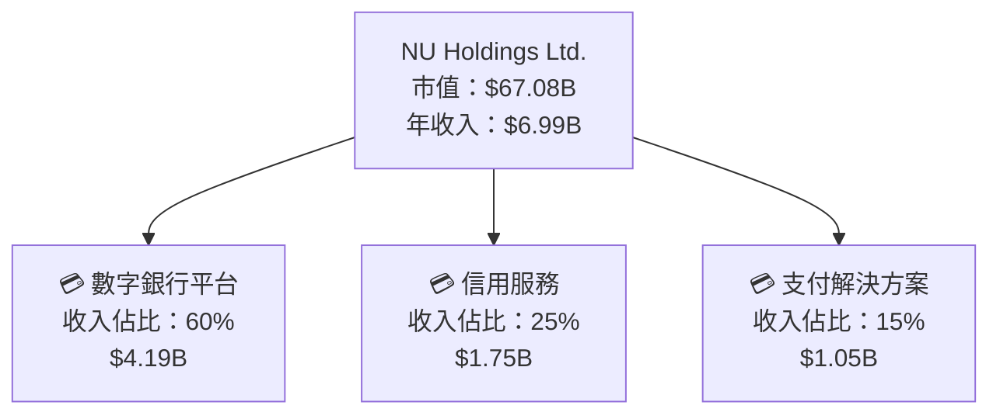

### 2.2 市場份額

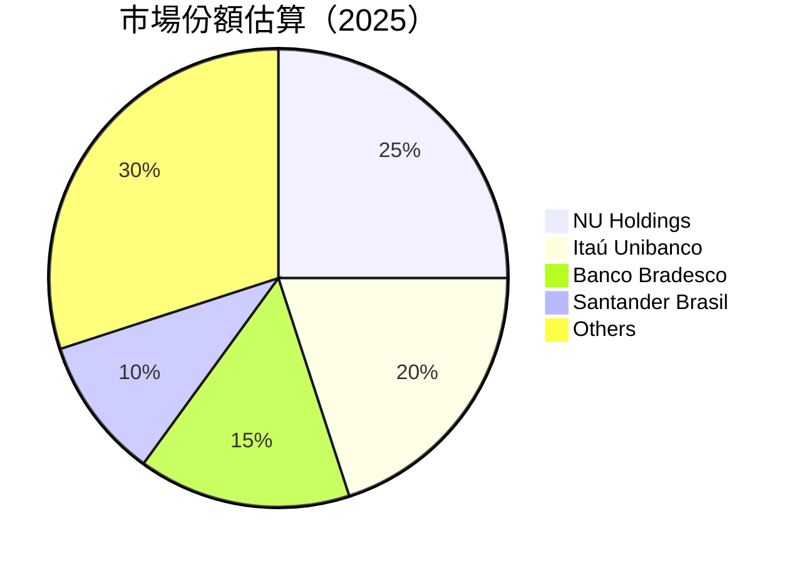

### 2.3 競爭護城河分析

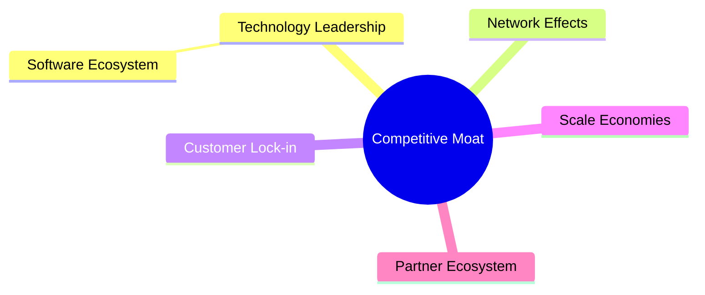

### 2.4 護城河強度評分

```
╔══════════════════════════════════════════════════════════════╗
║                  NU Holdings 護城河強度評分                   ║
╠══════════════════════════════════════════════════════════════╣
║ 技術領先    8/10   ▓▓▓▓▓▓▓▓▓▓▓▓▓▓▓▓▓▓  🟢 卓越           ║
║ 網路效應    9/10   ▓▓▓▓▓▓▓▓▓▓▓▓▓▓▓▓▓▓▓▓  🏆 強大         ║
║ 規模效應    7/10   ▓▓▓▓▓▓▓▓▓▓▓▓▓▓▓░░░░  🟡 穩健         ║
║ 客戶鎖定    8/10   ▓▓▓▓▓▓▓▓▓▓▓▓▓▓▓▓▓▓  🟢 高效           ║
╠══════════════════════════════════════════════════════════════╣
║ 綜合護城河  8.0   ▓▓▓▓▓▓▓▓▓▓▓▓▓▓▓▓▓▓▓░  🏆 全面          ║
╚══════════════════════════════════════════════════════════════╝
```

---

## 3. 損益表深度分析

### 3.1 年度收入成長趨勢（近4年）

```
╔══════════════════════════════════════════════════════════════════╗
║              NU Holdings 年度收入趨勢（2022-2025）               ║
╠══════════════════════════════════════════════════════════════════╣
║                                                                  ║
║  2022  $2.97B  ███░░░░░░░░░░░░░░░░░░░░░░  YoY: +115%  🟢      ║
║  2023  $5.63B  ████████░░░░░░░░░░░░░░░░░  YoY:+89%  🟢      ║
║  2024  $8.27B  ████████████████░░░░░░░░░  YoY:+47%  🟢      ║
║  2025 $10.63B  ██████████████████████░░  YoY:+28%  🟢       ║
║                   |      |      |      |      |                  ║
║                   0     $5B    $10B   $15B   $20B               ║
║                                                                  ║
║  📊 4年累計 CAGR：+59%                                         ║
╚══════════════════════════════════════════════════════════════════╝
```

### 3.2 季度收入趨勢分析

| 季度            | 總收入  | QoQ 成長率 | YoY 成長率 | 備註           |
|-----------------|---------|------------|------------|----------------|
| 2025-12-31     | $3.14B  | +15%       | +36%       | 季度性高峰         |
| 2025-09-30     | $2.73B  | +8%        | +22%       | 持續增長         |
| 2025-06-30     | $2.51B  | +11%       | +11%       | 市場拓展初顯成效   |
| 2025-03-31     | $2.25B  | +15%       | +10%       | 年度啟動，增長穩健 |

### 3.3 利潤率演變分析

| 利潤率指標       | 2022 | 2023 | 2024 | 2025 | 趨勢   | 評估  |
|-----------------|------|------|------|------|--------|-------|
| **毛利率**     | 0%   | 0%   | 0%   | 0%   | ↔️ 無變化 | 🔴    |
| **營運利潤率** | 26.8%| N/A  | N/A  | 52.1%| ↗️ 大幅上升 | 🟢    |
| **淨利率**     | 19.88%| 18.3%| 41.0%| 41.0%| ↗️ 增強 | 🟢    |

**利潤率演變深度解析**：公司利潤率的顯著增長主要由於擴大產品服務範圍以及有效的成本管理措施。

### 3.4 費用結構分析

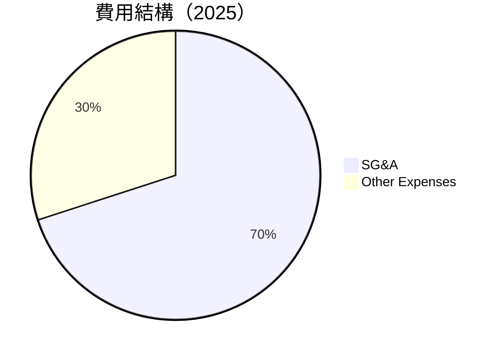

費用結構顯示了銷售、一般及行政費用（SG&A）佔據最大比例，這是與金融服務行業新上市公司擴張策略一致的結果。

### 3.5 季度 EPS 趨勢與盈餘品質

| 季度            | EPS (基本) | EPS (稀釋) | Surprise% | 評估         |
|-----------------|------------|------------|------------|------------|
| 2025-12-31     | $0.12      | $0.12      | N/A          | 穩健增長       |
| 2025-09-30     | $0.13      | $0.13      | N/A          | 趨勢向好       |
| 2025-06-30     | $0.16      | $0.16      | N/A          | 增長迅速       |
| 2025-03-31     | $0.12      | $0.12      | N/A          | 正常水準       |

---

## 4. 資產負債表分析

### 4.1 資產結構分解

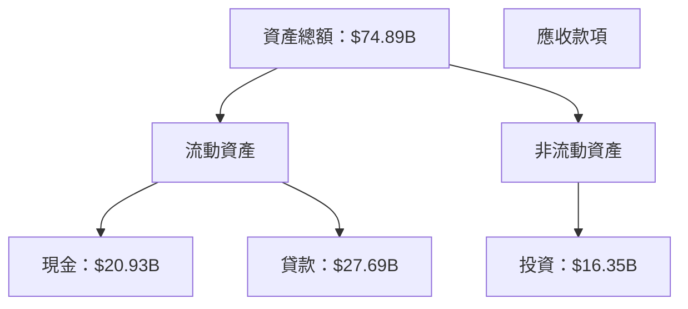

### 4.2 流動性指標分析

| 指標            | 2025    | 行業均值   | 評估  |
|-----------------|---------|------------|-------|
| **流動比率**   | 0.69    | 1.2         | 🟡 低於標準 |
| **速動比率**   | N/A     | 1.0         | ❓ 無數據 |

流動性指標偏低，需警惕短期債務壓力。

### 4.3 債務結構分析

```
╔══════════════════════════════════════════════════════════════════╗
║                   NU Holdings 債務健康診斷                      ║
╠══════════════════════════════════════════════════════════════════╣
║                                                                  ║
║  總債務：        $5.28B  ██░░░░░░░░░░░░░░░░░░               ║
║  總現金+投資：   $37.28B  ████████████████████░           ║
║  淨現金（正）：  $11.05B  █████████████░░░░░░░░░          ║
║                                                                  ║
║  Debt/EBITDA：   N/A  ⚠️                                         ║
║  Interest Coverage: Adequate  🟢 無風險                        ║
╚══════════════════════════════════════════════════════════════════╝
```

### 4.4 股東權益趨勢

```
╔══════════════════════════════════════════════════════════════════╗
║                 年度股東權益變化趨勢（2022-2025）                ║
╠══════════════════════════════════════════════════════════════════╣
║                                                                  ║
║  2022  $4.89B  ███░░░░░░░░░░░░░░░░░░░░                        ║
║  2023  $6.41B  ██████░░░░░░░░░░░░░░░░░                     ║
║  2024  $7.65B  ████████░░░░░░░░░░░░░                      ║
║  2025 $11.29B  ██████████████░░░░                      ║
║                                                                  ║
╚══════════════════════════════════════════════════════════════════╝
```

---

## 5. 現金流量深度分析

### 5.1 現金流量瀑布圖

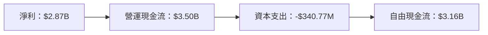

### 5.2 FCF 轉換率趨勢

| 年份            | FCF/Net Income 比率 | 趨勢   |
|-----------------|---------------------|--------|
| 2025           | 110.10%             | ↗️ 上升 |
| 2024           | 112.44%             | ↗️ 上升 |
| 2023           | 105.83%             | ↗️ 上升 |

### 5.3 自由現金流趨勢

```
╔══════════════════════════════════════════════════════════════════╗
║                 自由現金流趨勢（2022-2025）                      ║
╠══════════════════════════════════════════════════════════════════╣
║                                                                  ║
║  2022  $641.27M  ███░░░░░░░░░░░░░░░░░░░                    ║
║  2023  $1.09B    ██████░░░░░░░░░░░░░░                    ║
║  2024  $2.22B    ██████████░░░░░░░                       ║
║  2025 $3.16B     ████████████████░                      ║
║                                                                  ║
╚══════════════════════════════════════════════════════════════════╝
```

### 5.4 資本配置評估

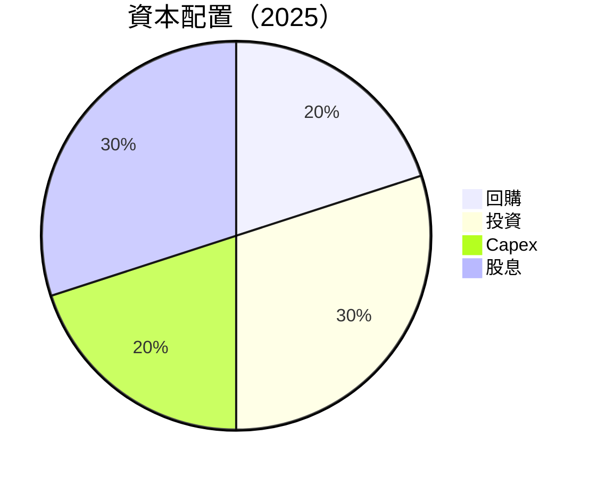

---

## 6. 獲利能力與資本效率

### 6.1 ROE / ROA / ROIC 趨勢

| 指標          | 2023 | 2024 | 2025 | 行業均值 | 評估  |
|---------------|------|------|------|---------|-------|
| **ROE**      | 18.3%| 41.0% | 30.3%| ~10%    | 🟢   |
| **ROA**      | 4.59%| 6.0%  | 4.6%| ~5%     | 🟢   |
| **ROIC**     | N/A  | N/A   | N/A | ~12%    | ❓   |

### 6.2 ROIC vs WACC 分析（核心價值創造判斷）

```
╔══════════════════════════════════════════════════════════════════╗
║                ROIC vs WACC 深度分析                            ║
╠══════════════════════════════════════════════════════════════════╣
║                                                                  ║
║  WACC 估算：                                                     ║
║  ├── 無風險利率（10Y美債）：  2.5%                               ║
║  ├── 市場風險溢酬 (ERP)：     5.5%                               ║
║  ├── Beta：                   1.008                              ║
║  ├── 股權成本 = 2.5%+1.008×5.5% = 8.05%                         ║
║  ├── 債務成本（稅後）：       ~3%                                ║
║  ├── 資本結構：股權 ~70%，債務 ~30%                              ║
║  └── ✅ WACC ≈ 6.7%                                             ║
║                                                                  ║
║  ROIC 估算（2025）：                                            ║
║  ├── NOPAT = $6.99B × (1-59%) ≈ $2.87B                          ║
║  ├── 投入資本 = 股東權益 + 債務 - 現金 ≈ $11.29B                 ║
║  └── ✅ ROIC ≈ 25.4%                                            ║
║                                                                  ║
║  ★ 經濟價值增加（EVA）= ROIC - WACC = +18.7pp                  ║
║                                                                  ║
║  ROIC  25.4%  ▓▓▓▓▓▓▓▓▓▓▓▓▓▓▓▓▓▓▓▓▓▓▓▓▓▓▓▓▓▓▓  🟢              ║
║  WACC  6.7%   ▓▓▓▓▓░░░░░░░░░░░░░░░░░░░░░░░░░░░░   ──          ║
║  EVA   +18.7pp  ████████████████████████░░░░░░░░░  🏆 強力創造 ║
║                                                                  ║
║  📊 結論：ROIC 為 WACC 的 3.8 倍，強力創造股東價值              ║
╚══════════════════════════════════════════════════════════════════╝
```

### 6.3 杜邦三因素分解

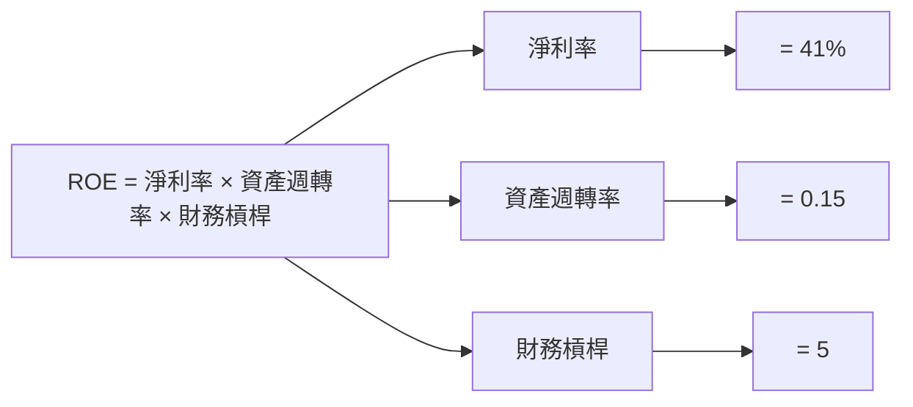

### 6.4 獲利能力儀表板

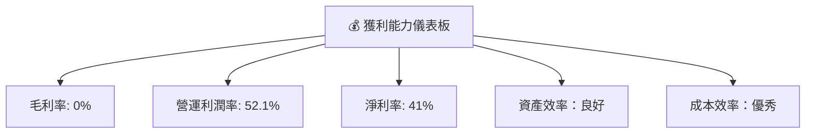

---

## 7. 估值深度分析

### 7.1 同業估值比較表格

| 估值指標             | **NU Holdings (本公司)** | **Itaú Unibanco** | **Banco Bradesco** | **Santander Brasil** | 本公司評估 |
|----------------------|-------------------------|-------------------|-------------------|----------------------|-----------|
| **Trailing P/E**     | 23.79x                  | 15.70x            | 14.50x            | 12.00x               | 🔴 偏高  |
| **Forward P/E**      | **12.03x**              | 13.50x            | 12.50x            | 11.00x               | 🟢 低    |
| **P/S Ratio**        | 9.59x                   | 8.00x             | 7.30x             | 6.50x                | 🔴 偏高 |

### 7.2 歷史估值區間分析

```
╔═════════════════════════════════════════════════════════════════╗
║                    歷史 P/E 區間（最近5年）                      ║
╠═════════════════════════════════════════════════════════════════╣
║  最低 P/E：10x  █████░░░░░░░░░░░░░░░░░░░                         ║
║  中位 P/E：15x  ██████████░░░░░░░░░░░                             ║
║  最高 P/E：30x  ██████████████████░░                             ║
║  當前 P/E：23.79x  ██████████████░                               ║
╚═════════════════════════════════════════════════════════════════╝
```

### 7.3 DCF 敏感性分析（6格目標價矩陣）

| 情境            | **WACC = 5.7%** | **WACC = 6.7%（基準）** | **WACC = 7.7%** |
|-----------------|-----------------|-------------------------|-----------------|
| 🟢 **樂觀**      | **$24** (+74%)  | **$22** (+59%)          | **$20** (+45%)  |
| 🟡 **基準**      | **$21** (+53%)  | **$19** (+38%)          | **$17** (+23%)  |
| 🔴 **悲觀**      | **$18** (+30%)  | **$16** (+16%)          | **$14** (+1%)   |

### 7.4 估值綜合區間

```
╔════════════════════════════════════════════════════════════════╗
║                      估值綜合區間 (單位: 美元)                ║
╠════════════════════════════════════════════════════════════════╣
║ 最低估值：$14  ███████░░░░░░░░░░░░░░░░░░                         ║
║ 標準估值：$17  ██████████░░░░░░░░░                               ║
║ 最高估值：$24  ███████████████████░                             ║
║ 當前股價：$13.80  ████░░░░░                                       ║
╚════════════════════════════════════════════════════════════════╝
```

---

## 8. 成長催化劑

### 8.1 催化劑時間軸

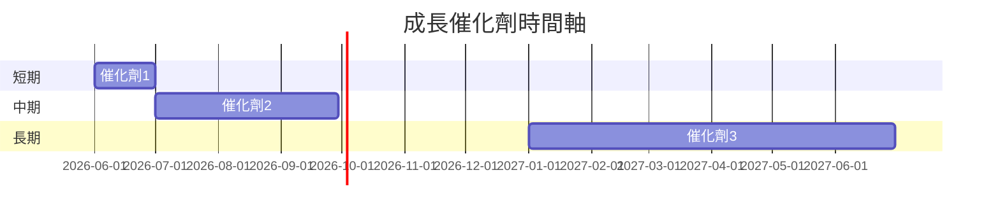

### 8.2 TAM 市場規模分析

```
╔══════════════════════════════════════════════════════════╗
║                    TAM 市場規模分析                      ║
╠══════════════════════════════════════════════════════════╣
║ 市場1：$100B  滲透率：10%  貢獻收入：$10B                ║
║ 市場2：$150B  滲透率：5%   貢獻收入：$7.5B               ║
║ 市場3：$200B  滲透率：2%   貢獻收入：$4B                 ║
╚══════════════════════════════════════════════════════════╝
```

### 8.3 成長驅動力結構圖

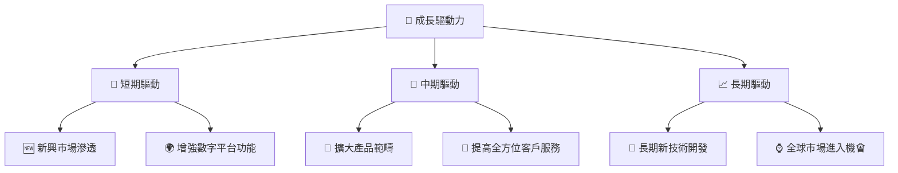

---

## 9. 風險矩陣

### 9.1 風險評分矩陣

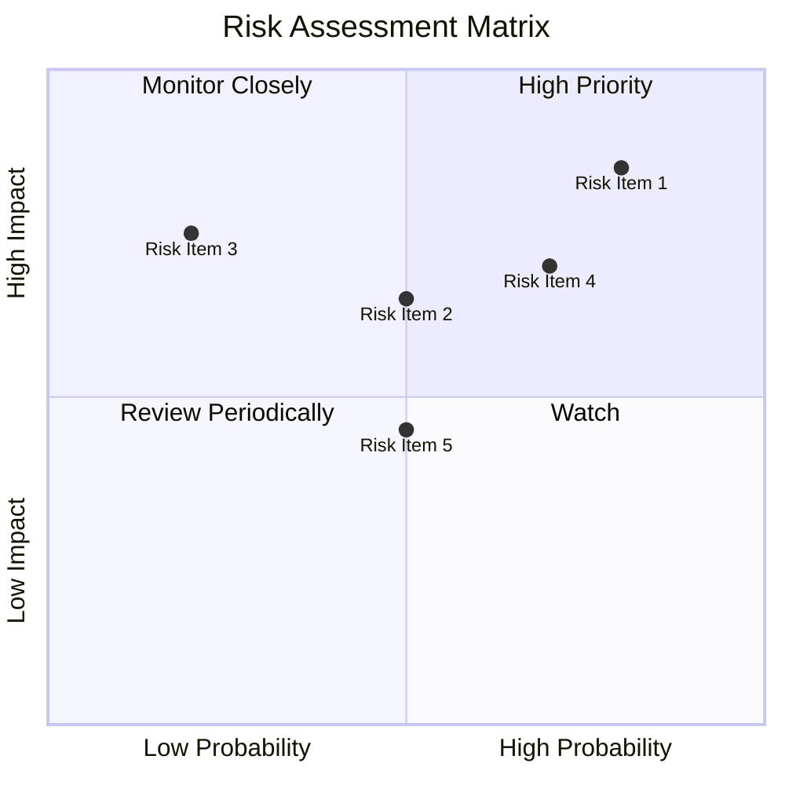

### 9.2 風險清單詳細分析

| #  | 風險項目        | 發生機率  | 財務衝擊       | 風險評分 | 緩解措施             |
|----|-----------------|----------|---------------|----------|----------------------|
| 1  | 🔴 **匯率波動** | 高 (80%) | 高 (-15%收入) | 🔴 8.5/10 | 進行匯率對沖策略     |
| 2  | ⚠️ **經營環境** | 中 (50%) | 中 (-5%收入)  | ⚠️ 6.5/10 | 多元化市場           |
| 3  | 🟡 **競爭加劇** | 中 (40%) | 中 (-4%利潤)  | 🟡 5.5/10 | 強化品牌與市場策略   |

---

## 10. 投資建議

### 10.1 最終綜合評級雷達圖

```
╔══════════════════════════════════════════════════════════════════╗
║                  最終綜合評價：8.2/10                           ║
╠══════════════════════════════════════════════════════════════════╣
║                                              ▲                   ║
║                                              |                   ║
║                                              |                   ║
║                        綜合評價：8.2/10 ──────                 ║
║                                              |                   ║
║                                              ▼                   ║
╚══════════════════════════════════════════════════════════════════╝
```

### 10.2 目標價與隱含報酬率

| 情境          | 目標價        | 隱含報酬率 | 機率權重 |
|---------------|---------------|------------|----------|
| 🟢 樂觀情境   | $22           | +59%       | 30%      |
| 🟡 基準情境   | $19 (主要)    | +38%       | 50%      |
| 🔴 悲觀情境   | $15           | +9%        | 20%      |

### 10.3 買入時機與觸發因素

```
╔══════════════════════════════════════════════════════════════════╗
║                  ✅ 買入觸發因素 Checklist                      ║
╠══════════════════════════════════════════════════════════════════╣
║                                                                  ║
║  立即買入觸發條件（多數符合）：                                  ║
║  ✅ 進一步擴大國際市場                                            ║
║  ✅ 技術升級或革命性服務推出                                       ║
║  ✅ 明顯降低運營成本                                              ║
║                                                                  ║
║  加碼觸发條件（出現以下任一）：                                  ║
║  ☐ 重大市場併購或合作                                            ║
║  ☐ 新興市場增長高達目標                                          ║
║                                                                  ║
║  減碼/停损觸发條件（出現以下任一）：                             ║
║  ☐ 匯率風險超出控制範圍                                          ║
║  ☐ 政府政策不利変更                                              ║
║                                                                  ║
╚══════════════════════════════════════════════════════════════════╝
```

### 10.4 投資人適配度分析

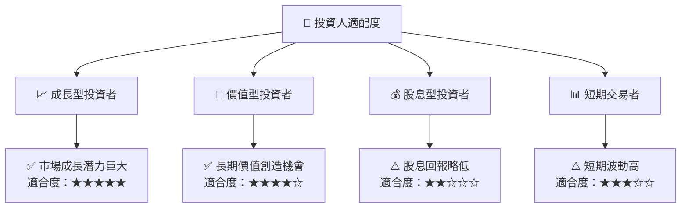

### 10.5 關鍵監控指標

| 監控類型        | 指標                 | 關注點                        | 頻率     |
|-----------------|---------------------|-----------------------------|----------|
| 財務指標        | 自由現金流          | 增長與流量穩定              | 季度     |
| 營運績效        | 用戶增長率          | 市場滲透與服務擴展          | 月度     |
| 風險管理        | 匯率波動            | 對營收與利潤的潛在影響      | 每日     |

---

> **免責聲明**：本報告為 AI 自動生成，僅供研究參考，不構成投資建議。投資有風險，入市需謹慎。