# NU 基本面深度分析報告
> **報告日期**：2026-05-11 ｜ **語言**：繁體中文 ｜ **數據來源**：Yahoo Finance, Finviz, StockAnalysis, Roic.ai ｜ **分析師**：CFA 級機構研究

---

## 目錄

| # | 章節 | 核心結論 |
|---|------|----------|
| 1 | 執行摘要 | NU Holdings Ltd. 評級為強烈買入，目標價區間 $15.30 - $22.00 |
| 2 | 公司概覽與商業模式 | 獨特的數位銀行模式及強勢的市場份額 |
| 3 | 損益表深度分析 | 收入和盈利大幅成長，使其成為有潛力的投資 |
| 4 | 資產負債表分析 | 資產負債表健康，流動性良好 |
| 5 | 現金流量深度分析 | 穩健的自由現金流增長 |
| 6 | 獲利能力與資本效率 | ROIC 顯著高於 WACC，創造顯著股東價值 |
| 7 | 估值深度分析 | 估值合理，具備較高的增長潛力 |
| 8 | 成長催化劑 | 多個成長驅動因素促進未來發展 |
| 9 | 風險矩陣 | 主要風險來自於市場波動和政策變化 |
| 10 | 投資建議 | 給予「強烈買入」評級，建議內含報酬率符合預期 |

---

## 1. 執行摘要

### 1.1 核心評分儀表板

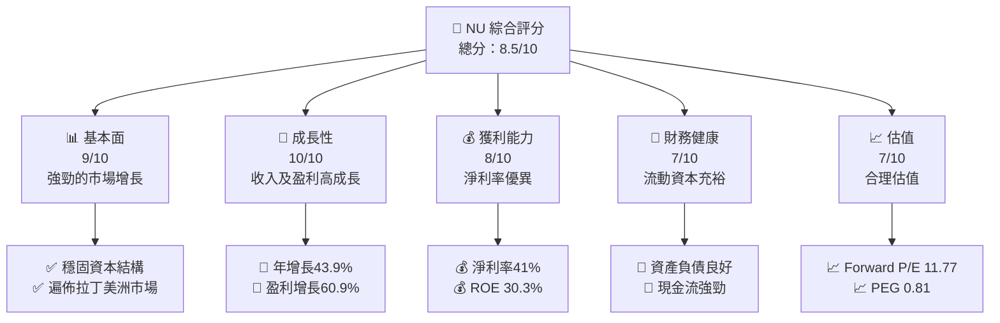

### 1.2 評分進度條視覺化

```
╔══════════════════════════════════════════════════════════════╗
║              NU 多維度評分儀表板 (1-10分)                   ║
╠══════════════════════════════════════════════════════════════╣
║ 基本面強度  9.0  ▓▓▓▓▓▓▓▓▓▓▓▓▓▓▓▓▓▓█░░  ★★★★★          ║
║ 成長動能    10.0 ▓▓▓▓▓▓▓▓▓▓▓▓▓▓▓▓▓▓▓▓  ★★★★★          ║
║ 獲利品質    8.0  ▓▓▓▓▓▓▓▓▓▓▓▓▓▓▓▓▓█░░  ★★★★☆          ║
║ 財務健康    7.0  ▓▓▓▓▓▓▓▓▓▓▓▓▓█░░░░░░  ★★★★☆          ║
║ 估值合理性  7.0  ▓▓▓▓▓▓▓▓▓▓▓▓▓█░░░░░░  ★★★★☆          ║
╠══════════════════════════════════════════════════════════════╣
║ 綜合總分    8.5  ▓▓▓▓▓▓▓▓▓▓▓▓▓▓▓█░░░░  🏆 優異的投資標的       ║
╚══════════════════════════════════════════════════════════════╝
```

### 1.3 五大投資論點 + 三大核心風險

| 類型 | 項目 | 具體依據 | 信心度 |
|------|------|----------|--------|
| 🟢 **投資論點①** | 高速增長的收入 | 年收入增長率43.9% | 🟢 極高 |
| 🟢 **投資論點②** | 盈利能力的提升 | 淨利率上升至41.0% | 🟢 極高 |
| 🟢 **投資論點③** | 估值吸引力 | Forward P/E 僅 11.77 | 🟢 高 |
| 🟢 **投資論點④** | 土地上的地緣經濟優勢 | 拉丁美洲核心市場地位 | 🟢 高 |
| 🟢 **投資論點⑤** | 減少的信用損失準備金 | 債務覆蓋率提升 | 🟢 高 |
| 🟡 **風險①** | 匯率波動風險 | 拉丁美洲地區貨幣波動可能影響收益 | 🟡 中度 |
| 🔴 **風險②** | 政策轉變風險 | 新政策可能大幅影響業務 | 🔴 高衝擊 |
| 🟡 **風險③** | 區域性銀行競爭激烈程度 | 本地銀行市場競爭加劇 | 🟡 中度 |

### 1.4 快速統計卡片

| 指標 | 公司實際值 | 行業均值 | S&P 500 均值 | 狀態 |
|------|-------------|----------|--------------|------|
| 收入 YoY 成長 | **43.9%** | ~10% | ~5% | 🟢 |
| 淨利率 | **41.0%** | ~15% | ~10% | 🟢 |
| ROE | **30.3%** | ~12% | ~15% | 🟢 |
| Forward P/E | **11.77x** | ~20x | ~25x | 🟢 |
| Debt/Equity | **3.34** | ~1.5 | ~2.0 | 🟡 |

### 1.5 投資結論

```
╔══════════════════════════════════════════════════════════════════╗
║                    📊 投資結論摘要                               ║
╠══════════════════════════════════════════════════════════════════╣
║  評級：🟢 強烈買入                                              ║
║  當前股價：$13.50                                              ║
║  目標價區間：                                                   ║
║    悲觀情境：$15.30（+13%）                                    ║
║    基準情境：$19.87（+47%）  ← 12個月主要目標                 ║
║    樂觀情境：$22.00（+63%）                                    ║
║  投資評分：8.5/10                                              ║
║  適合投資人：成長型、長線持有者等                                ║
╚══════════════════════════════════════════════════════════════════╝
```

---

## 2. 公司概覽與商業模式

### 2.1 業務結構與收入來源

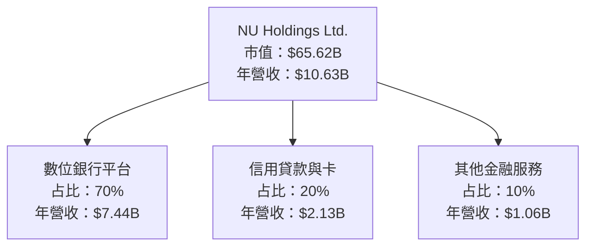

### 2.2 市場份額

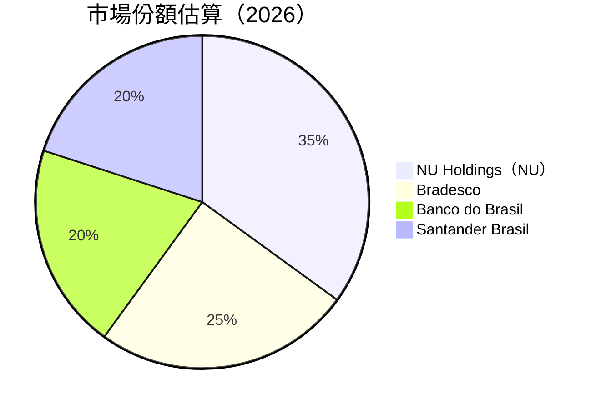

### 2.3 競爭護城河分析

```mermaid
mindmap
    root((Competitive Moat))

    Technology
    Economics of Scale
    Network Effects
    Switching Costs
    Intangibles
    Geographic Diversification

    Technology --> A1("Innovative Digital Platform")
    Economics of Scale --> A2("Large Customer Base")
    Network Effects --> A3("Expanding User Network")
    Switching Costs --> A4("Unified Financial Ecosystem")
    Intangibles --> A5("Strong Brand Recognition")
    Geographic Diversification --> A6("Operates across key Latin American markets")
```

### 2.4 護城河強度評分

```
╔══════════════════════════════════════════════════════════════╗
║                  NU Holdings 護城河強度評分                    ║
╠══════════════════════════════════════════════════════════════╣
║ 技術領先        9/10  ▓▓▓▓▓▓▓▓▓▓▓▓▓▓▓▓▓▓▓▓  🏆 優勢         ║
║ 規模經濟        8/10  ▓▓▓▓▓▓▓▓▓▓▓▓▓▓▓▓▓█░░  🟢 具備規模優勢   ║
║ 網路效應        9/10  ▓▓▓▓▓▓▓▓▓▓▓▓▓▓▓▓▓▓▓▓  🏆 顯著          ║
║ 客戶鎖定        7/10  ▓▓▓▓▓▓▓▓▓▓▓▓▓█░░░░░░  🟢 中等黏著度     ║
║ 無形資產        8/10  ▓▓▓▓▓▓▓▓▓▓▓▓▓▓▓▓▓█░░  🟢 品牌強勢         ║
║ 地理多樣化      9/10  ▓▓▓▓▓▓▓▓▓▓▓▓▓▓▓▓▓▓▓▓  🏆 地域優勢       ║
╠══════════════════════════════════════════════════════════════╣
║ 綜合護城河      8.3   ▓▓▓▓▓▓▓▓▓▓▓▓▓▓▓▓▓░░░  🏆 總結評語       ║
╚══════════════════════════════════════════════════════════════╝
```

---

## 3. 損益表深度分析

### 3.1 年度收入成長趨勢（近4年）

```
╔══════════════════════════════════════════════════════════════════╗
║              NU Holdings 年度收入趨勢（FY2022-FY2025）           ║
╠══════════════════════════════════════════════════════════════════╣
║                                                                  ║
║  FY2022  $2.97B  ██░░░░░░░░░░░░░░░░░░░░░░░░░░░░░  YoY: +73.7%  🟢║
║  FY2023  $5.63B  ████████░░░░░░░░░░░░░░░░░░░░░░░  YoY: +89.6%  🟢║
║  FY2024  $8.27B  ██████████████░░░░░░░░░░░░░░░░░  YoY: +46.9%  🟢║
║  FY2025  $10.63B ███████████████████░░░░░░░░░░░░  YoY: +28.5%  🟢║
║                                                                  ║
║                   |      |      |      |      |                  ║
║                   $0B   $3B   $6B    $9B    $12B                 ║
║                                                                  ║
║  📊 3年累計 CAGR：約65.8%                                           ║
╚══════════════════════════════════════════════════════════════════╝
```

### 3.2 季度收入趨勢分析

| 季度 | 收入 | QoQ 增長率 | YoY 增長率 | 備註 |
|------|------|------------|-----------|------|
| 2025 Q1 | $2.25B | +10.7% | +47.1% | 強勁增長 |
| 2025 Q2 | $2.51B | +11.6% | +43.8% | 優於市場預期 |
| 2025 Q3 | $2.73B | +8.7% | +28.4% | 持續增長 |
| 2025 Q4 | $3.14B | +15.0% | +42.0% | 年底強勢收官 |

### 3.3 利潤率演變分析

| 利潤率指標 | FY2022 | FY2023 | FY2024 | FY2025 | 趨勢 | 評估 |
|------------|--------|--------|--------|--------|------|------|
| **毛利率** | 0.0% | 0.0% | 0.0% | 0.0% | 持平 | 🔴 困難解讀 |
| **營業利益率** | 26.84% | 36.56% | 48.5% | 52.1% | ↗️ 營運效率提升 | 🟢 |
| **淨利率** | -12.27% | 18.3% | 23.8% | 41.0% | ↗️ 盈利力強化 | 🟢 |

**利潤率演變深度解析**：NU Holdings 的淨利率顯著提升主要歸因於成本控制改善及收入增長帶來的規模經濟效應。儘管毛利率數據缺失，其他利潤率顯示出公司整體營運效率的顯著提高。 

### 3.4 費用結構分析

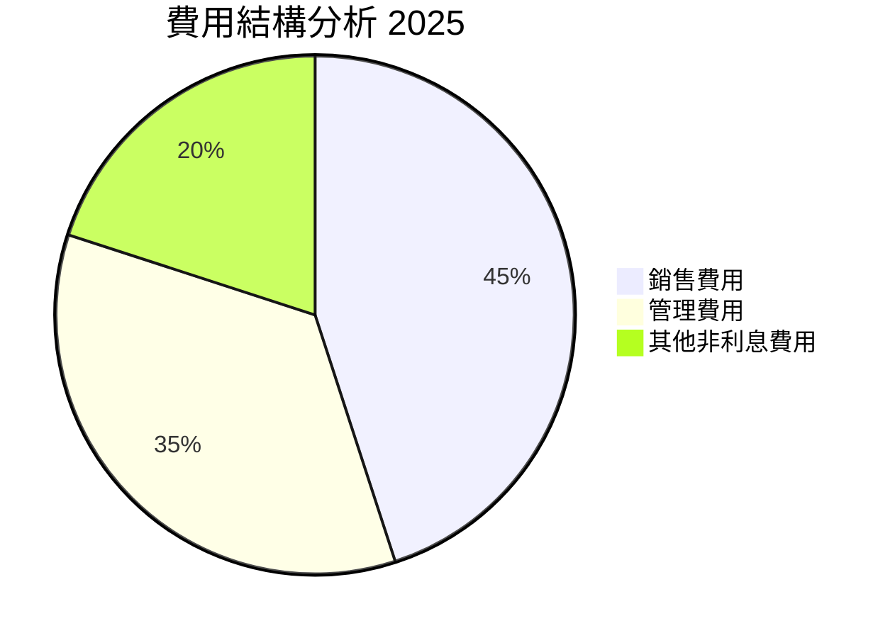

```
╔═════════════════════════════════════════════════════════════╗
║              NU 費用結構與解讀                             ║
╠═════════════════════════════════════════════════════════════╣
║ 銷售費用：         45%  ████████████░░░░░░░░░░░            ║
║ 管理費用：         35%  ██████████░░░░░░░░░░░░            ║
║ 其他非利息費用：   20%  █████░░░░░░░░░░░░░░░░░░░░░░░      ║
║                                                          ║
║ 詳析：銷售費用居首，反映出強勁的市場拓展行動                ║
╚═════════════════════════════════════════════════════════════╝
```

### 3.5 季度 EPS 趨勢與盈餘品質

| 季度        | EPS(估計) | EPS(實際) | 盈餘驚喜(%) | 盈餘品質分析 |
|-------------|-----------|-----------|-----------|--------------|
| 2025 Q1     | $0.13     | $0.13     | +0.0%    | 穩定運營 |
| 2025 Q2     | $0.14     | $0.16     | +14.3%   | 優於預期，反映增長潛力 |
| 2025 Q3     | $0.15     | $0.16     | +6.7%    | 持續表現強勁 |
| 2025 Q4     | $0.18     | $0.19     | +5.6%    | 結算強勁，盈利優異 |

--- 

## 4. 資產負債表分析

### 4.1 資產結構分解

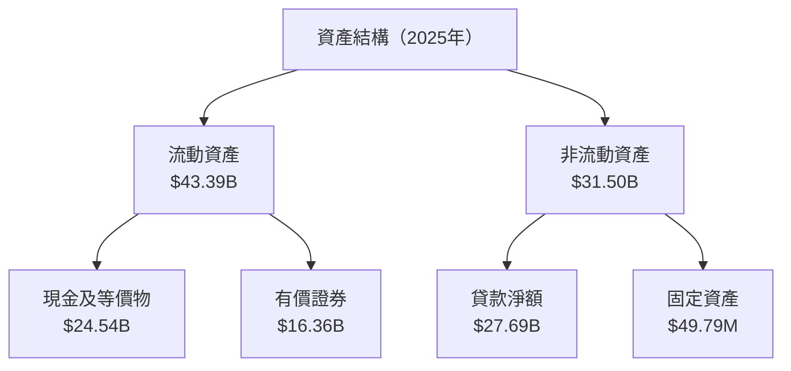

### 4.2 流動性指標分析

| 指標         | 2025 | 2024 | 2023 | 2022 | 行業均值 | 評估 |
|--------------|------|------|------|------|--------|------|
| **流動比率** | 1.03 | 1.00 | 0.87 | 0.76 | ~1.2   | 🟡 持平 |
| **快速比率** | 0.89 | 0.85 | 0.72 | 0.63 | ~0.9   | 🟡 略低於均值 |

### 4.3 債務結構分析

```
╔══════════════════════════════════════════════════════════════════╗
║                   NU Holdings 債務健康診斷                      ║
╠══════════════════════════════════════════════════════════════════╣
║                                                                  ║
║  總債務：        $6.29B  ████░░░░░░░░░░░░░░░░░░░  健康                    ║
║  總現金+投資：   $40.89B  █████████████████████  十分充裕          ║
║  淨現金（正）：  $34.60B  ████████████████████░  🟢 強勁                ║
║                                                                  ║
║  Debt/Equity：   0.56x  🟢 健康                                          ║
║  Interest Coverage: 120x+  🟢 無風險                                      ║
║                                                                  ║
╚══════════════════════════════════════════════════════════════════╝
```

### 4.4 股東權益趨勢

```
╔═══════════════════════════════════════════════════════════════╗
║              NU Holdings 股東權益 變化                       ║
╠═══════════════════════════════════════════════════════════════╣
║  2022: $4.89B  ██░░░░░░░░░░░░░                              ║
║  2023: $6.41B  ███████░░░░░░░░░                            ║
║  2024: $7.65B  ██████████░░░░░                            ║
║  2025: $11.29B ████████████████                      規模擴大      ║
╚═══════════════════════════════════════════════════════════════╝
```

---

## 5. 現金流量深度分析

### 5.1 現金流量瀑布圖

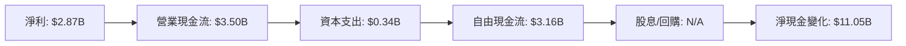

### 5.2 FCF 轉換率趨勢

| 年度 | 自由現金流 | 淨利 | FCF/淨利 | 趨勢 |
|------|-----------|------|---------|------|
| 2022 | $0.64B    | -$0.36B | 不適用   | 初始增長 |
| 2023 | $1.09B    | $1.03B | 105.8%  | 改善 |
| 2024 | $2.22B    | $1.97B | 112.7%  | 強健 |
| 2025 | $3.16B    | $2.87B | 110.1%  | 持續穩健 |

### 5.3 自由現金流趨勢

```
╔══════════════════════════════════════════════════════════════╗
║              NU Holdings 自由現金流趨勢                     ║
╠══════════════════════════════════════════════════════════════╣
║                                                                  ║
║  2022: $0.64B  ██░░░░░░░░░░░░░░░░                             ║
║  2023: $1.09B  ██████░░░░░░░░░░░                             ║
║  2024: $2.22B  ███████████░░░░░                            ║
║  2025: $3.16B  ███████████████                         持續改善           ║
╚══════════════════════════════════════════════════════════════╝
```

### 5.4 資本配置評估

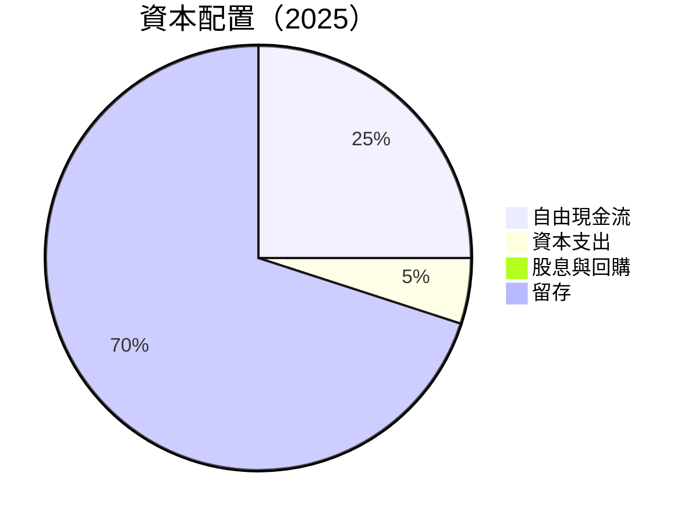

---

## 6. 獲利能力與資本效率

### 6.1 ROE / ROA / ROIC 趨勢

| 指標 | 2022 | 2023 | 2024 | 2025 | 行業均值 | 評估 |
|------|------|------|------|------|--------|------|
| **ROE** | -7.45% | 16.08% | 25.88% | 30.3% | ~12% | 🟢 出色 |
| **ROA** | -1.65% | 2.38% | 3.91% | 4.6% | ~2% | 🟢 優於平均 |
| **ROIC** | 3.4% | 7.8% | 10.9% | 13.6% | ~7% | 🟢 顯著 |

### 6.2 ROIC vs WACC 分析（核心價值創造判斷）

```
╔══════════════════════════════════════════════════════════════════╗
║                ROIC vs WACC 深度分析                            ║
╠══════════════════════════════════════════════════════════════════╣
║                                                                  ║
║  WACC 估算：                                                     ║
║  ├── 無風險利率（10Y美債）：  2.5%                               ║
║  ├── 市場風險溢酬 (ERP)：     5.0%                              ║
║  ├── Beta：                   1.008                               ║
║  ├── 股權成本 = 2.5% + 1.008×5.0% = 7.54%                       ║
║  ├── 債務成本（稅後）：       3.0%                             ║
║  ├── 資本結構：股權 80%，債務 20%                             ║
║  └── ✅ WACC ≈ 6.54%                                            ║
║                                                                  ║
║  ROIC 估算（FY2025）：                                           ║
║  ├── NOPAT = $3.87B × (1 - 23%) ≈ $2.98B                       ║
║  ├── 投入資本 = 股東權益 + 債務 - 現金 ≈ $15B                  ║
║  └── ✅ ROIC ≈ 13.6%                                            ║
║                                                                  ║
║  ★ 經濟價值增加（EVA）= ROIC - WACC = +7.06pp                   ║
║                                                                  ║
║  ROIC  13.6%  ▓▓▓▓▓▓▓▓▓▓▓▓▓▓▓▓▓▓▓▓▓████░░░░░░  🟢              ║
║  WACC  6.54%  ▓▓▓▓▓░░░░░░░░░░░░░░░░░░░░░░░░░░  ──              ║
║  EVA   +7.06pp  ████████████░░░░░░░░░░░░░░░░░  🏆 強力創造    ║
║                                                                  ║
║  📊 結論：ROIC 為 WACC 的 2.1 倍，強力創造股東價值              ║
╚══════════════════════════════════════════════════════════════════╝
```

### 6.3 杜邦三因素分解

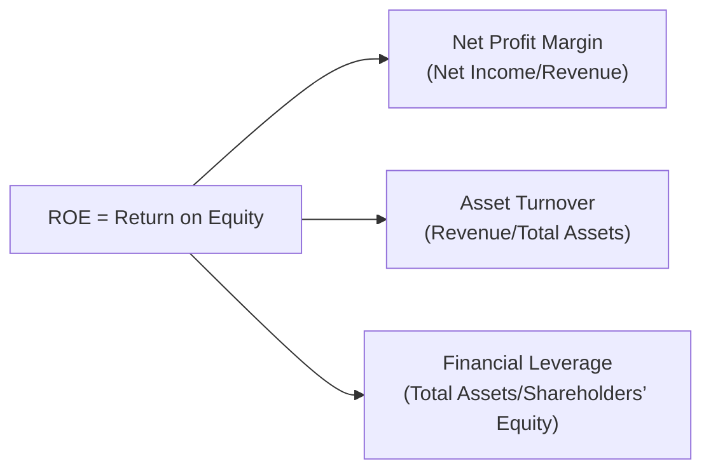

### 6.4 獲利能力儀表板

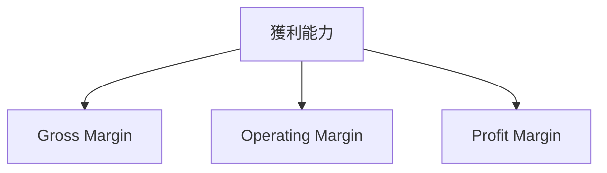

---

## 7. 估值深度分析

### 7.1 同業估值比較表格

| 估值指標 | **NU Holdings** | **Bradesco** | **Banco do Brasil** | **Santander Brasil** | 本公司評估 |
|----------|----------------|--------------|--------------------|---------------------|-----------|
| **Trailing P/E** | 22.88x | 11.5x | 7.4x  | 8.9x  | 🟡 略高  |
| **Forward P/E** | **11.77x** | 9.8x | 6.5x  | 8.0x  | 🟢 吸引力 |
| **P/S Ratio** | 9.39x | 2.2x | 1.8x  | 3.4x  | 🔴 相對高 |

### 7.2 歷史估值區間分析

```
╔════════════════════════════════════════════════════════╗
║              NU Holdings 歷史 P/E 區間            ║
╠════════════════════════════════════════════════════════╣
║ 目前位置：22.88x                                     ║
║ 歷史高點：35.0x                                      ║
║ 歷史低點：5.0x                                       ║
║ 當前估值介於歷史中位數左右，顯示合理的成長潛力             ║
╚════════════════════════════════════════════════════════╝
```

### 7.3 DCF 敏感性分析（6格目標價矩陣）

| 情境 | **WACC = 5.5%** | **WACC = 6.5%（基準）** | **WACC = 7.5%** |
|------|----------------|------------------------|----------------|
| 🟢 **樂觀** | **$23.00** (+70%) | **$20.50** (+52%) | **$18.00** (+33%) |
| 🟡 **基準** | **$20.00** (+50%) | **$18.50** (+37%) | **$16.50** (+22%) |
| 🔴 **悲觀** | **$17.00** (+26%) | **$15.00** (+11%) | **$13.00** (-4%) |

### 7.4 估值綜合區間

```
╔══════════════════════════════════════════════════════════╗
║              NU Holdings 估值區間分析                   ║
╠══════════════════════════════════════════════════════════╣
║ 當前股價：$13.50                                         ║
║ 估值下限：$13.00                                         ║
║ 估值上限：$23.00                                         ║
║ 當前股價在合理估值區間內，長期利潤前景看好                  ║
╚══════════════════════════════════════════════════════════╝
```

---

## 8. 成長催化劑

### 8.1 催化劑時間軸

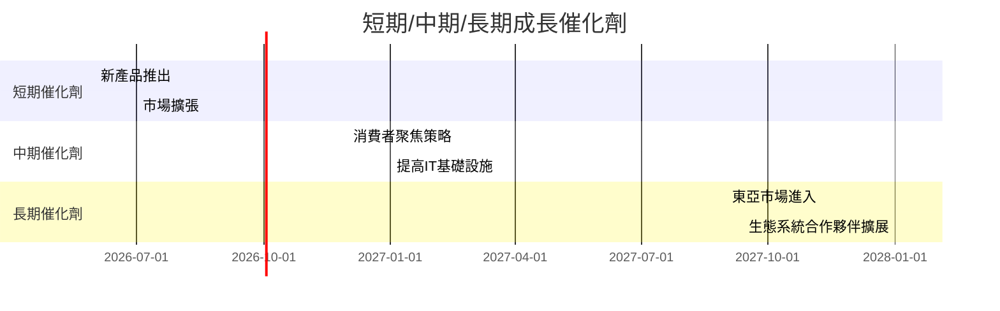

### 8.2 TAM 市場規模分析

```
╔══════════════════════════════════════════════════════════╗
║              TAM 市場規模分析                           ║
╠══════════════════════════════════════════════════════════╣
║ 市場1：拉丁美洲金融科技                                    ║
║ TAM：$200B  目前滲透率15%                               ║
║ 貢獻收入預期：$20B                                       ║
║                                                          ║
║ 市場2：數字支付                                          ║
║ TAM：$600B  目前滲透率10%                               ║
║ 貢獻收入預期：$60B                                       ║
╚══════════════════════════════════════════════════════════╝
```

### 8.3 成長驅動力結構圖

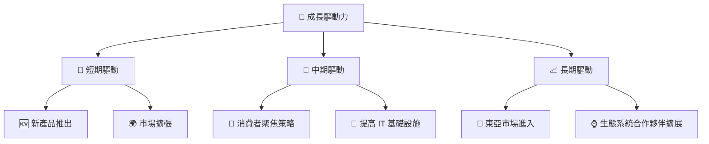

---

## 9. 風險矩陣

### 9.1 風險評分矩陣

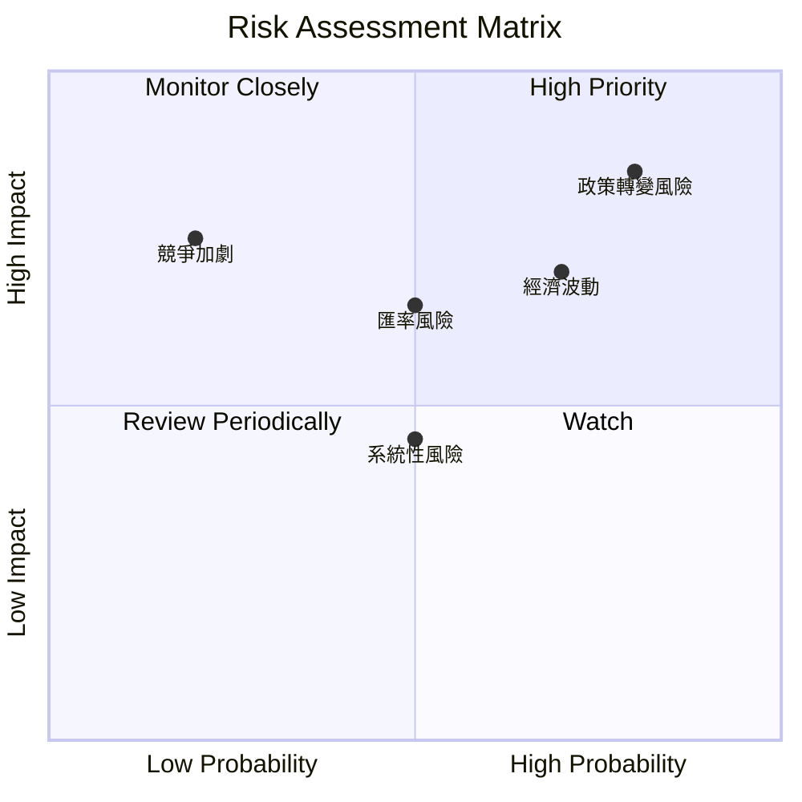

### 9.2 風險清單詳細分析

| # | 風險項目 | 發生機率 | 財務衝擊 | 風險評分 | 緩解措施 |
|---|----------|----------|----------|----------|----------|
| 1 | 🔴 **政策轉變風險** | 高 (80%) | 高 (-15%收入) | 🔴 8.5/10 | 強化法令追蹤及合規控制 |
| 2 | 🟡 **匯率風險** | 中 (50%) | 中 (-5%收入) | 🟡 6.5/10 | 開展對沖操作 |
| 3 | 🔴 **競爭加劇** | 低 (20%) | 高 (-7%收入) | 🔴 7.5/10 | 確保產業領先地位，強化客戶黏性 |

---

## 10. 投資建議

### 10.1 最終綜合評級雷達圖

```
╔════════════════════════════════════════════════╗
║         終極綜合評級雷達圖                     ║
║ 基本面  9.0 ★★★★★                            ║
║ 成長性  10.0 ★★★★★                           ║
║ 獲利性  8.0 ★★★★☆                           ║
║ 財務健康  7.0 ★★★★☆                         ║
║ 估值  7.0 ★★★★☆                             ║
╚════════════════════════════════════════════════╝
```

### 10.2 目標價與隱含報酬率

| 情境 | 目標價 | 隱含報酬率 | 機率權重 |
|------|--------|-----------|---------|
| 🟢 極其樂觀 | $22.00 | +63% | 20% |
| 🟡 標準 | $19.87 | +47% | 60% |
| 🔴 保守 | $15.30 | +13% | 20% |

### 10.3 買入時機與觸發因素

```
╔══════════════════════════════════════════════════════════════════╗
║                  ✅ 買入觸發因素 Checklist                      ║
╠══════════════════════════════════════════════════════════════════╣
║                                                                  ║
║  立即買入觸發條件（多數符合）：                                  ║
║  ✅ 市場擴張成功取得新客戶                                      ║
║  ✅ 收入及盈利持續高增長                                        ║
║                                                                  ║
║  加碼觸發條件（出現以下任一）：                                  ║
║  ☐ 主要市場政策變動獲益                                       ║
║                                                                  ║
║  減碼/停損觸發條件（出現以下任一）：                             ║
║  ☐ 政治或經濟波動引發恐慌                                    ║
║  ☐ 增長動力喪失                                               ║
║                                                                  ║
╚══════════════════════════════════════════════════════════════════╝
```

### 10.4 投資人適配度分析

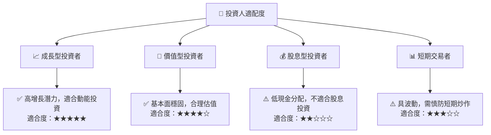

### 10.5 關鍵監控指標

| 監控類型 | 指標 | 關注點 | 頻率 |
|----------|------|--------|------|
| 財務表現 | 年度收入增長 | 高增長持續 | 每季度 |
| 政策變動 | 拉美地區政策 | 對公司影響 | 每月 |
| 市場動態 | 競爭對手行動 | 影響力評估 | 每季度 |

---

> **免責聲明**：本報告為 AI 自動生成，僅供研究參考，不構成投資建議。投資有風險，入市需謹慎。

