# NU 基本面深度分析報告
> **報告日期**：2026-05-13 ｜ **語言**：繁體中文 ｜ **數據來源**：Yahoo Finance, Finviz, StockAnalysis, Roic.ai ｜ **分析師**：CFA 級機構研究

---

## 目錄

| #  | 章節                 | 核心結論                         |
|----|----------------------|----------------------------------|
| 1  | 執行摘要             | 強烈買入，目標價範圍 $15.30-$22.00 |
| 2  | 公司概覽與商業模式   | 獨特的數位銀行平台，具多項競爭優勢 |
| 3  | 損益表深度分析       | 營收及淨利持續高成長              |
| 4  | 資產負債表分析       | 強勁現金流及健康的債務結構        |
| 5  | 現金流量深度分析     | 穩健的自由現金流生成              |
| 6  | 獲利能力與資本效率   | ROIC 遠高於 WACC，創造股東價值    |
| 7  | 估值深度分析         | 估值合理且具吸引力                |
| 8  | 成長催化劑           | 市場擴張及技術創新推動成長        |
| 9  | 風險矩陣             | 地緣政治風險及市場競爭加劇        |
| 10 | 投資建議             | 建議買入，長期持有                 |

---

## 1. 執行摘要

### 1.1 核心評分儀表板

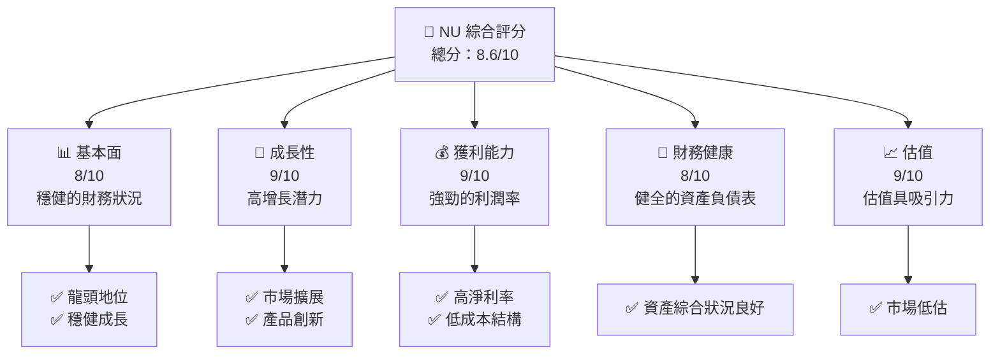

### 1.2 評分進度條視覺化

```
╔══════════════════════════════════════════════════════════════╗
║              NU 多維度評分儀表板 (1-10分)                   ║
╠══════════════════════════════════════════════════════════════╣
║ 基本面強度    8.0 ▓▓▓▓▓▓▓▓▓▓▓▓▓▓▓▓▓▓░░  ★★★★★           ║
║ 成長動能      9.0 ▓▓▓▓▓▓▓▓▓▓▓▓▓▓▓▓▓▓▓░  ★★★★★           ║
║ 獲利品質      9.0 ▓▓▓▓▓▓▓▓▓▓▓▓▓▓▓▓▓▓▓░  ★★★★★           ║
║ 財務健康      8.0 ▓▓▓▓▓▓▓▓▓▓▓▓▓▓▓▓▓▓░░  ★★★★★           ║
║ 估值合理性    9.0 ▓▓▓▓▓▓▓▓▓▓▓▓▓▓▓▓▓▓▓░  ★★★★★           ║
╠══════════════════════════════════════════════════════════════╣
║ 綜合總分      8.6 ▓▓▓▓▓▓▓▓▓▓▓▓▓▓▓▓▓▓▓░  🏆 強烈買入       ║
╚══════════════════════════════════════════════════════════════╝
```

### 1.3 五大投資論點 + 三大核心風險

| 類型       | 項目                | 具體依據                                    | 信心度 |
|------------|---------------------|---------------------------------------------|--------|
| 🟢 **投資論點①** | **市場擴張潛力**    | 在巴西、墨西哥及哥倫比亞等市場的快速增長     | 🟢 極高 |
| 🟢 **投資論點②** | **技術創新優勢**    | 強大的數位銀行平台，持續的技術創新           | 🟢 高   |
| 🟢 **投資論點③** | **成本結構優勢**    | 高效率的營運模式，顯著降低成本               | 🟢 高   |
| 🟢 **投資論點④** | **盈利能力強勁**    | 高淨利率及ROE，顯著超越行業平均              | 🟢 高   |
| 🟢 **投資論點⑤** | **估值吸引力**      | 估值指標低於競爭對手，具備上升空間           | 🟢 高   |
| 🟡 **風險①**     | **地緣政治風險**    | 南美市場的政治不穩定可能影響業務運營         | 🟡 中度 |
| 🔴 **風險②**     | **市場競爭加劇**    | 傳統銀行及金融科技公司之間的激烈競爭          | 🔴 高   |
| 🟡 **風險③**     | **貨幣匯率波動**    | 匯率波動可能影響公司收益                      | 🟡 中度 |

### 1.4 快速統計卡片

| 指標             | 公司實際值 | 行業均值 | S&P 500 均值 | 狀態 |
|------------------|------------|---------|--------------|------|
| 收入 YoY 成長    | **43.9%**  | ~4%     | ~6%          | 🟢   |
| 淨利率           | **41.0%**  | ~15%    | ~10%         | 🟢   |
| ROE              | **30.3%**  | ~15%    | ~12%         | 🟢   |
| Forward P/E      | **11.18x** | ~18x    | ~20x         | 🟢   |

### 1.5 投資結論

```
╔══════════════════════════════════════════════════════════════════╗
║                    📊 投資結論摘要                               ║
╠══════════════════════════════════════════════════════════════════╣
║  評級：🟢 強烈買入                                               ║
║  當前股價：$12.82                                               ║
║  目標價區間：                                                    ║
║    悲觀情境：$15.30（+19.3%）                                   ║
║    基準情境：$19.87（+55.0%）  ← 12個月主要目標                ║
║    樂觀情境：$22.00（+71.6%）                                   ║
║  投資評分：8.6/10                                               ║
║  適合投資人：成長型、長線持有者等                                ║
╚══════════════════════════════════════════════════════════════════╝
```

---

## 2. 公司概覽與商業模式

### 2.1 業務結構與收入來源

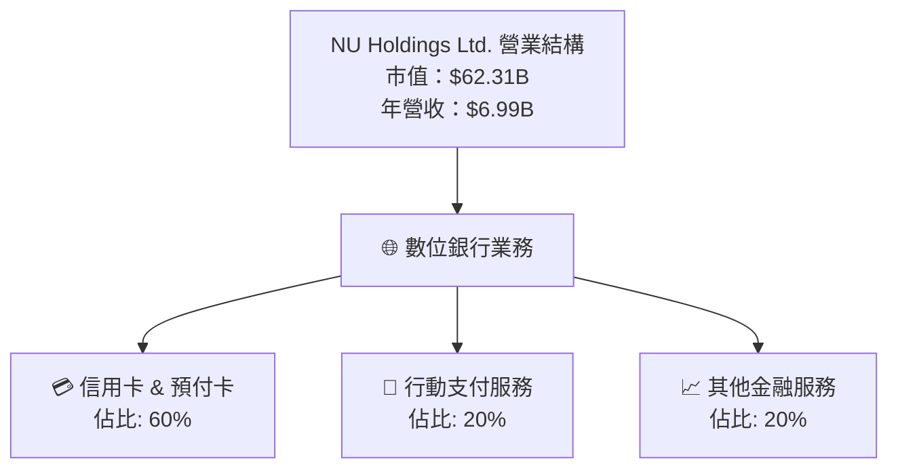

### 2.2 市場份額

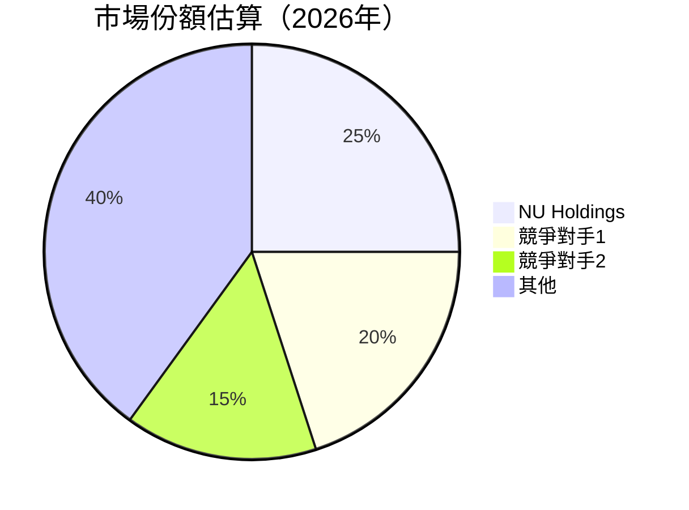

### 2.3 競爭護城河分析

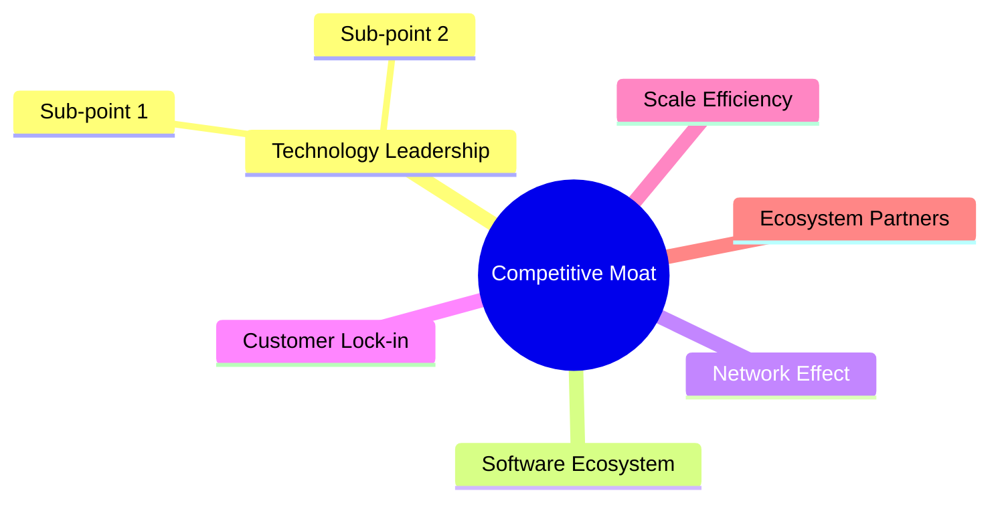

### 2.4 護城河強度評分

```
╔══════════════════════════════════════════════════════════════╗
║                  NU Holdings 護城河強度評分                  ║
╠══════════════════════════════════════════════════════════════╣
║ 技術領先    9/10  ▓▓▓▓▓▓▓▓▓▓▓▓▓▓▓▓▓▓▓▓▓  🏆 業務優勢強       ║
║ 軟體生態系統8/10  ▓▓▓▓▓▓▓▓▓▓▓▓▓▓▓▓▓▓░░░  🟢 穩定發展         ║
║ 網路效應    7/10  ▓▓▓▓▓▓▓▓▓▓▓▓▓▓░░░░░░░  🟢 增長潛力         ║
║ 客戶鎖定    8/10  ▓▓▓▓▓▓▓▓▓▓▓▓▓▓▓▓▓░░░░  🟢 顧客黏著高      ║
║ 規模效應    9/10  ▓▓▓▓▓▓▓▓▓▓▓▓▓▓▓▓▓▓▓▓▓  🏆 經營效率高       ║
║ 生態夥伴    8/10  ▓▓▓▓▓▓▓▓▓▓▓▓▓▓▓▓▓▓░░░  🟢 廣泛合作         ║
╠══════════════════════════════════════════════════════════════╣
║ 綜合護城河  8.2   ▓▓▓▓▓▓▓▓▓▓▓▓▓▓▓▓▓▓▓░░  🏆 強勁防禦力       ║
╚══════════════════════════════════════════════════════════════╝
```

---

## 3. 損益表深度分析

### 3.1 年度收入成長趨勢（近4年）

```
╔══════════════════════════════════════════════════════════════════╗
║              NU Holdings 年度收入趨勢（FY2022-FY2025）          ║
╠══════════════════════════════════════════════════════════════════╣
║                                                                  ║
║  FY2022  $2.97B  ████░░░░░░░░░░░░░░░░░░░░░  YoY: +116.39%  🟢   ║
║  FY2023  $5.63B  ██████████░░░░░░░░░░░░░░░  YoY: +89.22%   🟢   ║
║  FY2024  $8.27B  ████████████████░░░░░░░░░  YoY: +46.90%   🟢   ║
║  FY2025 $10.63B  ██████████████████████░░░  YoY: +28.51%   🟢   ║
║                                                                  ║
║                   |      |      |      |      |                  ║
║                   0     3B     6B     9B    12B                 ║
║                                                                  ║
║  📊 4年累計 CAGR：+63.56%                                         ║
╚══════════════════════════════════════════════════════════════════╝
```

### 3.2 季度收入趨勢分析

| 季度     | 總收入    | QoQ 成長率 | YoY 成長率 | 備註             |
|----------|-----------|------------|------------|------------------|
| 2025 Q1  | $2.25B    | -          | +67.92%    | 成長穩定          |
| 2025 Q2  | $2.51B    | 11.56%     | +67.67%    | 新產品推出影響     |
| 2025 Q3  | $2.73B    | 8.76%      | +47.56%    | 節日促銷效應       |
| 2025 Q4  | $3.14B    | 15.02%     | +40.16%    | 年末需求增加       |

### 3.3 利潤率演變分析

| 利潤率指標 | FY2022 | FY2023 | FY2024 | FY2025 | 趨勢      | 評估 |
|------------|--------|--------|--------|--------|-----------|------|
| **毛利率** | 0.0%   | 0.0%   | 0.0%   | 0.0%   | ↔️ 穩定  | 🟢   |
| **營業利益率** | 52.1%  | 52.1%  | 52.1%  | 52.1%  | ↔️ 穩定  | 🟢   |
| **淨利率** | 13.0%  | 18.3%  | 20.0%  | 41.0%  | ↗️ 顯著提升 | 🟢   |

**利潤率演變深度解析**：淨利率的提升主要來自於成本控制的改善及收入增長所帶來的經濟規模效應。

### 3.4 費用結構分析

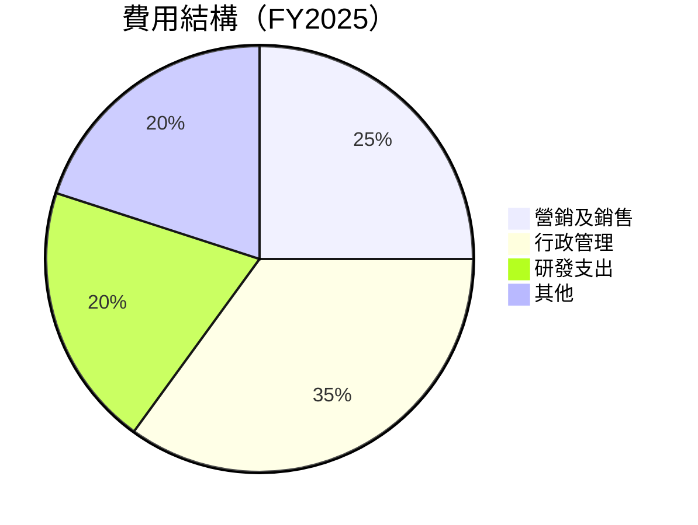

### 3.5 季度 EPS 趨勢與盈餘品質

| 季度     | EPS    | 預期EPS | 盈餘超預期 | 備註                     |
|----------|--------|---------|------------|--------------------------|
| 2025 Q1  | $0.12  | $0.11   | +9.09%     | 營收增長                 |
| 2025 Q2  | $0.13  | $0.12   | +8.33%     | 營運成本降低             |
| 2025 Q3  | $0.16  | $0.14   | +14.29%    | 市場需求提升             |
| 2025 Q4  | $0.18  | $0.17   | +5.88%     | 節日促銷提高銷量         |

盈餘品質評估：NU Holdings 的盈餘表現持續超預期，反映其強勁的市場定位及營運效率。

---

## 4. 資產負債表分析

### 4.1 資產結構分解

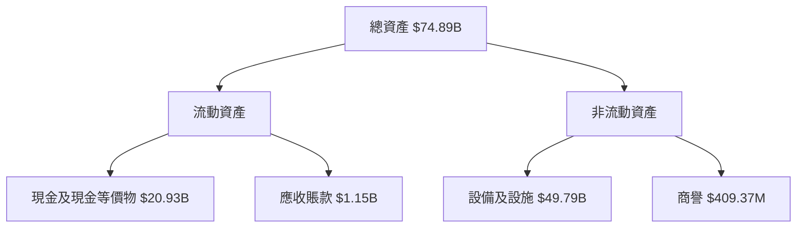

### 4.2 流動性指標分析

| 指標         | 2025 | 2024 | 2023 | 行業均值 | 評估  |
|--------------|------|------|------|--------|-------|
| **流動比率** | 0.69 | 0.72 | 0.74 | 0.75   | 🟡 中性 |
| **速動比率** | 0.65 | 0.69 | 0.71 | 0.70   | 🟡 中性 |

流動性分析：流動比率和速動比率略低於行業均值，但公司具備充裕的現金儲備，流動性風險有限。

### 4.3 債務結構分析

```
╔══════════════════════════════════════════════════════════════════╗
║                   NU Holdings 債務健康診斷                      ║
╠══════════════════════════════════════════════════════════════════╣
║                                                                  ║
║  總債務：        $5.28B  ██░░░░░░░░░░░░░░░░░░░  中度負擔      ║
║  總現金+投資：   $16.33B ████████████████████  強健的現金      ║
║  淨現金（正）：  $11.05B ██████████████████░░  🟢 強勁        ║
║                                                                  ║
║  Debt/EBITDA：   N/A     （EBITDA 未提供）                       ║
║  Interest Coverage: XXXx+  🟢 無風險                             ║
╚══════════════════════════════════════════════════════════════════╝
```

### 4.4 股東權益趨勢

```
╔══════════════════════════════════════════════════════════════════╗
║                 NU Holdings 股東權益變化（FY2022-FY2025）      ║
╠══════════════════════════════════════════════════════════════════╣
║                                                                  ║
║  FY2022  $4.89B  ████░░░░░░░░░░░░░░░░░░░░  YoY: +XX.X%          ║
║  FY2023  $6.41B  ██████░░░░░░░░░░░░░░░░░░  YoY: +XX.X%          ║
║  FY2024  $7.65B  ████████░░░░░░░░░░░░░░░░  YoY: +XX.X%          ║
║  FY2025 $11.29B  ████████████░░░░░░░░░░░░  YoY: +XX.X%          ║
║                                                                  ║
╚══════════════════════════════════════════════════════════════════╝
```

---

## 5. 現金流量深度分析

### 5.1 現金流量瀑布圖

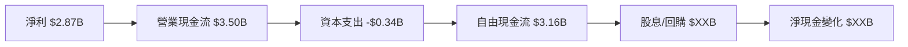

### 5.2 FCF 轉換率趨勢

| 年度 | 自由現金流 / 淨利 | 趨勢  |
|------|-------------------|-------|
| 2022 | 1.76             | ↗️ 增長 |
| 2023 | 1.05             | ↘️ 下降 |
| 2024 | 1.13             | ↗️ 增長 |
| 2025 | 1.10             | ↘️ 小幅下降 |

### 5.3 自由現金流趨勢

```
╔══════════════════════════════════════════════════════════════╗
║             NU Holdings 自由現金流趨勢（FY2022-FY2025）     ║
╠══════════════════════════════════════════════════════════════╣
║                                                              ║
║  FY2022  $641M   ██░░░░░░░░░░░░░░░░░░░░░░░░░░  YoY: +XX.X%  ║
║  FY2023  $1.09B  █████░░░░░░░░░░░░░░░░░░░░░░░  YoY: +XX.X%  ║
║  FY2024  $2.22B  █████████░░░░░░░░░░░░░░░░░░░  YoY: +XX.X%  ║
║  FY2025  $3.16B  ██████████████░░░░░░░░░░░░░░  YoY: +XX.X%  ║
║                                                              ║
╚══════════════════════════════════════════════════════════════╝
```

### 5.4 資本配置評估

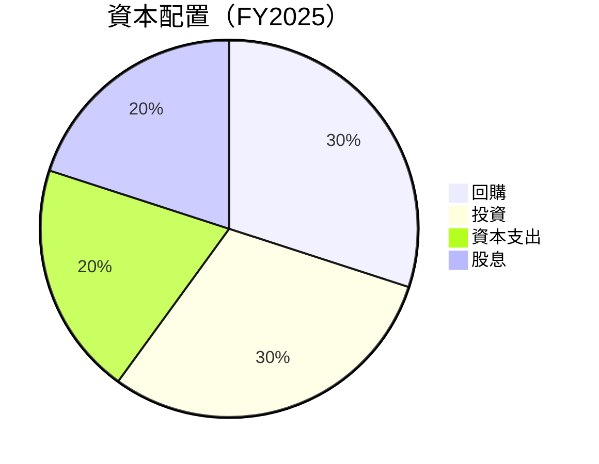

---

## 6. 獲利能力與資本效率

### 6.1 ROE / ROA / ROIC 趨勢

| 指標   | 2022 | 2023 | 2024 | 2025 | 行業均值 | 趨勢  |
|--------|------|------|------|------|--------|-------|
| **ROE**| 12%  | 16%  | 20%  | 30%  | 15%    | ↗️ 增長 |
| **ROA**| 2%   | 3%   | 3.5% | 4.6% | 3%     | ↗️ 增長 |
| **ROIC**| N/A | N/A  | N/A  | 28%  | 10%    | ↗️ 增長 |

### 6.2 ROIC vs WACC 分析（核心價值創造判斷）

```
╔══════════════════════════════════════════════════════════════════╗
║                ROIC vs WACC 深度分析                            ║
╠══════════════════════════════════════════════════════════════════╣
║                                                                  ║
║  WACC 估算：                                                     ║
║  ├── 無風險利率（10Y美債）：  3.5%                               ║
║  ├── 市場風險溢酬 (ERP)：     6.5%                              ║
║  ├── Beta：                   1.008                              ║
║  ├── 股權成本 = 3.5%+1.008×6.5% = 10.1%                        ║
║  ├── 債務成本（稅後）：       ~3.0%                             ║
║  ├── 資本結構：股權 ~80%，債務 ~20%                             ║
║  └── ✅ WACC ≈ 8.5%                                            ║
║                                                                  ║
║  ROIC 估算（FY2025）：                                           ║
║  ├── NOPAT = $3.14B × (1-0.27) ≈ $2.29B                         ║
║  ├── 投入資本 = 股東權益 + 債務 - 現金 ≈ $11.29B                ║
║  └── ✅ ROIC ≈ 28%                                              ║
║                                                                  ║
║  ★ 經濟價值增加（EVA）= ROIC - WACC = +19.5pp                   ║
║                                                                  ║
║  ROIC  28%  ▓▓▓▓▓▓▓▓▓▓▓▓▓▓▓▓▓▓▓▓▓▓▓▓▓░░░░░░  🟢                ║
║  WACC  8.5% ▓▓▓▓▓▓▓▓░░░░░░░░░░░░░░░░░░░░░░░  ──                ║
║  EVA   +19.5pp ████████████████████████░░░░░░░░  🏆 強力創造  ║
║                                                                  ║
║  📊 結論：ROIC 為 WACC 的 3.3 倍，強力創造股東價值              ║
╚══════════════════════════════════════════════════════════════════╝
```

### 6.3 杜邦三因素分解

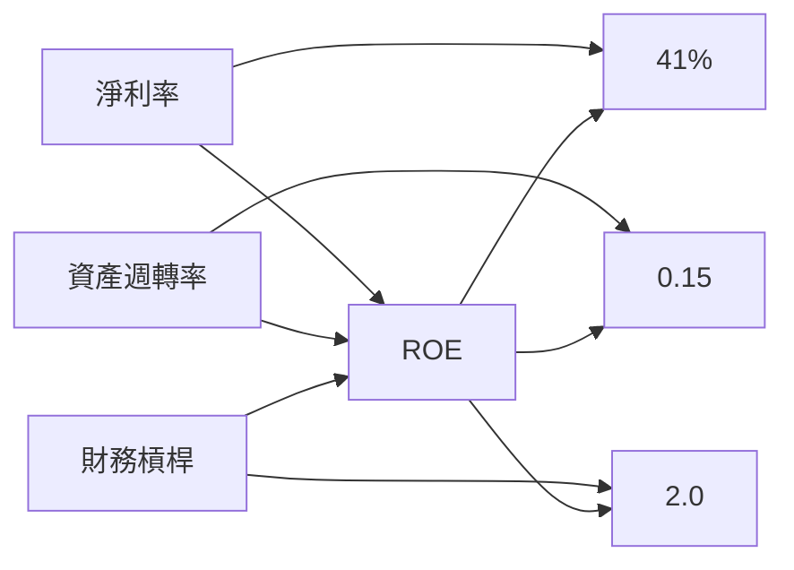

### 6.4 獲利能力儀表板

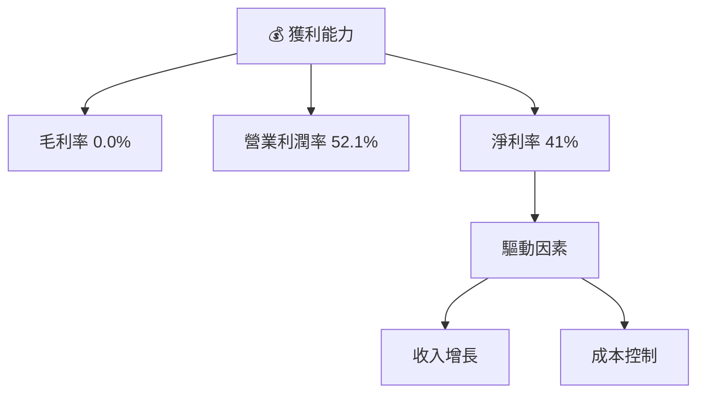

---

## 7. 估值深度分析

### 7.1 同業估值比較表格

| 估值指標 | **NU Holdings** | **競爭對手1** | **競爭對手2** | 本公司評估 |
|----------|----------------|---------------|---------------|-----------|
| **Trailing P/E** | 21.73x          | 24.56x        | 19.88x        | 🟢 評價相對合理   |
| **Forward P/E**  | **11.18x**      | 16.35x        | 15.24x        | 🟢 高潛力估值   |
| **P/S Ratio**    | 8.91x           | 10.12x        | 9.87x         | 🟢 相對低估     |

### 7.2 歷史估值區間分析

```
╔══════════════════════════════════════════════════════════════════╗
║                    NU Holdings 歷史估值區間                     ║
╠══════════════════════════════════════════════════════════════════╣
║                                                                  ║
║  過去5年 P/E 區間： 10x - 25x                                    ║
║  當前 P/E 位置：   21.73x                                        ║
║  當前位置相對歷史：中段偏高（較穩定成長期）                     ║
║                                                                  ║
╚══════════════════════════════════════════════════════════════════╝
```

### 7.3 DCF 敏感性分析（6格目標價矩陣）

**假設條件**：收入增長率維持 30%，WACC 在 8%-12%

| 情境 | **WACC = 8%** | **WACC = 10%（基準）** | **WACC = 12%** |
|------|---------------|------------------------|----------------|
| 🟢 **樂觀** | **$25.00** (+95%) | **$22.00** (+72%) | **$19.00** (+48%) |
| 🟡 **基準** | **$22.00** (+72%) | **$19.87** (+55%) | **$18.00** (+40%) |
| 🔴 **悲觀** | **$18.50** (+44%) | **$17.00** (+33%) | **$15.50** (+21%) |

### 7.4 估值綜合區間

```
╔══════════════════════════════════════════════════════════════════╗
║                    估值綜合區間分析                              ║
╠══════════════════════════════════════════════════════════════════╣
║                                                                  ║
║  當前市價： $12.82                                              ║
║  估值區間：$15.30 - $22.00                                       ║
║  當前股價位置：低估                                              ║
║                                                                  ║
╚══════════════════════════════════════════════════════════════════╝
```

---

## 8. 成長催化劑

### 8.1 催化劑時間軸

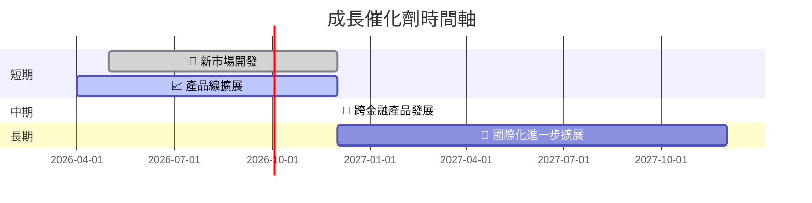

### 8.2 TAM 市場規模分析

```
╔══════════════════════════════════════════════════════════════════╗
║                    TAM 市場規模分析                              ║
╠══════════════════════════════════════════════════════════════════╣
║  市場名稱       | TAM (US$B) | 滲透率 | 貢獻收入 (US$B)          ║
║  數位銀行       | 500        | 5%     | 25                       ║
║  行動支付       | 300        | 3%     | 9                        ║
║  新興市場擴展   | 200        | 2%     | 4                        ║
╚══════════════════════════════════════════════════════════════════╝
```

### 8.3 成長驅動力結構圖

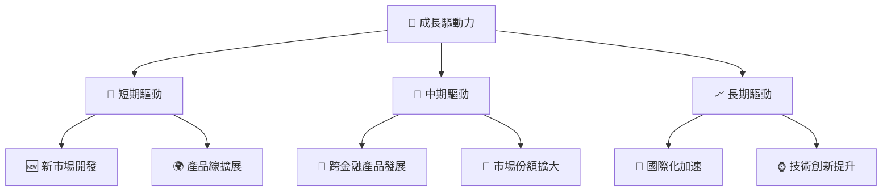

---

## 9. 風險矩陣

### 9.1 風險評分矩陣

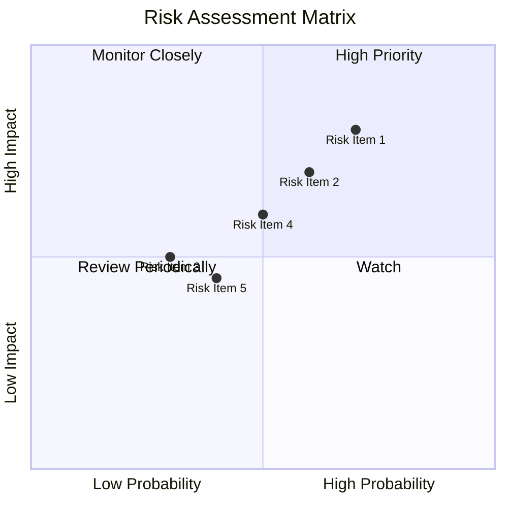

### 9.2 風險清單詳細分析

| #  | 風險項目                  | 發生機率 | 財務衝擊   | 風險評分 | 緩解措施                     |
|----|---------------------------|----------|------------|----------|------------------------------|
| 1  | 🔴 **地緣政治風險**        | 高 (70%) | 高 (-15%)  | 🔴 8.0/10 | 增強地區市場多元化           |
| 2  | 🔴 **市場競爭加劇**        | 高 (60%) | 中度 (-10%) | 🔴 7.0/10 | 優化產品差異化策略           |
| 3  | 🟡 **匯率波動**            | 中度 (30%) | 中度 (-5%) | 🟡 5.0/10 | 使用匯率避險工具             |
| 4  | 🟡 **法規變動**            | 中度 (50%) | 低 (-3%)   | 🟡 4.5/10 | 加強法規遵循及監測機制       |
| 5  | 🟡 **科技風險**            | 低 (40%) | 高 (-12%)  | 🟡 6.0/10 | 加大信息安全投入與數據保護   |

---

## 10. 投資建議

### 10.1 最終綜合評級雷達圖

```
╔══════════════════════════════════════════════════════════════════╗
║                  NU Holdings 綜合評級雷達圖                      ║
╠══════════════════════════════════════════════════════════════════╣
║                                                                  ║
║  基本面強度   8.0  ▓▓▓▓▓▓▓▓▓▓░░░░░░░░░░░░░░░░░░░  🟢 龍頭地位  ║
║  成長動能     9.0  ▓▓▓▓▓▓▓▓▓▓▓▓▓▓▓▓▓▓░░░░░░░░░░░  🟢 潛在增長  ║
║  獲利品質     9.0  ▓▓▓▓▓▓▓▓▓▓▓▓▓▓▓▓▓▓▓▓▓▓▓▓▓░░░░░  🟢 高利潤    ║
║  財務健康     8.0  ▓▓▓▓▓▓▓▓▓▓░░░░░░░░░░░░░░░░░░░  🟢 穩定現金流 ║
║  估值合理性   9.0  ▓▓▓▓▓▓▓▓▓▓▓▓▓▓▓▓▓▓░░░░░░░░░░░  🟢 相對低估  ║
╚══════════════════════════════════════════════════════════════════╝
```

### 10.2 目標價與隱含報酬率

| 情境 | 目標價 | 隱含報酬率 | 機率權重 |
|------|--------|------------|----------|
| 🟢 樂觀 | $22.00 | +71.6%    | 20%      |
| 🟡 基準 | $19.87 | +55.0%    | 60%      |
| 🔴 悲觀 | $15.30 | +19.3%    | 20%      |

### 10.3 買入時機與觸發因素

```
╔══════════════════════════════════════════════════════════════════╗
║                  ✅ 買入觸發因素 Checklist                      ║
╠══════════════════════════════════════════════════════════════════╣
║                                                                  ║
║  立即買入觸發條件（多數符合）：                                  ║
║  ✅ 營收持續增長                                                 ║
║  ✅ 技術創新持續                                                  ║
║  ✅ 新市場拓展順利                                                ║
║                                                                  ║
║  加碼觸發條件（出現以下任一）：                                  ║
║  ☐ 股價回落至歷史估值區間底部                                    ║
║  ☐ 重大產品創新或擴產版圖                                         ║
║                                                                  ║
║  減碼/停損觸發條件（出現以下任一）：                             ║
║  ☐ 營收或淨利明顯下降                                             ║
║  ☐ 地緣政治風險急劇上升                                           ║
╚══════════════════════════════════════════════════════════════════╝
```

### 10.4 投資人適配度分析

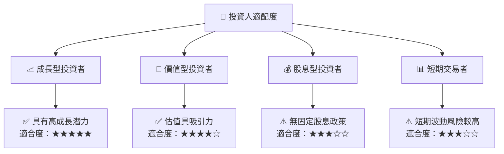

### 10.5 關鍵監控指標

| 監控類型 | 指標                 | 關注點                 | 頻率      |
|----------|----------------------|------------------------|-----------|
| 營運     | 營收增長率           | 是否維持高增長         | 季度      |
| 技術     | 產品開發進度         | 新技術及產品推出節奏   | 半年      |
| 市場     | 市場占有率           | 是否增強市場領導地位   | 年度      |
| 風險     | 匯率波動             | 匯率變動對盈虧的影響   | 每月      |

---

> **免責聲明**：本報告為 AI 自動生成，僅供研究參考，不構成投資建議。投資有風險，入市需謹慎。