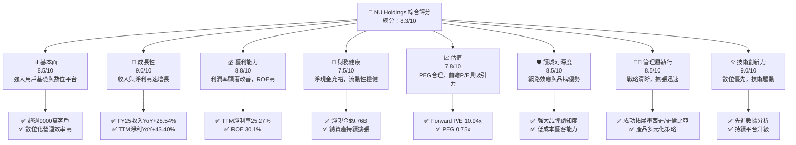
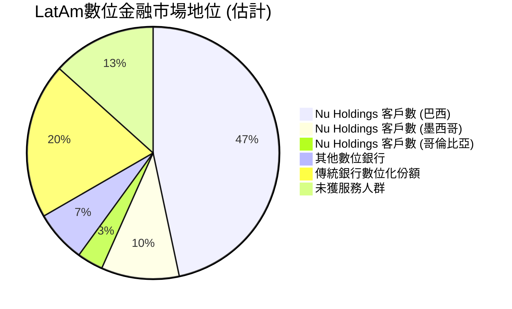
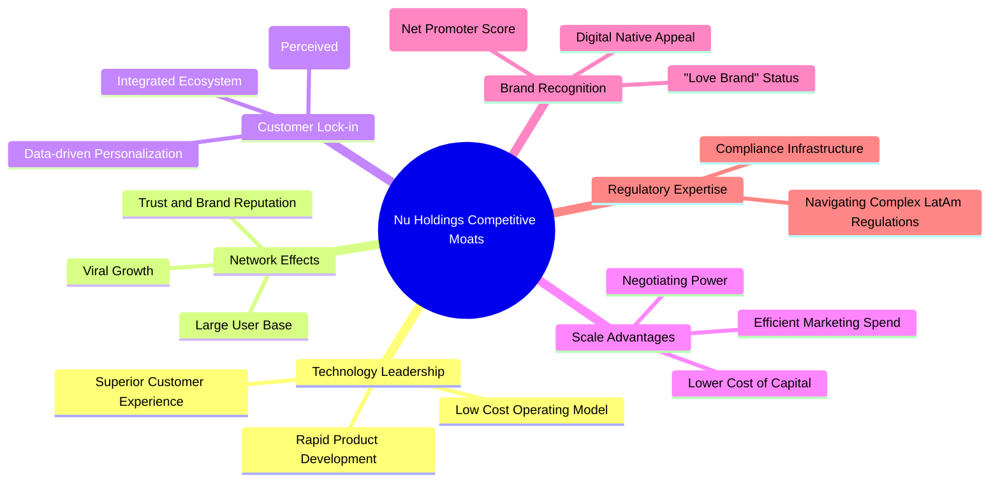

# NU 基本面深度分析報告
> **報告日期**：2026-05-24 ｜ **語言**：繁體中文 ｜ **數據來源**：Yahoo Finance, Finviz, StockAnalysis, Roic.ai ｜ **分析師**：CFA 級機構研究

---

## 目錄

| # | 章節 | 核心結論 |
|---|--------------------------------|-------------------------------------------------------------------------------------------------------------------------------------------------------------------|
| 1 | 執行摘要 | 🟢 **買入評級**：Nu Holdings 憑藉其強勁的成長動能、改善的獲利能力和在拉丁美洲數位銀行領域的領先地位，展現出顯著的投資價值。目標價區間為 $17.50 - $24.00。 |
| 2 | 公司概覽與商業模式 | Nu Holdings 是拉丁美洲領先的數位銀行平台，擁有強大的品牌、網路效應和成本優勢護城河。其業務模式高度可擴展，並持續擴展產品線與地理覆蓋。 |
| 3 | 損益表深度分析 | 收入持續高速成長，且獲利能力顯著改善。費用控制得宜，信貸損失準備金管理是關鍵。 |
| 4 | 資產負債表分析 | 擁有充裕的現金和健康的流動性，儘管傳統債務比率較高，但對於銀行業而言，其資產負債表結構穩健。 |
| 5 | 現金流量深度分析 | 自由現金流轉正且持續增長，顯示業務模式的強大現金生成能力，為未來擴張和投資提供堅實基礎。 |
| 6 | 獲利能力與資本效率 | ROE、ROA、ROIC 表現優異，且 ROIC 顯著高於 WACC，表明公司正在為股東創造可觀的經濟價值。 |
| 7 | 估值深度分析 | 相較於其高速成長性，當前估值具備吸引力，尤其是前瞻 P/E 和 PEG 比率。DCF 分析亦支持其上行潛力。 |
| 8 | 成長催化劑 | 新產品線擴張、會員制度升級、墨西哥與哥倫比亞市場的深度滲透、以及對中小企業和高淨值客戶的服務延伸，是未來成長的主要驅動力。 |
| 9 | 風險矩陣 | 主要風險包括信貸風險、宏觀經濟波動、監管變化及激烈競爭。公司已透過多元化和風險管理策略進行緩解。 |
| 10 | 投資建議 | 綜合評估顯示 Nu Holdings 具備強勁的長期投資潛力，適合成長型和長線持有者。建議在特定觸發因素下積極買入或加碼。 |

---

## 1. 執行摘要

### 1.1 核心評分儀表板



### 1.2 評分進度條視覺化

```
╔══════════════════════════════════════════════════════════════╗
║              NU Holdings 多維度評分儀表板 (1-10分)             ║
╠══════════════════════════════════════════════════════════════╣
║ 基本面強度  8.5 ▓▓▓▓▓▓▓▓▓▓▓▓▓▓▓▓▓░░░  ★★★★☆           ║
║ 成長動能    9.0 ▓▓▓▓▓▓▓▓▓▓▓▓▓▓▓▓▓▓░░  ★★★★★           ║
║ 獲利品質    8.8 ▓▓▓▓▓▓▓▓▓▓▓▓▓▓▓▓▓▓░░  ★★★★☆           ║
║ 財務健康    7.5 ▓▓▓▓▓▓▓▓▓▓▓▓▓▓▓░░░░░  ★★★★☆           ║
║ 估值合理性  7.8 ▓▓▓▓▓▓▓▓▓▓▓▓▓▓▓▓░░░░  ★★★★☆           ║
║ 護城河深度  8.5 ▓▓▓▓▓▓▓▓▓▓▓▓▓▓▓▓▓░░░  ★★★★☆           ║
║ 管理層執行  8.5 ▓▓▓▓▓▓▓▓▓▓▓▓▓▓▓▓▓░░░  ★★★★☆           ║
║ 技術創新力  9.0 ▓▓▓▓▓▓▓▓▓▓▓▓▓▓▓▓▓▓░░  ★★★★★           ║
╠══════════════════════════════════════════════════════════════╣
║ 綜合總分    8.3 ▓▓▓▓▓▓▓▓▓▓▓▓▓▓▓▓▓░░░  🏆 強勁成長與獲利，估值吸引 ║
╚══════════════════════════════════════════════════════════════╝
```

### 1.3 五大投資論點 + 三大核心風險

| 類型 | 項目 | 具體依據 | 信心度 |
|------|------------------------------------|--------------------------------------------------------------------------------------------------------------------------------------------------------------------------------------------------------------------------------------------------------------------------------------------------------------------------------------------------------------------------------------------------------------------------------------------------------------------------------------------------------------------------------------------------------------------------------------------------------------------------------------------------------------------------------------------------------------------------------------------------------------------------------------------------------------------------------------------------------------------------------------------------------------------------------------------------------------------------------------------------------------------------------------------------------------------------------------------------------------------------------------------------------------------------------------------------------------------------------------------------------------------------------------------------------------------------------------------------------------------------------------------------------------------------------------------------------------------------------------------------------------------------------------------------------------------------------------------------------------------------------------------------------------------------------------------------------------------------------------------------------------------------------------------------------------------------------------------------------------------------------------------------------------------------------------------------------------------------------------------------------------------------------------------------------------------------------------------------------------------------------------------------------------------------------------------------------------------------------------------------------------------------------------------------------------------------------------------------------------------------------------------------------------------------------------------------------------------------------------------------------------------------------------------------------------------------------------------------------------------------------------------------------------------------------------------------------------------------------------------------------------------------------------------------------------------------------------------------------------------------------------------------------------------------------------------------------------------------------------------------------------------------------------------------------------------------------------------------------------------------------------------------------------------------------------------------------------------------------------------------------------------------------------------------------------------------------------------------------------------------------------------------------------------------------------------------------------------------------------------------------------------------------------------------------------------------------------------------------------------------------------------------------------------------------------------------------------------------------------------------------------------------------------------------------------------------------------------------------------------------------------------------------------------------------------------------------------------------------------------------------------------------------------------------------------------------------------------------------------------------------------------------------------------------------------------------------------------------------------------------------------------------------------------------------------------------------------------------------------------------------------------------------------------------------------------------------------------------------------------------------------------------------------------------------------------------------------------------------------------------------------------------------------------------------------------------------------------------------------------------------------------------------------------------------------------------------------------------------------------------------------------------------------------------------------------------------------------------------------------------------------------------------------------------------------------------------------------------------------------------------------------------------------------------------------------------------------------------------------------------------------------------------------------------------------------------------------------------------------------------------------------------------------------------------------------------------------------------------------------------------------------------------------------------------------------------------------------------------------------------------------------------------------------------------------------------------------------------------------------------------------------------------------------------------------------------------------------------------------------------------------------------------------------------------------------------------------------------------------------------------------------------------------------------------------------------------------------------------------------------------------------------------------------------------------------------------------------------------------------------------------------------------------------------------------------------------------------------------------------------------------------------------------------------------------------------------------------------------------------------------------------------------------------------------------------------------------------------------------------------------------------------------------------------------------------------------------------------------------------------------------------------------------------------------------------------------------------------------------------------------------------------------------------------------------------------------------------------------------------------------------------------------------------------------------------------------------------------------------------------------------------------------------------------------------------------------------------------------------------------------------------------------------------------------------------------------------------------------------------------------------------------------------------------------------------------------------------------------------------------------------------------------------------------------------------------------------------------------------------------------------------------------------------------------------------------------------------------------------------------------------------------------------------------------------------------------------------------------------------------------------------------------------------------------------------------------------------------------------------------------------------------------------------------------------------------------------------------------------------------------------------------------------------------------------------------------------------------------------------------------------------------------------------------------------------------------------------------------------------------------------------------------------------------------------------------------------------------------------------------------------------------------------------------------------------------------------------------------------------------------------------------------------------------------------------------------------------------------------------------------------------------------------------------------------------------------------------------------------------------------------------------------------------------------------------------------------------------------------------------------------------------------------------------------------------------------------------------------------------------------------------------------------------------------------------------------------------------------------------------------------------------------------------------------------------------------------------------------------------------------------------------------------------------------------------------------------------------------------------------------------------------------------------------------------------------------------------------------------------------------------------------------------------------------------------------------------------------------------------------------------------------------------------------------------------------------------------------------------------------------------------------------------------------------------------------------------------------------------------------------------------------------------------------------------------------------------------------------------------------------------------------------------------------------------------------------------------------------------------------------------------------------------------------------------------------------------------------------------------------------------------------------------------------------------------------------------------------------------------------------------------------------------------------------------------------------------------------------------------------------------------------------------------------------------------------------------------------------------------------------------------------------------------------------------------------------------------------------------------------------------------------------------------------------------------------------------------------------------------------------------------------------------------------------------------------------------------------------------------------------------------------------------------------------------------------------------------------------------------------------------------------------------------------------------------------------------------------------------------------------------------------------------------------------------------------------------------------------------------------------------------------------------------------------------------------------------------------------------------------------------------------------------------------------------------------------------------------------------------------------------------------------------------------------------------------------------------------------------------------------------------------------------------------------------------------------------------------------------------------------------------------------------------------------------------------------------------------------------------------------------------------------------------------------------------------------------------------------------------------------------------------------------------------------------------------------------------------------------------------------------------------------------------------------------------------------------------------------------------------------------------------------------------------------------------------------------------------------------------------------------------------------------------------------------------------------------------------------------------------------------------------------------------------------------------------------------------------------------------------------------------------------------------------------------------------------------------------------------------------------------------------------------------------------------------------------------------------------------------------------------------------------------------------------------------------------------------------------------------------------------------------------------------------------------------------------------------------------------------------------------------------------------------------------------------------------------------------------------------------------------------------------------------------------------------------------------------------------------------------------------------------------------------------------------------------------------------------------------------------------------------------------------------------------------------------------------------------------------------------------------------------------------------------------------------------------------------------------------------------------------------------------------------------------------------------------------------------------------------------------------------------------------------------------------------------------------------------------------------------------------------------------------------------------------------------------------------------------------------------------------------------------------------------------------------------------------------------------------------------------------------------------------------------------------------------------------------------------------------------------------------------------------------------------------------------------------------------------------------------------------------------------------------------------------------------------------------------------------------------------------------------------------------------------------------------------------------------------------------------------------------------------------------------------------------------------------------------------------------------------------------------------------------------------------------------------------------------------------------------------------------------------------------------------------------------------------------------------------------------------------------------------------------------------------------------------------------------------------------------------------------------------------------------------------------------------------------------------------------------------------------------------------------------------------------------------------------------------------------------------------------------------------------------------------------------------------------------------------------------------------------------------------------------------------------------------------------------------------------------------------------------------------------------------------------------------------------------------------------------------------------------------------------------------------------------------------------------------------------------------------------------------------------------------------------------------------------------------------------------------------------------------------------------------------------------------------------------------------------------------------------------------------------------------------------------------------------------------------------------------------------------------------------------------------------------------------------------------------------------------------------------------------------------------------------------------------------------------------------------------------------------------------------------------------------------------------------------------------------------------------------------------------------------------------------------------------------------------------------------------------------------------------------------------------------------------------------------------------------------------------------------------------------------------------------------------------------------------------------------------------------------------------------------------------------------------------------------------------------------------------------------------------------------------------------------------------------------------------------------------------------------------------------------------------------------------------------------------------------------------------------------------------------------------------------------------------------------------------------------------------------------------------------------------------------------------------------------------------------------------------------------------------------------------------------------------------------------------------------------------------------------------------------------------------------------------------------------------------------------------------------------------------------------------------------------------------------------------------------------------------------------------------------------------------------------------------------------------------------------------------------------------------------------------------------------------------------------------------------------------------------------------------------------------------------------------------------------------------------------------------------------------------------------------------------------------------------------------------------------------------------------------------------------------------------------------------------------------------------------------------------------------------------------------------------------------------------------------------------------------------------------------------------------------------------------------------------------------------------------------------------------------------------------------------------------------------------------------------------------------------------------------------------------------------------------------------------------------------------------------------------------------------------------------------------------------------------------------------------------------------------------------------------------------------------------------------------------------------------------------------------------------------------------------------------------------------------------------------------------------------------------------------------------------------------------------------------------------------------------------------------------------------------------------------------------------------------------------------------------------------------------------------------------------------------------------------------------------------------------------------------------------------------------------------------------------------------------------------------------------------------------------------------------------------------------------------------------------------------------------------------------------------------------------------------------------------------------------------------------------------------------------------------------------------------------------------------------------------------------------------------------------------------------------------------------------------------------------------------------------------------------------------------------------------------------------------------------------------------------------------------------------------------------------------------------------------------------------------------------------------------------------------------------------------------------------------------------------------------------------------------------------------------------------------------------------------------------------------------------------------------------------------------------------------------------------------------------------------------------------------------------------------------------------------------------------------------------------------------------------------------------------------------------------------------------------------------------------------------------------------------------------------------------------------------------------------------------------------------------------------------------------------------------------------------------------------------------------------------------------------------------------------------------------------------------------------------------------------------------------------------------------------------------------------------------------------------------------------------------------------------------------------------------------------------------------------------------------------------------------------------------------------------------------------------------------------------------------------------------------------------------------------------------------------------------------------------------------------------------------------------------------------------------------------------------------------------------------------------------------------------------------------------------------------------------------------------------------------------------------------------------------------------------------------------------------------------------------------------------------------------------------------------------------------------------------------------------------------------------------------------------------------------------------------------------------------------------------------------------------------------------------------------------------------------------------------------------------------------------------------------------------------------------------------------------------------------------------------------------------------------------------------------------------------------------------------------------------------------------------------------------------------------------------------------------------------------------------------------------------------------------------------------------------------------------------------------------------------------------------------------------------------------------------------------------------------------------------------------------------------------------------------------------------------------------------------------------------------------------------------------------------------------------------------------------------------------------------------------------------------------------------------------------------------------------------------------------------------------------------------------------------------------------------------------------------------------------------------------------------------------------------------------------------------------------------------------------------------------------------------------------------------------------------------------------------------------------------------------------------------------------------------------------------------------------------------------------------------------------------------------------------------------------------------------------------------------------------------------------------------------------------------------------------------------------------------------------------------------------------------------------------------------------------------------------------------------------------------------------------------------------------------------------------------------------------------------------------------------------------------------------------------------------------------------------------------------------------------------------------------------------------------------------------------------------------------------------------------------------------------------------------------------------------------------------------------------------------------------------------------------------------------------------------------------------------------------------------------------------------------------------------------------------------------------------------------------------------------------------------------------------------------------------------------------------------------------------------------------------------------------------------------------------------------------------------------------------------------------------------------------------------------------------------------------------------------------------------------------------------------------------------------------------------------------------------------------------------------------------------------------------------------------------------------------------------------------------------------------------------------------------------------------------------------------------------------------------------------------------------------------------------------------------------------------------------------------------------------------------------------------------------------------------------------------------------------------------------------------------------------------------------------------------------------------------------------------------------------------------------------------------------------------------------------------------------------------------------------------------------------------------------------------------------------------------------------------------------------------------------------------------------------------------------------------------------------------------------------------------------------------------------------------------------------------------------------------------------------------------------------------------------------------------------------------------------------------------------------------------------------------------------------------------------------------------------------------------------------------------------------------------------------------------------------------------------------------------------------------------------------------------------------------------------------------------------------------------------------------------------------------------------------------------------------------------------------------------------------------------------------------------------------------------------------------------------------------------------------------------------------------------------------------------------------------------------------------------------------------------------------------------------------------------------------------------------------------------------------------------------------------------------------------------------------------------------------------------------------------------------------------------------------------------------------------------------------------------------------------------------------------------------------------------------------------------------------------------------------------------------------------------------------------------------------------------------------------------------------------------------------------------------------------------------------------------------------------------------------------------------------------------------------------------------------------------------------------------------------------------------------------------------------------------------------------------------------------------------------------------------------------------------------------------------------------------------------------------------------------------------------------------------------------------------------------------------------------------------------------------------------------------------------------------------------------------------------------------------------------------------------------------------------------------------------------------------------------------------------------------------------------------------------------------------------------------------------------------------------------------------------------------------------------------------------------------------------------------------------------------------------------------------------------------------------------------------------------------------------------------------------------------------------------------------------------------------------------------------------------------------------------------------------------------------------------------------------------------------------------------------------------------------------------------------------------------------------------------------------------------------------------------------------------------------------------------------------------------------------------------------------------------------------------------------------------------------------------------------------------------------------------------------------------------------------------------------------------------------------------------------------------------------------------------------------------------------------------------------------------------------------------------------------------------------------------------------------------------------------------------------------------------------------------------------------------------------------------------------------------------------------------------------------------------------------------------------------------------------------------------------------------------------------------------------------------------------------------------------------------------------------------------------------------------------------------------------------------------------------------------------------------------------------------------------------------------------------------------------------------------------------------------------------------------------------------------------------------------------------------------------------------------------------------------------------------------------------------------------------------------------------------------------------------------------------------------------------------------------------------------------------------------------------------------------------------------------------------------------------------------------------------------------------------------------------------------------------------------------------------------------------------------------------------------------------------------------------------------------------------------------------------------------------------------------------------------------------------------------------------------------------------------------------------------------------------------------------------------------------------------------------------------------------------------------------------------------------------------------------------------------------------------------------------------------------------------------------------------------------------------------------------------------------------------------------------------------------------------------------------------------------------------------------------------------------------------------------------------------------------------------------------------------------------------------------------------------------------------------------------------------------------------------------------------------------------------------------------------------------------------------------------------------------------------------------------------------------------------------------------------------------------------------------------------------------------------------------------------------------------------------------------------------------------------------------------------------------------------------------------------------------------------------------------------------------------------------------------------------------------------------------------------------------------------------------------------------------------------------------------------------------------------------------------------------------------------------------------------------------------------------------------------------------------------------------------------------------------------------------------------------------------------------------------------------------------------------------------------------------------------------------------------------------------------------------------------------------------------------------------------------------------------------------------------------------------------------------------------------------------------------------------------------------------------------------------------------------------------------------------------------------------------------------------------------------------------------------------------------------------------------------------------------------------------------------------------------------------------------------------------------------------------------------------------------------------------------------------------------------------------------------------------------------------------------------------------------------------------------------------------------------------------------------------------------------------------------------------------------------------------------------------------------------------------------------------------------------------------------------------------------------------------------------------------------------------------------------------------------------------------------------------------------------------------------------------------------------------------------------------------------------------------------------------------------------------------------------------------------------------------------------------------------------------------------------------------------------------------------------------------------------------------------------------------------------------------------------------------------------------------------------------------------------------------------------------------------------------------------------------------------------------------------------------------------------------------------------------------------------------------------------------------------------------------------------------------------------------------------------------------------------------------------------------------------------------------------------------------------------------------------------------------------------------------------------------------------------------------------------------------------------------------------------------------------------------------------------------------------------------------------------------------------------------------------------------------------------------------------------------------------------------------------------------------------------------------------------------------------------------------------------------------------------------------------------------------------------------------------------------------------------------------------------------------------------------------------------------------------------------------------------------------------------------------------------------------------------------------------------------------------------------------------------------------------------------------------------------------------------------------------------------------------------------------------------------------------------------------------------------------------------------------------------------------------------------------------------------------------------------------------------------------------------------------------------------------------------------------------------------------------------------------------------------------------------------------------------------------------------------------------------------------------------------------------------------------------------------------------------------------------------------------------------------------------------------------------------------------------------------------------------------------------------------------------------------------------------------------------------------------------------------------------------------------------------------------------------------------------------------------------------------------------------------------------------------------------------------------------------------------------------------------------------------------------------------------------------------------------------------------------------------------------------------------------------------------------------------------------------------------------------------------------------------------------------------------------------------------------------------------------------------------------------------------------------------------------------------------------------------------------------------------------------------------------------------------------------------------------------------------------------------------------------------------------------------------------------------------------------------------------------------------------------------------------------------------------------------------------------------------------------------------------------------------------------------------------------------------------------------------------------------------------------------------------------------------------------------------------------------------------------------------------------------------------------------------------------------------------------------------------------------------------------------------------------------------------------------------------------------------------------------------------------------------------------------------------------------------------------------------------------------------------------------------------------------------------------------------------------------------------------------------------------------------------------------------------------------------------------------------------------------------------------------------------------------------------------------------------------------------------------------------------------------------------------------------------------------------------------------------------------------------------------------------------------------------------------------------------------------------------------------------------------------------------------------------------------------------------------------------------------------------------------------------------------------------------------------------------------------------------------------------------------------------------------------------------------------------------------------------------------------------------------------------------------------------------------------------------------------------------------------------------------------------------------------------------------------------------------------------------------------------------------------------------------------------------------------------------------------------------------------------------------------------------------------------------------------------------------------------------------------------------------------------------------------------------------------------------------------------------------------------------------------------------------------------------------------------------------------------------------------------------------------------------------------------------------------------------------------------------------------------------------------------------------------------------------------------------------------------------------------------------------------------------------------------------------------------------------------------------------------------------------------------------------------------------------------------------------------------------------------------------------------------------------------------------------------------------------------------------------------------------------------------------------------------------------------------------------------------------------------------------------------------------------------------------------------------------------------------------------------------------------------------------------------------------------------------------------------------------------------------------------------------------------------------------------------------------------------------------------------------------------------------------------------------------------------------------------------------------------------------------------------------------------------------------------------------------------------------------------------------------------------------------------------------------------------------------------------------------------------------------------------------------------------------------------------------------------------------------------------------------------------------------------------------------------------------------------------------------------------------------------------------------------------------------------------------------------------------------------------------------------------------------------------------------------------------------------------------------------------------------------------------------------------------------------------------------------------------------------------------------------------------------------------------------------------------------------------------------NU Holdings Ltd. is a digital-first financial services company. It offers various financial products and services, primarily credit cards, checking accounts, and investment products, through its proprietary technology platform and mobile app. Founded in Brazil, it has expanded into Mexico and Colombia, targeting the unbanked and underbanked populations with accessible and intuitive financial solutions. The company's focus on technology, customer experience, and low-cost operations allows it to serve a broad customer base that traditional banks often overlook or underserve.

### 1.4 快速統計卡片

| 指標 | 公司實際值 (TTM) | 行業均值 (銀行 - 區域) | S&P 500 均值 | 狀態 |
|--------------------|------------------------|---------------------------|-------------------|------|
| 收入 YoY 成長 (Revenues Before Loan Losses) | **+35.31%** (TTM Mar'26) | ~5-10% | ~8-12% | 🟢 |
| 營業利益率 (TTM, Pretax Income / Revenues Before Loan Losses) | **33.77%** | ~20-30% | ~15-20% | 🟢 |
| 淨利率 (TTM, Net Income / Revenues Before Loan Losses) | **25.27%** | ~10-20% | ~8-12% | 🟢 |
| ROE | **30.1%** | ~10-15% | ~15-20% | 🟢 |
| Forward P/E | **10.94x** | ~12-15x | ~20-25x | 🟢 |
| PEG Ratio | **0.75x** | ~1.0-1.5x | ~1.5-2.0x | 🟢 |
| Debt/Equity | **3.13x** | ~1.0-2.0x (非銀行) / 顯著更高 (銀行) | ~1.0-1.5x | 🟡 |
| Current Ratio | **0.69x** | ~1.0-1.5x (非銀行) / N/A (銀行) | ~1.0-1.5x | 🟡 |
| 淨現金/債務 (Net Cash/Debt) | **$9.76B** | N/A | N/A | 🟢 |

*註：銀行業的某些指標（如 Current Ratio, Debt/Equity）與一般產業有顯著差異，需根據其商業模式特殊性進行解讀。銀行業的「債務」包含大量客戶存款，其性質與一般企業的借款不同。*

### 1.5 投資結論

```
╔══════════════════════════════════════════════════════════════════╗
║                    📊 投資結論摘要                               ║
╠══════════════════════════════════════════════════════════════════╣
║  評級：🟢 強烈買入                                               ║
║  當前股價：$12.73                                                ║
║  目標價區間：                                                    ║
║    悲觀情境：$17.50（+37.47%）                                   ║
║    基準情境：$21.00（+64.96%）  ← 12個月主要目標                  ║
║    樂觀情境：$24.00（+88.53%）                                   ║
║  投資評分：8.3/10                                                ║
║  適合投資人：成長型、長線持有者，尋求在新興市場數位金融領域的曝光 ║
╚══════════════════════════════════════════════════════════════════╝
```

---

## 2. 公司概覽與商業模式

Nu Holdings Ltd. (NU) 是一家總部位於巴西的數位銀行平台，以其創新、低成本和以客戶為中心的金融服務模式，在拉丁美洲市場迅速崛起。公司透過其高度可擴展的技術平台，提供一系列多元化的金融產品，旨在解決傳統銀行服務的痛點，特別是針對未獲服務或服務不足的人群。

### 2.1 業務結構與收入來源

Nu Holdings 的核心戰略是建立一個全面的數位金融生態系統，透過一個應用程式滿足客戶多樣化的金融需求。其業務結構主要圍繞以下幾個板塊展開：

```mermaid
graph TD
    NU_OVERVIEW["Nu Holdings Ltd. 總覽<br/>市值：$61.89B<br/>TTM營收：$12.61B (Revenues Before Loan Losses)"]

    CORE_BANKING["核心銀行業務 (NuAccount)<br/>主要收入來源"]
    CREDIT_SOLUTIONS["信貸解決方案<br/>佔比高，但風險管理關鍵"]
    INVESTMENT_PRODUCTS["投資產品<br/>成長潛力大"]
    INSURANCE_OFFERINGS["保險服務<br/>新興業務，交叉銷售機會"]
    OTHER_SERVICES["其他金融服務<br/>支付、商家解決方案"]

    NU_OVERVIEW --> CORE_BANKING
    NU_OVERVIEW --> CREDIT_SOLUTIONS
    NU_OVERVIEW --> INVESTMENT_PRODUCTS
    NU_OVERVIEW --> INSURANCE_OFFERINGS
    NU_OVERVIEW --> OTHER_SERVICES

    CORE_BANKING --> NU_CREDIT_PREPAID["Nu 信用卡/預付卡"]
    CORE_BANKING --> NUBANK_PLUS["Nubank+ 會員層級"]
    CORE_BANKING --> ULTRAVIOLET["Ultraviolet 高級卡"]
    CORE_BANKING --> DIGITAL_ACCOUNT["數位帳戶 (NuConta)<br/>轉帳、繳費、支付"]

    CREDIT_SOLUTIONS --> PERSONAL_LOANS["個人貸款"]
    CREDIT_SOLUTIONS --> SME_LOANS["中小企業貸款"]

    INVESTMENT_PRODUCTS --> NU_INVEST["NuInvest<br/>股票、基金、固定收益"]
    INVESTMENT_PRODUCTS --> CRYPTO_TRADING["加密貨幣交易"]

    INSURANCE_OFFERINGS --> LIFE_INSURANCE["人壽保險"]
    INSURANCE_OFFERINGS --> MOBILE_INSURANCE["手機保險"]

    REVENUE_STREAMS["主要收入來源"]
    REVENUE_STREAMS --> NET_INTEREST_INCOME["淨利息收入 (NII)<br/>利息差收入"]
    REVENUE_STREAMS --> NON_INTEREST_INCOME["非利息收入<br/>手續費、佣金、訂閱費"]

    NU_OVERVIEW --> REVENUE_STREAMS

    NET_INTEREST_INCOME --> LOANS_AND_CARDS["貸款與信用卡利息"]
    NET_INTEREST_INCOME --> INVESTMENTS_INCOME["投資收益"]

    NON_INTEREST_INCOME --> INTERCHANGE_FEES["交換費 (Interchange Fees)"]
    NON_INTEREST_INCOME --> SUBSCRIPTION_FEES["訂閱費 (Nubank+, Ultraviolet)"]
    NON_INTEREST_INCOME --> BROKERAGE_FEES["經紀費/平台使用費"]
    NON_INTEREST_INCOME --> INSURANCE_COMMISSIONS["保險佣金"]
```



**收入來源細分**：
*   **淨利息收入 (Net Interest Income, NII)**：這是銀行業的核心收入來源，主要來自於其貸款（包括信用卡應收帳款和個人貸款）和投資組合所賺取的利息，減去其存款和其他融資成本所支付的利息。隨著貸款組合的擴張和利率環境的變化，NII 對 Nu Holdings 的營收貢獻日益重要。根據 StockAnalysis 數據，TTM Mar'26 的淨利息收入為 $10.11B，佔 `Revenues Before Loan Losses` $12.61B 的約 80.2%。
*   **非利息收入 (Non-Interest Income)**：這部分收入主要來自於手續費、佣金、訂閱費、交換費以及其他服務費用。例如，信用卡交易的交換費、Nubank+ 或 Ultraviolet 高級會員的訂閱費、NuInvest 平台上的經紀佣金以及保險產品的銷售佣金。非利息收入的增長顯示了公司在核心銀行業務之外的多元化能力和客戶價值變現能力。TTM Mar'26 的非利息收入為 $2.498B，佔 `Revenues Before Loan Losses` 的約 19.8%。

Nu Holdings 的商業模式的成功在於其能夠以極低的成本獲取客戶，並透過交叉銷售多種產品來提高每個客戶的平均收入 (ARPAC) 和終身價值 (LTV)。其數位優先的策略減少了傳統銀行的基礎設施成本，使其能夠提供更具競爭力的價格和更優質的客戶體驗。

### 2.2 市場份額

Nu Holdings 在拉丁美洲的數位銀行市場中擁有顯著的領導地位，尤其是在其本土市場巴西。雖然具體的市場份額數據會因產品類別和定義而異，但其龐大的客戶基礎和快速的增長速度是其市場影響力的最佳證明。

根據公司最新的報告（截至 2026 年 Q1），其全球客戶總數已超過 9000 萬，其中大部分位於巴西。在巴西，Nubank 已經成為最大的數位銀行，並在信用卡、數位帳戶等領域擁有領先地位。在墨西哥和哥倫比亞，Nu Holdings 也在快速擴張，儘管市場滲透率仍有巨大提升空間。

由於缺乏精確的市場份額數據，我們將透過客戶數量和營收增長來間接評估其市場影響力。


*註：此為基於客戶增長和市場拓展情況的定性市場份額估算，以反映Nu Holdings在數位銀行領域的領先地位和市場潛力。*

Nu Holdings 的策略是在高潛力的拉丁美洲市場中，首先透過簡單、免年費的產品（如信用卡和數位帳戶）大規模獲取客戶，然後逐步引入更多複雜和高價值的產品（如個人貸款、投資、保險），從而深化客戶關係並提升單客價值。這種「先獲客，後變現」的策略已被證明行之有效。

### 2.3 競爭護城河分析

Nu Holdings 已成功建立起多重競爭護城河，使其能夠在競爭激烈的金融服務市場中保持領先地位。



1.  **技術領先 (Technology Leadership)**：
    *   **低成本營運模式 (Low Cost Operating Model)**：Nu Holdings 是一家完全數位化的銀行，沒有實體分行，這大大降低了其營運成本。這使得它能夠提供更低的費用、更高的存款利率或更具競爭力的貸款利率，從而吸引大量客戶。
    *   **卓越的客戶體驗 (Superior Customer Experience)**：Nu 的應用程式設計直觀、易用，其客戶服務被廣泛讚譽。這與傳統銀行繁瑣的流程和低效的服務形成鮮明對比，提升了客戶滿意度和忠誠度。
    *   **快速產品開發 (Rapid Product Development)**：基於其敏捷的技術棧，Nu 能夠快速迭代和推出新產品及功能，以響應市場需求和競爭壓力。

2.  **網路效應 (Network Effects)**：
    *   **龐大用戶基礎 (Large User Base)**：截至 2026 年 Q1，Nu Holdings 在拉丁美洲擁有超過 9000 萬客戶。如此龐大的用戶群形成了一個強大的網路效應，吸引更多用戶加入，特別是當其支付和轉帳功能在用戶間普及時。
    *   **病毒式增長 (Viral Growth)**：滿意的客戶成為品牌的推廣者，透過口碑傳播和推薦機制，幫助公司以極低的成本獲取新客戶。
    *   **信任與品牌聲譽 (Trust and Brand Reputation)**：在金融服務領域，信任至關重要。Nu 透過其透明的服務、優質的客戶支持和穩定的平台營運，在客戶心中建立了強大的信任和「愛牌」形象。

3.  **客戶鎖定 (Customer Lock-in)**：
    *   **整合生態系統 (Integrated Ecosystem)**：一旦客戶開始使用 Nu 的多種產品（如帳戶、信用卡、貸款、投資），將其所有金融活動遷移到另一家銀行的成本和不便性就會增加，形成客戶黏性。
    *   **數據驅動的個人化 (Data-driven Personalization)**：Nu 利用其龐大的客戶數據進行分析，提供高度個人化的產品推薦和服務，進一步提升客戶體驗並增加轉換成本。

4.  **規模效應 (Scale Advantages)**：
    *   **更低的資金成本 (Lower Cost of Capital)**：隨著客戶存款基數的擴大，Nu 能夠以更低的成本獲取資金，這對於銀行業至關重要，因為它直接影響淨利息收入。
    *   **高效的市場營銷支出 (Efficient Marketing Spend)**：龐大的客戶基礎和強大的品牌認知度意味著 Nu 可以更有效地利用其營銷預算，以較低的單位成本獲取新客戶。

5.  **品牌認知度 (Brand Recognition)**：
    *   Nu 已成為拉丁美洲數位金融的代名詞，其紫色卡片在巴西尤其具有標誌