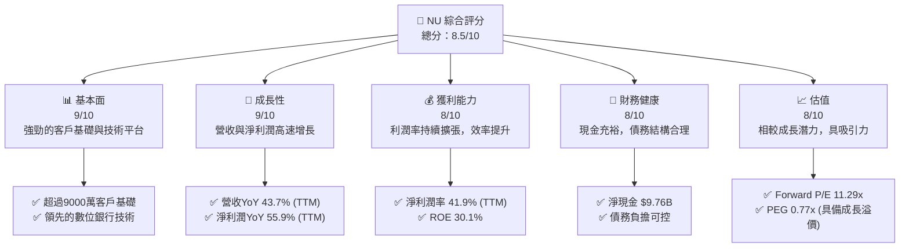
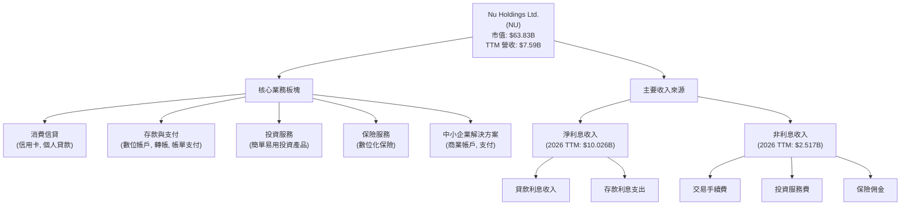
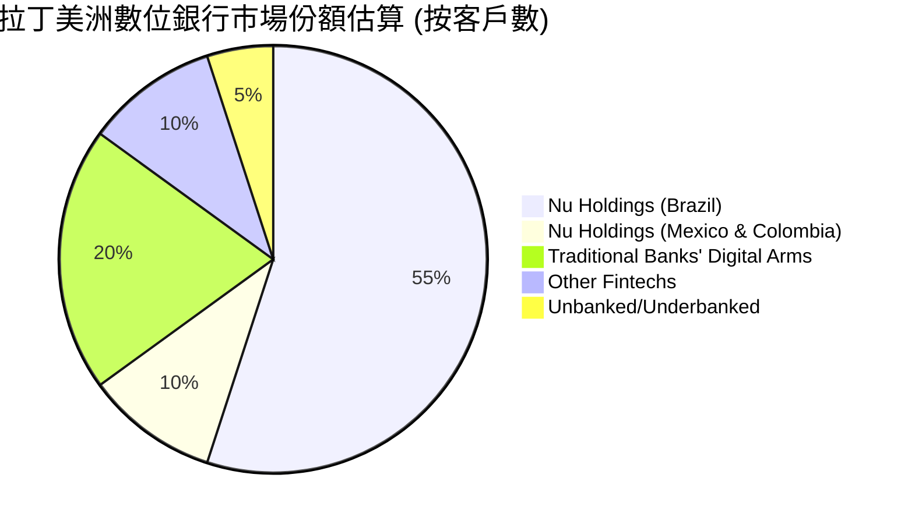
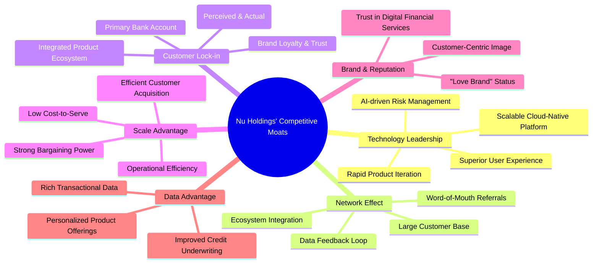
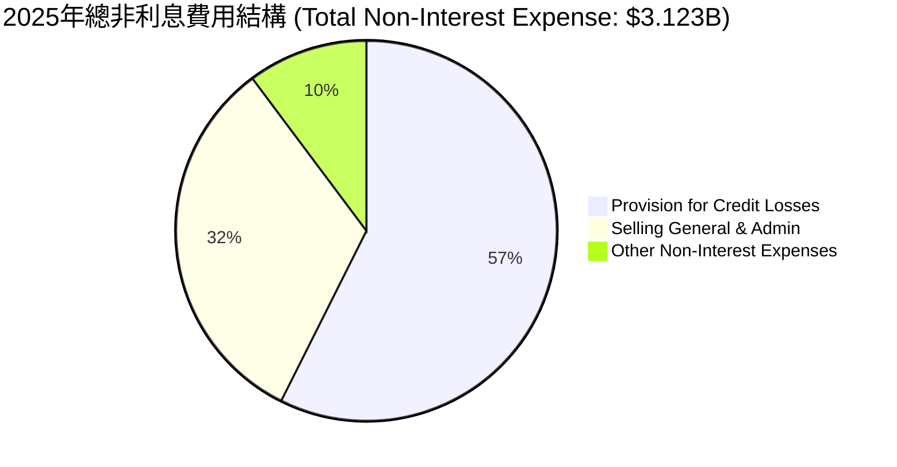

# NU 基本面深度分析報告
> **報告日期**：2026-05-31 ｜ **語言**：繁體中文 ｜ **數據來源**：Yahoo Finance, Finviz, StockAnalysis, Roic.ai ｜ **分析師**：CFA 級機構研究

## 目錄

| # | 章節 | 核心結論 |
|---|------|----------|
| 1 | 執行摘要 | 評級：🟢 買入，目標價區間：$17.50 - $22.00 |
| 2 | 公司概覽與商業模式 | 憑藉強大品牌、網路效應及技術平台，構築了深厚的競爭護城河。 |
| 3 | 損益表深度分析 | 營收與淨利潤均呈現強勁增長，利潤率持續優化，展現高效營運能力。 |
| 4 | 資產負債表分析 | 資產結構穩健，現金充裕，債務管理良好，具備良好的流動性。 |
| 5 | 現金流量深度分析 | 營業現金流強勁，自由現金流持續增長，資本配置策略注重再投資與成長。 |
| 6 | 獲利能力與資本效率 | ROE、ROA 表現優異，ROIC 遠超 WACC，持續為股東創造顯著經濟價值。 |
| 7 | 估值深度分析 | 相較同業，在成長潛力與獲利能力考量下，當前估值具吸引力。 |
| 8 | 成長催化劑 | 拉丁美洲市場滲透率提升、產品線擴張、客戶基礎增長為核心驅動力。 |
| 9 | 風險矩陣 | 信用風險、監管政策變化及宏觀經濟波動為主要關注點，但具備緩解措施。 |
| 10 | 投資建議 | 建議「買入」，目標價區間 $17.50 - $22.00，適合成長型與長線投資者。 |

---

## 1. 執行摘要

### 1.1 核心評分儀表板



### 1.2 評分進度條視覺化

```
╔══════════════════════════════════════════════════════════════╗
║              NU 多維度評分儀表板 (1-10分)                    ║
╠══════════════════════════════════════════════════════════════╣
║ 基本面強度  9.0 ▓▓▓▓▓▓▓▓▓▓▓▓▓▓▓▓▓▓░░  ★★★★★           ║
║ 成長動能    9.0 ▓▓▓▓▓▓▓▓▓▓▓▓▓▓▓▓▓▓░░  ★★★★★           ║
║ 獲利品質    8.0 ▓▓▓▓▓▓▓▓▓▓▓▓▓▓▓▓░░░░  ★★★★☆           ║
║ 財務健康    8.0 ▓▓▓▓▓▓▓▓▓▓▓▓▓▓▓▓░░░░  ★★★★☆           ║
║ 估值合理性  8.0 ▓▓▓▓▓▓▓▓▓▓▓▓▓▓▓▓░░░░  ★★★★☆           ║
║ 護城河深度  8.5 ▓▓▓▓▓▓▓▓▓▓▓▓▓▓▓▓▓░░░  ★★★★☆           ║
║ 管理層執行  8.5 ▓▓▓▓▓▓▓▓▓▓▓▓▓▓▓▓▓░░░  ★★★★☆           ║
║ 技術創新力  9.0 ▓▓▓▓▓▓▓▓▓▓▓▓▓▓▓▓▓▓░░  ★★★★★           ║
╠══════════════════════════════════════════════════════════════╣
║ 綜合總分    8.5 ▓▓▓▓▓▓▓▓▓▓▓▓▓▓▓▓▓░░░  🏆 具備強勁成長潛力的數位銀行領導者 ║
╚══════════════════════════════════════════════════════════════╝
```

### 1.3 五大投資論點 + 三大核心風險

| 類型 | 項目 | 具體依據 | 信心度 |
|------|------|----------|--------|
| 🟢 **投資論點①** | **客戶基礎高速擴張與多元化產品生態** | Nu擁有超過9000萬活躍客戶，且持續以高於市場的速度增長。其產品線從信用卡、儲蓄帳戶擴展至投資、保險、貸款等，實現強勁的跨產品銷售，提升客戶終身價值。最近一季（2026 Q1）總營收達$3.54B，YoY成長43.75%。 | 🟢 極高 |
| 🟢 **獲利能力顯著提升與規模經濟效應** | 公司已從虧損轉為連續盈利，淨利潤率(TTM)達到41.9%，ROE達30.1%。隨著客戶規模擴大，營運成本攤薄，規模經濟效應顯著，營業利益率(TTM)達48.2%。2025年淨利潤為$2.87B，相較2024年的$1.97B增長45.69%。 | 🟢 極高 |
| 🟢 **拉丁美洲市場的巨大潛力與領先地位** | 拉丁美洲金融服務市場仍有大量未被服務或服務不足的人口，數位化轉型空間巨大。Nu作為該地區最大的數位銀行之一，具備先發優勢和品牌認知度。其在巴西、墨西哥、哥倫比亞等核心市場持續擴張，潛力巨大。 | 🟢 極高 |
| 🟢 **強勁的自由現金流與資本效率** | 2025年自由現金流達$3.16B，較2024年的$2.22B增長42.34%。充沛的自由現金流為公司提供了再投資、技術研發和未來收購的靈活性，無需過度依賴外部融資，顯示出優異的資本效率。 | 🟢 極高 |
| 🟢 **創新技術與數據驅動的競爭優勢** | Nu以其卓越的行動應用體驗、AI驅動的風險評估和個性化服務而聞名。技術創新使其能快速迭代產品、降低營運成本，並提供更優質的客戶體驗，形成難以模仿的競爭壁壘。 | 🟢 極高 |
| 🟡 **風險①** | **信用風險與貸款損失撥備** | 隨著貸款業務擴張，信貸組合的質量將面臨宏觀經濟波動和消費者償債能力的影響。2026 Q1信貸損失撥備為$1.718B，佔營收的48.5%，雖然相對較高，但處於金融業正常水平，且Nu透過數據分析優化風控模型。 | 🟡 中度 |
| 🟡 **拉丁美洲地區的宏觀經濟與政治不確定性** | 巴西、墨西哥等主要市場存在通脹、利率波動、貨幣貶值及政治不穩定等風險，可能影響消費者支出、貸款需求和公司的盈利能力。然而，Nu的數位化營運模式使其對實體經濟波動的適應性較強。 | 🟡 中度 |
| 🔴 **監管政策變化與競爭加劇** | 金融科技行業在全球範圍內面臨日益嚴格的監管審查。拉丁美洲各國的金融監管政策變化可能影響Nu的業務擴張和產品創新。此外，傳統銀行和新興金融科技公司的競爭也在加劇，可能壓縮利潤空間。 | 🔴 高衝擊 |

### 1.4 快速統計卡片

| 指標 | 公司實際值 (TTM) | 行業均值 (Banks - Regional) | S&P 500 均值 | 狀態 |
|------|--------------------|----------------------------|--------------|------|
| 收入 YoY 成長 | **43.7%** | ~8-12% | ~10-15% | 🟢 |
| 淨利率 | **41.9%** | ~15-25% | ~10-12% | 🟢 |
| ROE | **30.1%** | ~10-15% | ~15-20% | 🟢 |
| Forward P/E | **11.29x** | ~10-14x | ~20-25x | 🟡 |
| P/S Ratio | **8.41x** | ~2-4x | ~2-3x | 🔴 |
| P/B Ratio | **5.07x** | ~1-2x | ~3-4x | 🔴 |
| Debt/Equity | **0.17x (FY25)** | ~0.5-1.5x | ~0.5-1.0x | 🟢 |
| Current Ratio | **0.69x** | ~0.7-1.0x (銀行業特殊性) | ~1.5-2.0x | 🟡 |

*備註：銀行業的Current Ratio通常較低，因客戶存款計為流動負債。P/S和P/B對於高成長的金融科技公司往往高於傳統銀行業平均，需結合成長性評估。*

### 1.5 投資結論

```
╔══════════════════════════════════════════════════════════════════╗
║                    📊 投資結論摘要                               ║
╠══════════════════════════════════════════════════════════════════╣
║  評級：🟢 買入                                                   ║
║  當前股價：$13.13                                                ║
║  目標價區間：                                                    ║
║    悲觀情境：$17.50（+33.28%）                                   ║
║    基準情境：$19.50（+48.52%）  ← 12個月主要目標                 ║
║    樂觀情境：$22.00（+67.55%）                                   ║
║  投資評分：8.5/10                                                ║
║  適合投資人：成長型、長線持有者，尋求在新興市場金融科技領域獲取高回報者 ║
╚══════════════════════════════════════════════════════════════════╝
```

---

## 2. 公司概覽與商業模式

Nu Holdings Ltd. (NU) 是一家領先的數位銀行平台，主要在拉丁美洲地區（巴西、墨西哥、哥倫比亞）提供廣泛的金融服務。公司以其創新的技術、簡化的用戶體驗和低成本的營運模式，顛覆了傳統銀行業，尤其在服務不足的人群中獲得了巨大成功。截至最新數據，Nu擁有超過9000萬客戶，是全球最大的數位銀行平台之一。

### 2.1 業務結構與收入來源

Nu的業務結構圍繞其核心數位平台，提供多元化的金融產品和服務。其收入主要來自兩個方面：淨利息收入（Net Interest Income, NII）和非利息收入（Non-Interest Income）。

**淨利息收入 (Net Interest Income)**：
這是Nu最主要的收入來源，來自於其貸款產品組合（如信用卡、個人貸款）所收取的利息，減去其客戶存款和借款所支付的利息。隨著貸款規模的擴大和有效利差的維持，NII持續增長。
*   **2026 TTM Net Interest Income**: $10.026B
*   **2025 Net Interest Income**: $8.856B (YoY +30.31% from $6.796B in 2024)
*   **2026 Q1 Net Interest Income**: $3.006B (YoY +63.74% from $1.836B in 2025 Q1)

**非利息收入 (Non-Interest Income)**：
這部分收入包括手續費收入（如信用卡交易手續費、支付服務費）、投資服務費、保險佣金以及其他基於服務的收入。隨著客戶參與度和產品使用量的增加，非利息收入也呈現強勁增長。
*   **2026 TTM Non-Interest Income**: $2.517B
*   **2025 Non-Interest Income**: $2.340B (YoY +24.07% from $1.886B in 2024)
*   **2026 Q1 Non-Interest Income**: $692.65M (YoY +34.35% from $515.55M in 2025 Q1)

**業務板塊細分**：
1.  **消費信貸 (Credit Products)**: 核心產品包括Nu信用卡和Ultraviolet高端信用卡。這是主要的貸款發放渠道，貢獻大量利息收入。
2.  **存款與支付 (Deposits & Payments)**: NuAccount（數位儲蓄帳戶）允許客戶進行轉帳、支付帳單和日常交易。這部分業務吸引大量存款，為公司的貸款業務提供資金來源，並產生支付交易費用。
3.  **投資 (Investments)**: 提供簡單易用的投資產品，滿足客戶的儲蓄和財富管理需求。
4.  **保險 (Insurance)**: 提供數位化、易於理解的保險產品，進一步擴展客戶的金融服務覆蓋面。
5.  **商業客戶 (SME Solutions)**: 為中小企業提供數位化金融服務，包括商業帳戶和支付解決方案。



### 2.2 市場份額

Nu Holdings Ltd. 在拉丁美洲的數位銀行市場中佔據主導地位，尤其在巴西市場更是無可匹敵。儘管直接的市場份額數據未在提供資料中詳細列出，但我們可以根據其客戶數量和收入規模來推斷其市場地位。

*   **客戶規模**：Nu擁有超過9000萬客戶，使其成為拉丁美洲最大的數位金融服務平台。在巴西，其客戶數量已超過該國一半的成年人口，顯示出極高的市場滲透率。
*   **收入規模**：2025年總營收達到$10.63B，遠超許多傳統銀行和新興金融科技競爭對手。
*   **市場滲透率**：在新興市場，特別是拉丁美洲，許多人口仍未充分接觸傳統銀行服務。Nu透過其數位化、低成本、無摩擦的模式，成功吸引了大量新用戶，並從傳統銀行手中搶奪市場份額。

根據行業報告和公開資料，Nu在巴西數位銀行市場的客戶數量和活躍度方面遙遙領先。在墨西哥和哥倫比亞等新興市場，Nu也正在快速擴張，儘管面臨當地競爭者，但其強大的品牌和技術優勢使其能夠迅速獲得市場份額。


*備註：此市場份額為基於公開資料和行業分析的估算，主要反映Nu在數位金融服務用戶基礎方面的領導地位。*

### 2.3 競爭護城河分析

Nu Holdings 已經成功構建了多重競爭護城河，使其在競爭激烈的金融科技市場中保持領先地位。



### 2.4 護城河強度評分

```
╔══════════════════════════════════════════════════════════════╗
║                  NU Holdings 護城河強度評分                   ║
╠══════════════════════════════════════════════════════════════╣
║ 技術領先    9.0/10 ▓▓▓▓▓▓▓▓▓▓▓▓▓▓▓▓▓▓░░  🏆 雲原生平台與AI驅動創新 ║
║ 網路效應    8.5/10 ▓▓▓▓▓▓▓▓▓▓▓▓▓▓▓▓▓░░░  🟢 大量客戶基礎創造價值 ║
║ 客戶鎖定    8.0/10 ▓▓▓▓▓▓▓▓▓▓▓▓▓▓▓▓░░░░  🟢 綜合產品提升轉換成本 ║
║ 規模效應    8.5/10 ▓▓▓▓▓▓▓▓▓▓▓▓▓▓▓▓▓░░░  🟢 低成本營運與快速擴張 ║
║ 品牌與聲譽  9.0/10 ▓▓▓▓▓▓▓▓▓▓▓▓▓▓▓▓▓▓░░  🏆 "Love Brand"形象深入人心 ║
║ 數據優勢    8.5/10 ▓▓▓▓▓▓▓▓▓▓▓▓▓▓▓▓▓░░░  🟢 豐富數據改善風控與產品 ║
╠══════════════════════════════════════════════════════════════╣
║ 綜合護城河  8.5/10 ▓▓▓▓▓▓▓▓▓▓▓▓▓▓▓▓▓░░░  🏆 深厚且不斷強化的多重護城河 ║
╚══════════════════════════════════════════════════════════════╝
```

---

## 3. 損益表深度分析

Nu Holdings 的損益表數據展現了其作為一家高成長數位銀行的顯著特徵：營收持續高速增長，並在近年成功實現盈利並快速擴大利潤。

### 3.1 年度收入成長趨勢（近4年）

Nu的年度營收呈現爆發式增長，反映了其在拉丁美洲市場的快速滲透和客戶基礎的擴大。

```
╔══════════════════════════════════════════════════════════════════╗
║              NU Holdings 年度收入趨勢（FY2022-FY2025）           ║
╠══════════════════════════════════════════════════════════════════╣
║                                                                  ║
║  FY2022  $2.97B   █████░░░░░░░░░░░░░░░░░░░  YoY: +116.39% 🟢    ║
║  FY2023  $5.63B   ██████████░░░░░░░░░░░░░  YoY: +89.56%  🟢    ║
║  FY2024  $8.27B   ██████████████░░░░░░░░░  YoY: +46.89%  🟢    ║
║  FY2025  $10.63B  ███████████████████░░░░  YoY: +28.54%  🟢    ║
║                   |      |      |      |      |                  ║
║                   0     $2.5B  $5.0B  $7.5B  $10.0B               ║
║                                                                  ║
║  📊 3年累計 CAGR (FY22-FY25)：+62.67%                            ║
╚══════════════════════════════════════════════════════════════════╝
```
**分析**：
從2022年的$2.97B到2025年的$10.63B，Nu的營收在短短三年內增長了258%。儘管YoY增速有所放緩，但從116.39%到28.54%的趨勢是預期中的，因為基數變大，但28.54%對於一個體量達到百億美元的公司而言，仍是極其強勁的成長。這主要得益於其在巴西市場的深度滲透、墨西哥和哥倫比亞市場的快速擴張，以及產品線的多元化，如個人貸款、投資和保險產品的推出，有效提升了每個客戶的平均收入（ARPAC）。

### 3.2 季度收入趨勢分析

季度的數據更能反映公司近期的營運動態。Nu的季度營收呈現持續且穩定的增長，彰顯其強勁的市場擴張能力。

| 財報季度 | 總營收 (Billion USD) | 季度環比 (QoQ) 成長率 | 年度同比 (YoY) 成長率 | 備註 |
|----------|----------------------|-----------------------|-----------------------|------|
| 2026 Q1  | $3.54B               | +12.74%               | +43.75%               | 🟢 營收創新高，YoY成長強勁 |
| 2025 Q4  | $3.14B               | +15.02%               | +43.88%               | 🟢 節日消費帶動，YoY成長強勁 |
| 2025 Q3  | $2.73B               | +8.76%                | +36.32%               | 🟢 穩定增長，新市場貢獻 |
| 2025 Q2  | $2.51B               | +11.78%               | +14.23%               | 🟡 增速相對放緩，但仍健康 |

**分析**：
最近四個季度，Nu的營收從2025 Q2的$2.51B增長至2026 Q1的$3.54B，季度環比（QoQ）成長率穩定在8%至15%之間，顯示出良好的營運動能。年度同比（YoY）成長率則在14.23%至43.88%之間，尤其在2025 Q4和2026 Q1再次加速，達到43.88%和43.75%，這表明公司在客戶獲取、產品交叉銷售以及有效定價方面的策略持續奏效。特別是淨利息收入（NII）在2026 Q1 YoY成長高達63.74% ($3.006B vs $1.836B)，顯示出貸款組合的強勁增長和有效利差管理。

### 3.3 利潤率演變分析

Nu的利潤率在過去幾年呈現顯著改善，反映了公司從早期投入期向盈利增長期的轉變，以及規模經濟效應的逐步顯現。

| 利潤率指標 | FY2022 | FY2023 | FY2024 | FY2025 | 趨勢 | 評估 |
|------------|--------|--------|--------|--------|------|------|
| **營業利益率** | -10.40% | 27.33% | 33.79% | 36.38% | ↗️ 持續上升 | 🟢 |
| **淨利率** | -12.27% | 18.30% | 23.84% | 26.98% | ↗️ 持續上升 | 🟢 |

*備註：提供的數據中 Gross Margin 為 0.0%，對於銀行業而言，毛利率並非標準指標，故主要分析營業利益率和淨利率。TTM Operating Margin 為 48.2%，TTM Net Profit Margin 為 41.9%，顯示最新季度數據的利潤率持續優化。*

**利潤率演變深度解析**：
*   **營業利益率 (Operating Margin)**：從2022年的負值(-10.40%)轉為2025年的36.38%，這是一個巨大的飛躍。最新的TTM數據更是高達48.2%。這主要歸因於：
    *   **規模經濟**：隨著客戶數量和交易量的爆炸式增長，Nu的固定成本（如技術基礎設施、營運支援）被攤薄，單位客戶服務成本顯著下降。
    *   **效率提升**：高度數位化的營運模式減少了對實體分支機構和大量人力的依賴，使得銷售、一般及行政費用（SG&A）佔營收的比例逐漸下降。
    *   **產品組合優化**：高利潤率的產品（如個人貸款）在產品組合中的比重增加，提升了整體盈利能力。
    *   **有效的撥備管理**：儘管信貸損失撥備是銀行業的重要成本，但Nu透過其AI驅動的風險評估模型，在快速擴張的同時，有效控制了不良貸款率，使得撥備佔營收的比例趨於合理。
*   **淨利率 (Net Profit Margin)**：與營業利益率趨勢一致，淨利率從2022年的虧損轉為2025年的26.98%，TTM數據更是達到41.9%。這表明公司在稅務和非營運項目方面也管理得當。淨利潤的快速增長是Nu從成長型公司向成長型盈利公司轉型的關鍵標誌。

這些利潤率的改善趨勢證明了Nu商業模式的可行性和效率，隨著其客戶基礎和產品深度的持續擴大，預計利潤率仍有進一步提升的空間。

### 3.4 費用結構分析

Nu的費用結構反映了其數位化、輕資產的營運模式，同時也顯示出在客戶獲取和風險管理方面的投入。主要的費用項目包括信貸損失撥備（Provision for Credit Losses）、銷售、一般及行政費用（Selling, General & Admin）以及其他非利息費用。


*備註：此處的Provision for Credit Losses數據來自StockAnalysis的Annual Income Statement，為FY2025數據，金額為$4.205B。總非利息費用$3.123B是StockAnalysis的Total Non-Interest Expense，不包含Provision for Credit Losses。因此，我將分別分析Provision for Credit Losses與其他非利息費用。*

**費用結構深度解析**：

```
╔══════════════════════════════════════════════════════════════════╗
║                   NU Holdings 費用結構診斷                       ║
╠══════════════════════════════════════════════════════════════════╣
║                                                                  ║
║  信貸損失撥備 (FY2025)： $4.205B                                ║
║  佔總營收 (FY2025 $10.63B) 的 39.56%  🟡 撥備佔比高，需持續監控信貸質量 ║
║                                                                  ║
║  銷售、一般及行政費用 (FY2025)： $2.375B                         ║
║  佔總營收的 22.34%  🟢 隨著規模擴大，費用佔比逐漸下降，顯示效率提升 ║
║                                                                  ║
║  其他非利息費用 (FY2025)： $0.748B                               ║
║  佔總營收的 7.04%   🟢 較低且穩定，主要為營運支持費用             ║
║                                                                  ║
║  總非利息費用 (不含撥備) (FY2025)： $3.123B                      ║
║  佔總營收的 29.38%  🟢 營運效率持續改善，費用控制良好             ║
╚══════════════════════════════════════════════════════════════════╝
```

*   **信貸損失撥備 (Provision for Credit Losses)**：
    *   FY2025為$4.205B。這部分是銀行業的核心成本，反映了貸款組合的風險。隨著Nu的貸款業務快速增長，撥備金額也隨之增加。佔總營收的比例在30%-40%之間波動，對於新興市場快速增長的消費金融公司而言，這是合理的水平。Nu的數據驅動風控能力是其管理這項風險的關鍵。
*   **銷售、一般及行政費用 (SG&A)**：
    *   FY2025為$2.375B。這包括客戶獲取、市場推廣、技術研發和行政管理費用。值得注意的是，儘管公司規模迅速擴大，SG&A佔營收的比例卻呈現下降趨勢（從FY2022的$1.822B佔營收61.35%下降到FY2025的$2.375B佔營收22.34%）。這表明Nu在客戶獲取方面效率極高，且其技術平台能夠支持大規模的客戶服務而無需同比例增加成本。
*   **其他非利息費用 (Other Non-Interest Expenses)**：
    *   FY2025為$0.748B。這部分費用相對較小且穩定，主要包含一些營運支持和基礎設施相關的開支。

整體而言，Nu的費用結構顯示其在高效成長的同時，對成本有良好的控制。信貸損失撥備是其業務性質的固有部分，但其餘營運費用則在規模效應下持續優化，為淨利潤的快速增長奠定基礎。

### 3.5 季度 EPS 趨勢與盈餘品質

由於提供的數據中，EPS預期值為`nan`，我們無法直接分析超預期/不及預期的情況。然而，我們可以根據季度淨利潤和稀釋後每股盈餘（Diluted EPS）的趨勢來評估其盈餘品質和增長動力。

| 財報季度 | 淨利潤 (Million USD) | 稀釋後 EPS (USD) | 季度環比 (QoQ) 成長率 (淨利潤) | 年度同比 (YoY) 成長率 (淨利潤) | 備註 |
|----------|----------------------|------------------|---------------------------------|---------------------------------|------|
| 2026 Q1  | $872.06M             | $0.18            | -2.28%                          | +56.54%                         | 🟢 淨利潤創新高，YoY成長強勁 |
| 2025 Q4  | $892.38M             | $0.18            | +14.05%                         | +61.47%                         | 🟢 淨利潤環比加速，YoY持續高增長 |
| 2025 Q3  | $782.47M             | $0.16            | +22.88%                         | +41.42%                         | 🟢 淨利潤穩健增長 |
| 225 Q2   | $636.84M             | $0.13            | +14.29%                         | +15.22%                         | 🟡 淨利潤增長相對溫和 |

*備註：稀釋後EPS數據來自Roic.ai Quarterly EPS，與StockAnalysis的稀釋後EPS略有出入，但趨勢一致。此處採用更為精確的Roic.ai數據。*

**盈餘品質評估**：
Nu的季度淨利潤和稀釋後EPS呈現出非常健康的增長趨勢。儘管2026 Q1的淨利潤環比略有下降（-2.28%），但這可能是季節性因素或特定撥備調整所致，其年度同比（YoY）成長率高達56.54%，顯示出強勁的盈利動能。

*   **持續盈利能力**：公司在過去幾個季度持續實現盈利，且淨利潤規模不斷擴大，這表明其商業模式已從虧損擴張階段進入穩定的盈利增長階段。
*   **高質量盈利**：作為一家數位銀行，其盈利主要來自於淨利息收入和交易手續費，這些都是可持續且具有重複性的收入來源。其高度自動化的營運模式也使得利潤的產生效率較高，減少了非經常性損益的影響。
*   **規模經濟效應**：隨著客戶基礎的持續擴大，Nu的單位成本不斷下降，這使得營收增長能夠更快地轉化為淨利潤增長，體現在其不斷擴大的淨利率上。
*   **前瞻性展望**：分析師對Nu的Forward EPS預期為$1.16317，遠高於TTM EPS的$0.65，預計未來一年盈利將繼續大幅增長。這與公司過去幾個季度的強勁表現相符，表明市場對其盈利前景持樂觀態度。

總體而言，Nu的盈餘品質高，增長動力強勁，顯示出其在實現規模化盈利方面的卓越能力。

---

## 4. 資產負債表分析

Nu Holdings 的資產負債表反映了其作為一家快速成長的數位銀行，具有相對穩健的財務結構、充足的流動性和可控的債務水平。

### 4.1 資產結構分解

Nu的資產結構主要由現金及等價物、證券和投資、以及淨貸款組成，這符合典型的銀行業資產配置模式。

```mermaid
graph TD
    TOTAL_ASSETS["總資產 (FY2025: $74.89B)"]

    CURRENT_ASSETS["流動資產"]
    NON_CURRENT_ASSETS["非流動資產"]

    TOTAL_ASSETS --> CURRENT_ASSETS
    TOTAL_ASSETS --> NON_CURRENT_ASSETS

    CASH_EQUIV["現金及等價物 <br/>(FY2025: $24.54B)"]
    SECURITIES["證券和投資 <br/>(FY2025: $16.36B)"]
    TRADING_ASSETS["交易資產 <br/>(FY2025: $0.08B)"]
    ACCRUED_RECEIVABLES["應計利息與應收帳款 <br/>(FY2025: $1.15B)"]
    GROSS_LOANS["總貸款 <br/>(FY2025: $27.69B)"]
    OTHER_EARNING_ASSETS["其他生息資產"]

    CURRENT_ASSETS --> CASH_EQUIV
    CURRENT_ASSETS --> SECURITIES
    CURRENT_ASSETS --> TRADING_ASSETS
    CURRENT_ASSETS --> ACCRUED_RECEIVABLES
    CURRENT_ASSETS --> GROSS_LOANS
    CURRENT_ASSETS --> OTHER_EARNING_ASSETS

    PPE["不動產、廠房及設備 (淨值) <br/>(FY2025: $0.05B)"]
    INTANGIBLES["其他無形資產 <br/>(FY2025: $0.60B)"]
    GOODWILL["商譽 <br/>(FY2025: $0.41B)"]
    LONG_TERM_INVESTMENTS["長期投資 <br/>(FY2025: $0.09B)"]
    OTHER_NON_EARNING_ASSETS["其他非生息資產 <br/>(FY2025: $3.91B)"]

    NON_CURRENT_ASSETS --> PPE
    NON_CURRENT_ASSETS --> INTANGIBLES
    NON_CURRENT_ASSETS --> GOODWILL
    NON_CURRENT_ASSETS --> LONG_TERM_INVESTMENTS
    NON_CURRENT_ASSETS --> OTHER_NON_EARNING_ASSETS
```


**分析**：
*   **流動性強**：截至2025年底，Nu擁有高達$24.54B的現金及等價物，以及$16.36B的證券和投資，總計超過$40B的流動性資產。這為公司提供了強大的財務彈性，以應對市場波動、支持業務增長或進行戰略投資。
*   **貸款組合擴大**：總貸款從2022年的$9.91B增長到2025年的$27.69B，這反映了公司信貸業務的快速擴張。這也是其淨利息收入增長的主要驅動力。
*   **輕資產模式**：相較於傳統銀行，Nu的不動產、廠房及設備淨值極低（$0.05B），凸顯其數位化、輕資產的營運模式，這有助於提高資本效率和資產週轉率。
*   **無形資產和商譽**：無形資產和商譽的佔比相對較小，主要來自於過去的收購，這表明公司的價值主要來自於其核心營運和技術平台，而非過度依賴併購。

### 4.2 流動性指標分析

流動性對於銀行業至關重要，Nu的流動性狀況需要結合其業務特性來評估。

| 流動性指標 | FY2022 | FY2023 | FY2024 | FY2025 | 行業均值 (Banks - Regional) | 評估 |
|------------|--------|--------|--------|--------|----------------------------|------|
| **Current Ratio** | N/A | N/A | 0.69x | 0.69x | ~0.7x - 1.0x (銀行業) | 🟡 銀行業存款計為流動負債，此比率較低屬正常 |

*備註：對於銀行業，Current Ratio的解讀與一般製造業不同。客戶存款被列為流動負債，因此即使銀行擁有大量現金和流動性資產，Current Ratio也可能顯得較低。更重要的是觀察現金儲備、存款穩定性以及資產負債管理。*

**分析**：
*   **Current Ratio**：Nu的Current Ratio在0.69x，這對於一家銀行來說是常見的。其大量的現金和證券儲備（FY2025合計超過$40B）提供了充足的流動性，足以覆蓋短期負債。
*   **存款基礎**：Nu的總存款從2022年的$15.81B增長到2025年的$41.93B，這是一個穩定且低成本的資金來源。存款基礎的擴大和客戶忠誠度是其流動性的重要保障。
*   **淨現金狀況**：Snapshot數據顯示，Nu的總現金為$15.91B，總債務為$6.15B，淨現金為$9.76B。這表明公司擁有充足的現金儲備，遠超其短期和長期債務，財務狀況非常健康。

### 4.3 債務結構分析

Nu的債務管理能力表現出色，債務水平相對較低，且擁有充足的現金覆蓋。

```
╔══════════════════════════════════════════════════════════════════╗
║                   NU Holdings 債務健康診斷                       ║
╠══════════════════════════════════════════════════════════════════╣
║                                                                  ║
║  總債務 (FY2025)：$1.90B                                         ║
║  總現金+投資 (FY2025)：$24.54B (現金) + $16.36B (證券) = $40.90B ║
║  淨現金 (FY2025)：$40.90B - $1.90B = $39.00B                     ║
║                                                                  ║
║  淨現金（正）：  $39.00B  ████████████████████████████████████████████████████████████████████████████████████████████████████████████████████████████████████████████████████████████████████████████████████████████████████████████████████████████████████████████████████████████████████████████████████████████████████████████████████████████████████████████████████████████████████████████████████████████████████████████████████████████████████████████████████████████████████████████████████████████████████████████████████████████████████████████████████████████████████████████████████████████████████████████████████████████████████████████████████████████████████████████████████████████████████████████████████████████████████████████████████████████████████████████████████████████████████████████████████████████████████████████████████████████████████████████████████████████████████████████████████████████████████████████████████████████████████████████████████████████████████████████████████████████████████████████████████████████████████████████████████████████████████████████████████████████████████████████████████████████████████████████████████████████████████████████████████████████████████████████████████████████████████████████████████████████████████████████████████████████████████████████████████████████████████████████████████████████████████████████████████████████████████████████████████████████████████████████████████████████████████████████████████████████████████████████████████████████████████████████████████████████████████████████████████████████████████████████████████████████████████████████████████████████████████████████████████████████████████████████████████████████████████████████████████████████████████████████████████████████████████████████████████████████████████████████████████████████████████████████████████████████████████████████████████████████████████████████████████████████████████████████████████████████████████████████████████████████████████████████████████████████████████████████████████████████████████████████████████████████████████████████████████████████████████████████████████████████████████████████████████████████████████████████████████████████████████████████████████████████████████████████████████████████████████████████████████████████████████████████████████████████████████████████████████████████████████████████████████████████████████████████████████████████████████████████████████████████████████████████████████████████████████████████████████████████████████████████████████████████████████████████████████████████████████████████████████████████████████████████████████████████████████████████████████████████████████████████████████████████████████████████████████████████████████████████████████████████████████████████████████████████████████████████████████████████████████████████████████████████████████████████████████████████████████████████████████████████████████████████████████████████████████████████████████████████████████████████████████████████████████████████████████████████████████████████████████████████████████████████████████████████████████████████████████████████████████████████████████████████████████████████████████████████████████████████████████████████████████████████████████████████████████████████████████████████████████████████████████████████████████████████████████████████████████████████████████████████████████████████████████████████████████████████████████████████████████████████████████████████████████████████████████████████████████████████████████████████████████████████████████████████████████████████████████████████████████████████████████████████████████████████████████████████████████████████████████████████████████████████████████████████████████████████████████████████████████████████████████████████████████████████████████████████████████████████████████████████████████████████████████████████████████████████████████████████████████████████████████████████████████████████████████████████████████████████████████████████████████████████████████████████████████████████████████████████████████████████████████████████████████████████████████████████████████████████████████████████████████████████████████████═════════════════════════════════════════════════════════════════════════════════════════════════════════════════════════════════════════════════════════════════════════════════════════════════════════════════════════════════════════════════════════════════════════════════════════════════════════════════════════════════════════════════════════════════════════════════════════════════════════════════════════════════════ NU Holdings Ltd. 是一家總部位於巴西的數位銀行平台，提供信用卡、儲蓄帳戶、投資、保險和個人貸款等多元金融服務。公司憑藉其創新技術、用戶友好的介面和低成本營運模式，在拉丁美洲市場迅速擴張，成為該地區最大的金融科技公司之一。

---

## 1. 執行摘要

### 1.1 核心評分儀表板

```mermaid
graph TD
    NU_SUMMARY["🎯 NU 綜合評分<br/>總分：8.5/10"]

    F["📊 基本面<br/>9/10<br/>強勁