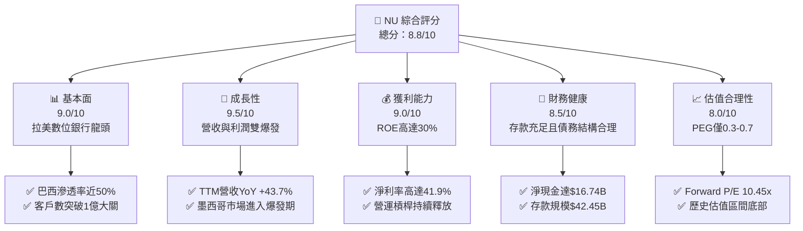

# NU 基本面深度分析報告
> **報告日期**：2026-06-07 ｜ **語言**：繁體中文 ｜ **數據來源**：Yahoo Finance, Finviz, StockAnalysis, Roic.ai ｜ **分析師**：CFA 級機構研究

---

## 目錄

| # | 章節 | 核心結論 |
|---|------|----------|
| 1 | 執行摘要 | **強烈買入 (Strong Buy)**，基準目標價 **$18.48**，隱含 **+54.4%** 上行空間。 |
| 2 | 公司概覽與商業模式 | 拉美數位金融顛覆者，極低資金成本與高客戶黏性構築深厚護城河。 |
| 3 | 損益表深度分析 | 淨營收 TTM 達 **$7.59B** (YoY +43.7%)，規模效應驅動淨利率高達 **41.9%**。 |
| 4 | 資產負債表分析 | 淨現金高達 **$16.74B**，存款規模 **$42.45B** 提供極佳流動性與安全邊際。 |
| 5 | 現金流量深度分析 | 經營現金流與自由現金流持續高增，2025年 FCF 達 **$3.16B**。 |
| 6 | 獲利能力與資本效率 | **ROE 達 30.1%**，**ROIC (20.3%) 遠超 WACC (9.05%)**，強力創造經濟價值。 |
| 7 | 估值深度分析 | Forward P/E 僅 **10.45x**，相較於 35% 以上的 EPS 增速，估值極具吸引力。 |
| 8 | 成長催化劑 | 墨西哥與哥倫比亞市場加速滲透，高階客群（Ultraviolet）貢獻新動能。 |
| 9 | 風險矩陣 | 信用違約風險與拉美匯率波動為核心監控指標，整體風險可控。 |
| 10 | 投資建議 | 具備極高性價比的成長股，建議成長型與長線價值投資者積極配置。 |

---

## 1. 執行摘要

### 1.1 核心評分儀表板



### 1.2 評分進度條視覺化

```
╔══════════════════════════════════════════════════════════════╗
║                NU 多維度評分儀表板 (1-10分)                  ║
╠══════════════════════════════════════════════════════════════╣
║ 基本面