# NU 綜合股票評估報告

> **報告日期**：2026-02-24 ｜ **語言**：繁體中文 ｜ **數據來源**：Yahoo Finance ｜ **評估師**：頂級美股投資評估系統

---

## 目錄

| 章節 | 內容 |
|------|------|
| [1. 評估總覽](#1-評估總覽) | 綜合評分、ASCII雷達圖、快速結論 |
| [2. 六維度評分矩陣](#2-六維度評分矩陣) | 成長/獲利/財務/估值/競爭/管理層 |
| [3. 業務品質評估](#3-業務品質評估) | 商業模式、護城河、市場地位 |
| [4. 財務健康評估](#4-財務健康評估) | 儀表板、獲利趨勢、現金流 |
| [5. 成長性評估](#5-成長性評估) | 成長軌跡、CAGR、未來驅動力 |
| [6. 估值合理性評估](#6-估值合理性評估) | 多重估值法、同業比較 |
| [7. 風險評估](#7-風險評估) | 風險熱圖、風險項目、緩解措施 |
| [8. 催化劑與觸發因素](#8-催化劑與觸發因素) | 時間軸、觸發因素分析 |
| [9. 投資建議](#9-投資建議) | 最終評級、目標價、投資策略 |

---

## 1. 評估總覽

### 🎯 綜合評分概覽

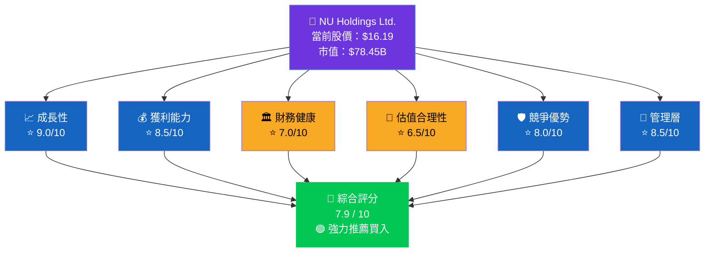

---

### 📡 ASCII 多維度雷達圖

```
                    成長性 (9.0)
                       ▲
                    ████████
                  ██████████
                ████████████
    管理層   ████████████████  獲利能力
    (8.5) ████████████████████ (8.5)
          ██████████████████
          ██████████████████
    競爭   ████████████████  財務健康
    優勢   ████████████████   (7.0)
    (8.0)   ████████████
              ████████
                ████
                  ▼
               估值合理性 (6.5)

╔══════════════════════════════════════╗
║  評分刻度：● 0─2 ○ 3─4 ◑ 5─6      ║
║           ◕ 7─8 ● 9─10             ║
║  整體形狀：偏向成長型、強獲利       ║
╚══════════════════════════════════════╝
```

---

### 📊 評分明細視覺化

```
維度            分數    評分條 (10格)                    評級
────────────────────────────────────────────────────────────
成長性          9.0/10  ▓▓▓▓▓▓▓▓▓░  ████████████████████░  🟢
獲利能力        8.5/10  ▓▓▓▓▓▓▓▓▓░  ███████████████████░░  🟢
競爭優勢        8.0/10  ▓▓▓▓▓▓▓▓░░  ████████████████░░░░░  🟢
管理層執行力    8.5/10  ▓▓▓▓▓▓▓▓▓░  ███████████████████░░  🟢
財務健康        7.0/10  ▓▓▓▓▓▓▓░░░  ██████████████░░░░░░░  🟡
估值合理性      6.5/10  ▓▓▓▓▓▓▓░░░  █████████████░░░░░░░░  🟡
────────────────────────────────────────────────────────────
🎯 加權綜合    7.9/10  ▓▓▓▓▓▓▓▓░░  ███████████████░░░░░░  🟢
```

---

### 🗳️ 投資結論快速概覽

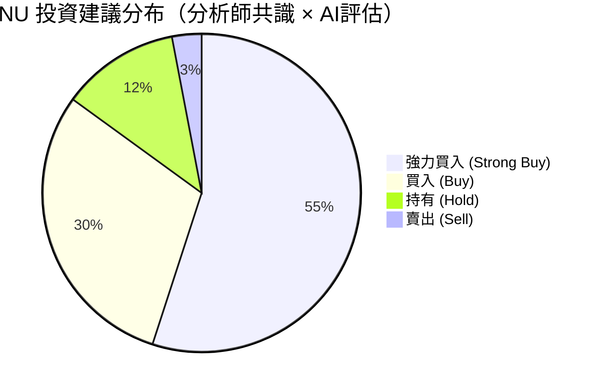

---

## 2. 六維度評分矩陣

### 📋 完整評分表格

| 維度 | 評分 | 評級 | 關鍵指標 | 主要優勢 | 主要風險 |
|------|------|------|----------|----------|----------|
| 📈 **成長性** | **9.0/10** | 🟢 優秀 | 收入YoY +36.3%；用戶持續擴張 | 拉美市場深度滲透；墨西哥高速成長 | 增速趨緩風險 |
| 💰 **獲利能力** | **8.5/10** | 🟢 優秀 | 淨利潤率39.8%；ROE 27.8% | 超高效的數位金融模式；規模效益顯著 | 信貸損失擴大 |
| 🏛️ **財務健康** | **7.0/10** | 🟡 良好 | 現金$13.64B；FCF $2.22B | 低債務槓桿；強勁自由現金流 | 負營業CF（含存款）|
| 💎 **估值合理性** | **6.5/10** | 🟡 偏高 | 遠期PE 17.8x；P/S 12.3x | 成長溢價合理；分析師目標$19.99 | 絕對估值偏貴 |
| 🛡️ **競爭優勢** | **8.0/10** | 🟢 強勁 | 拉美最大數位銀行；1億+用戶 | 網絡效應；低成本結構；品牌黏性 | 傳統銀行反擊 |
| 👔 **管理層** | **8.5/10** | 🟢 優秀 | David Vélez執行力卓越 | 創始人驅動；清晰戰略願景 | 組織規模化挑戰 |

---

### 📊 Unicode 評分條精細視覺化

```
┌─────────────────────────────────────────────────────────────┐
│              NU HOLDINGS — 六維度評分儀表板                  │
├─────────────────────────────────────────────────────────────┤
│                                                             │
│  成長性     [██████████████████░░] 9.0  🟢 EXCELLENT        │
│  獲利能力   [█████████████████░░░] 8.5  🟢 EXCELLENT        │
│  管理層     [█████████████████░░░] 8.5  🟢 EXCELLENT        │
│  競爭優勢   [████████████████░░░░] 8.0  🟢 STRONG           │
│  財務健康   [██████████████░░░░░░] 7.0  🟡 GOOD             │
│  估值合理   [█████████████░░░░░░░] 6.5  🟡 FAIR             │
│                                                             │
│  加權綜合   [███████████████░░░░░] 7.9  🟢 BUY              │
│                                                             │
│  ░ = 未達  █ = 已達  權重：成長25%/獲利20%/競爭20%          │
│            財務15%/管理10%/估值10%                          │
└─────────────────────────────────────────────────────────────┘
```

---

### 🎯 風險/報酬矩陣

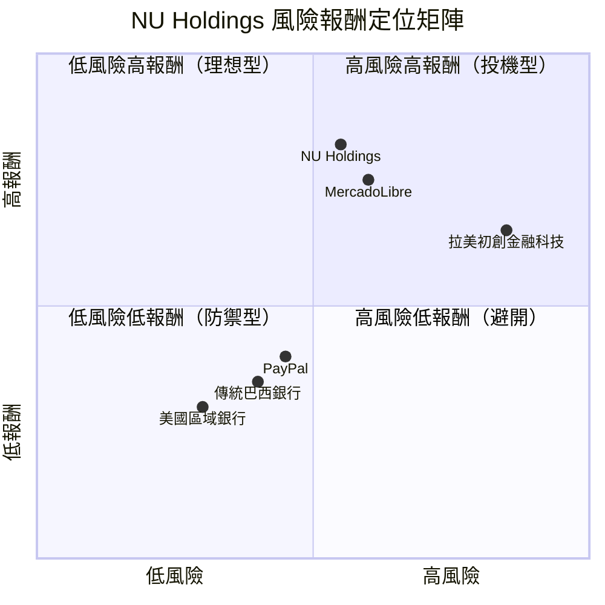

---

## 3. 業務品質評估

### 🏗️ 商業模式全景圖

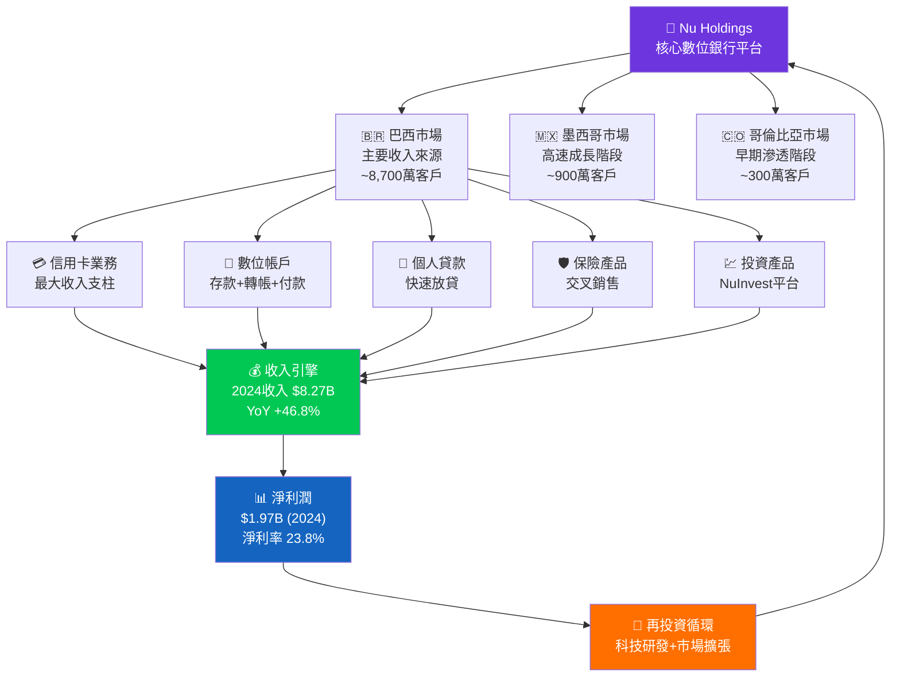

---

### 🛡️ 護城河評估

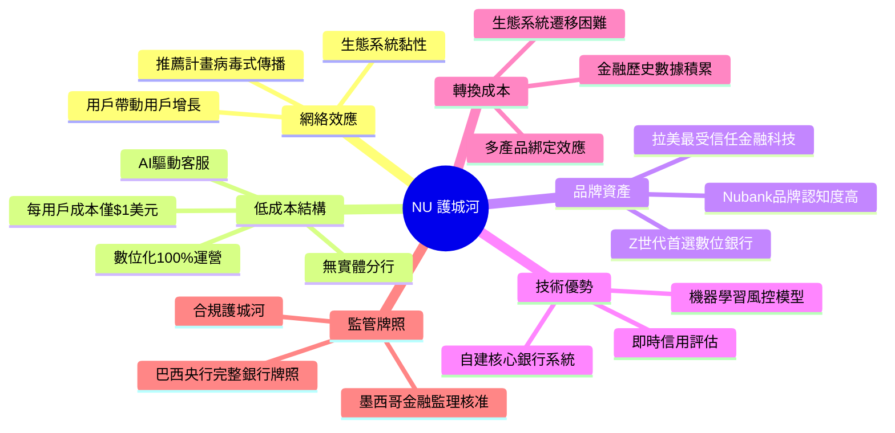

---

### 🏆 市場地位與競爭動態

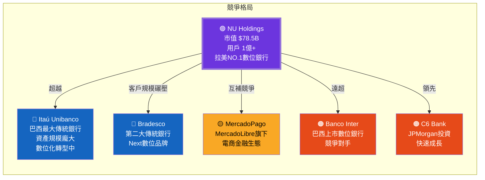

---

### 👔 管理層執行力評分

| 評估項目 | 評分 | 評級 | 說明 |
|----------|------|------|------|
| **戰略清晰度** | 9/10 | 🟢 | David Vélez的拉美金融民主化願景清晰且持續執行 |
| **執行速度** | 9/10 | 🟢 | 從巴西到墨西哥、哥倫比亞的快速複製能力 |
| **資本配置** | 8/10 | 🟢 | 從虧損到盈利的轉變展示出優秀資本紀律 |
| **創新能力** | 9/10 | 🟢 | 持續推出Ultraviolet、Nubank+等差異化產品 |
| **風控管理** | 7/10 | 🟡 | 信貸質量在高增長中保持相對穩定 |
| **溝通透明度** | 8/10 | 🟢 | 定期詳盡的財報溝通；Berkshire背書加分 |
| **組織擴張** | 8/10 | 🟢 | 從初創到萬人企業的快速規模化 |
| **綜合評分** | **8.3/10** | 🟢 | **頂尖創始人驅動型企業管理水準** |

---

## 4. 財務健康評估

### 📊 財務儀表板

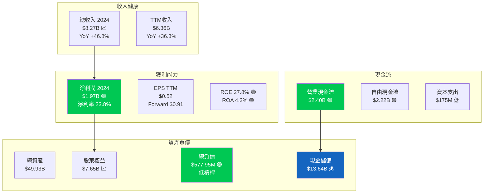

---

### 📈 獲利能力趨勢表格（近4年）

| 指標 | 2021 | 2022 | 2023 | 2024 | 趨勢 |
|------|------|------|------|------|------|
| **總收入** | $1.15B | $2.97B | $5.63B | $8.27B | 🟢 高速成長 |
| **淨利潤** | -$165M | -$365M | $1.03B | $1.97B | 🟢 扭虧為盈 |
| **淨利率** | N/M | N/M | 18.3% | 23.8% | 🟢 持續提升 |
| **ROE** | N/M | N/M | 16.1% | 25.7% | 🟢 快速改善 |
| **ROA** | N/M | N/M | 2.4% | 3.9% | 🟢 穩步上升 |
| **營業CF** | -$2.92B | $0.76B | $1.27B | $2.40B | 🟢 大幅改善 |
| **自由CF** | -$2.95B | $0.64B | $1.09B | $2.22B | 🟢 健康正轉 |

> **⚠️ 注意**：TTM數據與年報2024數據略有差異，係因季度計算截點不同

---

### 🏛️ 資產負債表穩健度視覺化

```
┌─────────────────────────────────────────────────────────────────┐
│                 NU 資產負債結構分析 (2024年報)                   │
├─────────────────────────────────────────────────────────────────┤
│                                                                 │
│  資產結構 ($49.93B)          負債+權益結構 ($49.93B)            │
│  ─────────────────           ──────────────────────            │
│  現金及等值物                 存款負債                          │
│  $13.64B [██████░░░░] 27.3%  $38B+  [████████░░] ~76%          │
│                                                                 │
│  信貸資產組合                 有息負債(借款)                    │
│  $20B+  [████████░░] ~40%    $578M  [█░░░░░░░░░] 1.2%  🟢      │
│                                                                 │
│  投資組合                     股東權益                          │
│  $10B+  [████░░░░░░] ~20%    $7.65B [███░░░░░░░] 15.3%         │
│                                                                 │
│  其他資產                                                       │
│  $6B+   [██░░░░░░░░] ~12%   債務/資產比：1.2% 🟢 極低          │
│                                                                 │
│  ⚡ 流動性評估：現金$13.64B vs 長期債$578M → 覆蓋率23.6倍 🟢   │
│  ⚡ 股東權益：$4.44B→$7.65B (2021-2024) 年複合成長 +19.9%     │
└─────────────────────────────────────────────────────────────────┘
```

---

### 💸 現金流生成分析

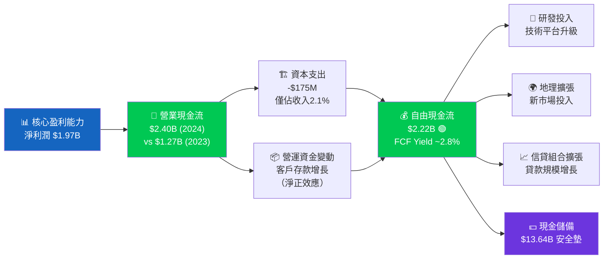

---

## 5. 成長性評估

### 🚀 成長軌跡總覽

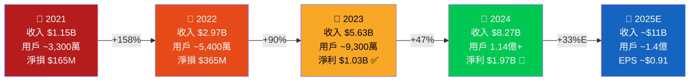

---

### 📊 歷史成長率 CAGR 分析表

| 指標 | 3年 CAGR (2021-2024) | 2年 CAGR (2022-2024) | YoY 2024 | 評級 |
|------|----------------------|----------------------|----------|------|
| **總收入** | +92.6% | +66.9% | +46.8% | 🟢 |
| **客戶數量** | ~51% | ~45% | ~22% | 🟢 |
| **淨利潤** | N/M（虧轉盈）| N/M | +91.3% | 🟢 |
| **股東權益** | +19.9% | +25.0% | +19.3% | 🟢 |
| **自由現金流** | N/M（轉正）| N/M | +103.8% | 🟢 |
| **EPS** | N/M | N/M | +87.5% | 🟢 |

> **📌 CAGR 解讀**：NU 的成長速度在全球金融科技中屬於頂尖梯隊，3年收入CAGR接近93%，在$78B市值的公司中極為罕見。

---

### 🔮 未來成長驅動力

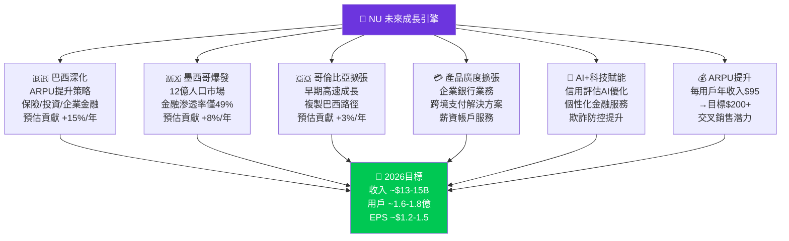

---

### 📈 市場份額趨勢視覺化

```
┌─────────────────────────────────────────────────────────────────┐
│              拉美數位銀行市場份額估算（客戶數基礎）              │
├─────────────────────────────────────────────────────────────────┤
│                                                                 │
│  NU Nubank    [████████████████████████░] ~48%  🟢 No.1        │
│  MercadoPago  [████████░░░░░░░░░░░░░░░░░] ~20%  🟡             │
│  Banco Inter  [████░░░░░░░░░░░░░░░░░░░░░] ~10%  🟡             │
│  C6 Bank      [███░░░░░░░░░░░░░░░░░░░░░░]  ~7%  🟡             │
│  其他數位銀行  [████░░░░░░░░░░░░░░░░░░░░░] ~15%  🔴             │
│                                                                 │
├─────────────────────────────────────────────────────────────────┤
│               巴西無銀行帳戶成年人滲透機會                       │
│                                                                 │
│  已獲金融服務  [████████████████░░░░░░░░░] ~65%  NU已服務部分   │
│  仍待滲透      [█████████░░░░░░░░░░░░░░░░] ~35%  巨大機會空間   │
│                                                                 │
│  墨西哥無銀行帳戶比例：~51%（巨型增長機遇）                     │
└─────────────────────────────────────────────────────────────────┘
```

---

## 6. 估值合理性評估

### 💎 估值矩陣分析

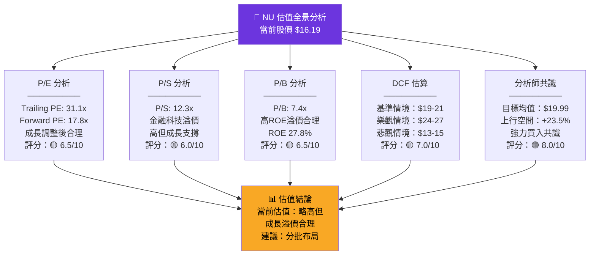

---

### 📊 多重估值法比較表格

| 估值方法 | 當前倍數 | 行業中位 | 相對評估 | 隱含目標價 | 評級 |
|----------|----------|----------|----------|------------|------|
| **P/E (Trailing)** | 31.1x | 15x（傳統銀行）| 溢價 107% | — | 🟡 |
| **P/E (Forward)** | 17.8x | 12x（金融科技均值）| 溢價 48% | $21.70 | 🟡 |
| **P/S 比率** | 12.3x | 3-5x（金融科技）| 高溢價 | — | 🔴 |
| **P/B 比率** | 7.4x | 1.5x（傳統銀行）| 成長溢價 | $17.50 | 🟡 |
| **EV/Revenue** | 8.3x | — | 成長合理 | — | 🟡 |
| **DCF（基準）** | — | — | 輕微低估 | $20.50 | 🟢 |
| **分析師目標** | — | — | 上行 +23.5% | $19.99 | 🟢 |
| **PEG Ratio** | ~0.5x | 1.0-1.5x | **顯著低估** | $24-27 | 🟢 |

> **🔑 關鍵洞察**：若考慮36%+的收入成長率，NU的PEG比率約0.5x，顯示在成長調整基礎上估值合理甚至偏低。

---

### 📏 估值區間視覺化

```
┌─────────────────────────────────────────────────────────────────┐
│                   NU 估值區間分布圖                              │
├─────────────────────────────────────────────────────────────────┤
│                                                                 │
│  股價範圍：$9 ─────────────── $30                               │
│                                                                 │
│  $9.01  $12      $16.19  $18    $20  $22    $27                │
│    │      │         │      │      │    │      │                  │
│    ▼      ▼         ▼      ▼      ▼    ▼      ▼                  │
│  [■■■■■■░░░░░░░░░▓▓▓▓▓▓▓▓▓▓▓▓▓▓▓▓░░░░░░░░░░░░]                │
│    ↑      ↑         ↑      ↑      ↑    ↑      ↑                  │
│  52W低  極度     當前   分析師  均值  高位   樂觀                │
│        低估區   股價   低目標  目標  目標   DCF                  │
│                                                                 │
│  ■ = 低估區間($9-12)  ░ = 合理區間($12-18)  ▓ = 目標區間($18-27)│
│                                                                 │
│  📍 當前$16.19 處於合理偏低區間，距均值目標+23.5%上行空間       │
└─────────────────────────────────────────────────────────────────┘
```

---

### 🔄 同業比較表格

| 公司 | 市值 | P/E(FWD) | P/S | 收入成長 | ROE | 評估 |
|------|------|----------|-----|----------|-----|------|
| **NU Holdings** | $78.5B | 17.8x | 12.3x | +36% | 27.8% | 🟢 成長溢價合理 |
| MercadoLibre | $98B | 28x | 5x | +34% | 22% | 🟡 可比但貴 |
| StoneCo | $5.2B | 8x | 2.5x | +15% | 8% | 🟡 便宜但成長低 |
| PagSeguro | $2.8B | 6x | 1.2x | +8% | 5% | 🟡 價值但衰退 |
| Itaú Unibanco | $55B | 8x | 2x | +5% | 18% | 🟡 傳統折價 |
| Visa | $620B | 28x | 15x | +10% | 48% | 🟡 優質但貴 |
| PayPal | $73B | 14x | 2.5x | +6% | 18% | 🟡 可比但成長低 |

> **結論**：NU在成長調整後估值（PEG）明顯優於可比公司，高P/S由高成長支撐。

---

## 7. 風險評估

### 🔥 風險熱圖

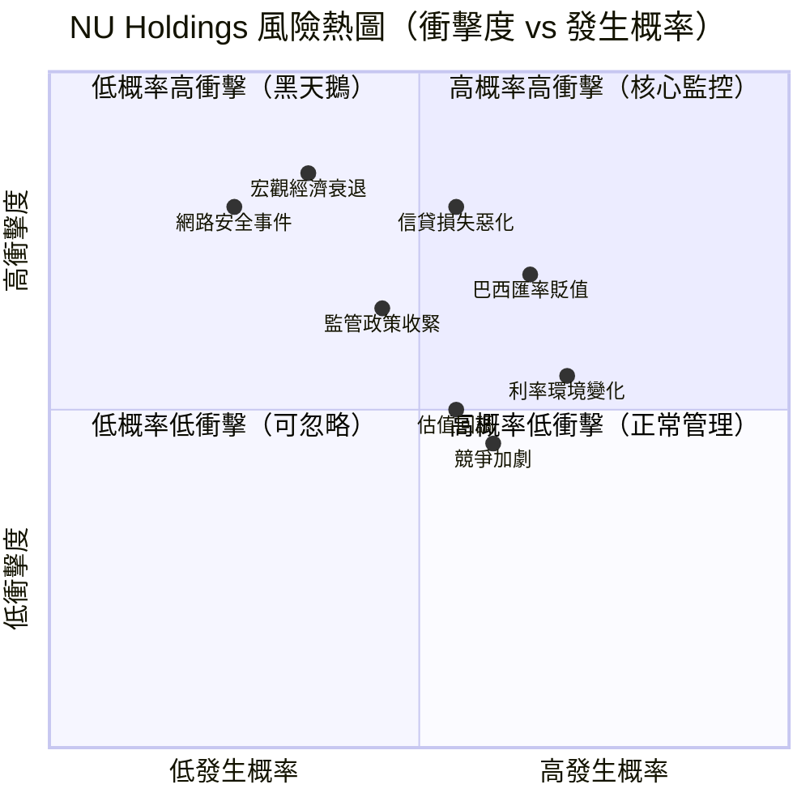

---

### 📋 風險項目完整評估表

| 風險類別 | 風險描述 | 嚴重度 | 發生率 | 風險評級 | 緩解措施 |
|----------|----------|--------|--------|----------|----------|
| 🔴 **信貸品質** | 巴西不良貸款率上升；過激放貸 | 高 | 中高 | 🔴 高風險 | AI風控模型；嚴格信用評估 |
| 🔴 **匯率風險** | BRL/USD持續貶值侵蝕美元收益 | 高 | 高 | 🔴 高風險 | 業務本地化；自然對沖 |
| 🔴 **宏觀衰退** | 巴西/拉美GDP下行影響消費金融 | 高 | 中 | 🔴 高風險 | 多元化產品；墨哥分散 |
| 🟡 **監管風險** | 巴西央行收緊數位銀行監管 | 中高 | 中 | 🟡 中風險 | 牌照合規；監管關係維護 |
| 🟡 **利率風險** | 巴西SELIC利率高企壓縮利差 | 中 | 高 | 🟡 中風險 | 浮動利率產品對沖 |
| 🟡 **競爭加劇** | 傳統銀行數位化反攻；新興FinTech | 中 | 中高 | 🟡 中風險 | 品牌+規模護城河 |
| 🟡 **估值回調** | 高成長股在利率上行環境估值壓縮 | 中 | 中高 | 🟡 中風險 | 分批買入；長持策略 |
| 🟢 **網路安全** | 數據洩露或系統攻擊 | 高 | 低 | 🟢 低風險 | 頂級資安投入 |
| 🟢 **市場集中** | 過度依賴巴西單一市場 | 中 | 中 | 🟢 降低中 | 墨西哥/哥倫比亞多元化 |
| 🟢 **流動性** | 存款擠兌或資金緊缺 | 高 | 極低 | 🟢 低風險 | $13.64B現金緩衝 |

---

### 🛡️ 風險緩解措施總結

```
┌─────────────────────────────────────────────────────────────────┐
│                    NU 風險緩解機制矩陣                           │
├────────────────────┬────────────────────────────────────────────┤
│ 風險類型           │ 緩解措施                                    │
├────────────────────┼────────────────────────────────────────────┤
│ 信用/信貸風險      │ ▓ ML驅動即時信用評分                       │
│                    │ ▓ 小額分散信貸策略                          │
│                    │ ▓ 預備損失準備金制度                        │
├────────────────────┼────────────────────────────────────────────┤
│ 匯率/宏觀風險      │ ▓ 收入以巴西雷亞爾計價（自然對沖）          │
│                    │ ▓ 地理多元化至墨/哥/美國                    │
│                    │ ▓ 美元計價資產儲備                          │
├────────────────────┼────────────────────────────────────────────┤
│ 監管/合規風險      │ ▓ 完整銀行牌照運營                          │
│                    │ ▓ 主動與監管機構溝通                        │
│                    │ ▓ 合規科技投入                              │
├────────────────────┼────────────────────────────────────────────┤
│ 競爭/市場風險      │ ▓ 1億+用戶網絡效應護城河                   │
│                    │ ▓ 持續創新降低轉換意願                      │
│                    │ ▓ 品牌忠誠度建設                            │
└────────────────────┴────────────────────────────────────────────┘
```

---

## 8. 催化劑與觸發因素

### 📅 催化劑時間軸

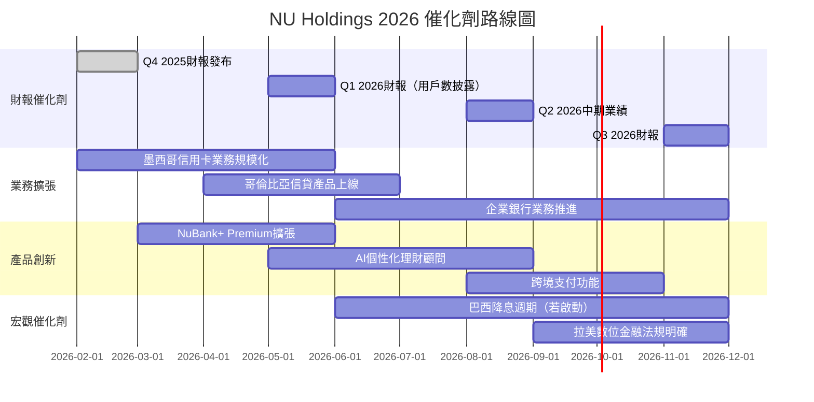

---

### ⚡ 觸發因素決策樹

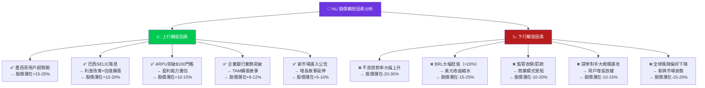

---

## 9. 投資建議

### 🏆 最終評級

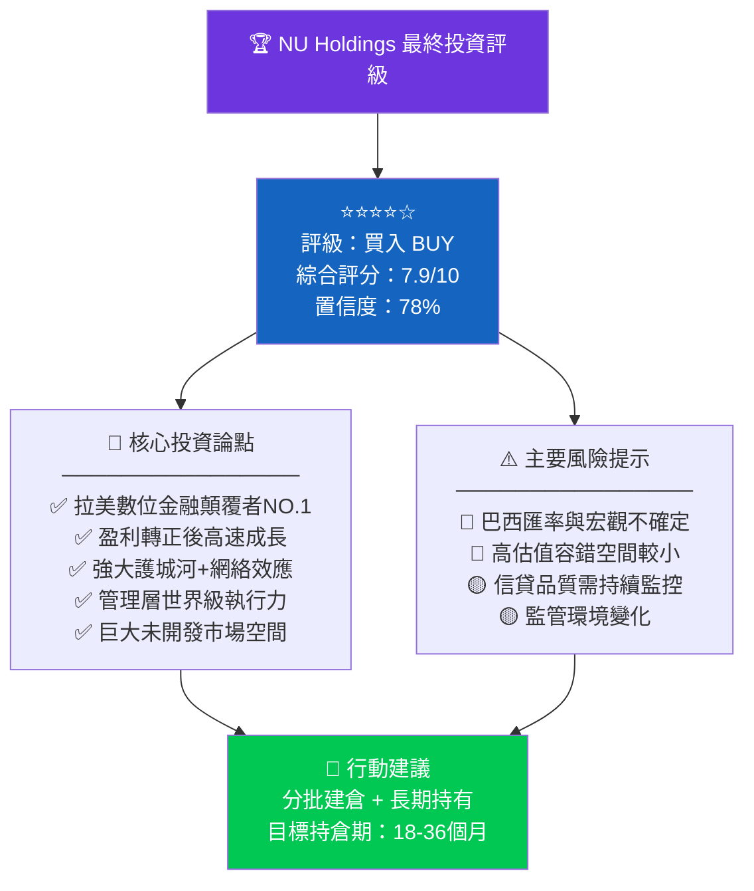

---

### ⭐ 綜合星級評定

```
╔══════════════════════════════════════════════════════════════════╗
║                                                                  ║
║    NU Holdings Ltd. (NU)  最終投資評級                           ║
║                                                                  ║
║    ⭐ ⭐ ⭐ ⭐ ☆                                                ║
║    4.0 / 5.0 顆星                                                ║
║                                                                  ║
║    綜合評分：7.9 / 10     🟢 買入推薦                            ║
║                                                                  ║
║    成長性     ★★★★★  9.0/10  頂尖                              ║
║    獲利能力   ★★★★½  8.5/10  優秀                              ║
║    競爭優勢   ★★★★☆  8.0/10  強勁                              ║
║    管理層     ★★★★½  8.5/10  卓越                              ║
║    財務健康   ★★★½☆  7.0/10  良好                              ║
║    估值合理   ★★★☆☆  6.5/10  偏高                              ║
║                                                                  ║
║    分析師共識：強力買入（18位分析師）                            ║
║    目標均價：$19.99 | 上行空間：+23.5%                           ║
╚══════════════════════════════════════════════════════════════════╝
```

---

### 🎯 目標價區間分析

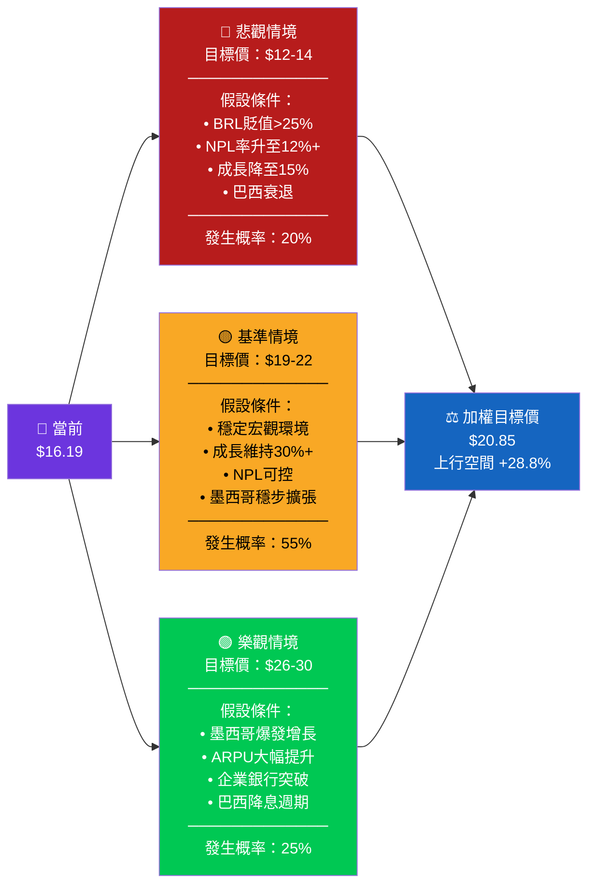

---

### 👥 投資人適配度評估

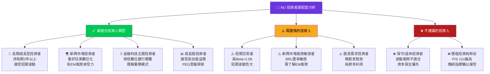

---

### 📅 建議持倉策略

```
╔══════════════════════════════════════════════════════════════════╗
║                   NU Holdings 投資策略建議                        ║
╠══════════════════════════════════════════════════════════════════╣
║                                                                  ║
║  ⏱️  建議持倉期間：18 - 36 個月                                   ║
║                                                                  ║
║  📥  建倉策略：分批定投（DCA）                                    ║
║  ──────────────────────────────────────────────────            ║
║  第1批（立即）：40% 倉位 @ $15-17 區間                           ║
║  第2批（回調）：35% 倉位 @ $13-15 區間（若出現）                 ║
║  第3批（突破）：25% 倉位 @ $19-20 區間（趨勢確認後）             ║
║                                                                  ║
║  🛑  止損參考：$11.00（跌破52W高點61%位）                         ║
║  🎯  獲利目標：第一目標 $20（+23.5%）                             ║
║              第二目標 $24（+48.2%）                              ║
║              長期目標 $28-30（+73-85%）                           ║
║                                                                  ║
║  📊  倉位建議：成長股組合中 5-8% 配置比例                         ║
║                                                                  ║
║  🔄  監控頻率：每季財報後重新評估                                 ║
║  📌  關鍵監控指標：                                               ║
║      ① 用戶增長率（季度）                                        ║
║      ② ARPU 趨勢（每用戶平均收入）                               ║
║      ③ NPL 率（不良貸款）                                        ║
║      ④ 墨西哥業務進展                                            ║
║      ⑤ BRL/USD 匯率走勢                                          ║
╚══════════════════════════════════════════════════════════════════╝
```

---

### 🔑 核心投資論點總結

```
┌─────────────────────────────────────────────────────────────────┐
│                   NU — 投資核心論點 (Bull Case)                  │
├─────────────────────────────────────────────────────────────────┤
│                                                                 │
│  1️⃣  拉美金融科技版圖NO.1，護城河深且寬                          │
│      1.14億用戶 × 極高用戶黏性 × 低轉換率 = 強大防禦            │
│                                                                 │
│  2️⃣  盈利能力超預期轉正，ROE快速攀升至27.8%                      │
│      從虧損到年盈利$1.97B僅用2年，執行力罕見                    │
│                                                                 │
│  3️⃣  墨西哥是第二個巴西的成長故事正在上演                        │
│      51%無銀行帳戶率 × 1.28億人口 = 巨大藍海                    │
│                                                                 │
│  4️⃣  Warren Buffett背書（波克夏持股）信心背書                   │
│      史上首次投資拉美金融科技公司                               │
│                                                                 │
│  5️⃣  前向PE 17.8x + 36%成長率 = PEG ~0.5x，成長調整後廉價      │
│      分析師18位強力買入共識，目標價均值$19.99                   │
│                                                                 │
├─────────────────────────────────────────────────────────────────┤
│                   核心風險提示 (Bear Case)                       │
├─────────────────────────────────────────────────────────────────┤
│                                                                 │
│  ⚠️  巴西雷亞爾貶值持續侵蝕美元計價股價表現                      │
│  ⚠️  信貸週期下行時NPL率可能大幅惡化                             │
│  ⚠️  P/S 12.3x估值在市場情緒轉變時有顯著下行空間                │
│                                                                 │
└─────────────────────────────────────────────────────────────────┘
```

---

> ## ⚖️ 免責聲明
>
> **本報告完全由 AI 自動生成，僅供學術研究與資訊參考目的，絕不構成任何形式的投資建議、招募說明或買賣要約。**
>
> 投資涉及風險，包括但不限於資本損失風險。過去表現不代表未來結果。新興市場投資面臨額外風險，包括政治風險、匯率風險、流動性風險及監管風險。
>
> **所有投資決策應基於個人財務狀況、風險承受能力及獨立的專業財務顧問意見。本報告作者及發布平台對任何基於本報告所做的投資決策不承擔任何法律責任。**
>
> *數據截至 2026-02-24，可能存在延遲或誤差。*