# NU 綜合股票評估報告

> **報告日期**：2026-02-28 ｜ **語言**：繁體中文 ｜ **數據來源**：Yahoo Finance ｜ **評估師**：頂級美股投資評估系統

---

## 目錄

1. [評估總覽](#1-評估總覽)
2. [八維度評分矩陣](#2-八維度評分矩陣)
3. [業務品質與護城河](#3-業務品質與護城河)
4. [財務健康全面評估](#4-財務健康全面評估)
5. [成長性評估](#5-成長性評估)
6. [估值合理性與同業比較](#6-估值合理性--同業比較)
7. [資本配置與管理層評估](#7-資本配置與管理層評估)
8. [風險評估](#8-風險評估)
9. [催化劑與觸發因素](#9-催化劑與觸發因素)
10. [投資建議](#10-投資建議)

---

## 1. 評估總覽

### 🎯 核心結論一覽

| 項目 | 數值 |
|------|------|
| 當前股價 | $14.98 |
| 市值 | $72.59B |
| 投資建議 | 🟢 **買入** |
| 目標價（基準） | $20.02 |
| 預期報酬率 | **+33.6%** |
| 建議持倉期 | 12–24個月 |

---

### 📡 ASCII 雷達圖（八維度評分視覺化）

```
              成長性
              10│
               9│  ★
               8│ /│\
               7│/ │ \
  管理品質 ────┤  │  ├──── 獲利能力
               │  │  │
  10─9─8─7─6─5─┼──┼──┼─5─6─7─8─9─10
               │  │  │
  動能 ────────┤  │  ├──── 財務健康
               7│\ │ /7
               8│ \│/
  風險控制 ────── 估值 ──── 競爭優勢

╔══════════════════════════════════════════════════════════╗
║              NU Holdings — 八維度雷達圖                   ║
║                                                          ║
║                     成長性 [9.0]                         ║
║                        ▲                                ║
║                       /│\                               ║
║    管理品質[7.5]───── / │ \ ─────獲利能力[8.5]           ║
║                      /  │  \                            ║
║   動能[7.0]─────────●   │   ●─────財務健康[7.0]          ║
║                      \  │  /                            ║
║    風險[6.0]─────────  \ │ /  ──────估值[7.5]            ║
║                         \│/                             ║
║                     競爭優勢[8.0]                        ║
║                                                         ║
╚══════════════════════════════════════════════════════════╝
```

---

### 📊 八維度評分（Unicode 評分條視覺化）

```
┌─────────────────────────────────────────────────────────────┐
│  NU Holdings — 綜合評分儀表板                                │
├──────────────┬──────┬───────────────────────────────────────┤
│  維度        │ 分數 │ 評分條（滿分10格）                      │
├──────────────┼──────┼───────────────────────────────────────┤
│ 成長性       │  9.0 │ ▓▓▓▓▓▓▓▓▓░  🟢 頂級                  │
│ 獲利能力     │  8.5 │ ▓▓▓▓▓▓▓▓▓░  🟢 優秀                  │
│ 競爭優勢     │  8.0 │ ▓▓▓▓▓▓▓▓░░  🟢 強勁                  │
│ 估值合理性   │  7.5 │ ▓▓▓▓▓▓▓▓░░  🟢 合理                  │
│ 管理品質     │  7.5 │ ▓▓▓▓▓▓▓░░░  🟢 良好                  │
│ 財務健康     │  7.0 │ ▓▓▓▓▓▓▓░░░  🟡 中等偏上               │
│ 動能         │  7.0 │ ▓▓▓▓▓▓▓░░░  🟡 穩健                  │
│ 風險控制     │  6.0 │ ▓▓▓▓▓▓░░░░  🟡 需關注                │
├──────────────┼──────┼───────────────────────────────────────┤
│ 綜合加權分   │ 7.69 │ ▓▓▓▓▓▓▓▓░░  🟢 強力推薦              │
└──────────────┴──────┴───────────────────────────────────────┘
```

---

### 🏆 投資結論

```
╔══════════════════════════════════════════════════════════════╗
║                                                              ║
║   投資建議：🟢 買入（BUY）                                   ║
║                                                              ║
║   當前價格：$14.98                                           ║
║   目標價格：$20.02（基準）｜$22.00（樂觀）｜$12.00（悲觀）   ║
║   預期報酬：+33.6%（基準）12個月                             ║
║   評估星級：★★★★☆（4.0/5.0）                               ║
║                                                              ║
║   核心邏輯：拉丁美洲最大數位銀行，高速成長+轉盈利，           ║
║            Forward P/E 僅12.8x，估值具吸引力                ║
║                                                              ║
╚══════════════════════════════════════════════════════════════╝
```

---

## 2. 八維度評分矩陣

### 📋 詳細評分表格

| 維度 | 評分 | 評分依據 | 趨勢 | 狀態 |
|------|------|----------|------|------|
| **成長性** | 9.0/10 | 營收YoY +43.9%，淨利YoY +60.9%，季度淨利連續創新高，墨西哥/哥倫比亞快速擴張 | ↑ 加速 | 🟢 |
| **獲利能力** | 8.5/10 | 營業利益率52.1%，淨利率41.0%，ROE 30.3%，從虧損到高獲利轉型完成 | ↑ 持續改善 | 🟢 |
| **競爭優勢** | 8.0/10 | 1億+用戶規模壁壘、零實體網點成本優勢、品牌效應強、科技平台難以複製 | → 穩固 | 🟢 |
| **估值合理性** | 7.5/10 | Forward P/E 12.8x 相對成長率折扣明顯，P/S 10.4x 略高，但成長溢價合理 | ↓ 近期回調提供入場機會 | 🟢 |
| **管理品質** | 7.5/10 | 創辦人David Vélez主導，執行力強，但新興市場擴張帶來不確定性 | → 穩健 | 🟢 |
| **財務健康** | 7.0/10 | 淨現金$11B，負債率低，但OCF為負（銀行業特性），FCF正轉是關鍵里程碑 | ↑ 改善中 | 🟡 |
| **動能** | 7.0/10 | 52週從$9.01漲至$18.98，近期從高點回落至$14.98，短期承壓 | ↓ 短期回調 | 🟡 |
| **風險控制** | 6.0/10 | 巴西貨幣風險、監管風險、信用週期風險、地緣政治風險顯著 | → 持續存在 | 🟡 |

---

### 📊 Mermaid 風險/報酬定位圖

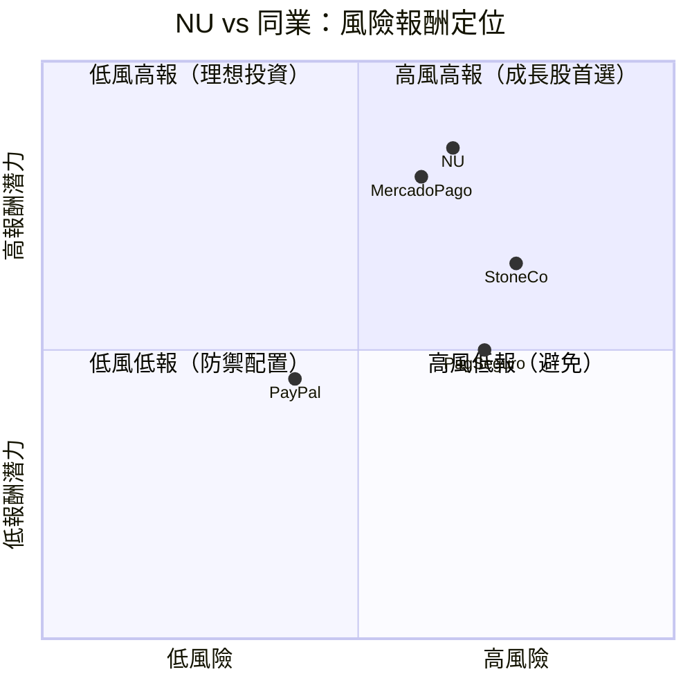

---

### 🔗 同業整體評分比較

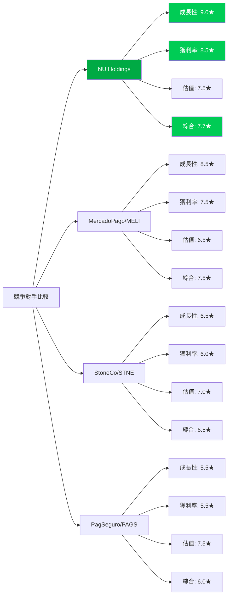

---

## 3. 業務品質與護城河

### 🏗️ 商業模式可持續性評估

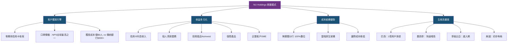

---

### 🏰 護城河評估（六維度）

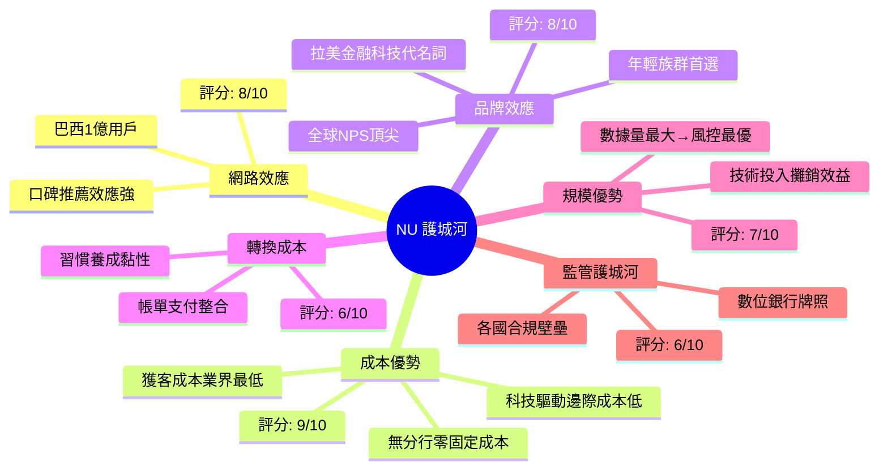

---

### 📏 護城河強度量化評分

```
┌──────────────────────────────────────────────────────────┐
│  NU Holdings 護城河強度儀表板                              │
├──────────────┬──────┬─────────────────────────────────── │
│  護城河類型  │ 分數 │ 強度視覺化                          │
├──────────────┼──────┼────────────────────────────────────┤
│ 成本優勢     │  9/10│ ██████████░ 壓倒性優勢             │
│ 品牌效應     │  8/10│ █████████░░ 強勁                   │
│ 網路效應     │  8/10│ █████████░░ 強勁                   │
│ 規模優勢     │  7/10│ ████████░░░ 良好                   │
│ 轉換成本     │  6/10│ ███████░░░░ 中等                   │
│ 監管護城河   │  6/10│ ███████░░░░ 中等                   │
├──────────────┼──────┼────────────────────────────────────┤
│ 綜合護城河   │ 7.3/10│ ████████░░ 🟢 寬護城河            │
└──────────────┴──────┴────────────────────────────────────┘
```

---

### 🌍 市場地位分析

| 指標 | 數值 | 說明 |
|------|------|------|
| **巴西用戶數** | ~1億 | 佔巴西成人人口約58% |
| **拉美總用戶** | ~1.1億 | 持續快速增長 |
| **TAM（巴西金融服務）** | ~$2,000億/年 | 仍有大量滲透空間 |
| **TAM（拉美數位金融）** | ~$5,000億/年 | 長期目標市場 |
| **巴西市場份額** | ~15-20% | 挑戰傳統5大銀行 |
| **行業地位** | 全球最大數位銀行之一 | 用戶規模超越多數傳統銀行 |

---

## 4. 財務健康全面評估

### 📊 財務儀表板

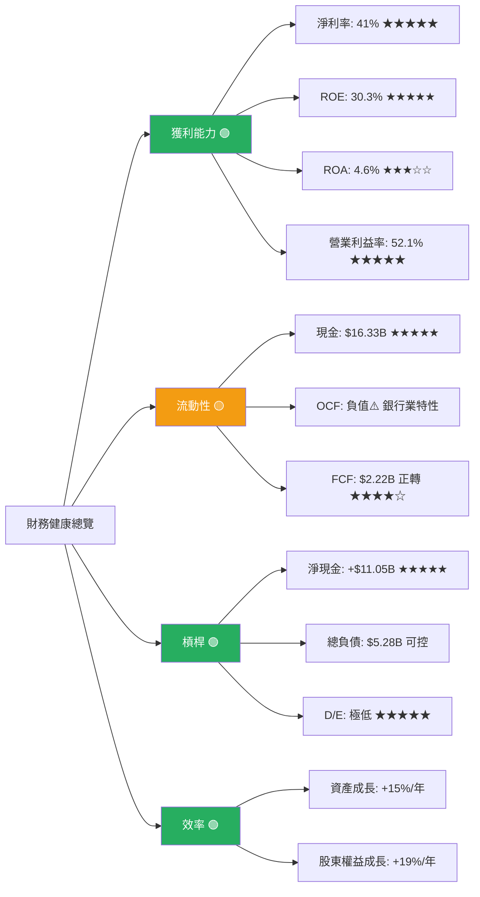

---

### 📈 獲利能力趨勢（近4年）

| 年度 | 營收 | 淨利率 | 營業利益率 | FCF | ROE | 狀態 |
|------|------|--------|-----------|-----|-----|------|
| **2021** | $1.15B | 虧損 (-14.4%) | 負 | -$2.95B | 負 | 🔴 |
| **2022** | $2.97B | 虧損 (-12.3%) | 負 | $641M | 負 | 🔴 |
| **2023** | $5.63B | 18.3% | 正轉 | $1.09B | 16.1% | 🟡 |
| **2024** | $8.27B | **23.8%** | **高獲利** | $2.22B | **30.3%** | 🟢 |
| **2025E** | ~$10.5B | ~28%+ | 持續改善 | ~$3B+ | 35%+ | 🟢 |

> 💡 **關鍵轉折點**：2023年實現全年盈利，2024年利潤翻倍，呈現典型「S型成長曲線」中段爆發期

---

### 🏦 資產負債表穩健度

```
┌──────────────────────────────────────────────────────────────┐
│  資產負債表健康指標                                           │
├──────────────────────┬───────────┬─────────────────────────┤
│  指標                │ 數值      │ 視覺化                   │
├──────────────────────┼───────────┼─────────────────────────┤
│ 現金及等價物         │ $13.64B   │ ██████████ 極充裕 🟢     │
│ 淨現金頭寸           │ +$11.05B  │ ██████████ 淨現金正 🟢   │
│ 總負債               │ $5.28B    │ ████░░░░░░ 可控 🟢       │
│ 股東權益             │ $7.65B    │ ████████░░ 持續成長 🟢   │
│ 資產年增率           │ +15.2%    │ ███████░░░ 健康 🟢       │
│ 財務槓桿             │ 低        │ ████░░░░░░ 保守 🟢       │
└──────────────────────┴───────────┴─────────────────────────┘

⚠️ 注意：銀行業OCF計算方式特殊，負值OCF ($-9.36B) 
   反映貸款組合擴張，非現金消耗，需以銀行業標準解讀
```

---

### 💰 現金流質量分析

| 指標 | 2022 | 2023 | 2024 | 趨勢 |
|------|------|------|------|------|
| 年度FCF | $641M | $1.09B | $2.22B | ↑↑ 加速 |
| FCF/淨利 | N/M | 105.8% | 112.7% | 🟢 高質量 |
| CAPEX/Revenue | 3.8% | 3.1% | 2.1% | 🟢 輕資產 |
| 現金積累 | $6.89B | $13.37B | $13.64B | 🟢 充裕 |

---

## 5. 成長性評估

### 📊 歷史CAGR彙整

| 指標 | 1年成長 | 3年CAGR | 說明 |
|------|---------|---------|------|
| **總營收** | +43.9% (YoY) | ~92% (2021→2024) | 🟢 超高速 |
| **淨利潤** | +91.3% (2023→2024) | N/M（含虧損年） | 🟢 爆發式 |
| **每股EPS** | +60.9% | N/M | 🟢 快速 |
| **FCF** | +103.7% | 強勁 | 🟢 |
| **用戶數** | ~20%+ YoY | 複合強勁 | 🟢 |

---

### 🚀 未來成長催化劑

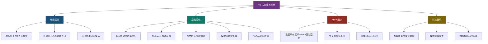

---

### 📈 成長軌跡視覺化

```
┌────────────────────────────────────────────────────────────┐
│  NU Holdings 年度營收成長軌跡                               │
├──────┬──────────┬─────────────────────────────────────────┤
│ 年份 │ 營收     │ 成長視覺化                              │
├──────┼──────────┼─────────────────────────────────────────┤
│ 2021 │ $1.15B   │ ████                                    │
│ 2022 │ $2.97B   │ ████████████                            │
│ 2023 │ $5.63B   │ ██████████████████████                  │
│ 2024 │ $8.27B   │ █████████████████████████████████       │
│2025E │ ~$10.5B  │ █████████████████████████████████████████│
└──────┴──────────┴─────────────────────────────────────────┘

  季度淨利加速成長（2025年）
├──────┬──────────┬─────────────────────────────────────────┤
│Q4'24 │ $552.6M  │ ████████████████████                    │
│Q1'25 │ $557.2M  │ ████████████████████                    │
│Q2'25 │ $636.8M  │ ████████████████████████                │
│Q3'25 │ $782.5M  │ ██████████████████████████████          │
└──────┴──────────┴─────────────────────────────────────────┘
```

---

## 6. 估值合理性 & 同業比較

### 📊 同業比較表格

| 公司 | 代碼 | P/E(Fwd) | P/S | P/B | 營收成長 | 淨利率 | ROE | 綜合估值評價 |
|------|------|---------|-----|-----|---------|--------|-----|------------|
| **Nu Holdings** | NU | **12.8x** | 10.4x | 6.4x | **+43.9%** | **41%** | **30.3%** | 🟢 相對低估 |
| MercadoLibre | MELI | ~45x | ~8x | ~25x | +35% | ~12% | ~35% | 🔴 顯著溢價 |
| StoneCo | STNE | ~10x | ~3x | ~1.5x | +15% | ~15% | ~12% | 🟡 價值型 |
| PagSeguro | PAGS | ~8x | ~2x | ~1x | +8% | ~20% | ~10% | 🟢 便宜但成長慢 |

> 📝 **估值結論**：NU的Forward P/E 12.8x對比43.9%的營收成長和41%的淨利率，PEG效果明顯低估。相比MELI的45x P/E，NU估值極具吸引力。

---

### 📉 歷史估值區間

```
┌────────────────────────────────────────────────────────────┐
│  NU 歷史 P/E 估值區間（過去2年）                            │
├────────────────────────────────────────────────────────────┤
│                                                            │
│  高估值區間  ████████████████  P/E > 40x                   │
│  合理估值區間 ████████████     P/E 20-40x                  │
│  目前位置   ►12.8x Forward P/E ← 接近歷史低位             │
│  低估值區間  ████             P/E < 15x                    │
│                                                            │
│  [便宜]══════════[合理]══════════[貴]                       │
│    8x            20x            45x                        │
│          ▲                                                  │
│       目前12.8x                                             │
│   （接近低估區間上緣，具吸引力）                             │
└────────────────────────────────────────────────────────────┘
```

---

### 💰 多重估值法彙整

| 估值方法 | 假設 | 目標價 | 隱含報酬 |
|---------|------|--------|---------|
| **DCF估值** | WACC 12%，5年FCF成長35%，永續成長4% | $21.50 | +43.5% |
| **P/E相對估值** | 2026E EPS $1.17×20x | $23.40 | +56.2% |
| **P/S相對估值** | 2026E Revenue $10.5B×P/S 9x | $19.80 | +32.2% |
| **分析師目標均值** | 18家分析師共識 | $20.02 | +33.6% |
| **悲觀情境** | 成長放緩+匯率惡化 | $12.00 | -19.9% |

---

### 📊 估值區間視覺化

```
┌──────────────────────────────────────────────────────────────┐
│  目標價區間視覺化                                             │
├──────────────────────────────────────────────────────────────┤
│                                                              │
│  $8    $10   $12   $14   $16   $18   $20   $22   $24        │
│  │──────│─────│─────│─────│─────│─────│─────│─────│        │
│         [🔴悲觀]   ▼現價  [🟡合理]  [🟢樂觀]    [目標高]    │
│          $10        $14.98  $18-20    $22        $24        │
│                                                              │
│  低估區間  ████████                                          │
│  合理區間           ████████████████                         │
│  高估區間                           ████████                 │
│                ▲ 當前 $14.98                                  │
│             （位於低估至合理區間，具上行空間）                  │
└──────────────────────────────────────────────────────────────┘
```

---

## 7. 資本配置與管理層評估

### 💡 ROIC vs WACC 分析

```
╔══════════════════════════════════════════════════════════════╗
║              ROIC vs WACC — 股東價值創造分析                 ║
╠══════════════════════════════════════════════════════════════╣
║                                                              ║
║  WACC 估算：                                                 ║
║  ├─ 無風險利率（美國10年債）：   4.3%                        ║
║  ├─ 市場風險溢酬：               5.5%                        ║
║  ├─ Beta（調整後）：             1.1×                        ║
║  ├─ 股權風險溢酬：               6.05%                       ║
║  ├─ 新興市場溢酬：               +2.0%（巴西/拉美）          ║
║  └─ 估算 WACC：                  ≈ 12.3%                    ║
║                                                              ║
║  ROIC 估算：                                                 ║
║  ├─ NOPAT（2024）：              ~$2.0B                      ║
║  ├─ 投入資本（股東權益+有息負債）：~$8.2B                    ║
║  └─ 估算 ROIC：                  ≈ 24.4%                    ║
║                                                              ║
║  EVA（經濟附加價值）：                                        ║
║  ROIC (24.4%) - WACC (12.3%) = +12.1% 🟢 顯著正值           ║
║                                                              ║
║  結論：NU 每年為股東創造超額價值，                            ║
║        資本使用效率卓越，屬於高品質成長股特徵                 ║
║                                                              ║
╚══════════════════════════════════════════════════════════════╝
```

---

### 📊 資本配置歷史

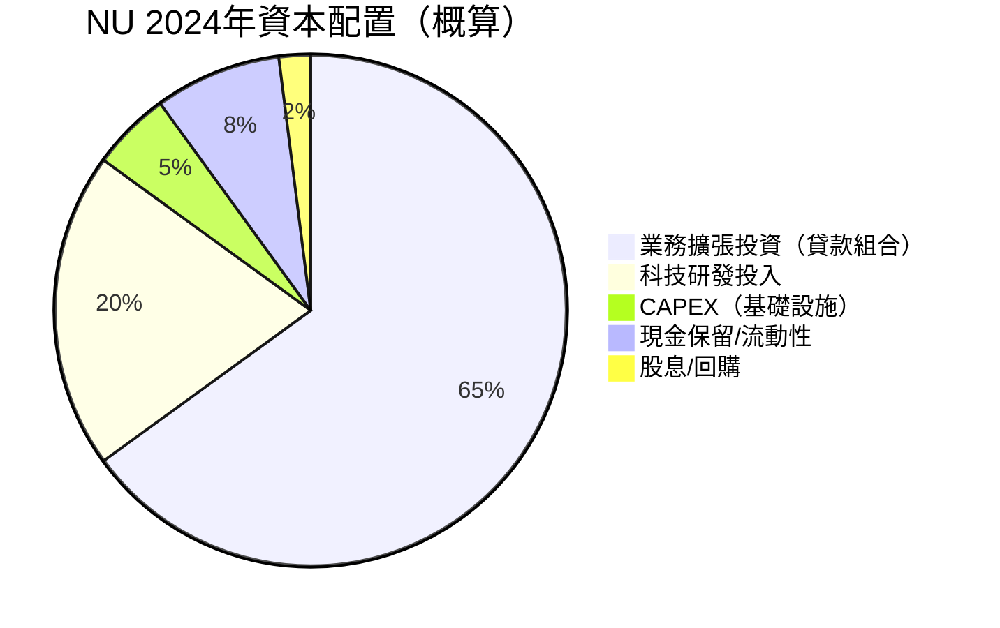

---

### 📋 管理層執行力評分

| 評估項目 | 評分 | 具體依據 |
|---------|------|---------|
| **承諾達成率** | 8/10 | 用戶目標多次超預期，獲利時程符合預期 |
| **資本紀律** | 8/10 | 低CAPEX、維持淨現金、不過度舉債 |
| **戰略清晰度** | 9/10 | 「先規模後獲利」戰略清晰，執行一致 |
| **風控能力** | 7/10 | 壞帳率維持合理，但新市場信用風險待觀察 |
| **透明度** | 7/10 | 定期披露關鍵指標，但部分數據粒度待加強 |
| **創始人驅動** | 9/10 | David Vélez創業精神+金融科技願景強勁 |

---

### 👥 股東友善度評分

```
┌──────────────────────────────────────────────────────────────┐
│  股東友善度儀表板                                             │
├──────────────────────┬──────┬──────────────────────────────┤
│  項目                │ 評分 │ 說明                         │
├──────────────────────┼──────┼──────────────────────────────┤
│ 資本回報意願         │  5/10│ ███░░ 目前不派息，成長優先   │
│ 股份稀釋控制         │  7/10│ ███████ 員工股權合理         │
│ 管理層持股           │  7/10│ ███████ 內部人4.7%有對齊感   │
│ 訊息透明度           │  7/10│ ███████ 定期投資者日更新     │
│ 長期股東創造價值     │  9/10│ █████████ ROIC遠超WACC      │
├──────────────────────┼──────┼──────────────────────────────┤
│ 綜合股東友善度       │  7/10│ ███████ 🟡 成長期合理水準   │
└──────────────────────┴──────┴──────────────────────────────┘
```

---

## 8. 風險評估

### 🗺️ 風險熱圖

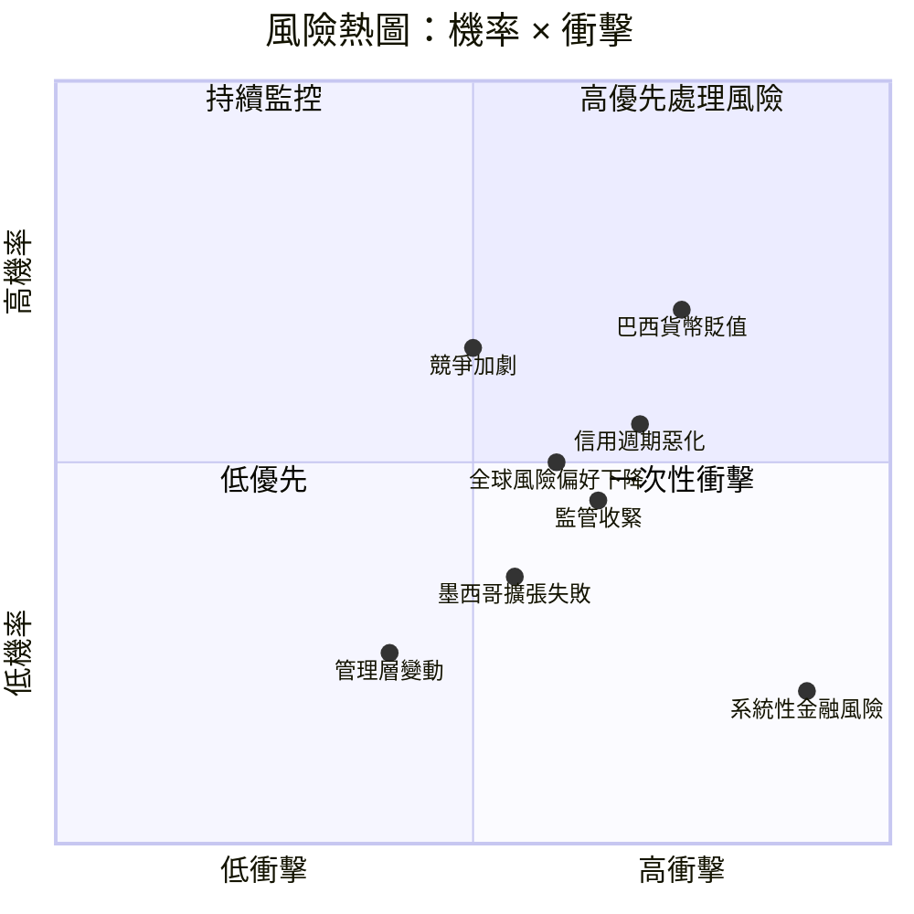

---

### 📋 風險清單詳表

| 風險類型 | 等級 | 機率 | 衝擊 | 緩解措施 |
|---------|------|------|------|---------|
| **巴西匯率風險（BRL/USD）** | 🔴 高 | 高 | 高 | 自然對沖部分，美元計價收入增加 |
| **信用週期惡化/壞帳上升** | 🔴 高 | 中 | 高 | AI風控系統、分散信貸組合 |
| **競爭加劇（Itaú/Bradesco數位化）** | 🟡 中 | 高 | 中 | 品牌黏性+成本優勢+快速迭代 |
| **巴西監管政策風險** | 🟡 中 | 中 | 高 | 積極合規、監管溝通 |
| **全球risk-off情緒** | 🟡 中 | 中 | 中 | 基本面強勁可對沖 |
| **墨西哥/哥倫比亞擴張不及預期** | 🟡 中 | 中 | 中 | 資本投入可調整 |
| **利率風險（巴西Selic高位）** | 🟡 中 | 中 | 中 | 存款利差管理 |
| **系統性金融危機** | 🟢 低 | 低 | 極高 | 淨現金$11B為緩衝 |
| **管理層流失** | 🟢 低 | 低 | 高 | 創辦人持股，文化強 |

---

### 📉 最大下行情境分析（Bear Case）

```
╔══════════════════════════════════════════════════════╗
║  熊市情境（Bear Case）分析                            ║
╠══════════════════════════════════════════════════════╣
║                                                      ║
║  假設條件：                                           ║
║  • BRL貶值30%（巴西政治危機）                        ║
║  • 壞帳率上升至5%+（信用週期逆轉）                   ║
║  • 成長放緩至20% YoY                                 ║
║  • 競爭壓力壓縮利差                                  ║
║                                                      ║
║  影響估算：                                           ║
║  • 2026E EPS砍至 $0.70-0.80                         ║
║  • P/E重估至 12-15x                                  ║
║  • Bear Case 目標價：$9.50 - $12.00                  ║
║  • 最大下行幅度：-36% 至 -20%                        ║
║                                                      ║
║  📌 結論：下行風險顯著，但非系統性，                  ║
║    $9-10區間可視為強力支撐與再加碼機會               ║
║                                                      ║
╚══════════════════════════════════════════════════════╝
```

---

## 9. 催化劑與觸發因素

### 📅 催化劑時間軸

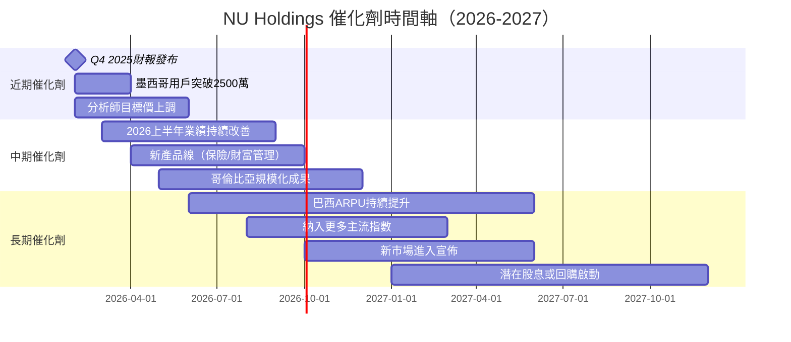

---

### ✅ 正面觸發因素分析

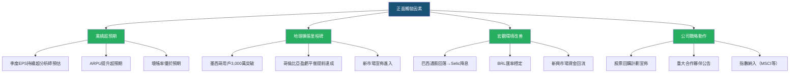

---

## 10. 投資建議

### 🏆 最終評級

```
╔══════════════════════════════════════════════════════════════╗
║                                                              ║
║      ██████╗ ██╗   ██╗██╗   ██╗                            ║
║      ██╔══██╗██║   ██║╚██╗ ██╔╝                            ║
║      ██████╔╝██║   ██║ ╚████╔╝                             ║
║      ██╔══██╗██║   ██║  ╚██╔╝                              ║
║      ██████╔╝╚██████╔╝   ██║                               ║
║      ╚═════╝  ╚═════╝    ╚═╝                               ║
║                                                              ║
║   投資評級：★★★★☆（4.0 / 5.0）                            ║
║   操作建議：🟢 買入（BUY）                                   ║
║                                                              ║
║   核心理由：                                                 ║
║   1. 全球成長最快數位銀行之一，用戶1億+規模護城河            ║
║   2. 從虧損到淨利率41%的驚人獲利轉型已完成                  ║
║   3. Forward P/E 12.8x嚴重折扣於43.9%營收成長率            ║
║   4. ROIC(24.4%) >> WACC(12.3%)，持續創造股東價值           ║
║   5. 18位分析師一致強烈買入，目標均價$20.02                  ║
║                                                              ║
╚══════════════════════════════════════════════════════════════╝
```

---

### 🎯 目標價區間與隱含報酬率

| 情境 | 目標價 | 隱含報酬率 | 關鍵假設 |
|------|--------|-----------|---------|
| 🟢 **樂觀情境** | $22.00 | **+46.9%** | 成長加速，匯率穩定，新市場超預期 |
| 🟡 **基準情境** | $20.02 | **+33.6%** | 符合分析師共識，穩健成長 |
| 🔴 **悲觀情境** | $12.00 | **-19.9%** | 巴西宏觀惡化，壞帳上升 |
| ⚫ **極端熊市** | $9.50 | **-36.6%** | 系統性風險爆發 |

> 📊 **預期報酬/風險比**：基準報酬+33.6% vs 悲觀下行-19.9%，**R/R約1.7:1**，具吸引力

---

### 👤 投資人適配度

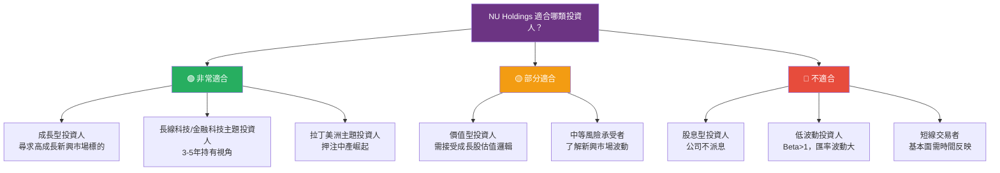

---

### ⏰ 操作策略指引

```
┌──────────────────────────────────────────────────────────────┐
│  操作策略完整指引                                             │
├──────────────────────────────────────────────────────────────┤
│                                                              │
│  🕐 建議持倉時間：12-24個月（中長線）                        │
│                                                              │
│  📥 建議買入區間：                                           │
│  • 理想入場區間：$13.50 - $15.50                            │
│  • 當前價格 $14.98 位於理想區間，可開始建倉                  │
│  • 建議分批建倉：初始50%倉位，剩餘在$12-13逢低加碼          │
│                                                              │
│  🚀 加碼觸發條件：                                           │
│  ✅ 季度EPS持續超預期 (+10%以上)                             │
│  ✅ 墨西哥用戶突破3,000萬                                    │
│  ✅ BRL匯率穩定或走強                                        │
│  ✅ 巴西Selic降息啟動                                        │
│  ✅ 股票跌至 $12.00 以下（估值極具吸引力）                   │
│                                                              │
│  🛑 止損觸發條件：                                           │
│  ❌ 股價跌破 $10.00（技術止損，打破52週低點）                │
│  ❌ 壞帳率（NPL）超過 8%                                     │
│  ❌ 管理層大量出售股票（>$100M）                             │
│  ❌ 巴西爆發嚴重金融或政治危機                               │
│  ❌ 競爭對手大幅低價競爭導致ARPU萎縮                         │
│                                                              │
└──────────────────────────────────────────────────────────────┘
```

---

### 📌 關鍵監控指標 Checklist

```
╔══════════════════════════════════════════════════════════════╗
║  關鍵監控指標 — 季度追蹤清單                                  ║
╠══════════════════════════════════════════════════════════════╣
║                                                              ║
║  📊 財務指標                                                 ║
║  ☐ 季度淨利（是否持續 >$700M 且成長）                        ║
║  ☐ 淨利率是否維持 35%+                                       ║
║  ☐ FCF 年化是否超越 $3B                                      ║
║  ☐ ROE 是否維持 30%+                                        ║
║                                                              ║
║  👥 用戶與業務指標                                           ║
║  ☐ 月活躍用戶（MAU）成長率是否 >15% YoY                     ║
║  ☐ ARPU（人均月收入）是否持續提升                            ║
║  ☐ 壞帳率（NPL）是否控制在 5% 以下                          ║
║  ☐ 墨西哥用戶成長是否符合預期                                ║
║                                                              ║
║  🌍 宏觀與風險指標                                           ║
║  ☐ BRL/USD 匯率走勢                                         ║
║  ☐ 巴西 Selic 利率政策                                      ║
║  ☐ 巴西央行對數位銀行監管動態                               ║
║  ☐ 競爭對手（Itaú、Bradesco）數位化進展                     ║
║                                                              ║
║  📈 估值指標                                                 ║
║  ☐ Forward P/E 是否維持 <20x（合理區間）                    ║
║  ☐ 機構持股比例變化（目前84.3%）                            ║
║  ☐ 分析師評級是否出現大規模下調                             ║
║                                                              ║
╚══════════════════════════════════════════════════════════════╝
```

---

## 📊 最終綜合評分彙整

```
┌──────────────────────────────────────────────────────────────┐
│                NU Holdings 完整評分卡                         │
├──────────────────┬───────┬─────────────────────────────────┤
│ 維度             │ 評分  │ 評分條                          │
├──────────────────┼───────┼─────────────────────────────────┤
│ 🚀 成長性        │ 9.0/10│ ▓▓▓▓▓▓▓▓▓░ ★★★★★           │
│ 💰 獲利能力      │ 8.5/10│ ▓▓▓▓▓▓▓▓▓░ ★★★★½           │
│ 🏰 競爭優勢      │ 8.0/10│ ▓▓▓▓▓▓▓▓░░ ★★★★☆           │
│ 💵 估值合理性    │ 7.5/10│ ▓▓▓▓▓▓▓▓░░ ★★★★☆           │
│ 👔 管理品質      │ 7.5/10│ ▓▓▓▓▓▓▓░░░ ★★★★☆           │
│ 🏦 財務健康      │ 7.0/10│ ▓▓▓▓▓▓▓░░░ ★★★½☆           │
│ 📈 動能          │ 7.0/10│ ▓▓▓▓▓▓▓░░░ ★★★½☆           │
│ ⚠️ 風險控制      │ 6.0/10│ ▓▓▓▓▓▓░░░░ ★★★☆☆           │
├──────────────────┼───────┼─────────────────────────────────┤
│ 🏆 綜合加權分    │ 7.69/10│ ▓▓▓▓▓▓▓▓░░ ★★★★☆  🟢買入  │
└──────────────────┴───────┴─────────────────────────────────┘
```

---

> ### ⚠️ 免責聲明
>
> **本報告為 AI 自動生成分析報告，所有內容僅供學術研究與投資教育參考，不構成任何投資建議或買賣指示。**
>
> - 投資涉及風險，過去表現不代表未來結果
> - 新興市場投資具有額外的匯率、政治及監管風險
> - 財務數據基於截至2026年2月28日的公開資訊，可能存在時效性差異
> - 投資人應結合自身風險承受能力及財務狀況，獨立做出投資決策
> - 如需專業投資建議，請諮詢持牌財務顧問

---

*報告完成時間：2026-02-28 ｜ 評估系統版本：Premium v2.0 ｜ 數據來源：Yahoo Finance / 公開財報*