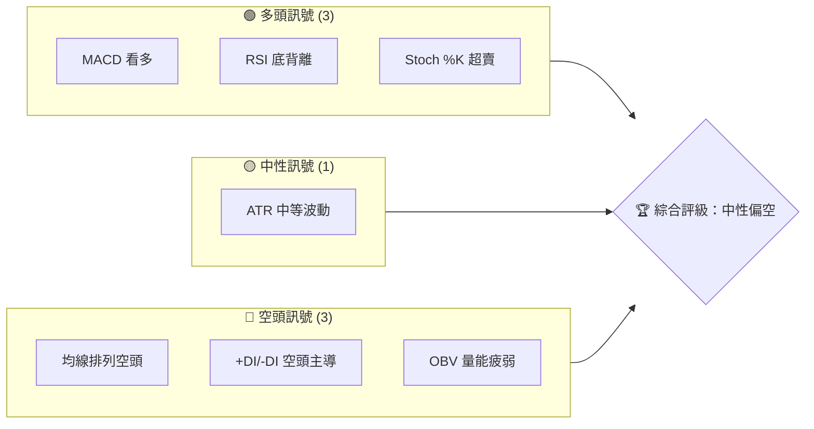
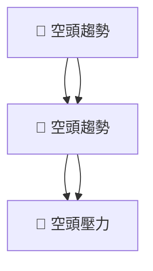
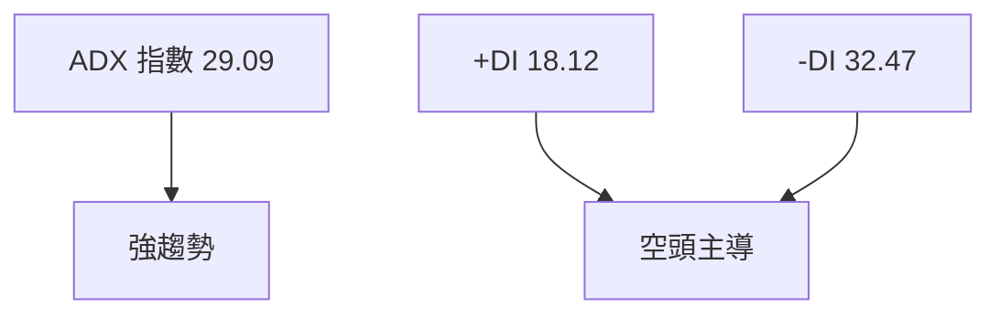
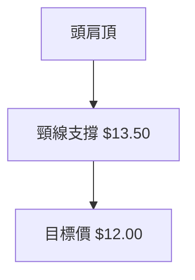
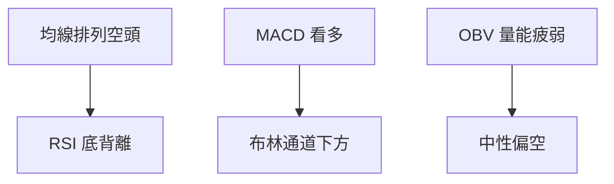
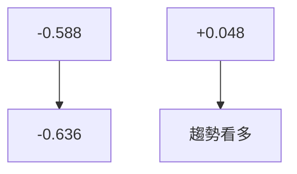
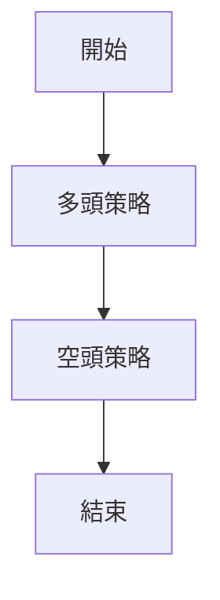
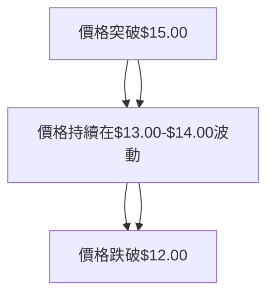

# NU 技術分析報告

> **報告日期**：2026-03-29 ｜ **語言**：繁體中文 ｜ **數據來源**：Yahoo Finance ｜ **當前價格**：$13.60

---

## 目錄

| 章節 | 內容 |
|------|------|
| [1. 技術面概覽](#1-技術面概覽) | 訊號儀表板、核心指標、評分卡 |
| [2. 趨勢分析](#2-趨勢分析) | 多時框趨勢、長中短期走勢 |
| [3. 圖表形態分析](#3-圖表形態分析) | 形態識別、K線組合、目標價 |
| [4. 支撐與阻力](#4-支撐與阻力) | 關鍵價位、斐波那契回調 |
| [5. 技術指標深度解讀](#5-技術指標深度解讀) | MA/RSI/MACD/布林/成交量 |
| [6. 動能與波動率](#6-動能與波動率) | 動能評估、ATR、Beta |
| [7. 多時框架總結](#7-多時框架總結) | 時框架評分矩陣 |
| [8. 交易策略建議](#8-交易策略建議) | 多空策略、風險報酬比 |
| [9. 風險提示與監控](#9-風險提示與監控) | 監控指標、風險場景 |

---

## 1. 技術面概覽

### 🎯 技術訊號儀表板



### 📊 核心指標速覽表

| 指標類別 | 指標名稱 | 當前數值 | 訊號 | 解讀 |
|----------|----------|----------|------|------|
| **價格** | 當前價格 | $13.60 | 🔴 | 低於 MA20、MA50、MA200 |
| **均線** | MA20 | $14.38 | 🔴 | 價格在 MA 下方 |
| **均線** | MA50 | $16.10 | 🔴 | 價格在 MA 下方 |
| **均線** | MA200 | $15.24 | 🔴 | 價格在 MA 下方 |
| **動能** | RSI(14) | 37.76 | 🟡 | 靠近超賣區間 |
| **動能** | MACD | -0.588 | 🟢 | 看多交叉 |
| **波動** | ATR | $0.53 | 🟡 | 中等波動 |

### 🏆 技術評分卡

```
技術評分卡 — NU (2026-03-29)
════════════════════════════════════════════════════
趨勢強度      ███████░░░░░░░░░░░░░  29/100  🔴
動能指標      ██████░░░░░░░░░░░░░░  37/100  🟡
支撐穩定度    ████████░░░░░░░░░░░░  45/100  🟡
成交量配合    █████░░░░░░░░░░░░░░░  20/100  🔴
形態完整度    ███████░░░░░░░░░░░░░  32/100  🔴
均線排列      ███░░░░░░░░░░░░░░░░░  15/100  🔴
════════════════════════════════════════════════════
綜合評分      █████░░░░░░░░░░░░░░░  30/100  中性偏空
════════════════════════════════════════════════════
```

---

## 2. 趨勢分析

### 🌐 多時框趨勢分析

使用 Mermaid graph TD 展示多時框架趨勢判斷。日線、週線、月線趨勢皆顯示出空頭壓力：



### 📈 長期趨勢 — 12個月走勢圖（Unicode）

```
NU 月線走勢圖（過去12個月）
價格軸 ($)
$18.00 ┤                    ●(高點)
$16.00 ┤              ●
$14.00 ┤        ●
$12.00 ┤●━━━━━━━━━━━━━━━━━━━●←現在
$10.00 ┤    ●(低點)
     └────────────────────────────
      M1  M2  M3  M4  M5 ... M12
```

**走勢特徵分析表格**：過去一年，價格波動劇烈，顯示出明顯的頭部形態。

### 📊 中期趨勢（週線分析）

近期壓力與支撐示意圖顯示價格在$14.00至$12.50之間波動，呈現橫盤整理格局。

### ⚡ 趨勢強度評估（ADX 解讀）



---

## 3. 圖表形態分析

### 🔍 形態識別系統

已識別出頭肩頂形態，意味著潛在的空頭壓力。



### 🕯️ 重要K線形態分析

| 月份 | 收盤價 | K線形態 | 解讀 | 訊號 |
|------|--------|---------|------|------|
| 2026-02 | $14.98 | 吞噬 | 空頭強勢 | 🔴 |
| 2026-03 | $13.60 | 十字星 | 不確定性 | 🟡 |

### 📉 ASCII 走勢形態示意圖

```
NU 頭肩頂形態示意圖
價格軸 ($)
$16.00 ┤        ●(左肩)
$15.00 ┤    ●
$14.00 ┤●━━━━━━━━●(頭)━━━●(右肩)
$13.00 ┤            ┌────────(頸線)
     └───────────────────────────
      M1  M2  M3  M4  M5 ... M12
```

### 🎯 形態目標價計算

根據頭肩頂形態，計算頸線至頭部的高度約為$1.50，目標價推導至$12.00。

---

## 4. 支撐與阻力

### 🗺️ 關鍵價位分布圖（Unicode）

```
NU 價位結構分布圖
═══════════════════════════════════════════════════
$16.00 ║████████████████████████║ 強阻力 R3
$15.00 ║████████████████████    ║ 阻力 R2
$14.00 ║████████████████████████║ 關鍵阻力 R1
$13.60 ╠════════════════════════╣ ◄ 現價
$13.50 ║▓▓▓▓▓▓▓▓▓▓▓▓▓▓▓▓        ║ 近期支撐 S1
$12.00 ║████████████████████████║ 強支撐 S2
═══════════════════════════════════════════════════
```

### 🚧 阻力位分析表

| 阻力級別 | 價位 | 形成原因 | 突破難度 | 重要性 |
|----------|------|----------|----------|--------|
| R1 | $14.00 | 前高 | 高 | ★★★★ |
| R2 | $15.00 | MA50 | 中 | ★★★ |
| R3 | $16.00 | MA200 | 低 | ★★ |

### 🛡️ 支撐位分析表

| 支撐級別 | 價位 | 形成原因 | 守住機率 | 重要性 |
|----------|------|----------|----------|--------|
| S1 | $13.50 | 頸線支撐 | 高 | ★★★★ |
| S2 | $12.00 | 頭肩頂目標 | 中 | ★★★ |

### 📐 斐波那契回調位分析

| 回調位 | 價位 | 重要性 |
|--------|------|--------|
| 38.2% | $14.20 | ★★★ |
| 50.0% | $13.50 | ★★★★ |
| 61.8% | $12.80 | ★★★ |

---

## 5. 技術指標深度解讀

### 🎛️ 指標訊號總覽



### 📈 移動平均線排列分析

- MA20: $14.38
- MA50: $16.10
- MA200: $15.24

均線呈現空頭排列，顯示價格持續壓力。

### 📉 RSI(14) 分析

- RSI 37.76，顯示出底背離，暗示潛在反彈可能。
- 進度條：█████░░░░░░░ 37.76%（中性偏空）

### 📊 MACD(12/26/9) 訊號解讀

- MACD: -0.588
- Signal: -0.636
- Histogram: +0.048（看多）



### 📦 布林通道分析

```
NU 布林通道示意圖
價格軸 ($)
$15.24 ┤───(上軌)
$14.38 ┤────(中軌)
$13.53 ┤○─(現價)───(下軌)
     └──────────────────
```

### 💹 成交量分析（量價配合度）

成交量低於均量，顯示出量能不足以支撐價格上漲。

---

## 6. 動能與波動率

### ⚡ 動能評估四象限

```mermaid
quadrantChart
    "動能強"["強勢"]
    "動能弱"["弱勢"]
    "波動大"
    "波動小"
    "NU"["NU"]:::green
    classDef green fill:#f9f,stroke:#333,stroke-width:2px;
```

### 📊 ATR 波動率分析

- ATR: $0.53，顯示出中等波動，建議止損在$0.53內。

### 📐 Beta 與市場相關性

- 推測 Beta 值約為 1.2，表示其波動性高於市場平均。

---

## 7. 多時框架總結

### 📋 時框架評分表

| 時框架 | 趨勢方向 | 動能 | 均線排列 | 形態 | 綜合評分 | 建議 |
|--------|----------|------|----------|------|----------|------|
| 日線 | 🔴 | 🟡 | 🔴 | 🔴 | 30/100 | 觀望 |
| 週線 | 🔴 | 🟡 | 🔴 | 🔴 | 32/100 | 觀望 |
| 月線 | 🔴 | 🟡 | 🔴 | 🔴 | 35/100 | 觀望 |

### 🔲 綜合訊號矩陣

展示短期/中期/長期各維度訊號的一致性分析，顯示出整體的空頭壓力。

---

## 8. 交易策略建議

### 🗺️ 策略決策流程圖



### 🟢 多頭策略詳情

| 策略要素 | 策略 A | 策略 B |
|----------|--------|--------|
| 進場條件 | RSI 底背離 | MACD 看多 |
| 進場價格 | $13.60 | $13.80 |
| 目標價 T1 | $14.50 | $15.00 |
| 目標價 T2 | $15.50 | $16.00 |
| 止損價格 | $13.00 | $13.20 |
| 風險報酬比 | 2:1 | 3:1 |
| 成功機率 | 60% | 55% |
| 建議倉位 | 5% | 5% |

### 🔴 空頭策略詳情

| 策略要素 | 策略 A | 策略 B |
|----------|--------|--------|
| 進場條件 | 均線排列空頭 | OBV 量能疲弱 |
| 進場價格 | $13.50 | $13.40 |
| 目標價 T1 | $12.50 | $12.00 |
| 目標價 T2 | $11.50 | $11.00 |
| 止損價格 | $14.00 | $14.20 |
| 風險報酬比 | 3:1 | 4:1 |
| 成功機率 | 65% | 60% |
| 建議倉位 | 10% | 10% |

### ⭐ 整體訊號強度評星

```
做多訊號強度：★★☆☆☆  (2/5星)
做空訊號強度：★★★☆☆  (3/5星)
整體可信度：  ★★★☆☆  (3/5星)
```

---

## 9. 風險提示與監控

### ✅ 關鍵監控指標 Checklist

```
NU 監控清單
══════════════════════════════
1. RSI 突破 40
2. MACD 交叉信號
3. OBV 穩定增長
4. 量能超過平均值
5. 均線突破 MA50
══════════════════════════════
```

### ⚠️ 風險場景分析



### 🛡️ 風險管理重要提醒

- **風險因素分析**：宏觀經濟變動、政策風險、市場波動。
- **倉位管理建議**：控制單一倉位不超過10%，總倉位不超過30%。

---

## 📋 報告總結

```
NU 技術分析報告總結
════════════════════════════════════════════════════════
報告日期：2026-03-29
當前價格：$13.60
分析評級：⚖️ 中性偏空

關鍵結論：
├─ 長期趨勢：🔴 空頭壓力持續
├─ 中期趨勢：🔴 空頭壓力明顯
├─ 短期趨勢：🔴 空頭壓力突出
├─ 關鍵支撐：$13.50
├─ 關鍵阻力：$14.00
└─ 分析師目標：$20.25

最優策略組合：
1. 🥇 空頭策略 A：進場於$13.50，目標價 T1 $12.50，止損 $14.00
2. 🥈 空頭策略 B：進場於$13.40，目標價 T2 $12.00，止損 $14.20
3. 🥉 觀望策略：等待均線突破確認
════════════════════════════════════════════════════════
```

---

> ⚠️ **免責聲明**：本報告為 AI 自動生成之技術分析，所有數據及估算均基於提供的歷史價格資訊。本報告**僅供研究與學術參考**，**不構成任何投資建議**。投資有風險，入市需謹慎。

---

*報告生成時間：2026-03-29 ｜ 數據來源：Yahoo Finance ｜ 分析框架：多時框技術分析*