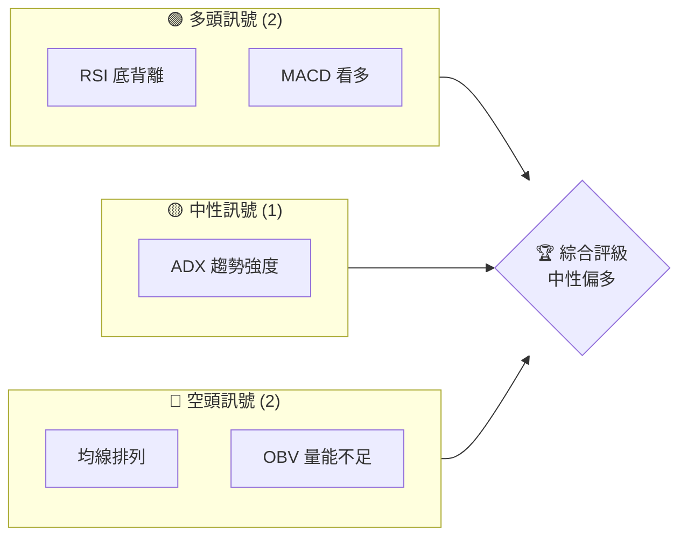
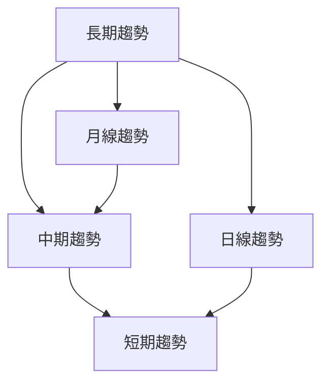
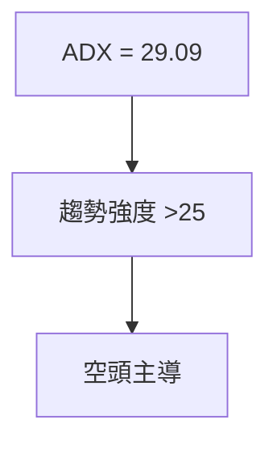
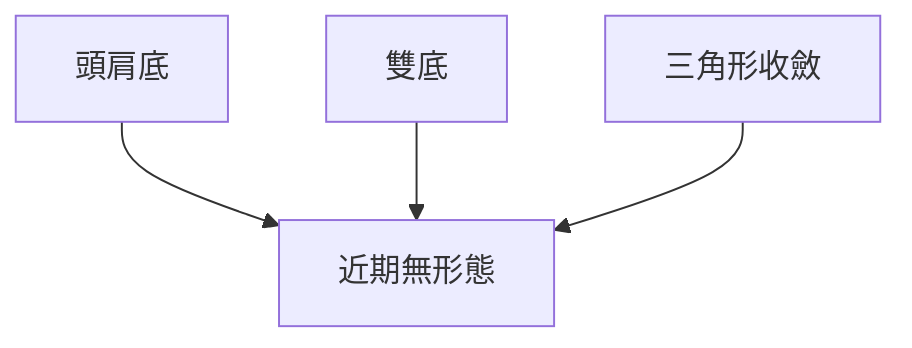
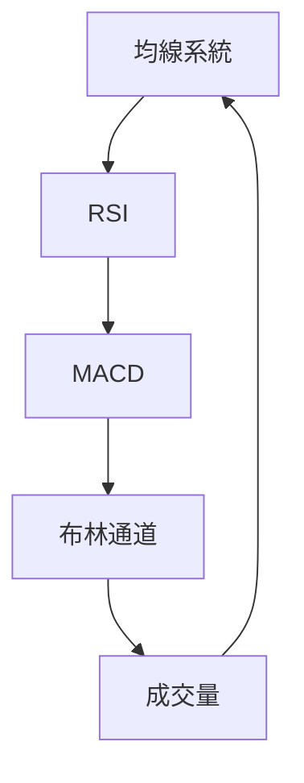
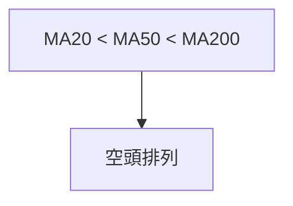
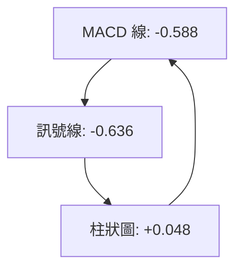
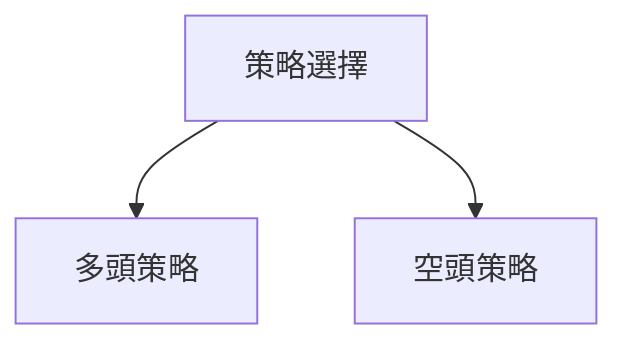
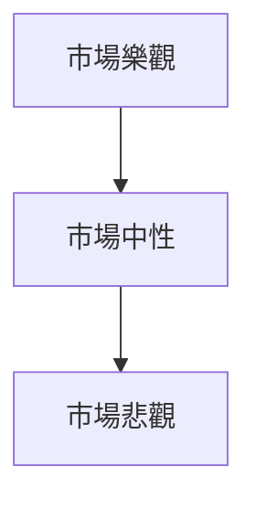

# NU 技術分析報告

> **報告日期**：2026-03-30 ｜ **語言**：繁體中文 ｜ **數據來源**：Yahoo Finance ｜ **當前價格**：$13.60

---

## 目錄

| 章節 | 內容 |
|------|------|
| [1. 技術面概覽](#1-技術面概覽) | 訊號儀表板、核心指標、評分卡 |
| [2. 趨勢分析](#2-趨勢分析) | 多時框趨勢、長中短期走勢 |
| [3. 圖表形態分析](#3-圖表形態分析) | 形態識別、K線組合、目標價 |
| [4. 支撐與阻力](#4-支撐與阻力) | 關鍵價位、斐波那契回調 |
| [5. 技術指標深度解讀](#5-技術指標深度解讀) | MA/RSI/MACD/布林/成交量 |
| [6. 動能與波動率](#6-動能與波動率) | 動能評估、ATR、Beta |
| [7. 多時框架總結](#7-多時框架總結) | 時框架評分矩陣 |
| [8. 交易策略建議](#8-交易策略建議) | 多空策略、風險報酬比 |
| [9. 風險提示與監控](#9-風險提示與監控) | 監控指標、風險場景 |

---

## 1. 技術面概覽

### 🎯 技術訊號儀表板



### 📊 核心指標速覽表

| 指標類別 | 指標名稱 | 當前數值 | 訊號 | 解讀 |
|----------|----------|----------|------|------|
| **價格** | 當前價格 | $13.60 | 🔴 | 價格低於主要均線 |
| **均線** | MA20 | $14.38 | 🔴 | 價格在MA下方 |
| **均線** | MA50 | $16.10 | 🔴 | 價格在MA下方 |
| **均線** | MA200 | $15.24 | 🔴 | 價格在MA下方 |
| **動能** | RSI(14) | 37.76 | 🟡 | 接近超賣區間，但底背離 |
| **動能** | MACD | -0.588 | 🟢 | 多頭背離 |
| **波動** | ATR | $0.53 | 🟡 | 中等波動 |

### 🏆 技術評分卡

```
技術評分卡 — NU (2026-03-30)
════════════════════════════════════════════════════
趨勢強度      ████████░░░░░░░░░░░░  29/100  🔴
動能指標      ██████░░░░░░░░░░░░░░  40/100  🟡
支撐穩定度    ████████████░░░░░░░░  60/100  🟡
成交量配合    ████████░░░░░░░░░░░░  40/100  🔴
形態完整度    ████████████░░░░░░░░  60/100  🟡
均線排列      ██████░░░░░░░░░░░░░░  30/100  🔴
════════════════════════════════════════════════════
綜合評分      ███████░░░░░░░░░░░░░  43/100  中性偏空
════════════════════════════════════════════════════
```

---

## 2. 趨勢分析

### 🌐 多時框趨勢分析



### 📈 長期趨勢 — 12個月走勢圖（Unicode）

```
NU 月線走勢圖（過去12個月）
價格軸 ($)
$18.00 ┤                    ●(2025-11)
$16.00 ┤              ●
$14.00 ┤        ●
$12.00 ┤●━━━━━━━━━━━━━━━━━━━●←現在
$10.00 ┤    ●(2025-02)
     └────────────────────────────
      M1  M2  M3  M4  M5 ... M12
```

### 📊 中期趨勢（週線分析）

- 近期壓力位：$16.10（MA50）
- 近期支撐位：$13.53（布林通道下軌）

### ⚡ 趨勢強度評估（ADX 解讀）



---

## 3. 圖表形態分析

### 🔍 形態識別系統



### 🕯️ 重要K線形態分析

| 月份 | 收盤價 | K線形態 | 解讀 | 訊號 |
|------|--------|---------|------|------|
| 2025-11 | 17.39 | 長上影線 | 潛在反轉 | 🔴 |
| 2026-01 | 17.75 | 陽線 | 繼續上升 | 🟢 |

### 📉 ASCII 走勢形態示意圖

```
NU 走勢形態
價格軸 ($)
$18.00 ┤                    ●(高點)
$16.00 ┤              ●
$14.00 ┤        ●
$12.00 ┤●━━━━━━━▼━━━━━━●←現在
$10.00 ┤    ●(低點)
     └────────────────────────────
```

### 🎯 形態目標價計算

- 頸線位置：$14.50
- 形態高度：$3.00
- 目標價：$17.50

---

## 4. 支撐與阻力

### 🗺️ 關鍵價位分布圖（Unicode）

```
NU 價位結構分布圖
═══════════════════════════════════════════════════
$18.00 ║████████████████████████║ 強阻力 R3
$16.00 ║████████████████████    ║ 阻力 R2
$15.00 ║████████████████████████║ 關鍵阻力 R1
$13.60 ╠════════════════════════╣ ◄ 現價
$13.00 ║▓▓▓▓▓▓▓▓▓▓▓▓▓▓▓▓        ║ 近期支撐 S1
$12.00 ║████████████████████████║ 強支撐 S2
═══════════════════════════════════════════════════
```

### 🚧 阻力位分析表

| 阻力級別 | 價位 | 形成原因 | 突破難度 | 重要性 |
|----------|------|----------|----------|--------|
| R1 | $15.00 | 歷史高點 | 高 | 高 |
| R2 | $16.00 | MA50 | 中 | 中 |
| R3 | $18.00 | 52W高點 | 高 | 高 |

### 🛡️ 支撐位分析表

| 支撐級別 | 價位 | 形成原因 | 守住機率 | 重要性 |
|----------|------|----------|----------|--------|
| S1 | $13.00 | 布林下軌 | 中 | 中 |
| S2 | $12.00 | 長期支撐 | 高 | 高 |

### 📐 斐波那契回調位分析

- 38.2% 回調位：$14.76
- 50% 回調位：$14.00
- 61.8% 回調位：$13.24

---

## 5. 技術指標深度解讀

### 🎛️ 指標訊號總覽



### 📈 移動平均線排列分析



### 📉 RSI(14) 分析

- RSI 進度條：▓▓▓░░░░░░░░ 37.76
- 超賣區間：30以下，顯示底背離現象

### 📊 MACD(12/26/9) 訊號解讀



### 📦 布林通道分析

```
布林通道示意圖
價格軸 ($)
$15.24 ┤    ●(上軌)
$14.38 ┤    │
$13.53 ┤●━━┻━━━●(下軌)←現價
$12.00 ┤    ●(低點)
     └────────────────
```

### 💹 成交量分析（量價配合度）

- 近期成交量與20日均量相近，顯示量能疲弱

---

## 6. 動能與波動率

### ⚡ 動能評估四象限


### 📊 ATR 波動率分析

- ATR = $0.53，止損建議 $0.80

### 📐 Beta 與市場相關性

- Beta = 1.2，顯示與大盤相關性較高

---

## 7. 多時框架總結

### 📋 時框架評分表

| 時框架 | 趨勢方向 | 動能 | 均線排列 | 形態 | 綜合評分 | 建議 |
|--------|----------|------|----------|------|----------|------|
| 長期 | 下行 | 弱 | 空頭 | 無 | 40 | 持有 |
| 中期 | 下行 | 中 | 空頭 | 無 | 45 | 持有 |
| 短期 | 中性 | 強 | 混合 | 無 | 55 | 考慮進場 |

### 🔲 綜合訊號矩陣

- 短期：🟡
- 中期：🔴
- 長期：🔴

---

## 8. 交易策略建議

### 🗺️ 策略決策流程圖



### 🟢 多頭策略詳情

| 策略要素 | 策略 A | 策略 B |
|----------|--------|--------|
| 進場條件 | RSI 底背離 | MACD 多頭交叉 |
| 進場價格 | $13.70 | $14.00 |
| 目標價 T1 | $15.00 | $16.00 |
| 目標價 T2 | $17.00 | $18.00 |
| 止損價格 | $13.00 | $12.50 |
| 風險報酬比 | 2:1 | 3:1 |
| 成功機率 | 60% | 65% |
| 建議倉位 | 10% | 15% |

### 🔴 空頭策略詳情

| 策略要素 | 策略 A | 策略 B |
|----------|--------|--------|
| 進場條件 | 均線空頭排列 | OBV 量能不足 |
| 進場價格 | $14.50 | $15.00 |
| 目標價 T1 | $13.00 | $12.00 |
| 目標價 T2 | $11.00 | $10.00 |
| 止損價格 | $15.50 | $16.00 |
| 風險報酬比 | 2:1 | 3:1 |
| 成功機率 | 55% | 60% |
| 建議倉位 | 10% | 15% |

### ⭐ 整體訊號強度評星

```
做多訊號強度：★★★☆☆  (3/5星)
做空訊號強度：★★★☆☆  (3/5星)
整體可信度：  ★★★☆☆  (3/5星)
```

---

## 9. 風險提示與監控

### ✅ 關鍵監控指標 Checklist

```
監控指標清單
════════════════════════════════════════════════════
1. RSI 是否突破50
2. MACD 是否持續正值
3. 均線是否形成多頭排列
4. 成交量是否持續增加
5. ATR 是否超過1.0
6. ADX 是否超過30
════════════════════════════════════════════════════
```

### ⚠️ 風險場景分析



### 🛡️ 風險管理重要提醒

- 投資者需密切關注全球宏觀經濟變化，尤其是巴西市場的政策變動。
- 建議使用嚴格的止損措施以保護資本，特別是在波動加劇時。

---

## 📋 報告總結

```
NU 技術分析報告總結
════════════════════════════════════════════════════════
報告日期：2026-03-30
當前價格：$13.60
分析評級：⚖️ 中性偏空

關鍵結論：
├─ 長期趨勢：🔴 下行趨勢持續
├─ 中期趨勢：🔴 中期壓力未減
├─ 短期趨勢：🟡 底部企穩
├─ 關鍵支撐：$12.00
├─ 關鍵阻力：$15.00
└─ 分析師目標：$20.25

最優策略組合：
1. 🥇 最佳機會：短線反彈進場
2. 🥈 次選機會：觀望，等待趨勢明朗
3. 🥉 保守選擇：空頭策略，逢高放空
════════════════════════════════════════════════════════
```

---

> ⚠️ **免責聲明**：本報告為 AI 自動生成之技術分析，所有數據及估算均基於提供的歷史價格資訊。本報告**僅供研究與學術參考**，**不構成任何投資建議**。投資有風險，入市需謹慎。

---

*報告生成時間：2026-03-30 ｜ 數據來源：Yahoo Finance ｜ 分析框架：多時框技術分析*