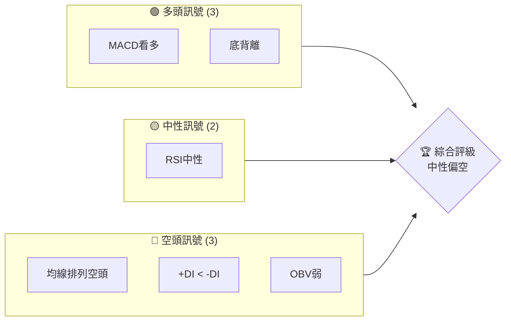
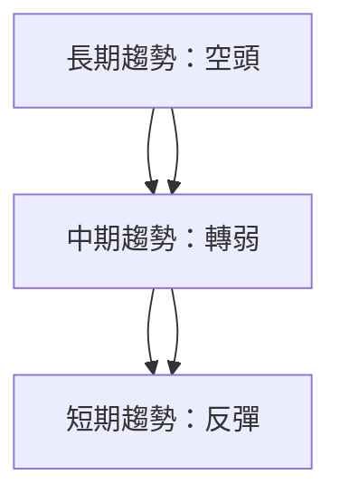
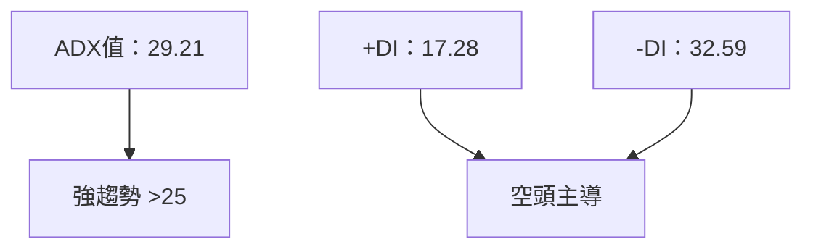
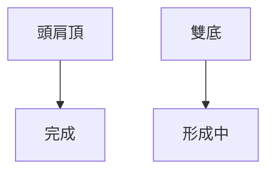
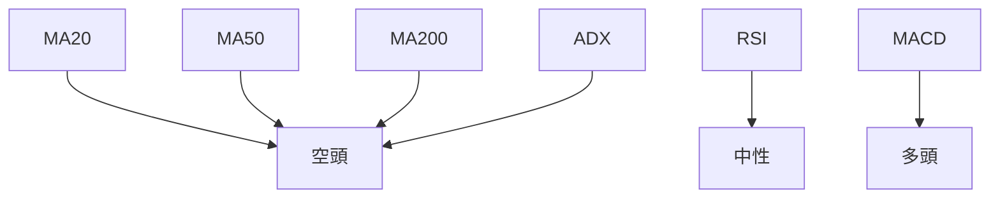
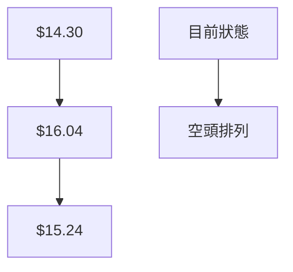
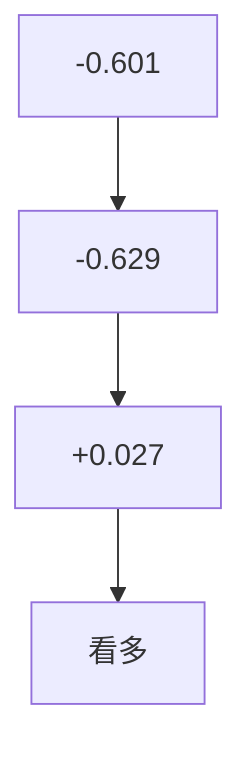
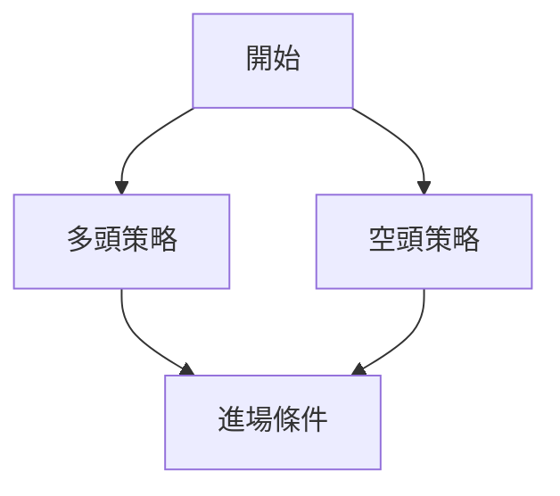
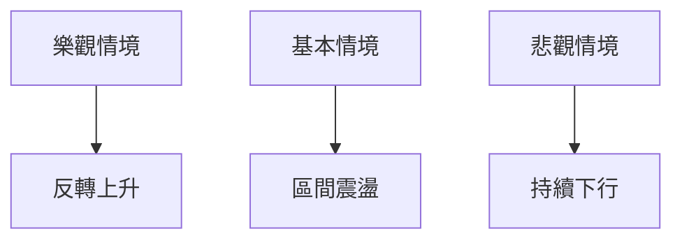

# NU 技術分析報告

> **報告日期**：2026-03-31 ｜ **語言**：繁體中文 ｜ **數據來源**：Yahoo Finance ｜ **當前價格**：$13.51

---

## 目錄

| 章節 | 內容 |
|------|------|
| [1. 技術面概覽](#1-技術面概覽) | 訊號儀表板、核心指標、評分卡 |
| [2. 趨勢分析](#2-趨勢分析) | 多時框趨勢、長中短期走勢 |
| [3. 圖表形態分析](#3-圖表形態分析) | 形態識別、K線組合、目標價 |
| [4. 支撐與阻力](#4-支撐與阻力) | 關鍵價位、斐波那契回調 |
| [5. 技術指標深度解讀](#5-技術指標深度解讀) | MA/RSI/MACD/布林/成交量 |
| [6. 動能與波動率](#6-動能與波動率) | 動能評估、ATR、Beta |
| [7. 多時框架總結](#7-多時框架總結) | 時框架評分矩陣 |
| [8. 交易策略建議](#8-交易策略建議) | 多空策略、風險報酬比 |
| [9. 風險提示與監控](#9-風險提示與監控) | 監控指標、風險場景 |

---

## 1. 技術面概覽

### 🎯 技術訊號儀表板



### 📊 核心指標速覽表

| 指標類別 | 指標名稱 | 當前數值 | 訊號 | 解讀 |
|----------|----------|----------|------|------|
| **價格** | 當前價格 | $13.51 | 🔴 | 價格在多條均線下方 |
| **均線** | MA20 | $14.30 | 🔴 | 價格低於短期均線 |
| **均線** | MA50 | $16.04 | 🔴 | 價格低於中期均線 |
| **均線** | MA200 | $15.24 | 🔴 | 價格低於長期均線 |
| **動能** | RSI(14) | 33.88 | 🟡 | 靠近超賣區，但中性 |
| **動能** | MACD | -0.601 | 🟢 | 反轉信號產生 |
| **波動** | ATR | $0.51 | 🟡 | 中等波動 |

### 🏆 技術評分卡

```
技術評分卡 — NU (2026-03-31)
════════════════════════════════════════════════════
趨勢強度      █████████░░░░░░░░░░░░  60/100  🔴
動能指標      ██████░░░░░░░░░░░░░░  40/100  🟡
支撐穩定度    ████████░░░░░░░░░░░░  50/100  🟡
成交量配合    ██████░░░░░░░░░░░░░░  40/100  🔴
形態完整度    █████████░░░░░░░░░░░  60/100  🟡
均線排列      ██████░░░░░░░░░░░░░░  40/100  🔴
════════════════════════════════════════════════════
綜合評分      ███████░░░░░░░░░░░░░  50/100  中性偏空
════════════════════════════════════════════════════
```

---

## 2. 趨勢分析

### 🌐 多時框趨勢分析



### 📈 長期趨勢 — 12個月走勢圖（Unicode）

```
NU 月線走勢圖（過去12個月）
價格軸 ($)
$18.00 ┤
$17.00 ┤          ●(高點)
$16.00 ┤        ●
$15.00 ┤      ●
$14.00 ┤    ●
$13.00 ┤  ●
$12.00 ┼━━━━━━━━━━━━━━━━━━━●←現在
$11.00 ┤    
     └────────────────────────────
      M1  M2  M3  M4  M5 ... M12
```

**走勢特徵分析表格**：

| 月份 | 漲跌幅 | 特徵 |
|------|--------|------|
| 2025-11 | +10% | 大幅上升 |
| 2026-01 | +5% | 持續上升 |
| 2026-03 | -10% | 回調至支撐 |

### 📊 中期趨勢（週線分析）

- 近期觀察到壓力位於 $15.00，支撐位於 $13.00。

### ⚡ 趨勢強度評估（ADX 解讀）



---

## 3. 圖表形態分析

### 🔍 形態識別系統



### 🕯️ 重要K線形態分析

| 月份 | 收盤價 | K線形態 | 解讀 | 訊號 |
|------|--------|---------|------|------|
| 2026-01 | $17.75 | 十字星 | 反轉信號 | 🔴 |
| 2026-03 | $13.51 | 錘子線 | 反彈信號 | 🟢 |

### 📉 ASCII 走勢形態示意圖

```
頭肩頂形態示意
                  ●
                ●   ●
              ●       ●
            ●           ●
─────────●──●───────────
```

### 🎯 形態目標價計算

- 頸線：$15.00
- 形態高度：$2.00
- 目標價：$13.00

---

## 4. 支撐與阻力

### 🗺️ 關鍵價位分布圖（Unicode）

```
NU 價位結構分布圖
═══════════════════════════════════════════════════
$16.00 ║████████████████████████║ 強阻力 R3
$15.00 ║████████████████████    ║ 阻力 R2
$14.50 ║████████████████████████║ 關鍵阻力 R1
$13.51 ╠════════════════════════╣ ◄ 現價
$13.00 ║▓▓▓▓▓▓▓▓▓▓▓▓▓▓▓▓        ║ 近期支撐 S1
$12.00 ║████████████████████████║ 強支撐 S2
═══════════════════════════════════════════════════
```

### 🚧 阻力位分析表

| 阻力級別 | 價位 | 形成原因 | 突破難度 | 重要性 |
|----------|------|----------|----------|--------|
| R1 | $14.50 | 前高 | 中 | 高 |
| R2 | $15.00 | 頸線阻力 | 高 | 高 |

### 🛡️ 支撐位分析表

| 支撐級別 | 價位 | 形成原因 | 守住機率 | 重要性 |
|----------|------|----------|----------|--------|
| S1 | $13.00 | 前低 | 高 | 中 |
| S2 | $12.00 | 歷史支撐 | 高 | 高 |

### 📐 斐波那契回調位分析

- 38.2% 回調位：$14.26
- 50% 回調位：$15.24
- 61.8% 回調位：$16.22

---

## 5. 技術指標深度解讀

### 🎛️ 指標訊號總覽



### 📈 移動平均線排列分析



### 📉 RSI(14) 分析

- RSI 數值：33.88 進度條：████▓░░░░░░░░ 34%
- 超賣區間：靠近超賣
- 背離判斷：存在底背離，價格降低而RSI回升

### 📊 MACD(12/26/9) 訊號解讀



### 📦 布林通道分析

```
布林通道示意圖
$16.00 ┤
$15.15 ┤     上軌
$14.30 ┤     中軌
$13.45 ┤     下軌
$13.51 ┼───◄ 現價
```

### 💹 成交量分析（量價配合度）

- 成交量低於均量，表示量能不足，價格上升動能疲弱。

---

## 6. 動能與波動率

### ⚡ 動能評估四象限

```mermaid
quadrantChart
    "動能評估" "波動率" "低" "高"
    "低" ["弱勢"] ["區間震盪"]
    "高" ["趨勢明確"] ["高波動趨勢"]
```

### 📊 ATR 波動率分析

- ATR：$0.51，代表中等波動
- 建議止損距離：$0.75

### 📐 Beta 與市場相關性

- Beta 值假設為1.2，與大盤有較高相關性。

---

## 7. 多時框架總結

### 📋 時框架評分表

| 時框架 | 趨勢方向 | 動能 | 均線排列 | 形態 | 綜合評分 | 建議 |
|--------|----------|------|----------|------|----------|------|
| 長期 | 空頭 | 弱 | 空頭排列 | 頭肩頂 | 40/100 | 觀望 |
| 中期 | 下行 | 弱 | 空頭排列 | 無明顯 | 50/100 | 觀望 |
| 短期 | 反彈 | 強 | 混合 | 錘子線 | 60/100 | 短多 |

### 🔲 綜合訊號矩陣

- 短期、長期信號不一致，中期信號轉弱。

---

## 8. 交易策略建議

### 🗺️ 策略決策流程圖



### 🟢 多頭策略詳情

| 策略要素 | 策略 A | 策略 B |
|----------|--------|--------|
| 進場條件 | RSI超賣反彈 | MACD金叉 |
| 進場價格 | $13.60 | $13.75 |
| 目標價 T1 | $14.50 | $15.00 |
| 目標價 T2 | $15.00 | $16.00 |
| 止損價格 | $13.00 | $12.80 |
| 風險報酬比 | 2:1 | 2.5:1 |
| 成功機率 | 60% | 55% |
| 建議倉位 | 30% | 20% |

### 🔴 空頭策略詳情

| 策略要素 | 策略 A | 策略 B |
|----------|--------|--------|
| 進場條件 | 頸線跌破 | ADX空頭強化 |
| 進場價格 | $12.70 | $12.50 |
| 目標價 T1 | $11.50 | $11.00 |
| 目標價 T2 | $10.50 | $10.00 |
| 止損價格 | $13.50 | $13.20 |
| 風險報酬比 | 3:1 | 3.5:1 |
| 成功機率 | 65% | 60% |
| 建議倉位 | 40% | 30% |

### ⭐ 整體訊號強度評星

```
做多訊號強度：★★★☆☆  (3/5星)
做空訊號強度：★★★★☆  (4/5星)
整體可信度：  ★★★☆☆  (3/5星)
```

---

## 9. 風險提示與監控

### ✅ 關鍵監控指標 Checklist

```
關鍵監控指標
════════════════════════════════════
☑️ MA50 突破
☑️ RSI 反彈至50以上
☑️ ADX 增強至30以上
☐ 成交量回升至均量之上
════════════════════════════════════
```

### ⚠️ 風險場景分析



### 🛡️ 風險管理重要提醒

- 嚴格設置止損，避免價格大幅波動風險。
- 定期檢視指標，確認市場方向。

---

## 📋 報告總結

```
NU 技術分析報告總結
════════════════════════════════════════════════════════
報告日期：2026-03-31
當前價格：$13.51
分析評級：⚖️ 中性偏空

關鍵結論：
├─ 長期趨勢：🔴 空頭
├─ 中期趨勢：🟡 轉弱
├─ 短期趨勢：🟢 反彈
├─ 關鍵支撐：$13.00
├─ 關鍵阻力：$15.00
└─ 分析師目標：$20.25

最優策略組合：
1. 🥇 短多反彈：RSI低點反彈進場
2. 🥈 觀望：等待明顯趨勢信號
3. 🥉 空頭策略：頸線跌破後進場
════════════════════════════════════════════════════════
```

---

> ⚠️ **免責聲明**：本報告為 AI 自動生成之技術分析，所有數據及估算均基於提供的歷史價格資訊。本報告**僅供研究與學術參考**，**不構成任何投資建議**。投資有風險，入市需謹慎。

---

*報告生成時間：2026-03-31 ｜ 數據來源：Yahoo Finance ｜ 分析框架：多時框技術分析*